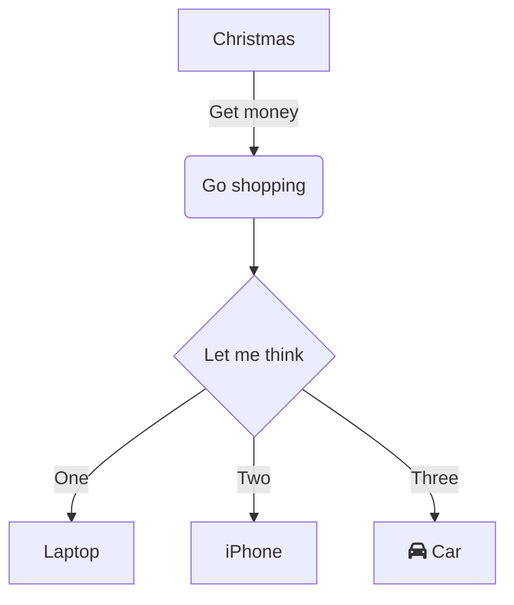
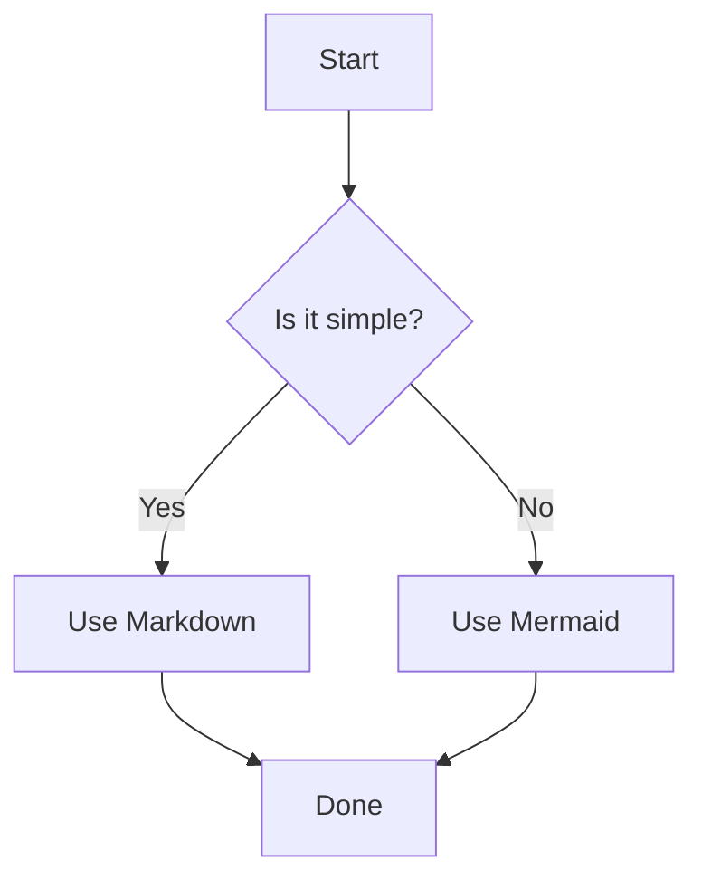

---
tags:
  - Guide
  - Obsidian
  - Syntax
  - Format
Topic: Formatting & Syntax in Obsidian
Created: 02-11-2025
---
>[!abstract]- What is Obsidian & Markdown? 
>**Markdown** is a lightweight markup language that allows you to format plain text using simple syntax (like `#` for headers and `*` for italics). 
>**Obsidian** is a powerful note-taking application that uses Markdown as its foundation. It's not just a place to store notes; it's a **personal knowledge base** that excels at creating connections between ideas. Instead of organizing files in rigid folders, you link your notes together to build a **web of knowledge**, making your information more discoverable and valuable.

- - -
# Table of Contents
- [[#Headings|Headings]]
- [[#Heading 1 (H1)|Heading 1 (H1)]]
- [[#Styling - Text Formatting|Styling - Text Formatting]]
- [[#Links|Links]]
- [[#Images|Images]]
- [[#Lists|Lists]]
- [[#Blockquotes|Blockquotes]]
- [[#Code|Code]]
- [[#Callouts|Callouts]]
- [[#Diagrams (mermaid.js)|Diagrams (mermaid.js)]]
- [[#Dataview|Dataview]]
- [[#Footnotes|Footnotes]]
- [[#Frontmatter|Frontmatter]]
- [[#Comments|Comments]]
- [[#Best Practices & Tips|Best Practices & Tips]]

# Headings
> Used to structure your document with different levels of hierarchy.

```
# Heading 1 (H1)
## Heading 2 (H2)
### Heading 3 (H3)
#### Heading 4 (H4)
##### Heading 5 (H5)
###### Heading 6 (H6)
```
# Heading 1 (H1)
## Heading 2 (H2)
### Heading 3 (H3)
#### Heading 4 (H4)
##### Heading 5 (H5)
###### Heading 6 (H6)
# Styling - Text Formatting
> Emphasize your text with bold, italics, or strikethrough.

```
*This is italic text*   or _This is also italic_
**This is bold text**   or __This is also bold_
***This is bold and italic***
~~This was a mistake~~
```

*This is italic text*   or _This is also italic_
**This is bold text**   or __This is also bold_
***This is bold and italic***
~~This was a mistake~~

# Links
> Create links to external websites.

```
[Obsidian's Website](https://obsidian.md)
```

[Obsidian's Website](https://obsidian.md)
# Images
> Embed images from your vault or the web. The best practice is to store images locally inside your vault.

```


```


# Lists
> Create ordered and unordered lists. You can also nest them.

```
- Unordered item 1
- Unordered item 2
  - Nested unordered item
  - Another nested item

1. Ordered item 1
2. Ordered item 2
   3. Nested ordered item
   4. Another nested item
```

- Unordered item 1
- Unordered item 2
  - Nested unordered item
  - Another nested item

1. Ordered item 1
2. Ordered item 2
   3. Nested ordered item
   4. Another nested item
# Blockquotes
> Used for quoting text or highlighting a section.

```
> This is a blockquote.
> It can span multiple lines.
>
> > It can even be nested.
```

> This is a blockquote.
> It can span multiple lines.
>
> > It can even be nested.
# Code
> Display inline code or create a fenced code block with syntax highlighting for the given language.

```
`This code is inline`

```javascript
// This is a fenced code block with syntax highlighting.
function greet(name) {
  console.log(`Hello, ${name}!`);
}
greet("World");```
```

`This code is inline`

Use `printf()` in JS to print output.
```javascript
// This is a fenced code block with syntax highlighting for JavaScript.
function greet(name) {
  console.log(`Hello, ${name}!`);
}
greet("World");```
# Horizontal Rules
> Create a thematic break or separator.

```
--- or - - -
```

---
# Tables
> Create structured tables.

```
| Column 1 | Column 2 | Column 3 |
|----------|----------|----------|
| Row 1    | Data     | More     |
| Row 2    | Data     | More     |
```

| Column 1 | Column 2 | Column 3 |
|----------|----------|----------|
| Row 1    | Data     | More     |
| Row 2    | Data     | More     |
# Task Lists
> Create interactive checklists.

```
- [x] Finish the report
- [ ] Start the next project
- [ ] Learn more about Obsidian
```

- [x] Finish the report
- [ ] Start the next project
- [ ] Learn more about Obsidian

# Wikilinks
> Create links between your notes.

```
- Link to a note:** `[[My Note]]`
- Link with an alias (display text):** `[[My Note|This is the text that will be displayed]]`
- Link to a heading within a note:** `[[My Note#My Heading]]`
- Link to a specific block (paragraph):**
    1. Put your cursor on the block you want to link to and press `^Cmd` (Mac) or `^Ctrl` (Win) to get its block ID.
    2. Use the ID like this: `[[My Note#^block-id]]`
```

- **Link to a note:** `[[My Note]]`
- **Link with an alias (display text):** `[[My Note|This is the text that will be displayed]]`
- **Link to a heading within a note:** `[[My Note#My Heading]]`
- **Link to a specific block (paragraph):**
    1. Put your cursor on the block you want to link to and press `^Cmd` (Mac) or `^Ctrl` (Win) to get its block ID.
    2. Use the ID like this: `[[My Note#^block-id]]`
# Embeds
> Embed the content of another note, image, PDF, or audio file directly into the current note. Just add a `!` in front of a Wikilink or standard link.

```
![[My Note]] // Embeds the entire content of "My Note"
![[My Note#My Heading]] // Embeds only the "My Heading" section
![[path/to/image.png]]
```

![[My Note]] // Embeds the entire content of "My Note"
![[My Note#My Heading]] // Embeds only the "My Heading" section
![[path/to/image.png]]
## Audio and Video Embeds
> You can embed and control audio/video files directly in your notes.

```
![[path/to/my-audio-file.mp3]]
![[path/to/my-video-file.mp4]]
```

![[path/to/my-audio-file.mp3]]
![[path/to/my-video-file.mp4]]
## PDF Embeds and Annotations
> You can embed a PDF and even link directly to a specific page or a highlight you made within Obsidian's PDF viewer.

```
![[My Research Paper.pdf#page=5]]
![[My Research Paper.pdf#annotation=highlight-id]]
```

![[My Research Paper.pdf#page=5]]
![[My Research Paper.pdf#annotation=highlight-id]]

# Tags
> Add metadata to your notes for easy organization and searching.

```
#project/obsidian-guide
#status/in-progress
#topic/computing
Tags can also be multi-word like `#"long tag name"`. You can search for all notes with a specific tag using the tag pane or a search query.
# Callouts
> Visually distinct, collapsible blocks for alerts, summaries, and more.

> [!note] This is a note
> This is some information that is important but not critical.

> [!warning] Be Careful!
> This is a warning message.

> [!tip] Pro-Tip
> You can make callouts collapsible by adding a `+` or `-` right after the type.
> > [!faq]- Are they collapsible?
> > Yes! Click the header to toggle this one.

> [!abstract] Summary
> This is a summary of a longer concept.
```

> [!note] This is a note
> This is some information that is important but not critical.

> [!warning] Be Careful!
> This is a warning message.

> [!tip] Pro-Tip
> You can make callouts collapsible by adding a `+` or `-` right after the type.
> > [!faq]- Are they collapsible?
> > Yes! Click the header to toggle this one.

| Syntax          | Rendered Title | Common Use Case                                                      |
| :-------------- | :------------- | :------------------------------------------------------------------- |
| `> [!abstract]` | Abstract       | For summaries or overviews of a longer document.                     |
| `> [!summary]`  | Summary        | Similar to abstract, for a concise summary.                          |
| `> [!info]`     | Info           | For general information, neutral facts, or references.               |
| `> [!todo]`     | Todo           | For to-do lists or tasks that need to be completed.                  |
| `> [!tip]`      | Tip            | For helpful hints, advice, or best practices.                        |
| `> [!success]`  | Success        | To indicate a successful operation or a positive outcome.            |
| `> [!question]` | Question       | To pose a question, prompt for thought, or ask for help.             |
| `> [!warning]`  | Warning        | To alert the user to something important or potentially problematic. |
| `> [!failure]`  | Failure        | To indicate that something went wrong or an error occurred.          |
| `> [!danger]`   | Danger         | For critical warnings, security risks, or data loss potential.       |
| `> [!bug]`      | Bug            | To document or report a software bug.                                |
| `> [!example]`  | Example        | To provide a concrete example that illustrates a concept.            |
## Preview
>[!abstract]

>[!summary]

>[!tip]

> [!important]

>[!info]

>[!todo]

> [!note]

>[!success]

>[!question]

>[!warning]

>[!failure]

>[!danger]

>[!bug]

>[!example]
# Highlighting
> Mark text for emphasis, similar to using a highlighter pen.

```
This is ==very important== text.
```

This is ==very important== text.

---
# Advanced Features (Often via Plugins)
> These features often require built-in or community plugins to be enabled.
# Math (LaTex)
> Write beautiful mathematical equations. ==This is a core feature, not a plugin.

[[LaTex - Formatting and Syntax]]

```
Inline math: The Pythagorean theorem is $a^2 + b^2 = c^2$.

Block math:
 $$ \int_{-\infty}^{\infty} e^{-x^2} dx = \sqrt{\pi}
 $$ ```

**Result:**
Inline math: The Pythagorean theorem is $a^2 + b^2 = c^2$.

Block math:
 $$ \int_{-\infty}^{\infty} e^{-x^2} dx = \sqrt{\pi}
 $$ 


Inline math: The Pythagorean theorem is $a^2 + b^2 = c^2$.

Block math:
 $$ \int_{-\infty}^{\infty} e^{-x^2} dx = \sqrt{\pi}
 $$


# Diagrams (mermaid.js)
> Create complex diagrams and flowcharts using text. ==This is a core feature.


```mermaid
flowchart TD
	A[Christmas] -->|Get money| B(Go shopping)
	B --> C{Let me think}
	C -->|One| D[Laptop]
	C -->|Two| E[iPhone]
	C -->|Three| F[fa:fa-car Car]```

```mermaid
graph TD
    A[Start] --> B{Is it simple?};
    B -->|Yes| C[Use Markdown];
    B -->|No| D[Use Mermaid];
    C --> E[Done];
    D --> E;```
```



# Dataview
> The most powerful plugin. Query your vault and create dynamic tables, lists, and more that automatically update.

> [!warning] 
> _Requires the Dataview plugin_

```
```dataview
TABLE
  file.mtime as "Modified",
  status as "Status"
FROM #project
WHERE status = "in-progress"
SORT file.mtime desc
```
```
This would create a table of all notes tagged with `#project` that also have a `status` field set to `in-progress`, sorted by the last modified time.
```

```dataview
TABLE
  file.mtime as "Modified",
  status as "Status"
FROM #project
WHERE status = "in-progress"
SORT file.mtime desc
```
# Footnotes
> Great for academic or long-form writing.
```
```markdown
Here is some text with a footnote.[^1]

[^1]: This is the content of the footnote.
```

```markdown
Here is some text with a footnote.[^1]

[^1]: This is the content of the footnote.
```
# Frontmatter
> [!note]
> **This isn't visible formatting in the same way, but it's a crucial part of a note's structure. It's a YAML block at the top of a file used to store metadata.**

```
```yaml
## title: A Comprehensive Guide to Obsidian 
## author: AI 
## created: 2023-10-27 
## tags: - guide - obsidian - markdown 
## status: in-progress```
```

```yaml 
## title: A Comprehensive Guide to Obsidian 
## author: AI 
## created: 2023-10-27 
## tags: - guide - obsidian - markdown 
## status: in-progress
```
# Comments
> You can add HTML-style comments to your notes that will be hidden in both reading and editing views.

```
<!-- This is a comment that won't be rendered -->
```

<!-- This is a comment that won't be rendered -->
# Best Practices & Tips
1. **Use Live Preview:** Obsidian's Live Preview editor shows you the rendered Markdown as you type, which is the best way to learn.
2. **Learn Keyboard Shortcuts:** Press `Cmd/Ctrl + E` to toggle between Edit and Live Preview. Learn shortcuts for bold, italic, etc., to speed up your workflow.
3. **Use the Command Palette:** Press `Cmd/Ctrl + P` and search for commands like "Insert callout" or "Toggle checkbox" if you forget the syntax.
4. **Don't Overdo It:** Just because you _can_ use a callout for everything doesn't mean you should. Use formatting to enhance clarity, not clutter your notes.
5. **Explore Community Plugins:** The real power of Obsidian lies in its community plugins. Check out the community plugins browser for tools that can enhance your workflow.