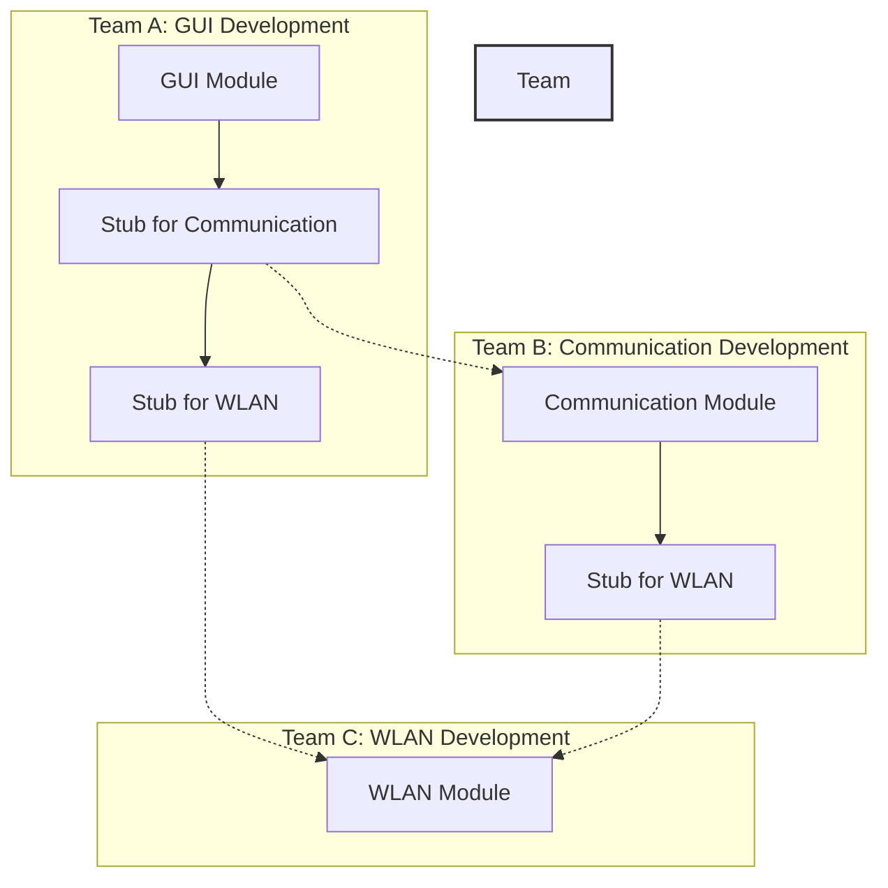

---
tags:
  - "#AgS"
  - "#CCT2"
Topic: Systemudviklingsprocesser
Semester: CCT2
Course: Agil systemudvikling
Litterature: SSU kompendie
Created: 02-02-2026
---
- - -
  - [[#System-Oriented Project Management and Development|System-Oriented Project Management and Development]]
	- [[#System-Oriented Project Management and Development#Introduction|Introduction]]
	- [[#System-Oriented Project Management and Development#1.1 Why Structural Engineering?|1.1 Why Structural Engineering?]]
	- [[#System-Oriented Project Management and Development#1.2 Dimensions in System Development|1.2 Dimensions in System Development]]
		- [[#1.2 Dimensions in System Development#1.2.1 Why Are We Engineering Things?|1.2.1 Why Are We Engineering Things?]]
		- [[#1.2 Dimensions in System Development#1.2.2 What Are We Engineering?|1.2.2 What Are We Engineering?]]
		- [[#1.2 Dimensions in System Development#1.2.3 Who Are We Engineering Things For?|1.2.3 Who Are We Engineering Things For?]]
	- [[#System-Oriented Project Management and Development#1.3 Influences to the Development Process|1.3 Influences to the Development Process]]
		- [[#1.3 Influences to the Development Process#1.3.1 Surroundings|1.3.1 Surroundings]]
		- [[#1.3 Influences to the Development Process#1.3.2 Systemic Issues|1.3.2 Systemic Issues]]
		- [[#1.3 Influences to the Development Process#1.3.3 Working Context|1.3.3 Working Context]]
	- [[#System-Oriented Project Management and Development#1.4 The Trouble with Many Actors|1.4 The Trouble with Many Actors]]
	- [[#System-Oriented Project Management and Development#1.5 Differences Between Structured and Unstructured Approaches|1.5 Differences Between Structured and Unstructured Approaches]]
		- [[#1.5 Differences Between Structured and Unstructured Approaches#1.5.1 Time Management|1.5.1 Time Management]]
		- [[#1.5 Differences Between Structured and Unstructured Approaches#1.5.2 Maintenance|1.5.2 Maintenance]]
- [[#Project and Time Plans|Project and Time Plans]]
	- [[#Project and Time Plans#2.1 The Different Phases in Product Development|2.1 The Different Phases in Product Development]]
		- [[#2.1 The Different Phases in Product Development#2.1.1 Overall Theoretical Process Versus the Reality|2.1.1 Overall Theoretical Process Versus the Reality]]
		- [[#2.1 The Different Phases in Product Development#2.1.2 Iterative Development Processes|2.1.2 Iterative Development Processes]]
		- [[#2.1 The Different Phases in Product Development#2.1.3 The U-Model|2.1.3 The U-Model]]
	- [[#Project and Time Plans#2.2 Structural Programming Development Model|2.2 Structural Programming Development Model]]
		- [[#2.2 Structural Programming Development Model#2.2.1 Requirement Specifications|2.2.1 Requirement Specifications]]
		- [[#2.2 Structural Programming Development Model#2.2.2 System Design|2.2.2 System Design]]
		- [[#2.2 Structural Programming Development Model#2.2.3 Module Design|2.2.3 Module Design]]
		- [[#2.2 Structural Programming Development Model#2.2.4 Component Design|2.2.4 Component Design]]
		- [[#2.2 Structural Programming Development Model#2.2.5 Component Implementation|2.2.5 Component Implementation]]
		- [[#2.2 Structural Programming Development Model#2.2.6 Component Tests|2.2.6 Component Tests]]
		- [[#2.2 Structural Programming Development Model#2.2.7 Module Integration|2.2.7 Module Integration]]
		- [[#2.2 Structural Programming Development Model#2.2.8 System Integration|2.2.8 System Integration]]
		- [[#2.2 Structural Programming Development Model#2.2.9 Acceptance Test|2.2.9 Acceptance Test]]
	- [[#Project and Time Plans#2.3 The V-Model|2.3 The V-Model]]
	- [[#Project and Time Plans#2.4 Parallel Product Development|2.4 Parallel Product Development]]
		- [[#2.4 Parallel Product Development#2.4.1 Example Case: Mobile Robot Development|2.4.1 Example Case: Mobile Robot Development]]
		- [[#2.4 Parallel Product Development#2.4.2 Concurrent Software Development|2.4.2 Concurrent Software Development]]
		- [[#2.4 Parallel Product Development#2.4.3 Concurrent Hardware Development|2.4.3 Concurrent Hardware Development]]
		- [[#2.4 Parallel Product Development#2.4.4 Concurrent Software AND Hardware Development|2.4.4 Concurrent Software AND Hardware Development]]
	- [[#Project and Time Plans#2.5 Time Planning|2.5 Time Planning]]
		- [[#2.5 Time Planning#2.5.1 The W-Model|2.5.1 The W-Model]]
		- [[#2.5 Time Planning#2.5.2 The (in)famous Plan B|2.5.2 The (in)famous Plan B]]
	- [[#Project and Time Plans#2.6 Gantt Charts|2.6 Gantt Charts]]
		- [[#2.6 Gantt Charts#Development Models Comparison|Development Models Comparison]]
		- [[#2.6 Gantt Charts#Parallel Development Flow|Parallel Development Flow]]

# System-Oriented Project Management and Development

| Concept | Description |
|---|---|
| **System-Oriented Projects** | Projects that involve multiple components, actors, and complex interactions that must work together as a unified whole |
| **Poka-Yoke** | Japanese concept for designing products to be fail-safe, making it impossible to put things together incorrectly |
| **Waterfall Model** | Sequential development process with fixed phases that don't allow for returning to previous steps |
| **Iterative Development** | Development process that allows going back steps as knowledge increases, while keeping loops as small as possible |
| **U-Model** | Iterative development process that wraps waterfall elements in a 'U' shape, connecting requirements to acceptance tests |
| **V-Model** | Development model illustrating the relationship between development phases and testing phases |
| **W-Model** | Model describing the relation between time and delivery points (milestones) for synchronization |
| **Module** | Self-contained segment of a system designed to perform a particular task while hiding implementation details |
| **Component** | Self-contained segment of a module designed to perform a particular task while hiding implementation details |
| **Interface** | Shared boundary between two modules or components that need to interact |
| **Stub** | Simplified version of a module that accepts input and outputs something without full functionality |
| **Gantt Chart** | Graphical view of the development process that shows activities, their durations, and dependencies over time |

## Introduction

> [!info] **Why System-Oriented Projects Fail**
> 
> Many system-oriented projects fail, take longer than planned, or exceed their allocated budget. This happens due to common issues that haven't been properly addressed during development.

As engineers, it's important to avoid developing work habits that lead to project failures. Engineering is not a static process, and one of the most important skills for engineers is learning from mistakes and reflecting on what went wrong to avoid repeating them.

> [!abstract] **Niels Bohr's Insight**
> 
> Niels Bohr stated: "It is hard to predict, and in particular about the future." This applies to engineers who are expected to know in advance what problems lie ahead, how much time to allocate, and how much money projects will cost.

> [!warning] **The Challenge of Prediction**
> 
> Engineers cannot predict all problems ahead of them, which makes planning for time and economy difficult. This is especially challenging for newly educated engineers lacking experience from previous projects.

If we cannot predict problems, we also cannot plan ahead effectively in terms of time and economy. In today's competitive world, this is problematic as competitors may complete similar projects faster and better.

> [!info] **Critical Skills for Engineers**
> 
> It is critical to train and gain knowledge of the soft skills an engineer must possess—not just technical skills, but those related to planning and executing complete product development processes.

The purpose of this book is to collect useful theoretical methodologies for a structural approach to engineering and link them to real-world examples that illustrate pitfalls that seem invisible during planning but may have huge impacts on the overall product development process.

> [!tip] **Practical Engineering**
> 
> Engineering is viewed as a practical thing, but theories are needed to reflect on what has been done so we can become better engineers by improving our ability to predict problems ahead of us.

## 1.1 Why Structural Engineering?

> [!example] **IC4 Train Project Failure**
> 
> In December 2000, the Danish railway company DSB signed a contract for 83 new trains to replace aging IC3 trains. The trains were supposed to be on Danish tracks by 2006, but by 2014, they were only partially in use on some local areas outside rush hours.
> 
> Key issues:
> - The trains ordered were not standard and required development from scratch
> - Production began in 2001, but the first train arrived in 2003 with technical issues and overweight problems
> - The earliest delivery to DSB happened in 2007, and the last train was delivered in 2013
> - The first serial produced trains had up to 1800 errors to be fixed before deployment
> - Some trains delivered in 2011-2012 were prototypes that had to be rebuilt

> [!example] **PolSag System Failure**
> 
> The Danish police system PolSag was developed to replace a previous system that didn't allow interactions between police districts. Decided in 2007, it was abandoned in 2012 after spending half a billion Danish kroner. The police had to return to their outdated system.
> 
> Critical issues:
> - The system required at least 100,000 SQL requests per second
> - 18% of all source code was extremely difficult to debug, test, and maintain
> - 50% of source code was located in only 18% of all methods, indicating poor structure
> - The source code contained extremely little or no comments
> - The architecture complexity was beyond comprehension, involving multiple systems and platforms

> [!example] **Rejsekort System Issues**
> 
> Rejsekortet is a national travel system for Denmark. Initial ideas date back to the 1990s, but the system was decided upon in 2005. A pilot project was established in 2007, and between 2009-2014, the system took over existing ticketing approaches.
> 
> Critical system issues:
> - No possibility for a "second chance" when users forget to check out
> - Need for an app to handle forgotten check-outs
> - Difficult procedures for changing credit card information
> - Complicated procedures for changing customer types

> [!summary] **Lessons from Failures**
> 
> The most important lesson from these failures is that we can learn from these examples. The systems required may not need to be very complicated, but because multiple companies, politicians, end users, and other actors are involved, the end design often ends up being very complicated.

## 1.2 Dimensions in System Development

> [!info] **Beyond Technical Design**
> 
> As engineers, we need to worry not only about technical design and solutions. We need to understand why, what, and who we are engineering for. We need to know about the system as it is now and what it shall become.

### 1.2.1 Why Are We Engineering Things?

> [!example] **Self-Employed vs. Company-Employed Engineers**
> 
> _Self-employed scenario_: You have your own company or work in a very small company developing mobile apps. You develop a distributed file sharing system with many configurable parameters that you think is great, but will your end users find it easy to use?
> 
> _Company-employed scenario_: You're an engineer in a larger company designing electronic components for satellites. You're tasked with leading the design of a power converter for a pico satellite with a $200\text{g}$ weight limit. You find that adding $20\text{g}$ could double efficiency, but this would require the payload team to decrease their weight by $20\text{g}$.

> [!warning] **Understanding the "Why"**
> 
> It's critical for engineers to understand WHY we are doing our job, why we have certain needs and requirements. If we don't understand why we design a solution, we have a higher risk of making poor decisions during the design process.

### 1.2.2 What Are We Engineering?
When defining "what" we are engineering, several common pitfalls can undermine the project from the start. These issues highlight the importance of clarity and precision in the early stages.

> [!nfo] **Common Issues in System Development**
> 
>
> - _Product or use of product is not clear_: If a product hasn't been clearly specified, design and implementation decisions may not match the expected outcome.
> 
> - _Interfaces are vague and not clearly described_: If interfaces between components aren't clearly understood and defined, it becomes difficult to have components cooperate. A Mars space probe was lost because one component measured distance in meters while another used yards.
> 
> - _Requirements are not well understood and are vague_: If requirements are vague, it becomes hard to engineer solutions that fulfill them. For example, "the system should perform as best as possible" leads to questions about what performance metric we're considering and what "best as possible" means.

### 1.2.3 Who Are We Engineering Things For?
Although we do not always have a clear market for our inventions or new product, it is critical that we have a clear idea for what purpose and who we engineer for. Many projects (partially) fails while not taking into account the end customers (we shall see later how we eciently can do that).

> [!example] **Rejsekort Credit Card Change Procedure**
> 
> The Rejsekort system allows automatic credit refills on travel cards. However, changing credit card information required a complex $6$-step procedure taking up to $17$ days to complete, including physical visits to stations for check-ins and check-outs. This procedure was designed without considering the end user's perspective.

> [!example] **Dangerous Design for Engineers**
> 
> A student was working on a satellite body with a PC104 mini computer system. The PCB layout was roughly symmetric with identical $12\text{V}$ input and $5\text{V}$ output DC plugs. When a tired student turned the board around $180^\circ$ and plugged the $12\text{V}$ input into the $5\text{V}$ bus, smoke came out of the chips, requiring a new board at significant cost and time.
> ![[Pasted image 20260202201816.png]]
>
>_Figure 1.2.3.1: A PCB layout with symmetric power connectors that can be easily confused, leading to potential damage._

> [!info] **Poka-Yoke Principle**
> 
> The Japanese concept of 'Poka-Yoke' (developed by Shigeo Shingo as part of the Toyota Production System) focuses on designing products to avoid such pitfalls. Components should be fail-safe for humans to combine, making it impossible to put things together incorrectly.

> [!example] **Software Performance Bug**
> 
> A seemingly harmless piece of code actually put highly reliable servers down:
> 
> ```
> Data: list of data to be ordered, int maxsize
> while list.size()>maxsize do
>     FreeNode(list.back());
>     list.popback();
> end
> ```
> 
> The issue was that `list.size()` was an $O(n)$ operation (taking $n$ steps to execute for input size $n$), but the while loop would also execute $n$ times, resulting in $O(n^2)$ total steps. For a list of $1000$ elements, the coder expected $1000$ operations but got $1,000,000$ operations.

## 1.3 Influences to the Development Process

The context we work in is important, including time allocated for tasks, platforms used for development, workspace, and other factors that influence our work as engineers.

### 1.3.1 Surroundings

> [!example] **Hierarchical Culture Impact**
> 
> A former student colleague worked in a company that outsourced code development to India. When they needed to contact a senior developer about an issue, they couldn't directly approach them due to hierarchical culture. Instead, they had to exchange several emails with higher-level bosses to get questions directed to the senior developer. What could have taken $10$ minutes took several months.

### 1.3.2 Systemic Issues

> [!example] **Platform Change Impact**
> 
> The mobile operating system Symbian was developed by Psion in the 1980s and later used by Nokia, Ericsson, and Motorola as a main platform for mobile phones. In 2010, Nokia announced a partnership with Microsoft and shifted from Symbian to Windows mobile. This change led to loss of huge investments in development, not only for Nokia but also for smaller companies that had invested in application development for Symbian.

### 1.3.3 Working Context

The context of work, such as time given to complete tasks, is critical for the quality of work outcomes. A common mistake is that financial managers often underestimate the time engineers need to develop new products, leading to poor quality products on the market.

## 1.4 The Trouble with Many Actors

Developing products and services today is complex, with many elements from practical to business and sales issues needing attention. The complexity is illustrated by the famous "swing" analogy from the early 1970s, where different people involved in developing a swing have completely different perceptions of what should be built.

> [!abstract] **Swing Analogy**
> 
> In this analogy, project sponsors perceive the product as a simple swing with three elements, but as the product moves through design and implementation, it becomes increasingly different from the initial concept. The end user receives something far from what was designed and actually needed.
> ![[Pasted image 20260202201851.png]]
>
>_Figure 1.4.1: The swing analogy showing how different stakeholders have different perceptions of what should be built._

> [!info] **Different Perspectives**
> 
> Each person involved in the development process has their own background and history that shapes their view of the product. Engineers need to be aware of this since they are responsible for implementing concepts and ideas into concrete products.

## 1.5 Differences Between Structured and Unstructured Approaches

Being structured in development approaches generally relates to having reflected plans and approaches to obtain certain objectives, both short and long term.

### 1.5.1 Time Management

A common challenge is managing multiple activities simultaneously. Students must balance courses, projects, and social life. Professionals must handle multiple projects or professional activities. With only $24$ hours per day, time is the only resource we don't get more of, regardless of how much money we earn.

### 1.5.2 Maintenance

Products have a long life after development that needs to be considered. Who will maintain the code repository when updates are needed? Who will ensure the product uses the newest technology available? How are end customers supported when they encounter problems with the product?

---

# Project and Time Plans

Planning is essential to avoid ending up with unknown work burden, hectic work hours toward deadlines, stress, and other issues. We often don't have full control over our time due to fixed appointments, courses, non-project related tasks, and private life. This chapter examines project development, its phases, and how to plan projects effectively.

## 2.1 The Different Phases in Product Development

### 2.1.1 Overall Theoretical Process Versus the Reality

At project start, there are many unknowns that can influence the development process. These are clarified during development, but since we have deadlines (exams, customers, launch times), we face a problem because we don't know exactly what problems we'll encounter or how much time we'll need.

> [!info] **Errors Over Time**
> 
> From the software world, the number of errors typically follows a pattern over the product's lifetime:
> - Early life until first release: Missing functionality or initial coding errors cause errors, with focus on reducing errors via debugging and testing
> - After release: Code executed in different environments reveals new errors that are fixed until the next release
> - Each iteration ideally has fewer errors reported
>   
>   ![[Pasted image 20260202201923.png]]
>
>_Figure 2.1.1.1: Typical error pattern over a product's lifetime, showing decreasing errors with each iteration._

> [!example] **Ariane 5 Rocket Failure**
> 
> On June 4, 1996, the maiden flight of the Ariane 5 launcher ended in failure after about $40$ seconds. The launcher veered off its flight path, broke up, and exploded at an altitude of about $3700\text{ m}$.
> 
> The failure was caused by the complete loss of guidance and attitude information due to specification and design errors in the software of the inertial reference system. The software exception was caused during execution of a data conversion from $64$-bit floating point to $16$-bit signed integer value. The floating point number being converted had a value greater than what could be represented by a $16$-bit signed integer.

### 2.1.2 Iterative Development Processes

When starting a project, many things are not completely clear. As we progress through development, we become aware of more issues that need to be addressed. The knowledge we gain helps us make decisions that may alter the project's direction and end product.

> [!info] **Waterfall Model**
> 
> In the 1970s, the sequential development process called the Waterfall model was popular. It divides project development into fixed periods:
> 1. Requirement specification
> 2. Design
> 3. Construction/Implementation
> 4. Integration
> 5. Testing and error correction
> 6. Installation
> 7. Maintenance
> 
> Once a phase was finished, specifications were frozen and no further changes were allowed.

> [!info] **Iterative Development**
> 
> In iterative development processes, we allow going back steps as we increase our knowledge and experience with the project. However, we should keep loop steps as small as possible at any time.

### 2.1.3 The U-Model

> [!info] **U-Model Components**
> 
> The U-model is an iterative development process that wraps waterfall elements in a 'U' consisting of:
> - Requirements (left part of the 'U')
> - Use case models (lower part of the 'U')
> - Acceptance test (right part of the 'U')
> 
> The steps are:
> - _Analysis_: Understanding the problem the product addresses. We ask WHY?
> - _Requirement specification_: Laying foundation for how the system shall behave and look. We ask WHAT?
> - _Architecture design_: Designing overall high-level architecture to frame technical work. We ask HOW?
> - _Implementation_: Implementing designed components according to specifications. We focus on DO IT!
> - _System integration_: Integrating modules and components to work as a final system
> - _Acceptance tests_: Testing the complete system against requirements. We ask DID WE DO IT?
>
>![[Pasted image 20260202201950.png]]
>_Figure 2.1.3.1: The U-Model showing the relationship between development phases and testing._

> [!info] **Requirement Specifications**
> 
> During the analysis phase, requirements are expressed so that functionality, performance metrics, etc., can be tested at the acceptance test phase. An important aspect is clarifying what constitutes a system, ensuring all involved actors work under the same assumptions.

> [!info] **Use Case Model**
> 
> Use case models analyzed during the analysis phase are actively used in project development to steer the project efficiently. Use cases describe the desired end functionality, and any decisions during development relate back to the use case.

> [!info] **Acceptance Test**
> 
> Once the product is ready, extensive testing is required to answer: "Does the product meet the set requirements?" When writing requirement specifications, it's often useful to also write acceptance specifications to force consideration of how to test requirements.

## 2.2 Structural Programming Development Model

The following approach is modified to cover complete systems rather than just software. The model allows for iteration, but loops back should be kept as small as possible, ideally only between two blocks at a time.
![[Pasted image 20260202202038.png]]
_Figure 2.2.1: The Structural Programming Development Model showing the relationship between development phases._

### 2.2.1 Requirement Specifications

> [!info] **System Definition**
> 
> A system can be defined as: "a regularly interacting or interdependent group of items forming a unified whole." It's imperative that all involved actors are aware of what is meant by a system to ensure everyone works under the same assumptions.

> [!info] **Key Objectives**
> 
> - Define what is a system
> - Understand how the system shall be used and what are the needs of users
> - Derive requirements to fulfill the desired usage/needs

> [!example] **Energy Consumption System**
> 
> Consider a system that collects information about household equipment energy consumption and displays it to the homeowner via a web interface. This requires a database where data can be accessed remotely and stored from a data collection point. From this, we can derive the requirement: "The system must be able to register and access data remotely."

### 2.2.2 System Design

> [!info] **Module Definition**
> 
> A module is: "any of the individual, self-contained segments of a system, designed to perform a particular task that hides design and implementation choices to the outside, interacting world."

> [!info] **System Design Objective**
> 
> The main objective is to define a set of modules that can meet given requirements and solve the addressed problem. Defining each module includes:
> - _Functionality_: What a module should do and should NOT do
> - _Interfaces_: How other modules interact with the particular module

> [!example] **Energy System Modules**
> 
> The energy consumption system could be addressed by modules including:
> - A Database
> - A Web server with a site
> - A Data collector box

### 2.2.3 Module Design

For each module, the overall functionality can be broken into smaller sets of activities and tasks, each addressing an isolated part of the problem.

> [!info] **Component Definition**
> 
> A component is: "any of the individual, self-contained segments of a module, designed to perform a particular task that hides design and implementation choices to the outside, interacting world."

> [!example] **Database Components**
> 
> The Database module could be divided into components:
> - A component that validates query integrity
> - A component that handles queries
> - A component that validates user credentials

### 2.2.4 Component Design

In this process, components are designed to solve their designated functionality and interfaces. This process is often very technical and specific.

### 2.2.5 Component Implementation

The focus is on getting a realization of the designed component. Mistakes are expected, so the critical part is catching as many errors as possible before proceeding.

> [!tip] **Implementation Best Practices**
> 
> - Follow coding standards (e.g., ANSI-C)
> - Use common ways of defining variables (e.g., CamelCase)
> - Use common wire colors (e.g., avoid red for ground, black for +5V)
> - Have others review your code or hardware implementation

### 2.2.6 Component Tests

This is where we validate the functionality and interface of a component. Errors should be expected to pop up here, and it's cost-effective to fix them unless the errors lie in erroneous functionality and/or interface definitions.

> [!example] **Database Query Handler Testing**
> 
> To test the Database's query handler, we define:
> - A set of queries as we expect to see them
> - Queries we do NOT expect to see
> - Invalid queries
> - Other variations
> 
> We execute these tests and compare expected outcomes with observed outcomes.

### 2.2.7 Module Integration

Once we have a set of ready components with acceptable reliability, we put components together into a module. The focus is on combined functionality.

> [!warning] **Integration Issues**
> 
> One of the most common issues at this stage is that components show they cannot work with each other. This process reveals if interfaces and functionalities of components have been fully understood and correctly implemented.

> [!example] **Database Module Testing**
> 
> To test the Database module's ability to:
> 1. Accept updates from the Sensor block
> 2. Provide access to stored data for the Web server
> 
> We design queries that emulate expected usage, including invalid/erroneous requests and empty requests. We compare expected outcomes with observed outcomes.

### 2.2.8 System Integration

At this stage, there should be a set of tested and validated modules. The problems occurring here are similar to module integration, but the implications of faults are often much bigger.

> [!example] **Energy System Integration**
> 
> We need to ensure all modules (Database, Web server, Data collector) work together without producing errors. We define queries that resemble expected deployment scenarios, activating all three modules. We log activity to confirm all modules react as supposed to.

### 2.2.9 Acceptance Test

Before delivering a final system or product, the acceptance test answers: "Does the system or product meet the set requirements from the early phase?"

> [!warning] **Common Student Errors**
> 
> A common error is believing all requirements MUST be fulfilled as the report is turned in. This is not true and often indicates:
> - There are too few requirements
> - The requirements are not well formulated or are vague
> - The tests are not well defined and/or executed

> [!example] **Energy System Acceptance Test**
> 
> The acceptance test relates to the overall requirement: "Can the system register and access data remotely?" We must define tests to register data remotely and tests that try to access data remotely. If tests lead to 'yes', customers are happy. If 'no', we spend more time correcting errors at our own cost.

## 2.3 The V-Model

> [!info] **V-Model Concept**
> 
> The V-model illustrates the relationship between development phases and testing phases. Each phase in the early part of the project is connected to a phase toward the end of the project related to tests that validate the work done.
> 
> The key insight is that writing a requirement specification includes considering how to do acceptance testing of the requirements. At best, acceptance tests are written explicitly at the same time to ensure coherence.

> [!warning] **Vague Requirements**
> 
> Vague requirements such as:
> - "The system must be able to handle customers"
> - "The system should be fast enough"
> - "The system should not crash"
> 
> These can lead to issues. For example, a system with response times in seconds may seem fast enough for human users but cause timeouts when accessed by another system.

> [!info] **Paper Work Advantage**
> 
> The left side of the V-model is mostly paper work, giving us an opportunity to follow the process and make virtual tests without struggling with physical changes. It's easier to erase things that only exist on paper than to make changes to a partially finished system.

![[Pasted image 20260202202109.png]]
_Figure 2.3.1: The V-Model showing the relationship between development phases and testing phases._

## 2.4 Parallel Product Development

In most projects, we cannot wait for one part of the system to be finalized before starting the next (serial development). We should divide work topics into parallel work tasks.

### 2.4.1 Example Case: Mobile Robot Development

> [!info] **Mobile Robot System**
> 
> A mobile robot system can be divided into modules including:
> - A GUI on the PC for user interaction
> - A platform module acting as an API
> - Software modules (Sound driver, SW driver, Com. Protocol)
> - Hardware modules (Loudspeaker, Joystick, WLAN)
>   
>   ![[Pasted image 20260202202127.png]]
>
>_Figure 2.4.1.1: Mobile robot system architecture showing different modules and their relationships._

### 2.4.2 Concurrent Software Development

> [!info] **Module Interfaces**
> 
> An interface is a shared boundary between two modules or components that need to interact. Interfaces can be defined at various levels:
> - Platform level (e.g., HTTP messages)
> - Communication transport level (e.g., TCP/IP)
> - Physical communication level (e.g., 802.11g)

> [!info] **Using Stubs**
> 
> A stub is a simplified version of a module that accepts input and outputs something without having full functionality. This allows development to proceed without waiting for other modules to finish.

> [!example] **GUI Development with Stubs**
> 
> - The GUI developer can replace the Communication and WLAN modules with a stub that accepts HTTP requests (the defined interface) and returns acknowledgements. This allows testing GUI functionality without waiting for the robot to be finalized.
>   ![[Pasted image 20260202202208.png]]
>
>_Figure 2.4.2.1: Using stubs to enable concurrent development of GUI and communication modules._

### 2.4.3 Concurrent Hardware Development

Hardware development takes longer due to time-consuming phases like circuit design, PCB layout, component soldering, and testing.

> [!example] **DC Motor Control Development**
> 
> For a mobile robot's DC motor control, the module can be divided into components:
> - PWM source from microcontroller
> - Filter component
> - Power amplifier
> - DC motor
> 
> - The PWM source can be replaced by a signal generator to create input for the Filter component, and an oscilloscope can verify filter characteristics.
>   ![[Pasted image 20260202202236.png]]
>
>_Figure 2.4.3.1: Using test equipment to enable concurrent development of motor control components._

### 2.4.4 Concurrent Software AND Hardware Development

With microcontrollers, both hardware and software work together in components or modules.

> [!example] **Joystick Module Development**
> 
> The joystick module can be divided into:
> - A software component that interprets signals from hardware
> - A hardware component that senses joystick movements
> 
> - The interface can be emulated by:
> - Making a function `int readADC()` that outputs test values during testing
> - Hooking up a controllable voltage source to the A/D converter input
>   ![[Pasted image 20260202202254.png]]
>
>_Figure 2.4.4.1: Emulating hardware interfaces to enable concurrent software development._

## 2.5 Time Planning

> [!abstract] **Murphy's Law**
> 
> As engineers, we must prepare for things to go wrong despite our planning. However, having a plan helps us navigate the chaos of our professional and private lives.

> [!question] **Time Planning Considerations**
> 
> - Can I work $24$ hours per day or do I need time for other activities?
> - Can I work uninterrupted for extended periods?
> - Can I work as long as I want?
> - Do I need to collaborate with others who can drop their work when I need them?

### 2.5.1 The W-Model

> [!info] **Milestone Concept**
> 
> The W-model describes the relation between time and delivery points (milestones). These milestones can be used for synchronization both externally (with customers) and internally (within the team).
> ![[Pasted image 20260202202324.png]]
>
>_Figure 2.5.1.1: The W-Model showing the relationship between time and milestones._

- For external actors, milestones help track progress without day-to-day involvement
- For internal developers, milestones measure project progress and indicate when actions might be needed

### 2.5.2 The (in)famous Plan B

> [!tip] **Backup Planning**
> 
> A plan B is extremely valuable, especially with hard deadlines like exams or external deliveries. Options include:
> - Focus on core functionality that needs to be demonstrated
> - Check requirement priorities and focus on highest priority requirements

## 2.6 Gantt Charts

> [!info] **Gantt Chart Purpose**
> 
> Gantt charts provide a graphical view of the development process, allowing focus on modules and components that need to be developed. The complete development process is divided into phases reflecting activities that need to be covered in the given time period.

![[Pasted image 20260202202343.png]]
>
>_Figure 2.6.1: Example Gantt chart showing project phases and timelines._

> [!info] **Gantt Chart Elements**
> 
> - Elements from system design appear in the time plan
> - Some modules may not run continuously but are interrupted with periods of non-activity
> - The first part of a module relates to development of stubs, core functionality, interfaces, and testing
> - The second part relates to debugging once integrated with other modules
> - Milestones (M3.3, etc.) define sub-deliveries discussed in relation to the W-model

---

### Development Models Comparison

> [!info] **Understanding Development Models**
> 
> Different development models offer various approaches to managing projects. The following diagram illustrates the relationship between the Waterfall, U-Model, and V-Model, highlighting their key characteristics and differences.

```mermaid
graph TD
    subgraph Waterfall Model
        A[Requirements] --> B[Design]
        B --> C[Implementation]
        C --> D[Testing]
        D --> E[Maintenance]
    end
    
    subgraph U-Model
        F[Analysis] --> G[Requirements]
        G --> H[Architecture Design]
        H --> I[Implementation]
        I --> J[System Integration]
        J --> K[Acceptance Tests]
        K --> G
    end
    
    subgraph V-Model
        L[Requirements] --> M[High-Level Design]
        M --> N[Detailed Design]
        N --> O[Coding]
        O --> P[Unit Testing]
        P --> Q[Integration Testing]
        Q --> R[System Testing]
        R --> S[Acceptance Testing]
        L -.-> S
        M -.-> R
        N -.-> Q
        O -.-> P
    end
    
    style Waterfall Model fill:#f9f,stroke:#333,stroke-width:2px
    style U-Model fill:#bbf,stroke:#333,stroke-width:2px
    style V-Model fill:#bfb,stroke:#333,stroke-width:2px
```


_Figure 2.7.1: Comparison of Waterfall, U-Model, and V-Model development approaches._

---

### Parallel Development Flow

> [!info] **Parallel Development with Stubs**
> 
> This diagram illustrates how different teams can work in parallel using stubs to emulate dependencies, enabling faster development cycles.


_Figure 2.8.1: Parallel development flow showing how teams work with stubs._

> [!summary] **Summary**
> 
> System-oriented projects often fail due to inadequate planning, poor understanding of requirements, and insufficient consideration of all stakeholders involved. A structured approach to engineering is essential for project success. The U-Model, V-Model, and W-Model provide frameworks for understanding the relationship between development phases, testing, and time management. Parallel development using well-defined interfaces and stubs allows teams to work efficiently on different components simultaneously. Time planning tools like Gantt charts help visualize project progress and identify potential bottlenecks. By learning from past failures and applying these structured methodologies, engineers can improve their ability to predict problems and deliver successful projects.