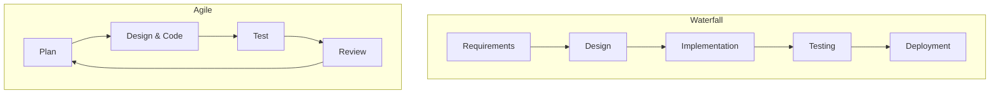
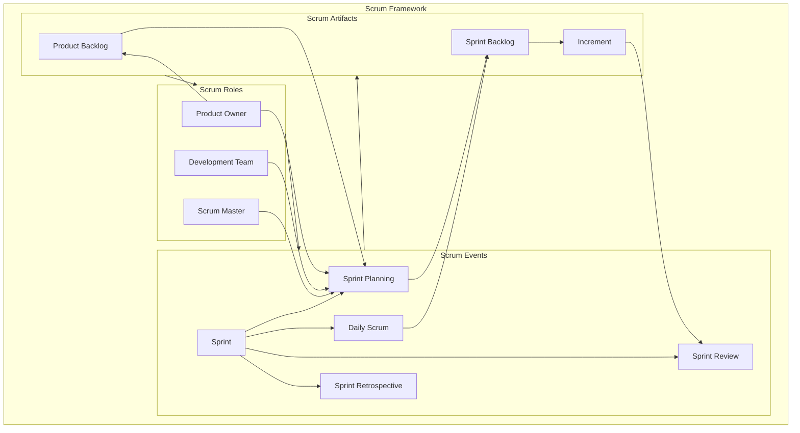
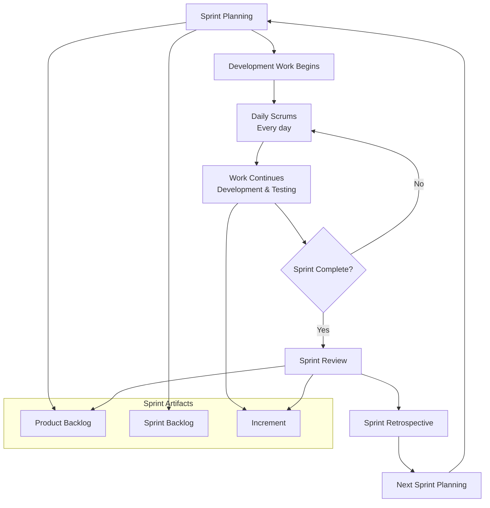
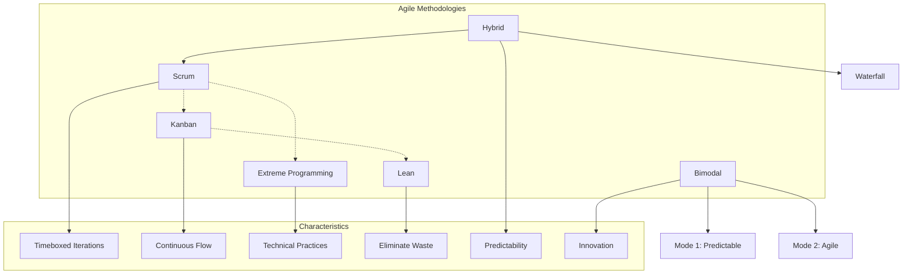
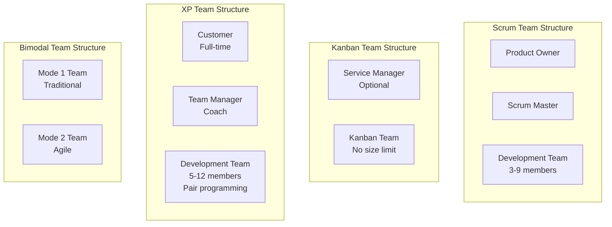

---
tags:
  - "#AgS"
  - "#CCT2"
  - "#SCRUM"
Topic: SCRUM og Agile Processer
Semester: CCT2
Course: Agil systemudvikling
Litterature: "The Scrum Guide™\r - The Definitive Guide to Scrum: The Rules of the Game | \rWHITEPAPER - Agile Project\rManagement: \rBest Practices and\r Methodologies"
Created: 03-02-2026
---
- - -
# Table of Contents

1. [[#Scrum Framework and Agile Project Management|Scrum Framework and Agile Project Management]]
	1. [[#Scrum Framework and Agile Project Management#Quick Reference Table|Quick Reference Table]]
2. [[#Definition of Scrum|Definition of Scrum]]
3. [[#Scrum Theory|Scrum Theory]]
	1. [[#Scrum Theory#Transparency|Transparency]]
	2. [[#Scrum Theory#Inspection|Inspection]]
	3. [[#Scrum Theory#Adaptation|Adaptation]]
4. [[#The Scrum Team|The Scrum Team]]
	1. [[#The Scrum Team#The Product Owner|The Product Owner]]
	2. [[#The Scrum Team#The Development Team|The Development Team]]
		1. [[#The Development Team#Development Team Size|Development Team Size]]
	3. [[#The Scrum Team#The Scrum Master|The Scrum Master]]
		1. [[#The Scrum Master#Scrum Master Service to the Product Owner|Scrum Master Service to the Product Owner]]
		2. [[#The Scrum Master#Scrum Master Service to the Development Team|Scrum Master Service to the Development Team]]
		3. [[#The Scrum Master#Scrum Master Service to the Organization|Scrum Master Service to the Organization]]
5. [[#Scrum Events|Scrum Events]]
	1. [[#Scrum Events#The Sprint|The Sprint]]
	2. [[#Scrum Events#Cancelling a Sprint|Cancelling a Sprint]]
	3. [[#Scrum Events#Sprint Planning|Sprint Planning]]
		1. [[#Sprint Planning#Topic One: What can be done this Sprint?|Topic One: What can be done this Sprint?]]
		2. [[#Sprint Planning#Topic Two: How will the chosen work get done?|Topic Two: How will the chosen work get done?]]
		3. [[#Sprint Planning#Sprint Goal|Sprint Goal]]
	4. [[#Scrum Events#Daily Scrum|Daily Scrum]]
	5. [[#Scrum Events#Sprint Review|Sprint Review]]
	6. [[#Scrum Events#Sprint Retrospective|Sprint Retrospective]]
6. [[#Scrum Artifacts|Scrum Artifacts]]
	1. [[#Scrum Artifacts#Product Backlog|Product Backlog]]
		1. [[#Product Backlog#Monitoring Progress Toward a Goal|Monitoring Progress Toward a Goal]]
	2. [[#Scrum Artifacts#Sprint Backlog|Sprint Backlog]]
		1. [[#Sprint Backlog#Monitoring Sprint Progress|Monitoring Sprint Progress]]
	3. [[#Scrum Artifacts#Increment|Increment]]
7. [[#Artifact Transparency|Artifact Transparency]]
	1. [[#Artifact Transparency#Definition of "Done"|Definition of "Done"]]
8. [[#The Art of Project Management|The Art of Project Management]]
	1. [[#The Art of Project Management#Project Management Phases|Project Management Phases]]
9. [[#Traditional Project Management Methodologies|Traditional Project Management Methodologies]]
	1. [[#Traditional Project Management Methodologies#Waterfall Model|Waterfall Model]]
10. [[#Agile Project Management Methodology|Agile Project Management Methodology]]
	1. [[#Agile Project Management Methodology#Agile Development Cycle|Agile Development Cycle]]
	2. [[#Agile Project Management Methodology#Agile Frameworks|Agile Frameworks]]
		1. [[#Agile Frameworks#Scrum: Roles, Sprints, and Artifacts|Scrum: Roles, Sprints, and Artifacts]]
			1. [[#Scrum: Roles, Sprints, and Artifacts#Sprints and artifacts|Sprints and artifacts]]
			2. [[#Scrum: Roles, Sprints, and Artifacts#Scrum meetings|Scrum meetings]]
			3. [[#Scrum: Roles, Sprints, and Artifacts#When to use Scrum|When to use Scrum]]
		2. [[#Agile Frameworks#Kanban: Comprehensive Solution to Handling Work in Progress|Kanban: Comprehensive Solution to Handling Work in Progress]]
			1. [[#Kanban: Comprehensive Solution to Handling Work in Progress#Kanban Board|Kanban Board]]
			2. [[#Kanban: Comprehensive Solution to Handling Work in Progress#When to use Kanban|When to use Kanban]]
		3. [[#Agile Frameworks#Hybrid: Blend of Waterfall and Agile (Flexible Development and Thorough Project Planning)|Hybrid: Blend of Waterfall and Agile (Flexible Development and Thorough Project Planning)]]
			1. [[#Hybrid: Blend of Waterfall and Agile (Flexible Development and Thorough Project Planning)#When to use Hybrid|When to use Hybrid]]
		4. [[#Agile Frameworks#Bimodal: Traditional Waterfall Combined with Agile|Bimodal: Traditional Waterfall Combined with Agile]]
			1. [[#Bimodal: Traditional Waterfall Combined with Agile#When to use Bimodal|When to use Bimodal]]
		5. [[#Agile Frameworks#Lean: Eliminating Waste in Software Engineering|Lean: Eliminating Waste in Software Engineering]]
			1. [[#Lean: Eliminating Waste in Software Engineering#When to use Lean|When to use Lean]]
		6. [[#Agile Frameworks#Extreme Programming (XP): Engineering Practices For Writing Clear Code|Extreme Programming (XP): Engineering Practices For Writing Clear Code]]
			1. [[#Extreme Programming (XP): Engineering Practices For Writing Clear Code#XP Practices:|XP Practices:]]
			2. [[#Extreme Programming (XP): Engineering Practices For Writing Clear Code#When to use XP|When to use XP]]
11. [[#Visualizing Project Management Methodologies|Visualizing Project Management Methodologies]]
12. [[#Comparative Analysis of Methodologies|Comparative Analysis of Methodologies]]
	1. [[#Comparative Analysis of Methodologies#When to Choose Which Methodology|When to Choose Which Methodology]]
		1. [[#When to Choose Which Methodology#Waterfall vs. Agile|Waterfall vs. Agile]]
		2. [[#When to Choose Which Methodology#Scrum vs. Kanban|Scrum vs. Kanban]]
		3. [[#When to Choose Which Methodology#Scrum vs. XP|Scrum vs. XP]]
		4. [[#When to Choose Which Methodology#Hybrid Approaches|Hybrid Approaches]]
13. [[#Conclusion|Conclusion]]

# Scrum Framework and Agile Project Management

## Quick Reference Table

| Concept/Element | Description |
|---|---|
| **Scrum** | A framework for addressing complex adaptive problems while delivering high-value products. |
| **Scrum Team** | Consists of a ***Product Owner***, ***Development Team***, and a ***Scrum Master***. |
| **Product Owner** | Responsible for maximizing product value and managing the ***Product Backlog***. |
| **Development Team** | Self-organizing, cross-functional professionals who deliver product increments. |
| **Scrum Master** | Servant-leader who ensures Scrum is understood and enacted. |
| **Sprint** | A time-boxed event (one month or less) where a usable product increment is created. |
| **Product Backlog** | An ordered list of everything needed in the product. |
| **Sprint Backlog** | The set of ***Product Backlog*** items selected for the Sprint, plus a plan for delivery. |
| **Increment** | The sum of all ***Product Backlog*** items completed during a Sprint and all previous increments. |
| **Daily Scrum** | A 15-minute meeting for the ***Development Team*** to synchronize activities. |
| **Sprint Review** | A meeting to inspect the Increment and adapt the ***Product Backlog***. |
| **Sprint Retrospective** | An opportunity for the ***Scrum Team*** to inspect itself and create improvement plans. |

# Definition of Scrum

> [!abstract] **Scrum (n):**
> A framework within which people can address complex adaptive problems, while productively and creatively delivering products of the highest possible value.
> - Lightweight
> - Simple to understand
> - Difficult to master

Scrum is not a process or a technique for building products; rather, it is a framework within which you can employ various processes and techniques. Scrum makes clear the relative efficacy of your product management and development practices so that you can improve.

The Scrum framework consists of ***Scrum Teams*** and their associated roles, events, artifacts, and rules. Each component within the framework serves a specific purpose and is essential to Scrum's success and usage. The rules of Scrum bind together the events, roles, and artifacts, governing the relationships and interaction between them.

# Scrum Theory

Scrum is founded on empirical process control theory, or empiricism. Empiricism asserts that knowledge comes from experience and making decisions based on what is known. Scrum employs an iterative, incremental approach to optimize predictability and control risk.

Three pillars uphold every implementation of empirical process control:
1. Transparency
2. Inspection
3. Adaptation.

## Transparency

> [!info] **Transparency**
> Significant aspects of the process must be visible to those responsible for the outcome. Transparency requires those aspects be defined by a common standard so observers share a common understanding of what is being seen.

For example:
- A common language referring to the process must be shared by all participants; and,
- Those performing the work and those accepting the work product must share a common definition of "Done".

> [!example] 
> A shared understanding of "Done" might mean that for a feature to be considered complete, it must be coded, unit-tested, integrated, and documented. Without this shared definition, one developer might think "Done" means just coding, while another expects it to be fully tested. This lack of transparency can lead to an unusable increment.

## Inspection

> [!info] **Inspection**
> Scrum users must frequently inspect Scrum artifacts and progress toward a ***Sprint Goal*** to detect undesirable variances. Their inspection should not be so frequent that inspection gets in the way of the work. Inspections are most beneficial when diligently performed by skilled inspectors at the point of work.

## Adaptation

> [!info] **Adaptation**
> If an inspector determines that one or more aspects of a process deviate outside acceptable limits, and that the resulting product will be unacceptable, the process or the material being processed must be adjusted. An adjustment must be made as soon as possible to minimize further deviation.

Scrum prescribes four formal events for inspection and adaptation:
- ***Sprint Planning***
- ***Daily Scrum***
- ***Sprint Review***
- ***Sprint Retrospective***

# The Scrum Team

The ***Scrum Team*** consists of a ***Product Owner***, the ***Development Team***, and a ***Scrum Master***. Scrum Teams are self-organizing and cross-functional. Self-organizing teams choose how best to accomplish their work, rather than being directed by others outside the team. Cross-functional teams have all competencies needed to accomplish the work without depending on others not part of the team. The team model in Scrum is designed to optimize flexibility, creativity, and productivity.

## The Product Owner

> [!info] **Product Owner**
> The ***Product Owner*** is responsible for maximizing the value of the product and the work of the ***Development Team***. How this is done may vary widely across organizations, Scrum Teams, and individuals.

The ***Product Owner*** is the sole person responsible for managing the ***Product Backlog***:
- Clearly expressing ***Product Backlog*** items;
- Ordering the items in the ***Product Backlog*** to best achieve goals and missions;
- Optimizing the value of the work the ***Development Team*** performs;
- Ensuring that the ***Product Backlog*** is visible, transparent, and clear to all, and shows what the ***Scrum Team*** will work on next; and,
- Ensuring the ***Development Team*** understands items in the ***Product Backlog*** to the level needed.

> [!warning] **Product Owner Authority**
> The ***Product Owner*** is one person, not a committee. The ***Product Owner*** may represent the desires of a committee in the ***Product Backlog***, but those wanting to change a ***Product Backlog*** item's priority must address the ***Product Owner***.

For the ***Product Owner*** to succeed, the entire organization must respect his or her decisions. The ***Product Owner***'s decisions are visible in the content and ordering of the ***Product Backlog***. No one is allowed to tell the ***Development Team*** to work from a different set of requirements, and the ***Development Team*** isn't allowed to act on what anyone else says.

## The Development Team

> [!info] **Development Team**
> The ***Development Team*** consists of professionals who do the work of delivering a potentially releasable Increment of "Done" product at the end of each ***Sprint***. Only members of the ***Development Team*** create the Increment. Development Teams are structured and empowered by the organization to organize and manage their own work.

Key characteristics of the ***Development Team***:
- They are self-organizing. No one (not even the ***Scrum Master***) tells the ***Development Team*** how to turn ***Product Backlog*** into Increments of potentially releasable functionality;
- ***Development Teams*** are cross-functional, with all of the skills as a team necessary to create a product Increment;
- Scrum recognizes no titles for ***Development Team*** members other than Developer, regardless of the work being performed by the person; there are no exceptions to this rule;
- Scrum recognizes no sub-teams in the ***Development Team***, regardless of particular domains that need to be addressed like testing or business analysis; there are no exceptions to this rule; and,
- Individual ***Development Team*** members may have specialized skills and areas of focus, but accountability belongs to the ***Development Team*** as a whole.

### Development Team Size

> [!tip] **Optimal Team Size**
> Optimal ***Development Team*** size is small enough to remain nimble and large enough to complete significant work within a ***Sprint***.

Smaller ***Development Teams*** may encounter skill constraints during the ***Sprint***, causing the ***Development Team*** to be unable to deliver a potentially releasable Increment. Large ***Development Teams*** generate too much complexity for an empirical process to manage. The ***Product Owner*** and ***Scrum Master*** roles are not included in this count unless they are also executing the work of the ***Sprint Backlog***.

## The Scrum Master

> [!info] **Scrum Master**
> The ***Scrum Master*** is responsible for ensuring Scrum is understood and enacted. Scrum Masters do this by ensuring that the ***Scrum Team*** adheres to Scrum theory, practices, and rules.

The ***Scrum Master*** is a servant-leader for the ***Scrum Team***. The ***Scrum Master*** helps those outside the ***Scrum Team*** understand which of their interactions with the ***Scrum Team*** are helpful and which aren't. The ***Scrum Master*** helps everyone change these interactions to maximize the value created by the ***Scrum Team***.

### Scrum Master Service to the Product Owner

- Finding techniques for effective ***Product Backlog*** management;
- Helping the ***Scrum Team*** understand the need for clear and concise ***Product Backlog*** items;
- Understanding product planning in an empirical environment;
- Ensuring the ***Product Owner*** knows how to arrange the ***Product Backlog*** to maximize value;
- Understanding and practicing agility; and,
- Facilitating Scrum events as requested or needed.

### Scrum Master Service to the Development Team

- Coaching the ***Development Team*** in self-organization and cross-functionality;
- Helping the ***Development Team*** to create high-value products;
- Removing impediments to the ***Development Team***'s progress;
- Facilitating Scrum events as requested or needed; and,
- Coaching the ***Development Team*** in organizational environments in which Scrum is not yet fully adopted and understood.

### Scrum Master Service to the Organization

- Leading and coaching the organization in its Scrum adoption;
- Planning Scrum implementations within the organization;
- Helping employees and stakeholders understand and enact Scrum and empirical product development;
- Causing change that increases the productivity of the ***Scrum Team***; and,
- Working with other Scrum Masters to increase the effectiveness of the application of Scrum in the organization.

# Scrum Events

Prescribed events are used in Scrum to create regularity and to minimize the need for meetings not defined in Scrum. All events are time-boxed events, such that every event has a maximum duration. Once a ***Sprint*** begins, its duration is fixed and cannot be shortened or lengthened. The remaining events may end whenever the purpose of the event is achieved, ensuring an appropriate amount of time is spent without allowing waste in the process.

Other than the ***Sprint*** itself, which is a container for all other events, each event in Scrum is a formal opportunity to inspect and adapt something. These events are specifically designed to enable critical transparency and inspection. Failure to include any of these events results in reduced transparency and is a lost opportunity to inspect and adapt.

## The Sprint

> [!info] **Sprint**
> The heart of Scrum is a ***Sprint***, a time-box of one month or less during which a "Done", useable, and potentially releasable product Increment is created. Sprints best have consistent durations throughout a development effort. A new ***Sprint*** starts immediately after the conclusion of the previous ***Sprint***.

During the ***Sprint***:
- No changes are made that would endanger the ***Sprint Goal***;
- Quality goals do not decrease; and,
- Scope may be clarified and re-negotiated between the ***Product Owner*** and ***Development Team*** as more is learned.

> [!example] 
> A team is in a two-week Sprint to build a user login feature. Halfway through, a stakeholder asks them to add a password reset feature. The team and Product Owner discuss this. If the feature can be added without jeopardizing the main login feature (the Sprint Goal), it might be added. If it would delay the login feature, the Product Owner would likely add it to the Product Backlog for a future Sprint.

## Cancelling a Sprint

> [!warning] **Sprint Cancellation**
> A ***Sprint*** can be cancelled before the ***Sprint*** time-box is over. Only the ***Product Owner*** has the authority to cancel the ***Sprint***, although he or she may do so under influence from the stakeholders, the ***Development Team***, or the ***Scrum Master***.

A ***Sprint*** would be cancelled if the ***Sprint Goal*** becomes obsolete. This might occur if the company changes direction or if market or technology conditions change. In general, a ***Sprint*** should be cancelled if it no longer makes sense given the circumstances. But, due to the short duration of Sprints, cancellation rarely makes sense.

When a ***Sprint*** is cancelled, any completed and "Done" ***Product Backlog*** items are reviewed. If part of the work is potentially releasable, the ***Product Owner*** typically accepts it. All incomplete ***Product Backlog*** Items are re-estimated and put back on the ***Product Backlog***. The work done on them depreciates quickly and must be frequently re-estimated.

## Sprint Planning

> [!info] **Sprint Planning**
> The work to be performed in the ***Sprint*** is planned at the ***Sprint Planning***. This plan is created by the collaborative work of the entire ***Scrum Team***.

***Sprint Planning*** addresses two topics:
1. What can be delivered in the Increment resulting from the upcoming ***Sprint***?
2. How will the work needed to deliver the Increment be achieved?

### Topic One: What can be done this Sprint?

The ***Development Team*** works to forecast the functionality that will be developed during the ***Sprint***. The ***Product Owner*** discusses the objective that the ***Sprint*** should achieve and the ***Product Backlog*** items that, if completed in the ***Sprint***, would achieve the ***Sprint Goal***. The entire ***Scrum Team*** collaborates on understanding the work of the ***Sprint***.

After the ***Development Team*** forecasts the ***Product Backlog*** items it will deliver in the ***Sprint***, the ***Scrum Team*** crafts a ***Sprint Goal***. The ***Sprint Goal*** is an objective that will be met within the ***Sprint*** through the implementation of the ***Product Backlog***, and it provides guidance to the ***Development Team*** on why it is building the Increment.

### Topic Two: How will the chosen work get done?

Having set the ***Sprint Goal*** and selected the ***Product Backlog*** items for the ***Sprint***, the ***Development Team*** decides how it will build this functionality into a "Done" product Increment during the ***Sprint***. The ***Product Backlog*** items selected for this ***Sprint*** plus the plan for delivering them is called the ***Sprint Backlog***.

The ***Development Team*** usually starts by designing the system and the work needed to convert the ***Product Backlog*** into a working product Increment. Work may be of varying size, or estimated effort. However, enough work is planned during ***Sprint Planning*** for the ***Development Team*** to forecast what it believes it can do in the upcoming ***Sprint***. Work planned for the first days of the ***Sprint*** by the ***Development Team*** is decomposed by the end of this meeting, often to units of one day or less. The ***Development Team*** self-organizes to undertake the work in the ***Sprint Backlog***, both during ***Sprint Planning*** and as needed throughout the ***Sprint***.

By the end of the ***Sprint Planning***, the ***Development Team*** should be able to explain to the ***Product Owner*** and ***Scrum Master*** how it intends to work as a self-organizing team to accomplish the ***Sprint Goal*** and create the anticipated Increment.

### Sprint Goal

> [!info] **Sprint Goal**
> The ***Sprint Goal*** is an objective set for the ***Sprint*** that can be met through the implementation of ***Product Backlog***. It provides guidance to the ***Development Team*** on why it is building the Increment.

As the ***Development Team*** works, it keeps the ***Sprint Goal*** in mind.

## Daily Scrum

> [!info] **Daily Scrum**
> The ***Daily Scrum*** is a 15-minute time-boxed event for the ***Development Team*** to synchronize activities and create a plan for the next 24 hours. This is done by inspecting the work since the last ***Daily Scrum*** and forecasting the work that could be done before the next one. The ***Daily Scrum*** is held at the same time and place each day to reduce complexity.

The ***Daily Scrum*** addresses three questions:
- What did I do yesterday that helped the ***Development Team*** meet the ***Sprint Goal***?
- What will I do today to help the ***Development Team*** meet the ***Sprint Goal***?
- Do I see any impediment that prevents me or the ***Development Team*** from meeting the ***Sprint Goal***?

The ***Development Team*** uses the ***Daily Scrum*** to inspect progress toward the ***Sprint Goal*** and to inspect how progress is trending toward completing the work in the ***Sprint Backlog***.

The ***Scrum Master*** ensures that the ***Development Team*** has the meeting, but the ***Development Team*** is responsible for conducting the ***Daily Scrum***. The ***Scrum Master*** enforces the rule that only ***Development Team*** members participate in the ***Daily Scrum***.

## Sprint Review

> [!info] **Sprint Review**
> A ***Sprint Review*** is held at the end of the ***Sprint*** to inspect the Increment and adapt the ***Product Backlog*** if needed.

This is a four-hour time-boxed meeting for one-month Sprints. For shorter Sprints, the event is usually shorter. The ***Scrum Master*** ensures that the event takes place and that attendants understand its purpose.

Key aspects of the ***Sprint Review***:
- Attendees include the ***Scrum Team*** and key stakeholders invited by the ***Product Owner***;
- The ***Product Owner*** explains what ***Product Backlog*** items have been "Done" and what has not been "Done";
- The ***Development Team*** discusses what went well during the ***Sprint***, what problems it ran into, and how those problems were solved;
- The ***Development Team*** demonstrates the work that it has "Done" and answers questions about the Increment;
- The ***Product Owner*** discusses the ***Product Backlog*** as it stands. He or she projects likely completion dates based on progress to date (if needed);
- The entire group collaborates on what to do next, so that the ***Sprint Review*** provides valuable input to subsequent ***Sprint Planning***;
- Review of how the marketplace or potential use of the product might have changed what is the most valuable thing to do next; and,
- Review of the timeline, budget, potential capabilities, and marketplace for the next anticipated release of the product.

The result of the ***Sprint Review*** is a revised ***Product Backlog*** that defines the probable ***Product Backlog*** items for the next ***Sprint***.

> [!example] **Sprint Review in Action:**
> A team just finished a Sprint to add a "shopping cart" feature to an e-commerce site.
> 1.  **Demo:** The Development Team shows the stakeholders how to add items to the cart, view the cart, and update quantities.
> 2.  **Feedback:** A stakeholder from marketing points out that the "Add to Cart" button isn't prominent enough. The CEO asks if a "Save for Later" feature was included (it wasn't).
> 3.  **Backlog Update:** The Product Owner notes the feedback. The "Save for Later" feature is added as a high-priority item to the Product Backlog. The "Add to Cart" button styling is added as a lower-priority item. The team discusses these items and agrees to tackle the button in the next Sprint.

## Sprint Retrospective

> [!info] **Sprint Retrospective**
> The ***Sprint Retrospective*** is an opportunity for the ***Scrum Team*** to inspect itself and create a plan for improvements to be enacted during the next ***Sprint***.

This is a three-hour time-boxed meeting for one-month Sprints. For shorter Sprints, the event is usually shorter. The ***Scrum Master*** ensures that the event takes place and that attendants understand its purpose.

Key aspects of the ***Sprint Retrospective***:
- Inspect how the last ***Sprint*** went with regards to people, relationships, process, and tools;
- Identify and order the major items that went well and potential improvements; and,
- Create a plan for implementing improvements to the way the ***Scrum Team*** does its work.

By the end of the ***Sprint Retrospective***, the ***Scrum Team*** should have identified improvements that it will implement in the next ***Sprint***.

> [!example] **Sprint Retrospective in Action:**
> The same team from the Sprint Review example holds a retrospective.
> 1.  **What went well?** "Our daily stand-ups were very efficient." "We got great help from the database admin."
> 2.  **What could be improved?** "We waited three days for design mockups, which blocked our frontend work." "Our CI server was down for a whole day."
> 3.  **Action Items:** The team decides that for the next Sprint, the Product Owner will ensure all design assets are ready *before* Sprint Planning. The Scrum Master will work with IT to create a backup plan for the CI server. These action items are added to the next Sprint's plan.

# Scrum Artifacts

Scrum's artifacts represent work or value to provide transparency and opportunities for inspection and adaptation.

## Product Backlog

> [!info] **Product Backlog**
> The ***Product Backlog*** is an ordered list of everything that might be needed in the product and is the single source of requirements for any changes to be made to the product. The ***Product Owner*** is responsible for the ***Product Backlog***, including its content, availability, and ordering.

The ***Product Backlog*** evolves as the product and the environment in which it will be used evolves. The ***Product Backlog*** is dynamic; it constantly changes to identify what the product needs to be appropriate, competitive, and useful. As long as a product exists, its ***Product Backlog*** also exists.

The ***Product Backlog*** lists all features, functions, requirements, enhancements, and fixes that constitute the changes to be made to the product in future releases. ***Product Backlog*** items have the attributes of:
- a description,
- order,
- estimate and
- value.

> [!example] 
> A ***Product Backlog*** for an e-commerce site might contain items like: "User can search for products by keyword," "Admin can view sales dashboard," "Implement one-click checkout," and "Fix bug on payment page." These items would be ordered by the Product Owner based on current business priorities.

Multiple ***Scrum Teams*** often work together on the same product. One ***Product Backlog*** is used to describe the upcoming work on the product. A ***Product Backlog*** attribute that groups items may then be employed.

The ***Development Team*** is responsible for all estimates. The ***Product Owner*** may influence the ***Development Team*** by helping it understand and select trade-offs, but the people who will perform the work make the final estimate.

### Monitoring Progress Toward a Goal

At any point in time, the total work remaining to reach a goal can be summed. The ***Product Owner*** tracks this total work remaining at least every ***Sprint Review***. This information is made transparent to all stakeholders. In complex environments, what will happen is unknown. Only what has happened may be used for forward-looking decision-making.

## Sprint Backlog

> [!info] **Sprint Backlog**
> The ***Sprint Backlog*** is the set of ***Product Backlog*** items selected for the ***Sprint***, plus a plan for delivering the product Increment and realizing the ***Sprint Goal***.

The ***Sprint Backlog*** is a plan with enough detail that changes in progress can be understood in the ***Daily Scrum***. As new work is required, the ***Development Team*** adds it to the ***Sprint Backlog***. As work is performed or completed, the estimated remaining work is updated. When elements of the plan are deemed unnecessary, they are removed. Only the ***Development Team*** can change its ***Sprint Backlog*** during a ***Sprint***.

> [!example] 
> If the ***Product Backlog*** item is "User can search for products," the ***Sprint Backlog*** might break this down into tasks like: "Design search UI," "Develop search API endpoint," "Write unit tests for search logic," and "Integrate front-end with back-end."

### Monitoring Sprint Progress

At any point in time in a ***Sprint***, the total work remaining in the ***Sprint Backlog*** can be summed. The ***Development Team*** tracks this total work remaining at least for every ***Daily Scrum*** to project the likelihood of achieving the ***Sprint Goal***.

## Increment

> [!info] **Increment**
> The Increment is the sum of all the ***Product Backlog*** items completed during a ***Sprint*** and the value of the increments of all previous Sprints. At the end of a ***Sprint***, the new Increment must be "Done," which means it must be in useable condition and meet the ***Scrum Team***'s definition of "Done."

# Artifact Transparency

Scrum relies on transparency. Decisions to optimize value and control risk are made based on the perceived state of the artifacts.

The ***Scrum Master*** must work with the ***Product Owner***, ***Development Team***, and other involved parties to understand if the artifacts are completely transparent. A ***Scrum Master*** can detect incomplete transparency by inspecting the artifacts, sensing patterns, listening closely to what is being said, and detecting differences between expected and real results. The ***Scrum Master***'s job is to work with the ***Scrum Team*** and the organization to increase the transparency of the artifacts. This work usually involves learning, convincing, and change. Transparency doesn't occur overnight, but is a path.

## Definition of "Done"

> [!important] **Definition of "Done"**
> When a ***Product Backlog*** item or an Increment is described as "Done", everyone must understand what "Done" means.

Although this varies significantly per ***Scrum Team***, members must have a shared understanding of what it means for work to be complete, to ensure transparency. This is the definition of "Done" for the ***Scrum Team*** and is used to assess when work is complete on the product Increment.

The same definition guides the ***Development Team*** in knowing how many ***Product Backlog*** items it can select during a ***Sprint Planning***.

If "done" for an increment is **not** a convention of the development organization, the ***Development Team*** of the ***Scrum Team*** must define a definition of "done" appropriate for the product. If there are multiple ***Scrum Teams*** working on the system or product release, the development teams on all of the ***Scrum Teams*** must mutually define the definition of "Done."

Each Increment is additive to all prior Increments and thoroughly tested, ensuring that all Increments work together.

---

# The Art of Project Management

"The application of knowledge, skills, tools and techniques to project activities to meet the project requirements"

Being an integral part of software engineering processes along with the business analysis and requirement specification, design, programming and testing, _project management_ has been a topic of considerable debate for years.

Only about half of them (54%), according to survey results by the Project Management Institute (PMI), are fully aware of the importance and value of these practices.

The definition of a successful project is one that is not only completed on time and within budget, but one that also delivers expected benefits.

## Project Management Phases

Regardless of the scope, any project should follow a sequence of actions to be controlled and managed.

A typical project management process includes the following 5 phases:
1. Initiation;
2. Planning;
3. Execution;
4. Performance/Monitoring;
5. Project close

Used as a roadmap to accomplish specific tasks. A project usually has a number of internal stages within each phase. They can vary greatly depending on the scope of work, the team, the industry and the project itself.

# Traditional Project Management Methodologies

Traditional methodologies take a step-by-step approach to the project execution. Often called **linear**, this approach includes a number of internal phases which are sequential and executed in a chronological order. Thus, the project goes through the initiation, planning, execution, monitoring straight to its closure in consecutive stages. Also known as a _waterfall_ model, it has been a dominant software development methodology since the early 1970s.

## Waterfall Model

![[Pasted image 20260203174940.png]]

_Figure 2.1: Waterfall Model showing sequential phases of project development._

Waterfall model has a strong emphasis on planning and specifications development: it is considered to take up to 40% of the project time and budget.

A basic principle of this approach is a strict order of the project phases.

A new project stage does not begin until the previous one is finished.

# Agile Project Management Methodology

As opposed to the traditional methodologies, agile approach has been introduced as an attempt to make software engineering flexible and efficient.

Agile methodologies take an iterative approach to software development. Unlike a straightforward linear waterfall model, agile projects consist of a number of smaller cycles - sprints. Each one of them is a project in miniature: it has a backlog and consists of design, implementation, testing and deployment stages within the pre-defined scope of work.

## Agile Development Cycle

![[Pasted image 20260203175305.png]]

_Figure 1.1: Agile Development Cycle showing iterative approach with sprints delivering incremental value._

At the end of each ***Sprint***, a potentially shippable product increment is delivered. Thus, with every iteration new features are added to the product, which results in the gradual project growth.

The main Agile aspects:
- Flexibility: The scope of work may change according to new requirements.
- Work breakdown: The project consists of small cycles (known as Sprints in Scrum).
- Value of teamwork: The team members work closely together and have a clear vision about their responsibilities.
- Iterative improvements: There is frequent reassessment of the work done within a cycle to make the final product better.
- Cooperation with a client: A customer is closely engaged in the development and can change the requirements or accept the team's suggestions.

## Agile Frameworks

Agile is an umbrella term for a vast variety of frameworks and techniques, sharing the principles and values described above. Each of them has its own areas of use and distinctive features. The most popular frameworks are Scrum, Kanban, Hybrid, Lean and Bimodal.

| Framework | Characteristics |
|---|---|
| **Scrum** | • The entire scope of work is broken down into short development cycles — Sprints. • The Sprint's duration is from one to four weeks. • The team should strictly follow a work plan for each Sprint. • People involved in a project have predefined roles. |
| **Kanban** | • Development is built on workflow visualization. • The current work (work in progress or WIP) is prioritized. • There are no timeboxed development cycles. • The team can change the work plan at any time. |
| **Hybrid** | • Agile and Waterfall complement each other. • Agile software development is held under Waterfall conditions (fixed deadline, forecasted budget, and thorough risk assessment). |
| **Bimodal** | • There are two separate modes of work — traditional (Mode 1) and Agile (Mode 2). • Two separate teams are working on projects with two different goals. • The Mode 1 team maintains IT system infrastructure. • The Mode 2 team delivers innovative applications. • Cross-team collaboration is important. |
| **Lean** | • The framework promotes fast software development with less effort, time, and cost. • The development cycle is as short as possible. • The product delivered early is being continuously improved. |
| **XP** | • The focus is on technical aspects of software development. • XP introduces engineering practices aimed at helping developers write a clear code. • Product development includes consistent stages: core writing, testing, analyzing, designing, and continuous integration of code. • Face-to-face communication within the team and customer involvement in development are crucial. |

_Table 1.1: Comparison of Agile Frameworks and their key characteristics._

### Scrum: Roles, Sprints, and Artifacts

While Scrum was introduced far before the Agile Manifesto, it relies on Agile principles and is consistent with the values stated in that document. Scrum is aimed at sustaining strong collaboration between people working on complex products, and details are being changed or added.

- ***Scrum Master*** is a central figure within a project. His principal responsibility is to eliminate all the obstacles that might prevent the team from working efficiently.
- ***Product Owner***, usually a customer or other stakeholder, is actively involved throughout the project, conveying the global vision of the product and providing timely feedback on the job done after every ***Sprint***.
- ***Scrum Team*** is a cross-functional and self-organizing group of people that is responsible for the product implementation. It should consist of up to seven team members, in order to stay flexible and productive.

![[Pasted image 20260203175817.png]]

_Figure 1.2: Scrum Framework showing roles, events, and artifacts._

#### Sprints and artifacts

A basic unit of work in scrum – ***Sprint*** – is a short development cycle that is needed to produce a shippable product increment. A ***Sprint*** usually is between one and four weeks long. Having no standard duration (as long as it is less than four weeks), all the sprints within a project should have a fixed length. This makes it easier to plan and track progress.

Scrum relies on three main **artifacts** which are used to manage the requirements and track progress – the ***Product Backlog***, the ***Sprint Backlog***, the Sprint Burndown Chart.

- The ***Product Backlog*** is an ordered list of feature items that might be needed in the project's final product. It is a single source of requirements. The product Backlog updates as new requirements, fixes, features, and details are being changed or added.
- The ***Sprint Backlog*** is a list of tasks the team must complete to deliver an increment of functional software at the end of each ***Sprint***. In other words, team members agree on which product items to deliver and define a plan on how to do so.
- The Sprint Burndown Chart is an illustration of the work remaining in a ***Sprint***. It helps both the team and the ***Scrum Master*** as it shows progress on a day-to-day basis and can predict whether the ***Sprint*** goal will be achieved on schedule.

#### Scrum meetings

The process is formalized through a number of recurring meetings, like the ***Daily Scrum*** (Standup), the ***Sprint Planning***, the Review, and Retrospective meetings (the ***Sprint Retrospective***).

- The ***Daily Scrum*** is a timeboxed meeting, during which a ***Development Team*** coordinates its work and sets a plan for the next 24 hours. The event lasts 15 minutes and should be held daily at the same place and time.

#### When to use Scrum

> [!tip] **Scrum Use Cases**
> Scrum works well for long-term, complex projects that require stakeholder feedback, which may greatly affect project requirements. So, when the exact amount of work can't be estimated, and the release date is not fixed, Scrum may be the best choice.

### Kanban: Comprehensive Solution to Handling Work in Progress

Another common project management framework is Kanban. Kanban focuses on the visualization of the workflow and prioritizes the work in progress (WIP), limiting its scope to match it effectively to the team's capacity. As soon as a task is completed, the team can take the next item from the pipeline. Thus, the development process offers more flexibility in planning, faster turnaround, clear objectives, and transparency.

#### Kanban Board

![[Pasted image 20260203180311.png]]

_Figure 1.3: Example of a Kanban Board showing workflow visualization._

No standard procedures within the process, as well as the fixed iterations, are required in Kanban, as opposed to Scrum. The project development is based on the workflow visualization through a **Kanban board**.

Teams using Kanban tools work in a cooperative manner. The ability to track progress helps coworkers understand everyone's personal input in achieving the common goal, resulting in a focus on completing the task well and on time.

#### When to use Kanban

> [!tip] **Kanban Use Cases**
> Using Kanban, teams can do small releases and adapt to changing priorities. Unlike Scrum, there are no sprints with their predefined goals. Kanban is focused on doing small pieces of work as they come up. For example, if testers find errors in the product, developers try to fix them right away. Kanban, for instance, works well after the main release of the product.

> [!example] **Kanban in Action:**
> A small support team for a software product uses Kanban. Their workflow is: `To Do` -> `In Progress` -> `Testing` -> `Done`. A critical bug report comes in. The team lead immediately moves it to the top of the `To Do` column. A developer finishes their current task, pulls the critical bug into `In Progress`, and fixes it. It's then moved to `Testing` and resolved within a few hours, without waiting for a "sprint" to end. This continuous flow is the essence of Kanban.

### Hybrid: Blend of Waterfall and Agile (Flexible Development and Thorough Project Planning)

Agile and Waterfall are two different visions of software development management. The former is about iterative development and being flexible, while the latter, promoting step-by-step development, requires careful planning, and rejects making changes along the way.

Specialists use advantages of the Agile philosophy for software development. When it comes to budgeting, planning, and hardware set up, Waterfall works well.

By embedding Agile practices into a traditional Waterfall work process, companies can increase chances of realizing successful projects. For example, project planning can be done in sprints, testing can be incorporated in development, and feedback can be gathered regularly. Other ways of modifying the Waterfall model include using Kanban boards and organizing retrospectives.

#### When to use Hybrid

> [!tip] **Hybrid Use Cases**
> Hybrid is an effective solution when product delivery relies on both hardware and software operations. But, there is another reason to choose Hybrid. The situation in which a customer is not satisfied with an unspecified timeframe and budget, as well as the lack of planning, is not rare. Such uncertainty is typical for Agile. In this case, planning, requirements specification, and an application design can be accomplished in Waterfall. Agile is in place for software development and testing.

> [!example] **Hybrid in Action:**
> A company is developing a new smart home security camera. The project involves both hardware (the physical camera) and software (the mobile app and cloud backend).
> - **Waterfall for Hardware:** The hardware design, prototyping, and manufacturing schedule are planned using a Waterfall approach. This is because physical changes are expensive and require long lead times. The specs for the camera are locked down early.
> - **Agile for Software:** The software team works in Sprints to develop the mobile app. They can iterate on the user interface, add new features based on early user feedback from the hardware prototype, and fix bugs quickly, even as the hardware is being finalized.

### Bimodal: Traditional Waterfall Combined with Agile

Bimodal is the practice of managing two separate but consistent styles of work: one focused on predictability and the other on agility.

- **Mode 1** is traditional; thus, it works perfectly in well-understood and predictable areas.
- **Mode 2** involves rapid application development. It is exploratory, nonlinear, and optimized for solving new problems.
Both modes require different skills, techniques, and tools. Therefore, two separate work groups are needed. These teams have two distinct goals — ensuring stability while adopting innovations.

The Mode 1 team develops and maintains applications and core systems to support long-term business needs. A company's technological capabilities depend directly on the work that's done by this team. The Mode 2 team frequently delivers innovative applications to engage new customers and meet short-term business needs. This team may change the product's functionality after having received feedback and analyzed the market.

#### When to use Bimodal

> [!tip] **Bimodal Use Cases**
> If the company specializes in both long- and short-term projects that require different development and management approaches, Bimodal might be the right choice. This framework is about keeping the balance between maintaining IT system infrastructure and driving innovations. When successfully implemented, Bimodal helps organizations quickly deliver solutions that users need to stay competitive.

> [!example] **Bimodal in Action:**
> A large financial institution operates this way.
> - **Mode 1 Team:** This team is responsible for the core banking system. Their work is focused on stability, security, and reliability. They use a rigorous, slow-moving process to ensure no downtime or errors occur in critical functions like processing transactions or managing accounts.
> - **Mode 2 Team:** This team is tasked with building a new, cutting-edge mobile payment app. They work in an Agile fashion, releasing new versions every few weeks, experimenting with features, and responding quickly to market trends like P2P payments or cryptocurrency integration.

### Lean: Eliminating Waste in Software Engineering

There are 7 principles to the application of Lean principles to software development:
1. Eliminate waste
2. Amplify learning and create knowledge
3. Decide as late as possible
4. Deliver as fast as possible
5. Empower the team
6. Build integrity/quality in
7. See the whole

**Eliminating waste**. In terms of a project, a term "waste" refers to anything that is not adding the value to the project and thus should be eliminated. In software engineering, this can be idle time, unnecessary features, or defects.

**Amplifying learning and creating knowledge**. In Lean, software development is perceived as an ongoing learning process. Developers don't usually write clear code on the first try. After having detected and fixed errors, they write an improved variation of the previous code. Engineers gain knowledge during development by solving problems and producing code variations.

**Deciding as late as possible**. Late decisions are more informed ones because they are based on facts. Keeping in mind that technologies become obsolete increasingly faster, delaying an irreversible design decision is a wise move.

**Delivering as fast as possible**. The fourth principle is about the pros of fast software development. Short development cycles allow developers to learn more by getting feedback. They also allow a customer to delay making a final decision about design until they know more.

**Empowering the team**. Developers should have the right to make technical decisions as they understand the details of their work like no one else. They can create a roadmap and follow it.

**Building in integrity/quality**. The user's perception of the software and its characteristics must coincide. If a customer thinks that software has all the needed features and is easy to use, that system has a perceived integrity. Conceptual integrity means that the software has a coherent architecture, and scores high on usability and fitness of purpose.

**Seeing the whole**. Engineers should take charge of the overall efficiency of the system, instead of focusing on their small portion. If experts adhere to this principle, they can create a system with integrity.

What differentiates Lean approach is that the team is not restricted to use any formal processes, such as recurring meetings or thorough task prioritization.

#### When to use Lean

> [!tip] **Lean Use Cases**
> Lean works well for small, short-term projects due to their short life cycles. This approach is also appropriate if the customer can participate in a project realization as Lean requires ongoing feedback.

> [!example] **Lean in Action:**
> A startup is building a Minimum Viable Product (MVP) for a new social media tool.
> 1.  **Eliminate Waste:** They decide not to build a complex admin panel for launch, as it's not needed for the first 1000 users. That's waste.
> 2.  **Amplify Learning:** They release a very basic version to a small group of users after just two weeks to get feedback on the core concept.
> 3.  **Decide Late:** They haven't decided on the technology for their video chat feature. They will wait to see if users even ask for it before investing time in it.
> 4.  **Deliver Fast:** They aim to release a new, small feature every few days to keep users engaged and learning.
> 5.  **Empower Team:** The frontend developer is given full autonomy to choose the UI framework, as she is the expert.

### Extreme Programming (XP): Engineering Practices For Writing Clear Code

Extreme Programming (XP) differs from the above-mentioned frameworks by its focus on technical aspects of software development. It combines the most essential, providing agile teams with a number of tools to optimize the engineering process. Extreme Programming is a set of certain practices, applied to software engineering in order to improve its quality and ability to adapt to the changing requirements.

XP requires developers to perform a little number of engineering practices on the highest, almost extreme level possible, hence the name.

#### XP Practices:
- Test-Driven Development (TDD)
- Refactoring
- Continuous Integration
- Pair Programming

**Test-Driven Development** is an advanced engineering technique that uses automated unit tests to propel software design process. As opposed to the regular development cycle, where the tests are written after the code (or not written at all), TDD has a test-first approach.

![[Pasted image 20260203181852.png]]

_Figure 1.4: Test-Driven Development Cycle Benefits._

Code **Refactoring** is a common practice in agile software development. Basically, it's a process of a constant code improvement through simplification and clarification. The process is solely technical and does not call for any changes in software behavior.

**Continuous Integration** (CI) is another practice agile teams rely on for managing shared code and software testing. Instead of doing short iterations, developers can commit newly written parts of a code several times a day. This way, they constantly deliver value to users.

**Pair Programming**, or _pairing_, is considered to be a very controversial agile practice. This technique requires two engineers working together. While one of them is actually writing the code, the other one is actively involved as a watcher, making suggestions, and navigating through the process. Being focused on both code and more abstract technical tasks, this team of two is expected to be more efficient, creating better software design and making fewer mistakes. Another benefit of this approach lies in spreading the project knowledge across team members. However, this practice has often been accused of having a negative impact on the team's short-term productivity.

#### When to use XP

> [!tip] **XP Use Cases**
> XP provides tools to decrease risks while developing a new system, especially when developers must write code within strict timeframes. It's essential to know that XP practices are designed for small teams. One should choose this framework if sure that not only developers but also customers and managers will be able to work together on a project. Extreme Programming offers engineering practices and ideas that help development teams adapt to ever-changing requirements. The key features of this framework are a high rate of customer engagement and short iterative cycles.

> [!example] **Pair Programming in Action (XP):**
> Two developers, Alex and Ben, are tasked with building a new function `calculate_discount(price, user)`.
> - **Alex (Driver):** Sits at the keyboard and starts writing the code. `function calculate_discount(price, user) { ... }`
> - **Ben (Navigator):** Watches the screen, thinks about the bigger picture. "Wait, before you code the logic, what about edge cases? What if the price is negative? Or if the user object is null? Let's write a test for that first."
> - **Alex:** "Good point. Okay, I'll write a test that expects an error for a negative price."
> They continue this back-and-forth, with the Navigator preventing bugs and design flaws, and the Driver focusing on the implementation. This collaboration results in higher-quality code than either might have written alone.

# Visualizing Project Management Methodologies

To better understand the relationships and flows within these methodologies, let's visualize them.

_Figure 1.5: Comparison of Waterfall's linear flow with Agile's iterative cycle._

_Figure 1.6: The interconnected nature of Scrum's roles, events, and artifacts._

_Figure 1.7: Detailed flowchart of the Sprint cycle, showing events and artifacts._

_Figure 1.8: Relationship map showing how different Agile methodologies connect to key characteristics._

_Figure 1.9: Comparison of team structures across different Agile methodologies._

# Comparative Analysis of Methodologies

## When to Choose Which Methodology

> [!info] **Methodology Selection Guide**
> Choosing the right methodology depends on various factors including project requirements, team structure, organizational culture, and customer needs. The following comparisons can help guide your decision.

### Waterfall vs. Agile

| Factor | Waterfall | Agile |
|---|---|---|
| **Requirements** | Fixed, well-defined upfront | Evolving, can change during project |
| **Planning** | Comprehensive upfront planning | Iterative planning |
| **Timeline** | Predictable, linear | Flexible, adaptive |
| **Customer Involvement** | Limited to beginning and end | Continuous throughout |
| **Risk Management** | Risk identified early | Risk managed throughout |
| **Best For** | Simple, predictable projects with clear requirements | Complex projects with changing requirements |

> [!example] **Waterfall Example:** 
> A government agency building a standard website with clearly defined requirements, strict regulations, and a fixed budget. The requirements won't change, and the timeline is predictable.

> [!example] **Agile Example:** 
> A startup developing a new mobile app in a competitive market where user preferences change quickly. They need to adapt based on user feedback and market trends.

### Scrum vs. Kanban

| Factor | Scrum | Kanban |
|---|---|---|
| **Cadence** | Regular, timeboxed Sprints (1-4 weeks) | Continuous flow |
| **Roles** | Defined roles (Product Owner, Scrum Master, Development Team) | No prescribed roles |
| **Meetings** | Prescribed ceremonies (Daily Scrum, Sprint Review, etc.) | No prescribed meetings |
| **Metrics** | Velocity, Burndown Chart | Lead Time, Cycle Time, WIP |
| **Changes** | Changes typically between Sprints | Changes can be made anytime |
| **Best For** | Projects needing regular delivery cadence and stakeholder feedback | Support teams or projects with continuous flow of work |

> [!example] **Scrum Example:**
>  A software company developing a new product feature set with a planned release in 3 months. They need regular stakeholder feedback and a predictable delivery cadence.

> [!example] **Kanban Example:** 
> A customer support team handling incoming tickets and issues. Work arrives unpredictably and needs to be processed as it comes, without fixed iterations.

### Scrum vs. XP

| Factor | Scrum | XP |
|---|---|---|
| **Focus** | Project management framework | Engineering practices |
| **Team Size** | 3-9 members | 5-12 members |
| **Customer Involvement** | Product Owner represents customer | Customer is full team member |
| **Technical Practices** | Not prescribed | Strict engineering practices (TDD, Pair Programming) |
| **Changes** | Changes between Sprints | Changes within iterations |
| **Best For** | General project management | Projects requiring high code quality and technical excellence |

> [!example] **Scrum Example:** 
> A marketing team launching a new campaign. They need structure and regular check-ins but don't require specific engineering practices.

> [!example] **XP Example:** 
> A financial services company developing a critical trading system where code quality, reliability, and technical excellence are paramount.

### Hybrid Approaches

> [!tip] **When to Use Hybrid Methodologies**
> Hybrid approaches are beneficial when:
> - Your project has both hardware and software components
> - Your organization has strict regulatory requirements but needs flexibility
> - You're transitioning from Waterfall to Agile
> - Different teams in your organization work better with different approaches

> [!example] **Hybrid Example:** 
> A medical device company developing a new patient monitoring system. The hardware components require Waterfall's predictability for regulatory compliance, while the software interface benefits from Agile's flexibility for user experience improvements.

# Conclusion

Agile is a way of thinking about how a software development can be managed.

Software engineering, being an extremely fast-paced industry, calls for flexibility and responsiveness in every aspect of project development. Agile frameworks allow for delivering cutting-edge products and cultivating innovative experiences while keeping the product in sync with the market trends and user requirements.

However, there is always a place for diversity. Depending on your business requirements and goals, you might still benefit from using the Waterfall model or the combination of the two.

> [!summary] **Summary**
> 
> Scrum is a lightweight framework for addressing complex adaptive problems while delivering high-value products. It is founded on empirical process control theory, which emphasizes transparency, inspection, and adaptation. The ***Scrum Team*** consists of a ***Product Owner***, ***Development Team***, and ***Scrum Master***, working together in time-boxed ***Sprints*** to create valuable product increments.
> 
> The framework includes prescribed events (***Sprint Planning***, ***Daily Scrum***, ***Sprint Review***, ***Sprint Retrospective***) and artifacts (***Product Backlog***, ***Sprint Backlog***, Increment) that provide transparency and opportunities for inspection and adaptation. A clear Definition of "Done" ensures shared understanding of when work is complete.
> 
> Scrum is part of the broader Agile methodology, which takes an iterative approach to software development. Other Agile frameworks include Kanban, Hybrid, Bimodal, Lean, and Extreme Programming (XP), each with their own characteristics and use cases. These frameworks contrast with traditional methodologies like the Waterfall model, which follows a linear, sequential approach.
> 
> The choice of project management methodology depends on various factors including project complexity, team size, customer requirements, and organizational context. By understanding the strengths and weaknesses of each approach, teams can select the most appropriate methodology or combination of methodologies to ensure project success.