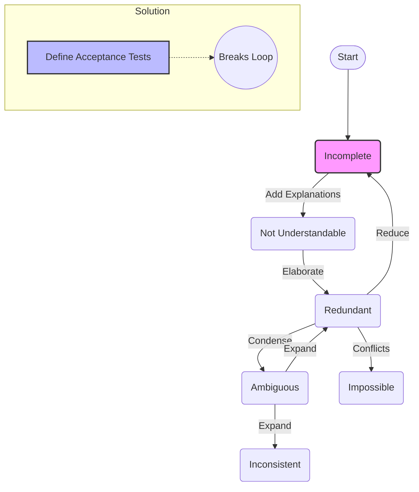

---
tags:
  - "#AgS"
  - "#CCT2"
Topic: Kravspecifikation
Semester: CCT2
Course: Agil systemudvikling
Litterature:
  - SSU kompendie
Created: 10/02/2026
---
- - -
# Table of Contents

1. [[#Requirements and Acceptance Specifications|Requirements and Acceptance Specifications]]
	1. [[#Requirements and Acceptance Specifications#The Importance of Requirements|The Importance of Requirements]]
	2. [[#Requirements and Acceptance Specifications#Purpose of a Good Requirement Specification|Purpose of a Good Requirement Specification]]
		1. [[#Purpose of a Good Requirement Specification#Characterization of Good Requirements|Characterization of Good Requirements]]
			1. [[#Characterization of Good Requirements#1. Correctness|1. Correctness]]
			2. [[#Characterization of Good Requirements#2. Ambiguity|2. Ambiguity]]
			3. [[#Characterization of Good Requirements#3. Completeness|3. Completeness]]
	3. [[#Requirements and Acceptance Specifications#Challenges in Deriving Requirements|Challenges in Deriving Requirements]]
	4. [[#Requirements and Acceptance Specifications#Documenting Requirements|Documenting Requirements]]
		1. [[#Documenting Requirements#Listing Requirements|Listing Requirements]]
		2. [[#Documenting Requirements#Scope of Requirements|Scope of Requirements]]
		3. [[#Documenting Requirements#Grouping Requirements|Grouping Requirements]]
	5. [[#Requirements and Acceptance Specifications#Acceptance Testing|Acceptance Testing]]

# Requirements and Acceptance Specifications

| Concept | Description/Key Point |
| :--- | :--- |
| **Correctness** | The requirement is free from error and aligns with the actual need; can be tracked back to a source. |
| **Ambiguity** | The quality of being open to more than one interpretation; should be avoided by defining specific values. |
| **Completeness** | Ensuring all important system characteristics are captured, often verified against use cases. |
| **Consistency** | Requirements do not contradict or counteract each other. |
| **Priority** | Structuring requirements (e.g., MoSCoW) to handle trade-offs. |
| **Verifications** | Ensuring the requirement can be checked or tested. |
| **Changeability** | The ease with which a requirement can be modified later. |
| **Traceability** | The ability to track a requirement back to its origin (use case) and forward to implementation. |

> [!note] **Terminology Note: Traceability vs. Tractability**
> The source text uses the term **Tractability**. In standard systems engineering (e.g., ISO/IEC standards), this property is formally known as **Traceability**.
> *   **Backward Traceability:** Linking requirements to stakeholders or use cases.
> *   **Forward Traceability:** Linking requirements to design elements and test cases.

---

## The Importance of Requirements

Requirements serve as the fundamental contract between developers and customers. They define the expected functionality and performance of a product.

If a product fails to meet these set requirements, developers face significant trouble. Conversely, if developers can demonstrate that the product fully satisfies the requirements, they are in a strong position to receive payment, even if the customer feels the product isn't exactly what they "wanted." This legal and commercial boundary makes requirements engineering a critical discipline.

> [!example] **The Scalability Trap**
> *Scenario:* A school requests a system where "A teacher must be able to make files available to students."
> *Issue:* The developers implement a basic file sharing system. However, when all students try to access the files simultaneously, the server crashes because scalability wasn't specified.
> *Outcome:* The school failed to realize the need for a concurrent user requirement, while the developers delivered exactly what was written (but not what was needed).

## Purpose of a Good Requirement Specification

Good requirements are difficult and time-consuming to write because they often hide complexities not visible at first glance. They must be derived from a rigorous analysis of user needs.

Writing requirements is rarely a solo task; it requires collaboration across various domains to ensure completeness.

### Characterization of Good Requirements

To ensure quality, requirements must be evaluated against eight key challenges:

#### 1. Correctness
Correctness implies the requirement is free from error and aligns with the truth or actual need. A requirement that does not capture what is truly needed is worthless.

To ensure correctness, a requirement must always be traceable back to a source or a specific need.

> [!example] **Determining Correct Sampling Rate**
> Consider the following two requirements:
> 1. Sensor needs to sample current with $10 \text{ Hz}$.
> 2. Sensor needs to sample current and voltage with $20 \text{ Hz}$.
>
> While both are measurable, how do we know if $10 \text{ Hz}$ or $20 \text{ Hz}$ is *correct*? Why not $50 \text{ Hz}$?
> We must trace this back to the **use case** and perform an analysis. By applying the **Nyquist sampling theorem**, which states that the sampling frequency $f_s$ must be at least twice the maximum frequency $f_{max}$ we wish to measure:
> $$f_s \geq 2f_{max}$$
> We can determine the correct sampling rate based on the physical phenomenon we are measuring, ensuring the requirement is technically valid for the intended purpose.

#### 2. Ambiguity
Ambiguity means the requirement is open to multiple interpretations. This is dangerous because developers and customers must agree on exactly what the system shall and shall not do.

To avoid ambiguity, rely on high-level use cases to provide context and avoid subjective words.

> [!example] **Avoiding Subjective Terms**
> *Ambiguous Requirements:*
> 1. Sensor needs to sample current **fast**.
> 2. Sensor needs to sample current and voltage with **high accuracy**.
>
> *The Problem:* "Fast" is relative. Is $10 \text{ Hz}$ fast? Is $100 \text{ Hz}$ fast? "High accuracy" is also undefined.
> *The Solution:* Replace subjective terms with specific values. If the value is unknown at the time of writing, mark it as **TBD** (To Be Determined) with an order of magnitude, ensuring it is followed up on later.

#### 3. Completeness
A requirement list must capture all important system characteristics. Missing a requirement can lead to expensive fixes later in the development cycle.

**Use cases** act as a "cheat sheet" for completeness. By assuming the use case is correct, we can systematically check if each step in the use case can be executed by a system implementing our defined requirements.

| Use case | Requirement | Note |
| :--- | :--- | :--- |
| Start engine | §1, §2, §3 | Not done yet |
| Stop engine | §1, §2, §4 | §4 done, rest to be done |
| Brake car | §4, §5 | Done, not tested |
| Speed car | §1, §6 | Done, not tested |
| Change gear | §7 | Done and tested |

_Table 1.1: Example of a requirements tracking table mapping use cases to specific requirement IDs to verify completeness._

---

## Challenges in Deriving Requirements

Requirements often undergo several iterations and quality checks. It is natural to discover new needs or issues during implementation that were not visible at the start.

![[Pasted image 20260211145510.png]]

_Figure 1.1: Overview of the various traps one can end up in when deriving requirements._

_Figure 1.2: Simplified flowchart of the requirement derivation cycle and the solution to break it._

Initially, requirements are often **incomplete**. Attempting to fix this by adding excessive explanations can make them **not understandable**. Trying to fix that with elaboration can lead to **redundant requirements**, which may even contradict each other, creating **impossible requirements**.

This cycle can lead to **inconsistent requirements** (which confuse everyone) or back to ambiguous ones. An effective way to break this loop is to **define the tests for a requirement at the same time as writing the requirement**. This forces the developer to consider practically how fulfillment will be verified, grounding the requirement in reality.

## Documenting Requirements

There is no single strict format for requirements, but there are general best practices.

### Listing Requirements
Requirements are often listed with a specific ID (e.g., using the paragraph symbol `§`) to signify their importance as the "rules of engagement." Each requirement should ideally reference where the target numbers were derived from (e.g., standards, calculations).

> [!example] **Fingerprint Authentication System**
> **§1 Finger pressed detection:** The system must be able to determine that the finger has actually been pressed for activation.
> *   **§1.1** The system shall reject fingers that touches the screen in $t < 50 \text{ ms}$.
> *   **§1.2** The system shall reject if more than one finger is detected on the touch screen.
>
> **§2 Read finger prints:** The system must be able to read finger prints from a single user.
> *   **§2.1** The system must obtain a digital version of the finger print within $1 \text{ ms}$ in $95\%$ of all observed cases and less than $3 \text{ s}$ for $100\%$ of all cases.
> *   **§2.2** The system shall give an acoustic and visual alarm if §1.2 is not met.

### Scope of Requirements
Requirements at this stage should focus on the **system usage**, not the performance of individual modules or components.

> [!warning] **Avoid Design Constraints in Requirements**
> Do not specify module-level details (e.g., "fingerprint image resolution must be $1000 \times 1000$ pixels") in high-level requirements unless necessary for the use case.
>
> If the system requirements (e.g., authentication time) can be met with a $100 \times 100$ pixel resolution, that is a valid (and potentially cheaper) design choice. Keeping requirements independent of specific design parameters preserves freedom for the design phase.

### Grouping Requirements
Requirements can be grouped by type or priority:
*   **By Type:** Functional, Performance, Legal, Environmental.
*   **By Priority (MoSCoW):** Must-haves, Should-haves, Could-haves, Will-not-have (or Wish-to-have).

---

## Acceptance Testing

According to the V-model, acceptance test specifications should be placed close to the requirements. Keeping descriptions short in the main report and placing detailed specifications in appendices is recommended for readability.

The following table demonstrates how to map requirements to specific test cases and success criteria.

| ID | Requirement | Test description (short) | Success criteria | Reference |
| :--- | :--- | :--- | :--- | :--- |
| §1 | Finger pressed detection | User presses finger on the touch screen | System accepts finger press | A1.S1 |
| §1.1 | Finger pressed detection | Finger stub is mechanically moved on/off the touch screen at various speeds | Timings req. met | A1.S2 |
| §2 | Read finger prints | Finger is pressed on the touch screen | System indicates success of reading finger print | A2.S1 |
| §2.1 | Read finger prints | Fingers are repeatedly pressed on the touch pad. | System indicates successful read according to req. statistics | A2.S2 |
| §3 | User authentication | An authorized and unauthorized person is touching the touch screen | The system correctly authorizes the authorized person, and warns if not authorized | A3.S1 |

_Table 1.2: Example of short overview table for requirements and acceptance tests._

> [!summary]
> Requirements form the legal contract between developers and customers, defining the boundary for product delivery. A good requirement specification must be correct, unambiguous, and complete. To achieve this, requirements should be traced back to user needs (use cases) and verified against specific criteria. The process of deriving requirements is iterative and prone to traps like redundancy or inconsistency; defining acceptance tests early helps break this cycle. Documentation should focus on system-level functionality rather than component design details, grouping requirements logically to aid in verification and project tracking.