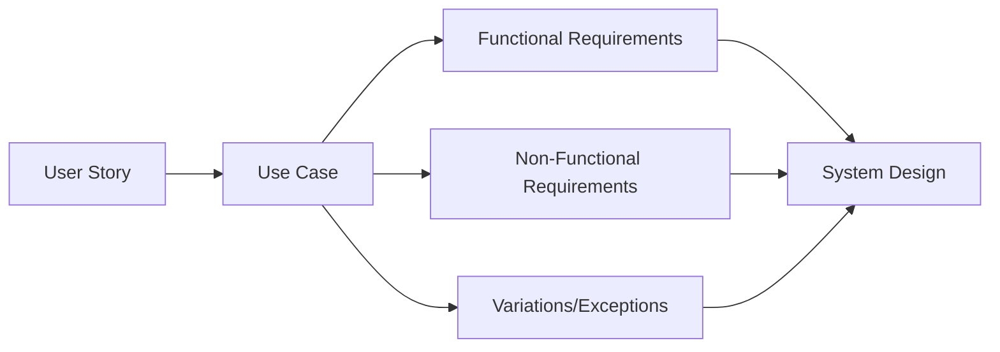
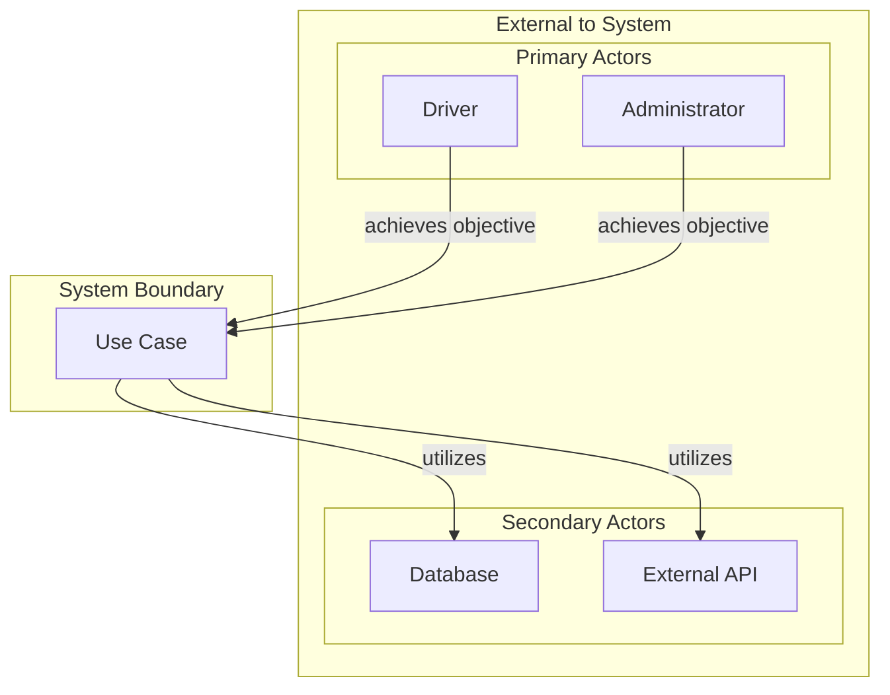
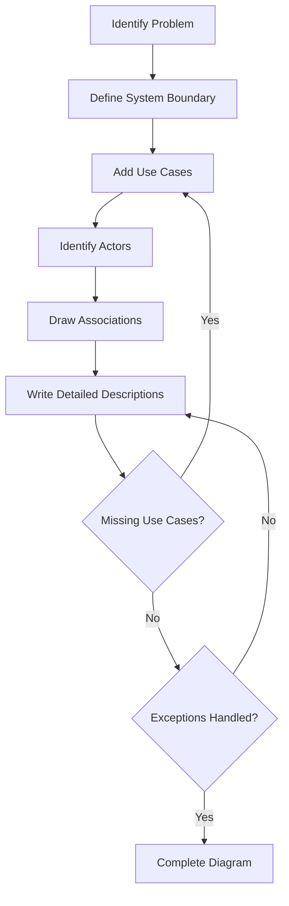
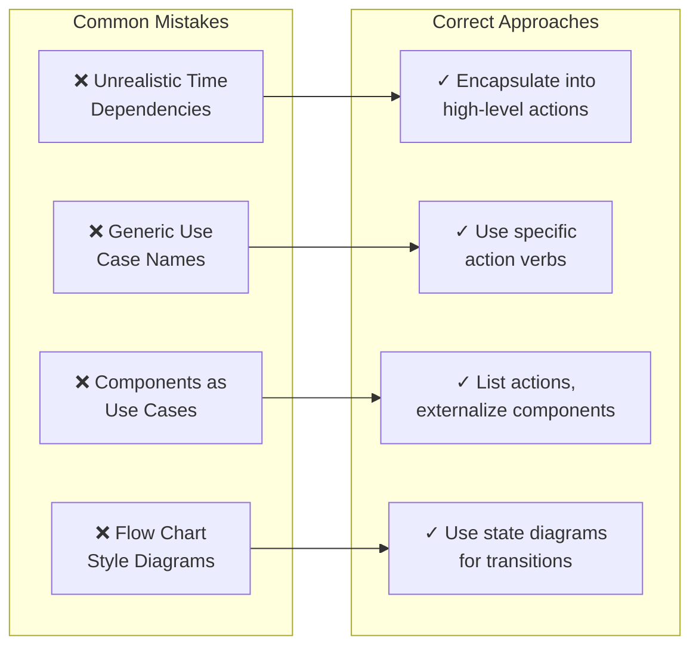

---
tags:
  - "#AgS"
  - "#CCT2"
  - UML
Topic: Use Cases | Context Diagrammer | UML | Analyse fasen
Semester: CCT2
Course: Agil systemudvikling
Litterature:
  - SSU kompendie
Created: 26-02-2026
---
- - -
# Table of Contents

1. [[#Analysis and System Definition|Analysis and System Definition]]
	1. [[#Analysis and System Definition#Purpose of Analysis Phase|Purpose of Analysis Phase]]
	2. [[#Analysis and System Definition#Use Case Analysis|Use Case Analysis]]
		1. [[#Use Case Analysis#Use Case Example: Changing Credit Card Information|Use Case Example: Changing Credit Card Information]]
		2. [[#Use Case Analysis#Issues Illustrated by the Example|Issues Illustrated by the Example]]
	3. [[#Analysis and System Definition#User Stories|User Stories]]
	4. [[#Analysis and System Definition#Use Case Diagrams|Use Case Diagrams]]
		1. [[#Use Case Diagrams#Key Elements|Key Elements]]
		2. [[#Use Case Diagrams#Advanced Relations|Advanced Relations]]
		3. [[#Use Case Diagrams#Component Overview|Component Overview]]
	5. [[#Analysis and System Definition#Defining the System Boundary and Use Cases|Defining the System Boundary and Use Cases]]
		1. [[#Defining the System Boundary and Use Cases#Process Steps|Process Steps]]
		2. [[#Defining the System Boundary and Use Cases#Detailed Example: Car Computer System|Detailed Example: Car Computer System]]
	6. [[#Analysis and System Definition#Making the Use Cases Explicit|Making the Use Cases Explicit]]
		1. [[#Making the Use Cases Explicit#Identifying Missing Use Cases|Identifying Missing Use Cases]]
		2. [[#Making the Use Cases Explicit#Handling Deviations and Exceptions|Handling Deviations and Exceptions]]
		3. [[#Making the Use Cases Explicit#Completion Criteria|Completion Criteria]]
	7. [[#Analysis and System Definition#Elements in Use Case Descriptions|Elements in Use Case Descriptions]]
		1. [[#Elements in Use Case Descriptions#Use Case Name|Use Case Name]]
		2. [[#Elements in Use Case Descriptions#Description|Description]]
		3. [[#Elements in Use Case Descriptions#Actors|Actors]]
		4. [[#Elements in Use Case Descriptions#Assumptions|Assumptions]]
		5. [[#Elements in Use Case Descriptions#Steps|Steps]]
		6. [[#Elements in Use Case Descriptions#Variations|Variations]]
		7. [[#Elements in Use Case Descriptions#Non-functional Requirements|Non-functional Requirements]]
		8. [[#Elements in Use Case Descriptions#Issues|Issues]]
	8. [[#Analysis and System Definition#Examples of Use Cases|Examples of Use Cases]]
		1. [[#Examples of Use Cases#Example One - Interdependent Actions|Example One - Interdependent Actions]]
		2. [[#Examples of Use Cases#Example Two - Generic Use Case Names|Example Two - Generic Use Case Names]]
		3. [[#Examples of Use Cases#Example Three - Components as Use Case Names|Example Three - Components as Use Case Names]]
		4. [[#Examples of Use Cases#Example Four - Flow Chart Like Use Case Diagram|Example Four - Flow Chart Like Use Case Diagram]]
	9. [[#Analysis and System Definition#Link Between Use Cases and Development Process|Link Between Use Cases and Development Process]]
		1. [[#Link Between Use Cases and Development Process#Breaking Down Use Cases|Breaking Down Use Cases]]
		2. [[#Link Between Use Cases and Development Process#Traceability Matrix|Traceability Matrix]]

# Analysis and System Definition

| Concept | Description | Key Element | UML Symbol |
|---------|-------------|-------------|------------|
| **Analysis Phase** | Defining system requirements and establishing unified stakeholder vision | Common understanding | N/A |
| **Use Case** | Series of steps actors perform to interact with the system | Actor interaction sequence | Oval/Ellipse |
| **User Story** | Value proposition format: "As a `<role>` I want `<feature>` so that `<benefit>`" | Role, Feature, Benefit | N/A |
| **System Boundary** | Square encapsulating use cases; defines system scope | What system can/cannot do | Rectangle |
| **Actor** | External entity with specific role interacting with system | Role-based definition | Stick figure |
| **Association** | Line connecting actor to use case; crosses boundary at interface | System interface point | Solid line |
| **Generalization** | Relationship between general and specialized use case | Inheritance relation | Arrow (hollow head) |
| **Extension** | Base use case extended by another (`<<extend>>`) | Conditional addition | Dashed arrow with label |
| **Inclusion** | Use case includes behavior of another (`<<include>>`) | Required sub-function | Dashed arrow with label |

---

## Purpose of Analysis Phase

The analysis phase focuses on defining system requirements and ensuring all stakeholders share a unified vision of the end objective.

>[!important] Critical Outcomes
>A successful analysis phase establishes:
>- **Common Understanding:** All parties agree on what the system should accomplish
>- **Clear User Interaction:** External users understand how to interact with the system in all situations
>- **Precise Scope:** Developers understand exactly what needs to be done and what does not

>[!tip] Scope Clarity
>Defining what *not* to do is essential. Time is costly, and development effort is easily wasted on unnecessary features if the boundaries are not clearly defined.

The primary methodology for analyzing the system and its requirements is [[Use Case Analysis]]. This approach integrates requirements analysis into the broader context of system design.

---

## Use Case Analysis

>[!info] Use Case
>A **use case** is a series of steps that one or more actors must perform to interact with the system.

Use case analysis provides a structured method for understanding how actors interact with the system to achieve specific objectives.

The following diagram illustrates how use case analysis fits into the broader requirements engineering process:



_Figure 1.1: Relationship between user stories, use cases, and system requirements showing how use cases generate functional requirements, non-functional requirements, and exception handling specifications._

### Use Case Example: Changing Credit Card Information

The following example illustrates a use case derived from instructions for a travel card system (Rejsekortet). It details the steps a customer must take to change the credit card linked to an automatic refill agreement.

>[!example] Procedure: Updating Auto-Refill Credit Card
>1. Log in to the website using a user name and password.
>2. Select "Tank-op-aftale" (Refill agreement) and choose to stop this option.
>3. Wait at least $24$ hours (but no more than $7$ days). Go to a station to perform a check-in followed immediately by a check-out. This action registers the termination of the "Tank-op-aftale."
>4. Wait at least $24$ hours.
>5. Return to the website and create a new "Tank-op-aftale" with the new credit card information.
>6. Wait at least $24$ hours (but no more than $7$ days). Go to a station to perform a check-in followed immediately by a check-out. This action registers the activation of the new "Tank-op-aftale."

### Issues Illustrated by the Example

This example serves as a cautionary tale, highlighting three major problems in system analysis and design.

**1. Implementation Before Analysis**

The procedure demonstrates the consequences of implementing a system before thoroughly analyzing how actors will use it. In this scenario, the system imposes strict conditions on the user (multiple waiting periods, physical station visits).

>[!warning] Consequence of Poor Analysis
>Ideally, the system should adapt to the user's needs. This awkward procedure suggests that developers may have realized the need to change credit card information only *after* the system was built, forcing a complex workaround rather than a redesign.

**2. Lack of Actor Iteration**

>[!warning] Consequence of Skipping Review
>If this use case had been presented to the public as a proposal before implementation, it likely would have been rejected as unacceptable. It clearly demonstrates the risk of failing to iterate use cases with the actual actors who must interact with the system.

**3. Missing User Perspective**

The system forces users to conform to technical constraints rather than designing the system around user needs. This indicates a failure to properly consider the user's context and workflow during the analysis phase.

---

## User Stories

Understanding requirements fundamentally relies on understanding the value a system creates for the user or customer within their specific context and role.

This value can be formulated using a standardized sentence structure.

![[Pasted image 20260226140507.png]]

_Figure 1.2: User story template showing the three-part structure: role, feature, and benefit._

>[!info] User Story Template
>The standard format for a user story is:
>
>**"As a `<role>` I want to `<feature>` so that `<benefit>`."**
>
>**Components:**
>- **`<role>`**: The person or entity interacting with the system
>- **`<feature>`**: The action or capability desired
>- **`<benefit>`**: The value or outcome achieved

>[!example] User Story Examples
>**Privacy Context:**
>- As a *Facebook user* I want to *protect my data* so that I can *preserve my privacy*.
>
>**Inventory Management:**
>- As a *janitor* I want to *be able to see my inventory list online* so that I can *always locate my stuff*.

This simple structure clarifies the specific value the system provides to a specific customer type. It forces explicit consideration of who benefits, what they need, and why they need it.

>[!warning] Importance of Shared Values
>While defining values may seem trivial, disagreeing on the values created by a system leads to significant project risks. If the value proposition is not clearly set, subsequent analysis will likely diverge, resulting in conflicting requirements and integration problems later in the development process.

User stories serve as the foundation for deriving use cases. Each user story can generate one or more use cases that detail how the system delivers the stated benefit.

---

## Use Case Diagrams

The primary purpose of use case diagrams is to create a simple and efficient overview of the system. The goal is to minimize the risk of misunderstanding by leaving as little room for interpretation as possible. These diagrams serve as a communication tool between all involved actors.

>[!abstract] Purpose of Use Case Diagrams
>A use case diagram portrays:
>- Which actors interact with the system
>- What the system can and cannot do
>- The overall interfaces that exist
>- The boundaries of system responsibility

### Key Elements

There are four fundamental elements in a use case diagram:

1. **Use Case:** Represented as an oval/bubble, it indicates that the system is able to perform a specific action. Quantity does not equal quality; the focus should be on relevant actions.

2. **System Boundary:** A square that encapsulates the Use Case bubbles. It explicitly defines the scope of the system—what is inside the box is what the system *can* do; what is outside is what it *cannot* do.

3. **Actors:** Entities external to the system boundary that interact with it. Actors can be individuals, groups, devices, or institutions. They are defined by the **role** they play relative to the system, not by their specific identity.

4. **Associations:** Lines that link Actors to Use Cases. The point where these lines cross the System Boundary represents the system's interface to the external world.

The following diagram illustrates the two categories of actors and their relationship to use cases:



_Figure 1.3: Actor classification showing primary actors (who achieve objectives) and secondary actors (utilized by the system during execution)._

### Advanced Relations

Three additional elements allow for more detailed or abstract relationships between actors and use cases:

- **Generalization:** A relationship between a generalized use case and a specialized version of it.
- **Extension:** A relationship where one use case extends the behavior of a base use case (labeled `<<extend>>`).
- **Inclusion:** A relationship where one use case includes the behavior of another (labeled `<<include>>`).

### Component Overview

| Component | Description | Representation |
|:---|:---|:---|
| **Use case** | A sequence of actions in which a set of actors interacts with the system and vice versa | Oval with name inside |
| **Actor** | A role that an entity takes in relation to the system itself | Stick figure with label |
| **System boundary** | Representation of the boundary between a system and its outside world | Rectangle enclosing use cases |
| **Association** | An interaction between an actor and the system | Solid line connecting actor to use case |
| **Generalization** | Relation between a generalized use case and a specialized use case | Arrow with hollow head pointing to general case |
| **Extension** | Relation between a base use case and an extension to a use case | Dashed arrow with `<<extend>>` label |
| **Inclusion** | Relation between a use case and one included in the other | Dashed arrow with `<<include>>` label |

_Table 1.1: Summary of use case diagram components, their descriptions, and visual representations._

![[Pasted image 20260226170232.png]]

_Figure 1.4: Showing all standard components including actors, system boundary, use cases, and various relationship types._

---

## Defining the System Boundary and Use Cases

The first step in the design process is to identify the specific problem to be addressed and define the system's boundaries.

The use case development process follows an iterative approach as shown below:



_Figure 1.5: Iterative use case development process showing the cyclical nature of refining use cases until all functionality and exceptions are captured._

Consider the goal of designing a custom car because existing options lack desired features. The process begins by specifying the system boundaries:

1. Draw a square to represent the system.
2. Give the system a name (e.g., "my ultimate car").

Once the boundary is established, the next step is to determine the system's capabilities. A guiding question is: *"What can I do with this system?"*

### Process Steps

**Adding Use Cases:** The answers are written inside the system boundary as ovals/bubbles.

>[!example] Initial Use Case Identification
>- If the system needs to move, add a bubble for "Accelerate car"
>- If it needs to stop, add "Brake car"
>- If it needs to change direction, add "Steer car"

**Identifying Actors:** After populating the system with use cases, the next step is to identify who or what will interact with it.

### Detailed Example: Car Computer System

>[!example] Scenario: Designing a Car Computer
>Imagine you are tasked with designing an on-board computer for a car to manage the engine and critical mechanical parts.
>
>**Step $1$: Define the Boundary**
>- Draw an empty box
>- Name it "Car computer"
>- This represents a system that currently does nothing
>
>**Step $2$: Add Functionalities**
>Insert use cases for essential actions:
>- "Start engine"
>- "Stop engine"
>- "Brake car"
>- "Speed car"
>- "Change gear"
>
>**Step $3$: Identify Actors**
>Determine who interacts with the system:
>- **Avoid generic terms:** Do not use "user," as this could refer to a driver, a passenger using the radio, or a mechanic
>- **Use specific roles:** Define actors by their specific interaction, such as "Driver," "RadioListener," or "Mechanics"
>
>**Step $4$: Identify External Interfaces**
>The computer does not work in isolation. Add external actors for the hardware it must control:
>- "Engine"
>- "Brakes"
>- "Transmission box"
>
>**Step $5$: Scope Verification**
>If asked if the computer controls the radio, the diagram provides an immediate answer: No, that functionality is not inside the system boundary.

![[Pasted image 20260226171353.png]]

_Figure 1.6: Car computer use case diagram showing system boundary, use cases, human actors (Driver), and hardware actors (Engine, Brakes, Transmission box)._

The resulting diagram serves to make the functionality of the computer explicit while clarifying the external interfaces.

>[!important] Key Purposes of Use Case Diagrams
>- Defining **system boundaries**
>- Visualizing **overall system functionality**
>- Identifying **external interfaces**
>- Providing **clarification** of scope
>- Facilitating **stakeholder communication**

>[!warning] Limitations of Diagrams
>Although useful for clarification, use case diagrams are not perfect. It is still possible to make bad assumptions about what is included or excluded. Care must be taken to ensure the diagram accurately reflects the necessary interactions.

---

## Making the Use Cases Explicit

Once the use cases, actors, and system boundaries are established, the next step is to explicitly define the interactions. This involves writing down the precise sequence of actions between the actors and the system.

>[!example] Use Case: Starting the Engine via Fingerprint
>**Sequence of Steps:**
>1. The driver places a finger on the touch panel for fingerprint identification.
>2. The system detects that a finger is present on the pad.
>3. The system scans the finger.
>4. The system checks the driver's internal authority level.
>5. The system accepts the identification and starts the engine.
>6. The driver removes their finger.

The primary purpose of this explicit detailing is to prevent misunderstandings, incorrect assumptions, and functional misinterpretations. It also serves as a direct method for identifying functional requirements.

>[!info] Deriving Functional Requirements
>For instance, the step where the system scans a finger implies a specific requirement:
>
>**"Given an authorized driver, the system must be able to correctly scan and identify the driver."**

### Identifying Missing Use Cases

Detailing a use case often reveals implicit requirements that highlight missing functionality.

>[!info] Implicit Requirements
>If a system must validate a driver, it implicitly requires a database of authorized users. This immediately raises the question: *How does the data get into that database?*

If a "Register new authorized driver" use case is missing from the diagram, it should be added. This creates an iteration in the design process.

>[!tip] Cost of Iteration
>Iterating on the design while it is still on paper is virtually costless. Discovering missing logic after implementation has begun—such as realizing a system cannot update credit card information—leads to significant trouble and expense.

### Handling Deviations and Exceptions

Use cases must account for deviations from the standard "happy path." It is insufficient to only describe the scenario where everything works correctly; the system's behavior during failure must also be defined.

>[!warning] Exception Handling
>If a user is **not** authorized, the system must have a defined response. This could include:
>- A visual "Not allowed" notification
>- An audible alarm
>- Security measures such as auto-locking the door
>
>These requirements may need clarification with the client to ensure they align with the broader product design.

![[Pasted image 20260226172922.png]]

_Figure 1.7: Use case flow diagram showing normal path and exception handling._

### Completion Criteria

At the conclusion of a successfully executed use case, the actor(s) must have accomplished the specific objective stated in the use case name.

>[!example] Completion Criteria Examples
>- **"Turn on engine":** The engine must be running
>- **"Brake car":** The speed of the car must have decreased measurably or the car must have stopped completely
>- **"Register new driver":** The driver's credentials must be stored in the database and the driver must be able to start the engine

---

## Elements in Use Case Descriptions

While UML does not explicitly mandate text descriptions for use cases, creating them is highly beneficial during design. A textual description ensures that all stakeholders can understand the interactions.

| Field | Description |
|:---|:---|
| **Use case Name** | Identifier and/or reference to other use cases |
| **Description** | Goal/objective to be achieved by the use case |
| **Actors** | List of actors in the use case (and short description/definition) |
| **Assumptions** | Conditions that must be true for the use case to correctly start and end |
| **Steps** | Interactions between actors and system needed to achieve the objective |
| **Variations** (optional) | Any variations in the use case |
| **Non-functional** (optional) | Any non-functional requirements needed for correct execution |
| **Issues** | Any issues related to the use case |

_Table 1.2: Standard fields for comprehensive use case descriptions._

### Use Case Name

This field links the description to the use case diagram. The title must match the text inside the bubble on the diagram. If the use case is triggered by another, references to those related use cases should be included here.

>[!tip] Naming Convention
>Use clear, action-oriented names that begin with a verb:
>- "Start Engine" (not "Engine Starting")
>- "Register Driver" (not "Driver Registration")
>- "Update Credit Card" (not "Credit Card Update")

### Description

This field defines the objective or goal. It states clearly what the expected outcome and achievements are for the actor(s) involved.

>[!example] Description Examples
>**Use Case:** Start Engine
>**Description:** The driver successfully starts the car's engine using fingerprint authentication, enabling the vehicle to be driven.
>
>**Use Case:** Register New Driver
>**Description:** An administrator adds a new authorized driver to the system database, including their fingerprint data and access permissions.

### Actors

This section lists all actors involved in the use case.

>[!important] Actor Definition Requirements
>- **Consistency:** Actors must be defined clearly and referenced by consistent names throughout the documentation
>- **Roles:** It is critical that readers understand the actor's role relative to the system—what can be assumed and what cannot
>- **Clear Boundaries:** Each actor should have a distinct role that doesn't overlap with others

**Types of Actors:**

- **Primary actors:** Those who achieve an objective from the use case
- **Secondary actors:** Those whom the use case utilizes during execution (e.g., an external database)

>[!example] Actor Definitions
>**Primary Actor:** Driver
>- Role: Person authorized to operate the vehicle
>- Interaction: Provides fingerprint for authentication, operates vehicle controls
>
>**Secondary Actor:** Fingerprint Database
>- Role: External system storing authorized driver credentials
>- Interaction: Provides authentication validation when queried

### Assumptions

This field lists conditions formulated as declarative statements that must be true (or false) for the use case to proceed.

>[!tip] Robustness and Assumptions
>The fewer assumptions a use case relies on, the more robust it is against an unknown or changing environment. These assumptions also serve as the foundation for use case extensions that handle scenarios where initial assumptions fail.

>[!example] Assumptions for "Start Engine"
>- The car battery has sufficient charge
>- The fingerprint scanner is operational
>- The driver's fingerprint is registered in the database
>- The car is in Park or Neutral gear
>- No critical system faults are present

### Steps

This field details the series of interactions required to achieve the objective.

A step is generally characterized by the format: `<Sequence Number>` : `<Interaction>`.

Complex logic can be represented using programming-like constructs:

- **Conditional Logic:** `IF` / `THEN` / `ELSE` clauses can branch the flow
- **Loops:** `REPEAT` / `UNTIL` can handle repetitive operations
- **Parallelism:** `IN PARALLEL` and the $\|$ operator denote simultaneous actions

>[!example] Logic Constructs in Use Case Steps
>**Conditional:**
>```
>1. IF fingerprint is valid THEN
>   1.1 Grant access
>   1.2 Enable engine start
>   ELSE
>   1.3 Display error message
>   1.4 Log failed attempt
>```
>
>**Repetitive:**
>```
>2. REPEAT
>   1.1 Request fingerprint scan
>   1.2 Validate fingerprint
>   UNTIL valid fingerprint detected OR max attempts reached
>```
>
>**Parallel:**
>```
>3. IN PARALLEL check battery level || verify gear position || scan for system faults
>4. IF all checks pass THEN proceed with engine start
>```

### Variations

Variations describe deviations from the normal flow of steps. They are formatted as:
`<Step Reference>` : `<List of variations separated with an *or*>`

>[!example] Car Computer Authority Check Variation
>In a standard flow, step $4$ might be: *The system checks internally the level of authority to this driver.*
>
>A variation might handle different scenarios:
>
>**Step Reference:** Step $\#4$
>
>**Variation:** Fingerprint not recognized *or* Driver authority level insufficient *or* Remote database unavailable
>
>**Sub-steps for "Remote database unavailable" variation:**
>```
>#4.1 Car computer attempts local cache lookup
>#4.2 IF driver found in cache AND cache not expired THEN
>     #4.2.1 Proceed with local authorization
>     #4.2.2 Log offline authentication event
>     ELSE
>     #4.2.3 Deny access
>     #4.2.4 Display "System unavailable" message
>```

### Non-functional Requirements

These requirements describe criteria other than functionality, such as performance, reliability, security, or usability. They are formatted as:
`<Keyword>` : `<Requirement>`

>[!example] Non-functional Requirements
>**Performance:** Fingerprint authentication must complete within $2$ seconds under normal conditions.
>
>**Security:** Fingerprint data must be stored encrypted using AES-$256$ encryption.
>
>**Reliability:** The system must maintain $99.9\%$ uptime during normal operating conditions.
>
>**Usability:** Error messages must be displayed in the driver's preferred language as configured in user settings.

### Issues

This field highlights special concerns related to the use case, such as implementation challenges, dependencies on other actors, or unresolved questions.

>[!warning] Issues as Potential Show Stoppers
>Issues can become "show stoppers" for implementation. For example, a variation involving a remote database check introduces issues regarding the storage of private, sensitive data, potentially requiring specialized government systems. These must be taken seriously.

>[!example] Issues Documentation
>**Use Case:** Start Engine with Remote Authentication
>
>**Issues:**
>1. **Privacy Concern:** Storing biometric data in cloud database may violate GDPR regulations
>2. **Network Dependency:** System becomes inoperable in areas without cellular coverage
>3. **Response Time:** Remote database queries may exceed acceptable authentication delay
>4. **Security:** Transmitting fingerprint data over network creates potential attack vector
>5. **Cost:** Cloud database subscription adds recurring operational expense

---

## Examples of Use Cases

When learning to create use cases and diagrams, several common mistakes often occur. The following examples highlight misunderstandings and issues typically encountered by students.

The diagram below provides a quick overview of the four common mistakes and their corrections:



_Figure 1.8: Overview of common use case diagram mistakes and their corresponding solutions. Each mistake type maps directly to a corrective approach._

### Example One - Interdependent Actions

One diagram illustrating a car computer shows three distinct use cases: "Cranking," "Start up," and "Idle." These phases describe the engine's operation: using the battery to turn the axle (cranking), warming up (start up), and waiting for acceleration (idle).

![[Pasted image 20260226174233.png]]

_Figure 1.9: Problematic use case diagram showing unrealistic time-dependent user actions for engine operation._

>[!warning] Issue: Unrealistic Time Dependencies
>**Problems with this diagram:**
>- The diagram implies the user must manually execute "Cranking" and "Start up" in sequence
>- Since cranking takes only seconds, this requires impossibly fast user interaction
>- The diagram contains ambiguous arrows and isolated use cases ("Idle") that do not reflect realistic system operation
>- Actors cannot realistically control sub-second processes

The most important lesson is to avoid time dependencies that cannot be realistically executed by the actor.

>[!tip] Solution: Encapsulation
>Low-level operations like cranking and start-up should be encapsulated into higher-level use cases like "Start Engine" and "Stop Engine." This leaves the complex timing details to the Car Computer system, while the Driver simply interacts with the high-level objective.

![[Pasted image 20260226174301.png]]

_Figure 1.10: Corrected use case diagram with appropriate abstraction level showing "Start Engine" and "Stop Engine" as user-facing actions._

### Example Two - Generic Use Case Names

A common problem is using vague or generic names for use cases, such as "Engine Control" or "ON mode 1." These names fail to explain what the system actually does.

![[Pasted image 20260226174325.png]]

_Figure 1.11: Problematic diagram using generic names and confusing visual representations for actors._

>[!warning] Issue: Ambiguity and Visual Distraction
>**Problems with this diagram:**
>- Generic names like "Engine Control" have many meanings and don't specify the action
>- "ON mode 1" is cryptic and requires external documentation to understand
>- Using complex icons (like a bus) instead of a standard stick figure confuses the definition of the actor
>- A stick figure has a clear definition: a role
>- The diagram doesn't communicate what value the system provides

A better approach uses specific action verbs.

![[Pasted image 20260226174345.png]]

_Figure 1.12: Improved diagram with specific action-oriented names like "Accelerate car" and standard stick figure representations._

>[!tip] Solution: Specific Naming
>Replace "Engine Control" with **"Accelerate car."** This clearly defines the action. Specific drive modes (Gasolin, Electric, Flywheel) can be included as extensions or included cases, clarifying that they are part of the acceleration process managed by the system, not necessarily independent driver actions.

### Example Three - Components as Use Case Names

Another frequent mistake is listing system components (e.g., "Engine," "Gasoline tank") as use cases inside the system boundary.

![[Pasted image 20260226174415.png]]

_Figure 1.13: Incorrect diagram listing physical components as use cases instead of actions._

>[!warning] Issue: Confusing Structure with Function
>**Problems with this diagram:**
>- Naming use cases after components describes the physical structure rather than the system's functionality
>- In the context of designing a Car Computer, it makes little sense to say the computer "does" an engine or a gas tank
>- This confuses what the system **has** (components) with what the system **does** (functions)
>- Actors have no meaningful interaction with these "use cases"

The correct approach focuses on *what* the system does with those components.

![[Pasted image 20260226174444.png]]

_Figure 1.14: Corrected diagram showing actions performed with components, and physical components moved outside as external actors._

>[!tip] Solution: Actions and External Actors
>Transform component names into actions:
>- Instead of "Engine," use **"Accelerate car"** or **"Start engine"**
>- Instead of "Gasoline tank," use **"Show fuel status"** or **"Monitor fuel level"**
>
>Furthermore, physical components should be moved outside the system boundary as **external actors** that the system interacts with.

### Example Four - Flow Chart Like Use Case Diagram

Diagrams should not be used as flow charts. A diagram showing states like "State 1" or "State 2" with flow arrows is incorrect use of a use case diagram.

![[Pasted image 20260226174532.png]]

_Figure 1.15: Incorrect use of use case diagram as a flow chart showing system states and transitions._

>[!warning] Issue: Incorrect Diagram Type
>**Problems with this diagram:**
>- Use case diagrams define *capabilities*, not the flow of events or system states
>- In a flow-chart style diagram, actors often become disconnected from the use cases, rendering the diagram useless for defining interactions
>- State transitions belong in state diagrams, not use case diagrams
>- The diagram doesn't show who does what or what value is provided

The correction involves renaming bubbles to actions and linking the actor to the relevant capabilities.

![[Pasted image 20260226174546.png]]

_Figure 1.16: Corrected diagram showing proper use cases as capabilities with clear actor associations._

>[!abstract] The Goal of Correct Diagrams
>There is no single "correct" answer for a use case diagram. The goal is to create a diagram that makes sense to all involved, particularly the customer. The primary objective is to agree on what the system shall be able to do to avoid building a product the customer does not need.

---

## Link Between Use Cases and Development Process

Mapping use cases to development activities helps maintain focus, especially when time is limited. It provides a structured approach to prioritizing work effort.

### Breaking Down Use Cases

Consider the use case "Brake Car." Analysis reveals the need for specific hardware and software components:

- **Actuators:** Physical components to brake the wheels
- **Sensors:** To feed back current velocity
- **Lighting System:** To indicate braking
- **Engine Controller Software:** To adjust (stop) fuel injection during braking

![[Pasted image 20260226174613.png]]

_Figure 1.17: Breakdown of "Brake Car" use case showing required subsystems and their relationships._

This breakdown creates a development plan involving analysis, design, implementation, and testing for each component.

>[!info] Integration Testing with Stubs
>During the testing phase, some subsystems (like the lighting system or engine controller) may not be finalized. To test the "Brake Car" functionality, developers can use **stubs**—simulated modules that mimic the functionality of missing components. This requires interfaces to be clearly defined early in the process.

>[!example] Stub Implementation Strategy
>**Scenario:** Testing "Brake Car" before engine controller is complete
>
>**Approach:**
>```
>1. Define interface for engine controller: reduceThrottle(percentage)
>2. Create stub that:
>   2.1 Accepts the function call
>   2.2 Logs the request
>   2.3 Returns success confirmation
>3. Test braking logic with stub in place
>4. Replace stub with actual engine controller when available
>5. Re-run integration tests to verify real component
>```

### Traceability Matrix

A structured matrix can summarize the relationship between use cases and the modules required to implement them.

| Use Case | Module $1$ (Brakes) | Module $2$ (Sensors) | Module $3$ (Lights) | Module $4$ (Engine Controller) |
|:---|:---|:---|:---|:---|
| **Brake Car** | $\checkmark$ | $\checkmark$ | $\checkmark$ | $\checkmark$ |
| **Accelerate Car** | | $\checkmark$ | | $\checkmark$ |
| **Turn on Lights** | | | $\checkmark$ | |

_Table 1.3: Traceability matrix showing dependencies between use cases and implementation modules._

**Legend:** $\checkmark$ indicates that the use case requires the corresponding module for implementation. Empty cells indicate no dependency.

![[Pasted image 20260226174637.png]]

_Figure 1.18: Visual representation of traceability matrix showing use case to module dependencies._

>[!tip] Project Management Benefits
>This matrix allows for:
>
>**Progress Tracking:** Easily seeing which use cases are executable based on completed modules
>- If Module $1$ and Module $2$ are complete, partial "Brake Car" testing can begin
>- "Turn on Lights" can be fully tested once Module $3$ is complete
>
>**Prioritization:** Delegating priority to specific modules based on the need for proof-of-concept use cases
>- If "Brake Car" is the most critical safety feature, prioritize all modules marked with $\checkmark$ in that row
>- Module $2$ (Sensors) appears in multiple use cases, suggesting it should be prioritized for development
>
>**Focused Work:** Structuring work effort based on functional needs rather than just what is "fun" or easy to do
>- Teams can be assigned specific modules with clear understanding of which use cases depend on their work
>- Dependencies become visible, preventing blocking situations

>[!important] Integration Strategy
>The traceability matrix reveals the optimal integration order:
>1. Develop Module $2$ (Sensors) first - required by $2$ use cases
>2. Develop Module $4$ (Engine Controller) second - enables "Accelerate Car" testing
>3. Develop Module $1$ (Brakes) and Module $3$ (Lights) in parallel - each only blocks $1$ use case
>4. This approach maximizes the number of testable use cases as early as possible

---

>[!summary] Summary: Analysis and System Definition
>
>### Core Principles
>- **Analysis** establishes common understanding between all stakeholders about system requirements and scope
>- **Use case analysis** is the primary method for defining system requirements and interactions
>- **Clear scope definition**—including what the system will NOT do—is critical to prevent wasted effort
>
>---
>
>### User Stories
>| Component | Description |
>|-----------|-------------|
>| **Format** | "As a `<role>` I want `<feature>` so that `<benefit>`" |
>| **Purpose** | Forces explicit consideration of who benefits, what they need, and why |
>| **Value** | Serves as foundation for deriving use cases; shared propositions prevent conflicts |
>
>---
>
>### Use Case Diagram Elements
>
>| Element | Purpose | Symbol |
>|---------|---------|--------|
>| System Boundary | Defines scope (can/cannot do) | Rectangle |
>| Actor | Roles interacting with system | Stick figure |
>| Use Case | System capabilities | Oval |
>| Association | Interface points | Solid line |
>| `<<extend>>` | Conditional behavior | Dashed arrow |
>| `<<include>>` | Required sub-function | Dashed arrow |
>
>---
>
>### Use Case Documentation Fields
>| Field | Purpose |
>|-------|---------|
>| **Name** | Action-oriented, verb-first identifier |
>| **Description** | Clear objective statement |
>| **Actors** | Primary (achieve objective) and Secondary (utilized) |
>| **Assumptions** | Conditions for success |
>| **Steps** | Detailed interactions with `IF`/`THEN`/`ELSE`, `REPEAT`/`UNTIL`, `IN PARALLEL` |
>| **Variations** | Exception handling |
>| **Non-functional** | Performance ($2$s response), security (AES-$256$), reliability ($99.9\%$ uptime) |
>| **Issues** | Show-stoppers and concerns |
>
>---
>
>### Common Mistakes and Solutions
>| Mistake | Problem | Solution |
>|---------|---------|----------|
>| Unrealistic time dependencies | Actors cannot control sub-second processes | Encapsulate into higher-level use cases |
>| Generic names | "Engine Control" is ambiguous | Use specific verbs: "Accelerate car" |
>| Components as use cases | Confuses structure with function | List actions, move components to external actors |
>| Flow chart style | Wrong diagram type | Use state diagrams for transitions |
>
>---
>
>### Development Integration
>| Concept | Benefit |
>|---------|---------|
>| **Traceability matrices** | Map use cases to required modules |
>| **Prioritization** | Focus on modules needed by critical use cases |
>| **Stubs** | Enable integration testing before all components complete |
>| **Key insight** | Iterating on paper is virtually costless; post-implementation changes are expensive |

