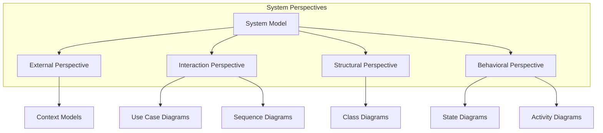
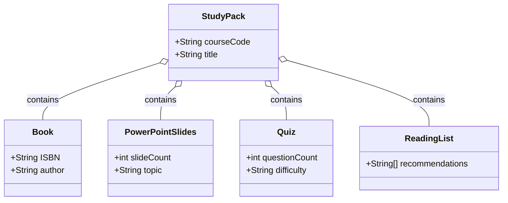
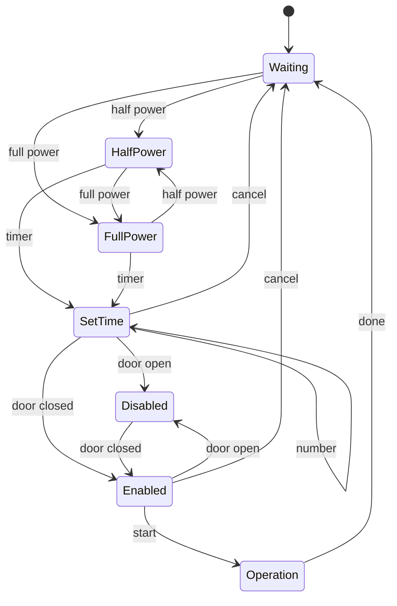
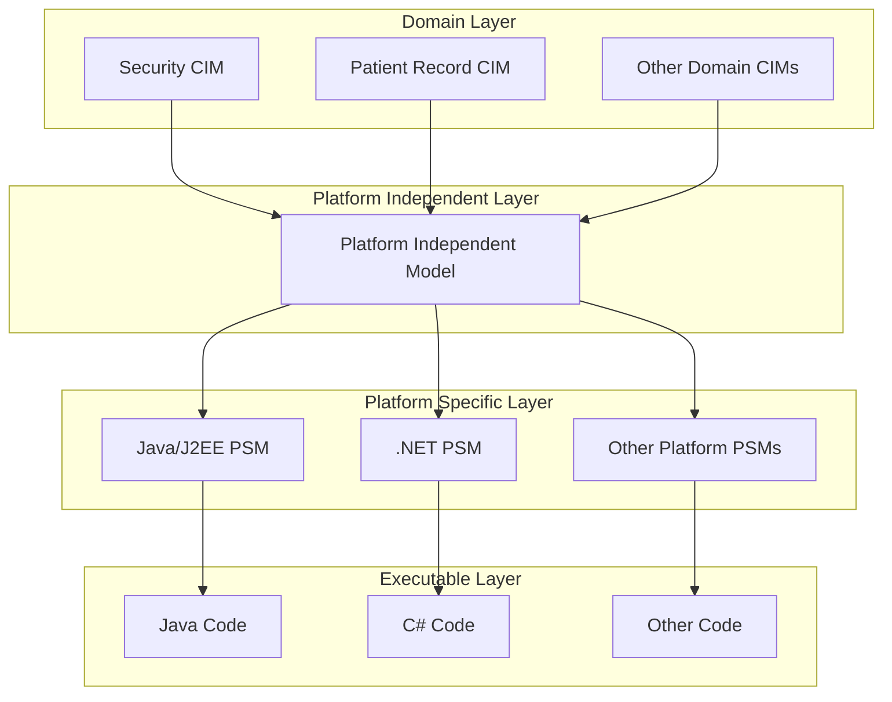

---
tags:
  - "#AgS"
  - "#CCT2"
Topic: System Modeling
Semester: CCT2
Course: Agil systemudvikling
Litterature:
  - Software Engineering, 9th ed.
Created: 05-03-2026
---
- - -
# Table of Contents

1. [[#System Models|System Models]]
	1. [[#System Models#Introduction to System Modeling|Introduction to System Modeling]]
		1. [[#Introduction to System Modeling#Purpose of System Models|Purpose of System Models]]
	2. [[#System Models#Fundamental Characteristics of Models|Fundamental Characteristics of Models]]
		1. [[#Fundamental Characteristics of Models#System Perspectives|System Perspectives]]
		2. [[#Fundamental Characteristics of Models#Essential UML Diagram Types|Essential UML Diagram Types]]
	3. [[#System Models#Model Usage and Flexibility|Model Usage and Flexibility]]
		1. [[#Model Usage and Flexibility#Three Common Uses of Graphical Models|Three Common Uses of Graphical Models]]
	4. [[#System Models#Context Models|Context Models]]
		1. [[#Context Models#Defining System Boundaries|Defining System Boundaries]]
		2. [[#Context Models#Non-Technical Factors in Boundary Definition|Non-Technical Factors in Boundary Definition]]
		3. [[#Context Models#Context Model Components|Context Model Components]]
		4. [[#Context Models#Activity Diagrams for Process Modeling|Activity Diagrams for Process Modeling]]
	5. [[#System Models#Interaction Models|Interaction Models]]
		1. [[#Interaction Models#Types of Interaction|Types of Interaction]]
		2. [[#Interaction Models#Two Approaches to Interaction Modeling|Two Approaches to Interaction Modeling]]
	6. [[#System Models#Use Case Modeling|Use Case Modeling]]
		1. [[#Use Case Modeling#Basic Use Case Notation|Basic Use Case Notation]]
		2. [[#Use Case Modeling#Providing Detail|Providing Detail]]
	7. [[#System Models#Sequence Diagrams|Sequence Diagrams]]
		1. [[#Sequence Diagrams#Sequence Diagram Elements|Sequence Diagram Elements]]
		2. [[#Sequence Diagrams#Alternative Flows|Alternative Flows]]
		3. [[#Sequence Diagrams#Complex Sequence Diagram Example|Complex Sequence Diagram Example]]
	8. [[#System Models#Structural Models|Structural Models]]
		1. [[#Structural Models#Types of Structural Models|Types of Structural Models]]
	9. [[#System Models#Class Diagrams|Class Diagrams]]
		1. [[#Class Diagrams#Levels of Detail in Class Diagrams|Levels of Detail in Class Diagrams]]
		2. [[#Class Diagrams#Class Diagrams and Semantic Data Models|Class Diagrams and Semantic Data Models]]
		3. [[#Class Diagrams#Detailed Class Representation|Detailed Class Representation]]
	10. [[#System Models#Generalization|Generalization]]
		1. [[#Generalization#Generalization in System Modeling|Generalization in System Modeling]]
		2. [[#Generalization#Understanding the Generalization Diagram|Understanding the Generalization Diagram]]
	11. [[#System Models#Aggregation|Aggregation]]
	12. [[#System Models#Behavioral Models|Behavioral Models]]
		1. [[#Behavioral Models#Types of Stimuli|Types of Stimuli]]
		2. [[#Behavioral Models#System Types Based on Stimulus|System Types Based on Stimulus]]
	13. [[#System Models#Data-Driven Modeling|Data-Driven Modeling]]
		1. [[#Data-Driven Modeling#Data-Flow Diagrams and UML|Data-Flow Diagrams and UML]]
		2. [[#Data-Driven Modeling#Alternative: Sequence Diagrams for Data Processing|Alternative: Sequence Diagrams for Data Processing]]
	14. [[#System Models#Event-Driven Modeling|Event-Driven Modeling]]
		1. [[#Event-Driven Modeling#State Diagrams|State Diagrams]]
		2. [[#Event-Driven Modeling#Example: Microwave Oven Control Software|Example: Microwave Oven Control Software]]
		3. [[#Event-Driven Modeling#UML State Diagram Notation|UML State Diagram Notation]]
		4. [[#Event-Driven Modeling#Microwave Oven States|Microwave Oven States]]
		5. [[#Event-Driven Modeling#Microwave Oven Stimuli|Microwave Oven Stimuli]]
		6. [[#Event-Driven Modeling#Adding Detail to State Diagrams|Adding Detail to State Diagrams]]
		7. [[#Event-Driven Modeling#Managing Complexity: Superstates|Managing Complexity: Superstates]]
	15. [[#System Models#Model-Driven Engineering|Model-Driven Engineering]]
		1. [[#Model-Driven Engineering#MDE vs. MDA|MDE vs. MDA]]
		2. [[#Model-Driven Engineering#Arguments For and Against MDE|Arguments For and Against MDE]]
		3. [[#Model-Driven Engineering#Successful Applications|Successful Applications]]
	16. [[#System Models#Model-Driven Architecture|Model-Driven Architecture]]
		1. [[#Model-Driven Architecture#Three Types of Abstract System Models in MDA|Three Types of Abstract System Models in MDA]]
		2. [[#Model-Driven Architecture#Model Transformations|Model Transformations]]
		3. [[#Model-Driven Architecture#PIM to PSM Translation Maturity|PIM to PSM Translation Maturity]]
		4. [[#Model-Driven Architecture#Limitations of Standard MDA Tools|Limitations of Standard MDA Tools]]
		5. [[#Model-Driven Architecture#MDA and Agile Methods|MDA and Agile Methods]]
	17. [[#System Models#Executable UML|Executable UML]]
		1. [[#Executable UML#UML Design vs. Programming Language|UML Design vs. Programming Language]]
		2. [[#Executable UML#Creating an Executable Subset|Creating an Executable Subset]]
		3. [[#Executable UML#Specifying Dynamic Behavior|Specifying Dynamic Behavior]]

# System Models

| Concept | Description |
|---------|-------------|
| **System Modeling** | Developing abstract models representing different views/perspectives of a system using graphical notation (typically UML) |
| **CIM** | Computation Independent Model - models domain abstractions without implementation details |
| **PIM** | Platform Independent Model - models system operation without reference to implementation platform |
| **PSM** | Platform Specific Model - platform-specific transformation of PIM for each application platform |
| **MDA** | Model-Driven Architecture - model-focused design approach using UML subset to generate code from models |
| **MDE** | Model-Driven Engineering - approach where models (not programs) are principal development outputs |
| **xUML** | Executable UML - semantically well-defined UML subset enabling automated model-to-code transformation |
| **OCL** | Object Constraint Language - declarative language for specifying dynamic behavior in executable models |

---

## Introduction to System Modeling

>[!info] **Definition: System Modeling**
>System modeling is the process of developing abstract models of a system, with each model presenting a different view or perspective of that system.

System modeling typically uses **graphical notation** based on the **Unified Modeling Language (UML)**. It is also possible to develop formal (mathematical) models of a system, usually as a detailed system specification.

### Purpose of System Models

Models serve different purposes throughout the software development lifecycle:

**During Requirements Engineering:**
- Models of existing systems help clarify what the current system does
- Used as a basis for discussing strengths and weaknesses
- Lead to requirements for the new system

**During Design and Implementation:**
- Models of the new system help explain proposed requirements to stakeholders
- Engineers use models to discuss design proposals
- Models document the system for implementation
- In model-driven engineering, models can generate complete or partial system implementations

---

## Fundamental Characteristics of Models

>[!important] **The Nature of Abstraction**
>The most important aspect of a system model is that it leaves out detail. A model is an *abstraction* of the system being studied rather than an alternative representation of that system. An abstraction deliberately simplifies and picks out the most salient characteristics.

>[!abstract] **Analogy: Models as Maps**
>Think of a system model like a map of a city. A street map doesn't show every building, tree, or person—it deliberately omits these details to highlight what matters: roads, intersections, and landmarks. A subway map goes further, distorting actual geography to emphasize connections between stations. Neither map is "wrong"—each is an abstraction designed for a specific purpose. Similarly, a system model isn't a complete replica of the system; it's a simplified representation that highlights the aspects most relevant to your current task, whether that's understanding user interactions, data flow, or system states.

### System Perspectives

You may develop different models to represent the system from different perspectives:

1. **External Perspective** - Model the context or environment of the system
2. **Interaction Perspective** - Model interactions between a system and its environment or between system components
3. **Structural Perspective** - Model the organization of a system or the structure of data processed by the system
4. **Behavioral Perspective** - Model the dynamic behavior of the system and how it responds to events

_Figure 1.1: Relationship between system perspectives and the UML diagram types used to model each perspective._

### Essential UML Diagram Types

>[!summary] **Five Core Diagram Types**
>Five diagram types can represent the essentials of a system:
>1. **Activity diagrams** - Show activities involved in a process or data processing
>2. **Use case diagrams** - Show interactions between a system and its environment
>3. **Sequence diagrams** - Show interactions between actors and the system and between system components
>4. **Class diagrams** - Show object classes in the system and associations between these classes
>5. **State diagrams** - Show how the system reacts to internal and external events

---

## Model Usage and Flexibility

>[!tip] **Flexibility in Notation**
>When developing system models, you can often be flexible in the way that graphical notation is used. You do not always need to stick rigidly to the details of a notation. The detail and rigor of a model depends on how you intend to use it.

### Three Common Uses of Graphical Models

| Use Case | Characteristics | Requirements |
|----------|----------------|--------------|
| **Facilitating Discussion** | Stimulate discussion about existing or proposed systems | Models may be incomplete; notation used informally |
| **Documenting Systems** | Record existing system structure and behavior | Moderate completeness; semi-formal notation |
| **Generating Implementation** | Part of model-based development process | Must be complete and correct; formal notation |

_Table 1.1: Three approaches to using graphical models with varying levels of formality and completeness._

---

## Context Models

>[!info] **Purpose of Context Models**
>At an early stage in the specification of a system, you should decide on the system boundaries. This involves working with system stakeholders to decide what functionality should be included in the system and what is provided by the system's environment.

### Defining System Boundaries

The boundary between a system and its environment varies in clarity:

**Clear Boundaries:**
- When an automated system is replacing an existing manual or computerized system
- The new system's environment is usually the same as the existing system's environment

**Flexible Boundaries:**
- Decided during the requirements engineering process
- Requires stakeholder collaboration to determine scope

>[!example] **System Boundary Decision: Mental Healthcare Patient Information System**
>When developing a patient information system for mental healthcare, you must decide:
>
>- **Option 1:** Focus exclusively on collecting information about consultations (using other systems for personal patient information)
>  - *Advantage:* Avoids data duplication
>  - *Disadvantage:* Slower information access; system unavailable if other systems are down
>
>- **Option 2:** Collect both consultation information AND personal patient information
>  - *Advantage:* Faster access; system independence
>  - *Disadvantage:* Data duplication

### Non-Technical Factors in Boundary Definition

>[!warning] **Political and Organizational Influences**
>The definition of a system boundary is not a value-free judgment. Social and organizational concerns may determine boundary position based on non-technical factors.

>[!example] **Non-Technical Boundary Decisions**
>A system boundary may be positioned to:
>- Allow all analysis to occur at one site
>- Avoid consulting a particularly difficult manager
>- Increase system cost so the development division must expand
>- Align with existing organizational structures

### Context Model Components

![[Pasted image 20260305075203.png]]

_Figure 1.2: Context diagram showing the MHC-PMS system and its relationships with external systems in the healthcare environment._

>[!note] **Limitations of Simple Context Models**
>Context models normally show that the environment includes several other automated systems. However, they do not show:
>- Types of relationships between systems
>- Whether systems produce or consume data
>- Whether systems share data
>- Connection types (networked vs. direct)
>- Physical co-location
>
>These relationships affect requirements and design, so context models are used alongside other models like business process models.

### Activity Diagrams for Process Modeling

![[Pasted image 20260305080025.png]]

_Figure 1.3: Activity diagram showing the patient involuntary detention process with decision points, activities, and data flows._

>[!info] **Activity Diagram Elements**
>Activity diagrams show the activities that make up a system process and the flow of control from one activity to another:
>- **Filled circle:** Start of process
>- **Filled circle inside another circle:** End of process
>- **Rectangles with round corners:** Activities (specific sub-processes)
>- **Objects:** May be included to show data flow

>[!example] **Mental Health Detention Safeguards**
>Patients who are a danger to themselves or others may need to be detained against their will. Legal safeguards include:
>- Regular review of detention decisions
>- Prevention of indefinite detention without good reason
>
>The MHC-PMS ensures these safeguards are implemented through its workflow processes.

---

## Interaction Models

>[!info] **Purpose of Interaction Models**
>All systems involve interaction of some kind. Modeling these interactions helps:
>- Identify user requirements (user interaction)
>- Highlight communication problems (system-to-system interaction)
>- Understand if proposed structure delivers required performance and dependability (component interaction)

### Types of Interaction

**User Interaction:**
- User inputs and outputs

**System-to-System Interaction:**
- Communication between the system being developed and other systems

**Component Interaction:**
- Interactions between components of the system

### Two Approaches to Interaction Modeling

1. **Use Case Modeling** - Primarily for interactions between a system and external actors (users or other systems)
2. **Sequence Diagrams** - For interactions between system components (may include external agents)

>[!tip] **Complementary Use**
>Use case models and sequence diagrams present interaction at different levels of detail and may be used together. The details of interactions in a high-level use case may be documented in a sequence diagram.

---

## Use Case Modeling

>[!info] **Use Case Definition**
>Each use case represents a discrete task that involves external interaction with a system.

### Basic Use Case Notation

In its simplest form:
- **Ellipse:** Represents the use case
- **Stick figures:** Represent actors involved in the use case

### Providing Detail

Use case diagrams give a simple overview, but require additional detail:

| Detail Format | When to Use |
|---------------|-------------|
| Simple textual description | Quick overview |
| Structured table description | Moderate detail needed |
| Sequence diagram | High detail required |

_Table 2.1: Three approaches to documenting use case details, from simplest to most detailed._

---

## Sequence Diagrams

>[!info] **Purpose of Sequence Diagrams**
>Sequence diagrams in the UML are primarily used to model:
>- Interactions between actors and objects in a system
>- Interactions between objects themselves
>
>As the name implies, a sequence diagram shows the sequence of interactions that take place during a particular use case or use case instance.

### Sequence Diagram Elements

**Notation:**
- **Objects and actors:** Listed along the top
- **Dotted vertical line:** Drawn from each object/actor
- **Rectangle on dotted line:** Indicates the lifeline of the object (time involved in computation)
- **Annotated arrows:** Show interactions between objects
- **Arrow annotations:** Indicate calls to objects, their parameters, and return values

**Reading Direction:** Top to bottom

### Alternative Flows

The `alt` box notation is used to show alternatives, with conditions indicated in square brackets.

![[Pasted image 20260305081344.png]]

_Figure 3.1: Sequence diagram showing the ViewInfo interaction for viewing patient information with authorization check._

>[!example] **Step-by-Step: Viewing Patient Information**
>1. The medical receptionist triggers the `ViewInfo` method in an instance `P` of the `PatientInfo` object class, supplying the patient's identifier `PID`. `P` is a user interface object displayed as a form showing patient information.
>
>2. The instance `P` calls the database to return the required information, supplying the receptionist's identifier to allow security checking (at this stage, we don't care where this UID comes from).
>
>3. The database checks with an authorization system that the user is authorized for this action.
>
>4. **If authorized:** Patient information is returned and a form on the user's screen is filled in.
>   **If authorization fails:** An error message is returned.

### Complex Sequence Diagram Example

![[Pasted image 20260305081508.png]]

_Figure 3.2: Sequence diagram showing the transfer of data to a patient record system with object creation and multiple authorization checks._

>[!example] **Step-by-Step: Patient Record System Transfer**
>1. The receptionist logs on to the PRS (Patient Record System).
>
>2. Two options are available:
>   - Direct transfer of updated patient information to the PRS
>   - Transfer of summary health data from the MHC-PMS to the PRS
>
>3. In each case, the receptionist's permissions are checked using the authorization system.
>
>4. **Personal Information Transfer:** May be transferred directly from the user interface object to the PRS.
>   **Summary Record Transfer:** A summary record may be created from the database and then transferred (object creation is shown).
>
>5. On completion of the transfer, the PRS issues a status message and the user logs off.

>[!tip] **Level of Detail in Sequence Diagrams**
>Unless using sequence diagrams for code generation or detailed documentation, you don't have to include every interaction. For early development models supporting requirements engineering and high-level design, many interactions depend on implementation decisions and can be omitted.

---

## Structural Models

>[!info] **Purpose of Structural Models**
>Structural models of software display the organization of a system in terms of the components that make up that system and their relationships.

### Types of Structural Models

| Type | Description | Purpose |
|------|-------------|---------|
| **Static Models** | Show the structure of the system design | Architectural design |
| **Dynamic Models** | Show the organization of the system when executing | Runtime behavior |

_Table 4.1: Two types of structural models with different perspectives on system organization._

>[!warning] **Static vs. Dynamic Organization**
>The dynamic organization of a system as a set of interacting threads may be very different from a static model of the system components.

**UML Diagrams for Structural Models:**
- Component diagrams
- Package diagrams
- Deployment diagrams

---

## Class Diagrams

>[!info] **Purpose of Class Diagrams**
>Class diagrams are used when developing an object-oriented system model to show:
>- Classes in a system
>- Associations between these classes

**Key Concepts:**
- **Object Class:** A general definition of one kind of system object
- **Association:** A link between classes indicating a relationship (each class may need knowledge of its associated class)

### Levels of Detail in Class Diagrams

Class diagrams can be expressed at different levels of detail:

**Early Modeling:**
- Represent real-world objects (patient, prescription, doctor, etc.)
- Simplest representation: class name in a box
- Show existence of associations with lines between classes

**Implementation:**
- Define additional implementation objects
- Provide functionality for the system

![[Pasted image 20260305082041.png]]

_Figure 4.1: Simple class diagram showing $1$:$1$ relationship between Patient and Patient Record classes._

>[!example] **Simple Association**
>Each end of the association is annotated with a $1$, meaning there is a $1$:$1$ relationship between objects of these classes:
>- Each patient has exactly one record
>- Each record maintains information about exactly one patient

### Class Diagrams and Semantic Data Models

>[!note] **Relationship to Database Design**
>Class diagrams at this level of detail look like semantic data models used in database design:
>- **Data entities** → Classes
>- **Associated attributes** → Class attributes  
>- **Relations between entities** → Named associations between classes

The UML does not include specific notation for database modeling, as it assumes an object-oriented development process. However, you can use UML to represent a semantic data model by treating entities as simplified object classes (with no operations).

![[Pasted image 20260305082444.png]]

_Figure 4.2: Detailed class diagram showing associations and multiplicities in the patient consultation model._

![[Pasted image 20260305082453.png]]

_Figure 4.3: Alternative representation of the consultation class diagram with role annotations._

### Detailed Class Representation

To define classes in more detail, add information about:
- **Attributes:** Characteristics of an object
- **Operations:** Things you can request from an object

>[!example] **Patient Class Details**
>A `Patient` object will have:
>- **Attribute:** `Address`
>- **Operation:** `ChangeAddress` (called when a patient moves from one address to another)

**UML Class Rectangle Structure:**

| Section | Content |
|---------|---------|
| Top | Name of the object class |
| Middle | Class attributes (names and optionally types) |
| Bottom | Operations (called methods in Java and other OO languages) |

_Table 4.2: Three-section structure of detailed UML class notation._

---

## Generalization

>[!abstract] **Generalization as a Complexity Management Tool**
>Generalization is an everyday technique used to manage complexity. Rather than learning the detailed characteristics of every entity we experience, we place these entities in more general classes (animals, cars, houses, etc.) and learn the characteristics of these classes.

**Benefits:**
- Infer that different members of classes have common characteristics (e.g., squirrels and rats are rodents)
- Make general statements that apply to all class members (e.g., all rodents have teeth for gnawing)

### Generalization in System Modeling

When modeling systems, examining classes for generalization opportunities is useful because:
- Common information is maintained in one place only
- Good design practice
- Changes only need to be checked in one location
- Simplifies maintenance

>[!tip] **Implementation in Object-Oriented Languages**
>In object-oriented languages such as Java, generalization is implemented using the class inheritance mechanisms built into the language.

![[Pasted image 20260306102156.png]]

_Figure 4.4: Generalization hierarchy showing Doctor as superclass with General Practitioner and Hospital Doctor specializations, and further Hospital Doctor subtypes._

### Understanding the Generalization Diagram

**Notation:**
- **Arrowhead pointing up:** Shows generalization to the more general class

**Hierarchy Shown:**
- General practitioners and hospital doctors can be generalized as doctors
- Three types of Hospital Doctor:
  - **Trainee Doctor:** Just graduated from medical school, must be supervised
  - **Registered Doctor:** Can work unsupervised as part of a consultant's team
  - **Consultants:** Senior doctors with full decision-making responsibilities

>[!info] **Inheritance in Generalization**
>In a generalization, the attributes and operations associated with higher-level classes are also associated with the lower-level classes:
>- Lower-level classes are **subclasses**
>- They **inherit** attributes and operations from their **superclasses**
>- Lower-level classes then add more specific attributes and operations

>[!example] **Inheritance Example: Doctors**
>- **All doctors have:** Name and phone number
>- **Hospital doctors have:** Staff number and department (general practitioners don't have these as they work independently)

---

## Aggregation

>[!info] **Aggregation Concept**
>Objects in the real world are often composed of different parts. Aggregation is a special type of association between classes that means one object (the whole) is composed of other objects (the parts).

**UML Notation:**
- Diamond shape next to the class representing the whole

>[!example] **Aggregation Example: Study Pack**
>A study pack for a course may be composed of:
>- A book
>- PowerPoint slides
>- Quizzes
>- Recommendations for further reading

_Figure 4.5: Aggregation diagram showing a StudyPack composed of multiple component parts, with the diamond notation indicating the whole-part relationship._

---

## Behavioral Models

>[!info] **Purpose of Behavioral Models**
>Behavioral models are models of the dynamic behavior of the system as it is executing. They show what happens or what is supposed to happen when a system responds to a stimulus from its environment.

### Types of Stimuli

| Stimulus Type | Description | Example |
|---------------|-------------|---------|
| **Data** | Data arrives that must be processed | Customer call records in billing system |
| **Events** | Event triggers system processing | Receiver off hook in phone system |

_Table 5.1: Two types of stimuli that drive system behavior._

>[!note] **Events and Data**
>Events may have associated data, but this is not always the case.

![[Pasted image 20260306102329.png]]

_Figure 5.1: Illustration of data-driven vs. event-driven systems with different processing characteristics._

### System Types Based on Stimulus

**Data Processing Systems:**
- Primarily driven by data
- Controlled by data input
- Relatively little external event processing
- Processing involves sequence of actions on data and generation of output

>[!example] **Data Processing System: Phone Billing**
>A phone billing system:
>1. Accepts information about calls made by a customer
>2. Calculates costs of these calls
>3. Generates a bill to be sent to that customer

**Event-Driven Systems:**
- Often real-time systems
- Minimal data processing
- Respond to events with minimal data

>[!example] **Event-Driven System: Phone Switching**
>A landline phone switching system responds to events:
>- 'Receiver off hook' → Generates dial tone
>- Pressing keys on handset → Captures phone number

---

## Data-Driven Modeling

>[!info] **Purpose of Data-Driven Models**
>Data-driven models show the sequence of actions involved in processing input data and generating an associated output. They are particularly useful during requirements analysis as they show end-to-end processing in a system.

**Benefits:**
- Show entire sequence of actions from input to output
- Useful for tracking and documenting data movement through the system
- Helps analysts and designers understand system processing
- Simple and intuitive
- Can be explained to potential system users for validation

### Data-Flow Diagrams and UML

>[!note] **UML and Data-Flow Diagrams**
>The UML does not support data-flow diagrams as they were originally proposed and used for data processing. The reason is that DFDs focus on system functions and do not recognize system objects.

**UML 2.0 Solution:**
- Introduced **activity diagrams**, which are similar to data-flow diagrams
- Common in business due to prevalence of data-driven systems

**Activity Diagram Elements:**
- **Processing steps:** Represented as activities
- **Data flowing between steps:** Represented as objects

![[Pasted image 20260306102744.png]]

_Figure 5.2: Activity diagram showing order processing workflow with data objects and processing activities._

### Alternative: Sequence Diagrams for Data Processing

Sequence diagrams can also show the sequence of processing in a system:
- Draw messages sent only from left to right
- Show sequential data processing in the system

**Comparison:**
- **Sequence models:** Highlight objects in a system
- **Data-flow diagrams:** Highlight functions

---

## Event-Driven Modeling

>[!info] **Event-Driven Modeling Concept**
>Event-driven modeling shows how a system responds to external and internal events. It is based on the assumption that:
>- A system has a finite number of states
>- Events (stimuli) may cause a transition from one state to another

This view of a system is particularly appropriate for real-time systems.

>[!example] **State Transition: Valve Control**
>A system controlling a valve may move from:
>- **State:** 'Valve open'
>- **To state:** 'Valve closed'
>- **When:** An operator command (the stimulus) is received

![[Pasted image 20260306103316.png]]

_Figure 5.3: High-level state diagram showing basic states and transitions in a system._

### State Diagrams

>[!info] **State Diagram Components**
>State diagrams show:
>- System states
>- Events that cause transitions from one state to another
>
>They do **not** show:
>- Flow of data within the system
>
>They **may** include:
>- Additional information on computations carried out in each state

### Example: Microwave Oven Control Software

The following example uses control software for a simple microwave oven. Real microwave ovens are more complex, but this simplified system is easier to understand.

**Simple Microwave Features:**
- Switch to select full or half power
- Numeric keypad to input cooking time
- Start/stop button
- Alphanumeric display

**Sequence of Actions:**

>[!example] **Step-by-Step: Using the Microwave**
>1. Select the power level (either half power or full power)
>2. Input the cooking time using a numeric keypad
>3. Press Start and the food is cooked for the given time

**Safety Features:**
- Oven should not operate when the door is open
- On completion of cooking, a buzzer is sounded
- Alphanumeric display shows alerts and warning messages

![[Pasted image 20260306103334.png]]

_Figure 5.4: State diagram for microwave oven control system showing states, transitions, and safety interlocks._

### UML State Diagram Notation

**Elements:**
- **Rounded rectangles:** Represent system states
- **Brief description (following 'do'):** Actions taken in that state
- **Labeled arrows:** Represent stimuli forcing transitions from one state to another
- **Filled circles:** Indicate start and end states (as in activity diagrams)

_Figure 5.5: Simplified state diagram for microwave oven control showing the main states and transitions between power selection, time setting, and operation._

### Microwave Oven States

| State | Description |
|-------|-------------|
| **Waiting** | The oven is waiting for input. The display shows the current time. |
| **Half power** | The oven power is set to $300$ watts. The display shows 'Half power'. |
| **Full power** | The oven power is set to $600$ watts. The display shows 'Full power'. |
| **Set time** | The cooking time is set to the user's input value. The display shows the cooking time selected and is updated as the time is set. |
| **Disabled** | Oven operation is disabled for safety. Interior oven light is on. Display shows 'Not ready'. |
| **Enabled** | Oven operation is enabled. Interior oven light is off. Display shows 'Ready to cook'. |
| **Operation** | Oven in operation. Interior oven light is on. Display shows the timer countdown. On completion of cooking, the buzzer is sounded for $5$ seconds. Oven light is on. Display shows 'Cooking complete' while buzzer is sounding. |

_Table 5.2: States in the microwave oven control system with descriptions of display and light behavior._

### Microwave Oven Stimuli

| Stimulus | Description |
|----------|-------------|
| **Half power** | The user has pressed the half-power button. |
| **Full power** | The user has pressed the full-power button. |
| **Timer** | The user has pressed one of the timer buttons. |
| **Number** | The user has pressed a numeric key. |
| **Door open** | The oven door switch is not closed. |
| **Door closed** | The oven door switch is closed. |
| **Start** | The user has pressed the Start button. |
| **Cancel** | The user has pressed the Cancel button. |

_Table 5.3: Stimuli in the microwave oven control system with descriptions of triggering events._

>[!example] **State Transition Flow: Microwave Operation**
>1. The system starts in a **waiting state**
>2. Responds initially to either the full-power or half-power button
>3. Users can change their mind after selecting and press the other button
>4. The time is set
>5. If the door is closed, the Start button is enabled
>6. Pushing the Start button starts oven operation
>7. Cooking takes place for the specified time
>8. End of cooking cycle—system returns to waiting state

### Adding Detail to State Diagrams

The UML notation lets you indicate the activity that takes place in a state. In a detailed system specification, you must provide more detail about both the stimuli and the system states.

### Managing Complexity: Superstates

>[!warning] **State Explosion Problem**
>The problem with state-based modeling is that the number of possible states increases rapidly. For large system models, you need to hide detail in the models.

**Solution: Superstates**
- A **superstate** encapsulates a number of separate states
- Looks like a single state on a high-level model
- Expanded to show more detail on a separate diagram

![[Pasted image 20260306103939.png]]

_Figure 5.6: Detailed state diagram showing the Operation superstate expanded into sub-states for the microwave oven._

>[!example] **Step-by-Step: Operation Superstate Sub-States**
>The Operation state includes a number of sub-states:
>
>1. Operation starts with a **status check**
>2. **If problems discovered:** Alarm is indicated and operation is disabled
>3. **If no problems:** Cooking involves running the microwave generator for the specified time
>4. **On completion:** A buzzer is sounded

---

## Model-Driven Engineering

>[!info] **Definition: Model-Driven Engineering (MDE)**
>Model-driven engineering is an approach to software development where models rather than programs are the principal outputs of the development process. Programs that execute on a hardware/software platform are then generated automatically from the models.

**Proponent's Argument:**
- Raises the level of abstraction in software engineering
- Engineers no longer concerned with programming language details
- Not concerned with specifics of execution platforms

### MDE vs. MDA

| Aspect | MDA (Model-Driven Architecture) | MDE (Model-Driven Engineering) |
|--------|--------------------------------|-------------------------------|
| **Scope** | Focuses on design and implementation stages | Concerned with all aspects of software engineering process |
| **Topics Included** | Software design, implementation | Model-based requirements engineering, software processes for model-based development, model-based testing |
| **Maturity** | In use since $2001$ | Still at early stage of development |

_Table 6.1: Comparison of Model-Driven Architecture (MDA) and Model-Driven Engineering (MDE) scope and maturity._

>[!note] **Current State of MDE**
>Although MDA has been in use since $2001$, model-based engineering is still at an early stage of development. It is unclear whether or not it will have a significant effect on software engineering practice.

### Arguments For and Against MDE

**For MDE:**

>[!tip] **Benefits of Model-Based Engineering**
>Model-based engineering allows engineers to:
>- Think about systems at a high level of abstraction
>- Avoid concern for implementation details
>- Reduce likelihood of errors
>- Speed up design and implementation process
>- Create reusable, platform-independent application models
>
>Using powerful tools, system implementations can be generated for different platforms from the same model. To adapt the system to new platform technology, only write a translator for that platform. When available, all platform-independent models can be rapidly rehosted on the new platform.

**Against MDE:**

>[!warning] **Limitations of Model-Based Engineering**
>Concerns about MDE include:
>- Models are good for facilitating discussions about software design
>- Abstractions supported by the model may not be the right abstractions for implementation
>- May create informal design models but then implement using off-the-shelf, configurable package
>- Arguments for platform independence are only valid for large long-lifetime systems where platforms become obsolete during system lifetime
>- For large long-lifetime systems, implementation is not the major problem
>- Major problems are: requirements engineering, security and dependability, integration with legacy systems, and testing

### Successful Applications

>[!note] **Current Usage**
>The techniques have been used successfully in the development of large, long-lifetime software systems such as air traffic management systems. Nevertheless, at the time of writing, model-driven approaches are not widely used for software engineering—similar to formal methods of software engineering.

---

## Model-Driven Architecture

>[!info] **Definition: Model-Driven Architecture (MDA)**
>Model-driven architecture is a model-focused approach to software design and implementation that uses a sub-set of UML models to describe a system. Models at different levels of abstraction are created. From a high-level platform independent model, it is possible, in principle, to generate a working program without manual intervention.

![[Pasted image 20260306104415.png]]

_Figure 6.1: Layered architecture of MDA showing CIM, PIM, and PSM models with transformations._

### Three Types of Abstract System Models in MDA

>[!summary] **MDA Model Types**
>The MDA method recommends that three types of abstract system model should be produced:
>
>1. **Computation Independent Model (CIM)** - Models important domain abstractions used in the system
>2. **Platform Independent Model (PIM)** - Models system operation without reference to its implementation
>3. **Platform Specific Models (PSM)** - Transformations of the platform-independent model with a separate PSM for each application platform

_Figure 6.2: MDA transformation hierarchy showing how multiple CIMs feed into a single PIM, which then generates multiple PSMs for different platforms, each producing platform-specific executable code._

**1. Computation Independent Model (CIM):**
- Also called **domain models**
- Models important domain abstractions used in the system
- May develop several different CIMs reflecting different views of the system

>[!example] **CIM Examples**
>- **Security CIM:** Identifies important security abstractions such as an asset and a role
>- **Patient Record CIM:** Describes abstractions such as patients, consultations, etc.

**2. Platform Independent Model (PIM):**
- Models the operation of the system without reference to its implementation
- Usually described using UML models showing:
  - Static system structure
  - How it responds to external and internal events

**3. Platform Specific Models (PSM):**
- Transformations of the platform-independent model
- Separate PSM for each application platform
- In principle, may be layers of PSM, with each layer adding platform-specific detail

>[!example] **Layered PSM Example**
>- **First-level PSM:** Middleware-specific but database independent
>- **When database chosen:** Database-specific PSM generated

### Model Transformations

Transformations between these models may be defined and applied automatically by software tools. A transformation is applied to the PSM to generate executable code that runs on the designated software platform.

>[!note] **Current State of CIM to PIM Translation**
>At the time of writing, automatic CIM to PIM translation is still at the research prototype stage. It is unlikely that completely automated translation tools will be available in the near future.

![[Pasted image 20260306104434.png]]

_Figure 6.3: MDA transformation process showing relationships between CIMs, PIM, PSMs, and executable code._

**CIM Relationships:**
- CIMs are related
- Part of the translation process may involve linking concepts in different CIMs

>[!example] **CIM Concept Mapping**
>The concept of a **role** in a security CIM may be mapped onto the concept of a **staff member** in a hospital CIM.

### PIM to PSM Translation Maturity

The translation of PIMs to PSMs is more mature:
- Several commercial tools available
- Provide translators from PIMs to common platforms such as Java and J2EE
- Rely on extensive library of platform-specific rules and patterns to convert PIM to PSM
- May be several PSMs for each PIM in the system

>[!tip] **Platform Flexibility**
>If a software system is intended to run on different platforms (e.g., J2EE and .NET), then it is only necessary to maintain the PIM. The PSMs for each platform are automatically generated.

### Limitations of Standard MDA Tools

>[!warning] **Partial Translation Support**
>Although MDA-support tools include platform-specific translators, it is often the case that these will only offer partial support for the translation from PIMs to PSMs.

**Reason:**
The execution environment for a system is more than the standard execution platform (e.g., J2EE, .NET, etc.). It also includes:
- Other application systems
- Application libraries specific to a company
- User interface libraries

**Consequence:**
- These vary significantly from one company to another
- Standard tool support is not available
- When MDA is introduced, special purpose translators may have to be created
- Must take characteristics of local environment into account
- In some cases (e.g., user interface generation), completely automated PIM to PSM translation may be impossible

### MDA and Agile Methods

>[!note] **Uneasy Relationship**
>There is an uneasy relationship between agile methods and model-driven architecture. The notion of extensive up-front modeling contradicts the fundamental ideas in the agile manifesto. Few agile developers feel comfortable with model-driven engineering.

**MDA Developers' Claim:**
- MDA is intended to support an iterative approach to development
- Can be used within agile methods

**Potential in Agile Development:**
- If transformations can be completely automated
- If a complete program can be generated from a PIM
- Then MDA could be used in an agile development process (no separate coding required)

>[!warning] **Current Limitations for Agile**
>As far as is known, there are no MDA tools that support practices such as:
>- Regression testing
>- Test-driven development

---

## Executable UML

>[!info] **Fundamental Notion of Executable UML**
>The fundamental notion behind model-driven engineering is that completely automated transformation of models to code should be possible. To achieve this, you must:
>- Construct graphical models whose semantics are well defined
>- Add information to graphical models about how operations are implemented

This is possible using a subset of UML $2$, called **Executable UML** or **xUML**.

### UML Design vs. Programming Language

>[!note] **UML's Original Purpose**
>UML was designed as a language for supporting and documenting software design, not as a programming language. The designers of UML were:
>- Not concerned with semantic details of the language
>- Focused on expressiveness
>- Introduced useful notions like use case diagrams that help with design but are too informal to support execution

### Creating an Executable Subset

To create an executable sub-set of UML, the number of model types has been dramatically reduced to **three key model types**:

| Model Type | Description | UML Representation |
|------------|-------------|-------------------|
| **Domain Models** | Identify the principal concerns in the system | UML class diagrams with objects, attributes, and associations |
| **Class Models** | Define classes with their attributes and operations | Class diagrams |
| **State Models** | Describe the lifecycle of each class | State diagram associated with each class |

_Table 6.2: Three key model types in Executable UML with their purposes and representations._

### Specifying Dynamic Behavior

The dynamic behavior of the system may be specified in two ways:

1. **Declaratively:** Using the **Object Constraint Language (OCL)**
2. **Imperatively:** Using UML's **action language**

>[!info] **Action Language**
>The action language is like a very high-level programming language where you can:
>- Refer to objects and their attributes
>- Specify actions to be carried out

---

>[!summary] **Summary: System Models**
>
>**Core Concepts:**
>- System modeling develops abstract models presenting different views/perspectives of a system
>- Models are abstractions that deliberately simplify and highlight salient characteristics
>- Models serve different purposes: facilitating discussion, documenting systems, and generating implementations
>
>**Five Essential UML Diagram Types:**
>1. Activity diagrams (processes and data processing)
>2. Use case diagrams (system-environment interactions)
>3. Sequence diagrams (actor-system and component interactions)
>4. Class diagrams (object classes and associations)
>5. State diagrams (system reactions to events)
>
>**Four System Perspectives:**
>6. External (context/environment)
>7. Interaction (system and component interactions)
>8. Structural (organization and data structure)
>9. Behavioral (dynamic behavior and event responses)
>
>**Context Models:**
>- Define system boundaries through stakeholder collaboration
>- Show relationships with external systems
>- Boundary decisions may be influenced by non-technical factors
>- Often use activity diagrams to show business processes
>
>**Interaction Models:**
>- Use case modeling for high-level system-actor interactions
>- Sequence diagrams for detailed component and actor interactions
>- Show timing and order of interactions
>- Can be used together at different levels of detail
>
>**Structural Models:**
>- Class diagrams show classes and associations
>- Can represent different levels of abstraction
>- Generalization hierarchies implement inheritance
>- Aggregation shows whole-part relationships
>
>**Behavioral Models:**
>- Data-driven models show sequence of data processing actions
>- Event-driven models show state transitions based on events
>- Activity diagrams model data processing workflows
>- State diagrams model finite state machines
>- Superstates manage complexity in large state models
>
>**Model-Driven Engineering (MDE):**
>- Models are principal outputs, not programs
>- Raises abstraction level above programming language details
>- MDA focuses on design/implementation; MDE covers entire process
>- Three model types: CIM (domain), PIM (platform-independent), PSM (platform-specific)
>- Transformations between models can be automated
>- Current tools offer partial support; complete automation still limited
>- Uneasy relationship with agile methods due to up-front modeling requirements
>
>**Executable UML (xUML):**
>- Subset of UML $2$ with well-defined semantics
>- Three key model types: domain models, class models, state models
>- Dynamic behavior specified using OCL or action language
>- Enables automated model-to-code transformation
>
>**Key Challenges:**
>- State explosion in complex behavioral models
>- Platform-specific translation requires custom tools
>- Balance between model detail and usability
>- Integration with existing development practices
>- Maintaining models as systems evolve