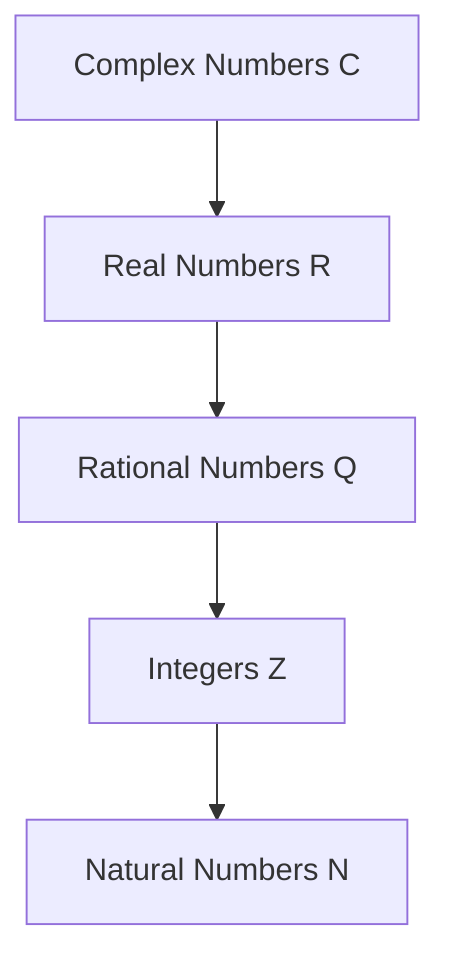
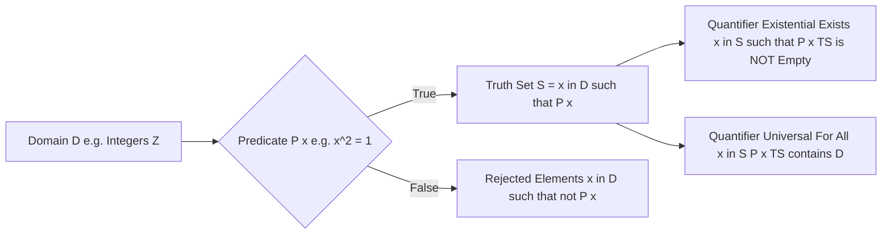
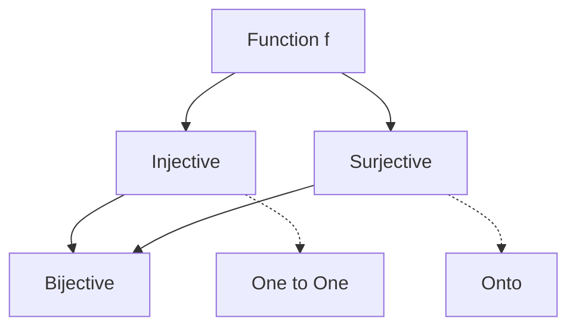

---
tags:
  - "#CCT2"
  - DS
Topic: What "discrete" numbers are; Sets; Relations between sets, Functions & Inter-set Functions
Semester: CCT2
Course: Diskrete strukturer
Litterature: Discrete Mathematics and Its Applications - 8th Ed.
Created: 05/202026
---
- - -
# Table of Contents

1. [[#Basic Structures|Basic Structures]]
	1. [[#Basic Structures#Sets|Sets]]
		1. [[#Sets#Intro|Intro]]
			1. [[#Intro#Roster Notation|Roster Notation]]
			2. [[#Intro#Set Builder Notation|Set Builder Notation]]
		2. [[#Sets#Venn Diagrams|Venn Diagrams]]
		3. [[#Sets#Subsets|Subsets]]
		4. [[#Sets#Size|Size]]
		5. [[#Sets#Power Sets|Power Sets]]
		6. [[#Sets#Cartesian Products|Cartesian Products]]
		7. [[#Sets#Set Notation with Quantifiers|Set Notation with Quantifiers]]
		8. [[#Sets#Truth Sets and Quantifiers|Truth Sets and Quantifiers]]
	2. [[#Basic Structures#Operations|Operations]]
		1. [[#Operations#Intro|Intro]]
		2. [[#Operations#Set Identities|Set Identities]]
		3. [[#Operations#Generalized Unions & Intersections|Generalized Unions & Intersections]]
		4. [[#Operations#Computer Representation of Sets|Computer Representation of Sets]]
		5. [[#Operations#Multi-sets|Multi-sets]]
	3. [[#Basic Structures#Functions|Functions]]
		1. [[#Functions#Intro|Intro]]
		2. [[#Functions#1-to-1 and "Onto" Functions|1-to-1 and "Onto" Functions]]
		3. [[#Functions#Inverse Functions and Compositions of Functions|Inverse Functions and Compositions of Functions]]
		4. [[#Functions#Graphs of Functions|Graphs of Functions]]
	4. [[#Basic Structures#Important Functions|Important Functions]]
		1. [[#Important Functions#The Floor Function & Ceiling Function|The Floor Function & Ceiling Function]]
		2. [[#Important Functions#Partial Functions|Partial Functions]]
	5. [[#Basic Structures#Cardinality|Cardinality]]
		1. [[#Cardinality#Intro|Intro]]
		2. [[#Cardinality#Countable Sets|Countable Sets]]
		3. [[#Cardinality#Uncountable Sets|Uncountable Sets]]
			1. [[#Uncountable Sets#Uncountable Functions|Uncountable Functions]]

# Basic Structures

| Concept/Syntax      | Description                                        | Example                                                           |
| :------------------ | :------------------------------------------------- | :---------------------------------------------------------------- |
| $\in$               | "is an element of" (e.g., $a \in A$)               | $a (1) \in A\{1, 2, 3\}$                                          |
| $\notin$            | "is not an element of"                             | $a(4) \notin A\{1, 2, 3\}$                                        |
| $\{ \dots \}$       | Denotes a set (Roster method)                      | $\{a, b, c, ..., z\}$                                             |
| $\{ x \mid P(x) \}$ | Set builder notation (set of $x$ such that $P(x)$) | $\{x \in \mathbb{Z} \mid x > 0\}$                                 |
| $\emptyset$         | The empty set (set with no elements)               | $\emptyset = \{\}$                                                |
| $A \subseteq B$     | Subset (every element of $A$ is in $B$)            | $A\{1, 2\} \subseteq B\{1, 2, 3\}$                                |
| $A \subset B$       | Proper subset (subset but not equal)               | $A\{1, 2\} \subset B\{1, 2, 3\}$                                  |
| $\mathcal{P}(S)$    | Power set of $S$ (set of all subsets)              | $\mathcal{P}(\{a, b\}) = \{\emptyset, \{a\}, \{b\}, \{a, b\}\}$   |
| $A \times B$        | Cartesian product (set of ordered pairs)           | $A\{1, 2\} \times B\{a, b\} = \{(1, a), (1, b), (2, a), (2, b)\}$ |
| $A \cup B$          | Union (elements in $A$ or $B$)                     | $\{1, 2\} \cup \{2, 3\} = \{1, 2, 3\}$                            |
| $A \cap B$          | Intersection (elements in $A$ and $B$)             | $A\{1, 2\} \cap B\{2, 3\} = \{2\}$                                |
| $A - B$             | Set difference (elements in $A$ but not $B$)       | $A\{1, 2, 3\} - B\{2\} = \{1, 3\}$                                |
| $\overline{A}$      | Complement of $A$ (elements in $U$ but not in $A$) | If $U = \{1, \dots, 5\}, \overline{\{1, 2\}} = \{3, 4, 5\}$       |
| $\mid A \mid$       | Cardinality (number of elements in set $A$)        | $\mid \{1, 2, 3\} \mid = 3$                                       |
| $f: A \to B$        | Function $f$ maps from domain $A$ to codomain $B$  | $f: \mathbb{R} \to \mathbb{R}$ where $f(x) = x^2$                 |
| $\lfloor x \rfloor$ | Floor function (greatest integer $\le x$)          | $\lfloor 3.9 \rfloor = 3$                                         |
| $\lceil x \rceil$   | Ceiling function (least integer $\ge x$)           | $\lceil 3.1 \rceil = 4$                                           |
| $\aleph_0$          | Cardinality of the set of natural numbers          | $\mid \mathbb{N} \mid = \aleph_0$                                 |

---

## Sets

### Intro
Sets are used to group objects together. Often, but not always, the objects in a set have similar properties. For instance, all the students who are currently enrolled in your school make up a set. Likewise, all the students currently taking a course in discrete mathematics at any school make up a set.

The language of sets is a means to study such collections in an organized fashion.

> [!info] Definition - Set
> A set is an unordered collection of distinct objects, called elements or members of the set. A set is said to contain its elements. We write $a \in A$ to denote that $a$ is an element of the set $A$. The notation $a \notin A$ denotes that $a$ is not an element of the set $A$.

It is common for sets to be denoted using uppercase letters. Lowercase letters are usually used to denote elements of sets.

#### Roster Notation
There are several ways to describe a set. One way is to list all the members of a set. We use a notation where all members of the set are listed between braces. This way of describing a set is known as the ***roster method***.

> [!example] Roster Method
> The set '$V$' of all vowels in the English alphabet can be written as $V = \{a, e, i, o, u\}$.

> [!example] Roster Method
> The set '$O$' of odd positive integers less than $10$ can be expressed by $O = \{1, 3, 5, 7, 9\}$.

> [!example] Unrelated Elements
> Sets can have seemingly unrelated elements. For instance, $\{a, 2, \text{Fred}, \text{New Jersey}\}$ is the set containing the four elements "$a$", "$2$", "Fred", and "New Jersey".

> [!example] Ellipses
> Sometimes the roster method is used to describe a set without listing all its members. The set of positive integers less than $100$ can be denoted by $\{1, 2, 3, \dots , 99\}$. Where "..." (ellipses) are used when the general pattern of the elements is obvious.

#### Set Builder Notation
Another way to describe a set is to use ***set builder*** notation. We characterize all elements in the set by stating the property or properties they must have to be members, and possibly a different source set these elements stem from. We often use this type of notation to describe sets when it is impossible to list all the elements of the set.

The general form of this notation is $\{x \mid x \text{ has property } P\}$ and is read “the set of all $x$ (*in/from set S*) such that $x$ has property $P$.”

> [!example] Set Builder Notation
> The set $O$ of all odd positive integers less than $10$.
> $O = \{x \mid x \text{ is an odd positive integer less than } 10\}$ or $O = \{x \in \mathbb{Z}^+ \mid x \text{ is odd and } x < 10\}$.

> [!example] Set Builder Notation
> The set $\mathbb{Q}^+$ of all positive rational numbers:
> $\mathbb{Q}^+ = \{x \in \mathbb{R} \mid x = p/q, \text{ for some positive integers } p \text{ and } q\}$.

These sets, each denoted using a boldface letter, play an important role in discrete mathematics:

| Set Name                  | Notation                                                                                 | Description                                                                                               |
| :------------------------ | :--------------------------------------------------------------------------------------- | :-------------------------------------------------------------------------------------------------------- |
| **Natural Numbers**       | $\mathbb{N} = \{0, 1, 2, 3, \dots\}$                                                     | The numbers you use for counting discrete objects. Foundation of arithmetic.                              |
| **Integers**              | $\mathbb{Z} = \{\dots, -2, -1, 0, 1, 2, \dots\}$                                         | Includes natural numbers and their negatives ("Z" comes from German *Zahlen*).                            |
| **Positive Integers**     | $\mathbb{Z}^+ = \{1, 2, 3, \dots\}$                                                      | Natural numbers without zero ("Counting Numbers").                                                        |
| **Rational Numbers**      | $\mathbb{Q} = \{p/q \mid p \in \mathbb{Z}, q \in \mathbb{Z}, q \neq 0\}$                 | Numbers that can be written as a fraction. Includes integers ($2 = 2/1$). ("Q" from Italian *Quoziente*). |
| **Real Numbers**          | $\mathbb{R}$                                                                             | The entire number line. Includes Rationals and Irrationals (like $\pi$).                                  |
| **Positive Real Numbers** | $\mathbb{R}^+$                                                                           | Every number on the number line strictly greater than zero.                                               |
| **Complex Numbers**       | $\mathbb{C}$                                                                             | Includes all Real numbers plus "Imaginary" numbers (e.g., $i = \sqrt{-1}$).                               |
| **Hierarchy**             | $\mathbb{N} \subset \mathbb{Z} \subset \mathbb{Q} \subset \mathbb{R} \subset \mathbb{C}$ | Visualizing the subset relationships from Naturals to Complex numbers.                                    |
_Table 1.1: Important Standard Sets in Discrete Mathematics_

_Figure 1.1: Hierarchy of standard sets, where each arrow represents a subset relationship._

### Venn Diagrams
Sets can be represented graphically using Venn diagrams. In Venn diagrams the universal set $U$, which contains all the objects under consideration, is represented by a rectangle. (Note that the universal set varies depending on which objects are of interest.)

Inside this rectangle, circles or other geometrical figures are used to represent sets. Sometimes points are used to represent the particular elements of the set. Venn diagrams are often used to indicate the relationships between sets.

> [!example] Venn Diagram
> A Venn diagram that represents V, the set of vowels in the English alphabet. We draw a rectangle to indicate the universal set $U$, which is the set of the $26$ letters of the English alphabet. Inside this rectangle we draw a circle to represent V. Inside this circle we indicate the elements of V with points.

![[Pasted image 20260205164227.png]]
_Figure 1.2: Venn diagram of the set of vowels V within the universal set of English alphabet letters U._

### Subsets
It is common to encounter situations where the elements of one set are also the elements of a second set.

> [!info] Definition - Subset
> The set $A$ is a subset of $B$, and $B$ is a superset of $A$, if and only if every element of $A$ is also an element of $B$. We use the notation $A \subseteq B$ to indicate that $A$ is a subset of the set $B$. If, instead, we want to stress that $B$ is a superset of $A$, we use the equivalent notation $B \supseteq A$.

We see that $A \subseteq B$ if and only if the quantification $\forall x(x \in A \to x \in B)$ is true.

To show that $A$ is not a subset of $B$ we need only find one element $x \in A$ with $x \notin B$. Such an $x$ is a counterexample to the claim.

> [!summary] Showing Subsets
> - *Showing that $A$ is a Subset of $B$:* To show that $A \subseteq B$, show that if $x$ belongs to $A$ then $x$ also belongs to $B$.
> - *Showing that $A$ is **Not** a Subset of $B$:* To show that $A \not\subseteq B$, find a single $x \in A$ such that $x \notin B$.

> [!example] Subsets
> The set of all odd positive integers less than $10$ is a subset of the set of all positive integers less than $10$.
> The set of rational numbers is a subset of the set of real numbers.
> The set of all computer science majors at your school is a subset of the set of all students at your school.

> [!info] Trivial Subsets Theorem
> For every set $S$; (i) $\emptyset \subseteq S$ and (ii) $S \subseteq S$.
>
> - **The Empty Set ($\emptyset \subseteq S$):** By definition, the empty set has no elements. Therefore, it is impossible to find an element in the empty set that is _not_ in $S$. Thus, it is a subset of every set.
> - **Reflexivity ($S \subseteq S$):** Every set is a subset of itself. Every element in $S$ is, by definition, inside $S$.

> [!summary]- Proof
> **Statement:** For every set $S$, (i) $\emptyset \subseteq S$ and (ii) $S \subseteq S$.
> ### Proof of (i): The Empty Set as a Subset of any Set
> Let $S$ be a set. To show that $\emptyset \subseteq S$, we must show that $\forall x(x \in \emptyset \to x \in S)$ is true. Because the empty set contains no elements, it follows that $x \in \emptyset$ is always false. It follows that the conditional statement $x \in \emptyset \to x \in S$ is always true, because its hypothesis is always false and a conditional statement with a false hypothesis is true. Therefore, $\forall x(x \in \emptyset \to x \in S)$ is true. This completes the proof of (i). Note that this is an example of a vacuous proof. $\square$
>
> ### Proof of (ii): Reflexivity
> Let $S$ be a set. To show that $S \subseteq S$, we must show that $\forall x(x \in S \to x \in S)$ is true.
> The statement $x \in S \to x \in S$ is of the form $P \to P$, which is a tautology (always true) regardless of whether $x$ is actually in $S$. Consequently, $\forall x(x \in S \to x \in S)$ is true. This completes the proof of (ii). $\square$

Venn diagrams can be used to illustrate that a set A is a subset of a set B. We draw the universal set U as a rectangle. Within this rectangle we draw a circle for B. Because A is a subset of B, we draw the circle for A within the circle for B.

![[Pasted image 20260205170720.png]]
_Figure 1.3: Venn diagram with set A as a subset of set B._

A useful way to show that two sets have the same elements is to show that each set is a subset of the other. In other words, we can show that if A and B are sets with $A \subseteq B$ and $B \subseteq A$, then $A = B$.

> [!summary] Showing Equality
> To show that two sets A and B are equal, show that $A \subseteq B$ and $B \subseteq A$.

> [!example] Equality of Sets
> Sets may have other sets as members/elements.
> $A = \{\emptyset, \{a\}, \{b\}, \{a, b\}\}$ and $B = \{x \mid x \text{ is a subset of the set } \{a, b\}\}$.
> Note that these two sets are equal, that is, $A = B$. Also note that $\{a\} \in A$, but $a \notin A$.

### Size

> [!info] Definition - Size of a Set
> Let $S$ be a set. If there are exactly $n$ distinct elements in $S$ where $n$ is a nonnegative integer, we say that $S$ is a finite set and that $n$ is the cardinality of $S$. The cardinality of $S$ is denoted by $\mid S \mid$.

> [!example] Cardinality
> Let $A$ be the set of odd positive integers less than $10$. Then $\mid A \mid = 5$.
> - Roster Notation: $A=\{1,3,5,7,9\}$
> - Set Builder Notation: $A=\{x\in\mathbb{Z}^+\mid x \text{ is odd and } x<10\}$

> [!example] Cardinality of Alphabet
> Let $S$ be the set of letters in the English alphabet. Then $\mid S \mid = 26$.
> - Roster Notation: $S=\{A,B,C,D,\dots,Z\}$
> - Set Builder Notation: $S=\{x \mid x \text{ is a letter in the English alphabet}\}$

> [!example] Cardinality of Empty Set
> Because the null set has no elements, it follows that $\mid \emptyset \mid = 0$.
> - Roster Notation: $\emptyset=\{\}$
> - Set Builder Notation: $\emptyset=\{x\in\mathbb{Z}\mid x\neq x\}$

> [!info] Definition - Infinite
> A set is said to be infinite if it is not finite. (Finite being with a beginning and end).

> [!example] Infinite Set
> The set of positive integers $\mathbb{Z}^+$ is infinite. There will always be a bigger number $x+1$ than any arbitrary chosen number $x$.

### Power Sets
Many problems involve testing all combinations of elements of a set to see if they satisfy some property. To consider all such combinations of elements of a set S, we build a new set that has as its members all the subsets of S.

> [!info] Definition - Power Set
> Given a set $S$, the power set of $S$ is the set of all subsets of the set $S$. The power set of $S$ is denoted by $\mathcal{P}(S)$.

> [!example] Power Set
> The power set $\mathcal{P}(\{0, 1, 2\})$ is the set of all subsets of $\{0, 1, 2\}$.
> Hence, $\mathcal{P}(\{0, 1, 2\}) = \{\emptyset, \{0\}, \{1\}, \{2\}, \{0, 1\}, \{0, 2\}, \{1, 2\}, \{0, 1, 2\}\}$.
> Note that the empty set and the set itself are members of this set of subsets.

> [!example] Power Set of Empty Set
> The empty set has exactly one subset, namely, itself. Consequently, $\mathcal{P}(\emptyset) = \{\emptyset\}$.
> The set $\{\emptyset\}$ has exactly two subsets, namely, $\emptyset$ and the set $\{\emptyset\}$ itself. Therefore, $\mathcal{P}(\{\emptyset\}) = \{\emptyset, \{\emptyset\}\}$.

> [!info] Power Set Theorem
> If a set $S$ has $n$ elements, then its power set $\mathcal{P}(S)$ has $2^n$ elements.

> [!summary]- Proof:
> Let $S$ be a finite set with $\mid S \mid = n$. We can list the elements of $S$ as $S = \{s_1, s_2, \dots, s_n\}$.
>
> To form a subset $A \subseteq S$, we must make a binary decision (include or exclude) for each element $s_i$ in $S$:
>
> 1.  For $s_1$, there are $2$ possibilities: $s_1 \in A$ or $s_1 \notin A$.
> 2.  For $s_2$, there are $2$ possibilities: $s_2 \in A$ or $s_2 \notin A$.
> $\vdots$
> n. For $s_n$, there are $2$ possibilities: $s_n \in A$ or $s_n \notin A$.
>
> By the Rule of Product (Fundamental Counting Principle), the total number of distinct subsets is the product of the number of choices for each element:
>
> $$
> \underbrace{2 \times 2 \times \cdots \times 2}_{n \text{ times}} = 2^n
> $$
>
> Since the power set $\mathcal{P}(S)$ is the set of all subsets of $S$, the number of elements in $\mathcal{P}(S)$ is $2^n$. Thus, $\mid \mathcal{P}(S) \mid = 2^n$. $\blacksquare$

### Cartesian Products
The order of elements in a collection is often important. Because sets are unordered, a different structure is needed to represent ordered collections. This is provided by ordered n-tuples.

> [!info] Definition - Ordered n-tuple
> The ordered n-tuple $(a_1, a_2, \dots , a_n)$ is the ordered collection that has $a_1$ as its first element, $a_2$ as its second element, … , and $a_n$ as its nth element.

We say that two ordered n-tuples are equal if and only if each corresponding pair of their elements is equal. $(a_1, a_2, \dots , a_n) = (b_1, b_2, \dots , b_n)$ if and only if $a_i = b_i$, for $i = 1, 2, \dots , n$. In particular, ordered 2-tuples are called ordered pairs.

> [!info] Definition - Cartesian Product
> Let $A$ and $B$ be sets. The Cartesian product of $A$ and $B$, denoted by $A \times B$, is the set of all ordered pairs $(a, b)$, where $a \in A$ and $b \in B$.
> Hence, $A \times B = \{(a, b) \mid a \in A \wedge b \in B\}$.

> [!example] Enrollment Cartesian Product
> Let $A$ represent the set of all students at a university, and let $B$ represent the set of all courses offered at the university.
> The Cartesian product $A \times B$ consists of all the ordered pairs of the form $(a, b)$, where $a$ is a student at the university and $b$ is a course offered at the university.
> Observe that each subset of $A \times B$ represents one possible total enrollment configuration, and $\mathcal{P}(A \times B)$ represents all possible enrollment configurations.

> [!example] Small Sets
> What is the Cartesian product of $A = \{1, 2\}$ and $B = \{a, b, c\}$?
> $A \times B = \{(1, a), (1, b), (1, c), (2, a), (2, b), (2, c)\}$.
> Note that the Cartesian products $A \times B$ and $B \times A$ are not equal unless $A = \emptyset$ or $B = \emptyset$ (so that $A \times B = \emptyset$) or $A = B$.

> [!example] Non-commutativity
> Show that the Cartesian product $B \times A$ is not equal to the Cartesian product $A \times B$.
> $B \times A = \{(a, 1), (a, 2), (b, 1), (b, 2), (c, 1), (c, 2)\}$.
> This is not equal to $A \times B = \{(1, a), (1, b), (1, c), (2, a), (2, b), (2, c)\}$.

The Cartesian product of more than two sets can also be defined.

> [!info] Definition - Cartesian Products of n Sets
> The Cartesian product of the sets $A_1, A_2, \dots , A_n$, denoted by $A_1 \times A_2 \times \cdots \times A_n$, is the set of ordered n-tuples $(a_1, a_2, \dots , a_n)$, where $a_i$ belongs to $A_i$ for $i = 1, 2, \dots , n$.

> [!example] Triple Cartesian Product
> What is the Cartesian product $A \times B \times C$, where $A = \{0, 1\}$, $B = \{1, 2\}$, and $C = \{0, 1, 2\}$?
> $A \times B \times C = \{(0, 1, 0), (0, 1, 1), (0, 1, 2), (0, 2, 0), (0, 2, 1), (0, 2, 2), (1, 1, 0), (1, 1, 1), (1, 1, 2), (1, 2, 0), (1, 2, 1), (1, 2, 2)\}$.

We use the notation $A^2$ to denote $A \times A$. Similarly, $A^3 = A \times A \times A$. More generally, $A^n = \{(a_1, a_2, \dots , a_n) \mid a_i \in A \text{ for } i = 1, 2, \dots , n\}$.

> [!example] Cartesian Powers
> Suppose that $A = \{1, 2\}$. It follows that $A^2 = \{(1, 1), (1, 2), (2, 1), (2, 2)\}$ and $A^3 = \{(1, 1, 1), (1, 1, 2), (1, 2, 1), (1, 2, 2), (2, 1, 1), (2, 1, 2), (2, 2, 1), (2, 2, 2)\}$.
> A subset $R$ of the Cartesian product $A \times B$ is called a relation from the set $A$ to the set $B$.

> [!example] Less Than Relation
> What are the ordered pairs in the less than or equal to relation, which contains $(a, b)$ if $a \le b$, on the set $\{0, 1, 2, 3\}$?
> $R = \{(0, 0), (0, 1), (0, 2), (0, 3), (1, 1), (1, 2), (1, 3), (2, 2), (2, 3), (3, 3)\}$.

### Set Notation with Quantifiers
Sometimes we restrict the domain of a quantified statement explicitly by making use of a particular notation. For example, $\forall x \in S(P(x))$ denotes the universal quantification of $P(x)$ over all elements in the set $S$. In other words, $\forall x \in S(P(x))$ is shorthand for $\forall x(x \in S \to P(x))$.

Similarly, $\exists x \in S(P(x))$ denotes the existential quantification of $P(x)$ over all elements in $S$. That is, $\exists x \in S(P(x))$ is shorthand for $\exists x(x \in S \wedge P(x))$.

> [!example] Quantified Statements
> What do the statements $\forall x \in \mathbb{R} (x^2 \ge 0)$ and $\exists x \in \mathbb{Z} (x^2 = 1)$ mean?
> $\forall x \in \mathbb{R}(x^2 \ge 0)$: "The square of every real number is nonnegative." (True)
> $\exists x \in \mathbb{Z}(x^2 = 1)$: "There is an integer whose square is 1." (True, e.g., $x=1$)

### Truth Sets and Quantifiers

> [!info] Definition - Truth Set
> Given a predicate $P$, and a domain $D$, we define the truth set of $P$ to be the set of elements $x$ in $D$ for which $P(x)$ is true. The truth set of $P(x)$ is denoted by $\{x \in D \mid P(x)\}$.

> [!tip] Connection to Logic
> Understanding truth sets helps bridge the gap between logical predicates and set theory. When we write $\forall x \in S, P(x)$, we are essentially asserting that the truth set of $P$ covers the entire set $S$. Conversely, $\exists x \in S, P(x)$ asserts that the truth set of $P$ is not empty. This concept is the foundation for translating logical arguments into set notation.

_Figure 1.4: The concept of a Truth Set mapping elements from a Domain through a Predicate to a Subset of the Domain._

> [!example] Truth Sets
> What are the truth sets of the predicates $P(x)$, $Q(x)$, and $R(x)$, where the domain is the set of integers and $P(x)$ is “$|x| = 1$,” $Q(x)$ is “$x^2 = 2$,” and $R(x)$ is “$|x| = x$”?
> - Truth set of $P$, $\{x \in \mathbb{Z} \mid |x| = 1\}$, is $\{-1, 1\}$.
> - Truth set of $Q$, $\{x \in \mathbb{Z} \mid x^2 = 2\}$, is the empty set $\emptyset$ because there are no integers $x$ for which $x^2 = 2$.
> - Truth set of $R$, $\{x \in \mathbb{Z} \mid |x| = x\}$, is $\mathbb{N}$, the set of nonnegative integers.

---

## Operations

### Intro
Two, or more, sets can be combined in many different ways.

> [!info] Definition - Union
> Let $A$ and $B$ be sets. The union of the sets $A$ and $B$, denoted by $A \cup B$, is the set that contains those elements that are either in $A$ or in $B$, or in both.
> $A \cup B = \{x \mid x \in A \lor x \in B\}$.

> [!example] Union
> The union of the sets $\{1, 3, 5\}$ and $\{1, 2, 3\}$ is the set $\{1, 2, 3, 5\}$.
> The union of the set of all computer science majors at your school and the set of all mathematics majors at your school is the set of students at your school who are majoring either in mathematics or in computer science (or in both).

> [!info] Definition - Intersection
> Let $A$ and $B$ be sets. The intersection of the sets $A$ and $B$, denoted by $A \cap B$, is the set containing those elements in both $A$ and $B$.
> $A \cap B = \{x \mid x \in A \land x \in B\}$.

![[Pasted image 20260205175515.png]]
_Figure 2.1: Venn diagram showing the Union and Intersection of two sets A and B.

> [!example] Intersection
> The intersection of the sets $\{1, 3, 5\}$ and $\{1, 2, 3\}$ is the set $\{1, 3\}$.
> The intersection of the set of all computer science majors at your school and the set of all mathematics majors is the set of all students who are joint majors in mathematics and computer science.

> [!info] Definition - Disjointment
> Two sets are called disjoint if their intersection is the empty set.

> [!example] Disjoint Sets
> Let $A = \{1, 3, 5, 7, 9\}$ and $B = \{2, 4, 6, 8, 10\}$. Because $A \cap B = \emptyset$, $A$ and $B$ are disjoint.

We are often interested in finding the cardinality of a union of two finite sets A and B.
$\mid A \cup B \mid = \mid A \mid + \mid B \mid - \mid A \cap B \mid$.
(Generalized by the principle of inclusion–exclusion).

> [!info] Definition - Difference
> Let $A$ and $B$ be sets. The difference of $A$ and $B$, denoted by $A - B$, is the set containing those elements that are in $A$ but not in $B$. The difference of $A$ and $B$ is also called the complement of $B$ with respect to $A$.
> $A - B = \{x \mid x \in A \land x \notin B\}$.

> [!example] Difference
> The difference of $\{1, 3, 5\}$ and $\{1, 2, 3\}$ is the set $\{5\}$.
> The difference of the set of computer science majors at your school and the set of mathematics majors at your school is the set of all computer science majors at your school who are not also mathematics majors.

Once the universal set U has been specified, the complement of a set can be defined.

> [!info] Definition - Complement
> Let $U$ be the universal set. The complement of the set $A$, denoted by $\overline{A}$, is the complement of $A$ with respect to $U$. Therefore, the complement of the set $A$ is $U - A$.
> $\overline{A} = \{x \in U \mid x \notin A\}$.

> [!example] Complement
> Let $A = \{a, e, i, o, u\}$ (where the universal set is the set of letters of the English alphabet). Then $\overline{A} = \{b, c, d, f, g, h, j, k, l, m, n, p, q, r, s, t, v, w, x, y, z\}$.
> Let $A$ be the set of positive integers greater than $10$ (with universal set the set of all positive integers). Then $\overline{A} = \{1, 2, 3, 4, 5, 6, 7, 8, 9, 10\}$.

> [!abstract] Theorem: Set Difference as Intersection
> For any sets $A$ and $B$ (with a universal set $U$), the set difference $A - B$ is equal to the intersection of $A$ and the complement of $B$.
> $$ A - B = A \cap \overline{B} $$

> [!summary]- Proof
> To prove that two sets are equal, we show that each is a subset of the other.
>
> **Part 1:** Show $A - B \subseteq A \cap \overline{B}$.
> Let $x \in A - B$. By definition of set difference, $x \in A$ and $x \notin B$. Since $x \notin B$, by definition of complement, $x \in \overline{B}$. Therefore, $x \in A$ and $x \in \overline{B}$, which means $x \in A \cap \overline{B}$.
>
> **Part 2:** Show $A \cap \overline{B} \subseteq A - B$.
> Let $x \in A \cap \overline{B}$. By definition of intersection, $x \in A$ and $x \in \overline{B}$. Since $x \in \overline{B}$, by definition of complement, $x \notin B$. Therefore, $x \in A$ and $x \notin B$, which means $x \in A - B$.
>
> **Conclusion:** Since we have shown that $A - B \subseteq A \cap \overline{B}$ and $A \cap \overline{B} \subseteq A - B$, it follows that $A - B = A \cap \overline{B}$. $\blacksquare$

![[Pasted image 20260205180110.png]]
_Figure 2.2: Venn diagram illustrating set identities. 
The shaded region represents the set difference $A - B$._
_And the Complement $\overline{A}$ if $U$ is defined._

### Set Identities

| Identity Name           | Identity                                                                                                           |
| :---------------------- | :----------------------------------------------------------------------------------------------------------------- |
| **Identity laws**       | $A \cap U = A$   $A \cup \emptyset = A$                                                                         |
| **Domination laws**     | $A \cup U = U$   $A \cap \emptyset = \emptyset$                                                                 |
| **Idempotent laws**     | $A \cup A = A$   $A \cap A = A$                                                                                 |
| **Complementation law** | $\overline{(\overline{A})} = A$                                                                                    |
| **Commutative laws**    | $A \cup B = B \cup A$   $A \cap B = B \cap A$                                                                   |
| **Associative laws**    | $A \cup (B \cup C) = (A \cup B) \cup C$   $A \cap (B \cap C) = (A \cap B) \cap C$                               |
| **Distributive laws**   | $A \cup (B \cap C) = (A \cup B) \cap (A \cup C)$   $A \cap (B \cup C) = (A \cap B) \cup (A \cap C)$             |
| **De Morgan’s laws**    | $\overline{A \cap B} = \overline{A} \cup \overline{B}$   $\overline{A \cup B} = \overline{A} \cap \overline{B}$ |
| **Absorption laws**     | $A \cup (A \cap B) = A$   $A \cap (A \cup B) = A$                                                               |
| **Complement laws**     | $A \cup \overline{A} = U$   $A \cap \overline{A} = \emptyset$                                                   |

_Table 2.1: Important Set Identities_

> [!abstract] Theorem: De Morgan's Law for Sets
> For any sets $A$ and $B$, the complement of the intersection of $A$ and $B$ is equal to the union of the complement of $A$ and the complement of $B$.
> $$ \overline{A \cap B} = \overline{A} \cup \overline{B} $$

> [!summary]- Proof
> We will prove that the two sets $\overline{A \cap B}$ and $\overline{A} \cup \overline{B}$ are equal by showing that each set is a subset of the other.
>
> **Part 1:** Show that $\overline{A \cap B} \subseteq \overline{A} \cup \overline{B}$.
> Suppose that $x \in \overline{A \cap B}$. By the definition of complement, $x \notin A \cap B$. Using the definition of intersection, $\neg((x \in A) \land (x \in B))$ is true. By applying De Morgan’s law for propositions, $\neg(x \in A) \lor \neg(x \in B)$ is true. Using the definition of negation, $x \notin A$ or $x \notin B$. Using the definition of the complement of a set, this implies that $x \in \overline{A}$ or $x \in \overline{B}$. Consequently, by the definition of union, $x \in \overline{A} \cup \overline{B}$.
>
> **Part 2:** Show that $\overline{A} \cup \overline{B} \subseteq \overline{A \cap B}$.
> Suppose that $x \in \overline{A} \cup \overline{B}$. By the definition of union, $x \in \overline{A}$ or $x \in \overline{B}$. Using the definition of complement, $x \notin A$ or $x \notin B$. Consequently, $\neg(x \in A) \lor \neg(x \in B)$ is true. By De Morgan’s law for propositions, $\neg((x \in A) \land (x \in B))$ is true. By the definition of intersection, $\neg(x \in A \cap B)$. We now use the definition of complement to conclude that $x \in \overline{A \cap B}$.
>
> **Conclusion:** Because we have shown that each set is a subset of the other, the two sets are equal. $\blacksquare$

> [!abstract] Theorem: Second Distributive Law for Sets
> For all sets $A$, $B$, and $C$, the intersection of $A$ with the union of $B$ and $C$ is equal to the union of the intersection of $A$ and $B$ and the intersection of $A$ and $C$.
> $$ A \cap (B \cup C) = (A \cap B) \cup (A \cap C) $$

> [!summary]- Proof
> We will prove this identity by showing that each side is a subset of the other side.
>
> **Part 1:** Show that $A \cap (B \cup C) \subseteq (A \cap B) \cup (A \cap C)$.
> Suppose that $x \in A \cap (B \cup C)$. Then $x \in A$ and $x \in B \cup C$. By the definition of union, it follows that $x \in A$, and $x \in B$ or $x \in C$ (or both). In other words, $(x \in A) \land ((x \in B) \lor (x \in C))$ is true. By the distributive law for conjunction over disjunction, $((x \in A) \land (x \in B)) \lor ((x \in A) \land (x \in C))$ is true. We conclude that either $x \in A$ and $x \in B$, or $x \in A$ and $x \in C$. By the definition of intersection, it follows that $x \in A \cap B$ or $x \in A \cap C$. Using the definition of union, we conclude that $x \in (A \cap B) \cup (A \cap C)$.
>
> **Part 2:** Show that $(A \cap B) \cup (A \cap C) \subseteq A \cap (B \cup C)$.
> Now suppose that $x \in (A \cap B) \cup (A \cap C)$. Then, by the definition of union, $x \in A \cap B$ or $x \in A \cap C$. By the definition of intersection, it follows that $x \in A$ and $x \in B$ or that $x \in A$ and $x \in C$. From this we see that $x \in A$, and $x \in B$ or $x \in C$. Consequently, by the definition of union we see that $x \in A$ and $x \in B \cup C$. Furthermore, by the definition of intersection, it follows that $x \in A \cap (B \cup C)$.
>
> **Conclusion:** Since we have shown that each set is a subset of the other, the identity is proved. $\blacksquare$

> [!abstract] Theorem: Identity Laws
> **Statement:** For any set $A$ and universal set $U$:
> 1. $A \cap U = A$
> 2. $A \cup \emptyset = A$

> [!summary]- Proof
> **1. Proof that $A \cap U = A$:**
> *   ($\subseteq$): If $x \in A \cap U$, then $x \in A$ and $x \in U$. Specifically, $x \in A$.
> *   ($\supseteq$): If $x \in A$, then since $U$ contains all elements, $x \in U$ as well. Thus, $x \in A$ and $x \in U$, so $x \in A \cap U$.
>
> **2. Proof that $A \cup \emptyset = A$:**
> *   ($\subseteq$): If $x \in A \cup \emptyset$, then $x \in A$ or $x \in \emptyset$. Since $\emptyset$ has no elements, it must be that $x \in A$.
> *   ($\supseteq$): If $x \in A$, then $x \in A$ or $x \in \emptyset$ is true. Thus, $x \in A \cup \emptyset$. $\blacksquare$

> [!abstract] Theorem: Domination Laws
> **Statement:** For any set $A$ and universal set $U$:
> 1. $A \cup U = U$
> 2. $A \cap \emptyset = \emptyset$

> [!summary]- Proof
> **1. Proof that $A \cup U = U$:**
> *   ($\subseteq$): If $x \in A \cup U$, then $x \in A$ or $x \in U$. Since $U$ is the universal set, if $x \in A$, then $x \in U$ automatically. In both cases, $x \in U$.
> *   ($\supseteq$): If $x \in U$, then $x \in U$ or $x \in A$ is true. Thus, $x \in A \cup U$.
>
> **2. Proof that $A \cap \emptyset = \emptyset$:**
> Suppose, for contradiction, that there exists an $x \in A \cap \emptyset$. By definition of intersection, $x \in A$ and $x \in \emptyset$. However, $\emptyset$ has no elements, so $x \in \emptyset$ is impossible. Thus, no such $x$ exists, and $A \cap \emptyset$ must be empty. $\blacksquare$

> [!abstract] Theorem: Absorption Laws
> **Statement:** For any sets $A$ and $B$:
> 1. $A \cup (A \cap B) = A$
> 2. $A \cap (A \cup B) = A$

> [!summary]- Proof
> **1. Proof that $A \cup (A \cap B) = A$:**
> *   ($\subseteq$): If $x \in A \cup (A \cap B)$, then $x \in A$ or $x \in (A \cap B)$. If $x \in A$, we are done. If $x \in A \cap B$, then $x \in A$. In either case, $x \in A$.
> *   ($\supseteq$): If $x \in A$, then $x \in A$ or $x \in (A \cap B)$ is true (since the first disjunct is true). Thus, $x \in A \cup (A \cap B)$.
>
> **2. Proof that $A \cap (A \cup B) = A$:**
> *   ($\subseteq$): If $x \in A \cap (A \cup B)$, then $x \in A$ and $x \in A \cup B$. Specifically, $x \in A$.
> *   ($\supseteq$): If $x \in A$, then $x \in A$ and ($x \in A$ or $x \in B$) is true. By the definition of union, $x \in A \cup B$. Thus, $x \in A$ and $x \in A \cup B$, so $x \in A \cap (A \cup B)$. $\blacksquare$

> [!abstract] Theorem: Complement Laws
> **Statement:** For any set $A$ and universal set $U$:
> 1. $A \cup \overline{A} = U$
> 2. $A \cap \overline{A} = \emptyset$

> [!summary]- Proof
> **1. Proof that $A \cup \overline{A} = U$:**
> *   ($\subseteq$): If $x \in A \cup \overline{A}$, then $x \in A$ or $x \in \overline{A}$. Since $\overline{A} \subseteq U$ and $A \subseteq U$, in either case $x \in U$.
> *   ($\supseteq$): Let $x \in U$. By the law of excluded middle, either $x \in A$ or $x \notin A$. If $x \notin A$, then $x \in \overline{A}$. Thus, $x \in A$ or $x \in \overline{A}$, which means $x \in A \cup \overline{A}$.
>
> **2. Proof that $A \cap \overline{A} = \emptyset$:**
> Suppose for contradiction that there exists an element $x \in A \cap \overline{A}$. By definition of intersection, $x \in A$ and $x \in \overline{A}$. By definition of complement, $x \in \overline{A}$ implies $x \notin A$. This leads to the contradiction $x \in A$ and $x \notin A$. Therefore, no such $x$ exists, and $A \cap \overline{A} = \emptyset$. $\blacksquare$

### Generalized Unions & Intersections
Because unions and intersections of sets satisfy associative laws, the sets $A \cup B \cup C$ and $A \cap B \cap C$ are well defined.

> [!info] Definition - Union on n sets
> The union of a collection of sets is the set that contains those elements that are members of at least one set in the collection.
> Notation: $A_1 \cup A_2 \cup \cdots \cup A_n = \bigcup_{i=1}^n A_i$.

> [!info] Definition - Intersection on n sets
> The intersection of a collection of sets is the set that contains those elements that are members of all the sets in the collection.
> Notation: $A_1 \cap A_2 \cap \cdots \cap A_n = \bigcap_{i=1}^n A_i$.

![[Pasted image 20260205191246.png]]
_Figure 2.3: Venn diagram for the Union and Intersection of three sets A, B, and C._

> [!example] Generalized Intersection
> For $i = 1, 2, \dots$, let $A_i = \{i, i + 1, i + 2, \dots \}$.
> $\bigcup_{i=1}^n A_i = \{1, 2, 3, \dots \}$.
> $\bigcap_{i=1}^n A_i = \{n, n + 1, n + 2, \dots\} = A_n$.

### Computer Representation of Sets
One method to represent sets using a computer is using bit strings, assuming the universal set $U$ is finite. First, specify an arbitrary ordering of the elements of $U$, for instance $a_1, a_2, \dots , a_n$. Represent a subset $A$ of $U$ with the bit string of length $n$, where the ith bit in this string is 1 if $a_i$ belongs to $A$ and is 0 if $a_i$ does not belong to $A$.

> [!example] Bit String Representation
> Let $U = \{1, 2, 3, 4, 5, 6, 7, 8, 9, 10\}$ with elements in increasing order.
> - Set of odd integers $\{1, 3, 5, 7, 9\}$: `10 1010 1010`.
> - Set of even integers $\{2, 4, 6, 8, 10\}$: `01 0101 0101`.
> - Set of integers $\le 5 \{1, 2, 3, 4, 5\}$: `11 1110 0000`.

Using bit strings, operations are straightforward:
- **Complement:** Change each 1 to 0 and 0 to 1 (bitwise NOT).
- **Union:** Bitwise OR.
- **Intersection:** Bitwise AND.

> [!example] Bit String Operations
> The bit strings for $\{1, 2, 3, 4, 5\}$ and $\{1, 3, 5, 7, 9\}$ are `11 1110 0000` and `10 1010 1010`, respectively.
> - Union: `11 1110 0000` $\lor$ `10 1010 1010` = `11 1110 1010` (Set: $\{1, 2, 3, 4, 5, 7, 9\}$).
> - Intersection: `11 1110 0000` $\land$ `10 1010 1010` = `10 1010 0000` (Set: $\{1, 3, 5\}$).

### Multi-sets

> [!info] Definition - Multiset
> A multiset (short for multiple-membership set) is an unordered collection of elements where an element can occur as a member more than once. The numbers $m_i$ associated with element $a_i$ are called the multiplicities.

**Operations for Multi-sets:**
- **Union ($P \cup Q$):** Multiplicity is the $\max$ of multiplicities in $P$ and $Q$.
- **Intersection ($P \cap Q$):** Multiplicity is the $\min$ of multiplicities in $P$ and $Q$.
- **Difference ($P - Q$):** Multiplicity is multiplicity in $P$ minus multiplicity in $Q$ (min 0).
- **Sum ($P + Q$):** Multiplicity is the sum of multiplicities in $P$ and $Q$.

> [!example] Multiset Operations
> $P = \{4 \cdot a, 1 \cdot b, 3 \cdot c\}$, $Q = \{3 \cdot a, 4 \cdot b, 2 \cdot d\}$.
> - $P \cup Q = \{4 \cdot a, 4 \cdot b, 3 \cdot c, 2 \cdot d\}$ (Max)
> - $P \cap Q = \{3 \cdot a, 1 \cdot b\}$ (Min)
> - $P - Q = \{1 \cdot a, 3 \cdot c\}$ (Diff)
> - $P + Q = \{7 \cdot a, 5 \cdot b, 3 \cdot c, 2 \cdot d\}$ (Sum)

---

## Functions

### Intro

> [!info] Definition - Function f
> Let $A$ and $B$ be nonempty sets. A function $f$ from $A$ to $B$ is an assignment of exactly one element of $B$ to each element of $A$. We write $f(a) = b$ if $b$ is the unique element of $B$ assigned by the function $f$ to the element $a$ of $A$. If $f$ is a function from $A$ to $B$, we write $f : A \to B$.

> [!info] Definition - Image, Domain, Co-domain
> If $f$ is a function from $A$ to $B$, we say that $A$ is the **domain** of $f$ and $B$ is the **codomain** of $f$. If $f(a) = b$, we say that $b$ is the **image** of $a$ and $a$ is a **preimage** of $b$. The **range**, or image, of $f$ is the set of all images of elements of $A$.

> [!example] Grade Assignment Function
> Let $G$ be the function that assigns a grade to a student in a discrete mathematics class.
> - Domain: Set of students $\{Adams, Chou, \dots\}$.
> - Codomain: Set of grades $\{A, B, C, D, F\}$.
> - Range: Set of grades actually assigned (e.g., $\{A, B, C, F\}$).

> [!example] Integer Function
> Let $f : \mathbb{Z} \to \mathbb{Z}$ assign the square of an integer to this integer. Then $f(x) = x^2$.
> - Domain: Set of all integers $\mathbb{Z}$.
> - Codomain: Set of all integers $\mathbb{Z}$.
> - Range: Set of perfect squares $\{0, 1, 4, 9, \dots\}$.

A function is called **real-valued** if its codomain is $\mathbb{R}$, and **integer-valued** if its codomain is $\mathbb{Z}$.

> [!info] Definition - Function Operations
> Let $f_1$ and $f_2$ be functions from $A$ to $\mathbb{R}$. Then $f_1 + f_2$ and $f_1 f_2$ are also functions from $A$ to $\mathbb{R}$ defined for all $x\in A$ by:
> $(f_1 + f_2)(x) = f_1(x) + f_2(x)$
> $(f_1 f_2)(x) = f_1(x)f_2(x)$.

> [!info] Definition - Image of a Subset
> Let $f$ be a function from $A$ to $B$ and let $S$ be a subset of $A$. The image of $S$ under the function $f$ is the subset of $B$ that consists of the images of the elements of $S$. We denote the image of $S$ by $f(S)$, so $f(S) = \{t \mid \exists s \in S (t = f(s))\}$.

> [!example] Image of Subset
> Let $A = \{a, b, c, d, e\}$ and $B = \{1, 2, 3, 4\}$ with $f(a) = 2, f(b) = 1, f(c) = 4, f(d) = 1$, and $f(e) = 1$.
> The image of the subset $S = \{b, c, d\}$ is the set $f(S) = \{1, 4\}$.

### 1-to-1 and "Onto" Functions
Some functions never assign the same value to two different domain elements. These functions are said to be one-to-one.

> [!info] Definition - Injection
> A function $f$ is said to be **one-to-one**, or an **injection**, if and only if $f(a) = f(b)$ implies that $a = b$ for all $a$ and $b$ in the domain of $f$. A function is said to be **injective** if it is one-to-one.
> Equivalently: $\forall a \forall b (f(a) = f(b) \to a = b)$.

![[Pasted image 20260205192646.png]]
_Figure 3.1: Diagram illustrating an injective (one-to-one) function. No two elements in the domain (left-side) map to the same element in the codomain (right-side)._

> [!example] One-to-One Examples
> - $f: \{a, b, c, d\} \to \{1, 2, 3, 4, 5\}$ with $f(a) = 4, f(b) = 5, f(c) = 1, f(d) = 3$ is one-to-one.
> - $f(x) = x^2$ from $\mathbb{Z}$ to $\mathbb{Z}$ is **not** one-to-one because $f(1) = f(-1) = 1$, but $1 \neq -1$.
> - $f(x) = x + 1$ from $\mathbb{R}$ to $\mathbb{R}$ is one-to-one. If $x+1 = y+1$, then $x=y$.

> [!info] Definition - Monotonic Functions
> A function $f$ is called **increasing** if $f(x) \le f(y)$, and **strictly increasing** if $f(x) < f(y)$, whenever $x < y$.
> Similarly, $f$ is called **decreasing** if $f(x) \ge f(y)$, and **strictly decreasing** if $f(x) > f(y)$, whenever $x < y$.

For some functions the range and the codomain are equal. These are called onto functions.

> [!info] Definition - Surjection
> A function $f$ from $A$ to $B$ is called **onto**, or a **surjection**, if and only if for every element $b \in B$ there is an element $a \in A$ with $f(a) = b$. A function $f$ is called **surjective** if it is onto.
> $\forall y \exists x (f(x) = y)$.

![[Pasted image 20260205192907.png]]
_Figure 3.2: Diagram illustrating a surjective (onto) function. Every element in the codomain is mapped to by at least one element in the domain._

> [!example] Onto Examples
> - $f: \{a, b, c, d\} \to \{1, 2, 3\}$ defined by $f(a) = 3, f(b) = 2, f(c) = 1, f(d) = 3$ is onto because all three elements of the codomain are images.
> - $f(x) = x^2$ from $\mathbb{Z}$ to $\mathbb{Z}$ is **not** onto because there is no integer $x$ with $x^2 = -1$.
> - $f(x) = x + 1$ from $\mathbb{Z}$ to $\mathbb{Z}$ is onto. For any integer $y$, let $x = y - 1$. Then $f(x) = (y - 1) + 1 = y$.

> [!info] Definition - Bijection
> The function $f$ is a **one-to-one correspondence**, or a **bijection**, if it is both one-to-one and onto. We also say that such a function is **bijective**.

_Figure 3.3: Relationship diagram for Injective, Surjective, and Bijective functions. A bijection occurs when both properties are satisfied._

> [!summary] Strategies for Proofs
> Suppose that $f : A \to B$.
> *To show that $f$ is injective*: Show that if $f(x) = f(y)$ for arbitrary $x, y \in A$, then $x = y$.
> *To show that $f$ is not injective*: Find particular elements $x, y \in A$ such that $x \neq y$ and $f(x) = f(y)$.
> *To show that $f$ is surjective*: Consider an arbitrary element $y \in B$ and find an element $x \in A$ such that $f(x) = y$.
> *To show that $f$ is not surjective*: Find a particular $y \in B$ such that $f(x) \neq y$ for all $x \in A$.

### Inverse Functions and Compositions of Functions

> [!info] Definition - Inverse Function
> Let $f$ be a one-to-one correspondence from the set $A$ to the set $B$. The **inverse function** of $f$ is the function that assigns to an element $b$ belonging to $B$ the unique element $a$ in $A$ such that $f(a) = b$. The inverse function of $f$ is denoted by $f^{-1}$. Hence, $f^{-1}(b) = a$ when $f(a) = b$.

![[Pasted image 20260205193951.png]]
_Figure 3.4: Venn diagram illustrating a bijection and its inverse function. The mapping is reversed in the inverse function._

A one-to-one correspondence is called ***invertible*** because we can define an inverse of this function.

> [!example] Invertible Function
> Let $f : \mathbb{Z} \to \mathbb{Z}$ be such that $f(x) = x + 1$.
> $f$ is invertible because it is a bijection.
> To reverse the correspondence, suppose $y = x + 1$. Then $x = y - 1$. Consequently, $f^{-1}(y) = y - 1$.

> [!example] Non-Invertible Function
> Let $f : \mathbb{R} \to \mathbb{R}$ with $f(x) = x^2$.
> Because $f(-2) = f(2) = 4$, $f$ is not one-to-one. If an inverse function were defined, it would have to assign two elements to 4. Hence, $f$ is not invertible.

> [!info] Definition - Composition
> Let $g$ be a function from the set $A$ to the set $B$ and let $f$ be a function from the set $B$ to the set $C$. The **composition** of the functions $f$ and $g$, denoted for all $a \in A$ by $f \circ g$, is the function from $A$ to $C$ defined by $(f \circ g)(a) = f(g(a))$.

![[Pasted image 20260205194412.png]]
_Figure 3.5: Venn diagram illustrating the composition of two functions, $f \circ g$. The output of $g$ becomes the input of $f$._

> [!example] Composition
> Let $f$ and $g$ be the functions from the set of integers to the set of integers defined by $f(x) = 2x + 3$ and $g(x) = 3x + 2$.
> - $(f \circ g)(x) = f(g(x)) = f(3x + 2) = 2(3x + 2) + 3 = 6x + 7$.
> - $(g \circ f)(x) = g(f(x)) = g(2x + 3) = 3(2x + 3) + 2 = 6x + 11$.
> Note that $f \circ g \neq g \circ f$.

### Graphs of Functions

> [!info] Definition - Graph of Function f
> Let $f$ be a function from the set $A$ to the set $B$. The **graph** of the function $f$ is the set of ordered pairs $\{(a, b) \mid a \in A \text{ and } f(a) = b\}$.

> [!example] Graph of $f(n) = 2n + 1$
> The graph of $f$ is the set of ordered pairs of the form $(n, 2n + 1)$, where $n$ is an integer.

![[Pasted image 20260205194646.png]]
_Figure 3.6: Graph of the function $f(n) = 2n + 1$ from integers to integers. Points are plotted at integer coordinates._

> [!example] Graph of $f(x) = x^2$
> The graph of $f$ is the set of ordered pairs $(x, x^2)$, where $x$ is an integer.

![[Pasted image 20260205194736.png]]
_Figure 3.7: Graph of the function $f(x) = x^2$ from integers to integers._

---

## Important Functions

### The Floor Function & Ceiling Function

> [!info] Definition - Floor
> The **floor function** assigns to the real number $x$ the largest integer that is less than or equal to $x$. The value of the floor function at $x$ is denoted by $\lfloor x \rfloor$.

> [!info] Definition - Ceiling
> The **ceiling function** assigns to the real number $x$ the smallest integer that is greater than or equal to $x$. The value of the ceiling function at $x$ is denoted by $\lceil x \rceil$.

![[Pasted image 20260205195124.png]]
_Figure 4.1: Graph of the floor (left) and ceiling (right) functions. The floor function takes the value to the left (or at) the point, while the ceiling takes the value to the right (or at) the point._

> [!example] Floor and Ceiling Values
> $\lfloor 1/2 \rfloor = 0$, $\lceil 1/2 \rceil = 1$.
> $\lfloor -1/2 \rfloor = -1$, $\lceil -1/2 \rceil = 0$.
> $\lfloor 3.1 \rfloor = 3$, $\lceil 3.1 \rceil = 4$.
> $\lfloor 7 \rfloor = 7$, $\lceil 7 \rceil = 7$.

> [!example] Byte Encoding
> Data stored on a computer disk are usually represented as a string of bytes. Each byte is 8 bits. How many bytes are required to encode 100 bits of data?
> $\lceil 100/8 \rceil = \lceil 12.5 \rceil = 13$ bytes.

| ID | Property |
| :--- | :--- |
| (1a) | $\lfloor x \rfloor = n \iff n \le x < n + 1$ |
| (1b) | $\lceil x \rceil = n \iff n - 1 < x \le n$ |
| (1c) | $\lfloor x \rfloor = n \iff x - 1 < n \le x$ |
| (1d) | $\lceil x \rceil = n \iff x \le n < x + 1$ |
| (2) | $x - 1 < \lfloor x \rfloor \le x \le \lceil x \rceil < x + 1$ |
| (3a) | $\lfloor -x \rfloor = -\lceil x \rceil$ |
| (3b) | $\lceil -x \rceil = -\lfloor x \rfloor$ |
| (4a) | $\lfloor x + n \rfloor = \lfloor x \rfloor + n$ |
| (4b) | $\lceil x + n \rceil = \lceil x \rceil + n$ |

_Table 4.1: Useful Properties of the Floor and Ceiling Functions_

> [!abstract] Theorem: Translation Property of the Floor Function
> Let $n$ be an integer and $x$ be a real number.
> $$ \lfloor x + n \rfloor = \lfloor x \rfloor + n $$

> [!summary]- Proof
> Suppose that $\lfloor x \rfloor = m$, where $m$ is an integer. By property (1a), $m \le x < m + 1$. Adding $n$ to all parts: $m + n \le x + n < m + n + 1$. Using property (1a) again, we see that the floor of $x + n$ is exactly $m + n$. Thus, $\lfloor x + n \rfloor = \lfloor x \rfloor + n$. $\blacksquare$

> [!example] Proof with Floors
> Prove that $\lfloor 2x \rfloor = \lfloor x \rfloor + \left\lfloor x + \frac{1}{2} \right\rfloor$ for real number $x$.
> Let $x = n + \epsilon$, where $n$ is an integer and $0 \le \epsilon < 1$.
> **Case 1:** $0 \le \epsilon < 1/2$.
> LHS: $2x = 2n + 2\epsilon$. Since $0 \le 2\epsilon < 1$, $\lfloor 2x \rfloor = 2n$.
> RHS: $x + 1/2 = n + (1/2 + \epsilon)$. Since $0 < 1/2 + \epsilon < 1$, $\lfloor x + 1/2 \rfloor = n$.
> Sum: $n + n = 2n$. LHS = RHS.
> **Case 2:** $1/2 \le \epsilon < 1$.
> LHS: $2x = (2n + 1) + (2\epsilon - 1)$. Since $0 \le 2\epsilon - 1 < 1$, $\lfloor 2x \rfloor = 2n + 1$.
> RHS: $x + 1/2 = n + 1 + (\epsilon - 1/2)$. Since $0 \le \epsilon - 1/2 < 1/2 < 1$, $\lfloor x + 1/2 \rfloor = n + 1$.
> Sum: $n + (n + 1) = 2n + 1$. LHS = RHS. $\blacksquare$

> [!example] Disproof
> Prove or disprove that $\lceil x + y \rceil = \lceil x \rceil + \lceil y \rceil$ for all real numbers $x$ and $y$.
> Let $x = 1/2$ and $y = 1/2$.
> LHS: $\lceil 1/2 + 1/2 \rceil = \lceil 1 \rceil = 1$.
> RHS: $\lceil 1/2 \rceil + \lceil 1/2 \rceil = 1 + 1 = 2$.
> Since $1 \neq 2$, the statement is false. $\blacksquare$

### Partial Functions

> [!info] Definition - Partial Function
> A **partial function** $f$ from a set $A$ to a set $B$ is an assignment to each element $a$ in a subset of $A$, called the **domain of definition** of $f$, of a unique element $b$ in $B$. We say that $f$ is undefined for elements in $A$ that are not in the domain of definition. When the domain of definition equals $A$, we say that $f$ is a **total function**.

> [!example] Partial Function
> The function $f : \mathbb{Z} \to \mathbb{R}$ where $f(n) = \sqrt{n}$ is a partial function from $\mathbb{Z}$ to $\mathbb{R}$ where the domain of definition is the set of nonnegative integers. Note that $f$ is undefined for negative integers.

---

## Cardinality

### Intro

> [!info] Definition - Cardinality
> The sets $A$ and $B$ have the same cardinality if and only if there is a one-to-one correspondence from $A$ to $B$. When $A$ and $B$ have the same cardinality, we write $\mid A \mid = \mid B \mid$.

> [!info] Definition - Relational Cardinality
> If there is a one-to-one function from $A$ to $B$, the cardinality of $A$ is less than or the same as the cardinality of $B$ and we write $\mid A \mid \le \mid B \mid$. Moreover, when $\mid A \mid \le \mid B \mid$ and $A$ and $B$ have different cardinality, we say that the cardinality of $A$ is less than the cardinality of $B$ and we write $\mid A \mid < \mid B \mid$.

### Countable Sets

> [!info] Definition - Countable
> A set that is either finite or has the same cardinality as the set of positive integers is called **countable**. A set that is not countable is called **uncountable**. When an infinite set $S$ is countable, we denote the cardinality of $S$ by $\aleph_0$ (aleph null). We write $\mid S \mid = \aleph_0$.

> [!example] Odd Integers are Countable
> To show that the set of odd positive integers is countable, we exhibit a one-to-one correspondence between this set and $\mathbb{Z}^+$. Consider $f(n) = 2n - 1$ from $\mathbb{Z}^+$ to the set of odd positive integers.
> - One-to-one: If $f(n) = f(m)$, $2n - 1 = 2m - 1 \implies n = m$.
> - Onto: If $t$ is an odd positive integer, $t = 2k - 1$, so $t = f(k)$.

![[Pasted image 20260205205017.png]]
_Figure 5.1: A one-to-one correspondence between $\mathbb{Z}^+$ and the set of odd positive integers._

> [!example] Integers are Countable
> We can list all integers in a sequence: $0, 1, -1, 2, -2, \dots$.
> Alternatively, use the function $f(n) = n/2$ (if n even) and $f(n) = -(n-1)/2$ (if n odd). This is a bijection from $\mathbb{Z}^+$ to $\mathbb{Z}$.

> [!example] Rational Numbers are Countable
> List positive rational numbers $p/q$ by increasing sum $p+q$.
> Order: $1/1, 1/2, 2/1, 3/1, 1/3, 1/4, 2/3, 3/2, 4/1, \dots$
> (Skip duplicates like $2/2$ which is $1/1$).

![[Pasted image 20260205205228.png]]
_Figure 5.2: Listing positive rational numbers to show countability. Each column represents numbers with denominator $q$, rows with numerator $p$. The arrows indicate the listing order based on the sum $p+q$._

### Uncountable Sets

> [!example] Real Numbers are Uncountable
> Suppose the set of real numbers is countable. Then the subset of reals between 0 and 1 is countable. List them as $r_1, r_2, r_3, \dots$ with decimal expansions:
> $r_1 = 0.d_{11}d_{12}d_{13}\dots$
> $r_2 = 0.d_{21}d_{22}d_{23}\dots$
> $\dots$
> Form a new number $r = 0.d_1d_2d_3\dots$ where $d_i \neq d_{ii}$ (e.g., if $d_{ii} = 4$, set $d_i = 5$, else set $d_i = 4$).
> $r$ differs from every $r_i$ in the $i$-th decimal place, so $r$ is not in the list. Contradiction. Thus, real numbers are uncountable.

> [!abstract] Theorem: Union of Countable Sets
> If $A$ and $B$ are countable sets, then $A \cup B$ is also countable.

> [!summary]- Proof
> There are three cases:
> (i) Both finite: $A \cup B$ is finite (countable).
> (ii) One infinite, one finite: List elements of the finite set first, then the infinite sequence.
> (iii) Both countably infinite: List $a_1, b_1, a_2, b_2, a_3, b_3, \dots$.
> In all cases, a sequence exists, so $A \cup B$ is countable. $\blacksquare$

> [!abstract] Theorem: Schröder-Bernstein Theorem
> If $A$ and $B$ are sets with $\mid A \mid \le \mid B \mid$ and $\mid B \mid \le \mid A \mid$, then $\mid A \mid = \mid B \mid$. In other words, if there are one-to-one functions $f$ from $A$ to $B$ and $g$ from $B$ to $A$, then there is a one-to-one correspondence between $A$ and $B$.

> [!example] Schröder-Bernstein Application
> Show that $\mid (0, 1) \mid = \mid (0, 1] \mid$.
> - Injection $f: (0, 1) \to (0, 1]$ is $f(x) = x$.
> - Injection $g: (0, 1] \to (0, 1)$ is $g(x) = x/2$.
> By Schröder-Bernstein, the cardinalities are equal.

#### Uncountable Functions

> [!info] Definition - Computable
> We say that a function is **computable** if there is a computer program in some programming language that finds the values of this function. If a function is not computable we say it is **uncomputable**.

There are uncountably many functions from a countably infinite set to itself, but only countably many computer programs. Therefore, most functions are uncomputable.

> [!abstract] The Continuum Hypothesis
> **Statement:** There is no cardinal number $X$ strictly between $\aleph_0$ (the cardinality of the set of positive integers) and $\mathfrak{c}$ (the cardinality of the set of real numbers).
> $$ \aleph_0 < \mid A \mid < \mathfrak{c} \text{ has no solution} $$

> [!summary]- Historical Context & Status
> **Background:** $\mid \mathcal{P}(\mathbb{Z}^+) \mid = \mid \mathbb{R} \mid = \mathfrak{c} = 2^{\aleph_0}$. The continuum hypothesis asserts $\mathfrak{c} = \aleph_1$ (the next cardinal number).
>
> **History:** Stated by Cantor in 1877. Hilbert's 1st problem in 1900.
>
> **Status:** It has been shown that the hypothesis can be **neither proved nor disproved** under the standard axioms of modern mathematics (Zermelo-Fraenkel axioms).

---

> [!summary] **Summary**
>
> **Sets:**
> *   **Basics:** Sets are unordered collections of distinct elements. Key notations include roster ($\{a,b\}$) and set-builder ($\{x \mid P(x)\}$).
> *   **Standard Sets:** $\mathbb{N}$ (naturals), $\mathbb{Z}$ (integers), $\mathbb{Q}$ (rationals), $\mathbb{R}$ (reals), $\mathbb{C}$ (complex). They form a hierarchy $\mathbb{N} \subset \mathbb{Z} \subset \mathbb{Q} \subset \mathbb{R} \subset \mathbb{C}$.
> *   **Relationships:** $A \subseteq B$ (subset). $A = B$ iff $A \subseteq B$ and $B \subseteq A$.
> *   **Size:** Cardinality $\mid S \mid$ counts elements. Finite sets have a size; infinite sets do not.
> *   **Power Sets:** $\mathcal{P}(S)$ is the set of all subsets of $S$. If $\mid S \mid = n$, then $\mid \mathcal{P}(S) \mid = 2^n$.
> *   **Cartesian Products:** $A \times B$ is the set of ordered pairs $(a,b)$ where $a \in A, b \in B$.
>
> **Set Operations:**
> *   **Union ($A \cup B$):** Elements in A or B.
> *   **Intersection ($A \cap B$):** Elements in A and B.
> *   **Difference ($A - B$):** Elements in A but not B.
> *   **Complement ($\overline{A}$):** Elements in Universal Set $U$ but not in $A$.
> *   **Identities:** Includes Identity, Domination, Idempotent, Complement, Commutative, Associative, Distributive, De Morgan's, Absorption, and Complement laws.
>
> **Functions:**
> *   **Definition:** A mapping $f: A \to B$ assigning exactly one element of $B$ to each element of $A$. $A$ is domain, $B$ is codomain. Range is the set of actual outputs.
> *   **Types:**
>     *   **One-to-One (Injective):** $f(a) = f(b) \implies a = b$.
>     *   **Onto (Surjective):** Range = Codomain.
>     *   **Bijection:** Both one-to-one and onto. Invertible.
> *   **Composition:** $(f \circ g)(x) = f(g(x))$.
> *   **Important Functions:** Floor $\lfloor x \rfloor$ (round down) and Ceiling $\lceil x \rceil$ (round up).
>
> **Cardinality:**
> *   **Countable:** Sets with cardinality $\le \aleph_0$ (can be listed in a sequence). Includes $\mathbb{N}, \mathbb{Z}, \mathbb{Q}$.
> *   **Uncountable:** Sets larger than $\mathbb{N}$. Includes $\mathbb{R}$. Proof via Cantor diagonalization.
> *   **Computability:** There are uncountably many functions but only countably many programs, implying most functions are uncomputable.
> *   **Continuum Hypothesis:** No set size exists strictly between $\aleph_0$ and $\mid \mathbb{R} \mid$ (independent of standard axioms).

