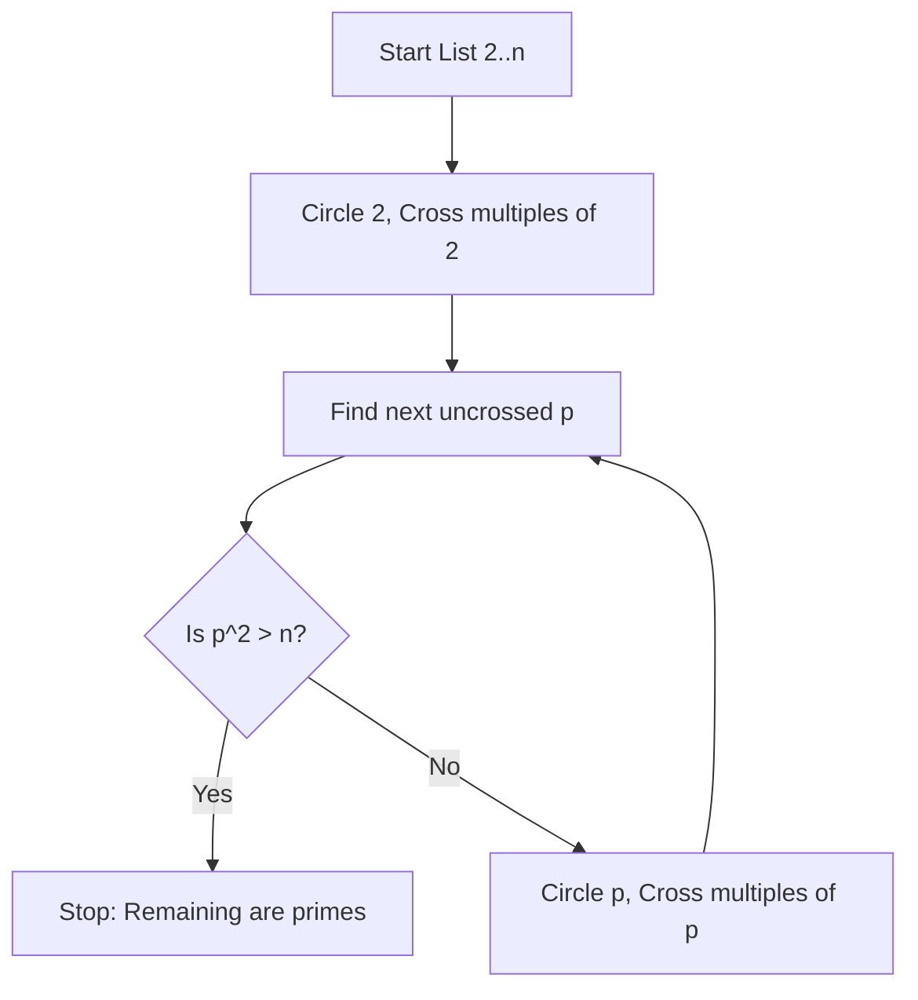
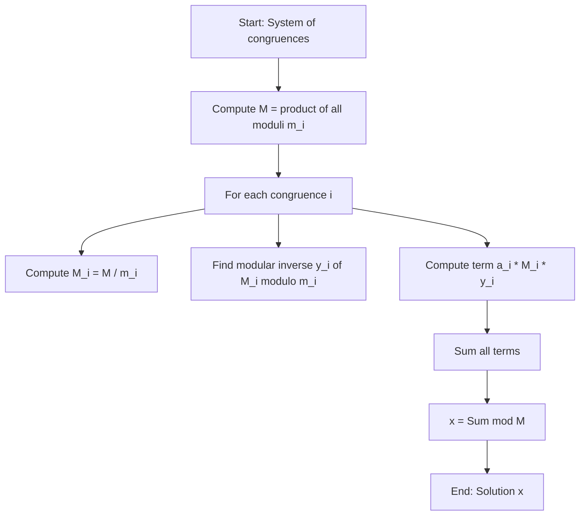

---
tags:
  - "#CCT2"
  - DS
Topic: Divisibility | Primes | GCD | LCM | Euclid's Algo. | Congruences | Arithm. Modulo - Inverses, linear congruences, chinese remainder theorem | Solving a system of linear congruences | The small Fermat's theorem
Semester: CCT2
Course: Diskrete strukturer
Litterature:
  - Discrete Mathematics and Its Applications - 8th Ed.
Created: 17-02-2026
---
- - -
# Number Theory and Cryptography

| Concept | Notation | Description |
| :--- | :--- | :--- |
| **Divisibility** | $a \mid b$ | $a$ divides $b$ (there exists integer $c$ such that $b = ac$). |
| **Division Algorithm** | $a = dq + r$ | $d$: divisor, $a$: dividend, $q$: quotient, $r$: remainder. |
| **Congruence** | $a \equiv b \pmod m$ | $a$ is congruent to $b$ modulo $m$. |
| **Mod Operation** | $a \bmod m$ | The remainder when $a$ is divided by $m$. |
| **Greatest Common Divisor** | $\gcd(a, b)$ | The largest integer dividing both $a$ and $b$. |
| **Least Common Multiple** | $\operatorname{lcm}(a, b)$ | The smallest positive integer divisible by both $a$ and $b$. |
| **Bézout's Identity** | $\gcd(a, b) = sa + tb$ | $\gcd(a,b)$ expressed as a linear combination. |

---

## Divisibility and Modular Arithmetic

### Introduction
Dividing an integer by a positive integer results in a quotient and a remainder. The process of working with these remainders leads to modular arithmetic, a crucial concept in mathematics and computer science, with applications ranging from generating pseudorandom numbers to encrypting messages.

### Division

> [!info] Definition: Division
> If $a$ and $b$ are integers with $a \neq 0$, we say that $a$ divides $b$ if there is an integer $c$ such that $b = ac$ (or equivalently, if $b/a$ is an integer).
> - Notation: $a \mid b$.
> - If $a$ does not divide $b$, we write $a \nmid b$.
> - Terms: $a$ is a factor or divisor of $b$; $b$ is a multiple of $a$.

> [!tip] Variable Breakdown
> - **Equation:** $b = ac$
> - **Breakdown:**
>     - **$b$**: The dividend (the number being divided).
>     - **$a$**: The divisor (the number dividing).
>     - **$c$**: The quotient (the integer result of the division).

> [!example] Divisibility Check
> **Problem:** Determine whether $3 \mid 7$ and whether $3 \mid 12$.
> **Solution:**
> - $3 \nmid 7$, because $7/3$ is not an integer.
> - $3 \mid 12$, because $12/3 = 4$.

> [!example] Counting Multiples
> **Problem:** Let $n$ and $d$ be positive integers. How many positive integers not exceeding $n$ are divisible by $d$?
> **Solution:** The positive integers divisible by $d$ are all the integers of the form $dk$, where $k$ is a positive integer. To find the number of such integers not exceeding $n$, we must count the integers $k$ with $0 < dk \le n$. Dividing the inequality by $d$, this is equivalent to $0 < k \le n/d$. Therefore, there are $\lfloor n/d \rfloor$ positive integers not exceeding $n$ that are divisible by $d$.

> [!summary] Theorem: Properties of Divisibility
> Let $a$, $b$, and $c$ be integers, where $a \neq 0$.
> 1. If $a \mid b$ and $a \mid c$, then $a \mid (b + c)$.
> 2. If $a \mid b$, then $a \mid bc$ for all integers $c$.
> 3. If $a \mid b$ and $b \mid c$, then $a \mid c$.

> [!tip] Variable Breakdown
> - **Context:** Theorem Statement
> - **Breakdown:**
>     - **$a$**: The primary divisor being tested.
>     - **$b, c$**: Integers that are multiples (dividends) of $a$ (or related multiples).
>     - **Logic:** If $a$ divides parts of a sum or product, it often divides the whole result.

> [!summary] Theorem: Properties of Divisibility (Proof)
> **(i)** Suppose that $a \mid b$ and $a \mid c$. Then, from the definition of divisibility, it follows that there are integers $s$ and $t$ with $b = as$ and $c = at$. Hence, $b + c = as + at = a(s + t)$. Therefore, $a$ divides $b + c$.
>
> **(ii)** Suppose that $a \mid b$. Then, by definition, there is an integer $s$ such that $b = as$. Multiplying both sides of this equation by $c$ gives $bc = (as)c = a(sc)$. Since $sc$ is an integer, it follows that $a \mid bc$.
>
> **(iii)** Suppose that $a \mid b$ and $b \mid c$. Then, by definition, there are integers $s$ and $t$ such that $b = as$ and $c = bt$. Substituting $as$ for $b$ in the equation $c = bt$, we obtain $c = (as)t = a(st)$. Since $st$ is an integer, it follows that $a \mid c$.

> [!tip] Variable Breakdown
> - **Context:** Proof Variables (Part i)
> - **Equation:** $b = as$ and $c = at$
> - **Breakdown:**
>     - **$s, t$**: Integer quotients resulting from dividing $b$ and $c$ by $a$.
>     - **$(s + t)$**: The sum of the quotients. Since the sum of two integers is an integer, $a$ must divide the total sum $b+c$.

![[Pasted image 20260217161359.png]]

_Figure 1.1.1: Visualization or representation of the properties of divisibility relationships._

> [!summary] Corollary: Divisibility of Integer Combinations
> If $a$, $b$, and $c$ are integers, where $a \neq 0$, such that $a \mid b$ and $a \mid c$, then $a \mid mb + nc$ whenever $m$ and $n$ are integers.
>
> Proof:
> We will give a direct proof. By part (ii) of Theorem "Properties of Divisibility" we see that $a \mid mb$ and $a \mid nc$ whenever $m$ and $n$ are integers. By part (i) of Theorem "Properties of Divisibility" it follows that $a \mid mb + nc$.

### The Division Algorithm

> [!summary] Theorem: The Division Algorithm
> Let $a$ be an integer and $d$ a positive integer. Then there are unique integers $q$ and $r$, with $0 \le r < d$, such that $a = dq + r$.

> [!tip] Variable Breakdown
> - **Equation:** $a = dq + r$
> - **Breakdown:**
>     - **$a$**: The dividend (the integer we wish to divide).
>     - **$d$**: The divisor (the positive integer we are dividing by).
>     - **$q$**: The quotient (the integer part of the result).
>     - **$r$**: The remainder (the "leftover" part, ensuring $0 \le r < d$).

> [!example]
> **Problem:** What are the quotient and remainder when $101$ is divided by $11$?
> **Solution:** We have $101 = 11 \cdot 9 + 2$.
> - Here, $a = 101$, $d = 11$, $q = 9$, and $r = 2$.
> - Hence, the quotient is $9 = 101 \text{ div } 11$.
> - The remainder is $2 = 101 \text{ mod } 11$.

> [!example]
> **Problem:** What are the quotient and remainder when $-11$ is divided by $3$?
> **Solution:** We have $-11 = 3 \cdot (-4) + 1$.
> - Hence, the quotient is $-4 = -11 \text{ div } 3$.
> - The remainder is $1 = -11 \text{ mod } 3$.
>
> **Note:** The remainder cannot be negative. Consequently, the remainder is not $-2$, even though $-11 = 3(-3) - 2$, because $r = -2$ does not satisfy the condition $0 \le r < d$ (in this case, $0 \le r < 3$).

### Modular Arithmetic

In some situations we care only about the remainder of an integer when it is divided by some specified positive integer.

> [!info] Definition: Congruence Modulo m
> If $a$ and $b$ are integers and $m$ is a positive integer, then $a$ is congruent to $b$ modulo $m$ if $m$ divides $a - b$. We use the notation $a \equiv b \pmod m$ to indicate that $a$ is congruent to $b$ modulo $m$. We say that $a \equiv b \pmod m$ is a congruence and that $m$ is its modulus (plural moduli). If $a$ and $b$ are not congruent modulo $m$, we write $a \not\equiv b \pmod m$.

> [!tip] Symbol Breakdown
> - **Symbol:** $\equiv$ (Congruence)
> - **Name:** Triple-bar equals.
> - **Function:** Indicates an equivalence relation. It means that $a$ and $b$ have the same remainder when divided by $m$.
> - **Context:** Used in modular arithmetic to group numbers into equivalence classes.

> [!summary] Theorem: Equivalence of Congruence and Mod Function
> Let $a$ and $b$ be integers, and let $m$ be a positive integer. Then $a \equiv b \pmod m$ if and only if $a \bmod m = b \bmod m$.

> [!example]
> **Problem:** Determine whether $17$ is congruent to $5$ modulo $6$ and whether $24$ and $14$ are congruent modulo $6$.
> **Solution:**
> - Because $6$ divides $12 = 17 - 5$, we see that $17 \equiv 5 \pmod 6$.
> - However, because $10 = 24 - 14$ is not divisible by $6$, we see that $24 \not\equiv 14 \pmod 6$.

> [!summary] Theorem: Alternative Characterization of Congruence
> Let $m$ be a positive integer. The integers $a$ and $b$ are congruent modulo $m$ if and only if there is an integer $k$ such that $a = b + km$.
>
> Proof:
> If $a \equiv b \pmod m$, by the definition of congruence, we know that $m \mid (a - b)$.
> This means that there is an integer $k$ such that $a - b = km$, so that $a = b + km$.
> Conversely, if there is an integer $k$ such that $a = b + km$, then $km = a - b$. Hence, $m$ divides $a - b$, so that $a \equiv b \pmod m$.

> [!summary] Definition: Congruence Class
> The set of all integers congruent to an integer $a$ modulo $m$ is called the **congruence class** of $a$ modulo $m$.

> [!summary] Theorem: Addition and Multiplication in Modular Arithmetic
> Let $m$ be a positive integer. If $a \equiv b \pmod m$ and $c \equiv d \pmod m$, then $a + c \equiv b + d \pmod m$ and $ac \equiv bd \pmod m$.
>
> Proof:
> Because $a \equiv b \pmod m$ and $c \equiv d \pmod m$, there are integers $s$ and $t$ with $b = a + sm$ and $d = c + tm$. 
> Hence:
> $b + d = (a + sm) + (c + tm) = (a + c) + m(s + t)$
> and
> $bd = (a + sm)(c + tm) = ac + m(at + cs + stm)$.
> Hence, $a + c \equiv b + d \pmod m$ and $ac \equiv bd \pmod m$.

> [!example]
> Because $7 \equiv 2 \pmod 5$ and $11 \equiv 1 \pmod 5$, it follows that:
> - $18 = 7 + 11 \equiv 2 + 1 = 3 \pmod 5$
> - $77 = 7 \cdot 11 \equiv 2 \cdot 1 = 2 \pmod 5$

> [!summary] Corollary: Modular Reduction of Sums and Products
> Let $m$ be a positive integer and let $a$ and $b$ be integers. Then:
> $(a + b) \bmod m = ((a \bmod m) + (b \bmod m)) \bmod m$
> and
> $ab \bmod m = ((a \bmod m)(b \bmod m)) \bmod m$.
>
> Proof:
> By the definitions of `mod m` and of congruence modulo $m$, we know that $a \equiv (a \bmod m) \pmod m$ and $b \equiv (b \bmod m) \pmod m$. Hence, the theorem "Addition and Multiplication in Modular Arithmetic" tells us that $a + b \equiv (a \bmod m) + (b \bmod m) \pmod m$ and $ab \equiv (a \bmod m)(b \bmod m) \pmod m$.

> [!example]
> **Problem:** Find the value of $(19^3 \bmod 31)^4 \bmod 23$.
> **Solution:** To compute $(19^3 \bmod 31)^4 \bmod 23$, we will first evaluate $19^3 \bmod 31$.
> - Because $19^3 = 6859$ and $6859 = 221 \cdot 31 + 8$, we have $19^3 \bmod 31 = 6859 \bmod 31 = 8$.
> - So, $(19^3 \bmod 31)^4 \bmod 23 = 8^4 \bmod 23$.
> - Next, note that $8^4 = 4096$.
> - Because $4096 = 178 \cdot 23 + 2$, we have $4096 \bmod 23 = 2$.
> - Hence, $(19^3 \bmod 31)^4 \bmod 23 = 2$.

### Arithmetic Modulo $m$

We can define arithmetic operations on $\mathbb{Z}_m$, the set of nonnegative integers less than $m$.

> [!info] Definition: Addition and Multiplication Modulo m
> For integers $a$ and $b$ in $\mathbb{Z}_m$:
> - **Addition modulo $m$**, denoted by $+_m$, is defined by $a +_m b = (a + b) \bmod m$.
> - **Multiplication modulo $m$**, denoted by $\cdot_m$, is defined by $a \cdot_m b = (a \cdot b) \bmod m$.

> [!example] Arithmetic in $\mathbb{Z}_{11}$
> **Problem:** Use the definition of addition and multiplication in $\mathbb{Z}_{11}$ to find $7 +_{11} 9$ and $7 \cdot_{11} 9$.
> **Solution:**
> - **Addition:** $7 +_{11} 9 = (7 + 9) \bmod 11 = 16 \bmod 11 = 5$.
> - **Multiplication:** $7 \cdot_{11} 9 = (7 \cdot 9) \bmod 11 = 63 \bmod 11 = 8$.

> [!summary] Properties of Modular Arithmetic Operations
>
> **Closure:** Adding or multiplying any two numbers in this set will always produce a result that is also in the set.
> $a +_m b$ and $a \cdot_m b$ belong to $\mathbb{Z}_m$
>
> **Associativity:** When combining three or more numbers, the way you group them does not change the result.
> $(a +_m b) +_m c = a +_m (b +_m c)$
> $(a \cdot_m b) \cdot_m c = a \cdot_m (b \cdot_m c)$
>
> **Commutativity:** The order in which you add or multiply two numbers does not change the final result.
> $a +_m b = b +_m a$
> $a \cdot_m b = b \cdot_m a$
>
> **Identity Elements:** Adding zero leaves a number unchanged, and multiplying a number by one leaves it unchanged.
> $a +_m 0 = 0 +_m a = a$
> $a \cdot_m 1 = 1 \cdot_m a = a$
>
> **Additive Inverses:** Every number has a specific counterpart that can be added to it to result in zero.
> If $a \neq 0$, then $m - a$ is an additive inverse of $a$ modulo $m$ ($a +_m (m - a) = 0$).
> $0$ is its own additive inverse ($0 +_m 0 = 0$).
>
> **Distributivity:** Multiplying a number by a sum is the same as multiplying the number by each part of the sum individually and then adding the results.
> $a \cdot_m (b +_m c) = (a \cdot_m b) +_m (a \cdot_m c)$
> $(a +_m b) \cdot_m c = (a \cdot_m c) +_m (b \cdot_m c)$

---

## Primes and Greatest Common Divisors

### Introduction
One important concept based on divisibility is that of a prime number.

> [!summary] Definition: Prime Number
> A prime is an integer greater than $1$ that is divisible by no positive integers other than $1$ and itself.

> [!summary] Theorem: The Fundamental Theorem of Arithmetic
> Every positive integer can be written uniquely as the product of primes in nondecreasing order.

### Primes

> [!summary] Definition: Prime and Composite Numbers
> An integer $p$ greater than $1$ is called prime if the only positive factors of $p$ are $1$ and $p$. A positive integer that is greater than $1$ and is not prime is called composite.

> [!tip] Variable Breakdown
> - **Equation:** $n = p_1^{e_1} p_2^{e_2} \cdots p_k^{e_k}$
> - **Breakdown:**
>     - **$n$**: The positive integer being factorized.
>     - **$p_k$**: The $k$-th distinct prime factor (e.g., $2$, $3$, $5$).
>     - **$e_k$**: The exponent of the $k$-th prime factor (how many times it appears, e.g., $2^3$ has $e=3$).

> [!example]
> The integer $7$ is prime because its only positive factors are $1$ and $7$, whereas the integer $9$ is composite because it is divisible by $3$ as well as $9$ and $1$.

> [!summary] Theorem: Fundamental Theorem of Arithmetic
> Every integer greater than $1$ can be written uniquely as a prime or as the product of two or more primes, where the prime factors are written in order of nondecreasing size.
>
> **Prime Factorization:** Every integer greater than $1$ can be expressed as a product of prime numbers.
> $n = p_1 \cdot p_2 \cdots p_k$
>
> **Uniqueness:** This product of primes is unique for each integer, meaning there is only one distinct set of prime factors (ignoring order).
> $n = p_1^{e_1} p_2^{e_2} \cdots p_k^{e_k}$

> [!example]
> The prime factorizations of $100$, $641$, $999$, and $1024$ are given by:
> - $100 = 2 \cdot 2 \cdot 5 \cdot 5 = 2^2 5^2$
> - $641 = 641$
> - $999 = 3 \cdot 3 \cdot 3 \cdot 37 = 3^3 \cdot 37$
> - $1024 = 2 \cdot 2 \cdot 2 \cdot 2 \cdot 2 \cdot 2 \cdot 2 \cdot 2 \cdot 2 \cdot 2 = 2^{10}$

### Testing for Primality

> [!summary] Theorem: Composite Numbers Have Small Prime Divisors
> If $n$ is a composite integer, then $n$ has a prime divisor less than or equal to $\sqrt{n}$.
>
> Proof:
> If $n$ is composite, by the definition of a composite integer, we know that it has a factor $a$ with $1 < a < n$. Hence, by the definition of a factor of a positive integer, we have $n = ab$, where $b$ is a positive integer greater than $1$.
>
> We will show that $a \le \sqrt{n}$ or $b \le \sqrt{n}$. If $a > \sqrt{n}$ and $b > \sqrt{n}$, then $ab > \sqrt{n} \cdot \sqrt{n} = n$, which is a contradiction. Consequently, $a \le \sqrt{n}$ or $b \le \sqrt{n}$. Because both $a$ and $b$ are divisors of $n$, we see that $n$ has a positive divisor not exceeding $\sqrt{n}$. This divisor is either prime or, by the fundamental theorem of arithmetic, has a prime divisor less than itself. In either case, $n$ has a prime divisor less than or equal to $\sqrt{n}$.

This theorem implies that an integer is prime if it is not divisible by any prime less than or equal to its square root. This leads to the brute-force algorithm known as **trial division**. To use trial division, we divide $n$ by all primes not exceeding $\sqrt{n}$ and conclude that $n$ is prime if it is not divisible by any of these primes.

> [!example] Proving Primality via Trial Division
> **Problem:** Show that $101$ is prime.
> **Solution:**
> The only primes not exceeding $\sqrt{101}$ are $2$, $3$, $5$, and $7$. Because $101$ is not divisible by $2$, $3$, $5$, or $7$ (the quotient of $101$ and each of these integers is not an integer), it follows that $101$ is prime.

### The Sieve of Eratosthenes

The sieve of Eratosthenes is used to find all primes not exceeding a specified positive integer.

_Figure 2.1.1: Flowchart illustrating the Sieve of Eratosthenes algorithm._

![[Pasted image 20260217201422.png]]

_Figure 2.1.2: A grid demonstrating the Sieve of Eratosthenes for finding primes up to $100$._

We conclude that the primes less than $100$ are $2$, $3$, $5$, $7$, $11$, $13$, $17$, $19$, $23$, $29$, $31$, $37$, $41$, $43$, $47$, $53$, $59$, $61$, $67$, $71$, $73$, $79$, $83$, $89$, and $97$.

### The Infinitude of Primes

> [!summary] Theorem: Infinitude of Primes
> There are infinitely many primes.
>
> Proof:
> We will prove this theorem using a proof by contradiction.
> We assume that there are only finitely many primes, $p_1, p_2, \dots, p_n$.
> Let $Q = p_1p_2 \cdots p_n + 1$. By the fundamental theorem of arithmetic, $Q$ is prime or else it can be written as the product of two or more primes. However, none of the primes $p_j$ divides $Q$, for if $p_j \mid Q$, then $p_j$ divides $Q - p_1p_2 \cdots p_n = 1$.
> Hence, there is a prime not in the list $p_1, p_2, \dots, p_n$.
> This prime is either $Q$, if it is prime, or a prime factor of $Q$. This is a contradiction because we assumed that we have listed all the primes. Consequently, there are infinitely many primes.

> [!tip] Variable Breakdown
> - **Context:** Proof Construction
> - **Equation:** $Q = p_1p_2 \cdots p_n + 1$
> - **Breakdown:**
>     - **$p_1, \dots, p_n$**: The assumed complete list of all existing prime numbers.
>     - **$Q$**: A constructed number that is one greater than the product of all primes.
>     - **Logic:** Since $Q$ leaves a remainder of $1$ when divided by any $p_j$, it cannot be divisible by any prime in the list. Thus, it must be prime itself or divisible by a new prime not in the list.

### The Distribution of Primes

> [!summary] Theorem: The Prime Number Theorem
> The ratio of $\pi(x)$, the number of primes not exceeding $x$, and $x / \ln x$ approaches $1$ as $x$ grows without bound. (Here $\ln x$ is the natural logarithm of $x$).

> [!tip] Symbol and Variable Breakdown
> - **Symbol:** $\lim$ (Limit)
>     - **Name:** Limit operator.
>     - **Function:** Describes the value that a function approaches as the input approaches some value (here, infinity).
> - **Variable:** $\pi(x)$
>     - **Name:** Prime Counting Function.
>     - **Function:** Counts the number of prime numbers less than or equal to $x$. Note: This is a function name, distinct from the constant $3.14\dots$.

![[Pasted image 20260217202103.png]]

_Figure 2.2.1: Graph illustrating the Prime Number Theorem, comparing $\pi(x)$ with the approximation $x / \ln x$._

### Primes and Arithmetic Progressions

Every odd integer is in one of the two arithmetic progressions $4k + 1$ or $4k + 3$.

### Greatest Common Divisors and Least Common Multiples

> [!summary] Definition: Greatest Common Divisor
> Let $a$ and $b$ be integers, not both zero. The largest integer $d$ such that $d \mid a$ and $d \mid b$ is called the greatest common divisor of $a$ and $b$. The greatest common divisor of $a$ and $b$ is denoted by $\gcd(a, b)$.

> [!example]
> **Problem:** What is the greatest common divisor of $24$ and $36$?
> **Solution:** The positive common divisors of $24$ and $36$ are $1$, $2$, $3$, $4$, $6$, and $12$. Hence, $\gcd(24, 36) = 12$.

> [!summary] Definition: Relatively Prime
> The integers $a$ and $b$ are relatively prime if their greatest common divisor is $1$.

> [!example]
> The integers $17$ and $22$ are relatively prime, because $\gcd(17, 22) = 1$.

> [!summary] Definition: Pairwise Relatively Prime
> The integers $a_1, a_2, \dots, a_n$ are pairwise relatively prime if $\gcd(a_i, a_j) = 1$ whenever $1 \le i < j \le n$.

> [!example]
> **Problem:** Determine whether the integers $10$, $17$, and $21$ are pairwise relatively prime and whether the integers $10$, $19$, and $24$ are pairwise relatively prime.
> **Solution:**
> - Because $\gcd(10, 17) = 1$, $\gcd(10, 21) = 1$, and $\gcd(17, 21) = 1$, we conclude that $10$, $17$, and $21$ are pairwise relatively prime.
> - Because $\gcd(10, 24) = 2 > 1$, we see that $10$, $19$, and $24$ are not pairwise relatively prime.

> [!summary] Theorem: GCD via Prime Factorization
> Suppose that the prime factorizations of the positive integers $a$ and $b$ are $a = p_1^{a_1} p_2^{a_2} \cdots p_n^{a_n}$ and $b = p_1^{b_1} p_2^{b_2} \cdots p_n^{b_n}$, where each exponent is a nonnegative integer, and where all primes occurring in the prime factorization of either $a$ or $b$ are included in both factorizations, with zero exponents if necessary.
>
> Then $\gcd(a, b)$ is given by:
> $$\gcd(a, b) = p_1^{\min(a_1, b_1)} p_2^{\min(a_2, b_2)} \cdots p_n^{\min(a_n, b_n)}$$

> [!tip] Symbol and Variable Breakdown (GCD)
> - **Symbol:** $\prod$ (Product Operator)
>     - **Name:** Capital Pi.
>     - **Function:** Similar to summation ($\sum$), but indicates multiplication. $\prod_{i=1}^{n} x_i$ means multiply $x_1 \cdot x_2 \cdot \dots \cdot x_n$.
> - **Equation:** $\gcd(a, b) = \prod p_i^{\min(a_i, b_i)}$
> - **Breakdown:**
>     - **$p_i$**: The $i$-th distinct prime factor involved.
>     - **$a_i, b_i$**: The exponents of the prime $p_i$ in the factorization of $a$ and $b$, respectively.
>     - **$\min(a_i, b_i)$**: A function returning the smaller of the two values $a_i$ and $b_i$.

> [!example]
> Because the prime factorizations of $120$ and $500$ are $120 = 2^3 \cdot 3 \cdot 5$ and $500 = 2^2 \cdot 5^3$, the greatest common divisor is:
> $$\gcd(120, 500) = 2^{\min(3, 2)} 3^{\min(1, 0)} 5^{\min(1, 3)} = 2^2 3^0 5^1 = 20$$

> [!summary] Definition: Least Common Multiple
> The least common multiple of the positive integers $a$ and $b$ is the smallest positive integer that is divisible by both $a$ and $b$. The least common multiple of $a$ and $b$ is denoted by $\operatorname{lcm}(a, b)$.

> [!summary] Theorem: LCM via Prime Factorization
> Suppose that the prime factorizations of $a$ and $b$ are as before. Then the least common multiple of $a$ and $b$ is given by:
> $$\operatorname{lcm}(a, b) = p_1^{\max(a_1, b_1)} p_2^{\max(a_2, b_2)} \cdots p_n^{\max(a_n, b_n)}$$

> [!tip] Variable Breakdown (LCM)
> - **Equation:** $\operatorname{lcm}(a, b) = \prod p_i^{\max(a_i, b_i)}$
> - **Breakdown:**
>     - **$\max(a_i, b_i)$**: A function returning the larger of the two values $a_i$ and $b_i$.

> [!example]
> **Problem:** What is the least common multiple of $2^3 3^5 7^2$ and $2^4 3^3$?
> **Solution:** We have:
> $$\operatorname{lcm}(2^3 3^5 7^2, 2^4 3^3) = 2^{\max(3, 4)} 3^{\max(5, 3)} 7^{\max(2, 0)} = 2^4 3^5 7^2 = 190512$$

> [!summary] Theorem: Product of GCD and LCM
> Let $a$ and $b$ be positive integers. Then:
> $$ab = \gcd(a, b) \cdot \operatorname{lcm}(a, b)$$

### The Euclidean Algorithm

> [!example] Finding $\gcd(91, 287)$
> To demonstrate how the Euclidean algorithm works, let us find $\gcd(91, 287)$.
>
> - First, divide $287$ by $91$: $287 = 91 \cdot 3 + 14$. Any divisor of $91$ and $287$ must also divide $287 - 91 \cdot 3 = 14$. Thus, $\gcd(91, 287) = \gcd(91, 14)$.
> - Next, divide $91$ by this divisor $14$: $91 = 14 \cdot 6 + 7$. Any divisor of $91$ and $14$ must divide $91 - 14 \cdot 6 = 7$. Thus, $\gcd(91, 14) = \gcd(14, 7)$.
> - Continue by dividing $14$ by $7$: $14 = 7 \cdot 2$. Since $7$ divides $14$, $\gcd(14, 7) = 7$.
>
> By chaining these results together, $\gcd(287, 91) = \gcd(91, 14) = \gcd(14, 7) = 7$.

> [!summary] Lemma: GCD Reduction Lemma
> Let $a = bq + r$, where $a, b, q$, and $r$ are integers. Then $\gcd(a, b) = \gcd(b, r)$.
>
> Proof:
> We will show that the common divisors of $a$ and $b$ are the same as the common divisors of $b$ and $r$, which implies their greatest common divisors are equal.
> - Suppose $d$ divides both $a$ and $b$. Then $d$ also divides $a - bq = r$ (from properties of divisibility). Hence, any common divisor of $a$ and $b$ is also a common divisor of $b$ and $r$.
> - Likewise, suppose $d$ divides both $b$ and $r$. Then $d$ also divides $bq + r = a$. Hence, any common divisor of $b$ and $r$ is also a common divisor of $a$ and $b$.
>
> Because the sets of common divisors are identical, $\gcd(a, b) = \gcd(b, r)$.

> [!summary] Theorem: The Euclidean Algorithm
> Let $a$ and $b$ be positive integers with $a \ge b$. Let $r_0 = a$ and $r_1 = b$. If we successively apply the division algorithm, we obtain the sequence of equations:
>
> $r_0 = r_1q_1 + r_2 \quad (0 \le r_2 < r_1)$
> $r_1 = r_2q_2 + r_3 \quad (0 \le r_3 < r_2)$
> $\vdots$
> $r_{n-2} = r_{n-1}q_{n-1} + r_n \quad (0 \le r_n < r_{n-1})$
> $r_{n-1} = r_nq_n$
>
> Eventually a remainder of zero occurs because the sequence of remainders $a = r_0 > r_1 > r_2 > \dots \ge 0$ cannot contain more than $a$ terms. The greatest common divisor of $a$ and $b$ is the last nonzero remainder $r_n$.
>
> **Proof:**
> By the GCD Reduction Lemma, $\gcd(a, b) = \gcd(r_0, r_1) = \gcd(r_1, r_2) = \dots = \gcd(r_{n-1}, r_n) = \gcd(r_n, 0) = r_n$.

> [!example] Finding $\gcd(414, 662)$
> **Problem:** Find the greatest common divisor of $414$ and $662$ using the Euclidean algorithm.
> **Solution:** Successive uses of the division algorithm give:
> - $662 = 414 \cdot 1 + 248$
> - $414 = 248 \cdot 1 + 166$
> - $248 = 166 \cdot 1 + 82$
> - $166 = 82 \cdot 2 + 2$
> - $82 = 2 \cdot 41$
>
> Hence, $\gcd(414, 662) = 2$, because $2$ is the last nonzero remainder.

![[Pasted image 20260217203307.png]]

_Figure 2.3.1: Step-by-step calculation of the Euclidean Algorithm for $\gcd(414, 662)$._

The Euclidean algorithm can be expressed in pseudocode.

![[Pasted image 20260217203323.png]]

_Figure 2.3.2: Pseudocode for the Euclidean Algorithm showing the iterative reduction process._

### GCDs as Linear Combinations

> [!summary] Theorem: Bézout's Theorem
> If $a$ and $b$ are positive integers, then there exist integers $s$ and $t$ such that $\gcd(a, b) = sa + tb$.

> [!tip] Variable Breakdown
> - **Equation:** $\gcd(a, b) = sa + tb$
> - **Breakdown:**
>     - **$s, t$**: Integer coefficients (can be positive or negative) used to construct the GCD.
>     - **$a, b$**: The original integers.
>     - **Meaning:** The greatest common divisor can be formed by adding/subtracting integer multiples of the original numbers.

> [!summary] Definition: Bézout Coefficients and Identity
> If $a$ and $b$ are positive integers, then integers $s$ and $t$ such that $\gcd(a, b) = sa + tb$ are called Bézout coefficients of $a$ and $b$. Also, the equation $\gcd(a, b) = sa + tb$ is called Bézout’s identity.

> [!example] Finding the GCD and Linear Combination for 318 and 96
>
> **Step 1: Apply the Euclidean Algorithm**
> Divide the larger number by the smaller number and repeat with the remainder until the remainder is $0$.
>
> $318 = 96 \cdot 3 + 30$
> $96 = 30 \cdot 3 + 6$
> $30 = 6 \cdot 5 + 0$
>
> The last non-zero remainder is the GCD.
> $\text{gcd}(318, 96) = 6$
>
> **Step 2: Extended Euclidean Algorithm**
> Work backwards to express the GCD as a linear combination $318s + 96t = 6$.
>
> Start with the equation containing the GCD:
> $6 = 96 - 30 \cdot 3$
>
> Substitute the previous remainder $30 = 318 - 96 \cdot 3$:
> $6 = 96 - (318 - 96 \cdot 3) \cdot 3$
> $6 = 96 - 3 \cdot 318 + 9 \cdot 96$
> $6 = 10 \cdot 96 - 3 \cdot 318$
>
> **Result:**
> $6 = (-3) \cdot 318 + (10) \cdot 96$
> Therefore, $\text{gcd}(318, 96) = 6$ with $s = -3$ and $t = 10$.

![[Pasted image 20260218102117.png]]

_Figure 2.4.1: Tabular method for finding Bézout coefficients using the Extended Euclidean Algorithm._

> [!example] Finding GCD as a Linear Combination (Backward Pass)
> **Problem:** Express $\gcd(252, 198) = 18$ as a linear combination of $252$ and $198$ by working backwards through the steps of the Euclidean algorithm.
> **Solution:** The Euclidean algorithm uses these divisions:
> - $252 = 198 \cdot 1 + 54$
> - $198 = 54 \cdot 3 + 36$
> - $54 = 36 \cdot 1 + 18$
> - $36 = 18 \cdot 2 + 0$
>
> ![[Pasted image 20260217203629.png]]
>
> We work backwards from the next-to-last division:
> 1. From the third division: $18 = 54 - 1 \cdot 36$.
> 2. From the second division: $36 = 198 - 3 \cdot 54$. Substitute this into the previous equation:
> $18 = 54 - 1 \cdot (198 - 3 \cdot 54) = 4 \cdot 54 - 1 \cdot 198$.
> 3. From the first division: $54 = 252 - 1 \cdot 198$. Substitute this into the previous equation:
> $18 = 4 \cdot (252 - 1 \cdot 198) - 1 \cdot 198 = 4 \cdot 252 - 5 \cdot 198$.

> [!example] Finding GCD as a Linear Combination (Extended Euclidean Algorithm)
> **Problem:** Express $\gcd(252, 198) = 18$ as a linear combination of $252$ and $198$ using the extended Euclidean algorithm.
> **Solution:** The quotients from the Euclidean algorithm are $q_1 = 1, q_2 = 3, q_3 = 1, q_4 = 2$.
> We set initial values $s_0 = 1, s_1 = 0, t_0 = 0, t_1 = 1$.
> We calculate subsequent values using $s_j = s_{j-2} - q_{j-1}s_{j-1}$ and $t_j = t_{j-2} - q_{j-1}t_{j-1}$ for $j = 2, 3, 4$.
> - $s_2 = 1 - 0 \cdot 1 = 1, \quad t_2 = 0 - 1 \cdot 1 = -1$
> - $s_3 = 0 - 1 \cdot 3 = -3, \quad t_3 = 1 - (-1)3 = 4$
> - $s_4 = 1 - (-3) \cdot 1 = 4, \quad t_4 = -1 - 4 \cdot 1 = -5$
>
> Because $s_4 = 4$ and $t_4 = -5$, we see that $18 = \gcd(252, 198) = 4 \cdot 252 - 5 \cdot 198$.

> [!summary] Lemma: Divisibility of a Product Coprime to a Factor
> If $a$, $b$, and $c$ are positive integers such that $\gcd(a, b) = 1$ and $a \mid bc$, then $a \mid c$.
>
> Proof:
> Because $\gcd(a, b) = 1$, by Bézout’s theorem there are integers $s$ and $t$ such that $sa + tb = 1$. Multiplying both sides of this equation by $c$, we obtain $sac + tbc = c$.
> We can now use properties of divisibility to show that $a \mid c$.
> - By part (ii) of the properties theorem, $a \mid tbc$ (since $a \mid bc$).
> - Because $a \mid sac$ and $a \mid tbc$, by part (i) of that theorem, we conclude that $a$ divides $sac + tbc$.
> - Because $sac + tbc = c$, we conclude that $a \mid c$.

> [!summary] Lemma: Prime Divisibility of a Product
> If $p$ is a prime and $p \mid a_1a_2 \cdots a_n$, where each $a_i$ is an integer, then $p \mid a_i$ for some $i$.

> [!summary] Theorem: Uniqueness of Prime Factorization
> The prime factorization of a positive integer is unique. That is, every integer can be written as the product of primes in nondecreasing order in at most one way.
>
> Proof (of the uniqueness of the prime factorization of a positive integer):
> We will use a proof by contradiction. Suppose that the positive integer $n$ can be written as the product of primes in two different ways, say, $n = p_1p_2 \cdots p_s$ and $n = q_1q_2 \cdots q_t$, where each $p_i$ and $q_j$ is prime such that $p_1 \le p_2 \le \cdots \le p_s$ and $q_1 \le q_2 \le \cdots \le q_t$.
>
> When we remove all common primes from the two factorizations, we have $p_{i_1} p_{i_2} \cdots p_{i_u} = q_{j_1} q_{j_2} \cdots q_{j_v}$, where no prime occurs on both sides of this equation and $u$ and $v$ are positive integers. By Lemma "Prime Divisibility of a Product", it follows that $p_{i_1}$ divides $q_{j_k}$ for some $k$. Because no prime divides another prime, this is impossible. Consequently, there can be at most one factorization of $n$ into primes in nondecreasing order.

> [!example] Invalid Cancellation in Congruences
> The congruence $14 \equiv 8 \pmod 6$ holds, but both sides of this congruence cannot be divided by $2$ to produce a valid congruence because $14/2 = 7$ and $8/2 = 4$, but $7 \not\equiv 4 \pmod 6$.

Although we cannot divide both sides of a congruence by any integer to produce a valid congruence, we can if this integer is relatively prime to the modulus.

> [!summary] Theorem: Cancellation in Modular Arithmetic
> Let $m$ be a positive integer and let $a$, $b$, and $c$ be integers. If $ac \equiv bc \pmod m$ and $\gcd(c, m) = 1$, then $a \equiv b \pmod m$.
>
> Proof:
> Because $ac \equiv bc \pmod m$, $m \mid ac - bc = c(a - b)$. By Lemma "Divisibility of a Product Coprime to a Factor", because $\gcd(c, m) = 1$, it follows that $m \mid a - b$. We conclude that $a \equiv b \pmod m$.

---

## Solving Congruences

### Introduction
Solving linear congruences, which have the form $ax \equiv b \pmod m$, is an essential task in the study of number theory and its applications.

> [!summary] Theorem: Fermat's Little Theorem
> If $p$ is prime and $p$ does not divide $a$, then $a^{p-1} \equiv 1 \pmod p$.

We will examine the converse of this statement, which will lead us to the concept of a pseudoprime.

> [!summary] Definition: Pseudoprime to the Base a
> A pseudoprime $m$ to the base $a$ is a composite integer $m$ that masquerades as a prime by satisfying the congruence $a^{m-1} \equiv 1 \pmod m$.

> [!summary] Definition: Carmichael Number
> A Carmichael number is a composite integer that is a pseudoprime to all bases $a$ relatively prime to it.

We also introduce the notion of discrete logarithms, which are analogous to ordinary logarithms. To define discrete logarithms we must first define primitive roots.

> [!summary] Definition: Primitive Root
> A primitive root of a prime $p$ is an integer $r$ such that every integer not divisible by $p$ is congruent to a power of $r$ modulo $p$.

> [!summary] Definition: Discrete Logarithm
> If $r$ is a primitive root of $p$ and $r^e \equiv a \pmod p$, then $e$ is the discrete logarithm of $a$ modulo $p$ to the base $r$.

Finding discrete logarithms turns out to be an extremely difficult problem in general.

### Linear Congruences

A congruence of the form $ax \equiv b \pmod m$, where $m$ is a positive integer, $a$ and $b$ are integers, and $x$ is a variable, is called a linear congruence. To solve the linear congruence $ax \equiv b \pmod m$, we use an integer $\bar{a}$ such that $\bar{a}a \equiv 1 \pmod m$, if such an integer exists. Such an integer $\bar{a}$ is said to be an inverse of $a$ modulo $m$.

> [!summary] Theorem: Existence and Uniqueness of Modular Inverses
> If $a$ and $m$ are relatively prime integers and $m > 1$, then an inverse of $a$ modulo $m$ exists. Furthermore, this inverse is unique modulo $m$. (That is, there is a unique positive integer $\bar{a}$ less than $m$ that is an inverse of $a$ modulo $m$ and every other inverse of $a$ modulo $m$ is congruent to $\bar{a}$ modulo $m$.)
>
> Proof:
> By Bézout's theorem, because $\gcd(a, m) = 1$, there are integers $s$ and $t$ such that $sa + tm = 1$. This implies that $sa + tm \equiv 1 \pmod m$. Because $tm \equiv 0 \pmod m$, it follows that $sa \equiv 1 \pmod m$. Consequently, $s$ is an inverse of $a$ modulo $m$. (The proof of uniqueness is left as an exercise).

Using inspection to find an inverse of $a$ modulo $m$ is easy when $m$ is small. We can design a more efficient algorithm than brute force to find an inverse of $a$ modulo $m$ when $\gcd(a, m) = 1$ using the steps of the Euclidean algorithm. By reversing these steps, we can find a linear combination $sa + tm = 1$, where $s$ and $t$ are integers. Reducing both sides of this equation modulo $m$ tells us that $s$ is an inverse of $a$ modulo $m$.

![[Pasted image 20260218104626.png]]

_Figure 3.1.1: Pseudocode for finding the modular inverse using the Extended Euclidean Algorithm._

> [!example] Finding an Inverse via Small Inspection
> **Problem:** Find an inverse of $3$ modulo $7$ by first finding Bézout coefficients of $3$ and $7$.
> **Solution:** Because $\gcd(3, 7) = 1$, an inverse exists. The Euclidean algorithm step is $7 = 2 \cdot 3 + 1$.
> From this equation, we see that $-2 \cdot 3 + 1 \cdot 7 = 1$. This shows that $-2$ and $1$ are Bézout coefficients of $3$ and $7$.
> We see that $-2$ is an inverse of $3$ modulo $7$. Note that every integer congruent to $-2$ modulo $7$ is also an inverse of $3$, such as $5$, $-9$, $12$, and so on.

> [!example] Finding an Inverse via the Extended Euclidean Algorithm
> **Problem:** Find an inverse of $101$ modulo $4620$.
> **Solution:** First, use the Euclidean algorithm to show that $\gcd(101, 4620) = 1$.
> - $4620 = 45 \cdot 101 + 75$
> - $101 = 1 \cdot 75 + 26$
> - $75 = 2 \cdot 26 + 23$
> - $26 = 1 \cdot 23 + 3$
> - $23 = 7 \cdot 3 + 2$
> - $3 = 1 \cdot 2 + 1$
> - $2 = 2 \cdot 1$
>
> The last nonzero remainder is $1$, so $\gcd(101, 4620) = 1$. We now work backwards to find Bézout coefficients.
>
> $1 = 3 - 1 \cdot 2$
> $= 3 - 1 \cdot (23 - 7 \cdot 3) = -1 \cdot 23 + 8 \cdot 3$
> $= -1 \cdot 23 + 8 \cdot (26 - 1 \cdot 23) = 8 \cdot 26 - 9 \cdot 23$
> $= 8 \cdot 26 - 9 \cdot (75 - 2 \cdot 26) = -9 \cdot 75 + 26 \cdot 26$
> $= -9 \cdot 75 + 26 \cdot (101 - 1 \cdot 75) = 26 \cdot 101 - 35 \cdot 75$
> $= 26 \cdot 101 - 35 \cdot (4620 - 45 \cdot 101) = -35 \cdot 4620 + 1601 \cdot 101$
>
> The equation $-35 \cdot 4620 + 1601 \cdot 101 = 1$ tells us that $1601$ is an inverse of $101$ modulo $4620$.

Once we have an inverse $\bar{a}$ of $a$ modulo $m$, we can solve the congruence $ax \equiv b \pmod m$ by multiplying both sides of the linear congruence by $\bar{a}$.

> [!example] Solving a Linear Congruence
> **Problem:** What are the solutions of the linear congruence $3x \equiv 4 \pmod 7$?
> **Solution:** By the previous example, we know that $-2$ is an inverse of $3$ modulo $7$.
> Multiplying both sides of the congruence by $-2$:
> $-2 \cdot 3x \equiv -2 \cdot 4 \pmod 7$
> $1x \equiv -8 \pmod 7$
> $x \equiv 6 \pmod 7$
>
> We verify that every $x$ with $x \equiv 6 \pmod 7$ is a solution. If $x \equiv 6 \pmod 7$, then $3x \equiv 3 \cdot 6 = 18 \equiv 4 \pmod 7$.
> We conclude that the solutions are the integers $x$ such that $x \equiv 6 \pmod 7$, namely, $6, 13, 20, \dots$ and $-1, -8, -15, \dots$.

### The Chinese Remainder Theorem

> [!example] Sun-Tsu's Ancient Puzzle
> In the first century, the Chinese mathematician Sun-Tsu asked: "There are certain things whose number is unknown. When divided by $3$, the remainder is $2$; when divided by $5$, the remainder is $3$; and when divided by $7$, the remainder is $2$. What will be the number of things?"
>
> This puzzle can be translated into the following question: What are the solutions of the systems of congruences
> $x \equiv 2 \pmod 3$
> $x \equiv 3 \pmod 5$
> $x \equiv 2 \pmod 7$?

> [!summary] Theorem: The Chinese Remainder Theorem
> Let $m_1, m_2, \dots, m_n$ be pairwise relatively prime positive integers greater than one and $a_1, a_2, \dots, a_n$ arbitrary integers. Then the system
> $x \equiv a_1 \pmod{m_1}$
> $x \equiv a_2 \pmod{m_2}$
> $\vdots$
> $x \equiv a_n \pmod{m_n}$
> has a unique solution modulo $m = m_1 m_2 \cdots m_n$.
>
> Proof:
> To establish this theorem, we need to show that a solution exists and that it is unique modulo $m$. We will show that a solution exists by describing a way to construct this solution.
>
> To construct a simultaneous solution, first let $M_k = m / m_k$ for $k = 1, 2, \dots, n$. That is, $M_k$ is the product of the moduli except for $m_k$.
>
> Because $m_i$ and $m_k$ have no common factors greater than $1$ when $i \neq k$, it follows that $\gcd(m_k, M_k) = 1$. Consequently, by the theorem on the existence of modular inverses, we know that there is an integer $y_k$, an inverse of $M_k$ modulo $m_k$, such that $M_k y_k \equiv 1 \pmod{m_k}$.
>
> To construct a simultaneous solution, form the sum:
> $$x = a_1 M_1 y_1 + a_2 M_2 y_2 + \cdots + a_n M_n y_n$$
>
> We will now show that $x$ is a simultaneous solution.
> - First, note that because $M_j \equiv 0 \pmod{m_k}$ whenever $j \neq k$, all terms except the $k$th term in this sum are congruent to $0$ modulo $m_k$.
> - Because $M_k y_k \equiv 1 \pmod{m_k}$, we see that $x \equiv a_k M_k y_k \equiv a_k \pmod{m_k}$, for $k = 1, 2, \dots, n$.
>
> We have shown that $x$ is a simultaneous solution to the $n$ congruences.

> [!tip] Variable Breakdown (CRT Proof Construction)
> - **Context:** Constructing the solution $x$
> - **Breakdown:**
>     - **$m_k$**: The $k$-th modulus (the number we are taking the remainder of).
>     - **$M_k$**: The product of **all** moduli *except* $m_k$. It is divisible by every modulus except $m_k$.
>     - **$y_k$**: The modular inverse of $M_k$ modulo $m_k$. It satisfies $M_k y_k \equiv 1 \pmod{m_k}$.
>     - **$a_k$**: The remainder (result) from the $k$-th congruence.
>     - **$a_k M_k y_k$**: The $k$-th term in the sum. Because $M_k$ is a multiple of all other moduli, this term is congruent to $0$ modulo those other moduli. However, modulo $m_k$, it simplifies to $a_k \cdot 1 = a_k$.

> [!tip] Symbol and Variable Breakdown (CRT Summation)
> - **Symbol:** $\sum$ (Summation Operator)
>     - **Name:** Capital Sigma.
>     - **Function:** Indicates the sum of a sequence of terms.
> - **Equation:** $x \equiv \sum_{j=1}^n a_j M_j y_j \pmod M$
> - **Breakdown:**
>     - **$M$**: The total product of all moduli ($m_1 m_2 \cdots m_n$).
>     - **$M_j$**: The product of all moduli *except* $m_j$ (i.e., $M / m_j$).
>     - **$y_j$**: The modular inverse of $M_j$ modulo $m_j$.
>     - **$a_j$**: The remainder from the original $j$-th congruence.

_Figure 3.2.1: Flowchart for solving a system of congruences using the Chinese Remainder Theorem._

> [!example] Solving Sun-Tsu's Puzzle
> **Problem:** To solve the system of congruences in Example $4$ (Sun-Tsu's puzzle).
> **Solution:** First let $m = 3 \cdot 5 \cdot 7 = 105$.
> - $M_1 = m/3 = 35$. We see that $2$ is an inverse of $M_1 = 35$ modulo $3$, because $35 \cdot 2 \equiv 2 \cdot 2 \equiv 1 \pmod 3$.
> - $M_2 = m/5 = 21$. $1$ is an inverse of $M_2 = 21$ modulo $5$, because $21 \equiv 1 \pmod 5$.
> - $M_3 = m/7 = 15$. $1$ is an inverse of $M_3 = 15$ (mod $7$), because $15 \equiv 1 \pmod 7$.
>
> The solutions to this system are those $x$ such that:
> $x \equiv a_1 M_1 y_1 + a_2 M_2 y_2 + a_3 M_3 y_3 \pmod{105}$
> $x \equiv 2 \cdot 35 \cdot 2 + 3 \cdot 21 \cdot 1 + 2 \cdot 15 \cdot 1$
> $x \equiv 140 + 63 + 30 = 233 \equiv 23 \pmod{105}$
>
> It follows that $23$ is the smallest positive integer that is a simultaneous solution. We conclude that $23$ is the smallest positive integer that leaves a remainder of $2$ when divided by $3$, a remainder of $3$ when divided by $5$, and a remainder of $2$ when divided by $7$.

> [!example] Solving Congruences via Back Substitution
> **Problem:** Use the method of back substitution to find all integers $x$ such that $x \equiv 1 \pmod 5$, $x \equiv 2 \pmod 6$, and $x \equiv 3 \pmod 7$.
> **Solution:**
> - By the definition of congruence, the first congruence can be rewritten as an equality: $x = 5t + 1$, where $t$ is an integer.
> - Substituting this expression for $x$ into the second congruence: $5t + 1 \equiv 2 \pmod 6$.
>   Solving this shows that $t \equiv 5 \pmod 6$. Thus, $t = 6u + 5$ for some integer $u$.
> - Substituting this expression for $t$ back into $x = 5t + 1$: $x = 5(6u + 5) + 1 = 30u + 26$.
> - Insert this into the third congruence: $30u + 26 \equiv 3 \pmod 7$.
>   Solving this congruence tells us that $u \equiv 6 \pmod 7$. Hence, $u = 7v + 6$, where $v$ is an integer.
> - Substituting this expression for $u$ into the equation $x = 30u + 26$:
>   $x = 30(7v + 6) + 26 = 210v + 206$.
> - Translating this back into a congruence, we find the solution to the simultaneous congruences is $x \equiv 206 \pmod{210}$.

### Computer Arithmetic with Large Integers

Suppose that $m_1, m_2, \dots, m_n$ are pairwise relatively prime moduli and let $m$ be their product. By the Chinese remainder theorem, an integer $a$ with $0 \le a < m$ can be uniquely represented by the $n$-tuple consisting of its remainders upon division by $m_i$, for $i = 1, 2, \dots, n$.

> [!example] Representation Modulo 12
> **Problem:** What are the pairs used to represent the nonnegative integers less than $12$ when they are represented by the ordered pair where the first component is the remainder of the integer upon division by $3$ and the second component is the remainder of the integer upon division by $4$?
> **Solution:** We compute the remainders of each integer $0$ through $11$ when divided by $3$ and $4$:
> - $0 = (0, 0)$
> - $1 = (1, 1)$
> - $2 = (2, 2)$
> - $3 = (0, 3)$
> - $4 = (1, 0)$
> - $5 = (2, 1)$
> - $6 = (0, 2)$
> - $7 = (1, 3)$
> - $8 = (2, 0)$
> - $9 = (0, 1)$
> - $10 = (1, 2)$
> - $11 = (2, 3)$

> [!example] Arithmetic Using Moduli 99, 98, 97, 95
> **Problem:** Suppose that performing arithmetic with integers less than $100$ is much quicker than doing arithmetic with larger integers. We can represent integers using their remainders modulo pairwise relatively prime integers less than $100$, such as $99$, $98$, $97$, and $95$.
>
> Every nonnegative integer less than $99 \cdot 98 \cdot 97 \cdot 95 = 89,403,930$ can be represented uniquely by its remainders when divided by these four moduli.
>
> Represent the integers $123,684$ and $413,456$ and find their sum.
>
> **Solution:**
> - **Represent 123,684:**
>   - $123,684 \bmod 99 = 33$
>   - $123,684 \bmod 98 = 8$
>   - $123,684 \bmod 97 = 9$
>   - $123,684 \bmod 95 = 89$
>   - Representation: $(33, 8, 9, 89)$
>
> - **Represent 413,456:**
>   - $413,456 \bmod 99 = 32$
>   - $413,456 \bmod 98 = 92$
>   - $413,456 \bmod 97 = 42$
>   - $413,456 \bmod 95 = 16$
>   - Representation: $(32, 92, 42, 16)$
>
> - **Add the 4-tuples componentwise:**
>   $(33, 8, 9, 89) + (32, 92, 42, 16) = (65, 100, 51, 105)$
>
> - **Reduce each component modulo the respective modulus:**
>   - $65 \bmod 99 = 65$
>   - $100 \bmod 98 = 2$
>   - $51 \bmod 97 = 51$
>   - $105 \bmod 95 = 10$
>   - Result Representation: $(65, 2, 51, 10)$
>
> - **Recover the integer:** To find the sum, we solve the system of congruences:
>   $x \equiv 65 \pmod{99}$
>   $x \equiv 2 \pmod{98}$
>   $x \equiv 51 \pmod{97}$
>   $x \equiv 10 \pmod{95}$
>
>   The unique nonnegative solution less than $89,403,930$ is $537,140$. Consequently, $537,140$ is the sum.

### Fermat’s Little Theorem

> [!summary] Theorem: Fermat's Little Theorem
> If $p$ is prime and $a$ is an integer not divisible by $p$, then $a^{p-1} \equiv 1 \pmod p$. Furthermore, for every integer $a$ we have $a^p \equiv a \pmod p$.

> [!tip] Variable Breakdown
> - **Equation:** $a^{p-1} \equiv 1 \pmod p$
> - **Breakdown:**
>     - **$p$**: A prime number (the modulus).
>     - **$a$**: Any integer not divisible by $p$.
>     - **$p-1$**: The exponent is one less than the prime modulus.
>     - **Implication**: Raising any number $a$ to the power of $p-1$ (mod $p$) results in the multiplicative identity, $1$.

Fermat’s little theorem is extremely useful in computing the remainders modulo $p$ of large powers of integers.

> [!example]
> **Problem:** Find $7^{222} \bmod 11$.
> **Solution:** We can use Fermat’s little theorem to evaluate $7^{222} \bmod 11$ rather than using the fast modular exponentiation algorithm.
> - By Fermat’s little theorem we know that $7^{10} \equiv 1 \pmod{11}$.
> - Consequently, $(7^{10})^k \equiv 1 \pmod{11}$ for every positive integer $k$.
> - To take advantage of this, we divide the exponent $222$ by $10$, finding that $222 = 22 \cdot 10 + 2$.
> - We now see that:
> $$7^{222} = 7^{22 \cdot 10 + 2} = (7^{10})^{22} \cdot 7^2 \equiv (1)^{22} \cdot 49 \equiv 5 \pmod{11}$$
> - It follows that $7^{222} \bmod 11 = 5$.

### Pseudoprimes

> [!example]
> The integer $341$ is a pseudoprime to the base $2$ because it is composite ($341 = 11 \cdot 31$) and $2^{340} \equiv 1 \pmod{341}$.

> [!summary] Definition: Pseudoprime to the Base b
> Let $b$ be a positive integer. If $n$ is a composite positive integer, and $b^{n-1} \equiv 1 \pmod n$, then $n$ is called a pseudoprime to the base $b$.

> [!example]
> **Problem:** Show that the integer $561$ is a Carmichael number.
> **Solution:**
> First, note that $561$ is composite because $561 = 3 \cdot 11 \cdot 17$.
> Next, note that if $\gcd(b, 561) = 1$, then $\gcd(b, 3) = \gcd(b, 11) = \gcd(b, 17) = 1$.
>
> Using Fermat’s little theorem, we find:
> - $b^2 \equiv 1 \pmod 3 \implies b^{560} = (b^2)^{280} \equiv 1 \pmod 3$
> - $b^{10} \equiv 1 \pmod{11} \implies b^{560} = (b^{10})^{56} \equiv 1 \pmod{11}$
> - $b^{16} \equiv 1 \pmod{17} \implies b^{560} = (b^{16})^{35} \equiv 1 \pmod{17}$
>
> Since $b^{560} \equiv 1 \pmod 3$, $\pmod{11}$, and $\pmod{17}$, it follows that $b^{560} \equiv 1 \pmod{561}$ for all positive integers $b$ with $\gcd(b, 561) = 1$. Hence, $561$ is a Carmichael number.

### Primitive Roots and Discrete Logarithms

> [!info] Definition: Primitive Root
> A primitive root modulo a prime $p$ is an integer $r$ such that every nonzero element of $\mathbb{Z}_p$ is a power of $r$.

> [!example]
> **Problem:** Determine whether $2$ and $3$ are primitive roots modulo $11$.
> **Solution:**
> - Compute the powers of $2$ in $\mathbb{Z}_{11}$:
>   $2^1 = 2$
>   $2^2 = 4$
>   $2^3 = 8$
>   $2^4 = 5$
>   $2^5 = 10$
>   $2^6 = 9$
>   $2^7 = 7$
>   $2^8 = 3$
>   $2^9 = 6$
>   $2^{10} = 1$
>   Because every nonzero element of $\mathbb{Z}_{11}$ is a power of $2$, $2$ is a primitive root of $11$.
>
> - Compute the powers of $3$ in $\mathbb{Z}_{11}$:
>   $3^1 = 3$
>   $3^2 = 9$
>   $3^3 = 5$
>   $3^4 = 4$
>   $3^5 = 1$
>   This pattern repeats for higher powers. Because not all nonzero elements of $\mathbb{Z}_{11}$ are powers of $3$, $3$ is not a primitive root of $11$.

> [!info] Definition: Discrete Logarithm
> Suppose that $p$ is a prime, $r$ is a primitive root modulo $p$, and $a$ is an integer between $1$ and $p - 1$ inclusive. If $r^e \bmod p = a$ and $0 \le e \le p - 1$, we say that $e$ is the discrete logarithm of $a$ modulo $p$ to the base $r$ and we write $\log_r a = e$ (where the prime $p$ is understood).

> [!example]
> **Problem:** Find the discrete logarithms of $3$ and $5$ modulo $11$ to the base $2$.
> **Solution:** When we computed the powers of $2$ modulo $11$ in the previous example, we found that:
> - $2^8 = 3$ in $\mathbb{Z}_{11}$. Hence, $\log_2 3 = 8$.
> - $2^4 = 5$ in $\mathbb{Z}_{11}$. Hence, $\log_2 5 = 4$.

![[Pasted image 20260218105349.png]]

_Figure 3.5.1: Visualization of powers and discrete logarithms in a cyclic group._

---

> [!summary] Summary
> - **Divisibility and Algorithms:** The division algorithm ($a=dq+r$) is fundamental. The Euclidean algorithm efficiently computes the GCD, and the Extended Euclidean Algorithm finds Bézout coefficients to express the GCD as a linear combination.
> - **Primes:** Every integer $>1$ has a unique prime factorization. Trial division tests primality by checking primes up to $\sqrt{n}$. The Sieve of Eratosthenes finds all primes up to a limit efficiently.
> - **Modular Arithmetic:** Congruence ($a \equiv b \pmod m$) preserves addition and multiplication. Arithmetic in $\mathbb{Z}_m$ allows us to work with finite sets of remainders.
> - **Solving Congruences:** Linear congruences are solved using modular inverses (found via Extended Euclidean Algorithm). Systems of congruences are solved using the Chinese Remainder Theorem.
> - **Key Theorems:** Fermat's Little Theorem simplifies exponentiation modulo primes. The difficulty of finding discrete logarithms underpins modern cryptography.