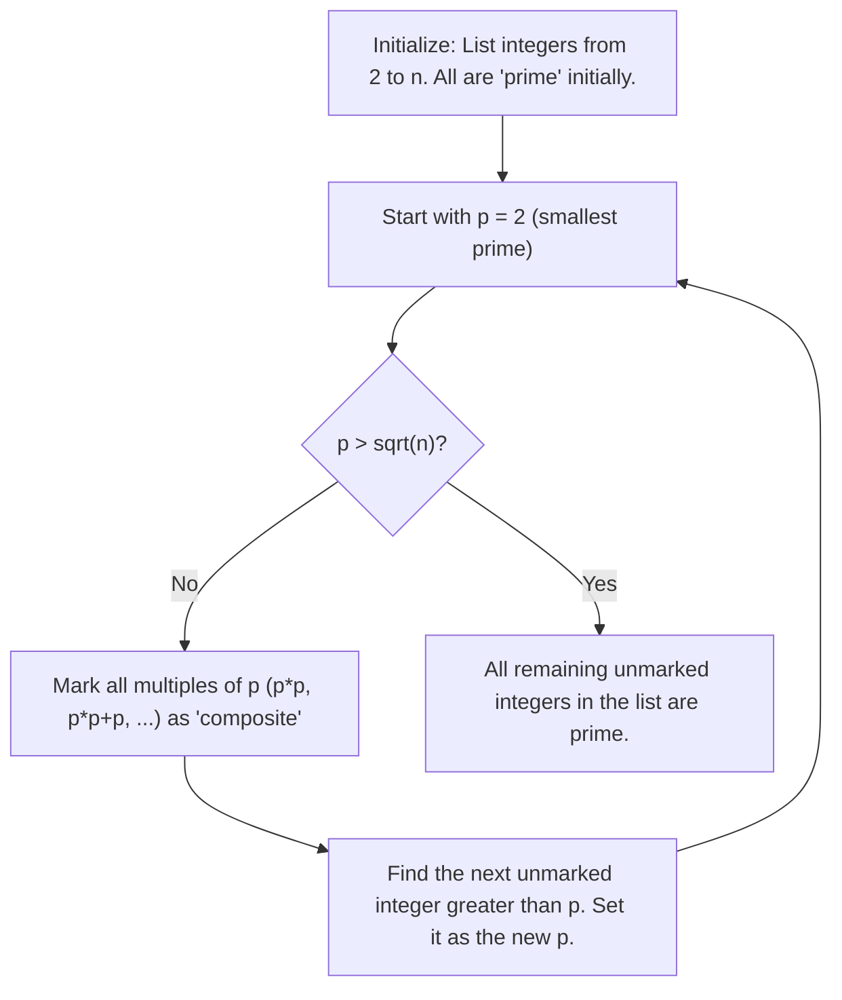
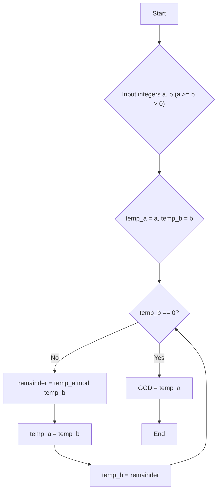
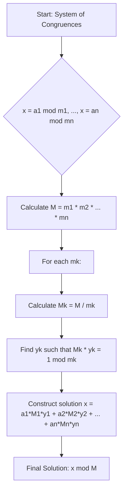

---
tags:
  - "#CCT2"
  - DS
Topic: Divisibility | Primes | GCD | LCM | Euclid's Algo. | Congruences | Arithm. Modulo - Inverses, linear congruences, chinese remainder theorem | Solving a system of linear congruences | The small Fermat's theorem
Semester: CCT2
Course: Diskrete strukturer
Litterature:
  - Discrete Mathematics and Its Applications - 8th Ed.
Created: 17-02-2026
---
- - -
# Table of Contents

1. [[#Number Theory and Cryptography|Number Theory and Cryptography]]
	1. [[#Number Theory and Cryptography#Quick Reference|Quick Reference]]
	2. [[#Number Theory and Cryptography#Divisibility and Modular Arithmetic|Divisibility and Modular Arithmetic]]
		1. [[#Divisibility and Modular Arithmetic#Introduction|Introduction]]
		2. [[#Divisibility and Modular Arithmetic#Division|Division]]
		3. [[#Divisibility and Modular Arithmetic#The Division Algorithm|The Division Algorithm]]
		4. [[#Divisibility and Modular Arithmetic#Modular Arithmetic|Modular Arithmetic]]
		5. [[#Divisibility and Modular Arithmetic#Arithmetic Modulo $m$|Arithmetic Modulo $m$]]
	3. [[#Number Theory and Cryptography#Primes and Greatest Common Divisors|Primes and Greatest Common Divisors]]
		1. [[#Primes and Greatest Common Divisors#Introduction|Introduction]]
		2. [[#Primes and Greatest Common Divisors#Primes|Primes]]
		3. [[#Primes and Greatest Common Divisors#Trial Division|Trial Division]]
		4. [[#Primes and Greatest Common Divisors#The Sieve of Eratosthenes|The Sieve of Eratosthenes]]
		5. [[#Primes and Greatest Common Divisors#The Infinitude of Primes|The Infinitude of Primes]]
		6. [[#Primes and Greatest Common Divisors#The Distribution of Primes|The Distribution of Primes]]
		7. [[#Primes and Greatest Common Divisors#Primes and Arithmetic Progressions|Primes and Arithmetic Progressions]]
		8. [[#Primes and Greatest Common Divisors#Conjectures and Open Problems About Primes|Conjectures and Open Problems About Primes]]
		9. [[#Primes and Greatest Common Divisors#Greatest Common Divisors and Least Common Multiples|Greatest Common Divisors and Least Common Multiples]]
			1. [[#Greatest Common Divisors and Least Common Multiples#Greatest Common Divisor|Greatest Common Divisor]]
			2. [[#Greatest Common Divisors and Least Common Multiples#GCD via Prime Factorization|GCD via Prime Factorization]]
			3. [[#Greatest Common Divisors and Least Common Multiples#Least Common Multiple|Least Common Multiple]]
			4. [[#Greatest Common Divisors and Least Common Multiples#The GCD-LCM Product Relationship|The GCD-LCM Product Relationship]]
		10. [[#Primes and Greatest Common Divisors#The Euclidean Algorithm|The Euclidean Algorithm]]
		11. [[#Primes and Greatest Common Divisors#GCDs as Linear Combinations|GCDs as Linear Combinations]]
	4. [[#Number Theory and Cryptography#Solving Congruences|Solving Congruences]]
		1. [[#Solving Congruences#Introduction|Introduction]]
		2. [[#Solving Congruences#Linear Congruences|Linear Congruences]]
		3. [[#Solving Congruences#The Chinese Remainder Theorem|The Chinese Remainder Theorem]]
		4. [[#Solving Congruences#Computer Arithmetic with Large Integers|Computer Arithmetic with Large Integers]]
		5. [[#Solving Congruences#Fermat’s Little Theorem|Fermat’s Little Theorem]]
		6. [[#Solving Congruences#Pseudoprimes|Pseudoprimes]]
		7. [[#Solving Congruences#Primitive Roots and Discrete Logarithms|Primitive Roots and Discrete Logarithms]]

# Number Theory and Cryptography

## Quick Reference

| Symbol / Notation           | Name                              | Meaning                                                                                   |
| --------------------------- | --------------------------------- | ----------------------------------------------------------------------------------------- |
| $a \mid b$                  | Divides                           | $a$ divides $b$; there exists an integer $c$ such that $b = ac$                           |
| $a \nmid b$                 | Does Not Divide                   | $a$ does not divide $b$                                                                   |
| $a \bmod m$                 | Mod Function                      | The remainder when $a$ is divided by $m$                                                  |
| $a \equiv b \pmod{m}$       | Congruence                        | $a$ and $b$ have the same remainder when divided by $m$                                   |
| $a \not\equiv b \pmod{m}$   | Non-Congruence                    | $a$ and $b$ do not have the same remainder when divided by $m$                            |
| $a \text{ div } d$          | Integer Division (Quotient)       | The quotient $q$ when $a$ is divided by $d$                                               |
| $+_m$, $\cdot_m$            | Modular Addition / Multiplication | Arithmetic operations performed in $\mathbb{Z}_m$                                         |
| $\mathbb{Z}_m$              | Integers Modulo $m$               | The set $\{0, 1, \dots, m-1\}$                                                            |
| $\gcd(a, b)$                | Greatest Common Divisor           | The largest integer dividing both $a$ and $b$                                             |
| $\operatorname{lcm}(a, b)$  | Least Common Multiple             | The smallest positive integer divisible by both $a$ and $b$                               |
| $\lfloor x \rfloor$         | Floor Function                    | The greatest integer less than or equal to $x$                                            |
| $\sum$                      | Summation (Capital Sigma)         | Directs you to add a sequence of terms together                                           |
| $\prod$                     | Product (Capital Pi)              | Directs you to multiply a sequence of terms together                                      |
| $\overline{a}$ or $\bar{a}$ | Modular Inverse                   | An integer such that $\bar{a} \cdot a \equiv 1 \pmod{m}$                                  |
| $\log_r a$                  | Discrete Logarithm                | The exponent $e$ such that $r^e \equiv a \pmod{p}$                                        |
| $p \mid a_1 a_2 \cdots a_n$ | Prime Divisibility of Product     | If $p$ is prime and divides the product, then $p$ divides at least one factor $a_i$       |
| $M_k$                       | CRT Partial Product               | In The Chinese Remainder Theorem, $M_k = m / m_k$; the product of all moduli except $m_k$ |
| $a^{p-1} \equiv 1 \pmod{p}$ | Fermat's Little Theorem           | A fundamental congruence for a prime $p$ and an integer $a$ not divisible by $p$          |

_Table 1.1: Quick reference of key symbols and notation used throughout number theory and cryptography._

---

## Divisibility and Modular Arithmetic

### Introduction

Dividing an integer by a positive integer results in a quotient and a remainder. The process of working with these remainders leads to _modular arithmetic_, a crucial concept in both mathematics and computer science.

> [!info] Applications of Modular Arithmetic
> Modular arithmetic is utilized for several important practical applications, including:
> - Generating pseudorandom numbers
> - Assigning computer memory locations to files
> - Constructing check digits (e.g., ISBN, credit card numbers)
> - Encrypting messages (the foundation of Cryptography)

---

### Division

When one integer is divided by a second nonzero integer, the quotient may or may not be an integer. For instance, $12/3 = 4$ is an integer, whereas $11/4 = 2.75$ is not. This observation motivates a formal definition.

> [!summary] Definition: Divisibility
> If $a$ and $b$ are integers with $a \neq 0$, we say that **$a$ divides $b$** if there is an integer $c$ such that $b = ac$ (or equivalently, if $b/a$ is an integer).
>
> - When $a$ divides $b$, we say $a$ is a _factor_ or _divisor_ of $b$, and $b$ is a _multiple_ of $a$.
> - The notation $a \mid b$ denotes that $a$ divides $b$.
> - We write $a \nmid b$ when $a$ does not divide $b$.
> - **Quantifier form:** $a \mid b$ can be expressed as $\exists c \in \mathbb{Z}(ac = b)$.

> [!example] Divisibility Check
> **Problem:** Determine whether $3 \mid 7$ and whether $3 \mid 12$.
>
> **Solution:**
> - $3 \nmid 7$, because $7/3$ is not an integer.
> - $3 \mid 12$, because $12/3 = 4$.

> [!example] Counting Multiples Not Exceeding $n$
> **Problem:** Let $n$ and $d$ be positive integers. How many positive integers not exceeding $n$ are divisible by $d$?
>
> **Solution:** The positive integers divisible by $d$ are of the form $dk$ where $k$ is a positive integer. We need $0 < dk \le n$, which gives $0 < k \le n/d$. Therefore, there are $\lfloor n/d \rfloor$ such integers.

> [!summary] Theorem: Properties of Divisibility
> Let $a$, $b$, and $c$ be integers, where $a \neq 0$.
>
> 1. If $a \mid b$ and $a \mid c$, then $a \mid (b + c)$.
> 2. If $a \mid b$, then $a \mid bc$ for all integers $c$.
> 3. If $a \mid b$ and $b \mid c$, then $a \mid c$.
>
> ![[Pasted image 20260217161359.png]]
>
> _Figure 1.1: Visual representation of the transitivity and closure properties of divisibility._
>
> **Breakdown:**
> - $a$: A non-zero integer that acts as a divisor.
> - $b, c$: Integers being divided or multiplied.
>
> **Proof:**
>
> **(i)** Suppose $a \mid b$ and $a \mid c$. Then there exist integers $s$ and $t$ with $b = as$ and $c = at$. Hence, $b + c = as + at = a(s + t)$. Therefore, $a \mid (b + c)$.
>
> **(ii)** Suppose $a \mid b$. Then there is an integer $s$ such that $b = as$. Multiplying both sides by $c$: $bc = (as)c = a(sc)$. Since $sc$ is an integer, $a \mid bc$.
>
> **(iii)** Suppose $a \mid b$ and $b \mid c$. Then there exist integers $s$ and $t$ such that $b = as$ and $c = bt$. Substituting: $c = (as)t = a(st)$. Since $st$ is an integer, $a \mid c$.

> [!summary] Corollary: Divisibility of Integer Linear Combinations
> If $a$, $b$, and $c$ are integers, where $a \neq 0$, such that $a \mid b$ and $a \mid c$, then $a \mid (mb + nc)$ whenever $m$ and $n$ are integers.
>
> **Proof:**
> By Property (ii), $a \mid mb$ and $a \mid nc$. By Property (i), $a \mid (mb + nc)$.

---

### The Division Algorithm

When an integer is divided by a positive integer, there is always a unique quotient and a unique remainder.

> [!summary] Theorem: The Division Algorithm
> Let $a$ be an integer and $d$ a positive integer. Then there are **unique** integers $q$ and $r$, with $0 \le r < d$, such that:
> $$a = dq + r$$
>
> **Breakdown:**
> - $a$ : The **dividend** (the number being divided).
> - $d$ : The **divisor** (the number dividing). Must be a positive integer.
> - $q$ : The **quotient**, denoted $q = a \text{ div } d = \lfloor a/d \rfloor$.
> - $r$ : The **remainder**, denoted $r = a \bmod d = a - d\lfloor a/d \rfloor$. Always satisfies $0 \le r < d$.

> [!example] Dividing $101$ by $11$
> **Problem:** What are the quotient and remainder when $101$ is divided by $11$?
>
> **Solution:** We have $101 = 11 \cdot 9 + 2$.
> - $a = 101$, $d = 11$, $q = 9$, $r = 2$.
> - Quotient: $9 = 101 \text{ div } 11$.
> - Remainder: $2 = 101 \bmod 11$.

> [!example] Dividing a Negative Integer
> **Problem:** What are the quotient and remainder when $-11$ is divided by $3$?
>
> **Solution:** We have $-11 = 3 \cdot (-4) + 1$.
> - Quotient: $q = -4 = -11 \text{ div } 3$.
> - Remainder: $r = 1 = -11 \bmod 3$.
>
> **Note:** The remainder is **not** $-2$, even though $-11 = 3(-3) - 2$, because $r = -2$ violates the constraint $0 \le r < 3$.

> [!warning] Remainder Must Be Non-Negative
> The division algorithm requires $0 \le r < d$. When dividing negative numbers, be careful to choose $q$ such that the remainder is non-negative.

The integer $a$ is divisible by $d$ if and only if the remainder is zero when $a$ is divided by $d$.

---

### Modular Arithmetic

In many situations we care only about the remainder of an integer when it is divided by some specified positive integer. For example, to find what time it will be $50$ hours from now on a $24$-hour clock, we only need the remainder when (current hour + $50$) is divided by $24$.

We use `a mod m` to represent the remainder when $a$ is divided by $m$. A related but distinct notation is _congruence_, which indicates that two integers have the same remainder when divided by $m$.

> [!summary] Definition: Congruence Modulo $m$
> If $a$ and $b$ are integers and $m$ is a positive integer, then $a$ is **congruent to $b$ modulo $m$** if $m$ divides $a - b$. We write:
> $$a \equiv b \pmod{m}$$
> We say this is a **congruence** and that $m$ is its **modulus** (plural: moduli). If $a$ and $b$ are not congruent modulo $m$, we write $a \not\equiv b \pmod{m}$.
>
> **Breakdown:**
> - $a, b$: Integers that are being compared.
> - $m$: A positive integer, the modulus. It defines the "cycle" or "wrap-around" point for the arithmetic.

> [!important] Congruence vs. Mod Function
> Although both notations include "mod," they are fundamentally different:
> - $a \equiv b \pmod{m}$ is a **relation** on the set of integers (a statement that is true or false).
> - $a \bmod m = b$ is a **function** that returns a specific value (the remainder).
>
> However, they are closely related: $a \equiv b \pmod{m}$ if and only if $a \bmod m = b \bmod m$.

> [!example] Checking Congruence
> **Problem:** Determine whether $17 \equiv 5 \pmod{6}$ and whether $24 \equiv 14 \pmod{6}$.
>
> **Solution:**
> - $17 - 5 = 12$, and $6 \mid 12$, so $17 \equiv 5 \pmod{6}$. ✓
> - $24 - 14 = 10$, and $6 \nmid 10$, so $24 \not\equiv 14 \pmod{6}$. ✗

> [!summary] Theorem: Alternative Characterization of Congruence
> Let $m$ be a positive integer. The integers $a$ and $b$ are congruent modulo $m$ if and only if there is an integer $k$ such that:
> $$a = b + km$$
>
> **Proof:**
> If $a \equiv b \pmod{m}$, then $m \mid (a - b)$, so there exists integer $k$ with $a - b = km$, giving $a = b + km$. Conversely, if $a = b + km$, then $a - b = km$, so $m \mid (a - b)$, giving $a \equiv b \pmod{m}$.

> [!summary] Definition: Congruence Class
> The set of all integers congruent to an integer $a$ modulo $m$ is called the **congruence class** of $a$ modulo $m$.
> 
> $$[a]_m = {i | i \in \mathbb Z  \wedge i \equiv a\pmod{m}}$$
>
> ![[Pasted image 20260218091342.png]]
>
> _Figure 1.2: Congruence classes modulo $m$ from lecture._
> 

> [!summary] Theorem: Addition and Multiplication Preserve Congruences
> Let $m$ be a positive integer. If $a \equiv b \pmod{m}$ and $c \equiv d \pmod{m}$, then:
> $$a + c \equiv b + d \pmod{m}$$
> $$ac \equiv bd \pmod{m}$$
>
> **Breakdown:**
> - $m$: The positive integer modulus.
> - $a, b, c, d$: Integers, where $a$ is congruent to $b$ modulo $m$, and $c$ is congruent to $d$ modulo $m$.
>
> **Proof:**
> Since $a \equiv b \pmod{m}$ and $c \equiv d \pmod{m}$, there exist integers $s$ and $t$ with $b = a + sm$ and $d = c + tm$. Then:
> - $b + d = (a + sm) + (c + tm) = (a + c) + m(s + t)$, so $a + c \equiv b + d \pmod{m}$.
> - $bd = (a + sm)(c + tm) = ac + m(at + cs + stm)$, so $ac \equiv bd \pmod{m}$.

> [!example] Applying Modular Arithmetic Properties
> Because $7 \equiv 2 \pmod{5}$ and $11 \equiv 1 \pmod{5}$:
> - **Addition:** $7 + 11 = 18 \equiv 2 + 1 = 3 \pmod{5}$
> - **Multiplication:** $7 \cdot 11 = 77 \equiv 2 \cdot 1 = 2 \pmod{5}$

> [!warning] Cancellation and Division in Congruences
> Some properties you might expect do **not** hold in modular arithmetic:
> - If $ac \equiv bc \pmod{m}$, it does **not** necessarily follow that $a \equiv b \pmod{m}$.
> - Cancellation only works when $\gcd(c, m) = 1$ (see the Cancellation Theorem later).

> [!summary] Corollary: Modular Reduction of Sums and Products
> Let $m$ be a positive integer and $a$, $b$ be integers. Then:
> $$(a + b) \bmod m = ((a \bmod m) + (b \bmod m)) \bmod m$$
> $$ab \bmod m = ((a \bmod m)(b \bmod m)) \bmod m$$
>
> This means we can reduce operands modulo $m$ **before** performing arithmetic, which is invaluable for working with large numbers.

> [!example] Multi-Step Modular Computation
> **Problem:** Find $(19^3 \bmod 31)^4 \bmod 23$.
>
> **Solution:**
> 1. Compute $19^3 \bmod 31$: $19^3 = 6859$, and $6859 = 221 \cdot 31 + 8$, so $19^3 \bmod 31 = 8$.
> 2. Compute $8^4 \bmod 23$: $8^4 = 4096$, and $4096 = 178 \cdot 23 + 2$, so $8^4 \bmod 23 = 2$.
> 3. Therefore, $(19^3 \bmod 31)^4 \bmod 23 = 2$.

---

### Arithmetic Modulo $m$

We can define formal arithmetic operations on $\mathbb{Z}_m = \{0, 1, \dots, m - 1\}$, the set of nonnegative integers less than $m$.

> [!summary] Definition: Addition and Multiplication Modulo $m$
> For integers $a$ and $b$ in $\mathbb{Z}_m$:
> - **Addition modulo $m$:** $a +_m b = (a + b) \bmod m$
> - **Multiplication modulo $m$:** $a \cdot_m b = (a \cdot b) \bmod m$
>
> The right-hand side uses ordinary integer operations. Working with these operations is called **arithmetic modulo $m$**.

> [!example] Arithmetic in $\mathbb{Z}_{11}$
> **Problem:** Find $7 +_{11} 9$ and $7 \cdot_{11} 9$.
>
> **Solution:**
> - $7 +_{11} 9 = (7 + 9) \bmod 11 = 16 \bmod 11 = 5$
> - $7 \cdot_{11} 9 = (7 \cdot 9) \bmod 11 = 63 \bmod 11 = 8$

The operations $+_m$ and $\cdot_m$ satisfy many of the same properties as ordinary addition and multiplication:

| Property             | Addition                                                | Multiplication                                      |
| -------------------- | ------------------------------------------------------- | --------------------------------------------------- |
| **Closure**          | $a +_m b \in \mathbb{Z}_m$                              | $a \cdot_m b \in \mathbb{Z}_m$                      |
| **Associativity**    | $(a +_m b) +_m c = a +_m (b +_m c)$                     | $(a \cdot_m b) \cdot_m c = a \cdot_m (b \cdot_m c)$ |
| **Commutativity**    | $a +_m b = b +_m a$                                     | $a \cdot_m b = b \cdot_m a$                         |
| **Identity**         | $a +_m 0 = a$                                           | $a \cdot_m 1 = a$                                   |
| **Additive Inverse** | $a +_m (m - a) = 0$ for $a \neq 0$                      | —                                                   |
| **Distributivity**   | $a \cdot_m (b +_m c) = (a \cdot_m b) +_m (a \cdot_m c)$ |                                                     |

_Table 1.2: Algebraic properties of arithmetic modulo $m$._

> [!note] No General Multiplicative Inverses
> Every element of $\mathbb{Z}_m$ has an additive inverse, but multiplicative inverses **do not always exist**. For instance, there is no multiplicative inverse of $2$ modulo $6$ (no integer $x$ in $\{0, 1, 2, 3, 4, 5\}$ satisfies $2x \equiv 1 \pmod{6}$). The conditions under which multiplicative inverses exist are addressed in Section $3$ (Solving Congruences).

> [!abstract] Algebraic Structures
> - $\mathbb{Z}_m$ with modular addition forms a **commutative group**.
> - $\mathbb{Z}_m$ with both modular addition and multiplication forms a **commutative ring**.
>
> These structures are studied in depth in Abstract Algebra.

> [!note] Notation Convention
> In later sections, the symbols $+$ and $\cdot$ are often used in place of $+_m$ and $\cdot_m$ when it is clear from context that we are working in $\mathbb{Z}_m$.

---

## Primes and Greatest Common Divisors

### Introduction

One of the most important concepts based on divisibility is that of a _prime number_. The study of primes goes back to ancient times — Euclid proved that there are infinitely many primes in a proof famous for its elegance.

> [!info] Why Primes Matter
> - The **Fundamental Theorem of Arithmetic** states every positive integer can be written uniquely as a product of primes.
> - Finding large primes is essential in modern Cryptography.
> - The difficulty of factoring large integers into primes is the basis for the security of systems like RSA.

---

### Primes

Every integer greater than $1$ is divisible by at least $1$ and itself. Integers with _exactly_ two distinct positive divisors are special.

> [!summary] Definition: Prime and Composite Numbers
> An integer $p > 1$ is called **prime** if its only positive factors are $1$ and $p$.
>
> A positive integer $n > 1$ that is **not** prime is called **composite**.
>
> **Remarks:**
> - The integer $1$ is **not** prime (it has only one positive factor).
> - An integer $n$ is composite if and only if there exists an integer $a$ with $a \mid n$ and $1 < a < n$.

> [!example] Prime vs. Composite
> - $7$ is **prime**: its only positive factors are $1$ and $7$.
> - $9$ is **composite**: it is divisible by $3$ (in addition to $1$ and $9$).

> [!summary] Theorem: The Fundamental Theorem of Arithmetic
> Every integer greater than $1$ can be written uniquely as a prime or as the product of two or more primes, where the prime factors are written in nondecreasing order.
>
> - **Equation (Factorization):** $n = p_1^{e_1} \cdot p_2^{e_2} \cdots p_k^{e_k}$
> - **Breakdown:**
>     - $n$ : The positive integer being factored.
>     - $p_1, p_2, \dots, p_k$ : The distinct prime factors of $n$, listed in increasing order ($p_1 < p_2 < \cdots < p_k$).
>     - $e_1, e_2, \dots, e_k$ : The exponents, indicating how many times each prime factor appears. Each $e_i \ge 1$.
>     - **Uniqueness:** For any given $n$, this set of primes and exponents is the only one possible.

> [!example] Prime Factorizations
> - $100 = 2^2 \cdot 5^2$
> - $641 = 641$ ($641$ is itself prime)
> - $999 = 3^3 \cdot 37$
> - $1024 = 2^{10}$

---

### Trial Division

To determine whether a given integer is prime, we can use the following key observation about composite numbers.

> [!summary] Theorem: Composite Numbers Have Small Prime Divisors
> If $n$ is a composite integer, then $n$ has a prime divisor less than or equal to $\sqrt{n}$.
>
> **Proof:**
> If $n$ is composite, then $n = ab$ where $1 < a < n$ and $1 < b < n$. If both $a > \sqrt{n}$ and $b > \sqrt{n}$, then $ab > n$, a contradiction. So at least one of $a$ or $b$ satisfies $a \le \sqrt{n}$ (or $b \le \sqrt{n}$). That factor is either prime or has a prime divisor less than itself. Either way, $n$ has a prime divisor $\le \sqrt{n}$.

This theorem gives us the **trial division** method: to test whether $n$ is prime, divide $n$ by all primes up to $\sqrt{n}$. If none divide $n$, then $n$ is prime.

> [!example] Proving $101$ is Prime via Trial Division
> **Problem:** Show that $101$ is prime.
>
> **Solution:**
> $\sqrt{101} \approx 10.05$. The primes $\le 10$ are $2, 3, 5$, and $7$.
> - $101 / 2 = 50.5$ (not an integer)
> - $101 / 3 \approx 33.67$ (not an integer)
> - $101 / 5 = 20.2$ (not an integer)
> - $101 / 7 \approx 14.43$ (not an integer)
>
> Since $101$ is not divisible by any prime $\le \sqrt{101}$, it is **prime**.

Trial division can also be used to find the complete prime factorization of a composite number. Begin dividing by the smallest prime ($2$) and continue with successive primes. When a prime $p$ divides $n$, replace $n$ with $n/p$ and continue from $p$. The process terminates when the remaining quotient is itself prime.

> [!example] Finding the Prime Factorization of $7007$
> **Problem:** Find the prime factorization of $7007$.
>
> **Solution:**
> 1. $7007 / 2$: not an integer. $7007 / 3$: not an integer. $7007 / 5$: not an integer.
> 2. $7007 / 7 = 1001$. ✓ Now factor $1001$.
> 3. $1001 / 7 = 143$. ✓ Now factor $143$.
> 4. $143 / 7$: not an integer. $143 / 11 = 13$. ✓ Now factor $13$.
> 5. $13$ is prime. Done.
>
> Therefore, $7007 = 7 \cdot 7 \cdot 11 \cdot 13 = 7^2 \cdot 11 \cdot 13$.

---

### The Sieve of Eratosthenes

The _Sieve of Eratosthenes_ is a classical algorithm for finding **all** primes up to a specified limit. It works by iteratively marking the multiples of each prime as composite.

**Procedure to find all primes $\le 100$:**
1. List all integers from $2$ to $100$.
2. Starting with $2$ (the smallest prime), remove all multiples of $2$ greater than $2$.
3. The next remaining number is $3$. Remove all multiples of $3$ greater than $3$.
4. The next remaining number is $5$. Remove all multiples of $5$ greater than $5$.
5. The next remaining number is $7$. Remove all multiples of $7$ greater than $7$.
6. Since all composite numbers $\le 100$ must have a prime factor $\le \sqrt{100} = 10$, and we've sieved by all primes $\le 10$, the remaining numbers (except $1$) are all prime.

![[Pasted image 20260217201422.png]]

_Figure 2.1: The Sieve of Eratosthenes applied to integers $1$–$100$, with composite numbers crossed out._

The primes less than $100$ are: $2, 3, 5, 7, 11, 13, 17, 19, 23, 29, 31, 37, 41, 43, 47, 53, 59, 61, 67, 71, 73, 79, 83, 89$, and $97$.



_Figure 2.2: Flowchart of the Sieve of Eratosthenes algorithm._

---

### The Infinitude of Primes

> [!summary] Theorem: Infinitude of Primes
> There are infinitely many primes.
>
> **Proof (by contradiction):**
> Assume there are only finitely many primes: $p_1, p_2, \dots, p_n$. Let $Q = p_1 p_2 \cdots p_n + 1$. By the Fundamental Theorem of Arithmetic, $Q$ is either prime or has a prime factor. But no $p_j$ divides $Q$, because if $p_j \mid Q$, then $p_j \mid (Q - p_1 p_2 \cdots p_n) = 1$, which is impossible. Therefore, there is a prime not in our list — either $Q$ itself or a prime factor of $Q$. This contradicts the assumption that the list was complete.

> [!note] Subtlety of the Proof
> The proof does **not** claim that $Q$ itself is always prime. It only shows that a prime exists outside the assumed finite list. For constructive results, one would need to explicitly identify such a prime.

Because there are infinitely many primes, for any positive integer there are primes greater than it. The largest known primes are typically **Mersenne primes** of the form $2^p - 1$ where $p$ is prime. These can be tested efficiently using the _Lucas–Lehmer test_.

> [!example] Mersenne Primes
> - $2^2 - 1 = 3$ ✓ (prime)
> - $2^3 - 1 = 7$ ✓ (prime)
> - $2^5 - 1 = 31$ ✓ (prime)
> - $2^7 - 1 = 127$ ✓ (prime)
> - $2^{11} - 1 = 2047 = 23 \cdot 89$ ✗ (not prime)

---

### The Distribution of Primes

While there are infinitely many primes, we can ask: how many primes are there up to a given number $x$?

> [!summary] Theorem: The Prime Number Theorem
> The ratio of $\pi(x)$ (the number of primes not exceeding $x$) to $x / \ln x$ approaches $1$ as $x$ grows without bound.
>
> - **Equation:** $\lim_{x \to \infty} \frac{\pi(x)}{x / \ln x} = 1$
> - **Breakdown:**
>     - $\pi(x)$ : The **prime-counting function**. It gives the exact number of primes $\le x$.
>     - $x / \ln x$ : An **approximation** for $\pi(x)$. It suggests that roughly $1$ in every $\ln x$ integers near $x$ is prime.
>     - $\ln x$ : The **natural logarithm** of $x$ (logarithm base $e \approx 2.718$).
>
> This means that for large $x$, $\pi(x) \approx x / \ln x$.

![[Pasted image 20260217202103.png]]

_Figure 2.3: Comparison of $\pi(x)$ (exact prime count) and $x / \ln x$ (approximation) for increasing values of $x$._

---

### Primes and Arithmetic Progressions

Every odd integer belongs to one of the arithmetic progressions $4k + 1$ or $4k + 3$ for $k = 0, 1, 2, \dots$. There are infinitely many primes in **both** of these progressions:

- **Primes of the form $4k + 1$:** $5, 13, 17, 29, 37, 41, \dots$
- **Primes of the form $4k + 3$:** $3, 7, 11, 19, 23, 31, 43, \dots$

More generally, **Dirichlet's Theorem on Primes in Arithmetic Progressions** states that if $a$ and $d$ are coprime positive integers, then the arithmetic progression $a, a+d, a+2d, \dots$ contains infinitely many primes.

---

### Conjectures and Open Problems About Primes

> [!note]
> This section is intentionally left as a placeholder for future content on open problems such as the Goldbach Conjecture, Twin Prime Conjecture, and others.

---

### Greatest Common Divisors and Least Common Multiples

#### Greatest Common Divisor

The largest integer that divides both of two integers is called the greatest common divisor of these integers.

> [!summary] Definition: Greatest Common Divisor (GCD)
> Let $a$ and $b$ be integers, not both zero. The **greatest common divisor** of $a$ and $b$, denoted $\gcd(a, b)$, is the largest integer $d$ such that $d \mid a$ and $d \mid b$.

> [!example] Finding GCD by Listing Divisors
> **Problem:** What is $\gcd(24, 36)$?
>
> **Solution:** The positive common divisors of $24$ and $36$ are $1, 2, 3, 4, 6$, and $12$. Hence, $\gcd(24, 36) = 12$.

> [!example] Coprime Integers
> **Problem:** What is $\gcd(17, 22)$?
>
> **Solution:** The integers $17$ and $22$ have no positive common divisors other than $1$, so that $\gcd(17, 22) = 1$.

> [!summary] Definition: Relatively Prime
> The integers $a$ and $b$ are **relatively prime** (or **coprime**) if their greatest common divisor is $1$, i.e., $\gcd(a, b) = 1$.

> [!summary] Definition: Pairwise Relatively Prime
> The integers $a_1, a_2, \dots, a_n$ are **pairwise relatively prime** if $\gcd(a_i, a_j) = 1$ whenever $1 \le i < j \le n$.

> [!example] Checking Pairwise Relative Primality
> **Problem:** Determine whether the integers $10, 17$, and $21$ are pairwise relatively prime and whether the integers $10, 19$, and $24$ are pairwise relatively prime.
>
> **Solution:**
> - Because $\gcd(10, 17) = 1$, $\gcd(10, 21) = 1$, and $\gcd(17, 21) = 1$, we conclude that $10, 17$, and $21$ are pairwise relatively prime.
> - Because $\gcd(10, 24) = 2 > 1$, we see that $10, 19$, and $24$ are **not** pairwise relatively prime.

#### GCD via Prime Factorization

> [!summary] Theorem: GCD via Prime Factorization
> If $a = p_1^{a_1} p_2^{a_2} \cdots p_n^{a_n}$ and $b = p_1^{b_1} p_2^{b_2} \cdots p_n^{b_n}$ (including all primes from both factorizations with zero exponents as needed), then:
>
> $$\gcd(a, b) = p_1^{\min(a_1, b_1)} \cdot p_2^{\min(a_2, b_2)} \cdots p_n^{\min(a_n, b_n)}$$
>
> **Breakdown:**
> - $p_1, p_2, \dots, p_n$ : All distinct primes appearing in either factorization of $a$ or $b$.
> - $a_i, b_i$ : The exponents of the prime $p_i$ in the prime factorization of $a$ and $b$ respectively.
> - $\min(x, y)$ : A function returning the minimum value between two numbers $x$ and $y$. This ensures the resulting prime power divides both $a$ and $b$.

> [!example] GCD of $120$ and $500$
> $120 = 2^3 \cdot 3^1 \cdot 5^1$ and $500 = 2^2 \cdot 3^0 \cdot 5^3$.
>
> $$\gcd(120, 500) = 2^{\min(3,2)} \cdot 3^{\min(1,0)} \cdot 5^{\min(1,3)} = 2^2 \cdot 3^0 \cdot 5^1 = 4 \cdot 1 \cdot 5 = 20$$

#### Least Common Multiple

The least common multiple of two integers. Inverse of Greatest Common Divisor.

> [!summary] Definition: Least Common Multiple (LCM)
> The **least common multiple** of positive integers $a$ and $b$, denoted $\operatorname{lcm}(a, b)$, is the smallest positive integer divisible by both $a$ and $b$.

> [!summary] Theorem: LCM via Prime Factorization
> Using the same prime factorizations as before:
>
> $$\operatorname{lcm}(a, b) = p_1^{\max(a_1, b_1)} \cdot p_2^{\max(a_2, b_2)} \cdots p_n^{\max(a_n, b_n)}$$
>
> **Breakdown:**
> - $p_1, p_2, \dots, p_n$ : All distinct primes appearing in either factorization of $a$ or $b$.
> - $a_i, b_i$ : The exponents of the prime $p_i$ in the prime factorization of $a$ and $b$ respectively.
> - $\max(x, y)$ : A function returning the maximum value between two numbers $x$ and $y$. This ensures the resulting prime power is divisible by both $a$ and $b$.

> [!example] LCM Calculation
> **Problem:** What is $\operatorname{lcm}(2^3 \cdot 3^5 \cdot 7^2,\; 2^4 \cdot 3^3)$?
>
> **Solution:**
> $$\operatorname{lcm} = 2^{\max(3,4)} \cdot 3^{\max(5,3)} \cdot 7^{\max(2,0)} = 2^4 \cdot 3^5 \cdot 7^2 = 16 \cdot 243 \cdot 49 = 190{,}512$$

#### The GCD-LCM Product Relationship

> [!summary] Theorem: Product of GCD and LCM
> For positive integers $a$ and $b$:
> $$ab = \gcd(a, b) \cdot \operatorname{lcm}(a, b)$$
>
> This follows from the fact that $\min(x, y) + \max(x, y) = x + y$ for the exponent of each prime.

---

### The Euclidean Algorithm

Computing the GCD from prime factorizations is **inefficient** because factoring is time-consuming. The **Euclidean algorithm** provides a much faster method, known since antiquity.

> [!summary] Lemma: GCD Reduction Lemma
> If $a = bq + r$, where $a, b, q$, and $r$ are integers, then $\gcd(a, b) = \gcd(b, r)$.
>
> **Proof:**
> Any common divisor of $a$ and $b$ must also divide $r = a - bq$, so it is a common divisor of $b$ and $r$. Conversely, any common divisor of $b$ and $r$ must also divide $a = bq + r$. Since the sets of common divisors are identical, the greatest common divisors are equal.

> [!summary] Theorem: The Euclidean Algorithm
> Let $a$ and $b$ be positive integers with $a \ge b$. Let $r_0 = a$ and $r_1 = b$. If we successively apply the division algorithm, we obtain the sequence of equations:
>
> $r_0 = r_1q_1 + r_2 \quad (0 \le r_2 < r_1)$
> $r_1 = r_2q_2 + r_3 \quad (0 \le r_3 < r_2)$
> $\vdots$
> $r_{n-2} = r_{n-1}q_{n-1} + r_n \quad (0 \le r_n < r_{n-1})$
> $r_{n-1} = r_nq_n + 0$
>
> Eventually a remainder of zero occurs because the sequence of remainders $a = r_0 > r_1 > r_2 > \dots > r_n \ge 0$ cannot contain more than $a$ terms. The greatest common divisor of $a$ and $b$ is the last nonzero remainder $r_n$.
>
> **Breakdown:**
> - $a, b$: The two positive integers for which the GCD is sought.
> - $r_i$: The successive remainders obtained from the division algorithm. $r_0 = a$, $r_1 = b$.
> - $q_i$: The quotients obtained from the division algorithm.
> - $r_n$: The last non-zero remainder, which is the $\gcd(a, b)$.
>
> **Proof:** By the GCD Reduction Lemma, $\gcd(a, b) = \gcd(r_0, r_1) = \gcd(r_1, r_2) = \dots = \gcd(r_{n-1}, r_n) = \gcd(r_n, 0) = r_n$.
>
> **Complexity:** The number of divisions required is $O(\log b)$.

> [!example] Finding $\gcd(91, 287)$
> - First, divide the larger of the two ($287$ ) by the smaller ($91$): $287 = 91 \cdot 3 + 14$. Any divisor of $91$ and $287$ must also divide $287 - 91 \cdot 3 = 14$. Thus, $\gcd(91, 287) = \gcd(91, 14)$.
> - Next, divide $91$ by this divisor $14$: $91 = 14 \cdot 6 + 7$. Any divisor of $91$ and $14$ must divide $91 - 14 \cdot 6 = 7$. Thus, $\gcd(287, 91) = \gcd(91, 14) = \gcd(14, 7)$.
> - Continue by dividing $14$ by $7$: $14 = 7 \cdot 2 + 0$. Since $7$ divides $14$, $\gcd(14, 7) = 7$.
>
> By chaining these results together, $\gcd(287, 91) = \gcd(91, 14) = \gcd(14, 7) = 7$.
> 
> The smallest non-zero remainder (in this case 7) after performing the necessary amount of steps, is the gcd pf the given integers

> [!example] Finding $\gcd(414, 662)$
> **Problem:** Find the greatest common divisor of $414$ and $662$ using the Euclidean algorithm.
>
> **Solution:** Successive uses of the division algorithm give:
> - $662 = 414 \cdot 1 + 248$
> - $414 = 248 \cdot 1 + 166$
> - $248 = 166 \cdot 1 + 82$
> - $166 = 82 \cdot 2 + 2$
> - $82 = 2 \cdot 41 + 0$
>
> Hence, $\gcd(414, 662) = 2$, because $2$ is the last nonzero remainder.
>
> ![[Pasted image 20260217203307.png]]
>
> _Figure 2.4: Tabular illustration of the Euclidean algorithm for $\gcd(414, 662)$._

The Euclidean algorithm can be expressed in pseudocode.

![[Pasted image 20260217203323.png]]

_Figure 2.5: Pseudocode for the Euclidean algorithm._

In this procedure, the initial values of $x$ and $y$ are $a$ and $b$, respectively. At each stage of the procedure, $x$ is replaced by $y$, and $y$ is replaced by $x \bmod y$, which is the remainder when $x$ is divided by $y$. This process is repeated as long as $y \neq 0$. The algorithm terminates when $y = 0$, and the value of $x$ at that point (the last nonzero remainder) is the greatest common divisor of $a$ and $b$.



_Figure 2.6: Flowchart representation of the Euclidean Algorithm._

---

### GCDs as Linear Combinations

An important result is that the greatest common divisor of two integers $a$ and $b$ can be expressed in the form $sa + tb$, where $s$ and $t$ are integers. In other words, $\gcd(a, b)$ can be expressed as a linear combination with integer coefficients of $a$ and $b$. For example, $\gcd(6, 14) = 2$, and $2 = (-2) \cdot 6 + 1 \cdot 14$.

> [!summary] Theorem: Bézout's Theorem
> If $a$ and $b$ are positive integers, then there exist integers $s$ and $t$ such that:
> $$\gcd(a, b) = sa + tb$$
>
> **Breakdown:**
> - $a, b$: The two positive integers whose greatest common divisor is being found.
> - $s, t$: Integers (called Bézout coefficients) which can be positive, negative, or zero.
> - $sa + tb$: A **linear combination** of $a$ and $b$ with integer coefficients.
> - $\gcd(a,b) = sa+tb$: This equation is called **Bézout’s identity**.

> [!example] Finding the GCD and Linear Combination for $318$ and $96$
>
> **Step 1: Apply the Euclidean Algorithm**
> Divide the larger number by the smaller number and repeat with the remainder until the remainder is $0$.
>
> $318 = 96 \cdot 3 + 30$
> $96 = 30 \cdot 3 + 6$
> $30 = 6 \cdot 5 + 0$
>
> The last non-zero remainder is the GCD.
> $\text{gcd}(318, 96) = 6$
>
> **Step 2: Extended Euclidean Algorithm (Back-Substitution)**
> Work backwards to express the GCD as a linear combination $318s + 96t = 6$.
>
> Start with the equation containing the GCD:
> $6 = 96 - 30 \cdot 3$
>
> Substitute the previous remainder $30 = 318 - 96 \cdot 3$:
> $6 = 96 - (318 - 96 \cdot 3) \cdot 3$
> $6 = 96 - 3 \cdot 318 + 9 \cdot 96$
> $6 = 10 \cdot 96 - 3 \cdot 318$
>
> **Result:**
> $6 = (-3) \cdot 318 + (10) \cdot 96$
> Therefore, $\text{gcd}(318, 96) = 6$ with $s = -3$ and $t = 10$.
>![[Pasted image 20260218102117.png]]

_Figure 2.7: Tabular layout of the extended Euclidean algorithm for $\gcd(318, 96)$._

> [!example] Finding GCD as a Linear Combination (Backward Pass)
> **Problem:** Express $\gcd(252, 198) = 18$ as a linear combination of $252$ and $198$ by working backwards through the steps of the Euclidean algorithm.
>
> **Solution:** The Euclidean algorithm uses these divisions:
> - $252 = 198 \cdot 1 + 54$
> - $198 = 54 \cdot 3 + 36$
> - $54 = 36 \cdot 1 + 18$
> - $36 = 18 \cdot 2 + 0$
>
> ![[Pasted image 20260217203629.png]]
>
> _Figure 2.8: Visualization of the Euclidean algorithm for $\gcd(252, 198)$._
>
> We work backwards from the next-to-last division:
> 1. From the third division: $18 = 54 - 1 \cdot 36$.
> 2. From the second division: $36 = 198 - 3 \cdot 54$. Substitute this into the previous equation:
> $18 = 54 - 1 \cdot (198 - 3 \cdot 54) = 4 \cdot 54 - 1 \cdot 198$.
> 3. From the first division: $54 = 252 - 1 \cdot 198$. Substitute this into the previous equation:
> $18 = 4 \cdot (252 - 1 \cdot 198) - 1 \cdot 198 = 4 \cdot 252 - 5 \cdot 198$.

> [!example] Finding GCD as a Linear Combination (Extended Euclidean Algorithm)
> **Problem:** Express $\gcd(252, 198) = 18$ as a linear combination of $252$ and $198$ using the extended Euclidean algorithm.
>
> **Solution:** The quotients from the Euclidean algorithm are $q_1 = 1, q_2 = 3, q_3 = 1, q_4 = 2$.
> We set initial values $s_0 = 1, s_1 = 0, t_0 = 0, t_1 = 1$.
> We calculate subsequent values using $s_j = s_{j-2} - q_{j-1}s_{j-1}$ and $t_j = t_{j-2} - q_{j-1}t_{j-1}$ for $j = 2, 3, 4$.
> - $s_2 = 1 - 0 \cdot 1 = 1, \quad t_2 = 0 - 1 \cdot 1 = -1$
> - $s_3 = 0 - 1 \cdot 3 = -3, \quad t_3 = 1 - (-1)3 = 4$
> - $s_4 = 1 - (-3) \cdot 1 = 4, \quad t_4 = -1 - 4 \cdot 1 = -5$
>
> Because $s_4 = 4$ and $t_4 = -5$, we see that $18 = \gcd(252, 198) = 4 \cdot 252 - 5 \cdot 198$.
>
> ![[Pasted image 20260217203742.png]]

_Figure 2.9: Tabular computation of the extended Euclidean algorithm._

> [!summary] Lemma: Divisibility of a Product Coprime to a Factor
> If $a$, $b$, and $c$ are positive integers such that $\gcd(a, b) = 1$ and $a \mid bc$, then $a \mid c$.
>
> **Breakdown:**
> - $a, b, c$: Positive integers.
> - $\gcd(a, b) = 1$: $a$ and $b$ are relatively prime, meaning they share no common prime factors.
> - $a \mid bc$: $a$ divides the product of $b$ and $c$.
>
> **Proof:**
> Because $\gcd(a, b) = 1$, by Bézout’s theorem there are integers $s$ and $t$ such that $sa + tb = 1$. Multiplying both sides of this equation by $c$, we obtain $sac + tbc = c$.
> We can now use properties of divisibility to show that $a \mid c$.
> - By part (ii) of the properties theorem, $a \mid tbc$ (since $a \mid bc$).
> - Because $a \mid sac$ and $a \mid tbc$, by part (i) of that theorem, we conclude that $a$ divides $sac + tbc$.
> - Because $sac + tbc = c$, we conclude that $a \mid c$.

> [!summary] Lemma: Prime Divisibility of a Product
> If $p$ is a prime and $p \mid a_1a_2 \cdots a_n$, where each $a_i$ is an integer, then $p \mid a_i$ for some $i$.

We can now show that a factorization of an integer into primes is unique. This is part of the fundamental theorem of arithmetic.

> [!summary] Theorem: Uniqueness of Prime Factorization
> The prime factorization of a positive integer is unique. That is, every integer can be written as the product of primes in nondecreasing order in at most one way.
>
> **Proof (of the uniqueness of the prime factorization of a positive integer):**
> We will use a proof by contradiction. Suppose that the positive integer $n$ can be written as the product of primes in two different ways, say, $n = p_1p_2 \cdots p_s$ and $n = q_1q_2 \cdots q_t$, where each $p_i$ and $q_j$ is prime such that $p_1 \le p_2 \le \cdots \le p_s$ and $q_1 \le q_2 \le \cdots \le q_t$.
>
> When we remove all common primes from the two factorizations, we have $p_{i_1} p_{i_2} \cdots p_{i_u} = q_{j_1} q_{j_2} \cdots q_{j_v}$, where no prime occurs on both sides of this equation and $u$ and $v$ are positive integers. By Lemma "Prime Divisibility of a Product", it follows that $p_{i_1}$ divides $q_{j_k}$ for some $k$. Because no prime divides another prime, this is impossible. Consequently, there can be at most one factorization of $n$ into primes in nondecreasing order.

> [!example] Invalid Cancellation in Congruences
> The congruence $14 \equiv 8 \pmod 6$ holds, but both sides of this congruence cannot be divided by $2$ to produce a valid congruence because $14/2 = 7$ and $8/2 = 4$, but $7 \not\equiv 4 \pmod 6$.

Although we cannot divide both sides of a congruence by any integer to produce a valid congruence, we can if this integer is relatively prime to the modulus.

> [!summary] Theorem: Cancellation in Modular Arithmetic
> Let $m$ be a positive integer and let $a$, $b$, and $c$ be integers. If $ac \equiv bc \pmod m$ and $\gcd(c, m) = 1$, then $a \equiv b \pmod m$.
>
> **Breakdown:**
> - $a, b, c$: Integers.
> - $m$: A positive integer modulus.
> - $ac \equiv bc \pmod m$: The initial congruence statement.
> - $\gcd(c, m) = 1$: This critical condition means that $c$ and the modulus $m$ share no common factors other than $1$.
>
> **Proof:**
> Because $ac \equiv bc \pmod m$, $m \mid ac - bc = c(a - b)$. By Lemma "Divisibility of a Product Coprime to a Factor", because $\gcd(c, m) = 1$, it follows that $m \mid a - b$. We conclude that $a \equiv b \pmod m$.

---

## Solving Congruences

### Introduction

Solving linear congruences, which have the form $ax \equiv b \pmod m$, is an essential task in the study of number theory and its applications. To solve linear congruences, we employ inverses modulo $m$. We explain how to work backwards through the steps of the Euclidean algorithm to find inverses modulo $m$. Once we have found an inverse of $a$ modulo $m$, we solve the congruence $ax \equiv b \pmod m$ by multiplying both sides of the congruence by this inverse.

Simultaneous systems of linear congruences have been studied since ancient times. We will show how to solve systems of linear congruences modulo pairwise relatively prime moduli. The result used for this is called the Chinese remainder theorem, and our proof will give a method to find all solutions of such systems. We will also show how to use the Chinese remainder theorem as a basis for performing arithmetic with large integers.

---

### Linear Congruences

A congruence of the form $ax \equiv b \pmod m$, where $m$ is a positive integer, $a$ and $b$ are integers, and $x$ is a variable, is called a linear congruence. To solve the linear congruence $ax \equiv b \pmod m$, we use an integer $\bar{a}$ such that $\bar{a}a \equiv 1 \pmod m$, if such an integer exists. Such an integer $\bar{a}$ is said to be an inverse of $a$ modulo $m$.

> [!summary] Theorem: Existence and Uniqueness of Modular Inverses
> If $a$ and $m$ are relatively prime integers and $m > 1$, then an inverse of $a$ modulo $m$ exists. Furthermore, this inverse is unique modulo $m$. (That is, there is a unique positive integer $\bar{a}$ less than $m$ that is an inverse of $a$ modulo $m$ and every other inverse of $a$ modulo $m$ is congruent to $\bar{a}$ modulo $m$.)
>
> **Breakdown:**
> - $a$: The integer for which an inverse is sought.
> - $m$: The modulus, a positive integer greater than $1$.
> - $\bar{a}$: The modular inverse of $a$ modulo $m$.
> - $\gcd(a, m) = 1$: This is the necessary and sufficient condition for the existence of a modular inverse.
>
> **Proof:**
> By Bézout's theorem, because $\gcd(a, m) = 1$, there are integers $s$ and $t$ such that $sa + tm = 1$. This implies that $sa + tm \equiv 1 \pmod m$. Because $tm \equiv 0 \pmod m$, it follows that $sa \equiv 1 \pmod m$. Consequently, $s$ is an inverse of $a$ modulo $m$. (The proof of uniqueness is left as an exercise).

Using inspection to find an inverse of $a$ modulo $m$ is easy when $m$ is small. We can design a more efficient algorithm than brute force to find an inverse of $a$ modulo $m$ when $\gcd(a, m) = 1$ using the steps of the Euclidean algorithm. By reversing these steps, we can find a linear combination $sa + tm = 1$, where $s$ and $t$ are integers. Reducing both sides of this equation modulo $m$ tells us that $s$ is an inverse of $a$ modulo $m$.

![[Pasted image 20260218104626.png]]
![[Pasted image 20260218105349.png]]

_Figure 3.1: Illustration of the process for finding modular inverses._
_Figure 3.2: Additional worked example of modular inverse computation._

> [!example] Finding an Inverse via Small Inspection
> **Problem:** Find an inverse of $3$ modulo $7$.
>
> **Solution:** Because $\gcd(3, 7) = 1$, an inverse exists. The Euclidean algorithm step is $7 = 2 \cdot 3 + 1$.
> From this equation, we see that $-2 \cdot 3 + 1 \cdot 7 = 1$. This shows that $-2$ and $1$ are Bézout coefficients of $3$ and $7$.
> We see that $-2$ is an inverse of $3$ modulo $7$. Note that every integer congruent to $-2$ modulo $7$ is also an inverse of $3$, such as $5, -9, 12$, and so on.

> [!example] Finding an Inverse via the Extended Euclidean Algorithm
> **Problem:** Find an inverse of $101$ modulo $4620$.
>
> **Solution:** First, use the Euclidean algorithm to show that $\gcd(101, 4620) = 1$.
> - $4620 = 45 \cdot 101 + 75$
> - $101 = 1 \cdot 75 + 26$
> - $75 = 2 \cdot 26 + 23$
> - $26 = 1 \cdot 23 + 3$
> - $23 = 7 \cdot 3 + 2$
> - $3 = 1 \cdot 2 + 1$
> - $2 = 2 \cdot 1 + 0$
>
> The last nonzero remainder is $1$, so $\gcd(101, 4620) = 1$. We now work backwards to find Bézout coefficients.
>
> $1 = 3 - 1 \cdot 2$
> $= 3 - 1 \cdot (23 - 7 \cdot 3) = -1 \cdot 23 + 8 \cdot 3$
> $= -1 \cdot 23 + 8 \cdot (26 - 1 \cdot 23) = 8 \cdot 26 - 9 \cdot 23$
> $= 8 \cdot 26 - 9 \cdot (75 - 2 \cdot 26) = -9 \cdot 75 + 26 \cdot 26$
> $= -9 \cdot 75 + 26 \cdot (101 - 1 \cdot 75) = 26 \cdot 101 - 35 \cdot 75$
> $= 26 \cdot 101 - 35 \cdot (4620 - 45 \cdot 101) = -35 \cdot 4620 + 1601 \cdot 101$
>
> The equation $-35 \cdot 4620 + 1601 \cdot 101 = 1$ tells us that $1601$ is an inverse of $101$ modulo $4620$.

Once we have an inverse $\bar{a}$ of $a$ modulo $m$, we can solve the congruence $ax \equiv b \pmod m$ by multiplying both sides of the linear congruence by $\bar{a}$.

> [!example] Solving a Linear Congruence
> **Problem:** What are the solutions of the linear congruence $3x \equiv 4 \pmod 7$?
>
> **Solution:** By the previous example, we know that $-2$ is an inverse of $3$ modulo $7$.
> Multiplying both sides of the congruence by $-2$:
> $(-2) \cdot 3x \equiv (-2) \cdot 4 \pmod 7$
> $1x \equiv -8 \pmod 7$
> $x \equiv 6 \pmod 7$
>
> We verify that every $x$ with $x \equiv 6 \pmod 7$ is a solution. If $x \equiv 6 \pmod 7$, then $3x \equiv 3 \cdot 6 = 18 \equiv 4 \pmod 7$.
> We conclude that the solutions are the integers $x$ such that $x \equiv 6 \pmod 7$, namely, $6, 13, 20, \dots$ and $-1, -8, -15, \dots$.

---

### The Chinese Remainder Theorem

Systems of linear congruences arise in many contexts. For example, as we will see later, they are the basis for a method that can be used to perform arithmetic with large integers. Such systems can even be found as word puzzles in the writings of ancient Chinese and Hindu mathematicians.

> [!example] Sun-Tsu's Ancient Puzzle
> In the first century, the Chinese mathematician Sun-Tsu asked: *"There are certain things whose number is unknown. When divided by $3$, the remainder is $2$; when divided by $5$, the remainder is $3$; and when divided by $7$, the remainder is $2$. What will be the number of things?"*
>
> This puzzle can be translated into the following question: What are the solutions of the systems of congruences
> $x \equiv 2 \pmod 3$
> $x \equiv 3 \pmod 5$
> $x \equiv 2 \pmod 7$?
>
> We will solve this system later in this section.

The Chinese remainder theorem, named after the Chinese heritage of problems involving systems of linear congruences, states that when the moduli of a system of linear congruences are pairwise relatively prime, there is a unique solution of the system modulo the product of the moduli.

> [!summary] Theorem: The Chinese Remainder Theorem
> Let $m_1, m_2, \dots, m_n$ be pairwise relatively prime positive integers greater than $1$ and $a_1, a_2, \dots, a_n$ arbitrary integers. Then the system
> $x \equiv a_1 \pmod{m_1}$
> $x \equiv a_2 \pmod{m_2}$
> $\vdots$
> $x \equiv a_n \pmod{m_n}$
> has a unique solution modulo $m = m_1 m_2 \cdots m_n$. (That is, there is a solution $x$ with $0 \le x < m$, and all other solutions are congruent modulo $m$ to this solution.)
>
> **Breakdown:**
> - $m_i$: A set of pairwise relatively prime positive integer moduli (each $m_i > 1$).
> - $a_i$: Arbitrary integers, representing the remainders.
> - $m$: The product of all moduli, $m = \prod_{i=1}^n m_i$.
> - $x$: The variable representing the unknown integer solution.
>
> **Proof (Construction of a solution):**
> To establish this theorem, we need to show that a solution exists and that it is unique modulo $m$. We will show that a solution exists by describing a way to construct this solution.
>
> 1.  For each $k = 1, 2, \dots, n$, let $M_k = m / m_k$. That is, $M_k$ is the product of all moduli except $m_k$.
> 2.  Because $m_i$ and $m_k$ have no common factors greater than $1$ when $i \neq k$, it follows that $\gcd(m_k, M_k) = 1$. Consequently, by the theorem on the existence of modular inverses, there is an integer $y_k$, an inverse of $M_k$ modulo $m_k$, such that $M_k y_k \equiv 1 \pmod{m_k}$.
> 3.  Form the sum: $x = a_1 M_1 y_1 + a_2 M_2 y_2 + \cdots + a_n M_n y_n$.
>
> We will now show that this $x$ is a simultaneous solution.
> - For any given $m_k$, all terms $a_j M_j y_j$ where $j \neq k$ are congruent to $0$ modulo $m_k$ (because $m_k$ is a factor of $M_j$).
> - For the term $a_k M_k y_k$, we have $M_k y_k \equiv 1 \pmod{m_k}$. So, $a_k M_k y_k \equiv a_k \cdot 1 \equiv a_k \pmod{m_k}$.
> - Therefore, $x \equiv a_k \pmod{m_k}$ for all $k = 1, 2, \dots, n$.
>
> This $x$ is a simultaneous solution. Uniqueness (modulo $m$) can also be proven.



_Figure 3.3: Flowchart for constructing the solution using the Chinese Remainder Theorem._

> [!example] Solving Sun-Tsu's Puzzle
> **Problem:** Solve the system of congruences:
> $x \equiv 2 \pmod 3$
> $x \equiv 3 \pmod 5$
> $x \equiv 2 \pmod 7$
>
> **Solution:**
> First let $m = 3 \cdot 5 \cdot 7 = 105$.
> - For $m_1 = 3$: $M_1 = 105/3 = 35$. We need $y_1$ such that $35 y_1 \equiv 1 \pmod 3$. Since $35 \equiv 2 \pmod 3$, we have $2 y_1 \equiv 1 \pmod 3$. $y_1 = 2$ works ($2 \cdot 2 = 4 \equiv 1 \pmod 3$).
> - For $m_2 = 5$: $M_2 = 105/5 = 21$. We need $y_2$ such that $21 y_2 \equiv 1 \pmod 5$. Since $21 \equiv 1 \pmod 5$, we have $1 y_2 \equiv 1 \pmod 5$. $y_2 = 1$ works.
> - For $m_3 = 7$: $M_3 = 105/7 = 15$. We need $y_3$ such that $15 y_3 \equiv 1 \pmod 7$. Since $15 \equiv 1 \pmod 7$, we have $1 y_3 \equiv 1 \pmod 7$. $y_3 = 1$ works.
>
> The solution is $x = a_1 M_1 y_1 + a_2 M_2 y_2 + a_3 M_3 y_3$:
> $x \equiv 2 \cdot 35 \cdot 2 + 3 \cdot 21 \cdot 1 + 2 \cdot 15 \cdot 1 \pmod{105}$
> $x \equiv 140 + 63 + 30 \pmod{105}$
> $x \equiv 233 \pmod{105}$
> $x \equiv 233 - 2 \cdot 105 = 233 - 210 = 23 \pmod{105}$
>
> It follows that $23$ is the smallest positive integer that is a simultaneous solution.

Although the construction in the Chinese Remainder Theorem provides a general method for solving systems of linear congruences with pairwise relatively prime moduli, it can be easier to solve a system using a different method, such as back substitution.

> [!example] Solving Congruences via Back Substitution
> **Problem:** Use the method of back substitution to find all integers $x$ such that $x \equiv 1 \pmod 5$, $x \equiv 2 \pmod 6$, and $x \equiv 3 \pmod 7$.
>
> **Solution:**
> - By the definition of congruence, the first congruence can be rewritten as an equality: $x = 5t + 1$, where $t$ is an integer.
> - Substituting this expression for $x$ into the second congruence: $5t + 1 \equiv 2 \pmod 6$.
>   Solving this shows that $5t \equiv 1 \pmod 6$. Since $5 \equiv -1 \pmod 6$, we get $-t \equiv 1 \pmod 6$, so $t \equiv -1 \equiv 5 \pmod 6$. Thus, $t = 6u + 5$ for some integer $u$.
> - Substituting this expression for $t$ back into $x = 5t + 1$: $x = 5(6u + 5) + 1 = 30u + 25 + 1 = 30u + 26$.
> - Insert this into the third congruence: $30u + 26 \equiv 3 \pmod 7$.
>   $30u \equiv 3 - 26 \pmod 7$
>   $2u \equiv -23 \pmod 7$
>   $2u \equiv 5 \pmod 7$ (since $-23 \equiv -23 + 4 \cdot 7 = -23 + 28 = 5 \pmod 7$).
>   Since $4 \cdot 2 = 8 \equiv 1 \pmod 7$, multiply by $4$: $8u \equiv 20 \pmod 7$, so $u \equiv 6 \pmod 7$. Hence, $u = 7v + 6$, where $v$ is an integer.
> - Substituting this expression for $u$ into the equation $x = 30u + 26$:
>   $x = 30(7v + 6) + 26 = 210v + 180 + 26 = 210v + 206$.
> - Translating this back into a congruence, we find the solution to the simultaneous congruences is $x \equiv 206 \pmod{210}$.

---

### Computer Arithmetic with Large Integers

Suppose that $m_1, m_2, \dots, m_n$ are pairwise relatively prime moduli and let $m$ be their product. By the Chinese remainder theorem, an integer $a$ with $0 \le a < m$ can be uniquely represented by the $n$-tuple consisting of its remainders upon division by $m_i$, for $i = 1, 2, \dots, n$. That is, we can uniquely represent $a$ by $(a \bmod m_1, a \bmod m_2, \dots, a \bmod m_n)$.

> [!example] Representation Modulo $12$
> **Problem:** What are the pairs used to represent the nonnegative integers less than $12$ when they are represented by the ordered pair where the first component is the remainder of the integer upon division by $3$ and the second component is the remainder of the integer upon division by $4$?
>
> **Solution:** We compute the remainders of each integer $0$ through $11$ when divided by $3$ and $4$:
> - $0 = (0, 0)$
> - $1 = (1, 1)$
> - $2 = (2, 2)$
> - $3 = (0, 3)$
> - $4 = (1, 0)$
> - $5 = (2, 1)$
> - $6 = (0, 2)$
> - $7 = (1, 3)$
> - $8 = (2, 0)$
> - $9 = (0, 1)$
> - $10 = (1, 2)$
> - $11 = (2, 3)$

_Table 3.1: Unique CRT representation of integers modulo $12$ using moduli $3$ and $4$._

To perform arithmetic with large integers, we select moduli $m_1, m_2, \dots, m_n$, where each $m_i$ is an integer greater than $2$, $\gcd(m_i, m_j) = 1$ whenever $i \neq j$, and $m = m_1 m_2 \cdots m_n$ is greater than the results of the arithmetic operations we want to carry out.

Once we have selected our moduli, we carry out arithmetic operations with large integers by performing componentwise operations on the $n$-tuples representing these integers using their remainders upon division by $m_i$. Once we have computed the value of each component in the result, we recover its value by solving a system of $n$ congruences modulo $m_i$.

This method has several valuable features:
1. It allows arithmetic with integers larger than can ordinarily be carried out on a computer.
2. Computations with respect to the different moduli can be done in parallel, speeding up the arithmetic.

> [!example] Arithmetic Using Moduli $99, 98, 97, 95$
> **Problem:** Suppose that performing arithmetic with integers less than $100$ is much quicker than doing arithmetic with larger integers. We can represent integers using their remainders modulo pairwise relatively prime integers less than $100$, such as $99, 98, 97$, and $95$.
>
> Every nonnegative integer less than $99 \cdot 98 \cdot 97 \cdot 95 = 89{,}403{,}930$ can be represented uniquely by its remainders when divided by these four moduli.
>
> Represent the integers $123{,}684$ and $413{,}456$ and find their sum.
>
> **Solution:**
> - **Represent $123{,}684$:**
>   - $123{,}684 \bmod 99 = 33$
>   - $123{,}684 \bmod 98 = 8$
>   - $123{,}684 \bmod 97 = 9$
>   - $123{,}684 \bmod 95 = 89$
>   - Representation: $(33, 8, 9, 89)$
>
> - **Represent $413{,}456$:**
>   - $413{,}456 \bmod 99 = 32$
>   - $413{,}456 \bmod 98 = 92$
>   - $413{,}456 \bmod 97 = 42$
>   - $413{,}456 \bmod 95 = 16$
>   - Representation: $(32, 92, 42, 16)$
>
> - **Add the $4$-tuples componentwise:**
>   $(33, 8, 9, 89) + (32, 92, 42, 16) = (65, 100, 51, 105)$
>
> - **Reduce each component modulo the respective modulus:**
>   - $65 \bmod 99 = 65$
>   - $100 \bmod 98 = 2$
>   - $51 \bmod 97 = 51$
>   - $105 \bmod 95 = 10$
>   - Result Representation: $(65, 2, 51, 10)$
>
> _Table 3.2: Componentwise addition with modular reduction._
>
> - **Recover the integer:** To find the sum, we solve the system of congruences:
>   $x \equiv 65 \pmod{99}$
>   $x \equiv 2 \pmod{98}$
>   $x \equiv 51 \pmod{97}$
>   $x \equiv 10 \pmod{95}$
>
>   The unique nonnegative solution less than $89{,}403{,}930$ is $537{,}140$. Consequently, $537{,}140$ is the sum.

Particularly good choices for moduli for arithmetic with large integers are sets of integers of the form $2^k - 1$, where $k$ is a positive integer. This is because:
1. It is easy to do binary arithmetic modulo such integers.
2. It is easy to find sets of such integers that are pairwise relatively prime. (Since $\gcd(2^a - 1, 2^b - 1) = 2^{\gcd(a, b)} - 1$).

For instance, suppose we can easily do arithmetic with integers less than $2^{35}$. We can use pairwise relatively prime moduli less than $2^{35}$ to perform arithmetic with integers as large as their product. The integers $2^{35} - 1, 2^{34} - 1, 2^{33} - 1, 2^{31} - 1, 2^{29} - 1$, and $2^{23} - 1$ are pairwise relatively prime. Because the product of these six moduli exceeds $2^{184}$, we can perform arithmetic with integers as large as $2^{184}$ by doing arithmetic modulo each of these six moduli.

---

### Fermat’s Little Theorem

The French mathematician Pierre de Fermat, one of the leading mathematicians of the first half of the $17$th century, made many important discoveries in number theory. One of the most useful of these states that $p$ divides $a^{p-1} - 1$ whenever $p$ is prime and $a$ is an integer not divisible by $p$. Fermat announced this result in a letter but did not include a proof. The first published proof is credited to Leonhard Euler. We now state this theorem in terms of congruences.

> [!summary] Theorem: Fermat's Little Theorem
> If $p$ is prime and $a$ is an integer not divisible by $p$, then $a^{p-1} \equiv 1 \pmod p$. Furthermore, for every integer $a$ we have $a^p \equiv a \pmod p$.
>
> **Breakdown:**
> - $p$: A prime number.
> - $a$: An integer such that $p \nmid a$ (i.e., $a$ is not a multiple of $p$).
> - $p-1$: The exponent for the first form of the congruence.
> - $a^{p-1} \equiv 1 \pmod p$: States that any integer $a$ (not a multiple of $p$) raised to the power $p-1$ will have a remainder of $1$ when divided by $p$.
> - $a^p \equiv a \pmod p$: An alternative form of the theorem that holds for all integers $a$, even if $p \mid a$.
>
> **Remark:** This theorem tells us that if $a \in \mathbb{Z}_p$, then $a^{p-1} = 1$ in $\mathbb{Z}_p$.

Fermat’s little theorem is extremely useful in computing the remainders modulo $p$ of large powers of integers.

> [!example] Computing $7^{222} \bmod 11$
> **Problem:** Find $7^{222} \bmod 11$.
>
> **Solution:** We can use Fermat’s little theorem to evaluate $7^{222} \bmod 11$ rather than using the fast modular exponentiation algorithm.
> - By Fermat’s little theorem we know that $7^{10} \equiv 1 \pmod{11}$ (since $11$ is prime and $11 \nmid 7$).
> - Consequently, $(7^{10})^k \equiv 1 \pmod{11}$ for every positive integer $k$.
> - To take advantage of this, we divide the exponent $222$ by $10$, finding that $222 = 22 \cdot 10 + 2$.
> - We now see that:
> $$7^{222} = 7^{22 \cdot 10 + 2} = (7^{10})^{22} \cdot 7^2 \equiv (1)^{22} \cdot 49 \equiv 49 \bmod 11 = 5 \pmod{11}$$
> - It follows that $7^{222} \bmod 11 = 5$.

> [!tip] General Strategy for $a^n \bmod p$
> 1. Use the division algorithm to find the quotient $q$ and remainder $r$ when $n$ is divided by $p - 1$, so that $n = q(p - 1) + r$, where $0 \le r < p - 1$.
> 2. It follows that $a^n = a^{q(p-1)+r} = (a^{p-1})^q a^r \equiv 1^q a^r \equiv a^r \pmod p$.
> 3. Hence, to find $a^n \bmod p$, we only need to compute $a^r \bmod p$, which is a much simpler calculation since $r < p - 1$. This simplification is used frequently in number theory.

---

### Pseudoprimes

In Section $2.3$, we learned that an integer $n$ is prime when it is not divisible by any prime $p$ with $p \le \sqrt{n}$. Unfortunately, using this criterion to show that a given integer is prime is inefficient. It requires finding all primes not exceeding $\sqrt{n}$ and carrying out trial division by each.

Are there more efficient ways to determine whether an integer is prime? Ancient Chinese mathematicians believed that $n$ was an odd prime if and only if $2^{n-1} \equiv 1 \pmod n$.

**Why did they believe this?**
1.  **Correct Observation:** They observed that the congruence holds whenever $n$ is an odd prime. For example, $5$ is prime and $2^{5-1} = 16 \equiv 1 \pmod 5$. By Fermat’s little theorem, we know this observation is correct: $2^{n-1} \equiv 1 \pmod n$ whenever $n$ is an odd prime.
2.  **Lack of Counterexamples:** They never found a composite integer $n$ for which the congruence holds.

However, the ancient Chinese were only partially correct. They were correct that the congruence holds if $n$ is prime, but incorrect in concluding that $n$ is necessarily prime if the congruence holds. There are composite integers $n$ such that $2^{n-1} \equiv 1 \pmod n$.

> [!example]
> The integer $341$ is a pseudoprime to the base $2$ because it is composite ($341 = 11 \cdot 31$) and $2^{340} \equiv 1 \pmod{341}$.

> [!summary] Definition: Pseudoprime to the Base $b$
> Let $b$ be a positive integer. If $n$ is a composite positive integer, and $b^{n-1} \equiv 1 \pmod n$, then $n$ is called a **pseudoprime to the base $b$**.

Given a positive integer $n$, determining whether $b^{n-1} \equiv 1 \pmod n$ is a useful test that provides some evidence concerning whether $n$ is prime.
- If $n$ satisfies this congruence, it is either prime or a pseudoprime to the base $b$.
- If $n$ does not satisfy this congruence, it is composite.

We can perform similar tests using bases $b$ other than $2$. If $n$ passes all such tests, it is either prime or a pseudoprime to all the bases $b$ we have chosen. Compared to primes, there are relatively few pseudoprimes to a base $b$. For instance, among the positive integers less than $10^{10}$ there are $455{,}052{,}512$ primes, but only $14{,}884$ pseudoprimes to the base $2$.

Unfortunately, we cannot distinguish between primes and pseudoprimes just by choosing sufficiently many bases, because there are composite integers $n$ that pass all tests with bases $b$ such that $\gcd(b, n) = 1$.

> [!summary] Definition: Carmichael Number
> A **Carmichael number** is a composite integer $n$ that satisfies the congruence $b^{n-1} \equiv 1 \pmod n$ for all positive integers $b$ with $\gcd(b, n) = 1$. (These numbers are named after Robert Carmichael, who studied them in the early twentieth century.)

> [!example]
> **Problem:** Show that the integer $561$ is a Carmichael number.
>
> **Solution:**
> First, note that $561$ is composite because $561 = 3 \cdot 11 \cdot 17$.
> Next, note that if $\gcd(b, 561) = 1$, then $\gcd(b, 3) = \gcd(b, 11) = \gcd(b, 17) = 1$.
>
> Using Fermat’s little theorem, we find:
> - $b^2 \equiv 1 \pmod 3 \implies b^{560} = (b^2)^{280} \equiv 1 \pmod 3$
> - $b^{10} \equiv 1 \pmod{11} \implies b^{560} = (b^{10})^{56} \equiv 1 \pmod{11}$
> - $b^{16} \equiv 1 \pmod{17} \implies b^{560} = (b^{16})^{35} \equiv 1 \pmod{17}$
>
> Since $b^{560} \equiv 1 \pmod 3$, $\pmod{11}$, and $\pmod{17}$, it follows that $b^{560} \equiv 1 \pmod{561}$ for all positive integers $b$ with $\gcd(b, 561) = 1$. Hence, $561$ is a Carmichael number.

```mermaid
flowchart TD
    A[Input: Integer n > 1] --> B{Is n prime?}
    B -- Yes --> C[n is Prime]
    B -- No --> D{Is n Composite?}
    D -- Yes --> E[Test: b^(n-1) = 1 (mod n) for various bases b]
    E --> F{Does it pass ALL tests for b coprime to n?}
    F -- Yes --> G[n is a Carmichael Number (Composite)]
    F -- No --> H[n is Composite (not Carmichael)]
    D -- No --> I[Error: n not > 1 or other classification needed]
```

_Figure 3.4: Flowchart illustrating primality testing concepts for composite numbers._

Although there are infinitely many Carmichael numbers, more delicate tests can be devised that can be used as the basis for efficient probabilistic primality tests. Such tests can be used to quickly show that it is almost certainly the case that a given integer is prime. More precisely, if an integer is not prime, the probability that it passes a series of tests is close to $0$. These probabilistic primality tests are used to find large primes extremely rapidly on computers.

---

### Primitive Roots and Discrete Logarithms

In the set of positive real numbers, if $b > 1$ and $x = b^y$, we say that $y$ is the logarithm of $x$ to the base $b$. We can also define the concept of logarithms modulo $p$ of positive integers, where $p$ is a prime. Before doing so, we need a definition.

> [!summary] Definition: Primitive Root
> A **primitive root** modulo a prime $p$ is an integer $r$ in $\mathbb{Z}_p$ such that every nonzero element of $\mathbb{Z}_p$ is a power of $r$.
>
> Equivalently, the set $\{r^1 \bmod p,\; r^2 \bmod p,\; \dots,\; r^{p-1} \bmod p\} = \{1, 2, \dots, p-1\}$.

> [!info] Existence
> A primitive root exists modulo every prime $p$.

> [!example]
> **Problem:** Determine whether $2$ and $3$ are primitive roots modulo $11$.
>
> **Solution:**
> - Compute the powers of $2$ in $\mathbb{Z}_{11}$:
>
> | $k$ | $1$ | $2$ | $3$ | $4$ | $5$ | $6$ | $7$ | $8$ | $9$ | $10$ |
> |---|---|---|---|---|---|---|---|---|---|---|
> | $2^k \bmod 11$ | $2$ | $4$ | $8$ | $5$ | $10$ | $9$ | $7$ | $3$ | $6$ | $1$ |
>
> _Table 3.3: Powers of $2$ modulo $11$._
>
> Because every nonzero element of $\mathbb{Z}_{11}$ is a power of $2$, $2$ is a primitive root of $11$.
>
> - Compute the powers of $3$ in $\mathbb{Z}_{11}$:
>
> | $k$ | $1$ | $2$ | $3$ | $4$ | $5$ |
> |---|---|---|---|---|---|
> | $3^k \bmod 11$ | $3$ | $9$ | $5$ | $4$ | $1$ |
>
> _Table 3.4: Powers of $3$ modulo $11$._
>
> This pattern repeats for higher powers. Because not all nonzero elements of $\mathbb{Z}_{11}$ are powers of $3$, $3$ is not a primitive root of $11$.

An important fact in number theory is that there is a primitive root modulo $p$ for every prime $p$. Suppose that $p$ is prime and $r$ is a primitive root modulo $p$. If $a$ is an integer between $1$ and $p - 1$, then there is a unique exponent $e$ such that $r^e \equiv a \pmod p$.

> [!summary] Definition: Discrete Logarithm
> Suppose that $p$ is a prime, $r$ is a primitive root modulo $p$, and $a$ is an integer between $1$ and $p - 1$ inclusive. If $r^e \bmod p = a$ and $0 \le e \le p - 1$, we say that $e$ is the **discrete logarithm** of $a$ modulo $p$ to the base $r$ and we write $\log_r a = e$ (where the prime $p$ is understood).

> [!example]
> **Problem:** Find the discrete logarithms of $3$ and $5$ modulo $11$ to the base $2$.
>
> **Solution:** When we computed the powers of $2$ modulo $11$ in the previous example, we found that:
> - $2^8 = 3$ in $\mathbb{Z}_{11}$. Hence, $\log_2 3 = 8$.
> - $2^4 = 5$ in $\mathbb{Z}_{11}$. Hence, $\log_2 5 = 4$.

> [!info] The Discrete Logarithm Problem
> The discrete logarithm problem takes as input a prime $p$, a primitive root $r$ modulo $p$, and a positive integer $a \in \mathbb{Z}_p$; its output is the discrete logarithm of $a$ modulo $p$ to the base $r$.
>
> Although this problem might seem not to be that difficult, it turns out that no polynomial time algorithm is known for solving it. The difficulty of this problem plays an important role in Cryptography.

---

> [!summary] Chapter Summary
> **Divisibility and Modular Arithmetic:**
> - An integer $a$ divides $b$ (written $a \mid b$) if $b = ac$ for some integer $c$. Divisibility is transitive and closed under linear combinations.
> - The **Division Algorithm** guarantees unique $q$ and $r$ with $a = dq + r$ and $0 \le r < d$.
> - **Congruence** $a \equiv b \pmod{m}$ means $m \mid (a - b)$. Congruences are preserved under addition and multiplication.
> - Arithmetic in $\mathbb{Z}_m$ satisfies closure, associativity, commutativity, identity, additive inverses, and distributivity, forming a commutative ring.
>
> **Primes and GCDs:**
> - A **prime** has exactly two positive divisors. The **Fundamental Theorem of Arithmetic** guarantees unique prime factorization.
> - **Trial division** tests primality by checking divisors up to $\sqrt{n}$. The **Sieve of Eratosthenes** finds all primes up to a limit.
> - There are **infinitely many primes** (Euclid's proof). The **Prime Number Theorem** approximates $\pi(x) \approx x / \ln x$.
> - The **GCD** can be computed via prime factorizations (using $\min$ of exponents) or efficiently via the **Euclidean Algorithm** in $O(\log b)$ steps.
> - **Bézout's Theorem:** $\gcd(a, b) = sa + tb$ for some integers $s, t$. The **Extended Euclidean Algorithm** finds these coefficients.
> - The **LCM** uses $\max$ of exponents, and $ab = \gcd(a,b) \cdot \operatorname{lcm}(a,b)$.
>
> **Solving Congruences:**
> - A **modular inverse** $\bar{a}$ (with $\bar{a} a \equiv 1 \pmod{m}$) exists iff $\gcd(a, m) = 1$; found via the Extended Euclidean Algorithm.
> - The **Chinese Remainder Theorem** guarantees a unique solution modulo $m_1 m_2 \cdots m_n$ for systems with pairwise coprime moduli.
> - **Fermat's Little Theorem:** $a^{p-1} \equiv 1 \pmod{p}$ for prime $p$ and $\gcd(a, p) = 1$. Useful for modular exponentiation.
> - **Pseudoprimes** are composites that pass Fermat tests; **Carmichael numbers** pass all such tests.
> - **Primitive roots** modulo $p$ generate all nonzero elements of $\mathbb{Z}_p$. **Discrete logarithms** are the inverse operation, and their computational difficulty underpins modern cryptography.