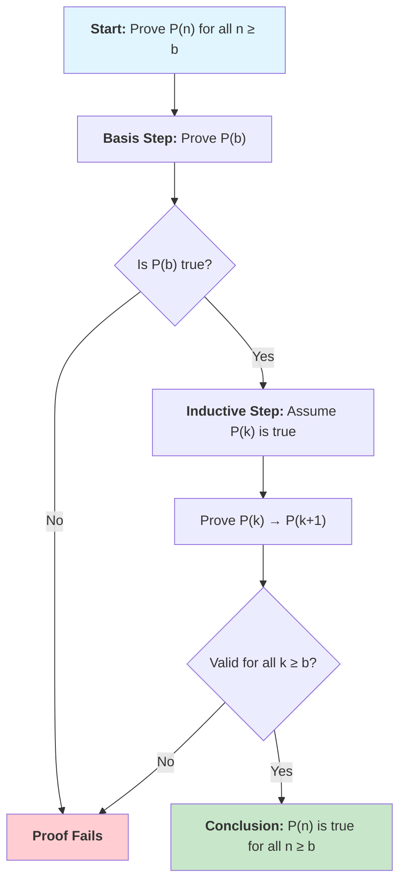
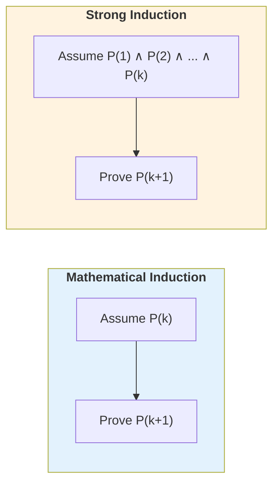

---
tags:
  - "#CCT2"
  - DS
Topic: Induction | Recursion
Semester: CCT2
Course: Diskrete strukturer
Litterature:
  - Discrete Mathematics and Its Applications - 8th Ed.
Created: 22-02-2026
---
# Induction and Recursion

## Quick Reference

| Symbol / Term | Name | Description |
|---|---|---|
| $P(n)$ | Propositional Function | A statement whose truth depends on the integer $n$. |
| $P(1)$ or $P(b)$ | Basis Step | The verification that the statement holds for the starting integer. |
| $P(k) \to P(k+1)$ | Inductive Step | The proof that if the statement holds for $k$, it holds for $k+1$. |
| $P(k)$ | Inductive Hypothesis | The assumption that the statement is true for an arbitrary integer $k$. |
| $[P(1) \land \dots \land P(k)] \to P(k+1)$ | Strong Inductive Step | Assumes truth for all integers from the base up to $k$ to prove $P(k+1)$. |
| $\overset{\text{IH}}{=}$ | IH Notation | Indicates the step where the inductive hypothesis is applied. |
| $\forall k(P(k) \to P(k+1))$ | Universal Implication | States the inductive step holds for all $k$ in the domain. |
| Well-Ordering Property | Axiom | Every nonempty set of nonnegative integers has a least element. |
| $n!$ | Factorial | The product $n \cdot (n-1) \cdot \dots \cdot 1$. |
| $\sum$ | Summation (Sigma) | Operator directing addition of a sequence of terms. |
| $\prod$ | Product (Pi) | Operator directing multiplication of a sequence of terms. |
| $\alpha = \frac{1+\sqrt{5}}{2}$ | Golden Ratio | $\approx 1.618$; satisfies $\alpha^2 = \alpha + 1$. Used in Fibonacci analysis. |
| $f_n$ | Fibonacci Number | Defined by $f_0=0$, $f_1=1$, $f_n = f_{n-1}+f_{n-2}$. |
| $\gcd(a,b)$ | Greatest Common Divisor | The largest integer dividing both $a$ and $b$. |
| $n - 2$ triangles | Triangulation Formula | A simple polygon with $n$ sides can be divided into $n-2$ triangles. |

_Table 1.1: Quick reference of key symbols, terms, and notation used throughout this note._

---

## Overview

Many mathematical statements assert that a property is true for all positive integers. Examples include:

- $n! \le n^n$
- $n^3 - n$ is divisible by $3$
- A set with $n$ elements has $2^n$ subsets
- The sum of the first $n$ positive integers is $\frac{n(n+1)}{2}$

**Mathematical induction** is the primary proof technique used to prove results of this kind. Proofs using mathematical induction consist of two essential parts:

1. Show that the statement holds for the positive integer $1$.
2. Show that if the statement holds for a positive integer, it must also hold for the next larger integer.

>[!summary] Rule of Inference — Mathematical Induction
> Mathematical induction is based on the rule of inference that states: if $P(1)$ and $\forall k(P(k) \rightarrow P(k + 1))$ are true for the domain of positive integers, then $\forall nP(n)$ is true.

Understanding how to read and construct proofs by mathematical induction is a key goal of discrete mathematics.

### Recursive Definitions

To define functions, specific initial terms are stated, and a rule is provided for finding subsequent values from values already known. Similarly, sets can be defined by listing initial elements and giving rules for constructing elements from those already known to be in the set.

>[!info] Recursive Definition
> Such definitions, called **recursive definitions**, are used throughout discrete mathematics and computer science to define:
> - **Functions:** By specifying initial terms and rules for subsequent values.
> - **Sets:** By listing elements and giving construction rules.

Once a set has been defined recursively, a proof method called **structural induction** can be used to prove results about this set.

### Program Verification

Specifying a procedure for solving a problem requires a guarantee that the procedure always solves the problem correctly. Testing a procedure with a set of input values is insufficient to prove it always works correctly. The correctness of a procedure can be guaranteed only by proving that it always yields the correct result.

>[!note] Program Verification
> This is a formal technique used to verify that procedures are correct. It serves as the basis for attempts to prove in a mechanical fashion that programs are correct.

---

## Mathematical Induction

### The Ladder Analogy

Suppose we have an infinite ladder and want to know whether we can reach every step. We know two things:

1. We can reach the first rung of the ladder.
2. If we can reach a particular rung, then we can reach the next rung.

![[Pasted image 20260222133554.png]]
_Figure 2.1: An infinite ladder illustrating the concept of mathematical induction. Reaching the first rung and knowing each rung leads to the next guarantees reaching every rung._

Can we conclude that we can reach every rung? By the first point, we can reach the first rung. By the second point, because we can reach the first rung, we can reach the second. Applying this logic again, we can reach the third rung. Continuing this process, after $100$ uses of the second point, we know we can reach the $101$st rung. The answer is yes — this is verified using **mathematical induction**.

>[!info] Mathematical Induction
> Mathematical induction is an extremely important proof technique used to prove assertions about a large variety of discrete objects. It is used extensively to prove results regarding:
> - The complexity of algorithms
> - The correctness of certain types of computer programs
> - Theorems about graphs and trees
> - A wide range of identities and inequalities

>[!warning] Limitation of Mathematical Induction
> Mathematical induction can be used only to **prove results obtained in some other way**. It is not a tool for discovering formulae or theorems.

---

### The Principle of Mathematical Induction

Mathematical induction is used to prove statements asserting that $P(n)$ is true for all positive integers $n$, where $P(n)$ is a propositional function. A proof by mathematical induction consists of two distinct parts: a *basis step* and an *inductive step*.

>[!summary] Principle of Mathematical Induction
> To prove that $P(n)$ is true for all positive integers $n$, where $P(n)$ is a propositional function, complete two steps:
> - **BASIS STEP:** Verify that $P(1)$ is true.
> - **INDUCTIVE STEP:** Show that the conditional statement $P(k) \to P(k + 1)$ is true for all positive integers $k$.

To complete the inductive step, we assume that $P(k)$ is true for an arbitrary positive integer $k$ and show that, under this assumption, $P(k + 1)$ must also be true.

>[!info] The Inductive Hypothesis
> The assumption that $P(k)$ is true for the arbitrary integer $k$ is called the **inductive hypothesis**.

Once both steps are complete, we have shown that $P(n)$ is true for all positive integers $n$ (i.e., $\forall n P(n)$ is true). Expressed as a rule of inference for the domain of positive integers:

$$
(P(1) \land \forall k (P(k) \to P(k + 1))) \to \forall n P(n)
$$

>[!example] Breakdown of the Rule of Inference
> - **Equation:** $(P(1) \land \forall k (P(k) \to P(k + 1))) \to \forall n P(n)$
> - **Breakdown:**
>     - **$P(1)$**: The basis step — truth of the statement at the starting integer $1$.
>     - **$\land$**: Logical AND — both conditions must hold simultaneously.
>     - **$\forall k (P(k) \to P(k+1))$**: The inductive step — for every integer $k$ in the domain, truth at $k$ implies truth at $k+1$.
>     - **$\to$**: Logical implication — if both premises on the left hold, the conclusion on the right follows.
>     - **$\forall n P(n)$**: The conclusion — the statement $P(n)$ is true for all positive integers $n$.

The following diagram illustrates the structure of a proof by mathematical induction:

_Figure 2.2: Flowchart illustrating the structure of a proof by mathematical induction, showing the basis step, inductive step, and conclusion._

#### The Process of Proof

1. **Basis Step:** Show $P(1)$ is true by replacing $n$ with $1$ in the statement.
2. **Inductive Step:** Show that $P(k + 1)$ cannot be false when $P(k)$ is true. This is accomplished by assuming $P(k)$ is true and using that hypothesis to demonstrate $P(k + 1)$ is true.

>[!info] Avoiding Circular Reasoning
> In a proof by mathematical induction, it is **not** assumed that $P(k)$ is true for *all* positive integers. It is only shown that *if* it is assumed $P(k)$ is true, then $P(k + 1)$ is also true. Thus, mathematical induction is not a case of begging the question or circular reasoning.

#### Why It Works

After completing the basis and inductive steps:

- We know $P(1)$ is true (from the basis step).
- We conclude $P(2)$ is true because $P(1)$ is true and the inductive step proves $P(1) \to P(2)$.
- We conclude $P(3)$ is true because $P(2)$ is true and the inductive step proves $P(2) \to P(3)$.

Continuing this chain of implications allows us to show that $P(n)$ is true for any particular positive integer $n$.

#### Ways to Remember How Mathematical Induction Works

**The Ladder:**
- **Statement (1):** We can reach the first rung (Basis Step).
- **Statement (2):** If we can reach a particular rung, we can reach the next rung (Inductive Step).
- **Conclusion:** We can reach every rung.

**The Dominoes:**
An infinite row of dominoes is labeled $1, 2, 3, \dots, n, \dots$. Let $P(n)$ be the proposition that domino $n$ is knocked over.

![[Pasted image 20260222133615.png]]
_Figure 2.3: If the first domino falls ($P(1)$) and each domino knocks over the next ($P(k) \to P(k+1)$), then all dominoes will fall._

- If the first domino is knocked over ($P(1)$ is true).
- And if, whenever the $k$-th domino is knocked over, it knocks over the $(k+1)$-st domino ($P(k) \to P(k + 1)$ is true).
- Then all dominoes are knocked over.

---

### Why Mathematical Induction is Valid

The validity of mathematical induction stems from the **well-ordering property**, which serves as an axiom for the set of positive integers.

>[!info] The Well-Ordering Property
> Every nonempty subset of the set of positive integers has a least element.

**Proof of Validity:**
Suppose we know that $P(1)$ is true and that the proposition $P(k) \to P(k + 1)$ is true for all positive integers $k$. To show that $P(n)$ must be true for all positive integers $n$, we use **proof by contradiction**.

1. **Assumption:** Assume there is at least one positive integer $n$ for which $P(n)$ is false.
2. **Define Set $S$:** Let $S$ be the set of positive integers $n$ for which $P(n)$ is false. By the assumption, $S$ is nonempty.
3. **Apply Well-Ordering:** Since $S$ is nonempty, by the well-ordering property, $S$ has a least element, denoted by $m$.
4. **Analyze $m$:**
    - We know that $m \neq 1$ because $P(1)$ is true.
    - Since $m$ is positive and greater than $1$, the value $m - 1$ is a positive integer.
    - Because $m - 1$ is less than $m$, it is not in $S$. Therefore, $P(m - 1)$ must be true.
5. **Derive Contradiction:**
    - We know the conditional statement $P(m - 1) \to P(m)$ is true (from the premise).
    - Since $P(m - 1)$ is true, it must be the case that $P(m)$ is true.
    - This contradicts the choice of $m$ as an element of $S$ (where $P(m)$ is false).

Since the assumption leads to a contradiction, $P(n)$ must be true for every positive integer $n$.

>[!note] Axioms and Equivalence
> In this text, the well-ordering property is taken as an axiom, and mathematical induction is proven valid based on it. However, the relationship could be reversed:
> - The principle of mathematical induction could be taken as the axiom.
> - The well-ordering property could then be proven as a consequence.
>
> Therefore, the well-ordering property for positive integers and the principle of mathematical induction are **equivalent**.

---

### Choosing the Correct Basis Step

Mathematical induction is not restricted to proving theorems solely for all positive integers ($n \ge 1$). It can also be used to prove that $P(n)$ is true for $n = b, b+1, b+2, \dots$, where $b$ is an integer other than $1$.

>[!summary] Generalized Principle of Induction
> To prove that $P(n)$ is true for integers $n = b, b+1, b+2, \dots$:
> - **Basis Step:** Show that $P(b)$ is true.
> - **Inductive Step:** Show that $P(k) \to P(k+1)$ is true for all integers $k \ge b$.

The starting integer $b$ can be negative, zero, or positive.

>[!abstract] Modified Domino Analogy
> Imagine an infinite row of dominoes.
> 1. **Basis Step:** Knock down the $b$-th domino.
> 2. **Inductive Step:** As each domino falls, it knocks down the next one.
>
> Result: All dominoes from the $b$-th position onward will fall.

---

### Guidelines for Proofs by Mathematical Induction

>[!abstract] Template for Proofs by Mathematical Induction
> 1. **Express the Statement:** Formulate the statement to be proved as "for all $n \ge b$, $P(n)$" for a fixed integer $b$.
> 2. **Basis Step:** Write out "Basis Step." Show that $P(b)$ is true, ensuring the correct value of $b$ is used.
> 3. **Inductive Step:** Write out "Inductive Step." State the inductive hypothesis clearly: "Assume that $P(k)$ is true for an arbitrary fixed integer $k \ge b$."
> 4. **State the Goal:** Write out what $P(k + 1)$ says, which is what needs to be proved under the assumption of the inductive hypothesis.
> 5. **Prove the Goal:** Prove the statement $P(k + 1)$ making use of the assumption $P(k)$. *This is generally the most difficult part.*
> 6. **Conclude the Step:** Clearly identify the end of the inductive step: "This completes the inductive step."
> 7. **Final Conclusion:** State: "By mathematical induction, $P(n)$ is true for all integers $n$ with $n \ge b$."

### The Good and the Bad of Mathematical Induction

The primary advantage of this method is its ability to **prove** a conjecture once it has been formulated, assuming the conjecture is true. However, a significant limitation is that it cannot be used to **find** or discover new theorems.

Proofs by mathematical induction are sometimes viewed as unsatisfying because they often fail to provide insight into *why* a theorem is true. While many theorems can be proved using induction, alternative methods are often preferred because they tend to offer a deeper understanding of the underlying truths of the theorem.

---

### Common Mistakes in Induction Proofs

>[!warning] Common Mistakes to Avoid
> 1. **Skipping the basis step:** Always verify $P(b)$ explicitly. Without it, the entire proof is invalid.
> 2. **Wrong starting point:** Ensure the base case $b$ is correct for the claim. For example, $2^n < n!$ requires $b = 4$, not $b = 1$.
> 3. **Circular reasoning:** The inductive hypothesis assumes $P(k)$ is true — you cannot assume $P(k+1)$ while trying to prove it.
> 4. **Invalid for small $k$:** Verify the inductive step logic works for the smallest value $k = b$. Some "proofs" fail because the inductive step only works for $k \ge b + 1$.
> 5. **Not using the hypothesis:** The inductive step must actually *use* the assumption that $P(k)$ is true. If your proof of $P(k+1)$ doesn't reference $P(k)$, you're likely not doing induction correctly (or the problem doesn't require induction).
> 6. **Confusing strong and standard induction:** In standard induction, you can only assume $P(k)$. In strong induction, you can assume $P(j)$ for all $j \le k$.

---

### Examples of Proofs by Mathematical Induction

Many theorems assert that a propositional function $P(n)$ is true for all positive integers $n$. Mathematical induction serves as the primary technique to prove theorems of this specific form. In logical terms, induction proves statements of the form $\forall n P(n)$, where the domain is the set of positive integers.

Mathematical assertions often include an implicit universal quantifier. For instance, the statement "if $n$ is a positive integer, then $n^3 - n$ is divisible by $3$" implicitly means "for every positive integer $n$, $n^3 - n$ is divisible by $3$."

>[!warning] Potential for Errors
> There are many opportunities for errors in induction proofs. To avoid mistakes, it is essential to follow the established guidelines for constructing such proofs.

#### Seeing Where the Inductive Hypothesis is Used

>[!tip] Identifying the Inductive Hypothesis
> The use of the inductive hypothesis is typically indicated in three ways:
> 1. **Explicit Mention:** The text directly states that the hypothesis is being used.
> 2. **Acronym Notation:** The acronym **IH** is placed over an equals sign or inequality sign (e.g., $\overset{\text{IH}}{=}$).
> 3. **Reason Specification:** In a multi-line display, the inductive hypothesis is listed as the reason for a specific step.

---

#### Proving Summation Formulae

Mathematical induction is particularly well-suited for proving the validity of summation formulae. However, there is a distinct trade-off:
- **Advantage:** It can rigorously prove the validity of a formula.
- **Disadvantage:** It cannot be used to *derive* or find the formula. The formula must already be known or conjectured.

>[!example] Proving the Sum of the First $n$ Positive Integers
> **Show that if $n$ is a positive integer, then:**
> $$1 + 2 + \dots + n = \frac{n(n + 1)}{2}$$
>
> **Breakdown:**
> - **$n$**: A positive integer representing the number of terms in the summation.
> - **LHS ($1 + 2 + \dots + n$)**: The sum of the sequence of integers from $1$ to $n$.
> - **RHS ($\frac{n(n+1)}{2}$)**: A closed-form formula calculating the sum directly using $n$.
>
> **Solution:**
> Let $P(n)$ be the proposition that the sum of the first $n$ positive integers equals $\frac{n(n + 1)}{2}$.
>
> **Basis Step:**
> $P(1)$ is true because:
> $$1 = \frac{1(1 + 1)}{2} = \frac{2}{2} = 1$$
>
> **Inductive Step:**
> Assume that $P(k)$ holds for an arbitrary positive integer $k$:
> $$1 + 2 + \dots + k = \frac{k(k + 1)}{2}$$
>
> We must show that $P(k + 1)$ is true:
> $$1 + 2 + \dots + k + (k + 1) = \frac{(k + 1)(k + 2)}{2}$$
>
> Add $(k + 1)$ to both sides of the equation in $P(k)$:
> $$1 + 2 + \dots + k + (k + 1) \overset{\text{IH}}{=} \frac{k(k + 1)}{2} + (k + 1)$$
> $$= \frac{k(k + 1) + 2(k + 1)}{2} = \frac{(k + 1)(k + 2)}{2}$$
>
> This confirms $P(k + 1)$ is true. This completes the inductive step.
>
> **Conclusion:** By mathematical induction, $P(n)$ is true for all positive integers $n$.

>[!example]- Conjecture and Proof: Sum of First $n$ Odd Integers
> **Problem:** Conjecture a formula for the sum of the first $n$ positive odd integers, then prove the conjecture using mathematical induction.
>
> **Conjecturing the Formula:**
> By examining the sums for small values of $n$:
>
> | $n$ | Sum | Result |
> |---|---|---|
> | $1$ | $1$ | $1 = 1^2$ |
> | $2$ | $1 + 3$ | $4 = 2^2$ |
> | $3$ | $1 + 3 + 5$ | $9 = 3^2$ |
> | $4$ | $1 + 3 + 5 + 7$ | $16 = 4^2$ |
> | $5$ | $1 + 3 + 5 + 7 + 9$ | $25 = 5^2$ |
>
> _Table 2.1: Sums of the first $n$ odd positive integers, revealing the pattern $n^2$._
>
> **Conjectured Equation:**
> $$1 + 3 + 5 + \dots + (2n - 1) = n^2$$
>
> **Breakdown:**
> - **$n$**: A positive integer representing the number of odd integers being summed.
> - **$2n - 1$**: The formula for the $n$-th positive odd integer. Derived by observing that odd integers form the sequence $1, 3, 5, \dots$ with common difference $2$.
> - **$n^2$**: The square of the count $n$, which is the conjectured total sum.
>
> **Basis Step:**
> $P(1)$: $1 = 1^2 = 1$. True.
>
> **Inductive Step:**
> Assume $P(k)$ is true:
> $$1 + 3 + 5 + \dots + (2k - 1) = k^2$$
>
> **Goal:** Show $P(k + 1)$:
> $$1 + 3 + 5 + \dots + (2k - 1) + (2(k+1) - 1) = (k + 1)^2$$
>
> **Proof:**
> $$1 + 3 + \dots + (2k - 1) + (2k + 1) \overset{\text{IH}}{=} k^2 + (2k + 1) = (k + 1)^2$$
>
> **Conclusion:** By mathematical induction, $1 + 3 + 5 + \dots + (2n - 1) = n^2$ for all positive integers $n$.

>[!example]- Sum of a Finite Geometric Progression
> **Prove the formula for the sum of a finite geometric progression:**
> $$ \sum_{j=0}^{n} ar^j = \frac{ar^{n+1} - a}{r - 1} $$
> where $r \neq 1$.
>
> **Breakdown:**
> - **$a$**: The initial term of the geometric progression (a nonzero real number).
> - **$r$**: The common ratio between consecutive terms (a real number, $r \neq 1$).
> - **$n$**: A nonnegative integer representing the upper limit of the summation.
> - **$\sum_{j=0}^{n} ar^j$**: The sum of the geometric progression containing $n+1$ terms (from $j = 0$ to $j = n$).
> - **$\frac{ar^{n+1} - a}{r - 1}$**: The closed-form expression for the sum.
>
> **Basis Step:**
> $P(0)$: LHS $= ar^0 = a$. RHS $= \frac{ar^1 - a}{r - 1} = \frac{a(r - 1)}{r - 1} = a$. True.
>
> **Inductive Step:**
> Assume $P(k)$ is true:
> $$ a + ar + \dots + ar^k = \frac{ar^{k+1} - a}{r - 1} $$
>
> **Goal:** Show $P(k + 1)$:
> $$ a + ar + \dots + ar^k + ar^{k+1} = \frac{ar^{k+2} - a}{r - 1} $$
>
> **Proof:**
> $$ a + ar + \dots + ar^k + ar^{k+1} \overset{\text{IH}}{=} \frac{ar^{k+1} - a}{r - 1} + ar^{k+1} $$
> $$ = \frac{ar^{k+1} - a}{r - 1} + \frac{ar^{k+2} - ar^{k+1}}{r - 1} = \frac{ar^{k+2} - a}{r - 1} $$
>
> **Conclusion:** By mathematical induction, the formula is true for all nonnegative integers $n$.

---

#### Proving Inequalities

>[!example]- Proving $n < 2^n$
> **Show that $n < 2^n$ for all positive integers $n$.**
>
> **Breakdown:**
> - **$n$**: An arbitrary positive integer.
> - **$2^n$**: The value $2$ raised to the power of $n$, representing exponential growth.
> - **Inequality**: The statement asserts that linear growth ($n$) is always strictly less than exponential growth ($2^n$).
>
> **Basis Step:**
> $P(1)$: $1 < 2^1 = 2$. True.
>
> **Inductive Step:**
> Assume $P(k)$: $k < 2^k$.
>
> **Goal:** Show $k + 1 < 2^{k+1}$.
>
> **Proof:**
> $$k + 1 \overset{\text{IH}}{<} 2^k + 1 \le 2^k + 2^k = 2 \cdot 2^k = 2^{k+1}$$
>
> The key step uses the fact that $1 \le 2^k$ for any positive integer $k$.
>
> **Conclusion:** By mathematical induction, $n < 2^n$ for all positive integers $n$.

>[!example]- Proving $2^n < n!$ for $n \ge 4$
> **Show that $2^n < n!$ for every integer $n$ with $n \ge 4$.**
>
> **Breakdown:**
> - **$2^n$**: Exponential growth with base $2$.
> - **$n!$**: Factorial growth, defined as $n \cdot (n-1) \cdot \dots \cdot 1$.
> - **Inequality**: The statement asserts that factorial growth eventually overtakes and exceeds exponential growth, starting at $n = 4$.
>
> **Checking validity for small integers:**
>
> | $n$ | $2^n$ | $n!$ | $2^n < n!$? |
> |---|---|---|---|
> | $1$ | $2$ | $1$ | No |
> | $2$ | $4$ | $2$ | No |
> | $3$ | $8$ | $6$ | No |
> | $4$ | $16$ | $24$ | **Yes** |
>
> _Table 2.2: Verification that the inequality $2^n < n!$ holds only for $n \ge 4$._
>
> **Basis Step:**
> $P(4)$: $2^4 = 16 < 24 = 4!$. True.
>
> **Inductive Step:**
> Assume $P(k)$: $2^k < k!$ for $k \ge 4$.
>
> **Goal:** Show $2^{k+1} < (k + 1)!$.
>
> **Proof:**
> $$2^{k+1} = 2 \cdot 2^k \overset{\text{IH}}{<} 2 \cdot k! < (k + 1) \cdot k! = (k + 1)!$$
>
> The final inequality uses the fact that $2 < k + 1$ for $k \ge 4$.
>
> **Conclusion:** By mathematical induction, $2^n < n!$ for all integers $n \ge 4$.

#### Harmonic Numbers

The **harmonic numbers** $H_j$, where $j = 1, 2, 3, \dots$, are defined by the sum of the reciprocals of the first $j$ positive integers.

>[!info] Definition of Harmonic Numbers
> $$H_j = 1 + \frac{1}{2} + \frac{1}{3} + \dots + \frac{1}{j}$$
>
> **Breakdown:**
> - **$H_j$**: The notation for the $j$-th harmonic number.
> - **$j$**: A positive integer indicating the number of terms in the sum.
> - **Terms**: Each term takes the form $\frac{1}{i}$ where $i$ ranges from $1$ to $j$.

For instance: $H_4 = 1 + \frac{1}{2} + \frac{1}{3} + \frac{1}{4} = \frac{25}{12}$.

>[!example]- Proving the Harmonic Number Inequality
> **Show that $H_{2^n} \ge 1 + \frac{n}{2}$ whenever $n$ is a nonnegative integer.**
>
> **Breakdown:**
> - **$H_{2^n}$**: The harmonic number indexed by $2^n$, representing the sum of reciprocals from $1$ to $\frac{1}{2^n}$.
> - **$n$**: A nonnegative integer acting as the exponent for the index of the harmonic number.
> - **$1 + \frac{n}{2}$**: A linear lower bound for the harmonic number $H_{2^n}$.
>
> **Basis Step:**
> $P(0)$: $H_{2^0} = H_1 = 1 \ge 1 + \frac{0}{2} = 1$. True.
>
> **Inductive Step:**
> Assume $P(k)$: $H_{2^k} \ge 1 + \frac{k}{2}$.
>
> **Goal:** Show $H_{2^{k+1}} \ge 1 + \frac{k + 1}{2}$.
>
> **Proof:**
> We expand $H_{2^{k+1}}$ by grouping the first $2^k$ terms and the remaining terms:
> $$H_{2^{k+1}} = H_{2^k} + \frac{1}{2^k + 1} + \dots + \frac{1}{2^{k+1}}$$
>
> Applying the inductive hypothesis to the first term:
> $$\overset{\text{IH}}{\ge} \left(1 + \frac{k}{2}\right) + \frac{1}{2^k + 1} + \dots + \frac{1}{2^{k+1}}$$
>
> There are $2^{k+1} - 2^k = 2^k$ terms in the remaining sum. Each term $\ge \frac{1}{2^{k+1}}$, so their sum is at least $2^k \cdot \frac{1}{2^{k+1}} = \frac{1}{2}$:
>
> $$\ge \left(1 + \frac{k}{2}\right) + \frac{1}{2} = 1 + \frac{k + 1}{2}$$
>
> **Conclusion:** By mathematical induction, $H_{2^n} \ge 1 + \frac{n}{2}$ for all nonnegative integers $n$.

>[!note] The Harmonic Series Divergence
> The inequality $H_{2^n} \ge 1 + \frac{n}{2}$ proves that the **harmonic series** $1 + \frac{1}{2} + \frac{1}{3} + \dots$ is a **divergent infinite series**. As $n$ grows, the sum grows without bound.

---

#### Proving Divisibility Results

>[!example]- Proving $n^3 - n$ is Divisible by $3$
> **Show that $n^3 - n$ is divisible by $3$ whenever $n$ is a positive integer.**
>
> **Breakdown:**
> - **$n^3 - n$**: The expression being tested. It can be factored as $n(n-1)(n+1)$, the product of three consecutive integers.
> - **Divisibility by $3$**: An integer $m$ is divisible by $3$ if $m = 3k$ for some integer $k$.
>
> **Basis Step:**
> $P(1)$: $1^3 - 1 = 0 = 3 \cdot 0$. Divisible by $3$. True.
>
> **Inductive Step:**
> Assume $P(k)$: $k^3 - k$ is divisible by $3$.
>
> **Goal:** Show $(k + 1)^3 - (k + 1)$ is divisible by $3$.
>
> **Proof:**
> $$(k + 1)^3 - (k + 1) = (k^3 + 3k^2 + 3k + 1) - (k + 1) = (k^3 - k) + (3k^2 + 3k)$$
>
> 1. **$(k^3 - k)$**: Divisible by $3$ by the inductive hypothesis.
> 2. **$3(k^2 + k)$**: Divisible by $3$ because it has $3$ as an explicit factor.
>
> The sum of two integers divisible by $3$ is divisible by $3$.
>
> **Conclusion:** By mathematical induction, $n^3 - n$ is divisible by $3$ for all positive integers $n$.

>[!example]- Proving Divisibility by $57$
> **Show that $7^{n+2} + 8^{2n+1}$ is divisible by $57$ for every nonnegative integer $n$.**
>
> **Breakdown:**
> - **$7^{n+2}$**: An exponential term with base $7$.
> - **$8^{2n+1}$**: An exponential term with base $8$; the exponent $2n+1$ is linear in $n$.
> - **Divisibility by $57$**: The sum must be expressible as $57m$ for some integer $m$.
>
> **Basis Step:**
> $P(0)$: $7^{0+2} + 8^{2(0)+1} = 7^2 + 8^1 = 49 + 8 = 57$. Divisible by $57$. True.
>
> **Inductive Step:**
> Assume $P(k)$: $7^{k+2} + 8^{2k+1}$ is divisible by $57$.
>
> **Goal:** Show $7^{k+3} + 8^{2k+3}$ is divisible by $57$.
>
> **Proof:**
> $$7^{k+3} + 8^{2k+3} = 7 \cdot 7^{k+2} + 64 \cdot 8^{2k+1}$$
>
> Rewrite $64$ as $7 + 57$:
> $$= 7 \cdot 7^{k+2} + (7 + 57) \cdot 8^{2k+1}$$
> $$= 7 \cdot 7^{k+2} + 7 \cdot 8^{2k+1} + 57 \cdot 8^{2k+1}$$
> $$= 7(7^{k+2} + 8^{2k+1}) + 57 \cdot 8^{2k+1}$$
>
> 1. **$7(7^{k+2} + 8^{2k+1})$**: Divisible by $57$ by the inductive hypothesis (since the term in parentheses is divisible by $57$).
> 2. **$57 \cdot 8^{2k+1}$**: Divisible by $57$ as $57$ is an explicit factor.
>
> **Conclusion:** By mathematical induction, $7^{n+2} + 8^{2n+1}$ is divisible by $57$ for all nonnegative integers $n$.

---

#### Proving Results About Sets

>[!example]- Proving the Count of Subsets ($2^n$)
> **Show that if $S$ is a finite set with $n$ elements, then $S$ has $2^n$ subsets.**
>
> **Breakdown:**
> - **$S$**: A finite set.
> - **$n$**: The number of elements in set $S$ (i.e., $|S| = n$).
> - **$2^n$**: The total number of distinct subsets of $S$, including the empty set and $S$ itself.
>
> **Basis Step:**
> $P(0)$: The empty set $\emptyset$ has $2^0 = 1$ subset (itself). True.
>
> **Inductive Step:**
> Assume $P(k)$: every set with $k$ elements has $2^k$ subsets.
>
> **Goal:** Every set with $k + 1$ elements has $2^{k+1}$ subsets.
>
> **Proof:**
> Let $T$ be a set with $k + 1$ elements. Write $T = S \cup \{a\}$ where $|S| = k$ and $a \notin S$.
>
> Every subset of $T$ either:
> 1. **Does not contain $a$:** It is a subset of $S$. There are $2^k$ such subsets.
> 2. **Contains $a$:** It is formed by adding $a$ to a subset of $S$. There are $2^k$ such subsets.
>
> Total subsets: $2^k + 2^k = 2 \cdot 2^k = 2^{k+1}$.
>
> **Conclusion:** By mathematical induction, a set with $n$ elements has $2^n$ subsets.

>[!example]- Proving Generalized De Morgan's Law
> **Prove:** $\overline{\bigcap_{j=1}^{n} A_j} = \bigcup_{j=1}^{n} \overline{A_j}$ for $n \ge 2$.
>
> **Breakdown:**
> - **$\overline{A}$**: The complement of set $A$ (elements in the universal set $U$ that are not in $A$).
> - **$\bigcap_{j=1}^{n} A_j$**: The intersection of $n$ sets (elements common to all sets $A_1, A_2, \dots, A_n$).
> - **$\bigcup_{j=1}^{n} \overline{A_j}$**: The union of the complements of $n$ sets.
> - **The Law**: The complement of an intersection equals the union of the complements.
>
> ![[Pasted image 20260222145253.png]]
> _Figure 2.4: Venn diagram illustrating De Morgan's Law for two sets._
>
> **Basis Step:**
> $P(2)$: $\overline{A_1 \cap A_2} = \overline{A_1} \cup \overline{A_2}$. This is the standard De Morgan's law. True.
>
> **Inductive Step:**
> Assume $P(k)$: $\overline{\bigcap_{j=1}^{k} A_j} = \bigcup_{j=1}^{k} \overline{A_j}$.
>
> **Proof:**
> $$\overline{\bigcap_{j=1}^{k+1} A_j} = \overline{\left( \bigcap_{j=1}^{k} A_j \right) \cap A_{k+1}}$$
>
> Apply De Morgan's law for two sets:
> $$= \overline{\bigcap_{j=1}^{k} A_j} \cup \overline{A_{k+1}}$$
>
> Apply inductive hypothesis:
> $$\overset{\text{IH}}{=} \left( \bigcup_{j=1}^{k} \overline{A_j} \right) \cup \overline{A_{k+1}} = \bigcup_{j=1}^{k+1} \overline{A_j}$$
>
> **Conclusion:** By mathematical induction, the generalized De Morgan's law holds for all $n \ge 2$.

---

#### Proving Results About Algorithms

>[!example]- Proving the Optimality of the Greedy Algorithm for Scheduling
> **Prove that the greedy algorithm for scheduling talks always produces an optimal schedule.**
>
> **The Greedy Algorithm:**
> 1. Sort talks in order of nondecreasing ending time.
> 2. Select the talk with the earliest ending time.
> 3. Iteratively select the next talk that begins no sooner than when the last scheduled talk ended.
>
> Let $P(n)$ be: *If the greedy algorithm schedules $n$ talks, then it is not possible to schedule more than $n$ talks.*
>
> **Basis Step:**
> $P(1)$: The algorithm schedules $t_1$ (with earliest end time $e_1$). Since no other talk starts at or after $e_1$, all other talks conflict at time $e_1$, meaning at most $1$ talk can be scheduled. True.
>
> **Inductive Step:**
> Assume $P(k)$: whenever the algorithm selects $k$ talks, it is impossible to schedule more.
>
> **Goal:** If the algorithm selects $k + 1$ talks, it is impossible to schedule more than $k + 1$.
>
> **Proof:**
> 4. **Including $t_1$:** Any optimal schedule can include $t_1$. If an optimal schedule starts with $t_i$ ($i > 1$), since $e_1 \le e_i$, replacing $t_i$ with $t_1$ preserves validity.
> 5. **Reducing the problem:** After scheduling $t_1$, the algorithm schedules $k$ additional talks from those starting after $e_1$.
> 6. **Applying the hypothesis:** By $P(k)$, the algorithm optimally schedules this reduced problem.
> 7. **Conclusion:** $1 + k = k + 1$ talks is optimal.
>
> **Conclusion:** By mathematical induction, the greedy algorithm is optimal.

---

#### Creative Uses of Mathematical Induction

>[!example]- Proving the Existence of a Pie-Throwing Survivor
> An odd number of people stand in a yard at mutually distinct distances. Each person simultaneously throws a pie at their nearest neighbor. We prove there is always at least one survivor.
>
> Let $P(n)$ be: there is a survivor whenever $2n + 1$ people participate.
>
> **Basis Step:**
> $P(1)$: With $3$ people, the closest pair $A$ and $B$ throw at each other. $C$ throws at one of them. $C$ is never hit. True.
>
> **Inductive Step:**
> Assume $P(k)$: there is a survivor with $2k + 1$ people.
>
> **Goal:** Show there is a survivor with $2k + 3$ people.
>
> **Proof:** Let $A$ and $B$ be the closest pair. They throw at each other.
>
> **Case (i): Someone else throws at $A$ or $B$.**
> At least $3$ pies target the pair $\{A, B\}$. The remaining $2k + 1$ people can be targeted by at most $(2k + 3) - 3 = 2k$ pies. Since $2k < 2k + 1$, at least one of them survives.
>
> **Case (ii): No one else throws at $A$ or $B$.**
> The remaining $2k + 1$ people form an independent pie fight. By the inductive hypothesis, at least one survivor $S$ exists. Since $A$ and $B$ only target each other, $S$ is also safe in the full group.
>
> **Conclusion:** By mathematical induction, an odd number of people always produces at least one survivor.

>[!example]- Proving Checkerboard Tiling with Right Triominoes
> **Show that every $2^n \times 2^n$ checkerboard with one square removed can be tiled using right triominoes (L-shaped pieces of three squares).**
>
> Let $P(n)$ be the proposition for all positive integers $n$.
>
> **Basis Step:**
> $P(1)$: A $2^1 \times 2^1 = 2 \times 2$ board has $4$ squares. If one square is removed, the remaining shape consists of exactly $3$ squares — the shape of one right triomino. True.
>
> ![[Pasted image 20260222153000.png]]
> _Figure 2.5: The basis case — a $2 \times 2$ board with one square removed is tiled by a single right triomino._
>
> **Inductive Step:**
> Assume $P(k)$: any $2^k \times 2^k$ board with one square removed can be tiled.
>
> **Goal:** Any $2^{k+1} \times 2^{k+1}$ board with one square removed can be tiled.
>
> **Proof:**
> 1. **Divide:** Split the board into four $2^k \times 2^k$ quadrants.
> 2. **Identify:** The removed square lies in exactly one quadrant. By $P(k)$, this quadrant can be tiled.
> 3. **Handle remaining quadrants:** Remove one corner square from each of the other three quadrants (at the center of the full board). Each is now a $2^k \times 2^k$ board with one missing square — tileable by $P(k)$.
> 4. **Central gap:** The three removed center squares form an L-shape, covered by one right triomino.
>
> ![[Pasted image 20260222153016.png]]
> _Figure 2.6: The inductive step — dividing a $2^{k+1} \times 2^{k+1}$ board into four quadrants, placing one triomino at the center to reduce each quadrant to the $P(k)$ case._
>
> **Conclusion:** By mathematical induction, $P(n)$ is true for all positive integers $n$.

---

### Mistaken Proofs by Mathematical Induction

Both the **basis step** and the **inductive step** must be correctly completed. Omitting or incorrectly performing either step can lead to "proofs" of false statements.

>[!tip] Identifying Errors
> To uncover errors in proofs by mathematical induction, verify that:
> 1. The basis step is correctly established.
> 2. The inductive step is valid for **all** values of $k \ge b$, including the smallest values.

>[!example] The Consequence of Skipping Steps
> Not completing the basis step can lead to mistaken proofs of clearly ridiculous statements. A flawed inductive process might erroneously conclude that $n = n + 1$ for every positive integer $n$.

>[!question] Find the Error: "Every set of non-parallel lines meets in a common point"
> **Flawed "Proof":** Let $P(n)$ be: every set of $n$ non-parallel lines in the plane meet in a common point.
>
> **Basis Step:** $P(2)$ is true — two non-parallel lines meet in a point.
>
> **Flawed Inductive Step:** Assume $P(k)$. Given $k+1$ lines, the first $k$ meet at point $p_1$ and the last $k$ meet at point $p_2$. Since lines passing through both $p_1$ and $p_2$ must be the same line (contradicting distinctness), $p_1 = p_2$.
>
> **The Error:** The inductive step requires $k \ge 3$. When $k = 2$, we have $3$ lines. The "first $2$" meet at $p_1$ and the "last $2$" meet at $p_2$, but only *one* line is common to both groups. Therefore $p_1$ and $p_2$ need not be the same point. **The step from $P(2)$ to $P(3)$ fails**, invalidating the entire proof.

---

## Strong Induction and Well-Ordering

### Introduction

Strong induction is another form of mathematical induction, often useful when a result cannot be easily proven using the standard form.

>[!info] Comparison of Induction Methods
> **Basis Step:** Identical in both methods.
>
> **Inductive Step:**
> - **Mathematical Induction:** Shows $P(k) \to P(k + 1)$.
> - **Strong Induction:** Shows $[P(1) \land P(2) \land \dots \land P(k)] \to P(k + 1)$. The hypothesis assumes truth for *all* integers from the base up to $k$.

The following diagram illustrates the difference between the two methods:

_Figure 3.1: Comparison of the inductive hypotheses in mathematical induction versus strong induction._

>[!note] Equivalence of Principles
> Mathematical induction, strong induction, and well-ordering are all **equivalent principles**. The validity of each can be proved from the other two. Consequently, a proof using one can be rewritten using either of the others.

---

### Strong Induction

>[!summary] Strong Induction
> To prove that $P(n)$ is true for all positive integers $n$:
>
> **BASIS STEP:** Verify that $P(1)$ is true.
>
> **INDUCTIVE STEP:** Show that $[P(1) \land P(2) \land \dots \land P(k)] \rightarrow P(k + 1)$ is true for all positive integers $k$.
>
> **Breakdown:**
> - **$P(1) \land P(2) \land \dots \land P(k)$**: The strong inductive hypothesis — assumes truth for *all* integers from $1$ up to $k$.
> - **$\rightarrow$**: Logical implication.
> - **$P(k + 1)$**: The proposition to be proven for the next integer.

Because the proof can utilize all $k$ statements rather than just $P(k)$, strong induction is a more flexible proof technique.

**Equivalence to Mathematical Induction:**
- **Math Induction → Strong Induction:** If $P(k+1)$ follows from $P(k)$, it also follows from $P(1) \land \dots \land P(k)$, since the assumptions are a superset.
- **Strong Induction → Math Induction:** Much more awkward to accomplish.

>[!note] Terminology
> Strong induction is also called the **second principle of mathematical induction** or **complete induction**. When "complete induction" is used, standard mathematical induction is sometimes called **incomplete induction** — an unfortunate term, as standard induction is perfectly valid.

**Strong Induction and the Infinite Ladder:**
1. We can reach the first rung.
2. For every positive integer $k$, if we can reach all the first $k$ rungs, then we can reach the $(k + 1)$st rung.

>[!example] Why Strong Induction is Sometimes Necessary
> Suppose we can reach the first and second rungs of an infinite ladder, and we know that if we can reach a rung, we can reach two rungs higher.
>
> **Attempt with Mathematical Induction:**
> The inductive hypothesis states we can reach rung $k$. We need to show we can reach rung $k+1$. But the rule only allows reaching $k+2$ from $k$. **The proof fails.**
>
> **With Strong Induction:**
> The inductive hypothesis states we can reach each of the first $k$ rungs. For $k \ge 2$, rung $k-1$ is reachable (by hypothesis), so we can reach $(k-1) + 2 = k+1$. **The proof succeeds.**

---

### Choosing Between Standard and Strong Induction

>[!tip] Choosing the Right Method
> **Use Mathematical Induction when:**
> - It is straightforward to prove $P(k) \rightarrow P(k + 1)$.
> - The proof of $P(k+1)$ only needs the assumption of $P(k)$.
>
> **Use Strong Induction when:**
> - You cannot easily prove $P(k+1)$ from just $P(k)$.
> - You need to assume $P(j)$ for multiple values $j \le k$ to prove $P(k+1)$.

---

### Alternative Form of Strong Induction

>[!info] Alternative Form of Strong Induction
> Let $b$ be a fixed integer and $j$ a fixed positive integer. To prove $P(n)$ for all $n \ge b$:
>
> **BASIS STEP:** Verify $P(b), P(b + 1), \dots, P(b + j)$.
>
> **INDUCTIVE STEP:** Show $[P(b) \land P(b + 1) \land \dots \land P(k)] \rightarrow P(k + 1)$ for every $k \ge b + j$.
>
> **Breakdown:**
> - **$b$**: The starting integer for the proof domain.
> - **$j$**: A fixed positive integer determining how many base cases are needed to support the inductive step.
> - **$P(b), \dots, P(b+j)$**: The multiple base cases that must all be verified.

---

### Examples of Proofs Using Strong Induction

>[!example]- Proving Every Integer $> 1$ is a Product of Primes
> **Show that if $n$ is an integer greater than $1$, then $n$ can be written as the product of primes.**
>
> **Breakdown:**
> - **$n$**: An integer with $n > 1$.
> - **Product of primes**: An expression of the form $p_1 \cdot p_2 \cdot \dots \cdot p_m$ where each $p_i$ is a prime number. A single prime is considered a product of one prime.
>
> **Basis Step:**
> $P(2)$: The integer $2$ is prime, so it is a product of one prime. True.
>
> **Inductive Step:**
> Assume $P(j)$ for all integers $j$ with $2 \le j \le k$.
>
> **Goal:** Show $P(k + 1)$.
>
> **Proof:** Two cases:
> 1. **$k + 1$ is prime:** It is immediately a product of primes (itself).
> 2. **$k + 1$ is composite:** Then $k + 1 = a \cdot b$ where $2 \le a \le b < k + 1$. By the inductive hypothesis, both $a$ and $b$ can be written as products of primes. Therefore $k + 1$ is also a product of primes.
>
> **Conclusion:** By strong induction, every integer greater than $1$ can be written as a product of primes.

>[!example]- Proving the Second Player Wins a Symmetric Match Game
> **Two players take turns removing matches from one of two equal piles. The player who removes the last match wins. Show the second player can always win.**
>
> Let $P(n)$: the second player can win when each pile has $n$ matches.
>
> **Basis Step:**
> $P(1)$: First player removes $1$ match from one pile. Second player removes the last match from the other pile and wins. True.
>
> **Inductive Step:**
> Assume $P(j)$ for all integers $j$ with $1 \le j \le k$. Suppose each pile has $k + 1$ matches. First player removes $r$ matches from one pile.
>
> 1. **$r = k + 1$ (all matches):** Second player removes all from the other pile and wins.
> 2. **$1 \le r \le k$:** Second player mirrors by removing $r$ from the other pile, leaving $k + 1 - r$ in each pile. Since $1 \le k + 1 - r \le k$, the inductive hypothesis applies. Second player can win.
>
> **Conclusion:** By strong induction, $P(n)$ is true for all positive integers $n$.

>[!example]- Proving Postage Amounts with $4$-cent and $5$-cent Stamps
> **Prove that every amount of postage of $12$ cents or more can be formed using just $4$-cent and $5$-cent stamps.**
>
> **Solution 1: Using Mathematical Induction**
>
> **Basis Step:** $P(12)$: $4 + 4 + 4 = 12$ cents. True.
>
> **Inductive Step:** Assume $P(k)$ for $k \ge 12$.
> 1. **At least one $4$-cent stamp used:** Replace it with a $5$-cent stamp → $k + 1$ cents.
> 2. **Only $5$-cent stamps used:** Since $k \ge 12$, at least three $5$-cent stamps are used. Replace three $5$-cent stamps ($15$ cents) with four $4$-cent stamps ($16$ cents) → $k + 1$ cents.
>
> **Solution 2: Using Strong Induction**
>
> **Basis Step:** Verify $P(12)$ through $P(15)$:
>
> | Amount | Stamps |
> |---|---|
> | $12$ cents | Three $4$-cent stamps |
> | $13$ cents | Two $4$-cent stamps $+$ one $5$-cent stamp |
> | $14$ cents | One $4$-cent stamp $+$ two $5$-cent stamps |
> | $15$ cents | Three $5$-cent stamps |
>
> _Table 3.1: Base cases for the postage stamp problem._
>
> **Inductive Step:** Assume $P(j)$ for $12 \le j \le k$ where $k \ge 15$.
>
> Since $k - 3 \ge 12$, by the hypothesis we can form $k - 3$ cents. Adding one $4$-cent stamp gives $(k - 3) + 4 = k + 1$ cents.
>
> **Conclusion:** By induction, every amount $\ge 12$ cents can be formed.

---

### Strong Induction in Computational Geometry

Computational geometry is the branch of discrete mathematics focused on computational problems involving geometric objects, with applications in computer graphics, robotics, and scientific calculations.

#### Polygons and Terminology

>[!info] Polygon Definitions
> - **Polygon**: A closed figure of sequential line segments (**sides**).
> - **Vertex**: The endpoint where two consecutive sides meet.
> - **Simple Polygon**: No two nonconsecutive sides intersect.
> - **Convex Polygon**: Every line segment between two interior points lies entirely inside.
> - **Diagonal**: A segment connecting two nonconsecutive vertices.
> - **Interior Diagonal**: A diagonal lying entirely inside the polygon (except endpoints).

Simple polygons divide the plane into an **interior** and an **exterior** (a case of the **Jordan curve theorem**).

#### Triangulation

**Triangulation** is the process of dividing a simple polygon into triangles by adding nonintersecting diagonals.

![[Pasted image 20260222155011.png]]
_Figure 3.2: A simple polygon before triangulation._

![[Pasted image 20260222155018.png]]
_Figure 3.3: The same polygon after triangulation into non-overlapping triangles via interior diagonals._

>[!summary] Theorem: Triangulation of Simple Polygons
> A simple polygon with $n$ sides, where $n \ge 3$, can be triangulated into $n - 2$ triangles.
>
> **Breakdown:**
> - **$n$**: The number of sides of the polygon (equivalently, the number of vertices).
> - **$n - 2$**: The resulting number of triangles after triangulation.

The proof relies on strong induction and a preliminary lemma.

>[!warning] Lemma
> Every simple polygon with at least four sides has an interior diagonal.
> *Note: While this lemma appears simple, it is notoriously tricky to prove correctly.*

**Proof of Theorem (Strong Induction on $n$):**

**Basis Step:** $T(3)$: A triangle is already triangulated into $3 - 2 = 1$ triangle. True.

**Inductive Step:** Assume $T(j)$ for all integers $j$ with $3 \le j \le k$.

**Goal:** Show $T(k+1)$: every simple polygon with $k+1$ sides can be triangulated into $k - 1$ triangles.

1. **Identify an Interior Diagonal:** Since $k+1 \ge 4$, the Lemma guarantees an interior diagonal $\overline{ab}$.
2. **Split the Polygon:** The diagonal splits polygon $P$ into two smaller polygons $Q$ ($s$ sides) and $R$ ($t$ sides), where $3 \le s, t \le k$.
3. **Side Count Relationship:**

$$k + 1 = s + t - 2$$

>[!example] Breakdown of the Side Equation
> - **Equation:** $k + 1 = s + t - 2$
> - **Breakdown:**
>     - **$k + 1$**: The number of sides in the original polygon $P$.
>     - **$s$**: The number of sides in sub-polygon $Q$.
>     - **$t$**: The number of sides in sub-polygon $R$.
>     - **$-2$**: Adjustment because diagonal $\overline{ab}$ is counted as a side in both $Q$ and $R$, but was not a side of $P$.

4. **Apply Inductive Hypothesis:** $Q$ is triangulated into $s - 2$ triangles and $R$ into $t - 2$ triangles.
5. **Combine:** Total triangles $= (s - 2) + (t - 2) = s + t - 4$. Since $s + t = k + 3$: total $= (k + 3) - 4 = k - 1 = (k+1) - 2$. ✓

**Proof of Lemma (Construction of Interior Diagonal):**

1. **Identify vertex $b$:** Choose the vertex with the least $y$-coordinate (among those with smallest $x$-coordinate).
2. **Identify neighbors $a$ and $c$:** The interior angle at $b$ is less than $180°$.
3. **Examine triangle $\triangle abc$:**
    - **Case 1:** No other vertices of $P$ lie inside $\triangle abc$ → segment $\overline{ac}$ is an interior diagonal.
    - **Case 2:** Some vertices lie inside $\triangle abc$ → select vertex $p$ inside $\triangle abc$ minimizing angle $\angle abp$ → segment $\overline{bp}$ is an interior diagonal.

---

### Proofs Using the Well-Ordering Property

>[!summary] The Well-Ordering Property
> Every nonempty set of nonnegative integers has a least element.

This property can be used directly to construct proofs, particularly in number theory and combinatorics.

>[!example] Proof of the Division Algorithm
> **Claim:** For any integer $a$ and positive integer $d$, there exist unique integers $q$ and $r$ such that $a = dq + r$ with $0 \le r < d$.
>
> **Equation:** $a = dq + r$
>
> **Breakdown:**
> - **$a$**: The dividend (the integer being divided).
> - **$d$**: The divisor (a positive integer).
> - **$q$**: The quotient (an integer).
> - **$r$**: The remainder (an integer satisfying $0 \le r < d$).
>
> **Proof:**
> 1. **Define the Set:** $S = \{ a - dq \mid q \in \mathbb{Z},\; a - dq \geq 0 \}$.
> 2. **Nonempty:** Choose $q$ sufficiently negative to make $a - dq \ge 0$. So $S \neq \emptyset$.
> 3. **Apply Well-Ordering:** $S$ has a least element $r = a - dq_0$.
> 4. **Verify $r < d$:** Suppose $r \ge d$. Then $r - d = a - d(q_0 + 1) \ge 0$ is in $S$ and is smaller than $r$ — contradicting minimality.
> 5. **Conclusion:** $r < d$, and we have $a = dq_0 + r$ with $0 \le r < d$.

>[!example] Existence of a Cycle of Length Three in Round-Robin Tournaments
> **Claim:** If a round-robin tournament has a cycle of length $m$ ($m \ge 3$), then it has a cycle of length $3$.
>
> **Proof:**
> 6. Assume (for contradiction) that no cycle of length $3$ exists.
> 7. Let $S$ be the set of cycle lengths. Since a cycle of length $m$ exists, $S$ is nonempty.
> 8. By well-ordering, $S$ has a least element $k > 3$.
> 9. Consider a minimal cycle $p_1, p_2, \dots, p_k$ (where $p_1$ beats $p_2$, $p_2$ beats $p_3$, etc.).
> 10. Examine the match between $p_1$ and $p_3$:
>     - **$p_3$ beats $p_1$:** Then $p_1, p_2, p_3$ is a cycle of length $3$ — contradiction.
>     - **$p_1$ beats $p_3$:** Then $p_1, p_3, p_4, \dots, p_k$ is a cycle of length $k - 1$ — contradicting minimality of $k$.
> 11. Both cases contradict, so a cycle of length $3$ must exist.

---

## Recursively Defined Functions

A recursive (or inductive) definition establishes a function on the nonnegative integers using two steps.

>[!info] Steps for Recursive Definition
> 1. **Basis Step:** Specify the value of the function at zero.
> 2. **Recursive Step:** Give a rule for finding the function's value at an integer from its values at smaller integers.

Recursively defined functions are **well defined** — the value for every positive integer is determined unambiguously (a consequence of mathematical induction).

>[!example] Calculating Recursive Values
> Suppose $f$ is defined by $f(0) = 3$ and $f(n+1) = 2f(n) + 3$.
>
> | $n$ | Computation | $f(n)$ |
> |---|---|---|
> | $0$ | Given | $3$ |
> | $1$ | $2(3) + 3$ | $9$ |
> | $2$ | $2(9) + 3$ | $21$ |
> | $3$ | $2(21) + 3$ | $45$ |
> | $4$ | $2(45) + 3$ | $93$ |
>
> _Table 4.1: Computed values of the recursively defined function $f$._

### Defining Fundamental Operations

>[!example] Recursive Definition of Exponentiation
> To define $a^n$ where $a$ is a nonzero real number:
> - **Basis Step:** $a^0 = 1$
> - **Recursive Step:** $a^{n+1} = a \cdot a^n$

>[!example] Recursive Definition of Summation
> To define $\sum_{k=0}^{n} a_k$:
> - **Basis Step:** $\sum_{k=0}^{0} a_k = a_0$
> - **Recursive Step:** $\sum_{k=0}^{n+1} a_k = \left( \sum_{k=0}^{n} a_k \right) + a_{n+1}$
>
> **Breakdown:**
> - **$\sum$**: The Summation Operator (Capital Sigma). Indicates addition of a sequence of terms.
> - **$k=0$**: The lower limit — summation starts at index $0$.
> - **$n$**: The upper limit — summation stops at this index.
> - **$a_k$**: The term to be added, dependent on the current index $k$.

---

### Fibonacci Numbers

Some recursive definitions specify values for the first few integers and a rule deriving larger values from preceding ones. The **Fibonacci numbers** are a classic example.

>[!info] Fibonacci Sequence Definition
> - $f_0 = 0$
> - $f_1 = 1$
> - $f_n = f_{n-1} + f_{n-2}$ for $n \ge 2$

>[!example]- Proving the Fibonacci Inequality $f_n > \alpha^{n-2}$
> **Show that for $n \ge 3$, $f_n > \alpha^{n-2}$, where $\alpha = \frac{1 + \sqrt{5}}{2}$.**
>
> **Equation:** $f_n > \alpha^{n-2}$
>
> **Breakdown:**
> - **$f_n$**: The $n$-th Fibonacci number.
> - **$\alpha$**: The Golden Ratio ($\approx 1.618$). It is a root of the equation $x^2 - x - 1 = 0$, which implies the identity $\alpha^2 = \alpha + 1$.
> - **$n$**: An integer with $n \ge 3$.
> - **$\alpha^{n-2}$**: An exponential lower bound for the Fibonacci number.
>
> **Proof using Strong Induction:**
>
> **Basis Step:**
> - $P(3)$: $\alpha^{3-2} = \alpha^1 \approx 1.618 < 2 = f_3$. True.
> - $P(4)$: $\alpha^{4-2} = \alpha^2 \approx 2.618 < 3 = f_4$. True.
> *(Two base cases are needed because the recursive step uses two preceding Fibonacci values.)*
>
> **Inductive Step:**
> Assume $P(j)$ for all integers $j$ with $3 \le j \le k$ where $k \ge 4$.
>
> **Goal:** Show $f_{k+1} > \alpha^{k-1}$.
>
> Using $\alpha^2 = \alpha + 1$, multiply both sides by $\alpha^{k-3}$:
> $$\alpha^{k-1} = \alpha^2 \cdot \alpha^{k-3} = (\alpha + 1) \cdot \alpha^{k-3} = \alpha^{k-2} + \alpha^{k-3}$$
>
> By the inductive hypothesis: $f_k > \alpha^{k-2}$ and $f_{k-1} > \alpha^{k-3}$.
>
> $$f_{k+1} = f_k + f_{k-1} > \alpha^{k-2} + \alpha^{k-3} = \alpha^{k-1}$$
>
> **Conclusion:** By strong induction, $f_n > \alpha^{n-2}$ for all integers $n \ge 3$.

---

### Lamé's Theorem

The Euclidean algorithm's efficiency can be analyzed using Fibonacci numbers.

>[!summary] Theorem: Lamé's Theorem
> Let $a$ and $b$ be positive integers with $a \ge b$. The number of divisions used by the Euclidean algorithm to find $\gcd(a, b)$ is less than or equal to five times the number of decimal digits in $b$.
>
> **Breakdown:**
> - **$a, b$**: Positive integer inputs with $a \ge b$.
> - **Divisions**: The number of steps (division operations) in the Euclidean algorithm.
> - **Decimal digits**: The length of $b$ in base $10$; equals $\lfloor \log_{10} b \rfloor + 1$.

#### Proof of Lamé's Theorem

**1. The Euclidean Algorithm Sequence:**
Finding $\gcd(a, b)$ generates:
$$\begin{aligned} r_0 &= r_1 q_1 + r_2 \\ r_1 &= r_2 q_2 + r_3 \\ &\vdots \\ r_{n-2} &= r_{n-1} q_{n-1} + r_n \\ r_{n-1} &= r_n q_n \end{aligned}$$

where $a = r_0$, $b = r_1$, and $n$ divisions find $r_n = \gcd(a, b)$.

**2. Relating to Fibonacci Numbers:**
- Quotients $q_1, \dots, q_{n-1} \ge 1$ and $q_n \ge 2$.
- Lower bounds for remainders:
    - $r_n \ge 1 = f_2$
    - $r_{n-1} \ge 2r_n \ge 2f_2 = f_3$
    - $r_{n-2} \ge r_{n-1} + r_n \ge f_3 + f_2 = f_4$
- Continuing backward: $b = r_1 \ge f_{n+1}$.

**3. Applying the Fibonacci Inequality:**
From the Fibonacci inequality, $f_{n+1} > \alpha^{n-1}$ for $n > 2$. Therefore:
$$b > \alpha^{n-1}$$

**4. Logarithmic Bounds:**
Taking $\log_{10}$ of both sides:
$$\log_{10} b > (n-1) \log_{10} \alpha$$

Since $\log_{10} \alpha \approx 0.208 > \frac{1}{5}$:
$$\log_{10} b > \frac{n-1}{5} \implies n - 1 < 5 \log_{10} b$$

**5. Conclusion:**
If $b$ has $k$ decimal digits, then $b < 10^k$, so $\log_{10} b < k$.
$$n - 1 < 5k \implies n \le 5k$$

The number of divisions is at most five times the number of digits in $b$. Since the number of digits is $\lfloor \log_{10} b \rfloor + 1$, the number of divisions is $O(\log b)$.

---

## Summary of Induction Proof Examples

| Example | Type | Method | Key Technique |
|---------|------|--------|---------------|
| Sum of first $n$ integers |
| Sum of first $n$ integers | Summation | Standard | Add $(k+1)$ to both sides of $P(k)$ |
| Sum of first $n$ odd integers | Summation | Standard | Recognize pattern $n^2$; add $(2k+1)$ |
| Geometric progression sum | Summation | Standard | Combine fractions after adding $ar^{k+1}$ |
| $n < 2^n$ | Inequality | Standard | Use $1 \le 2^k$ to bridge the gap |
| $2^n < n!$ for $n \ge 4$ | Inequality | Standard | Shifted basis; use $2 < k+1$ for $k \ge 4$ |
| Harmonic number bound | Inequality | Standard | Count $2^k$ terms, each $\ge \frac{1}{2^{k+1}}$ |
| $n^3 - n$ divisible by $3$ | Divisibility | Standard | Factor into $(k^3-k) + 3(k^2+k)$ |
| $7^{n+2} + 8^{2n+1}$ div. by $57$ | Divisibility | Standard | Rewrite $64 = 7 + 57$ to isolate hypothesis |
| Count of subsets ($2^n$) | Set Theory | Standard | Partition subsets by membership of one element |
| Generalized De Morgan's Law | Set Theory | Standard | Apply two-set De Morgan's, then hypothesis |
| Greedy scheduling optimality | Algorithm | Standard | Reduce to subproblem after first choice |
| Pie-throwing survivor | Combinatorics | Standard | Case analysis on targeting of closest pair |
| Checkerboard tiling | Combinatorics | Strong | Divide into $4$ quadrants; place central triomino |
| Every $n > 1$ is product of primes | Number Theory | Strong | Prime or composite case analysis |
| Symmetric match game | Game Theory | Strong | Mirror strategy reduces pile sizes |
| Postage with $4$¢ and $5$¢ stamps | Combinatorics | Both | Standard: swap stamps; Strong: add $4$¢ to $(k-3)$ |
| Triangulation into $n-2$ triangles | Geometry | Strong | Split polygon via interior diagonal |
| Fibonacci inequality $f_n > \alpha^{n-2}$ | Sequence | Strong | Use $\alpha^2 = \alpha + 1$ and two base cases |

_Table 5.1: Summary of induction proof examples organized by type, method, and key technique._

---

>[!summary] Summary
> **Mathematical Induction** proves $P(n)$ for all integers $n \ge b$ via two steps: a *basis step* ($P(b)$ is true) and an *inductive step* ($P(k) \to P(k+1)$). It is validated by the *well-ordering property*.
>
> **Strong Induction** strengthens the inductive hypothesis by assuming $P(j)$ for all $j$ from the base up to $k$, making it useful when the standard inductive step is insufficient. Strong induction, mathematical induction, and well-ordering are all **equivalent principles**.
>
> **Key applications** include proving summation formulae, inequalities, divisibility results, set properties, algorithm correctness, and geometric theorems (e.g., triangulation).
>
> **Recursive definitions** establish functions by specifying base values and rules for computing subsequent values from predecessors. The *Fibonacci sequence* is a canonical example, with properties provable via strong induction.
>
> **Lamé's Theorem** uses Fibonacci numbers to bound the Euclidean algorithm at $O(\log b)$ divisions.
>
> **Critical reminders:**
> - Induction **proves** conjectures; it does not **discover** them.
> - Both the basis step and inductive step must be verified — omitting either can produce false "proofs."
> - Choose the correct starting integer $b$ for the basis step.
> - Verify the inductive step works for the smallest value of $k$ (i.e., $k = b$).
> - The inductive hypothesis must actually be *used* in the proof of $P(k+1)$.