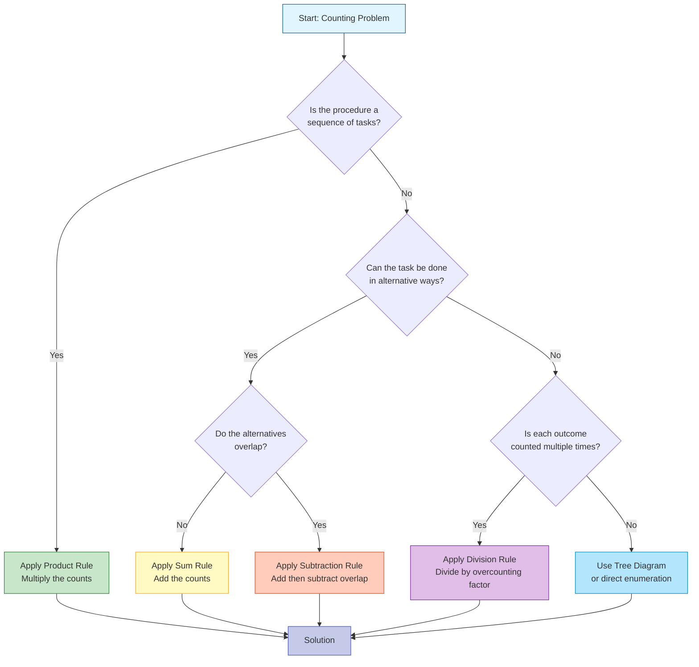
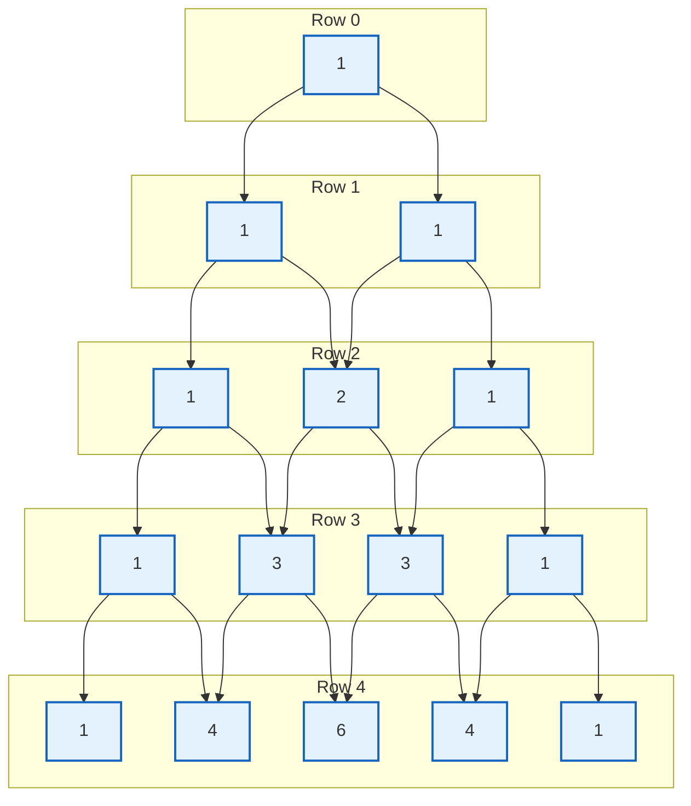
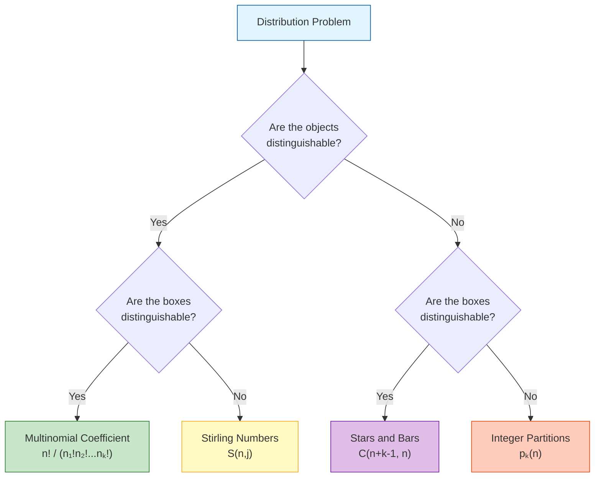

---
tags:
  - "#CCT2"
  - DS
Topic: "Counting | The Basics of\r Counting | Permutations\r and \rCombinations | Binomial coefficients"
Semester: CCT2
Course: Diskrete strukturer
Litterature:
  - Discrete Mathematics and Its Applications - 8th Ed.
Created: 27-02-2026
---
- - -
# Table of Contents

1. [[#Counting|Counting]]
	1. [[#Counting#Quick Reference|Quick Reference]]
	2. [[#Counting#The Basics of Counting|The Basics of Counting]]
		1. [[#The Basics of Counting#Introduction|Introduction]]
		2. [[#The Basics of Counting#Basic Counting Principles|Basic Counting Principles]]
			1. [[#Basic Counting Principles#Selecting the Right Counting Rule|Selecting the Right Counting Rule]]
			2. [[#Basic Counting Principles#The Product Rule|The Product Rule]]
			3. [[#Basic Counting Principles#The Sum Rule|The Sum Rule]]
		3. [[#The Basics of Counting#More Complex Counting Problems|More Complex Counting Problems]]
		4. [[#The Basics of Counting#The Subtraction Rule (Inclusion–Exclusion for Two Sets)|The Subtraction Rule (Inclusion–Exclusion for Two Sets)]]
		5. [[#The Basics of Counting#The Division Rule|The Division Rule]]
		6. [[#The Basics of Counting#Tree Diagrams|Tree Diagrams]]
	3. [[#Counting#The Pigeonhole Principle|The Pigeonhole Principle]]
		1. [[#The Pigeonhole Principle#Introduction|Introduction]]
		2. [[#The Pigeonhole Principle#The Generalized Pigeonhole Principle|The Generalized Pigeonhole Principle]]
		3. [[#The Pigeonhole Principle#Some Elegant Applications of the Pigeonhole Principle|Some Elegant Applications of the Pigeonhole Principle]]
			1. [[#Some Elegant Applications of the Pigeonhole Principle#Subsequences|Subsequences]]
			2. [[#Some Elegant Applications of the Pigeonhole Principle#Ramsey Theory|Ramsey Theory]]
	4. [[#Counting#Permutations and Combinations|Permutations and Combinations]]
		1. [[#Permutations and Combinations#Introduction|Introduction]]
		2. [[#Permutations and Combinations#Permutations|Permutations]]
		3. [[#Permutations and Combinations#Combinations|Combinations]]
	5. [[#Counting#Binomial Coefficients and Identities|Binomial Coefficients and Identities]]
		1. [[#Binomial Coefficients and Identities#The Binomial Theorem|The Binomial Theorem]]
			1. [[#The Binomial Theorem#Corollaries from the Binomial Theorem|Corollaries from the Binomial Theorem]]
		2. [[#Binomial Coefficients and Identities#Pascal's Identity and Triangle|Pascal's Identity and Triangle]]
			1. [[#Pascal's Identity and Triangle#Pascal's Triangle Construction|Pascal's Triangle Construction]]
		3. [[#Binomial Coefficients and Identities#Other Identities Involving Binomial Coefficients|Other Identities Involving Binomial Coefficients]]
	6. [[#Counting#Generalized Permutations and Combinations|Generalized Permutations and Combinations]]
		1. [[#Generalized Permutations and Combinations#Introduction|Introduction]]
		2. [[#Generalized Permutations and Combinations#Permutations with Repetition|Permutations with Repetition]]
		3. [[#Generalized Permutations and Combinations#Combinations with Repetition|Combinations with Repetition]]
		4. [[#Generalized Permutations and Combinations#Permutations with Indistinguishable Objects|Permutations with Indistinguishable Objects]]
		5. [[#Generalized Permutations and Combinations#Distributing Objects into Boxes|Distributing Objects into Boxes]]
			1. [[#Distributing Objects into Boxes#Case 1: Distinguishable Objects → Distinguishable Boxes|Case 1: Distinguishable Objects → Distinguishable Boxes]]
			2. [[#Distributing Objects into Boxes#Case 2: Indistinguishable Objects → Distinguishable Boxes|Case 2: Indistinguishable Objects → Distinguishable Boxes]]
			3. [[#Distributing Objects into Boxes#Case 3: Distinguishable Objects → Indistinguishable Boxes|Case 3: Distinguishable Objects → Indistinguishable Boxes]]
			4. [[#Distributing Objects into Boxes#Case 4: Indistinguishable Objects → Indistinguishable Boxes|Case 4: Indistinguishable Objects → Indistinguishable Boxes]]
	7. [[#Counting#Common Formulas Quick Reference Card|Common Formulas Quick Reference Card]]
	8. [[#Counting#Common Mistakes Summary|Common Mistakes Summary]]

# Counting

## Quick Reference

| Symbol / Term | Name | Description |
|---|---|---|
| $n!$ | Factorial | The product of all positive integers from $1$ to $n$. $n! = n \cdot (n-1) \cdots 2 \cdot 1$. By convention, $0! = 1$. |
| $P(n, r)$ | $r$-Permutation | The number of ordered arrangements of $r$ elements from a set of $n$ distinct elements. $P(n,r) = \frac{n!}{(n-r)!}$ |
| $C(n, r)$ or $\binom{n}{r}$ | $r$-Combination / Binomial Coefficient | The number of unordered selections of $r$ elements from a set of $n$ distinct elements. $C(n,r) = \frac{n!}{r!(n-r)!}$ |
| $\sum$ | Summation (Capital Sigma) | Directs you to add a sequence of terms together, iterating an index from a lower to an upper limit. |
| $\lceil x \rceil$ | Ceiling Function | Returns the smallest integer greater than or equal to $x$. |
| $\lfloor x \rfloor$ | Floor Function | Returns the largest integer less than or equal to $x$. |
| $\lvert A \rvert$ | Cardinality | The number of elements in a finite set $A$. |
| $A \cup B$ | Union | The set of elements in $A$ or $B$ (or both). |
| $A \cap B$ | Intersection | The set of elements in both $A$ and $B$. |
| $A \times B$ | Cartesian Product | The set of all ordered pairs $(a, b)$ where $a \in A$ and $b \in B$. |
| $S(n, j)$ | Stirling Number of the Second Kind | The number of ways to partition $n$ distinguishable objects into $j$ non-empty indistinguishable subsets. |
| $p_k(n)$ | Integer Partition Function | The number of ways to write $n$ as a sum of at most $k$ positive integers. |

_Table 1.1: Key symbols, operators, and terminology used throughout counting and combinatorics._

---

| Type | Repetition Allowed? | Formula |
| :--- | :--- | :--- |
| $r$-permutations | No | $\frac{n!}{(n-r)!}$ |
| $r$-combinations | No | $\frac{n!}{r!(n-r)!}$ |
| $r$-permutations | Yes | $n^r$ |
| $r$-combinations | Yes | $\frac{(n+r-1)!}{r!(n-1)!}$ |

_Table 1.2: Summary of the four fundamental selection formulas for permutations and combinations, with and without repetition._

---

## The Basics of Counting

### Introduction

Counting problems arise frequently throughout mathematics and computer science. To determine probabilities of discrete events, one must count both the _successful outcomes_ and _all the possible outcomes_ of experiments. Similarly, analyzing the _time complexity_ of an algorithm requires counting the number of operations it uses.

**Combinatorics** is the study of arrangements of objects, tracing its origins to the seventeenth century and the study of gambling games. A central part of this field is **enumeration**, the counting of objects with certain properties.

>[!info] Applications of Counting
> Counting is used to solve many different types of problems, including:
> - Determining the **complexity of algorithms**.
> - Determining whether there are enough **telephone numbers** or **Internet protocol addresses** to meet demand.
> - **Sequencing DNA** in mathematical biology.
> - Computing the **probabilities** of events.

>[!example] The Password Problem
> Consider a password on a computer system that consists of six, seven, or eight characters.
> - **Constraints:** Each character must be a digit or a letter of the alphabet.
> - **Requirement:** Each password must contain at least one digit.
> - **Goal:** Determine the total number of valid passwords.
>
> Solving this problem and a wide variety of similar challenges requires a set of specific techniques introduced in this section.

---

### Basic Counting Principles

Two fundamental principles form the foundation of counting techniques: the **product rule** and the **sum rule**. The product rule applies to procedures made up of separate sequential tasks, while the sum rule applies to tasks that can be done in alternative ways.

#### Selecting the Right Counting Rule

When faced with a counting problem, use the following decision process to identify the appropriate technique:



_Figure 1.1: Decision flowchart for selecting the appropriate counting rule based on problem structure. Colors indicate different rule categories: green for product, yellow for sum, orange for subtraction, purple for division, and blue for tree diagrams._

#### The Product Rule

The product rule applies when a procedure is broken down into a sequence of tasks.

>[!summary] The Product Rule
> Suppose that a procedure can be broken down into a sequence of two tasks. If there are $n_1$ ways to do the first task and for each of these ways, there are $n_2$ ways to do the second task, then there are $n_1 \cdot n_2$ ways to do the procedure.
>
> This extends to $m$ tasks: if a procedure consists of tasks $T_1, T_2, \dots, T_m$ performed in sequence, and each task $T_i$ can be done in $n_i$ ways regardless of previous tasks, the total number of ways is:
> $$n_1 \cdot n_2 \cdots n_m$$

>[!abstract] Analogy: Building a Sandwich
> Think of the product rule like building a sandwich at a deli. If you have $3$ bread choices, $5$ meat choices, and $4$ cheese choices, the total number of different sandwiches is $3 \cdot 5 \cdot 4 = 60$. Each choice is independent, and you make them in sequence — the product rule captures this multiplicative effect of sequential independent choices.

>[!example] Assigning Offices
> A company with two employees, Sanchez and Patel, rents a floor with $12$ offices.
> - **Task 1:** Assign an office to Sanchez. This can be done in $12$ ways.
> - **Task 2:** Assign an office to Patel different from Sanchez. This can be done in $11$ ways.
> - **Result:** By the product rule, there are $12 \cdot 11 = 132$ ways to assign the offices.

>[!info] Product Rule in Set Theory
> If $A_1, A_2, \dots, A_m$ are finite sets, then the number of elements in the Cartesian product is the product of the number of elements in each set:
> $$\lvert A_1 \times A_2 \times \dots \times A_m \rvert = \lvert A_1 \rvert \cdot \lvert A_2 \rvert \cdots \lvert A_m \rvert$$

>[!warning] Common Mistake: Dependent vs. Independent Tasks
> The product rule assumes that the number of ways to complete each task does **not** depend on how previous tasks were completed. If Task 2's options change based on Task 1's outcome, you must account for this — either by careful case analysis or by recognizing that the "11 ways" already reflects the dependency (as in the office example where one office is taken).

**Bit Strings and License Plates**

The product rule is useful for determining the number of possible configurations.

- **Bit Strings:** To find the number of bit strings of length seven, note that each bit can be chosen in $2$ ways (`0` or `1`). Therefore, there are $2^7 = 128$ different bit strings.
- **License Plates:** If a plate contains a sequence of three uppercase English letters followed by three digits, there are $26$ choices for each letter and $10$ choices for each digit. The total number of plates is $26^3 \cdot 10^3 = 17{,}576{,}000$.

**Counting Functions**

The product rule can determine the number of functions between sets.

>[!example] Counting Functions
> How many functions are there from a set with $m$ elements to a set with $n$ elements?
> - **Procedure:** A function corresponds to a choice of one of the $n$ elements in the codomain for each of the $m$ elements in the domain.
> - **Calculation:** By the product rule, there are $n \cdot n \cdots n = n^m$ functions.
> - **Instance:** There are $5^3 = 125$ functions from a set with $3$ elements to a set with $5$ elements.

>[!example] Counting One-to-One Functions
> How many one-to-one functions are there from a set with $m$ elements to a set with $n$ elements (where $m \le n$)?
> - **Logic:** The value for the first element has $n$ possibilities. The second element must be different, leaving $n-1$ possibilities, and so on.
> - **Calculation:** The total number is $n(n-1)(n-2) \cdots (n-m+1)$.
> - **Instance:** For a set with $3$ elements to a set with $5$ elements, there are $5 \cdot 4 \cdot 3 = 60$ one-to-one functions.

**The Telephone Numbering Plan**

The North American Numbering Plan (NANP) illustrates how counting applies to real-world constraints.

>[!example] North American Telephone Numbers
> A telephone number consists of a $3$-digit area code, $3$-digit office code, and $4$-digit station code.
>
> **Variable Definitions:**
> - `X`: Digit $0$–$9$ ($10$ choices).
> - `N`: Digit $2$–$9$ ($8$ choices).
> - `Y`: Digit $0$ or $1$ ($2$ choices).
>
> **Old Plan vs. New Plan:**
> 1. **Old Plan (NYX-NNX-XXXX):**
>    - Area Code (NYX): $8 \cdot 2 \cdot 10 = 160$.
>    - Office Code (NNX): $8 \cdot 8 \cdot 10 = 640$.
>    - Station Code (XXXX): $10^4 = 10{,}000$.
>    - **Total:** $160 \cdot 640 \cdot 10{,}000 = 1{,}024{,}000{,}000$.
> 2. **New Plan (NXX-NXX-XXXX):**
>    - Area Code (NXX): $8 \cdot 10 \cdot 10 = 800$.
>    - Office Code (NXX): $800$.
>    - Station Code (XXXX): $10{,}000$.
>    - **Total:** $800 \cdot 800 \cdot 10{,}000 = 6{,}400{,}000{,}000$.

**Counting Subsets**

There is a one-to-one correspondence between subsets of a finite set $S$ and bit strings of length $\lvert S \rvert$. Each position in the string has $2$ possibilities ($1$ if the element is in the subset, $0$ if not), so the number of different subsets is $2^{\lvert S \rvert}$.

**DNA and Genomes**

Genetic information is encoded using DNA, consisting of two strands of nucleotides. Each nucleotide contains one of four bases: Adenine (A), Cytosine (C), Guanine (G), or Thymine (T).

>[!info] DNA Sequences
> - **Bases:** There are $4$ possibilities for each link in a DNA sequence.
> - **Amino Acids:** To encode $22$ essential amino acids, sequences of at least three bases are needed. Two bases provide $4^2 = 16$ possibilities (insufficient), while three bases provide $4^3 = 64$ possibilities (sufficient).
> - **Complexity:** Simple organisms have between $10^5$ and $10^7$ links, while complex organisms have between $10^8$ and $10^{10}$ links. The number of possible sequences is vast ($4^{10^5}$ or more), explaining biological variability.

---

#### The Sum Rule

The sum rule applies when a task can be done in one of several different, mutually exclusive ways.

>[!summary] The Sum Rule
> If a task can be done either in one of $n_1$ ways or in one of $n_2$ ways, where none of the set of $n_1$ ways is the same as any of the set of $n_2$ ways, then there are $n_1 + n_2$ ways to do the task.
>
> This extends to $m$ mutually exclusive alternatives:
> $$n_1 + n_2 + \dots + n_m$$

>[!abstract] Analogy: Choosing Transportation
> The sum rule is like deciding how to get to work. If you can take $3$ different bus routes OR $2$ different train lines OR drive $1$ car route, and these are completely separate options (you can't take a bus AND a train simultaneously), then you have $3 + 2 + 1 = 6$ total ways to commute. The key is that the options don't overlap.

>[!example] Choosing a Representative
> Suppose a representative is chosen from either the mathematics faculty ($37$ members) or mathematics majors ($83$ students).
> - **Condition:** No one is both a faculty member and a student (disjoint sets).
> - **Calculation:** By the sum rule, there are $37 + 83 = 120$ possible choices.

>[!info] Sum Rule in Set Theory
> If $A_1, A_2, \dots, A_m$ are pairwise disjoint finite sets, then:
> $$\lvert A_1 \cup A_2 \cup \dots \cup A_m \rvert = \lvert A_1 \rvert + \lvert A_2 \rvert + \dots + \lvert A_m \rvert$$
> This applies only when the sets share no common elements ($A_i \cap A_j = \emptyset$ for all $i \neq j$). When sets overlap, use the [[#The Subtraction Rule (Inclusion–Exclusion for Two Sets)|Subtraction Rule]].

>[!warning] Common Mistake: Overlapping Alternatives
> The sum rule **only works when alternatives are mutually exclusive**. If someone could be both a faculty member AND a student, simply adding $37 + 83$ would double-count those individuals. When alternatives overlap, you must use the [[#The Subtraction Rule (Inclusion–Exclusion for Two Sets)|Subtraction Rule]] to correct the overcount.

**Counting in Programming**

The sum rule applies directly to analyzing code with sequential, non-nested loops.

>[!example] Sequential Loops
> Consider code where `k` is incremented in sequential, non-nested loops:
> ```python
> k = 0
> for i1 in range(n1):
>     k += 1
> for i2 in range(n2):
>     k += 1
> # ... for im in range(nm)
> ```
> - **Logic:** The first loop runs $n_1$ times, the second $n_2$ times, etc.
> - **Result:** Since these loops execute separately, the final value of `k` is $n_1 + n_2 + \dots + n_m$.

---

### More Complex Counting Problems

Many counting problems require using both the sum rule and the product rule in combination. A common strategy for complex constraints is to calculate the **total** number of possibilities and **subtract** those that violate the rules.

>[!example] Naming Variables in BASIC (Worked Example)
> A version of the BASIC language uses variable names that are one or two alphanumeric characters long, case-insensitive. A variable name must begin with a letter and cannot be one of five reserved two-character strings.
>
> **Step 1:** Identify the structure of the problem.
> - Variable names are either $1$ character OR $2$ characters (use sum rule).
> - Let $V = V_1 + V_2$ where $V_1$ = one-character names, $V_2$ = two-character names.
>
> **Step 2:** Count one-character names ($V_1$).
> - Must be a letter: $V_1 = 26$.
>
> **Step 3:** Count two-character names ($V_2$).
> - First character: letter ($26$ choices).
> - Second character: alphanumeric ($26 + 10 = 36$ choices).
> - Total before restrictions: $26 \cdot 36 = 936$.
>
> **Step 4:** Subtract invalid names.
> - Reserved strings: $5$.
> - Valid two-character names: $V_2 = 936 - 5 = 931$.
>
> **Step 5:** Combine using the sum rule.
> - $V = V_1 + V_2 = 26 + 931 = 957$ different variable names.

>[!example] Counting Passwords with Constraints (Worked Example)
> A computer system password is six to eight characters long, using uppercase letters and digits. It must contain at least one digit.
>
> **Step 1:** Set up the framework.
> - Use sum rule: $P = P_6 + P_7 + P_8$ (passwords of each length).
> - Strategy: Total strings minus all-letter strings = strings with at least one digit.
>
> **Step 2:** Identify the character set.
> - Available characters: $26$ letters $+ 10$ digits $= 36$ total.
> - All-letter characters: $26$.
>
> **Step 3:** Calculate for length $6$.
> - Total strings: $36^6 = 2{,}176{,}782{,}336$.
> - All-letter strings: $26^6 = 308{,}915{,}776$.
> - Valid passwords: $P_6 = 36^6 - 26^6 = 1{,}867{,}866{,}560$.
>
> **Step 4:** Calculate for length $7$.
> - $P_7 = 36^7 - 26^7 = 78{,}364{,}164{,}096 - 8{,}031{,}810{,}176 = 70{,}332{,}353{,}920$.
>
> **Step 5:** Calculate for length $8$.
> - $P_8 = 36^8 - 26^8 = 2{,}821{,}109{,}907{,}456 - 208{,}827{,}064{,}576 = 2{,}612{,}282{,}842{,}880$.
>
> **Step 6:** Sum all valid passwords.
> - $P = P_6 + P_7 + P_8 = 2{,}684{,}483{,}063{,}360$.

>[!example] Counting Internet Addresses (IPv4)
> In IPv4, an address is a $32$-bit string composed of a `netid` (network number) followed by a `hostid` (host number). Addresses are divided into classes A, B, and C.
>
> **Address Restrictions:**
> - The `netid` `1111111` is not available for Class A.
> - `hostid`s consisting of all $0$s or all $1$s are not available for any network.
>
> **Calculations by Class:**
> - **Class A** (`0` + $7$-bit `netid` + $24$-bit `hostid`):
>   - Valid `netid`s: $2^7 - 1 = 127$.
>   - Valid `hostid`s: $2^{24} - 2 = 16{,}777{,}214$.
>   - Total: $127 \cdot 16{,}777{,}214 = 2{,}130{,}706{,}178$.
> - **Class B** (`10` + $14$-bit `netid` + $16$-bit `hostid`):
>   - Valid `netid`s: $2^{14} = 16{,}384$.
>   - Valid `hostid`s: $2^{16} - 2 = 65{,}534$.
>   - Total: $16{,}384 \cdot 65{,}534 = 1{,}073{,}709{,}056$.
> - **Class C** (`110` + $21$-bit `netid` + $8$-bit `hostid`):
>   - Valid `netid`s: $2^{21} = 2{,}097{,}152$.
>   - Valid `hostid`s: $2^8 - 2 = 254$.
>   - Total: $2{,}097{,}152 \cdot 254 = 532{,}676{,}608$.
>
> **Total IPv4 Addresses (Sum Rule):**
> $x = x_A + x_B + x_C = 3{,}737{,}091{,}842$ available addresses.

---

### The Subtraction Rule (Inclusion–Exclusion for Two Sets)

The sum rule assumes that sets of tasks are disjoint. When a task can be done in ways that overlap, simply adding the number of ways results in an **overcount** because the common ways are counted twice. To correct this, the number of common ways must be subtracted.

>[!summary] The Subtraction Rule (Inclusion–Exclusion)
> If a task can be done in either $n_1$ ways or $n_2$ ways, the number of ways to do the task is $n_1 + n_2$ minus the number of ways that are common to both.
>
> - **Equation:** $\lvert A_1 \cup A_2 \rvert = \lvert A_1 \rvert + \lvert A_2 \rvert - \lvert A_1 \cap A_2 \rvert$
> - **Breakdown:**
>     - **$\lvert A_1 \cup A_2 \rvert$**: The total number of elements in either set (the goal).
>     - **$\lvert A_1 \rvert + \lvert A_2 \rvert$**: The sum of elements in each set (includes duplicates).
>     - **$\lvert A_1 \cap A_2 \rvert$**: The intersection — the elements counted twice that must be subtracted out.

>[!abstract] Analogy: Counting Club Members
> Imagine counting students in the Chess Club ($30$ members) and the Math Club ($25$ members). If you just add $30 + 25 = 55$, you've overcounted anyone who belongs to both clubs. If $10$ students are in both, the actual total is $30 + 25 - 10 = 45$ unique students. The subtraction rule corrects for this double-counting.

>[!example] Counting Bit Strings with Specific Patterns (Worked Example)
> How many bit strings of length eight either start with a `1` or end with the two bits `00`?
>
> **Step 1:** Define the sets.
> - Let $A$ = bit strings starting with `1`.
> - Let $B$ = bit strings ending with `00`.
> - Goal: Find $\lvert A \cup B \rvert$.
>
> **Step 2:** Count set $A$ (starts with `1`).
> - First bit fixed as `1`, remaining $7$ bits can be anything.
> - $\lvert A \rvert = 1 \cdot 2^7 = 128$.
>
> **Step 3:** Count set $B$ (ends with `00`).
> - Last two bits fixed as `00`, first $6$ bits can be anything.
> - $\lvert B \rvert = 2^6 \cdot 1 = 64$.
>
> **Step 4:** Count the intersection $A \cap B$ (starts with `1` AND ends with `00`).
> - First bit is `1`, last two bits are `00`, middle $5$ bits can be anything.
> - $\lvert A \cap B \rvert = 1 \cdot 2^5 \cdot 1 = 32$.
>
> **Step 5:** Apply the subtraction rule.
> - $\lvert A \cup B \rvert = 128 + 64 - 32 = 160$ bit strings.

>[!example] Job Applicant Majors
> A company receives $350$ applications. $220$ majored in CS, $147$ in business, and $51$ in both. How many majored in neither?
>
> 1. **Find the Union:** $\lvert CS \cup Business \rvert = 220 + 147 - 51 = 316$.
> 2. **Find the Complement:** $350 - 316 = 34$.
>
> **Result:** $34$ applicants majored in neither subject.
>
> ![[Pasted image 20260227165024.png]]
> _Figure 2.1: Venn diagram showing the overlap between CS and Business majors among $350$ applicants._

This principle generalizes to find the number of elements in the union of $n$ sets, a topic explored further in the study of the **inclusion–exclusion principle**.

---

### The Division Rule

The **division rule** is useful when a counting procedure overcounts each distinct outcome exactly the same number of times.

>[!summary] The Division Rule
> There are $n/d$ ways to do a task if it can be done using a procedure that can be carried out in $n$ ways, and for every way $w$, exactly $d$ of the $n$ ways correspond to way $w$.
>
> - **Equation:** $\text{Distinct outcomes} = n / d$
> - **Breakdown:**
>     - **$n$**: The total number of ways the procedure can be carried out (the overcount).
>     - **$d$**: The number of equivalent procedures that correspond to each single distinct outcome.

>[!info] Alternative Formulations
> **Set Theory:** If a finite set $A$ is the union of $n$ pairwise disjoint subsets each with $d$ elements, then $n = \lvert A \rvert/d$.
>
> **Function:** If $f$ is a function from $A$ to $B$ and for every $y \in B$ there are exactly $d$ values $x \in A$ with $f(x) = y$ (a **$d$-to-one function**), then $\lvert B \rvert = \lvert A \rvert/d$.

>[!tip] When to Use the Division Rule
> This rule is handy when a task appears to have $n$ different ways of completion, but it turns out there are $d$ equivalent ways for every distinct outcome. The actual number of **inequivalent** outcomes is $n/d$.

>[!warning] Common Mistake: Non-Uniform Overcounting
> The division rule **only works when every outcome is overcounted by exactly the same factor** $d$. If different outcomes are overcounted by different amounts, you cannot simply divide — you'll need a different approach, such as careful case analysis or the [[#The Subtraction Rule (Inclusion–Exclusion for Two Sets)|Subtraction Rule]].

>[!example] Counting Cows by Legs
> An automated system counts $572$ legs in a pasture. Assuming each cow has $4$ legs:
> - $n = 572$ (total legs), $d = 4$ (legs per cow).
> - Number of cows: $572 / 4 = 143$.

>[!example] Seating Arrangements at a Circular Table (Worked Example)
> How many different ways are there to seat $4$ people around a circular table, where two seatings are the same if each person has the same neighbors?
>
> **Step 1:** Count linear arrangements (ignoring circular equivalence).
> - Arrange $4$ people in a line: $4! = 24$ ways.
>
> **Step 2:** Identify the equivalence factor.
> - At a circular table, rotating everyone by one seat produces the same arrangement.
> - For $4$ people, there are $4$ rotations that give equivalent seatings.
> - Therefore, $d = 4$.
>
> **Step 3:** Apply the division rule.
> - Distinct circular arrangements: $24 / 4 = 6$.

---

### Tree Diagrams

Counting problems can often be effectively solved using **tree diagrams**, especially when choices at each step depend on previous choices or when constraints eliminate certain paths.

>[!info] Components of a Counting Tree
> - **Root:** The starting point of the procedure.
> - **Branches:** Represent each possible choice made at a step.
> - **Leaves:** The endpoints representing the final **outcomes**. The total count equals the number of leaves.

>[!example] Bit Strings without Consecutive 1s
> **Problem:** How many bit strings of length four do not have two consecutive $1$s?
>
> **Solution:** A tree diagram displays all possibilities, branching for each bit (`0` or `1`). A branch is terminated if adding a `1` follows a previous `1`.
>
> ![[Pasted image 20260227165755.png]]
> _Figure 2.2: Tree diagram for bit strings of length four without consecutive $1$s._
>
> By counting the leaves: **$8$** bit strings of length four without two consecutive $1$s.

>[!example] Playoff Outcomes
> **Problem:** A playoff between two teams consists of at most five games. The first team to win three games wins. How many ways can the playoff occur?
>
> **Solution:** A tree diagram traces the winner of each game. Branches stop once a team reaches three wins.
>
> ![[Pasted image 20260227165818.png]]
> _Figure 2.3: Tree diagram for a best-of-five playoff series._
>
> Counting the leaves: **$20$** different ways for the playoff to occur.

>[!example] Inventory Stocking
> **Problem:** A souvenir shop stocks T-shirts in specific sizes and colors. How many different shirts must be stocked?
>
> **Constraints:**
> - **Sizes S, M, L:** $4$ colors (White, Red, Green, Black).
> - **Size XL:** $3$ colors (Red, Green, Black).
> - **Size XXL:** $2$ colors (Green, Black).
>
> **Solution:**
>
> ![[Pasted image 20260227165831.png]]
> _Figure 2.4: Tree diagram for T-shirt size and color combinations._
>
> Using the sum rule: $12 + 3 + 2 = 17$ different T-shirts.

---

## The Pigeonhole Principle

### Introduction

The **pigeonhole principle** is a deceptively simple yet powerful concept: if there are more objects than containers, at least one container must hold more than one object. Despite its simplicity, it serves as a fundamental tool for proving the _existence_ of certain properties without explicitly constructing them.

>[!summary] Theorem 1: The Pigeonhole Principle
> If $k$ is a positive integer and $k + 1$ or more objects are placed into $k$ boxes, then there is at least one box containing two or more of the objects.
>
> **Proof (by contraposition):**
> - **Assumption:** Suppose that none of the $k$ boxes contains more than one object.
> - **Consequence:** Then the total number of objects would be at most $k$.
> - **Contradiction:** This contradicts the premise that there are at least $k + 1$ objects.
> - **Conclusion:** Therefore, at least one box must contain two or more objects.
>
> ![[Pasted image 20260227170126.png]]
> _Figure 3.1: Visual depiction of the pigeonhole principle — more pigeons than holes forces sharing._

>[!abstract] Analogy: Socks in a Drawer
> Imagine a drawer with only red and blue socks (mixed up in the dark). If you want to guarantee a matching pair, how many must you grab? With $2$ colors (boxes) and needing $2$ of the same color, you need $2 + 1 = 3$ socks. The pigeonhole principle guarantees that $3$ socks distributed among $2$ colors means at least one color appears twice.

>[!info] Corollary 1
> A function $f$ from a set with $k + 1$ or more elements to a set with $k$ elements is **not** one-to-one.
>
> **Proof:** Each element $y$ in the codomain is a "box" containing all $x$ with $f(x) = y$. Since there are more domain elements than codomain elements, at least two domain elements must map to the same value.

>[!example] Application: Birthdays
> Among any group of $367$ people, there must be at least two with the same birthday.
> - **Reasoning:** There are only $366$ possible birthdays (including Feb 29). Placing $367$ people into $366$ boxes guarantees a collision.

>[!example] Application: First Letters
> In any group of $27$ English words, at least two must begin with the same letter.
> - **Reasoning:** There are $26$ letters (boxes). With $27$ words (objects), at least two share a starting letter.

>[!example] Application: Exam Scores
> How many students must be in a class to guarantee at least two receive the same score on an exam graded $0$ to $100$?
> - **Boxes:** $101$ possible scores ($0, 1, \dots, 100$).
> - **Result:** **$102$** students guarantees at least two share a score.

>[!warning] Common Mistake: Misidentifying the Boxes
> The hardest part of applying the pigeonhole principle is often **correctly identifying what the "boxes" are**. The boxes must be a finite set of categories into which all objects must fall. Before applying the principle, clearly define:
> 1. What are the objects being placed?
> 2. What are the boxes (categories)?
> 3. Why must every object go into exactly one box?

>[!example] Application: Decimal Expansions
> Show that for every positive integer $n$, there is a multiple of $n$ whose decimal expansion contains only $0$s and $1$s.
>
> 4. **Consider the list:** $1, 11, 111, \dots, \underbrace{11\dots1}_{n+1 \text{ ones}}$ — a total of $n+1$ integers.
> 5. **Apply the Principle:** Dividing by $n$ yields only $n$ possible remainders ($0$ through $n-1$). With $n+1$ integers, two must share the same remainder.
> 6. **Construct the Multiple:** Let $a > b$ be the two integers with the same remainder. Then $a - b$ is divisible by $n$.
> 7. **Result:** The decimal expansion of $a - b$ consists entirely of $0$s and $1$s (e.g., $111 - 11 = 100$).

---

### The Generalized Pigeonhole Principle

The standard principle guarantees at least one box has two objects. The **generalized** version quantifies a stronger minimum.

>[!summary] Theorem 2: The Generalized Pigeonhole Principle
> If $N$ objects are placed into $k$ boxes, then there is at least one box containing at least $\lceil N/k \rceil$ objects.
>
> - **Equation:** Minimum objects in the fullest box $\ge \lceil N/k \rceil$
> - **Breakdown:**
>     - **$N$**: The total number of objects being distributed.
>     - **$k$**: The total number of boxes (categories).
>     - **$\lceil N/k \rceil$**: The ceiling of $N/k$ — the smallest integer $\ge N/k$.
>
> **Proof (by contraposition):**
> - Suppose every box contains fewer than $\lceil N/k \rceil$ objects, i.e., at most $\lceil N/k \rceil - 1$.
> - Total objects $\le k(\lceil N/k \rceil - 1) < k \cdot (N/k + 1 - 1) = N$.
> - This contradicts there being $N$ objects.

>[!info] Finding Minimum $N$ for a Target Count
> To guarantee at least $r$ objects in one of $k$ boxes:
> $$N = k(r - 1) + 1$$
> **Logic:** You can place at most $r - 1$ objects in each of $k$ boxes (totaling $k(r-1)$). The very next object forces one box to reach $r$.

>[!example] Birthdays by Month
> Among $100$ people, there are at least $\lceil 100/12 \rceil = 9$ people born in the same month.

>[!example] Assigning Grades
> What is the minimum number of students to guarantee at least six receive the same grade (A, B, C, D, or F)?
> - $k = 5$ grades, target $r = 6$.
> - $N = 5(6 - 1) + 1 = 26$ students.

>[!example] Selecting Cards from a Deck
> A standard deck has $52$ cards with $4$ suits.
>
> **Part A: Guaranteeing three cards of the same suit.**
> - $k = 4$, $r = 3$.
> - $N = 4(3 - 1) + 1 = 9$ cards.
>
> **Part B: Guaranteeing three hearts.**
> - This requires worst-case analysis, not the generalized formula directly.
> - **Worst Case:** Draw all $39$ non-heart cards first.
> - $39 + 3 = 42$ cards must be selected.

>[!example] Area Codes for Phone Numbers
> What is the least number of area codes needed for $25$ million phones, if each area code supports $8$ million numbers?
> - $\lceil 25{,}000{,}000 / 8{,}000{,}000 \rceil = 4$ area codes minimum.

>[!example] Network Connections
> A lab has $15$ workstations and $10$ servers. We need to guarantee any $10$ or fewer workstations can simultaneously access distinct servers. What is the minimum number of direct connections?
>
> **Configuration ($60$ connections):**
> - $W_1$ through $W_{10}$: connect to $S_1$ through $S_{10}$ respectively ($10$ connections).
> - $W_{11}$ through $W_{15}$: connect to all $10$ servers ($5 \times 10 = 50$ connections).
> - **Total:** $60$ connections.
>
> **Proof of Minimality:**
> - With only $59$ connections distributed among $10$ servers, one server connects to at most $\lfloor 59/10 \rfloor = 5$ workstations.
> - This leaves at least $15 - 5 = 10$ workstations needing $9$ servers — impossible to guarantee simultaneous access.
> - **Result:** $60$ connections are necessary and sufficient.

---

### Some Elegant Applications of the Pigeonhole Principle

Many interesting applications require **cleverly defining** what the "objects" and "boxes" are.

>[!example] Consecutive Days with a Specific Game Count
> **Problem:** During a $30$-day month, a baseball team plays at least one game a day, but no more than $45$ games total. Show there must be a period of consecutive days during which the team plays exactly $14$ games.
>
> **Solution:**
> 1. **Define the Sequence:** Let $a_j$ = cumulative games played through day $j$. This sequence is strictly increasing with $1 \le a_j \le 45$.
> 2. **Create a Second Sequence:** Consider $a_1 + 14, a_2 + 14, \dots, a_{30} + 14$. Also strictly increasing, with $15 \le a_j + 14 \le 59$.
> 3. **Apply the Principle:** We have $60$ integers ($30$ $a_j$'s and $30$ $(a_j+14)$'s), all between $1$ and $59$. Since $60 > 59$, two must be equal.
> 4. **Analyze:** Since values within each sequence are distinct, the collision must be between sequences: $a_i = a_j + 14$ for some $i, j$.
> 5. **Conclusion:** $a_i - a_j = 14$, meaning exactly $14$ games were played from day $j+1$ to day $i$.

>[!example] Divisibility in a Subset
> **Problem:** Among any $n+1$ positive integers not exceeding $2n$, one must divide another.
>
> **Solution:**
> 6. Write each integer as $a_j = 2^{k_j} q_j$, where $q_j$ is odd.
> 7. The odd parts $q_j$ can only take $n$ distinct values (the odd numbers from $1$ to $2n-1$).
> 8. With $n+1$ integers and $n$ possible odd parts, two must share the same odd part: $a_i = 2^{k_i}q$ and $a_j = 2^{k_j}q$.
> 9. The one with the smaller power of $2$ divides the other.

#### Subsequences

>[!info] Subsequence Definitions
> Given a sequence $a_1, a_2, \dots, a_N$:
> - **Subsequence:** A sequence $a_{i_1}, a_{i_2}, \dots, a_{i_m}$ where $i_1 < i_2 < \dots < i_m$, preserving the original order.
> - **Strictly Increasing:** Each term is larger than the preceding one.
> - **Strictly Decreasing:** Each term is smaller than the preceding one.

>[!summary] Theorem 3
> Every sequence of $n^2 + 1$ distinct real numbers contains a subsequence of length $n + 1$ that is either strictly increasing or strictly decreasing.
>
> **Proof:**
> - Associate each term $a_k$ with a pair $(i_k, d_k)$, where $i_k$ is the length of the longest increasing subsequence starting at $a_k$, and $d_k$ the longest decreasing.
> - Assume no subsequence of length $n+1$ exists: then $1 \le i_k \le n$ and $1 \le d_k \le n$, giving at most $n^2$ possible pairs.
> - With $n^2 + 1$ terms, two terms $a_s, a_t$ ($s < t$) must share the same pair $(i_s, d_s) = (i_t, d_t)$.
> - If $a_s < a_t$: prepending $a_s$ to the longest increasing subsequence at $a_t$ gives length $i_t + 1$, so $i_s \ge i_t + 1$ — contradiction.
> - If $a_s > a_t$: similarly, $d_s \ge d_t + 1$ — contradiction.
> - Therefore, such a subsequence must exist.

>[!example] Finding Subsequences
> The sequence $8, 11, 9, 1, 4, 6, 12, 10, 5, 7$ has $10$ terms ($3^2 + 1$).
> - **Theorem guarantees:** A monotonic subsequence of length $3+1 = 4$.
> - **Increasing:** $1, 4, 6, 12$ or $1, 4, 6, 7$.
> - **Decreasing:** $11, 9, 6, 5$.

---

#### Ramsey Theory

**Ramsey theory** deals with the inevitability of certain structures within sufficiently large systems. The pigeonhole principle is a foundational tool in this field.

>[!abstract] Analogy: Order from Chaos
> Ramsey theory is often summarized as "complete disorder is impossible." In any sufficiently large system, patterns must emerge. It's like saying that in a big enough crowd, you're guaranteed to find either a group of mutual friends or a group of mutual strangers — you can't have everyone's relationships be "random" enough to avoid both patterns.

>[!example] The Party Problem ($R(3,3)$)
> **Problem:** In a group of six people where every pair are either friends or enemies, show there must be three mutual friends or three mutual enemies.
>
> **Solution:**
> 1. Pick any person $A$. They have $5$ relationships.
> 2. **Pigeonhole:** $\lceil 5/2 \rceil = 3$, so $A$ has at least $3$ friends or $3$ enemies.
> 3. **Case 1 ($A$ has $\ge 3$ friends, say $B, C, D$):**
>    - If any pair among $\{B, C, D\}$ are friends → three mutual friends (with $A$).
>    - If no pair are friends → $B, C, D$ are three mutual enemies.
> 4. **Case 2 ($A$ has $\ge 3$ enemies):** Symmetric argument.
>
> In all cases, three mutual friends or three mutual enemies exist.

>[!info] Ramsey Numbers
> The **Ramsey number** $R(m, n)$ is the minimum number of people at a party such that there are either $m$ mutual friends or $n$ mutual enemies.
>
> **Key Properties and Values:**
> - **Symmetry:** $R(m, n) = R(n, m)$.
> - **Base Case:** $R(2, n) = n$ for $n \ge 2$.
> - $R(3, 3) = 6$ (the Party Problem above).
> - $R(4, 4) = 18$.
> - $43 \le R(5, 5) \le 49$ (exact value unknown).

---

## Permutations and Combinations

### Introduction

Many counting problems rely on distinguishing between arrangements where **order is significant** and selections where it is **not**.

>[!info] Core Distinctions
> - **Permutations:** Ordered arrangements — the sequence of elements matters.
> - **Combinations:** Unordered selections — only the membership of the group matters.

>[!example] Illustrative Scenarios
> - **Permutation:** In how many ways can we select three students from five to stand in a line for a picture? (Order matters.)
> - **Combination:** How many committees of three can be formed from four students? (Order does not matter.)

The relationship between permutations and combinations is fundamental — see [[#Combinations]] for how $C(n,r)$ is derived from $P(n,r)$.

---

### Permutations

A **permutation** of a set of distinct objects is an ordered arrangement of these objects. An **$r$-permutation** is an ordered arrangement of $r$ elements chosen from the set.

>[!example] Arranging Students
> In how many ways can we select three students from five to stand in line?
> - **First position:** $5$ choices. **Second:** $4$. **Third:** $3$.
> - **Total:** $5 \cdot 4 \cdot 3 = 60$ ways.
>
> Arranging all five: $5! = 120$ ways.

>[!summary] Theorem 1: Number of $r$-Permutations
> If $n$ is a positive integer and $1 \le r \le n$:
> $$P(n, r) = n(n - 1)(n - 2) \cdots (n - r + 1) = \frac{n!}{(n - r)!}$$
>
> **Breakdown:**
> - **$n$**: Choices for the first element.
> - **$n - 1$**: Choices for the second (one element used).
> - **$n - r + 1$**: Choices for the $r$-th element.
> - **$\frac{n!}{(n-r)!}$**: An equivalent closed form. The denominator cancels the tail of the factorial.
>
> **Proof:** By the [[#The Product Rule|product rule]], the first position has $n$ choices, the second $n-1$, continuing until position $r$ has $n - r + 1$ choices.

>[!note] Special Cases
> - $P(n, 0) = 1$: There is exactly one way to order zero elements (the empty arrangement).
> - $P(n, n) = n!$: A permutation of all elements.

>[!warning] Common Mistake: Permutation vs. Combination
> A frequent error is using $P(n,r)$ when order doesn't matter (or vice versa). 
> - **Ask yourself:** "Does rearranging the selected elements create a different outcome?"
> - If **yes** → use permutations $P(n,r)$
> - If **no** → use [[#Combinations|combinations]] $C(n,r)$
>
> Example: Choosing $3$ lottery numbers from $50$ where order matters: $P(50,3) = 117{,}600$. If order doesn't matter: $C(50,3) = 19{,}600$.

>[!example] Applications of Permutations
> **Prize Winners:**
> First, second, and third prize from $100$ people:
> $P(100, 3) = 100 \cdot 99 \cdot 98 = 970{,}200$
>
> **Race Medals:**
> Gold, silver, bronze from $8$ runners:
> $P(8, 3) = 8 \cdot 7 \cdot 6 = 336$
>
> **Traveling Saleswoman:**
> Visit $8$ cities starting from a fixed city. Order the remaining $7$:
> $7! = 5{,}040$ possible routes.
>
> **Letter Arrangements:**
> How many permutations of `ABCDEFGH` contain the block `ABC`?
> Treat `ABC` as one object → $6$ objects total → $6! = 720$.

---

### Combinations

An **$r$-combination** is an unordered selection of $r$ elements — a subset of size $r$.

>[!example] Forming Committees
> How many committees of $3$ from a group of $4$?
> - Choosing $3$ to include is the same as choosing $1$ to exclude.
> - There are $\binom{4}{1} = 4$ committees.

>[!summary] Theorem 2: Number of $r$-Combinations
> $$C(n, r) = \binom{n}{r} = \frac{n!}{r!(n - r)!}$$
>
> **Breakdown:**
> - **$n!$**: Total arrangements if all $n$ elements were permuted.
> - **$r!$**: Divides out the internal ordering of the $r$ selected elements (since order doesn't matter).
> - **$(n - r)!$**: Divides out the ordering of the unchosen elements.
>
> **Proof:**
> Each $r$-combination can be ordered in $r!$ ways (a [[#Permutations|permutation]] of the subset). So:
> $$P(n, r) = C(n, r) \cdot r! \implies C(n, r) = \frac{P(n, r)}{r!} = \frac{n!}{r!(n-r)!}$$

>[!tip] Computational Shortcut
> For large values, cancel factorials before multiplying:
> $$C(n, r) = \frac{n(n-1)\cdots(n-r+1)}{r!}$$
> This avoids computing extremely large intermediate factorials.

>[!example] Poker Hands
> $5$-card hands from a $52$-card deck:
> $$C(52, 5) = \frac{52 \cdot 51 \cdot 50 \cdot 49 \cdot 48}{5!} = 2{,}598{,}960$$

>[!summary] Corollary 2
> $$C(n, r) = C(n, n - r)$$
>
> **Logic:** Selecting $r$ elements to include is equivalent to selecting $n-r$ elements to exclude. This is proven bijectively by mapping each subset $A$ to its complement $\bar{A}$.

>[!info] Combinatorial Proofs
> A **combinatorial proof** establishes an identity by showing both sides count the same objects:
> - **Double Counting:** Two methods count the same set.
> - **Bijective:** A one-to-one correspondence is shown between the sets counted by each side.

>[!example] Applications of Combinations
> **Tennis Team:** Select $5$ from $10$: $C(10, 5) = 252$.
>
> **Astronaut Crew:** Select $6$ from $30$: $C(30, 6) = 593{,}775$.
>
> **Bit Strings:** Bit strings of length $n$ with exactly $r$ ones: $C(n, r)$ (choose positions for the $1$s).
>
> **Joint Committee:** $3$ math faculty (from $9$) and $4$ CS faculty (from $11$):
> $C(9, 3) \cdot C(11, 4) = 84 \cdot 330 = 27{,}720$.

---

## Binomial Coefficients and Identities

The values $\binom{n}{r}$ are called **binomial coefficients** because they appear as coefficients in the expansion of powers of binomial expressions like $(a + b)^n$. This section explores the [[#The Binomial Theorem|Binomial Theorem]] and several important identities.

### The Binomial Theorem

>[!example] Expansion of $(x + y)^3$ by Combinatorial Reasoning
> When expanding $(x + y)(x + y)(x + y)$, the coefficient of each term counts the ways to choose $x$ or $y$ from the three factors:
> - $x^3$: Choose $x$ from all $3$ → $\binom{3}{0} = 1$.
> - $x^2y$: Choose $y$ from $1$ factor → $\binom{3}{1} = 3$.
> - $xy^2$: Choose $y$ from $2$ factors → $\binom{3}{2} = 3$.
> - $y^3$: Choose $y$ from all $3$ → $\binom{3}{3} = 1$.
>
> $$(x + y)^3 = x^3 + 3x^2y + 3xy^2 + y^3$$

>[!summary] Theorem 1: The Binomial Theorem
> Let $x$ and $y$ be variables, and let $n$ be a nonnegative integer. Then:
> $$(x + y)^n = \sum_{j=0}^{n} \binom{n}{j} x^{n-j}y^j$$
>
> **Breakdown:**
> - **$\sum_{j=0}^{n}$**: The summation operator. Iterates through every possible power of $y$ from $0$ to $n$.
> - **$\binom{n}{j}$**: The binomial coefficient. Counts the number of ways to choose $j$ factors (to contribute $y$) out of $n$ total factors.
> - **$x^{n-j}y^j$**: The variable terms. As $j$ increases, the exponent of $y$ increases and $x$ decreases, with the total exponent always being $n$.
>
> **Proof:**
> The expanded product consists of terms $x^{n-j}y^j$. To produce such a term, one must choose $j$ of the $n$ factors to contribute $y$ (the rest contribute $x$). The number of ways is $\binom{n}{j}$.

>[!example] Expansion of $(x + y)^4$
> $$(x + y)^4 = \binom{4}{0}x^4 + \binom{4}{1}x^3y + \binom{4}{2}x^2y^2 + \binom{4}{3}xy^3 + \binom{4}{4}y^4 = x^4 + 4x^3y + 6x^2y^2 + 4xy^3 + y^4$$

>[!example] Finding Specific Coefficients (Worked Example)
> **Problem:** Find the coefficient of $x^{12}y^{13}$ in $(2x - 3y)^{25}$.
>
> **Step 1:** Identify the relevant term.
> - We need the term where $x$ has exponent $12$ and $y$ has exponent $13$.
> - Since $12 + 13 = 25$, this is valid.
>
> **Step 2:** Rewrite in standard form.
> - $(2x - 3y)^{25} = (2x + (-3y))^{25}$
>
> **Step 3:** Apply the Binomial Theorem.
> - The term with $y^{13}$ corresponds to $j = 13$.
> - General term: $\binom{25}{13}(2x)^{12}(-3y)^{13}$
>
> **Step 4:** Calculate the coefficient.
> - $\binom{25}{13} = 5{,}200{,}300$
> - $(2)^{12} = 4{,}096$
> - $(-3)^{13} = -1{,}594{,}323$
> - Coefficient: $5{,}200{,}300 \cdot 4{,}096 \cdot (-1{,}594{,}323) = -33{,}968{,}472{,}891{,}158{,}400$

#### Corollaries from the Binomial Theorem

Substituting specific values for $x$ and $y$ yields powerful identities.

>[!summary] Corollary 1: Sum of All Binomial Coefficients
> $$\sum_{k=0}^{n} \binom{n}{k} = 2^n$$
>
> **Proof:** Set $x = 1, y = 1$: $(1+1)^n = 2^n$.
>
> **Combinatorial Proof:** The left side sums the number of subsets of each possible size. The right side counts the total number of subsets of an $n$-element set. Both count the same thing.

>[!summary] Corollary 2: Alternating Sum of Binomial Coefficients
> For positive integer $n$:
> $$\sum_{k=0}^{n} (-1)^k \binom{n}{k} = 0$$
>
> **Proof:** Set $x = -1, y = 1$: $(-1+1)^n = 0$.
>
> **Implication:** The sum of coefficients with even indices equals the sum with odd indices:
> $$\binom{n}{0} + \binom{n}{2} + \dots = \binom{n}{1} + \binom{n}{3} + \dots$$

>[!summary] Corollary 3
> $$\sum_{k=0}^{n} 2^k \binom{n}{k} = 3^n$$
>
> **Proof:** Set $x = 1, y = 2$: $(1+2)^n = 3^n$.

---

### Pascal's Identity and Triangle

>[!summary] Theorem 2: Pascal's Identity
> For positive integers $n \ge k$:
> $$\binom{n + 1}{k} = \binom{n}{k - 1} + \binom{n}{k}$$
>
> **Breakdown:**
> - **$\binom{n + 1}{k}$**: Total subsets of size $k$ from a set $T$ with $n+1$ elements.
> - **$\binom{n}{k - 1}$**: Subsets containing a specific element $a$ (choose $k-1$ others from the remaining $n$).
> - **$\binom{n}{k}$**: Subsets not containing $a$ (choose all $k$ from the remaining $n$).
>
> **Proof (Combinatorial):** Let $a \in T$ and $S = T \setminus \{a\}$. Every $k$-element subset of $T$ either contains $a$ (contributing $\binom{n}{k-1}$) or doesn't (contributing $\binom{n}{k}$). By the [[#The Sum Rule|sum rule]], the total is their sum.

>[!info] Pascal's Triangle
> - **Rows:** The $n$th row contains $\binom{n}{0}, \binom{n}{1}, \dots, \binom{n}{n}$.
> - **Construction:** Each interior entry is the sum of the two entries directly above it (Pascal's Identity).
> - **Recursive:** Combined with $\binom{n}{0} = \binom{n}{n} = 1$, Pascal's Identity allows computing all binomial coefficients using only addition.
>
> ![[Pasted image 20260227173004.png]]
> _Figure 5.1: Pascal's Triangle — each entry is the sum of the two entries above it._

#### Pascal's Triangle Construction

The following diagram illustrates how Pascal's Identity is applied to build the triangle row by row:



_Figure 5.2: Pascal's Triangle construction showing how each entry is computed as the sum of the two entries directly above it. Arrows indicate which values are summed._

---

### Other Identities Involving Binomial Coefficients

>[!summary] Theorem 3: Vandermonde's Identity
> For nonnegative integers $m, n, r$ with $r \le \min(m, n)$:
> $$\binom{m + n}{r} = \sum_{k=0}^{r} \binom{m}{r - k} \binom{n}{k}$$
>
> **Breakdown:**
> - **LHS**: Choose $r$ elements from the union of a set of $m$ and a set of $n$ items.
> - **RHS**: Split by choosing $k$ from the second set and $r-k$ from the first, then sum over all possible values of $k$.
>
> **Proof (Combinatorial):** Select $r$ items from $m + n$ total. Partition the source into two groups of size $m$ and $n$. For each $k$ (items from the second group), multiply the choices from each group, then sum.

>[!summary] Corollary 4
> $$\binom{2n}{n} = \sum_{k=0}^{n} \binom{n}{k}^2$$
>
> **Proof:** Set $m = r = n$ in Vandermonde's Identity and use $\binom{n}{n-k} = \binom{n}{k}$.

>[!summary] Theorem 4
> For nonnegative integers $r \le n$:
> $$\binom{n + 1}{r + 1} = \sum_{j=r}^{n} \binom{j}{r}$$
>
> **Breakdown:**
> - **LHS**: Number of bit strings of length $n+1$ with exactly $r+1$ ones.
> - **RHS**: Counts the same strings by conditioning on the position of the **last** $1$. If the last $1$ is at position $j+1$, the first $j$ positions must contain exactly $r$ ones, giving $\binom{j}{r}$.
>
> **Proof (Combinatorial):** Sum over all possible positions $k$ for the rightmost $1$ in a bit string of length $n+1$ with $r+1$ ones. The substitution $j = k - 1$ yields the formula.

---

## Generalized Permutations and Combinations

### Introduction

Previous counting methods assumed elements could be used **at most once** and that all objects were **distinct**. Many real-world problems relax these assumptions.

>[!info] Key Scenarios for Generalized Counting
> - **Repetition Allowed:** Elements can be chosen multiple times (e.g., letters on a license plate).
> - **Indistinguishable Elements:** Some objects are identical (e.g., the letters in "SUCCESS").
> - **Distributing Objects into Boxes:** Placing items into containers, where either or both may be distinguishable or indistinguishable.

---

### Permutations with Repetition

>[!summary] Theorem 1
> The number of $r$-permutations of a set of $n$ objects with repetition allowed is:
> $$n^r$$
>
> **Proof:** There are $n$ choices for each of the $r$ positions (every element remains available). By the [[#The Product Rule|product rule]]: $n \cdot n \cdots n = n^r$.

>[!example] Strings of Letters
> How many strings of length $r$ from the $26$ uppercase letters?
> - $26^r$ such strings.

---

### Combinations with Repetition

This involves selecting $r$ elements from $n$ types where order does not matter, but elements can be repeated.

>[!info] The Stars and Bars Method
> This technique models $r$-combinations with repetition as arrangements of symbols:
> - **Stars (`*`):** Represent the $r$ selected objects.
> - **Bars (`|`):** Represent $n-1$ dividers separating $n$ types.
> - The total number of arrangements equals the number of ways to choose positions for the stars (or bars) from the combined total.

>[!abstract] Analogy: Distributing Candy
> Imagine distributing $10$ identical candies among $4$ children. Using stars and bars: represent each candy as a star (`*`) and use $3$ bars (`|`) to separate the children's portions. The arrangement `**|***|*|****` means Child 1 gets $2$, Child 2 gets $3$, Child 3 gets $1$, and Child 4 gets $4$. The total arrangements equal ways to place $3$ bars among $13$ positions: $C(13, 3) = 286$ ways.

>[!warning] Common Mistake: Applying Stars and Bars to Distinguishable Objects
> The stars and bars method **only works when objects are indistinguishable**. If you're distributing $10$ *different* books among $4$ shelves, you cannot use stars and bars — each book's placement matters individually. Instead, use the [[#Case 1 Distinguishable Objects → Distinguishable Boxes|multinomial coefficient]] approach or consider that each of the $10$ books has $4$ choices, giving $4^{10}$ distributions.
>
> **Quick Check:** Ask "Does it matter *which* specific objects go where, or just *how many*?" 
> - If *which* matters → objects are distinguishable → don't use stars and bars
> - If only *how many* matters → objects are indistinguishable → stars and bars applies

>[!summary] Theorem 2
> The number of $r$-combinations from a set with $n$ elements when repetition is allowed:
> $$C(n + r - 1, r) = \frac{(n + r - 1)!}{r!(n - 1)!}$$
>
> **Breakdown:**
> - **$r$**: Total objects to select.
> - **$n$**: Number of distinct types available.
> - **$n + r - 1$**: Total positions in the Stars and Bars representation ($r$ stars $+ (n-1)$ bars).
> - **$C(n + r - 1, r)$**: Ways to choose the $r$ star positions from the $n + r - 1$ total positions.

>[!example] Selecting Fruit
> Select $4$ pieces from apples, oranges, and pears (at least $4$ of each available).
> - $n = 3$ types, $r = 4$ selections.
> - $C(3 + 4 - 1, 4) = C(6, 4) = 15$ ways.

>[!example] Selecting Bills
> Select $5$ bills from $7$ types ($\$1, \$2, \$5, \$10, \$20, \$50, \$100$).
> - $C(7 + 5 - 1, 5) = C(11, 5) = 462$ ways.

>[!example] Solving Integer Equations (Worked Example)
> **Problem:** How many nonnegative integer solutions does $x_1 + x_2 + x_3 = 11$ have?
>
> **Step 1:** Recognize the problem type.
> - This is equivalent to distributing $11$ identical items among $3$ categories.
> - Objects (the $11$ units) are indistinguishable; boxes (the variables) are distinguishable.
>
> **Step 2:** Apply stars and bars.
> - $r = 11$ (stars), $n = 3$ (categories).
> - Total positions: $11 + 3 - 1 = 13$.
> - Choose positions for stars (or bars): $C(13, 11) = C(13, 2) = 78$.
>
> **Step 3:** Verify with the formula.
> - $C(n + r - 1, r) = C(3 + 11 - 1, 11) = C(13, 11) = 78$ solutions.
>
> **Extension with Constraints ($x_1 \ge 1, x_2 \ge 2, x_3 \ge 3$):**
>
> **Step 4:** Pre-allocate required minimums.
> - Reserve: $1$ for $x_1$, $2$ for $x_2$, $3$ for $x_3$ = $6$ total.
> - Remaining to distribute freely: $11 - 6 = 5$.
>
> **Step 5:** Solve the reduced problem.
> - New equation: $y_1 + y_2 + y_3 = 5$ where $y_i \ge 0$.
> - $C(3 + 5 - 1, 5) = C(7, 5) = 21$ solutions.

---

### Permutations with Indistinguishable Objects

When some objects are identical, swapping identical items does not produce a new arrangement.

>[!summary] Theorem 3
> The number of permutations of $n$ objects where there are $n_1$ of type 1, $n_2$ of type 2, ..., $n_k$ of type $k$:
> $$\frac{n!}{n_1! \, n_2! \cdots n_k!}$$
>
> **Breakdown:**
> - **$n!$**: Total permutations if all objects were distinguishable.
> - **$n_i!$**: Divides out the overcounting due to indistinguishable objects of type $i$.

>[!example] Rearranging SUCCESS (Worked Example)
> **Problem:** How many distinct arrangements of the letters in "SUCCESS"?
>
> **Step 1:** Count total letters and identify repetitions.
> - Total letters: $n = 7$
> - S appears $3$ times: $n_1 = 3$
> - C appears $2$ times: $n_2 = 2$
> - U appears $1$ time: $n_3 = 1$
> - E appears $1$ time: $n_4 = 1$
>
> **Step 2:** Apply the formula.
> $$\frac{7!}{3! \cdot 2! \cdot 1! \cdot 1!} = \frac{5040}{6 \cdot 2 \cdot 1 \cdot 1} = \frac{5040}{12} = 420$$
>
> **Step 3:** Verify the logic.
> - If all $7$ letters were different: $7! = 5040$ arrangements.
> - The $3$ S's can be internally rearranged in $3! = 6$ ways without changing the visible arrangement.
> - The $2$ C's can be internally rearranged in $2! = 2$ ways.
> - We divide by these to remove the overcounting.

---

### Distributing Objects into Boxes

The method depends on whether objects and boxes are distinguishable or indistinguishable.



_Figure 6.1: Decision flowchart for selecting the appropriate distribution counting method. Colors indicate different formula types: green for multinomial, yellow for Stirling numbers, purple for stars and bars, and orange for integer partitions._

#### Case 1: Distinguishable Objects → Distinguishable Boxes

>[!summary] Theorem 4
> The number of ways to distribute $n$ distinguishable objects into $k$ distinguishable boxes with $n_i$ objects in box $i$:
> $$\frac{n!}{n_1! \, n_2! \cdots n_k!}$$

>[!example] Dealing Cards
> Distribute $52$ cards to $4$ players ($5$ each) with $32$ remaining:
> $$\frac{52!}{5! \cdot 5! \cdot 5! \cdot 5! \cdot 32!}$$

#### Case 2: Indistinguishable Objects → Distinguishable Boxes

This is equivalent to [[#Combinations with Repetition|combinations with repetition]].

>[!example] Balls into Bins
> Place $10$ identical balls into $8$ distinct bins:
> - $C(8 + 10 - 1, 10) = C(17, 10) = 19{,}448$ ways.

#### Case 3: Distinguishable Objects → Indistinguishable Boxes

This involves partitioning a set into non-empty subsets. No simple closed formula exists.

>[!info] Stirling Numbers of the Second Kind
> $S(n, j)$ counts the ways to distribute $n$ distinguishable objects into $j$ indistinguishable non-empty boxes:
> $$S(n, j) = \frac{1}{j!} \sum_{i=0}^{j-1} (-1)^i \binom{j}{i} (j-i)^n$$
>
> Total ways into $k$ indistinguishable boxes (empty allowed): $\sum_{j=1}^{k} S(n, j)$.

>[!example] Employees into Offices
> $4$ employees into $3$ indistinguishable offices:
> - All $4$ in $1$: $1$ way.
> - $3 + 1$: $4$ ways.
> - $2 + 2$: $3$ ways.
> - $2 + 1 + 1$: $6$ ways.
> - **Total:** $1 + 4 + 3 + 6 = 14$ ways.

#### Case 4: Indistinguishable Objects → Indistinguishable Boxes

This is equivalent to counting **integer partitions** of $n$ into at most $k$ parts.

>[!info] Integer Partitions
> $p_k(n)$ counts the partitions of $n$ into at most $k$ positive integers. No simple closed formula exists.

>[!example] Packing Books
> $6$ identical books into $4$ identical boxes:
> - Partitions of $6$ into at most $4$ parts: $6$; $5,1$; $4,2$; $4,1,1$; $3,3$; $3,2,1$; $3,1,1,1$; $2,2,2$; $2,2,1,1$.
> - **Total:** $9$ ways.

---

| Objects | Boxes | Method | Formula / Approach |
| :--- | :--- | :--- | :--- |
| Distinguishable | Distinguishable | Multinomial | $\frac{n!}{n_1! \cdots n_k!}$ |
| Indistinguishable | Distinguishable | Stars and Bars | $C(n+k-1, n)$ |
| Distinguishable | Indistinguishable | Stirling Numbers | $\sum_{j=1}^{k} S(n, j)$ |
| Indistinguishable | Indistinguishable | Integer Partitions | $p_k(n)$ (enumerate) |

_Table 6.1: Summary of the four cases for distributing objects into boxes._

---

## Common Formulas Quick Reference Card

| Problem Type | Formula | When to Use |
|:---|:---|:---|
| **Product Rule** | $n_1 \cdot n_2 \cdots n_m$ | Sequential independent tasks |
| **Sum Rule** | $n_1 + n_2 + \cdots + n_m$ | Mutually exclusive alternatives |
| **Subtraction Rule** | $\lvert A_1 \cup A_2 \rvert = \lvert A_1 \rvert + \lvert A_2 \rvert - \lvert A_1 \cap A_2 \rvert$ | Overlapping alternatives |
| **Division Rule** | $n / d$ | Each outcome overcounted $d$ times |
| **Pigeonhole (Basic)** | $k+1$ objects → $k$ boxes | At least one box has $\ge 2$ |
| **Pigeonhole (General)** | $N$ objects → $k$ boxes | At least one box has $\ge \lceil N/k \rceil$ |
| **Minimum for Target** | $N = k(r-1) + 1$ | Guarantee $r$ objects in some box |
| **$r$-Permutation** | $P(n,r) = \frac{n!}{(n-r)!}$ | Ordered selection, no repetition |
| **$r$-Combination** | $C(n,r) = \frac{n!}{r!(n-r)!}$ | Unordered selection, no repetition |
| **Permutation w/ Repetition** | $n^r$ | Ordered selection, repetition allowed |
| **Combination w/ Repetition** | $C(n+r-1, r)$ | Unordered selection, repetition allowed |
| **Indistinguishable Objects** | $\frac{n!}{n_1! n_2! \cdots n_k!}$ | Permutations with identical items |
| **Binomial Theorem** | $(x+y)^n = \sum_{j=0}^{n} \binom{n}{j} x^{n-j}y^j$ | Expanding binomial powers |
| **Pascal's Identity** | $\binom{n+1}{k} = \binom{n}{k-1} + \binom{n}{k}$ | Recursive binomial computation |
| **Vandermonde's Identity** | $\binom{m+n}{r} = \sum_{k=0}^{r} \binom{m}{r-k}\binom{n}{k}$ | Choosing from two groups |
| **Sum of Binomials** | $\sum_{k=0}^{n} \binom{n}{k} = 2^n$ | Total subsets of $n$-element set |

_Table 7.1: Quick reference of essential counting formulas organized by problem type._

---

## Common Mistakes Summary

>[!warning] Common Mistakes to Avoid
> 
> **1. Product Rule vs. Sum Rule Confusion**
> - **Product Rule:** Use when tasks are performed **in sequence** (AND relationship).
> - **Sum Rule:** Use when tasks are **alternatives** (OR relationship).
> - *Ask:* "Am I doing Task 1 AND Task 2, or Task 1 OR Task 2?"
>
> **2. Forgetting to Subtract Overlap**
> - When alternatives overlap, the sum rule overcounts.
> - Always check: "Can the same outcome be reached by multiple alternatives?"
> - If yes, apply the [[#The Subtraction Rule (Inclusion–Exclusion for Two Sets)|Subtraction Rule]].
>
> **3. Permutation vs. Combination Mix-up**
> - **Permutation ($P(n,r)$):** Order matters — "arrangements," "sequences," "rankings."
> - **Combination ($C(n,r)$):** Order doesn't matter — "committees," "groups," "selections."
> - *Ask:* "If I rearrange the chosen items, do I get a different outcome?"
>
> **4. Misidentifying Pigeonhole Boxes**
> - The "boxes" must be a **finite, exhaustive** set of categories.
> - Every object must fall into exactly one box.
> - Clearly define both objects AND boxes before applying the principle.
>
> **5. Stars and Bars with Distinguishable Objects**
> - Stars and bars **only works for indistinguishable objects**.
> - If objects are different (e.g., specific books, labeled balls), use other methods.
> - *Ask:* "Does it matter WHICH specific objects go where, or just HOW MANY?"
>
> **6. Non-Uniform Overcounting with Division Rule**
> - The division rule requires **every** outcome to be overcounted by the **same** factor $d$.
> - If different outcomes are overcounted differently, division doesn't work.
>
> **7. Forgetting Constraints in Password/String Problems**
> - When "at least one digit" is required, compute: (all strings) − (strings with no digits).
> - Break complex constraints into cases and apply sum/subtraction rules.
>
> **8. Circular Arrangement Errors**
> - Linear arrangements: $n!$
> - Circular arrangements (rotations equivalent): $(n-1)!$
> - If reflections are also equivalent: $(n-1)!/2$

---

>[!summary] Chapter Summary
>
> **Fundamental Counting Principles:**
> - The **[[#The Product Rule|Product Rule]]** counts sequential tasks: $n_1 \cdot n_2 \cdots n_m$ total ways.
> - The **[[#The Sum Rule|Sum Rule]]** counts mutually exclusive alternatives: $n_1 + n_2 + \dots + n_m$ total ways.
> - The **[[#The Subtraction Rule (Inclusion–Exclusion for Two Sets)|Subtraction Rule]]** (Inclusion–Exclusion) corrects for overlap: $\lvert A \cup B \rvert = \lvert A \rvert + \lvert B \rvert - \lvert A \cap B \rvert$.
> - The **[[#The Division Rule|Division Rule]]** normalizes overcounting: $n/d$ distinct outcomes when each is counted $d$ times.
> - **[[#Tree Diagrams|Tree Diagrams]]** visually enumerate outcomes, especially with dependent choices.
>
> **The [[#The Pigeonhole Principle|Pigeonhole Principle]]:**
> - **Basic:** $k+1$ objects in $k$ boxes → at least one box has $\ge 2$ objects.
> - **Generalized:** $N$ objects in $k$ boxes → at least one box has $\ge \lceil N/k \rceil$ objects.
> - Minimum $N$ for target $r$: $N = k(r-1) + 1$.
> - **[[#Subsequences|Theorem 3]]:** Any sequence of $n^2 + 1$ distinct reals has a monotonic subsequence of length $n + 1$.
> - **[[#Ramsey Theory|Ramsey Theory]]:** $R(3,3) = 6$; structure is unavoidable in sufficiently large systems.
>
> **[[#Permutations and Combinations|Permutations and Combinations]]:**
> - **[[#Permutations|Permutations]]** (order matters): $P(n,r) = \frac{n!}{(n-r)!}$
> - **[[#Combinations|Combinations]]** (order doesn't matter): $C(n,r) = \frac{n!}{r!(n-r)!}$
> - With repetition: [[#Permutations with Repetition|permutations]] $= n^r$; [[#Combinations with Repetition|combinations]] $= C(n+r-1, r)$.
> - **[[#Permutations with Indistinguishable Objects|Indistinguishable objects]]:** $\frac{n!}{n_1! \cdots n_k!}$.
>
> **[[#Binomial Coefficients and Identities|Binomial Coefficients and Identities]]:**
> - **[[#The Binomial Theorem|Binomial Theorem]]:** $(x+y)^n = \sum_{j=0}^{n} \binom{n}{j} x^{n-j}y^j$.
> - **Key Identities:**
>   - Sum of all coefficients: $\sum_{k=0}^{n} \binom{n}{k} = 2^n$
>   - Alternating sum: $\sum_{k=0}^{n} (-1)^k \binom{n}{k} = 0$
>   - Symmetry: $C(n,r) = C(n, n-r)$
> - **[[#Pascal's Identity and Triangle|Pascal's Identity]]:** $\binom{n+1}{k} = \binom{n}{k-1} + \binom{n}{k}$.
> - **[[#Other Identities Involving Binomial Coefficients|Vandermonde's Identity]]:** $\binom{m+n}{r} = \sum_{k=0}^{r} \binom{m}{r-k}\binom{n}{k}$.
>
> **[[#Distributing Objects into Boxes|Distributing Objects into Boxes]]:**
> Four cases depending on whether objects and boxes are distinguishable or indistinguishable:
> 
> | Objects | Boxes | Method |
> |:---|:---|:---|
> | Distinguishable | Distinguishable | Multinomial coefficient |
> | Indistinguishable | Distinguishable | Stars and Bars |
> | Distinguishable | Indistinguishable | Stirling Numbers |
> | Indistinguishable | Indistinguishable | Integer Partitions |
>
> **Key Problem-Solving Strategy:**
> 1. Identify whether the problem involves sequential tasks (product rule) or alternatives (sum rule).
> 2. Determine if order matters (permutation) or not (combination).
> 3. Check if repetition is allowed and if objects are distinguishable.
> 4. Apply the appropriate formula from the [[#Common Formulas Quick Reference Card|Quick Reference Card]].
> 5. Watch for constraints that require subtraction or case analysis.