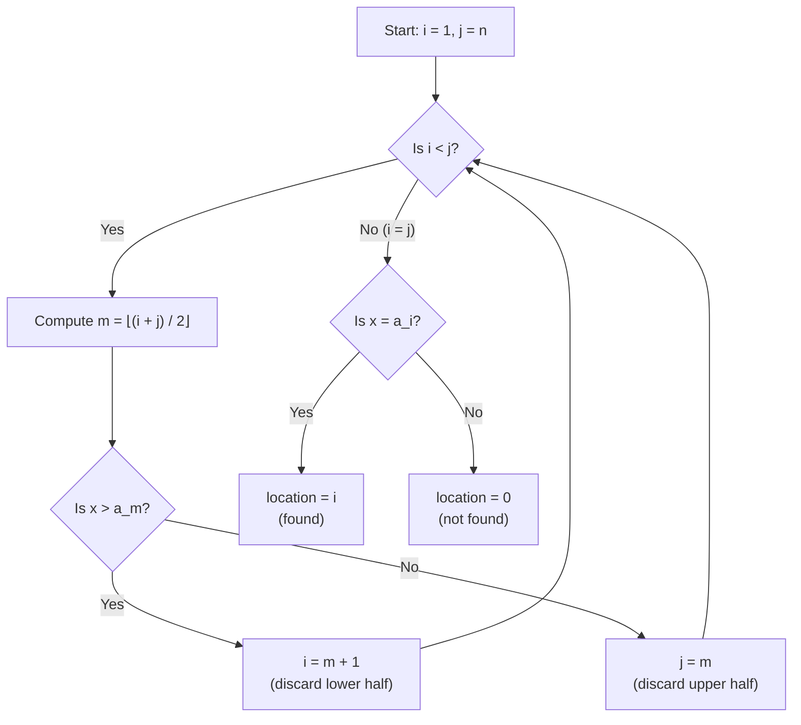
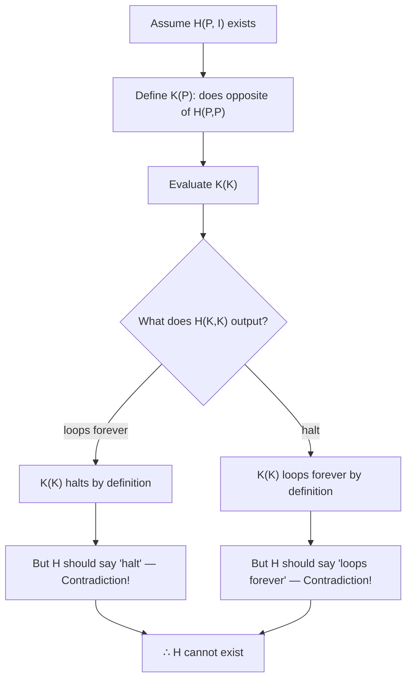

---
tags:
  - "#CCT2"
  - DS
Topic: "General introduction to algorithms and problem‑solving | Modeling problems using sets, functions, relations | Representation of algorithms (natural language, pseudocode, code) | Fundamental properties of algorithms: input, output, finiteness, correctness | Proofs of correctness: pre/postconditions, loop invariants | Illustrative algorithms: maximum search, linear search"
Semester: CCT2
Course: Diskrete strukturer
Litterature:
  - Discrete Mathematics and Its Applications - 8th Ed.
Created: 15-03-2026
---
- - -
# Table of Contents

1. [[#Algorithms and Algorithmic Analysis|Algorithms and Algorithmic Analysis]]
	1. [[#Algorithms and Algorithmic Analysis#Quick Reference|Quick Reference]]
	2. [[#Algorithms and Algorithmic Analysis#Algorithms — Foundations|Algorithms — Foundations]]
		1. [[#Algorithms — Foundations#Describing Algorithms|Describing Algorithms]]
		2. [[#Algorithms — Foundations#Properties of Algorithms|Properties of Algorithms]]
	3. [[#Algorithms and Algorithmic Analysis#Searching Algorithms|Searching Algorithms]]
		1. [[#Searching Algorithms#The Linear Search|The Linear Search]]
		2. [[#Searching Algorithms#The Binary Search|The Binary Search]]
	4. [[#Algorithms and Algorithmic Analysis#Sorting Algorithms|Sorting Algorithms]]
		1. [[#Sorting Algorithms#The Bubble Sort|The Bubble Sort]]
		2. [[#Sorting Algorithms#The Insertion Sort|The Insertion Sort]]
	5. [[#Algorithms and Algorithmic Analysis#String Matching|String Matching]]
		1. [[#String Matching#The Naive String Matcher|The Naive String Matcher]]
	6. [[#Algorithms and Algorithmic Analysis#Greedy Algorithms|Greedy Algorithms]]
		1. [[#Greedy Algorithms#The Cashier's Algorithm|The Cashier's Algorithm]]
			1. [[#The Cashier's Algorithm#Proving Optimality for Standard U.S. Coins|Proving Optimality for Standard U.S. Coins]]
		2. [[#Greedy Algorithms#Greedy Algorithm for Scheduling Talks|Greedy Algorithm for Scheduling Talks]]
	7. [[#Algorithms and Algorithmic Analysis#The Halting Problem|The Halting Problem]]
		1. [[#The Halting Problem#Proof That the Halting Problem Is Unsolvable|Proof That the Halting Problem Is Unsolvable]]
	8. [[#Algorithms and Algorithmic Analysis#Big-O Notation and Asymptotic Analysis|Big-O Notation and Asymptotic Analysis]]
		1. [[#Big-O Notation and Asymptotic Analysis#Motivation|Motivation]]
		2. [[#Big-O Notation and Asymptotic Analysis#Definition of Big-O|Definition of Big-O]]
		3. [[#Big-O Notation and Asymptotic Analysis#Big-O Estimates for Important Functions|Big-O Estimates for Important Functions]]
			1. [[#Big-O Estimates for Important Functions#Polynomials|Polynomials]]
			2. [[#Big-O Estimates for Important Functions#Factorials and Logarithms|Factorials and Logarithms]]
			3. [[#Big-O Estimates for Important Functions#The Standard Growth Hierarchy|The Standard Growth Hierarchy]]
		4. [[#Big-O Notation and Asymptotic Analysis#The Growth of Combinations of Functions|The Growth of Combinations of Functions]]
		5. [[#Big-O Notation and Asymptotic Analysis#Big-Omega and Big-Theta Notation|Big-Omega and Big-Theta Notation]]
	9. [[#Algorithms and Algorithmic Analysis#Algorithm Comparison Overview|Algorithm Comparison Overview]]

# Algorithms and Algorithmic Analysis

---
## Quick Reference

| Term / Symbol               | Description                                                                                                 |
| --------------------------- | ----------------------------------------------------------------------------------------------------------- |
| *Algorithm*                 | A finite sequence of precise instructions for performing a computation or solving a problem.                |
| *Pseudocode*                | An intermediate notation between English and a programming language, allowing any well-defined instruction. |
| *Linear Search*             | A search algorithm that checks each element sequentially; works on any list.                                |
| *Binary Search*             | A search algorithm that repeatedly halves a sorted list; much faster for large inputs.                      |
| *Bubble Sort*               | A sorting algorithm that repeatedly swaps adjacent out-of-order elements.                                   |
| *Insertion Sort*            | A sorting algorithm that builds a sorted sublist by inserting one element at a time.                        |
| *Naive String Matcher*      | A brute-force algorithm that checks every possible shift of a pattern within a text.                        |
| *Greedy Algorithm*          | An algorithm that makes the locally optimal choice at each step.                                            |
| *Halting Problem*           | The undecidable problem of determining whether a given program halts on a given input.                      |
| $O(g(x))$ — Big-O           | $f(x)$ grows **no faster** than $g(x)$. Upper bound. $                                                      |
| $\Omega(g(x))$ — Big-Omega  | $f(x)$ grows **at least as fast** as $g(x)$. Lower bound. $                                                 |
| $\Theta(g(x))$ — Big-Theta  | $f(x)$ grows **at the same rate** as $g(x)$. Tight bound. Both $O$ and $\Omega$ hold simultaneously.        |
| $C, k$ — *Witnesses*        | The constants that prove a big-O (or $\Omega$) relationship holds.                                          |
| $\lfloor x \rfloor$ — Floor | The greatest integer not exceeding $x$.                                                                     |
| $\lceil x \rceil$ — Ceiling | The smallest integer greater than or equal to $x$.                                                          |
| $n!$ — Factorial            | The product $1 \cdot 2 \cdot 3 \cdots n$. Grows faster than any exponential.                                |
| Common growth ordering      | $1 < \log n < n < n\log n < n^2 < 2^n < n!$                                                                 |

_Table 0.1: Quick reference of key terms, symbols, and asymptotic notations used throughout this note._

>[!abstract] **Roadmap**
> This note covers three interconnected topics. First, we define what an *algorithm* is and survey the most important categories — **searching**, **sorting**, **string matching**, and **greedy** algorithms — examining concrete examples of each. Second, we encounter a fundamental *limit* of computation: the **halting problem**, which proves that some problems are inherently unsolvable by any algorithm. Third, we develop the mathematical language — **big-O**, **big-Omega**, and **big-Theta** notation — needed to *measure* and *compare* the efficiency of algorithms as their input grows. Together, these topics answer three questions: *What can we compute? How do we compute it? And how fast can we compute it?*

---

## Algorithms — Foundations

Many problems can be solved by considering them as special cases of general problems. For instance: given a sequence of integers, find the largest one; given a set, list all its subsets; given a set of integers, put them in increasing order; given a network, find the shortest path between two vertices.

When presented with such a problem, the first step is to construct a _model_ that translates the problem into a mathematical context. Discrete Structures used in such models include sets, sequences, functions, permutations, relations, graphs, trees, networks, and finite state machines.

Setting up the appropriate mathematical model is only part of the solution. To complete it, a method is needed that will solve the general problem using the model — ideally, a procedure that follows a sequence of steps leading to the desired answer. Such a sequence of steps is called an *algorithm*.

>[!info] **Definition: Algorithm**
> An *algorithm* is a finite sequence of precise instructions for performing a computation or for solving a problem.

The term *algorithm* is a corruption of the name *al-Khowarizmi*, a ninth-century mathematician whose book on Hindu numerals is the basis of modern decimal notation. With the growing interest in computing machines, the concept was given a more general meaning to include all definite procedures for solving problems, not just procedures for performing arithmetic.
### Describing Algorithms

An algorithm can be described in several ways:

1. **Plain English** — A step-by-step description in natural language.
2. **Programming language** — Precise but restricts the description to one language's syntax, often making the algorithm complicated and hard to understand.
3. **Pseudocode** — An intermediate step between English and code. It uses instructions resembling programming languages but allows any well-defined operation, regardless of how many lines of actual code it would take to implement.

Pseudocode is the preferred method for algorithm description because it is precise enough to be unambiguous yet flexible enough to remain readable across disciplines.

>[!example] **Finding the Maximum Value in a Finite Sequence — English Description**
> 1. Set the *temporary maximum* equal to the first integer in the sequence.
> 2. Compare the next integer to the temporary maximum; if it is larger, update the temporary maximum.
> 3. Repeat the previous step if there are more integers.
> 4. Stop when there are no integers left. The temporary maximum is the answer.

>[!info] **Algorithm 1: Finding the Maximum Element (`max`)**
> ```
> procedure max(a1, a2, ..., an : integers)
>     max := a1
>     for i := 2 to n
>         if max < ai then max := ai
>     return max
> ```
> This algorithm assigns $a_1$ to `max`, then iterates through the remaining elements. If any element exceeds the current `max`, it becomes the new `max`. After all $n$ elements have been examined, the final value of `max` is returned.

To gain insight into how an algorithm works, it is useful to construct a *trace* — a step-by-step walkthrough with specific input.

>[!example] **Trace of Algorithm 1 with Input: 8, 4, 11, 3, 10**
> 1. `max` is set to $8$ (the first term).
> 2. Compare $4$ with $8$. Since $4 \leq 8$, `max` is unchanged.
> 3. Compare $11$ with $8$. Since $8 < 11$, `max` is updated to $11$.
> 4. Compare $3$ with $11$. Since $3 \leq 11$, `max` is unchanged.
> 5. Compare $10$ with $11$. Since $10 \leq 11$, `max` is unchanged.
>
> After examining all $5$ terms, the algorithm terminates with `max = 11`.

---

### Properties of Algorithms

There are several properties that algorithms generally share. These are useful to keep in mind whenever algorithms are described or evaluated:

| Property          | Description                                                                                        |
| ----------------- | -------------------------------------------------------------------------------------------------- |
| **Input**         | An algorithm has input values from a specified set.                                                |
| **Output**        | From each set of input values, the algorithm produces output values — the solution to the problem. |
| **Definiteness**  | The steps must be defined precisely; there can be no ambiguity.                                    |
| **Correctness**   | The algorithm should produce the expected output for each set of valid input values.               |
| **Finiteness**    | The algorithm should terminate after a finite number of steps for any valid input.                 |
| **Effectiveness** | Each step must be performable exactly, in a finite amount of time.                                 |
| **Generality**    | The procedure should apply to all problems of the desired form, not just one particular input.     |

_Table 1.1: The seven standard properties of an algorithm._

>[!example] **Verifying Properties for the `max` Algorithm**
> - **Input:** A finite sequence of integers.
> - **Output:** The largest integer in the sequence.
> - **Definiteness:** Each step is precisely defined — only assignments, a finite loop, and conditional statements are used.
> - **Correctness:** `max` is initialized to $a_1$ and updated whenever a larger element is found; after all terms are examined, it equals the largest. (Rigorous proof requires [[Mathematical Induction]].)
> - **Finiteness:** The loop runs exactly $n - 1$ times and then terminates.
> - **Effectiveness:** Each step is either a comparison or an assignment — both executable exactly in finite time.
> - **Generality:** Works for any finite sequence of integers.

P to S to Q explanation - slides
Algorithm Correctness - slides
proof of partial correctness - slides
	loop invariant to prove loops - slides
prove correctness of MAX algo. - slides


---

## Searching Algorithms

The problem of locating an element in a list occurs in many contexts — checking spelling in a dictionary, looking up records in a database, verifying membership in a set. These are all instances of *searching problems*.

The general searching problem: given a list of distinct elements $a_1, a_2, \ldots, a_n$, locate an element $x$ in the list (returning its position $i$ if $x = a_i$) or determine that it is not present (returning $0$).

### The Linear Search

The *linear search* (or *sequential search*) compares $x$ with each element of the list one by one, starting from the beginning, until a match is found or the end of the list is reached.

>[!info] **Algorithm 2: The Linear Search**
> ```
> procedure linear_search(x: integer, a1, a2, ..., an: distinct integers)
>     i := 1
>     while (i ≤ n and x ≠ ai)
>         i := i + 1
>     if i ≤ n then location := i
>     else location := 0
>     return location
> ```
> The algorithm steps through the list one element at a time. If $x = a_i$ for some $i$, the `while` loop exits and `location` is set to $i$. If the loop completes without finding a match ($i > n$), `location` is set to $0$.

The linear search makes no assumptions about the ordering of the list. In the worst case, it examines all $n$ elements.

---

### The Binary Search

The *binary search* algorithm is dramatically more efficient, but it requires that the list be **sorted** in increasing order. It works by repeatedly comparing $x$ to the *middle* element of the current search interval and halving the interval.

The procedure: to search for $x$ in $a_1 < a_2 < \cdots < a_n$, compare $x$ with the middle term $a_m$, where $m = \lfloor(i + j)/2\rfloor$ and $i, j$ are the current interval endpoints.

- If $x > a_m$, restrict the search to the upper half: $a_{m+1}, \ldots, a_j$.
- If $x \leq a_m$, restrict the search to the lower half: $a_i, \ldots, a_m$.

This halving continues until a single element remains, at which point a final comparison determines whether it equals $x$.

>[!example] **Binary Search: Searching for $19$**
> Given the sorted list of $16$ terms: **1, 2, 3, 5, 6, 7, 8, 10, 12, 13, 15, 16, 18, 19, 20, 22**
>
> 1. Split into two halves of $8$: **{1 2 3 5 6 7 8 10}** and **{12 13 15 16 18 19 20 22}**. Largest of first half is $10$. Since $10 < 19$, search the second half (terms $9$–$16$).
> 2. Split **{12 13 15 16 18 19 20 22}** into halves of $4$: **{12 13 15 16}** and **{18 19 20 22}**. Largest of first half is $16$. Since $16 < 19$, search the second half (terms $13$–$16$).
> 3. Split **{18 19 20 22}** into halves of $2$: **{18 19}** and **{20 22}**. Largest of first half is $19$. Since $19 \leq 19$, search the first half (terms $13$–$14$).
> 4. Split **{18 19}** into singletons: **{18}** and **{19}**. Since $18 < 19$, search the second list (term $14$).
> 5. One element remains. Comparison confirms term $14$ is $19$. **Result: `location = 14`.**

>[!info] **Algorithm 3: The Binary Search**
> ```
> procedure binary_search(x: integer, a1, a2, ..., an: increasing integers)
>     i := 1
>     j := n
>     while i < j
>         m := ⌊(i + j) / 2⌋
>         if x > am then i := m + 1
>         else j := m
>     if x = ai then location := i
>     else location := 0
>     return location
> ```
> Variables $i$ and $j$ track the left and right endpoints of the search interval. At each iteration, $m$ is the midpoint. If $x$ exceeds $a_m$, the lower half is discarded; otherwise, the upper half is discarded. The loop terminates when $i = j$, leaving exactly one candidate element.



_Figure 2.1: Flowchart of the binary search algorithm, showing how the search interval $[i, j]$ is halved at each iteration until a single candidate element remains._

---

## Sorting Algorithms

*Sorting* is putting the elements of a list into increasing order — for instance, transforming **7, 2, 1, 4, 5, 9** into **1, 2, 4, 5, 7, 9**, or alphabetizing **d, h, c, a, f** into **a, c, d, f, h**.

Sorting is one of the most heavily studied problems in computer science. An amazingly large percentage of computing resources is devoted to it, and more than $100$ distinct sorting algorithms have been devised. Interest stems from multiple factors: some algorithms are easier to implement, some are more efficient in general or for particular input characteristics (e.g., nearly-sorted lists), some exploit particular hardware architectures, and some are simply particularly clever.

### The Bubble Sort

The *bubble sort* is one of the simplest sorting algorithms, though not one of the most efficient. It works by repeatedly scanning the list, comparing adjacent elements, and swapping them if they are in the wrong order. The name comes from the idea that smaller elements "bubble" toward the top of the list through successive swaps.

Each full pass through the list guarantees that the next-largest unsorted element reaches its correct final position. After $n - 1$ passes, the entire list is sorted.

>[!example] **Bubble Sort: Sorting 3, 2, 4, 1, 5**
> **First pass:**
> - Compare $3$ and $2$: $3 > 2$, swap → **2, 3, 4, 1, 5**
> - Compare $3$ and $4$: $3 < 4$, no swap
> - Compare $4$ and $1$: $4 > 1$, swap → **2, 3, 1, 4, 5**
> - Compare $4$ and $5$: $4 < 5$, no swap
> - *Result: $5$ is now in its correct position.*
>
> **Second pass:**
> - Compare $2$ and $3$: $2 < 3$, no swap
> - Compare $3$ and $1$: $3 > 1$, swap → **2, 1, 3, 4, 5**
> - Compare $3$ and $4$: $3 < 4$, no swap
> - *Result: $4$ and $5$ are in their correct positions.*
>
> **Third pass:**
> - Compare $2$ and $1$: $2 > 1$, swap → **1, 2, 3, 4, 5**
> - Compare $2$ and $3$: $2 < 3$, no swap
> - *Result: $3$, $4$, and $5$ are in their correct positions.*
>
> **Fourth pass:**
> - Compare $1$ and $2$: $1 < 2$, no swap
> - *Result: sort complete.* → **1, 2, 3, 4, 5**

![[Pasted image 20260315182110.png]]

_Figure 3.1: Visual trace of the bubble sort algorithm sorting the sequence 3, 2, 4, 1, 5._

>[!info] **Algorithm 4: The Bubble Sort**
> ```
> procedure bubblesort(a1, ..., an : real numbers with n ≥ 2)
>     for i := 1 to n − 1
>         for j := 1 to n − i
>             if aj > aj+1 then
>                 interchange aj and aj+1
> ```
> The outer loop runs $n - 1$ passes. In each pass $i$, the inner loop compares adjacent pairs from position $1$ to $n - i$ (because the last $i$ elements are already sorted). Any out-of-order pair is swapped.

---

### The Insertion Sort

The *insertion sort* builds up a sorted portion of the list one element at a time. At each step $j$, the $j$-th element is inserted into its correct position among the previously sorted first $j - 1$ elements by using a linear search to find the insertion point, then shifting elements to make room.

>[!example] **Insertion Sort: Sorting 3, 2, 4, 1, 5**
> Starting list: **3, 2, 4, 1, 5** (sorted portion is highlighted)
>
> **Step 1 — Insert $2$:**
> Compare $2$ with $3$: $2 < 3$, place $2$ before $3$ → **==2, 3==, 4, 1, 5**
>
> **Step 2 — Insert $4$:**
> Compare $4$ with $2$, then $3$: $4 > 3$, so $4$ stays → **==2, 3, 4==, 1, 5**
>
> **Step 3 — Insert $1$:**
> Compare $1$ with $2$: $1 < 2$, place $1$ before $2$ → **==1, 2, 3, 4==, 5**
>
> **Step 4 — Insert $5$:**
> Compare $5$ with $1, 2, 3, 4$: $5 > 4$, so $5$ stays → **==1, 2, 3, 4, 5==** — sort complete.

>[!info] **Algorithm 5: The Insertion Sort**
> ```
> procedure insertion_sort(a1, a2, ..., an : real numbers with n ≥ 2)
>     for j := 2 to n
>         i := 1
>         while aj > ai
>             i := i + 1
>         m := aj
>         for k := 0 to j − i − 1
>             aj−k := aj−k−1
>         ai := m
> ```
>
> - **Breakdown:**
>     - $j$ : The index of the element currently being inserted. Starts at $2$ (the second element) and increments to $n$.
>     - $i$ : The position index used to find where $a_j$ belongs among the already-sorted elements $a_1, \ldots, a_{j-1}$. The `while` loop increments $i$ until it finds the first element $a_i$ that is not less than $a_j$.
>     - $m$ : A temporary variable that stores the value of $a_j$ before the shifting begins, preventing it from being overwritten.
>     - $k$ : A loop variable used to shift elements $a_i, a_{i+1}, \ldots, a_{j-1}$ one position to the right to create a gap at position $i$.
>     - After shifting, the stored value $m$ is placed at position $i$, completing the insertion.

---

## String Matching

Beyond searching and sorting, another fundamental problem in computer science is *string matching*: given a *pattern* string $P$ and a *text* string $T$, find all positions where $P$ occurs within $T$.

For instance, the pattern `101` occurs within the text `11001011` at a *shift* of $4$ characters (positions $5$, $6$, $7$). The pattern `111` does *not* occur within `110110001101`.

String matching plays an essential role in many applications:

- Text editing (find and replace)
- Spam filters and network intrusion detection
- Search engines (matching keywords to web page content)
- Plagiarism detection
- Bioinformatics (DNA sequencing — finding subsequences in genomes of $\sim 3 \times 10^9$ characters)

### The Naive String Matcher

The *naive string matcher* is a brute-force approach. It takes a pattern $P = p_1 p_2 \ldots p_m$ and text $T = t_1 t_2 \ldots t_n$, and checks every possible shift $s$ from $0$ to $n - m$. When the pattern begins at position $s + 1$ in the text, we say $P$ occurs with *shift* $s$ — meaning $t_{s+1} = p_1, \; t_{s+2} = p_2, \; \ldots, \; t_{s+m} = p_m$.

>[!info] **Algorithm 6: The Naive String Matcher**
> ```
> procedure string_match(n, m: positive integers, m ≤ n,
>                        t1, t2, ..., tn, p1, p2, ..., pm: characters)
>     for s := 0 to n − m
>         j := 1
>         while (j ≤ m and t[s+j] = p[j])
>             j := j + 1
>         if j > m then
>             print "s is a valid shift"
> ```
>
> - $n$ : Length of the text $T$.
> - $m$ : Length of the pattern $P$.
> - $s$ : The current shift being tested — the pattern alignment starts at position $s + 1$ in the text.
> - $j$ : Index iterating through characters of the pattern during comparison.
> - The outer `for` loop tries every possible starting position ($s = 0$ to $n - m$).
> - The inner `while` loop compares characters one by one. If all $m$ characters match ($j > m$ after the loop), shift $s$ is valid.

![[Pasted image 20260315184125.png]]

_Figure 4.1: Illustration of the naive string matching algorithm checking each possible shift of the pattern against the text._

Many more efficient string matching algorithms exist (e.g., Knuth-Morris-Pratt, Boyer-Moore, Rabin-Karp), each using different strategies to avoid redundant comparisons.

---

## Greedy Algorithms

Many algorithms are designed to solve *optimization problems* — problems where the goal is to find a solution that either minimizes or maximizes the value of some parameter. Examples include finding the shortest route between cities, encoding messages using the fewest bits, or connecting network nodes with minimal cable.

A *greedy algorithm* takes the simplest approach: at each step, it selects the option that appears to be the best *at that moment*, without considering future consequences.

>[!important] **Greedy Algorithms and Optimality**
> The term "greedy" describes the algorithm's strategy, **not** its correctness. A greedy algorithm always produces a *feasible* solution, but that solution may not be *optimal*. To verify optimality, we must either **prove** that the greedy choice always leads to a global optimum, or **show a counterexample** where it fails.

---

### The Cashier's Algorithm

The *cashier's algorithm* is a classic greedy algorithm for making change using the fewest coins. The strategy: at each step, choose the coin of the largest denomination that does not exceed the remaining amount.

>[!example] **Making Change for $67$ Cents (Quarters, Dimes, Nickels, Pennies)**
> 1. Select a quarter → $67 - 25 = 42$ cents remaining
> 2. Select a quarter → $42 - 25 = 17$ cents remaining
> 3. Select a dime → $17 - 10 = 7$ cents remaining
> 4. Select a nickel → $7 - 5 = 2$ cents remaining
> 5. Select a penny → $2 - 1 = 1$ cent remaining
> 6. Select a penny → $1 - 1 = 0$ cents remaining
>
> **Result:** $2$ quarters, $1$ dime, $1$ nickel, $2$ pennies = $6$ coins total.

>[!info] **Algorithm 7: The Cashier's Algorithm**
> ```
> procedure change(c1, c2, ..., cr: values of denominations,
>                  where c1 > c2 > ... > cr;
>                  n: a positive integer)
>     for i := 1 to r
>         d_i := 0
>         while n ≥ c_i
>             d_i := d_i + 1
>             n := n − c_i
> ```
>
> - $c_1, c_2, \ldots, c_r$ : Coin denominations sorted in decreasing order.
> - $r$ : The number of distinct denominations.
> - $n$ : The amount of change to be made (in cents).
> - $d_i$ : Counter for the number of coins of denomination $c_i$ used.
> - The outer loop iterates from the largest denomination to the smallest. The inner loop repeatedly selects coins of the current denomination until doing so would exceed the remaining amount.

>[!warning] **The Cashier's Algorithm Can Fail for Non-Standard Denominations**
> With only quarters ($25$¢), dimes ($10$¢), and pennies ($1$¢) — no nickels — the algorithm makes change for $30$ cents using $6$ coins ($1$ quarter + $5$ pennies). But $3$ dimes would make $30$ cents using only $3$ coins. The greedy approach fails because it cannot "look ahead" to find a better combination.

#### Proving Optimality for Standard U.S. Coins

For the standard denominations ($25, 10, 5, 1$), the cashier's algorithm *is* optimal. The proof proceeds via a lemma and then a theorem, both using proof by contradiction.

>[!summary] **Lemma: Constraints on Optimal Change**
> If $n$ is a positive integer, then change for $n$ cents using the **fewest coins possible** (from quarters, dimes, nickels, and pennies) has:
> - At most $2$ dimes
> - At most $1$ nickel
> - At most $4$ pennies
> - **Cannot** have $2$ dimes and $1$ nickel simultaneously
>
> Consequently, the total value from dimes, nickels, and pennies cannot exceed $24$ cents.
>
> **Proof:**
> By contradiction — if we exceeded any of these limits, we could replace coins with fewer coins of equal value:
> - $3$ dimes → $1$ quarter + $1$ nickel ($3$ coins → $2$ coins)
> - $2$ nickels → $1$ dime ($2$ → $1$)
> - $5$ pennies → $1$ nickel ($5$ → $1$)
> - $2$ dimes + $1$ nickel → $1$ quarter ($3$ → $1$)
>
> Since the maximum without violating these constraints is $20 + 0 + 4 = 24$ cents from non-quarter coins. $\blacksquare$

>[!summary] **Theorem: Optimality of the Cashier's Algorithm (Standard U.S. Coins)**
> The cashier's algorithm always makes change using the fewest coins possible when using quarters, dimes, nickels, and pennies.
>
> **Proof:**
> Assume for contradiction that some alternative method uses fewer coins than the greedy algorithm for some amount $n$.
>
> Let $q'$ and $q$ be the number of quarters in the alternative and greedy solutions respectively. Since the greedy algorithm uses the maximum number of quarters, $q' \leq q$. But $q' < q$ is impossible: the alternative would need to cover at least $25$ cents from dimes, nickels, and pennies alone, contradicting the Lemma (at most $24$ cents from those coins). So $q' = q$.
>
> With equal quarters, the remaining amounts are equal (at most $24$ cents). By the same logic applied to dimes, then nickels, then pennies, every coin count must be identical — contradicting the assumption that fewer coins were used. $\blacksquare$

---

### Greedy Algorithm for Scheduling Talks

Another classic application of greedy algorithms: given a set of proposed talks with preset start times $s_j$ and end times $e_j$, schedule as many talks as possible in a single lecture hall, with no two talks overlapping (though a talk may begin at the same time another ends).

The choice of greedy criterion matters enormously:

| Criterion | Strategy | Optimal? |
|---|---|---|
| Earliest start time | Select the talk that starts earliest | **No** — a long early talk can block multiple shorter talks |
| Shortest duration | Select the shortest talk | **No** — a short talk in the middle can block two non-overlapping talks |
| Earliest finish time | Select the talk that finishes earliest | **Yes** — maximizes remaining time for future talks |

_Table 5.1: Comparison of greedy criteria for the talk scheduling problem._

>[!example] **Counterexample: Earliest Start Time Fails**
> Talk 1 (8:00–12:00), Talk 2 (9:00–10:00), Talk 3 (11:00–12:00). Greedy selects Talk 1 first, blocking both Talk 2 and Talk 3. But scheduling Talk 2 + Talk 3 yields $2$ talks instead of $1$.

>[!example] **Counterexample: Shortest Duration Fails**
> Talk 1 (8:00–9:15), Talk 2 (9:00–10:00), Talk 3 (9:45–11:00). Greedy selects Talk 2 (shortest, $1$ hour), blocking both Talk 1 and Talk 3. But scheduling Talk 1 + Talk 3 yields $2$ talks instead of $1$.

The correct criterion — *earliest finish time* — works because by finishing as early as possible, we leave the maximum remaining time for additional talks.

>[!info] **Algorithm 8: Greedy Talk Scheduling**
> ```
> procedure schedule(s1, s2, ..., sn: start times,
>                    e1, e2, ..., en: end times)
>     sort talks by finish time so that e1 ≤ e2 ≤ ... ≤ en
>     S := ∅
>     for j := 1 to n
>         if talk j is compatible with S then
>             S := S ∪ {talk j}
>     return S
> ```
>
> - $s_j, e_j$ : The start and end times of talk $j$.
> - $n$ : Total number of proposed talks.
> - $S$ : The set of scheduled talks, initially empty.
> - $\cup$ : Set union — adds an element to $S$.
> - A talk is *compatible* with $S$ if it does not overlap with any talk already in $S$ (i.e., it starts at or after the end time of the last scheduled talk).

---

## The Halting Problem

One of the most profound results in computer science is that there exist *unsolvable problems* — problems for which no algorithm can ever be constructed. The most famous example is the **halting problem**.

>[!info] **The Halting Problem**
> Given a computer program $P$ and an input $I$ to that program, is there a procedure that can determine whether $P$ will eventually stop (halt) when run with input $I$?

Such a procedure would be extremely valuable for software development — it would let us detect infinite loops automatically. However, simply running the program and observing what happens is insufficient: if the program halts, we know the answer, but if it is still running after any finite time, we cannot distinguish "will never halt" from "haven't waited long enough." Programs can be designed to halt only after billions of years.

![[Pasted image 20260315184855.png]]

_Figure 6.1: Conceptual illustration of the halting problem — the challenge of determining whether a program will halt or run forever._

---

### Proof That the Halting Problem Is Unsolvable

This proof, due to [[Alan Turing]], uses *proof by contradiction* combined with *self-reference*.

>[!summary] **Theorem: The Halting Problem Is Unsolvable**
> There is no procedure that can determine, for every program $P$ and input $I$, whether $P$ halts when run with input $I$.
>
> **Proof:**
>
> **Step 1 — Assume a solution exists.** Suppose there exists a procedure $H(P, I)$ that outputs `"halt"` if program $P$ stops on input $I$, and `"loops forever"` if $P$ runs forever on input $I$.
>
> **Step 2 — A program can be its own input.** Since a program is just a string of characters (bits), it can be provided as input to itself. Therefore $H(P, P)$ is a valid call — it asks whether $P$ halts when given *itself* as input.
>
> **Step 3 — Construct a contradictory procedure $K$.** Define $K(P)$ as follows:
> - If $H(P, P)$ outputs `"loops forever"` → $K(P)$ **halts**.
> - If $H(P, P)$ outputs `"halt"` → $K(P)$ **loops forever**.
>
> $K$ does the *opposite* of what $H$ predicts.
>
> **Step 4 — Feed $K$ to itself.** Evaluate $K(K)$:
> - **Case 1:** $H(K, K)$ outputs `"loops forever"` → by definition, $K(K)$ halts → but then $H(K,K)$ should have output `"halt"` — **contradiction**.
> - **Case 2:** $H(K, K)$ outputs `"halt"` → by definition, $K(K)$ loops forever → but then $H(K,K)$ should have output `"loops forever"` — **contradiction**.
>
> Both cases yield contradictions. Therefore, $H$ cannot exist. $\blacksquare$

>[!tip] **Intuition Behind the Proof**
> The key insight is *self-reference*. Procedure $K$ is specifically designed to contradict whatever $H$ predicts about it — no matter what $H$ says $K$ will do when given itself as input, $K$ does the opposite. This is structurally similar to the liar's paradox ("This statement is false") and to [[Cantor's Diagonal Argument]] in set theory.



_Figure 6.2: Flowchart of the proof by contradiction for the unsolvability of the halting problem._

---

## Big-O Notation and Asymptotic Analysis

### Motivation

The study of algorithms often focuses on counting the number of operations they use — for example, the number of comparisons a searching or sorting algorithm needs to process $n$ elements.

The actual *time* required depends on hardware and software, but changing the platform only affects the time by a *constant multiplier*. A supercomputer may be a million times faster than a PC, but that factor doesn't change based on $n$. The critical insight: the **growth rate** of operations as $n$ increases is what truly matters, not the constant factors.

*Big-O notation* provides a way to estimate the growth of a function while ignoring constant multipliers and smaller-order terms. Its practical advantages:

- **Hardware/software independence** — constant factors are ignored.
- **Simplified analysis** — all basic operations assumed to take the same time.
- **Algorithm comparison** — determines which algorithm is more efficient as input grows.

>[!example] **Why Growth Rate Matters More Than Constant Factors**
> Consider two algorithms for the same problem:
> - Algorithm A: $100n^2 + 17n + 4$ operations
> - Algorithm B: $n^3$ operations
>
> For $n = 10$, Algorithm B uses fewer operations ($1{,}000$ vs. $10{,}174$). But for $n = 10{,}000$, Algorithm A uses about $10^9$ operations while Algorithm B uses $10^{12}$ — a thousand times more. As $n$ grows, $n^2$ versus $n^3$ is all that matters.

---

### Definition of Big-O

>[!summary] **Definition: Big-O Notation**
> Let $f$ and $g$ be functions from the integers or reals to the reals. We say $f(x)$ is $O(g(x))$ if there exist constants $C$ and $k$ such that:
> $$|f(x)| \leq C|g(x)| \quad \text{whenever } x > k$$
>
> **Breakdown:**
> - $f(x)$ : The function whose growth we want to analyze.
> - $g(x)$ : The reference function we are comparing against.
> - $C$ : A positive constant multiplier — it "scales up" $g(x)$ to create an upper bound.
> - $k$ : A threshold value — the inequality only needs to hold for all $x$ beyond this point.
> - $|\ |$ : Absolute value, ensuring we compare magnitudes.

>[!tip]
> Intuitively, $f(x)$ is $O(g(x))$ means $f(x)$ grows **no faster** than some fixed multiple of $g(x)$ as $x$ grows without bound.

The constants $C$ and $k$ are called ***witnesses*** to the relationship. To establish that $f(x)$ is $O(g(x))$, we need only find **one** valid pair. However, once one pair exists, *infinitely many* pairs work — any $C' > C$ and $k' > k$ are also valid witnesses.

>[!note]
> The notation $f(x) = O(g(x))$ is sometimes used, but the equals sign does **not** represent genuine equality. More precisely, $f(x) \in O(g(x))$, since $O(g(x))$ represents the *set* of all functions bounded by $g(x)$.

A useful approach for finding witnesses: first select a value of $k$ for which $|f(x)|$ can be readily estimated, then determine a value of $C$ such that $|f(x)| \leq C|g(x)|$ for all $x > k$.

>[!example] **Show that $f(x) = x^2 + 2x + 1$ is $O(x^2)$**
> **Approach 1:** When $x > 1$, we have $x < x^2$ and $1 < x^2$, so:
> $$0 \leq x^2 + 2x + 1 \leq x^2 + 2x^2 + x^2 = 4x^2$$
> Witnesses: $C = 4$, $k = 1$.
>
> **Approach 2:** When $x > 2$, we have $2x \leq x^2$ and $1 \leq x^2$, so:
> $$0 \leq x^2 + 2x + 1 \leq x^2 + x^2 + x^2 = 3x^2$$
> Witnesses: $C = 3$, $k = 2$.

When two functions satisfy $f(x)$ is $O(g(x))$ *and* $g(x)$ is $O(f(x))$, they are said to be of ***the same order***.

Since $g(x)$ can be replaced by any function with larger values for sufficiently large $x$, we typically choose $g(x)$ to be the function with the **smallest growth rate** from a set of common reference functions. In practice, we almost always deal with positive-valued functions, so absolute values can be dropped.

>[!example] **Show that $7x^2$ is $O(x^3)$**
> When $x > 7$: $7x^2 < x^3$ (multiply $x > 7$ by $x^2$). Witnesses: $C = 1$, $k = 7$.
>
> Alternatively, when $x > 1$: $7x^2 < 7x^3$. Witnesses: $C = 7$, $k = 1$.
>
> Note: $7x^2$ is also $O(x^2)$, which is the *tightest* big-O estimate using a power of $x$.

>[!example] **Show that $n^2$ is NOT $O(n)$**
> Proof by contradiction. Suppose $\exists\; C, k$ such that $n^2 \leq Cn$ whenever $n > k$. Dividing by $n$ (for $n > 0$): $n \leq C$. But no constant $C$ can bound $n$ for *all* $n > k$ — once $n > \max(k, C)$, the inequality fails. Contradiction.

---

### Big-O Estimates for Important Functions

#### Polynomials

The leading term of a polynomial dominates its growth.

>[!summary] **Theorem: Polynomial Growth**
> Let $f(x) = a_n x^n + a_{n-1} x^{n-1} + \cdots + a_1 x + a_0$, where $a_0, \ldots, a_n$ are real numbers. Then $f(x)$ is $O(x^n)$.
>
> **Breakdown:**
> - $a_n, \ldots, a_0$ : The real-valued coefficients of the polynomial.
> - $x^n$ : The highest-degree (leading) term, which dominates growth.
> - $C = |a_n| + |a_{n-1}| + \cdots + |a_0|$ : The witness constant (sum of absolute values of all coefficients).
> - $k = 1$ : The witness threshold.
>
> **Proof:**
> For $x > 1$, using the triangle inequality:
> $$|f(x)| \leq |a_n|x^n + |a_{n-1}|x^{n-1} + \cdots + |a_1|x + |a_0|$$
> $$= x^n \left( |a_n| + \frac{|a_{n-1}|}{x} + \cdots + \frac{|a_0|}{x^n} \right) \leq x^n(|a_n| + |a_{n-1}| + \cdots + |a_0|)$$
> since each $\frac{|a_i|}{x^j} \leq |a_i|$ when $x > 1$. $\blacksquare$

#### Factorials and Logarithms

>[!example] **Big-O Estimates for $n!$ and $\log n!$**
> **For $n!$:** Each factor in $n! = 1 \cdot 2 \cdots n$ is at most $n$, so:
> $$n! \leq n^n \implies n! \text{ is } O(n^n) \quad (C = 1, \; k = 1)$$
>
> **For $\log n!$:** Taking logarithms:
> $$\log n! \leq \log n^n = n\log n \implies \log n! \text{ is } O(n\log n)$$

>[!example] **$n$ is $O(2^n)$ and $\log n$ is $O(n)$**
> Since $n < 2^n$ for all positive $n$: $n$ is $O(2^n)$ with $C = 1$, $k = 1$.
>
> Taking base-$2$ logarithms: $\log n < n$, so $\log n$ is $O(n)$ with $C = 1$, $k = 1$.
>
> For logarithms in base $b \neq 2$: $\log_b n = \frac{\log n}{\log b} < \frac{n}{\log b}$, giving witnesses $C = \frac{1}{\log b}$, $k = 1$.

---

#### The Standard Growth Hierarchy

The functions most commonly used in big-O estimates, listed from **slowest** to **fastest** growing:

$$1, \quad \log n, \quad n, \quad n \log n, \quad n^2, \quad 2^n, \quad n!$$

Each function is smaller than the next in the sense that their ratio tends to zero as $n \to \infty$.

![[Pasted image 20260315185647.png]]

_Figure 7.1: Graphs of the common functions used in big-O estimates, plotted on a logarithmic vertical scale._

The key relationships, summarized:

| Relationship | Description |
|---|---|
| $n^c$ is $O(n^d)$ for $d > c > 1$ | Higher powers of $n$ grow faster; lower powers are big-O of higher. |
| $(\log_b n)^c$ is $O(n^d)$ for $d > 0$ | Every power of $\log$ grows slower than every positive power of $n$. |
| $n^d$ is $O(b^n)$ for $b > 1$ | Every polynomial grows slower than every exponential. |
| $b^n$ is $O(c^n)$ for $c > b > 1$ | Exponentials with smaller bases grow slower than those with larger bases. |
| $c^n$ is $O(n!)$ for $c > 1$ | Factorials grow faster than any exponential. |

_Table 7.1: Key big-O relationships between common families of functions._

>[!example] **Ordering Functions by Growth Rate**
> Arrange: $f_1 = 8\sqrt{n}$, $f_2 = (\log n)^2$, $f_3 = 2n\log n$, $f_4 = n!$, $f_5 = (1.1)^n$, $f_6 = n^2$
>
> 1. $(\log n)^2$ — powers of $\log$ grow slowest
> 2. $8\sqrt{n} = 8n^{1/2}$ — a power of $n$ (exponent $\frac{1}{2}$)
> 3. $2n\log n$ — faster than $n$ but slower than $n^c$ for any $c > 1$
> 4. $n^2$ — a power of $n$ (exponent $2$)
> 5. $(1.1)^n$ — exponential (base $> 1$), faster than any polynomial
> 6. $n!$ — factorial, faster than any exponential
>
> **Final ordering:** $(\log n)^2, \; 8\sqrt{n}, \; 2n\log n, \; n^2, \; (1.1)^n, \; n!$

---

### The Growth of Combinations of Functions

Many algorithms consist of multiple subprocedures. To estimate the total number of operations, we need rules for how big-O estimates combine under addition and multiplication.

Suppose $f_1(x)$ is $O(g_1(x))$ and $f_2(x)$ is $O(g_2(x))$, witnessed by constants $C_1, k_1$ and $C_2, k_2$ respectively.

>[!summary] **Theorem: Big-O of a Sum**
> $(f_1 + f_2)(x)$ is $O(g(x))$, where $g(x) = \max(|g_1(x)|, |g_2(x)|)$.
>
> **Breakdown:**
> - $g(x) = \max(|g_1(x)|, |g_2(x)|)$ : The larger bounding function dominates the sum.
> - $C = C_1 + C_2$ : The witness constant.
> - $k = \max(k_1, k_2)$ : The witness threshold.
>
> **Proof:**
> For $x > \max(k_1, k_2)$, using the triangle inequality:
> $$|(f_1 + f_2)(x)| \leq |f_1(x)| + |f_2(x)| \leq C_1|g_1(x)| + C_2|g_2(x)| \leq (C_1 + C_2)|g(x)|$$
> $\blacksquare$

**Corollary:** If $f_1(x)$ and $f_2(x)$ are both $O(g(x))$, then $(f_1 + f_2)(x)$ is $O(g(x))$.

>[!summary] **Theorem: Big-O of a Product**
> $(f_1 f_2)(x)$ is $O(g_1(x) g_2(x))$.
>
> **Breakdown:**
> - The bounding function for a product is the *product* of the individual bounds.
> - $C = C_1 C_2$ : The witness constant.
> - $k = \max(k_1, k_2)$ : The witness threshold.
>
> **Proof:**
> For $x > \max(k_1, k_2)$:
> $$|(f_1 f_2)(x)| = |f_1(x)||f_2(x)| \leq C_1|g_1(x)| \cdot C_2|g_2(x)| = C_1 C_2 |g_1(x) g_2(x)|$$
> $\blacksquare$

>[!tip] **Practical Rule of Thumb**
> - **For sums:** The fastest-growing term "wins" — drop all slower-growing terms. E.g., $O(n^3) + O(n^2) = O(n^3)$.
> - **For products:** Multiply the bounds directly. E.g., $O(n) \cdot O(\log n) = O(n \log n)$.
>
> These two rules handle the vast majority of real-world complexity analysis. The formal theorems above are what justify using them.

>[!example] **Estimating $f(n) = 3n\log(n!) + (n^2 + 3)\log n$**
> **First term** — $3n\log(n!)$:
> - $\log(n!)$ is $O(n\log n)$; $3n$ is $O(n)$.
> - By the product theorem: $3n\log(n!)$ is $O(n \cdot n\log n) = O(n^2\log n)$.
>
> **Second term** — $(n^2 + 3)\log n$:
> - $n^2 + 3 < 2n^2$ for $n > 2$, so $n^2 + 3$ is $O(n^2)$.
> - By the product theorem: $(n^2 + 3)\log n$ is $O(n^2\log n)$.
>
> **Combining** — both terms are $O(n^2\log n)$, so by the corollary:
> $$f(n) \text{ is } O(n^2\log n)$$

>[!example] **Estimating $f(x) = (x+1)\log(x^2+1) + 3x^2$**
> **First term** — $(x+1)\log(x^2+1)$:
> - $(x+1)$ is $O(x)$.
> - $x^2 + 1 \leq 2x^2$ for $x > 1$, so $\log(x^2+1) \leq \log(2x^2) = \log 2 + 2\log x \leq 3\log x$ for $x > 2$. Thus $\log(x^2+1)$ is $O(\log x)$.
> - Product theorem: $(x+1)\log(x^2+1)$ is $O(x\log x)$.
>
> **Second term** — $3x^2$ is $O(x^2)$.
>
> **Combining:** $f(x)$ is $O(\max(x\log x, \, x^2)) = O(x^2)$, since $x\log x \leq x^2$ for $x > 1$.

---

### Big-Omega and Big-Theta Notation

Big-O provides only an *upper bound* on growth. To describe growth precisely, we need lower bounds and tight bounds. Donald Knuth introduced two additional notations in the 1970s to address the common *misuse* of big-O in situations where both bounds are actually needed.

>[!info] **Definition: Big-Omega Notation ($\Omega$)**
> $f(x)$ is $\Omega(g(x))$ if there exist positive constants $C$ and $k$ such that:
> $$|f(x)| \geq C|g(x)| \quad \text{whenever } x > k$$
>
> **Breakdown:**
> - $C$ : A positive witness constant establishing the **lower** bound.
> - $k$ : The witness threshold.
> - The inequality is $\geq$ (not $\leq$) — meaning $f(x)$ grows *at least as fast* as $g(x)$.
> - **Key relationship:** $f(x)$ is $\Omega(g(x))$ if and only if $g(x)$ is $O(f(x))$.

>[!example] **Showing $8x^3 + 5x^2 + 7$ is $\Omega(x^3)$**
> Since $8x^3 + 5x^2 + 7 \geq 8x^3$ for all positive $x$:
> $$|f(x)| \geq 8|x^3|$$
> Witnesses: $C = 8$, $k = 0$. Equivalently, $x^3$ is $O(8x^3 + 5x^2 + 7)$.

---

>[!info] **Definition: Big-Theta Notation ($\Theta$)**
> $f(x)$ is $\Theta(g(x))$ if $f(x)$ is *both* $O(g(x))$ *and* $\Omega(g(x))$.
>
> Equivalently, there exist positive constants $C_1$, $C_2$, and $k$ such that:
> $$C_1|g(x)| \leq |f(x)| \leq C_2|g(x)| \quad \text{whenever } x > k$$
>
> When $f(x)$ is $\Theta(g(x))$, we say $f$ is *of order* $g(x)$, or $f$ and $g$ are *of the same order*.
>
> **Key properties:**
> - **Symmetry:** $f(x)$ is $\Theta(g(x))$ $\iff$ $g(x)$ is $\Theta(f(x))$.
> - **Equivalent formulation:** $f(x)$ is $\Theta(g(x))$ $\iff$ $f(x)$ is $O(g(x))$ and $g(x)$ is $O(f(x))$.

| Notation | Meaning | Analogy |
|---|---|---|
| $f(x)$ is $O(g(x))$ | $f$ grows **no faster** than $g$ | $f \leq g$ (asymptotically) |
| $f(x)$ is $\Omega(g(x))$ | $f$ grows **at least as fast** as $g$ | $f \geq g$ (asymptotically) |
| $f(x)$ is $\Theta(g(x))$ | $f$ grows **at the same rate** as $g$ | $f \approx g$ (asymptotically) |

_Table 7.2: Summary comparison of the three asymptotic notations._

>[!example] **Showing $1 + 2 + \cdots + n$ is $\Theta(n^2)$**
> Let $f(n) = 1 + 2 + \cdots + n$.
>
> **Upper bound ($O$):** Each term $\leq n$, so $f(n) \leq n \cdot n = n^2$. Thus $f(n)$ is $O(n^2)$.
>
> **Lower bound ($\Omega$):** Sum only the terms greater than $\lceil n/2 \rceil$:
> $$f(n) \geq \lceil n/2 \rceil + (\lceil n/2 \rceil + 1) + \cdots + n \geq \frac{n}{2} \cdot \frac{n}{2} = \frac{n^2}{4}$$
> Thus $f(n)$ is $\Omega(n^2)$ with $C = 1/4$.
>
> **Conclusion:** $f(n)$ is $\Theta(n^2)$.

>[!example] **Showing $3x^2 + 8x\log x$ is $\Theta(x^2)$**
> **Upper bound:** $8x\log x \leq 8x^2$ for $x > 1$, so $3x^2 + 8x\log x \leq 11x^2$. Thus $O(x^2)$.
>
> **Lower bound:** $3x^2 + 8x\log x \geq 3x^2 \geq x^2$ for positive $x$. Thus $\Omega(x^2)$.
>
> **Conclusion:** $3x^2 + 8x\log x$ is $\Theta(x^2)$.

The leading term of a polynomial determines its order:

>[!summary] **Theorem: Order of a Polynomial**
> Let $f(x) = a_n x^n + a_{n-1} x^{n-1} + \cdots + a_0$ with $a_n \neq 0$. Then $f(x)$ is $\Theta(x^n)$.
>
> **Breakdown:**
> - The condition $a_n \neq 0$ is critical — the leading coefficient must be nonzero.
> - This combines the polynomial growth theorem ($f$ is $O(x^n)$) with the fact that $|a_n|x^n$ provides a lower bound for large $x$.

>[!example] **Orders of Specific Polynomials**
> - $3x^8 + 10x^7 + 221x^2 + 1444$ is $\Theta(x^8)$
> - $x^{19} - 18x^4 - 10{,}112$ is $\Theta(x^{19})$
> - $-x^{99} + 40{,}001x^{98} + 100{,}003x$ is $\Theta(x^{99})$

>[!warning] **Common Misuse of Big-O**
> As Knuth observed, big-O notation is often carelessly used as though it has the same meaning as big-Theta. Big-O only provides an *upper bound*, while big-Theta provides *both* an upper and lower bound. The modern trend is to use $\Theta$ whenever both bounds are needed, and $O$ only when an upper bound alone is intended.

---

## Algorithm Comparison Overview

| Algorithm | Type | Requires Sorted Input? | Key Idea | Worst-Case Complexity |
|---|---|---|---|---|
| Linear Search | Searching | No | Check each element sequentially | $O(n)$ |
| Binary Search | Searching | Yes | Repeatedly halve the search interval | $O(\log n)$ |
| Bubble Sort | Sorting | No | Swap adjacent out-of-order elements | $O(n^2)$ |
| Insertion Sort | Sorting | No | Insert each element into its sorted position | $O(n^2)$ |
| Naive String Matcher | String Matching | No | Try every possible shift of the pattern | $O((n - m + 1) \cdot m)$ |
| Cashier's Algorithm | Optimization (Greedy) | N/A (denominations pre-sorted) | Always pick the largest coin possible | $O(n)$ where $n$ is the amount |
| Talk Scheduling | Optimization (Greedy) | Pre-sorted by finish time | Always pick the talk that finishes earliest | $O(n \log n)$ (dominated by sort) |

_Table 8.1: Comparison of all algorithms discussed in this note, organized by type, requirements, key strategy, and worst-case time complexity._

---

>[!summary] **Summary**
>
> **Algorithms — Core Concepts:**
> - An *algorithm* is a finite sequence of precise instructions for solving a problem, satisfying properties of input, output, definiteness, correctness, finiteness, effectiveness, and generality.
> - Algorithms are best described using *pseudocode*, which is language-independent and allows any well-defined instruction.
>
> **Searching Algorithms:**
> - *Linear search* checks each element sequentially — simple, works on any list, but slow ($O(n)$ worst case).
> - *Binary search* requires a sorted list but halves the search space at each step — dramatically faster ($O(\log n)$ worst case).
>
> **Sorting Algorithms:**
> - *Bubble sort* repeatedly swaps adjacent out-of-order elements; simple but inefficient ($O(n^2)$).
> - *Insertion sort* builds a sorted sublist by inserting one element at a time; also $O(n^2)$ worst case but often faster on nearly-sorted inputs.
>
> **String Matching:**
> - The *naive string matcher* checks every possible shift of the pattern within the text — brute-force, $O((n-m+1) \cdot m)$ worst case.
>
> **Greedy Algorithms:**
> - Make the locally optimal choice at each step. May or may not produce globally optimal solutions — optimality must be *proven* or *disproven* for each specific problem.
> - The cashier's algorithm is optimal for standard U.S. coins but can fail for other denomination sets.
> - Talk scheduling with earliest-finish-time criterion is optimal.
>
> **The Halting Problem:**
> - It is *impossible* to construct a general algorithm that determines whether any given program halts on any given input. The proof uses self-reference and contradiction (Turing, 1936).
>
> **Asymptotic Notation:**
> - **Big-O** $O(g(x))$: upper bound — $f$ grows no faster than $g$.
> - **Big-Omega** $\Omega(g(x))$: lower bound — $f$ grows at least as fast as $g$.
> - **Big-Theta** $\Theta(g(x))$: tight bound — $f$ and $g$ grow at the same rate.
> - *Witnesses* $C$ and $k$ prove these relationships; only one valid pair is needed.
> - The standard growth hierarchy: $1 < \log n < n < n\log n < n^2 < 2^n < n!$
> - For **sums**, the fastest-growing term dominates. For **products**, the bounds multiply.
> - The **leading term** of a polynomial determines its order: $a_n x^n + \cdots$ is $\Theta(x^n)$.