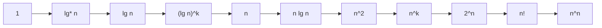

---
tags:
  - "#CCT2"
  - DS
Topic: "Comparing algorithmic growth rates | Combining complexities for multi-step procedures | Graphing functions and interpreting trends | Examples: sorting algorithms, polynomial vs exponential growth"
Semester: CCT2
Course: Diskrete strukturer
Litterature:
  - Introduction to Algorithms 4th ed.
Created: 20-03-2026
---
- - -
- [[#Asymptotic Notation & Standard Mathematical Functions|Asymptotic Notation & Standard Mathematical Functions]]
	- [[#Asymptotic Notation & Standard Mathematical Functions#Quick Reference|Quick Reference]]
	- [[#Asymptotic Notation & Standard Mathematical Functions#Characterizing Running Times|Characterizing Running Times]]
	- [[#Asymptotic Notation & Standard Mathematical Functions#Asymptotic Notation — Informal Overview|Asymptotic Notation — Informal Overview]]
		- [[#Asymptotic Notation — Informal Overview#$O$-notation ("Big-O") — Informal|$O$-notation ("Big-O") — Informal]]
		- [[#Asymptotic Notation — Informal Overview#$\Omega$-notation — Informal|$\Omega$-notation — Informal]]
		- [[#Asymptotic Notation — Informal Overview#$\Theta$-notation — Informal|$\Theta$-notation — Informal]]
		- [[#Asymptotic Notation — Informal Overview#Worked Example: Insertion Sort|Worked Example: Insertion Sort]]
			- [[#Worked Example: Insertion Sort#Showing the Upper Bound: $O(n^2)$|Showing the Upper Bound: $O(n^2)$]]
			- [[#Worked Example: Insertion Sort#Showing the Worst-Case Lower Bound: $\Omega(n^2)$|Showing the Worst-Case Lower Bound: $\Omega(n^2)$]]
			- [[#Worked Example: Insertion Sort#Concluding $\Theta(n^2)$ for the Worst Case|Concluding $\Theta(n^2)$ for the Worst Case]]
	- [[#Asymptotic Notation & Standard Mathematical Functions#Asymptotic Notation — Formal Definitions|Asymptotic Notation — Formal Definitions]]
		- [[#Asymptotic Notation — Formal Definitions#$O$-notation — Formal Definition|$O$-notation — Formal Definition]]
		- [[#Asymptotic Notation — Formal Definitions#$\Omega$-notation — Formal Definition|$\Omega$-notation — Formal Definition]]
		- [[#Asymptotic Notation — Formal Definitions#$\Theta$-notation — Formal Definition|$\Theta$-notation — Formal Definition]]
		- [[#Asymptotic Notation — Formal Definitions#Asymptotic Notation and Running Times|Asymptotic Notation and Running Times]]
		- [[#Asymptotic Notation — Formal Definitions#Asymptotic Notation in Equations and Inequalities|Asymptotic Notation in Equations and Inequalities]]
		- [[#Asymptotic Notation — Formal Definitions#Proper Abuses of Asymptotic Notation|Proper Abuses of Asymptotic Notation]]
		- [[#Asymptotic Notation — Formal Definitions#$o$-notation (Little-o)|$o$-notation (Little-o)]]
		- [[#Asymptotic Notation — Formal Definitions#$\omega$-notation (Little-omega)|$\omega$-notation (Little-omega)]]
		- [[#Asymptotic Notation — Formal Definitions#Comparing Functions|Comparing Functions]]
	- [[#Asymptotic Notation & Standard Mathematical Functions#Standard Notation and Common Functions|Standard Notation and Common Functions]]
		- [[#Standard Notation and Common Functions#Monotonicity|Monotonicity]]
		- [[#Standard Notation and Common Functions#Floors and Ceilings|Floors and Ceilings]]
		- [[#Standard Notation and Common Functions#Modular Arithmetic|Modular Arithmetic]]
		- [[#Standard Notation and Common Functions#Polynomials|Polynomials]]
		- [[#Standard Notation and Common Functions#Exponentials|Exponentials]]
		- [[#Standard Notation and Common Functions#Logarithms|Logarithms]]
		- [[#Standard Notation and Common Functions#Factorials|Factorials]]
		- [[#Standard Notation and Common Functions#Functional Iteration|Functional Iteration]]
		- [[#Standard Notation and Common Functions#The Iterated Logarithm Function|The Iterated Logarithm Function]]
		- [[#Standard Notation and Common Functions#Fibonacci Numbers|Fibonacci Numbers]]
	- [[#Asymptotic Notation & Standard Mathematical Functions#Growth Rate Hierarchy Summary|Growth Rate Hierarchy Summary]]

# Asymptotic Notation & Standard Mathematical Functions

---

## Quick Reference

| Symbol / Notation | Name | Meaning |
|---|---|---|
| $O(g(n))$ | Big-O | Asymptotic **upper bound** — $f(n)$ grows _no faster_ than $g(n)$ |
| $\Omega(g(n))$ | Big-Omega | Asymptotic **lower bound** — $f(n)$ grows _at least as fast_ as $g(n)$ |
| $\Theta(g(n))$ | Theta | Asymptotic **tight bound** — $f(n)$ grows _at the same rate_ as $g(n)$ |
| $o(g(n))$ | Little-o | Strict upper bound (not tight) — $f(n)$ grows _strictly slower_ than $g(n)$ |
| $\omega(g(n))$ | Little-omega | Strict lower bound (not tight) — $f(n)$ grows _strictly faster_ than $g(n)$ |
| $\lfloor x \rfloor$ | Floor | Greatest integer $\leq x$ |
| $\lceil x \rceil$ | Ceiling | Least integer $\geq x$ |
| $a \bmod n$ | Modulo | Remainder of $a / n$ |
| $\lg n$ | Binary logarithm | $\log_2 n$ |
| $\ln n$ | Natural logarithm | $\log_e n$ |
| $\lg^k n$ | Polylogarithm | $(\lg n)^k$ |
| $\lg^{(i)} n$ | Iterated log application | $\lg$ applied $i$ times to $n$ |
| $\lg^* n$ | Iterated logarithm (log star) | Minimum $i$ such that $\lg^{(i)} n \leq 1$ |
| $n!$ | Factorial | $1 \cdot 2 \cdot 3 \cdots n$ |
| $f^{(i)}(n)$ | Functional iteration | $f$ applied $i$ times to $n$ |
| $\phi$ | Golden ratio | $\frac{1+\sqrt{5}}{2} \approx 1.618$ |
| $\hat{\phi}$ | Conjugate of golden ratio | $\frac{1-\sqrt{5}}{2} \approx -0.618$ |
| $\sum$ | Summation (Capital Sigma) | Add a sequence of terms together |
| $\blacksquare$ | Tombstone / QED | Marks the end of a proof |

_Table 0.1: Quick reference of all asymptotic notations, mathematical symbols, and standard functions covered in this note._

---

## Characterizing Running Times

The _order of growth_ of an algorithm's running time provides a simple way to characterize its efficiency and compare it with alternatives. Once the input size $n$ becomes large enough, an algorithm with a **lower** order of growth will always outperform one with a **higher** order of growth.

>[!example]
> - **Merge sort** has a worst-case running time of $\Theta(n \lg n)$.
> - **Insertion sort** has a worst-case running time of $\Theta(n^2)$.
> - For sufficiently large inputs, merge sort wins because $n \lg n$ grows more slowly than $n^2$.

Although we _can_ sometimes determine the exact running time, the extra precision is rarely worth the effort. For large inputs, the multiplicative constants and lower-order terms are _dominated_ by the effects of the input size itself.

>[!info] Asymptotic Efficiency
> When we look at input sizes large enough to make relevant only the order of growth of the running time, we are studying the ***asymptotic*** efficiency of algorithms. We are concerned with how the running time increases with the size of the input _in the limit_, as the size grows without bound.

Usually, an algorithm that is asymptotically more efficient is the best choice for all but very small inputs.

The three most commonly used types of _asymptotic notation_ are:

- **Big-O notation** ($O$) — upper bound
- **Omega notation** ($\Omega$) — lower bound
- **Theta notation** ($\Theta$) — tight bound

>[!warning] Common Misreadings
> - $O(g(n))$ is **not automatically** the same as $\Theta(g(n))$. Big-O is only an upper bound.
> - An algorithm being $O(n^2)$ does **not** mean its worst-case is _exactly_ quadratic unless a matching lower bound is also shown.
> - $\lg^k n$ means $(\lg n)^k$, while $\lg^{(k)} n$ means applying $\lg$ repeatedly $k$ times.
> - Floor and ceiling behave differently for negative numbers:
>   - $\lfloor -2.3 \rfloor = -3$
>   - $\lceil -2.3 \rceil = -2$
> - Modulo with negative values can still produce a nonnegative remainder:
>   - $-3 \bmod 5 = 2$

---

## Asymptotic Notation — Informal Overview

To analyse the worst-case running time of insertion sort, we started with a complicated expression:

$$\left(\frac{c_5}{2} + \frac{c_6}{2} + \frac{c_7}{2}\right) n^2 + \left(c_1 + c_2 + c_4 + \frac{c_5}{2} + \frac{c_6}{2} + \frac{c_7}{2} + c_8\right) n - (c_2 + c_4 + c_5 + c_8)$$

To simplify, we:

1. **Discard the lower-order terms** — the linear term and the constant.
2. **Discard the coefficient** of the leading term, leaving only $n^2$.
3. **Use a notation** that focuses on the _rate of growth_.

This leaves us with $\Theta(n^2)$. Stripping away constants and lower-order terms to focus on order of growth is the essence of _asymptotic notation_.

>[!note]
> Asymptotic notations are designed to characterize functions ***in general***. While we are most interested in running-time functions, they apply equally to space usage, or even to functions that have nothing to do with algorithms.

---

### $O$-notation ("Big-O") — Informal

>[!info] $O$-notation — Upper Bound
> $O$-notation characterizes an **upper bound** on asymptotic behaviour. It states that a function grows _no faster_ than a certain rate, based on the highest-order term.

Consider $7n^3 + 100n^2 - 20n + 6$. Its highest-order term is $7n^3$, so we write $O(n^3)$.

Perhaps surprisingly, we can _also_ write $O(n^4)$, $O(n^5)$, $O(n^6)$, etc. The function grows _more slowly_ than $n^4$, so it is correct to say it grows _no faster_ than $n^4$. More generally, it is $O(n^c)$ for any constant $c \geq 3$.

>[!example]
> For $f(n) = 3n + 2$, it is correct to say:
> - $f(n) = O(n)$
> - $f(n) = O(n^2)$
> - $f(n) = O(n^3)$
>
> The **tightest** upper bound here is $O(n)$.

---

### $\Omega$-notation — Informal

>[!info] $\Omega$-notation — Lower Bound
> $\Omega$-notation characterizes a **lower bound** on asymptotic behaviour. It states that a function grows _at least as fast_ as a certain rate.

Since $7n^3 + 100n^2 - 20n + 6$ grows at least as fast as $n^3$, it is $\Omega(n^3)$. It is also $\Omega(n^2)$ and $\Omega(n)$. More generally, $\Omega(n^c)$ for any constant $c \leq 3$.

>[!example]
> For $f(n) = 5n^2 + 1$, we can say:
> - $f(n) = \Omega(n^2)$
> - $f(n) = \Omega(n)$
> - $f(n) = \Omega(1)$
>
> But the tightest lower bound among these is $\Omega(n^2)$.

---

### $\Theta$-notation — Informal

>[!info] $\Theta$-notation — Tight Bound
> $\Theta$-notation characterizes a **tight bound**. A function grows _precisely_ at a certain rate — to within a constant factor from above _and_ from below.

>[!important]
> If you can show that a function is both $O(f(n))$ and $\Omega(f(n))$, then you have shown it is $\Theta(f(n))$.

Since $7n^3 + 100n^2 - 20n + 6$ is both $O(n^3)$ and $\Omega(n^3)$, it is $\Theta(n^3)$.

>[!example]
> The function $8n^2 - 3n + 7$ is:
> - $O(n^2)$
> - $\Omega(n^2)$
>
> Therefore, it is also $\Theta(n^2)$.

---

### Worked Example: Insertion Sort

The `INSERTION-SORT` procedure in pseudocode:

```pseudocode
INSERTION-SORT(A, n)
1  for i = 2 to n
2      key = A[i]
3      // Insert A[i] into the sorted subarray A[1 : i – 1].
4      j = i – 1
5      while j > 0 and A[j] > key
6          A[j + 1] = A[j]
7          j = j – 1
8      A[j + 1] = key
```

The procedure has _nested loops_. The **outer loop** (`for`) runs $n - 1$ times regardless of input. The **inner loop** (`while`) depends on the values being sorted: for a given $i$, it may iterate $0$ to $i - 1$ times. The body of the `while` loop (lines $6$–$7$) takes _constant time_ per iteration.

![[Pasted image 20260321091023.png]]

_Figure 1.1: Visual representation of the insertion sort algorithm's loop structure and iteration behaviour._

>[!example]
> **Deriving the Worst-Case Running Time of Insertion Sort**
>
> **Outer loop:** runs from $i = 2$ to $n$ → executes $n - 1$ times (fixed).  
> **Inner loop (`while`):** for each $i$, runs $0$ to $i - 1$ times (variable).  
> **Loop body (lines $6$–$7$):** constant time $c$ per iteration.
>
> **Step $1$ — Count worst-case inner loop iterations for a given $i$:**
> The variable $j$ starts at $i - 1$ and decreases by $1$ each iteration. If the condition is always true, $j$ goes: $(i-1) \to (i-2) \to \dots \to 1 \to 0$, which is $i - 1$ steps.
>
> **Step $2$ — Sum total inner loop work across all outer loop iterations:**
> - $i = 2$: at most $1$ iteration
> - $i = 3$: at most $2$ iterations
> - $\vdots$
> - $i = n$: at most $n - 1$ iterations
>
> Total $= 1 + 2 + 3 + \dots + (n - 1)$
>
> **Step $3$ — Evaluate the sum:**
> $$\sum_{i=1}^{n-1} i = \frac{(n-1)n}{2} = \frac{n^2 - n}{2}$$
> - **Breakdown:**
>     - $\sum$ : The Summation Operator (Capital Sigma). Directs you to add the sequence of values from $i = 1$ to $i = n-1$.
>     - $i$ : The index variable and the term being summed.
>     - $\frac{(n-1)n}{2}$ : The closed-form formula for the sum of the first $n-1$ positive integers.
>
> **Step $4$ — Apply asymptotic notation:**
> $$\frac{n^2 - n}{2}$$
> Drop the constant factor $\frac{1}{2}$, then drop the lower-order term $-n$. For large $n$, $n^2$ dominates. Therefore: $O(n^2)$.

#### Showing the Upper Bound: $O(n^2)$

Each of the $n - 1$ outer loop iterations causes the inner loop to iterate _at most_ $i - 1$ times. Since $i \leq n$, the total inner iterations are at most:

$$(n - 1)(n - 1) < n^2$$

Each inner iteration takes constant time, so total time is at most a constant times $n^2$. This gives $O(n^2)$ for _any_ input — a blanket statement covering all cases.

#### Showing the Worst-Case Lower Bound: $\Omega(n^2)$

Saying the worst-case running time is $\Omega(n^2)$ means: for every input size $n$ above some threshold, there is _at least one_ input causing at least $cn^2$ time.

>[!example]
> **Constructing a Worst-Case Input**
>
> Assume $n$ is a multiple of $3$. Divide array $A$ into three groups of $n/3$ positions. Suppose the $n/3$ largest values start in the _first_ $n/3$ positions.
>
> After sorting, each of these values ends up in the _last_ $n/3$ positions, meaning each must pass through the _middle_ $n/3$ positions. Each such value requires at least $n/3$ executions of line $6$.
>
> Since $n/3$ values each need $n/3$ moves:
> $$\frac{n}{3} \cdot \frac{n}{3} = \frac{n^2}{9} = \Omega(n^2)$$

#### Concluding $\Theta(n^2)$ for the Worst Case

>[!info] Worst-Case Running Time of Insertion Sort
> Because `INSERTION-SORT` runs in $O(n^2)$ time in _all_ cases, and there exists an input making it take $\Omega(n^2)$ time, the **worst-case** running time is $\Theta(n^2)$.

>[!warning]
> This does **not** show that `INSERTION-SORT` runs in $\Theta(n^2)$ in _all_ cases. The **best-case** running time is $\Theta(n)$ (when the input is already sorted).

---

## Asymptotic Notation — Formal Definitions

The notations are defined in terms of functions whose domains are typically $\mathbb{N}$ (natural numbers) or $\mathbb{R}$ (real numbers). They provide a formal way to describe a running-time function $T(n)$.

![[Pasted image 20260321101818.png]]

_Figure 2.1: Graphical illustration of the asymptotic notations $O$, $\Omega$, and $\Theta$, showing how $f(n)$ is bounded by $cg(n)$ for $n \geq n_0$._

---

### $O$-notation — Formal Definition

>[!summary] Definition — "Big-O Notation"
> For a given function $g(n)$, we denote by $O(g(n))$ the **set of functions**:
> $$O(g(n)) = \{f(n) : \text{there exist positive constants } c \text{ and } n_0 \text{ such that } 0 \leq f(n) \leq cg(n) \text{ for all } n \geq n_0\}$$
>
> **Breakdown:**
> - $f(n)$ : The function being characterised (e.g., an algorithm's running time).
> - $g(n)$ : The bounding function that defines the growth rate.
> - $c$ : A positive constant multiplier. It "scales up" $g(n)$ to ensure it can sit above $f(n)$.
> - $n_0$ : The threshold input size beyond which the bound holds. For all $n \geq n_0$, the relationship is guaranteed.
> - The inequality $0 \leq f(n) \leq cg(n)$ : States that $f(n)$ is _asymptotically nonnegative_ and bounded above by a constant multiple of $g(n)$.

The definition requires $f(n)$ to be _asymptotically nonnegative_ (nonnegative for sufficiently large $n$). Consequently, $g(n)$ must also be asymptotically nonnegative, or $O(g(n))$ is empty.

>[!note] Notation Convention: Equality as Set Membership
> By convention, we write $f(n) = O(g(n))$ instead of $f(n) \in O(g(n))$. This is technically an abuse of the equality sign, but it has practical advantages when asymptotic notation appears within equations.

>[!example]
> **Showing $4n^2 + 100n + 500 = O(n^2)$**
>
> We need positive constants $c$ and $n_0$ such that:
> $$4n^2 + 100n + 500 \leq cn^2 \quad \text{for all } n \geq n_0$$
> Dividing both sides by $n^2$:
> $$4 + \frac{100}{n} + \frac{500}{n^2} \leq c$$
> This is satisfied for many choices:
>
> | $n_0$ | $c$ |
> |---|---|
> | $1$ | $604$ |
> | $10$ | $19$ |
> | $100$ | $5.05$ |
>
> _Table 2.1: Example pairs of $(n_0, c)$ that satisfy the Big-O condition for $4n^2 + 100n + 500 = O(n^2)$._
>
> As $n_0$ increases, the lower-order terms shrink and $c$ can be chosen closer to the leading coefficient ($4$). This demonstrates how discarding lower-order terms and constant coefficients is justified.

>[!example]
> **Showing $n^3 - 100n^2 \neq O(n^2)$**
>
> Suppose $n^3 - 100n^2 = O(n^2)$. Then there would exist positive $c$ and $n_0$ such that:
> $$n^3 - 100n^2 \leq cn^2 \quad \text{for all } n \geq n_0$$
> Dividing by $n^2$:
> $$n - 100 \leq c$$
> This fails for any $n > c + 100$, regardless of the choice of $c$. Therefore $n^3 - 100n^2 \notin O(n^2)$.

---

### $\Omega$-notation — Formal Definition

>[!summary] Definition — "Big-Omega Notation"
> For a given function $g(n)$:
> $$\Omega(g(n)) = \{f(n) : \text{there exist positive constants } c \text{ and } n_0 \text{ such that } 0 \leq cg(n) \leq f(n) \text{ for all } n \geq n_0\}$$
>
> **Breakdown:**
> - $f(n)$ : The function being characterised.
> - $g(n)$ : The bounding function — now a _lower_ bound.
> - $c$ : A positive constant that scales $g(n)$ _down_ so it sits below $f(n)$.
> - $n_0$ : The threshold beyond which the bound holds.
> - The inequality $0 \leq cg(n) \leq f(n)$ : States that $f(n)$ grows _at least as fast_ as a constant multiple of $g(n)$.

Where $O$ provides an asymptotic _upper_ bound, $\Omega$ provides an asymptotic _lower_ bound.

>[!example]
> **Showing $4n^2 + 100n + 500 = \Omega(n^2)$**
>
> We need positive $c$ and $n_0$ such that:
> $$4n^2 + 100n + 500 \geq cn^2 \quad \text{for all } n \geq n_0$$
> Dividing by $n^2$:
> $$4 + \frac{100}{n} + \frac{500}{n^2} \geq c$$
> The left side is always $\geq 4$ for any positive $n$. Choose $n_0 = 1$ and $c = 4$.

>[!example]
> **Showing $\frac{n^2}{100} - 100n - 500 = \Omega(n^2)$**
>
> Even with a small leading coefficient and subtracted lower-order terms, the function is still $\Omega(n^2)$. Dividing by $n^2$:
> $$\frac{1}{100} - \frac{100}{n} - \frac{500}{n^2} \geq c$$
> We need $n$ large enough that the subtractive terms become negligible:
>
> | $n_0$ | $c$ |
> |---|---|
> | $10{,}005$ | $2.49 \times 10^{-9}$ |
> | $100{,}000$ | $0.0089$ |
>
> _Table 2.2: Example pairs of $(n_0, c)$ for $\frac{n^2}{100} - 100n - 500 = \Omega(n^2)$. Larger $n_0$ allows $c$ closer to $\frac{1}{100}$._
>
> The constant $c$ may be tiny, but it is _positive_ — that is all that matters.

---

### $\Theta$-notation — Formal Definition

>[!summary] Definition — "Theta Notation"
> For a given function $g(n)$:
> $$\Theta(g(n)) = \{f(n) : \text{there exist positive constants } c_1, c_2, \text{ and } n_0 \text{ such that } 0 \leq c_1 g(n) \leq f(n) \leq c_2 g(n) \text{ for all } n \geq n_0\}$$
>
> **Breakdown:**
> - $f(n)$ : The function being characterised.
> - $g(n)$ : The reference growth rate.
> - $c_1$ : A positive constant for the _lower_ bound — scales $g(n)$ down below $f(n)$.
> - $c_2$ : A positive constant for the _upper_ bound — scales $g(n)$ up above $f(n)$.
> - $n_0$ : The threshold beyond which both bounds hold simultaneously.
> - The compound inequality $c_1 g(n) \leq f(n) \leq c_2 g(n)$ : States that $f(n)$ is _sandwiched_ between two constant multiples of $g(n)$, meaning $f(n)$ grows at the _same rate_ as $g(n)$.

$\Theta$-notation provides an _asymptotically tight bound_.

>[!summary] theorem : Tight Bound Equivalence
> For any two functions $f(n)$ and $g(n)$:
> $$f(n) = \Theta(g(n)) \quad \text{if and only if} \quad f(n) = O(g(n)) \text{ and } f(n) = \Omega(g(n))$$
>
> **breakdown**:
> - This theorem states that a tight bound ($\Theta$) is _exactly equivalent_ to having both an upper bound ($O$) and a lower bound ($\Omega$) with the same reference function.
> - "If and only if" means the equivalence works in _both_ directions.
> - Intuitively, $\Theta$ is a **sandwich**: the upper slice is $O$, the lower slice is $\Omega$, and having both together gives a tight bound.
>
> **proof**:
> **($\Rightarrow$) Forward direction:** Assume $f(n) = \Theta(g(n))$. By definition, there exist positive constants $c_1$, $c_2$, and $n_0$ such that:
> $$0 \leq c_1 g(n) \leq f(n) \leq c_2 g(n) \quad \text{for all } n \geq n_0$$
> - The right portion ($f(n) \leq c_2 g(n)$) gives $f(n) = O(g(n))$ with $c = c_2$.
> - The left portion ($c_1 g(n) \leq f(n)$) gives $f(n) = \Omega(g(n))$ with $c = c_1$.
>
> **($\Leftarrow$) Reverse direction:** Assume $f(n) = O(g(n))$ and $f(n) = \Omega(g(n))$.
> - From $O$: there exist $c_2$ and $n_1$ such that $0 \leq f(n) \leq c_2 g(n)$ for all $n \geq n_1$.
> - From $\Omega$: there exist $c_1$ and $n_2$ such that $0 \leq c_1 g(n) \leq f(n)$ for all $n \geq n_2$.
>
> Let $n_0 = \max(n_1, n_2)$. For all $n \geq n_0$, both inequalities hold simultaneously:
> $$0 \leq c_1 g(n) \leq f(n) \leq c_2 g(n) \quad \text{for all } n \geq n_0$$
> which is the definition of $f(n) = \Theta(g(n))$. $\blacksquare$

---

### Asymptotic Notation and Running Times

When using asymptotic notation to characterize running times, be **as precise as possible** without overstating which cases it applies to.

>[!important] Precision and Correct Usage — Insertion Sort
> - **Worst-case** running time: $\Theta(n^2)$ — the most precise; preferred over $O(n^2)$ or $\Omega(n^2)$ alone.
> - **Best-case** running time: $\Theta(n)$ — again, $\Theta$ is preferred.
> - We **cannot** say "insertion sort's running time is $\Theta(n^2)$" without qualifying "worst-case," because it runs in $\Theta(n)$ in the best case.
> - We **can** say "its running time is $O(n^2)$" as a blanket statement — it holds for _all_ cases.
> - We **cannot** say "its running time is $\Theta(n)$," but we **can** say "$\Omega(n)$."

For an algorithm like _merge sort_, which runs in $\Theta(n \lg n)$ in _all_ cases, we can simply say its running time is $\Theta(n \lg n)$ without specifying a particular case.

>[!warning] Common Mistake: Conflating $O$ with $\Theta$
> Saying "an $O(n \lg n)$-time algorithm runs faster than an $O(n^2)$-time algorithm" is **not** necessarily true — the "$O(n^2)$" algorithm might actually run in $\Theta(n)$. If you want to indicate a tight bound, use $\Theta$.

We aim for the **simplest and most precise** bound. For $3n^2 + 20n$, write $\Theta(n^2)$ — not $O(n^3)$ (less precise) or $\Theta(3n^2 + 20n)$ (unnecessarily complex).

>[!info] Common Growth Classes
> | Growth Class | Example | Common Interpretation |
> |---|---|---|
> | Constant | $1$ | Fixed work |
> | Iterated logarithmic | $\lg^* n$ | Repeated logarithm application |
> | Logarithmic | $\lg n$ | Repeated halving |
> | Linear | $n$ | One pass through the input |
> | Linearithmic | $n \lg n$ | Divide-and-conquer sorting |
> | Quadratic | $n^2$ | Nested comparisons |
> | Polynomial | $n^k$ | General algebraic growth |
> | Exponential | $2^n$ | Combinatorial explosion |
> | Factorial | $n!$ | Counting permutations |
>
> _Table 2.3: Compact summary of common asymptotic growth classes and their intuitive interpretations._

---

### Asymptotic Notation in Equations and Inequalities

>[!info] Interpreting Asymptotic Notation Inside Equations
> Asymptotic notation is formally defined as a **set of functions**, but in equations it often acts like a placeholder for an unnamed function. The meaning depends on where the notation appears.

**Right-hand side only — set membership:**

$$4n^2 + 100n + 500 = O(n^2) \quad \text{means} \quad 4n^2 + 100n + 500 \in O(n^2)$$

**Within a formula — anonymous function:**

$$2n^2 + 3n + 1 = 2n^2 + \Theta(n)$$

This means $2n^2 + 3n + 1 = 2n^2 + f(n)$ where $f(n) \in \Theta(n)$. Here $f(n) = 3n + 1$. This usage eliminates inessential detail — e.g., the merge sort recurrence $T(n) = 2T(n/2) + \Theta(n)$.

>[!example]
> The expression
> $$5n^3 + 2n + 9 = 5n^3 + \Theta(n)$$
> means there exists some function in $\Theta(n)$ — specifically $2n + 9$ — replacing the anonymous term.

>[!note] Left-Hand Side Interpretation
> When asymptotic notation appears on the left-hand side, the interpretation is stronger:
> $$2n^2 + \Theta(n) = \Theta(n^2)$$
> This means that **no matter which** function from $\Theta(n)$ appears on the left, the whole expression still belongs to $\Theta(n^2)$.

**Chaining:**

$$2n^2 + 3n + 1 = 2n^2 + \Theta(n) = \Theta(n^2)$$

Each equation is interpreted separately:
1. There exists $f(n) \in \Theta(n)$ such that $2n^2 + 3n + 1 = 2n^2 + f(n)$.
2. For any $g(n) \in \Theta(n)$, there exists $h(n) \in \Theta(n^2)$ such that $2n^2 + g(n) = h(n)$.

Together, this yields $2n^2 + 3n + 1 = \Theta(n^2)$.

---

### Proper Abuses of Asymptotic Notation

>[!tip] Abusing vs. Misusing Notation
> In mathematics, it is acceptable to _abuse_ notation, as long as we don't _misuse_ it. If we understand precisely what is meant and don't draw incorrect conclusions, the abuse simplifies language and helps us focus on what matters.

**Inferring the variable:** In $O(g(n))$, the variable $n$ tends to $\infty$. Writing $O(g(m))$ means $m$ is the variable of interest.

**$O(1)$:** When no variable appears inside the notation, context disambiguates. $f(n) = O(1)$ means $f(n)$ is bounded from above by a constant as $n \to \infty$.

**Bounded ranges:** $T(n) = O(1)$ for $n < 3$ means there exists a positive constant $c$ such that $T(n) \leq c$ for $n < 3$. Similarly, $T(n) = \Theta(1)$ for $n < 3$ means bounded above _and_ below by positive constants.

**Partially defined functions:** If an algorithm's running time is only defined for certain input sizes (e.g., exact powers of $2$), asymptotic notation still applies — the constraints hold only where the function is defined.

---

### $o$-notation (Little-o)

The upper bound from $O$-notation may or may not be _tight_. We use $o$-notation for an upper bound that is **not** tight.

>[!summary] Definition — "Little-o Notation"
> $$o(g(n)) = \{f(n) : \text{for any positive constant } c > 0, \text{ there exists } n_0 > 0 \text{ such that } 0 \leq f(n) < cg(n) \text{ for all } n \geq n_0\}$$
>
> **Breakdown:**
> - The critical difference from $O$: instead of "there exists _some_ $c$," we require "for _any_ (every) $c > 0$."
> - The inequality is _strict_ ($<$ rather than $\leq$).
> - This means $f(n)$ becomes _insignificant_ relative to $g(n)$.

>[!example]
> - $2n = o(n^2)$ ✓ — $2n$ grows strictly slower than $n^2$.
> - $2n^2 \neq o(n^2)$ ✗ — $2n^2$ grows at the _same_ rate as $n^2$, not strictly slower.

**Equivalent limit definition:**

$$\lim_{n \to \infty} \frac{f(n)}{g(n)} = 0$$

---

### $\omega$-notation (Little-omega)

$\omega$-notation is to $\Omega$-notation as $o$-notation is to $O$-notation. It denotes a lower bound that is **not** tight.

>[!summary] Definition — "Little-omega Notation"
> $$\omega(g(n)) = \{f(n) : \text{for any positive constant } c > 0, \text{ there exists } n_0 > 0 \text{ such that } 0 \leq cg(n) < f(n) \text{ for all } n \geq n_0\}$$
>
> **Breakdown:**
> - Like $o$-notation but "flipped": $f(n)$ grows _strictly faster_ than $g(n)$.
> - Requires the inequality to hold for _every_ positive constant $c$, meaning $f(n)$ dominates $g(n)$ completely.

**Key equivalence:** $f(n) \in \omega(g(n))$ if and only if $g(n) \in o(f(n))$.

>[!example]
> - $\frac{n^2}{2} = \omega(n)$ ✓ — quadratic grows strictly faster than linear.
> - $\frac{n^2}{2} \neq \omega(n^2)$ ✗ — same growth rate.

**Equivalent limit definition:**

$$\lim_{n \to \infty} \frac{f(n)}{g(n)} = \infty$$

---

### Comparing Functions

Many properties of real numbers carry over to asymptotic comparisons. Assume $f(n)$ and $g(n)$ are asymptotically positive.

**Transitivity** (all five notations):

| If... | and... | then... |
|---|---|---|
| $f(n) = \Theta(g(n))$ | $g(n) = \Theta(h(n))$ | $f(n) = \Theta(h(n))$ |
| $f(n) = O(g(n))$ | $g(n) = O(h(n))$ | $f(n) = O(h(n))$ |
| $f(n) = \Omega(g(n))$ | $g(n) = \Omega(h(n))$ | $f(n) = \Omega(h(n))$ |
| $f(n) = o(g(n))$ | $g(n) = o(h(n))$ | $f(n) = o(h(n))$ |
| $f(n) = \omega(g(n))$ | $g(n) = \omega(h(n))$ | $f(n) = \omega(h(n))$ |

_Table 2.4: Transitivity property across all five asymptotic notations._

**Reflexivity:** $f(n) = \Theta(f(n))$, $\; f(n) = O(f(n))$, $\; f(n) = \Omega(f(n))$

**Symmetry:** $f(n) = \Theta(g(n)) \iff g(n) = \Theta(f(n))$

**Transpose Symmetry:**
- $f(n) = O(g(n)) \iff g(n) = \Omega(f(n))$
- $f(n) = o(g(n)) \iff g(n) = \omega(f(n))$

>[!abstract] Analogy — Asymptotic Comparison as Number Comparison
> | Asymptotic Comparison | Real Number Analogy |
> |---|---|
> | $f(n) = O(g(n))$ | $a \leq b$ |
> | $f(n) = \Omega(g(n))$ | $a \geq b$ |
> | $f(n) = \Theta(g(n))$ | $a = b$ |
> | $f(n) = o(g(n))$ | $a < b$ |
> | $f(n) = \omega(g(n))$ | $a > b$ |
>
> _Table 2.5: Analogy between asymptotic function comparison and real number comparison._
>
> We say $f(n)$ is _asymptotically smaller_ than $g(n)$ if $f(n) = o(g(n))$, and _asymptotically larger_ if $f(n) = \omega(g(n))$.

>[!warning] Trichotomy Does Not Hold
> For real numbers, exactly one of $a < b$, $a = b$, or $a > b$ always holds. **Not all functions are asymptotically comparable.** For example, $n$ and $n^{1+\sin n}$ cannot be compared — the exponent oscillates between $0$ and $2$, so neither $f(n) = O(g(n))$ nor $f(n) = \Omega(g(n))$ holds.

---

## Standard Notation and Common Functions

### Monotonicity

>[!info] Monotonicity Definitions
> - **Monotonically increasing:** $m \leq n \implies f(m) \leq f(n)$
> - **Monotonically decreasing:** $m \leq n \implies f(m) \geq f(n)$
> - **Strictly increasing:** $m < n \implies f(m) < f(n)$
> - **Strictly decreasing:** $m < n \implies f(m) > f(n)$
>
> The difference: _monotonic_ allows equal values at different inputs (the function can be flat); _strict_ does not.

>[!example]
> - $f(n) = n^2$ is **strictly increasing** for $n \geq 0$.
> - $g(n) = \left\lfloor \frac{n}{2} \right\rfloor$ is **monotonically increasing**, but not strictly increasing, because:
>   - $g(2) = 1$
>   - $g(3) = 1$
>
> The function never decreases, but it can stay flat.

---

### Floors and Ceilings

For any real number $x$:
- $\lfloor x \rfloor$ ("floor of $x$") — the _greatest integer_ $\leq x$
- $\lceil x \rceil$ ("ceiling of $x$") — the _least integer_ $\geq x$

Both functions are monotonically increasing.

>[!info] Core Properties of Floors and Ceilings
> For any integer $n$:
> $$\lfloor n \rfloor = n = \lceil n \rceil$$
>
> For all real $x$:
> $$x - 1 < \lfloor x \rfloor \leq x \leq \lceil x \rceil < x + 1$$
>
> Negation:
> $$-\lceil x \rceil = \lfloor -x \rfloor$$
>
> For any integer $n$ and real $x$:
> $$\lfloor n + x \rfloor = n + \lfloor x \rfloor \qquad \lceil n + x \rceil = n + \lceil x \rceil$$

>[!info] Nested Floor/Ceiling and Division Properties
> For real $x \geq 0$ and integers $a, b > 0$:
> $$\left\lceil \frac{\lceil x/a \rceil}{b} \right\rceil = \left\lceil \frac{x}{ab} \right\rceil \qquad \left\lfloor \frac{\lfloor x/a \rfloor}{b} \right\rfloor = \left\lfloor \frac{x}{ab} \right\rfloor$$
> $$\left\lceil \frac{a}{b} \right\rceil \leq \frac{a + (b-1)}{b} \qquad \left\lfloor \frac{a}{b} \right\rfloor \geq \frac{a - (b-1)}{b}$$

>[!example]
> - $\lfloor 3.7 \rfloor = 3$, $\;\lceil 3.7 \rceil = 4$
> - $\lfloor -2.3 \rfloor = -3$, $\;\lceil -2.3 \rceil = -2$
> - $\lfloor 5 \rfloor = 5 = \lceil 5 \rceil$

---

### Modular Arithmetic

>[!info] Modulo Definition
> For any integer $a$ and positive integer $n$:
> $$a \bmod n = a - n\left\lfloor \frac{a}{n} \right\rfloor$$
>
> **Breakdown:**
> - $a$ : The dividend.
> - $n$ : The divisor (modulus).
> - $\left\lfloor \frac{a}{n} \right\rfloor$ : The quotient rounded down to the nearest integer.
> - $n\left\lfloor \frac{a}{n} \right\rfloor$ : The largest multiple of $n$ not exceeding $a$.
> - $a - n\left\lfloor \frac{a}{n} \right\rfloor$ : The remainder after division.
>
> It follows that:
> $$0 \leq a \bmod n < n$$
> even when $a$ is negative.

>[!info] Equivalence Modulo $n$
> If $(a \bmod n) = (b \bmod n)$, we write $a \equiv b \pmod{n}$ and say $a$ is _equivalent to_ $b$, _modulo_ $n$ — they have the same remainder when divided by $n$.
>
> Equivalently, $a \equiv b \pmod{n}$ if and only if $n$ divides $b - a$.
>
> We write $a \not\equiv b \pmod{n}$ if they are _not_ equivalent.

>[!example]
> - $17 \bmod 5 = 2$, because $17 = 5 \cdot 3 + 2$
> - $-3 \bmod 5 = 2$, because $-3 = 5 \cdot (-1) + 2$
> - $17 \equiv 7 \pmod{5}$, because both give remainder $2$

---

### Polynomials

A _polynomial in $n$ of degree $d$_ is:

$$p(n) = \sum_{i=0}^{d} a_i n^i = a_0 + a_1 n + a_2 n^2 + \dots + a_d n^d$$

- **Breakdown:**
    - $\sum_{i=0}^{d}$ : Sum from $i = 0$ to $d$.
    - $a_i$ : The coefficients of the polynomial.
    - $a_d \neq 0$ : The leading coefficient (must be nonzero for degree $d$).
    - $n^i$ : The variable raised to the $i$-th power.

A polynomial is _asymptotically positive_ iff $a_d > 0$.

>[!info] Key Facts About Polynomials
> - An asymptotically positive polynomial of degree $d$: $p(n) = \Theta(n^d)$.
> - For $a \geq 0$: $n^a$ is monotonically increasing.
> - For $a \leq 0$: $n^a$ is monotonically decreasing.
> - A function is _polynomially bounded_ if $f(n) = O(n^k)$ for some constant $k$.

>[!example]
> Consider:
> $$p(n) = 3n^2 + 5n + 7$$
> The highest-degree term is $3n^2$, so the polynomial has degree $2$. Therefore:
> $$p(n) = \Theta(n^2)$$
> The lower-order terms $5n$ and $7$ do not affect the asymptotic growth rate.

---

### Exponentials

For all real $a > 0$, $m$, and $n$:

| Identity | Identity |
|---|---|
| $a^0 = 1$ | $(a^m)^n = a^{mn}$ |
| $a^1 = a$ | $(a^m)^n = (a^n)^m$ |
| $a^{-1} = 1/a$ | $a^m a^n = a^{m+n}$ |

_Table 3.1: Fundamental exponential identities._

For all $n$ and $a \geq 1$, the function $a^n$ is monotonically increasing in $n$. By convention, $0^0 = 1$.

>[!important] Exponentials Grow Faster Than Polynomials
> For all real constants $a > 1$ and $b$:
> $$\lim_{n \to \infty} \frac{n^b}{a^n} = 0 \implies n^b = o(a^n)$$
> Any exponential with a base strictly greater than $1$ grows faster than _any_ polynomial.

>[!example]
> Compare polynomial and exponential growth:
> - At $n = 10$: $n^3 = 1000$ and $2^n = 1024$
> - At $n = 20$: $n^3 = 8000$ and $2^n = 1{,}048{,}576$
>
> At first they may seem close, but the exponential function quickly pulls far ahead.

Using $e = 2.71828\ldots$ (Euler's number), the Taylor series expansion is:

$$e^x = \sum_{i=0}^{\infty} \frac{x^i}{i!} = 1 + x + \frac{x^2}{2!} + \frac{x^3}{3!} + \cdots$$

- **Breakdown:**
    - $\sum_{i=0}^{\infty}$ : Sum an infinite number of terms, starting from $i = 0$.
    - $x^i$ : The variable $x$ raised to the $i$-th power.
    - $i!$ : The factorial of $i$ — grows fast, causing each successive term to shrink.

>[!info] Approximations of $e^x$
> For all real $x$:
> $$1 + x \leq e^x$$
> (equality only at $x = 0$)
>
> When $|x| \leq 1$:
> $$1 + x \leq e^x \leq 1 + x + x^2$$
>
> As $x \to 0$: $\;e^x = 1 + x + \Theta(x^2)$ (asymptotic notation here describes behaviour as $x \to 0$, not $x \to \infty$).
>
> For all $x$:
> $$\lim_{n \to \infty} \left(1 + \frac{x}{n}\right)^n = e^x$$

---

### Logarithms

Standard shorthands:

| Notation | Meaning |
|---|---|
| $\lg n$ | $\log_2 n$ (binary logarithm) |
| $\ln n$ | $\log_e n$ (natural logarithm) |
| $\lg^k n$ | $(\lg n)^k$ (exponentiation) |
| $\lg \lg n$ | $\lg(\lg n)$ (composition) |

_Table 3.2: Standard logarithm notation conventions._

>[!note] Notational Convention
> A logarithm applies only to the _next term_: $\lg n + 1$ means $(\lg n) + 1$, **not** $\lg(n + 1)$.

For any constant $b > 1$, the function $\log_b n$ is:
- Undefined for $n \leq 0$
- Strictly increasing for $n > 0$
- Negative for $0 < n < 1$
- Zero at $n = 1$
- Positive for $n > 1$

>[!info] Logarithm Identities
> For all real $a > 0$, $b > 0$, $c > 0$, and $n$ (bases $\neq 1$):
>
> | Identity | Identity |
> |---|---|
> | $a = b^{\log_b a}$ | $\log_b(1/a) = -\log_b a$ |
> | $\log_c(ab) = \log_c a + \log_c b$ | $\log_b a = 1 / \log_a b$ |
> | $\log_b a^n = n \log_b a$ | $a^{\log_b c} = c^{\log_b a}$ |
> | $\log_b a = \frac{\log_c a}{\log_c b}$ | |
>
> _Table 3.3: Fundamental logarithm identities._
>
> **Key consequence:** Changing the base of a logarithm from one constant to another changes the value by only a _constant factor_ ($\frac{1}{\log_c b}$). This is why we use $\lg n$ in $O$-notation without specifying a base — the base doesn't matter asymptotically.

>[!example]
> Using the change-of-base identity:
> $$\log_2 8 = \frac{\ln 8}{\ln 2} = \frac{2.079\ldots}{0.693\ldots} = 3$$
> This confirms that different logarithm bases differ only by a constant factor.

>[!info] Series Expansion and Bounds for $\ln(1+x)$
> For $|x| < 1$:
> $$\ln(1 + x) = x - \frac{x^2}{2} + \frac{x^3}{3} - \frac{x^4}{4} + \cdots$$
>
> For $x > -1$:
> $$\frac{x}{1 + x} \leq \ln(1 + x) \leq x$$
> (equality only at $x = 0$)

>[!important] Polynomials Grow Faster Than Polylogarithms
> A function is _polylogarithmically bounded_ if $f(n) = O(\lg^k n)$ for some constant $k$.
>
> For all real constants $a > 0$ and $b$:
> $$\lg^b n = o(n^a)$$
> Any positive polynomial grows faster than any polylogarithmic function.

---

### Factorials

$$n! = \begin{cases} 1 & \text{if } n = 0 \\ n \cdot (n-1)! & \text{if } n > 0 \end{cases}$$

Thus $n! = 1 \cdot 2 \cdot 3 \cdots n$. A weak upper bound: $n! \leq n^n$ (each of the $n$ terms is at most $n$).

>[!info] Stirling's Approximation
> $$n! = \sqrt{2\pi n}\left(\frac{n}{e}\right)^n\left(1 + \Theta\left(\frac{1}{n}\right)\right)$$
>
> **Breakdown:**
> - $\sqrt{2\pi n}$ : A slowly growing multiplicative correction factor.
> - $\left(\frac{n}{e}\right)^n$ : The dominant term capturing the exponential growth of $n!$.
> - $e$ : Euler's number ($\approx 2.718$).
> - $1 + \Theta\left(\frac{1}{n}\right)$ : A correction that approaches $1$ as $n \to \infty$, with the error shrinking proportionally to $1/n$.
>
> A tighter form for $n \geq 1$:
> $$n! = \sqrt{2\pi n}\left(\frac{n}{e}\right)^n e^{\alpha_n} \qquad \text{where} \quad \frac{1}{12n+1} < \alpha_n < \frac{1}{12n}$$

>[!info] Asymptotic Bounds on Factorials
> $$n! = o(n^n) \qquad n! = \omega(2^n) \qquad \lg(n!) = \Theta(n \lg n)$$
> - $n!$ grows _slower_ than $n^n$ but _faster_ than $2^n$.
> - The logarithm of $n!$ grows at the same rate as $n \lg n$.

---

### Functional Iteration

The notation $f^{(i)}(n)$ denotes $f$ applied $i$ times to $n$:

$$f^{(i)}(n) = \begin{cases} n & \text{if } i = 0 \\ f(f^{(i-1)}(n)) & \text{if } i > 0 \end{cases}$$

>[!example]
> **Functional Iteration with $f(n) = 2n$**
> - $f^{(0)}(n) = n$
> - $f^{(1)}(n) = 2n$
> - $f^{(2)}(n) = 2(2n) = 4n$
> - $f^{(i)}(n) = 2^i n$

---

### The Iterated Logarithm Function

Let $\lg^{(i)} n$ be $\lg$ applied $i$ times (defined only if $\lg^{(i-1)} n > 0$).

>[!warning] Notation Distinction
> - $\lg^{(i)} n$ — the logarithm applied $i$ times in succession, starting with $n$.
> - $\lg^i n$ — the logarithm of $n$ raised to the $i$-th power: $(\lg n)^i$.
>
> These are **different things**.

>[!summary] Definition — "Iterated Logarithm"
> $$\lg^* n = \min\{i \geq 0 : \lg^{(i)} n \leq 1\}$$
>
> **Breakdown:**
> - $\lg^* n$ : "Log star of $n$." The number of times you must take $\lg$ before the result drops to $\leq 1$.
> - $\min\{i \geq 0 : \ldots\}$ : The smallest nonnegative integer $i$ satisfying the condition.

The iterated logarithm grows _extremely_ slowly:

| $n$ | $\lg^* n$ |
|---|---|
| $2$ | $1$ |
| $4$ | $2$ |
| $16$ | $3$ |
| $65{,}536$ | $4$ |
| $2^{65{,}536}$ | $5$ |

_Table 3.4: Values of the iterated logarithm. The number of atoms in the observable universe ($\sim 10^{80}$) is far less than $2^{65{,}536} \approx 10^{19{,}728}$, so we rarely encounter $\lg^* n > 5$._

>[!example]
> To compute $\lg^* 16$:
> - $\lg 16 = 4$
> - $\lg 4 = 2$
> - $\lg 2 = 1$
>
> It took $3$ logarithms to reach a value $\leq 1$, so:
> $$\lg^* 16 = 3$$

---

### Fibonacci Numbers

$$F_i = \begin{cases} 0 & \text{if } i = 0 \\ 1 & \text{if } i = 1 \\ F_{i-1} + F_{i-2} & \text{if } i \geq 2 \end{cases}$$

The sequence: $0, 1, 1, 2, 3, 5, 8, 13, 21, 34, 55, \ldots$

Fibonacci numbers are related to the _golden ratio_ $\phi$ and its _conjugate_ $\hat{\phi}$, the two roots of $x^2 = x + 1$.

>[!summary] Definition — "Golden Ratio and Conjugate"
> $$\phi = \frac{1 + \sqrt{5}}{2} = 1.61803\ldots \qquad \hat{\phi} = \frac{1 - \sqrt{5}}{2} = -0.61803\ldots$$
>
> **Breakdown:**
> - $\phi$ (phi) : The golden ratio. The positive root of $x^2 - x - 1 = 0$.
> - $\hat{\phi}$ (phi-hat) : The conjugate of the golden ratio. The negative root of the same equation.
> - Both satisfy $x^2 = x + 1$, meaning squaring either value is the same as adding $1$ to it.
>
> **Proof:**
> Rewrite $x^2 = x + 1$ as $x^2 - x - 1 = 0$. By the quadratic formula:
> $$x = \frac{1 \pm \sqrt{1 + 4}}{2} = \frac{1 \pm \sqrt{5}}{2}$$
> giving the two roots $\phi$ and $\hat{\phi}$. $\blacksquare$

>[!info] Closed-Form Expression for Fibonacci Numbers
> $$F_i = \frac{\phi^i - \hat{\phi}^i}{\sqrt{5}}$$
>
> **Breakdown:**
> - $\phi^i$ : The golden ratio raised to the $i$-th power — this is the dominant term.
> - $\hat{\phi}^i$ : The conjugate raised to the $i$-th power. Since $|\hat{\phi}| < 1$, this term vanishes rapidly.
> - $\sqrt{5}$ : A normalising constant that ensures the expression yields exact integers.
>
> Since $\frac{|\hat{\phi}^i|}{\sqrt{5}} < \frac{1}{\sqrt{5}} < \frac{1}{2}$, we get:
> $$F_i = \left\lfloor \frac{\phi^i}{\sqrt{5}} + \frac{1}{2} \right\rfloor$$
>
> The $i$-th Fibonacci number equals $\phi^i / \sqrt{5}$ **rounded to the nearest integer**. Fibonacci numbers therefore grow **exponentially**.

>[!example]
> For small values:
> - $F_0 = 0$
> - $F_1 = 1$
> - $F_2 = 1$
> - $F_3 = 2$
> - $F_4 = 3$
> - $F_5 = 5$
>
> Each term is the sum of the previous two.

---

## Growth Rate Hierarchy Summary

The following diagram captures the asymptotic growth hierarchy from slowest to fastest:



_Figure 4.1: Standard growth-rate hierarchy. Each function grows strictly faster than the one to its left: constants < iterated logarithmic < logarithmic < polylogarithmic < polynomial < exponential < factorial._

>[!summary]
> **Asymptotic Notation** provides a formal framework for characterising algorithm efficiency by focusing on the _order of growth_ of running times, ignoring constants and lower-order terms:
>
> - **$O(g(n))$** — upper bound: $f(n)$ grows no faster than $g(n)$.
> - **$\Omega(g(n))$** — lower bound: $f(n)$ grows at least as fast as $g(n)$.
> - **$\Theta(g(n))$** — tight bound: $f(n)$ grows at the same rate as $g(n)$. Equivalent to having both $O$ and $\Omega$.
> - **$o(g(n))$** — strict upper bound (not tight): $f(n)$ grows _strictly slower_.
> - **$\omega(g(n))$** — strict lower bound (not tight): $f(n)$ grows _strictly faster_.
>
> **Key theorem:** $f(n) = \Theta(g(n)) \iff f(n) = O(g(n))$ and $f(n) = \Omega(g(n))$.
>
> **Precision matters:** Use $\Theta$ for tight bounds; don't conflate $O$ (upper bound) with $\Theta$ (tight bound). Always qualify which case (worst/best/all) the bound applies to.
>
> **Standard Functions** form a growth hierarchy:
> $$1 \prec \lg^* n \prec \lg n \prec \lg^k n \prec n^a \prec a^n \prec n! \prec n^n$$
>
> Key results include:
> - Exponentials dominate polynomials: $n^b = o(a^n)$ for $a > 1$.
> - Polynomials dominate polylogarithms: $\lg^b n = o(n^a)$ for $a > 0$.
> - Stirling's approximation: $n! = \sqrt{2\pi n}\left(\frac{n}{e}\right)^n \left(1 + \Theta\left(\frac{1}{n}\right)\right)$.
> - Fibonacci numbers grow exponentially at rate $\phi^i / \sqrt{5}$.