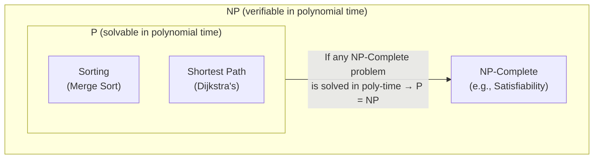

---
tags:
  - "#CCT2"
  - DS
Topic: Algorithm design paradigms | Sorting algorithms | Introduction to recursive algorithms and recursive definitions | Correctness of recursive algorithms using induction | Greedy algorithms
Semester: CCT2
Course: Diskrete strukturer
Litterature: Discrete Mathematics and Its Applications - 8th Ed. | Introduction to Algorithms 4th Ed.
Created: 19-04-2026
---
# Algorithms & Recursive Algorithms — Complexity, Correctness, and Sorting

---
# Table of Contents

1. [[#Quick Reference Table|Quick Reference Table]]
2. [[#Complexity of Algorithms|Complexity of Algorithms]]
	1. [[#Complexity of Algorithms#What Is Algorithm Efficiency?|What Is Algorithm Efficiency?]]
	2. [[#Complexity of Algorithms#Time Complexity|Time Complexity]]
	3. [[#Complexity of Algorithms#Finding the Maximum Element|Finding the Maximum Element]]
	4. [[#Complexity of Algorithms#Linear Search|Linear Search]]
	5. [[#Complexity of Algorithms#Worst-Case Complexity|Worst-Case Complexity]]
	6. [[#Complexity of Algorithms#Average-Case Complexity|Average-Case Complexity]]
	7. [[#Complexity of Algorithms#Sorting Algorithms: Worst-Case Complexity|Sorting Algorithms: Worst-Case Complexity]]
	8. [[#Complexity of Algorithms#Complexity of Matrix Multiplication|Complexity of Matrix Multiplication]]
	9. [[#Complexity of Algorithms#Matrix-Chain Multiplication|Matrix-Chain Multiplication]]
	10. [[#Complexity of Algorithms#Algorithmic Paradigms|Algorithmic Paradigms]]
		1. [[#Algorithmic Paradigms#Brute-Force Algorithms|Brute-Force Algorithms]]
	11. [[#Complexity of Algorithms#Understanding Complexity Classes|Understanding Complexity Classes]]
	12. [[#Complexity of Algorithms#Tractability|Tractability]]
	13. [[#Complexity of Algorithms#P vs. NP|P vs. NP]]
	14. [[#Complexity of Algorithms#Practical Impact of Complexity|Practical Impact of Complexity]]
3. [[#Recursive Algorithms|Recursive Algorithms]]
	1. [[#Recursive Algorithms#Introduction to Recursion|Introduction to Recursion]]
	2. [[#Recursive Algorithms#Examples of Recursive Algorithms|Examples of Recursive Algorithms]]
	3. [[#Recursive Algorithms#Proving Recursive Algorithms Correct|Proving Recursive Algorithms Correct]]
	4. [[#Recursive Algorithms#Recursion vs. Iteration|Recursion vs. Iteration]]
		1. [[#Recursion vs. Iteration#Fibonacci: Recursive vs. Iterative|Fibonacci: Recursive vs. Iterative]]
	5. [[#Recursive Algorithms#Merge Sort|Merge Sort]]
		1. [[#Merge Sort#Merging Two Sorted Lists|Merging Two Sorted Lists]]
		2. [[#Merge Sort#Complexity of Merge Sort|Complexity of Merge Sort]]
4. [[#Program Correctness|Program Correctness]]
	1. [[#Program Correctness#Introduction|Introduction]]
	2. [[#Program Correctness#Partial Correctness and Hoare Triples|Partial Correctness and Hoare Triples]]
	3. [[#Program Correctness#Rules of Inference|Rules of Inference]]
	4. [[#Program Correctness#Conditional Statements|Conditional Statements]]
		1. [[#Conditional Statements#`if` Without `else`|`if` Without `else`]]
		2. [[#Conditional Statements#`if`–`else`|`if`–`else`]]
	5. [[#Program Correctness#Loop Invariants|Loop Invariants]]
5. [[#Insertion Sort (CLRS)|Insertion Sort (CLRS)]]
	1. [[#Insertion Sort (CLRS)#Introduction|Introduction]]
	2. [[#Insertion Sort (CLRS)#The Insertion Sort Algorithm|The Insertion Sort Algorithm]]
	3. [[#Insertion Sort (CLRS)#Loop Invariant and Correctness|Loop Invariant and Correctness]]
	4. [[#Insertion Sort (CLRS)#Pseudocode Conventions|Pseudocode Conventions]]

## Quick Reference Table

| Concept | Notation / Syntax | Description |
|---|---|---|
| Time Complexity (Big-Theta) | $\Theta(g(n))$ | Tight bound: $C_1 g(n) \leq f(n) \leq C_2 g(n)$ for all $n > k$ |
| Big-O (Upper Bound) | $O(g(n))$ | Upper bound only; commonly used in practice |
| Hoare Triple | $p\{S\}q$ | Program $S$ is partially correct w.r.t. precondition $p$ and postcondition $q$ |
| Loop Invariant | $(p \wedge \text{cond})\{S\}p$ | Assertion that holds before and after every loop iteration |
| Composition Rule | $p\{S_1\}q,\ q\{S_2\}r \Rightarrow p\{S_1;S_2\}r$ | Chain partial correctness across sequential segments |
| Floor Function | $\lfloor x \rfloor$ | Largest integer less than or equal to $x$ |
| Subarray Notation | `A[i : j]` | Elements `A[i], A[i+1], …, A[j]` |
| Boolean Product | $A \odot B$ | Matrix product using $\vee$ (OR) instead of $+$ and $\wedge$ (AND) instead of $\times$ |
| Worst-Case Complexity | Max operations over all inputs of size $n$ | Guarantees an upper bound on runtime |
| Average-Case Complexity | Avg operations over all inputs of size $n$ | Generally harder to compute than worst-case |
| Tractable | Polynomial or better worst-case complexity | Solvable in reasonable time for reasonable inputs |
| Intractable | No polynomial-time algorithm known | Becomes infeasible even for moderate input sizes |
| Class P | Solvable in polynomial time | Definitively tractable problems |
| Class NP | Solution verifiable in polynomial time | Includes all of P; $P = NP$ is unknown |
| NP-Complete | Hardest problems in NP | If any one is in P, all of NP is in P |
| Cook-Levin Theorem | Satisfiability is NP-complete | First NP-completeness proof (early 1970s) |
| Recursive Algorithm | Reduces problem to smaller instance of itself | Requires base case + recursive step |
| $\Sigma$ (Summation) | $\sum_{i=1}^{n} x_i$ | Sum of a sequence of terms from $i=1$ to $n$ |

_Table 1.1: Quick reference for core concepts, notation, and terminology used throughout this note._

---

## Complexity of Algorithms

### What Is Algorithm Efficiency?

A satisfactory algorithm must do two things: produce the correct answer, and do so *efficiently*. Efficiency is measured along two dimensions:

- **Time complexity:** The number of operations required as a function of input size.
- **Space complexity:** The amount of memory required as a function of input size.

Space complexity is closely tied to specific data structures, so the focus here is exclusively on **time complexity**.

### Time Complexity

Time complexity counts the number of *operations* performed (comparisons, additions, multiplications, etc.) rather than actual clock time. This is because different machines operate at different speeds — the fastest computers can execute a bit operation in $10^{-11}$ seconds, while personal computers may take $10^{-8}$ seconds for the same operation. By counting operations abstractly, we get a hardware-independent measure of efficiency.

---

### Finding the Maximum Element

>[!example] Finding the Maximum Element in a List of $n$ Elements
>The algorithm sets a temporary maximum to the first element, then iterates through the remaining elements. For each of the 2nd through $n$th elements, **two comparisons** are made:
>1. Check whether the end of the list has been reached ($i \leq n$)
>2. Check whether the current element is larger than the temporary maximum ($\text{max} < a_i$)
>
>One final comparison exits the loop when $i = n + 1$. Total comparisons:
>$$2(n - 1) + 1 = 2n - 1$$
>This count is independent of the specific input values, so this algorithm has time complexity $\Theta(n)$.

---

### Linear Search

>[!example] Linear Search (Worst-Case and Best-Case)
>At each step, two comparisons are made: one to check whether the end of the list is reached ($i \leq n$), and one to compare the target $x$ against the current element ($x \neq a_i$). One additional comparison is made outside the loop.
>
>- If $x = a_i$ at position $i$: $2i + 1$ comparisons are used.
>- If $x$ is **not** in the list: $2n + 2$ comparisons are used (worst case).
>
>**Worst-case time complexity:** $\Theta(n)$

---

### Worst-Case Complexity

*Worst-case complexity* is the maximum number of operations an algorithm requires for any input of a given size. It is a **guarantee** — the algorithm always finishes within this bound.

>[!example] Binary Search (Worst-Case)
>Assume a sorted list of $n = 2^k$ elements. At each stage, two comparisons are made:
>1. Check whether the restricted search range has more than one element ($i < j$)
>2. Compare the target $x$ against the middle element
>
>Each stage halves the search space. Starting from $2^k$ elements and working down to $1$ element takes $k$ stages. The final single-element check adds $2$ more comparisons:
>$$\text{Total} \leq 2k + 2 = 2\log n + 2 \text{ comparisons}$$
>**Worst-case time complexity:** $\Theta(\log n)$ — more efficient than linear search in the worst case.

---

### Average-Case Complexity

*Average-case complexity* measures the average number of operations over all possible inputs of a given size. It is generally harder to compute than worst-case complexity because it requires making assumptions about the distribution of inputs.

>[!example] Average-Case Linear Search
>Assume $x$ is guaranteed to be in the list and equally likely to be at any position. Finding $x$ at position $i$ requires $2i + 1$ comparisons. Averaging over all $n$ positions:
>$$\text{Average} = \frac{3 + 5 + 7 + \cdots + (2n+1)}{n} = \frac{2(1 + 2 + \cdots + n) + n}{n}$$
>
>Using the summation formula $\displaystyle\sum_{i=1}^{n} i = \frac{n(n+1)}{2}$:
>
>$$\text{Average} = \frac{2 \cdot \frac{n(n+1)}{2}}{n} + 1 = n + 2$$
>
>This is $\Theta(n)$, consistent with the worst-case result.

---

### Sorting Algorithms: Worst-Case Complexity

>[!example] Bubble Sort
>Bubble sort makes repeated passes through a list, comparing adjacent elements. During pass $i$, exactly $n - i$ comparisons are made. Total comparisons over all $n - 1$ passes:
>$$(n-1) + (n-2) + \cdots + 2 + 1 = \frac{(n-1)n}{2}$$
>Bubble sort always performs this full count — even if the list becomes sorted early — so its worst-case (and always-case) complexity is $\Theta(n^2)$.

>[!example] Insertion Sort
>Insertion sort places the $j$th element into its correct position among the first $j - 1$ already-sorted elements. In the worst case, $j$ comparisons are needed for the $j$th element. Summing from the 2nd to the $n$th element:
>$$2 + 3 + \cdots + n = \frac{n(n+1)}{2} - 1$$
>**Worst-case complexity:** $\Theta(n^2)$. However, insertion sort can use far fewer comparisons on nearly-sorted lists.

---

### Complexity of Matrix Multiplication

Given an $m \times k$ matrix $A$ and a $k \times n$ matrix $B$, their product $C = AB$ is an $m \times n$ matrix. Each entry $c_{ij}$ is computed as the dot product of a row of $A$ and a column of $B$.

```pseudocode
procedure matrix_multiplication(A, B: matrices)
for i := 1 to m
    for j := 1 to n
        cij := 0
        for q := 1 to k
            cij := cij + aiq * bqj   -- accumulate dot product entry by entry
return C   -- C = [cij] is the product of A and B
```

>[!example] Multiplying Two $n \times n$ Matrices
>The product has $n^2$ entries. Computing each entry requires:
>- $n$ multiplications
>- $n - 1$ additions
>
>Totals across all entries:
>- **$n^3$ multiplications**
>- **$n^2(n - 1)$ additions**
>
>Overall complexity: $O(n^3)$.
>
>More advanced algorithms (e.g., Strassen's algorithm) can reduce this to $O(n^{\sqrt{7}})$ multiplications and additions.

The **Boolean product** $A \odot B$ of two zero-one matrices follows the same nested loop structure, replacing addition with $\vee$ (OR) and multiplication with $\wedge$ (AND):

```pseudocode
procedure Boolean_product(A, B: zero-one matrices)
for i := 1 to m
    for j := 1 to n
        cij := 0
        for q := 1 to k
            cij := cij ∨ (aiq ∧ bqj)   -- OR and AND replace + and *
return C   -- C = [cij] is the Boolean product of A and B
```

>[!example] Boolean Product of $n \times n$ Zero-One Matrices
>Each of the $n^2$ entries requires $n$ OR operations and $n$ AND operations — $2n$ bit operations per entry:
>$$2n \times n^2 = 2n^3 \text{ bit operations}$$

---

### Matrix-Chain Multiplication

When multiplying a chain of matrices $A_1 A_2 \cdots A_n$, the final result is the same regardless of the order in which pairs are multiplied (matrix multiplication is associative), but the *total number of operations* can vary dramatically depending on the grouping. Multiplying an $m_1 \times m_2$ matrix by an $m_2 \times m_3$ matrix requires $m_1 m_2 m_3$ integer multiplications.

>[!example] Optimal Ordering for $A_1 A_2 A_3$
>Let $A_1$ be $30 \times 20$, $A_2$ be $20 \times 40$, $A_3$ be $40 \times 10$.
>
>**Option 1:** $A_1(A_2 A_3)$
>- $A_2 A_3$: $20 \cdot 40 \cdot 10 = 8{,}000$ multiplications → yields a $20 \times 10$ matrix
>- $A_1(A_2 A_3)$: $30 \cdot 20 \cdot 10 = 6{,}000$ multiplications
>- **Total: $14{,}000$ multiplications**
>
>**Option 2:** $(A_1 A_2)A_3$
>- $A_1 A_2$: $30 \cdot 20 \cdot 40 = 24{,}000$ multiplications → yields a $30 \times 40$ matrix
>- $(A_1 A_2)A_3$: $30 \cdot 40 \cdot 10 = 12{,}000$ multiplications
>- **Total: $36{,}000$ multiplications**
>
>Option 1 requires less than half the operations of Option 2. Choosing the right multiplication order matters significantly.

---

### Algorithmic Paradigms

An *algorithmic paradigm* is a general problem-solving strategy applicable across many different problems. Two foundational paradigms are:

- **Greedy algorithms:** Make the locally optimal choice at each step.
- **Brute force:** Solve the problem in the most direct way possible, without exploiting special structure.

#### Brute-Force Algorithms

A *brute-force algorithm* solves a problem directly from its definition, typically by checking every possible solution. Examples include:
- Summing $n$ numbers one at a time
- Matrix multiplication from its definition
- Bubble sort, insertion sort, and selection sort

Although often inefficient, brute-force algorithms are still useful: they handle small inputs practically and serve as a baseline against which more sophisticated algorithms are measured.

>[!example] Brute-Force Closest Pair of Points
>Given $n$ points $(x_1, y_1), \ldots, (x_n, y_n)$ in the plane, the brute-force approach computes the squared distance between every pair and tracks the minimum.
>
>Squared distance is used instead of actual (Euclidean) distance to avoid a square root computation. The pair with the smallest squared distance is always the same as the pair with the smallest actual distance, so the result is identical.
>
>```pseudocode
>procedure closest-pair((x1,y1),(x2,y2),…,(xn,yn): pairs of real numbers)
>min := ∞
>for i := 2 to n
>    for j := 1 to i − 1
>        if (xj − xi)^2 + (yj − yi)^2 < min then
>            min := (xj − xi)^2 + (yj − yi)^2
>            closest pair := ((xi, yi), (xj, yj))
>return closest pair
>```
>
>There are $\dfrac{n(n-1)}{2}$ pairs to check. Each check involves a fixed number of arithmetic operations and one comparison, so the overall complexity is $\Theta(n^2)$.

---

### Understanding Complexity Classes

| Complexity | Terminology | Example |
|---|---|---|
| $\Theta(1)$ | Constant | Always examines exactly $100$ elements |
| $\Theta(\log n)$ | Logarithmic | Binary search |
| $\Theta(n)$ | Linear | Linear search |
| $\Theta(n \log n)$ | Linearithmic | Merge sort |
| $\Theta(n^b)$ | Polynomial | Bubble sort ($b = 2$) |
| $\Theta(b^n)$, $b > 1$ | Exponential | Checking all truth assignments ($b = 2$) |
| $\Theta(n!)$ | Factorial | All orderings for the traveling salesperson |

_Table 1.2: Common complexity classes, their terminology, and canonical examples._

---

### Tractability

>[!info] Tractable vs. Intractable Problems
>- A problem is **tractable** if it can be solved by an algorithm with polynomial (or better) worst-case complexity. Such algorithms are expected to finish in reasonable time for reasonably sized inputs.
>- A problem is **intractable** if no polynomial-time algorithm is known. In general, intractable problems require enormous time even for small inputs in the worst case.
>
>**Caveat:** Polynomial worst-case complexity does not guarantee fast performance in all cases. If the polynomial has a very high degree or very large coefficients, the algorithm may still be slow. In practice, however, polynomials arising in algorithm analysis tend to have small degrees and small coefficients.

Intractable problems can sometimes be managed in practice via:
- **Average-case analysis:** Many inputs may be solved quickly even when the worst case is slow.
- **Approximate solutions:** Fast algorithms can find near-optimal solutions when exact solutions are too costly.

Some problems go even further — they are *unsolvable*, meaning **no algorithm can solve them at all**. Alan Turing proved the first such result: the *halting problem* (determining whether an arbitrary program will eventually stop) cannot be solved by any algorithm.

---

### P vs. NP

>[!info] Class P and Class NP
>- **Class P:** Problems solvable in polynomial worst-case time — the definitively tractable problems.
>- **Class NP:** Problems for which a proposed solution can be *verified* in polynomial time. NP stands for *nondeterministic polynomial time*.
>
>Every problem in P is also in NP. Whether $P = NP$ is one of the great open problems in mathematics and computer science.

A key example is the **satisfiability problem**: given a compound proposition, determine whether some assignment of truth values makes it true. Verifying a solution is fast, but finding one (as far as is known) requires checking all $2^n$ possible assignments — exponential time.

>[!info] NP-Complete Problems
>*NP-complete* problems are a special subset of NP with a remarkable property: if *any* NP-complete problem can be solved in polynomial time, then *every* problem in NP can be solved in polynomial time.
>
>The satisfiability problem was the first proven NP-complete problem — a result called the **Cook-Levin theorem**, proved independently by Stephen Cook and Leonid Levin in the early 1970s. Over $3{,}000$ NP-complete problems are now known.

The relationship between these classes can be visualised as a containment hierarchy:



_Figure 1.1: The containment relationship between complexity classes P, NP, and NP-Complete. P is a subset of NP. NP-Complete problems sit at the hardest boundary of NP — solving any one in polynomial time would collapse P and NP into a single class._

The **P versus NP problem** is one of the seven Millennium Prize Problems, carrying a $\$1{,}000{,}000$ award from the Clay Mathematics Institute. Most theoretical computer scientists believe $P \neq NP$, since despite decades of research, no polynomial-time algorithm has been found for any NP-complete problem.

---

### Practical Impact of Complexity

A $\Theta(g(n))$ estimate means there exist constants $C_1$, $C_2$, and $k$ such that:

$$C_1 g(n) \leq f(n) \leq C_2 g(n) \quad \text{for all } n > k$$

Without knowing these constants, the exact operation count cannot be read off from the estimate alone. In practice, big-$O$ estimates (upper bound only) are commonly used, with the understanding that $\Theta$ would be more precise.

The table below shows the actual time to execute a given number of bit operations at $10^{-11}$ seconds per operation (a reasonable estimate for the fastest computers in 2018). Entries marked `*` exceed $10^{100}$ years.

| $n$ | $\log n$ | $n$ | $n \log n$ | $n^2$ | $2^n$ | $n!$ |
|---|---|---|---|---|---|---|
| $10$ | $3 \times 10^{-11}$ s | $10^{-10}$ s | $3 \times 10^{-10}$ s | $10^{-9}$ s | $10^{-8}$ s | $3 \times 10^{-7}$ s |
| $10^2$ | $7 \times 10^{-11}$ s | $10^{-9}$ s | $7 \times 10^{-9}$ s | $10^{-7}$ s | $4 \times 10^{11}$ yr | `*` |
| $10^3$ | $1.0 \times 10^{-10}$ s | $10^{-8}$ s | $1 \times 10^{-7}$ s | $10^{-5}$ s | `*` | `*` |
| $10^4$ | $1.3 \times 10^{-10}$ s | $10^{-7}$ s | $1 \times 10^{-6}$ s | $10^{-3}$ s | `*` | `*` |
| $10^5$ | $1.7 \times 10^{-10}$ s | $10^{-6}$ s | $2 \times 10^{-5}$ s | $0.1$ s | `*` | `*` |
| $10^6$ | $2 \times 10^{-10}$ s | $10^{-5}$ s | $2 \times 10^{-4}$ s | $0.17$ min | `*` | `*` |

_Table 1.3: Execution times for common complexity classes at $10^{-11}$ seconds per bit operation. Entries marked `*` exceed $10^{100}$ years._

Polynomial algorithms scale to large inputs. Exponential and factorial algorithms become completely infeasible for even modest inputs — and improvements in hardware provide only marginal gains against these growth rates.

---

## Recursive Algorithms

### Introduction to Recursion

Some problems can be solved by reducing them to a simpler version of the *same* problem with a smaller input. This reduction is applied repeatedly until a *base case* is reached — a simple version with a known, directly computable solution.

>[!info] Recursive Algorithm
>An algorithm is *recursive* if it solves a problem by reducing it to an instance of the **same problem with smaller input**.

Every recursive algorithm has two essential components:
- **Base case:** A simple input for which the answer is known directly (no further reduction needed).
- **Recursive step:** A rule that reduces the current input to a smaller input and calls the algorithm again.

For example, finding $\gcd(a, b)$ where $b > a$ uses the identity:
$$\gcd(a, b) = \gcd(b \bmod a, a)$$
This reduction continues until the smaller argument reaches zero, at which point $\gcd(a, 0) = a$.

>[!note] A note on pseudocode
>All pseudocode in these notes is intentionally informal — it prioritises clarity of logic over syntax of any specific language. It does not correspond to executable code in C, Python, Java, or any other language. Where CLRS-style conventions are used (Part IV), they are explained explicitly in [[#Pseudocode Conventions]].

---

### Examples of Recursive Algorithms

>[!example] Computing $n!$
>The factorial function is defined recursively: $n! = n \cdot (n-1)!$ for $n > 0$, with base case $0! = 1$.
>
>```pseudocode
>procedure factorial(n: nonnegative integer)
>if n = 0 then
>    return 1                     -- base case
>else
>    return n · factorial(n − 1)  -- recursive step
>```
>
>**Trace for $n = 4$:**
>- $4! = 4 \cdot 3!$
>- $3! = 3 \cdot 2!$
>- $2! = 2 \cdot 1!$
>- $1! = 1 \cdot 0! = 1$
>
>Working back up: $2! = 2,\ 3! = 6,\ 4! = 24$

>[!example] Computing $a^n$
>$a^n = a \cdot a^{n-1}$ for $n > 0$, with base case $a^0 = 1$.
>
>```pseudocode
>procedure power(a: nonzero real number, n: nonnegative integer)
>if n = 0 then
>    return 1                       -- base case
>else
>    return a · power(a, n − 1)     -- recursive step
>```

>[!example] Computing $\gcd(a, b)$ — Euclidean Algorithm
>```pseudocode
>procedure gcd(a, b: nonnegative integers with a < b)
>if a = 0 then
>    return b                   -- base case
>else
>    return gcd(b mod a, a)     -- recursive step
>```
>
>**Trace for $a = 5$, $b = 8$:**
>$$\gcd(5,8) \to \gcd(3,5) \to \gcd(2,3) \to \gcd(1,2) \to \gcd(0,1) = 1$$

>[!example] Recursive Modular Exponentiation
>Computing $b^n \bmod m$ directly by repeated multiplication is slow. A more efficient approach halves the exponent at each step:
>
>$$b^n \bmod m = \begin{cases} \left(b^{n/2} \bmod m\right)^2 \bmod m & \text{if } n \text{ is even} \\[6pt] \left(\left(b^{\lfloor n/2 \rfloor} \bmod m\right)^2 \bmod m \cdot b \bmod m\right) \bmod m & \text{if } n \text{ is odd} \end{cases}$$
>
>**Breakdown:**
>- **$b$** : The base being exponentiated.
>- **$n$** : The exponent; halved at each recursive step, giving $O(\log n)$ recursive depth.
>- **$m$** : The modulus; all intermediate results are reduced $\bmod\ m$ to keep numbers small.
>- **$\lfloor n/2 \rfloor$** : The *floor function* — largest integer $\leq n/2$, used to handle odd exponents.
>
>```pseudocode
>procedure mpower(b, n, m: integers with b > 0, m ≥ 2, n ≥ 0)
>if n = 0 then
>    return 1                                              -- base case: b^0 = 1
>else if n is even then
>    return mpower(b, n/2, m)^2 mod m                     -- halve exponent (even)
>else
>    return (mpower(b, ⌊n/2⌋, m)^2 mod m · b mod m) mod m -- halve exponent (odd)
>```
>
>**Trace for $b = 2$, $n = 5$, $m = 3$:**
>- `mpower(2, 5, 3)` → odd → calls `mpower(2, 2, 3)`
>- `mpower(2, 2, 3)` → even → calls `mpower(2, 1, 3)`
>- `mpower(2, 1, 3)` → odd → calls `mpower(2, 0, 3)`
>- `mpower(2, 0, 3)` $= 1$ (base case)
>
>Back up: `mpower(2,1,3)` $= (1^2 \bmod 3 \cdot 2 \bmod 3) \bmod 3 = 2$, then `mpower(2,2,3)` $= 2^2 \bmod 3 = 1$, then `mpower(2,5,3)` $= (1^2 \bmod 3 \cdot 2 \bmod 3) \bmod 3 = 2$.

>[!example] Recursive Linear Search
>Search for the first occurrence of $x$ in $a_1, a_2, \ldots, a_n$. The call `search(1, n, x)` searches the full sequence.
>
>```pseudocode
>procedure search(i, j, x: integers, 1 ≤ i ≤ j ≤ n)
>if ai = x then
>    return i                        -- found: return position
>else if i = j then
>    return 0                        -- base case: single element, no match
>else
>    return search(i + 1, j, x)     -- recursive step: skip first, search the rest
>```

>[!example] Recursive Binary Search
>Search for $x$ in a *sorted* sequence $a_1, \ldots, a_n$. Compare $x$ to the middle element $a_m$ where $m = \lfloor(i+j)/2\rfloor$. The call `binary_search(1, n, x)` searches the full sequence.
>
>```pseudocode
>procedure binary_search(i, j, x: integers, 1 ≤ i ≤ j ≤ n)
>m := ⌊(i + j)/2⌋
>if x = am then
>    return m                                   -- found
>else if (x < am and i < m) then
>    return binary_search(i, m − 1, x)          -- search left half
>else if (x > am and j > m) then
>    return binary_search(m + 1, j, x)          -- search right half
>else
>    return 0                                    -- not found
>```

---

### Proving Recursive Algorithms Correct

Mathematical induction — specifically *strong induction* — is the standard tool for proving that a recursive algorithm is correct. The structure maps naturally onto recursion:

- The **basis step** proves correctness at the algorithm's base case.
- The **inductive step** proves that if the algorithm works for all smaller inputs (the inductive hypothesis), it works for the current input too.

See [[#Loop Invariants]] for the analogous technique applied to iterative algorithms.

>[!example] Proving the Recursive Power Algorithm Correct
>**Claim:** `power(a, n)` returns $a^n$ for all nonzero real $a$ and nonnegative integers $n$.
>
>**Proof by mathematical induction on $n$:**
>
>**Basis step ($n = 0$):** The algorithm returns $1$. Since $a^0 = 1$ for every nonzero $a$, this is correct. ✓
>
>**Inductive step:** Assume `power(a, k)` $= a^k$ for some arbitrary nonneg. integer $k$. We show `power(a, k+1)` $= a^{k+1}$.
>
>Since $k + 1 > 0$, the algorithm takes the recursive branch:
>$$\text{power}(a,\, k+1) = a \cdot \text{power}(a,\, k)$$
>By the inductive hypothesis:
>$$= a \cdot a^k = a^{k+1} \quad \checkmark$$
>
>Therefore, the algorithm correctly computes $a^n$ for all nonzero $a$ and nonneg. integers $n$. $\blacksquare$

>[!example] Proving the Modular Exponentiation Algorithm Correct
>**Claim:** `mpower(b, n, m)` returns $b^n \bmod m$ for all $b > 0$, $n \geq 0$, $m \geq 2$.
>
>**Proof by strong induction on $n$:**
>
>**Basis step ($n = 0$):** The algorithm returns $1$. Since $b^0 \bmod m = 1$, this is correct. ✓
>
>**Inductive step:** Assume `mpower(b, j, m)` $= b^j \bmod m$ for all $0 \leq j < k$. We show correctness for $n = k$.
>
>**Case 1 — $k$ is even:**
>$$\text{mpower}(b, k, m) = (\text{mpower}(b,\, k/2,\, m))^2 \bmod m$$
>Since $k/2 < k$, by the inductive hypothesis `mpower(b, k/2, m)` $= b^{k/2} \bmod m$, so:
>$$= (b^{k/2} \bmod m)^2 \bmod m = b^k \bmod m \quad \checkmark$$
>
>**Case 2 — $k$ is odd:**
>$$\text{mpower}(b, k, m) = \left((\text{mpower}(b,\, \lfloor k/2 \rfloor,\, m))^2 \bmod m \cdot b \bmod m\right) \bmod m$$
>Since $\lfloor k/2 \rfloor < k$, by the inductive hypothesis:
>$$= \left((b^{\lfloor k/2 \rfloor} \bmod m)^2 \bmod m \cdot b \bmod m\right) \bmod m = b^{2\lfloor k/2 \rfloor + 1} \bmod m$$
>Since $k$ is odd, $\lfloor k/2 \rfloor = (k-1)/2$, so $2\lfloor k/2 \rfloor + 1 = k$:
>$$= b^k \bmod m \quad \checkmark$$
>
>Both cases return the correct value. $\blacksquare$

>[!note] Why Strong Induction?
>In the modular exponentiation proof, the recursive call uses $\lfloor k/2 \rfloor$, which is not necessarily $k - 1$. Simple induction provides a hypothesis only about $k - 1$, which is insufficient here. **Strong induction** provides the hypothesis for *all* values less than $k$, covering any smaller input the recursion might reach.

---

### Recursion vs. Iteration

A recursive algorithm works *top-down* — reducing the problem to smaller instances until reaching the base case. An *iterative* algorithm works *bottom-up* — starting from the base case and building up toward the answer.

Iterative algorithms are often far more computationally efficient, though recursive implementations can be simpler to write and reason about.

#### Fibonacci: Recursive vs. Iterative

The Fibonacci sequence is defined recursively: $f_n = f_{n-1} + f_{n-2}$, with $f_0 = 0$, $f_1 = 1$.

**Recursive implementation:**
```pseudocode
procedure fibonacci(n: nonnegative integer)
if n = 0 then return 0                              -- base case
else if n = 1 then return 1                         -- base case
else return fibonacci(n − 1) + fibonacci(n − 2)    -- two recursive calls
```

The problem: each non-base-case call spawns *two* more calls. The number of evaluations roughly doubles at each level, computing the same sub-values repeatedly. Computing $f_n$ this way requires $f_{n+1} - 1$ additions — **exponential growth**.

![[Pasted image 20260419201611.png]]

_Figure 2.1: Recursive call tree for computing Fibonacci numbers. Note the repeated subcomputations — e.g., $f_2$ is recomputed multiple times._

**Iterative implementation:**
```pseudocode
procedure iterative_fibonacci(n: nonnegative integer)
if n = 0 then return 0
else
    x := 0      -- tracks f_{i-1}, initialized to f_0
    y := 1      -- tracks f_i, initialized to f_1
    for i := 1 to n − 1
        z := x + y   -- compute next Fibonacci number
        x := y        -- advance: x moves up one position
        y := z        -- advance: y moves up one position
    return y
```

At each iteration, `x` and `y` hold two consecutive Fibonacci numbers. After $n - 1$ iterations, `y` holds $f_n$. Total additions required: $n - 1$ — a dramatic improvement.

>[!warning] Recursion Can Be Expensive
>For recursively defined sequences like Fibonacci, a naive recursive algorithm recomputes the same subproblems many times. The iterative version computes each value exactly once. Unless the runtime environment specifically optimizes recursion (e.g., tail-call optimization), the iterative approach will be significantly faster.

---

### Merge Sort

*Merge sort* is a recursive sorting algorithm that works by:
1. **Splitting** the list into two roughly equal halves
2. **Recursively sorting** each half
3. **Merging** the two sorted halves back into one sorted list

>[!example] Merge Sort on a List
>To sort the list $8, 2, 4, 6, 9, 7, 10, 1, 5, 3$:
>
>**Splitting phase:** The list is recursively split into halves until every sublist has one element. A single-element list is trivially sorted.
>
>**Merging phase:** Pairs of sorted sublists are merged into sorted lists of double the size, working back up until the full list is sorted.

![[Pasted image 20260419201631.png]]

_Figure 2.2: Split and merge phases of merge sort on a $10$-element list. The left side shows the splitting tree; the right shows the merging process._

```pseudocode
procedure mergesort(L = a1, …, an)
if n > 1 then
    m := ⌊n/2⌋
    L1 := a1, a2, …, am               -- left half
    L2 := am+1, am+2, …, an           -- right half
    L := merge(mergesort(L1), mergesort(L2))   -- sort each half, then merge
-- L is now sorted in nondecreasing order
```

#### Merging Two Sorted Lists

The core operation is merging two already-sorted lists into a single sorted list. Repeatedly compare the front elements of each list, move the smaller to the output, and append whatever remains when one list is exhausted.

>[!example] Merging $2, 3, 5, 6$ and $1, 4$
>
>| First List | Second List | Merged List | Action |
>|:---|:---|:---|:---|
>| 2, 3, 5, 6 | 1, 4 | | Take $1$ ($1 < 2$) |
>| 2, 3, 5, 6 | 4 | 1 | Take $2$ ($2 < 4$) |
>| 3, 5, 6 | 4 | 1, 2 | Take $3$ ($3 < 4$) |
>| 5, 6 | 4 | 1, 2, 3 | Take $4$ ($4 < 5$) |
>| 5, 6 | _(empty)_ | 1, 2, 3, 4 | Append remainder |
>| _(empty)_ | _(empty)_ | 1, 2, 3, 4, 5, 6 | Done |
>
>_Table 2.1: Step-by-step trace of merging the sorted lists $2, 3, 5, 6$ and $1, 4$ into a single sorted list._

```pseudocode
procedure merge(L1, L2: sorted lists)
L := empty list
while L1 and L2 are both nonempty
    remove the smaller of the first elements of L1 and L2 from its list
    put it at the right end of L
if one list is now empty then
    append all remaining elements of the other list to L
return L
```

>[!summary] theorem : Lemma — Cost of Merging Two Sorted Lists
>Two sorted lists with $m$ and $n$ elements can be merged into a single sorted list using **at most $m + n - 1$ comparisons**.
>
>**Breakdown:**
>- **$m$, $n$** : The number of elements in the first and second sorted lists respectively.
>- **$m + n - 1$** : The upper bound on comparisons. Each comparison places one element into the output; the final $-1$ reflects that the last element of the last non-empty list is appended without a comparison.
>
>**Proof:**
>Each comparison places exactly one element into the output list. Once one list is empty, the remaining elements of the other are appended without any further comparisons. The worst case occurs when the last comparison leaves exactly one element in each list — after $m + n - 2$ comparisons, one final comparison empties one list, for a total of $m + n - 1$. $\blacksquare$

#### Complexity of Merge Sort

Assume $n = 2^m$ elements (a power of $2$ for simplicity; the result generalizes).

**Structure:** At level $k$ of the merge phase, there are $2^{k-1}$ pairs of lists each containing $2^{m-k}$ elements being merged into lists of $2^{m-k+1}$ elements. By the lemma, each such merge costs at most:
$$2^{m-k} + 2^{m-k} - 1 = 2^{m-k+1} - 1 \text{ comparisons}$$

Total comparisons at level $k$:
$$2^{k-1}(2^{m-k+1} - 1)$$

Summing over all $m$ levels:
$$\sum_{k=1}^{m} 2^{k-1}(2^{m-k+1} - 1) = \sum_{k=1}^{m} 2^m - \sum_{k=1}^{m} 2^{k-1} = m \cdot 2^m - (2^m - 1)$$

Substituting $n = 2^m$ and $m = \log n$:
$$= n \log n - n + 1$$

>[!summary] theorem : Merge Sort Complexity
>The number of comparisons needed to merge sort a list of $n$ elements is $O(n \log n)$.
>
>**Breakdown:**
>- **$n$** : The number of elements in the list.
>- **$\log n$** : The number of levels of splitting/merging — each level halves (or doubles) the sublist sizes.
>- **$O(n \log n)$** : The total comparison count, derived by multiplying the cost per level ($O(n)$ comparisons distributed across all merges at that level) by the number of levels ($\log n$).
>
>**Proof:**
>Derived above by summing the per-level merge costs over all $m = \log n$ levels, yielding $n \log n - n + 1$, which is $O(n \log n)$. $\blacksquare$
>
>This makes merge sort significantly more efficient than [[#Sorting Algorithms Worst-Case Complexity|bubble sort or insertion sort]], both of which have $\Theta(n^2)$ worst-case complexity.

---

## Program Correctness

### Introduction

Even a syntactically correct program that passes all test cases may still produce wrong answers for untested inputs. Testing alone is not sufficient to guarantee correctness — a *proof* is needed.

**Program verification** is the formal proof that a program always produces the correct output for every valid input, using rules of inference and proof techniques including mathematical induction.

---

### Partial Correctness and Hoare Triples

>[!info] Program Correctness and Partial Correctness
>A program is **correct** if it produces the correct output for every possible input. Proving full correctness has two parts:
>1. **Partial correctness:** If the program terminates, it produces the correct output.
>2. **Termination:** The program always terminates.
>
>Two propositions frame what "correct" means:
>- **Initial assertion** $p$: properties that the input values must satisfy (precondition).
>- **Final assertion** $q$: properties that the output must satisfy (postcondition).

>[!info] Hoare Triple
>A program segment $S$ is **partially correct** with respect to $p$ and $q$ if: whenever $p$ is true for the inputs and $S$ terminates, then $q$ is true for the outputs. Written as:
>$$p\{S\}q$$
>This notation was introduced by Tony Hoare.

>[!example] Verifying a Simple Program Segment
>**Program:**
>```pseudocode
>y := 2
>z := x + y
>```
>**Initial assertion $p$:** $x = 1$ | **Final assertion $q$:** $z = 3$
>
>If $p$ is true, then $x = 1$. After `y := 2`, $y = 2$. After `z := x + y`, $z = 3$. So $q$ is satisfied. Therefore $p\{S\}q$ holds. ✓

---

### Rules of Inference

A program $S$ can be split into sequential subprograms $S_1$ and $S_2$ — written $S = S_1;\ S_2$ — to make verification more manageable. The **composition rule** states:

$$\frac{p\{S_1\}q \quad q\{S_2\}r}{p\{S_1;\, S_2\}r}$$

>[!note] Reading Inference Rules
>In an inference rule, the expressions **above** the horizontal line are the *premises* — the conditions that must already be established. The expression **below** the line is the *conclusion* — what follows if the premises hold. For the composition rule: if we have already proved $p\{S_1\}q$ and $q\{S_2\}r$, we may conclude $p\{S_1;S_2\}r$.

The final assertion of one segment becomes the initial assertion of the next. This chains correctness proofs across sequential code.

---

### Conditional Statements

The following table summarises the verification conditions required for each form of conditional statement:

| Statement Form | Condition True | Condition False | Both Must Yield |
|---|---|---|---|
| `if cond then S` | Prove $(p \wedge \text{cond})\{S\}q$ | Prove $(p \wedge \neg\,\text{cond}) \to q$ | $q$ |
| `if cond then S1 else S2` | Prove $(p \wedge \text{cond})\{S_1\}q$ | Prove $(p \wedge \neg\,\text{cond})\{S_2\}q$ | $q$ |

_Table 3.1: Verification conditions for `if` and `if-else` conditional statements. In both forms, every possible execution path must independently establish the postcondition $q$._

#### `if` Without `else`

For `if condition then S`, the rule of inference is:

$$\frac{(p \wedge \text{condition})\{S\}q \quad (p \wedge \neg\,\text{condition}) \to q}{p\{\text{if condition then } S\}q}$$

Two things must be shown:
1. If the condition holds, executing $S$ leads to $q$.
2. If the condition does *not* hold (so $S$ is skipped), $q$ must already be satisfied without executing $S$.

>[!example] Verifying an `if` Statement
>**Program:**
>```pseudocode
>if x > y then
>    y := x
>```
>**$p$:** $T$ (always true) | **$q$:** $y \geq x$
>
>- **If $x > y$:** `y := x` executes, giving $y = x$, so $y \geq x$. ✓
>- **If $x \leq y$:** body is skipped; $y \geq x$ already holds. ✓
>
>Both cases satisfy $q$. The segment is correct. ✓

#### `if`–`else`

For `if condition then S1 else S2`, the rule of inference is:

$$\frac{(p \wedge \text{condition})\{S_1\}q \quad (p \wedge \neg\,\text{condition})\{S_2\}q}{p\{\text{if condition then } S_1 \text{ else } S_2\}q}$$

Both branches must independently lead to $q$.

>[!example] Verifying an `if`–`else` Statement (Absolute Value)
>**Program:**
>```pseudocode
>if x < 0 then
>    abs := −x
>else
>    abs := x
>```
>**$p$:** $T$ | **$q$:** $\text{abs} = |x|$
>
>- **If $x < 0$:** `abs := −x`. By definition $|x| = -x$ when $x < 0$, so $\text{abs} = |x|$. ✓
>- **If $x \geq 0$:** `abs := x`. By definition $|x| = x$ when $x \geq 0$, so $\text{abs} = |x|$. ✓
>
>Both branches satisfy $q$. The segment is correct. ✓

---

### Loop Invariants

A **loop invariant** is an assertion that remains true before and after every execution of the loop body. It is the key tool for proving correctness of `while` loops.

For `while condition do S`, an assertion $p$ is a loop invariant if:
$$(p \wedge \text{condition})\{S\}p$$

The rule of inference for `while` loops is:

$$\frac{(p \wedge \text{condition})\{S\}p}{p\{\text{while condition } S\}(\neg\,\text{condition} \wedge p)}$$

If $p$ is a loop invariant and holds before the loop begins, then when the loop terminates (if it does), both $p$ and $\neg\,\text{condition}$ are true.

>[!note] What Loop Invariants Establish
>A loop invariant alone only establishes *partial correctness* — it tells us what is true *if* the loop terminates. Termination must be argued separately, typically by identifying a quantity that strictly decreases (or increases toward a fixed bound) with each iteration.

>[!abstract] Loop Invariants as Mathematical Induction
>A loop invariant proof is structurally identical to a proof by mathematical induction:
>- **Initialization** corresponds to the *base case* — showing the invariant holds before the first iteration.
>- **Maintenance** corresponds to the *inductive step* — showing that if the invariant holds before an iteration, it holds after.
>- **Termination** is where the analogy ends: unlike induction (which continues for all $n$), the loop eventually exits, at which point the invariant combined with the negation of the loop condition gives the desired conclusion.

>[!example] Verifying a Factorial Loop
>**Program:**
>```pseudocode
>i := 1
>factorial := 1
>while i < n
>    i := i + 1
>    factorial := factorial · i
>```
>**Goal:** Show that when this terminates, `factorial` $= n!$ for positive integer $n$.
>
>**Loop invariant $p$:** `factorial` $= i!$ and $i \leq n$.
>
>**Step 1 — Prove $p$ is a loop invariant:**
>Assume $p$ holds and $i < n$ at the start of some iteration. After the body:
>$$i_\text{new} = i + 1, \quad \text{factorial}_\text{new} = \text{factorial} \cdot (i+1) = i! \cdot (i+1) = (i+1)! = i_\text{new}!$$
>Since $i < n$, we have $i_\text{new} \leq n$. So $p$ holds after the iteration. ✓
>
>**Step 2 — Verify $p$ holds before the loop:**
>$i = 1 \leq n$ and `factorial` $= 1 = 1! = i!$. So $p$ is initially true. ✓
>
>**Step 3 — Apply the rule of inference:**
>When the loop exits, $i < n$ is false and $p$ holds, so $i = n$ and `factorial` $= i! = n!$. ✓
>
>**Step 4 — Verify termination:**
>$i$ starts at $1$ and increases by $1$ each iteration, reaching $n$ after $n - 1$ iterations. ✓

>[!example] Verifying a Full Multiplication Program
>**Program** $S$ computes $m \times n$ for integers $m$ and $n$, split into four segments:
>
>```pseudocode
>procedure multiply(m, n: integers)
>S1: if n < 0 then a := −n else a := n      -- set a = |n|
>S2: k := 0                                  -- initialize counter
>    x := 0                                  -- initialize accumulator
>S3: while k < a                             -- add m to x exactly a times
>        x := x + m
>        k := k + 1
>S4: if n < 0 then product := −x            -- apply sign
>    else product := x
>    return product
>```
>
>![[Pasted image 20260419201026.png]]
>
>_Figure 3.1: Flowchart of the multiply procedure, showing the four sequential segments $S_1$ through $S_4$._
>
>**$p$:** $m$ and $n$ are integers | **$t$:** `product` $= mn$
>
>Applying the composition rule across all four segments:
>- **$p\{S_1\}q$:** $S_1$ sets $a = |n|$, so $q$: $p \wedge (a = |n|)$. ✓
>- **$q\{S_2\}r$:** $S_2$ initializes $k = 0$, $x = 0$, so $r$: $q \wedge (k=0) \wedge (x=0)$. ✓
>- **$r\{S_3\}s$:** Loop invariant for $S_3$: "$x = mk$ and $k \leq a$." Initially $x = m \cdot 0 = 0$ and $0 \leq a$. Each iteration preserves it. At exit: $k = a$, so $x = ma$, giving $s$: $x = ma$ and $a = |n|$. ✓
>- **$s\{S_4\}t$:** If $n \geq 0$: `product` $= x = ma = m|n| = mn$. If $n < 0$: `product` $= -x = -ma = -m|n| = mn$. So $t$: `product` $= mn$. ✓
>
>By the composition rule, $p\{S\}t$ holds. Since each segment terminates, $S$ is correct. $\blacksquare$

---

## Insertion Sort (CLRS)

### Introduction

The **sorting problem:** Given a sequence $\langle a_1, a_2, \ldots, a_n \rangle$, produce a permutation $\langle a_1', a_2', \ldots, a_n' \rangle$ such that $a_1' \leq a_2' \leq \cdots \leq a_n'$.

The numbers being sorted are called *keys*. In practice, keys are usually paired with *satellite data*, forming a *record* — the entire record moves with its key when sorted.

---

### The Insertion Sort Algorithm

>[!abstract] The Playing Card Analogy
>Insertion sort works exactly like sorting a hand of playing cards. Imagine picking up cards one at a time from a table:
>- The cards already in your hand are always kept in sorted order.
>- Each new card is inserted into the correct position by comparing it against the sorted cards from **right to left**, shifting larger cards one spot to the right until the correct gap is found.
>- The new card is placed in that gap.
>
>Insertion sort does exactly this — treating `A[1 : i-1]` as the "cards already in hand" and `A[i]` as the "new card" being inserted at each step.

```pseudocode
INSERTION-SORT(A, n)
1  for i = 2 to n
2      key = A[i]                    // element currently being inserted
3      // Insert A[i] into the sorted subarray A[1 : i – 1]
4      j = i – 1
5      while j > 0 and A[j] > key
6          A[j + 1] = A[j]           // shift larger element one position right
7          j = j – 1
8      A[j + 1] = key                // place key in its correct position
```

The outer `for` loop selects each element starting from position $2$. The inner `while` loop shifts elements larger than `key` one position right, then inserts `key` into the gap created.

---

### Loop Invariant and Correctness

>[!info] Loop Invariant for Insertion Sort
>At the start of each iteration of the `for` loop, the subarray `A[1 : i – 1]` consists of the elements *originally* in positions $1$ through $i-1$, in *sorted order*.

Proving a loop invariant requires three properties:

- **Initialization:** The invariant holds before the first iteration.
- **Maintenance:** If it holds before an iteration, it holds before the next.
- **Termination:** When the loop ends, the invariant (with the termination condition) proves the algorithm's correctness.

>[!note] Loop Invariants as Induction
>A loop invariant proof mirrors mathematical induction: initialization is the base case, and maintenance is the inductive step. The induction stops when the loop terminates — that is the key difference from a standard inductive proof over all natural numbers. See also [[#Loop Invariants]] in Part III for the formal rule of inference.

**Initialization ($i = 2$):** Before the first iteration, `A[1 : 1]` contains only `A[1]`. A single-element subarray is trivially sorted and contains its original element. The invariant holds. ✓

**Maintenance:** The `while` loop shifts elements of `A[1 : i-1]` greater than `key` one position right, then inserts `key` at the correct position. Afterward, `A[1 : i]` contains the original elements of positions $1$ through $i$ in sorted order. Incrementing $i$ leaves the invariant true for the next iteration. ✓

**Termination:** The counter $i$ starts at $2$ and increases by $1$ per iteration until $i > n$, so the loop exits with $i = n + 1$. Substituting into the invariant: `A[1 : n]` contains the original elements of `A[1 : n]` in sorted order. The entire array is sorted. $\blacksquare$

---

### Pseudocode Conventions

The following conventions are used throughout the CLRS pseudocode style:

| Convention | Description |
|---|---|
| Indentation | Indicates block structure (no `begin`/`end` or braces) |
| `to` / `downto` | Loop counter increments / decrements; `by` sets step size |
| Loop counter after exit | Retains its last value (e.g., after `for i = 2 to n`, $i = n+1$) |
| `//` | Rest of line is a comment |
| Variables | Local to their procedure unless stated otherwise |
| `A[i]` | Array element access; arrays are $1$-origin indexed by default |
| `A[i : j]` | Subarray `A[i], A[i+1], …, A[j]` |
| `x.f` | Attribute $f$ of object $x$; cascading: `x.f.g` means `(x.f).g` |
| `NIL` | Pointer referring to no object |
| Parameters | Simple variables passed by value; arrays and objects passed by pointer |
| `return` | Immediately exits the procedure; may return multiple values |
| `and` / `or` | Short-circuit evaluation |
| `error` | Signals invalid input; calling procedure handles it |

_Table 4.1: Summary of CLRS pseudocode conventions used in Part IV of this note._

---

>[!summary]
>## Summary
>
>**Part I — Complexity of Algorithms**
>
>Algorithm efficiency is measured by *time complexity* (operation count as a function of input size $n$) and *space complexity* (memory usage). Time complexity is hardware-independent and is the primary focus.
>
>- **Worst-case complexity** gives a guaranteed upper bound on operations for any input of size $n$.
>- **Average-case complexity** averages over all inputs; generally harder to compute.
>- Key algorithms and their complexities: linear search $\Theta(n)$, binary search $\Theta(\log n)$, bubble/insertion sort $\Theta(n^2)$, matrix multiplication $O(n^3)$, merge sort $O(n \log n)$.
>- **Brute-force algorithms** check all possibilities directly; simple but often inefficient.
>- **Matrix-chain multiplication:** the order of multiplications dramatically affects operation count even though the result is the same.
>- Complexity classes range from constant $\Theta(1)$ through factorial $\Theta(n!)$. Polynomial algorithms are *tractable*; exponential and factorial algorithms are *intractable* for large $n$.
>- **P vs. NP:** Class P = solvable in polynomial time; Class NP = verifiable in polynomial time. Whether $P = NP$ is unsolved and is a Millennium Prize Problem. NP-complete problems (e.g., satisfiability, via the Cook-Levin theorem) are the hardest in NP.
>
>**Part II — Recursive Algorithms**
>
>A recursive algorithm solves a problem by reducing it to a smaller instance of the same problem, until reaching a *base case*. Every recursive algorithm must have both a base case and a recursive step.
>
>- Classic examples: factorial, exponentiation, GCD (Euclidean algorithm), modular exponentiation, linear and binary search.
>- **Modular exponentiation** halves the exponent at each step, giving $O(\log n)$ depth — far more efficient than repeated multiplication.
>- Correctness of recursive algorithms is proven by **mathematical induction** (often strong induction), where the basis step corresponds to the base case and the inductive step corresponds to the recursive step.
>- **Strong induction** is needed when the recursive call reduces to something other than exactly $k - 1$.
>- **Recursion vs. iteration:** Iterative algorithms start from the base case and build upward; they are generally more efficient. The naive recursive Fibonacci algorithm is exponential; the iterative version requires only $n - 1$ additions.
>- **Merge sort** splits a list into halves, recursively sorts each, and merges the results. Merging lists of size $m$ and $n$ costs at most $m + n - 1$ comparisons. Overall merge sort complexity: $O(n \log n)$ — substantially better than $\Theta(n^2)$ sorting algorithms.
>
>**Part III — Program Correctness**
>
>Testing alone cannot guarantee program correctness. **Program verification** uses formal proof to establish that a program always produces the correct output.
>
>- **Partial correctness** ($p\{S\}q$, a Hoare triple): if the program terminates and $p$ holds, then $q$ holds.
>- **Full correctness** = partial correctness + termination.
>- **Composition rule:** chain partial correctness across sequential segments, with each segment's postcondition becoming the next segment's precondition. In an inference rule, premises appear *above* the line and the conclusion *below*.
>- **Conditional verification:** for `if-then`, verify the body leads to $q$ when the condition holds, and $q$ already holds when it doesn't. For `if-else`, verify both branches independently lead to $q$.
>- **Loop invariants:** assertions that hold before and after every iteration. They establish partial correctness. Termination is argued separately (typically by identifying a quantity that decreases each iteration). Loop invariant proofs are structurally identical to proofs by mathematical induction.
>
>**Part IV — Insertion Sort (CLRS)**
>
>Insertion sort processes elements one at a time, inserting each into its correct position in the already-sorted prefix of the array — analogous to sorting playing cards in hand.
>
>- **Loop invariant:** at the start of iteration $i$, `A[1 : i-1]` contains the original elements of those positions in sorted order.
>- **Proof of correctness** follows the three-step loop invariant template: initialization (holds before loop), maintenance (holds iteration-to-iteration), termination (loop exits with full array sorted).
>- Loop invariant proofs mirror mathematical induction: initialization = base case, maintenance = inductive step, termination = the induction stops.
>- CLRS pseudocode conventions: $1$-origin indexing, indentation for blocks, short-circuit `and`/`or`, pass-by-pointer for arrays, `NIL` for null pointers, and `error` for invalid inputs.