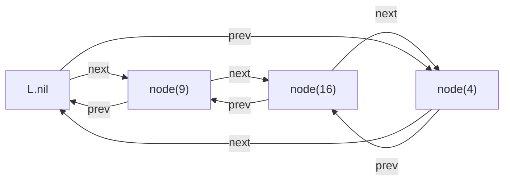

---
tags:
  - "#CCT2"
  - DS
Topic: "Dynamic set | Basic data structures including: arrays, lists, stacks, queues, and linked list | Rooted Trees and heaps | Dictionary"
Semester: CCT2
Course: Diskrete strukturer
Litterature:
  - Introduction to Algorithms 4th ed.
Created: 26-04-2026
---
- - -
# Table of Contents

1. [[#Elementary Data Structures|Elementary Data Structures]]
	1. [[#Elementary Data Structures#Quick Reference|Quick Reference]]
	2. [[#Elementary Data Structures#Arrays|Arrays]]
	3. [[#Elementary Data Structures#Matrices|Matrices]]
		1. [[#Matrices#Single-Array Representation|Single-Array Representation]]
		2. [[#Matrices#Multiple-Array Representation|Multiple-Array Representation]]
		3. [[#Matrices#Block Representation|Block Representation]]
	4. [[#Elementary Data Structures#Stacks and Queues|Stacks and Queues]]
		1. [[#Stacks and Queues#Stacks|Stacks]]
		2. [[#Stacks and Queues#Queues|Queues]]
	5. [[#Elementary Data Structures#Linked Lists|Linked Lists]]
		1. [[#Linked Lists#Searching a Linked List|Searching a Linked List]]
		2. [[#Linked Lists#Inserting into a Linked List|Inserting into a Linked List]]
		3. [[#Linked Lists#Deleting from a Linked List|Deleting from a Linked List]]
		4. [[#Linked Lists#Sentinels|Sentinels]]
	6. [[#Elementary Data Structures#Representing Rooted Trees|Representing Rooted Trees]]
		1. [[#Representing Rooted Trees#Binary Trees|Binary Trees]]
		2. [[#Representing Rooted Trees#Rooted Trees with Unbounded Branching|Rooted Trees with Unbounded Branching]]
		3. [[#Representing Rooted Trees#Other Tree Representations|Other Tree Representations]]

# Elementary Data Structures

## Quick Reference

| Concept | Description |
|---|---|
| `S.top` | Index of the most recently pushed element in a stack |
| `S.size` | Total capacity of the stack array |
| `Q.head` | Index of the front element in a queue (next to be removed) |
| `Q.tail` | Index of the next empty slot in a queue |
| `Q.size` | Total capacity of the queue array |
| `L.head` | Pointer to the first element of a linked list |
| `x.next` | Pointer to the successor of node $x$ |
| `x.prev` | Pointer to the predecessor of node $x$ |
| `L.nil` | Sentinel node used in circular doubly linked lists |
| `x.p` | Pointer to the parent of node $x$ in a tree |
| `x.left` / `x.right` | Left and right child pointers in a binary tree |
| `x.left-child` | Pointer to the leftmost child of $x$ (left-child, right-sibling representation) |
| `x.right-sibling` | Pointer to the next sibling of $x$ to the right |
| LIFO | Last-In, First-Out — the policy used by stacks |
| FIFO | First-In, First-Out — the policy used by queues |
| Row-major order | Matrix stored row by row in a flat array |
| Column-major order | Matrix stored column by column in a flat array |
| Ragged array | An array where rows or columns can have different lengths |
| Sentinel | A dummy node used to eliminate boundary checks in linked list operations |
| Left-child, right-sibling | A tree representation that handles unbounded branching in $O(n)$ space |

---

## Arrays

An array is stored as a *contiguous sequence of bytes* in memory. Because of this layout, any element can be accessed in *constant time* regardless of its index — this property is called ***random access***, and it holds as long as all memory locations take equally long to access.

If an array starts at memory address $a$, each element occupies $b$ bytes, and indexing begins at $s$, then the $i$-th element occupies the byte range:

$$a + b(i - s) \quad \text{through} \quad a + b(i - s + 1) - 1$$

This simplifies depending on the starting index:
- **1-based indexing** ($s = 1$): bytes $a + b(i-1)$ through $a + bi - 1$
- **0-based indexing** ($s = 0$): bytes $a + bi$ through $a + b(i+1) - 1$

> [!example] Breakdown of the Address Formula
> - **Equation:** $a + b(i - s)$
> - **Breakdown:**
>     - **$a$** : The *base address* — where the array begins in memory.
>     - **$b$** : The *element size* — how many bytes a single array element occupies.
>     - **$i$** : The *target index* — the index of the element you want to access.
>     - **$s$** : The *start index* — the index of the first element (e.g., $0$ or $1$).
>     - **$i - s$** : The *offset* — how many elements away from the start the target element is.

Most programming languages require every element in a given array to be the *same size* — this is what keeps $b$ constant and makes the formula valid.

> [!warning] Variable-Size Elements
> If array elements can vary in size, $b$ is no longer constant and the formula breaks down. In this case, each array slot typically stores a *pointer* to the actual object rather than the object itself. Since pointers are always a fixed size, the formula still applies — but it now gives you the address of the *pointer*, which must then be *followed* to reach the actual data.

---

## Matrices

A matrix (or two-dimensional array) is typically represented using one or more one-dimensional arrays. The element-addressing logic builds directly on the array address formula introduced in [[#Arrays]] — extended from one dimension to two.

The two most common storage strategies are *row-major order* and *column-major order*.

For an $m \times n$ matrix — one with $m$ rows and $n$ columns:
- **Row-major order** stores the matrix *row by row*
- **Column-major order** stores the matrix *column by column*

For example, given the matrix:

$$\begin{pmatrix} 1 & 2 & 3 \\ 4 & 5 & 6 \end{pmatrix}$$

- Row-major order stores it as: $\langle 1, 2, 3 \rangle$ $\langle 4, 5, 6 \rangle$ $\Rightarrow$ $\langle 1,2,3,4,5,6\rangle$ 
$$\begin{pmatrix} 1 & 2 & 3 \\\hline 4 & 5 & 6 \end{pmatrix}$$
- Column-major order stores it as: $\langle 1, 4 \rangle$ $\langle 2, 5 \rangle$ $\langle 3, 6 \rangle$ $\Rightarrow$ $\langle 1,4,2,5,3,6\rangle$ 
$$\left(\begin{array}{c|c|c} 1 & 2 & 3 \\ 4 & 5 & 6 \end{array}\right)$$

### Single-Array Representation

When using a single flat array, the element $M[i, j]$ (row $i$, column $j$) is located at the following index, where $s$ is the starting index:

| Order        | General ($s$)            | 1-based ($s=1$) | 0-based ($s=0$) |
| ------------ | ------------------------ | --------------- | --------------- |
| Row-major    | $s + c(i - s) + (j - s)$ | $c(i-1) + j$    | $ci + j$        |
| Column-major | $s + r(j - s) + (i - s)$ | $i + r(j-1)$    | $i + rj$        |

_Table 1.1: Index formulas for locating element $M[i,j]$ in a flat array under row-major and column-major ordering._

> [!example] Breakdown of Index Formulas
> - **Equation:** See Table 1.1 above.
> - **Breakdown:**
>     - **$i$** : The *row index* of the target element.
>     - **$j$** : The *column index* of the target element.
>     - **$s$** : The *starting index* of the array and matrix (e.g., $0$ or $1$).
>     - **$r$ or $m$** : The *total number of rows* in the matrix.
>     - **$c$ or $n$** : The *total number of columns* in the matrix.
>     - **$n(i - s)$** *(row-major)*: Skips over $(i - s)$ complete rows, each of length $n$, to land at the start of the correct row.
>     - **$m(j - s)$** *(column-major)*: Skips over $(j - s)$ complete columns, each of length $m$, to land at the start of the correct column.

> [!example] Index Lookup for $M[2,1]$ in a $2 \times 3$ Matrix (1-based indexing)
> Using the $2 \times 3$ matrix $\begin{pmatrix} 1 & 2 & 3 \\ 4 & 5 & 6 \end{pmatrix}$, find the flat index of element $M[2,1]$ (the value $4$):
>
> **Row-major:** $n(i - 1) + j = 3(2-1) + 1 = 3 + 1 = 4$
> → Element is at index $4$. The row-major flat array is $\langle 1, 2, 3, 4, 5, 6 \rangle$, so index $4$ holds $4$. ✓
>
> **Column-major:** $i + m(j - 1) = 2 + 2(1-1) = 2 + 0 = 2$
> → Element is at index $2$. The column-major flat array is $\langle 1, 4, 2, 5, 3, 6 \rangle$, so index $2$ holds $4$. ✓

![[Pasted image 20260427081507.png]]

_Figure 1.1: Four storage strategies for a $2 \times 3$ matrix. (a) Single array, row-major order. (b) Single array, column-major order. (c) Row-major with one array per row and a pointer array. (d) Column-major with one array per column and a pointer array._

### Multiple-Array Representation

Instead of one flat array, a matrix can be stored using multiple arrays:

- **Row-major version:** Each row gets its own array of length $n$. A separate *pointer array* $A$ of length $m$ holds references to each row array. The element $M[i,j]$ is accessed as `A[i][j]`.
- **Column-major version:** Each column gets its own array of length $m$, and a pointer array of length $n$ references each column. The element $M[i,j]$ is accessed as `A[j][i]`.

Single-array representations are generally *more efficient* on modern hardware. However, multiple-array representations offer more *flexibility* — for example, they allow for ***ragged arrays***, where rows (or columns) can have different lengths.

> [!example] Accessing an Element via Multiple-Array (Row-Major) Representation
> Suppose the $2 \times 3$ matrix $\begin{pmatrix} 1 & 2 & 3 \\ 4 & 5 & 6 \end{pmatrix}$ is stored in row-major multiple-array form.
>
> The pointer array $A$ has length $m = 2$:
> - $A[1]$ → points to the array $\langle 1, 2, 3 \rangle$ (row 1)
> - $A[2]$ → points to the array $\langle 4, 5, 6 \rangle$ (row 2)
>
> To access $M[2, 3]$ (the value $6$):
> 1. Look up $A[2]$ → get a pointer to row $2$'s array $\langle 4, 5, 6 \rangle$
> 2. Index into position $3$ of that array → retrieve $6$ ✓
>
> This is written as `A[2][3]` in code. Two memory accesses are needed: one to follow the pointer, one to read the element — slightly more expensive than the single-array formula.

### Block Representation

A less common scheme is *block representation*, where the matrix is divided into sub-blocks and each block is stored contiguously. For example, a $4 \times 4$ matrix divided into $2 \times 2$ blocks:

$$\left(\begin{array}{cc|cc} 1 & 2 & 3 & 4 \\ 5 & 6 & 7 & 8 \\ \hline 9 & 10 & 11 & 12 \\ 13 & 14 & 15 & 16 \end{array}\right)$$

Would be stored as: $\langle 1, 2, 5, 6,\ 3, 4, 7, 8,\ 9, 10, 13, 14,\ 11, 12, 15, 16 \rangle$

> [!example] Why Does Block Storage Produce That Sequence?
> The $4 \times 4$ matrix above is divided into four $2 \times 2$ blocks. Each block is stored row-by-row internally, and the blocks themselves are ordered left-to-right, top-to-bottom.
>
> **Identifying the four blocks:**
> - Block (1,1) — top-left: $\begin{pmatrix} 1 & 2 \\ 5 & 6 \end{pmatrix}$ → stored as $\langle 1, 2, 5, 6 \rangle$
> - Block (1,2) — top-right: $\begin{pmatrix} 3 & 4 \\ 7 & 8 \end{pmatrix}$ → stored as $\langle 3, 4, 7, 8 \rangle$
> - Block (2,1) — bottom-left: $\begin{pmatrix} 9 & 10 \\ 13 & 14 \end{pmatrix}$ → stored as $\langle 9, 10, 13, 14 \rangle$
> - Block (2,2) — bottom-right: $\begin{pmatrix} 11 & 12 \\ 15 & 16 \end{pmatrix}$ → stored as $\langle 11, 12, 15, 16 \rangle$
>
> **Concatenating all blocks in order:**
> $\langle 1, 2, 5, 6,\ 3, 4, 7, 8,\ 9, 10, 13, 14,\ 11, 12, 15, 16 \rangle$ ✓
>
> Notice that elements $3$ and $4$ appear *before* $5$ and $6$ in the flat sequence — even though $5$ and $6$ are in an earlier row. This is because block boundaries take priority over row boundaries. This layout can significantly improve *cache performance* for algorithms that operate on sub-regions of a matrix, since the data they need is stored close together in memory.

---

## Stacks and Queues

*Stacks* and *queues* are dynamic sets where the element removed by a delete operation is determined by a **fixed policy** — not by the caller's choice. The policy is what distinguishes the two:

- A **stack** uses *Last-In, First-Out* (**LIFO**) — the most recently inserted element is the first to be removed.
- A **queue** uses *First-In, First-Out* (**FIFO**) — the element that has been waiting longest is the first to be removed.

Both can be efficiently implemented using an array with a few tracking attributes, and both support operations that run in $O(1)$ time.

### Stacks

The insert operation on a stack is called **PUSH**, and the delete operation is called **POP**.

> [!abstract] The Plate Stack Analogy
> A stack behaves exactly like a spring-loaded stack of plates in a cafeteria. You can only add a plate to the *top* (PUSH), and you can only remove the plate currently on *top* (POP). Because of this, the plate you placed most recently is always the first one you take off — this is **LIFO** (Last-In, First-Out). You cannot reach a plate in the middle without first removing everything above it.

A stack of at most $n$ elements can be implemented with an array $S[1:n]$ and two attributes:
- $S.\text{top}$ — the index of the most recently inserted element
- $S.\text{size}$ — the total capacity $n$ of the array

The active elements are $S[1 : S.\text{top}]$, where $S[1]$ is the *bottom* and $S[S.\text{top}]$ is the *top*. When $S.\text{top} = 0$, the stack is empty.

![[Pasted image 20260427082844.png]]

_Figure 1.2: Array implementation of a stack. (a) Stack with $4$ elements, top points to $9$. (b) After PUSH(S, 17) and PUSH(S, 3). (c) After POP(S) returns $3$; top now points to $17$._

> [!warning] Overflow and Underflow
> - **Underflow:** Occurs when POP is called on an empty stack ($S.\text{top} = 0$).
> - **Overflow:** Occurs when PUSH is called on a full stack ($S.\text{top} = S.\text{size}$).
>
> Both are errors that must be guarded against explicitly.

All three stack operations run in $O(1)$ time:

```
STACK-EMPTY(S)
1  if S.top == 0
2      return TRUE
3  else return FALSE

PUSH(S, x)
1  if S.top == S.size
2      error "overflow"
3  else S.top = S.top + 1
4       S[S.top] = x

POP(S)
1  if STACK-EMPTY(S)
2      error "underflow"
3  else S.top = S.top - 1
4       return S[S.top + 1]   // the element just above the new top
```

> [!example] Stack Trace: PUSH and POP
> Starting with an empty stack of capacity $5$:
>
> 1. `PUSH(S, 10)` → Stack: $\langle 10 \rangle$, $S.\text{top} = 1$
> 2. `PUSH(S, 20)` → Stack: $\langle 10, 20 \rangle$, $S.\text{top} = 2$
> 3. `PUSH(S, 30)` → Stack: $\langle 10, 20, 30 \rangle$, $S.\text{top} = 3$
> 4. `POP(S)` → Returns **30**, Stack: $\langle 10, 20 \rangle$, $S.\text{top} = 2$
> 5. `POP(S)` → Returns **20**, Stack: $\langle 10 \rangle$, $S.\text{top} = 1$
>
> Notice the LIFO behaviour: the last item pushed ($30$) is the first to be popped.

### Queues

The insert operation on a queue is called **ENQUEUE**, and the delete operation is called **DEQUEUE**. Like a line of customers waiting for service, new elements join at the *tail* and leave from the *head*.

A queue of at most $n - 1$ elements can be implemented with an array $Q[1:n]$ and three attributes:
- $Q.\text{head}$ — index of the front element (the next to be removed)
- $Q.\text{tail}$ — index of the next *empty* slot where a new element will be inserted
- $Q.\text{size}$ — the total capacity $n$ of the array

The active elements occupy positions $Q.\text{head},\ Q.\text{head}+1,\ \ldots,\ Q.\text{tail}-1$. The array is treated as *circular* — position $1$ immediately follows position $n$, allowing the queue to wrap around without shifting elements.

> [!info] Queue State Conditions
> - **Empty:** $Q.\text{head} = Q.\text{tail}$ (initially both set to $1$)
> - **Full:** $Q.\text{head} = Q.\text{tail} + 1$, or $Q.\text{head} = 1$ and $Q.\text{tail} = Q.\text{size}$
> - Attempting to **dequeue** from an empty queue causes **underflow**.
> - Attempting to **enqueue** into a full queue causes **overflow**.

![[Pasted image 20260427082959.png]]

_Figure 1.3: Array implementation of a circular queue using $Q[1:12]$. (a) Queue with $5$ elements at $Q[7:11]$. (b) After ENQUEUE(Q, 17), ENQUEUE(Q, 3), ENQUEUE(Q, 5). (c) After DEQUEUE(Q) removes $15$ from the head; new head is at index $6$._

Both queue operations run in $O(1)$ time:

```
ENQUEUE(Q, x)
1  Q[Q.tail] = x
2  if Q.tail == Q.size    // if at the last slot, wrap around
3      Q.tail = 1
4  else Q.tail = Q.tail + 1

DEQUEUE(Q)
1  x = Q[Q.head]
2  if Q.head == Q.size    // if at the last slot, wrap around
3      Q.head = 1
4  else Q.head = Q.head + 1
5  return x
```

> [!example] Queue Trace: ENQUEUE and DEQUEUE
> Starting with an empty queue of capacity $6$ (so $n = 6$, holds at most $5$ elements):
>
> 1. `ENQUEUE(Q, 'A')` → Queue: $\langle A \rangle$, $Q.\text{head} = 1$, $Q.\text{tail} = 2$
> 2. `ENQUEUE(Q, 'B')` → Queue: $\langle A, B \rangle$, $Q.\text{head} = 1$, $Q.\text{tail} = 3$
> 3. `ENQUEUE(Q, 'C')` → Queue: $\langle A, B, C \rangle$, $Q.\text{head} = 1$, $Q.\text{tail} = 4$
> 4. `DEQUEUE(Q)` → Returns **'A'**, Queue: $\langle B, C \rangle$, $Q.\text{head} = 2$, $Q.\text{tail} = 4$
> 5. `DEQUEUE(Q)` → Returns **'B'**, Queue: $\langle C \rangle$, $Q.\text{head} = 3$, $Q.\text{tail} = 4$
>
> Notice the FIFO behaviour: $'A'$ was enqueued first and dequeued first.

> [!question] Why can a queue of size $n$ hold only $n - 1$ elements?
> One slot must always be left empty to distinguish between a full queue and an empty queue. If all $n$ slots were filled, the condition $Q.\text{head} = Q.\text{tail}$ would be ambiguous — it signals *empty* but would also occur when the queue wraps around and is full. Sacrificing one slot eliminates the ambiguity.

---

## Linked Lists

A *linked list* is a data structure where objects are arranged in a linear order — but unlike an array (see [[#Arrays]]), this order is determined by *pointers* embedded in each object rather than by contiguous memory positions. Because linked list elements often contain searchable keys, they are sometimes called *search lists*.

Each element of a *doubly linked list* $L$ is an object with a `key` attribute and two pointer attributes:
- $x.\text{next}$ — points to its *successor*
- $x.\text{prev}$ — points to its *predecessor*
- If $x.\text{prev} = \text{NIL}$, then $x$ is the *head* (first element)
- If $x.\text{next} = \text{NIL}$, then $x$ is the *tail* (last element)

The list itself has attribute $L.\text{head}$ pointing to the first element. If $L.\text{head} = \text{NIL}$, the list is *empty*.

![[Pasted image 20260427083325.png]]

_Figure 1.4: (a) A doubly linked list representing $\{1, 4, 9, 16\}$. (b) After LIST-PREPEND with key $25$ — $25$ becomes the new head. (c) After LIST-INSERT(x, y) with key $36$, inserted after the element with key $9$. (d) After LIST-DELETE removes the element with key $4$._

Linked lists come in several forms:

| Variant | Description |
|---|---|
| Singly linked | Each element has only a $x.\text{next}$ pointer, no $x.\text{prev}$ |
| Doubly linked | Each element has both $x.\text{next}$ and $x.\text{prev}$ pointers |
| Sorted | Elements are in key order; minimum at head, maximum at tail |
| Unsorted | Elements can appear in any order |
| Circular | $x.\text{prev}$ of head points to tail; $x.\text{next}$ of tail points to head |

_Table 1.2: Common variants of linked lists and their distinguishing characteristics._

The remainder of this section assumes lists are *unsorted* and *doubly linked*.

### Searching a Linked List

`LIST-SEARCH(L, k)` finds the first element with key $k$ by walking from the head, returning a pointer to the matching element, or $\text{NIL}$ if not found. In the worst case (key absent or at the tail) the entire list must be traversed.

- **Worst-case:** $\Theta(n)$

```
LIST-SEARCH(L, k)
1  x = L.head
2  while x ≠ NIL and x.key ≠ k
3      x = x.next        // advance to next element
4  return x               // returns NIL if key not found
```

### Inserting into a Linked List

Given an element $x$ with its `key` already set, `LIST-PREPEND` inserts $x$ at the *front* of the list in $O(1)$ time.

```
LIST-PREPEND(L, x)
1  x.next = L.head        // x points forward to old head
2  x.prev = NIL           // x has no predecessor
3  if L.head ≠ NIL
4      L.head.prev = x    // old head points back to x
5  L.head = x             // x is now the head
```

> [!example] Prepending a Node to a Linked List
> List before: $\langle 1 \leftrightarrow 4 \leftrightarrow 9 \leftrightarrow 16 \rangle$, $L.\text{head}$ → node($1$)
>
> Goal: Prepend a new node with key $25$.
>
> Let $x$ = new node($25$). Executing `LIST-PREPEND(L, x)`:
>
> 1. `x.next = L.head` → $x.\text{next}$ points to node($1$)
> 2. `x.prev = NIL` → $x$ has no predecessor (it will be the new head)
> 3. `L.head ≠ NIL` (it's node($1$)), so `L.head.prev = x` → node($1$).$\text{prev}$ now points to $x$
> 4. `L.head = x` → $L.\text{head}$ now points to node($25$)
>
> List after: $\langle 25 \leftrightarrow 1 \leftrightarrow 4 \leftrightarrow 9 \leftrightarrow 16 \rangle$ ✓

To insert *anywhere* in the list, `LIST-INSERT` splices a new element $x$ immediately *after* a given element $y$ in $O(1)$ time. Because it never needs to reference the list object $L$ itself, $L$ is not a parameter.

```
LIST-INSERT(x, y)
1  x.next = y.next        // x points forward to y's old successor
2  x.prev = y             // x points back to y
3  if y.next ≠ NIL
4      y.next.prev = x    // y's old successor points back to x
5  y.next = x             // y now points forward to x
```

> [!example] Inserting a Node After a Given Element
> List before: $\langle 1 \leftrightarrow 4 \leftrightarrow 9 \leftrightarrow 16 \rangle$
>
> Goal: Insert a new node with key $36$ *after* the node with key $9$.
>
> Let $y$ = node($9$), $x$ = new node($36$). Executing `LIST-INSERT(x, y)`:
>
> 1. `x.next = y.next` → $x.\text{next}$ points to node($16$)
> 2. `x.prev = y` → $x.\text{prev}$ points to node($9$)
> 3. `y.next ≠ NIL` (it's node($16$)), so `y.next.prev = x` → node($16$).$\text{prev}$ now points to $x$
> 4. `y.next = x` → node($9$).$\text{next}$ now points to $x$
>
> List after: $\langle 1 \leftrightarrow 4 \leftrightarrow 9 \leftrightarrow 36 \leftrightarrow 16 \rangle$ ✓

### Deleting from a Linked List

`LIST-DELETE` removes an element $x$ from list $L$ by relinking the surrounding elements around it. A pointer to $x$ must be provided — if you only know the key, a prior call to `LIST-SEARCH` is needed.

- **Find by key + delete:** $\Theta(n)$ worst-case
- **Delete given pointer:** $O(1)$

```
LIST-DELETE(L, x)
1  if x.prev ≠ NIL
2      x.prev.next = x.next    // predecessor skips over x
3  else L.head = x.next        // x was the head; update L.head
4  if x.next ≠ NIL
5      x.next.prev = x.prev    // successor points back past x
```

> [!example] Deleting a Node — Two Cases
> **Case 1: Deleting a middle node**
>
> List before: $\langle 1 \leftrightarrow 4 \leftrightarrow 9 \leftrightarrow 16 \rangle$
>
> Goal: Delete the node with key $4$. Let $x$ = node($4$).
>
> 1. $x.\text{prev} \neq \text{NIL}$ (it's node($1$)), so `x.prev.next = x.next` → node($1$).$\text{next}$ now points to node($9$)
> 2. $x.\text{next} \neq \text{NIL}$ (it's node($9$)), so `x.next.prev = x.prev` → node($9$).$\text{prev}$ now points to node($1$)
>
> List after: $\langle 1 \leftrightarrow 9 \leftrightarrow 16 \rangle$ ✓
>
> ---
>
> **Case 2: Deleting the head node**
>
> List before: $\langle 4 \leftrightarrow 9 \leftrightarrow 16 \rangle$, $L.\text{head}$ → node($4$)
>
> Goal: Delete the node with key $4$. Let $x$ = node($4$).
>
> 1. $x.\text{prev} = \text{NIL}$ (node($4$) is the head), so `L.head = x.next` → $L.\text{head}$ now points to node($9$)
> 2. $x.\text{next} \neq \text{NIL}$ (it's node($9$)), so `x.next.prev = x.prev` → node($9$).$\text{prev}$ now set to $\text{NIL}$
>
> List after: $\langle 9 \leftrightarrow 16 \rangle$, $L.\text{head}$ → node($9$) ✓

Linked lists and arrays represent fundamentally different trade-offs in data structure design:

| Operation | Array | Doubly Linked List |
|---|---|---|
| Insert/Delete at front | $\Theta(n)$ — must shift all elements | $O(1)$ — pointer relinking only |
| Find $k$-th element | $O(1)$ — direct index access | $\Theta(k)$ — must traverse $k$ nodes |

_Table 1.3: Performance comparison between arrays and doubly linked lists for common operations. Linked lists excel at insertion and deletion; arrays excel at random access by index._

### Sentinels

The boundary checks in `LIST-DELETE` — handling the special cases of deleting the head or tail — add complexity. A *sentinel* eliminates these edge cases entirely.

A sentinel is a *dummy object* $L.\text{nil}$ that acts as a stand-in for $\text{NIL}$ but has all the same attributes as a regular list element. Replacing all $\text{NIL}$ references with $L.\text{nil}$ transforms the list into a ***circular doubly linked list with a sentinel***, where $L.\text{nil}$ sits conceptually between the head and tail:

- $L.\text{nil}.\text{next}$ → points to the *head*
- $L.\text{nil}.\text{prev}$ → points to the *tail*
- The $\text{next}$ of the tail and $\text{prev}$ of the head both point to $L.\text{nil}$
- An **empty list** has both $L.\text{nil}.\text{next}$ and $L.\text{nil}.\text{prev}$ pointing to $L.\text{nil}$ itself

Because $L.\text{nil}.\text{next}$ serves as the head reference, $L.\text{head}$ is eliminated entirely.

The following diagram illustrates the circular pointer structure that the sentinel creates:



_Figure 1.5: Circular pointer structure of a doubly linked list with sentinel $L.\text{nil}$, representing the list $\langle 9, 16, 4 \rangle$. Following $\text{next}$ pointers clockwise returns to $L.\text{nil}$; following $\text{prev}$ pointers counterclockwise does the same. An empty list is the degenerate case where both $L.\text{nil}.\text{next}$ and $L.\text{nil}.\text{prev}$ point directly back to $L.\text{nil}$._

![[Pasted image 20260427083544.png]]

_Figure 1.6: Circular doubly linked list with sentinel $L.\text{nil}$ (blue). (a) Empty list — both pointers on $L.\text{nil}$ point to itself. (b) List $\{9, 16, 4, 1\}$ with sentinel. (c) After LIST-INSERT′(x, L.nil) with key $25$ — $25$ becomes the new head. (d) After deleting key $1$ — new tail is key $4$. (e) After LIST-INSERT′(x, y) with key $36$, inserted after key $9$._

With a sentinel, deletion collapses to just two lines — no boundary checks needed:

```
LIST-DELETE′(x)
1  x.prev.next = x.next    // predecessor skips over x
2  x.next.prev = x.prev    // successor points back past x
```

> [!warning] Never Delete the Sentinel
> Do not delete $L.\text{nil}$ unless you intend to destroy the entire list. It is the anchor of the circular structure — removing it breaks every pointer in the list.

Insertion with a sentinel uses `LIST-INSERT′`, which inserts $x$ after a given object $y$. This single procedure covers all cases:
- **Prepend:** pass $y = L.\text{nil}$
- **Append:** pass $y = L.\text{nil}.\text{prev}$

```
LIST-INSERT′(x, y)
1  x.next = y.next         // x points forward to y's old successor
2  x.prev = y              // x points back to y
3  y.next.prev = x         // y's old successor points back to x
4  y.next = x              // y now points forward to x
```

Searching a sentinel list can be made slightly faster. Standard `LIST-SEARCH` performs *two* checks per iteration: an end-of-list check and a key comparison. With a sentinel, you can *plant the search key in $L.\text{nil}$ before starting* — this guarantees the key will be found somewhere, eliminating the end-of-list check:

```
LIST-SEARCH′(L, k)
1  L.nil.key = k           // plant the key in the sentinel as a guaranteed stop
2  x = L.nil.next          // start at the head
3  while x.key ≠ k
4      x = x.next
5  if x == L.nil           // stopped at the sentinel — key wasn't really in the list
6      return NIL
7  else return x           // stopped at a real element
```

> [!tip] When to Use Sentinels
> Sentinels simplify code and can shave small constant factors from running times — but they do **not** change asymptotic complexity. Use them judiciously: when many small lists are active simultaneously, the extra memory for a sentinel per list can add up to meaningful waste.

---

## Representing Rooted Trees

Linked structures (see [[#Linked Lists]]) represent *linear* relationships well, but tree structures require a different approach. Each node in a tree is represented as an object with a `key` attribute and a set of pointer attributes — the specific pointers used depend on the type of tree.

### Binary Trees

In a *binary tree* $T$, each node $x$ has three pointer attributes:
- $x.p$ — points to the *parent* of $x$
- $x.\text{left}$ — points to the *left child* of $x$
- $x.\text{right}$ — points to the *right child* of $x$

If $x.p = \text{NIL}$, then $x$ is the *root*. If a child does not exist, the corresponding pointer is $\text{NIL}$. The attribute $T.\text{root}$ points to the root of the entire tree; if $T.\text{root} = \text{NIL}$, the tree is empty.

![[Pasted image 20260427083808.png]]

_Figure 1.7: Binary tree representation. Each node $x$ has attributes $x.p$ (top), $x.\text{left}$ (lower-left), and $x.\text{right}$ (lower-right)._

### Rooted Trees with Unbounded Branching

For trees where each node has at most $k$ children, the binary tree scheme extends naturally — replace $x.\text{left}$ and $x.\text{right}$ with $\text{child}_1, \text{child}_2, \ldots, \text{child}_k$. However, this breaks down when the number of children is *unbounded*:
- The number of pointer attributes cannot be determined in advance.
- If $k$ is large but most nodes have few children, a significant amount of memory is wasted on $\text{NIL}$ pointers.

The solution is the ***left-child, right-sibling* representation**, which can represent any rooted tree using only $O(n)$ space for an $n$-node tree. Each node $x$ has just two pointers instead of one per child:

1. $x.\text{left-child}$ — points to the *leftmost child* of $x$
2. $x.\text{right-sibling}$ — points to the sibling of $x$ *immediately to its right*

$x.p$ points to the parent and $T.\text{root}$ points to the root as usual. If $x$ has no children, $x.\text{left-child} = \text{NIL}$. If $x$ is the rightmost child of its parent, $x.\text{right-sibling} = \text{NIL}$.

![[Pasted image 20260427083836.png]]

_Figure 1.8: Left-child, right-sibling representation. Each node $x$ has attributes $x.p$ (top), $x.\text{left-child}$ (lower-left), and $x.\text{right-sibling}$ (lower-right)._

> [!example] Navigating a Tree with Left-Child, Right-Sibling Pointers
> Suppose node $x$ has three children: $A$, $B$, $C$ (left to right).
>
> - $x.\text{left-child}$ → points to $A$
> - $A.\text{right-sibling}$ → points to $B$
> - $B.\text{right-sibling}$ → points to $C$
> - $C.\text{right-sibling}$ → $\text{NIL}$ (rightmost child)
>
> To visit all children of $x$: start at $x.\text{left-child}$, then follow $\text{right-sibling}$ pointers until $\text{NIL}$.

### Other Tree Representations

Trees can be represented in many other ways depending on application needs:

| Representation | Description | Best For |
|---|---|---|
| Array (heap-style) | Complete binary tree stored in a flat array; no pointers needed | Heaps, priority queues |
| Parent pointers only | Each node stores only $x.p$; no child pointers | Applications needing only upward traversal |
| Left-child, right-sibling | Two pointers per node; $O(n)$ space for any tree | Trees with unbounded or unknown branching |
| Full pointer set ($k$ children) | $k$ child pointers per node | Trees with fixed, small branching factor |

_Table 1.4: Comparison of common tree representations and their ideal use cases._

> [!tip] Choosing a Tree Representation
> The right representation depends entirely on what operations the application needs to perform efficiently. A heap uses no pointers at all. Some trees only ever need to walk *up* toward the root, so only parent pointers are stored. Always match the structure to the access pattern.

---

> [!summary] Summary: Elementary Data Structures
>
> **Arrays** store elements in contiguous memory, enabling $O(1)$ random access via the formula $a + b(i - s)$. All elements must be the same size for this to work; variable-size elements require a pointer indirection.
>
> **Matrices** extend arrays to two dimensions. The two primary flat-array layouts are *row-major* and *column-major* order, each with a corresponding index formula. Alternatives include *multiple-array* (pointer-based) representations — which allow ragged arrays — and *block representations* — which improve cache performance by storing sub-regions contiguously.
>
> **Stacks** enforce LIFO order via PUSH and POP, both $O(1)$. They are implemented with an array and a $S.\text{top}$ pointer. Guard against underflow (pop on empty, $S.\text{top} = 0$) and overflow (push on full, $S.\text{top} = S.\text{size}$).
>
> **Queues** enforce FIFO order via ENQUEUE and DEQUEUE, both $O(1)$. They are implemented with a *circular* array and $Q.\text{head}$/$Q.\text{tail}$ pointers. One slot is sacrificed to distinguish empty ($Q.\text{head} = Q.\text{tail}$) from full.
>
> **Linked lists** order elements through embedded pointers rather than contiguous memory. Doubly linked lists support $O(1)$ insertion and deletion given a pointer, but $\Theta(n)$ search. *Sentinels* ($L.\text{nil}$) simplify boundary handling in circular doubly linked lists and allow a minor search optimisation by planting the key in the sentinel. They do not change asymptotic complexity.
>
> **Trees** generalise linked structures to hierarchical relationships. Binary trees use $x.p$, $x.\text{left}$, and $x.\text{right}$ pointers per node. For unbounded branching, the *left-child, right-sibling* representation stores any rooted tree in $O(n)$ space using just two pointers per node. The best representation depends on the operations required.
>
> **Key complexity summary:**
>
> | Structure | Access | Search | Insert | Delete |
> |---|---|---|---|---|
> | Array | $O(1)$ | $O(n)$ | $O(n)$ | $O(n)$ |
> | Stack (top only) | $O(1)$ | — | $O(1)$ | $O(1)$ |
> | Queue (head/tail) | $O(1)$ | — | $O(1)$ | $O(1)$ |
> | Doubly Linked List | $\Theta(k)$ | $\Theta(n)$ | $O(1)$\* | $O(1)$\* |
>
> \*Given a pointer to the relevant position. If searching by key first, worst-case becomes $\Theta(n)$.