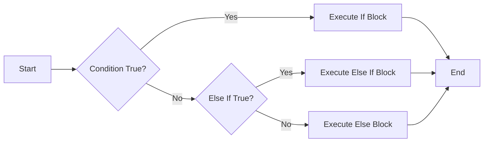
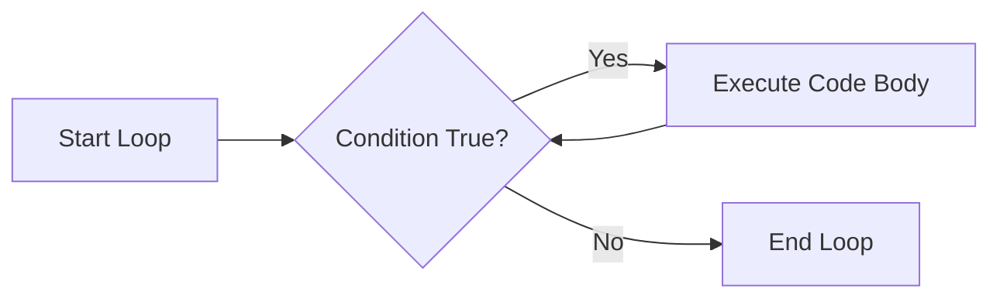

---
tags:
  - "#CCT2"
  - OO
  - Java
  - Programming
Topic: "Creating and compiling a Java program | JDK, JVM and IDE | Writing the first program in Java | Reading input for the console\r | Common errors in Java"
Semester: CCT2
Course: Objektorienteret analyse, design og implementering + Java
Litterature:
  - w3schools - Java Tutorial
  - Tutorials for Eclipse - Rasmus L. Olesen
Created: 10/02/2026
---
- - -
# Table of Contents

1. [[#Java Fundamentals|Java Fundamentals]]
	1. [[#Java Fundamentals#Introduction and Syntax|Introduction and Syntax]]
	2. [[#Java Fundamentals#Variables and Data Types|Variables and Data Types]]
		1. [[#Variables and Data Types#Primitive vs. Non-Primitive Data Types|Primitive vs. Non-Primitive Data Types]]
		2. [[#Variables and Data Types#Primitive Data Types|Primitive Data Types]]
		3. [[#Variables and Data Types#Declaring Variables|Declaring Variables]]
		4. [[#Variables and Data Types#Constants (Final Keyword)|Constants (Final Keyword)]]
		5. [[#Variables and Data Types#The `var` Keyword (Java 10+)|The `var` Keyword (Java 10+)]]
	3. [[#Java Fundamentals#Type Casting|Type Casting]]
	4. [[#Java Fundamentals#Operators and Math|Operators and Math]]
		1. [[#Operators and Math#The Java Math Class|The Java Math Class]]
	5. [[#Java Fundamentals#Strings|Strings]]
		1. [[#Strings#Common String Methods|Common String Methods]]
		2. [[#Strings#Special Characters|Special Characters]]
	6. [[#Java Fundamentals#Booleans and Conditions|Booleans and Conditions]]
		1. [[#Booleans and Conditions#If...Else Statements|If...Else Statements]]
		2. [[#Booleans and Conditions#Short-Hand If...Else (Ternary Operator)|Short-Hand If...Else (Ternary Operator)]]
		3. [[#Booleans and Conditions#Switch Statements|Switch Statements]]
	7. [[#Java Fundamentals#Loops|Loops]]
		1. [[#Loops#Loop Flow Visualization|Loop Flow Visualization]]
		2. [[#Loops#Break and Continue|Break and Continue]]
	8. [[#Java Fundamentals#Arrays|Arrays]]
		1. [[#Arrays#Creating and Accessing Arrays|Creating and Accessing Arrays]]
		2. [[#Arrays#Real-Life Example: Calculating Average|Real-Life Example: Calculating Average]]
		3. [[#Arrays#Multi-Dimensional Arrays|Multi-Dimensional Arrays]]

# Java Fundamentals

| Concept | Syntax/Keyword | Description |
| :--- | :--- | :--- |
| **Output** | `System.out.println()` | Prints text to screen followed by a new line. |
| **Variable Declaration** | `type name = value;` | Creates a storage container (e.g., `int x = 5;`). |
| **Constant** | `final` | Prevents a variable from being changed (read-only). |
| **Data Types** | `int`, `double`, `boolean`, `char`, `String` | Defines the kind of data a variable holds. |
| **Type Casting** | `(type)value` | Manually converts a value from one type to another. |
| **Conditional** | `if`, `else`, `switch` | Executes code blocks based on conditions. |
| **Loops** | `for`, `while`, `do-while` | Repeats a block of code while a condition is true. |
| **Arrays** | `type[] name` | Stores multiple values in a single variable. |

---

## Introduction and Syntax

**Java** is a popular, high-level, object-oriented programming language created in 1995. It is designed to be platform-independent, meaning code written on one operating system (like Windows) can run on another (like Linux) without modification. It is widely used for mobile apps (Android), web applications, and large-scale enterprise systems.

Every Java program must be organized around **classes**. A class acts as a container for code. When a Java program runs, execution begins at the **`main` method**.

>[!info] **Basic Structure**
> The name of the Java file must match the class name (e.g., class `Main` must be saved as `Main.java`). Java is case-sensitive, meaning $Main$ and $main$ are treated as different identifiers.

```java
public class Main {
  public static void main(String[] args) {
    // Code to be executed goes here
    System.out.println("Hello World");
  }
}
```

- `public class Main`: Defines a class named `Main`.
- `public static void main(String[] args)`: The standard entry point method.
- `System.out.println()`: A command to output text to the console.

---

## Variables and Data Types

A **variable** is a container for storing data values. In Java, you must explicitly declare the type of data a variable will hold.

### Primitive vs. Non-Primitive Data Types
Java data types fall into two main categories:

1.  **Primitive:** Basic building blocks defined by the language (start with lowercase). They store actual values.
2.  **Non-Primitive (Reference):** More complex types (start with uppercase). They refer to objects (e.g., `String`, Arrays).

### Primitive Data Types

| Type | Size | Description | Example |
| :--- | :--- | :--- | :--- |
| `byte` | 1 byte | Small integers from $-128$ to $127$ | `100` |
| `short` | 2 bytes | Small integers from $-32,768$ to $32,767$ | `5000` |
| `int` | 4 bytes | Standard integers from $-2,147,483,648$ to $2,147,483,647$ | `100000` |
| `long` | 8 bytes | Large integers (ends with `L`) | `15000000000L` |
| `float` | 4 bytes | Fractional numbers (ends with `f`) | `5.75f` |
| `double` | 8 bytes | Fractional numbers (more precision, ends with `d`) | `19.99d` |
| `boolean` | 1 bit | True or False | `true` |
| `char` | 2 bytes | Single character (single quotes) | `'A'` |

_Table 1.1: Java Primitive Data Types_

**Note:** `String` is a non-primitive type used for text (sequences of characters).

### Declaring Variables

Use the syntax `type variableName = value;`.

>[!example] **Declaring and Using Variables**
> ```java
> int myNum = 5;                // Integer
> float myFloatNum = 5.99f;     // Float
> char myLetter = 'D';          // Character
> boolean myBool = true;        // Boolean
> String myText = "Hello";      // String (Non-primitive)
> 
> System.out.println(myNum);    // Outputs 5
> ```

### Constants (Final Keyword)
Use the `final` keyword to make a variable unchangeable (read-only).

>[!tip] **Convention**
> By convention, use uppercase names for constants to distinguish them from regular variables.

```java
final int MINUTES_PER_HOUR = 60;
MINUTES_PER_HOUR = 61; // This would generate an error
```

### The `var` Keyword (Java 10+)
The `var` keyword allows the compiler to automatically infer the type based on the assigned value. It must be initialized immediately.

```java
var myName = "John"; // Compiler infers String
var myAge = 25;      // Compiler infers int
```

---

## Type Casting

Type casting converts a value from one data type to another.

1.  **Widening Casting (Automatic):** Converting a smaller type to a larger type (e.g., `int` to `double`). There is no risk of data loss.
2.  **Narrowing Casting (Manual):** Converting a larger type to a smaller type (e.g., `double` to `int`). This requires manual casting using `(type)` and may result in data loss (e.g., losing decimals).

>[!example] **Type Casting Example**
> ```java
> // Widening (Automatic)
> int myInt = 9;
> double myDouble = myInt; // Value becomes 9.0
> 
> // Narrowing (Manual)
> double myDouble = 9.78;
> int myInt = (int) myDouble; // Value becomes 9 (Decimal part is lost)
> ```

---

## Operators and Math

Operators perform operations on variables and values.

1.  **Arithmetic Operators:** $+$, $-$, $*$, $/$, $\%$ (Modulus - remainder), $++$ (Increment), $--$ (Decrement).
2.  **Assignment Operators:** $=$, $+=$, $-=$, $*=$, $/=$, $\%=$.
3.  **Comparison Operators:** $==$ (Equal to), $!=$ (Not equal), $>$, $<$, $>=$, $<=$.
4.  **Logical Operators:** && (AND), $||$ (OR), $!$ (NOT).

**Operator Precedence:** Multiplication ($*$), Division ($/$), and Modulus ($\%$) are calculated before Addition ($+$) and Subtraction ($-$). Use parentheses $( )$ to enforce a specific calculation order.

>[!warning] **Mixing Text and Numbers**
> Use caution when using the $+$ operator with strings. It acts as a concatenation operator.
> ```java
> int x = 5;
> int y = 6;
> System.out.println("The sum is " + x + y);   // Output: The sum is 56
> System.out.println("The sum is " + (x + y)); // Output: The sum is 11
> ```

### The Java Math Class
The `Math` class provides built-in methods for mathematical operations.

| Method | Description | Example |
| :--- | :--- | :--- |
| `Math.max(x, y)` | Finds the highest of $x$ and $y$ | `Math.max(5, 10)` returns 10 |
| `Math.min(x, y)` | Finds the lowest of $x$ and $y$ | `Math.min(5, 10)` returns 5 |
| `Math.sqrt(x)` | Returns the square root of $x$ | `Math.sqrt(64)` returns 8.0 |
| `Math.abs(x)` | Returns the absolute (positive) value of $x$ | `Math.abs(-4.7)` returns 4.7 |
| `Math.pow(x, y)` | Returns the value of $x$ to the power of $y$ | `Math.pow(2, 8)` returns 256.0 |
| `Math.random()` | Returns a random number between $0.0$ and $1.0$ | `Math.random()` |

_Table 1.2: Common Java Math Methods_

---

## Strings

A `String` is a sequence of characters (text) surrounded by double quotes. It is an object, which means it has methods to perform actions on text.

### Common String Methods

| Method | Description | Example |
| :--- | :--- | :--- |
| `length()` | Returns the length of the string | `"Hello".length()` returns 5 |
| `toUpperCase()` | Converts string to uppercase | `"hello".toUpperCase()` returns "HELLO" |
| `toLowerCase()` | Converts string to lowercase | `"HELLO".toLowerCase()` returns "hello" |
| `indexOf("str")` | Finds the index of a substring | `"Hello".indexOf("l")` returns 2 |
| `charAt(index)` | Returns the character at a specific index | `"Hello".charAt(0)` returns 'H' |
| `trim()` | Removes whitespace from both ends | `" Hi ".trim()` returns "Hi" |

_Table 1.3: Common String Methods_

>[!question] **Self-Check**
> Why does `"Hello".length()` return $5$ instead of $4$? Think about whether Java indexes start at $0$ or $1$.

>[!warning] **String Comparison**
> Do not use $==$ to compare strings (it compares object references). Use the `.equals()` method instead.
> ```java
> String txt1 = "Hello";
> String txt2 = "Hello";
> System.out.println(txt1.equals(txt2)); // true
> ```

### Special Characters
Use the backslash escape character $\backslash$ to include special characters inside a string.
- $\backslash"$ -> Double quote
- $\backslash'$ -> Single quote
- $\backslash\backslash$ -> Backslash
- $\backslash$n -> New Line

---

## Booleans and Conditions

The **boolean** type can only hold `true` or `false`. It is primarily used for control flow logic.

### If...Else Statements
Execute different code blocks based on conditions.

```java
if (condition) {
  // block of code to be executed if the condition is true
} else if (anotherCondition) {
  // block of code to be executed if the first condition is false and this one is true
} else {
  // block of code to be executed if all conditions are false
}
```


_Figure 1.1: Flowchart of If-Else-If logic._

### Short-Hand If...Else (Ternary Operator)
A single-line replacement for `if...else`.

```java
variable = (condition) ? expressionTrue : expressionFalse;
// Example
String result = (time < 18) ? "Good day." : "Good evening.";
```

### Switch Statements
The `switch` statement compares one variable against many specific values.

```java
int day = 4;
switch (day) {
  case 1:
    System.out.println("Monday");
    break;
  case 2:
    System.out.println("Tuesday");
    break;
  // ... other cases
  default:
    System.out.println("Looking forward to the Weekend");
}
```
>The `break` keyword stops the switch from executing code for the following cases. The `default` case runs if no match is found.

---

## Loops

Loops execute a block of code multiple times.

1.  **While Loop:** Loops through a block of code as long as a specified condition is true.
2.  **Do/While Loop:** Similar to `while`, but it guarantees code block runs **once** before checking condition.
3.  **For Loop:** Used when the exact number of iterations is known.
4.  **For-Each Loop:** Used exclusively to loop through elements in a data structure (such as an array).

### Loop Flow Visualization


_Figure 1.2: Flowchart of a standard While loop logic._

>[!example] **Loop Syntax Comparison**
> ```java
> // While
> int i = 0;
> while (i < 5) {
>   System.out.println(i);
>   i++;
> }
> 
> // For
> for (int i = 0; i < 5; i++) {
>   System.out.println(i);
> }
> 
> // For-Each
> int[] numbers = {1, 2, 3, 4, 5};
> for (int num : numbers) {
>   System.out.println(num);
> }
> ```

>[!question] **Infinite Loops**
> What happens if the condition in a `while` loop is never updated to become `false`?
> *(Example: `while (true) { ... }`)*

### Break and Continue
- `break`: Breaks out of the loop completely.
- `continue`: Skips current iteration and jumps to the next one.

---

## Arrays

An **Array** is a container that holds a fixed number of values of a single type.

### Creating and Accessing Arrays
```java
// Declaration
String[] cars = {"Volvo", "BMW", "Ford", "Mazda"};
int[] myNum = {10, 20, 30};

// Accessing elements (Index starts at 0)
System.out.println(cars[0]); // Outputs Volvo

// Changing elements
cars[0] = "Opel";

// Array Length
System.out.println(cars.length); // Outputs 4
```

### Real-Life Example: Calculating Average
Arrays are often used to process lists of data, such as calculating an average.

>[!example] **Calculating Average Age**
> ```java
> int ages[] = {20, 22, 18, 35, 48, 26, 87, 70};
> float sum = 0;
> int length = ages.length;
> 
> for (int age : ages) {
>   sum += age;
> }
> 
> float avg = sum / length;
> System.out.println("The average age is: " + avg);
> ```

### Multi-Dimensional Arrays
Arrays can contain other arrays, forming a matrix (rows and columns).

```java
int[][] myNumbers = { {1, 2, 3, 4}, {5, 6, 7} };
int x = myNumbers[1][2]; // Access row 1, column 2 (Value: 7)
```
Note that the first index represents the row, and the second index represents the column (e.g., $myNumbers[row][col]$).

![[Pasted image 20260210134304.png]]

_Figure 1.3: Visual representation of a two-dimensional array structure._

---

> [!summary] **Summary**
> This note covers the fundamental building blocks of Java programming. Key takeaways include:
> *   **Structure:** Every Java program runs within a `class` and starts execution in the `main` method.
> *   **Variables & Types:** Java is strongly typed. Variables must be declared with types like `int`, `double`, `char`, `boolean`, or `String`. The `final` keyword creates constants.
> *   **Operators & Math:** Arithmetic, comparison, and logical operators allow data manipulation. The `Math` class provides utility methods for common calculations. Operator precedence determines calculation order.
> *   **Strings:** Treated as objects with methods like `.length()` and `.toUpperCase()`.
> *   **Control Flow:** `if...else` statements and `switch` statements allow the program to make decisions based on boolean logic.
> *   **Loops:** `while`, `for`, and `for-each` loops allow for repeated execution of code blocks. `break` and `continue` control loop flow.
> *   **Arrays:** Fixed-size containers for multiple values. Multi-dimensional arrays (arrays of arrays) represent data in rows and columns.