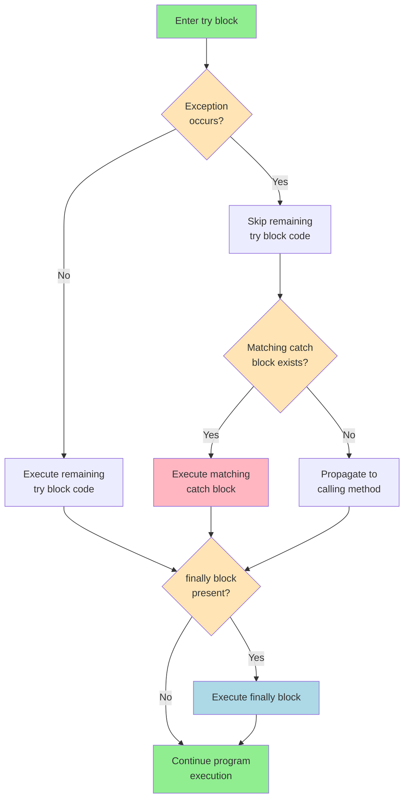
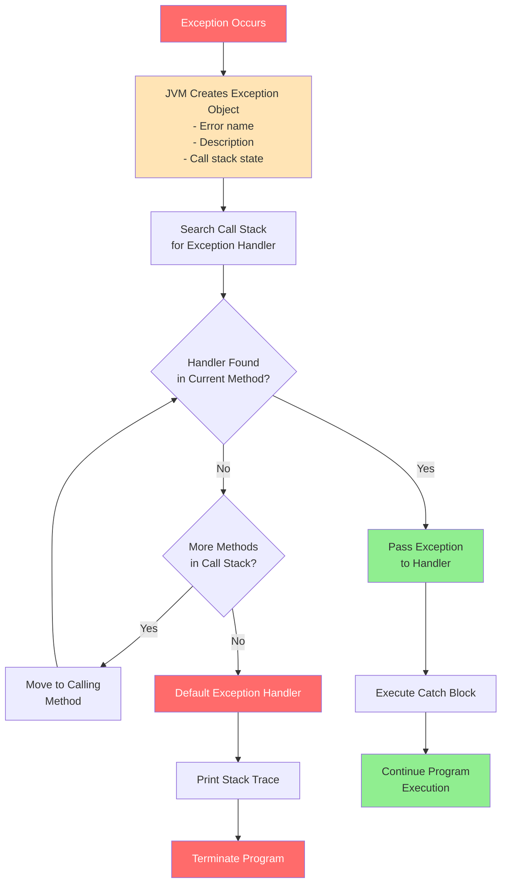

---
tags:
  - "#CCT2"
  - OO
  - Java
  - Programming
Topic: Errors and faults | Handling errors using exceptions (throwing and catching exceptions) | Generating our own exceptions | Example cases
Semester: CCT2
Course: Objektorienteret analyse, design og implementering + Java
Litterature:
  - Geekforgeeks - Exceptions in Java
  - w3schools - Types of Exceptions
  - Tutorialspoint - Java Exceptions
  - Tutorialspoint - Java Built-in Exceptions
Created: 18-03-2026
---
# Table of Contents

1. [[#Java Exception Handling|Java Exception Handling]]
	1. [[#Java Exception Handling#What is Exception Handling?|What is Exception Handling?]]
	2. [[#Java Exception Handling#Basic Exception Handling Syntax|Basic Exception Handling Syntax]]
		1. [[#Basic Exception Handling Syntax#The try-catch Block|The try-catch Block]]
	3. [[#Java Exception Handling#The finally Block|The finally Block]]
		1. [[#The finally Block#try-catch-finally Control Flow|try-catch-finally Control Flow]]
	4. [[#Java Exception Handling#throw and throws Keywords|throw and throws Keywords]]
		1. [[#throw and throws Keywords#The throw Keyword|The throw Keyword]]
		2. [[#throw and throws Keywords#The throws Keyword|The throws Keyword]]
	5. [[#Java Exception Handling#Internal Working of try-catch Block|Internal Working of try-catch Block]]
	6. [[#Java Exception Handling#Java Exception Hierarchy|Java Exception Hierarchy]]
		1. [[#Java Exception Hierarchy#Exception Hierarchy Diagram|Exception Hierarchy Diagram]]
	7. [[#Java Exception Handling#Types of Java Exceptions|Types of Java Exceptions]]
		1. [[#Types of Java Exceptions#1. Built-in Exceptions|1. Built-in Exceptions]]
			1. [[#1. Built-in Exceptions#Checked Exceptions|Checked Exceptions]]
			2. [[#1. Built-in Exceptions#Unchecked Exceptions|Unchecked Exceptions]]
	8. [[#Java Exception Handling#Exception Methods|Exception Methods]]
	9. [[#Java Exception Handling#Advanced Exception Handling|Advanced Exception Handling]]
		1. [[#Advanced Exception Handling#Nested try-catch Blocks|Nested try-catch Blocks]]
		2. [[#Advanced Exception Handling#Multiple Exception Handling|Multiple Exception Handling]]
		3. [[#Advanced Exception Handling#try-with-resources|try-with-resources]]
	10. [[#Java Exception Handling#How JVM Handles Exceptions|How JVM Handles Exceptions]]
	11. [[#Java Exception Handling#User-Defined Exceptions|User-Defined Exceptions]]
	12. [[#Java Exception Handling#Exception vs Error|Exception vs Error]]
	13. [[#Java Exception Handling#Common Built-in Exceptions|Common Built-in Exceptions]]
		1. [[#Common Built-in Exceptions#Unchecked (Runtime) Exceptions|Unchecked (Runtime) Exceptions]]
		2. [[#Common Built-in Exceptions#Checked Exceptions|Checked Exceptions]]
	14. [[#Java Exception Handling#Exception Handling Best Practices|Exception Handling Best Practices]]

# Java Exception Handling

| Concept | Syntax/Format | Description |
|---------|---------------|-------------|
| `try-catch` | `try { } catch (ExceptionType e) { }` | Handles exceptions that occur in try block |
| `finally` | `finally { }` | Executes after try-catch, regardless of exception |
| `throw` | `throw new ExceptionType("message");` | Explicitly throws a single exception |
| `throws` | `method() throws ExceptionType { }` | Declares exceptions a method might throw |
| `try-with-resources` | `try (Resource r = new Resource()) { }` | Automatically closes resources (Java 7+) |
| Nested try-catch | `try { try { } catch { } } catch { }` | Multiple levels of exception handling |
| Multiple catch | `catch (Type1 \| Type2 e) { }` | Handle multiple exception types (Java 7+) |
| User-defined Exception | `class MyException extends Exception { }` | Create custom exception classes |

_Table 0.1: Core exception handling syntax and constructs._

| Exception Type | Category | Description |
|----------------|----------|-------------|
| `ArithmeticException` | Unchecked | Arithmetic error (e.g., divide-by-zero) |
| `NullPointerException` | Unchecked | Invalid use of null reference |
| `ArrayIndexOutOfBoundsException` | Unchecked | Array index out of valid range |
| `NumberFormatException` | Unchecked | Invalid string-to-number conversion |
| `IllegalArgumentException` | Unchecked | Method receives invalid argument |
| `IOException` | Checked | Input/output operation failed |
| `FileNotFoundException` | Checked | Specified file not found |
| `SQLException` | Checked | Database access error |
| `ClassNotFoundException` | Checked | Required class not found |
| `InterruptedException` | Checked | Thread interrupted by another thread |

_Table 0.2: Common exception types and their categories._

| Method | Return Type | Description |
|--------|-------------|-------------|
| `getMessage()` | `String` | Returns detailed exception message |
| `toString()` | `String` | Returns exception class name with message |
| `printStackTrace()` | `void` | Prints full stack trace to System.err |
| `getCause()` | `Throwable` | Returns the cause of the exception |
| `getStackTrace()` | `StackTraceElement[]` | Returns array of stack trace elements |

_Table 0.3: Essential Throwable class methods for exception information._

---

## What is Exception Handling?

>[!abstract] Exception Handling Overview
>Exception Handling in Java is a mechanism used to handle runtime errors so that the normal flow of the program can continue without crashing.
>- Handles abnormal conditions that occur during program execution
>- Helps maintain program stability by preventing unexpected termination
>- Transfers control from error point to appropriate handler

![[Pasted image 20260318150827.png]]

_Figure 1.1: Exception handling control flow diagram showing try, catch, and finally blocks._

![[Pasted image 20260318150836.png]]

_Figure 1.2: Exception propagation through the call stack._

![[Pasted image 20260318150841.png]]

_Figure 1.3: Exception handling mechanism in Java runtime environment._

---

## Basic Exception Handling Syntax

### The try-catch Block

>[!info] try-catch Structure
>The `try` block contains code that might throw an exception, while the `catch` block handles the exception if it occurs. See [[#The finally Block]] for adding cleanup operations to this structure.

>[!example] Basic try-catch Example
>```java
>class Geeks {
>    public static void main(String[] args) {
>        int n = 10;
>        int m = 0;
>        
>        try {
>            int ans = n / m;
>            System.out.println("Answer: " + ans);
>        } catch (ArithmeticException e) {
>            System.out.println("Error: Division by 0!");
>        } 
>    }
>}
>```
>
>**Output:**
>```
>Error: Division by 0!
>```
>
>**Step-by-Step Breakdown:**
>1. **Line 1-2**: Variables `n = 10` and `m = 0` are initialized
>2. **Line 4**: `try` block begins - JVM monitors for exceptions
>3. **Line 5**: Division `10 / 0` triggers `ArithmeticException`
>4. **Line 6**: Skipped - exception occurred, remaining try code ignored
>5. **Line 7**: JVM finds matching `catch` block for `ArithmeticException`
>6. **Line 8**: Error message printed, program continues normally

---

## The finally Block

>[!info] finally Block Purpose
>The `finally` block executes after the try and catch blocks in most situations, whether an exception arose or not. It is typically used for closing resources such as database connections, open files, or network connections. For automatic resource management, see [[#try-with-resources]].

>[!warning] When finally May Not Execute
>The `finally` block may not execute in these cases:
>- `System.exit()` is called
>- JVM crash occurs
>- Infinite loop before finally

>[!example] finally Block Example
>```java
>class FinallyExample {
>    public static void main(String[] args) {
>        int[] numbers = { 1, 2, 3 };
>        
>        try {
>            // This will throw ArrayIndexOutOfBoundsException
>            System.out.println(numbers[5]);
>        }
>        catch (ArrayIndexOutOfBoundsException e) {
>            System.out.println("Exception caught: " + e);
>        }
>        finally {
>            System.out.println("This block always executes.");
>        }
>        System.out.println("Program continues...");
>    }
>}
>```
>
>**Output:**
>```
>Exception caught: java.lang.ArrayIndexOutOfBoundsException: Index 5 out of bounds for length 3
>This block always executes.
>Program continues...
>```
>
>**Execution Flow:**
>1. Array `numbers` has 3 elements (indices 0-2)
>2. Attempting to access `numbers[5]` throws exception
>3. `catch` block handles the exception and prints message
>4. `finally` block executes regardless of exception
>5. Program continues after exception handling completes

### try-catch-finally Control Flow

The following diagram illustrates the complete execution flow of exception handling:



_Figure 1.4: Complete control flow diagram for try-catch-finally exception handling mechanism._

---

## throw and throws Keywords

### The throw Keyword

>[!info] throw Keyword
>Used to explicitly throw a single exception. We use `throw` when something goes wrong (or "shouldn't happen") and we want to stop normal flow and hand control to exception handling. This is commonly used for [[#User-Defined Exceptions]].

>[!example] Using throw
>```java
>class Demo {
>    static void checkAge(int age) {
>        if (age < 18) {
>            throw new IllegalArgumentException("Age must be 18 or above");
>        }
>    }
>    
>    public static void main(String[] args) {
>        checkAge(15);
>    }
>}
>```
>
>**Output:**
>```
>Exception in thread "main" java.lang.IllegalArgumentException: Age must be 18 or above
>    at Demo.checkAge(Demo.java:5)
>    at Demo.main(Demo.java:11)
>```

### The throws Keyword

>[!info] throws Keyword
>Declares exceptions that a method might throw, informing the caller to handle them. It is mainly used with [[#Checked Exceptions]]. If a method calls another method that throws a checked exception, and it doesn't catch it, it must declare that exception in its `throws` clause.

>[!example] Using throws with File Operations
>```java
>import java.io.*;
>
>class Demo {
>    // Method declares that it may throw IOException
>    static void readFile(String fileName) throws IOException {
>        // Using try-with-resources to automatically close FileReader
>        try (FileReader file = new FileReader(fileName)) {
>            int data;
>            while ((data = file.read()) != -1) {
>                System.out.print((char) data); // Read and print file content
>            }
>        }
>        // No need for finally block to close the resource
>    }
>    
>    public static void main(String[] args) {
>        try {
>            readFile("test.txt"); // Attempt to read file
>        } catch (IOException e) {
>            System.out.println("File not found or error reading file: " + e.getMessage());
>        }
>        
>        System.out.println("\nProgram continues after file operation.");
>    }
>}
>```
>
>**Output:**
>```
>File not found or error reading file: test.txt (No such file or directory)
>Program continues after file operation.
>```
>
>**Key Points:**
>1. `readFile()` declares `throws IOException` - caller must handle it
>2. `main()` method uses try-catch to handle the declared exception
>3. Try-with-resources automatically closes `FileReader`
>4. If file doesn't exist, `IOException` is caught and handled
>5. Program continues normally after exception handling

---

## Internal Working of try-catch Block

>[!note] Exception Handling Flow
>**Step-by-Step Internal Process:**
>1. JVM executes code inside the `try` block
>2. If an exception occurs, remaining `try` code is skipped
>3. JVM searches for a matching `catch` block
>4. If found, the `catch` block executes
>5. Control then moves to the `finally` block (if present)
>6. If no matching `catch` is found, exception is handled by JVM's default handler
>7. The `finally` block always executes, whether an exception occurs or not
>
>See [[#How JVM Handles Exceptions]] for more details on call stack traversal.

>[!warning] Unhandled Exceptions
>When an exception occurs and is not handled, the program terminates abruptly and the code after it will never execute.

---

## Java Exception Hierarchy

>[!info] Exception Class Structure
>In Java, all exceptions and errors are subclasses of the `Throwable` class. It has two main branches:
>1. **Exception** - For recoverable conditions (see [[#Types of Java Exceptions]])
>2. **Error** - For serious system problems (see [[#Exception vs Error]])

![[Pasted image 20260318150854.png]]

_Figure 2.1: Complete Java exception hierarchy showing Throwable as root class with Exception and Error branches._

### Exception Hierarchy Diagram

```mermaid
graph TD
    Throwable["<b>Throwable</b><br/><i>Base class for all exceptions</i>"]
    
    Throwable --> Exception["<b>Exception</b><br/><i>Recoverable conditions</i>"]
    Throwable --> Error["<b>Error</b><br/><i>Serious JVM problems</i>"]
    
    Exception --> RuntimeException["<b>RuntimeException</b><br/><i>Unchecked exceptions</i>"]
    Exception --> IOException["<b>IOException</b><br/><i>Checked - I/O errors</i>"]
    Exception --> SQLException["<b>SQLException</b><br/><i>Checked - Database errors</i>"]
    Exception --> ClassNotFoundException["<b>ClassNotFoundException</b><br/><i>Checked - Class not found</i>"]
    
    RuntimeException --> ArithmeticException["ArithmeticException<br/><i>e.g., divide by zero</i>"]
    RuntimeException --> NullPointerException["NullPointerException<br/><i>null reference access</i>"]
    RuntimeException --> ArrayIndexOutOfBoundsException["ArrayIndexOutOfBounds<br/><i>invalid array index</i>"]
    RuntimeException --> IllegalArgumentException["IllegalArgumentException<br/><i>invalid method argument</i>"]
    RuntimeException --> NumberFormatException["NumberFormatException<br/><i>invalid number format</i>"]
    
    IOException --> FileNotFoundException["FileNotFoundException<br/><i>file does not exist</i>"]
    
    Error --> OutOfMemoryError["OutOfMemoryError<br/><i>JVM memory exhausted</i>"]
    Error --> StackOverflowError["StackOverflowError<br/><i>stack space exhausted</i>"]
    Error --> VirtualMachineError["VirtualMachineError<br/><i>JVM malfunction</i>"]
    
    style Throwable fill:#FF6B6B,color:#fff
    style Exception fill:#4ECDC4,color:#fff
    style Error fill:#95A5A6,color:#fff
    style RuntimeException fill:#F39C12,color:#fff
    style IOException fill:#3498DB,color:#fff
    style SQLException fill:#3498DB,color:#fff
    style ClassNotFoundException fill:#3498DB,color:#fff
```



_Figure 2.2: Mermaid diagram showing Java exception class hierarchy with inheritance relationships._

---

## Types of Java Exceptions

![[Pasted image 20260318150900.png]]

_Figure 2.3: Classification of Java exceptions into Built-in and User-defined categories._

### 1. Built-in Exceptions

>[!info] Built-in Exception Categories
>Built-in exceptions are pre-defined exception classes provided by Java to handle common errors during program execution. There are two types:
>- **Checked Exception** - Checked at compile time, must be handled explicitly
>- **Unchecked Exception** - Checked at runtime, handling is optional

#### Checked Exceptions

>[!info] Checked Exceptions
>These exceptions are checked at compile-time, forcing the programmer to handle them explicitly. The compiler will not allow code to compile unless these exceptions are either caught or declared using `throws`. See [[#The throws Keyword]] for declaring these exceptions.

| Exception Name | Description |
|----------------|-------------|
| `IOException` | File input/output stream related exceptions |
| `SQLException` | Database query execution errors related to SQL syntax |
| `DataAccessException` | Exception related to accessing data/database |
| `ClassNotFoundException` | JVM can't find a required class file |
| `InstantiationException` | Attempt to create object of abstract class or interface |

_Table 2.1: Common checked exceptions in Java and their purposes._

>[!example] Handling Checked Exceptions
>```java
>import java.io.FileInputStream;
>import java.io.FileNotFoundException;
>import java.io.IOException;
>
>public class CheckedExceptionDemo {
>    public static void main(String[] args) {
>        String filename = "test.txt";
>        
>        try {
>            String fileContent = new CheckedExceptionDemo().readFile(filename);
>            System.out.println(fileContent);
>        } catch (FileNotFoundException e) {
>            System.out.println("File: " + filename + " is missing, Please check file name");
>        } catch (IOException e) {
>            System.out.println("File is not having permission to read, please check the permission");
>        }
>    }
>    
>    public String readFile(String filename) throws FileNotFoundException, IOException {
>        FileInputStream fin;
>        int i;
>        String s = "";
>        
>        fin = new FileInputStream(filename);
>        
>        // Read characters until EOF is encountered
>        do {
>            i = fin.read();
>            if(i != -1) s = s + (char) i + "";
>        } while(i != -1);
>        
>        fin.close();
>        return s;
>    }
>}
>```
>
>**Output (if test.txt not found):**
>```
>File: test.txt is missing, Please check file name
>```
>
>**Execution Analysis:**
>1. `readFile()` declares it throws `FileNotFoundException` and `IOException`
>2. `main()` must handle these declared exceptions
>3. If file doesn't exist: `FileNotFoundException` catch block executes
>4. If file exists but can't be read: `IOException` catch block executes
>5. Multiple catch blocks handle different exception scenarios

![[Pasted image 20260318151345.png]]

_Figure 2.4: IDE showing compile-time error for unhandled checked exception._

![[Pasted image 20260318151415.png]]

_Figure 2.5: Output when test.txt file is not found - FileNotFoundException handled._

![[Pasted image 20260318151423.png]]

_Figure 2.6: Successful file reading after creating test.txt in project root folder._

#### Unchecked Exceptions

>[!info] Unchecked Exceptions
>Unchecked exceptions inherit from the `Error` class or the `RuntimeException` class. These represent errors from which programs cannot reasonably be expected to recover while running. They are usually caused by misuse of code - passing null or otherwise incorrect arguments.

| Exception Name | Description |
|----------------|-------------|
| `NullPointerException` | Attempting to access object with null reference |
| `ArrayIndexOutOfBoundsException` | Accessing array with invalid index (negative or beyond length) |
| `IllegalArgumentException` | Method receives incorrectly formatted argument |
| `IllegalStateException` | Environment state doesn't match operation being attempted |
| `NumberFormatException` | String-to-number conversion fails |
| `ArithmeticException` | Arithmetic error, such as divide-by-zero |

_Table 2.2: Common unchecked exceptions in Java and their causes._

>[!example] Handling Runtime Exceptions
>```java
>import java.util.Scanner;
>
>public class RunTimeExceptionDemo {
>    public static void main(String[] args) {
>        // Reading user input
>        Scanner inputDevice = new Scanner(System.in);
>        System.out.print("Please enter your age - Numeric value: ");
>        int age = inputDevice.nextInt();
>        
>        if (age > 18) {
>            System.out.println("You are authorized to view the page");
>            // Other business logic
>        } else {
>            System.out.println("You are not authorized to view page");
>            // Other code related to logout
>        }
>    }
>}
>```
>
>**Output (valid input):**
>```
>Please enter your age - Numeric value: 25
>You are authorized to view the page
>```
>
>**Output (invalid input):**
>```
>Please enter your age - Numeric value: abc
>Exception in thread "main" java.util.InputMismatchException
>```

![[Pasted image 20260318151441.png]]

_Figure 2.7: Valid numeric input being processed successfully._

![[Pasted image 20260318151448.png]]

_Figure 2.8: InputMismatchException thrown when user enters non-numeric value._

---

## Exception Methods

>[!info] Throwable Class Methods
>These methods provide information about exceptions and are inherited by all exception classes. Use these methods for logging and debugging - see [[#How JVM Handles Exceptions]] for how these are used internally.

| Method | Description |
|--------|-------------|
| `getMessage()` | Returns detailed message about the exception |
| `getCause()` | Returns the cause of exception as Throwable object |
| `toString()` | Returns exception class name concatenated with message |
| `printStackTrace()` | Prints full stack trace to System.err |
| `getStackTrace()` | Returns array of stack trace elements |
| `fillInStackTrace()` | Fills stack trace with current stack trace information |

_Table 3.1: Methods available in the Throwable class for exception information._

>[!example] Using Exception Methods
>```java
>public class ExceptionMethodsDemo {
>    public static void main(String[] args) {
>        try {
>            int[] arr = {1, 2, 3};
>            System.out.println(arr[5]);
>        } catch (ArrayIndexOutOfBoundsException e) {
>            // Different ways to print exception information
>            System.out.println("getMessage(): " + e.getMessage());
>            System.out.println("toString(): " + e.toString());
>            System.out.println("printStackTrace():");
>            e.printStackTrace();
>        }
>    }
>}
>```
>
>**Output:**
>```
>getMessage(): Index 5 out of bounds for length 3
>toString(): java.lang.ArrayIndexOutOfBoundsException: Index 5 out of bounds for length 3
>printStackTrace():
>java.lang.ArrayIndexOutOfBoundsException: Index 5 out of bounds for length 3
>    at ExceptionMethodsDemo.main(ExceptionMethodsDemo.java:5)
>```

---

## Advanced Exception Handling

### Nested try-catch Blocks

>[!info] Nested try-catch
>In Java, you can place one try-catch block inside another to handle exceptions at multiple levels. This is useful when different parts of code require different exception handling strategies. See [[#try-catch-finally Control Flow]] for the execution flow visualization.

>[!example] Nested try-catch Example
>```java
>public class NestedTryExample {
>    public static void main(String[] args) {
>        try {
>            System.out.println("Outer try block");
>            
>            try {
>                int a = 10 / 0; // This causes ArithmeticException
>            } catch (ArithmeticException e) {
>                System.out.println("Inner catch: " + e);
>            }
>            
>            String str = null;
>            System.out.println(str.length()); // This causes NullPointerException
>        } catch (NullPointerException e) {
>            System.out.println("Outer catch: " + e);
>        }
>    }
>}
>```
>
>**Output:**
>```
>Outer try block
>Inner catch: java.lang.ArithmeticException: / by zero
>Outer catch: java.lang.NullPointerException: Cannot invoke "String.length()" because "<local1>" is null
>```
>
>**Flow Analysis:**
>1. Outer try block begins execution
>2. Inner try block attempts division by zero
>3. Inner catch handles `ArithmeticException` immediately
>4. Execution continues in outer try block
>5. Null reference access throws `NullPointerException`
>6. Outer catch handles the `NullPointerException`

### Multiple Exception Handling

>[!info] Handling Multiple Exceptions
>Java allows handling multiple types of exceptions using:
>1. **Multiple catch blocks** - Each handling a different exception type
>2. **Multi-catch (Java 7+)** - Single catch block for multiple exception types

**Syntax:**
```java
try {
    // Code that may throw exceptions
} catch (ArithmeticException e) {
    // Handle arithmetic exceptions
} catch (ArrayIndexOutOfBoundsException e) {
    // Handle array index exceptions
} catch (NumberFormatException e) {
    // Handle number format exceptions
}

// OR using multi-catch (Java 7+)
try {
    // Code that may throw exceptions
} catch (IOException | SQLException ex) {
    // Handle both IOException and SQLException
}
```

>[!tip] Multi-Catch Best Practices
>- Use multi-catch when exception handling logic is identical
>- Exceptions in multi-catch cannot have inheritance relationship
>- Makes code more concise and reduces duplication

### try-with-resources

>[!info] try-with-resources Statement
>Introduced in Java 7, try-with-resources (automatic resource management) automatically closes resources used within the try-catch block. Resources must implement the `AutoCloseable` interface. This is a modern alternative to using [[#The finally Block]] for resource cleanup.

**Syntax:**
```java
try (ResourceType resource = new ResourceType()) {
    // Use the resource
} catch (ExceptionType e) {
    // Handle exception
}
```

>[!example] try-with-resources Example
>```java
>import java.io.FileReader;
>import java.io.IOException;
>
>public class Try_withDemo {
>    public static void main(String args[]) {
>        try (FileReader fr = new FileReader("E://file.txt")) {
>            char[] a = new char[50];
>            fr.read(a); // Reads the content to the array
>            
>            for (char c : a)
>                System.out.print(c); // Prints the characters one by one
>        } catch (IOException e) {
>            e.printStackTrace();
>        }
>        // FileReader is automatically closed here
>    }
>}
>```
>
>**Key Advantages:**
>1. Resource is automatically closed after try block
>2. No need for explicit `finally` block
>3. Multiple resources can be declared (closed in reverse order)
>4. Resources are implicitly `final`
>5. Cleaner, more readable code

>[!warning] try-with-resources Requirements
>- Resource class must implement `AutoCloseable` interface
>- `close()` method is invoked automatically at runtime
>- Resources are closed in reverse order of declaration
>- Exception in `close()` is suppressed if try block also throws exception

---

## How JVM Handles Exceptions

>[!info] JVM Exception Handling Process
>When an exception occurs, the JVM creates an exception object containing:
>- Error name
>- Error description
>- Program state (call stack)
>
>The exception object is then passed to the runtime system for handling.

**Call Stack Search Process:**

1. JVM searches the call stack for an appropriate exception handler
2. Search starts from the method where exception occurred
3. Proceeds backward through the call stack
4. If handler found, exception is passed to it
5. If no handler found, default exception handler terminates program and prints stack trace



_Figure 4.1: JVM exception handling process showing call stack traversal and handler search._

![[Pasted image 20260318151246.png]]

_Figure 4.2: JVM exception handling flow showing call stack traversal._

>[!example] JVM Default Exception Handler
>```java
>class Geeks {
>    public static void main(String args[]) {
>        // Taking an empty string
>        String s = null;
>        
>        // Getting length of a string
>        System.out.println(s.length());
>    }
>}
>```
>
>**Output:**
>```
>Exception in thread "main" java.lang.NullPointerException: Cannot invoke "String.length()" because "s" is null
>    at Geeks.main(Geeks.java:7)
>```
>
>**What Happens:**
>1. Variable `s` is assigned `null`
>2. Attempt to call `length()` on null reference
>3. JVM creates `NullPointerException` object
>4. No catch block found in `main()` method
>5. JVM default handler takes over
>6. Program terminates with stack trace printed

---

## User-Defined Exceptions

>[!info] Creating Custom Exceptions
>You can create custom exceptions in Java by extending the `Exception` class (for [[#Checked Exceptions]]) or `RuntimeException` class (for [[#Unchecked Exceptions]]). This allows you to define domain-specific exceptions for your application using the [[#The throw Keyword|throw keyword]].

**Syntax:**
```java
class MyException extends Exception {
    // Custom exception code
}
```

>[!example] User-Defined Exception Implementation
>**Step 1: Create Custom Exception Class**
>```java
>// File Name InsufficientFundsException.java
>import java.io.*;
>
>public class InsufficientFundsException extends Exception {
>    private double amount;
>    
>    public InsufficientFundsException(double amount) {
>        this.amount = amount;
>    }
>    
>    public double getAmount() {
>        return amount;
>    }
>}
>```
>
>**Step 2: Use Custom Exception in Business Logic**
>```java
>// File Name CheckingAccount.java
>import java.io.*;
>
>public class CheckingAccount {
>    private double balance;
>    private int number;
>    
>    public CheckingAccount(int number) {
>        this.number = number;
>    }
>    
>    public void deposit(double amount) {
>        balance += amount;
>    }
>    
>    public void withdraw(double amount) throws InsufficientFundsException {
>        if (amount <= balance) {
>            balance -= amount;
>        } else {
>            double needs = amount - balance;
>            throw new InsufficientFundsException(needs);
>        }
>    }
>    
>    public double getBalance() {
>        return balance;
>    }
>    
>    public int getNumber() {
>        return number;
>    }
>}
>```
>
>**Step 3: Demonstrate Custom Exception**
>```java
>// File Name BankDemo.java
>public class BankDemo {
>    public static void main(String[] args) {
>        CheckingAccount c = new CheckingAccount(101);
>        System.out.println("Depositing $500...");
>        c.deposit(500.00);
>        
>        try {
>            System.out.println("\nWithdrawing $100...");
>            c.withdraw(100.00);
>            System.out.println("\nWithdrawing $600...");
>            c.withdraw(600.00);
>        } catch (InsufficientFundsException e) {
>            System.out.println("Sorry, but you are short $" + e.getAmount());
>            e.printStackTrace();
>        }
>    }
>}
>```
>
>**Output:**
>```
>Depositing $500...
>
>Withdrawing $100...
>
>Withdrawing $600...
>Sorry, but you are short $200.0
>InsufficientFundsException
>    at CheckingAccount.withdraw(CheckingAccount.java:25)
>    at BankDemo.main(BankDemo.java:13)
>```
>
>**Complete Flow:**
>1. Account created with number 101, balance $0
>2. Deposit $500 → balance becomes $500
>3. Withdraw $100 → successful, balance becomes $400
>4. Withdraw $600 → insufficient funds (need $200 more)
>5. Custom exception thrown with shortage amount
>6. Exception caught and user-friendly message displayed

>[!tip] When to Create User-Defined Exceptions
>Create custom exceptions when:
>- Built-in exceptions don't adequately describe the error
>- You need to add custom fields or methods to the exception
>- You want domain-specific exception names for clarity
>- You need to differentiate between different business rule violations

---

## Exception vs Error

| Feature | Exception | Error |
|---------|-----------|-------|
| **Definition** | Event during program execution that disrupts normal flow, can be handled using try-catch | Serious problem in JVM, generally cannot be handled by application |
| **Package** | `java.lang.Exception` | `java.lang.Error` |
| **Recoverable** | Yes, can be caught and handled | No, usually not recoverable |
| **Examples** | `IOException`, `SQLException`, `ArithmeticException` | `OutOfMemoryError`, `StackOverflowError` |
| **Cause** | External resources, user input, logical errors | JVM failures, resource exhaustion, system issues |
| **Handling** | Should be handled by programmer | Cannot typically be handled |

_Table 5.1: Key differences between Java Exceptions and Errors._

---

## Common Built-in Exceptions

### Unchecked (Runtime) Exceptions

| Exception | Description |
|-----------|-------------|
| `ArithmeticException` | Arithmetic error, such as divide-by-zero |
| `ArrayIndexOutOfBoundsException` | Array index is out-of-bounds |
| `ArrayStoreException` | Assignment to array element of incompatible type |
| `ClassCastException` | Invalid cast |
| `IllegalArgumentException` | Illegal argument used to invoke a method |
| `IllegalMonitorStateException` | Illegal monitor operation, such as waiting on unlocked thread |
| `IllegalStateException` | Environment or application is in incorrect state |
| `IllegalThreadStateException` | Requested operation not compatible with current thread state |
| `IndexOutOfBoundsException` | Some type of index is out-of-bounds |
| `NegativeArraySizeException` | Array created with negative size |
| `NullPointerException` | Invalid use of null reference |
| `NumberFormatException` | Invalid conversion of string to numeric format |
| `SecurityException` | Attempt to violate security |
| `StringIndexOutOfBounds` | Attempt to index outside bounds of string |
| `UnsupportedOperationException` | Unsupported operation encountered |

_Table 6.1: Common unchecked (runtime) exceptions in Java._

### Checked Exceptions

| Exception | Description |
|-----------|-------------|
| `ClassNotFoundException` | Class not found |
| `CloneNotSupportedException` | Attempt to clone object that doesn't implement Cloneable |
| `IllegalAccessException` | Access to a class is denied |
| `InstantiationException` | Attempt to create object of abstract class or interface |
| `InterruptedException` | One thread interrupted by another thread |
| `NoSuchFieldException` | Requested field does not exist |
| `NoSuchMethodException` | Requested method does not exist |
| `IOException` | Input/output operation failed |
| `FileNotFoundException` | File not found |
| `SQLException` | Database access error |

_Table 6.2: Common checked exceptions in Java._

---

## Exception Handling Best Practices

>[!tip] Exception Handling Guidelines
>1. **Catch specific exceptions** - Handle specific exception types rather than generic `Exception`
>2. **Use try-with-resources** - For automatic resource management (see [[#try-with-resources]])
>3. **Don't suppress exceptions** - Empty catch blocks hide problems
>4. **Provide meaningful messages** - Help debugging and user understanding
>5. **Log exceptions** - Keep track of errors for troubleshooting
>6. **Fail fast** - Detect and report errors as early as possible
>7. **Clean up resources** - Use [[#The finally Block|finally]] or [[#try-with-resources]]
>8. **Document exceptions** - Use `@throws` in Javadoc comments
>9. **Don't use exceptions for control flow** - They are for exceptional conditions
>10. **Create custom exceptions when needed** - See [[#User-Defined Exceptions]]

>[!warning] Common Mistakes to Avoid
>- Catching `Exception` or `Throwable` instead of specific exceptions
>- Empty catch blocks that swallow exceptions
>- Not closing resources properly
>- Overusing checked exceptions
>- Using exceptions for normal program flow
>- Not providing sufficient exception context
>- Catching exceptions too early (catch at appropriate level)

---

>[!summary] Java Exception Handling Summary
>
>**Core Concepts:**
>- Exception handling prevents program crashes by managing runtime errors
>- `try-catch-finally` provides structured error handling mechanism
>- `throw` explicitly throws exceptions, `throws` declares potential exceptions
>- All exceptions inherit from `Throwable` with two main branches: `Exception` and `Error`
>
>**Exception Types:**
>- **Checked Exceptions**: Compile-time checked, must be handled or declared
>- **Unchecked Exceptions**: Runtime exceptions, handling is optional
>- **Errors**: Serious JVM problems, typically not recoverable
>
>**Key Mechanisms:**
>- **try-catch**: Handles exceptions that occur in try block
>- **finally**: Always executes for cleanup operations
>- **try-with-resources**: Automatically closes `AutoCloseable` resources
>- **Nested try-catch**: Multiple levels of exception handling
>- **Multi-catch**: Handle multiple exception types in one block (Java 7+)
>
>**JVM Exception Handling:**
>1. Exception object created with error details
>2. Call stack searched for appropriate handler
>3. If found, exception passed to handler
>4. If not found, default handler terminates program
>
>**User-Defined Exceptions:**
>- Extend `Exception` for checked exceptions
>- Extend `RuntimeException` for unchecked exceptions
>- Add custom fields and methods for domain-specific needs
>
>**Best Practices:**
>- Handle specific exceptions, not generic `Exception`
>- Use try-with-resources for automatic resource management
>- Provide meaningful error messages and log exceptions
>- Document exceptions with `@throws` in Javadoc
>- Create custom exceptions for domain-specific errors
>- Never suppress exceptions with empty catch blocks