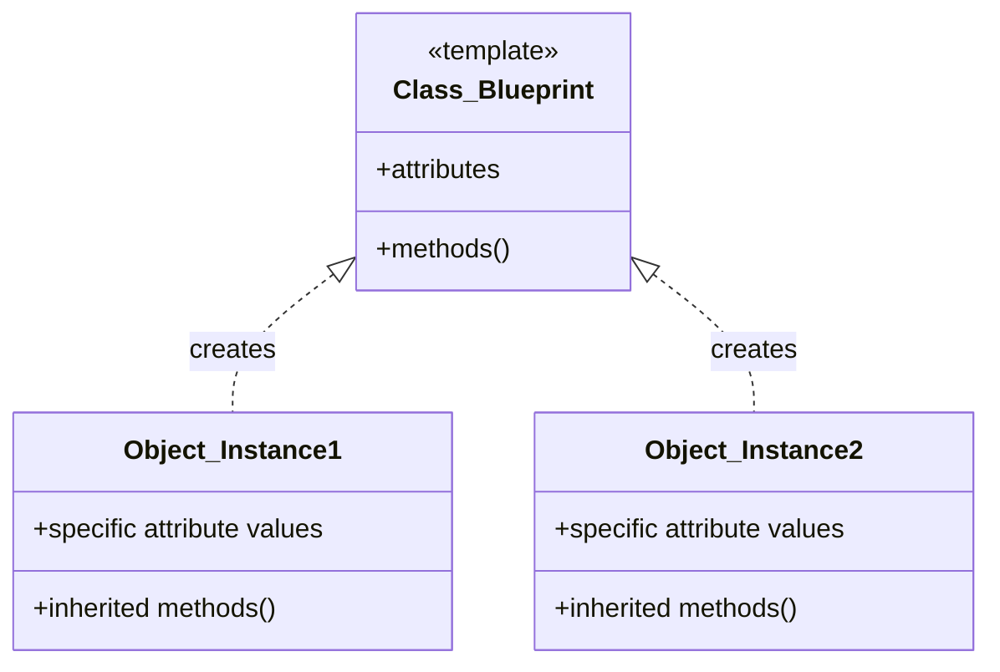
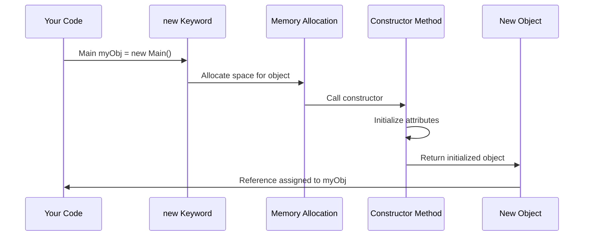
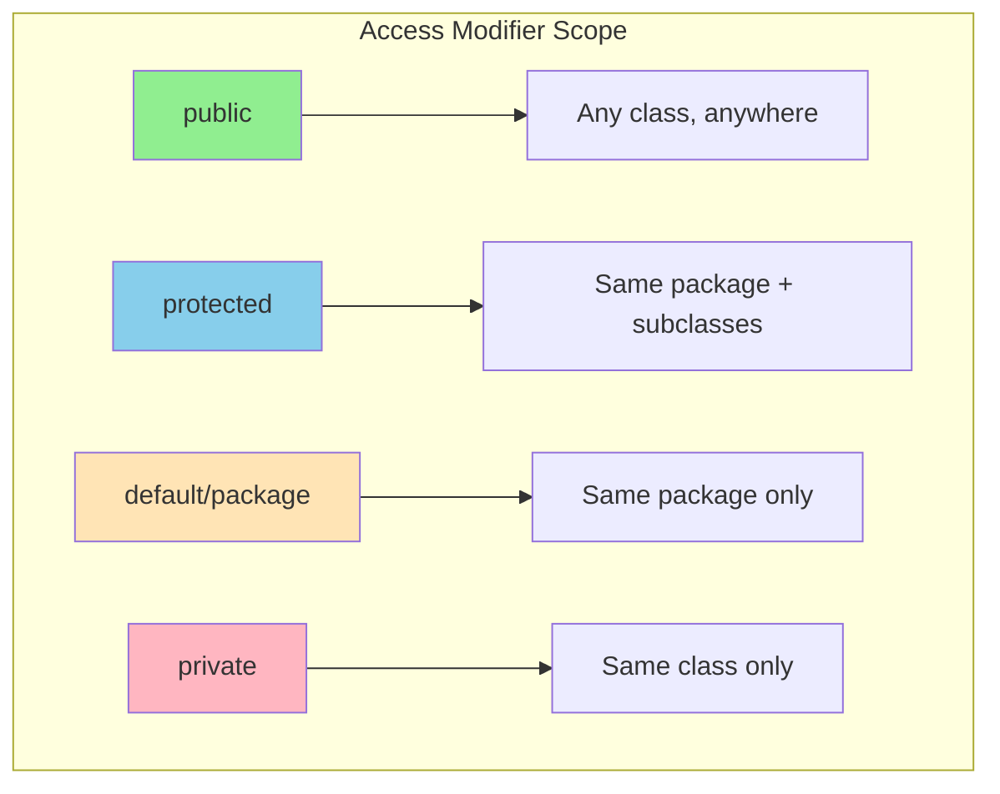
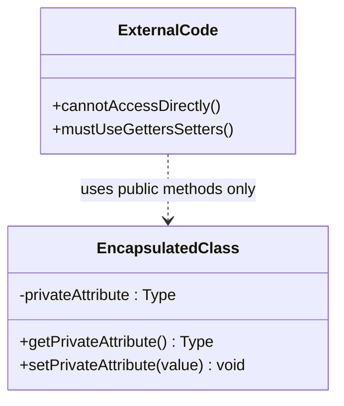
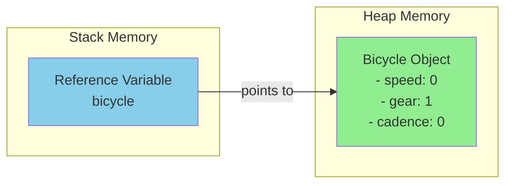

---
tags:
  - "#CCT2"
  - OO
  - Java
  - Programming
  - UML
  - Use_Case
Topic: "UML tools (light) | \rUse-case analysis (light) | \rRelation to object oriented design process\r | Classes and objects\r | Attributes | \rMethods\r | How to define classes | \rHow to use objects in our code"
Semester: CCT2
Course: Objektorienteret analyse, design og implementering + Java
Litterature:
  - w3schools - Java Classes
  - tpointtech - Use Case Diagram | UML (Unified Modeling Language)
  - medium - Modularization in Software Engineering
Created: 10/02/2026
---
- - -
# Table of Contents

1. [[#Java - Object-Oriented Programming (OOP)|Java - Object-Oriented Programming (OOP)]]
	1. [[#Java - Object-Oriented Programming (OOP)#What is OOP?|What is OOP?]]
		1. [[#What is OOP?#Advantages of OOP Over Procedural Programming|Advantages of OOP Over Procedural Programming]]
	2. [[#Java - Object-Oriented Programming (OOP)#Classes and Objects|Classes and Objects]]
		1. [[#Classes and Objects#The Cookie Analogy Explained|The Cookie Analogy Explained]]
		2. [[#Classes and Objects#Operations on Objects|Operations on Objects]]
	3. [[#Java - Object-Oriented Programming (OOP)#Creating a Class|Creating a Class]]
	4. [[#Java - Object-Oriented Programming (OOP)#Creating Objects|Creating Objects]]
		1. [[#Creating Objects#Creating Multiple Objects|Creating Multiple Objects]]
		2. [[#Creating Objects#Using Multiple Classes|Using Multiple Classes]]
	5. [[#Java - Object-Oriented Programming (OOP)#Class Attributes (Fields)|Class Attributes (Fields)]]
		1. [[#Class Attributes (Fields)#Accessing Attributes|Accessing Attributes]]
		2. [[#Class Attributes (Fields)#Modifying Attributes|Modifying Attributes]]
		3. [[#Class Attributes (Fields)#Using `final` to Prevent Modification|Using `final` to Prevent Modification]]
		4. [[#Class Attributes (Fields)#Multiple Objects and Attributes|Multiple Objects and Attributes]]
	6. [[#Java - Object-Oriented Programming (OOP)#Class Methods|Class Methods]]
		1. [[#Class Methods#Accessing Methods with an Object|Accessing Methods with an Object]]
		2. [[#Class Methods#Example Breakdown|Example Breakdown]]
		3. [[#Class Methods#Using Multiple Classes with Methods|Using Multiple Classes with Methods]]
	7. [[#Java - Object-Oriented Programming (OOP)#Constructors|Constructors]]
		1. [[#Constructors#Constructor Parameters|Constructor Parameters]]
		2. [[#Constructors#Object Lifecycle and Memory Management|Object Lifecycle and Memory Management]]
		3. [[#Constructors#Null References|Null References]]
	8. [[#Java - Object-Oriented Programming (OOP)#The `this` Keyword|The `this` Keyword]]
		1. [[#The `this` Keyword#Accessing Class Attributes with `this`|Accessing Class Attributes with `this`]]
		2. [[#The `this` Keyword#Calling a Constructor from Another Constructor|Calling a Constructor from Another Constructor]]
		3. [[#The `this` Keyword#When to Use `this`|When to Use `this`]]
	9. [[#Java - Object-Oriented Programming (OOP)#Access Modifiers|Access Modifiers]]
		1. [[#Access Modifiers#Types of Modifiers|Types of Modifiers]]
		2. [[#Access Modifiers#Access Modifiers for Classes|Access Modifiers for Classes]]
		3. [[#Access Modifiers#Access Modifiers for Attributes, Methods, and Constructors|Access Modifiers for Attributes, Methods, and Constructors]]
	10. [[#Java - Object-Oriented Programming (OOP)#Non-Access Modifiers|Non-Access Modifiers]]
		1. [[#Non-Access Modifiers#Common Non-Access Modifiers|Common Non-Access Modifiers]]
		2. [[#Non-Access Modifiers#`final` Modifier|`final` Modifier]]
		3. [[#Non-Access Modifiers#`static` Modifier|`static` Modifier]]
		4. [[#Non-Access Modifiers#`abstract` Modifier|`abstract` Modifier]]
		5. [[#Non-Access Modifiers#Non-Access Modifiers Summary|Non-Access Modifiers Summary]]
	11. [[#Java - Object-Oriented Programming (OOP)#Encapsulation|Encapsulation]]
		1. [[#Encapsulation#Get and Set Methods|Get and Set Methods]]
		2. [[#Encapsulation#Why We Cannot Access `private` Variables Directly|Why We Cannot Access `private` Variables Directly]]
		3. [[#Encapsulation#Benefits of Encapsulation|Benefits of Encapsulation]]
		4. [[#Encapsulation#Data Encapsulation Concepts|Data Encapsulation Concepts]]
	12. [[#Java - Object-Oriented Programming (OOP)#UML (Unified Modeling Language)|UML (Unified Modeling Language)]]
		1. [[#UML (Unified Modeling Language)#UML Visibility Symbols|UML Visibility Symbols]]
	13. [[#Java - Object-Oriented Programming (OOP)#Object References and Memory|Object References and Memory]]
		1. [[#Object References and Memory#Shared Objects and Concurrency|Shared Objects and Concurrency]]
	14. [[#Java - Object-Oriented Programming (OOP)#Use Case Diagrams|Use Case Diagrams]]
		1. [[#Use Case Diagrams#Purpose of Use Case Diagrams|Purpose of Use Case Diagrams]]
		2. [[#Use Case Diagrams#How to Draw a Use Case Diagram|How to Draw a Use Case Diagram]]
		3. [[#Use Case Diagrams#Example: Online Shopping Website|Example: Online Shopping Website]]
	15. [[#Java - Object-Oriented Programming (OOP)#Modularization in Software Engineering|Modularization in Software Engineering]]
		1. [[#Modularization in Software Engineering#Why Modularization?|Why Modularization?]]
		2. [[#Modularization in Software Engineering#Benefits of Modularization|Benefits of Modularization]]
		3. [[#Modularization in Software Engineering#How to Decompose Modules|How to Decompose Modules]]
		4. [[#Modularization in Software Engineering#Example: Text-to-Speech Application|Example: Text-to-Speech Application]]
	16. [[#Java - Object-Oriented Programming (OOP)#Common Pitfalls and How to Avoid Them|Common Pitfalls and How to Avoid Them]]
	17. [[#Java - Object-Oriented Programming (OOP)#Best Practices|Best Practices]]
	18. [[#Java - Object-Oriented Programming (OOP)#Putting It All Together: Real-World Example|Putting It All Together: Real-World Example]]

# Java - Object-Oriented Programming (OOP)

| Concept | Description | Syntax Example | When to Use |
|---------|-------------|----------------|-------------|
| **OOP** | Programming paradigm based on objects containing data and methods | `class MyClass { }` | When building modular, reusable software |
| **Class** | Blueprint/template for creating objects | `public class ClassName { }` | To define a new type of object |
| **Object** | Instance of a class | `ClassName obj = new ClassName();` | When you need an actual entity to work with |
| **Constructor** | Special method to initialize objects | `public ClassName() { }` | To set initial state when creating objects |
| **Attribute** | Variable belonging to a class (also called field) | `int x = 5;` | To store data/state within objects |
| **Method** | Function belonging to a class | `void myMethod() { }` | To define behavior/actions for objects |
| **`this`** | Refers to the current object | `this.x = x;` | When parameter names match attribute names |
| **`public`** | Accessible from any class | `public int x;` | For API/interface elements others need to access |
| **`private`** | Accessible only within the class | `private int x;` | For internal data that should be hidden |
| **`protected`** | Accessible within class and subclasses | `protected int x;` | For data shared with child classes only |
| **`final`** | Prevents modification/override | `final int x = 10;` | For constants (e.g., PI, MAX_SIZE) |
| **`static`** | Belongs to class, not objects | `static void method() { }` | For shared data/utility methods |
| **Encapsulation** | Hiding internal data, using getters/setters | `private int x; public int getX() { }` | Always—protects data integrity |
| **`null`** | Reference pointing to no object | `Object obj = null;` | To indicate "no object assigned" |

_Table 1: Quick reference of Java OOP concepts and syntax_

---

## What is OOP?

>[!info] **Object-Oriented Programming (OOP)**
>OOP stands for **Object-Oriented Programming**. It is a programming paradigm centered around **objects** that contain both **data** ([[#Class Attributes (Fields)|attributes]]) and **methods** ([[#Class Methods|functions]]) that operate on that data.

**Procedural programming** focuses on writing procedures or methods that perform operations on data. In contrast, **object-oriented programming** creates objects that bundle data and the methods that work with that data together.

>[!abstract] **Analogy: Cookie-Cutter and Cookies**
>Think of OOP like baking cookies:
>- A **cookie-cutter** defines the general shape of a cookie — this is like a [[#Creating a Class|class]].
>- The **cookies** themselves are individual items made from that cutter — these are [[#Creating Objects|objects]].
>- The cutter itself is NOT a cookie, just as a class is not an object.
>- Each cookie is a distinct entity (instance), even if they share the same shape.

### Advantages of OOP Over Procedural Programming

- **Faster execution**: OOP structure can lead to more efficient code
- **Clear structure**: Programs are organized logically around objects
- **DRY principle**: "Don't Repeat Yourself" — reduces code duplication
- **Maintainability**: Easier to maintain, modify, and debug
- **Reusability**: Create full reusable applications with less code
- **Shorter development time**: [[#Modularization in Software Engineering|Modular design]] speeds up development

>[!tip] **The DRY Principle**
>The "Don't Repeat Yourself" (DRY) principle is about reducing code repetition. Extract common code into a single place and reuse it instead of repeating it throughout your application.

---

## Classes and Objects

>[!info] **Classes and Objects**
>- A **class** is a template or blueprint for creating objects
>- An **object** is an instance of a class
>- Classes define the structure; objects are the actual entities created from that structure



_Figure 1.1: Relationship between a class (blueprint) and its object instances_

### The Cookie Analogy Explained

A cookie-cutter defines a general description for the shape of a cookie. Many cookies can share this form/shape. The cutter ITSELF, however, is not a cookie. A class is like the cutter, and objects are the cookies.

To make a cookie, we need to follow a predefined procedure and use some ingredients. The method for creating an object is called a [[#Constructors|**constructor**]]. Constructors can have defined input parameters; they are special methods that belong to the class.

Our cookies are similar in that they are all cookies, but they are still distinct entities. They might both be made from gingerbread dough, but one is the shape of a Christmas tree, another a star, another a gingerbread man. Regardless of how much or little they vary, each individual cookie is an **instance** of a class called an **object**. Each object has its own [[#Class Attributes (Fields)|attributes]]. Even if the attributes of two objects are identical, they are not equal. Objects that are related to the same class share a type.

### Operations on Objects

Things we can do with a cookie, like decorating it, can be described in two ways:

- **Class method with object parameter**: Write methods that belong to a class, which take an object as input
  ```java
  Decorate(myCookie);  // myCookie passed as argument to external method
  ```

- **Object method**: Write methods that belong to an object and are run in the context of that object
  ```java
  myCookie.Decorate();  // Method called ON the object itself
  ```

>[!example] **Class vs. Objects**
>
>**Class**: `Fruit`
>**Objects**: `Apple`, `Banana`, `Mango`
>
>**Class**: `Car`
>**Objects**: `Volvo`, `Audi`, `Toyota`

When individual objects are created, they **inherit** all the variables and methods from the class.

---

## Creating a Class

>[!info] **Creating a Class**
>To create a class, use the keyword `class`. The class name should always start with an uppercase first letter, and the Java filename should match the class name.

>[!example] **Basic Class Definition**
>```java
>public class Main {
>  int x = 5;  // Attribute (also called field or member variable)
>}
>```

---

## Creating Objects

>[!info] **Creating an Object**
>In Java, an object is created from a class using the `new` keyword. The syntax is:
>```java
>ClassName objectName = new ClassName();
>//   ^          ^       ^      ^
>//   |          |       |      └── Calls the constructor
>//   |          |       └── Creates new instance in memory
>//   |          └── Name for this specific object
>//   └── The class (type) of the object
>```

>[!example] **Creating and Using an Object**
>```java
>public class Main {
>  int x = 5;  // Class attribute
>
>  public static void main(String[] args) {
>    Main myObj = new Main();     // Create object from Main class
>    System.out.println(myObj.x); // Access attribute via dot notation
>  }
>}
>// Output: 5
>```

### Creating Multiple Objects

>[!example] **Multiple Objects from One Class**
>```java
>public class Main {
>  int x = 5;  // Each object gets its own copy of x
>
>  public static void main(String[] args) {
>    Main myObj1 = new Main();  // Object 1 - independent instance
>    Main myObj2 = new Main();  // Object 2 - separate independent instance
>    System.out.println(myObj1.x);  // Outputs: 5
>    System.out.println(myObj2.x);  // Outputs: 5
>  }
>}
>```

### Using Multiple Classes

>[!tip] **Organizing Code Across Multiple Classes**
>It's good practice to create an object of a class in one file and access it in another for better [[#Modularization in Software Engineering|organization]]. One class contains all [[#Class Attributes (Fields)|attributes]] and [[#Class Methods|methods]], while another class holds the `main()` method (the code to be executed).

>[!example] **Accessing a Class from Another File**
>
>**Main.java**
>```java
>public class Main {
>  int x = 5;  // Attribute defined here
>}
>```
>
>**Second.java**
>```java
>class Second {
>  public static void main(String[] args) {
>    Main myObj = new Main();     // Create Main object in different file
>    System.out.println(myObj.x); // Access Main's attribute
>  }
>}
>// Output: 5
>```

---

## Class Attributes (Fields)

>[!info] **Class Attributes**
>Variables declared inside a class are called **attributes** or **fields**. They belong to the class and are accessed via objects using the dot (`.`) syntax.

>[!example] **Class with Multiple Attributes**
>```java
>public class Main {
>  int x = 5;     // Integer attribute
>  int y = 3;     // Another integer attribute
>  String name;   // String attribute (uninitialized = null)
>}
>```

### Accessing Attributes

You access attributes by creating an object and using the dot (`.`) syntax:

>[!example] **Accessing Attributes**
>```java
>public class Main {
>  int x = 5;
>
>  public static void main(String[] args) {
>    Main myObj = new Main();      // Create object
>    System.out.println(myObj.x);  // Access x via dot notation
>  }
>}
>// Output: 5
>```

### Modifying Attributes

>[!example] **Modifying Attribute Values**
>```java
>public class Main {
>  int x;  // Declared but not initialized (default = 0)
>
>  public static void main(String[] args) {
>    Main myObj = new Main();
>    myObj.x = 40;                 // Assign value after object creation
>    System.out.println(myObj.x); 
>  }
>}
>// Output: 40
>```

>[!example] **Overriding Existing Values**
>```java
>public class Main {
>  int x = 10;  // Initial value
>
>  public static void main(String[] args) {
>    Main myObj = new Main();
>    myObj.x = 25;                 // Override: x is now 25
>    System.out.println(myObj.x);
>  }
>}
>// Output: 25
>```

### Using `final` to Prevent Modification

>[!warning] **Preventing Attribute Modification with `final`**
>If you don't want the ability to override existing values, declare the attribute as `final`:
>
>```java
>public class Main {
>  final int x = 10;  // Cannot be changed after initialization
>
>  public static void main(String[] args) {
>    Main myObj = new Main();
>    myObj.x = 25;  // ERROR: cannot assign a value to a final variable
>    System.out.println(myObj.x);
>  }
>}
>```

>[!tip] **Use of `final`**
>The `final` keyword is useful when you want a variable to always store the same value, like mathematical constants (e.g., `final double PI = 3.14159`). See [[#Non-Access Modifiers]] for more details.

### Multiple Objects and Attributes

>[!example] **Independent Attribute Values Across Objects**
>```java
>public class Main {
>  int x = 5;  // Each object gets its own copy
>
>  public static void main(String[] args) {
>    Main myObj1 = new Main();  // Object 1: x = 5
>    Main myObj2 = new Main();  // Object 2: x = 5
>    myObj2.x = 25;             // Only changes myObj2's x
>    System.out.println(myObj1.x);  // Still 5 - unchanged
>    System.out.println(myObj2.x);  // Now 25
>  }
>}
>```

>[!example] **Multiple Attributes**
>```java
>public class Main {
>  String fname = "John";   // First name attribute
>  String lname = "Doe";    // Last name attribute
>  int age = 24;            // Age attribute
>
>  public static void main(String[] args) {
>    Main myObj = new Main();
>    // Concatenate attributes for output
>    System.out.println("Name: " + myObj.fname + " " + myObj.lname);
>    System.out.println("Age: " + myObj.age);
>  }
>}
>// Output:
>// Name: John Doe
>// Age: 24
>```

---

## Class Methods

>[!info] **Class Methods**
>Methods are declared within a class and are used to perform actions. They define the behavior of objects. See also [[#Access Modifiers]] for controlling method visibility.

>[!example] **Simple Method Declaration**
>```java
>public class Main {
>  // 'static' means this method belongs to the class, not objects
>  static void myMethod() {
>    System.out.println("Hello World!");
>  }
>}
>```

To **call** a method, write the method's name followed by parentheses `()` and a semicolon `;`:

>[!example] **Calling a Method**
>```java
>public class Main {
>  static void myMethod() {
>    System.out.println("Hello World!");
>  }
>
>  public static void main(String[] args) {
>    myMethod();  // Call the method - executes its code
>  }
>}
>// Output: Hello World!
>```

### Accessing Methods with an Object

>[!example] **Methods Called on Objects**
>```java
>public class Main {
>  // Instance method (no 'static') - requires an object to call
>  public void fullThrottle() {
>    System.out.println("The car is going as fast as it can!");
>  }
>
>  // Method with parameter - accepts data when called
>  public void speed(int maxSpeed) {
>    System.out.println("Max speed is: " + maxSpeed);
>  }
>
>  public static void main(String[] args) {
>    Main myCar = new Main();   // Must create object first
>    myCar.fullThrottle();      // Call method on the object
>    myCar.speed(200);          // Pass 200 as the maxSpeed argument
>  }
>}
>// Output:
>// The car is going as fast as it can!
>// Max speed is: 200
>```

### Example Breakdown

1. Created a custom `Main` class with the `class` keyword
2. Created the `fullThrottle()` and `speed()` methods in the `Main` class
3. `fullThrottle()` and `speed()` print text when called
4. `speed()` accepts an `int` parameter called `maxSpeed`
5. To use the `Main` class and its methods, we create an **object** of the `Main` class
6. In the `main()` method, we create an object named `myCar` using the `new` keyword
7. We call `fullThrottle()` and `speed()` on the `myCar` object using the dot (`.`) syntax

>[!important] **Accessing Object Members**
>The dot (`.`) is used to access the object's [[#Class Attributes (Fields)|attributes]] and [[#Class Methods|methods]].
>
>To call a method in Java: write the method name followed by parentheses `()` and a semicolon `;`.

### Using Multiple Classes with Methods

>[!example] **Organizing Methods Across Multiple Files**
>
>**Main.java**
>```java
>public class Main {
>  // Methods defined in separate class file
>  public void fullThrottle() {
>    System.out.println("The car is going as fast as it can!");
>  }
>
>  public void speed(int maxSpeed) {
>    System.out.println("Max speed is: " + maxSpeed);
>  }
>}
>```
>
>**Second.java**
>```java
>class Second {
>  public static void main(String[] args) {
>    Main myCar = new Main();  // Create object of Main class
>    myCar.fullThrottle();     // Use Main's methods
>    myCar.speed(200);
>  }
>}
>// Output:
>// The car is going as fast as it can!
>// Max speed is: 200
>```

---

## Constructors

>[!info] **Constructors**
>A constructor in Java is a **special method** used to initialize objects. The constructor is called when an object of a class is created. It can set initial values for object [[#Class Attributes (Fields)|attributes]].



_Figure 1.2: Sequence diagram showing the object creation process with constructor invocation_

>[!example] **Basic Constructor**
>```java
>public class Main {
>  int x;  // Class attribute (uninitialized)
>
>  // Constructor - same name as class, no return type
>  public Main() {
>    x = 5;  // Set initial value when object is created
>  }
>
>  public static void main(String[] args) {
>    Main myObj = new Main();     // Constructor called here
>    System.out.println(myObj.x); // x was set to 5 by constructor
>  }
>}
>// Output: 5
>```

>[!note] **Constructor Rules**
>- Constructor name **must match the class name**
>- Constructor **cannot have a return type** (not even `void`)
>- Constructor is called when the object is created
>- All classes have constructors by default; if you don't create one, Java creates one for you (but you cannot set initial values)

### Constructor Parameters

>[!example] **Constructor with Parameters**
>```java
>public class Main {
>  int x;  // Will be set by constructor
>
>  // Constructor accepts a value to initialize x
>  public Main(int y) {
>    x = y;  // Parameter y assigned to attribute x
>  }
>
>  public static void main(String[] args) {
>    Main myObj = new Main(5);    // Pass 5 to constructor
>    System.out.println(myObj.x); // x is now 5
>  }
>}
>// Output: 5
>```

>[!example] **Constructor with Multiple Parameters**
>```java
>public class Main {
>  int modelYear;     // Attribute for year
>  String modelName;  // Attribute for name
>
>  // Constructor initializes both attributes
>  public Main(int year, String name) {
>    modelYear = year;   // Assign year parameter to attribute
>    modelName = name;   // Assign name parameter to attribute
>  }
>
>  public static void main(String[] args) {
>    Main myCar = new Main(1969, "Mustang");  // Both values passed
>    System.out.println(myCar.modelYear + " " + myCar.modelName);
>  }
>}
>// Output: 1969 Mustang
>```

### Object Lifecycle and Memory Management

>[!note] **Constructor and Object Creation**
>- The constructor is called when we initiate the object: `Bicycle myBicycle = new Bicycle();`
>- Constructor is a method without any return value (it implicitly returns an object of that class)
>- This is a **deterministic process**
>- Destroying an object (cleanup) is **NOT** deterministic in Java, as it depends on many factors
>- `finalize()` was meant to run when an object dies, but it was deprecated in Java 9 and completely removed in Java 18
>- Objects using external resources must clean up explicitly using `AutoClosable()` — covered later in the course

>[!info] **Garbage Collection and Object References**
>Behind the scenes, Java tracks objects and how they are referenced:
>- If nothing references an object, it means the object is no longer used
>- It is cleared from memory at some point in time (garbage collection)
>- Destructors can be made, but are more complex — Java mostly relies on garbage collection, after which resources are gracefully shut down (e.g., closing files, freeing ports)

### Null References

>[!warning] **Null Pointer Exceptions**
>Usually, you create an object and assign it to a variable:
>```java
>Bicycle bicycle = new Bicycle();  // bicycle references a real object
>```
>
>Sometimes it's convenient to declare the class type later:
>```java
>Bicycle bicycle;  // bicycle is null - NO object created yet!
>```
>
>Until the constructor is called via `new Bicycle()`, the variable `bicycle` holds the value `null`. Null isn't really a value — it's a reference to address 0, which is invalid, essentially saying that `bicycle` has not been created.
>
>A highly common error is the **null pointer exception**, meaning some object was not created somewhere in the code — you forgot to call `new Bicycle()`.
>
>Null pointer exceptions often happen in places other than where the error originates.
>
>Setting a variable to `null` tells the garbage collector that the object is no longer needed:
>```java
>bicycle = null;  // Effectively destroys the bicycle
>```

---

## The `this` Keyword

>[!info] **The `this` Keyword**
>The `this` keyword in Java refers to the **current object** in a method or [[#Constructors|constructor]]. It is often used to avoid confusion when class [[#Class Attributes (Fields)|attributes]] have the same name as method or constructor parameters.

### Accessing Class Attributes with `this`

>[!example] **Using `this` to Distinguish Between Class Variables and Parameters**
>```java
>public class Main {
>  int x;  // Class variable named 'x'
>
>  // Constructor also has parameter named 'x' - creates ambiguity!
>  public Main(int x) {
>    this.x = x;  // 'this.x' = class attribute, 'x' = parameter
>    // Without 'this': x = x would assign parameter to itself (useless)
>  }
>
>  public static void main(String[] args) {
>    Main myObj = new Main(5);
>    System.out.println("Value of x = " + myObj.x);
>  }
>}
>// Output: Value of x = 5
>```

>[!tip] **Understanding `this.x = x;`**
>Think of `this.x = x;` as: "`this.x` (the class variable) gets the value of `x` (the parameter)."
>
>Without `this`, the code `x = x;` would set the parameter `x` equal to itself, and the class variable would stay uninitialized (`0`).

### Calling a Constructor from Another Constructor

>[!info] **Constructor Chaining with `this()`**
>You can use `this()` to call another constructor in the same class. This is useful for providing default values or reusing initialization code.

>[!example] **Using `this()` for Constructor Chaining**
>```java
>public class Main {
>  int modelYear;
>  String modelName;
>
>  // Constructor with ONE parameter - provides a default year
>  public Main(String modelName) {
>    this(2020, modelName);  // Calls the two-parameter constructor
>    // Reuses initialization code instead of duplicating it
>  }
>
>  // Constructor with TWO parameters - the "main" constructor
>  public Main(int modelYear, String modelName) {
>    this.modelYear = modelYear;  // 'this' distinguishes attribute from param
>    this.modelName = modelName;
>  }
>
>  public void printInfo() {
>    System.out.println(modelYear + " " + modelName);
>  }
>
>  public static void main(String[] args) {
>    Main car1 = new Main("Corvette");      // Uses default year 2020
>    Main car2 = new Main(1969, "Mustang"); // Specifies both values
>    car1.printInfo();  // Output: 2020 Corvette
>    car2.printInfo();  // Output: 1969 Mustang
>  }
>}
>```

>[!warning] **`this()` Must Be First Statement**
>The call to `this()` must be the **first statement** inside the constructor.

### When to Use `this`

- When a constructor or method has a parameter with the same name as a class variable, use `this` to update the class variable correctly
- To call another constructor in the same class and reuse code

---

## Access Modifiers

>[!info] **Access Modifiers**
>Access modifiers control the **access level** for classes, [[#Class Attributes (Fields)|attributes]], [[#Class Methods|methods]], and [[#Constructors|constructors]]. They determine who can access and use these elements.



_Figure 1.3: Visual hierarchy of access modifier visibility scopes_

### Types of Modifiers

Modifiers are divided into two groups:

- **Access Modifiers**: Control the access level
- **[[#Non-Access Modifiers]]**: Provide other functionality (do not control access level)

### Access Modifiers for Classes

| Modifier | Description |
|----------|-------------|
| `public` | The class is accessible by any other class |
| _default_ | The class is only accessible by classes in the same package (used when no modifier is specified) |

_Table 1.1: Access modifiers for classes_

### Access Modifiers for Attributes, Methods, and Constructors

| Modifier | Description |
|----------|-------------|
| `public` | Accessible for all classes |
| `private` | Only accessible within the declared class |
| _default_ | Only accessible in the same package (used when no modifier is specified) |
| `protected` | Accessible in the same package and by subclasses |

_Table 1.2: Access modifiers for attributes, methods, and constructors_

>[!example] **Public vs. Private**
>```java
>class Person {
>  public String name = "John";   // Public - accessible everywhere
>  private int age = 30;          // Private - only inside this class
>}
>
>public class Main {
>  public static void main(String[] args) {
>    Person p = new Person();
>    System.out.println(p.name);   // Works - name is public
>    System.out.println(p.age);    // ERROR: age has private access
>  }
>}
>```

>[!abstract] **Real-Life Analogy**
>Think of access modifiers like real life:
>- `public` — a public park, everyone can enter
>- `private` — your house key, only you can use it

---

## Non-Access Modifiers

>[!info] **Non-Access Modifiers**
>Non-access modifiers do not control visibility (like `public` or `private`), but instead add **other features** to classes, [[#Class Methods|methods]], and [[#Class Attributes (Fields)|attributes]].

### Common Non-Access Modifiers

The most commonly used non-access modifiers are:
- `final`
- `static`
- `abstract`

### `final` Modifier

>[!info] **`final` Keyword**
>The `final` keyword prevents attributes and methods from being overridden or modified. Once set, the value cannot change.

>[!example] **Using `final` with Attributes**
>```java
>public class Main {
>  final int x = 10;          // Constant - cannot be changed
>  final double PI = 3.14;    // Another constant
>
>  public static void main(String[] args) {
>    Main myObj = new Main();
>    myObj.x = 50;   // ERROR: cannot assign to final variable
>    myObj.PI = 25;  // ERROR: cannot assign to final variable
>    System.out.println(myObj.x);
>  }
>}
>```

### `static` Modifier

>[!info] **`static` Keyword**
>A `static` method belongs to the class, not to any specific object. This means you can call it without creating an object of the class.

>[!example] **Using `static` Methods**
>```java
>public class Main {
>  // Static method - belongs to class itself
>  static void myStaticMethod() {
>    System.out.println("Static methods can be called without creating objects");
>  }
>
>  public static void main(String[] args) {
>    myStaticMethod();         // Call directly - no object needed
>    Main.myStaticMethod();    // Or call using class name
>  }
>}
>```

>[!note] **Limitations of `static` Methods**
>A `static` method belongs to the class itself. You can call it without creating an object, but it **cannot** use variables or methods that belong to an object (non-static members).

### `abstract` Modifier

>[!info] **`abstract` Keyword**
>An `abstract` method belongs to an `abstract` class and does not have a body. The body is provided by the subclass.

>[!example] **Using `abstract` Classes and Methods**
>
>**Main.java**
>```java
>// Abstract class - cannot create objects directly
>abstract class Main {
>  public String fname = "John";
>  public int age = 24;
>  
>  // Abstract method - no body, just declaration
>  public abstract void study();  // Subclass MUST implement this
>}
>
>// Subclass inherits from Main
>class Student extends Main {
>  public int graduationYear = 2018;
>  
>  // REQUIRED: Provide implementation of abstract method
>  public void study() {
>    System.out.println("Studying all day long");
>  }
>}
>```
>
>**Second.java**
>```java
>class Second {
>  public static void main(String[] args) {
>    Student myObj = new Student();  // Can create Student, not Main
>    System.out.println("Name: " + myObj.fname);
>    System.out.println("Age: " + myObj.age);
>    System.out.println("Graduation Year: " + myObj.graduationYear);
>    myObj.study();  // Calls Student's implementation
>  }
>}
>```

### Non-Access Modifiers Summary

**For Classes:**

| Modifier | Description |
|----------|-------------|
| `final` | The class cannot be inherited by other classes |
| `abstract` | The class cannot be used to create objects (must be inherited) |

_Table 1.3: Non-access modifiers for classes_

**For Attributes and Methods:**

| Modifier | Description |
|----------|-------------|
| `final` | Attributes and methods cannot be overridden/modified |
| `static` | Attributes and methods belong to the class, not to objects (all objects share the same `static` attribute; `static` methods can be called without creating objects) |
| `abstract` | Can only be used in an abstract class; methods have no body (e.g., `abstract void run();`); the body is provided by the subclass |
| `transient` | Attributes and methods are skipped when serializing the object |
| `synchronized` | Methods can only be accessed by one thread at a time |
| `volatile` | The value of an attribute is not cached thread-locally; always read from main memory |

_Table 1.4: Non-access modifiers for attributes and methods_

---

## Encapsulation

>[!info] **Encapsulation**
>**Encapsulation** means hiding "sensitive" data from users. To achieve this:
>1. Declare class variables/[[#Class Attributes (Fields)|attributes]] as `private`
>2. Provide public **get** and **set** [[#Class Methods|methods]] to access and update the value of a `private` variable



_Figure 1.4: Encapsulation pattern showing private data accessed through public methods_

### Get and Set Methods

The `get` method returns the variable value, and the `set` method sets the value.

**Syntax:**
- Method names start with `get` or `set`, followed by the variable name with the first letter in uppercase

>[!example] **Basic Encapsulation with Getter and Setter**
>```java
>public class Person {
>  private String name;  // PRIVATE - cannot access from outside
>
>  // Getter - returns the private value
>  public String getName() {
>    return name;  // Allows reading the value
>  }
>
>  // Setter - modifies the private value
>  public void setName(String newName) {
>    this.name = newName;  // Allows controlled writing
>  }
>}
>```

**Example Explained:**
- The `get` method returns the value of the variable `name`
- The `set` method takes a parameter (`newName`) and assigns it to the `name` variable
- The [[#The `this` Keyword|`this`]] keyword refers to the current object

### Why We Cannot Access `private` Variables Directly

>[!warning] **Attempting to Access Private Variables**
>```java
>public class Main {
>  public static void main(String[] args) {
>    Person myObj = new Person();
>    myObj.name = "John";              // ERROR - name is private!
>    System.out.println(myObj.name);   // ERROR - name is private!
>  }
>}
>// Error: name has private access in Person
>```

If `name` were declared as `public`, we could access it directly. But since it's `private`, we must use `getName()` and `setName()`:

>[!example] **Using Getters and Setters**
>```java
>public class Main {
>  public static void main(String[] args) {
>    Person myObj = new Person();
>    myObj.setName("John");                // Correct way to set value
>    System.out.println(myObj.getName());  // Correct way to get value
>  }
>}
>// Output: John
>```

### Benefits of Encapsulation

>[!tip] **Why Use Encapsulation?**
>- **Better control** of class attributes and methods
>- **Read-only** attributes (if you only use the `get` method)
>- **Write-only** attributes (if you only use the `set` method)
>- **Flexibility**: Change one part of the code without affecting other parts
>- **Increased security** of data

### Data Encapsulation Concepts

>[!abstract] **Two Aspects of Data Encapsulation**
>Data encapsulation refers to two distinct but related concepts:
>1. **Bundling data with methods** that operate on the data
>2. **Restricting access to some object components** (information hiding)

**Benefits of Bundling:**
- Reduces problems from external code that would need to understand the object's inner workings
- Provides consistent interfaces
- Keeps things organized
- Encourages decoupling (relates to [[#Modularization in Software Engineering|modularization]])

**Benefits of Information Hiding:**
- Supports the integrity of objects, preventing users from manipulating parts that could lead to invalid, inconsistent, or unstable states
- Makes it explicit what a user is allowed to do, reducing complexity
- Separates the concept of **what something does** from **how it is implemented**

>[!example] **Encapsulation in a Bicycle Class**
>
>**Without Encapsulation (Poor Design):**
>```java
>class Bicycle {
>  float speed = 0;  // Exposed - anyone can set invalid values!
>  
>  public Bicycle() { }
>}
>// Problem: bicycle.speed = -100; is allowed but makes no sense
>```
>
>**With Encapsulation (Good Design):**
>```java
>class Bicycle {
>  private float speed = 0;     // Hidden from outside
>  private int cadence = 0;     // Hidden from outside
>  private int gear = 1;        // Hidden from outside
>  
>  public Bicycle() { }
>  
>  // Controlled way to change cadence
>  public void changeCadence(int rpm) {
>    if (rpm >= 0) {            // Validation!
>      this.cadence = rpm;
>    }
>  }
>  
>  // Calculated property - user doesn't need to know formula
>  public float getSpeed() {
>    return cadence * gear;     // Internal calculation hidden
>  }
>}
>// User calls: bicycle.changeCadence(60); 
>// User calls: float s = bicycle.getSpeed();
>```
>
>Now the user doesn't have to recall how to translate from cadence to speed — the code is already there.

>[!note] **Why Encapsulation Prevents Bugs**
>Is `speed = cadence * gear` not a bit simplistic? Indeed! It's easy to make such mistakes along the way (bugs, misunderstandings, time pressure, etc.). The formula might need tire information and other factors.
>
>If we have **protected our state variables**, we can easily improve and update functionality inside the class. Otherwise, all places where external code uses `speed` would need to be updated.

---

## UML (Unified Modeling Language)

>[!info] **UML Class Diagrams**
>Classes are definitions of groups of objects with the same [[#Class Attributes (Fields)|attributes]] and operations. They act as "blueprints" for the actual objects. Individual objects of a given class are called **instances** of that class; they can be created and subsequently destroyed. In some (rare) cases, objects of a class cannot be created; such classes are called **abstract**.

![[Pasted image 20260221113837.png]]

_Figure 1.5: UML class diagram showing a bicycle with shared and specific attributes across different types of bicycles_

>[!example] **Bicycle Class Example**
>A bicycle has many different attributes that are shared across all bicycles: all bikes have and use wheels. However, specific bikes have specific attributes that set them apart from other bikes: mountain bike wheels are wide, and racing bike wheels are slim.

![[Pasted image 20260221114059.png]]

_Figure 1.6: UML notation showing visibility symbols and attribute/method structure_

### UML Visibility Symbols

| Symbol | Visibility | Accessibility Scope |
|:------:|:-----------|:--------------------|
| `+` | **Public** | Accessible by any class within the model and external systems |
| `-` | **Private** | Accessible only within the class where it is defined |
| `#` | **Protected** | Accessible within the class and by subclasses (inheritors) |
| `~` | **Package** | Accessible only by classes within the same package/namespace |

_Table 1.5: UML visibility symbols and their meanings (corresponds to [[#Access Modifiers]])_

>[!example] **UML Class Diagram: BankAccount**
>```mermaid
>classDiagram
>    class BankAccount {
>        -String accountNumber
>        -double balance
>        +BankAccount(number, initialBalance)
>        +deposit(amount)
>        +withdraw(amount)
>        #generateAuditLog()
>        ~getInternalStatus()
>    }
>```

![[Pasted image 20260221114415.png]]

_Figure 1.7: Example UML class diagram showing different visibility levels_

![[Pasted image 20260221114439.png]]

_Figure 1.8: UML class relationships and structure_

![[Pasted image 20260221114842.png]]

_Figure 1.9: Detailed UML class diagram with methods and attributes_

---

## Object References and Memory

>[!info] **Object References**
>Objects are accessed via a **reference variable**. The reference variable is a pointer to the location in memory where the object, once created, is stored.

In Java, a new object is created by:
```java
Bicycle bicycle = new Bicycle();
//   ^       ^           ^
//   |       |           └── Actual object in heap memory
//   |       └── Reference variable (pointer to object)
//   └── Type declaration
```



_Figure 1.10: Object reference diagram showing how reference variables in stack memory point to objects in heap memory_

![[Pasted image 20260221114951.png]]

_Figure 1.11: Object reference diagram showing how reference variables point to objects in memory_

### Shared Objects and Concurrency

![[Pasted image 20260221115034.png]]

_Figure 1.12: Class diagram showing input/output methods and object interactions_

>[!abstract] **Class as a Module**
>A class shares similarities with [[#Modularization in Software Engineering|modules]]:
>- It may hold (several) input and output methods
>- It may hold (several) functionalities
>- There is an intuitive relation between functionalities
>- Input and output can also be object references
>
>**Example:**
>- A `Person` class can use a `Bicycle`: `person.use(bicycle)`
>- A `BicycleShop` can return a `Bicycle`: `Bicycle myBike = bicycleShop.buy(money)`
>
>**Important:** It is only the **references to the object** that are exchanged! This can have implications for concurrent (multi-threaded) activities.

>[!warning] **Shared Object Conflicts**
>If two people share the same bicycle:
>- They can change each other's seat height
>- Move it to a different location
>- Change the gears
>- Try to use it at the same time → **conflict**
>
>But if each person has a **copy** of the bicycle, no conflicts occur.

---

## Use Case Diagrams

>[!info] **Use Case Diagrams**
>A use case diagram is used to represent the **dynamic behavior** of a system. It encapsulates the system's functionality by incorporating use cases, actors, and their relationships. It models the tasks, services, and functions required by a system/subsystem of an application.

### Purpose of Use Case Diagrams

1. Gathers the system's requirements
2. Depicts the external view of the system
3. Recognizes internal and external factors that influence the system
4. Represents the interaction between actors

### How to Draw a Use Case Diagram

>[!tip] **Steps for Creating Use Case Diagrams**
>1. Analyze the whole system before starting
>2. Identify all system functionalities
>3. Transform functionalities into use cases
>4. Enlist the actors that will interact with the system
>5. Examine the relationship between actors and use cases
>6. Identify how many times an actor communicates with the system

**Rules to Follow:**

- Assign a pertinent and meaningful name to actors and use cases
- Define communication between actors and use cases in an understandable way
- Use specified notations as required
- Represent the most significant interactions among multiple interactions

### Example: Online Shopping Website

![[Pasted image 20260210134335.png]]

_Figure 1.13: Use case diagram for an online shopping website showing Web Customer actor and top-level use cases_

>[!example] **Online Shopping Use Cases**
>The **Web Customer** actor makes use of an online shopping website to purchase online.
>
>**Top-level use cases:**
>- View Items
>- Make Purchase
>- Checkout
>- Client Register
>
>**Details:**
>- **View Items**: Used by customers to search and view products
>- **Client Register**: Allows customers to register for gift vouchers, coupons, or private sale invitations
>- **Checkout**: An included use case, part of **Make Purchase**, not available by itself

![[Pasted image 20260210134349.png]]

_Figure 1.14: Extended use case diagram showing detailed shopping interactions_

**View Items Extensions:**
- Search Items
- Browse Items
- View Recommended Items
- Add to Shopping Cart
- Add to Wish List

>[!note] **Authentication Requirements**
>Both **View Recommended Item** and **Add to Wish List** include the **Customer Authentication** use case, as they require authenticated customers. Items can be added to the shopping cart without user authentication.

![[Pasted image 20260210134359.png]]

_Figure 1.15: Checkout use case diagram showing payment and authentication processes_

**Checkout Use Case Includes:**
- Customer authentication (via login page, authentication cookie, or SSO)
- Payment (via credit card with external payment services, or PayPal)

>[!important] **Important Tips for Use Case Diagrams**
>1. Articulate a simple and complete use case diagram
>2. Represent the most significant interactions
>3. At least one module of a system should be represented
>4. If the diagram is large and complex, draw it more generalized

---

## Modularization in Software Engineering

>[!info] **Modularization**
>Modularization is the process of separating the functionality of a program into **independent, interchangeable modules**, such that each contains everything necessary to execute only one aspect of the desired functionality. This principle directly relates to how we design [[#Classes and Objects|classes]] in OOP.

### Why Modularization?

In the current age of software, programs are continuously growing and evolving. Designing a program all at once with all required functions would be difficult due to size, complexity, and constant changes.

>[!abstract] **Monolith vs. Modular Architecture**
>- **Monolithic**: All functionality in one large program
>- **Modular**: Functionality separated into independent modules

With modularization, we can easily work on adding separate and smaller modules to a program without being hindered by the complexity of other functions. It's about being **flexible and fast** in adding software functions.

>[!warning] **Risks of Monolithic Architecture**
>In monolithic architecture, there's always the risk of bringing down the whole program with a simple update.

### Benefits of Modularization

- **Easier to add and maintain** smaller components
- **Easier to understand** each module and their purpose
- **Easier to reuse and refactor** modules
- **Better abstraction** between modules
- **Saves time** needed to develop, debug, test, and deploy

![[Pasted image 20260210134442.png]]

_Figure 1.16: Modularization diagram showing separation of functionality into modules_

![[Pasted image 20260210134457.png]]

_Figure 1.17: Monolith vs. modular program architecture comparison_

![[Pasted image 20260210134510.png]]

_Figure 1.18: Microservices and modularity architecture diagram_

![[Pasted image 20260210134517.png]]

_Figure 1.19: Monolithic vs. modular software comparison_

### How to Decompose Modules

>[!info] **Single Responsibility Principle**
>A module should have only a **single responsibility**. Thus, it should depend minimally on other modules. This applies equally to [[#Classes and Objects|classes]] in OOP.

The independence of a module can be measured using:

- **Coupling**: The measure of the degree of interdependence between modules. A good software will have **low coupling**.
- **Cohesion**: A measure of the degree to which the elements of a module are functionally related. It is the degree to which all elements directed towards performing a single task are contained in the component. A good software design will have **high cohesion**.

![[Pasted image 20260210134530.png]]

_Figure 1.20: Cohesion and coupling diagram_

![[Pasted image 20260210134539.png]]

_Figure 1.21: Module coupling diagram, with (c) representing undesirable tight coupling_

>[!tip] **Guidelines for Module Design**
>Each module should:
>- Have a **clear and focused purpose**
>- Have an **easy-to-understand interface**, even without understanding implementation details
>- Have **encapsulated and private** implementation details (see [[#Encapsulation]])
>- Be **changeable without affecting other modules**
>- Have **minimized dependencies** on other modules

### Example: Text-to-Speech Application

>[!example] **Modularizing a Text-to-Speech Application**
>
>**Requirements:**
>- Parse a user's input text
>- Use a selected computer voice to read out the text
>- Have controllers that can speed up or slow down the computer's speech
>
>**Modular Decomposition:**
>1. **Text-to-speech module**: Parses the user's text to be read out loud
>2. **Computer voice module**: Stores and provides computer voices that the user can choose
>3. **Text speech controller module**: Controls the speed of the speech that the user chooses

![[Pasted image 20260210134549.png]]

_Figure 1.22: Decomposition of monolithic text-to-speech application into separate modules_

**Benefits:**
- Developers can develop each module in parallel, saving development time
- Modules can be reused in other applications (e.g., voice navigation)

![[Pasted image 20260210134559.png]]

_Figure 1.23: Reusing text-to-speech and computer voice modules for a voice navigation application_

---

## Common Pitfalls and How to Avoid Them

>[!warning] **Null Pointer Exceptions**
>**Problem**: Declaring an object reference without initializing it
>```java
>Bicycle bike;           // bike is null - no object exists!
>bike.changeCadence(50); // NullPointerException at runtime!
>```
>**Solution**: Always initialize with `new` before use
>```java
>Bicycle bike = new Bicycle();  // Now bike references a real object
>bike.changeCadence(50);        // Works correctly
>```

>[!warning] **Forgetting `this` in Constructors**
>**Problem**: Parameter shadows class attribute, causing silent bugs
>```java
>public Person(String name) {
>    name = name;  // WRONG: Assigns parameter to itself, attribute stays null!
>}
>```
>**Solution**: Use [[#The `this` Keyword|`this`]] keyword to reference the class attribute
>```java
>public Person(String name) {
>    this.name = name;  // CORRECT: Assigns parameter to class attribute
>}
>```

>[!warning] **Accessing Private Members from Outside the Class**
>**Problem**: Trying to access [[#Encapsulation|encapsulated]] data directly
>```java
>Person p = new Person();
>p.age = 25;  // ERROR: age has private access in Person
>```
>**Solution**: Use getter and setter methods
>```java
>Person p = new Person();
>p.setAge(25);           // Use setter method
>int age = p.getAge();   // Use getter method
>```

>[!warning] **Modifying `final` Variables**
>**Problem**: Attempting to change a constant value
>```java
>final int MAX_SIZE = 100;
>MAX_SIZE = 200;  // ERROR: cannot assign a value to final variable
>```
>**Solution**: Don't declare it as `final` if it needs to change, or accept the immutability
>```java
>int maxSize = 100;  // Not final - can be changed
>maxSize = 200;      // Works
>```

>[!warning] **Static Methods Accessing Instance Variables**
>**Problem**: Using non-static members in [[#`static` Modifier|static]] methods
>```java
>public class Main {
>    int count = 0;  // Instance variable
>    
>    public static void main(String[] args) {
>        count++;  // ERROR: non-static variable cannot be referenced from static context
>    }
>}
>```
>**Solution**: Either make the variable static, or create an object first
>```java
>// Solution 1: Make variable static
>static int count = 0;
>
>// Solution 2: Create object first
>public static void main(String[] args) {
>    Main obj = new Main();
>    obj.count++;  // Access through object
>}
>```

---

## Best Practices

>[!tip] **OOP Best Practices**
>1. **Start class names with uppercase**: `Person`, `BankAccount`, not `person`, `bankaccount`
>2. **Use meaningful names**: `calculateTotalPrice()`, not `calc()` or `ctp()`
>3. **Keep classes focused**: Each class should have one clear responsibility ([[#How to Decompose Modules|Single Responsibility Principle]])
>4. **Encapsulate by default**: Make [[#Class Attributes (Fields)|attributes]] `private` unless there's a good reason not to
>5. **Use constructors wisely**: Initialize all required attributes in [[#Constructors|constructors]]
>6. **Prefer composition over complexity**: Multiple small classes > one large class
>7. **Document public methods**: Help other developers understand your API
>8. **Use `final` for constants**: `final double PI = 3.14159;`
>9. **Validate input in setters**: Don't just blindly accept values
>   ```java
>   public void setAge(int age) {
>       if (age >= 0 && age <= 150) {
>           this.age = age;
>       }
>   }
>   ```
>10. **Follow Java naming conventions**:
>    - Classes: `PascalCase`
>    - Methods/variables: `camelCase`
>    - Constants: `UPPER_SNAKE_CASE`

---

## Putting It All Together: Real-World Example

>[!example] **Building a Student Management System**
>Let's apply all OOP principles to create a practical student management system:
>
>```java
>/**
> * Student class demonstrating OOP principles:
> * - Encapsulation (private attributes, public methods)
> * - Constructors (initialization)
> * - Methods (behavior)
> * - Access modifiers (controlling visibility)
> */
>public class Student {
>    // PRIVATE ATTRIBUTES (Encapsulation)
>    private String studentId;    // Unique identifier
>    private String name;         // Student's full name
>    private int age;             // Age in years
>    private double gpa;          // Grade Point Average (0.0 - 4.0)
>    
>    // CONSTRUCTOR - Initialize required fields
>    public Student(String studentId, String name, int age) {
>        this.studentId = studentId;  // 'this' distinguishes attribute from param
>        this.name = name;
>        this.age = age;
>        this.gpa = 0.0;              // Default GPA for new students
>    }
>    
>    // OVERLOADED CONSTRUCTOR - Chain to main constructor
>    public Student(String studentId, String name) {
>        this(studentId, name, 18);   // Default age of 18
>    }
>    
>    // PUBLIC METHODS (Interface for external code)
>    
>    /**
>     * Updates GPA with validation to prevent invalid values
>     */
>    public void updateGPA(double newGPA) {
>        // Validation: GPA must be between 0.0 and 4.0
>        if (newGPA >= 0.0 && newGPA <= 4.0) {
>            this.gpa = newGPA;
>        } else {
>            System.out.println("Invalid GPA. Must be between 0.0 and 4.0");
>        }
>    }
>    
>    /**
>     * Returns formatted student information
>     */
>    public String getStudentInfo() {
>        return "ID: " + studentId + 
>               ", Name: " + name + 
>               ", Age: " + age +
>               ", GPA: " + gpa;
>    }
>    
>    /**
>     * Checks if student is on Dean's List (GPA >= 3.5)
>     */
>    public boolean isOnDeansList() {
>        return gpa >= 3.5;
>    }
>    
>    // GETTER METHODS (Read access to private data)
>    public String getStudentId() { return studentId; }
>    public String getName() { return name; }
>    public int getAge() { return age; }
>    public double getGPA() { return gpa; }
>    
>    // SETTER METHODS (Controlled write access)
>    public void setName(String name) {
>        if (name != null && !name.trim().isEmpty()) {
>            this.name = name;
>        }
>    }
>    
>    public void setAge(int age) {
>        if (age > 0 && age < 150) {  // Reasonable age validation
>            this.age = age;
>        }
>    }
>}
>```
>
>**Usage Example:**
>```java
>public class Main {
>    public static void main(String[] args) {
>        // Create students using constructors
>        Student student1 = new Student("S001", "Alice", 20);
>        Student student2 = new Student("S002", "Bob", 21);
>        Student student3 = new Student("S003", "Carol");  // Uses default age
>        
>        // Use public methods to interact with objects
>        student1.updateGPA(3.75);
>        student2.updateGPA(3.50);
>        student3.updateGPA(2.80);
>        
>        // Attempt invalid GPA - validation protects data integrity
>        student1.updateGPA(5.0);  // Prints error message, GPA unchanged
>        
>        // Display student information
>        System.out.println(student1.getStudentInfo());
>        System.out.println(student2.getStudentInfo());
>        System.out.println(student3.getStudentInfo());
>        
>        // Check Dean's List status
>        System.out.println("\nDean's List Status:");
>        System.out.println(student1.getName() + ": " + student1.isOnDeansList());
>        System.out.println(student2.getName() + ": " + student2.isOnDeansList());
>        System.out.println(student3.getName() + ": " + student3.isOnDeansList());
>    }
>}
>```
>
>**Output:**
>```
>Invalid GPA. Must be between 0.0 and 4.0
>ID: S001, Name: Alice, Age: 20, GPA: 3.75
>ID: S002, Name: Bob, Age: 21, GPA: 3.5
>ID: S003, Name: Carol, Age: 18, GPA: 2.8
>
>Dean's List Status:
>Alice: true
>Bob: true
>Carol: false
>```
>
>**OOP Principles Demonstrated:**
>- **[[#Encapsulation]]**: Private attributes with public getters/setters
>- **[[#Constructors]]**: Initializing objects with required data + constructor chaining
>- **[[#Class Methods]]**: Behavior that operates on object data
>- **[[#The `this` Keyword]]**: Distinguishing attributes from parameters
>- **Validation**: Protecting data integrity in setters
>- **[[#Creating Objects|Multiple objects]]**: Creating and managing multiple instances independently

---

>[!summary] **Summary: Java OOP Fundamentals**
>
>**Object-Oriented Programming (OOP)** is a programming paradigm centered around objects that contain both data (attributes) and methods (functions). OOP provides faster execution, clearer program structure, code reusability, and shorter development time compared to procedural programming.
>
>**Classes and Objects:**
>- A **class** is a template or blueprint for creating objects
>- An **object** is an instance of a class
>- Classes define structure; objects are actual entities created from that structure
>
>**Key Components:**
>- **Attributes/Fields**: Variables belonging to a class
>- **Methods**: Functions belonging to a class that define behavior
>- **Constructors**: Special methods to initialize objects when created
>- **`this` keyword**: Refers to the current object
>
>**Access Control:**
>- **Access modifiers** (`public`, `private`, `protected`, default) control visibility
>- **Non-access modifiers** (`final`, `static`, `abstract`) add functionality
>- **Encapsulation** hides sensitive data using `private` attributes with public getters/setters
>
>**Design Principles:**
>- **Single Responsibility Principle**: Each module/class should have one focused purpose
>- **Low coupling**: Minimize dependencies between modules
>- **High cohesion**: Elements within a module should be functionally related
>- **Modularization**: Separate functionality into independent, interchangeable modules
>
>**Benefits of Good OOP Design:**
>- Better control and security of data
>- Flexibility to change implementation without affecting other parts
>- Easier to maintain, debug, test, and extend
>- Code reusability across projects
>- Supports collaborative development
>
>**Common Pitfalls to Avoid:**
>- Null pointer exceptions (forgetting to initialize objects)
>- Forgetting `this` in constructors (parameter shadowing)
>- Accessing private members directly (use getters/setters)
>- Modifying `final` variables
>- Using non-static members in static methods
>
>**Best Practices:**
>- Use meaningful names and follow Java conventions
>- Encapsulate by default (private attributes)
>- Validate input in setters
>- Keep classes focused on single responsibilities
>- Document public methods
>
>The power of OOP and modularization lies in creating flexible, maintainable code that can evolve with changing requirements while minimizing complexity and development time.