---
tags:
  - "#CCT2"
  - OO
  - Java
  - Programming
Topic: UML class relations; association, inheritance, aggregation etc. | Generalization of classes | Object Oriented Programming concepts
Semester: CCT2
Course: Objektorienteret analyse, design og implementering + Java
Litterature:
  - w3schools - Java Inheritance
  - tpointtech - Class Diagram | UML (Unified Modeling Language)
  - tpointtech - UML Object Diagram
Created: 15-02-2026
---
# Java Inheritance and UML Diagrams

| Concept/Keyword | Description/Usage |
| :--- | :--- |
| `extends` | Java keyword used to inherit attributes and methods from a superclass. |
| `protected` | Access modifier allowing subclasses to access the attribute, while hiding it from external classes. |
| `final` | Keyword preventing a class from being inherited (no subclasses allowed). |
| **Class Diagram** | UML diagram representing the static structure of a system, showing classes, attributes, methods, and relationships. |
| **Object Diagram** | UML diagram representing a snapshot of a system at a specific point in time, showing instances of classes. |
| **Generalization** | Inheritance relationship between a parent (superclass) and child (subclass). |
| **Composition** | Strong "part-of" relationship where the child cannot exist without the parent. |
| **Aggregation** | Weak "has-a" relationship where the child can exist independently of the parent. |
| **Visibility** | Symbols denoting access levels: `+` (public), `-` (private), `#` (protected), `~` (package). |

---

## Java Inheritance

In Java, **inheritance** allows a class to acquire the properties (attributes) and behaviors (methods) of another class. This mechanism promotes code reusability and establishes a natural hierarchy between classes.

### Subclass and Superclass

The relationship is defined between two specific types of classes:
- **Superclass (Parent):** The class whose attributes and methods are inherited.
- **Subclass (Child):** The class that inherits from the superclass.

To create this relationship, the `extends` keyword is used in the subclass declaration.

> [!example] **Basic Inheritance Implementation**
> The following example demonstrates a `Car` subclass inheriting from a `Vehicle` superclass. Note the use of the `protected` modifier for the brand attribute, allowing the subclass to access it directly.
> 
> ```java
> class Vehicle {
>   protected String brand = "Ford";        // Vehicle attribute
>   public void honk() {                    // Vehicle method
>     System.out.println("Tuut, tuut!");
>   }
> }
> 
> class Car extends Vehicle {
>   private String modelName = "Mustang";    // Car attribute
>   public static void main(String[] args) {
> 
>     // Create a myCar object
>     Car myCar = new Car();
> 
>     // Call the honk() method (from the Vehicle class) on the myCar object
>     myCar.honk();
> 
>     // Display the value of the brand attribute (from the Vehicle class) 
>     // and the value of the modelName from the Car class
>     System.out.println(myCar.brand + " " + myCar.modelName);
>     // Output: "Ford" + " " + "Mustang" = "Ford Mustang"
>   }
> }
> ```

> [!tip] **Why and When to Use Inheritance**
> Use inheritance when you want to reuse code from an existing class without modifying it. It is useful for creating a logical hierarchy (e.g., Animal $\to$ Dog, Cat) and reducing redundancy.

### The `final` Keyword

There may be scenarios where you want to prevent a class from being inherited (for security or design reasons). In such cases, use the `final` keyword.

> [!warning] **Preventing Inheritance**
> Attempting to inherit from a class marked as `final` will result in a compilation error. Similarly as when trying to modify a `const` marked variable.
> 
> ```java
> final class Vehicle {
>   ...
> }
> 
> class Car extends Vehicle {
>   ...
> }
> ```
> **Output:**
> `Main.java:9: error: cannot inherit from final Vehicle`

### Visibility Modifiers

In both Java and UML, **visibility** determines the accessibility of attributes and methods. The specific symbols used in UML correspond directly to access modifiers in Java.

| Symbol | Modifier | Description | Example Use |
| :--- | :--- | :--- | :--- |
| `+` | `public` | Accessible from **any** other class. | Methods that define the public interface of the class (e.g., `honk()`). |
| `-` | `private` | Accessible **only** within the class it is defined in. | Internal implementation details that should be hidden (e.g., `modelName`). |
| `#` | `protected` | Accessible within its own class, subclasses, and classes in the **same package**. | Attributes needed by subclasses but not the outside world (e.g., `brand`). |
| `~` | `package-private` (default) | Accessible **only** by classes in the **same package**. | Helper methods or variables shared between closely related classes. |

> [!example] **Visibility in Java**
> The following code snippet illustrates how these modifiers control access.
> 
> ```java
> public class VisibilityExample {
>     public int publicVar = 10;      // (+) Accessible everywhere
>     private int privateVar = 20;    // (-) Accessible only here
>     protected int protectedVar = 30;// (#) Accessible to subclasses
>     int packageVar = 40;            // (~) Accessible in same package
> 
>     private void privateMethod() {
>         // Only this class can call this
>     }
> 
>     public void publicMethod() {
>         // Anyone can call this
>     }
> }
> ```

---

## UML Class Diagrams

The **Class Diagram** is a static view of an application. It depicts the types of objects residing in the system and the various relationships between them. It is the primary blueprint used to construct executable software code in object-oriented languages like Java and C++.

### Purpose and Benefits

Class diagrams serve several critical functions in software engineering:
1.  **Static View:** They analyze and design the static structure of an application.
2.  **Responsibility Mapping:** They describe the major responsibilities of a system.
3.  **Foundation:** They act as a base for component and deployment diagrams.
4.  **Engineering Support:** They incorporate forward and reverse engineering processes.

By providing a general schematic, class diagrams reduce maintenance time and help stakeholders understand the system's architecture before coding begins.

### Vital Components

A class is represented as a rectangle divided into three distinct compartments:

![[Pasted image 20260215112423.png]]

_Figure 2.1: Structure of a UML Class diagram showing the Name, Attributes, and Methods compartments._

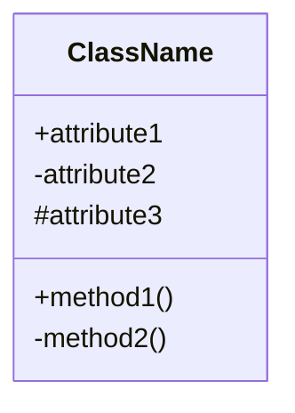
_Figure 2.1.1: Mermaid representation of a Class Diagram structure._

1.  **Upper Section (Class Name):**
    -   Represents the name of the class.
    -   **Naming Rules:** Center the name, use bold text, and capitalize the initial letter.
    -   **Abstract Classes:** The name should be written in *italics*.
2.  **Middle Section (Attributes):**
    -   Lists the attributes (qualities) of the class.
    -   **Visibility:** Indicated by symbols: `+` (public), `-` (private), `#` (protected), `~` (package).
    -   Attributes should have meaningful names explaining their usage.
3.  **Lower Section (Methods):**
    -   Lists the operations or functions of the class.
    -   Demonstrates how the class interacts with data.

### Relationships in UML

UML defines several ways classes can relate to one another.

#### 1. Dependency
A semantic relationship where a change in one class causes changes in another. It represents a "uses" relationship and is generally weaker than others.

![[Pasted image 20260215112627.png]]

_Figure 2.2: Dependency relationship where Student_Id depends on Student_Name._

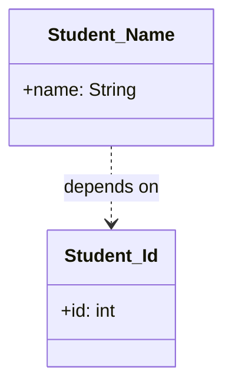
_Figure 2.2.1: Mermaid representation of a Dependency relationship._

#### 2. Generalization
This represents an inheritance relationship between a parent (superclass) and a child (subclass). The child inherits properties from the parent.

![[Pasted image 20260215112758.png]]

_Figure 2.3: Generalization showing different account types inheriting from a Bank Account._

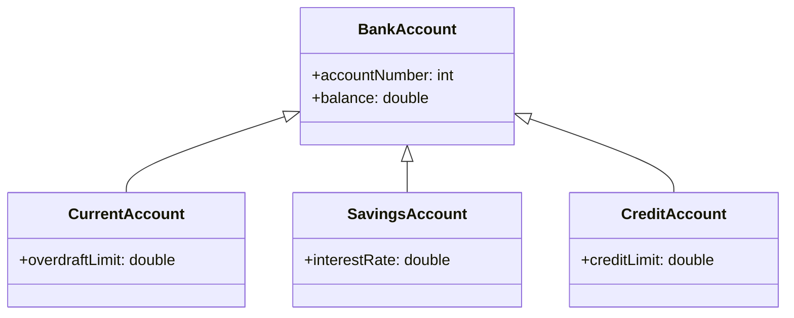
_Figure 2.3.1: Mermaid representation of a Generalization relationship._

#### 3. Association
A static or physical connection between objects. It describes how many objects take part in the relationship (multiplicity).

![[Pasted image 20260215112818.png]]

_Figure 2.4: Association relationship between a Department and a College._

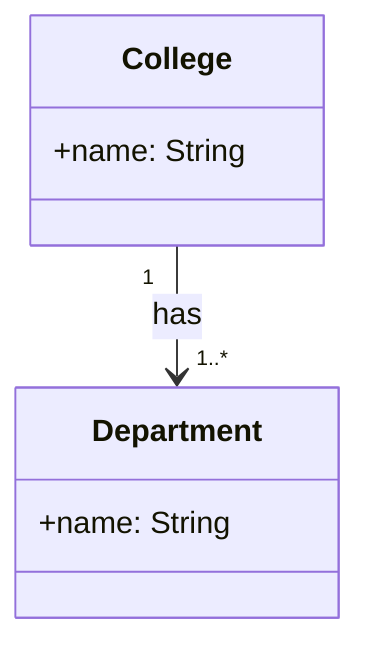
_Figure 2.4.1: Mermaid representation of an Association relationship._

**Multiplicity** defines the allowable number of instances. If unspecified, it defaults to one ($1$).

![[Pasted image 20260215112847.png]]

_Figure 2.5: Multiplicity example showing multiple patients admitted to one hospital._

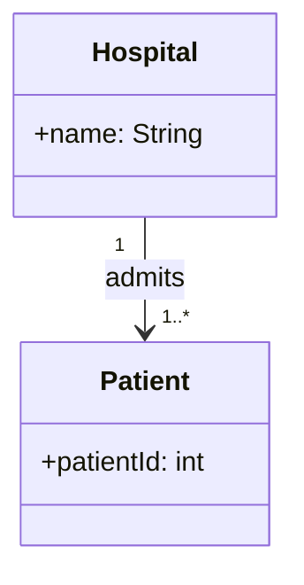
_Figure 2.5.1: Mermaid representation of Multiplicity._

#### 4. Aggregation
A specific type of association representing a "has-a" relationship. It is a **part-whole** relationship where the child can exist independently of the parent.

![[Pasted image 20260215112945.png]]

_Figure 2.6: Aggregation showing a Company has Employees, but Employees can exist without the Company._

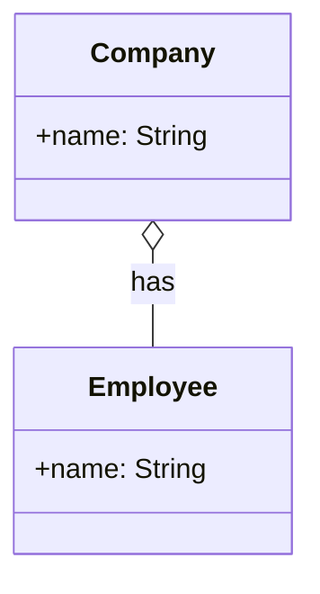
_Figure 2.6.1: Mermaid representation of Aggregation (hollow diamond)._

#### 5. Composition
A stronger form of aggregation representing a "whole-part" relationship. Here, the child **cannot** exist without the parent. If the parent is deleted, the child is discarded.

![[Pasted image 20260215113014.png]]

_Figure 2.7: Composition showing a ContactBook consists of Contacts; deleting the book deletes the contacts._

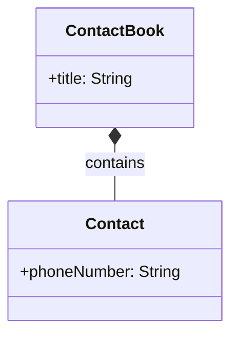
_Figure 2.7.1: Mermaid representation of Composition (filled diamond)._

### Abstract Classes in UML

An abstract class cannot be instantiated directly. In UML, it is denoted by writing the class name in *italics*. It is used to define functionalities that must be implemented by subclasses.

![[Pasted image 20260215113108.png]]

_Figure 2.8: Abstract class `displacement` with a method `drive()` to be implemented by subclasses like Car or Bike._

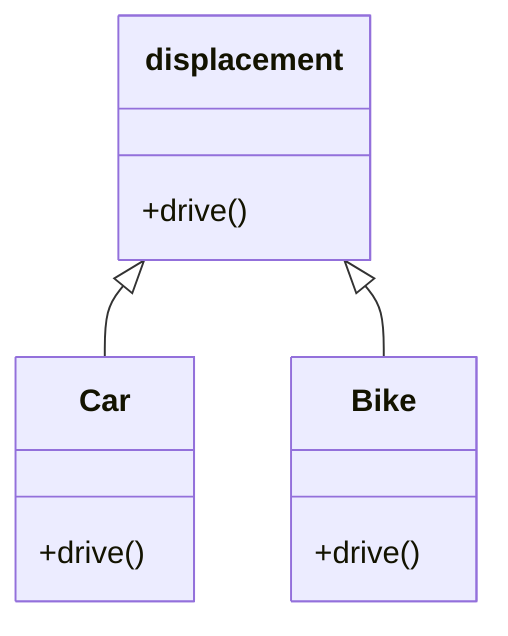
_Figure 2.8.1: Mermaid representation of an Abstract Class._

### How to Draw a Class Diagram

To create an effective class diagram:
1.  Name the diagram meaningfully to describe the system aspect.
2.  Identify objects and their relationships in advance.
3.  Determine the attributes and methods (responsibilities) for each class.
4.  Specify only the minimum necessary properties to avoid clutter.
5.  Use notes to describe complex aspects.
6.  Redraw and rework the diagram multiple times to ensure accuracy.

![[Pasted image 20260215113142.png]]

_Figure 2.9: A Class Diagram example describing a sales order system._

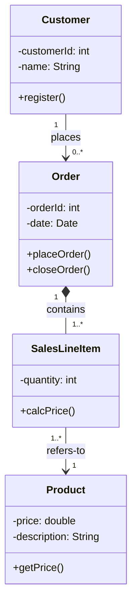
_Figure 2.9.1: Mermaid representation of the Sales Order system._

---

## UML Object Diagrams

An **Object Diagram** is derived from the class diagram. It represents a snapshot of a system at a specific instant, showing instances of classes rather than the classes themselves. It portrays the concrete, real-time behavior of the system.

### Purpose and Notation

Object diagrams are used to:
-   Build prototypes of a system.
-   Model complex data structures.
-   Understand object behavior and relationships practically.
-   Perform forward and reverse engineering.

The notation is similar to a class diagram, but the name is typically underlined to indicate it is a specific instance (e.g., `objectName : ClassName`).

![[Pasted image 20260215113255.png]]

_Figure 3.1: Notation used in an Object Diagram to represent a specific instance._

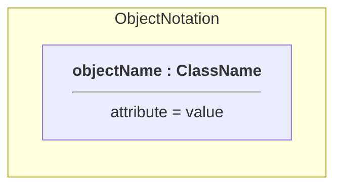
_Figure 3.1.1: Mermaid (Graph) representation of Object Notation._

![[Pasted image 20260215113354.png]]

_Figure 3.2: An example of an Object Diagram showing instances and their links._

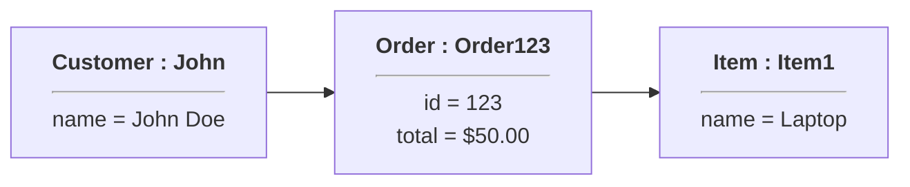
_Figure 3.2.1: Mermaid (Graph) representation of an Object Diagram example._

### Comparison: Class vs. Object Diagram

The following table highlights the key differences between the two diagram types.

| Serial No. | Class Diagram | Object Diagram |
| :--- | :--- | :--- |
| $1$ | It depicts the static view of a system. | It portrays the real-time behavior of a system. |
| $2$ | Dynamic changes are not included. | Dynamic changes are captured at a specific instant. |
| $3$ | The data values and attributes of an instance are not involved. | It incorporates specific data values and attributes of an entity. |
| $4$ | It defines the blueprint (object behavior). | It shows the actual objects (instances of a class). |

_Table 3.1: Comparison between Class and Object Diagrams highlighting their structural and behavioral differences._

---

> [!summary] **Summary**
> This note covered the fundamental concepts of **Java Inheritance** and **UML Diagrams**.
> 
> - **Java Inheritance:** We explored how to use the `extends` keyword to create a hierarchy between subclasses and superclasses. We detailed the importance of **visibility modifiers** (`+`, `-`, `#`, `~`) in controlling access, and how the `final` keyword restricts inheritance.
> - **UML Class Diagrams:** We detailed the structure of a class diagram (Name, Attributes, Methods) and the five key relationships: **Dependency**, **Generalization** (Inheritance), **Association**, **Aggregation** (weak "has-a"), and **Composition** (strong "part-of"). Both original images and Mermaid.js representations were provided for each.
> - **UML Object Diagrams:** We distinguished object diagrams as snapshots of the system at a specific point in time, showing concrete instances with data values. Mermaid `graph` syntax was used to simulate the object notation visually.