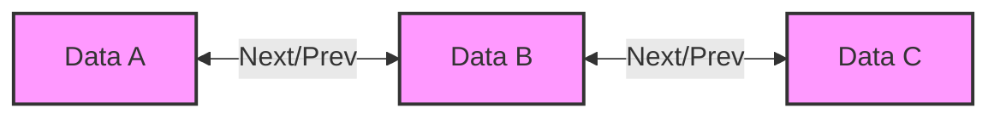

---
tags:
  - "#CCT2"
  - OO
  - Java
  - Programming
Topic: Data Structures & Types
Semester: CCT2
Course: Objektorienteret analyse, design og implementering + Java
Litterature:
  - w3schools - Arraylist
  - w3schools - Linkedlist
  - w3schools - Hashmap
  - Geeksforgeeks - Util Vector Class
  - Geekforgeeks - Stack Class
  - Geekforgeeks - Priority Queue Class
Created: 16-02-2026
---
- - -
# Table of Contents

1. [[#Java Collections: ArrayList, LinkedList, HashMap, Vector, Stack, and PriorityQueue (Enhanced)|Java Collections: ArrayList, LinkedList, HashMap, Vector, Stack, and PriorityQueue (Enhanced)]]
	1. [[#Java Collections: ArrayList, LinkedList, HashMap, Vector, Stack, and PriorityQueue (Enhanced)#ArrayList|ArrayList]]
		1. [[#ArrayList#Creating and Adding Elements|Creating and Adding Elements]]
		2. [[#ArrayList#Accessing and Modifying Elements|Accessing and Modifying Elements]]
		3. [[#ArrayList#Looping Through an ArrayList|Looping Through an ArrayList]]
		4. [[#ArrayList#Sorting an ArrayList|Sorting an ArrayList]]
	2. [[#Java Collections: ArrayList, LinkedList, HashMap, Vector, Stack, and PriorityQueue (Enhanced)#LinkedList|LinkedList]]
		1. [[#LinkedList#Visualizing LinkedList Structure|Visualizing LinkedList Structure]]
		2. [[#LinkedList#ArrayList vs. LinkedList|ArrayList vs. LinkedList]]
		3. [[#LinkedList#LinkedList Specific Methods|LinkedList Specific Methods]]
	3. [[#Java Collections: ArrayList, LinkedList, HashMap, Vector, Stack, and PriorityQueue (Enhanced)#HashMap|HashMap]]
		1. [[#HashMap#Creating and Adding Items|Creating and Adding Items]]
		2. [[#HashMap#Accessing and Removing Items|Accessing and Removing Items]]
		3. [[#HashMap#Looping Through a HashMap|Looping Through a HashMap]]
	4. [[#Java Collections: ArrayList, LinkedList, HashMap, Vector, Stack, and PriorityQueue (Enhanced)#Vector Class|Vector Class]]
		1. [[#Vector Class#Key Characteristics|Key Characteristics]]
		2. [[#Vector Class#Hierarchy and Capacity|Hierarchy and Capacity]]
		3. [[#Vector Class#Common Vector Methods|Common Vector Methods]]
	5. [[#Java Collections: ArrayList, LinkedList, HashMap, Vector, Stack, and PriorityQueue (Enhanced)#Stack Class|Stack Class]]
		1. [[#Stack Class#Hierarchy|Hierarchy]]
		2. [[#Stack Class#Visualizing Stack Operations|Visualizing Stack Operations]]
		3. [[#Stack Class#Stack Operations|Stack Operations]]
		4. [[#Stack Class#Methods in Stack Class|Methods in Stack Class]]
	6. [[#Java Collections: ArrayList, LinkedList, HashMap, Vector, Stack, and PriorityQueue (Enhanced)#PriorityQueue|PriorityQueue]]
		1. [[#PriorityQueue#Hierarchy|Hierarchy]]
		2. [[#PriorityQueue#Key Features|Key Features]]
		3. [[#PriorityQueue#Operations|Operations]]

# Java Collections: ArrayList, LinkedList, HashMap, Vector, Stack, and PriorityQueue

| Class | Data Structure | Key Feature | Best Use Case |
| :--- | :--- | :--- | :--- |
| **ArrayList** | Resizable Array | Fast random access; dynamic resizing | Storing and accessing data frequently. |
| **LinkedList** | Doubly Linked List | Efficient insertion/deletion at ends | Manipulating data (frequent add/remove). |
| **HashMap** | Hash Table | Key-Value pairs; fast lookup | Storing data associated with unique keys. |
| **Vector** | Dynamic Array | Synchronized (Thread-safe); Legacy | When thread safety is needed without external sync. |
| **Stack** | Dynamic Array (LIFO) | Last-In, First-Out | Implementing stack behavior (legacy). |
| **PriorityQueue** | Priority Heap | Orders elements by priority | Processing elements based on priority (Dijkstra's, etc.). |

---

## ArrayList

An `ArrayList` is a resizable array that grows automatically when elements are added. Unlike standard arrays, it allows dynamic modification of size.

> [!info] **Core Concept**
> The `ArrayList` class implements the `List` interface. It maintains insertion order and allows duplicate elements.

### Creating and Adding Elements

To use an `ArrayList`, import it from `java.util`. You must specify the type of objects it will hold (e.g., `String`, `Integer`).

> [!example] **Creating and Adding Elements**
> ```java
> import java.util.ArrayList;
> 
> public class Main {
>   public static void main(String[] args) {
>     ArrayList<String> cars = new ArrayList<String>();
>     cars.add("Volvo");
>     cars.add("BMW");
>     cars.add("Ford");
>     // Add new element at index 0, moving back the current element
>     cars.add(0, "Mazda"); 
>     
>     System.out.println(cars);
>   }
> }
> // Output: [Mazda, Volvo, BMW, Ford]
> ```

### Accessing and Modifying Elements

- **Access:** Use `get(index)`.
- **Modify:** Use `set(index, newValue)`.
- **Remove:** Use `remove(index)`.
- **Size:** Use `size()`.

> [!warning] **Primitives vs Wrapper Classes**
> `ArrayList` stores objects, not primitives. To store primitive types like `int` or `double`, use their corresponding wrapper classes: `Integer`, `Double`, `Character`, `Boolean`.

### Looping Through an ArrayList

You can iterate using a standard `for` loop or a `for-each` loop.

> [!example] **Iterating with for-each**
> ```java
> for (String i : cars) {
>   System.out.println(i);
> }
> ```

### Sorting an ArrayList

The `Collections` class provides a `sort()` method to sort `ArrayLists` (strings alphabetically, numbers numerically).

> [!example] **Sorting Integers**
> ```java
> import java.util.Collections;
> 
> ArrayList<Integer> myNumbers = new ArrayList<Integer>();
> myNumbers.add(33);
> myNumbers.add(15);
> myNumbers.add(20);
> 
> Collections.sort(myNumbers); // Sorts the list
> // Output: [15, 20, 33]
> ```

> [!tip] **The List Interface**
> It is good practice to declare the variable using the `List` interface for flexibility:
> `List<String> cars = new ArrayList<>();`

---

## LinkedList

The `LinkedList` class stores elements in containers (nodes), where each node has a link to the next node (and previous, in a doubly-linked list). It implements the `List` interface, sharing many methods with `ArrayList`.

### Visualizing LinkedList Structure

Unlike an `ArrayList` which uses a contiguous block of memory, a `LinkedList` uses nodes with pointers.


_Figure 2.1: Visual representation of a Doubly Linked List structure showing nodes connected by bidirectional links._

### ArrayList vs. LinkedList

| Feature | ArrayList | LinkedList |
| :--- | :--- | :--- |
| **Internal Structure** | Dynamic Array | Doubly Linked List (Nodes) |
| **Manipulation** | Slower (shifting elements required) | Faster (just changing links) |
| **Access** | Fast (random access) | Slower (must traverse from start/end) |

_Table 2.1: Comparison of ArrayList and LinkedList performance characteristics._

> [!tip] **When to Use**
> Use `ArrayList` for storing and accessing data. Use `LinkedList` for manipulating data (frequent additions/deletions).

### LinkedList Specific Methods

Since `LinkedList` implements the `Deque` interface, it has methods not found in `ArrayList` for operating on the ends of the list.

| Method | Description |
| :--- | :--- |
| `addFirst()` | Adds an element to the beginning of the list. |
| `addLast()` | Adds an element to the end of the list. |
| `removeFirst()` | Removes the element at the beginning. |
| `removeLast()` | Removes the element at the end. |
| `getFirst()` | Gets the element at the beginning. |
| `getLast()` | Gets the element at the end. |

_Table 2.2: Unique methods provided by the LinkedList class for deque operations._

---

## HashMap

A `HashMap` stores items in **key/value pairs**. It implements the `Map` interface and allows you to access values by unique keys.

> [!info] **Key Characteristics**
> - Keys must be unique.
> - Values can be duplicated.
> - It does not maintain insertion order (unlike `LinkedHashMap`).
> - Allows `null` keys and values.

### Creating and Adding Items

Use the `put(key, value)` method to add items. If a duplicate key is used, the new value overwrites the old one.

> [!example] **Creating a HashMap**
> ```java
> import java.util.HashMap;
> 
> HashMap<String, String> capitalCities = new HashMap<String, String>();
> capitalCities.put("England", "London");
> capitalCities.put("India", "New Delhi");
> capitalCities.put("USA", "Washington DC");
> // Duplicate key example
> capitalCities.put("USA", "New York"); // Overwrites "Washington DC"
> ```

### Accessing and Removing Items

- **Access:** `get(key)` retrieves the value.
- **Remove:** `remove(key)` deletes the key-value pair.
- **Clear:** `clear()` empties the map.
- **Size:** `size()` returns the number of keys.

### Looping Through a HashMap

Use a `for-each` loop with `keySet()` (for keys), `values()` (for values), or both.

> [!example] **Looping through Keys and Values**
> ```java
> for (String i : capitalCities.keySet()) {
>   System.out.println("key: " + i + " value: " + capitalCities.get(i));
> }
> ```

> [!tip] **The Map Interface**
> As with Lists, it is preferred to code to the interface:
> `Map<String, String> capitalCities = new HashMap<>();`

---

## Vector Class

The `Vector` class is a dynamic array similar to `ArrayList`, but it is **synchronized**, meaning it is thread-safe. It is a legacy class introduced in early Java.

### Key Characteristics

- **Thread-Safe:** Methods are synchronized (slower than `ArrayList` in single-threaded contexts).
- **Growth Strategy:** When capacity is exceeded, it doubles by default. The formula for the new capacity is:
    
    $$newCapacity = oldCapacity \cdot 2$$
    
- **Legacy:** Generally, `ArrayList` is preferred unless thread safety is explicitly required without external synchronization.

### Hierarchy and Capacity

`Vector` implements `List` and extends `AbstractList`.

[Image: Diagram showing the Vector class hierarchy, implementing List and extending AbstractList.]

_Figure 4.1: Hierarchy of Vector Class._

> [!example] **Vector Capacity Growth**
> ```java
> Vector<Integer> vector = new Vector<>(2); // Initial capacity 2
> vector.add(10);
> vector.add(20);
> // Vector is full. Next add triggers resize.
> vector.add(30); // Capacity becomes 4 (2 * 2)
> ```
> In this example, when the $3^{rd}$ element is added, the capacity of $2$ is exceeded. The Vector doubles its capacity to $4$.

### Common Vector Methods

Since `Vector` implements `List`, it shares methods like `add()`, `get()`, `remove()`, and `set()` with `ArrayList`.

| Method | Description |
| :--- | :--- |
| `add(E e)` | Appends the specified element to the end. |
| `add(int index, E element)` | Inserts element at the specified position. |
| `capacity()` | Returns the current capacity (not the size). |
| `elements()` | Returns an enumeration of the components. |
| `firstElement()` | Returns the first component (index $0$). |
| `lastElement()` | Returns the last component. |
| `remove(int index)` | Removes the element at the specified position. |
| `set(int index, E element)` | Replaces the element at the specified position. |

_Table 4.1: Common methods in the Vector class._

---

## Stack Class

The `Stack` class represents a **Last-In, First-Out (LIFO)** stack of objects. It extends `Vector` and thus inherits its synchronized nature.

> [!warning] **Legacy Status**
> `Stack` is considered a legacy class. For better performance in a non-synchronized environment, use `ArrayDeque` or `LinkedList` which implement the `Deque` interface.

### Hierarchy

`Stack` extends `Vector`, which implements `List`.

[Image: Diagram showing the Stack class hierarchy extending Vector and implementing List.]

_Figure 5.1: Hierarchy of Stack Class._

### Visualizing Stack Operations

A stack is like a pile of plates: you can only add to the top or remove from the top.

```mermaid
graph TD
    subgraph Initial_State
    S1[Item 3] --- S2[Item 2] --- S3[Item 1]
    end
    
    subgraph Push_Operation
    P1[Item 4] --- P2[Item 3] --- P3[Item 2] --- P4[Item 1]
    end
    
    subgraph Pop_Operation
    O1[Item 3] --- O2[Item 2] --- O3[Item 1]
    end
    
    Initial_State -->|push(4)| Push_Operation
    Push_Operation -->|pop()| Pop_Operation
```
_Figure 5.2: Visualization of Stack Push and Pop operations demonstrating the LIFO principle._

### Stack Operations

- **Push:** `push(item)` adds an item to the top.
- **Pop:** `pop()` removes and returns the top item.
- **Peek:** `peek()` looks at the top item without removing it.
- **Empty:** `empty()` checks if the stack is empty.
- **Search:** `search(item)` returns the distance from the top ($1$-based index), or $-1$ if not found.

> [!example] **Basic Stack Usage**
> ```java
> Stack<Integer> s = new Stack<>();
> s.push(1);
> s.push(2);
> s.push(3);
> 
> while (!s.isEmpty()) {
>   System.out.println(s.pop()); // Prints 3, then 2, then 1
> }
> ```

### Methods in Stack Class

| Method | Description |
| :--- | :--- |
| `empty()` | Tests if this stack is empty. |
| `peek()` | Looks at the object at the top of this stack without removing it. |
| `pop()` | Removes the object at the top of this stack and returns it. |
| `push(E item)` | Pushes an item onto the top of the stack. |
| `search(Object o)` | Returns the $1$-based position of an object from the top. |

_Table 5.1: Key methods specific to the Stack class._

---

## PriorityQueue

A `PriorityQueue` is a queue where elements are processed based on their **priority**, not their insertion order. By default, it orders elements according to natural ordering (min-heap), but a custom `Comparator` can be used.

### Hierarchy

`PriorityQueue` implements `Queue` and extends `AbstractQueue`.

[Image: Diagram showing the PriorityQueue hierarchy implementing Queue and extending AbstractQueue.]

_Figure 6.1: Hierarchy of PriorityQueue Class._

### Key Features

- **Priority Ordering:** The smallest element (head) is available for polling first.
- **Nulls:** Not allowed.
- **Non-Thread-Safe:** Not synchronized (use `PriorityBlockingQueue` for concurrency).

### Operations

- **Add:** `add(e)` or `offer(e)` inserts an element.
- **Access Head:** `peek()` retrieves the head without removing.
- **Remove Head:** `poll()` retrieves and removes the head.

> [!example] **PriorityQueue Usage**
> ```java
> PriorityQueue<Integer> pq = new PriorityQueue<>();
> pq.add(3);
> pq.add(1);
> pq.add(2);
> 
> System.out.println(pq.peek()); // Output: 1 (Smallest element)
> System.out.println(pq.poll()); // Output: 1
> System.out.println(pq.poll()); // Output: 2
> ```

> [!question] **Why use `iterator()` carefully?**
> Iterating over a `PriorityQueue` does **not** guarantee priority order. It only guarantees that the `poll()` method will return elements in priority order.

---

> [!summary] **Summary**
> 
> - **ArrayList:** Best for general-purpose storage where fast random access is needed. Resizes dynamically.
> - **LinkedList:** Best for frequent insertions/deletions. Uses a node-based structure (see Figure $2.1$).
> - **HashMap:** Stores data in key-value pairs. Ideal for fast lookups using unique keys.
> - **Vector:** A synchronized, resizable array. Legacy class; use only when thread safety is required without external synchronization.
> - **Stack:** A LIFO data structure extending Vector. Legacy; prefer `ArrayDeque` for stack implementations.
> - **PriorityQueue:** Processes elements based on priority (usually a min-heap). Does not maintain insertion order for iteration.
> 
> Remember to use Wrapper Classes (`Integer`, `Double`, etc.) with Collections, and prefer coding to Interfaces (`List`, `Map`, `Queue`) for flexibility.