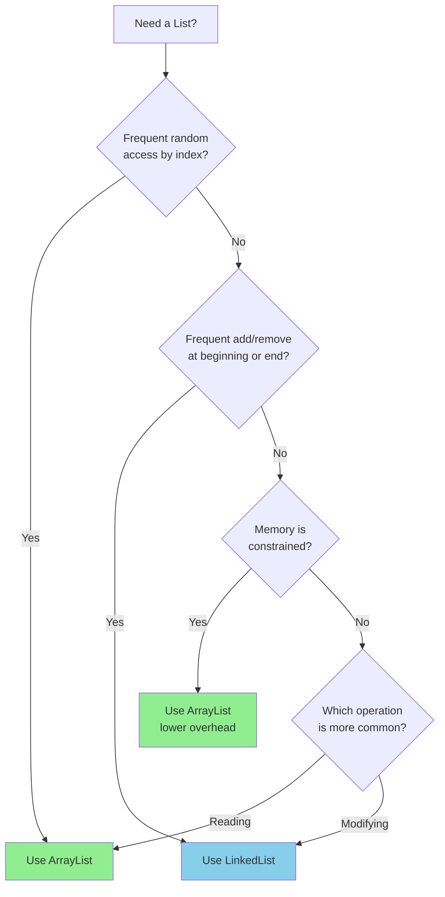
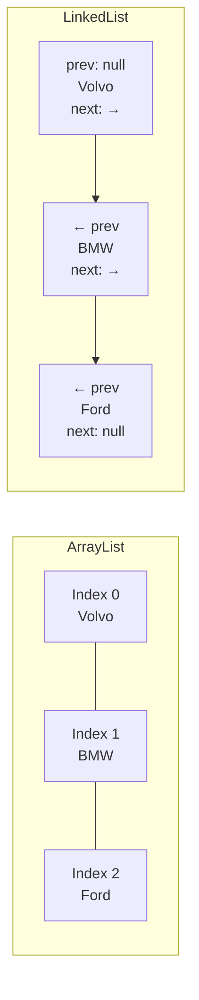
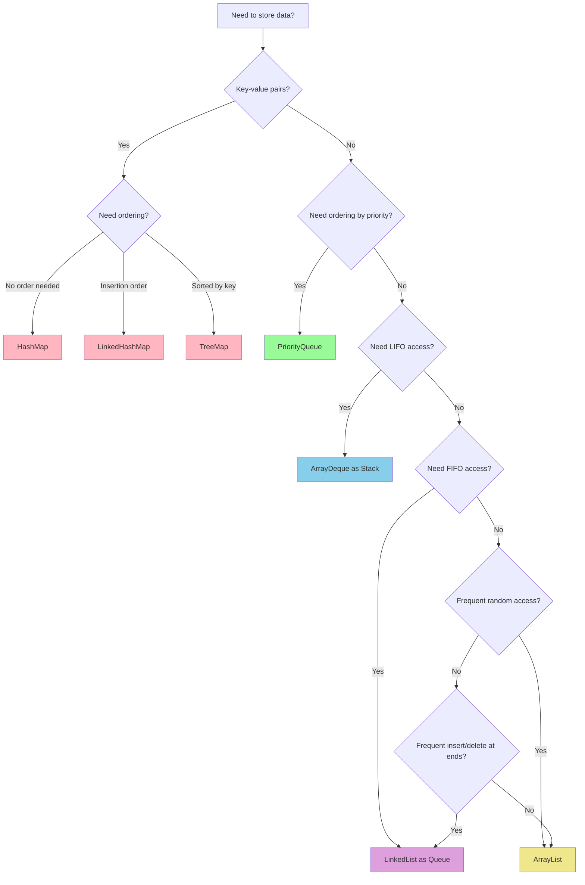

---
tags:
  - "#CCT2"
  - OO
  - Java
  - Programming
Topic: Data Structures & Types
Semester: CCT2
Course: Objektorienteret analyse, design og implementering + Java
Litterature:
  - w3schools - Arraylist
  - w3schools - Linkedlist
  - w3schools - Hashmap
  - Geeksforgeeks - Util Vector Class
  - Geekforgeeks - Stack Class
  - Geekforgeeks - Priority Queue Class
Created: 16-02-2026
---
- - -
# Table of Contents

1. [[#Java Data Structures and Collections|Java Data Structures and Collections]]
	1. [[#Java Data Structures and Collections#Quick Reference|Quick Reference]]
	2. [[#Java Data Structures and Collections#Wrapper Classes|Wrapper Classes]]
		1. [[#Wrapper Classes#Primitive vs. Wrapper Types|Primitive vs. Wrapper Types]]
		2. [[#Wrapper Classes#Memory Layout: Primitive vs. Wrapper|Memory Layout: Primitive vs. Wrapper]]
		3. [[#Wrapper Classes#Auto-boxing and Unboxing|Auto-boxing and Unboxing]]
		4. [[#Wrapper Classes#Common Wrapper Class Methods|Common Wrapper Class Methods]]
	3. [[#Java Data Structures and Collections#Arrays|Arrays]]
		1. [[#Arrays#Primitive Type Arrays|Primitive Type Arrays]]
		2. [[#Arrays#Object Arrays|Object Arrays]]
		3. [[#Arrays#Multi-Dimensional Arrays|Multi-Dimensional Arrays]]
	4. [[#Java Data Structures and Collections#ArrayList|ArrayList]]
		1. [[#ArrayList#Key Characteristics|Key Characteristics]]
		2. [[#ArrayList#Creating an ArrayList|Creating an ArrayList]]
		3. [[#ArrayList#Adding Elements|Adding Elements]]
		4. [[#ArrayList#Accessing Elements|Accessing Elements]]
		5. [[#ArrayList#Modifying Elements|Modifying Elements]]
		6. [[#ArrayList#Removing Elements|Removing Elements]]
		7. [[#ArrayList#ArrayList Size|ArrayList Size]]
		8. [[#ArrayList#Iterating Through ArrayList|Iterating Through ArrayList]]
		9. [[#ArrayList#Using Wrapper Classes with ArrayList|Using Wrapper Classes with ArrayList]]
		10. [[#ArrayList#Sorting ArrayList|Sorting ArrayList]]
		11. [[#ArrayList#The List Interface|The List Interface]]
	5. [[#Java Data Structures and Collections#LinkedList|LinkedList]]
		1. [[#LinkedList#Basic Usage|Basic Usage]]
		2. [[#LinkedList#ArrayList vs. LinkedList|ArrayList vs. LinkedList]]
			1. [[#ArrayList vs. LinkedList#How ArrayList Works|How ArrayList Works]]
			2. [[#ArrayList vs. LinkedList#How LinkedList Works|How LinkedList Works]]
			3. [[#ArrayList vs. LinkedList#When to Use|When to Use]]
		3. [[#LinkedList#LinkedList-Specific Methods|LinkedList-Specific Methods]]
		4. [[#LinkedList#The List Interface and var Keyword|The List Interface and var Keyword]]
	6. [[#Java Data Structures and Collections#HashMap|HashMap]]
		1. [[#HashMap#Key Characteristics|Key Characteristics]]
		2. [[#HashMap#Creating a HashMap|Creating a HashMap]]
		3. [[#HashMap#Adding Items|Adding Items]]
		4. [[#HashMap#Accessing Items|Accessing Items]]
		5. [[#HashMap#Removing Items|Removing Items]]
		6. [[#HashMap#HashMap Size|HashMap Size]]
		7. [[#HashMap#Iterating Through HashMap|Iterating Through HashMap]]
		8. [[#HashMap#Using Different Value Types|Using Different Value Types]]
		9. [[#HashMap#The Map Interface|The Map Interface]]
	7. [[#Java Data Structures and Collections#Vector|Vector]]
		1. [[#Vector#Key Characteristics|Key Characteristics]]
		2. [[#Vector#Constructors|Constructors]]
		3. [[#Vector#Basic Operations|Basic Operations]]
		4. [[#Vector#Capacity Management|Capacity Management]]
		5. [[#Vector#Key Methods|Key Methods]]
	8. [[#Java Data Structures and Collections#Stack|Stack]]
		1. [[#Stack#Key Characteristics|Key Characteristics]]
		2. [[#Stack#When to Use Stacks|When to Use Stacks]]
		3. [[#Stack#Constructors|Constructors]]
		4. [[#Stack#Basic Stack Operations|Basic Stack Operations]]
		5. [[#Stack#Stack-Specific Methods|Stack-Specific Methods]]
		6. [[#Stack#Using Deque Instead of Stack|Using Deque Instead of Stack]]
	9. [[#Java Data Structures and Collections#PriorityQueue|PriorityQueue]]
		1. [[#PriorityQueue#Key Characteristics|Key Characteristics]]
		2. [[#PriorityQueue#When to Use PriorityQueue|When to Use PriorityQueue]]
		3. [[#PriorityQueue#Constructors|Constructors]]
		4. [[#PriorityQueue#Basic Operations|Basic Operations]]
		5. [[#PriorityQueue#Iterating PriorityQueue|Iterating PriorityQueue]]
		6. [[#PriorityQueue#Key Methods|Key Methods]]
	10. [[#Java Data Structures and Collections#Common Pitfalls|Common Pitfalls]]
	11. [[#Java Data Structures and Collections#Custom Data Structures|Custom Data Structures]]
		1. [[#Custom Data Structures#Designing Custom Types|Designing Custom Types]]
		2. [[#Custom Data Structures#Inheritance for Specialized Types|Inheritance for Specialized Types]]
		3. [[#Custom Data Structures#Associations Between Classes|Associations Between Classes]]
		4. [[#Custom Data Structures#Tree Structures|Tree Structures]]
		5. [[#Custom Data Structures#Heap Implementation|Heap Implementation]]
		6. [[#Custom Data Structures#Design Principles|Design Principles]]
	12. [[#Java Data Structures and Collections#Data Structure Selection Flowchart|Data Structure Selection Flowchart]]


# Java Data Structures and Collections

## Quick Reference

| Data Structure | Import | Declaration | Key Characteristics | Use When |
|---|---|---|---|---|
| `ArrayList` | `java.util.ArrayList` | `ArrayList<Type> name = new ArrayList<>();` | Dynamic array, index-based access | Fast random access, frequent reads |
| `LinkedList` | `java.util.LinkedList` | `LinkedList<Type> name = new LinkedList<>();` | Doubly-linked containers | Frequent insertions/deletions at ends |
| `HashMap` | `java.util.HashMap` | `HashMap<K, V> name = new HashMap<>();` | Key-value pairs, hash-based | Fast lookups by key |
| `Vector` | `java.util.Vector` | `Vector<Type> name = new Vector<>();` | Synchronized ArrayList | Thread-safe operations needed |
| `Stack` | `java.util.Stack` | `Stack<Type> name = new Stack<>();` | LIFO (Last In First Out) | Undo operations, backtracking |
| `PriorityQueue` | `java.util.PriorityQueue` | `PriorityQueue<Type> name = new PriorityQueue<>();` | Min-heap by default | Process by priority, not order |

_Table 0.1: Overview of Java collection types with their imports, declarations, and primary use cases._

| Method Pattern | ArrayList | LinkedList | HashMap | Vector | Stack | PriorityQueue |
|---|---|---|---|---|---|---|
| Add element | `add(E)` | `add(E)` | `put(K, V)` | `add(E)` | `push(E)` | `add(E)` |
| Get element | `get(int)` | `get(int)` | `get(K)` | `get(int)` | `peek()` | `peek()` |
| Remove element | `remove(int)` | `remove(int)` | `remove(K)` | `remove(int)` | `pop()` | `poll()` |
| Size | `size()` | `size()` | `size()` | `size()` | `size()` | `size()` |
| Check empty | `isEmpty()` | `isEmpty()` | `isEmpty()` | `isEmpty()` | `empty()` | `isEmpty()` |

_Table 0.2: Common method patterns across Java collection types for quick reference._

| Operation       | ArrayList | LinkedList | HashMap    | PriorityQueue | Vector  | Stack   |
| --------------- | --------- | ---------- | ---------- | ------------- | ------- | ------- |
| Access by index | $O(1)$    | $O(n)$     | N/A        | N/A           | $O(1)$  | $O(n)$  |
| Access by key   | N/A       | N/A        | $O(1)$ avg | N/A           | N/A     | N/A     |
| Peek (top/head) | N/A       | $O(1)$     | N/A        | $O(1)$        | N/A     | $O(1)$  |
| Insert (end)    | $O(1)$*   | $O(1)$     | $O(1)$ avg | $O(\log n)$   | $O(1)$* | $O(1)$* |
| Insert (middle) | $O(n)$    | $O(n)$**   | N/A        | N/A           | $O(n)$  | N/A     |
| Remove (end)    | $O(1)$    | $O(1)$     | N/A        | $O(\log n)$   | $O(1)$  | $O(1)$  |
| Remove (middle) | $O(n)$    | $O(n)$**   | $O(1)$ avg | $O(n)$        | $O(n)$  | N/A     |
| Search          | $O(n)$    | $O(n)$     | $O(1)$ avg | $O(n)$        | $O(n)$  | $O(n)$  |
|                 |           |            |            |               |         |         |

_Table 0.3: Time complexity comparison of data structure operations. * Amortized. ** $O(1)$ if node reference is already available._ 
- O(1) means the operation takes the **same amount of time** regardless of how much data you have. Whether you have 10 items or 10 million items, the speed is constant.  
- O(n) means the time taken grows **linearly** with the input size. If you double the number of items, the time taken doubles. If you triple the items, the time triples.

| Your Need | Best Choice | Why |
|---|---|---|
| Fast random access by index | `ArrayList` | $O(1)$ direct index access |
| Frequent add/remove at ends | `LinkedList` | $O(1)$ operations at head/tail |
| Fast lookup by unique key | `HashMap` | $O(1)$ average hash-based retrieval |
| Process items by priority | `PriorityQueue` | Heap maintains priority order |
| LIFO operations (stack) | `ArrayDeque` | Modern, efficient, not synchronized |
| Thread-safe dynamic list | `Vector` | Built-in method synchronization |
| Thread-safe stack | `Stack` or synchronized `Deque` | Built-in synchronization |

_Table 0.4: Decision matrix for selecting the appropriate data structure based on requirements._

---

## Wrapper Classes

>[!info] **Wrapper Classes vs. Primitives**
>Wrapper classes are object forms of primitive data types that add object semantics and utility methods. They are essential for working with collections, which can only store objects.

### Primitive vs. Wrapper Types

Java provides two categories of data types:

- **Primitive types** (lowercase): `int`, `double`, `float`, `byte`, `char`, `boolean`
  - Stored by value directly in memory (stack)
  - Raw numbers with no methods
  - Cannot be used in collections

- **Wrapper classes** (capitalized): `Integer`, `Double`, `Float`, `Byte`, `Character`, `Boolean`
  - Objects stored in heap memory
  - Include utility methods for conversion and manipulation
  - Required for collections like `ArrayList<Integer>`

### Memory Layout: Primitive vs. Wrapper

>[!abstract] **Stack vs. Heap Storage**
>Understanding where data is stored helps explain performance differences between primitives and wrapper classes.

**Primitive (Stack Storage)**:
```
int x = 5;
┌─────────────────┐
│     Stack       │
├─────────────────┤
│ x: 5            │  ← Direct value storage (fast, no indirection)
└─────────────────┘
```

**Wrapper (Heap Storage)**:
```
Integer y = 5;
┌─────────────────┐              ┌─────────────────────┐
│     Stack       │              │        Heap         │
├─────────────────┤              ├─────────────────────┤
│ y: 0x7F3A2B     │─────────────→│   Integer Object    │
└─────────────────┘  (reference) │   ┌─────────────┐   │
                                 │   │ value: 5    │   │
                                 │   └─────────────┘   │
                                 └─────────────────────┘
```

>[!warning] **Performance Implications**
>Every wrapper object requires:
>- Heap allocation (slower than stack)
>- Object header overhead ($16$ bytes on $64$-bit JVM)
>- Indirection through reference (cache miss potential)
>
>In tight loops with millions of iterations, prefer primitives when possible.

>[!example] **Basic Wrapper Class Usage**
>```java
>// Declaration - autoboxing converts primitive to wrapper
>Integer myInt = 5;        // int 5 → Integer object
>Double myDouble = 5.99;   // double 5.99 → Double object
>Character myChar = 'A';   // char 'A' → Character object
>
>// Printing works like primitives (toString() called implicitly)
>System.out.println(myInt);         // Output: 5
>System.out.println(myDouble);      // Output: 5.99
>System.out.println(myChar);        // Output: A
>
>// Accessing via explicit methods (rarely needed)
>System.out.println(myInt.intValue());       // Output: 5
>System.out.println(myDouble.doubleValue()); // Output: 5.99
>```

### Auto-boxing and Unboxing

>[!info] **Auto-boxing and Unboxing**
>Java automatically converts between primitives and wrapper objects, simplifying code but with hidden performance costs.

- **Auto-boxing**: Primitive → Wrapper object (compiler inserts `Integer.valueOf()`)
  ```java
  Integer x = 5;  // Equivalent to: Integer x = Integer.valueOf(5);
  ```

- **Unboxing**: Wrapper object → Primitive (compiler inserts `.intValue()`)
  ```java
  int y = x;      // Equivalent to: int y = x.intValue();
  ```

>[!example] **Auto-boxing in Action**
>```java
>// Auto-boxing: primitives automatically become objects
>ArrayList<Integer> numbers = new ArrayList<>();
>numbers.add(10);    // int 10 auto-boxed to Integer
>numbers.add(20);    // int 20 auto-boxed to Integer
>
>// Unboxing: objects automatically become primitives
>int first = numbers.get(0);  // Integer unboxed to int
>int sum = numbers.get(0) + numbers.get(1);  // Both unboxed for arithmetic
>
>// Mixed operations work seamlessly
>Integer a = 5;      // auto-boxing
>int b = 3;
>int result = a + b; // 'a' unboxed, then addition performed
>```

>[!warning] **Auto-boxing Pitfalls**
>```java
>// Pitfall 1: Null unboxing throws NullPointerException
>Integer nullable = null;
>int value = nullable;  // NullPointerException!
>
>// Pitfall 2: Object equality vs value equality
>Integer a = 128;
>Integer b = 128;
>System.out.println(a == b);      // false (different objects!)
>System.out.println(a.equals(b)); // true (same value)
>
>// Note: For values -128 to 127, Java caches Integer objects
>Integer c = 100;
>Integer d = 100;
>System.out.println(c == d);      // true (cached, same object)
>```

### Common Wrapper Class Methods

>[!tip] **String Conversion Methods**
>Wrapper classes excel at converting between strings and primitive values, which is essential for user input processing.

>[!example] **Converting String to Number**
>```java
>String str = "1.234";
>
>// Parse string to double (throws NumberFormatException if invalid)
>double f = Double.parseDouble(str);
>System.out.println("Double is " + f);  // Output: Double is 1.234
>
>// Parse to other types - each wrapper has parseXxx() method
>int y = Integer.parseInt("123");       // String "123" → int 123
>byte b = Byte.parseByte("42");         // String "42" → byte 42
>long l = Long.parseLong("9999999999"); // String → long
>boolean bool = Boolean.parseBoolean("true"); // String → boolean
>```

>[!example] **Converting Number to String**
>```java
>Double x = 1.234;
>
>// Method 1: toString() instance method
>String strX = x.toString();            // "1.234"
>
>// Method 2: String concatenation (implicit toString)
>String strY = "" + x;                  // "1.234"
>
>// Method 3: String.valueOf() static method
>String strZ = String.valueOf(x);       // "1.234"
>
>System.out.println(strX);              // Output: "1.234"
>```

>[!warning] **Float Type Casting**
>In Java, `double` is the default floating-point type. If you want to use `float` (lower precision, saves memory), you must explicitly cast numeric literals.
>
>```java
>// Error: cannot assign double to float
>// float f1 = 2.766;  // Compilation error!
>
>// Solution 1: Cast the literal
>float f2 = (float) 2.766;
>
>// Solution 2: Use 'f' suffix (preferred)
>float f3 = 2.766f;
>```

>[!example] **Practical Wrapper Class Example**
>```java
>public class Test2 {
>    public static void main(String[] args) {
>        // Parse user input from string
>        String str = "1.234";
>        double f = Double.parseDouble(str);
>        System.out.println("Double is " + f);
>        
>        // Mix wrapper and primitive seamlessly
>        Double f2 = 2.766;           // auto-boxing
>        double f3 = f + f2;          // f2 unboxed for arithmetic
>        System.out.println("Result is " + f3);  // Output: Result is 4.0
>    }
>}
>```

>[!question] **Self-Check: Wrapper Classes**
>Given the following code, what will be printed and why?
>```java
>Integer a = 100;
>Integer b = 100;
>Integer c = 200;
>Integer d = 200;
>System.out.println(a == b);
>System.out.println(c == d);
>```
>
>*Hint: Consider Integer caching for values $-128$ to $127$.*

---

## Arrays

>[!info] **Java Arrays**
>Arrays in Java are fixed-size, indexed collections that can store primitive types or objects. For object arrays, the array itself is initialized, but individual elements must be created separately.

### Primitive Type Arrays

>[!example] **Declaring and Using Primitive Arrays**
>```java
>// Declaration and allocation (5 slots, all initialized to 0)
>int[] priceOfPen = new int[5];
>priceOfPen[3] = 5;  // Set element at index 3
>
>// Declaration with initialization (size inferred as 4)
>String[] cars = {"Volvo", "BMW", "Ford", "Mazda"};
>
>// Printing array reference vs. elements
>System.out.println(cars);  // Prints object reference: [Ljava.lang.String;@15db9742
>
>// Correct way: loop through array using .length property
>for (int i = 0; i < cars.length; i++) {
>    System.out.println("Car " + i + ": " + cars[i]);
>}
>```

![[Pasted image 20260221150920.png]]

_Figure 1.1: Visual representation of primitive array initialization showing memory allocation for $5$ integer elements._

### Object Arrays

>[!warning] **Object Array Initialization**
>For arrays of objects, declaring the array only creates the array structure with `null` references. Each object element must be initialized separately using `new`.

![[Pasted image 20260221150936.png]]

_Figure 1.2: Object array showing the array structure created but individual objects not yet instantiated (all elements are `null`)._

![[Pasted image 20260221150931.png]]

_Figure 1.3: Object array after manual initialization of individual elements using `new` keyword._

### Multi-Dimensional Arrays

>[!info] **Multi-Dimensional Arrays**
>Multi-dimensional arrays are arrays of arrays. Each row can have different sizes, creating "jagged arrays" that are flexible and memory-efficient.

>[!example] **2D Array Declaration and Iteration**
>```java
>public class ArrayTest2 {
>    public static void main(String[] args) {
>        // Jagged array - row 0 has 4 elements, row 1 has 3 elements
>        int[][] myNumbers = { {1, 2, 3, 4}, {5, 6, 7} };
>        
>        // Iterate using nested loops
>        // Outer loop: iterate through rows
>        for (int i = 0; i < myNumbers.length; ++i) {
>            // Inner loop: iterate through columns in current row
>            // Note: myNumbers[i].length gives length of row i
>            for(int j = 0; j < myNumbers[i].length; ++j) {
>                System.out.println(myNumbers[i][j]);
>            }
>        }
>    }
>}
>```

![[Pasted image 20260221151221.png]]

_Figure 1.4: Jagged multi-dimensional array showing rows of different lengths (row $0$ has $4$ elements, row $1$ has $3$ elements)._

![[Pasted image 20260221151412.png]]

_Figure 1.5: Multi-dimensional array memory representation showing array-of-arrays structure where each row is a separate array object._

---

## ArrayList

>[!info] **ArrayList**
>An `ArrayList` is a resizable array implementation of the `List` interface. Unlike built-in arrays, `ArrayList` can dynamically grow and shrink as elements are added or removed. It provides $O(1)$ random access but $O(n)$ insertion/deletion in the middle.

### Key Characteristics

- **Dynamic sizing**: Automatically grows when capacity is exceeded (typically $1.5\times$ current size)
- **Index-based access**: Use `get(index)` for $O(1)$ random access
- **Maintains order**: Elements stay in insertion order
- **Allows duplicates and null**: Can store multiple identical elements and null values
- **Not synchronized**: Not thread-safe by default (use `Collections.synchronizedList()` if needed)

![[Pasted image 20260221151430.png]]

_Figure 2.1: ArrayList internal structure showing dynamic resizing capability when capacity is exceeded._

### Creating an ArrayList

>[!example] **ArrayList Declaration**
>```java
>import java.util.ArrayList;
>
>// Standard declaration with explicit type
>ArrayList<String> cars = new ArrayList<String>();
>
>// Diamond operator (Java 7+) - type inferred from left side
>ArrayList<String> cars = new ArrayList<>();
>
>// Using var keyword (Java 10+) - type inferred from right side
>var cars = new ArrayList<String>();
>```

### Adding Elements

>[!example] **Adding Elements to ArrayList**
>```java
>import java.util.ArrayList;
>
>public class Main {
>    public static void main(String[] args) {
>        ArrayList<String> cars = new ArrayList<String>();
>        
>        // add(E): Append to end - O(1) amortized
>        cars.add("Volvo");   // Index 0
>        cars.add("BMW");     // Index 1
>        cars.add("Ford");    // Index 2
>        cars.add("Mazda");   // Index 3
>        
>        // add(int, E): Insert at specific index - O(n) due to shifting
>        cars.add(0, "Toyota");  // Insert at beginning, shifts all others right
>        
>        System.out.println(cars);
>        // Output: [Toyota, Volvo, BMW, Ford, Mazda]
>    }
>}
>```

>[!note] **Insertion Order**
>ArrayList maintains insertion order. The first item added is at index $0$, the next at index $1$, and so on. Inserting at index $i$ shifts all elements at $i$ and beyond to the right.

### Accessing Elements

>[!example] **Accessing Elements by Index**
>```java
>// get(int): O(1) direct array access
>String firstCar = cars.get(0);  // Get element at index 0
>System.out.println(firstCar);   // Output: Volvo
>
>// Bounds checking: throws IndexOutOfBoundsException if invalid
>// String invalid = cars.get(100);  // Exception if size < 101
>```

### Modifying Elements

>[!example] **Changing Element Values**
>```java
>// set(int, E): Replace element at index - O(1)
>cars.set(0, "Opel");  // Replace first element with "Opel"
>System.out.println(cars);  // [Opel, BMW, Ford, Mazda]
>```

### Removing Elements

>[!example] **Removing Elements**
>```java
>// remove(int): Remove by index - O(n) due to shifting
>cars.remove(0);  // Removes first element, shifts all others left
>
>// remove(Object): Remove first occurrence - O(n) for search + shift
>cars.remove("BMW");  // Removes first "BMW" found
>
>// clear(): Remove all elements - O(n)
>cars.clear();  // ArrayList is now empty
>```

### ArrayList Size

>[!example] **Getting ArrayList Size**
>```java
>int count = cars.size();  // Returns number of elements (not capacity)
>System.out.println("Number of cars: " + count);
>
>// Check if empty
>if (cars.isEmpty()) {
>    System.out.println("No cars in list");
>}
>```

### Iterating Through ArrayList

>[!example] **Using Standard for Loop**
>```java
>public class Main {
>    public static void main(String[] args) {
>        ArrayList<String> cars = new ArrayList<String>();
>        cars.add("Volvo");
>        cars.add("BMW");
>        cars.add("Ford");
>        cars.add("Mazda");
>        
>        // Index-based iteration: useful when index is needed
>        for (int i = 0; i < cars.size(); i++) {
>            System.out.println("Car " + i + ": " + cars.get(i));
>        }
>    }
>}
>```

>[!example] **Using For-Each Loop**
>```java
>// Enhanced for loop: cleaner when index not needed
>for (String car : cars) {
>    System.out.println(car);
>}
>
>// Note: Cannot modify list structure during for-each iteration
>// Use Iterator.remove() or indexed loop for removal during iteration
>```

![[Pasted image 20260221151734.png]]

_Figure 2.2: ArrayList iteration output showing sequential element access._

### Using Wrapper Classes with ArrayList

>[!warning] **ArrayList Requires Objects**
>ArrayList can only store objects, not primitive types. Use wrapper classes for primitives: `Integer` for `int`, `Boolean` for `boolean`, `Character` for `char`, `Double` for `double`, etc.

>[!example] **ArrayList of Integers**
>```java
>import java.util.ArrayList;
>
>public class Main {
>    public static void main(String[] args) {
>        // Must use Integer, not int
>        ArrayList<Integer> myNumbers = new ArrayList<Integer>();
>        
>        // Auto-boxing: int literals become Integer objects
>        myNumbers.add(10);  // int 10 → Integer.valueOf(10)
>        myNumbers.add(15);
>        myNumbers.add(20);
>        myNumbers.add(25);
>        
>        // Unboxing: Integer becomes int for arithmetic
>        for (int number : myNumbers) {  // Integer unboxed to int
>            System.out.println(number * 2);  // Arithmetic on primitive
>        }
>    }
>}
>```

### Sorting ArrayList

>[!info] **Collections.sort()**
>The `Collections` class provides the `sort()` method for sorting lists alphabetically or numerically. Time complexity is $O(n \log n)$.

>[!example] **Sorting Strings**
>```java
>import java.util.ArrayList;
>import java.util.Collections;
>
>public class Main {
>    public static void main(String[] args) {
>        ArrayList<String> cars = new ArrayList<String>();
>        cars.add("Volvo");
>        cars.add("BMW");
>        cars.add("Ford");
>        cars.add("Mazda");
>        
>        // Sort alphabetically (natural ordering for Strings)
>        Collections.sort(cars);
>        
>        for (String car : cars) {
>            System.out.println(car);
>        }
>        // Output: BMW, Ford, Mazda, Volvo
>        
>        // Sort in reverse order
>        Collections.sort(cars, Collections.reverseOrder());
>        // Output: Volvo, Mazda, Ford, BMW
>    }
>}
>```

>[!example] **Sorting Integers**
>```java
>import java.util.ArrayList;
>import java.util.Collections;
>
>public class Main {
>    public static void main(String[] args) {
>        ArrayList<Integer> myNumbers = new ArrayList<Integer>();
>        myNumbers.add(33);
>        myNumbers.add(15);
>        myNumbers.add(20);
>        myNumbers.add(34);
>        myNumbers.add(8);
>        myNumbers.add(12);
>        
>        // Sort numerically (natural ordering for Integer)
>        Collections.sort(myNumbers);
>        
>        for (int number : myNumbers) {
>            System.out.println(number);
>        }
>        // Output: 8, 12, 15, 20, 33, 34
>    }
>}
>```

### The List Interface

>[!note] **List Interface Usage**
>Sometimes you'll see `List` and `ArrayList` used together:
>
>```java
>import java.util.List;
>import java.util.ArrayList;
>
>// Declare as interface type, instantiate as implementation
>List<String> cars = new ArrayList<>();
>```
>
>The variable is declared as `List` (the interface) but stores an `ArrayList` object (the implementation). This is valid because `ArrayList` implements `List`, and provides flexibility to change implementation later (e.g., to `LinkedList`) without changing code that uses the variable.

>[!question] **Self-Check: ArrayList Operations**
>What is the time complexity of the following operations on an ArrayList with $n$ elements?
>1. `get(n/2)` - accessing the middle element
>2. `add(0, element)` - inserting at the beginning
>3. `add(element)` - appending to the end
>4. `remove(n/2)` - removing the middle element
>
>*Hint: Consider whether elements need to be shifted.*

---

## LinkedList

>[!info] **LinkedList**
>A `LinkedList` stores elements in containers (nodes) where each container links to the next and previous nodes. Unlike `ArrayList` (contiguous memory), `LinkedList` uses scattered memory with bidirectional node connections.

![[Pasted image 20260221152014.png]]

_Figure 3.1: LinkedList structure showing nodes connected via forward and backward links (doubly-linked)._

![[Pasted image 20260221152019.png]]

_Figure 3.2: LinkedList memory representation showing non-contiguous storage with pointer-based connections._

### Basic Usage

>[!example] **Creating and Using LinkedList**
>```java
>import java.util.LinkedList;
>
>public class Main {
>    public static void main(String[] args) {
>        LinkedList<String> cars = new LinkedList<String>();
>        
>        // Same add() method as ArrayList - O(1) at end
>        cars.add("Volvo");
>        cars.add("BMW");
>        cars.add("Ford");
>        cars.add("Mazda");
>        
>        System.out.println(cars);
>        // Output: [Volvo, BMW, Ford, Mazda]
>    }
>}
>```

### ArrayList vs. LinkedList

>[!abstract] **Internal Structures**
>Understanding how each structure works internally helps choose the right one for your use case.



_Figure 3.3: Decision flowchart for choosing between ArrayList and LinkedList based on usage patterns._

#### How ArrayList Works

The `ArrayList` uses a regular array internally. When an element is added:
1. If the array has space, the element is placed in the next available slot — $O(1)$
2. If the array is full, a new larger array is created (typically $1.5\times$ size)
3. All existing elements are copied to the new array — $O(n)$
4. The old array is discarded (garbage collected)

#### How LinkedList Works

The `LinkedList` stores elements in containers (nodes):
1. Each node holds: element value, pointer to next node, pointer to previous node
2. The list maintains pointers to first and last nodes
3. To add at end: create new node, update last node's "next" pointer — $O(1)$
4. To access by index: traverse from start or end — $O(n)$



_Figure 3.4: Structural comparison showing contiguous ArrayList storage versus pointer-based LinkedList nodes._

#### When to Use

>[!tip] **Choosing the Right Structure**
>- **Use `ArrayList`** for:
>  - Storing and accessing data by index — $O(1)$ access
>  - Frequent random access operations
>  - Read-heavy operations with infrequent modifications
>  - Memory efficiency (lower per-element overhead)
>
>- **Use `LinkedList`** for:
>  - Frequent insertions/deletions at the beginning or end — $O(1)$
>  - Implementing queues or deques
>  - When you never need random access by index
>  - Iterator-based removal during traversal

### LinkedList-Specific Methods

| Method | Description | Time Complexity |
|---|---|---|
| `addFirst(E)` | Adds element to the beginning | $O(1)$ |
| `addLast(E)` | Adds element to the end | $O(1)$ |
| `removeFirst()` | Removes element from the beginning | $O(1)$ |
| `removeLast()` | Removes element from the end | $O(1)$ |
| `getFirst()` | Gets element at the beginning | $O(1)$ |
| `getLast()` | Gets element at the end | $O(1)$ |
| `get(int index)` | Gets element at index | $O(n)$ |

_Table 3.1: LinkedList-specific methods for efficient end manipulation with their time complexities._

>[!example] **Using LinkedList-Specific Methods**
>```java
>LinkedList<String> queue = new LinkedList<>();
>
>// Efficient end operations - all O(1)
>queue.addLast("First");   // Add to tail
>queue.addLast("Second");  // Add to tail
>queue.addLast("Third");   // Add to tail
>queue.addFirst("Zero");   // Add to head
>
>// List is now: [Zero, First, Second, Third]
>
>String first = queue.removeFirst();  // Removes "Zero" - O(1)
>String last = queue.getLast();       // Returns "Third" (no removal) - O(1)
>
>// Avoid this with LinkedList - O(n) traversal required
>String middle = queue.get(1);  // Must traverse from head
>```

### The List Interface and var Keyword

>[!note] **List Interface with LinkedList**
>```java
>import java.util.List;
>import java.util.LinkedList;
>
>// Using List interface - can switch to ArrayList without code changes
>List<String> cars = new LinkedList<>();
>
>// Using var keyword (Java 10+) - type is LinkedList<String>
>var cars = new LinkedList<String>();
>```

---

## HashMap

>[!info] **HashMap**
>A `HashMap` stores data in key-value pairs, where each unique key maps to exactly one value. It uses hashing for $O(1)$ average-case lookups, making it ideal for scenarios requiring quick data retrieval by key.

### Key Characteristics

- **Key-value storage**: Each key maps to one value
- **Fast lookups**: $O(1)$ average time complexity for `get()` and `put()` operations
- **Unique keys**: Keys must be unique; duplicate keys overwrite previous values
- **Allows null**: Can have one `null` key and multiple `null` values
- **No guaranteed order**: Iteration order is not predictable (use `LinkedHashMap` for insertion order)

![[Pasted image 20260221152234.png]]

_Figure 4.1: HashMap internal structure using hash-based indexing with buckets for collision handling._

### Creating a HashMap

>[!example] **HashMap Declaration**
>```java
>import java.util.HashMap;
>
>// Create HashMap with String keys and String values
>HashMap<String, String> capitalCities = new HashMap<>();
>
>// Specify initial capacity to avoid resizing (if size known)
>HashMap<String, String> capitalCities = new HashMap<>(100);
>
>// Using var (Java 10+)
>var capitalCities = new HashMap<String, String>();
>```

### Adding Items

>[!example] **Adding Key-Value Pairs**
>```java
>import java.util.HashMap;
>
>public class Main {
>    public static void main(String[] args) {
>        HashMap<String, String> capitalCities = new HashMap<String, String>();
>        
>        // put(K, V): Add key-value pairs - O(1) average
>        capitalCities.put("England", "London");
>        capitalCities.put("India", "New Delhi");
>        capitalCities.put("Austria", "Wien");
>        capitalCities.put("Norway", "Oslo");
>        capitalCities.put("USA", "Washington DC");
>        
>        // Duplicate key overwrites value (no error, no duplicate)
>        capitalCities.put("England", "Manchester");  // London → Manchester
>        
>        System.out.println(capitalCities);
>        // Order not guaranteed in output
>    }
>}
>```

>[!warning] **Duplicate Keys**
>If the same key is added multiple times, only the latest value is retained. Keys in a `HashMap` must be unique. The `put()` method returns the previous value if the key existed, or `null` if it's a new key.

### Accessing Items

>[!example] **Retrieving Values by Key**
>```java
>// get(K): Retrieve value by key - O(1) average
>String capital = capitalCities.get("England");
>System.out.println(capital);  // Output: London
>
>// Non-existent key returns null (NOT an exception)
>String missing = capitalCities.get("Denmark");
>System.out.println(missing);  // Output: null
>
>// Safe retrieval with default value
>String safe = capitalCities.getOrDefault("Denmark", "Unknown");
>System.out.println(safe);  // Output: Unknown
>```

![[Pasted image 20260221152348.png]]

_Figure 4.2: HashMap lookup demonstrating key-based retrieval and null return for missing keys._

>[!warning] **Null Returns: Two Cases**
>The `get()` method returns `null` in two different situations:
>1. **Key not found**: The key doesn't exist in the map (common case)
>2. **Value is null**: The key exists, but `null` was stored as the value (allowed!)
>
>**You cannot distinguish these cases with `get()` alone!**
>
>```java
>capitalCities.put("Atlantis", null);  // Legal: null value
>
>String v1 = capitalCities.get("Atlantis");  // Returns null (key exists)
>String v2 = capitalCities.get("Denmark");   // Returns null (key missing)
>// v1 == v2 == null, but different reasons!
>
>// Solution: Use containsKey() to check existence
>if (capitalCities.containsKey("Atlantis")) {
>    // Key exists, value might be null
>} else {
>    // Key definitely doesn't exist
>}
>```

### Removing Items

>[!example] **Removing Entries**
>```java
>// remove(K): Remove by key - O(1) average, returns removed value
>String removed = capitalCities.remove("England");
>System.out.println("Removed: " + removed);  // Output: London
>
>// remove(K, V): Remove only if value matches - atomic operation
>boolean success = capitalCities.remove("India", "New Delhi");  // true
>boolean failed = capitalCities.remove("USA", "New York");      // false
>
>// clear(): Remove all entries - O(n)
>capitalCities.clear();
>```

### HashMap Size

>[!example] **Getting Number of Entries**
>```java
>int count = capitalCities.size();  // Number of key-value pairs
>System.out.println("Number of entries: " + count);
>
>// Check if empty
>if (capitalCities.isEmpty()) {
>    System.out.println("Map is empty");
>}
>```

>[!note] **Size Counts Unique Keys**
>The size only counts unique keys. If a key is added multiple times, only the latest value is kept, and size doesn't increase.

### Iterating Through HashMap

>[!example] **Iterating Over Keys**
>```java
>// keySet(): Returns Set of all keys
>for (String country : capitalCities.keySet()) {
>    System.out.println(country);
>}
>```

>[!example] **Iterating Over Values**
>```java
>// values(): Returns Collection of all values
>for (String city : capitalCities.values()) {
>    System.out.println(city);
>}
>```

>[!example] **Iterating Over Keys and Values**
>```java
>// Method 1: Using keySet() and get()
>for (String country : capitalCities.keySet()) {
>    System.out.println("key: " + country + " value: " + capitalCities.get(country));
>}
>
>// Method 2: Using entrySet() - more efficient (no extra lookup)
>for (Map.Entry<String, String> entry : capitalCities.entrySet()) {
>    System.out.println("key: " + entry.getKey() + " value: " + entry.getValue());
>}
>```

### Using Different Value Types

>[!example] **HashMap with Integer Values**
>```java
>import java.util.HashMap;
>
>public class Main {
>    public static void main(String[] args) {
>        // String keys, Integer values (wrapper class required)
>        HashMap<String, Integer> people = new HashMap<String, Integer>();
>        
>        // Auto-boxing: int → Integer
>        people.put("John", 32);
>        people.put("Steve", 30);
>        people.put("Angie", 33);
>        
>        // Iterate and access
>        for (String name : people.keySet()) {
>            // Auto-unboxing: Integer → int for arithmetic
>            int ageNextYear = people.get(name) + 1;
>            System.out.println(name + " will be " + ageNextYear);
>        }
>    }
>}
>```

### The Map Interface

>[!note] **Map Interface Usage**
>```java
>import java.util.Map;
>import java.util.HashMap;
>
>// Declare as interface, instantiate as implementation
>Map<String, String> capitalCities = new HashMap<>();
>```
>
>The variable is declared as `Map` (the interface) but stores a `HashMap` object. Since `HashMap` implements `Map`, this is valid and provides flexibility to change implementations later (e.g., to `TreeMap` for sorted keys or `LinkedHashMap` for insertion order).

>[!info] **When Order Matters**
>- **HashMap**: No order guarantee (fastest)
>- **LinkedHashMap**: Maintains insertion order
>- **TreeMap**: Maintains sorted key order ($O(\log n)$ operations)

>[!question] **Self-Check: HashMap Behavior**
>What does the following code print?
>```java
>HashMap<String, Integer> map = new HashMap<>();
>map.put("A", 1);
>map.put("B", 2);
>map.put("A", 3);
>System.out.println(map.size());
>System.out.println(map.get("A"));
>```
>
>*Hint: Consider what happens when a duplicate key is added.*

---

## Vector

>[!info] **Vector Class**
>A `Vector` is a dynamic array similar to `ArrayList`, but with synchronized methods for thread-safe operations. It's a legacy class from early Java versions.

### Key Characteristics

- **Synchronized**: All methods are thread-safe (implicit locking)
- **Dynamic sizing**: Grows automatically when capacity is exceeded (default: $2\times$)
- **Maintains insertion order**: Elements stay in insertion order
- **Allows duplicates and null**: Can store identical elements and null values
- **Legacy class**: Predates modern collections framework (Java 1.0)

>[!warning] **Prefer ArrayList Over Vector**
>Vector is generally considered obsolete. Use `ArrayList` when synchronization is not needed—it's more efficient in single-threaded environments. For thread safety, consider `Collections.synchronizedList()` or `CopyOnWriteArrayList`.

![[Pasted image 20260221151925.png]]

_Figure 5.1: Vector internal structure showing synchronized array-based implementation._

### Constructors

| Constructor | Description | Initial Capacity | Growth |
|---|---|---|---|
| `Vector()` | Creates empty vector | $10$ | Doubles |
| `Vector(int size)` | Creates with specified capacity | `size` | Doubles |
| `Vector(int size, int incr)` | Creates with capacity and increment | `size` | `+incr` |
| `Vector(Collection c)` | Creates from existing collection | `c.size()` | Doubles |

_Table 5.1: Vector constructors showing initial capacity and growth behavior._

>[!example] **Vector Creation**
>```java
>import java.util.Vector;
>
>// Default constructor: capacity 10, doubles when full
>Vector<String> v1 = new Vector<>();
>
>// With initial capacity: capacity 20, doubles when full
>Vector<Integer> v2 = new Vector<>(20);
>
>// With capacity and fixed increment: capacity 10, grows by 5 each time
>Vector<Integer> v3 = new Vector<>(10, 5);
>```

### Basic Operations

>[!example] **Adding and Removing Elements**
>```java
>Vector<Integer> v = new Vector<>();
>
>// add(): Append to end - O(1) amortized
>v.add(7);
>v.add(9);
>v.add(23);
>v.add(4);
>
>// remove(int): Remove by index - O(n) due to shifting
>v.remove(1);  // Removes element at index 1 (value 9)
>
>System.out.println("Vector: " + v);
>// Output: Vector: [7, 23, 4]
>```

### Capacity Management

>[!info] **Vector Capacity**
>When a Vector is created with the default constructor, it has an initial capacity of $10$. When capacity is exceeded, the Vector doubles in size by default.
>
>**Growth Formula**: $\text{newCapacity} = \text{oldCapacity} \times 2$
>
>Or if a capacity increment was specified: $\text{newCapacity} = \text{oldCapacity} + \text{increment}$

>[!example] **Capacity Growth**
>```java
>Vector<Integer> vector = new Vector<>(2); // initial capacity = 2
>System.out.println("Initial capacity: " + vector.capacity());  // 2
>
>vector.add(10);
>vector.add(20);
>System.out.println("After 2 elements: " + vector.capacity());  // 2 (not exceeded)
>
>vector.add(30); // Exceeds capacity, triggers resize: 2 → 4
>System.out.println("After 3rd element: " + vector.capacity());  // 4
>
>vector.add(40);
>vector.add(50); // Exceeds capacity, triggers resize: 4 → 8
>System.out.println("After 5 elements: " + vector.capacity());  // 8
>```

### Key Methods

| Method | Description | Time Complexity |
|---|---|---|
| `add(E e)` | Appends element to end | $O(1)$ amortized |
| `add(int index, E element)` | Inserts element at position | $O(n)$ |
| `addElement(E obj)` | Legacy method to add element | $O(1)$ amortized |
| `get(int index)` | Returns element at index | $O(1)$ |
| `set(int index, E element)` | Replaces element at index | $O(1)$ |
| `remove(int index)` | Removes element at index | $O(n)$ |
| `size()` | Returns number of elements | $O(1)$ |
| `capacity()` | Returns current capacity | $O(1)$ |
| `isEmpty()` | Returns true if empty | $O(1)$ |

_Table 5.2: Commonly used Vector methods with their time complexities._

---

## Stack

>[!info] **Stack Class**
>A `Stack` is a LIFO (Last In, First Out) data structure that extends `Vector`. Elements are added and removed from the top only.

### Key Characteristics

- **LIFO principle**: Last element added is first to be removed
- **Synchronized**: Thread-safe like Vector (inherited)
- **Extends Vector**: Inherits all Vector methods
- **Legacy class**: Consider using `ArrayDeque` instead

>[!warning] **Prefer Deque Over Stack**
>The `Stack` class is considered obsolete. Use `ArrayDeque` or `LinkedList` as a `Deque` for stack operations, especially when thread synchronization is not needed.
>
>```java
>// Modern approach - use Deque interface
>Deque<Integer> stack = new ArrayDeque<>();
>stack.push(1);   // Same methods
>stack.pop();     // Same behavior
>stack.peek();    // Faster, not synchronized
>```

![[Pasted image 20260221152057.png]]

_Figure 6.1: Stack LIFO (Last In, First Out) operation visualization showing push and pop from top._

### When to Use Stacks

>[!abstract] **Stack Use Cases**
>Stacks are ideal for problems involving:
>- **Backtracking**: Undo operations (Ctrl+Z), browser history
>- **Reversal**: Reversing strings, palindrome checking
>- **Nesting structures**: Matching parentheses, HTML/XML tags, expression parsing
>- **Function call management**: Call stack, recursion depth tracking
>- **DFS algorithms**: Depth-first search in graphs/trees

### Constructors

| Constructor | Description |
|---|---|
| `Stack()` | Creates empty stack (inherits Vector's default capacity of $10$) |

_Table 6.1: Stack constructor._

>[!example] **Creating a Stack**
>```java
>import java.util.Stack;
>
>// Create empty stack
>Stack<Integer> stack = new Stack<>();
>```

### Basic Stack Operations

>[!example] **Push and Pop Operations**
>```java
>import java.util.Stack;
>
>public class StackDemo {
>    public static void main(String[] args) {
>        Stack<Integer> s = new Stack<>();
>        
>        // push(E): Add to top - O(1) amortized
>        s.push(1);  // Stack: [1]
>        s.push(2);  // Stack: [1, 2]
>        s.push(3);  // Stack: [1, 2, 3]
>        s.push(4);  // Stack: [1, 2, 3, 4] ← top
>        
>        // pop(): Remove and return top - O(1)
>        // Elements come out in reverse order (LIFO)
>        while (!s.isEmpty()) {
>            System.out.println(s.pop());  // 4, 3, 2, 1
>        }
>    }
>}
>```

>[!example] **Peeking at Top Element**
>```java
>Stack<String> stack = new Stack<>();
>stack.push("Welcome");
>stack.push("To");
>stack.push("Geeks");
>
>System.out.println("Initial Stack: " + stack);
>// Output: [Welcome, To, Geeks]
>
>// peek(): View top WITHOUT removing - O(1)
>System.out.println("Top element: " + stack.peek());
>// Output: Geeks
>
>System.out.println("After peek: " + stack);
>// Output: [Welcome, To, Geeks] (unchanged)
>```

>[!example] **Checking Stack State**
>```java
>Stack<Integer> stack = new Stack<>();
>stack.push(10);
>stack.push(15);
>stack.push(30);
>
>// empty(): Check if stack has elements - O(1)
>System.out.println("Is empty? " + stack.empty());  // false
>
>// search(Object): Find position from top (1-based) - O(n)
>System.out.println("Position of 15: " + stack.search(15));  // 2
>System.out.println("Position of 99: " + stack.search(99));  // -1 (not found)
>
>// Pop all elements
>stack.pop();
>stack.pop();
>stack.pop();
>System.out.println("Is empty? " + stack.empty());  // true
>```

### Stack-Specific Methods

| Method | Description | Time Complexity |
|---|---|---|
| `push(E item)` | Pushes element onto top of stack | $O(1)$ amortized |
| `pop()` | Removes and returns top element | $O(1)$ |
| `peek()` | Returns top element without removing | $O(1)$ |
| `empty()` | Returns true if stack is empty | $O(1)$ |
| `search(Object o)` | Returns 1-based position from top, or $-1$ | $O(n)$ |

_Table 6.2: Stack-specific methods with their time complexities._

### Using Deque Instead of Stack

>[!tip] **Modern Stack Implementation with ArrayDeque**
>```java
>import java.util.*;
>
>class ModernStack {
>    public static void main(String[] args) {
>        // Modern way - ArrayDeque is faster (no synchronization overhead)
>        Deque<Integer> stack = new ArrayDeque<>();
>        
>        // Same push/pop/peek methods
>        stack.push(1);     // Add to front (treated as top)
>        stack.push(2);
>        stack.push(3);
>        
>        System.out.println(stack.peek());  // 3 (top)
>        System.out.println(stack.pop());   // 3 (removes top)
>        System.out.println(stack.pop());   // 2
>        
>        // Check if empty
>        System.out.println(stack.isEmpty());  // false
>    }
>}
>```

>[!question] **Self-Check: Stack Operations**
>Given the following operations, what is the final state of the stack and what value is returned by the last `pop()`?
>```java
>Stack<String> s = new Stack<>();
>s.push("A");
>s.push("B");
>s.pop();
>s.push("C");
>s.push("D");
>s.pop();
>// What does s contain now?
>// What was returned by the last pop()?
>```
>
>*Hint: Draw the stack state after each operation.*

---

## PriorityQueue

>[!info] **PriorityQueue**
>A `PriorityQueue` orders elements by priority rather than insertion order. By default, it uses a min-heap (smallest element has highest priority), but a custom comparator can define different priorities.

### Key Characteristics

- **Priority-based ordering**: Elements processed by priority, not insertion order
- **Heap implementation**: Uses binary heap data structure internally
- **Efficient operations**: $O(\log n)$ for insertion and removal, $O(1)$ for peek
- **Not sorted for iteration**: Iterator does NOT traverse in priority order
- **Auto-resizing**: Grows dynamically (initial capacity $11$)
- **Not thread-safe**: Use `PriorityBlockingQueue` for concurrent access

![[Pasted image 20260221152141.png]]

_Figure 7.1: PriorityQueue internal min-heap structure showing smallest element at root._

### When to Use PriorityQueue

>[!abstract] **PriorityQueue Applications**
>- **Task scheduling**: CPU scheduling, process priority (highest priority first)
>- **Dijkstra's algorithm**: Finding shortest paths in weighted graphs
>- **Prim's algorithm**: Minimum spanning tree construction
>- **Event handling**: Processing events by timestamp or importance
>- **Top-K problems**: Maintaining K largest/smallest elements
>- **Merge K sorted lists**: Efficiently combining sorted data streams
>- **Huffman encoding**: Building optimal prefix codes

### Constructors

| Constructor | Description |
|---|---|
| `PriorityQueue()` | Creates min-heap with default capacity ($11$) |
| `PriorityQueue(int capacity)` | Creates queue with specified initial capacity |
| `PriorityQueue(Comparator<E> c)` | Creates queue with custom ordering |
| `PriorityQueue(int capacity, Comparator<E> c)` | Creates queue with capacity and comparator |

_Table 7.1: PriorityQueue constructors._

>[!example] **Creating PriorityQueues**
>```java
>import java.util.PriorityQueue;
>import java.util.Comparator;
>
>// Min-heap (default): smallest element has highest priority
>PriorityQueue<Integer> minHeap = new PriorityQueue<>();
>
>// With initial capacity (avoids resizing if size known)
>PriorityQueue<Integer> pq = new PriorityQueue<>(100);
>
>// Max-heap: largest element has highest priority
>PriorityQueue<Integer> maxHeap = new PriorityQueue<>(Comparator.reverseOrder());
>// Or using lambda: new PriorityQueue<>((a, b) -> b - a);
>
>// Custom object ordering (by age, youngest first)
>PriorityQueue<Person> byAge = new PriorityQueue<>(
>    (p1, p2) -> p1.getAge() - p2.getAge()
>);
>```

### Basic Operations

>[!example] **Adding Elements**
>```java
>PriorityQueue<Integer> pq = new PriorityQueue<>();
>
>// add(E) or offer(E): Insert element - O(log n)
>pq.add(30);   // Heap rebalances
>pq.add(10);   // 10 bubbles up (smaller = higher priority)
>pq.add(20);
>pq.add(5);    // 5 becomes root
>
>// peek(): View highest priority element - O(1)
>System.out.println("Head: " + pq.peek());  // 5 (smallest)
>
>// Note: toString() does NOT show sorted order
>System.out.println(pq);  // [5, 10, 20, 30] (heap structure, not sorted)
>```

>[!example] **Removing Elements**
>```java
>PriorityQueue<Integer> pq = new PriorityQueue<>();
>pq.add(30);
>pq.add(10);
>pq.add(20);
>
>System.out.println("Initial: " + pq);  // [10, 30, 20]
>
>// poll(): Remove and return highest priority - O(log n)
>System.out.println("Poll: " + pq.poll());  // 10 (smallest)
>System.out.println("Poll: " + pq.poll());  // 20
>System.out.println("Poll: " + pq.poll());  // 30
>System.out.println("Poll: " + pq.poll());  // null (empty)
>
>// remove(Object): Remove specific element - O(n) search + O(log n) rebalance
>pq.add(10);
>pq.add(20);
>pq.remove(10);  // Removes first occurrence of 10
>```

### Iterating PriorityQueue

>[!warning] **Iterator Order is NOT Priority Order!**
>The iterator traverses the internal heap structure, which is NOT sorted. To process elements by priority, you MUST use `poll()` in a loop.

>[!example] **Wrong: Using Iterator**
>```java
>PriorityQueue<Integer> pq = new PriorityQueue<>();
>pq.add(30);
>pq.add(10);
>pq.add(20);
>
>// WRONG: Iterator does NOT give priority order
>System.out.println("Iterator (wrong order):");
>for (int num : pq) {
>    System.out.print(num + " ");  // May print: 10 30 20 (heap order)
>}
>```

>[!example] **Correct: Using poll()**
>```java
>PriorityQueue<Integer> pq = new PriorityQueue<>();
>pq.add(30);
>pq.add(10);
>pq.add(20);
>
>// CORRECT: poll() gives priority order
>System.out.println("Poll (correct order):");
>while (!pq.isEmpty()) {
>    System.out.print(pq.poll() + " ");  // Prints: 10 20 30
>}
>// Note: pq is now empty after this loop!
>```

### Key Methods

| Method | Description | Time Complexity |
|---|---|---|
| `add(E e)` / `offer(E e)` | Inserts element into queue | $O(\log n)$ |
| `peek()` | Returns head without removing (`null` if empty) | $O(1)$ |
| `poll()` | Removes and returns head (`null` if empty) | $O(\log n)$ |
| `remove(Object o)` | Removes first occurrence of element | $O(n)$ |
| `size()` | Returns number of elements | $O(1)$ |
| `clear()` | Removes all elements | $O(n)$ |
| `contains(Object o)` | Returns true if element exists | $O(n)$ |
| `isEmpty()` | Returns true if queue is empty | $O(1)$ |

_Table 7.2: Commonly used PriorityQueue methods with their time complexities._

>[!question] **Self-Check: PriorityQueue Behavior**
>What does the following code output?
>```java
>PriorityQueue<Integer> pq = new PriorityQueue<>();
>pq.add(5);
>pq.add(1);
>pq.add(3);
>System.out.println(pq.poll());
>pq.add(2);
>System.out.println(pq.poll());
>System.out.println(pq.poll());
>```
>
>*Hint: Remember it's a min-heap by default.*

---

## Common Pitfalls

>[!warning] **Common Pitfalls with Java Collections**
>
>### 1. HashMap Null Confusion
>`get()` returns `null` for both missing keys AND null values stored intentionally.
>```java
>HashMap<String, String> map = new HashMap<>();
>map.put("key1", null);       // Intentionally store null
>
>String v1 = map.get("key1"); // null (key exists, value is null)
>String v2 = map.get("key2"); // null (key doesn't exist)
>// v1 == v2 == null — can't tell difference!
>
>// Solution: Use containsKey()
>if (map.containsKey("key1")) {
>    // Key exists, value might be null
>}
>```
>
>### 2. PriorityQueue Iterator Order
>Iterator does NOT traverse in priority order!
>```java
>PriorityQueue<Integer> pq = new PriorityQueue<>();
>pq.add(30); pq.add(10); pq.add(20);
>
>// WRONG: gives heap order, not priority order
>for (int n : pq) { System.out.print(n); }  // 10 30 20
>
>// CORRECT: use poll() for priority order
>while (!pq.isEmpty()) { System.out.print(pq.poll()); }  // 10 20 30
>```
>
>### 3. ArrayList Capacity vs Size
>Growing ArrayList is expensive (copies all elements).
>```java
>// BAD: Causes multiple array copies as it grows
>ArrayList<Integer> list = new ArrayList<>();
>for (int i = 0; i < 1000000; i++) { list.add(i); }
>
>// GOOD: Pre-allocate if size is known
>ArrayList<Integer> list = new ArrayList<>(1000000);
>for (int i = 0; i < 1000000; i++) { list.add(i); }
>```
>
>### 4. LinkedList Random Access
>Accessing by index is slow — $O(n)$ traversal required.
>```java
>LinkedList<Integer> list = new LinkedList<>();
>// ... add 1000 elements ...
>
>// BAD: O(n) for each get() — O(n²) total
>for (int i = 0; i < list.size(); i++) {
>    System.out.println(list.get(i));  // Traverses from start each time!
>}
>
>// GOOD: Use iterator — O(n) total
>for (int num : list) {
>    System.out.println(num);
>}
>```
>
>### 5. ConcurrentModificationException
>Modifying a collection while iterating causes an exception.
>```java
>ArrayList<String> list = new ArrayList<>(Arrays.asList("A", "B", "C"));
>
>// BAD: Throws ConcurrentModificationException
>for (String s : list) {
>    if (s.equals("B")) { list.remove(s); }
>}
>
>// GOOD: Use Iterator.remove()
>Iterator<String> it = list.iterator();
>while (it.hasNext()) {
>    if (it.next().equals("B")) { it.remove(); }
>}
>```
>
>### 6. Integer Caching Surprises
>Integer caches values $-128$ to $127$, causing `==` to behave unexpectedly.
>```java
>Integer a = 100, b = 100;
>Integer c = 200, d = 200;
>
>System.out.println(a == b);  // true (cached, same object)
>System.out.println(c == d);  // false (different objects!)
>
>// ALWAYS use .equals() for object comparison
>System.out.println(c.equals(d));  // true
>```

---

## Custom Data Structures

>[!abstract] **Building Custom Structures**
>Java's power extends beyond built-in data structures. Object-oriented principles allow you to create custom structures tailored to your specific needs.

### Designing Custom Types

>[!info] **Location Example**
>Consider modeling a `Location` in a mapping application. What characterizes a location?
>- Coordinates (latitude, longitude)
>- Human-readable description
>- References to objects at this location
>- Visual marker for map display
>- Type-specific behavior (tourist attraction vs. work location)

![[Pasted image 20260221152458.png]]

_Figure 8.1: Location class hierarchy showing base Location and specialized types._

### Inheritance for Specialized Types

>[!tip] **Polymorphism in Practice**
>Using inheritance, you can treat all specialized locations as generic `Location` objects when needed, but access specialized behavior when appropriate.

![[Pasted image 20260221152509.png]]

_Figure 8.2: Polymorphic location list containing different location types that can be processed uniformly._

>[!example] **Location Hierarchy**
>```java
>// Base class: common attributes and behavior for all locations
>public class Location {
>    private double latitude;
>    private double longitude;
>    private String description;
>    
>    // Common method: calculate distance to another location
>    public double distanceTo(Location other) {
>        // Haversine formula for great-circle distance
>        // ...
>    }
>}
>
>// Specialized type: tourist attraction with booking capability
>public class TouristAttraction extends Location {
>    private String attractionType;  // "museum", "park", etc.
>    private double entryFee;
>    
>    // Specialized behavior only for attractions
>    public void bookTicket() {
>        // Booking logic specific to tourist attractions
>    }
>}
>
>// Another specialized type: workplace with business hours
>public class WorkLocation extends Location {
>    private String company;
>    private String[] workingHours;
>}
>
>// Usage: treating all as Location (polymorphism)
>List<Location> placesToVisit = new ArrayList<>();
>placesToVisit.add(new TouristAttraction());  // OK: is-a Location
>placesToVisit.add(new WorkLocation());       // OK: is-a Location
>placesToVisit.add(new Restaurant());         // OK: is-a Location
>
>// Optimize route treating all as generic locations
>optimizeRoute(placesToVisit);  // Works on any Location subclass
>
>// Access specialized behavior when needed (instanceof + cast)
>for (Location loc : placesToVisit) {
>    if (loc instanceof TouristAttraction ta) {  // Java 16+ pattern matching
>        ta.bookTicket();  // Only available on TouristAttraction
>    }
>}
>```

### Associations Between Classes

![[Pasted image 20260221152520.png]]

_Figure 8.3: Class associations showing "has-a" relationships like Car has a Location._

>[!info] **Composition vs. Inheritance**
>- **Inheritance** ("is-a"): `TouristAttraction` **is a** `Location`
>- **Composition** ("has-a"): `Car` **has a** `Location`
>
>Favor composition when the relationship is about containment or ownership rather than specialization.

### Tree Structures

>[!info] **Tree-Based Custom Structures**
>Trees are powerful for hierarchical data like geographical areas or organizational structures.

![[Pasted image 20260221152631.png]]

_Figure 8.4: N-ary tree structure for geographical areas enabling efficient spatial searches (e.g., "find attractions near me")._

>[!example] **Binary Tree Node**
>```java
>// Node class: holds data and links to children
>class TLNode {
>    int data;
>    TLNode left, right;  // References to child nodes
>    
>    TLNode(int d) {
>        data = d;
>        left = right = null;  // Initially no children
>    }
>}
>
>public class BinaryTree {
>    // Preorder: Root → Left → Right
>    static void preorder(TLNode r) {
>        if (r == null) return;            // Base case: empty subtree
>        System.out.print(r.data + " ");   // Visit root first
>        preorder(r.left);                 // Then traverse left subtree
>        preorder(r.right);                // Finally traverse right subtree
>    }
>    
>    // Inorder: Left → Root → Right (gives sorted order for BST)
>    static void inorder(TLNode r) {
>        if (r == null) return;
>        inorder(r.left);                  // Traverse left subtree first
>        System.out.print(r.data + " ");   // Visit root
>        inorder(r.right);                 // Traverse right subtree
>    }
>    
>    // Postorder: Left → Right → Root
>    static void postorder(TLNode r) {
>        if (r == null) return;
>        postorder(r.left);                // Traverse left subtree
>        postorder(r.right);               // Traverse right subtree
>        System.out.print(r.data + " ");   // Visit root last
>    }
>}
>```

### Heap Implementation

>[!info] **Custom Heap Structure**
>Heaps are useful for priority queues, scheduling algorithms, and top-K problems. They provide $O(1)$ access to min/max elements and $O(\log n)$ insertion/removal.

>[!example] **Max-Heap Implementation**
>```java
>class MaxHeap {
>    int heapSize;
>    
>    // Build max-heap from unsorted array - O(n)
>    void build_max_heap(int[] a) {
>        heapSize = a.length;
>        // Start from last non-leaf node, heapify downward
>        for (int i = (heapSize / 2); i >= 0; i--)
>            max_heapify(a, i);
>    }
>    
>    // Maintain max-heap property at node i - O(log n)
>    void max_heapify(int[] a, int i) {
>        int l = 2 * i + 1;  // Left child index
>        int r = 2 * i + 2;  // Right child index
>        int largest = i;    // Assume current node is largest
>        
>        // Check if left child is larger
>        if (l < heapSize && a[l] > a[largest])
>            largest = l;
>        // Check if right child is larger
>        if (r < heapSize && a[r] > a[largest])
>            largest = r;
>        
>        // If largest is not current node, swap and recurse
>        if (largest != i) {
>            int temp = a[i];
>            a[i] = a[largest];
>            a[largest] = temp;
>            max_heapify(a, largest);  // Recursively fix affected subtree
>        }
>    }
>    
>    // Remove and return maximum element - O(log n)
>    int extract_max(int[] a) {
>        if (heapSize < 1) {
>            System.out.println("Heap underflow!");
>            return Integer.MIN_VALUE;
>        }
>        int max = a[0];           // Max is always at root
>        a[0] = a[heapSize - 1];   // Move last element to root
>        heapSize--;               // Reduce heap size
>        max_heapify(a, 0);        // Restore heap property
>        return max;
>    }
>}
>```

>[!abstract] **Heap Applications**
>- **Priority queues**: CPU task scheduling, print job prioritization
>- **Top-K problems**: Maintaining top-$10$ high scores, most popular hashtags
>- **Real-time data**: Highest speed-trap measurements during a Formula One race
>- **Event handling**: GUI event management by timestamp
>- **Graph algorithms**: Dijkstra's shortest path, Prim's minimum spanning tree

### Design Principles

>[!important] **Key Principles for Custom Structures**
>1. **Encapsulation**: Keep implementation details private, expose only necessary methods
>2. **Single Responsibility**: Each class should have one clear purpose
>3. **Code Reuse**: Avoid copy-pasting code; use inheritance or composition
>4. **Behavioral Definition**: Define what operations your structure supports
>5. **Invariant Enforcement**: Ensure the structure maintains valid states

>[!tip] **Adding Useful Methods**
>Custom structures benefit from utility methods:
>
>```java
>public class MyTree {
>    private TreeNode root;
>    
>    // Standard operations - define the core behavior
>    public void insert(int value) { /* ... */ }
>    public boolean search(int value) { /* ... */ }
>    public void remove(int value) { /* ... */ }
>    
>    // Utility methods - enhance usability
>    public void printNice() {
>        // Custom formatted output with indentation
>    }
>    
>    public int getHeight() {
>        // Calculate tree height recursively
>    }
>    
>    public int size() {
>        // Count total nodes
>    }
>    
>    // Override toString for meaningful output
>    @Override
>    public String toString() {
>        // Return tree structure as string
>        // Instead of default: MyTree@5ccd43c2
>    }
>}
>```

---

## Data Structure Selection Flowchart



_Figure 9.1: Comprehensive flowchart for selecting the appropriate Java data structure based on requirements._

---

>[!summary] **Key Takeaways**
>
>**Wrapper Classes**
>- Wrapper classes (`Integer`, `Double`, etc.) convert primitives to objects for use in collections
>- Auto-boxing/unboxing simplifies usage but creates objects and has performance implications
>- Primitives stored on stack (fast), wrappers stored on heap (slower, more overhead)
>- Watch for Integer caching ($-128$ to $127$) when using `==` comparison
>
>**Collections Overview**
>- **ArrayList**: $O(1)$ random access, $O(n)$ insertion/deletion in middle
>- **LinkedList**: $O(1)$ insertion/deletion at ends, $O(n)$ random access
>- **HashMap**: $O(1)$ average key-based lookups, no guaranteed order
>- **Vector**: Synchronized ArrayList (legacy, prefer ArrayList + external sync)
>- **Stack**: LIFO operations (legacy, prefer ArrayDeque)
>- **PriorityQueue**: $O(\log n)$ insertion/removal, $O(1)$ peek, priority-based processing
>
>**Choosing the Right Structure**
>- Use `ArrayList` for indexed access and frequent reads
>- Use `LinkedList` for frequent insertions/deletions at ends or queue operations
>- Use `HashMap` for fast key-value lookups
>- Use `PriorityQueue` when processing order depends on priority
>- Use `ArrayDeque` instead of Stack for LIFO operations
>- Use `TreeMap` or `LinkedHashMap` when order matters
>
>**OO Principles**
>- Inheritance creates "is-a" relationships for specialization
>- Composition creates "has-a" relationships for containment
>- Polymorphism allows treating specialized objects generically
>- Encapsulation hides implementation details
>
>**Common Pitfalls to Avoid**
>- HashMap `get()` returns `null` for both missing keys and null values — use `containsKey()`
>- PriorityQueue iterator is NOT in priority order — use `poll()` loop
>- Don't use `==` for Integer comparison outside $-128$ to $127$ — use `.equals()`
>- Don't modify collections during for-each iteration — use `Iterator.remove()`
>- Pre-size ArrayList if final size is known to avoid repeated copying
>
>**Performance Considerations**
>- Array-based structures (ArrayList): $O(1)$ access, $O(n)$ middle insertion
>- Linked structures (LinkedList): $O(n)$ access, $O(1)$ end operations
>- Hash-based (HashMap): $O(1)$ average get/put, $O(n)$ worst case
>- Heap-based (PriorityQueue): $O(\log n)$ insertion/removal, $O(1)$ peek
>- Tree-based (TreeMap): $O(\log n)$ all operations, sorted order maintained
>
>**Best Practices**
>- Prefer interfaces (`List`, `Map`, `Deque`) over implementations in declarations
>- Use `var` keyword sparingly; clarity often trumps brevity
>- Avoid legacy classes (Vector, Stack) unless thread-safety is specifically required
>- Always check for null when using `get()` on maps
>- Use `getOrDefault()` for cleaner null handling in HashMap
>- Don't rely on iteration order for HashMap or PriorityQueue