---
tags:
  - "#CCT2"
  - OO
  - Java
  - Programming
Topic: "SOLID | \rAbstract classes and their purpose and use\r | Interfaces, what are they and how are they used\r | Polymorphism - what is it and how do we use it effectively | \rStatic and dynamic bindings"
Semester: CCT2
Course: Objektorienteret analyse, design og implementering + Java
Litterature:
  - "SOLID - Design Principles and\rDesign Patterns"
  - w3schools - Abstraction
  - w3schools - Interface
  - w3schools - Polymorphism
  - PrepBytes - Static Binding and Dynamic Binding In Java
Created: 21-02-2026
---
- - -
# Table of Contents

1. [[#SOLID - Design Principles and Design Patterns|SOLID - Design Principles and Design Patterns]]
	1. [[#SOLID - Design Principles and Design Patterns#Quick Reference|Quick Reference]]
	2. [[#SOLID - Design Principles and Design Patterns#Conceptual Overview|Conceptual Overview]]
	3. [[#SOLID - Design Principles and Design Patterns#Intro|Intro]]
	4. [[#SOLID - Design Principles and Design Patterns#Architecture and Dependencies|Architecture and Dependencies]]
		1. [[#Architecture and Dependencies#Symptoms of Rotting Design|Symptoms of Rotting Design]]
		2. [[#Architecture and Dependencies#Changing Requirements|Changing Requirements]]
		3. [[#Architecture and Dependencies#Dependency Management|Dependency Management]]
	5. [[#SOLID - Design Principles and Design Patterns#Principles of Object Oriented Class Design|Principles of Object Oriented Class Design]]
		1. [[#Principles of Object Oriented Class Design#The Open Closed Principle (OCP)|The Open Closed Principle (OCP)]]
			1. [[#The Open Closed Principle (OCP)#Dynamic Polymorphism|Dynamic Polymorphism]]
			2. [[#The Open Closed Principle (OCP)#Static Polymorphism|Static Polymorphism]]
			3. [[#The Open Closed Principle (OCP)#Architectural Goals of the OCP|Architectural Goals of the OCP]]
		2. [[#Principles of Object Oriented Class Design#The Liskov Substitution Principle (LSP)|The Liskov Substitution Principle (LSP)]]
			1. [[#The Liskov Substitution Principle (LSP)#Clients and Design by Contract|Clients and Design by Contract]]
			2. [[#The Liskov Substitution Principle (LSP)#Repercussions of LSP Violation|Repercussions of LSP Violation]]
		3. [[#Principles of Object Oriented Class Design#The Dependency Inversion Principle (DIP)|The Dependency Inversion Principle (DIP)]]
			1. [[#The Dependency Inversion Principle (DIP)#Mitigating Forces and Object Creation|Mitigating Forces and Object Creation]]
		4. [[#Principles of Object Oriented Class Design#The Interface Segregation Principle (ISP)|The Interface Segregation Principle (ISP)]]
			1. [[#The Interface Segregation Principle (ISP)#Changing Interfaces|Changing Interfaces]]
	6. [[#SOLID - Design Principles and Design Patterns#Transition: From Classes to Packages|Transition: From Classes to Packages]]
	7. [[#SOLID - Design Principles and Design Patterns#Principles of Package Architecture|Principles of Package Architecture]]
		1. [[#Principles of Package Architecture#Package Cohesion Principles|Package Cohesion Principles]]
			1. [[#Package Cohesion Principles#Tension between the Principles|Tension between the Principles]]
		2. [[#Principles of Package Architecture#Package Coupling Principles|Package Coupling Principles]]
			1. [[#Package Coupling Principles#Breaking a Cycle|Breaking a Cycle]]
			2. [[#Package Coupling Principles#The A vs I Graph and Main Sequence|The A vs I Graph and Main Sequence]]
	8. [[#SOLID - Design Principles and Design Patterns#Patterns of Object Oriented Architecture|Patterns of Object Oriented Architecture]]
		1. [[#Patterns of Object Oriented Architecture#Abstract Server|Abstract Server]]
		2. [[#Patterns of Object Oriented Architecture#Adapter|Adapter]]
		3. [[#Patterns of Object Oriented Architecture#Observer|Observer]]
		4. [[#Patterns of Object Oriented Architecture#Bridge|Bridge]]
		5. [[#Patterns of Object Oriented Architecture#Abstract Factory|Abstract Factory]]
	9. [[#SOLID - Design Principles and Design Patterns#Java Abstraction|Java Abstraction]]
		1. [[#Java Abstraction#Abstract Classes and Methods|Abstract Classes and Methods]]
			1. [[#Abstract Classes and Methods#Abstract Classes|Abstract Classes]]
			2. [[#Abstract Classes and Methods#Abstract Methods|Abstract Methods]]
	10. [[#SOLID - Design Principles and Design Patterns#Java Interfaces|Java Interfaces]]
		1. [[#Java Interfaces#Interfaces|Interfaces]]
		2. [[#Java Interfaces#Notes on Interfaces|Notes on Interfaces]]
		3. [[#Java Interfaces#Multiple Interfaces|Multiple Interfaces]]
	11. [[#SOLID - Design Principles and Design Patterns#Java Polymorphism|Java Polymorphism]]
		1. [[#Java Polymorphism#Polymorphism|Polymorphism]]
	12. [[#SOLID - Design Principles and Design Patterns#Static Binding and Dynamic Binding in Java|Static Binding and Dynamic Binding in Java]]
		1. [[#Static Binding and Dynamic Binding in Java#Types of Binding in Java|Types of Binding in Java]]
			1. [[#Types of Binding in Java#Example of Static Binding|Example of Static Binding]]
			2. [[#Types of Binding in Java#Example of Dynamic Binding|Example of Dynamic Binding]]
		2. [[#Static Binding and Dynamic Binding in Java#Difference between Static Binding and Dynamic Binding|Difference between Static Binding and Dynamic Binding]]
		3. [[#Static Binding and Dynamic Binding in Java#Frequently Asked Questions|Frequently Asked Questions]]
	13. [[#SOLID - Design Principles and Design Patterns#Conclusion|Conclusion]]

# SOLID - Design Principles and Design Patterns

## Quick Reference

| Term    | Definition                          | Key Concept                                            |           |     |
| ------- | ----------------------------------- | ------------------------------------------------------ | --------- | --- |
| **OCP** | Open Closed Principle               | Modules open for extension, closed for modification    |           |     |
| **LSP** | Liskov Substitution Principle       | Derived classes must be substitutable for base classes |           |     |
| **DIP** | Dependency Inversion Principle      | Depend on abstractions, not concrete classes           |           |     |
| **ISP** | Interface Segregation Principle     | Clients shouldn't depend on unused interfaces          |           |     |
| **REP** | Release Reuse Equivalency Principle | Granule of reuse = granule of release                  |           |     |
| **CCP** | Common Closure Principle            | Group classes that change together                     |           |     |
| **CRP** | Common Reuse Principle              | Don't group classes that aren't used together          |           |     |
| **ADP** | Acyclic Dependencies Principle      | Package dependencies must form no cycles               |           |     |
| **SDP** | Stable Dependencies Principle       | Depend in direction of stability                       |           |     |
| **SAP** | Stable Abstractions Principle       | Stable packages should be abstract                     |           |     |
| $Ca$    | Afferent Coupling                   | Incoming dependencies (responsible)                    |           |     |
| $Ce$    | Efferent Coupling                   | Outgoing dependencies (dependent)                      |           |     |
| $I$     | Instability                         | $I = \frac{Ce}{Ce + Ca}$                               |           |     |
| $A$     | Abstractness                        | $A = \frac{Na}{Nc}$                                    |           |     |
| $D'$    | Normalized Distance                 | $D' =                                                  | A + I - 1 | $   |

_Table 1.1: Quick reference of SOLID principles, package architecture metrics, and key terminology._

---

## Conceptual Overview

The following diagram illustrates how the principles and patterns covered in this chapter work together to manage dependencies and prevent design rot:

```mermaid
flowchart TB
    subgraph Goal["🎯 ULTIMATE GOAL"]
        MaintainableCode["Maintainable, Flexible Code"]
    end
    
    subgraph Prevention["🛡️ DEPENDENCY MANAGEMENT"]
        DepFirewalls["Dependency Firewalls"]
    end
    
    subgraph ClassLevel["📦 CLASS-LEVEL PRINCIPLES (SOLID)"]
        OCP["OCP: Open for Extension\nClosed for Modification"]
        LSP["LSP: Substitutability\nof Derived Classes"]
        DIP["DIP: Depend on\nAbstractions"]
        ISP["ISP: Segregated\nInterfaces"]
    end
    
    subgraph PackageLevel["📚 PACKAGE-LEVEL PRINCIPLES"]
        direction LR
        Cohesion["Cohesion\n(REP, CCP, CRP)"]
        Coupling["Coupling\n(ADP, SDP, SAP)"]
    end
    
    subgraph Patterns["🔧 DESIGN PATTERNS"]
        AbstractServer["Abstract Server"]
        Adapter["Adapter"]
        Observer["Observer"]
        Bridge["Bridge"]
        AbstractFactory["Abstract Factory"]
    end
    
    subgraph Symptoms["⚠️ SYMPTOMS OF ROT"]
        Rigidity["Rigidity"]
        Fragility["Fragility"]
        Immobility["Immobility"]
        Viscosity["Viscosity"]
    end
    
    MaintainableCode --> Prevention
    Prevention --> ClassLevel
    Prevention --> PackageLevel
    ClassLevel --> Patterns
    DIP -->|"Primary Mechanism"| OCP
    LSP -->|"Enables"| OCP
    ISP -->|"Supports"| DIP
    Patterns -->|"Implement"| ClassLevel
    
    Symptoms -->|"Caused by\nPoor Dependencies"| Prevention
```



_Figure 1.1: Conceptual map showing how SOLID principles, package principles, and design patterns work together to manage dependencies and prevent design rot._

---

## Intro

Software architecture is a multitiered concept that encompasses different levels of structure and design.

>[!abstract] Hierarchy of Software Architecture
>The structure of software architecture can be broken down into three distinct levels:
>1. **Architecture Patterns:** The highest level, which defines the overall shape and structure of software applications.
>2. **Purpose-Related Architecture:** The middle level, which is specifically related to the purpose of the software application.
>3. **Module and Interconnection Architecture:** The lowest level, residing within the modules and their interconnections. This is the domain of [[Design Patterns]], packages, components, and classes.

---

## Architecture and Dependencies

Software design often begins as a clean, elegant, and compelling vision in the minds of designers. However, as time passes, the software begins to _rot_. This process starts slowly with minor hacks and clumsy workarounds but eventually accumulates until the design is dominated by "festering sores." The application becomes increasingly difficult to maintain, and the effort required to make simple changes becomes unmanageable. Requests for redesign projects often fail because the old system continues to evolve, causing the new design to accumulate the same problems before it is even released.

### Symptoms of Rotting Design

There are four primary symptoms that indicate a design is rotting. While they are not orthogonal and are related to one another, they serve as clear warning signs: **rigidity**, **fragility**, **immobility**, and **viscosity**.

>[!info] Rigidity
>Rigidity is the tendency for software to be difficult to change, even in simple ways. Every change causes a cascade of subsequent changes in dependent modules. A simple two-day change can grow into a multi-week marathon of changes across the application. This unpredictability makes managers reluctant to authorize changes, leading to "official rigidity" where the design deficiency turns into adverse management policy.

>[!example] Example of Rigidity
>A developer attempts to add a simple feature to Module A. However, Module A depends on Module B, which depends on Module C. The change in Module A requires updating B, which in turn requires updating C, and suddenly a minor feature takes weeks to implement across the entire dependency chain.

>[!info] Fragility
>Fragility is the tendency of the software to break in many places every time it is changed. These breakages often occur in areas that have no conceptual relationship with the area that was changed. As fragility worsens, the probability of breakage approaches $1$, making the software impossible to maintain because every fix introduces more problems than it solves.

>[!example] Example of Fragility
>Fixing a bug in the billing module unexpectedly breaks the reporting system and the user authentication flow, even though these systems have no obvious connection to billing. Each fix creates two new bugs in unrelated areas.

>[!info] Immobility
>Immobility is the inability to reuse software from other projects or from parts of the same project. An engineer might discover a needed module that another engineer wrote, but the module often carries too much "baggage" in the form of dependencies. The work and risk required to separate the desirable parts from the dependencies are often too high, resulting in the software being rewritten instead of reused.

>[!example] Example of Immobility
>A developer finds a perfect validation library in another project. However, extracting it would require also bringing along database code, logging frameworks, and configuration systems. Rather than untangle these dependencies, the developer writes a new validation system from scratch.

>[!info] Viscosity
>Viscosity comes in two forms: viscosity of the design and viscosity of the environment.
>- **Viscosity of Design:** When the methods that preserve the design are harder to employ than "hacks" (methods that do not preserve the design). It becomes easy to do the wrong thing and hard to do the right thing.
>- **Viscosity of Environment:** When the development environment is slow and inefficient (e.g., long compile times or slow source code control). Engineers are tempted to make changes that avoid large recompiles or check-ins, even if those changes are not optimal from a design perspective.

>[!example] Example of Viscosity
>**Design Viscosity:** The proper way to add a feature requires creating new interfaces and following the factory pattern, taking $4$ hours. A quick hack using global variables takes $30$ minutes. Developers consistently choose the hack.
>
>**Environment Viscosity:** Full compilation takes $2$ hours. Developers avoid proper refactoring that would trigger full rebuilds, instead making localized patches that don't require recompilation of dependent modules.

### Changing Requirements

The immediate cause of design degradation is changing requirements that the initial design did not anticipate. These changes are often made quickly by engineers unfamiliar with the original design philosophy, leading to violations of the original design. However, requirements are inherently volatile, and it is the responsibility of the software engineer to create designs that are resilient to these changes. If a design fails due to changing requirements, ***the design itself is at fault***.

### Dependency Management

The design rots because changes introduce new, unplanned dependencies. Each of the four symptoms of rotting design is caused, directly or indirectly, by improper dependencies between modules. The dependency architecture degrades along with the maintainability of the software.

To prevent this, dependencies between modules must be managed by creating "dependency firewalls" that stop dependencies from propagating. Object Oriented Design provides principles and techniques for building these firewalls and managing module dependencies, which are the focus of the rest of this discussion.

---

## Principles of Object Oriented Class Design

The following principles—often remembered by the acronym **SOLID**—provide guidelines for designing classes that resist rot and remain flexible over time. The diagram below shows how these principles relate to each other:


_Figure 2.1: Relationship between SOLID principles showing OCP as the architectural goal and DIP as the primary mechanism to achieve it._

### The Open Closed Principle (OCP)

The [[Open Closed Principle]] is considered the most important principle of object-oriented design. It states that ***modules should be written so that they can be extended without requiring modification***. In other words, the behavior of a module should be changeable without altering its source code.

>[!info] Abstraction is Key
>The OCP is achieved through abstraction. By using techniques based on abstraction, we can create modules that accommodate new behaviors via the addition of new code, rather than the modification of existing code.

#### Dynamic Polymorphism

Consider the case where a `LogOn` function must handle different types of modems. If a `switch` or `if/else` chain is used to determine modem type (as seen in poor designs), the function must be modified every time a new modem type is added. Furthermore, every dependent module must be recompiled. This leads to a system littered with selection statements that are difficult to maintain and prone to error.

By applying the OCP using dynamic [[Polymorphism]], the `LogOn` function can depend solely on a `Modem` interface (abstract class). New modems can be added by implementing this interface, without requiring any changes to the `LogOn` function.

>[!example] Dynamic Polymorphism Implementation
>```cpp
>// LogOn has been closed for modification
>class Modem {
>public:
>    virtual void Dial(const string& pno) = 0;
>    virtual void Send(char) = 0;
>    virtual char Recv() = 0;
>    virtual void Hangup() = 0;
>};
>
>void LogOn(Modem& m, string& pno, string& user, string& pw) {
>    m.Dial(pno);
>    // you get the idea.
>}
>```
>
>**How it works:**
>1. New modem types (e.g., `HayesModem`, `USRoboticsModem`) inherit from `Modem`
>2. Each implements the required virtual functions
>3. `LogOn` function remains unchanged regardless of how many modem types are added
>4. No recompilation of `LogOn` is required when adding new modem types

![[Pasted image 20260221164009.png]]

_Figure 2.2: Dynamic polymorphism allows the LogOn function to remain closed for modification while being open for extension through new Modem implementations._

#### Static Polymorphism

Another technique for conforming to the OCP is through the use of templates or generics. This allows the `LogOn` function to operate on any type that possesses the necessary interface (concept), again without requiring modification when new types are introduced.

>[!example] Static Polymorphism Implementation
>```cpp
>// Logon is closed for modification through static polymorphism
>template <class MODEM>
>void LogOn(MODEM& m, string& pno, string& user, string& pw) {
>    m.Dial(pno);
>    // you get the idea.
>}
>```
>
>**How it works:**
>1. Any type with `Dial()`, `Send()`, `Recv()`, and `Hangup()` methods can be used
>2. Type checking happens at compile time
>3. No runtime overhead from virtual function calls
>4. New modem types require no changes to `LogOn` template

#### Architectural Goals of the OCP

The primary goal is to create modules that are extensible without being changed. With proper forethought, new features can be added by adding new code, leaving existing working code untouched. This is an ideal that is difficult to achieve fully, but even partial compliance can significantly improve an application's structure. If existing code does not have to be changed, it is less likely to break.

>[!question] Self-Check: OCP Application
>Given a payment processing system that currently handles credit cards, how would you design it following OCP to easily add support for PayPal, cryptocurrency, and future payment methods without modifying existing code?

---

### The Liskov Substitution Principle (LSP)

Coined by Barbara Liskov and derived from Design by Contract, the [[Liskov Substitution Principle]] states that ***derived classes should be substitutable for their base classes***. A user of a base class should continue to function properly if an instance of a derived class is passed to it.

![[Pasted image 20260221164108.png]]

_Figure 2.3: The LSP ensures that derived classes can be used anywhere the base class is expected without breaking functionality._

>[!info] The Circle/Ellipse Dilemma
>A common violation of LSP is the relationship between a `Circle` and an `Ellipse`. Mathematically, a circle is a type of ellipse (coincident foci). However, implementing this using inheritance creates problems.
>- An `Ellipse` has two foci and a major axis.
>- A `Circle` only needs a center and a radius.
>
>If `Circle` inherits from `Ellipse`, it inherits unnecessary data. More critically, `Circle` must override methods like `SetFoci` to ensure the foci remain coincident (essentially ignoring the second focus).

>[!example] Circle/Ellipse LSP Violation
>```cpp
>class Ellipse {
>protected:
>    Point focus1, focus2;
>public:
>    void SetFoci(Point f1, Point f2) {
>        focus1 = f1;
>        focus2 = f2;
>    }
>    Point GetFocus1() { return focus1; }
>    Point GetFocus2() { return focus2; }
>};
>
>class Circle : public Ellipse {
>public:
>    void SetFoci(Point f1, Point f2) {
>        // Violation: ignores f2 to maintain circle properties
>        focus1 = focus2 = f1;
>    }
>};
>
>// Client code that expects Ellipse contract
>void ClientCode(Ellipse& e) {
>    Point p1(0, 0);
>    Point p2(10, 0);
>    e.SetFoci(p1, p2);
>    
>    // Expects GetFocus2() to return (10, 0)
>    // But if e is actually a Circle, it returns (0, 0)!
>    assert(e.GetFocus2().x == 10); // FAILS for Circle
>}
>```

![[Pasted image 20260221164135.png]]

_Figure 2.4: The Circle class inherits from Ellipse but must violate the expected behavior of SetFoci._

![[Pasted image 20260221164146.png]]

_Figure 2.5: Class diagram showing the problematic Circle-Ellipse inheritance relationship._

#### Clients and Design by Contract

The violation becomes apparent when client code interacts with these classes. Clients of an `Ellipse` expect a specific contract: if they set the foci to specific points, they expect to retrieve those exact points later. A `Circle` violates this implied contract because it ignores one of the set points to maintain its circle properties.

>[!summary] LSP in Terms of Contracts
>To be substitutable, the derived class must honor the contract of the base class. This means:
>1. **Preconditions:** The derived class's preconditions must be no stronger than the base class's.
>2. **Postconditions:** The derived class's postconditions must be no weaker than the base class's.
>
>In short, derived methods should ***expect no more and provide no less***.
>
>**Breakdown:**
>- **Preconditions:** Requirements that must be true before a method executes (e.g., "parameter must not be null")
>- **Postconditions:** Guarantees about the state after a method executes (e.g., "return value will be positive")
>- **Stronger precondition:** Requires more from the caller (violation: derived class is more restrictive)
>- **Weaker postcondition:** Guarantees less to the caller (violation: derived class provides less assurance)

#### Repercussions of LSP Violation

LSP violations are often latent, discovered only when a client uses the base class interface in a way the derived class cannot support. The typical fix is to introduce type-checking logic (e.g., `if/else` chains checking `typeid`) in the client to handle the specific derived type differently. This "ugly fix" is actually a violation of the [[#The Open Closed Principle (OCP)|Open Closed Principle]], as the client must now be modified every time a new derivative is added.

>[!warning] The Downward Spiral
>LSP violations lead to OCP violations, which lead to rigid, fragile designs. Type-checking in client code is a strong indicator that LSP has been violated and the design is rotting.

---

### The Dependency Inversion Principle (DIP)

If the OCP is the goal of object-oriented architecture, the [[Dependency Inversion Principle]] is the primary mechanism to achieve it. DIP dictates that we should ***depend upon interfaces or abstract classes, rather than upon concrete classes***.

In procedural design, high-level modules depend on lower-level modules. In an object-oriented architecture following DIP, dependencies point toward abstractions. High-level policy modules should not depend on low-level implementation details; rather, both should depend on abstractions.

![[Pasted image 20260221164319.png]]

_Figure 2.6: Procedural design shows high-level policy depending directly on low-level details._

![[Pasted image 20260221164324.png]]

_Figure 2.7: Object-oriented design following DIP shows both high-level and low-level modules depending on abstractions._

>[!tip] Depending upon Abstractions
>Every dependency in the design should target an interface or abstract class. No dependency should target a concrete class, if possible. Concrete implementations change frequently (volatility), whereas abstractions are stable "hinge points" where the design can extend without modification.

>[!example] DIP in Practice
>**Poor Design (violates DIP):**
>```cpp
>class LightBulb {
>public:
>    void TurnOn() { /* hardware specific code */ }
>    void TurnOff() { /* hardware specific code */ }
>};
>
>class Switch {
>    LightBulb bulb;  // Direct dependency on concrete class
>public:
>    void Operate() {
>        if (/* switch is on */)
>            bulb.TurnOn();
>        else
>            bulb.TurnOff();
>    }
>};
>```
>
>**Good Design (follows DIP):**
>```cpp
>class Switchable {  // Abstract interface
>public:
>    virtual void TurnOn() = 0;
>    virtual void TurnOff() = 0;
>};
>
>class LightBulb : public Switchable {
>public:
>    void TurnOn() override { /* hardware specific code */ }
>    void TurnOff() override { /* hardware specific code */ }
>};
>
>class Switch {
>    Switchable& device;  // Depends on abstraction
>public:
>    Switch(Switchable& d) : device(d) {}
>    void Operate() {
>        if (/* switch is on */)
>            device.TurnOn();
>        else
>            device.TurnOff();
>    }
>};
>```
>
>**Benefits:**
>1. `Switch` can now control any `Switchable` device (fan, motor, etc.)
>2. Adding new devices requires no changes to `Switch`
>3. `Switch` is isolated from hardware-specific implementation details

#### Mitigating Forces and Object Creation

The DIP assumes concrete classes are volatile. While often true, there are exceptions (e.g., standard libraries like `string.h`). Depending on stable, concrete modules is acceptable, though caution is warranted if requirements might change later (e.g., switching to Unicode).

A significant challenge for DIP is object creation, as one cannot create an instance of an abstract class. Depending on a concrete class to create an object violates DIP. This is solved using design patterns like the [[Abstract Factory Pattern]], which encapsulates the creation of objects.

>[!note] Object Creation Challenge
>The paradox: We want to depend on abstractions, but we must instantiate concrete classes. The solution is to isolate object creation into specialized factory classes, limiting the scope of DIP violations to a controlled area of the codebase.

---

### The Interface Segregation Principle (ISP)

The [[Interface Segregation Principle]] supports component technologies by stating that ***clients should not be forced to depend on interfaces they do not use***. Instead of a single large interface, specific interfaces should be created for each type of client.

![[Pasted image 20260221164417.png]]

_Figure 2.8: A single large interface forces all clients to depend on methods they don't use._

If a class has many clients sharing one interface, a change required by one client can force the recompilation and redeployment of all other clients, even if they don't use the changed method. A better technique is to segregate the interface. Methods needed by specific client types are grouped into dedicated interfaces. The service class then implements these multiple interfaces.

![[Pasted image 20260221164453.png]]

_Figure 2.9: Segregated interfaces allow clients to depend only on the methods they actually use._

>[!example] ISP Application
>**Poor Design (violates ISP):**
>```cpp
>class Worker {
>public:
>    virtual void Work() = 0;
>    virtual void Eat() = 0;
>    virtual void Sleep() = 0;
>};
>
>class Robot : public Worker {
>public:
>    void Work() override { /* do work */ }
>    void Eat() override { /* robots don't eat! */ }
>    void Sleep() override { /* robots don't sleep! */ }
>};
>```
>
>**Good Design (follows ISP):**
>```cpp
>class Workable {
>public:
>    virtual void Work() = 0;
>};
>
>class Eatable {
>public:
>    virtual void Eat() = 0;
>};
>
>class Sleepable {
>public:
>    virtual void Sleep() = 0;
>};
>
>class Human : public Workable, public Eatable, public Sleepable {
>public:
>    void Work() override { /* work */ }
>    void Eat() override { /* eat */ }
>    void Sleep() override { /* sleep */ }
>};
>
>class Robot : public Workable {
>public:
>    void Work() override { /* work */ }
>    // No need to implement Eat() or Sleep()
>};
>```

#### Changing Interfaces

To minimize the impact of changing interfaces, new interfaces should be added to objects rather than modifying existing ones. Clients that need the new functionality can query the object for the new interface (e.g., using `dynamic_cast`). This prevents forcing existing clients to recompile just because a new feature was added for a different client.

>[!example] Querying for a New Interface
>```cpp
>void Client(Service* s) {
>    if (NewService* ns = dynamic_cast<NewService*>(s)) {
>        // use the new service interface
>    }
>}
>```

>[!warning] Balance is Key
>Care must be taken not to overdo this principle; having hundreds of interfaces (segregated by client and version) can become unmanageable. The goal is to group related methods that change together for the same reasons.

---

## Transition: From Classes to Packages

The SOLID principles provide essential guidance for designing individual classes and their relationships. However, as systems grow in complexity, classes alone become insufficient for organizing a design. A larger granularity of organization is required: **packages** (also known as modules, components, or assemblies in different contexts).

Just as SOLID principles manage dependencies between classes to prevent design rot, ***package-level principles manage dependencies between groups of classes*** to maintain architectural integrity at scale. The following section extends the principles of dependency management from the class level to the package level, addressing questions like:

- Which classes should be grouped together?
- How should packages depend on one another?
- How do we measure and maintain package health?

---

## Principles of Package Architecture

While classes are necessary for organizing a design, they are often insufficient. A larger granularity of organization—***packages***—is required to bring order to a system. There are specific principles to guide the software architect in determining which classes belong in which packages, categorized into **Package Cohesion Principles** and **Package Coupling Principles**.

### Package Cohesion Principles

These principles assist in determining which classes belong together in a package.

>[!info] Release Reuse Equivalency Principle (REP)
>The granule of reuse is the granule of release. Effective reuse requires a release system that tracks version numbers and maintains old versions. Users will be unwilling to reuse an element if they are forced to upgrade every time the author changes it.
>
>Therefore, classes that are reusable should be grouped together into packages, as packages are the unit of release and consequently the unit of reuse.

>[!example] REP in Practice
>A logging library is released as a package with version $1.0$. Users integrate it into their systems. When version $1.1$ is released with new features, users can choose to upgrade or stay with $1.0$. The package boundary makes this choice possible.
>
>If the logging classes were scattered across multiple packages, users would have to track and upgrade multiple dependencies, making reuse impractical.

>[!info] Common Closure Principle (CCP)
>The goal of the CCP is to minimize the number of packages that change in any given release cycle. In large projects, the work required to rebuild, test, and deploy increases with the number of changing packages.
>
>To achieve this, classes that are likely to change for the same reasons should be grouped into the same packages. This requires predicting the types of changes that are likely to occur, ensuring that package impact is minimized from release to release.

>[!example] CCP in Practice
>In an e-commerce system:
>- **Payment Processing Package:** Groups all classes related to payment (credit card, PayPal, cryptocurrency) because payment regulations change together
>- **Inventory Package:** Groups all classes related to stock management because inventory business rules change together
>
>If payment regulations change, only the Payment Processing package needs to be updated, tested, and released. Other packages remain stable.

>[!info] Common Reuse Principle (CRP)
>A dependency upon a package implies a dependency upon everything within that package. When a package changes and its release number is bumped, all clients must verify compatibility, even if the specific classes they use did not change.
>
>To avoid this unnecessary revalidation effort, classes that are not used together should not be grouped together. Grouping classes that are used together prevents changes to unused classes from forcing an upgrade on the client.

>[!example] CRP in Practice
>**Poor Packaging (violates CRP):**
>A "Utilities" package contains:
>- String manipulation classes
>- Database connection classes
>- Image processing classes
>
>A client that only uses string utilities must revalidate when database classes change.
>
>**Good Packaging (follows CRP):**
>- **StringUtils Package:** Only string classes
>- **DatabaseUtils Package:** Only database classes
>- **ImageUtils Package:** Only image classes
>
>Clients depend only on what they use and aren't affected by unrelated changes.

#### Tension between the Principles

The three principles of Package Cohesion are mutually exclusive because they benefit different groups.
*   **REP and CRP** make life easy for **reusers** (tending to make packages smaller).
*   **CCP** makes life easier for **maintainers** (tending to make packages larger).

Packages are not fixed in stone. During development, the package structure shifts and "jitters." Early in a project, the architecture might prioritize CCP to aid development and maintenance. Later, as the architecture stabilizes, it may be refactored to maximize REP and CRP for external reusers.

>[!tip] Evolving Package Structure
>**Early Development:** Favor CCP
>- Group classes that change together
>- Minimize release impact
>- Focus on maintainability
>
>**Mature Product:** Favor REP and CRP
>- Create clean, reusable packages
>- Minimize client dependencies
>- Focus on external reusability

---

### Package Coupling Principles

These principles govern the relationships between packages, which form a large network in most applications.

>[!info] Acyclic Dependencies Principle (ADP)
>The dependencies between packages must form no cycles. Packages are the granule of release and focus manpower. When releasing a package, engineers must build and test it against all the packages it depends upon.
>
>If a dependency cycle exists, a change to one package requires releasing and validating all packages in the cycle, drastically increasing the workload. To prevent this, the dependency structure must be monitored and cycles broken immediately.

>[!example] Dependency Cycle Problem
>**Cyclic Dependencies:**
>```
>Package A depends on Package B
>Package B depends on Package C
>Package C depends on Package A  // CYCLE!
>```
>
>**Impact:**
>- Cannot release A without B and C
>- Cannot release B without C and A
>- Cannot release C without A and B
>- All three packages become one monolithic release unit
>- Changes anywhere affect everything

The following diagram illustrates a dependency cycle and two strategies for breaking it:


_Figure 3.1: Dependency cycle problem and two resolution strategies—creating a new shared package or using dependency inversion._

#### Breaking a Cycle

Cycles can be broken using two primary techniques:

1. **Creating a New Package:** Classes causing the cross-dependency are moved into a new package, and both original packages depend on this new package (e.g., creating a `MessageManager`).

>[!example] Breaking Cycles - New Package
>**Before:**
>```
>Package A contains ClassA1, ClassA2
>Package B contains ClassB1, ClassB2
>ClassA1 uses ClassB1
>ClassB2 uses ClassA2  // Creates cycle
>```
>
>**After:**
>```
>Create Package Common
>Move ClassA2 and ClassB1 to Package Common
>Package A depends on Package Common
>Package B depends on Package Common
>No cycle: A → Common ← B
>```

2. **Applying DIP and ISP:** The dependency is inverted by creating an interface. This interface is placed in the package that uses it, breaking the cycle by reversing the direction of the dependency.

>[!example] Breaking Cycles - Dependency Inversion
>**Before:**
>```
>Package A contains ClassA
>Package B contains ClassB
>ClassA uses ClassB directly  // A depends on B
>ClassB uses ClassA directly  // B depends on A (cycle)
>```
>
>**After:**
>```
>Create Interface IClassB in Package A
>ClassA uses IClassB
>ClassB implements IClassB
>Result: B depends on A (no cycle)
>```

>[!info] Stable Dependencies Principle (SDP)
>Depend in the direction of stability. Stability is not about the frequency of change, but the amount of work required to make a change.
>*   A package with many **incoming dependencies** is stable because it requires significant effort to reconcile changes with all dependents (it is "responsible").
>*   A package with many **outgoing dependencies** is unstable because it is influenced by external changes (it is "dependent").

>[!summary] Stability Metrics
>Stability can be calculated using specific metrics:
>
>$$ I = \frac{Ce}{Ce + Ca} $$
>
>**Breakdown:**
>- **$I$ (Instability):** A metric representing the package's stability. Ranges from $0$ (maximally stable) to $1$ (maximally unstable).
>- **$Ca$ (Afferent Coupling):** "Afferent" means "incoming". The number of classes outside the package that depend on classes inside the package.
>- **$Ce$ (Efferent Coupling):** "Efferent" means "outgoing". The number of classes outside the package that classes inside depend upon.
>- **Range:** $[0,1]$
>- **$I = 0$:** Completely stable (no outgoing dependencies, many incoming).
>- **$I = 1$:** Completely unstable (many outgoing dependencies, no incoming).
>
>The SDP dictates: "Depend upon packages whose $I$ metric is lower than yours."

>[!example] Calculating Stability
>**Package A:**
>- $5$ external classes depend on classes in Package A ($Ca = 5$)
>- Package A depends on $2$ external classes ($Ce = 2$)
>- $I = \frac{2}{2 + 5} = \frac{2}{7} \approx 0.29$ (relatively stable)
>
>**Package B:**
>- $1$ external class depends on classes in Package B ($Ca = 1$)
>- Package B depends on $8$ external classes ($Ce = 8$)
>- $I = \frac{8}{8 + 1} = \frac{8}{9} \approx 0.89$ (unstable)
>
>**Correct:** Package B can depend on Package A ($0.89 > 0.29$)
>**Incorrect:** Package A should not depend on Package B (violates SDP)

>[!note] Rationale for SDP
>Not all software should be stable; we desire flexible, easy-to-change (unstable) modules for evolving requirements. However, if a stable package depends on an unstable package, the unstable package loses its flexibility because it cannot be changed without affecting the stable one.

>[!info] Stable Abstractions Principle (SAP)
>Packages that are maximally stable (low $I$) should also be maximally abstract (high $A$). Highly stable packages are difficult to change, but if they are also highly abstract, they can be extended without modification (following the [[#The Open Closed Principle (OCP)|Open Closed Principle]]).
>
>This allows an application to be composed of unstable, flexible packages at the top, and stable, extensible packages at the bottom.

>[!summary] Abstractness Metrics
>Abstractness can be measured to evaluate SAP compliance:
>
>$$ A = \frac{Na}{Nc} $$
>
>**Breakdown:**
>- **$A$ (Abstractness):** Abstractness metric ranging from $0$ (all concrete) to $1$ (all abstract).
>- **$Nc$:** Total class count in the package.
>- **$Na$:** Abstract classes and interfaces in the package.
>- **Range:** $[0,1]$
>- **$A = 0$:** Completely concrete (no abstractions).
>- **$A = 1$:** Completely abstract (no concrete classes).

>[!example] Calculating Abstractness
>**Package A:**
>- Contains $10$ classes total ($Nc = 10$)
>- $7$ are abstract classes or interfaces ($Na = 7$)
>- $A = \frac{7}{10} = 0.7$ (highly abstract)
>
>**Package B:**
>- Contains $8$ classes total ($Nc = 8$)
>- $1$ is an abstract class ($Na = 1$)
>- $A = \frac{1}{8} = 0.125$ (mostly concrete)

#### The A vs I Graph and Main Sequence

The relationship between Abstractness ($A$) and Instability ($I$) can be plotted.
*   **Ideal positions:** Completely abstract and stable (upper left), or completely concrete and unstable (lower right).
*   **Zone of Uselessness:** Upper right (High $A$, High $I$). Packages are abstract but have no dependents.
*   **Zone of Pain:** Lower left (Low $A$, Low $I$). Packages are concrete but have many dependents, making changes painful.
*   **Main Sequence:** The line connecting the ideal zones ($A$ vs $I$). We want packages to sit on this line, meaning they are abstract in proportion to their stability.

```mermaid
quadrantChart
    title A vs I Graph - Package Health Zones
    x-axis Low Instability (Stable) --> High Instability (Unstable)
    y-axis Low Abstractness (Concrete) --> High Abstractness (Abstract)
    quadrant-1 Zone of Uselessness
    quadrant-2 Ideal: Abstract & Stable
    quadrant-3 Zone of Pain
    quadrant-4 Ideal: Concrete & Unstable
```

_Figure 3.2: The A vs I Graph showing the Main Sequence (diagonal from upper-left to lower-right) and the two problematic zones. Packages should aim to be positioned on or near the Main Sequence._

>[!summary] Distance Metric
>To measure how far a package is from the Main Sequence:
>
>$$ D' = |A + I - 1| $$
>
>**Breakdown:**
>- **$D'$ (Normalized Distance):** A simplified distance metric measuring the package's deviation from the ideal Main Sequence.
>- **$A$:** Abstractness metric ($0$ to $1$).
>- **$I$:** Instability metric ($0$ to $1$).
>- **$|A + I - 1|$:** Absolute deviation from ideal relationship ($A + I = 1$).
>- **$D'$ Range:** $[0,1]$.
>- **$D' = 0$:** Package is on the Main Sequence (ideal).
>- **$D' = 1$:** Package is as far away as possible (problematic).
>
>These metrics help measure the dependency structure of an application.

>[!example] Distance Calculation
>**Package A:**
>- $A = 0.8$ (highly abstract)
>- $I = 0.2$ (very stable)
>- $D' = |0.8 + 0.2 - 1| = |1.0 - 1| = 0$ (perfect! on Main Sequence)
>
>**Package B:**
>- $A = 0.1$ (mostly concrete)
>- $I = 0.2$ (stable)
>- $D' = |0.1 + 0.2 - 1| = |-0.7| = 0.7$ (far from Main Sequence, in Zone of Pain)
>
>**Package C:**
>- $A = 0.9$ (highly abstract)
>- $I = 0.9$ (unstable)
>- $D' = |0.9 + 0.9 - 1| = |0.8| = 0.8$ (far from Main Sequence, in Zone of Uselessness)

>[!question] Self-Check: Package Metrics
>A package has $Ca = 10$ (many incoming dependencies) and $Ce = 2$ (few outgoing). It contains $15$ classes, $3$ of which are abstract. Calculate $I$, $A$, and $D'$. Is this package healthy? Where does it fall on the A vs I graph?

---

## Patterns of Object Oriented Architecture

When creating object-oriented architectures based on the principles described previously, one often encounters repeating structures of design and architecture known as ***[[Design Patterns]]***. A design pattern is essentially a well-worn and known good solution to a common problem. These are not new inventions but rather old techniques that have proven their usefulness over many years. Below are common design patterns that appear in case studies, though the topic is broad enough to warrant further reading beyond this overview.

>[!abstract] Definition - Design Pattern
>A design pattern is a well-worn and known good solution to a common problem. It represents a repeating structure of design and architecture.

### Abstract Server

When a client depends directly on a server, the [[#The Dependency Inversion Principle (DIP)|Dependency Inversion Principle (DIP)]] is violated. This direct dependency means changes to the server will propagate to the client, and the client cannot easily use similar servers with different implementations. This can be rectified by inserting an abstract interface between the client and the server.

![[Pasted image 20260221170740.png]]

_Figure 4.1: The Abstract Server pattern uses an interface to decouple the client from the concrete server implementation._

>[!tip] The "Hinge Point"
>The abstract interface acts as a "hinge point" allowing the design to flex. Different implementations of the server can be bound to the client without the client knowing or caring.

>[!example] Abstract Server Pattern
>**Without Abstract Server (violates DIP):**
>```cpp
>class DatabaseServer {
>public:
>    void Connect() { /* MySQL specific */ }
>    void Query(string sql) { /* MySQL specific */ }
>};
>
>class Client {
>    DatabaseServer db;  // Tightly coupled
>public:
>    void DoWork() {
>        db.Connect();
>        db.Query("SELECT * FROM users");
>    }
>};
>```
>
>**With Abstract Server (follows DIP):**
>```cpp
>class IDatabase {  // Abstract interface
>public:
>    virtual void Connect() = 0;
>    virtual void Query(string sql) = 0;
>};
>
>class MySQLServer : public IDatabase {
>public:
>    void Connect() override { /* MySQL specific */ }
>    void Query(string sql) override { /* MySQL specific */ }
>};
>
>class Client {
>    IDatabase& db;  // Depends on abstraction
>public:
>    Client(IDatabase& database) : db(database) {}
>    void DoWork() {
>        db.Connect();
>        db.Query("SELECT * FROM users");
>    }
>};
>```
>
>**Benefits:**
>- Client can work with any database (PostgreSQL, MongoDB, etc.)
>- Server changes don't affect client
>- Easy to test (use mock database)

---

### Adapter

Sometimes inserting an abstract interface directly into a server is infeasible, such as when the server is third-party software or is so heavily depended upon that it cannot be changed easily. In these cases, an **ADAPTER** can be used to bind the abstract interface to the server.

![[Pasted image 20260221170756.png]]

_Figure 4.2: The Adapter pattern wraps an existing class with an interface without modifying the original class._

The adapter is an object that implements the abstract interface and delegates to the actual server. Every method in the adapter simply translates the call (if necessary) and delegates it to the corresponding method in the server.

>[!example] Adapter Pattern
>**Scenario:** You have a third-party logging library with a different interface than what your code expects.
>
>```cpp
>// Third-party library (cannot modify)
>class ThirdPartyLogger {
>public:
>    void WriteLog(int level, const char* msg) {
>        // implementation
>    }
>};
>
>// Your application's expected interface
>class ILogger {
>public:
>    virtual void LogInfo(string msg) = 0;
>    virtual void LogError(string msg) = 0;
>};
>
>// Adapter bridges the gap
>class LoggerAdapter : public ILogger {
>    ThirdPartyLogger& logger;
>public:
>    LoggerAdapter(ThirdPartyLogger& log) : logger(log) {}
>    
>    void LogInfo(string msg) override {
>        logger.WriteLog(0, msg.c_str());  // Translate and delegate
>    }
>    
>    void LogError(string msg) override {
>        logger.WriteLog(2, msg.c_str());  // Translate and delegate
>    }
>};
>
>// Usage
>ThirdPartyLogger thirdPartyLog;
>LoggerAdapter adapter(thirdPartyLog);
>ILogger& myLogger = adapter;  // Use as ILogger
>myLogger.LogInfo("Application started");
>```

---

### Observer

There are often situations where one element of a design needs to take action when another element discovers an event, but we do not want the detector to know about the actor.

>[!example] Sensor and Meter
>Consider a meter that displays the status of a sensor. Every time the sensor changes its reading, the meter should display the new value. However, we do not want the sensor to know anything about the specific meter implementation.

The **[[Observer Pattern]]** addresses this. The `Sensor` derives from a `Subject` class, and the `Meter` derives from an `Observer` interface. The `Subject` contains a list of `Observers`. The `Meter` registers with the `Subject` base class of the `Sensor` to receive notifications.

![[Pasted image 20260221170815.png]]

_Figure 4.3: The Observer pattern allows multiple observers to be notified of changes in a subject without tight coupling._

**Dynamics:**
1.  The `Sensor` detects a change in reading.
2.  The `Sensor` calls `Notify` on its `Subject` base class.
3.  The `Subject` iterates through all registered `Observers` and calls `Update` on each.
4.  The `Meter` receives the `Update` call, reads the new value from the `Sensor`, and displays it.

![[Pasted image 20260221170826.png]]

_Figure 4.4: Sequence diagram showing the flow of notifications from Subject to Observer._

The following Mermaid diagram illustrates the Observer pattern sequence:


_Figure 4.5: Mermaid sequence diagram showing the Observer pattern notification flow from registration through notification of multiple observers._

>[!example] Observer Pattern Implementation
>```cpp
>// Observer interface
>class Observer {
>public:
>    virtual void Update() = 0;
>};
>
>// Subject (Observable)
>class Subject {
>    vector<Observer*> observers;
>public:
>    void Attach(Observer* obs) {
>        observers.push_back(obs);
>    }
>    
>    void Notify() {
>        for (auto obs : observers) {
>            obs->Update();
>        }
>    }
>};
>
>// Concrete Subject
>class Sensor : public Subject {
>    int reading;
>public:
>    void SetReading(int value) {
>        reading = value;
>        Notify();  // Notify all observers
>    }
>    
>    int GetReading() { return reading; }
>};
>
>// Concrete Observer
>class Meter : public Observer {
>    Sensor& sensor;
>public:
>    Meter(Sensor& s) : sensor(s) {
>        sensor.Attach(this);  // Register
>    }
>    
>    void Update() override {
>        cout << "Meter displays: " << sensor.GetReading() << endl;
>    }
>};
>
>// Usage
>Sensor tempSensor;
>Meter display(tempSensor);
>tempSensor.SetReading(72);  // Meter automatically updates
>```

---

### Bridge

A problem with implementing an abstract class with inheritance is that the derived class becomes tightly coupled to the base class. This creates issues when clients want to use functions of the derived class without dragging along the baggage of the base hierarchy.

>[!example] Music Synthesizer
>A base `MusicSynthesizer` class translates MIDI input into `EmitVoice` calls implemented by a derived class. The `EmitVoice` function might be useful on its own, but it is inextricably bound to the `MusicSynthesizer` class. Furthermore, there is no way to create different implementations of `PlayMidi` that use the same `EmitVoice` function; the hierarchy is too coupled.

![[Pasted image 20260221170845.png]]

_Figure 4.6: Tightly coupled inheritance hierarchy makes it difficult to vary EmitVoice and PlayMidi independently._

The **BRIDGE** pattern solves this by creating a strong separation between the interface and the implementation.

![[Pasted image 20260221170856.png]]

_Figure 4.7: The Bridge pattern decouples the abstraction (MusicSynthesizer) from the implementation (VoiceEmitter)._

In the solution:
*   The `MusicSynthesizer` class contains an abstract `PlayMidi` function.
*   It delegates to a `VoiceEmitter` interface.
*   The `VoiceEmitter` interface is implemented by `VoiceEmitter_I`.

This allows `EmitVoice` and `PlayMidi` to be implemented separately. `EmitVoice` can be used without the `MusicSynthesizer` baggage, and `PlayMidi` can be varied in different ways while still using the same `EmitVoice` implementation.

>[!example] Bridge Pattern Implementation
>```cpp
>// Implementation interface
>class VoiceEmitter {
>public:
>    virtual void EmitVoice(int frequency, int duration) = 0;
>};
>
>// Concrete implementation
>class DigitalVoiceEmitter : public VoiceEmitter {
>public:
>    void EmitVoice(int frequency, int duration) override {
>        cout << "Digital synthesis at " << frequency << "Hz" << endl;
>    }
>};
>
>// Abstraction
>class MusicSynthesizer {
>protected:
>    VoiceEmitter& emitter;  // Bridge to implementation
>public:
>    MusicSynthesizer(VoiceEmitter& e) : emitter(e) {}
>    virtual void PlayMidi(int note) = 0;
>};
>
>// Refined abstraction
>class SimpleSynthesizer : public MusicSynthesizer {
>public:
>    SimpleSynthesizer(VoiceEmitter& e) : MusicSynthesizer(e) {}
>    
>    void PlayMidi(int note) override {
>        int frequency = 440 * pow(2, (note - 69) / 12.0);
>        emitter.EmitVoice(frequency, 500);
>    }
>};
>
>// Usage
>DigitalVoiceEmitter digitalEmitter;
>SimpleSynthesizer synth(digitalEmitter);
>synth.PlayMidi(60);  // Play middle C
>```
>
>**Benefits:**
>- Can swap emitter implementations without changing synthesizer
>- Can create new synthesizer types without changing emitter
>- Both hierarchies can evolve independently

---

### Abstract Factory

The [[#The Dependency Inversion Principle (DIP)|Dependency Inversion Principle (DIP)]] recommends that modules not depend upon concrete classes. However, to create an instance of a class, one must depend upon the concrete class. The **[[Abstract Factory Pattern]]** allows the dependency upon the concrete class to exist in one, and only one, place.

![[Pasted image 20260221170926.png]]

_Figure 4.8: The Abstract Factory pattern isolates object creation logic, limiting violations of DIP to a single location._

Using a `Modem` example:
*   Users who wish to create modems use a `ModemFactory` interface.
*   A global variable holds a pointer to this factory (`GtheFactory`).
*   Users call a `Make` function (passing a string identifying the desired type) which returns a pointer to the `Modem` interface.
*   The `ModemFactory` interface is implemented by `ModemFactory_I`.
*   `ModemFactory_I` is created in `main`, and its pointer is loaded into the global variable.

Consequently, no module in the system knows about the concrete modem classes except for `ModemFactory_I`, and no module knows about `ModemFactory_I` except for `main`.

>[!example] Abstract Factory Pattern Implementation
>```cpp
>// Abstract product
>class Modem {
>public:
>    virtual void Dial(string number) = 0;
>    virtual void Send(char c) = 0;
>    virtual char Recv() = 0;
>};
>
>// Concrete products
>class HayesModem : public Modem {
>public:
>    void Dial(string number) override { /* Hayes specific */ }
>    void Send(char c) override { /* Hayes specific */ }
>    char Recv() override { /* Hayes specific */ return 'x'; }
>};
>
>class USRoboticsModem : public Modem {
>public:
>    void Dial(string number) override { /* USR specific */ }
>    void Send(char c) override { /* USR specific */ }
>    char Recv() override { /* USR specific */ return 'y'; }
>};
>
>// Abstract factory
>class ModemFactory {
>public:
>    virtual Modem* Make(string type) = 0;
>};
>
>// Concrete factory (only place that knows about concrete types)
>class ModemFactory_I : public ModemFactory {
>public:
>    Modem* Make(string type) override {
>        if (type == "Hayes")
>            return new HayesModem();
>        else if (type == "USRobotics")
>            return new USRoboticsModem();
>        return nullptr;
>    }
>};
>
>// Global factory pointer
>ModemFactory* GtheFactory = nullptr;
>
>// Application code (no knowledge of concrete types)
>void CommunicationModule() {
>    Modem* modem = GtheFactory->Make("Hayes");
>    modem->Dial("555-1234");
>    modem->Send('A');
>    // Use modem...
>}
>
>// Main (only place that creates factory)
>int main() {
>    GtheFactory = new ModemFactory_I();
>    CommunicationModule();
>    return 0;
>}
>```
>
>**Benefits:**
>- Application code never depends on concrete modem classes
>- Adding new modem types only requires changing the factory
>- DIP violations are isolated to one location (the factory implementation)

---

## Java Abstraction

The preceding sections covered design principles using C++ examples. This section demonstrates how these principles apply in Java, using Java's specific mechanisms for abstraction: **abstract classes** and **interfaces**. These Java features directly support the [[#The Open Closed Principle (OCP)|OCP]], [[#The Liskov Substitution Principle (LSP)|LSP]], and [[#The Dependency Inversion Principle (DIP)|DIP]].

### Abstract Classes and Methods

Data abstraction is the process of hiding certain details and showing only essential information to the user. In Java, this can be achieved using either [[Java Abstraction|abstract classes]] or [[Java Interfaces|interfaces]].

>[!info] The `abstract` Keyword
>The `abstract` keyword is a non-access modifier used for classes and methods. It indicates that the class or method is incomplete and relies on a subclass to provide full functionality.

#### Abstract Classes

An abstract class is a restricted class that cannot be used to create objects (to access it, it must be inherited from another class). It serves as a base for other classes. An abstract class can contain both abstract methods (without a body) and regular methods (with a body).

>[!warning] Instantiation Restriction
>It is not possible to create an object of an abstract class directly. Attempting to do so will generate an error.
>
>```java
>Animal myObj = new Animal(); // This will generate an error
>```

#### Abstract Methods

An abstract method can only be used within an abstract class. It does not have a body (the code inside the curly braces is missing). The body of the abstract method is provided by the subclass (the class that inherits from the abstract class).

>[!example] Abstract Class and Method Implementation
>The following example demonstrates an abstract class `Animal` with an abstract method `animalSound` and a regular method `sleep`. The subclass `Pig` provides the implementation for the abstract method.
>
>```java
>// Abstract class
>abstract class Animal {
>  // Abstract method (does not have a body)
>  public abstract void animalSound();
>
>  // Regular method
>  public void sleep() {
>    System.out.println("Zzz");
>  }
>}
>
>// Subclass (inherit from Animal)
>class Pig extends Animal {
>  public void animalSound() {
>    // The body of animalSound() is provided here
>    System.out.println("The pig says: wee wee");
>  }
>}
>
>class Main {
>  public static void main(String[] args) {
>    Pig myPig = new Pig(); // Create a Pig object
>    myPig.animalSound();
>    myPig.sleep();
>  }
>}
>```
>
>**Output:**
>```
>The pig says: wee wee
>Zzz
>```

>[!tip] Why And When To Use Abstract Classes and Methods?
>*   **To achieve security:** Hide certain details and only show the important details of an object.
>*   **To enforce a contract:** Ensure that subclasses provide specific implementations for critical methods (directly supporting [[#The Liskov Substitution Principle (LSP)|LSP]]).

>[!question] Self-Check: Abstract Classes
>Why can't you instantiate an abstract class directly? How does this restriction support the concept of abstraction and the [[#The Dependency Inversion Principle (DIP)|DIP]]?

---

## Java Interfaces

### Interfaces

Another way to achieve abstraction in Java is by using [[Java Interfaces|interfaces]]. An interface is a completely "abstract" class that is used to group related methods with empty bodies.

>[!info] Interface Syntax
>To access the methods of an interface, it must be "implemented" by another class using the `implements` keyword (similar to inheritance, but specifically for interfaces). The class that implements the interface provides the body for the methods defined in the interface.

>[!example] Implementing an Interface
>The following example defines an `Animal` interface and a `Pig` class that implements it. The `Pig` class provides the specific implementation for the methods.
>
>```java
>// Interface
>interface Animal {
>  public void animalSound(); // interface method (does not have a body)
>  public void sleep(); // interface method (does not have a body)
>}
>
>// Pig "implements" the Animal interface
>class Pig implements Animal {
>  public void animalSound() {
>    // The body of animalSound() is provided here
>    System.out.println("The pig says: wee wee");
>  }
>  public void sleep() {
>    // The body of sleep() is provided here
>    System.out.println("Zzz");
>  }
>}
>
>class Main {
>  public static void main(String[] args) {
>    Pig myPig = new Pig();  // Create a Pig object
>    myPig.animalSound();
>    myPig.sleep();
>  }
>}
>```
>
>**Output:**
>```
>The pig says: wee wee
>Zzz
>```

### Notes on Interfaces

There are several important rules and characteristics to remember when working with interfaces:

*   **No Object Creation:** Like abstract classes, interfaces cannot be used to create objects.
*   **Method Bodies:** Interface methods do not have a body; the body must be provided by the implementing class.
*   **Overriding:** On implementation of an interface, you must override all of its methods.
*   **Default Modifiers:** Interface methods are by default `abstract` and `public`.
*   **Attributes:** Interface attributes are by default `public`, `static`, and `final`.
*   **Constructors:** An interface cannot contain a constructor because it cannot be used to create objects.

>[!tip] Why And When To Use Interfaces?
>
>1.  **To achieve security:** Hide certain details and only show the important details of an object.
>2.  **To achieve multiple inheritance:** Java does not support "multiple inheritance" for classes (a class can only inherit from one superclass). However, a class can implement multiple interfaces. This directly supports the [[#The Interface Segregation Principle (ISP)|Interface Segregation Principle (ISP)]].

### Multiple Interfaces

To implement multiple interfaces, separate the interface names with a comma. This is Java's mechanism for achieving multiple inheritance of type, which is critical for applying [[#The Interface Segregation Principle (ISP)|ISP]].

>[!example] Implementing Multiple Interfaces
>This example shows a class implementing two different interfaces simultaneously.
>
>```java
>interface FirstInterface {
>  public void myMethod(); // interface method
>}
>
>interface SecondInterface {
>  public void myOtherMethod(); // interface method
>}
>
>class DemoClass implements FirstInterface, SecondInterface {
>  public void myMethod() {
>    System.out.println("Some text..");
>  }
>  public void myOtherMethod() {
>    System.out.println("Some other text...");
>  }
>}
>
>class Main {
>  public static void main(String[] args) {
>    DemoClass myObj = new DemoClass();
>    myObj.myMethod();
>    myObj.myOtherMethod();
>  }
>}
>```
>
>**Output:**
>```
>Some text..
>Some other text...
>```

>[!question] Self-Check: Interfaces vs Abstract Classes
>When would you choose an interface over an abstract class in Java? Consider scenarios involving multiple inheritance, default implementations, and the [[#The Interface Segregation Principle (ISP)|ISP]].

---

## Java Polymorphism

### Polymorphism

[[Polymorphism]] means "many forms," and it occurs when we have many classes that are related to each other by inheritance. While inheritance allows us to inherit attributes and methods from another class, polymorphism uses those methods to perform different tasks. This allows us to perform a single action in different ways.

For example, consider a superclass called `Animal` that has a method called `animalSound()`. Subclasses of Animals, such as `Pigs`, `Cats`, or `Dogs`, can provide their own specific implementation of that method (the pig oinks, and the dog barks).

>[!example] Implementing Polymorphism
>The following example demonstrates how subclasses can provide their own versions of a method defined in a superclass.
>
>```java
>class Animal {
>  public void animalSound() {
>    System.out.println("The animal makes a sound");
>  }
>}
>
>class Pig extends Animal {
>  public void animalSound() {
>    System.out.println("The pig says: wee wee");
>  }
>}
>
>class Dog extends Animal {
>  public void animalSound() {
>    System.out.println("The dog says: bow wow");
>  }
>}
>
>class Main {
>  public static void main(String[] args) {
>    Animal myAnimal = new Animal();  // Create an Animal object
>    Animal myPig = new Pig();  // Create a Pig object
>    Animal myDog = new Dog();  // Create a Dog object
>
>    myAnimal.animalSound();
>    myPig.animalSound();
>    myDog.animalSound();
>  }
>}
>```
>
>**Output:**
>```
>The animal makes a sound
>The pig says: wee wee
>The dog says: bow wow
>```

>[!tip] Why And When To Use Inheritance and Polymorphism?
>*   **Code Reusability:** It allows you to reuse attributes and methods of an existing class when you create a new class.
>*   **Flexibility:** Polymorphism enables writing code that works with the base type but operates correctly with any derived type, directly supporting the [[#The Open Closed Principle (OCP)|OCP]] and [[#The Liskov Substitution Principle (LSP)|LSP]].

---

## Static Binding and Dynamic Binding in Java

Binding in Java refers to the process of connecting a method call to its corresponding method implementation. It determines which specific code is executed when a method is invoked. This process can occur either at compile time or during runtime and is closely related to [[Polymorphism]], inheritance, and method overriding.

### Types of Binding in Java

There are two main types of binding mechanisms used to resolve method calls:

1.  **Static Binding:** Occurs at compile time.
2.  **Dynamic Binding:** Occurs at runtime.

>[!info] Static Binding (Early Binding)
>Static binding is a mechanism where the method call is resolved at the time of compilation. The method to be executed is determined based on the type of the reference variable, rather than the actual object it refers to.
>
>This type of binding is typically used when a method is defined in a class and is not overridden in a subclass (or when dealing with `static`, `final`, or `private` methods).

#### Example of Static Binding

The following example demonstrates a scenario where binding concepts are applied. The text illustrates how reference types and object types interact.

>[!example] Static Binding Example
>```java
>class Shape {
>  void draw() {
>      System.out.println("Drawing Shape");
>  }
>}
>
>class Rectangle extends Shape {
>  void draw() {
>      System.out.println("Drawing Rectangle");
>  }
>  void print() {
>      System.out.println("Printing Rectangle");
>  }
>}
>
>class Test {
>  public static void main(String[] args) {
>      Shape s1 = new Shape();
>      Shape s2 = new Rectangle();
>      Rectangle r = new Rectangle();
>      
>      s1.draw();
>      s2.draw();
>      r.print();
>  }
>}
>```
>
>**Output:**
>```
>Drawing Shape
>Drawing Rectangle
>Printing Rectangle
>```
>
>**Explanation:**
>In the example above, `Shape` is the parent class and `Rectangle` is the child class. Both have a `draw()` method. When `s1.draw()` is called, the type is `Shape`, so it prints "Drawing Shape". When `s2.draw()` is called, the reference type is `Shape`, but the object is `Rectangle`. Due to dynamic binding (runtime polymorphism), the actual object type determines the method invoked.

>[!tip] Advantages of Static Binding
>*   **Performance:** Since resolution happens at compile time, it is faster.
>*   **Error Checking:** The compiler checks for errors during compilation, making it less prone to runtime errors.

>[!warning] Disadvantages of Static Binding
>*   **Flexibility:** It is less flexible because it cannot be changed at runtime.
>*   **Behavior:** It can lead to unexpected behavior if the reference type does not match the object type.

>[!info] Dynamic Binding (Late Binding)
>Dynamic binding is also known as late binding or runtime [[Polymorphism]]. In this mechanism, the method call is resolved during the program's execution (runtime). The specific method to be executed is determined based on the actual type of the object the reference variable refers to, rather than the type of the reference variable itself.
>
>This binding is primarily used when a method is overridden in a subclass. Dynamic binding is the mechanism that makes [[#The Liskov Substitution Principle (LSP)|LSP]] and [[#The Open Closed Principle (OCP)|OCP]] work in practice.

#### Example of Dynamic Binding

This example demonstrates dynamic binding using a polymorphic method call.

>[!example] Dynamic Binding Example
>```java
>class Shape {
>  void draw() {
>      System.out.println("Drawing Shape");
>  }
>}
>
>class Rectangle extends Shape {
>  void draw() {
>      System.out.println("Drawing Rectangle");
>  }
>  void print() {
>      System.out.println("Printing Rectangle");
>  }
>}
>
>public class Test {
>  // Polymorphic method accepting a Shape reference
>  static void printDrawing(Shape s) {
>      s.draw();
>  }
>  
>  public static void main(String[] args) {
>      Shape s1 = new Shape();
>      Shape s2 = new Rectangle();
>      Rectangle r = new Rectangle();
>      
>      printDrawing(s1);
>      printDrawing(s2);
>      r.print();
>  }
>}
>```
>
>**Output:**
>```
>Drawing Shape
>Drawing Rectangle
>Printing Rectangle
>```
>
>**Explanation:**
>A static method `printDrawing` accepts an argument of type `Shape`. Inside this method, `s.draw()` is called. When `printDrawing` is passed `s1` (a `Shape` object), it prints "Drawing Shape". When passed `s2` (a `Rectangle` object assigned to a `Shape` reference), it prints "Drawing Rectangle". This occurs because dynamic binding resolves the method call based on the actual object type (`Rectangle`) at runtime, allowing the correct overridden implementation to execute.

>[!tip] Advantages of Dynamic Binding
>*   **Flexibility:** It allows the program to change the object at runtime.
>*   **Polymorphism:** It enables polymorphism, meaning the same method can behave differently depending on the object type.

>[!warning] Disadvantages of Dynamic Binding
>*   **Performance:** It is slower than static binding because resolution happens at runtime.
>*   **Error Prone:** Since the compiler does not check for errors related to specific runtime implementations, it can be more error-prone.

### Difference between Static Binding and Dynamic Binding

The following table summarizes the key differences between the two binding mechanisms:

| Parameter | Static Binding | Dynamic Binding |
|:---|:---|:---|
| **Time of Binding** | Occurs at compile time. | Occurs at runtime. |
| **Method Resolution** | Method executed is based on the type of reference variable. | Method executed is based on the actual type of object the reference points to. |
| **Usage** | Used for method overloading. | Used for method overriding. |
| **Flexibility** | Less flexible. | More flexible. |
| **Performance** | Faster. | Slower. |

_Table 5.1: Comparison of Static Binding and Dynamic Binding in Java._

### Frequently Asked Questions

>[!question] Is polymorphism an example of static binding or dynamic binding?
>[[Polymorphism]] (specifically, runtime polymorphism through method overriding) is an example of **dynamic binding** because the method implementation is determined at runtime based on the actual object type.

>[!question] What is a virtual method in Java?
>A virtual method is a method that is resolved at runtime based on the actual object type. In Java, essentially any non-`static`, non-`final`, non-`private` instance method is virtual by default.

>[!question] How does Static Binding contribute to performance optimization?
>Static binding allows the compiler to optimize method calls during compilation. Since the target method is known early, the compiler can perform optimizations that lead to faster execution, at the cost of flexibility.

>[!question] What advantages does Dynamic Binding offer in Java?
>Dynamic binding enhances code flexibility and supports [[Polymorphism]]. It allows systems to be more adaptable and extensible by determining method implementations dynamically, which is crucial when the exact method to be called is only known during execution. This directly enables the [[#The Open Closed Principle (OCP)|OCP]].

>[!question] How can a developer achieve Dynamic Binding in Java?
>Dynamic binding is achieved through **method overriding**. When a subclass provides a specific implementation for a method already defined in its superclass, dynamic binding ensures that the version of the method corresponding to the actual object type is called.

---

## Conclusion

This chapter has introduced object-oriented architecture as the structure of classes and packages that maintains a software application's flexibility, robustness, reusability, and developability. The principles and patterns presented here support these architectural goals.

It is important to recognize that this has been merely an overview. There is significantly more to be said about OO architecture than can be covered in a few pages. Relying solely on this summary can be risky ("a little knowledge is a dangerous thing"). It is strongly encouraged to seek out the books and papers cited in the chapter to learn more.

>[!summary] Chapter Summary
>
>**Core Symptoms of Design Rot:**
>- **Rigidity:** Difficulty making changes due to cascading dependencies
>- **Fragility:** Changes break unrelated parts of the system
>- **Immobility:** Inability to reuse code due to excessive dependencies
>- **Viscosity:** Environment or design makes correct changes harder than hacks
>
>**SOLID Class Design Principles:**
>- **[[#The Open Closed Principle (OCP)|OCP]] (Open Closed Principle):** Open for extension, closed for modification
>- **[[#The Liskov Substitution Principle (LSP)|LSP]] (Liskov Substitution Principle):** Derived classes must be substitutable for base classes
>- **[[#The Dependency Inversion Principle (DIP)|DIP]] (Dependency Inversion Principle):** Depend on abstractions, not concrete classes
>- **[[#The Interface Segregation Principle (ISP)|ISP]] (Interface Segregation Principle):** Create focused interfaces, not bloated ones
>
>**Package Cohesion Principles:**
>- **REP:** Package granularity = release granularity
>- **CCP:** Group classes that change together
>- **CRP:** Don't group classes not used together
>
>**Package Coupling Principles:**
>- **ADP:** No dependency cycles between packages
>- **SDP:** Depend toward stability ($I = \frac{Ce}{Ce + Ca}$)
>- **SAP:** Stable packages should be abstract ($A = \frac{Na}{Nc}$)
>- **Main Sequence:** Ideal relationship where $D' = |A + I - 1| \approx 0$
>
>**Key [[Design Patterns]]:**
>- **Abstract Server:** Decouple client from server via interface
>- **Adapter:** Bridge incompatible interfaces
>- **[[Observer Pattern|Observer]]:** Notify dependents of state changes without tight coupling
>- **Bridge:** Separate abstraction from implementation
>- **[[Abstract Factory Pattern|Abstract Factory]]:** Isolate object creation to minimize DIP violations
>
>**Java Implementation:**
>- **[[Java Abstraction|Abstract Classes]]:** Partial abstraction with shared implementation
>- **[[Java Interfaces|Interfaces]]:** Complete abstraction enabling multiple inheritance of type
>- **[[Polymorphism]]:** "Many forms" enabling flexible, extensible code
>- **Dynamic Binding:** Runtime method resolution enabling LSP and OCP
>
>**Critical Insight:** All principles work together to manage dependencies, which are the root cause of design rot. Proper dependency management creates flexible, maintainable architectures.