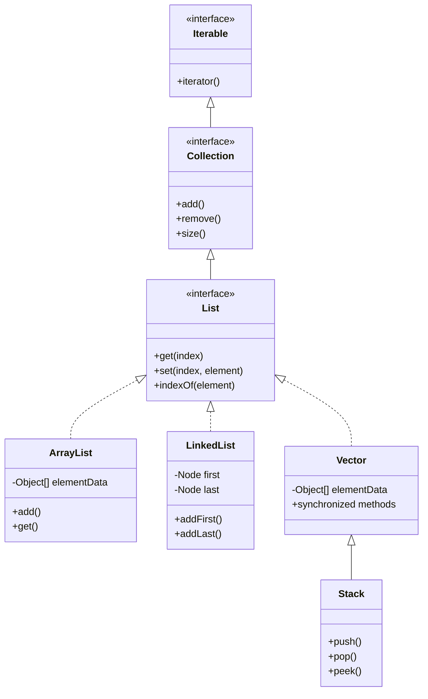
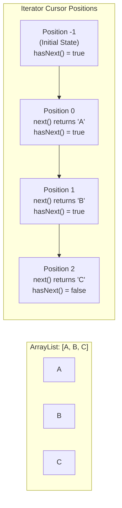
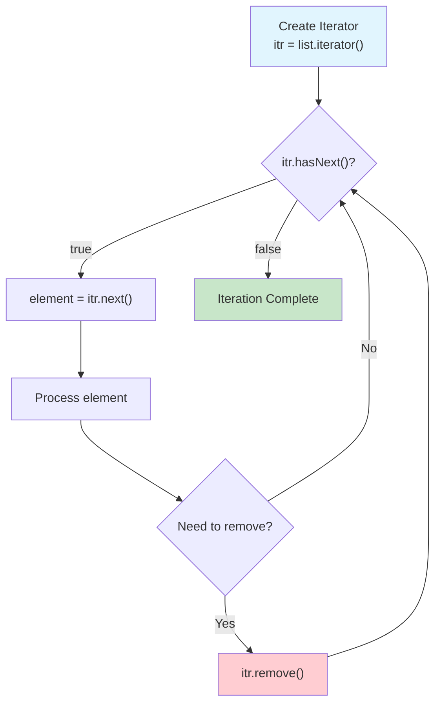
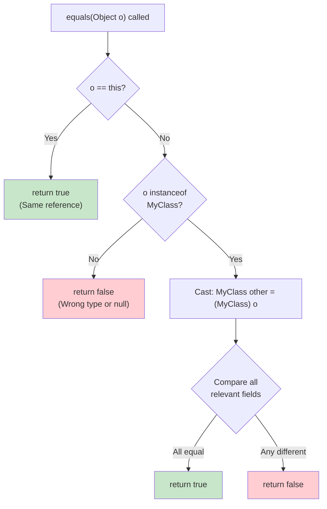

---
tags:
  - "#CCT2"
  - OO
  - Java
  - Programming
Topic: Lists & List-Interface | Iterators + Practical use  | Operators - Euality, Larger, Smaller, etc. | Operations, like sorting a list.
Semester: CCT2
Course: Objektorienteret analyse, design og implementering + Java
Litterature:
  - Geekforgeeks - List Interface in Java
  - Geekforgeeks - Iterator in Java
  - Geekforgeeks - Overriding equals method in Java
  - Geekforgeeks - Sorting in Java
Created: 21-02-2026
---
- - -
# Table of Contents

1. [[#Java Collections, Iterators, and Sorting|Java Collections, Iterators, and Sorting]]
	1. [[#Java Collections, Iterators, and Sorting#Quick Reference|Quick Reference]]
	2. [[#Java Collections, Iterators, and Sorting#List Interface in Java|List Interface in Java]]
		1. [[#List Interface in Java#Overview|Overview]]
		2. [[#List Interface in Java#Declaration and Hierarchy|Declaration and Hierarchy]]
			1. [[#Declaration and Hierarchy#Implementation Classes|Implementation Classes]]
		3. [[#List Interface in Java#Java List Operations|Java List Operations]]
			1. [[#Java List Operations#1. Adding Elements|1. Adding Elements]]
			2. [[#Java List Operations#2. Updating Elements|2. Updating Elements]]
			3. [[#Java List Operations#3. Searching Elements|3. Searching Elements]]
			4. [[#Java List Operations#4. Removing Elements|4. Removing Elements]]
			5. [[#Java List Operations#5. Accessing Elements|5. Accessing Elements]]
			6. [[#Java List Operations#6. Checking for Elements|6. Checking for Elements]]
		4. [[#List Interface in Java#Iterating Over a List|Iterating Over a List]]
		5. [[#List Interface in Java#Performance Analysis|Performance Analysis]]
		6. [[#List Interface in Java#Common Methods of the List Interface|Common Methods of the List Interface]]
		7. [[#List Interface in Java#List vs Set|List vs Set]]
	3. [[#Java Collections, Iterators, and Sorting#Iterator in Java|Iterator in Java]]
		1. [[#Iterator in Java#Overview|Overview]]
		2. [[#Iterator in Java#Declaration and Creation|Declaration and Creation]]
		3. [[#Iterator in Java#Basic Iteration|Basic Iteration]]
		4. [[#Iterator in Java#Hierarchy of Iterator|Hierarchy of Iterator]]
		5. [[#Iterator in Java#Methods of Iterator Interface|Methods of Iterator Interface]]
		6. [[#Iterator in Java#Internal Working|Internal Working]]
		7. [[#Iterator in Java#Removing Elements During Iteration|Removing Elements During Iteration]]
		8. [[#Iterator in Java#Iterator vs For-Each Loop|Iterator vs For-Each Loop]]
	4. [[#Java Collections, Iterators, and Sorting#Overriding equals() Method in Java|Overriding equals() Method in Java]]
		1. [[#Overriding equals() Method in Java#Overview|Overview]]
		2. [[#Overriding equals() Method in Java#The `==` Operator vs `equals()` Method|The `==` Operator vs `equals()` Method]]
		3. [[#Overriding equals() Method in Java#Overriding the `equals()` Method|Overriding the `equals()` Method]]
		4. [[#Overriding equals() Method in Java#Contract with `hashCode()`|Contract with `hashCode()`]]
		5. [[#Overriding equals() Method in Java#Common Pitfalls|Common Pitfalls]]
	5. [[#Java Collections, Iterators, and Sorting#Sorting in Java|Sorting in Java]]
		1. [[#Sorting in Java#Overview|Overview]]
		2. [[#Sorting in Java#Method 1: Using Loops (Manual Sorting)|Method 1: Using Loops (Manual Sorting)]]
		3. [[#Sorting in Java#Method 2: Using `Arrays.sort()` Method|Method 2: Using `Arrays.sort()` Method]]
			1. [[#Method 2: Using `Arrays.sort()` Method#Sorting in Ascending Order|Sorting in Ascending Order]]
			2. [[#Method 2: Using `Arrays.sort()` Method#Sorting in Descending Order|Sorting in Descending Order]]
		4. [[#Sorting in Java#Method 3: Using `Collections.sort()` Method|Method 3: Using `Collections.sort()` Method]]
			1. [[#Method 3: Using `Collections.sort()` Method#Sorting in Ascending Order|Sorting in Ascending Order]]
			2. [[#Method 3: Using `Collections.sort()` Method#Sorting in Descending Order|Sorting in Descending Order]]
		5. [[#Sorting in Java#Method 4: Sorting a Subarray|Method 4: Sorting a Subarray]]
		6. [[#Sorting in Java#Sorting Algorithm and Performance|Sorting Algorithm and Performance]]
		7. [[#Sorting in Java#Important Notes on Sorting in Java|Important Notes on Sorting in Java]]


# Java Collections, Iterators, and Sorting

## Quick Reference

| Concept | Syntax/Method | Description |
|---|---|---|
| **List Declaration** | `List<E> listName = new ArrayList<>();` | Creates a List using ArrayList implementation |
| **Add Element** | `list.add(element)` | Adds element at the end |
| **Add at Index** | `list.add(index, element)` | Inserts element at specific position |
| **Get Element** | `list.get(index)` | Retrieves element at index |
| **Update Element** | `list.set(index, element)` | Replaces element at index |
| **Remove by Index** | `list.remove(index)` | Removes element at position |
| **Remove by Object** | `list.remove(object)` | Removes first occurrence |
| **Check Contains** | `list.contains(element)` | Returns true if element exists |
| **Find Index** | `list.indexOf(element)` | Returns first occurrence index |
| **Size** | `list.size()` | Returns number of elements |
| **Clear** | `list.clear()` | Removes all elements |
| **Iterator Creation** | `Iterator<E> itr = collection.iterator();` | Obtains iterator for a collection |
| **Check Next** | `itr.hasNext()` | Returns true if more elements exist |
| **Get Next** | `itr.next()` | Returns next element and advances cursor |
| **Remove (Iterator)** | `itr.remove()` | Removes last element returned by next() |
| **Reference Comparison** | `obj1 == obj2` | Checks if references point to same object |
| **Content Comparison** | `obj1.equals(obj2)` | Checks if object contents are equal |
| **Override equals()** | `@Override public boolean equals(Object o)` | Custom equality logic for class |
| **Instance Check** | `obj instanceof ClassName` | Verifies object type |
| **Array Sort (Asc)** | `Arrays.sort(array)` | Sorts entire array in ascending order |
| **Array Sort (Desc)** | `Arrays.sort(array, Collections.reverseOrder())` | Sorts array in descending order (requires wrapper class) |
| **Subarray Sort** | `Arrays.sort(array, fromIndex, toIndex)` | Sorts portion of array |
| **List Sort (Asc)** | `Collections.sort(list)` | Sorts list in ascending order |
| **List Sort (Desc)** | `Collections.sort(list, Collections.reverseOrder())` | Sorts list in descending order |

---

## List Interface in Java

### Overview

The `List` interface in Java extends the `Collection` interface and is part of the `java.util` package. It is used to store ordered collections where duplicates are allowed and elements can be accessed by their index position.

>[!info] Characteristics of List
>- **Order:** Maintains insertion order of elements
>- **Duplicates:** Allows duplicate elements
>- **Null:** Supports null elements (implementation-dependent)
>- **Traversal:** Supports bidirectional traversal using `ListIterator` (see [[#Iterator in Java]])
>- **Index-Based Access:** Elements can be accessed by their position

### Declaration and Hierarchy

To use a `List`, you must instantiate a class that implements it. The interface declaration is:

```java
public interface List<E> extends Collection<E> { }
```

Here, `E` represents the type parameter for the elements stored in the list.



_Figure 1.1: Class hierarchy of the List interface and its common implementations in the Java Collections Framework_

>[!example] Basic List Declaration
>```java
>// Using ArrayList implementation
>List<String> stringList = new ArrayList<>();
>
>// Using LinkedList implementation
>List<Integer> numberList = new LinkedList<>();
>
>// Using Vector implementation
>List<Double> doubleList = new Vector<>();
>```

#### Implementation Classes

>[!info] Common Implementation Classes
>- **ArrayList:** Implemented using a resizable array. Offers fast random access ($O(1)$) but slower insert/delete operations in the middle ($O(n)$)
>- **LinkedList:** Implemented using a doubly-linked list. Efficient for frequent insertions and deletions ($O(1)$ at ends) but slower random access ($O(n)$)
>- **Vector:** A legacy implementation using a synchronized dynamic array. Thread-safe but slower than `ArrayList` due to synchronization overhead
>- **Stack:** A subclass of `Vector` implementing LIFO (Last-In-First-Out) structure for stack operations

>[!example] Creating a Basic List
>This program demonstrates how to create a List using `ArrayList`, add elements to it, and iterate through the list to print each element.
>
>```java
>import java.util.*;
>
>class Geeks {
>    public static void main(String[] args) {
>        // Creating a List of Strings using ArrayList
>        List<String> li = new ArrayList<>();
>
>        // Adding elements in List
>        li.add("Java");
>        li.add("Python");
>        li.add("DSA");
>        li.add("C++");
>
>        System.out.println("Elements of List are:");
>
>        // Iterating through the list
>        for (String s : li) {
>            System.out.println(s);
>        }
>    }
>}
>```
>**Output:**
>```
>Elements of List are:
>Java
>Python
>DSA
>C++
>```

### Java List Operations

Since `List` is an interface, it can only be used with a class that implements it. Below are common operations performed on a `List`.

#### 1. Adding Elements

The `add()` method is used to add elements and is overloaded to support different use cases.

- `add(E element)`: Adds an element at the end of the list
- `add(int index, E element)`: Inserts an element at a specific index position

>[!warning] Index Constraints
>When adding elements at specific indices:
>- You cannot add at index $1$ before adding at index $0$
>- The index must be less than or equal to the current size of the list
>- Adding beyond the current size throws `IndexOutOfBoundsException`
>- It is recommended to add elements sequentially or only when the size is well-defined

>[!example] Adding Elements
>```java
>import java.util.*;
>
>class Geeks {
>    public static void main(String args[]) {
>        List<String> al = new ArrayList<>();
>
>        // Adding elements at the end
>        al.add("Geeks");
>        al.add("Geeks");
>        
>        // Adding element at index 1
>        al.add(1, "For");
>
>        System.out.println(al);
>    }
>}
>```
>**Output:** `[Geeks, For, Geeks]`

#### 2. Updating Elements

The `set()` method replaces an element at a specific index with a new value and returns the old element.

- `set(int index, E element)`: Replaces element at the specified index

>[!example] Updating Elements
>```java
>import java.util.*;
>
>class Geeks {
>    public static void main(String args[]) {
>        List<String> al = new ArrayList<>();
>
>        al.add("Geeks");
>        al.add("Geeks");
>        al.add(1, "Geeks");
>
>        System.out.println("Initial ArrayList " + al);
>
>        // Updating element at index 1
>        al.set(1, "For");
>
>        System.out.println("Updated ArrayList " + al);
>    }
>}
>```
>**Output:**
>```
>Initial ArrayList [Geeks, Geeks, Geeks]
>Updated ArrayList [Geeks, For, Geeks]
>```

#### 3. Searching Elements

Searching can be performed using `indexOf()` and `lastIndexOf()` methods.

- `indexOf(Object o)`: Returns the index of the first occurrence, or $-1$ if not found
- `lastIndexOf(Object o)`: Returns the index of the last occurrence, or $-1$ if not found

>[!example] Searching Elements
>```java
>import java.util.*;
>
>class Geeks {
>    public static void main(String[] args) {
>        List<Integer> al = new ArrayList<>();
>
>        al.add(1);
>        al.add(2);
>        al.add(3);
>        al.add(2);  // Duplicate element
>
>        int i = al.indexOf(2);
>        System.out.println("First Occurrence of 2 is at Index: " + i);
>
>        int l = al.lastIndexOf(2);
>        System.out.println("Last Occurrence of 2 is at Index: " + l);
>    }
>}
>```
>**Output:**
>```
>First Occurrence of 2 is at Index: 1
>Last Occurrence of 2 is at Index: 3
>```

#### 4. Removing Elements

The `remove()` method is overloaded to remove elements by object reference or by index position.

- `remove(Object o)`: Removes the first occurrence of the specified object
- `remove(int index)`: Removes the element at the specified index and shifts subsequent elements left

>[!example] Removing Elements
>```java
>import java.util.ArrayList;
>import java.util.List;
>
>class Geeks {
>    public static void main(String args[]) {
>        List<String> al = new ArrayList<>();
>
>        al.add("Geeks");
>        al.add("Geeks");
>        al.add(1, "For");
>
>        System.out.println("Initial ArrayList " + al);
>
>        // Remove element at index 1
>        al.remove(1);
>        System.out.println("After the Index Removal " + al);
>
>        // Remove the first occurrence of "Geeks"
>        al.remove("Geeks");
>        System.out.println("After the Object Removal " + al);
>    }
>}
>```
>**Output:**
>```
>Initial ArrayList [Geeks, For, Geeks]
>After the Index Removal [Geeks, Geeks]
>After the Object Removal [Geeks]
>```

>[!warning] Removing Elements During Iteration
>You cannot safely remove elements using `list.remove()` while iterating with a for-each loop. This will throw a `ConcurrentModificationException`. Use an [[#Iterator in Java|Iterator]] instead for safe removal during traversal.

#### 5. Accessing Elements

The `get(int index)` method returns the element at the specified position in the list.

- `get(int index)`: Retrieves element at the given index

>[!example] Accessing Elements
>```java
>import java.util.*;
>
>class Geeks {
>    public static void main(String args[]) {
>        List<String> al = new ArrayList<>();
>
>        al.add("Geeks");
>        al.add("For");
>        al.add("Geeks");
>
>        String first = al.get(0);
>        String second = al.get(1);
>        String third = al.get(2);
>
>        System.out.println(first);
>        System.out.println(second);
>        System.out.println(third);
>    }
>}
>```
>**Output:**
>```
>Geeks
>For
>Geeks
>```

#### 6. Checking for Elements

The `contains(Object o)` method checks whether a specific element exists in the list.

- `contains(Object o)`: Returns `true` if element is present, `false` otherwise

>[!example] Checking for Elements
>```java
>import java.util.*;
>
>class Geeks {
>    public static void main(String args[]) {
>        List<String> al = new ArrayList<>();
>
>        al.add("Geeks");
>        al.add("For");
>        al.add("Geeks");
>
>        boolean isPresent = al.contains("Geeks");
>        System.out.println("Is Geeks present in the list? " + isPresent);
>    }
>}
>```
>**Output:** `Is Geeks present in the list? true`

### Iterating Over a List

For larger datasets, lists can be traversed using multiple approaches. For safe element removal during iteration, see [[#Iterator in Java|Iterator]].

1. **Index-based for loop** with `get(index)`
2. **Enhanced for-each loop**
3. **[[#Iterator in Java|Iterator]]** for safe modification during traversal
4. **ListIterator** for bidirectional traversal

>[!example] List Iteration Methods
>```java
>import java.util.*;
>
>public class Geeks {
>    public static void main(String args[]) {
>        List<String> al = new ArrayList<>();
>
>        al.add("Geeks");
>        al.add("Geeks");
>        al.add(1, "For");
>
>        // Using traditional for loop with index
>        for (int i = 0; i < al.size(); i++) {
>            System.out.print(al.get(i) + " ");
>        }
>
>        System.out.println();
>
>        // Using enhanced for-each loop
>        for (String str : al)
>            System.out.print(str + " ");
>    }
>}
>```
>**Output:**
>```
>Geeks For Geeks 
>Geeks For Geeks
>```

### Performance Analysis

The performance of `List` operations varies based on the implementation class used.

| Operation | ArrayList | LinkedList | Vector |
|---|---|---|---|
| `add(E e)` (at end) | $O(1)$ amortized | $O(1)$ | $O(1)$ amortized |
| `add(int index, E e)` | $O(n)$ | $O(n)$* | $O(n)$ |
| `get(int index)` | $O(1)$ | $O(n)$ | $O(1)$ |
| `set(int index, E e)` | $O(1)$ | $O(n)$ | $O(1)$ |
| `remove(int index)` | $O(n)$ | $O(n)$* | $O(n)$ |
| `remove(Object o)` | $O(n)$ | $O(n)$ | $O(n)$ |
| `contains(Object o)` | $O(n)$ | $O(n)$ | $O(n)$ |
| `indexOf(Object o)` | $O(n)$ | $O(n)$ | $O(n)$ |
| `size()` | $O(1)$ | $O(1)$ | $O(1)$ |
| **Iterator `next()`** | $O(1)$ | $O(1)$ | $O(1)$ |
| **Iterator `remove()`** | $O(n)$ | $O(1)$ | $O(n)$ |

_Table 1.1: Time complexity comparison of List operations across implementations. *LinkedList operations at specific indices require $O(n)$ traversal to find the position, but the actual insertion/removal is $O(1)$._

| Characteristic | ArrayList | LinkedList | Vector |
|---|---|---|---|
| **Underlying Structure** | Dynamic array | Doubly-linked list | Dynamic array |
| **Memory Overhead** | Low (contiguous) | High (node pointers) | Low (contiguous) |
| **Thread Safety** | No | No | Yes (synchronized) |
| **Cache Performance** | Excellent | Poor | Excellent |
| **Best For** | Random access, iteration | Frequent add/remove at ends | Legacy thread-safe needs |
| **Space Complexity** | $O(n)$ | $O(n)$ + pointer overhead | $O(n)$ |

_Table 1.2: Characteristic comparison of List implementations to guide selection_

>[!tip] Choosing the Right Implementation
>- **ArrayList:** Default choice for most use cases. Best when you frequently access elements by index or iterate through the list
>- **LinkedList:** Choose when you frequently add/remove elements at the beginning or end, or when using it as a Queue/Deque
>- **Vector:** Only use when you specifically need thread-safety with a single lock (consider `Collections.synchronizedList()` or `CopyOnWriteArrayList` for modern alternatives)

### Common Methods of the List Interface

| Method | Description |
|---|---|
| `add(int index, E element)` | Inserts an element at a particular index |
| `addAll(int index, Collection<? extends E> c)` | Adds all elements from a collection starting at the specified index |
| `size()` | Returns the number of elements in the list |
| `clear()` | Removes all elements; the list reference is retained |
| `remove(int index)` | Removes and returns the element at the specified index |
| `remove(Object o)` | Removes the first occurrence of the specified element |
| `get(int index)` | Returns the element at the specified index |
| `set(int index, E element)` | Replaces the element at the given index; returns the replaced element |
| `indexOf(Object o)` | Returns the first occurrence index of the element, or $-1$ if not found |
| `lastIndexOf(Object o)` | Returns the last occurrence index of the element, or $-1$ if not found |
| `equals(Object o)` | Compares the equality of the given object with the list |
| `hashCode()` | Returns the hashcode value of the list |
| `isEmpty()` | Checks if the list is empty; returns `true` or `false` |
| `contains(Object o)` | Checks if the list contains the given element |
| `containsAll(Collection<?> c)` | Checks if the list contains all elements of the collection |
| `sort(Comparator<? super E> c)` | Sorts the list based on the given comparator |
| `subList(int fromIndex, int toIndex)` | Returns a view of the portion between the specified indices |
| `toArray()` | Converts the list to an array |

_Table 1.3: Common Methods of the List Interface_

### List vs Set

Both `List` and `Set` inherit from the `Collection` interface but have distinct characteristics that make them suitable for different use cases.

| Feature | List | Set |
|---|---|---|
| **Order** | Ordered sequence (maintains insertion order) | Unordered sequence (except LinkedHashSet and TreeSet) |
| **Duplicates** | Allows duplicate elements | Does not allow duplicate elements |
| **Access** | Elements can be accessed by their position (index) | Position-based access is not allowed |
| **Null Elements** | Multiple null elements can be stored | At most one null element can be stored |
| **Implementations** | `ArrayList`, `LinkedList`, `Vector`, `Stack` | `HashSet`, `LinkedHashSet`, `TreeSet` |
| **Primary Use Case** | When order and duplicates matter | When uniqueness is required |
| **Performance** | Fast index-based access ($O(1)$ for ArrayList) | Fast membership testing ($O(1)$ for HashSet) |

_Table 1.4: Comparison between List and Set_

>[!tip] Choosing Between List and Set
>- Use `List` when you need to maintain insertion order, allow duplicates, or frequently access elements by index
>- Use `Set` when you need to enforce uniqueness, don't care about order (or use TreeSet for sorted order), or need fast membership checking
>- For removing elements during iteration in either collection type, use an [[#Iterator in Java|Iterator]]

---

## Iterator in Java

### Overview

An **Iterator** in Java is a cursor used to traverse or iterate through the elements of a collection one by one. It provides a safe way to remove elements during traversal, unlike the for-each loop used with [[#List Interface in Java|List]] and other collections. It is part of the `java.util` package and is one of the most commonly used cursors in the Java Collections Framework.

>[!info] Characteristics of Iterator
>- **Direction:** Unidirectional cursor (forward direction only)
>- **Safety:** Allows elements to be removed safely during traversal using the `remove()` method
>- **Universality:** Works with all collection types, including `List`, `Set`, and `Queue`
>- **Fail-Fast:** Throws `ConcurrentModificationException` if the collection is modified during iteration (except via iterator's own `remove()` method)

### Declaration and Creation

The `Iterator` interface is declared as follows:

```java
public interface Iterator<E>
```

Here, `E` represents the type of elements to be iterated over.

An `Iterator` object is created by calling the `iterator()` method on a collection object:

>[!example] Creating an Iterator
>```java
>Collection<String> names = new ArrayList<>();
>names.add("Alice");
>names.add("Bob");
>
>// Create iterator for the collection
>Iterator<String> itr = names.iterator();
>```

### Basic Iteration

>[!example] Basic Iteration Example
>This example demonstrates creating an `Iterator` for an `ArrayList` and using it to traverse and print elements.
>
>```java
>import java.util.ArrayList;
>import java.util.Iterator;
>
>public class Geeks {
>    public static void main(String[] args) {
>        // Create an ArrayList and add some elements
>        ArrayList<String> al = new ArrayList<>();
>        al.add("A");
>        al.add("B");
>        al.add("C");
>
>        // Obtain an iterator for the ArrayList
>        Iterator<String> it = al.iterator();
>
>        // Iterate through the elements and print each one
>        while (it.hasNext()) {
>            // Get the next element
>            String n = it.next(); 
>            System.out.println(n);      
>        }
>    }
>}
>```
>**Output:**
>```
>A
>B
>C
>```

### Hierarchy of Iterator

The `Iterator` interface is implemented by all collection classes in the Java Collections Framework. A notable subinterface is `ListIterator`, which extends `Iterator` to provide bidirectional traversal capabilities specifically for lists.

>[!info] Iterator Hierarchy
>- **Iterator:** Base interface for unidirectional traversal
>- **ListIterator:** Extends Iterator, adds bidirectional traversal and modification capabilities
>- All collection classes that implement `Collection` interface provide an `iterator()` method

### Methods of Iterator Interface

The `Iterator` interface defines three primary methods:

| Method | Return Type | Description |
|---|---|---|
| `hasNext()` | `boolean` | Returns `true` if the iteration has more elements |
| `next()` | `E` | Returns the next element in the iteration |
| `remove()` | `void` | Removes the last element returned by `next()` |

_Table 2.1: Methods of the Iterator Interface_

>[!note] Connection to List Operations
>While [[#4. Removing Elements|List.remove()]] can remove elements by index or object, it cannot be safely used during iteration. The Iterator's `remove()` method is the only safe way to modify a collection while traversing it.

>[!warning] Using the `remove()` Method
>The `remove()` method has specific usage rules:
>- Can only be called **once per call** to `next()`
>- Must call `next()` before calling `remove()`
>- Throws `IllegalStateException` if `next()` hasn't been called
>- Throws `IllegalStateException` if `remove()` is called twice without an intervening `next()`
>- Throws `UnsupportedOperationException` if the iterator does not support removal

### Internal Working

The internal functionality of an `Iterator` relies on a cursor that points to positions within the collection.

>[!abstract] Iterator Cursor Mechanism
>1. **Initial State:** When an iterator is created, the cursor points **before** the first element of the collection
>2. **Traversal:** When `next()` is called, the cursor advances to the next element and returns that element
>3. **Progress:** Repeated calls to `hasNext()` (to check availability) and `next()` move the cursor sequentially through the collection
>4. **End State:** Once the cursor passes the last element, `hasNext()` returns `false`



_Figure 2.1: Visual representation of Iterator cursor positions during traversal. The cursor starts before the first element and advances with each `next()` call._



_Figure 2.2: Flowchart depicting the standard Iterator traversal pattern with optional element removal_

>[!note] Unidirectional Nature
>Because the cursor only moves forward, `Iterator` is known as a **unidirectional cursor**. In contrast, `ListIterator` is bidirectional and can move both forward and backward through a list.

### Removing Elements During Iteration

A key advantage of the `Iterator` is the ability to safely remove elements from a collection while traversing it, which cannot be done safely using a traditional for-each loop.

>[!example] Removing Odd Elements
>This example creates an `ArrayList` of integers, iterates through it, and removes all odd numbers using the iterator's `remove()` method.
>
>```java
>import java.util.ArrayList;
>import java.util.Iterator;
>
>public class Geeks {
>    public static void main(String[] args) {
>        // Creating an ArrayList of Integer type
>        ArrayList<Integer> al = new ArrayList<>();
>
>        // Adding elements to the ArrayList
>        for (int i = 0; i < 10; i++) {
>            al.add(i);
>        }
>
>        // Printing the original list
>        System.out.println("Original List: " + al);
>
>        // Creating an Iterator for the ArrayList
>        Iterator<Integer> itr = al.iterator();
>
>        // Iterating through the list and removing odd elements
>        while (itr.hasNext()) {
>            // Getting the next element
>            int i = itr.next();  
>            
>            System.out.print(i + " ");  
>
>            // Removing odd elements
>            if (i % 2 != 0) {
>                itr.remove();
>            }
>        }
>
>        System.out.println();
>
>        // Printing the modified list after removal of odd elements
>        System.out.println("Modified List: " + al);
>    }
>}
>```
>**Output:**
>```
>Original List: [0, 1, 2, 3, 4, 5, 6, 7, 8, 9]
>0 1 2 3 4 5 6 7 8 9 
>Modified List: [0, 2, 4, 6, 8]
>```

>[!warning] Concurrent Modification Exception
>If you try to modify a collection directly (not using iterator's `remove()`) while iterating, you'll get a `ConcurrentModificationException`:
>```java
>// This will throw ConcurrentModificationException
>for (Integer num : list) {
>    if (num % 2 == 0) {
>        list.remove(num);  // Direct modification - WRONG!
>    }
>}
>
>// Correct way using iterator
>Iterator<Integer> itr = list.iterator();
>while (itr.hasNext()) {
>    if (itr.next() % 2 == 0) {
>        itr.remove();  // Iterator's remove - CORRECT!
>    }
>}
>```

### Iterator vs For-Each Loop

| Feature | Iterator | For-Each Loop |
|---|---|---|
| **Removal** | Supports safe removal via `remove()` | Cannot remove elements safely |
| **Direction** | Forward only (unidirectional) | Forward only |
| **Flexibility** | More control over iteration | Simpler syntax |
| **Use Case** | When modification is needed | When only reading elements |
| **Performance** | Slightly more overhead | Slightly faster |

_Table 2.2: Comparison between Iterator and For-Each Loop_

>[!tip] When to Use Iterator
>Use `Iterator` when:
>- You need to remove elements during iteration
>- You need more control over the iteration process
>- You're working with legacy code that doesn't support for-each loops
>
>Use for-each loop when:
>- You only need to read elements
>- You want cleaner, more readable code
>- No modification of the collection is required

---

## Overriding equals() Method in Java

### Overview

In Java, comparing objects requires understanding the difference between comparing references and comparing the actual data contained within those objects. By default, the `equals()` method inherited from `Object` class behaves identically to the `==` operator, comparing only references. To compare object contents, we must override this method.

### The `==` Operator vs `equals()` Method

When comparing objects using the `==` operator, Java checks if the reference variables point to the exact same object in memory. It does **not** check if the contents of the objects are identical.

>[!example] Reference Comparison with `==`
>Consider two `Complex` objects initialized with the same values:
>
>```java
>Complex c1 = new Complex(10, 15);
>Complex c2 = new Complex(10, 15);
>
>if (c1 == c2) {
>    System.out.println("Equal");
>} else {
>    System.out.println("Not Equal");
>}
>```
>**Output:** `Not Equal`
>
>Even though `c1` and `c2` hold the same data, they are distinct objects in memory. The `==` operator returns `false`.

>[!example] Reference Comparison When Pointing to Same Object
>```java
>Complex c1 = new Complex(10, 15);
>Complex c3 = c1;  // c3 references the same object as c1
>
>if (c1 == c3) {
>    System.out.println("Equal");
>} else {
>    System.out.println("Not Equal");
>}
>```
>**Output:** `Equal`
>
>Here, `c1` and `c3` reference the exact same object in memory, so `==` returns `true`.

### Overriding the `equals()` Method

All classes in Java inherit from the `Object` class, which provides an `equals()` method. By default, this method behaves identically to the `==` operator (checking reference equality). To compare the **values** or data inside the objects, we must override the `equals()` method in our custom class.

>[!info] Steps for Proper `equals()` Implementation
>A proper implementation of `equals()` should follow these steps:
>1. **Self-check:** Check if the object is compared with itself (`o == this`)
>2. **Type check:** Verify the object is an instance of the specific class (also handles `null` checks)
>3. **Typecast:** Cast the object to the current class type
>4. **Field comparison:** Compare the specific data members (fields) of the two objects



_Figure 3.1: Decision flowchart for implementing the `equals()` method override_

>[!example] Overriding `equals()` for a Complex Class
>The following example demonstrates how to override `equals()` to compare the real and imaginary parts of two complex numbers.
>
>```java
>class Complex {
>    private double re, im;
>
>    public Complex(double re, double im) {
>        this.re = re;
>        this.im = im;
>    }
>
>    // Overriding equals() to compare two Complex objects
>    @Override
>    public boolean equals(Object o) {
>
>        // If the object is compared with itself then return true  
>        if (o == this) {
>            return true;
>        }
>
>        /* Check if o is an instance of Complex or not
>          "null instanceof [type]" also returns false */
>        if (!(o instanceof Complex)) {
>            return false;
>        }
>        
>        // typecast o to Complex so that we can compare data members 
>        Complex c = (Complex) o;
>        
>        // Compare the data members and return accordingly 
>        return Double.compare(re, c.re) == 0
>                && Double.compare(im, c.im) == 0;
>    }
>}
>
>// Driver class to test the Complex class
>public class Main {
>    public static void main(String[] args) {
>        Complex c1 = new Complex(10, 15);
>        Complex c2 = new Complex(10, 15);
>        
>        if (c1.equals(c2)) {
>            System.out.println("Equal");
>        } else {
>            System.out.println("Not Equal");
>        }
>    }
>}
>```
>**Output:** `Equal`

>[!note] Using `Double.compare()` for Floating-Point Comparison
>The example uses `Double.compare(re, c.re)` instead of `re == c.re` because:
>- Floating-point numbers can have precision issues
>- `Double.compare()` handles special cases like `NaN` and $-0.0$ correctly
>- It returns $0$ if the values are equal, which is why we check `== 0`

### Contract with `hashCode()`

>[!warning] Override `hashCode()` when Overriding `equals()`
>It is **strongly recommended** to override the `hashCode()` method whenever you override `equals()`. This is part of the general contract between these two methods.
>
>**The Contract:**
>- If two objects are equal according to the `equals()` method, they **must** return the same integer hash code
>- If two objects have the same hash code, they are **not necessarily** equal
>- If the contract is violated, hash-based collections such as `HashMap`, `HashSet`, and `Hashtable` will not function correctly. This is especially important when using custom objects as keys in maps or elements in [[#List vs Set|Sets]]

>[!example] Implementing `hashCode()` for Complex Class
>```java
>class Complex {
>    private double re, im;
>
>    public Complex(double re, double im) {
>        this.re = re;
>        this.im = im;
>    }
>
>    @Override
>    public boolean equals(Object o) {
>        if (o == this) return true;
>        if (!(o instanceof Complex)) return false;
>        Complex c = (Complex) o;
>        return Double.compare(re, c.re) == 0
>                && Double.compare(im, c.im) == 0;
>    }
>
>    @Override
>    public int hashCode() {
>        // Using Objects.hash() for convenient hash code generation
>        return Objects.hash(re, im);
>    }
>}
>```

>[!tip] Best Practices for `equals()` and `hashCode()`
>- Always override both methods together
>- Use the same fields in both methods
>- Consider using IDE-generated implementations or `Objects.equals()` and `Objects.hash()` utility methods
>- Ensure the implementation is **reflexive** ($x.equals(x)$ is always true)
>- Ensure the implementation is **symmetric** ($x.equals(y) \iff y.equals(x)$)
>- Ensure the implementation is **transitive** (if $x.equals(y)$ and $y.equals(z)$, then $x.equals(z)$)
>- Ensure the implementation is **consistent** (multiple calls return same result if objects unchanged)
>- For any non-null reference $x$, $x.equals(null)$ should return false

### Common Pitfalls

>[!warning] Common Mistakes When Overriding `equals()`
>1. **Wrong Method Signature:**
>   ```java
>   // WRONG - This doesn't override Object.equals()
>   public boolean equals(Complex c) { ... }
>   
>   // CORRECT - Parameter must be Object
>   public boolean equals(Object o) { ... }
>   ```
>
>2. **Forgetting to Check for `null`:**
>   ```java
>   // WRONG - Will throw NullPointerException
>   public boolean equals(Object o) {
>       Complex c = (Complex) o;
>       return this.re == c.re;
>   }
>   
>   // CORRECT - instanceof handles null check
>   public boolean equals(Object o) {
>       if (!(o instanceof Complex)) return false;
>       Complex c = (Complex) o;
>       return this.re == c.re;
>   }
>   ```
>
>3. **Not Overriding `hashCode()`:** This breaks the contract and causes issues with hash-based collections

---

## Sorting in Java

### Overview

In Java, sorting can be accomplished through various methods, ranging from manual implementation using loops to utilizing built-in methods provided by the language. There are four primary approaches to sorting data in Java: using loops, using the `sort()` method of the `Arrays` class, using the `sort()` method of the `Collections` class, and sorting a specific subarray or sublist.

### Method 1: Using Loops (Manual Sorting)

Sorting can be performed manually by implementing logic with loops, typically involving nested loops to compare and swap elements. This approach is often referred to as a brute force method and demonstrates sorting algorithms like Bubble Sort or Selection Sort.

>[!example] Manual Sorting using Nested Loops
>The following code demonstrates a basic sort using a nested loop structure to arrange an array of integers in ascending order (similar to Selection Sort).
>
>```java
>class GFG {
>    // Main driver method
>    public static void main(String[] args) {
>        // Custom input array
>        int arr[] = { 4, 3, 2, 1 };
>
>        // Outer loop - iterates through each position
>        for (int i = 0; i < arr.length; i++) {
>
>            // Inner nested loop - finds minimum element
>            for (int j = i + 1; j < arr.length; j++) {
>
>                // Checking and swapping elements
>                int temp = 0;
>                if (arr[j] < arr[i]) {
>                    // Swapping
>                    temp = arr[i];
>                    arr[i] = arr[j];
>                    arr[j] = temp;
>                }
>            }
>
>            // Printing sorted array elements
>            System.out.print(arr[i] + " ");
>        }
>    }
>}
>```
>**Output:** `1 2 3 4`

>[!note] Understanding the Algorithm
>This implementation uses a Selection Sort approach:
>1. The outer loop selects each position from left to right
>2. The inner loop finds the smallest element in the remaining unsorted portion
>3. If a smaller element is found, it's swapped with the current position
>4. This continues until all positions are filled with sorted elements

### Method 2: Using `Arrays.sort()` Method

The `Arrays.sort()` method is used to sort arrays, including those containing primitive data types and objects. By default, this method sorts the elements in ascending order using an optimized sorting algorithm.

#### Sorting in Ascending Order

>[!example] Sorting an Array in Ascending Order
>```java
>import java.util.Arrays;
>
>public class GFG {
>    public static void main(String[] args) {
>        // Custom input array
>        int[] arr = { 13, 7, 6, 45, 21, 9, 101, 102 };
>
>        // Calling the sort() method present inside Arrays class
>        Arrays.sort(arr);
>
>        // Printing and display sorted array
>        System.out.printf("Modified arr[] : %s", Arrays.toString(arr));
>    }
>}
>```
>**Output:** `Modified arr[] : [6, 7, 9, 13, 21, 45, 101, 102]`

#### Sorting in Descending Order

To sort an array in descending order, you must use an array of wrapper classes (e.g., `Integer` instead of `int`) because `Collections.reverseOrder()` does not work with primitive types.

>[!warning] Primitive Types vs Wrapper Classes
>- **Primitive types** (`int`, `double`, `char`, etc.) cannot be used with `Collections.reverseOrder()`
>- **Wrapper classes** (`Integer`, `Double`, `Character`, etc.) must be used for descending order sorting
>- This is because `Collections.reverseOrder()` returns a `Comparator`, which only works with objects, not primitives

>[!example] Sorting an Array in Descending Order
>```java
>import java.util.Arrays;
>import java.util.Collections;
>
>public class GFG {
>    public static void main(String[] args) {
>        // Note that we have Integer here instead of int[]
>        Integer[] arr = { 13, 7, 6, 45, 21, 9, 2, 100 };
>
>        // Sorts arr[] in descending order
>        Arrays.sort(arr, Collections.reverseOrder());
>
>        System.out.printf("Modified arr[] : %s", Arrays.toString(arr));
>    }
>}
>```
>**Output:** `Modified arr[] : [100, 45, 21, 13, 9, 7, 6, 2]`

### Method 3: Using `Collections.sort()` Method

The `Collections.sort()` method is designed to sort objects in collections such as `ArrayList`, `LinkedList`, and other classes implementing the [[#List Interface in Java|List]] interface.

#### Sorting in Ascending Order

>[!example] Sorting a List in Ascending Order
>```java
>import java.util.*;
>
>public class GFG {
>    public static void main(String[] args) {
>        // Create a list of strings
>        ArrayList<String> al = new ArrayList<String>();
>        al.add("Geeks For Geeks");
>        al.add("Friends");
>        al.add("Dear");
>        al.add("Is");
>        al.add("Superb");
>
>        /* Collections.sort method is sorting the
>        elements of ArrayList in ascending order. */
>        Collections.sort(al);
>
>        // Let us print the sorted list
>        System.out.println("List after the use of Collection.sort() :\n" + al);
>    }
>}
>```
>**Output:**
>```
>List after the use of Collection.sort() :
>[Dear, Friends, Geeks For Geeks, Is, Superb]
>```

#### Sorting in Descending Order

>[!example] Sorting a List in Descending Order
>```java
>import java.util.*;
>
>public class GFG {
>    public static void main(String[] args) {
>        // Create a list of strings
>        ArrayList<String> al = new ArrayList<String>();
>        al.add("Geeks For Geeks");
>        al.add("Friends");
>        al.add("Dear");
>        al.add("Is");
>        al.add("Superb");
>
>        /* Collections.sort method is sorting the
>        elements of ArrayList in descending order. */
>        Collections.sort(al, Collections.reverseOrder());
>
>        // Let us print the sorted list
>        System.out.println("List after the use of Collection.sort() :\n" + al);
>    }
>}
>```
>**Output:**
>```
>List after the use of Collection.sort() :
>[Superb, Is, Geeks For Geeks, Friends, Dear]
>```

>[!note] Natural Ordering
>When sorting strings:
>- The default (ascending) order is **lexicographical** (dictionary order)
>- Capital letters come before lowercase letters
>- Numbers come before letters
>- Special characters are ordered by their Unicode values

### Method 4: Sorting a Subarray

You can sort a specific portion of an array using the `Arrays.sort()` method by specifying the start and end indices. The end index is exclusive.

>[!example] Sorting a Subarray
>This example sorts the elements from index $1$ to $4$ (index $5$ is exclusive), leaving other elements untouched.
>
>```java
>import java.util.Arrays;
>
>public class GFG {
>    public static void main(String[] args) {
>        // Custom input array
>        int[] arr = { 13, 7, 6, 45, 21, 9, 2, 100 };
>
>        // Sort subarray from index 1 to 5 (exclusive)
>        // This sorts only the subarray {7, 6, 45, 21}
>        Arrays.sort(arr, 1, 5);
>
>        // Printing sorted array
>        System.out.printf("Modified arr[] : %s", Arrays.toString(arr));
>    }
>}
>```
>**Output:** `Modified arr[] : [13, 6, 7, 21, 45, 9, 2, 100]`

>[!tip] Subarray Sorting Details
>- The syntax is `Arrays.sort(array, fromIndex, toIndex)`
>- `fromIndex` is **inclusive** (element at this index is sorted)
>- `toIndex` is **exclusive** (element at this index is NOT sorted)
>- Elements outside this range remain in their original positions
>- Useful when you need to sort only a portion of data without affecting the rest

### Sorting Algorithm and Performance

>[!info] Sorting Algorithms Used in Java
>**Current Implementation (Java 7+):**
>- **For primitive types:** Dual-Pivot Quicksort
>  - Time Complexity: $O(n \log n)$ average case, $O(n^2)$ worst case
>  - Space Complexity: $O(\log n)$
>  - Efficient for primitive arrays
>
>- **For objects:** Timsort (a hybrid of Merge Sort and Insertion Sort)
>  - Time Complexity: $O(n \log n)$ worst case
>  - Space Complexity: $O(n)$
>  - Stable sorting (maintains relative order of equal elements)
>  - Optimized for real-world data
>
>**Previous Implementations:**
>- Java 6 and earlier used traditional Quicksort for primitives and Merge Sort for objects

| Sorting Method | Best Case | Average Case | Worst Case | Space Complexity | Stable? |
|---|---|---|---|---|---|
| Dual-Pivot Quicksort (primitives) | $O(n \log n)$ | $O(n \log n)$ | $O(n^2)$ | $O(\log n)$ | No |
| Timsort (objects) | $O(n)$ | $O(n \log n)$ | $O(n \log n)$ | $O(n)$ | Yes |
| Manual (nested loops) | $O(n^2)$ | $O(n^2)$ | $O(n^2)$ | $O(1)$ | Depends |

_Table 4.1: Time and Space Complexity of Different Sorting Methods in Java_

### Important Notes on Sorting in Java

>[!tip] Key Points to Remember
>- **Default Order:** Sorting is done in **ascending order** by default for both `Arrays.sort()` and `Collections.sort()`
>- **Descending Order:** Use `Collections.reverseOrder()` as a comparator for descending order
>- **Primitive Limitation:** Descending order sorting requires wrapper classes (cannot use primitive types)
>- **Stability:** Timsort (used for objects) is stable, meaning equal elements maintain their relative order
>- **Custom Sorting:** For complex sorting logic, implement a custom `Comparator` or make the class implement `Comparable`. When sorting custom objects, ensure [[#Overriding equals() Method in Java|equals()]] and `hashCode()` are properly overridden for consistent behavior
>- **Performance:** Built-in methods are highly optimized and preferred over manual implementations for production code
>- **Partial Sorting:** Use the overloaded version with indices to sort only a portion of an array or list

>[!example] Custom Sorting with Comparator
>For custom sorting logic beyond ascending/descending:
>
>```java
>import java.util.*;
>
>public class GFG {
>    public static void main(String[] args) {
>        Integer[] arr = { 13, 7, 6, 45, 21, 9, 2, 100 };
>
>        // Sort by absolute difference from 20
>        Arrays.sort(arr, new Comparator<Integer>() {
>            public int compare(Integer a, Integer b) {
>                return Math.abs(a - 20) - Math.abs(b - 20);
>            }
>        });
>
>        // Using lambda expression (Java 8+)
>        // Arrays.sort(arr, (a, b) -> Math.abs(a - 20) - Math.abs(b - 20));
>
>        System.out.println(Arrays.toString(arr));
>    }
>}
>```
>**Output:** `[21, 13, 9, 7, 45, 6, 2, 100]`

---

>[!summary] Summary
>
>## List Interface in Java
>
>The `List` interface provides an ordered collection allowing duplicates and index-based access. Key implementations differ in performance characteristics:
>
>| Implementation | Best For | Key Trade-off |
>|---|---|---|
>| `ArrayList` | Random access, iteration | Slow middle insertions |
>| `LinkedList` | Frequent add/remove at ends | Slow random access |
>| `Vector` | Thread-safe legacy code | Synchronization overhead |
>
>**Essential Methods Quick Reference:**
>```java
>list.add(element);           // Add at end - O(1) amortized
>list.add(index, element);    // Insert at position - O(n)
>list.get(index);             // Access by index - O(1) ArrayList
>list.set(index, element);    // Update at index - O(1) ArrayList
>list.remove(index);          // Remove by position - O(n)
>list.remove(object);         // Remove first occurrence - O(n)
>list.contains(element);      // Check existence - O(n)
>list.indexOf(element);       // Find position - O(n)
>list.size();                 // Get count - O(1)
>```
>
>**Key Distinction:** Lists maintain order and allow duplicates; Sets enforce uniqueness. For safe removal during iteration, use [[#Iterator in Java|Iterator]].
>
>---
>
>## Iterator in Java
>
>Iterator provides safe, unidirectional traversal with the ability to remove elements during iteration—something for-each loops cannot do safely.
>
>**Core Pattern:**
>```java
>Iterator<E> itr = collection.iterator();
>while (itr.hasNext()) {
>    E element = itr.next();
>    if (shouldRemove(element)) {
>        itr.remove();  // Safe removal during iteration
>    }
>}
>```
>
>**Key Rules:**
>- Call `next()` before `remove()`
>- Only one `remove()` per `next()` call
>- Modifying collection directly during iteration throws `ConcurrentModificationException`
>- Cursor starts before first element; `hasNext()` returns `false` after last element
>
>---
>
>## Overriding equals() Method
>
>Override `equals()` for content comparison instead of reference comparison (`==`).
>
>**Implementation Template:**
>```java
>@Override
>public boolean equals(Object o) {
>    if (o == this) return true;                    // Self-check
>    if (!(o instanceof MyClass)) return false;    // Type + null check
>    MyClass other = (MyClass) o;                  // Cast
>    return this.field1.equals(other.field1)       // Field comparison
>        && this.field2 == other.field2;
>}
>
>@Override
>public int hashCode() {
>    return Objects.hash(field1, field2);          // MUST override together
>}
>```
>
>**Critical Contract:** Equal objects $\rightarrow$ same `hashCode()`. Violation breaks `HashMap`, `HashSet`.
>
>**Properties Required:**
>- Reflexive: $x.equals(x) = true$
>- Symmetric: $x.equals(y) \iff y.equals(x)$
>- Transitive: $x.equals(y) \land y.equals(z) \Rightarrow x.equals(z)$
>- Consistent: Multiple calls return same result
>- For non-null $x$: $x.equals(null) = false$
>
>---
>
>## Sorting in Java
>
>| Method | Use Case | Notes |
>|---|---|---|
>| `Arrays.sort(arr)` | Primitive/Object arrays | Ascending by default |
>| `Arrays.sort(arr, comparator)` | Custom order | Requires wrapper types for descending |
>| `Arrays.sort(arr, from, to)` | Partial array sort | `to` is exclusive |
>| `Collections.sort(list)` | List sorting | Uses Timsort (stable) |
>
>**Quick Reference:**
>```java
>// Ascending
>Arrays.sort(array);
>Collections.sort(list);
>
>// Descending (requires wrapper types for arrays)
>Arrays.sort(wrapperArray, Collections.reverseOrder());
>Collections.sort(list, Collections.reverseOrder());
>
>// Partial sort (indices 1 to 4, exclusive of 5)
>Arrays.sort(array, 1, 5);
>```
>
>**Algorithms:**
>- **Primitives:** Dual-Pivot Quicksort — $O(n \log n)$ average, $O(n^2)$ worst, not stable
>- **Objects:** Timsort — $O(n \log n)$ worst case, $O(n)$ best case, stable
>
>**Key Considerations:**
>- Custom objects need proper [[#Overriding equals() Method in Java|equals()]] and `hashCode()` for consistent sorting behavior
>- Use `Comparator` for custom sorting logic
>- Built-in methods are highly optimized; prefer over manual implementations