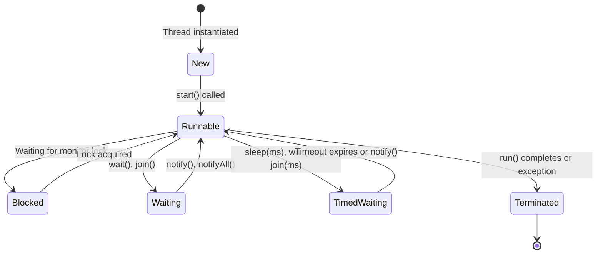
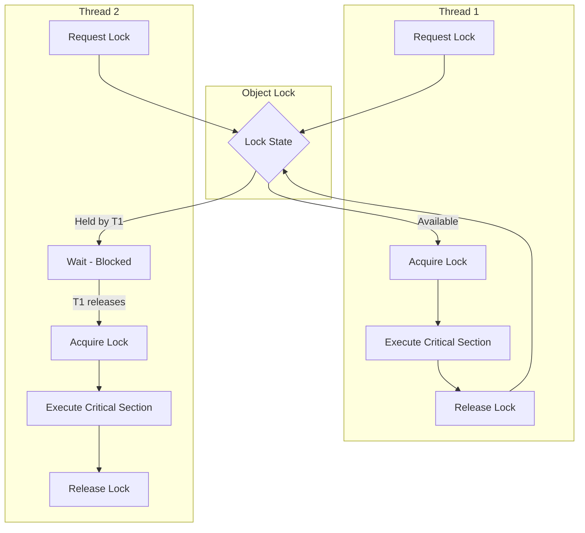

---
tags:
  - "#CCT2"
  - OO
  - Java
  - Programming
Topic: The concept of threading and their life cycle | Creating and managing threads | Design and implementation of threads | Pitfalls and how to avoid the most common ones
Semester: CCT2
Course: Objektorienteret analyse, design og implementering + Java
Litterature:
  - Geekforgeeks - Java Threads
  - Geekforgeeks - Sync. in Java
  - Oracle - Docs
Created:
---
# Table of Contents

1. [[#Java Threads|Java Threads]]
	1. [[#Java Threads#Quick Reference Table|Quick Reference Table]]
	2. [[#Java Threads#Create Threads in Java|Create Threads in Java]]
		1. [[#Create Threads in Java#1. By Extending Thread Class|1. By Extending Thread Class]]
		2. [[#Create Threads in Java#2. Using Runnable Interface|2. Using Runnable Interface]]
	3. [[#Java Threads#Life Cycle of a Thread|Life Cycle of a Thread]]
	4. [[#Java Threads#Running Threads in Java|Running Threads in Java]]
	5. [[#Java Threads#Java Thread Class|Java Thread Class]]
		1. [[#Java Thread Class#Advantages of Threads|Advantages of Threads]]
2. [[#Synchronization in Java|Synchronization in Java]]
	1. [[#Synchronization in Java#Why is Synchronization Needed?|Why is Synchronization Needed?]]
	2. [[#Synchronization in Java#How Synchronization Works|How Synchronization Works]]
	3. [[#Synchronization in Java#Ways to Achieve Synchronization|Ways to Achieve Synchronization]]
		1. [[#Ways to Achieve Synchronization#1. Synchronized Methods|1. Synchronized Methods]]
		2. [[#Ways to Achieve Synchronization#2. Synchronized Blocks|2. Synchronized Blocks]]
		3. [[#Ways to Achieve Synchronization#3. Static Synchronization|3. Static Synchronization]]
	4. [[#Synchronization in Java#Types of Synchronization|Types of Synchronization]]
		1. [[#Types of Synchronization#1. Process Synchronization|1. Process Synchronization]]
		2. [[#Types of Synchronization#2. Thread Synchronization in Java|2. Thread Synchronization in Java]]
	5. [[#Synchronization in Java#Volatile Keyword|Volatile Keyword]]
	6. [[#Synchronization in Java#Volatile vs Synchronized|Volatile vs Synchronized]]
3. [[#Defining and Starting a Thread|Defining and Starting a Thread]]
	1. [[#Defining and Starting a Thread#Two Approaches to Creating Threads|Two Approaches to Creating Threads]]
		1. [[#Two Approaches to Creating Threads#1. Provide a Runnable Object|1. Provide a Runnable Object]]
		2. [[#Two Approaches to Creating Threads#2. Subclass Thread|2. Subclass Thread]]
	2. [[#Defining and Starting a Thread#Which Approach Should You Use?|Which Approach Should You Use?]]
	3. [[#Defining and Starting a Thread#Thread Class Methods|Thread Class Methods]]
4. [[#Common Mistakes in Java Threading|Common Mistakes in Java Threading]]
		1. [[#Thread Class Methods#1. Calling `run()` Instead of `start()`|1. Calling `run()` Instead of `start()`]]
		2. [[#Thread Class Methods#2. Starting a Thread Twice|2. Starting a Thread Twice]]
		3. [[#Thread Class Methods#3. Not Synchronizing Shared Mutable State|3. Not Synchronizing Shared Mutable State]]
		4. [[#Thread Class Methods#4. Using Volatile for Compound Operations|4. Using Volatile for Compound Operations]]
		5. [[#Thread Class Methods#5. Ignoring InterruptedException|5. Ignoring InterruptedException]]
		6. [[#Thread Class Methods#6. Nested Locking Leading to Deadlock|6. Nested Locking Leading to Deadlock]]
		7. [[#Thread Class Methods#7. Not Using `join()` When Needed|7. Not Using `join()` When Needed]]
		8. [[#Thread Class Methods#8. Over-Synchronization|8. Over-Synchronization]]

# Java Threads

## Quick Reference Table

| Concept | Syntax | Description |
|---------|--------|-------------|
| Extend Thread Class | `class MyThread extends Thread` | Create a thread by extending the Thread class |
| Override run() | `public void run() { ... }` | Define the code to execute in the thread |
| Start a Thread | `thread.start()` | Launch a new thread (calls run() internally) |
| Implement Runnable | `class MyTask implements Runnable` | Create a thread task using the Runnable interface |
| Thread with Runnable | `new Thread(runnableObject)` | Pass a Runnable to Thread constructor |
| Call run() directly | `thread.run()` | Execute as normal method (no new thread created) |
| Join threads | `thread.join()` | Wait for a thread to complete execution |
| Synchronized method | `public synchronized void method()` | Allow only one thread to execute method at a time |
| Synchronized block | `synchronized (object) { ... }` | Synchronize specific code section |
| Static synchronization | `synchronized static void method()` | Synchronize on class object (not instance) |
| Volatile variable | `private volatile boolean flag` | Ensure variable visibility across threads |
| Thread.sleep() | `Thread.sleep(milliseconds)` | Pause current thread execution |
| Thread.currentThread() | `Thread.currentThread()` | Get reference to currently executing thread |
| isAlive() | `thread.isAlive()` | Check if thread is still running |

---

>[!info] What is a Java Thread?
>A Java thread is the smallest unit of execution within a program. It is a lightweight subprocess that runs independently but shares the same memory space as the process, allowing multiple tasks to execute concurrently.

---

## Create Threads in Java

There are two main approaches to creating threads in Java, each with specific use cases and trade-offs.

### 1. By Extending Thread Class

>[!info] Extending Thread Class
>To create a thread by extending the Thread class:
>1. Create a class that extends `Thread`
>2. Override the `run()` method with the code the thread should execute
>3. Create an object of your class
>4. Call the `start()` method, which internally calls `run()` in a new thread

>[!example] Step-by-Step: Extending Thread Class
>```java
>// Step 1: Create a class that extends Thread
>class MyThread extends Thread {
>    // Step 2: Override run method for Thread execution
>    public void run() {
>        String str = "Thread Started Running...";
>        System.out.println(str);
>    }
>}
>
>public class Geeks {
>    public static void main(String args[]) {
>        // Step 3: Create an object of your class
>        MyThread t1 = new MyThread();
>        
>        // Step 4: Call start() to launch the thread
>        t1.start(); // Starts the thread
>    }
>}
>```
>
>**Output:**
>```
>Thread Started Running...
>```
>
>**Step-by-Step Breakdown:**
>- **Line 2:** `MyThread` inherits all capabilities of the `Thread` class
>- **Line 4:** The `run()` method defines what executes when the thread runs
>- **Line 12:** Creating a `MyThread` object creates a thread ready to run
>- **Line 13:** `start()` creates a new execution path and invokes `run()` on it

### 2. Using Runnable Interface

>[!info] Implementing Runnable Interface
>To create a thread by implementing the Runnable interface:
>1. Create a class that implements `Runnable`
>2. Override the `run()` method with the code for the thread
>3. Create a `Thread` object, passing your Runnable object to its constructor
>4. Call `start()` on the Thread object

>[!example] Step-by-Step: Implementing Runnable Interface
>```java
>// Step 1: Create a class that implements Runnable
>class MyThread implements Runnable {
>    // Step 2: Override run method to define thread behavior
>    public void run() {
>        String str = "Thread is Running Successfully";
>        System.out.println(str);
>    }
>}
>
>public class Geeks {
>    public static void main(String[] args) {
>        // Step 3: Create your Runnable object
>        MyThread g1 = new MyThread();
>        
>        // Step 4: Create Thread object with Runnable
>        Thread t1 = new Thread(g1);
>        
>        // Step 5: Start the thread
>        t1.start();
>    }
>}
>```
>
>**Output:**
>```
>Thread is Running Successfully
>```
>
>**Step-by-Step Breakdown:**
>- **Line 2:** `MyThread` implements the `Runnable` interface, making it a task that can run in a thread
>- **Line 13:** Creating a `MyThread` object creates the task definition
>- **Line 16:** The `Thread` constructor accepts the task and prepares it for execution
>- **Line 19:** `start()` creates a new thread and executes the `run()` method from `g1`

>[!tip] Choosing Between Thread and Runnable
>**Use `implements Runnable` when:**
>- Your class already extends another class (Java doesn't support multiple inheritance)
>- You want to separate the task from the thread management
>- You need more flexibility (recommended in most cases)
>- You plan to use high-level concurrency APIs (executors, thread pools)
>
>**Use `extends Thread` when:**
>- You're creating a simple application
>- You don't need to extend any other class
>- You want direct access to all Thread class methods without a reference

>[!example] Demonstrating the Flexibility of Runnable
>```java
>// Runnable allows extending another class
>class DataProcessor extends DatabaseConnection implements Runnable {
>    public void run() {
>        // Can access both DatabaseConnection methods
>        // and be run as a thread
>        processData();
>    }
>}
>
>// Thread approach prevents extending other classes
>class DataProcessor extends Thread {
>    // Cannot extend DatabaseConnection here!
>    public void run() {
>        processData();
>    }
>}
>```

---

## Life Cycle of a Thread

>[!info] Thread States
>During its life cycle, a Java thread transitions through several states from creation to termination:
>
>- **New State** - Thread is created but not yet started (after instantiation, before `start()`)
>- **Runnable State** - Thread is ready to run or currently running (after `start()` is called)
>- **Blocked State** - Thread is blocked waiting for a monitor lock to enter a synchronized block/method
>- **Waiting State** - Thread is waiting indefinitely for another thread to perform a specific action
>- **Timed Waiting State** - Thread is waiting for a specified period (e.g., `Thread.sleep()`)
>- **Terminated State** - Thread has completed execution or was stopped



_Figure 1.1: Thread life cycle state diagram showing all possible state transitions. A thread begins in the New state upon creation and ends in the Terminated state when execution completes._

>[!example] Thread State Transitions in Code
>```java
>Thread t = new Thread(() -> {
>    synchronized(lock) {        // May enter BLOCKED state if lock unavailable
>        try {
>            lock.wait();        // Enters WAITING state
>            Thread.sleep(1000); // Enters TIMED_WAITING state
>        } catch (InterruptedException e) {
>            e.printStackTrace();
>        }
>    }
>});  // Thread is now in NEW state
>
>t.start();  // Transitions to RUNNABLE state
>// Eventually reaches TERMINATED state when run() completes
>```

---

## Running Threads in Java

>[!important] `start()` vs `run()` Methods
>There are two methods used for running threads in Java:
>
>- **`run()` Method** - Contains the code for the thread. Calling it directly behaves like a normal method call (no new thread is created)
>- **`start()` Method** - Launches a new thread and internally calls `run()` concurrently
>
>**Always use `start()` to launch a new thread.** If you call `run()` directly, it executes in the current thread, defeating the purpose of multithreading.

>[!warning] Common Pitfall: Calling run() Instead of start()
>One of the most common mistakes is calling `run()` directly instead of `start()`. This does **not** create a new thread—the code executes sequentially in the calling thread.
>
>```java
>MyThread t = new MyThread();
>t.run();   // WRONG: Executes in main thread, no concurrency!
>t.start(); // CORRECT: Creates new thread, executes concurrently
>```

>[!example] Demonstrating start() vs run()
>```java
>class MyThread extends Thread {
>    public void run() {
>        System.out.println("Thread: " + Thread.currentThread().getName());
>    }
>}
>
>public class Demo {
>    public static void main(String[] args) {
>        MyThread t1 = new MyThread();
>        MyThread t2 = new MyThread();
>        
>        // Correct: Creates new thread
>        t1.start();
>        
>        // Wrong: Executes in main thread
>        t2.run();
>        
>        System.out.println("Main thread: " + Thread.currentThread().getName());
>    }
>}
>```
>
>**Output:**
>```
>Thread: Thread-0
>Thread: main
>Main thread: main
>```
>
>**Explanation:** Notice that `t1.start()` creates a new thread ("Thread-0"), while `t2.run()` executes in the main thread. The `run()` method is just a normal method call when invoked directly.

>[!warning] Common Pitfall: Starting a Thread Twice
>A thread can only be started **once**. Calling `start()` on an already-started thread throws an `IllegalThreadStateException`.
>
>```java
>Thread t = new Thread(() -> System.out.println("Running"));
>t.start();  // OK - thread starts
>t.start();  // EXCEPTION: IllegalThreadStateException
>```
>
>If you need to run the same task again, create a new `Thread` object.

>[!example] Using Thread Class and Runnable Interface
>```java
>// Thread class implementation
>class ThreadImpl extends Thread {
>    @Override
>    public void run() {
>        System.out.println("Thread Class Running");
>    }
>}
>
>// Runnable interface implementation
>class RunnableThread implements Runnable {
>    @Override
>    public void run() {
>        System.out.println("Runnable Thread Running");
>    }
>}
>
>public class Geeks {
>    public static void main(String[] args) {
>        // Create and start Thread class thread
>        ThreadImpl t1 = new ThreadImpl();
>        t1.start();
>
>        // Create and start Runnable interface thread
>        RunnableThread r = new RunnableThread();
>        Thread t2 = new Thread(r);
>        t2.start();
>
>        // Wait for both threads to complete
>        try {
>            t1.join(); // Wait for t1 to finish
>            t2.join(); // Wait for t2 to finish
>        } catch (InterruptedException e) {
>            e.printStackTrace();
>        }
>    }
>}
>```
>
>**Output:**
>```
>Thread Class Running
>Runnable Thread Running
>```
>
>**Explanation:** This example demonstrates both approaches side-by-side. The `join()` method ensures the main thread waits for both threads to complete before the program exits. Without `join()`, the main thread might terminate before the child threads finish execution.

---

## Java Thread Class

>[!info] Thread Class Definition
>The Thread class is used to create and control threads in Java. Each object of this class represents a single thread of execution.
>
>```java
>public class Thread extends Object implements Runnable
>```
>
>**Key characteristics:**
>- Extends `Object` (the root of Java's class hierarchy)
>- Implements `Runnable` interface
>- Provides methods for thread creation, control, and management

### Advantages of Threads

>[!abstract] Why Use Threads?
>Threads provide several key benefits for application development:
>
>- **Improved Performance** - Multiple threads can execute tasks concurrently, utilizing multiple CPU cores
>- **Better Resource Utilization** - Threads share the same memory space and resources, reducing overhead compared to separate processes
>- **Responsive Applications** - UI applications remain responsive while performing background tasks (e.g., loading data while user interacts with interface)
>- **Simplified Program Structure** - Complex tasks can be broken into smaller, concurrent operations that are easier to understand and maintain

>[!example] Practical Threading Scenario
>**Without Threading (Sequential Execution):**
>```
>Download file (5 seconds) → Process data (3 seconds) → Update UI (1 second)
>Total time: 9 seconds (UI frozen throughout)
>User Experience: Application appears unresponsive
>```
>
>**With Threading (Concurrent Execution):**
>```
>Thread 1: Download file (5 seconds)
>Thread 2: Process data (starts when download completes, 3 seconds)  
>Main Thread: UI remains responsive (can update immediately, handle user input)
>Total time: ~5-8 seconds with responsive UI
>User Experience: Application remains interactive
>```

---

# Synchronization in Java

>[!info] What is Synchronization?
>Synchronization in Java is a mechanism that ensures that only one thread can access a shared resource (like a variable, object, or method) at a time. It prevents concurrent threads from interfering with each other while modifying shared data, maintaining data integrity and consistency.

## Why is Synchronization Needed?

>[!important] Critical Need for Synchronization
>Synchronization addresses fundamental concurrency challenges:
>
>- **Prevents Data Inconsistency** - Ensures that multiple threads don't corrupt shared data when accessing it simultaneously
>- **Avoids Race Conditions** - Allows only one thread to execute a critical section at a time, maintaining predictable results
>- **Maintains Thread Safety** - Protects shared resources from concurrent modification by multiple threads
>- **Ensures Data Integrity** - Keeps shared data accurate and consistent throughout program execution

>[!example] Race Condition Without Synchronization
>```java
>class UnsafeCounter {
>    private int count = 0;
>
>    // NOT thread-safe!
>    public void increment() {
>        count++; // This is actually three operations:
>                 // 1. Read current value of count
>                 // 2. Add 1 to the value
>                 // 3. Write new value back to count
>    }
>}
>```
>
>**Problem Scenario:**
>```
>Initial: count = 0
>
>Thread 1: Reads count (0) → Adds 1 → Gets interrupted before writing
>Thread 2: Reads count (0) → Adds 1 → Writes 1
>Thread 1: Resumes → Writes 1
>
>Expected: count = 2 (two increments)
>Actual: count = 1 (one increment lost!)
>```
>
>**Explanation:** The `count++` operation is not atomic. When $2$ threads execute it simultaneously, they can both read the same initial value, increment it, and write back the same result, causing one increment to be lost.

---

## How Synchronization Works

When a thread enters a synchronized method or block, it must first acquire the **intrinsic lock** (also called the **monitor**) associated with the object. Other threads attempting to acquire the same lock are blocked until the lock is released.



_Figure 2.1: Synchronization flow diagram showing how two threads compete for a shared lock. Thread 2 must wait in a blocked state while Thread 1 holds the lock._

---

## Ways to Achieve Synchronization

### 1. Synchronized Methods

>[!info] Synchronized Method
>A synchronized method ensures that only one thread can execute it at a time on the same object instance. The entire method is locked, and the intrinsic lock (monitor) of the object is acquired before execution begins.

>[!example] Step-by-Step: Synchronized Methods
>```java
>class Counter {
>    private int c = 0; // Shared variable
>
>    // Synchronized method to increment counter
>    public synchronized void inc() {
>        c++; // Only one thread can execute this at a time
>    }
>
>    // Synchronized method to get counter value
>    public synchronized int get() {
>        return c;
>    }
>}
>
>public class Geeks {
>    public static void main(String[] args) {
>        Counter cnt = new Counter(); // Shared resource
>
>        // Thread 1: Increments 1000 times
>        Thread t1 = new Thread(() -> {
>            for (int i = 0; i < 1000; i++)
>                cnt.inc();
>        });
>
>        // Thread 2: Increments 1000 times
>        Thread t2 = new Thread(() -> {
>            for (int i = 0; i < 1000; i++)
>                cnt.inc();
>        });
>
>        t1.start();
>        t2.start();
>
>        try {
>            t1.join(); // Wait for t1 to complete
>            t2.join(); // Wait for t2 to complete
>        } catch (InterruptedException e) {
>            e.printStackTrace();
>        }
>
>        System.out.println("Counter: " + cnt.get());
>    }
>}
>```
>
>**Output:**
>```
>Counter: 2000
>```
>
>**Step-by-Step Execution:**
>1. Both threads attempt to call `inc()` simultaneously
>2. One thread (say $t_1$) acquires the lock on the `cnt` object
>3. The other thread ($t_2$) waits (enters blocked state) until the lock is released
>4. $t_1$ increments $c$ and releases the lock when method completes
>5. $t_2$ acquires the lock and increments $c$
>6. This process repeats $2000$ times total
>7. Final result is always $2000$ (never less due to race conditions being prevented)

### 2. Synchronized Blocks

>[!info] Synchronized Block
>Instead of synchronizing an entire method, Java allows synchronization on specific blocks of code. This improves performance by locking only the necessary section, reducing the time a thread holds the lock and allowing non-critical code to execute concurrently.

>[!example] Step-by-Step: Synchronized Blocks
>```java
>class Counter {
>    private int c = 0;
>
>    public void inc() {
>        // Non-critical code can execute without lock
>        // (e.g., logging, validation, etc.)
>        
>        // Synchronize only this critical block
>        synchronized (this) {
>            c++; // Only this operation is locked
>        }
>        
>        // More non-critical code could go here
>    }
>
>    public int get() {
>        return c;
>    }
>}
>
>public class Geeks {
>    public static void main(String[] args) throws InterruptedException {
>        Counter cnt = new Counter();
>
>        Thread t1 = new Thread(() -> {
>            for (int i = 0; i < 1000; i++)
>                cnt.inc();
>        });
>
>        Thread t2 = new Thread(() -> {
>            for (int i = 0; i < 1000; i++)
>                cnt.inc();
>        });
>
>        t1.start();
>        t2.start();
>        t1.join();
>        t2.join();
>
>        System.out.println("Counter: " + cnt.get());
>    }
>}
>```
>
>**Output:**
>```
>Counter: 2000
>```
>
>**Explanation:** The synchronized block uses `this` as the lock object (the current Counter instance). Only the increment operation $c$++ is synchronized, allowing better performance if there were other non-critical operations in the method. The syntax `synchronized (this)` means "acquire the lock on the current object instance."

>[!tip] When to Use Synchronized Blocks vs Methods
>**Use synchronized blocks when:**
>- Only part of a method needs synchronization
>- You want to minimize lock holding time for better performance
>- You need to lock on a different object than `this` (e.g., a specific field)
>- The method has long-running operations that don't need synchronization
>
>**Use synchronized methods when:**
>- The entire method body needs synchronization
>- Code simplicity is more important than granular locking
>- You're locking on the current instance (`this`)
>- The method is short and entirely critical

>[!example] Advanced: Synchronizing on Different Objects
>```java
>class BankAccount {
>    private double balance = 1000;
>    private final Object balanceLock = new Object();
>    private String accountHolder = "John Doe";
>    private final Object holderLock = new Object();
>    
>    public void deposit(double amount) {
>        synchronized(balanceLock) {  // Lock only for balance
>            balance += amount;
>        }
>    }
>    
>    public void updateHolder(String name) {
>        synchronized(holderLock) {  // Different lock for holder
>            accountHolder = name;
>        }
>    }
>}
>```
>
>**Explanation:** Using separate lock objects allows $2$ threads to modify different parts of the object simultaneously (one updating balance, another updating holder), improving concurrency while maintaining thread safety.

### 3. Static Synchronization

>[!info] Static Synchronization
>Static synchronization is used to synchronize static methods. In this case, the lock is placed on the **class object** (e.g., `Table.class`) rather than an instance of the class. This means all threads calling any static synchronized method of that class will compete for the same class-level lock.

>[!example] Step-by-Step: Static Synchronization
>```java
>class Table {
>    // Static synchronized method locks on Table.class
>    synchronized static void printTable(int n) {
>        for (int i = 1; i <= 3; i++) {
>            System.out.println(n * i);
>            try {
>                Thread.sleep(100); // Simulate some work
>            } catch (Exception e) {
>                System.out.println(e);
>            }
>        }
>    }
>}
>
>class Thread1 extends Thread {
>    public void run() {
>        Table.printTable(1); // Thread 1 prints table of 1
>    }
>}
>
>class Thread2 extends Thread {
>    public void run() {
>        Table.printTable(10); // Thread 2 prints table of 10
>    }
>}
>
>public class GFG {
>    public static void main(String[] args) {
>        Thread1 t1 = new Thread1();
>        Thread2 t2 = new Thread2();
>        t1.start();
>        t2.start();
>    }
>}
>```
>
>**Output:**
>```
>1
>2
>3
>10
>20
>30
>```
>
>**Step-by-Step Execution:**
>1. Both threads start and attempt to call `printTable()`
>2. One thread (say $t_1$) acquires the lock on `Table.class`
>3. $t_1$ prints: $1, 2, 3$ (completely finishes its table)
>4. $t_1$ releases the lock on `Table.class`
>5. $t_2$ acquires the lock and prints: $10, 20, 30$
>6. The outputs never interleave because of the class-level lock

>[!important] Class Lock vs Instance Lock
>**Static Synchronization (Class Lock):**
>- Lock is on the `Class` object (e.g., `Table.class`)
>- All threads calling any static synchronized method of that class compete for the same lock
>- Works even when no object instance exists
>- Only one thread can execute any static synchronized method of that class at a time
>
>**Instance Synchronization (Instance Lock):**
>- Lock is on the specific object instance (`this`)
>- Threads calling methods on different objects don't compete for locks (each object has its own lock)
>- Requires an object instance to work
>- Multiple threads can execute the method simultaneously if using different object instances

>[!example] Class Lock vs Instance Lock Comparison
>```java
>class Example {
>    // Instance method - locks on 'this' (object instance)
>    public synchronized void instanceMethod() {
>        // Code here
>    }
>    
>    // Static method - locks on Example.class
>    public static synchronized void staticMethod() {
>        // Code here
>    }
>}
>
>// Usage:
>Example obj1 = new Example();
>Example obj2 = new Example();
>
>// These can run simultaneously (different locks)
>Thread t1 = new Thread(() -> obj1.instanceMethod());
>Thread t2 = new Thread(() -> obj2.instanceMethod());
>
>// These cannot run simultaneously (same class lock)
>Thread t3 = new Thread(() -> Example.staticMethod());
>Thread t4 = new Thread(() -> Example.staticMethod());
>```

---

## Types of Synchronization

There are two types of synchronizations in Java:

### 1. Process Synchronization

>[!info] Process Synchronization
>Process Synchronization is a technique used to coordinate the execution of multiple processes or threads. It ensures that shared resources are accessed safely and in order, preventing data corruption and inconsistencies when multiple execution units interact with common data.

>[!example] Process Synchronization: Bank Account Operations
>```java
>class BankAccount {
>    private int balance = 1000; // Shared resource (bank balance)
>
>    // Synchronized method for deposit operation
>    public synchronized void deposit(int amount) {
>        balance += amount;
>        System.out.println("Deposited: " + amount + ", Balance: " + balance);
>    }
>
>    // Synchronized method for withdrawal operation
>    public synchronized void withdraw(int amount) {
>        if (balance >= amount) {
>            balance -= amount;
>            System.out.println("Withdrawn: " + amount + ", Balance: " + balance);
>        } else {
>            System.out.println("Insufficient balance to withdraw: " + amount);
>        }
>    }
>
>    public int getBalance() {
>        return balance;
>    }
>}
>
>public class Geeks {
>    public static void main(String[] args) {
>        BankAccount account = new BankAccount(); // Shared resource
>
>        // Thread 1 to deposit money into the account
>        Thread t1 = new Thread(() -> {
>            for (int i = 0; i < 3; i++) {
>                account.deposit(200);
>                try {
>                    Thread.sleep(50); // Simulate some delay
>                } catch (InterruptedException e) {
>                    e.printStackTrace();
>                }
>            }
>        });
>
>        // Thread 2 to withdraw money from the account
>        Thread t2 = new Thread(() -> {
>            for (int i = 0; i < 3; i++) {
>                account.withdraw(100);
>                try {
>                    Thread.sleep(100); // Simulate some delay
>                } catch (InterruptedException e) {
>                    e.printStackTrace();
>                }
>            }
>        });
>
>        // Start both threads
>        t1.start();
>        t2.start();
>
>        // Wait for threads to finish
>        try {
>            t1.join();
>            t2.join();
>        } catch (InterruptedException e) {
>            e.printStackTrace();
>        }
>
>        // Print final balance
>        System.out.println("Final Balance: " + account.getBalance());
>    }
>}
>```
>
>**Output:**
>```
>Deposited: 200, Balance: 1200
>Withdrawn: 100, Balance: 1100
>Deposited: 200, Balance: 1300
>Deposited: 200, Balance: 1500
>Withdrawn: 100, Balance: 1400
>Withdrawn: 100, Balance: 1300
>Final Balance: 1300
>```
>
>**Execution Flow:**
>1. Initial balance: $1000$
>2. $t_1$ deposits $200$ → Balance: $1200$
>3. $t_2$ withdraws $100$ → Balance: $1100$
>4. $t_1$ deposits $200$ → Balance: $1300$
>5. $t_1$ deposits $200$ → Balance: $1500$
>6. $t_2$ withdraws $100$ → Balance: $1400$
>7. $t_2$ withdraws $100$ → Balance: $1300$
>
>**Why Synchronization Matters:** The synchronized methods prevent race conditions where a withdrawal might read the balance while a deposit is in progress. Without synchronization, the following could occur:
>```
>Thread 1: Reads balance (1000) for deposit
>Thread 2: Reads balance (1000) for withdrawal
>Thread 1: Adds 200, writes 1200
>Thread 2: Subtracts 100 from its read value (1000), writes 900
>Result: Balance is 900 instead of 1100 (deposit lost!)
>```

### 2. Thread Synchronization in Java

>[!info] Thread Synchronization Types
>Thread Synchronization is used to coordinate and order the execution of threads in a multi-threaded program. There are two types:
>
>- **Mutual Exclusion** - Only one thread can access the shared resource at a time (covered in synchronized methods/blocks above)
>- **Cooperation (Inter-thread Communication)** - Threads coordinate with each other using methods like `wait()`, `notify()`, and `notifyAll()` to signal state changes

>[!example] Thread Synchronization: Ticket Booking System
>```java
>class TicketBooking {
>    private int availableTickets = 10; // Shared resource (available tickets)
>
>    // Synchronized method for booking tickets
>    public synchronized void bookTicket(int tickets) {
>        if (availableTickets >= tickets) {
>            availableTickets -= tickets;
>            System.out.println("Booked " + tickets + 
>                " tickets, Remaining tickets: " + availableTickets);
>        } else {
>            System.out.println("Not enough tickets available to book " + tickets);
>        }
>    }
>
>    public int getAvailableTickets() {
>        return availableTickets;
>    }
>}
>
>public class Geeks {
>    public static void main(String[] args) {
>        TicketBooking booking = new TicketBooking(); // Shared resource
>
>        // Thread 1 to book tickets
>        Thread t1 = new Thread(() -> {
>            for (int i = 0; i < 2; i++) {
>                booking.bookTicket(2); // Trying to book 2 tickets each time
>                try {
>                    Thread.sleep(50); // Simulate delay
>                } catch (InterruptedException e) {
>                    e.printStackTrace();
>                }
>            }
>        });
>
>        // Thread 2 to book tickets
>        Thread t2 = new Thread(() -> {
>            for (int i = 0; i < 2; i++) {
>                booking.bookTicket(3); // Trying to book 3 tickets each time
>                try {
>                    Thread.sleep(40); // Simulate delay
>                } catch (InterruptedException e) {
>                    e.printStackTrace();
>                }
>            }
>        });
>
>        // Start both threads
>        t1.start();
>        t2.start();
>
>        // Wait for threads to finish
>        try {
>            t1.join();
>            t2.join();
>        } catch (InterruptedException e) {
>            e.printStackTrace();
>        }
>
>        // Print final remaining tickets
>        System.out.println("Final Available Tickets: " + 
>            booking.getAvailableTickets());
>    }
>}
>```
>
>**Output:**
>```
>Booked 2 tickets, Remaining tickets: 8
>Booked 3 tickets, Remaining tickets: 5
>Booked 3 tickets, Remaining tickets: 2
>Booked 2 tickets, Remaining tickets: 0
>Final Available Tickets: 0
>```
>
>**Execution Analysis:**
>1. Start: $10$ tickets available
>2. $t_1$ books $2$ → $8$ remaining
>3. $t_2$ books $3$ → $5$ remaining
>4. $t_2$ books $3$ → $2$ remaining
>5. $t_1$ books $2$ → $0$ remaining
>
>**Why Synchronization Prevents Overbooking:** The synchronized `bookTicket()` method ensures that only one thread checks availability and books tickets at a time. Without synchronization:
>```
>Thread 1: Reads availableTickets (10), checks if >= 8
>Thread 2: Reads availableTickets (10), checks if >= 8
>Thread 1: Books 8 tickets, sets availableTickets = 2
>Thread 2: Books 8 tickets, sets availableTickets = 2 (should be -6!)
>Result: 16 tickets booked when only 10 existed (overbooking!)
>```

>[!warning] Common Pitfall: Deadlock
>**Deadlock** occurs when $2$ or more threads are blocked forever, each waiting for a lock held by the other. This typically happens with nested synchronization.
>
>```java
>// Deadlock example - DON'T DO THIS
>class Account {
>    synchronized void transfer(Account target, int amount) {
>        synchronized(target) {  // Nested lock
>            this.balance -= amount;
>            target.balance += amount;
>        }
>    }
>}
>
>// Thread 1: account1.transfer(account2, 100)
>// Thread 2: account2.transfer(account1, 50)
>// Both threads wait for each other's lock forever!
>```
>
>**Prevention strategies:**
>- Always acquire locks in the same order across all threads
>- Use `tryLock()` with timeout (from `java.util.concurrent.locks`)
>- Minimize nested locking
>- Use higher-level concurrency utilities like `ExecutorService`

---

## Volatile Keyword

>[!info] The Volatile Modifier
>The `volatile` keyword in Java ensures that all threads have a consistent view of a variable's value. It prevents caching of the variable's value by individual threads, ensuring that updates to the variable are immediately visible to other threads by forcing all reads/writes to go directly to main memory.
>
>**Key characteristics:**
>- Applies only to variables (not methods or classes)
>- Guarantees **visibility** - any write to a volatile variable is immediately visible to other threads
>- Does **not** guarantee **atomicity** - operations like $count$++ (read-modify-write) can still result in race conditions
>- Prevents compiler optimizations that might cache the variable value in CPU registers

>[!warning] Volatile Does NOT Guarantee Atomicity
>The `volatile` keyword does **not** provide atomicity. For example:
>```java
>private volatile int count = 0;
>
>public void increment() {
>    count++; // NOT ATOMIC! Still has race condition
>}
>```
>
>The $count$++ operation consists of $3$ steps:
>1. Read current value from memory
>2. Add $1$ to the value
>3. Write new value back to memory
>
>Even with `volatile`, $2$ threads can read the same value before either writes, causing lost updates. Use `synchronized` or `AtomicInteger` for atomic operations.

>[!example] Step-by-Step: Volatile Keyword
>```java
>class Counter {
>    // volatile ensures all threads see the latest value
>    private volatile boolean running = true;
>
>    public void stop() {
>        running = false; // Update immediately visible to other threads
>    }
>
>    public void start() {
>        new Thread(() -> {
>            while (running) { // Reads latest value every iteration
>                System.out.println("Running...");
>                try {
>                    Thread.sleep(200);
>                } catch (InterruptedException e) {
>                    Thread.currentThread().interrupt();
>                }
>            }
>            System.out.println("Stopped.");
>        }).start();
>    }
>}
>
>public class Geeks {
>    public static void main(String[] args) throws InterruptedException {
>        Counter counter = new Counter();
>        counter.start(); // Start the thread
>
>        Thread.sleep(600); // Let it run briefly
>        counter.stop();    // Then stop the thread
>    }
>}
>```
>
>**Output:**
>```
>Running...
>Running...
>Running...
>Stopped.
>```
>
>**Without `volatile` - Potential Problem:**
>```
>Worker Thread: Reads running = true, caches it in CPU register
>Worker Thread: Checks cached value in loop (always true)
>Main Thread: Sets running = false in main memory
>Worker Thread: Never sees the update, loops forever!
>```
>
>**With `volatile` - Correct Behavior:**
>```
>Worker Thread: Always reads running from main memory (no caching)
>Main Thread: Sets running = false in main memory
>Worker Thread: Sees the update on next loop iteration, exits loop
>```

>[!example] When Volatile is Sufficient
>```java
>class StatusFlag {
>    private volatile boolean ready = false;
>    
>    // Thread 1: Producer
>    public void prepareData() {
>        // Do some work
>        processData();
>        ready = true;  // Simple write - volatile is enough
>    }
>    
>    // Thread 2: Consumer
>    public void useData() {
>        while (!ready) {  // Simple read - volatile ensures visibility
>            // Wait
>        }
>        consumeData();
>    }
>}
>```
>
>**Explanation:** Volatile is perfect for simple flags because we only need visibility (ensure all threads see the latest value). No complex operations like increment/decrement are involved.

---

## Volatile vs Synchronized

| **Feature** | **Synchronized** | **Volatile** |
|---|---|---|
| **Applies to** | Blocks or methods | Variables only |
| **Purpose** | Ensures mutual exclusion and visibility | Ensures visibility of changes to variables across threads |
| **Atomicity** | Guarantees atomic execution of code blocks | Does NOT guarantee atomicity of operations |
| **Performance** | Relatively lower (lock acquisition/release overhead) | Relatively higher (no locking overhead) |
| **Use Case** | When multiple operations need to be atomic together | When only visibility matters (e.g., flags, status variables) |
| **Thread Blocking** | Threads may block waiting for lock | Threads never block (always reads/writes immediately) |
| **Memory Semantics** | Full memory barrier (flush all cached values) | Memory barrier only for the volatile variable |
| **Compound Operations** | Safe for operations like $count$++ | NOT safe for operations like $count$++ |

_Table 2.1: Comparison of synchronized and volatile mechanisms for thread safety in Java._

>[!example] When to Use Each
>**Use `synchronized`:**
>```java
>// Multiple operations must be atomic together
>public synchronized void transfer(Account from, Account to, int amount) {
>    from.withdraw(amount);  // These two operations
>    to.deposit(amount);      // must happen together atomically
>}
>
>// Compound operation (read-modify-write)
>public synchronized void increment() {
>    count++;  // Read, add, write - needs synchronization
>}
>```
>
>**Use `volatile`:**
>```java
>// Simple flag update (single write)
>private volatile boolean shutdownRequested = false;
>
>public void shutdown() {
>    shutdownRequested = true; // Simple assignment - volatile is enough
>}
>
>public void run() {
>    while (!shutdownRequested) { // Just reading a flag
>        doWork();
>    }
>}
>
>// Status variable (single read/write)
>private volatile int status = READY;
>
>public void updateStatus(int newStatus) {
>    status = newStatus;  // Single write - volatile sufficient
>}
>```

---

# Defining and Starting a Thread

An application that creates an instance of `Thread` must provide the code that will run in that thread. There are two fundamental approaches to accomplish this, each with specific advantages and use cases.

## Two Approaches to Creating Threads

### 1. Provide a Runnable Object

>[!info] Runnable Interface Approach
>The `Runnable` interface defines a single method, `run()`, meant to contain the code executed in the thread. The `Runnable` object is passed to the `Thread` constructor, separating the task (what to run) from the execution mechanism (how to run it).

>[!example] Using Runnable Interface
>```java
>public class HelloRunnable implements Runnable {
>
>    public void run() {
>        System.out.println("Hello from a thread!");
>    }
>
>    public static void main(String args[]) {
>        // Create Runnable, wrap in Thread, and start
>        (new Thread(new HelloRunnable())).start();
>    }
>}
>```
>
>**Output:**
>```
>Hello from a thread!
>```
>
>**Breakdown:**
>- `HelloRunnable` implements `Runnable`, defining the task
>- `new HelloRunnable()` creates the task object
>- `new Thread(...)` wraps the task in a Thread object
>- `.start()` launches the thread, which internally calls `run()`

### 2. Subclass Thread

>[!info] Thread Subclass Approach
>The `Thread` class itself implements `Runnable`, though its `run()` method does nothing by default. An application can subclass `Thread`, providing its own implementation of `run()` to define the thread's behavior.

>[!example] Subclassing Thread
>```java
>public class HelloThread extends Thread {
>
>    public void run() {
>        System.out.println("Hello from a thread!");
>    }
>
>    public static void main(String args[]) {
>        // Create and start the thread
>        (new HelloThread()).start();
>    }
>}
>```
>
>**Output:**
>```
>Hello from a thread!
>```
>
>**Breakdown:**
>- `HelloThread` extends `Thread` and overrides `run()`
>- `new HelloThread()` creates the thread object with custom behavior
>- `.start()` launches the thread

>[!important] Starting the Thread
>Notice that both examples invoke `Thread.start()` to start the new thread. **Never call `run()` directly** - it will execute in the current thread as a normal method call, not create a new thread of execution.

---

## Which Approach Should You Use?

>[!tip] Recommended Approach: Use Runnable
>The **first idiom** (employing a `Runnable` object) is more general and flexible:
>
>**Advantages of Runnable:**
>- Your task class can extend another class (Java doesn't support multiple inheritance)
>- Separates the task (what to run) from the execution mechanism (how to run it)
>- More flexible for use with thread pools and executor services
>- Applicable to high-level thread management APIs (e.g., `ExecutorService`, `ForkJoinPool`)
>- Better object-oriented design (composition over inheritance)
>
>**When to use Thread subclass:**
>- Simple applications where you don't need to extend another class
>- When you need direct access to Thread methods without keeping a separate reference
>- Limited by the fact that your class must be a Thread descendant (cannot extend other classes)

>[!example] Flexibility of Runnable
>```java
>// Runnable: Can extend another class AND be a task
>class DataProcessor extends DatabaseConnection implements Runnable {
>    public void run() {
>        // Can access DatabaseConnection methods
>        // AND be run as a thread
>        connect();
>        processData();
>        disconnect();
>    }
>}
>
>// Thread: Cannot extend another class
>class DataProcessor extends Thread {
>    // Cannot extend DatabaseConnection here!
>    // Java doesn't support multiple inheritance
>    public void run() {
>        processData();
>    }
>}
>```

>[!example] Runnable with Executors (Advanced Usage)
>```java
>// Runnable works seamlessly with modern APIs
>ExecutorService executor = Executors.newFixedThreadPool(5);
>
>Runnable task = new MyTask();
>executor.submit(task);  // Can reuse the same Runnable
>executor.submit(task);  // Multiple times
>
>// Thread subclass doesn't work as cleanly
>Thread thread = new MyThread();
>thread.start();  // Can only start once!
>// thread.start();  // IllegalThreadStateException!
>```

---

## Thread Class Methods

>[!info] Thread Management Methods
>The `Thread` class defines numerous methods useful for thread management. These methods fall into two categories:
>
>**Static methods** - Provide information about, or affect the status of, the thread invoking the method:
>- `Thread.currentThread()` - Returns reference to currently executing thread
>- `Thread.sleep(milliseconds)` - Pauses current thread execution for specified time
>- `Thread.yield()` - Hints to scheduler to give other threads a chance to run
>
>**Instance methods** - Invoked from other threads to manage specific Thread objects:
>- `start()` - Begins execution of the thread
>- `join()` - Waits for a thread to complete (blocks calling thread)
>- `join(milliseconds)` - Waits for a thread to complete with timeout
>- `interrupt()` - Interrupts a thread (sets interrupt flag)
>- `isAlive()` - Checks if thread is still running
>- `setName(String)` / `getName()` - Set/get thread name for identification
>- `setPriority(int)` / `getPriority()` - Set/get thread priority ($1$-$10$)
>- `isDaemon()` / `setDaemon(boolean)` - Check/set daemon status

>[!example] Common Thread Methods in Action
>```java
>public class ThreadMethodsDemo {
>    public static void main(String[] args) throws InterruptedException {
>        // Create a worker thread
>        Thread worker = new Thread(() -> {
>            System.out.println("Worker thread: " + 
>                Thread.currentThread().getName());
>            try {
>                Thread.sleep(1000); // Sleep for 1 second
>            } catch (InterruptedException e) {
>                System.out.println("Worker interrupted!");
>            }
>            System.out.println("Worker finished");
>        });
>        
>        // Set thread properties before starting
>        worker.setName("MyWorkerThread");
>        worker.setPriority(Thread.MAX_PRIORITY);
>        
>        System.out.println("Starting worker...");
>        worker.start();
>        
>        // Check if thread is alive
>        System.out.println("Worker is alive: " + worker.isAlive());
>        
>        // Wait for worker to complete
>        worker.join(); // Main thread blocks here
>        
>        System.out.println("Worker is alive: " + worker.isAlive());
>        System.out.println("Main thread finished");
>    }
>}
>```
>
>**Output:**
>```
>Starting worker...
>Worker is alive: true
>Worker thread: MyWorkerThread
>Worker finished
>Worker is alive: false
>Main thread finished
>```
>
>**Explanation:**
>- `setName()` gives the thread an identifiable name (useful for debugging)
>- `start()` begins thread execution
>- `isAlive()` returns `true` while thread is running, `false` after completion
>- `join()` makes the main thread wait until the worker completes
>- Without `join()`, main might finish before worker prints "Worker finished"

>[!example] Thread Interruption
>```java
>public class InterruptDemo {
>    public static void main(String[] args) throws InterruptedException {
>        Thread worker = new Thread(() -> {
>            try {
>                while (!Thread.currentThread().isInterrupted()) {
>                    System.out.println("Working...");
>                    Thread.sleep(500);
>                }
>            } catch (InterruptedException e) {
>                System.out.println("Interrupted during sleep!");
>            }
>            System.out.println("Cleaning up and exiting");
>        });
>        
>        worker.start();
>        Thread.sleep(1500); // Let it work for a bit
>        worker.interrupt(); // Signal it to stop
>        worker.join();      // Wait for cleanup
>    }
>}
>```
>
>**Output:**
>```
>Working...
>Working...
>Working...
>Interrupted during sleep!
>Cleaning up and exiting
>```
>
>**Explanation:** The `interrupt()` method sets the thread's interrupt flag and throws `InterruptedException` if the thread is sleeping/waiting. This provides a cooperative mechanism for stopping threads gracefully.

---

# Common Mistakes in Java Threading

>[!warning] Summary of Common Threading Pitfalls
>Avoid these frequently encountered errors when working with Java threads:

### 1. Calling `run()` Instead of `start()`

```java
// WRONG - No new thread created
Thread t = new Thread(() -> doWork());
t.run();  // Executes in current thread sequentially

// CORRECT - New thread created
t.start();  // Executes concurrently in new thread
```

**Impact:** Code appears to work but runs sequentially, eliminating all benefits of multithreading.

---

### 2. Starting a Thread Twice

```java
Thread t = new Thread(() -> doWork());
t.start();  // OK
t.start();  // EXCEPTION: IllegalThreadStateException
```

**Solution:** Create a new `Thread` object for each execution, or use `ExecutorService` for task reuse.

---

### 3. Not Synchronizing Shared Mutable State

```java
// WRONG - Race condition
private int counter = 0;
public void increment() { counter++; }

// CORRECT - Thread-safe
private int counter = 0;
public synchronized void increment() { counter++; }
// OR use AtomicInteger
private AtomicInteger counter = new AtomicInteger(0);
```

**Impact:** Lost updates, corrupted data, unpredictable behavior.

---

### 4. Using Volatile for Compound Operations

```java
// WRONG - volatile doesn't make this atomic
private volatile int count = 0;
public void increment() { count++; }  // Still has race condition!

// CORRECT - Use synchronization
public synchronized void increment() { count++; }
```

**Impact:** Race conditions despite using `volatile`.

---

### 5. Ignoring InterruptedException

```java
// WRONG - Swallowing the exception
try {
    Thread.sleep(1000);
} catch (InterruptedException e) {
    // Empty catch block - BAD!
}

// CORRECT - Restore interrupt status or handle properly
try {
    Thread.sleep(1000);
} catch (InterruptedException e) {
    Thread.currentThread().interrupt();  // Restore interrupt flag
    // OR handle and exit gracefully
}
```

**Impact:** Thread cannot be interrupted properly, may cause shutdown issues.

---

### 6. Nested Locking Leading to Deadlock

```java
// DANGEROUS - Potential deadlock
synchronized(lockA) {
    synchronized(lockB) {
        // If another thread locks B then A, deadlock occurs
    }
}
```

**Solution:** Always acquire locks in a consistent global order, or use `tryLock()` with timeout.

---

### 7. Not Using `join()` When Needed

```java
// WRONG - May exit before threads complete
public static void main(String[] args) {
    Thread t1 = new Thread(() -> doWork());
    Thread t2 = new Thread(() -> doWork());
    t1.start();
    t2.start();
    // Main thread may exit immediately!
}

// CORRECT - Wait for completion
public static void main(String[] args) throws InterruptedException {
    Thread t1 = new Thread(() -> doWork());
    Thread t2 = new Thread(() -> doWork());
    t1.start();
    t2.start();
    t1.join();  // Wait for t1
    t2.join();  // Wait for t2
}
```

**Impact:** Application terminates before work completes, data loss.

---

### 8. Over-Synchronization

```java
// WRONG - Synchronizing too much kills performance
public synchronized void processData(Data data) {
    validate(data);      // Doesn't need sync
    log(data);           // Doesn't need sync
    synchronized(this) {
        updateSharedState(data);  // Only this needs sync
    }
    notify(data);        // Doesn't need sync
}

// CORRECT - Synchronize only what's necessary
public void processData(Data data) {
    validate(data);
    log(data);
    synchronized(this) {
        updateSharedState(data);  // Minimal critical section
    }
    notify(data);
}
```

**Impact:** Poor performance, reduced concurrency, potential deadlocks.

---

>[!summary] Summary
>
>**Creating Threads in Java:**
>- Two main approaches: extending `Thread` class or implementing `Runnable` interface
>- Implementing `Runnable` is preferred for flexibility (can extend other classes, better design, works with modern APIs)
>- Always use `start()` to launch threads, never call `run()` directly (it executes in current thread, not a new one)
>- Threads go through lifecycle states: New → Runnable → Running → Blocked/Waiting/Timed Waiting → Terminated
>
>**Synchronization:**
>- Essential for preventing race conditions and data corruption in multi-threaded programs
>- Three main synchronization mechanisms:
>  - **Synchronized methods** - Lock entire method on object instance (or class for static methods)
>  - **Synchronized blocks** - Lock specific code sections for better performance and granular control
>  - **Static synchronization** - Lock on class object for static methods (shared across all instances)
>- Two types of synchronization: Process synchronization (coordinating processes/threads) and Thread synchronization (mutual exclusion and cooperation via wait/notify)
>- **Beware of deadlock** when using nested locks—always acquire locks in consistent order
>
>**Volatile Keyword:**
>- Ensures visibility of variable changes across threads (forces reads/writes to main memory)
>- Does **NOT** guarantee atomicity (use synchronized for compound operations like $count$++)
>- Best for simple flags and status variables that are written by one thread, read by others
>- Lower overhead than synchronized but more limited functionality
>
>**Thread Class:**
>- Provides methods for creating and managing threads
>- Static methods affect the calling thread (e.g., `Thread.sleep()`, `Thread.currentThread()`, `Thread.yield()`)
>- Instance methods manage specific thread objects (e.g., `start()`, `join()`, `interrupt()`, `isAlive()`)
>- Thread priority ranges from $1$ (MIN) to $10$ (MAX)
>- Advantages of multithreading: improved performance through concurrency, better resource utilization, responsive applications
>
>**Common Mistakes to Avoid:**
>- Calling `run()` instead of `start()` (no new thread created)
>- Starting the same thread twice (`IllegalThreadStateException`)
>- Using `volatile` for compound operations (doesn't guarantee atomicity)
>- Ignoring `InterruptedException` (swallowing with empty catch)
>- Nested locking without consistent order (causes deadlock)
>- Over-synchronizing (kills performance)
>
>**Best Practices:**
>- Use `Runnable` over extending `Thread` in most cases for better flexibility and design
>- Synchronize only when necessary and keep synchronized sections as small as possible
>- Use `volatile` for simple visibility requirements, `synchronized` for atomicity and complex operations
>- Always handle `InterruptedException` properly (restore interrupt flag or exit gracefully)
>- Use descriptive thread names via `setName()` for easier debugging and monitoring
>- Consider using higher-level concurrency utilities (`ExecutorService`, concurrent collections) for complex scenarios