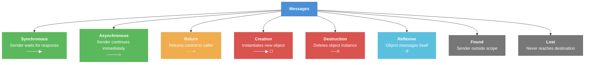
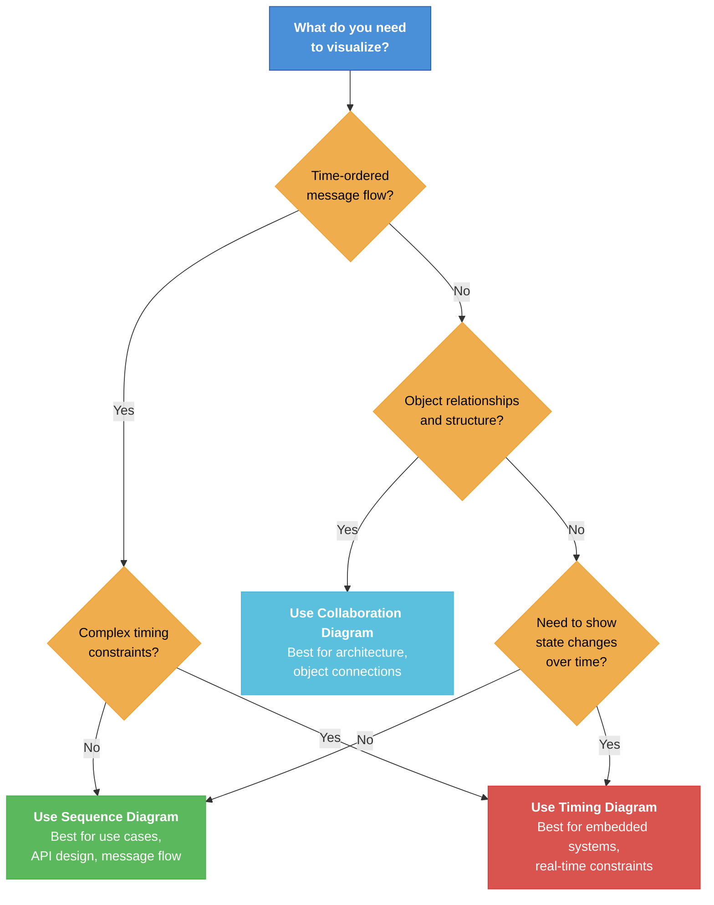

---
tags:
  - "#CCT2"
  - OO
  - Java
  - Programming
Topic: UML message sequence diagrams and how to use as prevalidation of concepts | Synchronous and asynchronous interactions | Design and pitfalls using sequence diagrams for design | Implications on dynamic design on classes, objects and code
Semester: CCT2
Course: Objektorienteret analyse, design og implementering + Java
Litterature:
  - Creately - Sequence diagrams
  - Guru99 - Interaction-Collaboration Sequence diagrams
  - Creately  - Common mistakes in Sequence diagrams
Created: 18-03-2026
---
# Table of Contents

1. [[#Sequence Diagrams - Complete Guide|Sequence Diagrams - Complete Guide]]
	1. [[#Sequence Diagrams - Complete Guide#What is a Sequence Diagram?|What is a Sequence Diagram?]]
	2. [[#Sequence Diagrams - Complete Guide#When to Use Sequence Diagrams|When to Use Sequence Diagrams]]
	3. [[#Sequence Diagrams - Complete Guide#UML Sequence Diagram Symbols and Notation|UML Sequence Diagram Symbols and Notation]]
		1. [[#UML Sequence Diagram Symbols and Notation#Objects and Lifelines|Objects and Lifelines]]
		2. [[#UML Sequence Diagram Symbols and Notation#Activation Bars|Activation Bars]]
		3. [[#UML Sequence Diagram Symbols and Notation#Message Arrows|Message Arrows]]
			1. [[#Message Arrows#Synchronous Message|Synchronous Message]]
			2. [[#Message Arrows#Asynchronous Message|Asynchronous Message]]
			3. [[#Message Arrows#Return Message|Return Message]]
			4. [[#Message Arrows#Participant Creation Message|Participant Creation Message]]
			5. [[#Message Arrows#Participant Destruction Message|Participant Destruction Message]]
			6. [[#Message Arrows#Reflexive Message|Reflexive Message]]
			7. [[#Message Arrows#Comment|Comment]]
	4. [[#Sequence Diagrams - Complete Guide#Managing Complex Interactions with Sequence Fragments|Managing Complex Interactions with Sequence Fragments]]
		1. [[#Managing Complex Interactions with Sequence Fragments#Alternative Fragment (alt)|Alternative Fragment (alt)]]
		2. [[#Managing Complex Interactions with Sequence Fragments#Option Fragment (opt)|Option Fragment (opt)]]
		3. [[#Managing Complex Interactions with Sequence Fragments#Loop Fragment (loop)|Loop Fragment (loop)]]
		4. [[#Managing Complex Interactions with Sequence Fragments#Break Fragment (break)|Break Fragment (break)]]
		5. [[#Managing Complex Interactions with Sequence Fragments#Reference Fragment (ref)|Reference Fragment (ref)]]
		6. [[#Managing Complex Interactions with Sequence Fragments#Parallel Fragment (par)|Parallel Fragment (par)]]
	5. [[#Sequence Diagrams - Complete Guide#Interaction, Collaboration & Sequence Diagrams|Interaction, Collaboration & Sequence Diagrams]]
		1. [[#Interaction, Collaboration & Sequence Diagrams#What is an Interaction Diagram?|What is an Interaction Diagram?]]
		2. [[#Interaction, Collaboration & Sequence Diagrams#Choosing the Right Interaction Diagram|Choosing the Right Interaction Diagram]]
		3. [[#Interaction, Collaboration & Sequence Diagrams#Important Terminology|Important Terminology]]
			1. [[#Important Terminology#Lifeline|Lifeline]]
			2. [[#Important Terminology#Messages|Messages]]
			3. [[#Important Terminology#State Invariants and Constraints|State Invariants and Constraints]]
			4. [[#Important Terminology#Operators|Operators]]
			5. [[#Important Terminology#Iteration|Iteration]]
			6. [[#Important Terminology#Branching|Branching]]
		4. [[#Interaction, Collaboration & Sequence Diagrams#What is a Sequence Diagram?|What is a Sequence Diagram?]]
			1. [[#What is a Sequence Diagram?#Sequence Diagram Example|Sequence Diagram Example]]
			2. [[#What is a Sequence Diagram?#Benefits of Sequence Diagrams|Benefits of Sequence Diagrams]]
			3. [[#What is a Sequence Diagram?#Drawbacks of Sequence Diagrams|Drawbacks of Sequence Diagrams]]
		5. [[#Interaction, Collaboration & Sequence Diagrams#What is a Collaboration Diagram?|What is a Collaboration Diagram?]]
			1. [[#What is a Collaboration Diagram?#Benefits of Collaboration Diagrams|Benefits of Collaboration Diagrams]]
			2. [[#What is a Collaboration Diagram?#Drawbacks of Collaboration Diagrams|Drawbacks of Collaboration Diagrams]]
			3. [[#What is a Collaboration Diagram?#Collaboration Diagram Example|Collaboration Diagram Example]]
		6. [[#Interaction, Collaboration & Sequence Diagrams#What is a Timing Diagram?|What is a Timing Diagram?]]
			1. [[#What is a Timing Diagram?#Timing Diagram Example|Timing Diagram Example]]
			2. [[#What is a Timing Diagram?#Benefits of Timing Diagrams|Benefits of Timing Diagrams]]
			3. [[#What is a Timing Diagram?#Drawbacks of Timing Diagrams|Drawbacks of Timing Diagrams]]
	6. [[#Sequence Diagrams - Complete Guide#How to Draw a Sequence Diagram|How to Draw a Sequence Diagram]]
		1. [[#How to Draw a Sequence Diagram#Step 1: Identify the Use Case|Step 1: Identify the Use Case]]
		2. [[#How to Draw a Sequence Diagram#Step 2: Identify the Objects and Actors|Step 2: Identify the Objects and Actors]]
		3. [[#How to Draw a Sequence Diagram#Step 3: Describe the Use Case in Detail|Step 3: Describe the Use Case in Detail]]
		4. [[#How to Draw a Sequence Diagram#Step 4: Identify Sequence of Interactions|Step 4: Identify Sequence of Interactions]]
		5. [[#How to Draw a Sequence Diagram#Step 5: Open a Sequence Diagram Template|Step 5: Open a Sequence Diagram Template]]
		6. [[#How to Draw a Sequence Diagram#Step 6: Arrange Actors and Lifelines|Step 6: Arrange Actors and Lifelines]]
		7. [[#How to Draw a Sequence Diagram#Step 7: Add Messages and Interaction Details|Step 7: Add Messages and Interaction Details]]
		8. [[#How to Draw a Sequence Diagram#Step 8: Review and Refine Diagram|Step 8: Review and Refine Diagram]]
	7. [[#Sequence Diagrams - Complete Guide#UML Sequence Diagram Best Practices|UML Sequence Diagram Best Practices]]
		1. [[#UML Sequence Diagram Best Practices#Draw Smaller Sequence Diagrams|Draw Smaller Sequence Diagrams]]
		2. [[#UML Sequence Diagram Best Practices#Avoid Unnecessary or Repetitive Diagrams|Avoid Unnecessary or Repetitive Diagrams]]
		3. [[#UML Sequence Diagram Best Practices#Use Clear and Consistent Naming Conventions|Use Clear and Consistent Naming Conventions]]
		4. [[#UML Sequence Diagram Best Practices#Maintain Logical Ordering and Alignment|Maintain Logical Ordering and Alignment]]
		5. [[#UML Sequence Diagram Best Practices#Limit the Number of Objects Per Diagram|Limit the Number of Objects Per Diagram]]
		6. [[#UML Sequence Diagram Best Practices#Highlight Alternative or Conditional Flows with Fragments|Highlight Alternative or Conditional Flows with Fragments]]
		7. [[#UML Sequence Diagram Best Practices#Keep Diagrams Synchronized with System Behavior|Keep Diagrams Synchronized with System Behavior]]
		8. [[#UML Sequence Diagram Best Practices#Messages Should Run from Left to Right|Messages Should Run from Left to Right]]
		9. [[#UML Sequence Diagram Best Practices#Provide Visual Trace Between Use Case Text and Messages|Provide Visual Trace Between Use Case Text and Messages]]
		10. [[#UML Sequence Diagram Best Practices#Consider Behavior Allocation Seriously|Consider Behavior Allocation Seriously]]
		11. [[#UML Sequence Diagram Best Practices#Include Use Case Text on the Sequence Diagram|Include Use Case Text on the Sequence Diagram]]
		12. [[#UML Sequence Diagram Best Practices#Follow Basics When Allocating Behavior|Follow Basics When Allocating Behavior]]
		13. [[#UML Sequence Diagram Best Practices#Consider the Origins of Message Arrows Carefully|Consider the Origins of Message Arrows Carefully]]
	8. [[#Sequence Diagrams - Complete Guide#$10$ Common Mistakes to Avoid in Sequence Diagrams|$10$ Common Mistakes to Avoid in Sequence Diagrams]]
		1. [[#$10$ Common Mistakes to Avoid in Sequence Diagrams#1. Get Rid of Unnecessary Detail|1. Get Rid of Unnecessary Detail]]
		2. [[#$10$ Common Mistakes to Avoid in Sequence Diagrams#2. Messages Should Run from Left to Right|2. Messages Should Run from Left to Right]]
		3. [[#$10$ Common Mistakes to Avoid in Sequence Diagrams#3. Sequence Diagrams That Are Obsolete and Out of Date|3. Sequence Diagrams That Are Obsolete and Out of Date]]
		4. [[#$10$ Common Mistakes to Avoid in Sequence Diagrams#4. Avoid Sequence Diagrams for Simple Logic|4. Avoid Sequence Diagrams for Simple Logic]]
		5. [[#$10$ Common Mistakes to Avoid in Sequence Diagrams#5. Provide Visual Trace Between Use Case Text and Message Arrows|5. Provide Visual Trace Between Use Case Text and Message Arrows]]
		6. [[#$10$ Common Mistakes to Avoid in Sequence Diagrams#6. Keep Sequence Diagrams Abstract Without Plumbing|6. Keep Sequence Diagrams Abstract Without Plumbing]]
		7. [[#$10$ Common Mistakes to Avoid in Sequence Diagrams#7. Consider Behavior Allocation Seriously|7. Consider Behavior Allocation Seriously]]
		8. [[#$10$ Common Mistakes to Avoid in Sequence Diagrams#8. Include Use Case Text on the Sequence Diagram|8. Include Use Case Text on the Sequence Diagram]]
		9. [[#$10$ Common Mistakes to Avoid in Sequence Diagrams#9. Follow Basics When Allocating Behavior|9. Follow Basics When Allocating Behavior]]
		10. [[#$10$ Common Mistakes to Avoid in Sequence Diagrams#10. Consider the Origins of Message Arrows Carefully|10. Consider the Origins of Message Arrows Carefully]]
	9. [[#Sequence Diagrams - Complete Guide#How to Draw an Interaction Diagram|How to Draw an Interaction Diagram]]
		1. [[#How to Draw an Interaction Diagram#Preparation Steps|Preparation Steps]]
		2. [[#How to Draw an Interaction Diagram#Required Elements|Required Elements]]
	10. [[#Sequence Diagrams - Complete Guide#Use of Interaction Diagrams|Use of Interaction Diagrams]]
		1. [[#Use of Interaction Diagrams#General Purposes|General Purposes]]
		2. [[#Use of Interaction Diagrams#Specific Purposes by Diagram Type|Specific Purposes by Diagram Type]]

# Sequence Diagrams - Complete Guide

| Concept | Description | Notation | Visual Symbol |
|---------|-------------|----------|---------------|
| **Lifeline** | Represents a participant/object in the interaction | Vertical dashed line below object box | `┆` |
| **Activation Bar** | Shows when an object is active during interaction | Rectangle on lifeline | `█` |
| **Synchronous Message** | Sender waits for response | Solid arrowhead | `────▶` |
| **Asynchronous Message** | Sender doesn't wait for response | Line arrowhead | `────>` |
| **Return Message** | Returns control to caller | Dashed arrow | `- - ->` |
| **Creation Message** | Creates new object instance | Arrow to dropped participant box | `────▶ ☐` |
| **Destruction Message** | Deletes object instance | 'X' at end of lifeline | `──X` |
| **Reflexive Message** | Object sends message to itself | Arrow looping back to same lifeline | `↺` |
| **Guard Condition** | Boolean test for message execution | `[condition]` before message | `[cond]` |
| **Message Signature** | Format: `attribute = message_name(arguments): return_type` | Label on arrow | — |

_Table 0.1: Quick reference for core sequence diagram concepts, their visual notations, and symbolic representations._

| Fragment Operator | Name | Meaning | Notation | Visual Symbol |
|-------------------|------|---------|----------|---------------|
| `alt` | Alternative | Executes operand whose condition is true (if-else) | Rectangle divided by dashed lines with guards | `┌─alt─┐` |
| `opt` | Option | Executes if condition is true (if-then) | Single rectangle with guard | `┌─opt─┐` |
| `loop` | Loop | Repeats for specified iterations | Rectangle with $\text{minint}$/$\text{maxint}$ bounds | `┌─loop─┐` |
| `break` | Break | Terminates loop if condition met | Rectangle within loop fragment | `┌─break─┐` |
| `ref` | Reference | References another interaction diagram | Rectangle containing diagram name | `┌─ref─┐` |
| `par` | Parallel | All operands execute concurrently | Rectangle with concurrent operands | `┌─par─┐` |

_Table 0.2: Quick reference for sequence fragment operators used to model complex control flow._

---

## What is a Sequence Diagram?

A **sequence diagram** is a UML interaction model that shows how participants (objects, actors, or system components) exchange messages over time to complete a specific scenario or use case. It visualizes the dynamic behavior of a system by illustrating:

- The **order** in which interactions occur
- **What** messages are exchanged between objects
- **When** these interactions happen in the timeline

Sequence diagrams are structured as a timeline that begins at the top and descends gradually, with each object having its own vertical column (lifeline) and messages represented as horizontal arrows between lifelines.

>[!info] Core Purpose
>Sequence diagrams model how different parts of a system work in a 'sequence' to accomplish a specific function. They are widely used in software development to visualize system behavior and help developers design, analyze, and understand complex interactions.

---

## When to Use Sequence Diagrams

>[!abstract] Primary Use Cases
>Sequence diagrams are most valuable when you need to visualize time-ordered interactions and message flows between system components. For guidance on choosing between diagram types, see [[#Choosing the Right Interaction Diagram]].

- **Model a specific use case or scenario:** Illustrate how a system behaves during a single use case, showing the step-by-step flow of messages between objects.

- **Design or refine system architecture:** Visualize how components such as the UI, business logic, and database interact, helping architects plan or improve system structure.

- **Clarify complex processes:** Break down complicated workflows or logic into clear, time-ordered interactions, making it easier to understand and communicate system behavior.

- **Validate logic before implementation:** Confirm that all necessary interactions and message flows are defined correctly before coding begins, reducing design errors.

- **Explain system behavior to stakeholders:** Present technical interactions in a way that both developers and non-technical team members can understand.

- **Design or analyze integrations and APIs:** Map out how services or systems exchange requests and responses to ensure smooth communication in distributed or microservice environments.

>[!warning] When NOT to Use Sequence Diagrams
>Avoid creating sequence diagrams for simple, straightforward logic that is easy to understand from code alone. If the process has minimal interactions or the code is self-explanatory, a sequence diagram adds unnecessary overhead. See [[#4. Avoid Sequence Diagrams for Simple Logic]] for more details.

---

## UML Sequence Diagram Symbols and Notation

### Objects and Lifelines

A **lifeline** represents a single participant in an interaction, showing how an instance of a specific classifier (object, actor, boundary, entity, or control element) participates in the sequence of events.

**Lifeline Components:**
1. **Name:** Used to refer to the lifeline within the interaction (optional)
2. **Type:** The name of the classifier the lifeline represents
3. **Selector:** A Boolean condition to select a particular instance (optional)

![[Pasted image 20260318123540.png]]

_Figure 1.1: Basic lifeline notation showing the object box at the top and the vertical dashed line representing its existence over time._

Each object has a **lifeline** (the dashed vertical line extending from the bottom center of the object box) that indicates its existence or lifespan throughout the sequence of events. Multiple lifelines are arranged horizontally across the top of the diagram without overlapping.

>[!info] Lifeline Types
>Different stereotypes indicate different types of participants in the system. For best practices on limiting lifelines per diagram, see [[#Limit the Number of Objects Per Diagram]].

**Actor Lifeline:**

![[Pasted image 20260318123547.png]]

_Figure 1.2: Lifeline with actor element symbol, used when the sequence diagram is owned by a use case._

**Entity Lifeline:**

![[Pasted image 20260318123554.png]]

_Figure 1.3: Lifeline with entity element representing system data (e.g., Customer entity managing customer-related data)._

**Boundary Lifeline:**

![[Pasted image 20260318123613.png]]

_Figure 1.4: Lifeline with boundary element indicating system boundaries like user interfaces, database gateways, or interactive menus._

**Control Lifeline:**

![[Pasted image 20260318123621.png]]

_Figure 1.5: Lifeline with control element representing a controlling entity or manager that organizes and schedules interactions between boundaries and entities._

---

### Activation Bars

The **activation bar** is a thin rectangle placed on a lifeline to indicate that an object is **active** (instantiated and processing) during an interaction.

![[Pasted image 20260318123636.png]]

_Figure 1.6: Activation bars showing when objects are active during message exchange._

>[!info] Activation Bar Meaning
>When one object sends a message to another:
>- The **Message Caller** (sender) has an activation bar showing it is active while sending
>- The **Message Receiver** gets an activation bar after receiving the message, showing it is now processing
>
>The **length** of the rectangle indicates the **duration** of the object's active state.

---

### Message Arrows

A **message** is a specific type of communication between two lifelines. Messages flow in any direction: left to right, right to left, or back to the same object (reflexive). For common mistakes related to message arrows, see [[#10. Consider the Origins of Message Arrows Carefully]].

**Message Signature Format:**

$$\text{attribute} = \text{message\_name}(\text{arguments}): \text{return\_type}$$

>[!example] Message Signature Examples
>- $\text{userID} = \text{authenticate}(\text{username}, \text{password}): \text{boolean}$
>- $\text{result} = \text{calculateTotal}(\text{items}): \text{double}$
>- $\text{createAccount}(\text{userData}): \text{void}$

The following diagram illustrates the taxonomy of message types used in sequence diagrams:



_Figure 1.7: Message type taxonomy showing all message categories used in sequence diagrams with their primary purpose and visual symbols._

#### Synchronous Message

A **synchronous message** (`────▶`) means the sender waits for the receiver to process the message and return control before continuing with other messages.

![[Pasted image 20260318123645.png]]

_Figure 1.8: Synchronous message with solid arrowhead indicating the sender waits for a response._

>[!info] Synchronous Message Characteristics
>- Uses a **solid arrowhead** (`────▶`)
>- Sender **blocks** until receiver completes processing
>- Implies a return message (can be omitted for clarity)

#### Asynchronous Message

An **asynchronous message** (`────>`) means the sender does not wait for the receiver to process the message; it immediately continues executing the next message.

![[Pasted image 20260318123651.png]]

_Figure 1.9: Asynchronous message with line arrowhead indicating the sender doesn't wait for completion._

>[!info] Asynchronous Message Characteristics
>- Uses a **line arrowhead** (`────>`)
>- Sender **continues** without waiting
>- Common in event-driven systems and parallel processing

#### Return Message

A **return message** (`- - ->`) indicates that the message receiver has finished processing and is returning control to the message caller.

![[Pasted image 20260318123658.png]]

_Figure 1.10: Return message shown with a dashed arrow returning control to the caller._

>[!tip] Return Message Best Practice
>Return messages are **optional** notation. An activation bar triggered by a synchronous message always implies a return. To reduce clutter, you can:
>- Omit the return arrow entirely
>- Specify the return value in the initial message arrow label
>
>Only include explicit return messages when the return value or timing needs emphasis. See [[#1. Get Rid of Unnecessary Detail]] for more on reducing diagram clutter.

#### Participant Creation Message

Objects do not necessarily exist for the entire sequence. A **creation message** (`────▶ ☐`) shows when a new participant is instantiated during the interaction.

![[Pasted image 20260318123705.png]]

_Figure 1.11: Creation message showing a new object being instantiated, with the participant box "dropped" lower on the diagram._

>[!info] Creation Message Notation
>- The created participant's box is placed **lower** on the timeline (dropped)
>- If the new participant acts immediately after creation, add an **activation bar** directly below its box

#### Participant Destruction Message

When a participant is no longer needed, it can be deleted from the sequence using a **destruction message** (`──X`).

![[Pasted image 20260318123717.png]]

_Figure 1.12: Destruction message indicated by an 'X' at the end of the participant's lifeline._

>[!info] Destruction Notation
>An **'X' symbol** is placed at the end of the lifeline to show the participant is destroyed and no longer exists in the interaction.

#### Reflexive Message

A **reflexive message** (`↺`) occurs when an object sends a message to itself, typically invoking one of its own methods.

![[Pasted image 20260318123726.png]]

_Figure 1.13: Reflexive message with an arrow looping back to the same lifeline._

>[!example] Reflexive Message Use Cases
>- Object validates its own state
>- Object performs internal calculation
>- Recursive method calls

#### Comment

Comments provide additional explanatory notes on the diagram without affecting the interaction logic.

![[Pasted image 20260318123733.png]]

_Figure 1.14: Comment notation showing a rectangle with a folded corner, linked to related objects with a dashed line._

>[!note] Comment Usage
>Comments can be added anywhere in a sequence diagram to clarify:
>- Complex logic
>- Design decisions
>- Constraints or assumptions
>- References to external documentation

---

## Managing Complex Interactions with Sequence Fragments

**Sequence fragments** (also called **combined fragments**) are rectangular frames that enclose a section of interactions to represent complex logic such as alternatives, loops, and conditional flows. For best practices on using fragments, see [[#Highlight Alternative or Conditional Flows with Fragments]].

The **fragment operator** (placed in the top-left corner of the frame) specifies the type of fragment.

### Alternative Fragment (alt)

The **alternative fragment** (`┌─alt─┐`) models "if-then-else" logic, allowing a choice between two or more message sequences.

![[Pasted image 20260318123930.png]]

_Figure 1.15: Alternative fragment showing branching logic with guard conditions for each operand._

>[!info] Alternative Fragment Structure
>- **Operator:** `alt`
>- **Frame:** Large rectangle divided into **interaction operands** by dashed horizontal lines
>- **Guard Conditions:** Each operand has a guard `[condition]` in its top-left corner
>- **Execution:** Only the operand whose guard evaluates to **true** is executed

>[!example] Alternative Fragment Example
>**Scenario:** User login authentication
>
>```
>alt [credentials valid]
>    → displayDashboard()
>[credentials invalid]
>    → displayError()
>```

### Option Fragment (opt)

The **option fragment** (`┌─opt─┐`) models "if-then" logic, executing a sequence only if a specified condition is true.

>[!info] Option Fragment Structure
>- **Operator:** `opt`
>- **Frame:** Single rectangle (not divided into operands)
>- **Guard Condition:** Placed in top-left corner
>- **Execution:** Sequence executes only if guard is **true**; otherwise, it is skipped

>[!example] Option Fragment Example
>**Scenario:** Optional email notification
>
>```
>opt [emailEnabled = true]
>    → sendEmail(message)
>```

### Loop Fragment (loop)

The **loop fragment** (`┌─loop─┐`) represents a repetitive sequence that executes multiple times based on a condition.

>[!info] Loop Fragment Structure
>- **Operator:** `loop`
>- **Guard Condition:** Boolean test, with optional special conditions:
>  - **Minimum iterations:** $\text{minint} = n$ (loop must execute at least $n$ times)
>  - **Maximum iterations:** $\text{maxint} = n$ (loop must not exceed $n$ iterations)
>- **Execution:** Repeats while guard is true, respecting min/max bounds

>[!example] Loop Fragment Example
>**Scenario:** Processing a list of items
>
>```
>loop [i < itemCount]
>    → processItem(item[i])
>    i = i + 1
>```
>
>**With bounds:**
>```
>loop (minint=1, maxint=10) [hasMoreData]
>    → fetchNextBatch()
>```
>
>- **Breakdown:**
>    - $\text{minint} = 1$: The loop must execute at least $1$ time
>    - $\text{maxint} = 10$: The loop must not execute more than $10$ times
>    - `[hasMoreData]`: The guard condition that is evaluated each iteration

### Break Fragment (break)

The **break fragment** (`┌─break─┐`) is used inside loops or other fragments to terminate execution when a specific condition is met.

>[!warning] Break Fragment Usage
>If a break condition is not specified correctly, the loop may execute indefinitely, potentially crashing the program.

### Reference Fragment (ref)

The **reference fragment** (`┌─ref─┐`) allows you to **reuse** part of one sequence diagram in another, managing the size and complexity of large diagrams. This is essential for following the best practice of [[#Draw Smaller Sequence Diagrams]].

![[Pasted image 20260318123948.png]]

_Figure 1.16: Reference fragment pointing to another sequence diagram to avoid duplication._

>[!info] Reference Fragment Structure
>- **Operator:** `ref`
>- **Content:** Name of the referenced sequence diagram inside the frame
>- **Purpose:** Avoid duplication by referencing common interaction sequences

>[!example] Reference Fragment Example
>**Main Diagram:** Order Processing
>
>```
>ref PaymentProcessing
>```
>
>This references a separate "PaymentProcessing" sequence diagram that details the payment workflow.

### Parallel Fragment (par)

The **parallel fragment** (`┌─par─┐`) indicates that all operands execute **concurrently** (in parallel).

>[!info] Parallel Fragment Structure
>- **Operator:** `par`
>- **Execution:** All enclosed sequences run simultaneously
>- **Use Case:** Multi-threaded operations, concurrent API calls

---

## Interaction, Collaboration & Sequence Diagrams

### What is an Interaction Diagram?

**Interaction diagrams** are used in UML to establish communication between objects. They do not manipulate the data associated with communication paths; instead, they focus on **message passing** and how messages combine to create system functionality.

![[Pasted image 20260318124304.png]]

_Figure 2.1: General structure of an interaction diagram showing message flow between lifelines._

>[!abstract] Interaction Diagram Purpose
>Interaction diagrams capture the **dynamic behavior** of a system. They visualize:
>- How objects communicate
>- The sequence of messages
>- The structural relationships between objects

**Types of Interaction Diagrams:**
1. **Sequence Diagram:** Focuses on time-ordered sequence of messages
2. **Collaboration Diagram (Communication Diagram):** Emphasizes structural organization and relationships
3. **Timing Diagram:** Focuses on the exact timing of message exchanges

The following table compares these three interaction diagram types:

| Aspect | Sequence Diagram | Collaboration Diagram | Timing Diagram |
|--------|------------------|----------------------|----------------|
| **Primary Focus** | Time-ordered message flow | Structural relationships | Precise timing of events |
| **Best Used For** | Visualizing message sequences | Understanding object architecture | Analyzing state changes over time |
| **Complexity** | Medium | Lower | Higher |
| **Readability** | High | Medium | Low |
| **Lifeline Representation** | Vertical bars with activation boxes | Objects with numbered connectors | Horizontal waveforms |
| **Message Ordering** | Implicit (top to bottom) | Explicit (numbered messages) | Explicit (time axis) |
| **Common Use Cases** | Use case implementation, API design | Object relationships, architecture | Embedded systems, real-time constraints |

_Table 2.1: Comparison of the three interaction diagram types showing their focus, strengths, and typical applications._

---

### Choosing the Right Interaction Diagram

Use the following decision flowchart to determine which interaction diagram type best fits your needs:



_Figure 2.2: Decision flowchart for selecting the appropriate interaction diagram type based on your visualization needs._

>[!tip] Diagram Selection Guidelines
>- **Default choice:** Start with a **sequence diagram** for most use cases
>- **Architecture focus:** Choose **collaboration diagram** when object relationships matter more than timing
>- **Real-time systems:** Use **timing diagram** only when precise timing constraints are critical
>
>See [[#What is a Sequence Diagram?]], [[#What is a Collaboration Diagram?]], and [[#What is a Timing Diagram?]] for detailed information on each type.

---

### Important Terminology

#### Lifeline

A **lifeline** represents a single participant in an interaction, describing how an instance of a specific classifier participates.

**Lifeline Attributes:**
1. **Name:** Refers to the lifeline within the interaction (optional)
2. **Type:** Name of the classifier the lifeline represents
3. **Selector:** Boolean condition to select a specific instance (optional)

#### Messages

A **message** is a communication between two lifelines involving:
- A call to an operation
- Creating an instance
- Destroying an instance
- Sending a signal

When a lifeline receives a message, it gains the **focus of control**. As the interaction progresses, the focus moves between lifelines, creating a **flow of control**.

**Message Types:**

| Message Type | Symbol | Meaning |
|--------------|--------|---------|
| **Synchronous** | `────▶` | Sender waits for receiver to return control |
| **Asynchronous** | `────>` | Sender continues without waiting |
| **Return** | `- - ->` | Receiver returns control to sender |
| **Object Creation** | `────▶ ☐` | Sender creates a new instance |
| **Object Destruction** | `──X` | Sender destroys an instance |
| **Found Message** | `○────▶` | Sender is outside the scope of interaction |
| **Lost Message** | `────▶ ○` | Message never reaches destination |

_Table 2.2: Message types used in interaction diagrams, their visual symbols, and meanings._

#### State Invariants and Constraints

A **state** is a condition during an object's lifetime where it:
- Satisfies some constraint
- Performs operations
- Waits for events

>[!note] State Changes
>Not all messages cause state changes. Some messages have no side effects on the object's state or attribute values.

#### Operators

**Operators** specify how operands are executed, supporting branching and iteration operations.

| Operator | Symbol | Name | Meaning |
|----------|--------|------|---------|
| **opt** | `┌─opt─┐` | Option | Executes if condition is true (if-then) |
| **alt** | `┌─alt─┐` | Alternative | Executes operand whose condition is true (switch) |
| **loop** | `┌─loop─┐` | Loop | Loops for specified period |
| **break** | `┌─break─┐` | Break | Breaks loop if condition met |
| **ref** | `┌─ref─┐` | Reference | References another interaction |
| **par** | `┌─par─┐` | Parallel | All operands execute in parallel |

_Table 2.3: Operators used in interaction diagrams to control execution flow, with visual symbols._

#### Iteration

**Iteration** in interaction diagrams uses an **iteration expression** consisting of:
- **Iteration specifier:** Defines iteration type
- **Iteration clause:** Optional condition

**Parallel Iteration Specifier:** `*//` indicates messages are sent in parallel

>[!info] Iteration Implementation
>Iteration in UML is achieved using the **loop** operator with appropriate guard conditions. The loop bounds are specified as:
>- $\text{minint} = n$: Minimum number of iterations
>- $\text{maxint} = n$: Maximum number of iterations

#### Branching

**Branching** is represented by adding **guard conditions** to messages.

>[!info] Guard Condition Rules
>- A message is sent only if its guard condition is **true**
>- Multiple messages can have the same guard condition
>- A single message can have multiple guard conditions

Branching is achieved using **alt** (alternative) and **opt** (option) operators. For details on these fragments, see [[#Alternative Fragment (alt)]] and [[#Option Fragment (opt)]].

---

### What is a Sequence Diagram?

A **sequence diagram** depicts interaction between objects in **sequential order**, visualizing the sequence of message flow in the system.

![[Pasted image 20260318124516.png]]

_Figure 2.3: Complete sequence diagram showing lifelines, messages, and activation bars in time-ordered sequence._

>[!info] Sequence Diagram Characteristics
>- Shows **implementation of a scenario** in the system
>- Lifelines participate during execution
>- Vertical bars represent lifelines
>- Vertical dotted lines with activation bars show when objects are active
>- Different message types and operators clarify interaction flow
>- Supports iteration and branching

#### Sequence Diagram Example

![[Pasted image 20260318124529.png]]

_Figure 2.4: McDonald's ordering system sequence diagram showing the ordered flow from order placement to serving._

**Ordered Sequence of Events:**
1. Place an order
2. Pay money to the cash counter
3. Order confirmation
4. Order preparation
5. Order serving

>[!warning] Order Matters
>Changing the order of operations may result in:
>- Program crashes
>- Incorrect results
>- Buggy behavior
>
>Each sequence must use the appropriate message notation to avoid complications. See [[#2. Messages Should Run from Left to Right]] for proper message ordering.

#### Benefits of Sequence Diagrams

- **Explore real applications:** Used to model real-world systems and applications
- **Represent message flow:** Clearly shows message flow from one object to another
- **Easy to maintain:** Simpler to update than other diagram types
- **Easy to generate:** Straightforward to create from use cases
- **Easy to update:** Can be quickly modified to reflect system changes
- **Support engineering:** Enable both reverse and forward engineering

#### Drawbacks of Sequence Diagrams

>[!warning] Sequence Diagram Limitations
>- **Complexity with many lifelines:** Can become difficult to read when too many objects are involved
>- **Order sensitivity:** Changing message order produces incorrect results
>- **Notation complexity:** Different sequences require different message notations
>- **Type dependency:** The message type determines the sequence type
>
>For strategies to address these limitations, see [[#UML Sequence Diagram Best Practices]] and [[#10 Common Mistakes to Avoid in Sequence Diagrams]].

---

### What is a Collaboration Diagram?

**Collaboration diagrams** (also called **Communication Diagrams**) depict the relationships and interactions among software objects, emphasizing the **structural aspects** of interactions rather than the time-ordered message flow.

![[Pasted image 20260318124541.png]]

_Figure 2.5: Collaboration diagram notation showing lifelines, connectors, and numbered message sequences._

>[!abstract] Collaboration Diagram Focus
>Unlike sequence diagrams that focus on **message flow over time**, collaboration diagrams emphasize:
>- **Object architecture** within the system
>- **Structural relationships** between objects
>- **How lifelines connect** to one another

**Key Characteristics:**
- Also called **communication diagrams**
- Syntax similar to sequence diagrams, but lifelines don't have tails
- Messages are numbered hierarchically to show sequencing
- Semantically weaker than sequence diagrams
- Object diagrams are special cases of collaboration diagrams

#### Benefits of Collaboration Diagrams

- **Focus on structure:** Emphasizes elements and relationships rather than message flow
- **Conversion-friendly:** Sequence diagrams can be easily converted to collaboration diagrams
- **Element-centric:** Allows focus on objects and their connections

#### Drawbacks of Collaboration Diagrams

>[!warning] Collaboration Diagram Limitations
>- **Complexity with many objects:** Becomes difficult to read with numerous objects
>- **Hard to explore:** Difficult to examine each object individually
>- **Time-consuming:** Takes longer to create than sequence diagrams
>- **Temporary state:** Object state changes are momentary and hard to track
>- **Information loss:** Converting from sequence to collaboration diagrams may lose some detail

#### Collaboration Diagram Example

![[Pasted image 20260318124549.png]]

_Figure 2.6: Student management system collaboration diagram showing numbered message flow._

**Communication Flow:**
1. Student requests login through the login system
2. Authentication mechanism checks the request
3. If student entry exists in database → access allowed
4. Otherwise → error is returned

---

### What is a Timing Diagram?

A **timing diagram** is a waveform or graph that describes the **state of a lifeline** at any instance of time, showing the transformation of an object from one state to another.

![[Pasted image 20260318124624.png]]

_Figure 2.7: Timing diagram showing phases of a software development lifecycle over time._

>[!info] Timing Diagram Characteristics
>- Represents interactions focusing on **specific timings** of messages
>- Shows **detailed time processing** of particular objects
>- Explains how objects **change within their lifetime**
>- Mostly used with **distributed and embedded systems**
>- Read **left to right** according to lifeline names on the left edge
>- Displays **graphical representation** of lifeline states per unit time

#### Timing Diagram Example

The timing diagram above represents phases of a **Software Development Life Cycle (SDLC)**:

1. **Requirements phase** → output feeds into design phase
2. **Design phase** → output feeds into development phase
3. **Development phase** → continues the cycle

Each phase's output at a given time becomes input for the next phase, illustrating time-dependent transitions in the system.

#### Benefits of Timing Diagrams

- **Track state over time:** Represent object state at specific time instances
- **Support engineering:** Enable reverse and forward engineering
- **Track changes:** Keep track of every change within the system

#### Drawbacks of Timing Diagrams

>[!warning] Timing Diagram Limitations
>- **Difficult to understand:** More complex notation than sequence or collaboration diagrams
>- **Difficult to maintain:** Harder to update as system changes

---

## How to Draw a Sequence Diagram

Sequence diagrams visualize the time-ordered sequence of message flows in a system. Follow these steps to create effective sequence diagrams. For best practices to apply throughout this process, see [[#UML Sequence Diagram Best Practices]].

The following flowchart provides an overview of the sequence diagram creation process:

```mermaid
flowchart LR
    A[<b>Step 1</b><br/>Identify<br/>Use Case] --> B[<b>Step 2</b><br/>Identify<br/>Objects/Actors]
    B --> C[<b>Step 3</b><br/>Describe<br/>Use Case]
    C --> D[<b>Step 4</b><br/>Identify<br/>Interactions]
    D --> E[<b>Step 5</b><br/>Open<br/>Template]
    E --> F[<b>Step 6</b><br/>Arrange<br/>Lifelines]
    F --> G[<b>Step 7</b><br/>Add<br/>Messages]
    G --> H[<b>Step 8</b><br/>Review &<br/>Refine]
    
    style A fill:#4a90d9,stroke:#2c5aa0,color:#fff
    style B fill:#5cb85c,stroke:#4cae4c,color:#fff
    style C fill:#5cb85c,stroke:#4cae4c,color:#fff
    style D fill:#f0ad4e,stroke:#eea236,color:#fff
    style E fill:#f0ad4e,stroke:#eea236,color:#fff
    style F fill:#d9534f,stroke:#d43f3a,color:#fff
    style G fill:#d9534f,stroke:#d43f3a,color:#fff
    style H fill:#5bc0de,stroke:#46b8da,color:#fff
```



_Figure 3.1: Flowchart showing the $8$-step process for creating a sequence diagram from use case to final review._

### Step 1: Identify the Use Case

Start by defining the specific use case scenario you want to model. This sets the foundation by outlining the system's goal and key interactions.

![[Pasted image 20260318123818.png]]

_Figure 3.2: Use case diagram for an online library system showing various use cases including "Create New User Account."_

>[!example] Use Case Selection
>From the use case diagram "Create New Online Library Account," we focus on the use case **"Create New User Account"** to draw our sequence diagram.

### Step 2: Identify the Objects and Actors

Identify all objects and actors involved in the use case.

>[!example] Objects and Actors for "Create New User Account"
>- **Librarian** (actor)
>- **Online Library Management System** (boundary)
>- **User Credentials Database** (entity)
>- **Email System** (boundary)

### Step 3: Describe the Use Case in Detail

Write a detailed description of what the use case does. This description helps you identify the interactions that should appear in the sequence diagram.

>[!note] Detailed Description Purpose
>The narrative flow of the use case description directly maps to the message flow in the sequence diagram. Each step in the description becomes one or more messages. See [[#8. Include Use Case Text on the Sequence Diagram]] for how to incorporate this text into your diagram.

### Step 4: Identify Sequence of Interactions

List the ordered steps that occur in the use case.

>[!example] Steps for "Create New Library User Account"
>1. Librarian requests the system to create a new online library account
>2. Librarian selects the library user account type
>3. Librarian enters the user's details
>4. User's details are checked using the User Credentials Database
>5. New library user account is created
>6. Summary of new account details is emailed to the user
>
>From each step, you can specify what **messages** should be exchanged between objects.

### Step 5: Open a Sequence Diagram Template

Begin constructing your sequence diagram.

![[Pasted image 20260318123905.png]]

_Figure 3.3: Complete sequence diagram for "Create New Library User Account" showing all interactions between objects._

### Step 6: Arrange Actors and Lifelines

Place all identified actors and objects across the top of the canvas in the order they participate in the interaction.

**Lifeline Arrangement:**
1. Draw **lifelines** as dashed vertical lines extending downward from each actor/object
2. Add **activation bars** (thin rectangles) on lifelines to show when objects are active

>[!tip] Lifeline Ordering
>Arrange lifelines from left to right in the order they first participate in the interaction. This creates a natural reading flow. See [[#2. Messages Should Run from Left to Right]] for more details.

### Step 7: Add Messages and Interaction Details

Illustrate how objects communicate using arrows to represent messages.

**Message Arrow Types:**
- **Solid arrows** (`────▶`): Synchronous messages (calls)
- **Open arrows** (`────>`): Asynchronous messages
- **Dotted arrows** (`- - ->`): Return messages or responses

**Message Labels:**
- Use clear, descriptive labels with method names and parameters
- Follow the format: $\text{attribute} = \text{message\_name}(\text{arguments}): \text{return\_type}$

**Fragments:**
- Use **alt** for alternatives (if-else)
- Use **opt** for optional flows (if)
- Use **loop** for iterations

For details on fragments, see [[#Managing Complex Interactions with Sequence Fragments]].

>[!example] Adding Messages Example
>```
>1. Librarian → System: createAccount()
>2. System → Librarian: requestAccountType()
>3. Librarian → System: selectAccountType(type)
>4. System → Librarian: requestUserDetails()
>5. Librarian → System: enterDetails(userData)
>6. System → Database: validateUser(userData)
>7. Database → System: validationResult
>8. System → Database: createUserRecord(userData)
>9. Database → System: confirmationStatus
>10. System → EmailSystem: sendConfirmation(email, details)
>11. EmailSystem → System: emailSent
>12. System → Librarian: displayConfirmation()
>```

### Step 8: Review and Refine Diagram

Check for clarity, correct sequencing, and alignment with the use case.

**Review Checklist:**
- [ ] All actors and system components properly represented
- [ ] Message labels concise and descriptive
- [ ] Activation bars correctly show object activity periods
- [ ] Message sequence matches use case narrative
- [ ] Appropriate fragment operators used for logic
- [ ] Diagram fits on single page with readable spacing

>[!tip] Team Collaboration
>Invite your team to collaborate directly, add comments, and refine the diagram together for accuracy and completeness. See [[#3. Sequence Diagrams That Are Obsolete and Out of Date]] for tips on keeping diagrams current.

---

## UML Sequence Diagram Best Practices

This section outlines best practices to follow when creating sequence diagrams. For common mistakes to avoid, see [[#10 Common Mistakes to Avoid in Sequence Diagrams]].

### Draw Smaller Sequence Diagrams

>[!tip] Keep Diagrams Focused
>Instead of cluttering your sequence diagram with several objects and groups of messages, draw a few smaller sequence diagrams that each explain one specific aspect of system behavior.

**Benefits:**
- Easier to understand
- Fits on a single page
- Leaves space for explanatory notes
- Reduces cognitive load on readers

Use [[#Reference Fragment (ref)]] to link smaller diagrams together.

### Avoid Unnecessary or Repetitive Diagrams

>[!tip] Identify Common Patterns
>Find what is common about multiple scenarios and focus on that. If the code is expressive and self-explanatory, there's no need to draw a sequence diagram.

**When to Skip Diagrams:**
- Logic is simple and straightforward
- Code clearly documents itself
- Multiple scenarios share the same pattern (document the pattern once)

### Use Clear and Consistent Naming Conventions

Name objects, lifelines, and messages clearly and consistently to avoid ambiguity.

>[!example] Naming Convention Examples
>**Good:**
>- `UserController`
>- `authenticateUser(credentials)`
>- `CustomerDatabase`
>
>**Avoid:**
>- `UC1`, `Obj2` (unclear abbreviations)
>- Inconsistent capitalization
>- Vague names like `process()`, `handle()`

### Maintain Logical Ordering and Alignment

Keep lifelines evenly spaced and align messages in a consistent left-to-right flow.

>[!tip] Visual Organization
>- Lifelines should be evenly spaced
>- Messages flow primarily left to right
>- Activation bars align vertically
>- Straight, parallel lines improve readability

### Limit the Number of Objects Per Diagram

Avoid adding too many lifelines to a single diagram.

>[!warning] Complexity Threshold
>If you need more than $6$-$8$ lifelines, consider:
>- Splitting into multiple diagrams
>- Grouping related interactions
>- Using [[#Reference Fragment (ref)]] to external diagrams

### Highlight Alternative or Conditional Flows with Fragments

Use sequence fragments to represent:
- **alt** (`┌─alt─┐`): Alternative paths (if-else logic)
- **opt** (`┌─opt─┐`): Conditional logic (if-then)
- **loop** (`┌─loop─┐`): Repeated actions

>[!example] Fragment Usage
>```
>alt [paymentMethod = "credit card"]
>    → processCreditCard()
>[paymentMethod = "PayPal"]
>    → processPayPal()
>```

This keeps the diagram structured and prevents confusion. For full details, see [[#Managing Complex Interactions with Sequence Fragments]].

### Keep Diagrams Synchronized with System Behavior

>[!important] Maintain Diagram Currency
>Update the sequence diagram whenever the underlying logic or code changes. Outdated diagrams cause miscommunication during reviews or development.

**Synchronization Strategy:**
- Review diagrams during code reviews
- Update diagrams when requirements change
- Version diagrams alongside code
- Mark obsolete diagrams clearly

### Messages Should Run from Left to Right

Following Western reading conventions, message flow should start from the top-left corner and progress left to right.

![[Pasted image 20260318124758.png]]

_Figure 4.1: Proper left-to-right message flow following natural reading direction._

>[!note] Exceptions to Left-to-Right Flow
>- Object pairs that invoke operations on each other
>- Return messages (`- - ->`)
>- Reflexive messages (`↺`) (object to itself)

### Provide Visual Trace Between Use Case Text and Messages

Each sentence in the use case text should have:
- Blank space around it
- Visual alignment with corresponding message arrow

![[Pasted image 20260318124825.png]]

_Figure 4.2: Sequence diagram with use case text aligned to message arrows for easy traceability._

>[!tip] Traceability Benefits
>This enables readers to easily see how the system accomplishes what the use case describes, creating a clear link between requirements and design.

### Consider Behavior Allocation Seriously

The sequence diagram is the **main vehicle for making behavior allocation decisions**—assigning operations to classes as you design.

![[Pasted image 20260318124844.png]]

_Figure 4.3: Proper behavior allocation showing operations assigned to appropriate classes._

>[!important] Behavior Allocation Principles
>**When assigning operations to classes:**
>1. **Single Responsibility:** Each object should have only one personality—a cohesive set of strongly related behaviors
>2. **Loose Coupling:** Minimize dependencies between objects
>3. **Reusability:** General objects and classes can be reused in other projects
>4. **Proper Fit:** Ensure a decent fit between the method and the object
>
>Behavior allocation decisions made during sequence diagram creation directly impact the quality of your class design.

### Include Use Case Text on the Sequence Diagram

![[Pasted image 20260318124852.png]]

_Figure 4.4: Sequence diagram with use case text included in the margin for requirements traceability._

>[!tip] Requirements Traceability
>Writing the use case text in the margin provides a direct trace from the design back to requirements. The diagram should match the narrative flow of the associated use case.

### Follow Basics When Allocating Behavior

When assigning methods to objects using message arrows, apply these principles:

![[Pasted image 20260318124859.png]]

_Figure 4.5: Proper message arrow usage showing thoughtful behavior allocation._

**Key Questions:**
- Does this method fit the object's primary responsibility?
- Is the object cohesive (focused on related behaviors)?
- Is the object loosely coupled (minimal dependencies)?
- Can this object be reused in other contexts?

### Consider the Origins of Message Arrows Carefully

![[Pasted image 20260318124913.png]]

_Figure 4.6: Clear message arrow origins showing proper flow of control._

>[!important] Message Arrow Origins
>Understanding which object is in control at any given time is critical for seeing the flow of control. The messages between objects **determine the operations** on the associated classes.
>
>While arrows are important in robustness diagrams, they are **more critical** in sequence diagrams because they directly define class interfaces.

---

## $10$ Common Mistakes to Avoid in Sequence Diagrams

This section details the most common mistakes made when creating sequence diagrams. For positive guidance, see [[#UML Sequence Diagram Best Practices]].

### 1. Get Rid of Unnecessary Detail

A typical mistake is adding too much detail when creating sequence diagrams.

![[Pasted image 20260318124736.png]]

_Figure 5.1: Cluttered sequence diagram with too much detail versus clean diagram with essential information only._

>[!warning] Too Much Detail
>If your code has many branches in a method, **do not** include each one within the same diagram using block or scenario elements. This creates clutter and makes diagrams difficult to read and comprehend.

**Solution:**
- Keep diagrams focused on high-level flow
- Use separate diagrams for alternative paths
- Eliminate implementation details that don't aid understanding
- Use [[#Reference Fragment (ref)]] to link to detailed sub-diagrams

### 2. Messages Should Run from Left to Right

Message flow should start from the top-left corner and progress left to right, following Western reading conventions.

![[Pasted image 20260318124758.png]]

_Figure 5.2: Proper left-to-right message flow versus incorrect right-to-left or scattered flow._

>[!info] Reading Flow
>All classifiers (actors, classes, objects, use cases) should follow left-to-right flow. This aligns with how Western cultures read.

**Exceptions:**
- Object pairs invoking operations on each other
- Return messages (`- - ->`)
- Reflexive messages (`↺`)

### 3. Sequence Diagrams That Are Obsolete and Out of Date

![[Pasted image 20260318124807.png]]

_Figure 5.3: Outdated sequence diagram that no longer matches current system architecture._

>[!warning] Obsolete Diagrams
>Outdated sequence diagrams that don't match the current interfaces, architecture, or behavior of the system become a burden. They stop offering documentation value.

**Solution:**
- Create **high-level sequence diagrams** that remain relevant despite implementation changes
- Update diagrams when system behavior changes
- Remove or clearly mark deprecated diagrams
- Version diagrams alongside code

See [[#Keep Diagrams Synchronized with System Behavior]] for strategies.

### 4. Avoid Sequence Diagrams for Simple Logic

![[Pasted image 20260318124819.png]]

_Figure 5.4: Simple logic that doesn't warrant a sequence diagram._

>[!tip] When to Skip Diagrams
>Don't waste time creating sequence diagrams for every single use case if the logic is simple and self-explanatory.

**Create sequence diagrams only when:**
- Logic is complex
- Multiple objects interact in non-obvious ways
- Timing and order are critical
- Stakeholders need visual documentation

**Skip sequence diagrams when:**
- Logic is straightforward
- Code is self-documenting
- Single object handles everything
- Use case has minimal interactions

### 5. Provide Visual Trace Between Use Case Text and Message Arrows

![[Pasted image 20260318124825.png]]

_Figure 5.5: Sequence diagram with use case text properly aligned with corresponding message arrows._

>[!important] Visual Traceability
>Each sentence in the use case text should have:
>- Blank space around it for readability
>- Visual alignment with the corresponding message arrow
>
>This enables readers to easily see how the system accomplishes what the use case describes.

See [[#Step 3: Describe the Use Case in Detail]] for guidance on creating detailed use case descriptions.

### 6. Keep Sequence Diagrams Abstract Without Plumbing

![[Pasted image 20260318124832.png]]

_Figure 5.6: Abstract sequence diagram versus one cluttered with implementation "plumbing."_

>[!info] Abstraction Level
>While robustness diagrams don't need to show implementation details ("plumbing"), sequence diagrams are the last stop before coding and should reflect real design—but still at an appropriate abstraction level.

**Balance:**
- Show enough detail for implementation
- Avoid low-level framework or infrastructure details
- Focus on business logic and key interactions
- Use clear, meaningful operation names

### 7. Consider Behavior Allocation Seriously

![[Pasted image 20260318124844.png]]

_Figure 5.7: Proper behavior allocation showing operations assigned to appropriate objects._

>[!important] Behavior Allocation
>The sequence diagram is the **main vehicle** for making behavior allocation decisions—deciding what operations belong to what classes.

**Key Principles:**
- **Single Personality:** Each object should focus on one cohesive set of behaviors
- **Cohesion:** Group strongly related behaviors together
- **Loose Coupling:** Minimize dependencies between objects
- **Reusability:** Design general objects that can be reused
- **Proper Fit:** Ensure methods fit the object's responsibility

For more detail, see [[#Consider Behavior Allocation Seriously]].

### 8. Include Use Case Text on the Sequence Diagram

![[Pasted image 20260318124852.png]]

_Figure 5.8: Sequence diagram with use case text included in the margin._

>[!tip] Requirements Traceability
>Writing the use case text in the margin of the sequence diagram provides a trace from design back to requirements. The diagram should match the narrative flow of the associated use case.

**Benefits:**
- Links design to requirements
- Makes review easier
- Helps identify missing interactions
- Ensures completeness

### 9. Follow Basics When Allocating Behavior

![[Pasted image 20260318124859.png]]

_Figure 5.9: Thoughtful behavior allocation showing proper method-object relationships._

>[!important] Object Design Principles
>**When assigning methods to objects, ask:**
>- Does this method fit the object's primary responsibility?
>- Will the object remain cohesive?
>- Is coupling kept to a minimum?
>- Can this object be reused?
>- Is there a decent fit between method and object?

**Goals:**
- **Cohesive objects:** Related behaviors grouped together
- **Loose coupling:** Minimal dependencies
- **Reusability:** General, flexible designs
- **Single Responsibility:** Each object has one clear purpose

### 10. Consider the Origins of Message Arrows Carefully

![[Pasted image 20260318124913.png]]

_Figure 5.10: Clear message arrow origins showing which object controls the interaction at each step._

>[!important] Flow of Control
>Understanding which object is in control at any given time makes it easy to see the **flow of control**. The messages between objects **determine the operations** on the associated classes.

**Critical Points:**
- Arrows are more important in sequence diagrams than robustness diagrams
- Message origins define which object has control
- Message destinations define operations on classes
- Clear arrow paths reveal system dynamics

See [[#Message Arrows]] for details on proper message notation.

---

## How to Draw an Interaction Diagram

Interaction diagrams represent the interactive behavior of a system, focusing on the dynamic behavior and context of interactions between lifelines. For help choosing the right type, see [[#Choosing the Right Interaction Diagram]].

### Preparation Steps

**1. Determine the Scenario:**
- Identify which scenario or use case you want to diagram
- Define the goal and scope

**2. Identify Lifelines:**
- List all objects, actors, and system components involved
- Categorize lifeline elements (actor, entity, boundary, control)

**3. Explore Relationships:**
- Identify possible connections between lifelines
- Determine how lifelines relate to one another

**4. Determine Message Flows:**
- Identify the sequence of message exchanges
- Map messages to use case steps

### Required Elements

To draw an interaction diagram, you need:

1. **Total number of lifelines** that participate in the interaction
2. **Sequence of message flow** within various objects
3. **Operators** to ease diagram functionality (`alt`, `opt`, `loop`, etc.)
4. **Types of messages** to display interaction clearly (synchronous `────▶`, asynchronous `────>`, return `- - ->`, etc.)
5. **Ordered sequence** of messages
6. **Organization and structure** of objects
7. **Time constructs** of objects (for timing diagrams)

>[!note] Diagram Type Selection
>Choose the appropriate interaction diagram type:
>- **Sequence Diagram:** Focus on time-ordered message flow
>- **Collaboration Diagram:** Focus on structural relationships
>- **Timing Diagram:** Focus on precise timing of events
>
>Use the decision flowchart in [[#Choosing the Right Interaction Diagram]] to make your selection.

---

## Use of Interaction Diagrams

Interaction diagrams (sequence, collaboration, and timing diagrams) serve specific purposes:

### General Purposes

- **Observe dynamic behavior:** Visualize how a system behaves during execution
- **Visualize communication:** Show message passing and sequence in the system
- **Represent structural aspects:** Display object organization and architecture
- **Show ordered sequences:** Represent time-ordered interactions
- **Visualize real-time data:** Display data flow via UML
- **Explain architecture:** Describe object-oriented or distributed system architecture
- **Model time-ordered events:** Represent the system as a sequence of events over time
- **Support engineering:** Enable both reverse and forward engineering
- **Organize interactive elements:** Structure the interactions within a system

### Specific Purposes by Diagram Type

**Sequence Diagrams:**
- Explore real applications or systems
- Represent message flow from object to object
- Validate logic before implementation
- Communicate design to stakeholders

**Collaboration Diagrams:**
- Understand object architecture
- Emphasize structural aspects over message flow
- Focus on how objects connect

**Timing Diagrams:**
- Focus on exact timing of message exchanges
- Model state changes over time
- Analyze performance and timing constraints

---

>[!summary] Summary
>
>**Key Concepts:**
>- **Interactions** are units of behavior between classifiers
>- **Critical elements** in interaction diagrams are **lifelines** and **messages**
>- Interaction diagrams focus on **message passing** to show system functionality
>- Interaction diagrams capture **dynamic behavior** of systems
>
>**Diagram Types:**
>- **Sequence Diagram:** Visualizes time-ordered sequence of messages
>- **Collaboration Diagram:** Emphasizes structural aspects and relationships
>- **Timing Diagram:** Focuses on timing of message exchanges
>
>**Sequence Diagram Fundamentals:**
>- Shows **how** objects interact to complete a scenario
>- Organized as a **timeline** from top to bottom
>- Lifelines arranged **horizontally** across the top
>- Messages shown as **arrows** between lifelines
>- **Activation bars** indicate when objects are active
>
>**Message Types and Symbols:**
>- **Synchronous** (`────▶`): Sender waits
>- **Asynchronous** (`────>`): Sender doesn't wait
>- **Return** (`- - ->`): Returns control
>- **Creation** (`────▶ ☐`): Creates object instance
>- **Destruction** (`──X`): Destroys object instance
>- **Reflexive** (`↺`): Object messages itself
>
>**Fragments for Complex Logic:**
>- **alt** (`┌─alt─┐`): Alternative flows (if-else)
>- **opt** (`┌─opt─┐`): Optional flows (if-then)
>- **loop** (`┌─loop─┐`): Repetitive sequences with $\text{minint}$ and $\text{maxint}$ bounds
>- **break** (`┌─break─┐`): Exit loops
>- **ref** (`┌─ref─┐`): Reference other diagrams
>- **par** (`┌─par─┐`): Parallel execution
>
>**Best Practices:**
>1. Draw smaller, focused diagrams
>2. Avoid unnecessary or repetitive diagrams
>3. Use clear naming conventions
>4. Maintain logical left-to-right flow
>5. Limit objects per diagram ($6$-$8$ max)
>6. Use fragments for alternatives and loops
>7. Keep diagrams synchronized with code
>8. Include use case text for traceability
>9. Consider behavior allocation carefully
>10. Ensure proper message arrow origins
>
>**Common Mistakes to Avoid:**
>1. Adding too much detail
>2. Not following left-to-right flow
>3. Creating obsolete diagrams
>4. Diagramming simple logic
>5. Missing visual trace to use case
>6. Showing too much "plumbing"
>7. Poor behavior allocation
>8. Omitting use case text
>9. Ignoring design principles
>10. Unclear message arrow origins
>
>**When to Use:**
>- Model specific use cases or scenarios
>- Design or refine system architecture
>- Clarify complex processes
>- Validate logic before implementation
>- Explain system behavior to stakeholders
>- Design or analyze integrations and APIs
>
>**Benefits:**
>- Easy to generate and maintain
>- Support reverse and forward engineering
>- Easier to understand than code alone
>- Show message flow clearly
>- Capture dynamic system behavior
>
>**Limitations:**
>- Can become complex with many lifelines
>- Order-sensitive (changing sequence causes errors)
>- Require careful notation selection
>- Can become outdated if not maintained