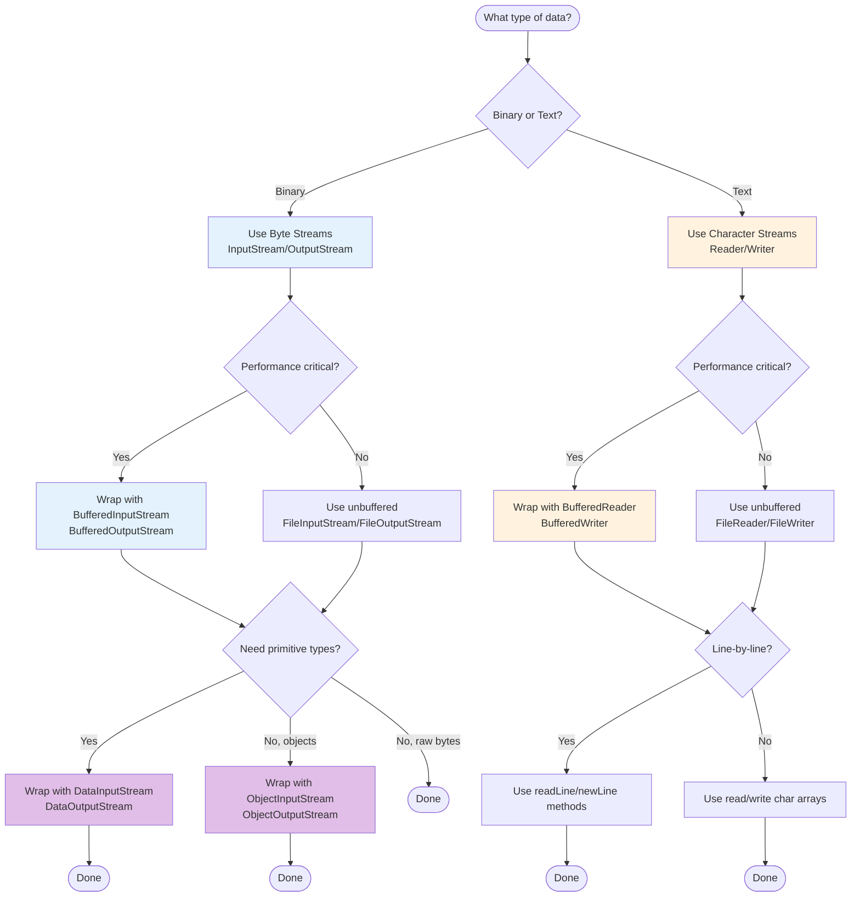
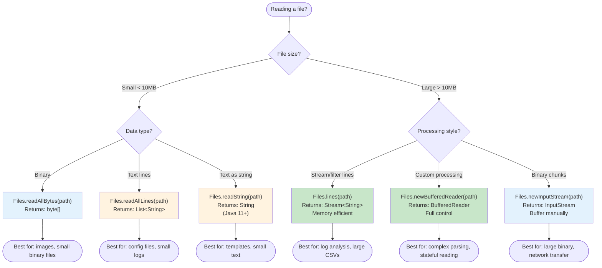
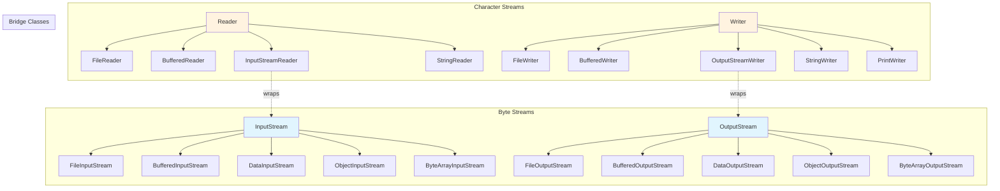
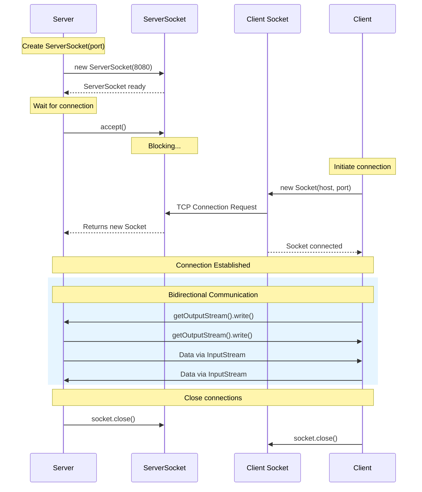
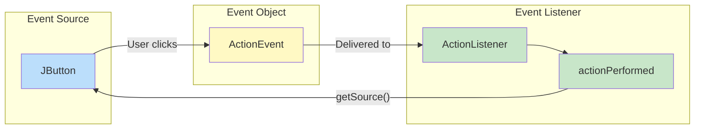

---
tags:
  - "#CCT2"
  - OO
  - Java
  - Programming
Topic: Data streams | Input and output streams | Designing and working with streams | Example cases with network sockets (UDP and TCP) | Events and event listeners
Semester: CCT2
Course: Objektorienteret analyse, design og implementering + Java
Litterature:
  - Oracle - Docs - IO
  - Tutorialspoint - Java Networking
  - Oracle - Docs - Events
  - Oracle - Docs - Events - Rules
Created: 18-03-2026
---
# Java Basic I/O, Networking, and Event Listeners

| Concept | Package/Class | Key Purpose |
|---------|---------------|-------------|
| **I/O Streams** | `java.io` | Handle input and output operations |
| **File I/O (NIO.2)** | `java.nio.file` | Modern file system operations |
| **Byte Streams** | `InputStream`, `OutputStream` | Raw binary data I/O |
| **Character Streams** | `Reader`, `Writer` | Character data with encoding support |
| **Buffered Streams** | `BufferedReader`, `BufferedWriter` | Optimized I/O with buffering |
| **Data Streams** | `DataInputStream`, `DataOutputStream` | Primitive types and String I/O |
| **Object Streams** | `ObjectInputStream`, `ObjectOutputStream` | Object serialization |
| **Path** | `java.nio.file.Path` | Represents file system paths |
| **Files** | `java.nio.file.Files` | File operations (copy, move, delete) |
| **Socket** | `java.net.Socket` | Client-side TCP connection |
| **ServerSocket** | `java.net.ServerSocket` | Server-side TCP listener |
| **InetAddress** | `java.net.InetAddress` | IP address representation |
| **Event Listeners** | `java.awt.event`, `javax.swing.event` | Handle GUI events |
| **EventObject** | `java.util.EventObject` | Base class for all events |

_Table 1: Quick reference of core Java I/O, Networking, and Event concepts_

### Common Method Signatures

| Class | Method | Return Type | Description |
|-------|--------|-------------|-------------|
| `Files` | `readAllBytes(Path path)` | `byte[]` | Read entire file as bytes |
| `Files` | `readAllLines(Path path)` | `List<String>` | Read all lines as list |
| `Files` | `write(Path path, byte[] bytes)` | `Path` | Write bytes to file |
| `Files` | `copy(Path src, Path dst, CopyOption...)` | `Path` | Copy file with options |
| `Files` | `move(Path src, Path dst, CopyOption...)` | `Path` | Move/rename file |
| `Files` | `delete(Path path)` | `void` | Delete file or empty directory |
| `Files` | `exists(Path path)` | `boolean` | Check if file exists |
| `Files` | `walk(Path start)` | `Stream<Path>` | Recursively traverse directory |
| `Path` | `resolve(String other)` | `Path` | Combine paths |
| `Path` | `getFileName()` | `Path` | Get file/directory name |
| `Path` | `toAbsolutePath()` | `Path` | Convert to absolute path |
| `Socket` | `getInputStream()` | `InputStream` | Get input stream for reading |
| `Socket` | `getOutputStream()` | `OutputStream` | Get output stream for writing |
| `ServerSocket` | `accept()` | `Socket` | Wait for and accept connection |
| `EventObject` | `getSource()` | `Object` | Get object that fired event |

_Table 2: Quick reference of commonly used method signatures across I/O, File, Networking, and Event APIs_

---

## I/O Streams

>[!abstract] Core Concept
>I/O Streams provide a powerful abstraction for input/output operations in Java. A stream represents a flow of data from a source to a destination, simplifying the process of reading and writing data regardless of the underlying source or target.

### Choosing the Right Stream Type

Use the following decision flowchart to select the appropriate stream type for your use case:



_Figure 1: Decision flowchart for selecting appropriate I/O stream types based on data type, performance needs, and processing requirements_

### Choosing File Reading Methods



_Figure 2: Decision flowchart for selecting the appropriate file reading method based on file size, data type, and processing requirements_

### I/O Stream Class Hierarchy

The following diagram illustrates the inheritance relationships among the major I/O stream classes:



_Figure 3: Java I/O Stream class hierarchy showing inheritance relationships between byte streams (blue) and character streams (orange), with bridge classes connecting the two hierarchies_

---

### Byte Streams

>[!info] Definition: Byte Streams
>Byte streams handle I/O operations on raw binary data. They read and write data one byte at a time and are represented by the `InputStream` and `OutputStream` classes and their subclasses.

**Key characteristics:**
- Process data in 8-bit bytes
- Suitable for all types of data (text, images, audio, video)
- Base classes: `InputStream` and `OutputStream`
- Common subclasses: `FileInputStream`, `FileOutputStream`, `ByteArrayInputStream`

>[!example] Basic Byte Stream Usage
>```java
>// Reading bytes from a file
>try (FileInputStream in = new FileInputStream("input.dat");
>     FileOutputStream out = new FileOutputStream("output.dat")) {
>    
>    int byteData;
>    while ((byteData = in.read()) != -1) {
>        out.write(byteData);  // Copy byte-by-byte
>    }
>    // Output: File "output.dat" created with identical content to "input.dat"
>} catch (IOException e) {
>    e.printStackTrace();
>}
>```
>
>This example demonstrates:
>1. Opening input and output byte streams using try-with-resources
>2. Reading data one byte at a time with `read()`
>3. Writing each byte to the output stream
>4. Automatic stream closure when the try block completes

---

### Character Streams

>[!info] Definition: Character Streams
>Character streams handle I/O of character data, automatically managing translation between characters and bytes using the platform's default character encoding (or a specified encoding). They are represented by the `Reader` and `Writer` classes.

**Key characteristics:**
- Process data in 16-bit Unicode characters
- Handle character encoding/decoding automatically
- Base classes: `Reader` and `Writer`
- Common subclasses: `FileReader`, `FileWriter`, `InputStreamReader`, `OutputStreamWriter`

>[!example] Character Stream Usage
>```java
>// Reading characters from a text file
>try (FileReader reader = new FileReader("input.txt");
>     FileWriter writer = new FileWriter("output.txt")) {
>    
>    int charData;
>    while ((charData = reader.read()) != -1) {
>        writer.write(charData);  // Copy character-by-character
>    }
>    // Output: File "output.txt" created with identical text content
>} catch (IOException e) {
>    e.printStackTrace();
>}
>```
>
>This demonstrates character-based file copying with automatic character encoding handling.

>[!tip] When to Use Character Streams
>Use character streams instead of byte streams when:
>- Working with text data
>- Need automatic character encoding/decoding
>- Processing human-readable content
>- Internationalization is important

>[!warning] Character Encoding Issues When Mixing Streams
>**Never mix byte streams and character streams carelessly when processing text data.** This can cause data corruption, especially with non-ASCII characters.
>
>**Common pitfalls:**
>- Using `FileInputStream` to read text files directly (assumes default encoding)
>- Converting between streams without specifying encoding explicitly
>- Mixing `getBytes()` and `new String(bytes)` without charset
>
>**Safe approach:**
>```java
>// WRONG - uses platform default encoding (unpredictable)
>byte[] bytes = text.getBytes();
>String recovered = new String(bytes);
>// Output: May produce garbled text on different systems!
>
>// CORRECT - explicit encoding
>byte[] bytes = text.getBytes(StandardCharsets.UTF_8);
>String recovered = new String(bytes, StandardCharsets.UTF_8);
>// Output: Consistent results across all platforms
>
>// Bridge classes with explicit encoding
>try (Reader reader = new InputStreamReader(
>        new FileInputStream("data.txt"), StandardCharsets.UTF_8);
>     Writer writer = new OutputStreamWriter(
>        new FileOutputStream("out.txt"), StandardCharsets.UTF_8)) {
>    // Process text safely
>}
>```
>
>**Rule of thumb:** Always specify `StandardCharsets.UTF_8` (or appropriate charset) when converting between bytes and characters.

---

### Buffered Streams

>[!info] Definition: Buffered Streams
>Buffered streams optimize I/O operations by reducing the number of calls to the native API. They maintain an internal buffer and read/write data in larger chunks, significantly improving performance.

**Key buffered stream classes:**
- `BufferedInputStream` / `BufferedOutputStream` (for bytes)
- `BufferedReader` / `BufferedWriter` (for characters)

>[!example] Buffered Stream Implementation
>```java
>// Efficient line-by-line reading with BufferedReader
>try (BufferedReader reader = new BufferedReader(
>        new FileReader("input.txt"));
>     BufferedWriter writer = new BufferedWriter(
>        new FileWriter("output.txt"))) {
>    
>    String line;
>    int lineCount = 0;
>    while ((line = reader.readLine()) != null) {
>        writer.write(line);
>        writer.newLine();  // Platform-independent line separator
>        lineCount++;
>    }
>    System.out.println("Processed " + lineCount + " lines");
>    // Output: Processed 42 lines (example)
>} catch (IOException e) {
>    e.printStackTrace();
>}
>```
>
>**Step-by-step breakdown:**
>1. Wrap `FileReader` with `BufferedReader` for efficient reading
>2. Wrap `FileWriter` with `BufferedWriter` for efficient writing
>3. Use `readLine()` to read entire lines at once
>4. Use `newLine()` for platform-independent line breaks
>5. Automatic flushing and closing via try-with-resources

>[!warning] Flushing Buffered Streams
>Always flush buffered output streams before closing or when immediate write is needed. While try-with-resources closes streams automatically (which flushes), explicit flushing may be needed for immediate visibility:
>```java
>writer.flush();  // Force buffered data to be written
>```

---

### Scanning and Formatting

>[!info] Scanner and Formatter
>Java provides high-level classes for parsing formatted input (`Scanner`) and generating formatted output (`Formatter`, `printf`). These classes simplify working with structured text data.

**Scanner capabilities:**
- Parse primitive types and strings from input sources
- Use delimiters and regular expressions
- Tokenize input streams

**Formatting capabilities:**
- Format output using printf-style format strings
- Support for various data types and formatting options

>[!example] Scanner Usage
>```java
>// File content: "Alice,30,75000.50\nBob,25,55000.00"
>try (Scanner scanner = new Scanner(new File("data.txt"))) {
>    scanner.useDelimiter(",|\\n");  // CSV parsing
>    
>    while (scanner.hasNext()) {
>        String name = scanner.next();
>        int age = scanner.nextInt();
>        double salary = scanner.nextDouble();
>        
>        System.out.printf("Name: %s, Age: %d, Salary: $%.2f%n",
>                         name, age, salary);
>    }
>    // Output:
>    // Name: Alice, Age: 30, Salary: $75000.50
>    // Name: Bob, Age: 25, Salary: $55000.00
>} catch (FileNotFoundException e) {
>    e.printStackTrace();
>}
>```
>
>This demonstrates:
>- Setting a custom delimiter for CSV data
>- Using type-specific methods (`nextInt()`, `nextDouble()`)
>- Formatted output with `printf()`

---

### Data Streams

>[!info] Definition: Data Streams
>Data streams handle binary I/O of primitive data types and `String` values in a machine-independent format. They are represented by `DataInputStream` and `DataOutputStream`. See also [[#Object Streams]] for serializing complete objects.

**Supported data types:**
- All primitive types (int, double, boolean, etc.)
- String values (using modified UTF-8 encoding)

>[!example] Data Stream Operations
>```java
>// Writing primitive data
>try (DataOutputStream out = new DataOutputStream(
>        new BufferedOutputStream(
>            new FileOutputStream("data.bin")))) {
>    
>    out.writeInt(42);
>    out.writeDouble(3.14159);
>    out.writeBoolean(true);
>    out.writeUTF("Hello, World!");
>    System.out.println("Data written successfully");
>    // Output: Data written successfully
>    
>} catch (IOException e) {
>    e.printStackTrace();
>}
>
>// Reading primitive data (same order)
>try (DataInputStream in = new DataInputStream(
>        new BufferedInputStream(
>            new FileInputStream("data.bin")))) {
>    
>    int number = in.readInt();           // 42
>    double pi = in.readDouble();         // 3.14159
>    boolean flag = in.readBoolean();     // true
>    String message = in.readUTF();       // "Hello, World!"
>    
>    System.out.println("Number: " + number);
>    System.out.println("Pi: " + pi);
>    System.out.println("Flag: " + flag);
>    System.out.println("Message: " + message);
>    // Output:
>    // Number: 42
>    // Pi: 3.14159
>    // Flag: true
>    // Message: Hello, World!
>    
>} catch (IOException e) {
>    e.printStackTrace();
>}
>```

>[!warning] Data Stream Order
>Data must be read in the same order it was written. The stream maintains no metadata about data types, so reading in the wrong order will cause data corruption or exceptions.

---

### Object Streams

>[!info] Definition: Object Streams
>Object streams handle binary I/O of entire objects through a process called _serialization_. They allow complex object graphs to be written to streams and reconstructed later. For simpler primitive data, see [[#Data Streams]].

**Key classes:**
- `ObjectOutputStream` - serializes objects
- `ObjectInputStream` - deserializes objects

**Requirements:**
- Classes must implement `java.io.Serializable` interface
- All instance variables must be serializable (or marked `transient`)

>[!example] Object Serialization
>```java
>// Define a serializable class
>class Employee implements Serializable {
>    private static final long serialVersionUID = 1L;
>    
>    private String name;
>    private int id;
>    private transient String password;  // Not serialized
>    
>    public Employee(String name, int id, String password) {
>        this.name = name;
>        this.id = id;
>        this.password = password;
>    }
>    
>    @Override
>    public String toString() {
>        return "Employee{name='" + name + "', id=" + id + 
>               ", password='" + password + "'}";
>    }
>}
>
>// Serialize an object
>try (ObjectOutputStream out = new ObjectOutputStream(
>        new FileOutputStream("employee.ser"))) {
>    
>    Employee emp = new Employee("Alice", 101, "secret123");
>    out.writeObject(emp);
>    System.out.println("Serialized: " + emp);
>    // Output: Serialized: Employee{name='Alice', id=101, password='secret123'}
>    
>} catch (IOException e) {
>    e.printStackTrace();
>}
>
>// Deserialize an object
>try (ObjectInputStream in = new ObjectInputStream(
>        new FileInputStream("employee.ser"))) {
>    
>    Employee emp = (Employee) in.readObject();
>    System.out.println("Deserialized: " + emp);
>    // Output: Deserialized: Employee{name='Alice', id=101, password='null'}
>    // Note: password is null because it was marked transient
>    
>} catch (IOException | ClassNotFoundException e) {
>    e.printStackTrace();
>}
>```

>[!tip] SerialVersionUID
>Always declare a `serialVersionUID` for serializable classes. This version number ensures compatibility between serialized objects and class definitions. If not specified, the JVM generates one automatically, which can cause deserialization failures after class modifications.

---

### I/O from the Command Line

>[!info] Standard Streams and Console
>Java provides access to standard input/output streams and a Console object for command-line I/O.

**Standard Streams:**
- `System.in` - standard input (InputStream)
- `System.out` - standard output (PrintStream)
- `System.err` - standard error (PrintStream)

**Console Object:**
- Provides advanced command-line I/O features
- Supports password input without echo
- May not be available in all environments (e.g., IDEs)

>[!example] Console Usage
>```java
>// Using Console for secure password input
>Console console = System.console();
>if (console == null) {
>    System.err.println("No console available");
>    // Output (in IDE): No console available
>    System.exit(1);
>}
>
>String username = console.readLine("Username: ");
>// Output: Username: _
>// User types: alice
>
>char[] password = console.readPassword("Password: ");
>// Output: Password: _
>// User types (hidden): ****
>
>System.out.println("Authenticating user: " + username);
>// Output: Authenticating user: alice
>
>try {
>    // Process credentials
>    authenticate(username, password);
>} finally {
>    // Clear password from memory
>    Arrays.fill(password, ' ');
>}
>```

---

## File I/O (NIO.2)

>[!abstract] NIO.2 Overview
>The `java.nio.file` package (introduced in Java 7) provides a modern, comprehensive API for file system operations. It addresses limitations of the legacy `java.io.File` class and offers improved performance, better error handling, and support for advanced file system features.

### java.io vs java.nio.file Comparison

| Feature | java.io (Legacy) | java.nio.file (NIO.2) |
|---------|------------------|----------------------|
| **Main Class** | `File` | `Path`, `Files` |
| **Path Representation** | Platform-dependent string | Platform-independent `Path` object |
| **Error Handling** | Returns `false` or `null` | Throws specific exceptions |
| **Symbolic Links** | Limited support | Full support |
| **File Attributes** | Basic only | Comprehensive (POSIX, DOS, etc.) |
| **Directory Traversal** | `listFiles()` returns array | `DirectoryStream`, `Files.walk()` |
| **Watch Service** | Not available | Built-in directory monitoring |
| **Atomic Operations** | Not supported | `ATOMIC_MOVE` option |
| **Copy Options** | Manual implementation | `StandardCopyOption` enum |
| **Memory Efficiency** | Creates many `File` objects | Lazy evaluation with streams |
| **Interoperability** | N/A | `file.toPath()`, `path.toFile()` |

_Table 3: Comparison of legacy java.io.File API with modern java.nio.file API_

>[!tip] When to Use Which API
>- **Use NIO.2 (`java.nio.file`)** for new code—it's more powerful, safer, and more expressive
>- **Use legacy (`java.io.File`)** only when working with older APIs that require `File` objects
>- **Convert between them** using `file.toPath()` and `path.toFile()` when needed

---

### What is a Path?

>[!info] Definition: Path
>A `Path` represents a file or directory location in the file system. It is a more powerful and flexible alternative to `java.io.File`, providing both absolute and relative path representations independent of the underlying operating system.

**Path characteristics:**
- Platform-independent representation
- Can represent files or directories (even if they don't exist)
- Supports both absolute and relative paths
- Immutable object

>[!example] Creating Path Objects
>```java
>// Using Paths.get() - most common approach
>Path path1 = Paths.get("C:\\Users\\Documents\\file.txt");
>Path path2 = Paths.get("/home/user/documents/file.txt");
>Path path3 = Paths.get("relative/path/file.txt");
>
>System.out.println("Path 1: " + path1);
>// Output (Windows): Path 1: C:\Users\Documents\file.txt
>
>System.out.println("Path 2: " + path2);
>// Output (Unix): Path 2: /home/user/documents/file.txt
>
>// Using Path.of() - Java 11+
>Path path4 = Path.of("data", "files", "input.txt");
>System.out.println("Path 4: " + path4);
>// Output: Path 4: data/files/input.txt (or data\files\input.txt on Windows)
>
>// Converting from File
>File file = new File("legacy.txt");
>Path path5 = file.toPath();
>System.out.println("Converted: " + path5);
>// Output: Converted: legacy.txt
>
>// Get current directory
>Path currentDir = Paths.get("").toAbsolutePath();
>System.out.println("Current: " + currentDir);
>// Output: Current: /home/user/projects/myapp (example)
>```

---

### Path Operations

>[!info] Path Class Methods
>The `Path` class provides numerous methods for syntactic path manipulation—operations that work with the path itself without accessing the file system.

**Common Path operations:**
- `getFileName()` - returns the file/directory name
- `getParent()` - returns the parent path
- `getRoot()` - returns the root component
- `normalize()` - removes redundant elements
- `resolve()` - combines paths
- `relativize()` - creates a relative path between two paths

The following diagram visualizes how these operations transform paths:

```mermaid
flowchart TB
    subgraph "normalize()"
        N1["/home/user/../user/./docs/file.txt"]
        N2["/home/user/docs/file.txt"]
        N1 -->|"Remove .. and ."| N2
    end
    
    subgraph "resolve()"
        R1["/home/user"]
        R2["docs/file.txt"]
        R3["/home/user/docs/file.txt"]
        R1 -->|"+ resolve"| R2
        R2 -->|"="| R3
    end
    
    subgraph "relativize()"
        REL1["/home/user/docs"]
        REL2["/home/user/images/photo.jpg"]
        REL3["../images/photo.jpg"]
        REL1 -->|"relativize to"| REL2
        REL2 -->|"="| REL3
    end
    
    subgraph "getParent() chain"
        P1["/home/user/docs/file.txt"]
        P2["/home/user/docs"]
        P3["/home/user"]
        P4["/home"]
        P5["/"]
        P1 -->|getParent| P2
        P2 -->|getParent| P3
        P3 -->|getParent| P4
        P4 -->|getParent| P5
    end
    
    subgraph "Component extraction"
        C1["/home/user/docs/file.txt"]
        C2["getRoot() → /"]
        C3["getFileName() → file.txt"]
        C4["getName(0) → home"]
        C5["getName(2) → docs"]
        C1 --> C2
        C1 --> C3
        C1 --> C4
        C1 --> C5
    end
    
    style N2 fill:#c8e6c9
    style R3 fill:#c8e6c9
    style REL3 fill:#c8e6c9
    style P5 fill:#fff9c4
    style C1 fill:#e3f2fd
```



_Figure 4: Visual representation of Path operations showing normalize, resolve, relativize, parent traversal, and component extraction transformations_

>[!example] Path Manipulation
>```java
>Path path = Paths.get("/home/user/documents/project/src/Main.java");
>
>// Extract components
>Path fileName = path.getFileName();
>System.out.println("File name: " + fileName);
>// Output: File name: Main.java
>
>Path parent = path.getParent();
>System.out.println("Parent: " + parent);
>// Output: Parent: /home/user/documents/project/src
>
>Path root = path.getRoot();
>System.out.println("Root: " + root);
>// Output: Root: /
>
>int nameCount = path.getNameCount();
>System.out.println("Name count: " + nameCount);
>// Output: Name count: 6
>
>Path subpath = path.subpath(0, 3);
>System.out.println("Subpath(0,3): " + subpath);
>// Output: Subpath(0,3): home/user/documents
>
>// Path manipulation - normalize
>Path messy = Paths.get("/home/user/../user/./file.txt");
>Path normalized = messy.normalize();
>System.out.println("Normalized: " + normalized);
>// Output: Normalized: /home/user/file.txt
>
>// Path manipulation - resolve
>Path base = Paths.get("/home/user");
>Path resolved = base.resolve("documents/file.txt");
>System.out.println("Resolved: " + resolved);
>// Output: Resolved: /home/user/documents/file.txt
>
>// Path manipulation - relativize
>Path path1 = Paths.get("/home/user/documents");
>Path path2 = Paths.get("/home/user/images/photo.jpg");
>Path relative = path1.relativize(path2);
>System.out.println("Relative: " + relative);
>// Output: Relative: ../images/photo.jpg
>```

---

### File Operations

>[!info] Files Utility Class
>The `java.nio.file.Files` class provides static methods for common file operations: checking existence, reading/writing, copying, moving, and deleting files.

#### Checking a File or Directory

>[!example] Existence and Accessibility Checks
>```java
>Path path = Paths.get("document.txt");
>
>// Check existence
>boolean exists = Files.exists(path);
>boolean notExists = Files.notExists(path);
>System.out.println("Exists: " + exists + ", Not exists: " + notExists);
>// Output: Exists: true, Not exists: false (if file exists)
>
>// Check accessibility
>boolean isReadable = Files.isReadable(path);
>boolean isWritable = Files.isWritable(path);
>boolean isExecutable = Files.isExecutable(path);
>System.out.println("R:" + isReadable + " W:" + isWritable + " X:" + isExecutable);
>// Output: R:true W:true X:false (typical for text file)
>
>// Check file type
>boolean isRegularFile = Files.isRegularFile(path);
>boolean isDirectory = Files.isDirectory(path);
>boolean isSymbolicLink = Files.isSymbolicLink(path);
>System.out.println("File:" + isRegularFile + " Dir:" + isDirectory);
>// Output: File:true Dir:false
>
>// Check if paths point to same file
>Path path2 = Paths.get("./document.txt");
>boolean isSame = Files.isSameFile(path, path2);
>System.out.println("Same file: " + isSame);
>// Output: Same file: true
>```

#### Deleting a File or Directory

>[!example] Delete Operations
>```java
>Path file = Paths.get("temp.txt");
>
>// Delete - throws exception if file doesn't exist
>try {
>    Files.delete(file);
>    System.out.println("File deleted successfully");
>    // Output: File deleted successfully
>} catch (NoSuchFileException e) {
>    System.err.println("File not found: " + e.getMessage());
>    // Output: File not found: temp.txt
>} catch (IOException e) {
>    System.err.println("Delete failed: " + e.getMessage());
>}
>
>// Delete if exists - returns boolean, no exception
>boolean deleted = Files.deleteIfExists(file);
>System.out.println("Deleted: " + deleted);
>// Output: Deleted: false (already deleted above)
>```

>[!warning] Directory Deletion
>Directories must be empty before deletion. Use recursive deletion for non-empty directories (see [[#Walking the File Tree]] section).

#### Copying a File or Directory

>[!example] Copy Operations
>```java
>Path source = Paths.get("source.txt");
>Path target = Paths.get("backup/source.txt");
>
>// Basic copy
>Files.copy(source, target);
>System.out.println("Copied to: " + target);
>// Output: Copied to: backup/source.txt
>
>// Copy with options
>Files.copy(source, target,
>    StandardCopyOption.REPLACE_EXISTING,
>    StandardCopyOption.COPY_ATTRIBUTES);
>System.out.println("Copied with attributes preserved");
>// Output: Copied with attributes preserved
>
>// Copy from InputStream
>try (InputStream in = new FileInputStream("data.bin")) {
>    long bytesCopied = Files.copy(in, target, 
>        StandardCopyOption.REPLACE_EXISTING);
>    System.out.println("Copied " + bytesCopied + " bytes");
>    // Output: Copied 1024 bytes (example)
>}
>
>// Copy to OutputStream
>try (OutputStream out = new FileOutputStream("output.bin")) {
>    long bytesCopied = Files.copy(source, out);
>    System.out.println("Copied " + bytesCopied + " bytes to stream");
>    // Output: Copied 256 bytes to stream (example)
>}
>```

**Copy Options:**
- `REPLACE_EXISTING` - overwrite target if it exists
- `COPY_ATTRIBUTES` - copy file attributes (timestamp, permissions)
- `NOFOLLOW_LINKS` - don't follow symbolic links

#### Moving a File or Directory

>[!example] Move Operations
>```java
>Path source = Paths.get("oldname.txt");
>Path target = Paths.get("newname.txt");
>
>// Basic move (rename)
>Files.move(source, target);
>System.out.println("Moved to: " + target);
>// Output: Moved to: newname.txt
>
>// Move with options
>Files.move(source, target,
>    StandardCopyOption.REPLACE_EXISTING,
>    StandardCopyOption.ATOMIC_MOVE);
>System.out.println("Atomic move completed");
>// Output: Atomic move completed
>```

>[!tip] Atomic Move
>The `ATOMIC_MOVE` option ensures the move operation is atomic (all-or-nothing). This is useful for preventing data corruption but may not be supported on all file systems.

---

### Managing Metadata

>[!info] File Attributes
>File metadata includes information such as size, timestamps, permissions, and ownership. The NIO.2 API provides several ways to access and modify this metadata.

>[!example] Basic File Attributes
>```java
>Path file = Paths.get("document.txt");
>
>// Get basic attributes
>long size = Files.size(file);
>FileTime lastModified = Files.getLastModifiedTime(file);
>System.out.println("Size: " + size + " bytes");
>System.out.println("Modified: " + lastModified);
>// Output: Size: 1234 bytes
>// Output: Modified: 2024-01-15T10:30:00Z
>
>// Set last modified time
>FileTime newTime = FileTime.fromMillis(System.currentTimeMillis());
>Files.setLastModifiedTime(file, newTime);
>System.out.println("Updated modification time");
>// Output: Updated modification time
>
>// Read all basic attributes at once
>BasicFileAttributes attrs = Files.readAttributes(file, BasicFileAttributes.class);
>
>System.out.println("Creation time: " + attrs.creationTime());
>System.out.println("Last modified: " + attrs.lastModifiedTime());
>System.out.println("Last accessed: " + attrs.lastAccessTime());
>System.out.println("Size: " + attrs.size());
>System.out.println("Is directory: " + attrs.isDirectory());
>System.out.println("Is regular file: " + attrs.isRegularFile());
>System.out.println("Is symbolic link: " + attrs.isSymbolicLink());
>// Output:
>// Creation time: 2024-01-10T08:00:00Z
>// Last modified: 2024-01-15T10:30:00Z
>// Last accessed: 2024-01-15T14:22:00Z
>// Size: 1234
>// Is directory: false
>// Is regular file: true
>// Is symbolic link: false
>```

>[!example] POSIX File Permissions (Unix/Linux)
>```java
>Path file = Paths.get("script.sh");
>
>// Read POSIX attributes
>PosixFileAttributes posixAttrs = 
>    Files.readAttributes(file, PosixFileAttributes.class);
>
>System.out.println("Owner: " + posixAttrs.owner().getName());
>System.out.println("Group: " + posixAttrs.group().getName());
>System.out.println("Permissions: " + 
>    PosixFilePermissions.toString(posixAttrs.permissions()));
>// Output:
>// Owner: alice
>// Group: developers
>// Permissions: rw-r--r--
>
>// Set permissions (rwxr-xr-x)
>Set<PosixFilePermission> perms = PosixFilePermissions.fromString("rwxr-xr-x");
>Files.setPosixFilePermissions(file, perms);
>System.out.println("Permissions updated to: rwxr-xr-x");
>// Output: Permissions updated to: rwxr-xr-x
>```

---

### Reading, Writing, and Creating Files

>[!info] File I/O with NIO.2
>The `Files` class provides convenient methods for common file I/O operations, from simple read/write to stream-based processing.

#### Simple Read/Write Operations

>[!example] Reading Entire Files
>```java
>Path file = Paths.get("data.txt");
>
>// Read all bytes
>byte[] bytes = Files.readAllBytes(file);
>System.out.println("Read " + bytes.length + " bytes");
>// Output: Read 256 bytes
>
>// Read all lines (for text files)
>List<String> lines = Files.readAllLines(file);
>System.out.println("Read " + lines.size() + " lines");
>System.out.println("First line: " + lines.get(0));
>// Output: Read 10 lines
>// Output: First line: Hello, World!
>
>// Read all lines with specific charset
>List<String> linesUTF8 = Files.readAllLines(file, StandardCharsets.UTF_8);
>
>// Process lines as stream (memory efficient for large files)
>try (Stream<String> stream = Files.lines(file)) {
>    long errorCount = stream
>        .filter(line -> line.contains("error"))
>        .count();
>    System.out.println("Found " + errorCount + " error lines");
>    // Output: Found 3 error lines
>}
>```

>[!example] Writing Entire Files
>```java
>Path file = Paths.get("output.txt");
>
>// Write bytes
>byte[] bytes = "Hello, World!".getBytes();
>Files.write(file, bytes);
>System.out.println("Wrote " + bytes.length + " bytes");
>// Output: Wrote 13 bytes
>
>// Write lines
>List<String> lines = Arrays.asList("Line 1", "Line 2", "Line 3");
>Files.write(file, lines);
>System.out.println("Wrote " + lines.size() + " lines");
>// Output: Wrote 3 lines
>
>// Write with options (append mode)
>List<String> moreLines = Arrays.asList("Line 4", "Line 5");
>Files.write(file, moreLines,
>    StandardCharsets.UTF_8,
>    StandardOpenOption.CREATE,
>    StandardOpenOption.APPEND);
>System.out.println("Appended " + moreLines.size() + " lines");
>// Output: Appended 2 lines
>```

**Common Open Options:**
- `CREATE` - create file if it doesn't exist
- `CREATE_NEW` - create file, fail if exists
- `APPEND` - append to existing file
- `TRUNCATE_EXISTING` - clear existing content
- `WRITE` - open for write access
- `READ` - open for read access

#### Stream-Based I/O

>[!example] BufferedReader/BufferedWriter
>```java
>Path input = Paths.get("input.txt");
>Path output = Paths.get("output.txt");
>
>// Reading with BufferedReader
>try (BufferedReader reader = Files.newBufferedReader(input)) {
>    String line;
>    int lineNum = 0;
>    while ((line = reader.readLine()) != null) {
>        lineNum++;
>        System.out.println(lineNum + ": " + line);
>    }
>    // Output:
>    // 1: First line of text
>    // 2: Second line of text
>    // 3: Third line of text
>}
>
>// Writing with BufferedWriter
>try (BufferedWriter writer = Files.newBufferedWriter(output)) {
>    writer.write("First line");
>    writer.newLine();
>    writer.write("Second line");
>    System.out.println("File written successfully");
>    // Output: File written successfully
>}
>```

>[!example] InputStream/OutputStream
>```java
>Path input = Paths.get("data.bin");
>Path output = Paths.get("copy.bin");
>
>// Reading with InputStream
>try (InputStream in = Files.newInputStream(input)) {
>    byte[] buffer = new byte[1024];
>    int bytesRead;
>    int totalBytes = 0;
>    while ((bytesRead = in.read(buffer)) != -1) {
>        totalBytes += bytesRead;
>        // Process buffer
>    }
>    System.out.println("Read " + totalBytes + " bytes total");
>    // Output: Read 4096 bytes total
>}
>
>// Writing with OutputStream
>try (OutputStream out = Files.newOutputStream(output)) {
>    byte[] data = "Binary content".getBytes();
>    out.write(data);
>    System.out.println("Wrote " + data.length + " bytes");
>    // Output: Wrote 14 bytes
>}
>```

---

### Random Access Files

>[!info] Definition: Random Access Files
>Random access files allow non-sequential reading and writing. You can jump to any position in the file using a file pointer, making them ideal for databases, file indexes, and other applications requiring direct access to specific file locations.

>[!example] SeekableByteChannel Usage
>```java
>Path file = Paths.get("data.bin");
>
>// Read from specific position
>try (SeekableByteChannel channel = Files.newByteChannel(file)) {
>    ByteBuffer buffer = ByteBuffer.allocate(10);
>    
>    // Read from beginning
>    int bytesRead = channel.read(buffer);
>    System.out.println("Read " + bytesRead + " bytes from start");
>    // Output: Read 10 bytes from start
>    
>    // Jump to position 100
>    channel.position(100);
>    buffer.clear();
>    bytesRead = channel.read(buffer);
>    System.out.println("Read " + bytesRead + " bytes from position 100");
>    // Output: Read 10 bytes from position 100
>    
>    // Get current position
>    long position = channel.position();
>    System.out.println("Current position: " + position);
>    // Output: Current position: 110
>    
>    // Get file size
>    long size = channel.size();
>    System.out.println("File size: " + size + " bytes");
>    // Output: File size: 1024 bytes
>}
>
>// Write at specific position
>try (SeekableByteChannel channel = Files.newByteChannel(file,
>        StandardOpenOption.WRITE)) {
>    
>    ByteBuffer buffer = ByteBuffer.wrap("UPDATED".getBytes());
>    
>    // Overwrite data at position 50
>    channel.position(50);
>    int bytesWritten = channel.write(buffer);
>    System.out.println("Wrote " + bytesWritten + " bytes at position 50");
>    // Output: Wrote 7 bytes at position 50
>}
>```

---

### Creating and Reading Directories

>[!example] Directory Operations
>```java
>Path dir = Paths.get("mydir");
>
>// Create single directory
>Files.createDirectory(dir);
>System.out.println("Created: " + dir);
>// Output: Created: mydir
>
>// Create directory and all parent directories
>Path deepDir = Paths.get("path/to/nested/directory");
>Files.createDirectories(deepDir);
>System.out.println("Created: " + deepDir);
>// Output: Created: path/to/nested/directory
>
>// Create temporary directory
>Path tempDir = Files.createTempDirectory("prefix");
>System.out.println("Temp dir: " + tempDir);
>// Output: Temp dir: /tmp/prefix8234234234234
>
>// List directory contents
>System.out.println("Contents of " + dir + ":");
>try (DirectoryStream<Path> stream = Files.newDirectoryStream(dir)) {
>    for (Path entry : stream) {
>        System.out.println("  " + entry.getFileName());
>    }
>    // Output:
>    // Contents of mydir:
>    //   file1.txt
>    //   file2.txt
>    //   subdir
>}
>
>// List with filter (glob pattern)
>System.out.println("Text files:");
>try (DirectoryStream<Path> stream = 
>        Files.newDirectoryStream(dir, "*.txt")) {
>    for (Path entry : stream) {
>        System.out.println("  " + entry);
>    }
>    // Output:
>    // Text files:
>    //   mydir/file1.txt
>    //   mydir/file2.txt
>}
>```

>[!tip] Glob Patterns
>Glob patterns for filtering:
>- `*.txt` - all .txt files
>- `*.{java,class}` - all .java and .class files
>- `foo.?` - foo.a, foo.b, etc.
>- `*.*` - all files with an extension

---

### Walking the File Tree

>[!info] File Tree Traversal
>The `Files.walk()` and `Files.walkFileTree()` methods allow recursive traversal of directory structures, useful for operations like searching, deleting, or copying entire directory trees.

>[!example] Walking with Stream API
>```java
>Path start = Paths.get(".");
>
>// Find all .java files
>System.out.println("Java files found:");
>try (Stream<Path> stream = Files.walk(start)) {
>    stream.filter(path -> path.toString().endsWith(".java"))
>          .forEach(path -> System.out.println("  " + path));
>    // Output:
>    // Java files found:
>    //   ./src/Main.java
>    //   ./src/utils/Helper.java
>    //   ./test/MainTest.java
>}
>
>// Find all files larger than 1MB
>System.out.println("Large files (>1MB):");
>try (Stream<Path> stream = Files.walk(start)) {
>    stream.filter(Files::isRegularFile)
>          .filter(path -> {
>              try {
>                  return Files.size(path) > 1024 * 1024;
>              } catch (IOException e) {
>                  return false;
>              }
>          })
>          .forEach(path -> System.out.println("  " + path));
>    // Output:
>    // Large files (>1MB):
>    //   ./lib/dependency.jar
>    //   ./data/large-dataset.csv
>}
>```

>[!example] Custom FileVisitor
>```java
>// Delete directory tree
>class DeleteFileVisitor extends SimpleFileVisitor<Path> {
>    private int filesDeleted = 0;
>    private int dirsDeleted = 0;
>    
>    @Override
>    public FileVisitResult visitFile(Path file, BasicFileAttributes attrs)
>            throws IOException {
>        Files.delete(file);
>        filesDeleted++;
>        return FileVisitResult.CONTINUE;
>    }
>    
>    @Override
>    public FileVisitResult postVisitDirectory(Path dir, IOException exc)
>            throws IOException {
>        Files.delete(dir);
>        dirsDeleted++;
>        return FileVisitResult.CONTINUE;
>    }
>    
>    public void printStats() {
>        System.out.println("Deleted " + filesDeleted + " files and " + 
>                          dirsDeleted + " directories");
>    }
>}
>
>// Use the visitor
>Path directory = Paths.get("temp");
>DeleteFileVisitor visitor = new DeleteFileVisitor();
>Files.walkFileTree(directory, visitor);
>visitor.printStats();
>// Output: Deleted 15 files and 3 directories
>```

**FileVisitResult values:**
- `CONTINUE` - continue traversal
- `TERMINATE` - stop traversal immediately
- `SKIP_SUBTREE` - skip current directory's contents
- `SKIP_SIBLINGS` - skip remaining siblings

---

### Finding Files

>[!info] Pattern Matching
>The `PathMatcher` interface allows searching for files using glob or regex patterns.

>[!example] Finding Files with PathMatcher
>```java
>Path start = Paths.get("src");
>String pattern = "glob:**/*.java";  // or "regex:.*\\.java"
>
>PathMatcher matcher = FileSystems.getDefault().getPathMatcher(pattern);
>
>System.out.println("Matching files:");
>try (Stream<Path> stream = Files.walk(start)) {
>    stream.filter(path -> matcher.matches(path))
>          .forEach(path -> System.out.println("  " + path));
>    // Output:
>    // Matching files:
>    //   src/Main.java
>    //   src/util/Helper.java
>}
>
>// Using find() method with size filter
>System.out.println("Large Java files (>10KB):");
>try (Stream<Path> stream = Files.find(start, Integer.MAX_VALUE,
>        (path, attrs) -> matcher.matches(path) && 
>                        attrs.size() > 10000)) {
>    stream.forEach(path -> System.out.println("  " + path));
>    // Output:
>    // Large Java files (>10KB):
>    //   src/Main.java
>}
>```

---

### Watching a Directory for Changes

>[!info] WatchService
>The `WatchService` API monitors directories for changes (file creation, modification, deletion), enabling applications to respond to file system events in real-time.

>[!example] Directory Watching
>```java
>Path dir = Paths.get("watched");
>
>try (WatchService watcher = FileSystems.getDefault().newWatchService()) {
>    
>    // Register directory with events to watch
>    dir.register(watcher,
>        StandardWatchEventKinds.ENTRY_CREATE,
>        StandardWatchEventKinds.ENTRY_DELETE,
>        StandardWatchEventKinds.ENTRY_MODIFY);
>    
>    System.out.println("Watching directory: " + dir);
>    // Output: Watching directory: watched
>    
>    // Watch for events
>    while (true) {
>        WatchKey key = watcher.take();  // Blocks until event occurs
>        
>        for (WatchEvent<?> event : key.pollEvents()) {
>            WatchEvent.Kind<?> kind = event.kind();
>            
>            if (kind == StandardWatchEventKinds.OVERFLOW) {
>                continue;
>            }
>            
>            WatchEvent<Path> ev = (WatchEvent<Path>) event;
>            Path filename = ev.context();
>            
>            System.out.printf("%s: %s%n", kind.name(), filename);
>            // Output examples:
>            // ENTRY_CREATE: newfile.txt
>            // ENTRY_MODIFY: existingfile.txt
>            // ENTRY_DELETE: oldfile.txt
>        }
>        
>        // Reset key and remove if directory no longer accessible
>        if (!key.reset()) {
>            break;
>        }
>    }
>}
>```

**Watch Event Kinds:**
- `ENTRY_CREATE` - file/directory created
- `ENTRY_DELETE` - file/directory deleted
- `ENTRY_MODIFY` - file/directory modified
- `OVERFLOW` - events may have been lost

---

### Legacy File I/O Code

>[!info] Migrating from java.io.File
>The legacy `java.io.File` class can be converted to modern `Path` API for better functionality and performance.

| java.io.File Method | java.nio.file Equivalent |
|---------------------|--------------------------|
| `file.delete()` | `Files.delete(path)` |
| `file.exists()` | `Files.exists(path)` |
| `file.isDirectory()` | `Files.isDirectory(path)` |
| `file.isFile()` | `Files.isRegularFile(path)` |
| `file.length()` | `Files.size(path)` |
| `file.lastModified()` | `Files.getLastModifiedTime(path)` |
| `file.setLastModified(time)` | `Files.setLastModifiedTime(path, fileTime)` |
| `file.listFiles()` | `Files.newDirectoryStream(path)` |
| `file.mkdir()` | `Files.createDirectory(path)` |
| `file.mkdirs()` | `Files.createDirectories(path)` |
| `file.renameTo(dest)` | `Files.move(path, target)` |

_Table 4: Mapping of java.io.File methods to java.nio.file API_

>[!example] Conversion Example
>```java
>// Old approach (java.io.File)
>File file = new File("document.txt");
>if (file.exists() && file.isFile()) {
>    long size = file.length();
>    boolean deleted = file.delete();
>    System.out.println("Legacy - Size: " + size + ", Deleted: " + deleted);
>    // Output: Legacy - Size: 1234, Deleted: true
>}
>
>// New approach (java.nio.file)
>Path path = Paths.get("document.txt");
>if (Files.exists(path) && Files.isRegularFile(path)) {
>    long size = Files.size(path);
>    Files.delete(path);  // Throws exception on failure
>    System.out.println("NIO.2 - Size: " + size + ", Deleted successfully");
>    // Output: NIO.2 - Size: 1234, Deleted successfully
>}
>
>// Convert between File and Path
>File legacyFile = new File("old.txt");
>Path modernPath = legacyFile.toPath();
>File backToFile = modernPath.toFile();
>
>System.out.println("File -> Path: " + modernPath);
>System.out.println("Path -> File: " + backToFile);
>// Output: File -> Path: old.txt
>// Output: Path -> File: old.txt
>```

---

## Java Networking

>[!abstract] Networking Overview
>Java provides robust networking capabilities through the `java.net` package, enabling applications to communicate across networks using standard protocols like TCP and UDP. The socket programming model allows creation of client-server applications.

### Network Protocols

>[!info] TCP vs UDP
>Java supports two primary transport protocols:
>
>**TCP (Transmission Control Protocol):**
>- Connection-oriented and reliable
>- Guarantees packet delivery and order
>- Automatic error checking and retransmission
>- Used for most network applications
>- Higher overhead but more reliable
>
>**UDP (User Datagram Protocol):**
>- Connectionless and lightweight
>- No delivery or ordering guarantees
>- Minimal overhead
>- Used for streaming, gaming, DNS
>- Faster but less reliable

---

### Socket Programming Fundamentals

>[!info] Socket Communication Model
>Sockets provide a bidirectional communication channel between two applications. The client initiates a connection to a server listening on a specific port. Once connected, both can send and receive data through input and output streams.

**Connection Process:**
1. Server creates `ServerSocket` and listens on a port
2. Server calls `accept()`, blocking until client connects
3. Client creates `Socket` to server's address and port
4. Server's `accept()` returns a new `Socket` for this client
5. Both client and server obtain I/O streams from their sockets (see [[#I/O Streams]])
6. Data exchange occurs through these streams
7. Connections are closed when communication completes



_Figure 5: TCP Socket Connection sequence diagram showing server listening, client connecting, bidirectional data flow, and connection cleanup_

---

### ServerSocket Class

>[!info] ServerSocket Constructors
>The `ServerSocket` class enables server applications to listen for incoming client connections on a specified port.

**Constructor Signatures:**

| Constructor | Description |
|-------------|-------------|
| `ServerSocket(int port)` | Creates socket on specified port |
| `ServerSocket(int port, int backlog)` | Includes queue size for pending connections |
| `ServerSocket(int port, int backlog, InetAddress addr)` | Binds to specific local IP address |
| `ServerSocket()` | Creates unbound socket, use `bind()` later |

_Table 5: ServerSocket constructor options and their purposes_

>[!example] ServerSocket Creation
>```java
>// Simple server on port 8080
>ServerSocket server1 = new ServerSocket(8080);
>System.out.println("Server listening on port: " + server1.getLocalPort());
>// Output: Server listening on port: 8080
>
>// With connection queue of 50
>ServerSocket server2 = new ServerSocket(8080, 50);
>System.out.println("Server with backlog 50 created");
>// Output: Server with backlog 50 created
>
>// Bind to specific network interface
>InetAddress localAddr = InetAddress.getByName("192.168.1.100");
>ServerSocket server3 = new ServerSocket(8080, 50, localAddr);
>System.out.println("Bound to: " + localAddr.getHostAddress());
>// Output: Bound to: 192.168.1.100
>
>// Create unbound, then bind later
>ServerSocket server4 = new ServerSocket();
>SocketAddress sockaddr = new InetSocketAddress("localhost", 8080);
>server4.bind(sockaddr, 50);
>System.out.println("Bound to: " + sockaddr);
>// Output: Bound to: localhost/127.0.0.1:8080
>```

>[!info] Key ServerSocket Methods

| Method | Description |
|--------|-------------|
| `accept()` | Blocks until client connects, returns Socket |
| `getLocalPort()` | Returns port number server is listening on |
| `setSoTimeout(int timeout)` | Sets accept() timeout in milliseconds |
| `bind(SocketAddress endpoint, int backlog)` | Binds unbound socket to address |
| `close()` | Closes the server socket |

_Table 6: Essential ServerSocket methods for server operation_

>[!example] Server Implementation with Timeout
>```java
>public class TimeoutServer {
>    public static void main(String[] args) {
>        try {
>            ServerSocket server = new ServerSocket(9000);
>            server.setSoTimeout(10000);  // 10-second timeout
>            
>            System.out.println("Server waiting on port " + 
>                             server.getLocalPort());
>            // Output: Server waiting on port 9000
>            
>            Socket client = server.accept();
>            System.out.println("Client connected: " + 
>                             client.getRemoteSocketAddress());
>            // Output: Client connected: /192.168.1.50:54321
>            
>            // Handle client...
>            
>            client.close();
>            server.close();
>            System.out.println("Server shutdown complete");
>            // Output: Server shutdown complete
>            
>        } catch (SocketTimeoutException e) {
>            System.out.println("Accept timed out after 10 seconds");
>            // Output: Accept timed out after 10 seconds
>        } catch (IOException e) {
>            e.printStackTrace();
>        }
>    }
>}
>```

---

### Socket Class

>[!info] Socket Constructors
>The `Socket` class represents the client endpoint of a connection.

**Constructor Signatures:**

| Constructor | Description |
|-------------|-------------|
| `Socket(String host, int port)` | Connect to host at port |
| `Socket(InetAddress address, int port)` | Connect using InetAddress |
| `Socket(String host, int port, InetAddress localAddr, int localPort)` | Specify local binding |
| `Socket()` | Create unconnected socket, use `connect()` later |

_Table 7: Socket constructor options for client connections_

>[!example] Socket Creation
>```java
>// Simple connection
>Socket socket1 = new Socket("example.com", 80);
>System.out.println("Connected to: " + socket1.getRemoteSocketAddress());
>// Output: Connected to: example.com/93.184.216.34:80
>
>// Using InetAddress
>InetAddress addr = InetAddress.getByName("192.168.1.100");
>Socket socket2 = new Socket(addr, 8080);
>System.out.println("Connected via InetAddress");
>// Output: Connected via InetAddress
>
>// Specify local address and port (0 = any available port)
>InetAddress localAddr = InetAddress.getByName("192.168.1.50");
>Socket socket3 = new Socket("example.com", 80, localAddr, 0);
>System.out.println("Local port: " + socket3.getLocalPort());
>// Output: Local port: 54321
>
>// Connect with timeout
>Socket socket4 = new Socket();
>SocketAddress remote = new InetSocketAddress("example.com", 80);
>socket4.connect(remote, 5000);  // 5-second timeout
>System.out.println("Connected with timeout");
>// Output: Connected with timeout
>```

>[!info] Key Socket Methods

| Method | Description |
|--------|-------------|
| `getInputStream()` | Returns InputStream for reading |
| `getOutputStream()` | Returns OutputStream for writing |
| `getInetAddress()` | Returns remote address |
| `getPort()` | Returns remote port |
| `getLocalPort()` | Returns local port |
| `getRemoteSocketAddress()` | Returns remote endpoint |
| `close()` | Closes the connection |
| `setSoTimeout(int timeout)` | Sets read timeout |

_Table 8: Essential Socket methods for client-server communication_

>[!example] Client Socket Usage
>```java
>try (Socket socket = new Socket("localhost", 8080)) {
>    System.out.println("Connected to server");
>    // Output: Connected to server
>    
>    // Get I/O streams
>    OutputStream out = socket.getOutputStream();
>    InputStream in = socket.getInputStream();
>    DataOutputStream dataOut = new DataOutputStream(out);
>    DataInputStream dataIn = new DataInputStream(in);
>    
>    // Send message
>    dataOut.writeUTF("Hello Server!");
>    dataOut.flush();
>    System.out.println("Message sent");
>    // Output: Message sent
>    
>    // Receive response
>    String response = dataIn.readUTF();
>    System.out.println("Server response: " + response);
>    // Output: Server response: Hello Client!
>    
>} catch (IOException e) {
>    e.printStackTrace();
>}
>```

---

### InetAddress Class

>[!info] IP Address Representation
>The `InetAddress` class represents an IP address (IPv4 or IPv6) and provides methods for DNS lookup and address manipulation.

| Method | Description |
|--------|-------------|
| `getByName(String host)` | Returns InetAddress for hostname/IP |
| `getByAddress(byte[] addr)` | Creates InetAddress from raw bytes |
| `getLocalHost()` | Returns local machine's address |
| `getHostAddress()` | Returns IP address as string |
| `getHostName()` | Returns hostname |
| `isReachable(int timeout)` | Tests if address is reachable |

_Table 9: InetAddress methods for IP address operations_

>[!example] InetAddress Usage
>```java
>// Get address by hostname
>InetAddress google = InetAddress.getByName("www.google.com");
>System.out.println("IP: " + google.getHostAddress());
>System.out.println("Host: " + google.getHostName());
>// Output: IP: 142.250.185.68
>// Output: Host: www.google.com
>
>// Get local machine address
>InetAddress localhost = InetAddress.getLocalHost();
>System.out.println("Local IP: " + localhost.getHostAddress());
>System.out.println("Local hostname: " + localhost.getHostName());
>// Output: Local IP: 192.168.1.50
>// Output: Local hostname: mycomputer.local
>
>// Check reachability
>boolean reachable = google.isReachable(5000);
>System.out.println("Google reachable: " + reachable);
>// Output: Google reachable: true
>
>// Get all addresses for a hostname (DNS round-robin)
>InetAddress[] addresses = InetAddress.getAllByName("www.google.com");
>System.out.println("All addresses for google.com:");
>for (InetAddress addr : addresses) {
>    System.out.println("  " + addr.getHostAddress());
>}
>// Output:
>// All addresses for google.com:
>//   142.250.185.68
>//   2607:f8b0:4004:800::2004
>```

---

### Complete Client-Server Example

>[!example] Greeting Server Implementation
>```java
>import java.net.*;
>import java.io.*;
>
>public class GreetingServer extends Thread {
>    private ServerSocket serverSocket;
>    
>    public GreetingServer(int port) throws IOException {
>        serverSocket = new ServerSocket(port);
>        serverSocket.setSoTimeout(10000);  // 10-second timeout
>    }
>    
>    public void run() {
>        while (true) {
>            try {
>                System.out.println("Waiting for client on port " +
>                    serverSocket.getLocalPort() + "...");
>                // Output: Waiting for client on port 6066...
>                
>                Socket server = serverSocket.accept();
>                System.out.println("Just connected to " +
>                    server.getRemoteSocketAddress());
>                // Output: Just connected to /127.0.0.1:54321
>                
>                DataInputStream in = new DataInputStream(
>                    server.getInputStream());
>                String clientMessage = in.readUTF();
>                System.out.println("Client says: " + clientMessage);
>                // Output: Client says: Hello from /127.0.0.1:54321
>                
>                DataOutputStream out = new DataOutputStream(
>                    server.getOutputStream());
>                out.writeUTF("Thank you for connecting to " +
>                    server.getLocalSocketAddress() + "\nGoodbye!");
>                
>                server.close();
>                
>            } catch (SocketTimeoutException s) {
>                System.out.println("Socket timed out!");
>                // Output: Socket timed out!
>                break;
>            } catch (IOException e) {
>                e.printStackTrace();
>                break;
>            }
>        }
>    }
>    
>    public static void main(String[] args) {
>        int port = Integer.parseInt(args[0]);
>        try {
>            Thread t = new GreetingServer(port);
>            t.start();
>        } catch (IOException e) {
>            e.printStackTrace();
>        }
>    }
>}
>```
>
>**Step-by-step breakdown:**
>1. **Constructor**: Creates ServerSocket on specified port with 10-second timeout
>2. **run() method**: Infinite loop waiting for client connections
>3. **accept()**: Blocks until client connects or timeout occurs
>4. **DataInputStream**: Reads UTF string from client
>5. **DataOutputStream**: Sends greeting response to client
>6. **close()**: Closes client socket after communication
>7. **Exception handling**: Catches timeout and I/O exceptions
>8. **main()**: Starts server thread on specified port

>[!example] Greeting Client Implementation
>```java
>import java.net.*;
>import java.io.*;
>
>public class GreetingClient {
>    
>    public static void main(String[] args) {
>        String serverName = args[0];
>        int port = Integer.parseInt(args[1]);
>        
>        try {
>            System.out.println("Connecting to " + serverName +
>                " on port " + port);
>            // Output: Connecting to localhost on port 6066
>            
>            Socket client = new Socket(serverName, port);
>            System.out.println("Just connected to " +
>                client.getRemoteSocketAddress());
>            // Output: Just connected to localhost/127.0.0.1:6066
>            
>            OutputStream outToServer = client.getOutputStream();
>            DataOutputStream out = new DataOutputStream(outToServer);
>            out.writeUTF("Hello from " +
>                client.getLocalSocketAddress());
>            
>            InputStream inFromServer = client.getInputStream();
>            DataInputStream in = new DataInputStream(inFromServer);
>            System.out.println("Server says " + in.readUTF());
>            // Output: Server says Thank you for connecting to /127.0.0.1:6066
>            // Goodbye!
>            
>            client.close();
>            
>        } catch (IOException e) {
>            e.printStackTrace();
>        }
>    }
>}
>```
>
>**Step-by-step breakdown:**
>1. **Parse arguments**: Extract server name and port from command line
>2. **Socket creation**: Connect to server at specified address and port
>3. **Get output stream**: Obtain DataOutputStream for sending data
>4. **writeUTF()**: Send greeting message to server
>5. **Get input stream**: Obtain DataInputStream for receiving data
>6. **readUTF()**: Read server's response
>7. **close()**: Clean up connection
>8. **Exception handling**: Catch and display I/O errors

>[!example] Running the Example
>**Terminal 1 (Server):**
>```bash
>$ java GreetingServer 6066
>Waiting for client on port 6066...
>Just connected to /127.0.0.1:54321
>Client says: Hello from /127.0.0.1:54321
>Waiting for client on port 6066...
>Socket timed out!
>```
>
>**Terminal 2 (Client):**
>```bash
>$ java GreetingClient localhost 6066
>Connecting to localhost on port 6066
>Just connected to localhost/127.0.0.1:6066
>Server says Thank you for connecting to /127.0.0.1:6066
>Goodbye!
>```

>[!warning] Port Numbers
>- Ports 0-1023 are reserved for system services (require admin privileges)
>- Use ports 1024-65535 for custom applications
>- Ensure no other service is using your chosen port
>- `BindException` occurs if port is already in use

>[!tip] Best Practices for Network Programming
>- Always use try-with-resources for automatic socket cleanup
>- Set appropriate timeouts to prevent indefinite blocking
>- Handle exceptions gracefully with meaningful error messages
>- Use buffered streams for better performance (see [[#Buffered Streams]])
>- Close connections properly in finally blocks or try-with-resources
>- Consider thread pooling for servers handling multiple clients
>- Validate and sanitize all data received from network

---

## Event Listeners

>[!abstract] Event Handling Overview
>Event listeners enable Java GUI applications to respond to user interactions such as button clicks, mouse movements, and keyboard input. The event model follows the _observer pattern_—components (event sources) notify registered listeners when events occur.

### Event Handling Fundamentals

>[!info] Core Concepts
>**Event Source:** The component that generates events (e.g., button, text field)
>**Event Object:** Contains information about the event (e.g., which button, mouse coordinates)
>**Event Listener:** The object that receives and handles events
>
>The `EventObject` class (from `java.util.EventObject`) is the superclass for all AWT and Swing events. Its key method is `getSource()`, which returns the object that fired the event.



_Figure 6: Event handling flow showing event source generating event object, which is delivered to the listener for processing_

---

### Low-Level vs Semantic Events

>[!info] Event Categories
>Events are divided into two categories:
>
>**Low-Level Events:**
>- Represent window-system occurrences or direct input
>- Examples: `MouseEvent`, `KeyEvent`, `FocusEvent`, `ComponentEvent`
>- Directly tied to hardware/OS interactions
>
>**Semantic Events:**
>- Represent higher-level user actions
>- Examples: `ActionEvent`, `ItemEvent`, `ListSelectionEvent`
>- May be triggered by various low-level events
>- More portable and abstracted

>[!tip] Prefer Semantic Events
>Listen for semantic events rather than low-level events when possible. For example, listen for `ActionEvent` on a button rather than `MouseEvent`—the button will respond correctly to keyboard activation and look-and-feel-specific gestures, not just mouse clicks.

>[!example] Semantic vs Low-Level Event Handling
>```java
>// PREFERRED: Semantic event (ActionEvent)
>// Button responds to click, Enter key, accessibility features
>button.addActionListener(e -> {
>    System.out.println("Button activated!");
>    System.out.println("Source: " + e.getSource());
>    // Output: Button activated!
>    // Output: Source: javax.swing.JButton[,0,0,100x30,...]
>});
>
>// AVOID: Low-level event (MouseEvent)
>// Only responds to mouse clicks, ignores keyboard/accessibility
>button.addMouseListener(new MouseAdapter() {
>    @Override
>    public void mouseClicked(MouseEvent e) {
>        System.out.println("Mouse clicked at: " + e.getPoint());
>        // Output: Mouse clicked at: java.awt.Point[x=50,y=15]
>    }
>});
>```

---

### Design Considerations

>[!warning] Event Listener Performance
>**Event listeners must execute quickly.** All drawing and event-listening methods execute in the same thread (the Event Dispatch Thread). A slow event listener will make your program appear unresponsive and slow to repaint.
>
>**For lengthy operations:**
>- Start a new thread to perform the work
>- Use `SwingWorker` for background tasks
>- Never perform blocking I/O or heavy computation in event handlers

>[!example] Handling Long Operations
>```java
>// WRONG: Blocks the Event Dispatch Thread
>button.addActionListener(e -> {
>    System.out.println("Starting long operation...");
>    // Output: Starting long operation...
>    performLongDatabaseQuery();  // UI freezes for 5 seconds!
>    updateResults();
>    System.out.println("Done");
>    // Output (after 5 seconds): Done
>});
>
>// CORRECT: Use SwingWorker for background tasks
>button.addActionListener(e -> {
>    System.out.println("Starting background task...");
>    // Output: Starting background task...
>    
>    new SwingWorker<List<Result>, Void>() {
>        @Override
>        protected List<Result> doInBackground() {
>            System.out.println("Running in background thread");
>            // Output: Running in background thread
>            return performLongDatabaseQuery();  // Runs in background
>        }
>        
>        @Override
>        protected void done() {
>            try {
>                List<Result> results = get();
>                updateResults(results);  // Runs on EDT when complete
>                System.out.println("UI updated with " + results.size() + " results");
>                // Output: UI updated with 42 results
>            } catch (Exception ex) {
>                ex.printStackTrace();
>            }
>        }
>    }.execute();
>    
>    System.out.println("UI remains responsive!");
>    // Output: UI remains responsive! (immediately)
>});
>```

---

### Implementing Event Listeners

#### Direct Interface Implementation

>[!info] Implementing Listener Interfaces
>The most straightforward approach is to have your class implement the listener interface directly.

>[!example] Direct Implementation
>```java
>public class MyClass implements ActionListener {
>    private JButton button;
>    
>    public MyClass() {
>        button = new JButton("Click Me");
>        button.addActionListener(this);
>        System.out.println("Listener registered");
>        // Output: Listener registered
>    }
>    
>    @Override
>    public void actionPerformed(ActionEvent e) {
>        System.out.println("Button clicked!");
>        System.out.println("Action command: " + e.getActionCommand());
>        System.out.println("When: " + e.getWhen());
>        // Output: Button clicked!
>        // Output: Action command: Click Me
>        // Output: When: 1705312345678
>    }
>}
>```

---

#### Event Adapters

>[!info] Adapter Classes
>Some listener interfaces contain multiple methods (e.g., `MouseListener` has five methods). If you only need one method, implementing empty bodies for all others is tedious. _Adapter classes_ provide default empty implementations for all methods in a listener interface.

>[!example] Using Adapter Classes
>```java
>// WITHOUT adapter - must implement all 5 methods
>public class MyClass implements MouseListener {
>    public void mousePressed(MouseEvent e) { }   // Empty
>    public void mouseReleased(MouseEvent e) { }  // Empty
>    public void mouseEntered(MouseEvent e) { }   // Empty
>    public void mouseExited(MouseEvent e) { }    // Empty
>    
>    public void mouseClicked(MouseEvent e) {
>        // Actual implementation
>        System.out.println("Clicked at: " + e.getPoint());
>        // Output: Clicked at: java.awt.Point[x=100,y=50]
>    }
>}
>
>// WITH adapter - only override what you need
>public class MyClass extends MouseAdapter {
>    @Override
>    public void mouseClicked(MouseEvent e) {
>        System.out.println("Clicked at: " + e.getPoint());
>        System.out.println("Click count: " + e.getClickCount());
>        // Output: Clicked at: java.awt.Point[x=100,y=50]
>        // Output: Click count: 2 (for double-click)
>    }
>}
>```

**Common Adapter Classes:**

| Listener Interface | Adapter Class |
|-------------------|---------------|
| `MouseListener` | `MouseAdapter` |
| `MouseMotionListener` | `MouseMotionAdapter` |
| `KeyListener` | `KeyAdapter` |
| `WindowListener` | `WindowAdapter` |
| `FocusListener` | `FocusAdapter` |
| `ComponentListener` | `ComponentAdapter` |

_Table 10: Common listener interfaces and their corresponding adapter classes_

---

#### Inner Classes and Anonymous Inner Classes

>[!info] Inner Class Approach
>When you cannot extend an adapter class (e.g., your class already extends another class), use _inner classes_ to implement event handling.

>[!example] Inner Class Implementation
>```java
>public class MyApplet extends Applet {
>    
>    public void init() {
>        JButton button = new JButton("Click");
>        button.addMouseListener(new MyMouseAdapter());
>        System.out.println("Inner class listener added");
>        // Output: Inner class listener added
>    }
>    
>    // Inner class can access enclosing class members
>    class MyMouseAdapter extends MouseAdapter {
>        @Override
>        public void mouseClicked(MouseEvent e) {
>            // Can access MyApplet.this if needed
>            System.out.println("Clicked in applet: " + 
>                MyApplet.this.getClass().getSimpleName());
>            // Output: Clicked in applet: MyApplet
>        }
>    }
>}
>```

>[!example] Anonymous Inner Class
>```java
>public class MyApplet extends Applet {
>    
>    public void init() {
>        JButton button = new JButton("Click");
>        
>        // Anonymous inner class - defined inline
>        button.addMouseListener(new MouseAdapter() {
>            @Override
>            public void mouseClicked(MouseEvent e) {
>                System.out.println("Clicked at: " + e.getPoint());
>                System.out.println("Button: " + e.getButton());
>                // Output: Clicked at: java.awt.Point[x=50,y=25]
>                // Output: Button: 1 (left click)
>            }
>            
>            @Override
>            public void mouseEntered(MouseEvent e) {
>                System.out.println("Mouse entered component");
>                // Output: Mouse entered component
>            }
>        });
>    }
>}
>```

>[!tip] Lambda Expressions (Java 8+)
>For functional interfaces (single-method interfaces like `ActionListener`), use lambda expressions for cleaner code:
>```java
>// Anonymous inner class (verbose)
>button.addActionListener(new ActionListener() {
>    @Override
>    public void actionPerformed(ActionEvent e) {
>        System.out.println("Clicked!");
>        // Output: Clicked!
>    }
>});
>
>// Lambda expression (cleaner)
>button.addActionListener(e -> {
>    System.out.println("Clicked!");
>    // Output: Clicked!
>});
>
>// Lambda with single expression (cleanest)
>button.addActionListener(e -> System.out.println("Clicked!"));
>// Output: Clicked!
>
>// Method reference (for simple delegation)
>button.addActionListener(this::handleClick);
>// Calls: handleClick(ActionEvent e) method
>```

---

#### The EventHandler Class

>[!info] EventHandler for Simple Cases
>The `EventHandler` class supports dynamic generation of simple, one-statement event listeners. It's primarily intended for use by GUI builders and for reducing class count in applications.

>[!example] EventHandler Usage
>```java
>// Simple method call with no arguments
>// Equivalent to: frame.toFront()
>myButton.addActionListener(
>    (ActionListener) EventHandler.create(
>        ActionListener.class, frame, "toFront"));
>System.out.println("EventHandler created for toFront()");
>// Output: EventHandler created for toFront()
>// When clicked: brings frame to front
>
>// Set property from event source
>// Equivalent to: myButton.setNextFocusableComponent((Component)e.getSource())
>ActionListener listener = (ActionListener) EventHandler.create(
>    ActionListener.class, 
>    myButton, "nextFocusableComponent", "source");
>System.out.println("Property-setting handler created");
>// Output: Property-setting handler created
>
>// Pass event object to method
>// Equivalent to: target.doActionEvent(e)
>ActionListener handler = (ActionListener) EventHandler.create(
>    ActionListener.class, 
>    target, "doActionEvent", "");
>System.out.println("Event-passing handler created");
>// Output: Event-passing handler created
>
>// Extract property from source and set on target
>// Equivalent to: myButton.setLabel(((JTextField)e.getSource()).getText())
>ActionListener textHandler = (ActionListener) EventHandler.create(
>    ActionListener.class, 
>    myButton, "label", "source.text");
>System.out.println("Text extraction handler created");
>// Output: Text extraction handler created
>```

>[!warning] EventHandler Limitations
>- Difficult to create correctly by hand
>- Errors appear at runtime, not compile time
>- Best used by GUI builders, not manual coding
>- Anonymous inner classes cannot be seen by JavaBeans persistence mechanism (EventHandler can)

---

### Common Event Listener Types

| Event Listener | Event Type | Common Use Case |
|---------------|------------|-----------------|
| `ActionListener` | `ActionEvent` | Buttons, menus, text fields (Enter) |
| `MouseListener` | `MouseEvent` | Click, enter, exit, press, release |
| `MouseMotionListener` | `MouseEvent` | Drag, move |
| `MouseWheelListener` | `MouseWheelEvent` | Scroll wheel |
| `KeyListener` | `KeyEvent` | Keyboard input |
| `FocusListener` | `FocusEvent` | Component gains/loses focus |
| `WindowListener` | `WindowEvent` | Window open, close, minimize |
| `ComponentListener` | `ComponentEvent` | Resize, move, show, hide |
| `ListSelectionListener` | `ListSelectionEvent` | List/table selection changes |
| `DocumentListener` | `DocumentEvent` | Text document changes |
| `TreeExpansionListener` | `TreeExpansionEvent` | Tree node expand/collapse |

_Table 11: Common event listener interfaces and their typical use cases_

>[!example] Multiple Listener Example
>```java
>public class EventDemo extends JFrame {
>    private JTextArea output;
>    
>    public EventDemo() {
>        JButton button = new JButton("Click Me");
>        output = new JTextArea(10, 30);
>        
>        // Action listener for button clicks
>        button.addActionListener(e -> {
>            log("Action: Button clicked");
>            // Output in textarea: Action: Button clicked
>        });
>        
>        // Mouse listener for enter/exit
>        button.addMouseListener(new MouseAdapter() {
>            @Override
>            public void mouseEntered(MouseEvent e) {
>                log("Mouse: Entered button at " + e.getPoint());
>                // Output: Mouse: Entered button at java.awt.Point[x=50,y=0]
>            }
>            
>            @Override
>            public void mouseExited(MouseEvent e) {
>                log("Mouse: Exited button");
>                // Output: Mouse: Exited button
>            }
>        });
>        
>        // Key listener for keyboard
>        button.addKeyListener(new KeyAdapter() {
>            @Override
>            public void keyPressed(KeyEvent e) {
>                log("Key: " + KeyEvent.getKeyText(e.getKeyCode()) + 
>                    " (code: " + e.getKeyCode() + ")");
>                // Output: Key: Space (code: 32)
>            }
>        });
>        
>        // Window listener for close
>        addWindowListener(new WindowAdapter() {
>            @Override
>            public void windowClosing(WindowEvent e) {
>                log("Window: Closing");
>                // Output: Window: Closing
>                System.exit(0);
>            }
>            
>            @Override
>            public void windowActivated(WindowEvent e) {
>                log("Window: Activated");
>                // Output: Window: Activated
>            }
>        });
>        
>        setLayout(new BorderLayout());
>        add(button, BorderLayout.NORTH);
>        add(new JScrollPane(output), BorderLayout.CENTER);
>        
>        pack();
>        setVisible(true);
>        System.out.println("EventDemo initialized");
>        // Output: EventDemo initialized
>    }
>    
>    private void log(String message) {
>        output.append(message + "\n");
>        System.out.println(message);
>    }
>    
>    public static void main(String[] args) {
>        SwingUtilities.invokeLater(() -> new EventDemo());
>    }
>}
>```

---

## Common Pitfalls

>[!warning] I/O Stream Pitfalls
>
>**1. Not Closing Streams**
>```java
>// WRONG - stream may never close on exception
>FileInputStream in = new FileInputStream("file.txt");
>int data = in.read();
>// ... operations that might throw
>in.close();  // Never reached if exception thrown!
>
>// CORRECT - try-with-resources guarantees closure
>try (FileInputStream in = new FileInputStream("file.txt")) {
>    int data = in.read();
>    System.out.println("Read byte: " + data);
>    // Output: Read byte: 72
>}  // Stream automatically closed here
>```
>
>**2. Not Flushing BufferedOutputStream**
>```java
>// WRONG - data may remain in buffer
>BufferedOutputStream out = new BufferedOutputStream(
>    new FileOutputStream("data.txt"));
>out.write("Important data".getBytes());
>// Missing flush - data may not be written to disk!
>// Program crashes here = data lost
>
>// CORRECT - explicitly flush or use try-with-resources
>try (BufferedOutputStream out = new BufferedOutputStream(
>        new FileOutputStream("data.txt"))) {
>    out.write("Important data".getBytes());
>    System.out.println("Data written and will be flushed on close");
>    // Output: Data written and will be flushed on close
>}  // Auto-flush on close
>```
>
>**3. Reading Data Streams Out of Order**
>Data streams have no type metadata. Reading in wrong order causes corruption:
>```java
>// Writing: int (4 bytes) then double (8 bytes)
>try (DataOutputStream out = new DataOutputStream(
>        new FileOutputStream("data.bin"))) {
>    out.writeInt(42);           // Writes 4 bytes: 00 00 00 2A
>    out.writeDouble(3.14159);   // Writes 8 bytes
>}
>
>// WRONG: readDouble() first reads 8 bytes starting with the int!
>try (DataInputStream in = new DataInputStream(
>        new FileInputStream("data.bin"))) {
>    double d = in.readDouble();  // Reads 8 bytes = CORRUPTED!
>    System.out.println("Corrupted value: " + d);
>    // Output: Corrupted value: 2.0714838033369837E-317 (garbage!)
>}
>
>// CORRECT: Same order as written
>try (DataInputStream in = new DataInputStream(
>        new FileInputStream("data.bin"))) {
>    int i = in.readInt();        // 4 bytes
>    double d = in.readDouble();  // 8 bytes
>    System.out.println("Int: " + i + ", Double: " + d);
>    // Output: Int: 42, Double: 3.14159
>}
>```

>[!warning] File I/O Pitfalls
>
>**1. Ignoring Return Values (Legacy API)**
>```java
>// WRONG - file.delete() returns false on failure, not exception
>File file = new File("important.txt");
>file.delete();  // Silently fails if file in use!
>System.out.println("File deleted... or was it?");
>// Output: File deleted... or was it? (no way to know!)
>
>// CORRECT - check return value
>File file = new File("important.txt");
>boolean deleted = file.delete();
>System.out.println("Deleted: " + deleted);
>// Output: Deleted: false (if file was in use)
>
>// BEST - use NIO.2 which throws exceptions
>Path path = Paths.get("important.txt");
>try {
>    Files.delete(path);
>    System.out.println("File deleted successfully");
>    // Output: File deleted successfully
>} catch (IOException e) {
>    System.out.println("Delete failed: " + e.getMessage());
>    // Output: Delete failed: The process cannot access the file...
>}
>```
>
>**2. Using Files.readAllBytes() on Large Files**
>```java
>// WRONG - OutOfMemoryError on large files
>Path hugeFile = Paths.get("10GB-logfile.log");
>byte[] bytes = Files.readAllBytes(hugeFile);  // Tries to allocate 10GB!
>// Output: Exception in thread "main" java.lang.OutOfMemoryError: Java heap space
>
>// CORRECT - stream for large files
>Path hugeFile = Paths.get("10GB-logfile.log");
>try (BufferedReader reader = Files.newBufferedReader(hugeFile)) {
>    String line;
>    long lineCount = 0;
>    while ((line = reader.readLine()) != null) {
>        lineCount++;
>        // Process line without loading entire file
>    }
>    System.out.println("Processed " + lineCount + " lines");
>    // Output: Processed 150000000 lines
>}
>```
>
>**3. Not Handling DirectoryNotEmptyException**
>```java
>// WRONG - Files.delete() fails on non-empty directories
>Path directory = Paths.get("project");  // Contains files
>try {
>    Files.delete(directory);
>} catch (DirectoryNotEmptyException e) {
>    System.out.println("Cannot delete: " + e.getMessage());
>    // Output: Cannot delete: project
>}
>
>// CORRECT - recursive delete using FileVisitor
>Path directory = Paths.get("project");
>Files.walkFileTree(directory, new SimpleFileVisitor<Path>() {
>    @Override
>    public FileVisitResult visitFile(Path file, BasicFileAttributes attrs) 
>            throws IOException {
>        Files.delete(file);
>        return FileVisitResult.CONTINUE;
>    }
>    
>    @Override
>    public FileVisitResult postVisitDirectory(Path dir, IOException exc) 
>            throws IOException {
>        Files.delete(dir);
>        return FileVisitResult.CONTINUE;
>    }
>});
>System.out.println("Directory tree deleted");
>// Output: Directory tree deleted
>```

>[!warning] Networking Pitfalls
>
>**1. Not Setting Timeouts**
>```java
>// WRONG - blocks forever if server doesn't respond
>Socket socket = new Socket("unresponsive-server.com", 80);
>// Program hangs indefinitely...
>
>// CORRECT - set connection and read timeouts
>Socket socket = new Socket();
>try {
>    socket.connect(new InetSocketAddress("example.com", 80), 5000);
>    socket.setSoTimeout(10000);  // Read timeout
>    System.out.println("Connected with timeouts set");
>    // Output: Connected with timeouts set
>} catch (SocketTimeoutException e) {
>    System.out.println("Connection timed out after 5 seconds");
>    // Output: Connection timed out after 5 seconds
>}
>```
>
>**2. Not Closing Client Sockets in Server**
>```java
>// WRONG - resource leak, connection limit reached
>ServerSocket server = new ServerSocket(8080);
>while (true) {
>    Socket client = server.accept();
>    handleClient(client);
>    // Missing: client.close();
>    // After ~1000 connections: java.net.SocketException: Too many open files
>}
>
>// CORRECT - always close client sockets
>ServerSocket server = new ServerSocket(8080);
>while (true) {
>    Socket client = server.accept();
>    try {
>        handleClient(client);
>    } finally {
>        client.close();
>        System.out.println("Client socket closed");
>        // Output: Client socket closed
>    }
>}
>```
>
>**3. Using Port Numbers Below 1024**
>```java
>// WRONG - requires admin/root privileges
>try {
>    ServerSocket server = new ServerSocket(80);
>} catch (BindException e) {
>    System.out.println("Error: " + e.getMessage());
>    // Output: Error: Permission denied (on Unix without root)
>    // Output: Error: Address already in use (if web server running)
>}
>
>// CORRECT - use unprivileged ports (1024-65535)
>ServerSocket server = new ServerSocket(8080);
>System.out.println("Server started on port 8080");
>// Output: Server started on port 8080
>```

>[!warning] Event Listener Pitfalls
>
>**1. Blocking the Event Dispatch Thread**
>```java
>// WRONG - UI freezes during sleep
>button.addActionListener(e -> {
>    System.out.println("Starting 5-second operation...");
>    // Output: Starting 5-second operation...
>    try {
>        Thread.sleep(5000);  // UI completely unresponsive!
>    } catch (InterruptedException ex) {}
>    System.out.println("Done");
>    // Output (after 5 seconds): Done
>    // User cannot click, resize, or interact during wait!
>});
>
>// CORRECT - use background thread
>button.addActionListener(e -> {
>    System.out.println("Starting background operation...");
>    // Output: Starting background operation...
>    new Thread(() -> {
>        try {
>            Thread.sleep(5000);
>            SwingUtilities.invokeLater(() -> {
>                System.out.println("Done (UI updated safely)");
>                // Output: Done (UI updated safely)
>            });
>        } catch (InterruptedException ex) {}
>    }).start();
>    System.out.println("UI remains responsive");
>    // Output: UI remains responsive (immediately)
>});
>```
>
>**2. Modifying Swing Components from Wrong Thread**
>```java
>// WRONG - modifying UI from background thread
>new Thread(() -> {
>    String result = performLongCalculation();
>    label.setText(result);  // Thread safety violation!
>    // May cause: visual glitches, crashes, or corrupted state
>}).start();
>
>// CORRECT - use SwingUtilities.invokeLater
>new Thread(() -> {
>    String result = performLongCalculation();
>    System.out.println("Calculation complete: " + result);
>    // Output: Calculation complete: 42
>    
>    SwingUtilities.invokeLater(() -> {
>        label.setText(result);  // Safe - runs on EDT
>        System.out.println("Label updated on EDT");
>        // Output: Label updated on EDT
>    });
>}).start();
>```
>
>**3. Forgetting to Remove Listeners (Memory Leak)**
>```java
>// WRONG - memory leak if component is replaced
>public void createPanel() {
>    JButton button = new JButton("Click");
>    button.addActionListener(this::handleClick);  // 'this' held by button
>    panel.add(button);
>}
>
>public void replacePanel() {
>    panel.removeAll();  // Button gone, but listener holds reference to 'this'
>    // Old listener may prevent garbage collection!
>}
>
>// CORRECT - remove listeners before discarding components
>private ActionListener clickListener;
>
>public void createPanel() {
>    JButton button = new JButton("Click");
>    clickListener = this::handleClick;
>    button.addActionListener(clickListener);
>    panel.add(button);
>}
>
>public void replacePanel() {
>    for (Component c : panel.getComponents()) {
>        if (c instanceof JButton) {
>            ((JButton) c).removeActionListener(clickListener);
>            System.out.println("Listener removed");
>            // Output: Listener removed
>        }
>    }
>    panel.removeAll();
>}
>```

---

>[!summary] Summary
>
>**I/O Streams:**
>- Byte streams (`InputStream`/`OutputStream`) handle raw binary data
>- Character streams (`Reader`/`Writer`) handle text with encoding support
>- Buffered streams optimize performance by reducing native API calls
>- Data streams handle primitive types in machine-independent format
>- Object streams enable serialization of entire object graphs
>- Use try-with-resources for automatic stream management
>- Always specify character encoding explicitly to avoid corruption
>- Choose stream types using decision flowcharts based on data type and performance needs
>
>**File I/O (NIO.2):**
>- `Path` represents file/directory locations in a platform-independent way
>- `Files` utility class provides static methods for file operations
>- Path operations (`resolve`, `relativize`, `normalize`) enable flexible path manipulation
>- NIO.2 offers better error handling, atomic operations, and watch services compared to legacy `java.io.File`
>- Support for metadata management (attributes, permissions, timestamps)
>- Stream-based directory traversal with `Files.walk()` and `FileVisitor`
>- Watch service for monitoring directory changes in real-time
>- Convert between legacy and modern APIs using `toPath()` and `toFile()`
>- Choose file reading methods based on file size and processing requirements
>
>**Networking:**
>- TCP provides reliable, connection-oriented communication
>- `ServerSocket` listens for incoming client connections
>- `Socket` represents client endpoint or accepted server connection
>- Both endpoints communicate through I/O streams from sockets
>- `InetAddress` represents IP addresses and provides DNS lookup
>- Always set timeouts to prevent indefinite blocking
>- Proper exception handling and resource cleanup are essential
>
>**Event Listeners:**
>- Event handling follows the observer pattern: sources fire events to registered listeners
>- Prefer semantic events (e.g., `ActionEvent`) over low-level events (e.g., `MouseEvent`) for portability
>- Event listeners must execute quickly—use `SwingWorker` for long operations
>- Use adapter classes to avoid implementing empty methods for multi-method interfaces
>- Lambda expressions provide cleaner syntax for functional listener interfaces
>- Always modify Swing components only on the Event Dispatch Thread
>
>**Common Pitfalls to Avoid:**
>- Always close streams using try-with-resources
>- Read data streams in the same order they were written
>- Use NIO.2 instead of legacy File API for better error handling
>- Set connection and read timeouts for network operations
>- Never block the Event Dispatch Thread with long operations
>- Remove event listeners before discarding components to prevent memory leaks