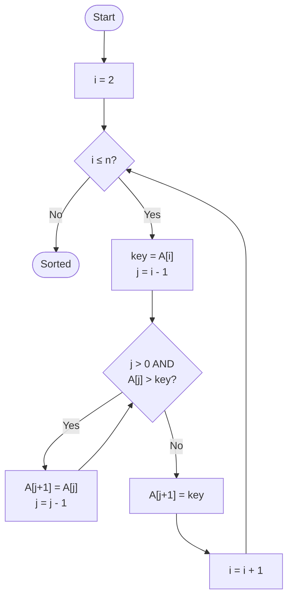
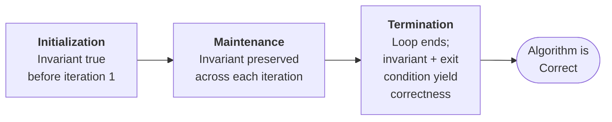
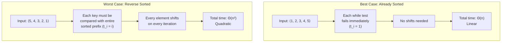

---
tags:
  - CCT3
  - Algoritmer
Topic: complexity analysis, proof of correctness, design
Semester: CCT3
Course: Algoritmer
Litterature:
  - Introduction to Algorithms, 4th ed.
Created: 17-09-2026
---
# Table of Contents

1. [[#Quick Reference|Quick Reference]]
2. [[#1 The Role of Algorithms in Computing|1 The Role of Algorithms in Computing]]
3. [[#1 The Role of Algorithms in Computing#1.1 Algorithms|1.1 Algorithms]]
	1. [[#1.1 Algorithms#1.1.1 The Sorting Problem — A Formal Example|1.1.1 The Sorting Problem — A Formal Example]]
	2. [[#1.1 Algorithms#1.1.2 Correctness of Algorithms|1.1.2 Correctness of Algorithms]]
	3. [[#1.1 Algorithms#1.1.3 Kinds of Problems Solved by Algorithms|1.1.3 Kinds of Problems Solved by Algorithms]]
	4. [[#1.1 Algorithms#1.1.4 Data Structures|1.1.4 Data Structures]]
	5. [[#1.1 Algorithms#1.1.5 Hard Problems and NP-Completeness|1.1.5 Hard Problems and NP-Completeness]]
	6. [[#1.1 Algorithms#1.1.6 Alternative Computing Models|1.1.6 Alternative Computing Models]]
4. [[#1 The Role of Algorithms in Computing#1.2 Algorithms as a Technology|1.2 Algorithms as a Technology]]
	1. [[#1.2 Algorithms as a Technology#1.2.1 Efficiency|1.2.1 Efficiency]]
	2. [[#1.2 Algorithms as a Technology#1.2.2 Growth-Rate Comparison|1.2.2 Growth-Rate Comparison]]
	3. [[#1.2 Algorithms as a Technology#1.2.3 Algorithms and Other Technologies|1.2.3 Algorithms and Other Technologies]]
5. [[#2 Getting Started|2 Getting Started]]
6. [[#2 Getting Started#2.1 Insertion Sort|2.1 Insertion Sort]]
	1. [[#2.1 Insertion Sort#2.1.1 Pseudocode for Insertion Sort|2.1.1 Pseudocode for Insertion Sort]]
	2. [[#2.1 Insertion Sort#2.1.2 Loop Invariants and Correctness|2.1.2 Loop Invariants and Correctness]]
	3. [[#2.1 Insertion Sort#2.1.3 Pseudocode Conventions|2.1.3 Pseudocode Conventions]]
7. [[#2 Getting Started#2.2 Analyzing Algorithms|2.2 Analyzing Algorithms]]
	1. [[#2.2 Analyzing Algorithms#2.2.1 The RAM Model of Computation|2.2.1 The RAM Model of Computation]]
	2. [[#2.2 Analyzing Algorithms#2.2.2 Analysis of Insertion Sort|2.2.2 Analysis of Insertion Sort]]
	3. [[#2.2 Analyzing Algorithms#2.2.3 Worst-Case and Average-Case Analysis|2.2.3 Worst-Case and Average-Case Analysis]]
	4. [[#2.2 Analyzing Algorithms#2.2.4 Order of Growth|2.2.4 Order of Growth]]

# The Role of Algorithms in Computing & Getting Started

---

## Quick Reference

| Concept / Symbol | Description |
|---|---|
| **Algorithm** | A well-defined computational procedure transforming input to output in finite time. |
| **Instance** | A specific input satisfying a problem's constraints. |
| **Correctness** | An algorithm halts and produces the correct output for every valid instance. |
| **Loop Invariant** | A property true at the start of every loop iteration; used to prove correctness. |
| **RAM Model** | The standard single-processor computation model where each instruction takes constant time. |
| $T(n)$ | Running time as a function of input size $n$. |
| $\Theta(f(n))$ | Theta notation: the order of growth, ignoring constants and lower-order terms. |
| $\lg n$ | Shorthand for $\log_2 n$ (base-$2$ logarithm). |
| $\sum_{i=a}^{b}$ | Summation operator (Capital Sigma): adds a sequence of terms from index $a$ to $b$. |
| **NP-Complete** | A class of problems with no known efficient algorithm, yet no proof that one cannot exist. |
| `NIL` | A special pointer value indicating no object reference. |

_Table 0.1: Quick reference of the key concepts, symbols, and notation used throughout this note._

---

# 1 The Role of Algorithms in Computing

## 1.1 Algorithms

An _algorithm_ is a well-defined computational procedure that takes some value or set of values as **input** and produces some value or set of values as **output** in a finite amount of time. It is a sequence of computational steps that transform the input into the output.

> [!info] Algorithm as a Problem-Solving Tool
> An algorithm can be viewed as a tool for solving a well-specified _computational problem_. The problem statement defines the desired input/output relationship in general terms (for instances of arbitrarily large size), and the algorithm provides a specific computational procedure to achieve that relationship for _all_ problem instances.

---

### 1.1.1 The Sorting Problem — A Formal Example

Sorting a sequence of numbers into monotonically increasing order is a fundamental operation in computer science and a common intermediate step in many programs.

> [!example] Formal Definition of the Sorting Problem
> - **Input:** A sequence of $n$ numbers $\langle a_1, a_2, \ldots, a_n \rangle$.
> - **Output:** A permutation (reordering) $\langle a'_1, a'_2, \ldots, a'_n \rangle$ of the input sequence such that $a'_1 \leq a'_2 \leq \cdots \leq a'_n$.
> - **Concrete instance:** Given the input $\langle 31, 41, 59, 26, 41, 58 \rangle$, a correct sorting algorithm returns $\langle 26, 31, 41, 41, 58, 59 \rangle$.

An _instance_ of a problem consists of the specific input (satisfying the problem's constraints) needed to compute a solution. The best sorting algorithm for a given application depends on the number of items, the extent to which items are already partially sorted, restrictions on item values, the computer architecture, and the kind of storage devices used. This same sorting problem is analyzed in depth in [Section 2.1](#21-insertion-sort) and [Section 2.2](#22-analyzing-algorithms).

---

### 1.1.2 Correctness of Algorithms

An algorithm is **correct** if, for every problem instance provided as input, it:

1. **Halts** — finishes computing in finite time.
2. **Outputs the correct solution** to the problem instance.

An _incorrect_ algorithm might not halt on some inputs, or might halt with an incorrect answer. Incorrect algorithms can occasionally be useful if their error rate is controllable (e.g., probabilistic prime-finding algorithms), but in most contexts only correct algorithms are of interest.

An algorithm can be specified in natural language, as a computer program, or even as a hardware design — the only requirement is a **precise description** of the computational procedure. Formal techniques for _proving_ correctness are introduced in [Section 2.1.2](#212-loop-invariants-and-correctness).

---

### 1.1.3 Kinds of Problems Solved by Algorithms

Algorithms address a vast range of practical problems. Major application areas include:

- **Genomics:** Identifying genes in DNA, determining sequences of billions of chemical base pairs. Techniques like _dynamic programming_ are essential for determining similarity between DNA sequences.
- **Internet and Information Retrieval:** Managing large volumes of data, routing traffic through networks, and enabling search engines.
- **Electronic Commerce:** Securing transactions through _public-key cryptography_ and _digital signatures_, which rely on numerical algorithms and number theory.
- **Resource Allocation:** Optimizing use of scarce resources (oil wells, budgets, airline crews). Often modeled as _linear programs_.

| Problem | Description | Key Challenge |
|---|---|---|
| **Shortest Path** | Find the shortest route between two points on a road map modeled as a _graph_. | The number of possible routes can be enormous. |
| **Topological Sorting** | List $n$ parts so each appears before any part that uses it. | $n!$ possible orderings; brute-force is infeasible. |
| **Clustering** | Group similar items (e.g., medical images) to identify classifications. | Defining and computing "similarity" efficiently. |
| **Data Compression** | Reduce file sizes using `LZW` or `Huffman coding`. | Finding optimal encoding schemes. |
| **Signal Processing** | Convert time-domain signals to the frequency domain via the _discrete Fourier transform_. | The _fast Fourier transform_ (FFT) is needed for efficiency. |

_Table 1.1: Common algorithmic problems, their applications, and their central computational challenges._

> [!note] Common Characteristics of Interesting Algorithmic Problems
> 1. **Many candidate solutions:** The overwhelming majority do not solve the problem. Finding one that does — or the "best" one — without examining every possibility is the central challenge.
> 2. **Practical applications:** These problems arise in real-world settings with tangible financial or operational impact.

---

### 1.1.4 Data Structures

A _data structure_ is a way to store and organize data to facilitate access and modifications. No single data structure works well for all purposes, so understanding the strengths and limitations of several is critical for algorithm design.

---

### 1.1.5 Hard Problems and NP-Completeness

Most algorithmic study focuses on _efficient_ algorithms, where efficiency is typically measured by **speed**. However, some problems have no known algorithm that runs in a reasonable amount of time. A particularly important subset are the **NP-complete** problems.

> [!summary] Why NP-Complete Problems Are Remarkable
> 1. **Unknown status:** No efficient algorithm has ever been found for any NP-complete problem, yet no one has proven that one cannot exist.
> 2. **Interconnectedness:** If an efficient algorithm exists for _any one_ NP-complete problem, then efficient algorithms exist for _all_ of them.
> 3. **Sensitivity:** Many NP-complete problems are nearly identical to problems with known efficient solutions — a small change in the problem statement can dramatically alter the efficiency of the best known algorithm.

> [!tip] Practical Advice on NP-Complete Problems
> If you are asked to produce an efficient algorithm for an NP-complete problem, you risk a fruitless search. Instead, if you can show the problem is NP-complete, redirect effort toward developing an **approximation algorithm** — one that produces a good (though not necessarily optimal) solution efficiently.

> [!example] The Traveling-Salesperson Problem
> A delivery company with a central depot wants to determine the order of delivery stops that minimizes total distance traveled by each truck (which must return to the depot). This is the well-known _traveling-salesperson problem_, which is NP-complete. Under certain assumptions, efficient approximation algorithms can compute routes with total distances close to the minimum possible.

---

### 1.1.6 Alternative Computing Models

- **Parallel Computing:** Physical limitations have ended the era of steadily increasing clock speeds. Modern chips contain multiple processing _cores_. Designing _task-parallel_ algorithms is essential for exploiting multicore architectures.
- **Online Algorithms:** Many real-world scenarios involve input that arrives over time. The algorithm must make decisions without knowing future data (e.g., data-center job scheduling, hospital triage).

---

## 1.2 Algorithms as a Technology

> [!abstract] The Core Idea: Algorithms *Are* a Technology
> Even if computers were infinitely fast and memory were free, algorithms would still matter — because a bad procedure may never terminate or may produce incorrect answers. But in the real world, time and memory are finite. In practice, **choosing the right algorithm can matter far more than buying faster hardware.** Think of algorithms as a *technology* on par with silicon chips: two systems with identical hardware but different algorithms can differ in performance by orders of magnitude.

Different algorithms for the same problem often differ dramatically in efficiency, and these differences are frequently far more significant than hardware variations.

---

### 1.2.1 Efficiency

Consider two sorting algorithms:
- **[[Insertion Sort]]:** Builds a sorted region one element at a time by inserting each new element into its correct position — like sorting playing cards in your hand. Takes time roughly proportional to $c_1 n^2$.
- **[[Merge Sort]]:** Recursively divides the array in half, sorts each half, then merges the sorted halves back together — the paradigmatic example of the *divide-and-conquer* strategy. Takes time roughly proportional to $c_2 n \lg n$, where $\lg n = \log_2 n$.

While insertion sort typically has a smaller constant factor ($c_1 < c_2$), constant factors have much less impact on running time than the algorithm's dependence on $n$. Because $\lg n$ grows far more slowly than $n$, there is always a **crossover point** beyond which merge sort is faster.

> [!info] Insertion Sort vs. Merge Sort — At a Glance
> | Aspect | Insertion Sort | Merge Sort |
> |---|---|---|
> | Growth rate | $\Theta(n^2)$ | $\Theta(n \lg n)$ |
> | Constant factor | Small | Larger |
> | Best for | Small inputs | Large inputs |
> | Design paradigm | Incremental | Divide-and-conquer |
> | Additional memory | In-place | Requires extra space |
>
> The **crossover point** (where merge sort overtakes insertion sort) depends on the constants, but for large $n$ merge sort is *always* the winner. This is analyzed concretely in the example below and again in [Section 2.1](#21-insertion-sort).

> [!example] Computing the Crossover Point Numerically
> Given the two running-time formulas $T_{\text{ins}}(n) = 2n^2$ and $T_{\text{merge}}(n) = 50 n \lg n$, the crossover occurs where they are equal:
>
> $$2n^2 = 50 n \lg n \;\;\Longrightarrow\;\; n = 25 \lg n$$
>
> Solving numerically:
>
> | $n$ | $25 \lg n$ | Winner |
> |---|---|---|
> | $10$ | $\approx 83$ | Insertion sort ($n < 25 \lg n$) |
> | $50$ | $\approx 141$ | Insertion sort |
> | $100$ | $\approx 166$ | Insertion sort |
> | $150$ | $\approx 181$ | Merge sort (crossover just passed) |
> | $500$ | $\approx 224$ | Merge sort |
>
> _Table 1.2: Numerical solution of the crossover point $n = 25 \lg n$. Merge sort begins winning around $n \approx 150$ for these constants._
>
> **Breakdown:**
> - $T_{\text{ins}}(n) = 2n^2$ : Running time of insertion sort with a small constant ($c_1 = 2$).
> - $T_{\text{merge}}(n) = 50 n \lg n$ : Running time of merge sort with a larger constant ($c_2 = 50$).
> - **Crossover:** The smallest $n$ for which merge sort becomes cheaper than insertion sort.

> [!example] Hardware Power vs. Algorithmic Efficiency
> - **Computer A (Fast):** Executes $10^{10}$ instructions/second. Runs insertion sort requiring $2n^2$ instructions.
> - **Computer B (Slow):** Executes $10^7$ instructions/second ($1{,}000 \times$ slower). Runs merge sort requiring $50 n \lg n$ instructions.
>
> **Sorting $n = 10^7$ numbers:**
>
> $$\text{Time}_A = \frac{2 \cdot (10^7)^2}{10^{10}} = 20{,}000 \text{ seconds} \approx 5.5 \text{ hours}$$
>
> $$\text{Time}_B = \frac{50 \cdot 10^7 \cdot \lg(10^7)}{10^7} \approx 1{,}163 \text{ seconds} < 20 \text{ minutes}$$
>
> **Breakdown:**
> - $n$ : The problem instance size ($10^7$ items).
> - $\lg(10^7)$ : Base-$2$ logarithm of the input size ($\approx 23.25$).
> - $\text{Time}_A, \text{Time}_B$ : Total running time in seconds.
>
> Despite being $1{,}000$ times slower in raw speed, Computer B completes the task over **$17$ times faster**.

---

### 1.2.2 Growth-Rate Comparison

To make the practical impact of order-of-growth concrete, the following table shows how common growth functions scale with input size $n$. This is why the choice of algorithm often dwarfs the choice of hardware, and why NP-complete problems (which typically require exponential or factorial time) are considered "hard."

| $n$ | $\lg n$ | $n$ | $n \lg n$ | $n^2$ | $n^3$ | $2^n$ | $n!$ |
|---|---|---|---|---|---|---|---|
| $10$ | $\approx 3.3$ | $10$ | $\approx 33$ | $100$ | $1{,}000$ | $\approx 10^3$ | $\approx 3.6 \cdot 10^6$ |
| $100$ | $\approx 6.6$ | $100$ | $\approx 664$ | $10^4$ | $10^6$ | $\approx 10^{30}$ | $\approx 9.3 \cdot 10^{157}$ |
| $1{,}000$ | $\approx 10$ | $10^3$ | $\approx 10^4$ | $10^6$ | $10^9$ | $\approx 10^{301}$ | $\approx 10^{2{,}568}$ |
| $10^6$ | $\approx 20$ | $10^6$ | $\approx 2 \cdot 10^7$ | $10^{12}$ | $10^{18}$ | $\approx 10^{301{,}030}$ | $\approx 10^{5.6 \cdot 10^6}$ |

_Table 1.3: Comparison of common growth functions for increasing input sizes. Note how $\lg n$ and $n \lg n$ remain manageable even for $n = 10^6$, while $2^n$ and $n!$ produce numbers with hundreds of thousands (or millions) of digits — vastly exceeding the number of atoms in the observable universe ($\approx 10^{80}$)._

---

### 1.2.3 Algorithms and Other Technologies

Algorithms are a foundational **technology**, just like hardware. Total system performance depends as heavily on selecting efficient algorithms as on choosing fast hardware. Even advanced technologies (GUIs, networking, mobile platforms) rely fundamentally on algorithms at every layer — from hardware fabrication to compiler optimization.

> [!info] Algorithms and Emerging Fields
> - **[[Machine Learning]]:** A collection of algorithms designed to infer patterns from data. Excels where the optimal explicit algorithm is not yet understood. For well-understood problems, specialized algorithms remain significantly more efficient.
> - **[[Data Science]]:** An interdisciplinary field combining statistics, computer science, and optimization. Its core techniques rely heavily on efficient algorithm design and analysis.

---

# 2 Getting Started

This chapter establishes the framework for algorithm design and analysis, introduces pseudocode, examines [[Insertion Sort]] in detail, and demonstrates how to prove correctness using loop invariants. It puts the abstract discussion of [Section 1.2](#12-algorithms-as-a-technology) into concrete practice.

## 2.1 Insertion Sort

The sorting problem takes as input a sequence of $n$ numbers $\langle a_1, a_2, \ldots, a_n \rangle$ and produces a permutation $\langle a'_1, a'_2, \ldots, a'_n \rangle$ such that $a'_1 \leq a'_2 \leq \cdots \leq a'_n$. The numbers being sorted are called _keys_.

> [!info] Keys and Satellite Data
> The input typically arrives as an array of $n$ elements. The values being sorted are the _keys_, but each key is usually associated with additional data called _satellite data_. Together, a key and its satellite data form a _record_. When the sort rearranges keys, it moves the entire record along with them.

Insertion sort works analogously to sorting a hand of playing cards: starting with an empty hand, you pick up cards one at a time and insert each into its correct position among the already-sorted cards in your hand.

---

### 2.1.1 Pseudocode for Insertion Sort

Algorithms are described using _pseudocode_ — a specification language similar to C, Java, or Python that prioritizes clarity over software engineering concerns.

```
INSERTION-SORT(A, n)
    for i = 2 to n
        key = A[i]
        j = i - 1
        while j > 0 and A[j] > key
            A[j + 1] = A[j]
            j = j - 1
        A[j + 1] = key
```

![[Pasted image 20260917084511.png]]

_Figure 2.1: Sorting a hand of cards using insertion sort._

The outer `for` loop iterates from $i = 2$ to $n$; in each iteration the element `A[i]` (the _key_) is inserted into the already-sorted subarray `A[1..i-1]`. The control flow between the outer and inner loop is illustrated below.



_Figure 2.2: Control flow of INSERTION-SORT. The outer `for` loop selects each key; the inner `while` loop shifts larger elements right to make space for the key._

---

### 2.1.2 Loop Invariants and Correctness

A _loop invariant_ is a property that holds true at the beginning of each iteration of a loop. Loop invariants are the primary tool for reasoning about algorithm correctness.

> [!abstract] Intuition: Loop Invariants as a Moving Guarantee
> Imagine building a tower of blocks one level at a time. A loop invariant is like a promise you make to yourself: *"After I finish stacking level $k$, everything below is still perfectly level."* If you can show:
> 1. The tower starts level (nothing to disturb),
> 2. Adding a new block preserves levelness,
> 3. The construction eventually stops,
>
> then the finished tower is guaranteed level. Loop invariants apply this same "moving guarantee" reasoning to algorithms — they transform a dynamic process into a static, provable property.

> [!summary] Loop Invariant for Insertion Sort
> At the start of each iteration of the `for` loop (indexed by $i$), the subarray `A[1..i-1]` consists of the elements originally in positions $1$ through $i-1$, but in sorted order.

The three properties of a valid loop-invariant argument form a proof framework analogous to mathematical induction:



_Figure 2.3: The three-part structure of a loop-invariant correctness proof. Initialization is the "base case," Maintenance is the "inductive step," and Termination is what makes the argument stronger than pure induction — the loop actually stops._

> [!summary] theorem : Loop Invariant Proof Framework
> To prove an algorithm containing a loop is correct, demonstrate three properties of a chosen invariant $P$:
> 1. **Initialization:** $P$ is true prior to the first iteration.
> 2. **Maintenance:** If $P$ is true before an iteration, it remains true before the next iteration.
> 3. **Termination:** The loop terminates, and upon termination $P$ combined with the exit condition yields a useful correctness property.
>
> **breakdown:**
> - **$P$** : The loop invariant — a predicate over program state chosen so its truth at termination directly implies the algorithm's correctness.
> - **Initialization** : Serves as the base case. Establishes that $P$ holds at the moment the loop begins.
> - **Maintenance** : Serves as the inductive step. Shows one iteration cannot "break" $P$.
> - **Termination** : Unlike pure induction (which extends indefinitely), the loop must actually stop for the invariant to translate to a final result.
>
> **proof:**
> By induction on the iteration count. **Base case:** Initialization guarantees $P$ holds before iteration $1$. **Inductive step:** Assume $P$ holds before iteration $k$; Maintenance guarantees $P$ holds before iteration $k+1$. Hence $P$ holds before every iteration. When the loop exits (Termination), $P$ still holds; combined with the loop-exit condition, it yields the desired postcondition. ∎

> [!example] Correctness Proof for Insertion Sort
> **Initialization:** Before the first iteration, $i = 2$. The subarray `A[1..1]` contains only `A[1]`. A single-element subarray is trivially sorted, so the invariant holds.
>
> **Maintenance:** The loop body shifts elements one position to the right until the proper position for `A[i]` is found, then inserts the key. After this, `A[1..i]` contains the original elements from positions $1$ through $i$ in sorted order. Incrementing $i$ preserves the invariant.
>
> **Termination:** The loop terminates when $i = n + 1$. Substituting into the invariant: `A[1..n]` consists of the original elements in sorted order. The algorithm is correct. ∎

![[Pasted image 20260917084609.png]]

_Figure 2.4: The operation of INSERTION-SORT on the sequence $\langle 5, 2, 4, 6, 1, 3 \rangle$ with $n = 6$. Array indices appear above the rectangles and values within. **(a)–(e)** show iterations of the `for` loop; the blue rectangle holds the key, tan rectangles are compared values, orange arrows show rightward shifts, and blue arrows show key placement. **(f)** shows the final sorted array._

---

### 2.1.3 Pseudocode Conventions

| Convention | Description |
|---|---|
| **Indentation** | Indicates block structure. No `begin`/`end` or curly braces. |
| **Loops** | `while`, `for`, `repeat-until` behave as in mainstream languages. `to` increments, `downto` decrements, `by` sets step size. The `for` counter retains the first value that exceeded the bound after exit. |
| **Comments** | Begin with `//`. |
| **Variables** | Local to their procedure unless stated otherwise. |
| **Array access** | `A[i]` for the $i$-th element ($1$-origin). `A[i..j]` for a subarray. |
| **Objects** | Dot notation (`x.f`). Variables act as _pointers_. `y = x` makes both point to the same object. `NIL` means no object. |
| **Parameter passing** | By value, but for objects/arrays the _pointer_ is copied, so attribute/element modifications are visible to the caller. |
| **Return** | May return multiple values without packaging. |
| **Boolean operators** | `and` and `or` are _short-circuiting_. |
| **`error`** | Terminates immediately under invalid conditions; the caller handles it. |

_Table 2.1: Pseudocode conventions used throughout the text._

---

## 2.2 Analyzing Algorithms

Analyzing an algorithm means predicting the resources it requires — most commonly computational time, but potentially also memory, bandwidth, or energy. This section makes rigorous the intuitive efficiency comparisons introduced in [Section 1.2.1](#121-efficiency).

### 2.2.1 The RAM Model of Computation

The standard model is the **random-access machine (RAM)**: a generic one-processor computer in which instructions execute sequentially.

> [!info] Key Assumptions of the RAM Model
> - Each instruction and data access takes a **constant** amount of time.
> - **Instructions** include arithmetic, data movement, and control operations.
> - **Data types:** integer, floating-point, character. Booleans are integers ($0$ = `FALSE`, nonzero = `TRUE`).
> - **Word size:** Each word holds at most $c \lg n$ bits for some constant $c \geq 1$, where $n$ is the input size. This ensures a word can hold the value $n$ (for indexing) while preventing unrealistic single-word storage of arbitrarily large data.

> [!warning] Limitations of the RAM Model
> - Does **not** account for the memory hierarchy (caches, virtual memory). Despite this, RAM-model analyses are usually excellent predictors of real-world performance.
> - Some operations are ambiguous (e.g., general exponentiation $x^n$ is not constant-time, but $2^n$ via bit-shift is, if the result fits in a word).

---

### 2.2.2 Analysis of Insertion Sort

Rather than timing an algorithm on a specific machine, we analyze it by counting how many times each line of pseudocode executes. **Input size** ($n$) is the primary factor affecting running time. **Running time** is the total number of instructions executed, expressed as a function $T(n)$.

Under the RAM model, each execution of line $k$ takes a constant time $c_k$. The total running time is the sum over all lines of (cost per execution) $\times$ (number of executions).

> [!example] Cost Analysis of Insertion Sort
> Let $t_i$ denote the number of times the `while` loop test is executed for a given value of $i$.
>
> | Line | Pseudocode | Cost | Times |
> |---|---|---|---|
> | $1$ | `for i = 2 to n` | $c_1$ | $n$ |
> | $2$ | `key = A[i]` | $c_2$ | $n - 1$ |
> | $3$ | `// comment` | $0$ | $n - 1$ |
> | $4$ | `j = i - 1` | $c_4$ | $n - 1$ |
> | $5$ | `while j > 0 and A[j] > key` | $c_5$ | $\sum_{i=2}^{n} t_i$ |
> | $6$ | `A[j + 1] = A[j]` | $c_6$ | $\sum_{i=2}^{n} (t_i - 1)$ |
> | $7$ | `j = j - 1` | $c_7$ | $\sum_{i=2}^{n} (t_i - 1)$ |
> | $8$ | `A[j + 1] = key` | $c_8$ | $n - 1$ |
>
> _Table 2.2: Line-by-line cost analysis of INSERTION-SORT._
>
> **Breakdown of summation terms:**
> - $\sum_{i=2}^{n}$ : The Summation Operator (Capital Sigma). Adds a quantity for each value of $i$ from $2$ to $n$.
> - $t_i$ : The number of times the `while` condition is checked during the $i$-th outer loop iteration. Depends on the input.
> - $(t_i - 1)$ : The number of times the `while` loop *body* executes (one fewer than condition checks, since the final check fails).

> [!warning] Common Analysis Mistakes
> - **Off-by-one on the `while` test:** The `while` condition executes *one more time* than its body (the final check is what causes the loop to exit). Students often write $t_i$ for both the test and the body — the body executes $t_i - 1$ times.
> - **Ignoring constants for small inputs:** While $\Theta$-notation ignores constants, they *do* matter when $n$ is small. A "faster" $\Theta(n \lg n)$ algorithm may be slower than a $\Theta(n^2)$ algorithm below the crossover point (see [Section 1.2.1](#121-efficiency)).
> - **Forgetting the outer loop test's extra iteration:** The `for` loop check on line $1$ runs $n$ times, not $n - 1$ — the final check (with $i = n + 1$) is what exits the loop.
> - **Assuming best-case = average-case:** For insertion sort, average-case is $\Theta(n^2)$, not $\Theta(n)$. Best-case only occurs on already-sorted input.

**Worked Trace — Concrete Example.** To make $t_i$ tangible, consider the input `A = ⟨3, 1, 2⟩` with $n = 3$:

| $i$ | `A` before iter. | `key` | Inner comparisons (`while` tests) | $t_i$ | Body executions ($t_i - 1$) | `A` after iter. |
|---|---|---|---|---|---|---|
| $2$ | $\langle 3, 1, 2 \rangle$ | $1$ | Test 1: $j=1$, $A[1]=3 > 1$ ✓ (enter body). Test 2: $j=0$, exit. | $2$ | $1$ | $\langle 1, 3, 2 \rangle$ |
| $3$ | $\langle 1, 3, 2 \rangle$ | $2$ | Test 1: $j=2$, $A[2]=3 > 2$ ✓ (enter body). Test 2: $j=1$, $A[1]=1 \not> 2$ ✗ (exit). | $2$ | $1$ | $\langle 1, 2, 3 \rangle$ |

_Table 2.3: Concrete trace of INSERTION-SORT on the input $\langle 3, 1, 2 \rangle$, showing the actual values of $t_i$ per iteration and confirming the "test runs one more time than body" rule._

Summing the products of cost and times gives the total running time:

$$T(n) = c_1 n + c_2(n-1) + c_4(n-1) + c_5 \sum_{i=2}^{n} t_i + c_6 \sum_{i=2}^{n}(t_i - 1) + c_7 \sum_{i=2}^{n}(t_i - 1) + c_8(n-1)$$

**Breakdown:**
- $c_k$ : The constant time cost of executing line $k$ once (machine-dependent).
- $n$ : The input size (number of elements).
- $t_i$ : The number of `while`-test executions for the $i$-th outer iteration (input-dependent).

The value of $t_i$ — and therefore $T(n)$ — depends on the specific input, even for a fixed $n$.

---

**Best vs. Worst Case at a Glance.** The extremes of insertion sort's behavior are driven entirely by the initial ordering of the input:



_Figure 2.5: Best-case vs. worst-case behavior of INSERTION-SORT. The best case ($\Theta(n)$) occurs when no shifts are ever needed; the worst case ($\Theta(n^2)$) occurs when every element must be shifted all the way to the front._

**Best case (array already sorted):** Each `while` test fails immediately, so $t_i = 1$ for all $i$:

$$T(n) = (c_1 + c_2 + c_4 + c_5 + c_8)\,n - (c_2 + c_4 + c_5 + c_8)$$

This is a **linear** function of $n$, expressible as $an + b$.

**Worst case (array in reverse sorted order):** Each `A[i]` must be compared with every element in `A[1..i-1]`, so $t_i = i$. Using the summation identities:

$$\sum_{i=2}^{n} i = \frac{n(n+1)}{2} - 1 \qquad \text{and} \qquad \sum_{i=2}^{n}(i-1) = \frac{n(n-1)}{2}$$

**Breakdown:**
- $\sum_{i=2}^{n} i$ : The sum of all integers from $2$ to $n$. The formula $\frac{n(n+1)}{2}$ gives the sum from $1$ to $n$; subtracting $1$ removes the $i=1$ term.
- $\sum_{i=2}^{n}(i-1)$ : The sum of $(i-1)$ for $i$ from $2$ to $n$, which equals $1 + 2 + \cdots + (n-1) = \frac{n(n-1)}{2}$.

The worst-case running time becomes:

$$T(n) = \left(\frac{c_5}{2} + \frac{c_6}{2} + \frac{c_7}{2}\right)n^2 + \left(c_1 + c_2 + c_4 + \frac{c_5}{2} - \frac{c_6}{2} - \frac{c_7}{2} + c_8\right)n - (c_2 + c_4 + c_5 + c_8)$$

This is a **quadratic** function of $n$, expressible as $an^2 + bn + c$.

---

### 2.2.3 Worst-Case and Average-Case Analysis

The focus is usually on the **worst-case running time** for three reasons:

1. **Guaranteed upper bound:** The algorithm will _never_ take longer — critical for real-time systems.
2. **Frequency:** The worst case often occurs in practice (e.g., searching for an absent item in a database).
3. **Average case is often similar:** For insertion sort on $n$ random numbers, $t_i \approx i/2$ on average, yielding a running time that is still quadratic — just as bad as the worst case.

> [!note] Average-Case and Randomized Algorithms
> Average-case analysis is sometimes useful but limited because it is often unclear what constitutes an "average" input. When the assumption of equally likely inputs is unrealistic, _randomized algorithms_ — which make internal random choices — can enable probabilistic analysis and yield a meaningful expected running time.

---

### 2.2.4 Order of Growth

Exact running-time formulas are overly detailed for comparing algorithms. The constants $c_k$ are machine-dependent, and lower-order terms become negligible for large inputs. The key simplification is to focus on the **order of growth**:

- **Keep only the leading term** (e.g., $an^2$).
- **Ignore the constant coefficient** of the leading term.

> [!summary] Θ-Notation (Theta Notation)
> The Greek letter $\Theta$ (theta) captures the order of growth concisely. Informally, $\Theta(f(n))$ means "roughly proportional to $f(n)$ when $n$ is large."
>
> - Insertion sort **best case:** $\Theta(n)$ — linear growth.
> - Insertion sort **worst case:** $\Theta(n^2)$ — quadratic growth.
>
> **Breakdown:**
> - $\Theta$ : The Theta symbol. It denotes an asymptotically tight bound on the growth rate of a function.
> - $f(n)$ : The dominant term of the running-time function after stripping constants and lower-order terms.
> - $n$ : The input size.
>
> An algorithm is **more efficient** than another if its worst-case running time has a _lower_ order of growth. A $\Theta(n^2)$ algorithm will always outperform a $\Theta(n^3)$ algorithm on sufficiently large inputs, regardless of hidden constant factors. See [Table 1.3](#122-growth-rate-comparison) for how dramatically different growth rates compare in practice.

---

> [!info] Glossary
> - **Algorithm** — A well-defined computational procedure that transforms input into output in finite time.
> - **Approximation Algorithm** — An algorithm producing a near-optimal solution efficiently; used when exact solutions are infeasible (e.g., for NP-complete problems).
> - **Correctness** — The property that an algorithm halts and produces the right output for every valid instance.
> - **Data Structure** — A way to store and organize data to facilitate access and modification.
> - **Divide-and-Conquer** — A design paradigm that recursively splits a problem into smaller subproblems, solves them, and combines the results.
> - **Dynamic Programming** — A design technique that solves problems by combining solutions to overlapping subproblems.
> - **Instance** — A specific input satisfying a problem's stated constraints.
> - **Key** — The value(s) being sorted or searched, as opposed to associated satellite data.
> - **Linear Program** — A mathematical optimization problem with a linear objective and linear constraints.
> - **Loop Invariant** — A predicate true at the start of every iteration of a loop, used in correctness proofs.
> - **NP-Complete** — A class of problems with no known polynomial-time algorithm, all polynomially reducible to one another.
> - **Online Algorithm** — An algorithm that processes input as it arrives, without knowing future data.
> - **Order of Growth** — The dominant term of a running-time function, ignoring constants and lower-order terms.
> - **Pseudocode** — A high-level, language-agnostic description of an algorithm favoring clarity over syntax.
> - **RAM (Random-Access Machine)** — The standard model of computation: one processor, sequential execution, constant-time instructions.
> - **Randomized Algorithm** — An algorithm whose behavior depends on internal random choices.
> - **Record** — A key together with its associated satellite data, treated as a single unit during sorting.
> - **Satellite Data** — Non-key information carried along with a record during sorting.
> - **Θ (Theta) Notation** — Asymptotically tight bound describing the order of growth of a function.
> - **Worst-Case Running Time** — The maximum running time over all inputs of a given size.

---

> [!summary] Chapter Summary
> - An **algorithm** is a well-defined procedure that transforms input into output in finite time. It is a tool for solving computational problems.
> - **Correctness** requires that an algorithm halts and produces the right answer for every valid instance. Loop invariants (Initialization, Maintenance, Termination) form the standard proof framework, analogous to mathematical induction with a required stopping condition.
> - Algorithms solve a vast range of real-world problems (genomics, networking, cryptography, resource allocation) and should be viewed as a **technology** as fundamental as hardware — often more impactful than raw processing power.
> - **NP-complete** problems have no known efficient solution; recognizing them allows you to redirect effort toward approximation algorithms.
> - **Insertion sort** runs in $\Theta(n)$ best case and $\Theta(n^2)$ worst case; **merge sort** runs in $\Theta(n \lg n)$ and dominates for large $n$ despite larger constants.
> - The **RAM model** provides a standardized framework for analysis, assuming constant-time instructions and $c \lg n$-bit words.
> - **Order of growth** ($\Theta$-notation) is the primary tool for comparing algorithmic efficiency, abstracting away machine-dependent constants and lower-order terms.