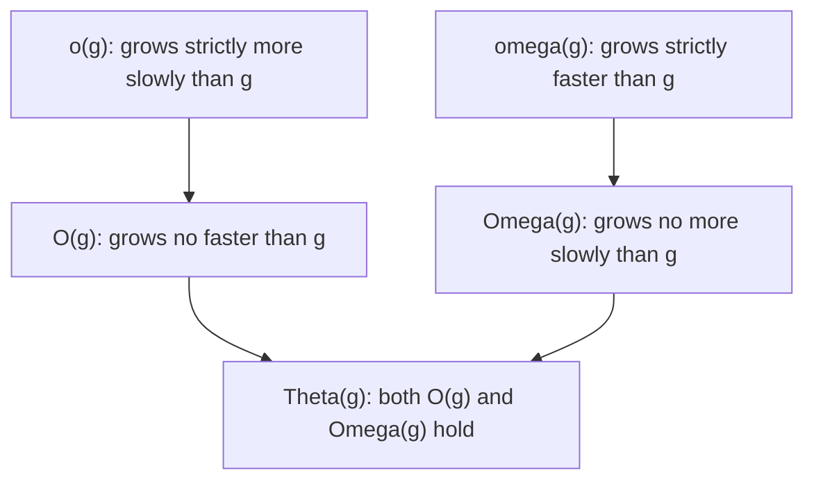
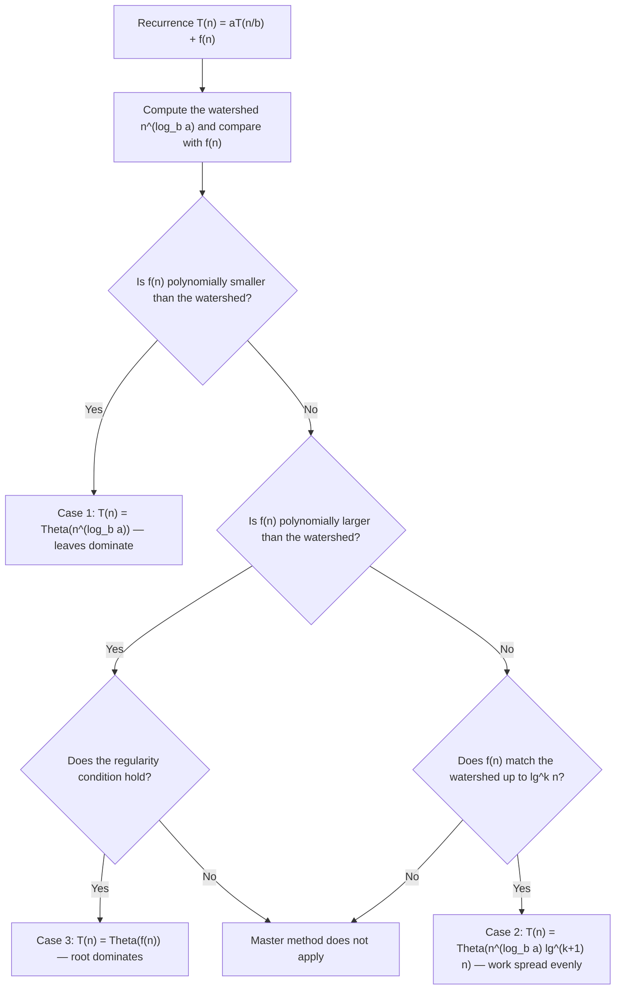
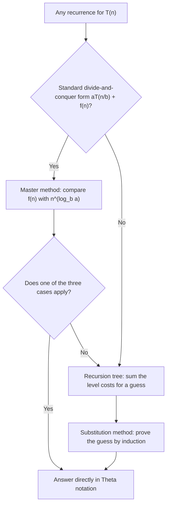

---
tags:
  - CCT3
  - Algoritmer
Topic: growth of functions, asymptotic notations, relative asymptotic performance
Semester: CCT3
Course: Algoritmer
Litterature:
  - Introduction to Algorithms, 4th ed.
Created: 26-09-2026
---
## Table of Contents

1. [[#2.1 Order of Growth and Asymptotic Efficiency|2.1 Order of Growth and Asymptotic Efficiency]]
2. [[#2.2 Intuitive Bounds: $O$, $\Omega$, and $\Theta$|2.2 Intuitive Bounds: $O$, $\Omega$, and $\Theta$]]
	1. [[#2.2 Intuitive Bounds: $O$, $\Omega$, and $\Theta$#2.2.1 $O$-Notation|2.2.1 $O$-Notation]]
	2. [[#2.2 Intuitive Bounds: $O$, $\Omega$, and $\Theta$#2.2.2 $\Omega$-Notation|2.2.2 $\Omega$-Notation]]
	3. [[#2.2 Intuitive Bounds: $O$, $\Omega$, and $\Theta$#2.2.3 $\Theta$-Notation|2.2.3 $\Theta$-Notation]]
	4. [[#2.2 Intuitive Bounds: $O$, $\Omega$, and $\Theta$#2.2.4 Example: Insertion Sort|2.2.4 Example: Insertion Sort]]
3. [[#2.3 Asymptotic Notation: Formal Definitions|2.3 Asymptotic Notation: Formal Definitions]]
	1. [[#2.3 Asymptotic Notation: Formal Definitions#2.3.1 $O$-Notation (Upper Bound)|2.3.1 $O$-Notation (Upper Bound)]]
	2. [[#2.3 Asymptotic Notation: Formal Definitions#2.3.2 $\Omega$-Notation (Lower Bound)|2.3.2 $\Omega$-Notation (Lower Bound)]]
	3. [[#2.3 Asymptotic Notation: Formal Definitions#2.3.3 $\Theta$-Notation (Tight Bound)|2.3.3 $\Theta$-Notation (Tight Bound)]]
	4. [[#2.3 Asymptotic Notation: Formal Definitions#2.3.4 The Relationship Among the Three Notations|2.3.4 The Relationship Among the Three Notations]]
	5. [[#2.3 Asymptotic Notation: Formal Definitions#2.3.5 Precision and Proper Use of Asymptotic Notation|2.3.5 Precision and Proper Use of Asymptotic Notation]]
	6. [[#2.3 Asymptotic Notation: Formal Definitions#2.3.6 Asymptotic Notation in Equations and Identities|2.3.6 Asymptotic Notation in Equations and Identities]]
	7. [[#2.3 Asymptotic Notation: Formal Definitions#2.3.7 Standard Notational Conventions and Accepted Abuses|2.3.7 Standard Notational Conventions and Accepted Abuses]]
	8. [[#2.3 Asymptotic Notation: Formal Definitions#2.3.8 $o$-Notation (Little-oh) and $\omega$-Notation (Little-omega)|2.3.8 $o$-Notation (Little-oh) and $\omega$-Notation (Little-omega)]]
	9. [[#2.3 Asymptotic Notation: Formal Definitions#2.3.9 Comparison of Functions and Relational Properties|2.3.9 Comparison of Functions and Relational Properties]]
4. [[#2.4 The Substitution Method for Solving Recurrences|2.4 The Substitution Method for Solving Recurrences]]
	1. [[#2.4 The Substitution Method for Solving Recurrences#2.4.1 Applying the Substitution Method|2.4.1 Applying the Substitution Method]]
	2. [[#2.4 The Substitution Method for Solving Recurrences#2.4.2 Heuristics for Generating Good Guesses|2.4.2 Heuristics for Generating Good Guesses]]
	3. [[#2.4 The Substitution Method for Solving Recurrences#2.4.3 Strengthening the Hypothesis: Subtracting a Lower-Order Term|2.4.3 Strengthening the Hypothesis: Subtracting a Lower-Order Term]]
	4. [[#2.4 The Substitution Method for Solving Recurrences#2.4.4 Common Pitfalls to Avoid|2.4.4 Common Pitfalls to Avoid]]
5. [[#2.5 The Recursion-Tree Method for Solving Recurrences|2.5 The Recursion-Tree Method for Solving Recurrences]]
	1. [[#2.5 The Recursion-Tree Method for Solving Recurrences#2.5.1 An Illustrative Example: Geometric Series Decay|2.5.1 An Illustrative Example: Geometric Series Decay]]
	2. [[#2.5 The Recursion-Tree Method for Solving Recurrences#2.5.2 An Irregular Example: Unbalanced Recursion Trees|2.5.2 An Irregular Example: Unbalanced Recursion Trees]]
	3. [[#2.5 The Recursion-Tree Method for Solving Recurrences#2.5.3 Determining the Cost of Leaves in Unbalanced Trees|2.5.3 Determining the Cost of Leaves in Unbalanced Trees]]
6. [[#2.6 The Master Method for Solving Recurrences|2.6 The Master Method for Solving Recurrences]]
	1. [[#2.6 The Master Method for Solving Recurrences#2.6.1 The Master Theorem|2.6.1 The Master Theorem]]
	2. [[#2.6 The Master Method for Solving Recurrences#2.6.2 Applying the Master Method|2.6.2 Applying the Master Method]]
	3. [[#2.6 The Master Method for Solving Recurrences#2.6.3 Limitations and Gaps in the Master Method|2.6.3 Limitations and Gaps in the Master Method]]
7. [[#2.7 Proof of the Continuous Master Theorem|2.7 Proof of the Continuous Master Theorem]]
	1. [[#2.7 Proof of the Continuous Master Theorem#2.7.1 Step 1: Decomposing the Recurrence via Tree Levels|2.7.1 Step 1: Decomposing the Recurrence via Tree Levels]]
	2. [[#2.7 Proof of the Continuous Master Theorem#2.7.2 Step 2: Evaluating the Internal Node Summation|2.7.2 Step 2: Evaluating the Internal Node Summation]]
	3. [[#2.7 Proof of the Continuous Master Theorem#2.7.3 Step 3: Proving the Continuous Master Theorem|2.7.3 Step 3: Proving the Continuous Master Theorem]]

# 2. Growth of Functions, Asymptotic Notations, and Relative Asymptotic Performance

| Symbol / Concept | Meaning | Section |
|---|---|---|
| $n$ | The input size; all statements are about behavior as $n \to \infty$. | 2.1 |
| Order of growth | The class of a function's leading term — what dominates as $n$ grows. | 2.1 |
| Asymptotic efficiency | How an algorithm's running time and space scale in the limit, ignoring machine constants. | 2.1 |
| $f(n)$ | The function being bounded — typically an algorithm's running-time function. | 2.1 |
| $g(n)$ | The reference (bounding) function such as $n^2$ or $n \lg n$. | 2.1 |
| $T(n)$ | A running-time function defined by a recurrence. | 2.4 |
| $\lg n$ | The binary logarithm, $\log_2 n$. | 2.1 |
| $O(g(n))$ | Asymptotic **upper** bound: $0 \le f(n) \le c\,g(n)$ for all $n \ge n_0$. | 2.2.1, 2.3.1 |
| $\Omega(g(n))$ | Asymptotic **lower** bound: $0 \le c\,g(n) \le f(n)$ for all $n \ge n_0$. | 2.2.2, 2.3.2 |
| $\Theta(g(n))$ | Asymptotic **tight** bound: $c_1 g(n) \le f(n) \le c_2 g(n)$ for all $n \ge n_0$. | 2.2.3, 2.3.3 |
| $o(g(n))$ | Strictly smaller growth: $f(n) < c\,g(n)$ for *every* $c > 0$; equivalently $f(n)/g(n) \to 0$. | 2.3.8 |
| $\omega(g(n))$ | Strictly larger growth: $f(n) > c\,g(n)$ for *every* $c > 0$; equivalently $f(n)/g(n) \to \infty$. | 2.3.8 |
| $c$, $c_1$, $c_2$ | Positive constant factors inside the bounds; $c_1 \le c_2$ for $\Theta$. | 2.3 |
| $n_0$ | The threshold input size beyond which the bound holds. | 2.3 |
| Asymptotically nonnegative | $f(n) \ge 0$ for all sufficiently large $n$ — assumed of every function used. | 2.3 |
| $f(n) = O(g(n))$ | Shorthand meaning set membership: $f(n) \in O(g(n))$. | 2.3.1, 2.3.6 |
| $\Theta(n)$ inside a formula | An *anonymous function* known only to lie in $\Theta(n)$, e.g. $3n + 1$ in $2n^2 + 3n + 1 = 2n^2 + \Theta(n)$. | 2.3.6 |
| $\lfloor \cdot \rfloor$, $\lceil \cdot \rceil$ | The floor and ceiling functions: round down / round up, used to keep subproblem sizes and recursion-tree costs integral. | 2.4.1, 2.6 |
| Substitution method | Guess a bound, then prove it by induction with explicit constants. | 2.4 |
| Induction hypothesis | The exact algebraic statement assumed for smaller inputs (never written with $O$-notation). | 2.4.4 |
| Recursion tree | Tree of subproblem costs; per-level costs summed for the total. | 2.5 |
| $a$ | Number of subproblems generated by a divide-and-conquer recurrence. | 2.6 |
| $b$ | Factor by which each subproblem shrinks ($b > 1$). | 2.6 |
| Driving function $f(n)$ | The non-recursive divide-and-combine cost in $T(n) = aT(n/b) + f(n)$. | 2.6 |
| Watershed function $n^{\log_b a}$ | Total leaf cost of the recursion tree — the benchmark cases compare $f(n)$ against. | 2.6 |
| $\epsilon$ | Positive exponent measuring *polynomial* separation in Cases 1 and 3 of the master theorem. | 2.6.1 |
| $k$ | Non-negative exponent of $\lg^k n$ in Case 2 ($k \ge 0$). | 2.6.1 |
| Regularity condition | $a f(n/b) \le c f(n)$ for some $c < 1$ — required in Case 3. | 2.6.1 |
| $\sum_{j=0}^{\lfloor \log_b n \rfloor} a^j f(n/b^j)$ | Aggregate internal-node cost over all levels of the recursion tree. | 2.7.1 |
| Akra–Bazzi method | A generalization that solves recurrences falling into the master method's gaps. | 2.6.3 |

_Table 2.1: Quick reference of the notation, bounds, and techniques defined in this note._

> [!note] Notation Conventions Used Throughout This Note
> - $n$ is the input size, and every statement is a claim about the limit $n \to \infty$ unless stated otherwise.
> - $\lg n$ means $\log_2 n$; a generic logarithm to base $b$ is written $\log_b$.
> - $f(n)$ is the function being bounded; $g(n)$ is the reference function it is compared against.
> - $T(n)$ denotes the running time of an algorithm (usually defined by a recurrence).
> - Theorem titles cite the source textbook in parentheses, e.g. *(CLRS Theorem 3.1)*. **CLRS** abbreviates *Introduction to Algorithms* by Cormen, Leiserson, Rivest, and Stein; the numbering inside those parentheses is the textbook's, while this note's own section numbers (2.1–2.7) are used everywhere else.
> - $c$, $c_1$, $c_2$, and $n_0$ are positive constants fixed by the argument; $\epsilon$ and $k$ are exponents appearing in the master theorem.
> - The "equals sign" is an abuse of notation: $f(n) = O(g(n))$ means $f(n)$ belongs to the set $O(g(n))$, not that the two sides are interchangeable.
> - Every function used in asymptotic notation is assumed **asymptotically nonnegative**.

---

## 2.1 Order of Growth and Asymptotic Efficiency

The *order of growth* of an algorithm's running time provides a straightforward framework for characterizing computational efficiency and comparing alternative algorithmic solutions.

For sufficiently large input sizes $n$, an algorithm with a lower order of growth will consistently outperform one with a higher order of growth. For example, merge sort, with its $\Theta(n \lg n)$ worst-case running time, outperforms insertion sort, which exhibits a $\Theta(n^2)$ worst-case running time, once $n$ is large enough.

While exact running times can occasionally be derived, the additional precision rarely justifies the mathematical effort. For sufficiently large inputs, multiplicative constants and lower-order terms in an exact running time equation are dominated and rendered negligible by the leading term.

> [!info] Definition: Asymptotic Efficiency
> **Asymptotic efficiency** is the study of how an algorithm's running time scales in the limit as the input size $n$ increases without bound ($n \to \infty$).
>
> - **Leading-term dominance:** For large inputs, the highest-order term dictates the growth rate, while lower-order terms and constant factors become negligible.
> - **Practical selection:** An algorithm that is asymptotically more efficient is typically the preferred choice for all but very small input sizes.

This preference is not merely theoretical. Production sorting routines are hybrids: they run an asymptotically good algorithm such as quicksort or merge sort on the whole array but switch to insertion sort below a small size threshold, precisely because insertion sort's constant factors win on tiny inputs while its $\Theta(n^2)$ growth loses on large ones.

The standard growth rates form a ladder worth committing to memory — every entry eventually beats every entry below it once $n$ is large enough:

| Growth rate | Name | Canonical operation | Practical comfort zone |
| :--- | :--- | :--- | :--- |
| $1$ | constant | hash-table lookup (average case) | any $n$ — the dream |
| $\lg n$ | logarithmic | binary search in a sorted array | any $n$; only $\approx 30$ steps even at $n = 10^9$ |
| $\sqrt{n}$ | square root | trial division up to $\sqrt{n}$ in factorization | large $n$, but costly next to logarithms |
| $n$ | linear | scanning every element once | the natural floor for reading $n$ items |
| $n \lg n$ | linearithmic | merge sort, heapsort | comparison sorting's lower bound; near-linear in practice |
| $n^2$ | quadratic | insertion sort's worst case, all-pairs comparison | fine up to $n \approx 10^4$, painful beyond |
| $n^3$ | cubic | naive matrix multiplication, Gaussian elimination | strains past $n \approx 10^3$ |
| $2^n$ | exponential | enumerating every subset | only $n \lesssim 30$ |

_Table 2.2: The growth-rate ladder: each rung eventually overtakes every row below it as $n$ grows, so the ordering — not the constants — decides large-input performance. The crossing points depend on the constants (which is exactly why hybrids fall back to insertion sort on small inputs), and the comfort zones are rough and machine-dependent._

> [!info] Definition: $\Theta$-Notation (The Idea)
> $\Theta$-notation is a type of asymptotic notation used to classify functions according to their growth rate, characterizing an asymptotically tight bound on running time.
>
> $$\Theta(g(n))$$
>
> **Breakdown:**
> - $\Theta$ : Capital Greek letter Theta; denotes an asymptotically tight bound that sandwiches the growth of a function within constant factors from above and below.
> - $n$ : The input size parameter.
> - $g(n)$ : The reference function defining the bounding growth rate (such as $n^2$ or $n \lg n$).
> - $\lg$ : The binary logarithm ($\log_2$).

Asymptotic notation provides a unified mathematical language to simplify algorithm analysis, abstracting away machine-dependent constants and implementation specifics while preserving the essential performance characteristics across scaling input sizes.

> [!abstract] The Big Picture: Three Tools, One Job
> Solving a recurrence means answering "how fast does this algorithm grow?" Three techniques in this note attack that question from different angles. The **substitution method** is the proof tool: you guess a bound and verify it by induction. The **recursion-tree method** is the picture tool: it visualizes where the work goes and produces a trustworthy guess. The **master method** is the cookbook tool: for the standard divide-and-conquer shape $T(n) = aT(n/b) + f(n)$ it reads the answer off directly, and the closing section proves why the cookbook is correct. In practice you *guess* with a tree, *prove* with substitution, and *skip both* whenever the master method applies.

---

## 2.2 Intuitive Bounds: $O$, $\Omega$, and $\Theta$

When analyzing the exact running time of an algorithm, equations often contain complex combinations of machine constants and lower-order terms. To characterize the growth rate of running times concisely:

1. Discard the lower-order terms.
2. Ignore the constant coefficients of the leading term.
3. Express the remaining growth rate using asymptotic notation (such as $O$ or $\Theta$).

Asymptotic notations apply broadly to any mathematical function, whether characterizing execution time, memory usage, or theoretical models.

### 2.2.1 $O$-Notation

$O$-notation (Big-O notation) characterizes an **asymptotic upper bound** on the growth of a function. It indicates that a function grows *no faster* than a specified rate for sufficiently large inputs.

> [!info] Definition: $O$-Notation (Intuitive)
> A function is $O(g(n))$ if its growth rate is bounded from above by $g(n)$ (up to a constant factor) for all sufficiently large $n$.
>
> **Breakdown:**
> - $O$ : Big-O operator; denotes an asymptotic upper bound.
> - $n$ : The input size.
> - $g(n)$ : The bounding function representing the maximum rate of growth.

For example, consider the polynomial:

$$f(n) = 7n^3 + 100n^2 - 20n + 6$$

The highest-order term is $7n^3$, which dominates the growth. Because $f(n)$ grows no faster than $n^3$, it is $O(n^3)$.

Verification: for $n \ge 1$ every remaining term is at most $100n^3$ in magnitude (and $6 \le 6n^3$), so $f(n) \le 113n^3$ — the constants $c = 113$, $n_0 = 1$ witness the bound ✓.

Because $O$-notation represents an upper bound, any function that grows more slowly than a higher-order polynomial also satisfies that higher-order bound:

- $f(n)$ is $O(n^3)$
- $f(n)$ is also $O(n^4)$, $O(n^5)$, and $O(n^c)$ for any constant $c \ge 3$.

### 2.2.2 $\Omega$-Notation

$\Omega$-notation (Big-Omega notation) characterizes an **asymptotic lower bound** on the growth of a function. It indicates that a function grows *at least as fast* as a specified rate for sufficiently large inputs.

> [!info] Definition: $\Omega$-Notation (Intuitive)
> A function is $\Omega(g(n))$ if its growth rate is bounded from below by $g(n)$ (up to a constant factor) for all sufficiently large $n$.
>
> **Breakdown:**
> - $\Omega$ : Big-Omega operator; denotes an asymptotic lower bound.
> - $n$ : The input size.
> - $g(n)$ : The bounding function representing the minimum rate of growth.

Using the same polynomial $f(n) = 7n^3 + 100n^2 - 20n + 6$:

- The leading term grows at least as fast as $n^3$, so $f(n)$ is $\Omega(n^3)$.
- It also satisfies lower bounds of slower-growing functions: $f(n)$ is $\Omega(n^2)$, $\Omega(n)$, and $\Omega(n^c)$ for any constant $c \le 3$.

Verification: since $100n^2 - 20n + 6 = 20n(5n - 1) + 6 \ge 0$ for all $n \ge 1$, we get $f(n) \ge 7n^3$, so $c = 7$, $n_0 = 1$ witness the $\Omega(n^3)$ bound ✓.

### 2.2.3 $\Theta$-Notation

$\Theta$-notation (Big-Theta notation) characterizes an **asymptotically tight bound** on the behavior of a function. It indicates that a function grows *precisely* at the rate of a given function, bounded within constant factors both from above and from below.

As Theorem 1 in Section 2.3.4 makes precise, a function is $\Theta(g(n))$ exactly when it is simultaneously $O(g(n))$ and $\Omega(g(n))$ — the two bounds above describe the same type of growth from opposite sides.

Because the polynomial $7n^3 + 100n^2 - 20n + 6$ is both $O(n^3)$ and $\Omega(n^3)$, it is tightly bounded as $\Theta(n^3)$ ✓ — this is the sharpest of the three statements about it.

### 2.2.4 Example: Insertion Sort

Asymptotic notation can be applied to deduce the worst-case running time of an algorithm directly from its structure without evaluating explicit index summations.

```text
INSERTION-SORT(A, n)
1  for i = 2 to n
2      key = A[i]
3      // Insert A[i] into the sorted subarray A[1 : i - 1].
4      j = i - 1
5      while j > 0 and A[j] > key
6          A[j + 1] = A[j]
7          j = j - 1
8      A[j + 1] = key
```

![[Pasted image 20260926144716.png]]

_Figure 2.1: The $\Omega(n^2)$ lower bound for insertion sort: if the $n/3$ largest values sit in the first $n/3$ positions, each must shift through the middle $n/3$ positions to reach the last $n/3$ positions — at least $(n/3)(n/3) = n^2/9$ shifts, proportional to $n^2$._

> [!example] Deriving the Worst-Case Bound of Insertion Sort
>
> **1. Deriving the upper bound $O(n^2)$ for all inputs:**
> - The outer `for` loop executes $n - 1$ times regardless of the input array.
> - The inner `while` loop iterates at most $i - 1$ times per outer iteration. Since $i \le n$, the inner loop executes at most $n - 1$ times.
> - The statements inside the `while` loop execute in constant time $O(1)$.
> - The total number of inner loop operations across all iterations is at most $(n - 1)(n - 1) < n^2$.
> - Therefore, the running time across all possible inputs is bounded from above by $O(n^2)$.
>
> **2. Deriving the worst-case lower bound $\Omega(n^2)$:**
> - To establish that the worst-case running time is $\Omega(n^2)$, there must exist at least one input of size $n$ that requires running time proportional to $c n^2$ for some positive constant $c$.
> - For an element to shift to the right, line $6$ must execute once for each position shifted.
> - Assume $n$ is divisible by $3$, dividing array $A$ into three contiguous blocks of $n/3$ elements:
>   - Initial segment: $A[1 : n/3]$
>   - Middle segment: $A[n/3 + 1 : 2n/3]$
>   - Final segment: $A[2n/3 + 1 : n]$
> - Suppose the $n/3$ largest elements in the array are initially placed in the first $n/3$ positions. In the final sorted array, these $n/3$ largest values must reside in the last $n/3$ positions.
> - To move from the first segment to the final segment, each of these $n/3$ values must shift completely through the middle segment of $n/3$ positions, requiring at least $n/3$ shifts per element.
> - The total number of element shifts required is at least:
>
> $$\left(\frac{n}{3}\right) \cdot \left(\frac{n}{3}\right) = \frac{n^2}{9}$$
>
> - Because executing at least $\frac{1}{9}n^2$ shift operations requires time proportional to $n^2$, the worst-case input takes $\Omega(n^2)$ time.
>
> **Conclusion:**
> Because insertion sort is $O(n^2)$ for all inputs and requires $\Omega(n^2)$ time in the worst case, its worst-case running time is tightly bounded by $\Theta(n^2)$. (Note that this does not apply to all inputs; for already sorted arrays, the best-case running time is $\Theta(n)$.)
>
> Verification: for $n = 9$ the upper count gives $(n-1)(n-1) = 64 < 81 = n^2$ ✓, and the lower-bound construction gives $(n/3)(n/3) = 3 \cdot 3 = 9 = n^2/9$ ✓; the conclusion $\Theta(n^2)$ follows from Theorem 1.

---

## 2.3 Asymptotic Notation: Formal Definitions

The notations used to describe the asymptotic running time of an algorithm are defined in terms of functions whose domains are typically the set of natural numbers $\mathbb{N}$ or real numbers $\mathbb{R}$.

Every function used within asymptotic notation is assumed to be *asymptotically nonnegative*: $f(n)$ is non-negative for all sufficiently large $n$ ($f(n) \ge 0$ for $n \ge n_0$).

> [!example] Asymptotically Nonnegative Functions in Miniature
> The functions $n \lg n$ and $3n^2 - 5$ are asymptotically nonnegative — both are $\ge 0$ once $n$ is large enough ($n \ge 2$ and $n \ge 2$ respectively).
>
> By contrast, $n \sin n$ is *not* asymptotically nonnegative: however large $n$ becomes, $\sin n$ returns to $-1$ infinitely often, making $n \sin n$ negative again ✓ (the definition demands non-negativity from some point onward, never again dipping below zero).

![[Pasted image 20260926144759.png]]

_Figure 2.2: Graphic examples of the $O$, $\Omega$, and $\Theta$ notations: (a) $O$-notation bounds $f(n)$ from above — $f(n)$ lies on or below $c\,g(n)$ at and to the right of $n_0$; (b) $\Omega$-notation bounds $f(n)$ from below — on or above $c\,g(n)$; (c) $\Theta$-notation — $f(n)$ lies between $c_1 g(n)$ and $c_2 g(n)$ inclusive from $n_0$ onward. In each part, the smallest valid $n_0$ is shown; any larger value also works._

### 2.3.1 $O$-Notation (Upper Bound)

$O$-notation defines an asymptotic upper bound by bounding a function to within a constant factor from above for sufficiently large $n$.

> [!info] Definition: $O$-Notation (Formal)
> For a given function $g(n)$, the set of functions $O(g(n))$ is defined as:
>
> $$O(g(n)) = \{f(n) : \text{there exist positive constants } c \text{ and } n_0 \text{ such that } 0 \le f(n) \le c g(n) \text{ for all } n \ge n_0\}$$
>
> **Breakdown:**
> - $O(g(n))$ : The set of functions bounded above by a constant multiple of $g(n)$ for large $n$.
> - $f(n)$ : The function being bounded (such as an algorithm's running-time function).
> - $g(n)$ : The asymptotic bounding function.
> - $c$ : A positive scaling constant ($c > 0$).
> - $n_0$ : The threshold input size beyond which the inequality $f(n) \le c g(n)$ holds.

While $O(g(n))$ is formally a set, the relation $f(n) \in O(g(n))$ is standardly written using equality notation:

$$f(n) = O(g(n))$$

> [!example] Proving and Disproving $O$-Notation
>
> **1. Proving $4n^2 + 100n + 500 = O(n^2)$:**
> - Set up the inequality: $4n^2 + 100n + 500 \le cn^2$.
> - Divide both sides by $n^2$:
>   $$4 + \frac{100}{n} + \frac{500}{n^2} \le c$$
> - This inequality holds for various valid pairs of $(c, n_0)$:
>   - If $n_0 = 1$, choose $c = 4 + 100 + 500 = 604$.
>   - If $n_0 = 10$, choose $c = 4 + 10 + 5 = 19$.
>   - If $n_0 = 100$, choose $c = 4 + 1 + 0.05 = 5.05$.
> - Since valid positive constants exist, $4n^2 + 100n + 500 = O(n^2)$.
>
> **2. Disproving $n^3 - 100n^2 = O(n^2)$:**
> - Assume there exist positive constants $c$ and $n_0$ such that $n^3 - 100n^2 \le cn^2$ for all $n \ge n_0$.
> - Divide both sides by $n^2$:
>   $$n - 100 \le c \implies n \le c + 100$$
> - For any chosen constant $c$, this inequality fails whenever $n > c + 100$. Thus, $n^3 - 100n^2 \notin O(n^2)$.
>
> Verification: at the tightest listed pair, $n_0 = 10$, the inequality is exactly saturated — $4(10)^2 + 100(10) + 500 = 1900 = 19 \cdot 10^2$ ✓ — and it stays satisfied for every $n > 10$ as the left side grows more slowly.

### 2.3.2 $\Omega$-Notation (Lower Bound)

$\Omega$-notation provides an asymptotic lower bound on a function, indicating that it grows at least as fast as $g(n)$ to within a constant factor.

> [!info] Definition: $\Omega$-Notation (Formal)
> For a given function $g(n)$, the set of functions $\Omega(g(n))$ is defined as:
>
> $$\Omega(g(n)) = \{f(n) : \text{there exist positive constants } c \text{ and } n_0 \text{ such that } 0 \le c g(n) \le f(n) \text{ for all } n \ge n_0\}$$
>
> **Breakdown:**
> - $\Omega(g(n))$ : The set of functions bounded below by a positive constant multiple of $g(n)$ for large $n$.
> - $f(n)$ : The function being bounded.
> - $g(n)$ : The asymptotic lower-bounding function.
> - $c$ : A positive scaling constant ($c > 0$).
> - $n_0$ : The threshold input size beyond which $c g(n) \le f(n)$ holds.

> [!example] Proving Lower Bounds
>
> **1. Proving $4n^2 + 100n + 500 = \Omega(n^2)$:**
> - Set up the inequality: $c n^2 \le 4n^2 + 100n + 500$.
> - Divide by $n^2$: $c \le 4 + \frac{100}{n} + \frac{500}{n^2}$.
> - This holds for $c = 4$ and any $n_0 \ge 1$.
>
> **2. Proving $\frac{1}{100}n^2 - 100n - 500 = \Omega(n^2)$:**
> - Divide by $n^2$: $c \le \frac{1}{100} - \frac{100}{n} - \frac{500}{n^2}$.
> - For $n_0 = 10{,}005$, choosing $c = 2.49 \times 10^{-9} > 0$ satisfies the condition.
> - For $n_0 = 100{,}000$, choosing $c = 0.0089$ satisfies the condition.
> - As $n_0 \to \infty$, the constant $c$ can be chosen arbitrarily close to $\frac{1}{100}$.
>
> Verification: the two suggested constants sit just below the right-hand side at their thresholds — at $n_0 = 10{,}005$ the expression equals $\frac{1}{100} - \frac{100}{10005} - \frac{500}{10005^2} \approx 2.5 \times 10^{-9} > c$ ✓, and at $n_0 = 100{,}000$ it equals $0.01 - 0.001 - 5 \cdot 10^{-8} \approx 0.0090 > 0.0089$ ✓. Both constants are valid because a *positive* $c$ exists, however small.

### 2.3.3 $\Theta$-Notation (Tight Bound)

$\Theta$-notation bounds a function to within constant factors from both above and below.

> [!info] Definition: $\Theta$-Notation (Formal)
> For a given function $g(n)$, the set of functions $\Theta(g(n))$ is defined as:
>
> $$\Theta(g(n)) = \{f(n) : \text{there exist positive constants } c_1, c_2, \text{ and } n_0 \text{ such that } 0 \le c_1 g(n) \le f(n) \le c_2 g(n) \text{ for all } n \ge n_0\}$$
>
> **Breakdown:**
> - $\Theta(g(n))$ : The set of functions that grow at the exact rate of $g(n)$ within positive scalar bounds.
> - $c_1, c_2$ : Positive constants establishing lower and upper scale multipliers ($0 < c_1 \le c_2$).
> - $n_0$ : The threshold input size beyond which the sandwich inequality holds.

Concretely, for $f(n) = 7n^3 + 100n^2 - 20n + 6$ with $g(n) = n^3$, the constants $c_1 = 7$, $c_2 = 113$, $n_0 = 1$ witness the sandwich: the lower bound is immediate because the remaining terms $100n^2 - 20n + 6$ are non-negative for $n \ge 1$, and the upper bound follows from $100n^2 + 6 \le 106n^3$ for $n \ge 1$. Hence

$$7n^3 \le 7n^3 + 100n^2 - 20n + 6 \le 113n^3 \quad \text{for all } n \ge 1 \quad ✓$$

### 2.3.4 The Relationship Among the Three Notations

> [!summary] Theorem 1: Relationship Among Asymptotic Notations (CLRS Theorem 3.1)
> For any two functions $f(n)$ and $g(n)$:
>
> $$f(n) = \Theta(g(n)) \iff f(n) = O(g(n)) \quad \text{and} \quad f(n) = \Omega(g(n))$$
>
> **Breakdown:**
> - $f(n) = \Theta(g(n))$ : An asymptotically tight bound.
> - $f(n) = O(g(n))$ : The upper bound condition.
> - $f(n) = \Omega(g(n))$ : The lower bound condition.
>
> **Proof:**
> 1. **Forward direction ($\implies$):** If $f(n) = \Theta(g(n))$, there exist positive constants $c_1, c_2, n_0$ such that $c_1 g(n) \le f(n) \le c_2 g(n)$ for all $n \ge n_0$. The right inequality $f(n) \le c_2 g(n)$ satisfies the definition of $f(n) = O(g(n))$ with constant $c_2$. The left inequality $c_1 g(n) \le f(n)$ satisfies the definition of $f(n) = \Omega(g(n))$ with constant $c_1$.
> 2. **Converse direction ($\impliedby$):** If $f(n) = O(g(n))$, then $f(n) \le c_2 g(n)$ for all $n \ge n_1$. If $f(n) = \Omega(g(n))$, then $c_1 g(n) \le f(n)$ for all $n \ge n_2$. Setting $n_0 = \max(n_1, n_2)$ guarantees that $c_1 g(n) \le f(n) \le c_2 g(n)$ holds simultaneously for all $n \ge n_0$, proving $f(n) = \Theta(g(n))$.

### 2.3.5 Precision and Proper Use of Asymptotic Notation

Asymptotic notation should describe running times as precisely as possible without overstating the cases to which the bound applies:

- **Case-specific bounds:** Insertion sort's *worst-case* running time is $\Theta(n^2)$, $O(n^2)$, and $\Omega(n^2)$, with $\Theta(n^2)$ being the most informative. Its *best-case* running time is $\Theta(n)$.
- **General bounds across all cases:** It is incorrect to state that insertion sort's running time is $\Theta(n^2)$ without qualifying it as the worst case. It is, however, correct to state that insertion sort's running time is $O(n^2)$ and $\Omega(n)$ for all inputs.
- **Universal running times:** Algorithms such as merge sort run in $\Theta(n \lg n)$ time across all inputs, permitting the unqualified statement that the running time is $\Theta(n \lg n)$.

> [!warning] Conflating $O$-Notation with $\Theta$-Notation
> $O$-notation specifies only an upper bound, not an exact rate of growth. An algorithm described as $O(n^2)$ is not guaranteed to take quadratic time; its exact running time could be $\Theta(n)$ or $\Theta(1)$. To state an asymptotically tight bound, $\Theta$-notation must be used.

### 2.3.6 Asymptotic Notation in Equations and Identities

Asymptotic notation is frequently embedded inside formulas to eliminate inessential lower-order terms:

- **Standalone right-hand side:** In expressions like $4n^2 + 100n + 500 = O(n^2)$, the equal sign denotes set membership ($4n^2 + 100n + 500 \in O(n^2)$).
- **Anonymous functions in formulas:** In an expression like $2n^2 + 3n + 1 = 2n^2 + \Theta(n)$, the term $\Theta(n)$ represents an unstated, anonymous function $f(n) \in \Theta(n)$ where $f(n) = 3n + 1$.
- **Count of anonymous functions:** In the summation $\sum_{i=1}^n O(i)$, there is only a single anonymous function of $i$, which is distinct from writing $O(1) + O(2) + \cdots + O(n)$.
- **Left-hand side notation:** An equation with asymptotic notation on the left, such as:
  $$2n^2 + \Theta(n) = \Theta(n^2)$$
  means: For *any* anonymous function $f(n) \in \Theta(n)$ chosen on the left, there exists *some* function $g(n) \in \Theta(n^2)$ on the right such that $2n^2 + f(n) = g(n)$ for all $n$. The right side provides a coarser level of detail than the left side.

### 2.3.7 Standard Notational Conventions and Accepted Abuses

- **Inferred variables tending to infinity:** When notation contains constants, such as $O(1)$, the free variable tending toward infinity is inferred from context (e.g., $f(n) = O(1)$ means $f(n)$ is bounded above by a constant as $n \to \infty$).
- **Bounds on small inputs:** Statements such as $T(n) = O(1)$ for $n < 3$ mean that $T(n)$ is bounded by an anonymous constant $c$ over that small finite domain, rather than applying the asymptotic limit.
- **Partially defined domains:** When an algorithm's input is restricted (e.g., powers of $2$), asymptotic bounds are understood to hold over the specific subset where the function is defined. For instance, a recurrence defined only for $n = 2^k$ — say $T(2^k) = T(2^{k-1}) + 1$ with $T(1) = 0$ — is analyzed on that domain alone: unrolling gives $T(2^k) = k$, so $T(n) = \Theta(\lg n)$ is understood to hold for powers of two ✓.

### 2.3.8 $o$-Notation (Little-oh) and $\omega$-Notation (Little-omega)

$o$-notation and $\omega$-notation denote asymptotic upper and lower bounds that are **not** asymptotically tight.

> [!info] Definition: $o$-Notation (Little-oh)
> For a given function $g(n)$, the set $o(g(n))$ is defined as:
>
> $$o(g(n)) = \{f(n) : \text{for any positive constant } c > 0, \text{ there exists } n_0 > 0 \text{ such that } 0 \le f(n) < c g(n) \text{ for all } n \ge n_0\}$$
>
> **Limit definition:**
> $$\lim_{n \to \infty} \frac{f(n)}{g(n)} = 0$$
>
> **Breakdown:**
> - In $O(g(n))$, the bound $f(n) \le c g(n)$ holds for _some_ constant $c > 0$.
> - In $o(g(n))$, the bound $f(n) < c g(n)$ holds for _all_ positive constants $c > 0$.
> - Example: $2n = o(n^2)$, but $2n^2 \neq o(n^2)$.

> [!info] Definition: $\omega$-Notation (Little-omega)
> For a given function $g(n)$, the set $\omega(g(n))$ is defined as:
>
> $$\omega(g(n)) = \{f(n) : \text{for any positive constant } c > 0, \text{ there exists } n_0 > 0 \text{ such that } 0 \le c g(n) < f(n) \text{ for all } n \ge n_0\}$$
>
> **Limit definition:**
> $$\lim_{n \to \infty} \frac{f(n)}{g(n)} = \infty$$
>
> **Breakdown:**
> - $f(n) \in \omega(g(n)) \iff g(n) \in o(f(n))$.
> - $f(n)$ becomes arbitrarily large relative to $g(n)$ as $n \to \infty$.
> - Example: $\frac{n^2}{2} = \omega(n)$, but $\frac{n^2}{2} \neq \omega(n^2)$.

> [!example] Checking Little-oh and Little-omega with Limits
> The limit definitions make the examples above mechanical:
>
> - $2n = o(n^2)$ since $\lim_{n \to \infty} \frac{2n}{n^2} = \lim_{n \to \infty} \frac{2}{n} = 0$ ✓
> - $2n^2 \neq o(n^2)$ since $\lim_{n \to \infty} \frac{2n^2}{n^2} = 2 \neq 0$ (the ratio stays bounded away from zero) ✓
> - $\frac{n^2}{2} = \omega(n)$ since $\lim_{n \to \infty} \frac{n^2/2}{n} = \lim_{n \to \infty} \frac{n}{2} = \infty$ ✓
> - $\frac{n^2}{2} \neq \omega(n^2)$ since $\lim_{n \to \infty} \frac{n^2/2}{n^2} = \frac{1}{2} \neq \infty$ ✓
>
> The pattern: a finite nonzero limit means the functions are $\Theta$ of each other, a limit of $0$ means $o$, and an infinite limit means $\omega$.

### 2.3.9 Comparison of Functions and Relational Properties

For asymptotically positive functions $f(n)$, $g(n)$, and $h(n)$, asymptotic comparisons mirror relational properties of real numbers:

| Property | Relation | Mathematical Statement |
| :--- | :--- | :--- |
| **Transitivity** | $\Theta$ | $f(n) = \Theta(g(n)) \text{ and } g(n) = \Theta(h(n)) \implies f(n) = \Theta(h(n))$ |
| | $O$ | $f(n) = O(g(n)) \text{ and } g(n) = O(h(n)) \implies f(n) = O(h(n))$ |
| | $\Omega$ | $f(n) = \Omega(g(n)) \text{ and } g(n) = \Omega(h(n)) \implies f(n) = \Omega(h(n))$ |
| | $o$ | $f(n) = o(g(n)) \text{ and } g(n) = o(h(n)) \implies f(n) = o(h(n))$ |
| | $\omega$ | $f(n) = \omega(g(n)) \text{ and } g(n) = \omega(h(n)) \implies f(n) = \omega(h(n))$ |
| **Reflexivity** | $\Theta, O, \Omega$ | $f(n) = \Theta(f(n)), \quad f(n) = O(f(n)), \quad f(n) = \Omega(f(n))$ |
| **Symmetry** | $\Theta$ | $f(n) = \Theta(g(n)) \iff g(n) = \Theta(f(n))$ |
| **Transpose symmetry** | $O \leftrightarrow \Omega$ | $f(n) = O(g(n)) \iff g(n) = \Omega(f(n))$ |
| | $o \leftrightarrow \omega$ | $f(n) = o(g(n)) \iff g(n) = \omega(f(n))$ |

_Table 2.3: Transitivity, reflexivity, symmetry, and transpose symmetry for the five asymptotic relations._



_Figure 2.3: How the five notations relate — little-oh sits strictly inside the upper bound, little-omega strictly inside the lower bound, and the tight bound is the intersection of the upper and lower bounds._

| Notation | Bound type | Formal condition | Limit test (when the limit exists) | Analogy |
| :--- | :--- | :--- | :--- | :--- |
| $f = O(g)$ | upper | $0 \le f(n) \le c\,g(n)$ for $n \ge n_0$ | $\lim f/g < \infty$ | $a \le b$ |
| $f = \Omega(g)$ | lower | $0 \le c\,g(n) \le f(n)$ for $n \ge n_0$ | $\lim f/g > 0$ | $a \ge b$ |
| $f = \Theta(g)$ | tight | $0 \le c_1 g(n) \le f(n) \le c_2 g(n)$ for $n \ge n_0$ | $0 < \lim f/g < \infty$ | $a = b$ |
| $f = o(g)$ | strict upper | $f(n) < c\,g(n)$ for *every* $c > 0$ | $\lim f/g = 0$ | $a < b$ |
| $f = \omega(g)$ | strict lower | $c\,g(n) < f(n)$ for *every* $c > 0$ | $\lim f/g = \infty$ | $a > b$ |

_Table 2.4: The five asymptotic notations at a glance — bound type, formal condition, the limit test, and the real-number analogy ($f(n)$ behaves like $a$ and $g(n)$ like $b$). The limit test is a convenient shortcut but applies only when the limit exists._

> [!warning] Failure of Trichotomy
> The trichotomy property of real numbers ($a < b$, $a = b$, or $a > b$) **does not** hold for asymptotic comparisons. Not all functions are asymptotically comparable.
>
> For example, the functions $n$ and $n^{1 + \sin n}$ cannot be compared using asymptotic notation because the exponent $1 + \sin n$ oscillates continuously between $0$ and $2$, meaning neither $n = O(n^{1 + \sin n})$ nor $n = \Omega(n^{1 + \sin n})$ is true.

Retrieval check: (1) Give a pair $(c, n_0)$ witnessing $4n^2 + 100n + 500 = O(n^2)$, and say why $n^3 - 100n^2$ has no such pair. (2) Why is "insertion sort is $\Theta(n^2)$" wrong without a case qualifier, while "insertion sort is $O(n^2)$" is fine? (3) What do the limits $0$, a positive constant, and $\infty$ of $f/g$ say about the relationship between $f$ and $g$? (4) In $\sum_{i=1}^n O(i)$, how many anonymous functions are hidden inside?

---
## 2.4 The Substitution Method for Solving Recurrences

The **substitution method** is a general mathematical technique for solving recurrence relations that characterize running times. It consists of two steps:

1. **Guess the form of the solution** using symbolic constants.
2. **Use mathematical induction** to prove that the guessed solution is correct and solve for the specific constants.

The method gets its name from substituting the inductive hypothesis into smaller instances of the recurrence function. It can establish either asymptotic upper bounds ($O$) or asymptotic lower bounds ($\Omega$). In practice, bounding upper and lower limits separately is the preferred approach to establishing an asymptotically tight bound ($\Theta$).

### 2.4.1 Applying the Substitution Method

Consider the recurrence:

$$T(n) = 2T(\lfloor n/2 \rfloor) + \Theta(n)$$

**Breakdown:**
- $T(n)$ : The running-time function for an input of size $n$.
- $\lfloor n/2 \rfloor$ : The floor function, rounding down to ensure integer input sizes in recursive subproblems.
- $\Theta(n)$ : The asymptotic time required for dividing the problem and combining subproblem results.

> [!example] Upper Bound Proof for $T(n) = 2T(\lfloor n/2 \rfloor) + \Theta(n)$
>
> **1. Formulate the inductive hypothesis:**
> Guess that $T(n) = O(n \lg n)$. Establish the inductive hypothesis using explicit positive constants $c > 0$ and $n_0 > 0$:
>
> $$T(n) \le cn \lg n \quad \text{for all } n \ge n_0$$
>
> **2. Inductive step:**
> Assume the hypothesis holds for all integers from $n_0$ up to $n - 1$. For $n \ge 2n_0$, the subproblem size satisfies $\lfloor n/2 \rfloor \ge n_0$, allowing substitution:
>
> $$T(n) \le 2\left(c \lfloor n/2 \rfloor \lg(\lfloor n/2 \rfloor)\right) + \Theta(n)$$
>
> Using the inequality $\lfloor n/2 \rfloor \le n/2$:
>
> $$T(n) \le 2\left(c \frac{n}{2} \lg\left(\frac{n}{2}\right)\right) + \Theta(n)$$
> $$T(n) \le cn (\lg n - \lg 2) + \Theta(n)$$
> $$T(n) = cn \lg n - cn + \Theta(n)$$
>
> Because $\Theta(n)$ represents an anonymous function bounded above by $c' n$ for some constant $c' > 0$:
>
> $$cn \lg n - cn + \Theta(n) \le cn \lg n \quad \text{whenever } c \ge c'$$
>
> Choosing $c$ large enough ensures that the subtracted term $cn$ dominates the linear overhead $\Theta(n)$, satisfying $T(n) \le cn \lg n$.
>
> **3. Base cases:**
> The induction must be grounded for boundary values $n_0 \le n < 2n_0$.
> - Choosing $n_0 = 2$ ensures $\lg n > 0$ (since $\lg 2 = 1$).
> - For algorithmic recurrences, running times on small inputs $T(2)$ and $T(3)$ are constants.
> - Setting $c = \max\{T(2), T(3)\}$ satisfies $T(2) \le c \le 2c \lg 2$ and $T(3) \le c \le 3c \lg 3$.
>
> Since the base cases and inductive step hold for $n \ge 2$, $T(n) = O(n \lg n)$.
>
> Verification: the whole proof hinges on step 2's cancellation — with $c \ge c'$ the terms $-cn + \Theta(n)$ are $\le 0$ ✓ — while the base case $c = \max\{T(2), T(3)\}$ reproduces the hypothesis exactly at $n = 2$ and $n = 3$: $T(2) \le c \le 2c \lg 2 = 2c$ ✓.

> [!note] Base Cases in Algorithmic Recurrences
> In algorithmic analysis, detailed base-case proofs are often omitted because divide-and-conquer recurrences consistently bottom out at constant-sized base cases across an interval $[n_0, n_0']$. Choosing a sufficiently large leading constant $c$ makes the inductive hypothesis hold over the entire base-case range.

### 2.4.2 Heuristics for Generating Good Guesses

Because no single algorithm can guess the exact asymptotic solution for every recurrence, several heuristics are used to formulate an initial hypothesis:

1. **Analogy to familiar recurrences:** If a recurrence resembles a known form, test a similar solution. For example, in the recurrence:
   $$T(n) = 2T(n/2 + 17) + \Theta(n)$$
   the constant $+17$ becomes negligible relative to $n/2$ as $n \to \infty$. Consequently, guessing $T(n) = O(n \lg n)$ remains valid.
2. **Shrinking the range of uncertainty:** Establish loose initial bounds and iteratively narrow the gap. For example, prove an easy lower bound $T(n) = \Omega(n)$ and a loose upper bound $T(n) = O(n^2)$, then refine both bounds toward $\Theta(n \lg n)$.
3. **Recursion trees:** Expand the recurrence visually into a tree of subproblems to sum work across levels and derive a plausible guess (the recursion-tree method developed below).

### 2.4.3 Strengthening the Hypothesis: Subtracting a Lower-Order Term

When an inductive step fails by a lower-order term, the issue is often that the inductive assumption is too weak rather than too large. Subtracting a lower-order term strengthens the hypothesis, providing additional algebraic leverage in the recursive step.

> [!example] Strengthening an Inductive Hypothesis
> Consider the recurrence defined over real numbers:
>
> $$T(n) = 2T(n/2) + \Theta(1)$$
>
> **Initial attempt (fails):**
> Guess $T(n) \le cn$:
> $$T(n) \le 2\left(c \frac{n}{2}\right) + \Theta(1) = cn + \Theta(1)$$
> The remaining $+\Theta(1)$ term prevents concluding that $T(n) \le cn$ for any constant $c$.
>
> **Strengthened hypothesis (subtracting a lower-order constant):**
> Revise the guess to $T(n) \le cn - d$ where $d \ge 0$:
>
> $$T(n) \le 2\left(c \frac{n}{2} - d\right) + \Theta(1)$$
> $$T(n) = cn - 2d + \Theta(1)$$
> $$T(n) = cn - d - (d - \Theta(1))$$
>
> Choosing $d$ large enough so that $d \ge \Theta(1)$ ensures $-(d - \Theta(1)) \le 0$, yielding:
>
> $$T(n) \le cn - d$$
>
> Choosing $c$ sufficiently large to satisfy the base cases completes the proof that $T(n) = O(n)$.
>
> Verification: the surplus $-2d$ of the expansion cancels the overhead exactly when $d \ge \Theta(1)$ ✓ — for instance with $\Theta(1) = 5$ and $d = 5$, the step reads $cn - 10 + 5 = cn - 5 \le cn - 5$ ✓.

> [!tip] Why Subtracting Lower-Order Terms Works
> In recurrences containing multiple recursive subproblems (e.g., coefficient $2$ in $2T(n/2)$), subtracting a term $d$ causes it to be subtracted multiple times in the expansion (yielding $-2d$). This surplus negative term directly cancels the positive non-recursive overhead.

### 2.4.4 Common Pitfalls to Avoid

> [!warning] Pitfall 1: Using Asymptotic Notation in Inductive Hypotheses
> Never retain asymptotic notation inside an inductive hypothesis. Doing so allows the implicit constants to shift invalidly between steps.
>
> **Fallacious argument:**
> $$T(n) \le 2 \cdot O(\lfloor n/2 \rfloor) + \Theta(n) = 2 \cdot O(n) + \Theta(n) = O(n) \quad \text{— WRONG!}$$
>
> Using explicit constants reveals the mathematical error:
> $$T(n) \le 2(c \lfloor n/2 \rfloor) + \Theta(n) \le cn + \Theta(n)$$
> Because $\Theta(n)$ is asymptotically positive, $cn + \Theta(n) \not\le cn$ for the *same* constant $c$. Explicit constants must be named and maintained uniformly throughout the inductive step.

> [!warning] Pitfall 2: Confusing the End Goal with the Inductive Hypothesis
> An induction proof requires proving the exact algebraic statement assumed in the hypothesis.
>
> If the hypothesis assumes $T(n) \le cn$, ending a derivation with:
> $$T(n) \le cn + \Theta(n) = O(n) \quad \text{— WRONG!}$$
> is invalid because it fails to recover the strict bound $T(n) \le cn$. The exact form assumed must be derived directly.

Both pitfalls point at the same discipline: fix the constants $c$, $c'$, and $d$ *before* the induction starts, and make every line end in precisely the statement you assumed.

---

## 2.5 The Recursion-Tree Method for Solving Recurrences

While the substitution method provides a formal mechanism for proving recurrence bounds, generating an initial guess can be challenging. The **recursion-tree method** offers a structured approach for visualizing and calculating the total computational cost of a recursive algorithm.

In a recursion tree:

- Each **node** represents the cost of a single subproblem invocation.
- Costs are summed across each horizontal row to obtain **per-level costs**.
- All per-level costs and leaf costs are summed to determine the **total cost** across the entire recursion.

Recursion trees are primarily used to generate reliable guesses that can subsequently be verified using the substitution method (Section 2.4). However, if constructed with sufficient mathematical precision, a recursion tree can also serve as an independent direct proof.

### 2.5.1 An Illustrative Example: Geometric Series Decay

Consider the recurrence:

$$T(n) = 3T(n/4) + \Theta(n^2)$$

To analyze this recurrence, replace the $\Theta(n^2)$ term with $cn^2$ for some constant $c > 0$, representing the non-recursive overhead at each stage.

```text
Depth 0:                  cn²                          = cn²
                       /   |   \
Depth 1:       c(n/4)²  c(n/4)²  c(n/4)²               = 3/16 cn²
               /  |  \  /  |  \  /  |  \
Depth 2:      ...........................              = (3/16)² cn²
                         :
Depth log₄ n:  Θ(1) Θ(1) Θ(1) ... Θ(1) Θ(1)            = Θ(n^(log₄ 3))
```

![[Pasted image 20260926145605.png]]

_Figure 2.4: Constructing a recursion tree for the recurrence $T(n) = 3T(n/4) + cn^2$: part (a) shows the original recurrence, which expands progressively in (b)–(d) into the full tree of height $\log_4 n$._

> [!example] Recursion Tree Analysis for $T(n) = 3T(n/4) + \Theta(n^2)$
>
> **1. Structure and level costs:**
> - **Root (depth 0):** The root has cost $cn^2$ and produces $3$ subproblems of size $n/4$.
> - **Depth 1:** Contains $3$ child nodes, each incurring a cost of $c(n/4)^2 = \frac{1}{16}cn^2$. The total level cost is:
>   $$3 \cdot c\left(\frac{n}{4}\right)^2 = \frac{3}{16}cn^2$$
> - **Depth $i$:** Contains $3^i$ nodes, each processing a subproblem of size $n/4^i$ with individual cost $c(n/4^i)^2$. The total cost at depth $i$ is:
>   $$3^i \cdot c\left(\frac{n}{4^i}\right)^2 = \left(\frac{3}{16}\right)^i cn^2$$
>
> **2. Tree height and leaf count:**
> - The subproblem size reaches the base case ($n = 1$) when $\frac{n}{4^i} = 1$, which gives a tree height of $i = \log_4 n$.
> - The leaf level (at depth $\log_4 n$) contains $3^{\log_4 n} = n^{\log_4 3}$ leaves.
> - Because each leaf requires constant work $\Theta(1)$, the total cost of all leaves is:
>   $$n^{\log_4 3} \cdot \Theta(1) = \Theta(n^{\log_4 3}) \approx \Theta(n^{0.793})$$
>
> **3. Summing total tree cost:**
> Summing the costs across all levels from $i = 0$ to the leaves:
>
> $$T(n) = \sum_{i=0}^{\log_4 n - 1} \left(\frac{3}{16}\right)^i cn^2 + \Theta(n^{\log_4 3}) < cn^2 \sum_{i=0}^{\infty} \left(\frac{3}{16}\right)^i + \Theta(n^{\log_4 3})$$
>
> Applying the infinite geometric series formula $\sum_{i=0}^{\infty} x^i = \frac{1}{1 - x}$ for $x = \frac{3}{16}$:
>
> $$T(n) < cn^2 \left(\frac{1}{1 - 3/16}\right) + \Theta(n^{\log_4 3}) = \frac{16}{13}cn^2 + \Theta(n^{\log_4 3}) = O(n^2)$$
>
> Because the per-level costs decrease geometrically by a factor of $\frac{3}{16}$, the cost of the root ($cn^2$) dominates the entire tree. Since the top level alone requires $\Omega(n^2)$ work, the solution is tightly bounded by $\Theta(n^2)$.
>
> Verification: $\log_4 3 \approx 0.7925$ so $n^{\log_4 3}$ is polynomially smaller than $n^2$ ✓, and the geometric factor is $3/16 < 1$ with sum $\frac{1}{1 - 3/16} = \frac{16}{13} \approx 1.231$, i.e. a constant multiple of $cn^2$ ✓.

> [!example] Verifying $T(n) = O(n^2)$ by Substitution
> To verify the upper bound derived from the recursion tree, show that $T(n) \le dn^2$ for an arbitrary constant $d > 0$:
>
> $$T(n) \le 3T(n/4) + cn^2 \le 3d\left(\frac{n}{4}\right)^2 + cn^2 = \frac{3}{16}dn^2 + cn^2$$
>
> Setting $\frac{3}{16}dn^2 + cn^2 \le dn^2$ yields:
> $$cn^2 \le \left(1 - \frac{3}{16}\right)dn^2 \implies c \le \frac{13}{16}d \implies d \ge \frac{16}{13}c$$
>
> Choosing $d \ge \frac{16}{13}c$ and large enough to satisfy the base cases completes the proof.
>
> Verification: rearranging gives $d\left(1 - \frac{3}{16}\right) \ge c$, i.e. $\frac{13}{16}d \ge c$ ✓ — the same $\frac{16}{13}$ constant the tree produced, which is a good sign the guess was right.

### 2.5.2 An Irregular Example: Unbalanced Recursion Trees

When subproblem sizes differ across branches, the resulting recursion tree is unbalanced, causing different root-to-leaf paths to have different lengths.

Consider the recurrence:

$$T(n) = T(n/3) + T(2n/3) + \Theta(n)$$

Letting $cn$ represent the upper bound of the $\Theta(n)$ overhead:

```text
Depth 0:                        cn                             = cn
                             /      \
Depth 1:               c(n/3)        c(2n/3)                   = cn
                      /     \        /     \
Depth 2:         c(n/9)   c(2n/9)  c(2n/9)  c(4n/9)            = cn
                   :        :        :        :
                 (shortest)               (longest)
```

![[Pasted image 20260926145632.png]]

_Figure 2.5: The recursion tree for $T(n) = T(n/3) + T(2n/3) + cn$: every fully populated level sums to exactly $cn$, while the longest root-to-leaf path (following the $2n/3$ branches) is longer than the shortest (following the $n/3$ branches)._

> [!example] Analyzing an Unbalanced Tree
>
> **1. Internal node costs:**
> - At depth 0, the cost is $cn$.
> - At depth 1, the cost is $c(n/3) + c(2n/3) = cn$.
> - At depth 2, the cost is $c(n/9) + c(2n/9) + c(2n/9) + c(4n/9) = cn$.
> - Every fully populated internal level of the tree sums to exactly $cn$.
>
> **2. Tree height:**
> - The shortest path to a base case follows the left branches: $n \to n/3 \to n/9 \to \cdots \to 1$, with depth $\log_3 n$.
> - The longest path follows the right branches: $n \to (2/3)n \to (4/9)n \to \cdots \to n_0$.
> - The longest path reaches base threshold $n_0$ when $(2/3)^h n \le n_0$, yielding an overall height of:
>   $$h = \log_{3/2}(n/n_0) = \Theta(\lg n)$$
> - The sum of internal node costs across all levels is bounded by:
>   $$(\text{Cost per level}) \times (\text{Height}) = cn \cdot \Theta(\lg n) = O(n \lg n)$$
>
> **The matching lower bound (why the bound is tight):** a level is fully populated while the *smallest* subproblem at that depth, $(1/3)^j n$, is still at least $n_0$ — that is, for all depths $j \le \log_3(n/n_0)$, which is $\Theta(\lg n)$ levels. A fully populated level costs exactly $cn$, because its subproblem sizes sum to $n(1/3 + 2/3)^j = n$. Hence the internal cost is at least $cn \log_3(n/n_0) = \Omega(n \lg n)$; the remaining partial levels each add at most $cn$ and cannot change the bound, so with the leaves contributing only $O(n)$ (Section 2.5.3) the recurrence is tightly $\Theta(n \lg n)$.
>
> Verification: the smallest subproblem at depth $j$ is $(1/3)^j n$, which stays $\ge n_0$ exactly while $j \le \log_3(n/n_0)$ ✓; at those depths the node sizes sum to $n(1/3 + 2/3)^j = n$ ✓ — so each of the $\Theta(\lg n)$ full levels contributes exactly $cn$, giving $\Omega(n \lg n)$ ✓.

### 2.5.3 Determining the Cost of Leaves in Unbalanced Trees

In an unbalanced tree, upper-bounding the number of leaves using a complete binary tree of height $h = \log_{3/2} n$ gives $2^{\log_{3/2} n} = n^{\log_{3/2} 2} \approx n^{1.71}$. This estimate is overly loose and incorrectly suggests that the leaves dominate the runtime.

To find the exact leaf count, formulate a separate recurrence $L(n)$ representing only the number of leaves:

$$L(n) = \begin{cases} 1 & \text{if } n < n_0 \\ L(n/3) + L(2n/3) & \text{if } n \ge n_0 \end{cases}$$

> [!summary] Theorem 2: Leaf Count of the Unbalanced Tree
> The recurrence $L(n) = L(n/3) + L(2n/3)$ satisfies:
>
> $$L(n) = O(n)$$
>
> **Breakdown:**
> - $L(n)$ : Total number of base-case leaves produced by an initial problem of size $n$.
> - $L(n/3), L(2n/3)$ : Leaves contributed by the left and right subtrees respectively.
>
> **Proof by substitution:**
> Assume the inductive hypothesis $L(n) \le dn$ for some constant $d > 0$:
>
> $$L(n) = L(n/3) + L(2n/3) \le d\left(\frac{n}{3}\right) + d\left(\frac{2n}{3}\right) = dn$$
>
> Choosing $d = 1$ satisfies the base cases $L(n) = 1 \le dn$ for $n \ge 1$. Thus, $L(n) = O(n)$.
>
> Verification: the two fractions recombine to a single copy of $n$ — $\frac{n}{3} + \frac{2n}{3} = n$ ✓ — so the guess $dn$ is exactly reproduced, and the base case holds with equality at $d = 1$ ✓.

Because there are $O(n)$ leaves and each leaf incurs $\Theta(1)$ work, the total leaf cost is:

$$\text{Leaf Cost} = O(n) \cdot \Theta(1) = O(n)$$

Combining the costs of all internal nodes and all leaves gives the total upper bound:

$$T(n) = \text{Internal Cost} + \text{Leaf Cost} = O(n \lg n) + O(n) = O(n \lg n)$$

Thus, the internal nodes dominate the total computational cost of the tree, yielding an asymptotically tight running time of $\Theta(n \lg n)$.

Retrieval check: (1) In $T(n) = 3T(n/4) + cn^2$, why does multiplying each level cost by the number of nodes give $(3/16)^i cn^2$? (2) Why is an unbalanced tree's cost still bounded by cn per *fully populated* level, and which path limits how many such levels exist? (3) Why is $n^{1.71}$ an overestimate of the leaf count, and what does $L(n) = O(n)$ say about who dominates the runtime?

---
## 2.6 The Master Method for Solving Recurrences

The **master method** provides a *cookbook* framework for solving divide-and-conquer recurrences of the standard form:

$$T(n) = aT(n/b) + f(n)$$

**Breakdown:**
- $T(n)$ : The overall running time of the divide-and-conquer algorithm on an input of size $n$.
- $a$ : The number of recursive subproblems generated ($a > 0$).
- $n/b$ : The size of each subproblem, where $b > 1$ is the problem division factor.
- $f(n)$ : The **driving function**, encompassing the computational cost of dividing the initial problem and combining the subproblem results.
- $n^{\log_b a}$ : The **watershed function**, which represents the asymptotic leaf cost (the total number of base-case subproblems) in the underlying recursion tree.

> [!note] Floors and Ceilings
> In formal divide-and-conquer algorithms, subproblem sizes are rounded using floors and ceilings (i.e., $a' T(\lfloor n/b \rfloor) + a'' T(\lceil n/b \rceil)$ where $a' + a'' = a$). The master method permits ignoring floors and ceilings without altering the asymptotic bounds.

### 2.6.1 The Master Theorem

> [!summary] Theorem 3: Master Theorem (CLRS Theorem 4.1)
> Let $a > 0$ and $b > 1$ be constants, and let $f(n)$ be an asymptotically non-negative driving function. For the recurrence $T(n) = aT(n/b) + f(n)$, the asymptotic behavior of $T(n)$ is characterized by three cases:
>
> 1. **Case 1 (leaf / watershed dominance):** If there exists a constant $\epsilon > 0$ such that:
>    $$f(n) = O(n^{\log_b a - \epsilon})$$
>    then:
>    $$T(n) = \Theta(n^{\log_b a})$$
>
> 2. **Case 2 (balanced work across levels):** If there exists a constant $k \ge 0$ such that:
>    $$f(n) = \Theta(n^{\log_b a} \lg^k n)$$
>    then:
>    $$T(n) = \Theta(n^{\log_b a} \lg^{k+1} n)$$
>    *(When $k = 0$, $f(n) = \Theta(n^{\log_b a})$, and the solution simplifies to $T(n) = \Theta(n^{\log_b a} \lg n)$.)*
>
> 3. **Case 3 (root / driving function dominance):** If there exists a constant $\epsilon > 0$ such that:
>    $$f(n) = \Omega(n^{\log_b a + \epsilon})$$
>    and $f(n)$ satisfies the **regularity condition**:
>    $$a f(n/b) \le c f(n) \quad \text{for some constant } c < 1 \text{ and all sufficiently large } n$$
>    then:
>    $$T(n) = \Theta(f(n))$$
>
> **Breakdown:**
> - $n^{\log_b a}$ : The watershed function comparing against $f(n)$.
> - $\epsilon$ : A positive constant ($\epsilon > 0$) establishing **polynomial separation** between the driving function and watershed function in Cases 1 and 3.
> - $k$ : A non-negative exponent ($k \ge 0$) accounting for polylogarithmic factors in Case 2.
> - $c$ : The regularity constant ($c < 1$) ensuring that the cost per level decreases strictly geometrically from root to leaves in Case 3.
>
> **Intuition of the cases:**
> - **Case 1:** The watershed function $n^{\log_b a}$ is polynomially larger than $f(n)$ by a factor of $n^\epsilon$. In the recursion tree, per-level costs grow geometrically toward the base cases, and the leaves dominate the total cost.
> - **Case 2:** The driving function and watershed function grow at nearly the same rate (differing by at most $\lg^k n$). Work is distributed roughly evenly across all $\Theta(\lg n)$ levels of the recursion tree.
> - **Case 3:** The driving function $f(n)$ is polynomially larger than $n^{\log_b a}$ by a factor of $n^\epsilon$ and satisfies the regularity condition. Per-level costs drop geometrically toward the leaves, and the top-level root cost dominates.
>
> **Proof:**
> Proof omitted here — beyond the scope of this section. The full argument is developed in Section 2.7: Theorem 4 decomposes $T(n)$ into leaf costs plus an internal-node summation, Theorem 5 bounds that summation in each of the three cases, and Theorem 6 transfers the result from base threshold $1$ to an arbitrary threshold $n_0$.



_Figure 2.6: Decision flowchart for the master method — compute the watershed $n^{\log_b a}$, compare it with $f(n)$, and let the comparison (plus the regularity check) select Case 1, 2, or 3; anything left over falls into a gap (Section 2.6.3)._

### 2.6.2 Applying the Master Method

To apply the master method, compare the driving function $f(n)$ to the watershed function $n^{\log_b a}$:

> [!example] Basic Recurrence Applications
>
> 1. **Recurrence $T(n) = 9T(n/3) + n$:**
>    - $a = 9, b = 3 \implies n^{\log_b a} = n^{\log_3 9} = n^2$.
>    - $f(n) = n = O(n^{2 - \epsilon})$ for $\epsilon = 1$.
>    - **Case 1 applies:** $T(n) = \Theta(n^2)$.
>
> 2. **Recurrence $T(n) = T(2n/3) + 1$:**
>    - $a = 1, b = 3/2 \implies n^{\log_b a} = n^{\log_{3/2} 1} = n^0 = 1$.
>    - $f(n) = 1 = \Theta(1 \cdot \lg^0 n)$ with $k = 0$.
>    - **Case 2 applies:** $T(n) = \Theta(\lg n)$.
>
> 3. **Recurrence $T(n) = 3T(n/4) + n \lg n$:**
>    - $a = 3, b = 4 \implies n^{\log_b a} = n^{\log_4 3} \approx n^{0.793}$.
>    - $f(n) = n \lg n = \Omega(n^{\log_4 3 + \epsilon})$ for $\epsilon \approx 0.2$.
>    - Regularity check: $a f(n/b) = 3(n/4) \lg(n/4) \le \frac{3}{4} n \lg n = c f(n)$ for $c = 3/4 < 1$.
>    - **Case 3 applies:** $T(n) = \Theta(n \lg n)$.
>
> 4. **Recurrence $T(n) = 2T(n/2) + n \lg n$:**
>    - $a = 2, b = 2 \implies n^{\log_b a} = n^{\log_2 2} = n$.
>    - $f(n) = n \lg n = \Theta(n^1 \lg^1 n)$ with $k = 1$.
>    - **Case 2 applies:** $T(n) = \Theta(n \lg^2 n)$.
>
> Verification: each classification checks out arithmetically — $\log_3 9 = 2$ ✓, $\log_{3/2} 1 = 0$ ✓, $\log_4 3 \approx 0.7925$ with $\epsilon \approx 0.2$ ✓, $\log_2 2 = 1$ with $k = 1$ ✓ — and the regularity inequality $\frac{3}{4}n(\lg n - 2) \le \frac{3}{4} n \lg n$ holds for every $n \ge 4$ ✓.

> [!example] Standard Divide-and-Conquer Algorithm Recurrences
>
> - **Merge sort:**
>   $$T(n) = 2T(n/2) + \Theta(n)$$
>   $a = 2, b = 2 \implies n^{\log_2 2} = n$. Since $f(n) = \Theta(n)$, Case 2 ($k=0$) applies:
>   $$T(n) = \Theta(n \lg n)$$
>
> - **Standard recursive matrix multiplication:**
>   $$T(n) = 8T(n/2) + \Theta(1)$$
>   $a = 8, b = 2 \implies n^{\log_2 8} = n^3$. Since $f(n) = \Theta(1) = O(n^{3 - \epsilon})$ for $\epsilon = 3$, Case 1 applies:
>   $$T(n) = \Theta(n^3)$$
>
> - **Strassen's matrix multiplication:**
>   $$T(n) = 7T(n/2) + \Theta(n^2)$$
>   $a = 7, b = 2 \implies n^{\log_2 7} \approx n^{2.807}$. Since $f(n) = \Theta(n^2) = O(n^{\lg 7 - \epsilon})$ for $\epsilon \approx 0.8$, Case 1 applies:
>   $$T(n) = \Theta(n^{\lg 7}) \approx \Theta(n^{2.81})$$
>
> Verification: $\log_2 8 = 3$ exactly ✓, and $\lg 7 - 2 \approx 0.807$ — the $\epsilon \approx 0.8$ separation between $n^2$ and $n^{\lg 7}$ ✓. This is the classic payoff: replacing $8$ recursive calls with $7$ moves matrix multiplication from $\Theta(n^3)$ to $\Theta(n^{2.81})$.

| Case | Condition on $f(n)$ vs. watershed $n^{\log_b a}$ | Solution | Where the work sits | Example |
| :--- | :--- | :--- | :--- | :--- |
| 1 | polynomially smaller: $f(n) = O(n^{\log_b a - \epsilon})$ | $T(n) = \Theta(n^{\log_b a})$ | leaves dominate | Strassen: $7T(n/2) + \Theta(n^2) \Rightarrow \Theta(n^{2.81})$ |
| 2 | same rate up to $\lg^k n$: $f(n) = \Theta(n^{\log_b a}\lg^k n)$ | $T(n) = \Theta(n^{\log_b a}\lg^{k+1} n)$ | spread evenly over $\Theta(\lg n)$ levels | merge sort: $2T(n/2) + \Theta(n) \Rightarrow \Theta(n \lg n)$ |
| 3 | polynomially larger + regularity: $f(n) = \Omega(n^{\log_b a + \epsilon})$, $a f(n/b) \le c f(n)$ | $T(n) = \Theta(f(n))$ | root dominates | $3T(n/4) + n\lg n \Rightarrow \Theta(n \lg n)$ |

_Table 2.5: The master method at a glance — for each case, the condition, the solution, where the total cost is concentrated in the recursion tree, and a representative recurrence._

### 2.6.3 Limitations and Gaps in the Master Method

The master theorem does not cover all possible recurrences of the form $T(n) = aT(n/b) + f(n)$:

1. **Non-comparable functions:** If $f(n)$ oscillates relative to $n^{\log_b a}$, they cannot be asymptotically compared.
2. **Gap between Case 1 and Case 2:** $f(n)$ is asymptotically smaller than $n^{\log_b a}$, but **not polynomially smaller**.
3. **Gap between Case 2 and Case 3:** $f(n)$ is asymptotically larger than $n^{\log_b a}$, but **not polynomially larger**.
4. **Regularity failure:** $f(n)$ satisfies the polynomial lower bound for Case 3, but fails the condition $a f(n/b) \le c f(n)$ for $c < 1$.

A recurrence that lands in one of these gaps — or that never had the standard $aT(n/b) + f(n)$ shape to begin with — is not stuck, it just needs a different tool from the kit:



_Figure 2.7: Which technique to reach for — the master method when the recurrence has the standard form and no gap case blocks it; otherwise a recursion tree to produce a guess, followed by substitution to prove it._

> [!warning] Example of a Polynomial Gap
> Consider the recurrence:
>
> $$T(n) = 2T(n/2) + \frac{n}{\lg n}$$
>
> - $a = 2, b = 2 \implies n^{\log_b a} = n$.
> - Driving function: $f(n) = \frac{n}{\lg n} = n(\lg n)^{-1}$.
>
> Evaluating the cases:
> - $f(n) = o(n)$, meaning it grows more slowly than the watershed function $n$. However, because $\lg n = o(n^\epsilon)$ for any $\epsilon > 0$, we have $\frac{n}{\lg n} = \omega(n^{1-\epsilon})$. Thus, $f(n)$ is **not polynomially smaller** than $n$, and **Case 1 fails**.
> - For Case 2, $f(n) = \Theta(n \lg^k n)$ requires $k = -1$. However, Case 2 requires $k \ge 0$, so **Case 2 fails**.
>
> Because this recurrence falls into the gap between Cases 1 and 2, the master method cannot be applied. Such recurrences must be resolved using alternative techniques, such as the substitution method or the Akra-Bazzi method (yielding $\Theta(n \lg \lg n)$).

Retrieval check: (1) For $T(n) = 9T(n/3) + n$, what is the watershed function, and which case applies? (2) Why is the regularity condition needed in Case 3 but not in Case 1? (3) Name a recurrence that fits the master form but defeats all three cases, and say which alternative technique resolves it.

---

## 2.7 Proof of the Continuous Master Theorem

The **continuous master theorem** analyzes the master recurrence when defined over positive real numbers rather than integers. This formulation avoids the technical complexities of floor and ceiling functions while preserving the core mathematical structure and asymptotic behavior of divide-and-conquer recurrences.

The proof proceeds in three stages:

1. **Theorem 4 (CLRS Lemma 4.2):** Expresses the recurrence as the sum of leaf costs and a summation of internal node costs across the levels of a recursion tree (with base threshold $n_0 = 1$).
2. **Theorem 5 (CLRS Lemma 4.3):** Bounds the internal node summation for each of the three master theorem cases.
3. **Theorem 6 (CLRS Theorem 4.4):** Generalizes the result to an arbitrary positive threshold constant $n_0 > 0$ using scale transformation.

### 2.7.1 Step 1: Decomposing the Recurrence via Tree Levels

> [!summary] Theorem 4: Master Recurrence Summation Form (CLRS Lemma 4.2)
> Let $a > 0$ and $b > 1$ be constants, and let $f(n)$ be a function defined over real numbers $n \ge 1$. The recurrence:
>
> $$T(n) = \begin{cases} \Theta(1) & \text{if } 0 \le n < 1 \\ aT(n/b) + f(n) & \text{if } n \ge 1 \end{cases}$$
>
> has the exact structural solution:
>
> $$T(n) = \Theta(n^{\log_b a}) + \sum_{j=0}^{\lfloor \log_b n \rfloor} a^j f(n/b^j)$$
>
> **Breakdown:**
> - $a$ : Branching factor (number of subproblems per node).
> - $b$ : Subproblem scale factor (divisor of problem size at each level).
> - $n^{\log_b a}$ : The watershed function representing the total leaf count.
> - $\Theta(n^{\log_b a})$ : The aggregate computational cost of all base-case leaves.
> - $j$ : Tree depth index running from depth $0$ (the root) to depth $\lfloor \log_b n \rfloor$ (the deepest internal level).
> - $a^j$ : Number of subproblem nodes at depth $j$.
> - $f(n/b^j)$ : Non-recursive division and combination cost for a single subproblem of size $n/b^j$ at depth $j$.
> - $\sum_{j=0}^{\lfloor \log_b n \rfloor} a^j f(n/b^j)$ : The aggregate computational cost of all internal nodes across all levels.
>
> **Proof:**
> Construct a recursion tree for $T(n)$:
> 1. **Internal nodes:** The root at depth $0$ has cost $f(n)$ and generates $a$ children of size $n/b$. At depth $j$, there are $a^j$ subproblems, each operating on an input of size $n/b^j$ with cost $f(n/b^j)$. Thus, the total cost at depth $j$ is $a^j f(n/b^j)$.
> 2. **Tree depth:** The recursion continues downward as long as $n/b^j \ge 1$. The last internal level occurs at depth $j = \lfloor \log_b n \rfloor$, because $\frac{n}{b^{\lfloor \log_b n \rfloor}} \ge 1$ and $\frac{n}{b^{\lfloor \log_b n \rfloor + 1}} < 1$. Thus, the base-case leaves reside at depth $\lfloor \log_b n \rfloor + 1$.
> 3. **Leaf cost:** The number of leaves at depth $\lfloor \log_b n \rfloor + 1$ is $a^{\lfloor \log_b n \rfloor + 1}$. Using logarithmic identities:
>    $$a^{\lfloor \log_b n \rfloor + 1} = \Theta(a^{\log_b n}) = \Theta(n^{\log_b a})$$
>    Since each leaf requires $\Theta(1)$ work, the total leaf cost is $\Theta(n^{\log_b a}) \cdot \Theta(1) = \Theta(n^{\log_b a})$.
> 4. Summing the leaf cost with the sum of all internal level costs from $j = 0$ to $\lfloor \log_b n \rfloor$ yields the stated equation.

![[Pasted image 20260926145728.png]]

_Figure 2.8: The recursion tree generated by $T(n) = aT(n/b) + f(n)$: a complete $a$-ary tree with $a^{\lfloor \log_b n \rfloor + 1}$ leaves and height $\lfloor \log_b n \rfloor + 1$, with the cost of the nodes at each depth shown alongside._

### 2.7.2 Step 2: Evaluating the Internal Node Summation

> [!summary] Theorem 5: Asymptotic Bounds on the Level Cost Summation (CLRS Lemma 4.3)
> Let $a > 0$ and $b > 1$ be constants, and let $f(n)$ be defined for $n \ge 1$. Define the internal cost function:
>
> $$g(n) = \sum_{j=0}^{\lfloor \log_b n \rfloor} a^j f(n/b^j)$$
>
> The asymptotic behavior of $g(n)$ is characterized by three cases:
> 1. If $f(n) = O(n^{\log_b a - \epsilon})$ for some constant $\epsilon > 0$, then $g(n) = O(n^{\log_b a})$.
> 2. If $f(n) = \Theta(n^{\log_b a} \lg^k n)$ for some constant $k \ge 0$, then $g(n) = \Theta(n^{\log_b a} \lg^{k+1} n)$.
> 3. If $a f(n/b) \le c f(n)$ for some constant $c < 1$ and all $n \ge 1$, then $g(n) = \Theta(f(n))$.
>
> **Breakdown:**
> - $g(n)$ : Aggregate cost function of all internal divide-and-conquer steps.
> - $\epsilon$ : Polynomial growth difference parameter ($\epsilon > 0$).
> - $k$ : Polylogarithmic power parameter ($k \ge 0$).
> - $c$ : Contraction factor in the regularity condition ($0 < c < 1$).
>
> **Proof of Case 1 (leaf dominance):**
> Substitute $f(n/b^j) = O((n/b^j)^{\log_b a - \epsilon})$ into the summation:
>
> $$g(n) = O\left( \sum_{j=0}^{\lfloor \log_b n \rfloor} a^j \left( \frac{n}{b^j} \right)^{\log_b a - \epsilon} \right) = O\left( n^{\log_b a - \epsilon} \sum_{j=0}^{\lfloor \log_b n \rfloor} \left( \frac{a b^\epsilon}{b^{\log_b a}} \right)^j \right)$$
>
> Because $b^{\log_b a} = a$, the fraction simplifies to $(b^\epsilon)^j$:
>
> $$g(n) = O\left( n^{\log_b a - \epsilon} \sum_{j=0}^{\lfloor \log_b n \rfloor} (b^\epsilon)^j \right) = O\left( n^{\log_b a - \epsilon} \cdot \frac{(b^\epsilon)^{\lfloor \log_b n \rfloor + 1} - 1}{b^\epsilon - 1} \right)$$
>
> Since $(b^\epsilon)^{\lfloor \log_b n \rfloor + 1} \le b^\epsilon (b^{\log_b n})^\epsilon = b^\epsilon n^\epsilon = O(n^\epsilon)$:
>
> $$g(n) = O(n^{\log_b a - \epsilon} \cdot n^\epsilon) = O(n^{\log_b a})$$
>
> **Proof of Case 2 (even level distribution):**
> Substitute $f(n/b^j) = \Theta((n/b^j)^{\log_b a} \lg^k(n/b^j))$:
>
> $$g(n) = \Theta\left( \sum_{j=0}^{\lfloor \log_b n \rfloor} a^j \left( \frac{n}{b^j} \right)^{\log_b a} \lg^k\left( \frac{n}{b^j} \right) \right) = \Theta\left( n^{\log_b a} \sum_{j=0}^{\lfloor \log_b n \rfloor} \lg^k\left( \frac{n}{b^j} \right) \right)$$
>
> Converting the logarithm to base $b$ where $\lg(n/b^j) = \frac{\log_b n - j}{\log_b 2}$:
>
> $$g(n) = \Theta\left( \frac{n^{\log_b a}}{(\log_b 2)^k} \sum_{j=0}^{\lfloor \log_b n \rfloor} (\log_b n - j)^k \right) = \Theta\left( n^{\log_b a} \sum_{j=0}^{\lfloor \log_b n \rfloor} (\log_b n - j)^k \right)$$
>
> Reindexing the summation by setting $i = \lfloor \log_b n \rfloor + 1 - j$:
>
> $$\sum_{j=0}^{\lfloor \log_b n \rfloor} (\log_b n - j)^k = \Theta\left( \sum_{i=1}^{\lfloor \log_b n \rfloor + 1} i^k \right) = \Theta((\log_b n)^{k+1}) = \Theta(\lg^{k+1} n)$$
>
> Multiplying by $n^{\log_b a}$ yields $g(n) = \Theta(n^{\log_b a} \lg^{k+1} n)$.
>
> Instance check with $k = 1$ (the shape of $T(n) = 2T(n/2) + n \lg n$): the reindexed sum becomes $1 + 2 + \cdots + \lfloor \log_b n \rfloor = \Theta(\lg^2 n)$, so $g(n) = \Theta(n^{\log_b a} \lg^2 n)$ ✓.
>
> **Proof of Case 3 (root dominance):**
> Since $j = 0$ corresponds to $f(n)$, and all terms in the sum are positive, $g(n) = \Omega(f(n))$.
>
> Applying the regularity condition $a f(n/b) \le c f(n)$ iteratively $j$ times gives $a^j f(n/b^j) \le c^j f(n)$. Substituting this into $g(n)$:
>
> $$g(n) = \sum_{j=0}^{\lfloor \log_b n \rfloor} a^j f(n/b^j) \le \sum_{j=0}^{\lfloor \log_b n \rfloor} c^j f(n) \le f(n) \sum_{j=0}^{\infty} c^j$$
>
> Because $0 < c < 1$, the infinite geometric series converges to $\frac{1}{1 - c}$, which is a constant:
>
> $$g(n) \le f(n) \left(\frac{1}{1-c}\right) = O(f(n))$$
>
> Since $g(n) = \Omega(f(n))$ and $g(n) = O(f(n))$, $g(n) = \Theta(f(n))$.

### 2.7.3 Step 3: Proving the Continuous Master Theorem

> [!summary] Theorem 6: Continuous Master Theorem (CLRS Theorem 4.4)
> Let $a > 0$ and $b > 1$ be constants, and let $f(n)$ be an asymptotically non-negative driving function defined on real numbers. Let $T(n)$ satisfy the recurrence:
>
> $$T(n) = aT(n/b) + f(n)$$
>
> for an arbitrary base threshold $n_0 > 0$ (where $T(n) = \Theta(1)$ for $0 < n < n_0$). Then:
>
> 1. If $f(n) = O(n^{\log_b a - \epsilon})$ for some constant $\epsilon > 0$, then $T(n) = \Theta(n^{\log_b a})$.
> 2. If $f(n) = \Theta(n^{\log_b a} \lg^k n)$ for some constant $k \ge 0$, then $T(n) = \Theta(n^{\log_b a} \lg^{k+1} n)$.
> 3. If $f(n) = \Omega(n^{\log_b a + \epsilon})$ for some constant $\epsilon > 0$, and if $a f(n/b) \le c f(n)$ for some constant $c < 1$ and all sufficiently large $n$, then $T(n) = \Theta(f(n))$.
>
> **Breakdown:**
> - $n_0$ : The base threshold constant ($n_0 > 0$).
> - $T'(n), f'(n)$ : Rescaled auxiliary functions mapped to $n_0 = 1$.
>
> **Proof:**
> To account for an arbitrary threshold $n_0 > 0$, normalize the input domain by defining auxiliary functions $T'(n) = T(n_0 n)$ and $f'(n) = f(n_0 n)$ for $n > 0$:
>
> $$T'(n) = \begin{cases} \Theta(1) & \text{if } n < 1 \\ a T'(n/b) + f'(n) & \text{if } n \ge 1 \end{cases}$$
>
> This transformed recurrence $T'(n)$ matches Theorem 4 with threshold $1$:
>
> $$T'(n) = \Theta(n^{\log_b a}) + g'(n) \quad \text{where} \quad g'(n) = \sum_{j=0}^{\lfloor \log_b n \rfloor} a^j f'(n/b^j)$$
>
> Evaluating each case using Theorem 5 and substituting back $T(n) = T'(n/n_0)$:
>
> - **Case 1:** $f'(n) = f(n_0 n) = O((n_0 n)^{\log_b a - \epsilon}) = O(n^{\log_b a - \epsilon})$. By Theorem 5 (Case 1), $g'(n) = O(n^{\log_b a})$. Thus:
>   $$T(n) = T'(n/n_0) = \Theta((n/n_0)^{\log_b a}) + O((n/n_0)^{\log_b a}) = \Theta(n^{\log_b a})$$
>
> - **Case 2:** $f'(n) = \Theta((n_0 n)^{\log_b a} \lg^k(n_0 n)) = \Theta(n^{\log_b a} \lg^k n)$. By Theorem 5 (Case 2), $g'(n) = \Theta(n^{\log_b a} \lg^{k+1} n)$. Thus:
>   $$T(n) = T'(n/n_0) = \Theta(n^{\log_b a}) + \Theta(n^{\log_b a} \lg^{k+1} n) = \Theta(n^{\log_b a} \lg^{k+1} n)$$
>
> - **Case 3:** $f'(n) = \Omega(n^{\log_b a + \epsilon})$ and $a f'(n/b) \le c f'(n)$. By Theorem 5 (Case 3), $g'(n) = \Theta(f'(n))$. Thus:
>   $$T(n) = T'(n/n_0) = \Theta((n/n_0)^{\log_b a}) + \Theta(f'(n/n_0)) = \Theta(f(n))$$
>
> This completes the proof for all three cases.

The three stages fit together as one chain: Theorem 4 turns the recurrence into "leaf cost plus level sum", Theorem 5 shows which of the two terms dominates in each case, and Theorem 6 rescales the base threshold so the same statement holds for any $n_0$ — exactly the three cases quoted in Theorem 3.

---

> [!summary] Summary
> - **2.1 Order of growth and asymptotic efficiency:** A running time's order of growth decides which algorithm wins for large $n$ (merge sort's $\Theta(n \lg n)$ over insertion sort's $\Theta(n^2)$); lower-order terms and constants are discarded, and $\Theta$ is the tight-bound notation used to package the result.
> - **2.2 Intuitive bounds:** $O$ bounds a function from above, $\Omega$ from below, and $\Theta$ within constants on both sides; each is illustrated on $f(n) = 7n^3 + 100n^2 - 20n + 6 = \Theta(n^3)$, and the insertion-sort derivation shows the worst case is $O(n^2)$ for all inputs and $\Omega(n^2)$ for some input, hence $\Theta(n^2)$.
> - **2.3 Formal definitions:** The three notations become set definitions fixed by constants $c$ (or $c_1, c_2$) and a threshold $n_0$, tied together by Theorem 1 ($\Theta$ iff $O$ and $\Omega$); $o$ and $\omega$ are the strict versions ($f/g \to 0$ and $\to \infty$), the relations obey transitivity, reflexivity, symmetry, and transpose symmetry, and trichotomy fails for functions such as $n$ versus $n^{1 + \sin n}$.
> - **2.4 Substitution method:** Guess a solution with explicit constants and prove it by induction; the worked proof of $T(n) = 2T(\lfloor n/2 \rfloor) + \Theta(n) = O(n \lg n)$, the guessing heuristics, the "subtract a lower-order term" strengthening trick, and the two classic pitfalls (asymptotic notation in the hypothesis; drifting from the assumed form) cover the technique end to end.
> - **2.5 Recursion-tree method:** Draw the tree, sum per-level costs, and add the leaves; $T(n) = 3T(n/4) + \Theta(n^2)$ decays geometrically to $\Theta(n^2)$ with the root dominating, while the unbalanced $T(n) = T(n/3) + T(2n/3) + \Theta(n)$ keeps every full level at $cn$ across $\Theta(\lg n)$ levels and only $O(n)$ leaves, giving the tight $\Theta(n \lg n)$.
> - **2.6 Master method:** For $T(n) = aT(n/b) + f(n)$, compare $f(n)$ with the watershed $n^{\log_b a}$: leaves dominate (Case 1, answer $\Theta(n^{\log_b a})$), work is spread evenly (Case 2, answer $\Theta(n^{\log_b a}\lg^{k+1} n)$), or the root dominates (Case 3 under regularity, answer $\Theta(f(n))$); merge sort, classic matrix multiplication, and Strassen's algorithm all fall out immediately, but polynomial gaps such as $2T(n/2) + n/\lg n$ defeat the method.
> - **2.7 Continuous master theorem:** The three-part proof — Theorem 4 expresses $T(n)$ as leaf cost plus a level summation, Theorem 5 bounds that summation case by case, and Theorem 6 rescales an arbitrary base threshold $n_0$ to $1$ — is what justifies using the cookbook in the first place.
