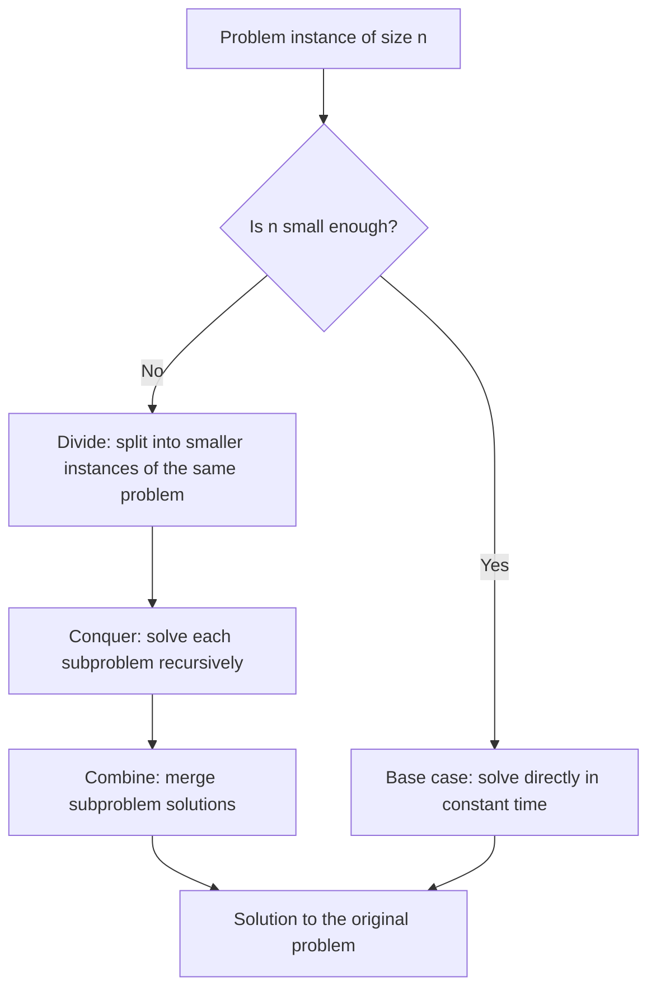
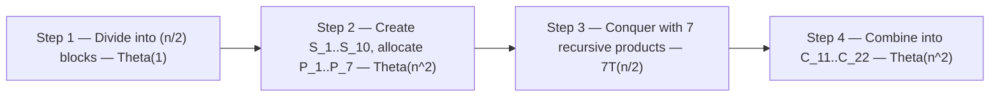
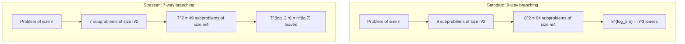

---
tags:
  - CCT3
  - Algoritmer
Topic: analysis and design of divide-and-qonquer algorithms
Semester: CCT3
Course: Algoritmer
Litterature:
  - Introduction to Algorithms, 4th ed.
Created: 26-09-2026
---
## Table of Contents

1. [[#3.1 The Divide-and-Conquer Paradigm|3.1 The Divide-and-Conquer Paradigm]]
2. [[#3.2 Recurrences|3.2 Recurrences]]
	1. [[#3.2 Recurrences#3.2.1 Algorithmic Recurrences|3.2.1 Algorithmic Recurrences]]
3. [[#3.3 Recurrence Conventions|3.3 Recurrence Conventions]]
4. [[#3.4 Varieties of Divide-and-Conquer Recurrences|3.4 Varieties of Divide-and-Conquer Recurrences]]
	1. [[#3.4 Varieties of Divide-and-Conquer Recurrences#3.4.1 Equal Fractional Subproblems|3.4.1 Equal Fractional Subproblems]]
	2. [[#3.4 Varieties of Divide-and-Conquer Recurrences#3.4.2 Unequal Fractional Subproblems|3.4.2 Unequal Fractional Subproblems]]
	3. [[#3.4 Varieties of Divide-and-Conquer Recurrences#3.4.3 Subtractive (Non-Fractional) Subproblems|3.4.3 Subtractive (Non-Fractional) Subproblems]]
5. [[#3.5 Methods for Solving Recurrences|3.5 Methods for Solving Recurrences]]
6. [[#3.6 Multiplying Square Matrices|3.6 Multiplying Square Matrices]]
	1. [[#3.6 Multiplying Square Matrices#3.6.1 Standard Iterative Matrix Multiplication|3.6.1 Standard Iterative Matrix Multiplication]]
	2. [[#3.6 Multiplying Square Matrices#3.6.2 A Simple Divide-and-Conquer Algorithm|3.6.2 A Simple Divide-and-Conquer Algorithm]]
	3. [[#3.6 Multiplying Square Matrices#3.6.3 Partitioning Implementation Strategies|3.6.3 Partitioning Implementation Strategies]]
	4. [[#3.6 Multiplying Square Matrices#3.6.4 Recursive Matrix Multiplication Algorithm|3.6.4 Recursive Matrix Multiplication Algorithm]]
7. [[#3.7 Strassen's Algorithm for Matrix Multiplication|3.7 Strassen's Algorithm for Matrix Multiplication]]
	1. [[#3.7 Strassen's Algorithm for Matrix Multiplication#3.7.1 The Fundamental Trade-Off|3.7.1 The Fundamental Trade-Off]]
	2. [[#3.7 Strassen's Algorithm for Matrix Multiplication#3.7.2 The Four-Step Algorithm|3.7.2 The Four-Step Algorithm]]
	3. [[#3.7 Strassen's Algorithm for Matrix Multiplication#3.7.3 Detailed Mathematical Formulations|3.7.3 Detailed Mathematical Formulations]]
	4. [[#3.7 Strassen's Algorithm for Matrix Multiplication#3.7.4 Running Time Analysis|3.7.4 Running Time Analysis]]
8. [[#3.8 The Substitution Method for Solving Recurrences|3.8 The Substitution Method for Solving Recurrences]]
	1. [[#3.8 The Substitution Method for Solving Recurrences#3.8.1 Demonstrating the Substitution Method|3.8.1 Demonstrating the Substitution Method]]
	2. [[#3.8 The Substitution Method for Solving Recurrences#3.8.2 Heuristics for Generating Good Guesses|3.8.2 Heuristics for Generating Good Guesses]]
	3. [[#3.8 The Substitution Method for Solving Recurrences#3.8.3 Strengthening the Hypothesis: Subtracting a Lower-Order Term|3.8.3 Strengthening the Hypothesis: Subtracting a Lower-Order Term]]
	4. [[#3.8 The Substitution Method for Solving Recurrences#3.8.4 Pitfalls to Avoid|3.8.4 Pitfalls to Avoid]]

# 3. Analysis and Design of Divide-and-Conquer Algorithms

| Symbol / Concept | Meaning | Section |
|---|---|---|
| Divide and conquer | Algorithmic paradigm: split a problem into smaller instances of itself, solve them recursively, then combine the results. | 3.1 |
| Divide · Conquer · Combine | The $3$ operational steps of the recursive case. | 3.1 |
| Base case | An instance small enough to be solved directly, without recursion. | 3.1 |
| $T(n)$ | The running-time function of an algorithm on an input of size $n$. | 3.2 |
| Recurrence | An equation or inequality defining a function in terms of its value on smaller arguments. | 3.2 |
| Well-defined / ill-defined | A recurrence is well-defined when some function satisfies it, ill-defined when none does. | 3.2 |
| $n_0$ | The threshold constant separating base-case-sized inputs from recursive ones. | 3.2.1 |
| $\Theta(1)$ | Constant time: bounded between positive constants $c_1$ and $c_2$. | 3.2.1 |
| Algorithmic recurrence | A running-time recurrence with constant base-case time and finite termination. | 3.2.1 |
| $\lfloor \cdot \rfloor$, $\lceil \cdot \rceil$ | Floor and ceiling: round down / up, keeping subproblem sizes integral. | 3.3 |
| $O$, $\Omega$, $\Theta$ | Asymptotic upper bound, lower bound, and tight bound. | 3.3 |
| $T(n) = aT(n/b) + f(n)$ | The standard divide-and-conquer recurrence shape. | 3.5 |
| $a$ | Number of subproblems spawned by each recursive call. | 3.5 |
| $b$ | Factor by which each subproblem shrinks ($b > 1$). | 3.5 |
| Driving function $f(n)$ | The non-recursive cost of dividing and combining. | 3.5 |
| Watershed function $n^{\log_b a}$ | Total leaf cost of the recursion tree — the benchmark the cases compare $f(n)$ against. | 3.5 |
| $\epsilon$ | Positive exponent measuring polynomial separation of $f(n)$ from the watershed. | 3.5 |
| $k$ | Non-negative exponent in Case 2: $f(n) = \Theta(n^{\log_b a}\lg^k n)$ gives $T(n) = \Theta(n^{\log_b a}\lg^{k+1} n)$. | 3.5 |
| Regularity condition | $a f(n/b) \le c f(n)$ for some constant $c < 1$ — the extra hypothesis Case 3 needs so that per-level costs shrink geometrically. | 3.5 |
| Substitution method | Guess a bound, then prove it by induction with explicit constants. | 3.5, 3.8 |
| Recursion-tree method | Draw the tree of subproblem costs and sum levels and leaves. | 3.5 |
| Master method | $3$-case cookbook for $T(n) = aT(n/b) + f(n)$. | 3.5 |
| Akra–Bazzi method | Integral-based generalization covering recurrences outside the master method's cases. | 3.5 |
| $A = (a_{ik})$, $B = (b_{kj})$, $C = (c_{ij})$ | Square $n \times n$ matrices and their entries; row index first, column second. | 3.6 |
| $c_{ij} = \sum_{k=1}^{n} a_{ik} b_{kj}$ | Definition of the $(i,j)$-entry of the matrix product $C = A \cdot B$. | 3.6 |
| Dense / sparse matrix | Density of nonzero entries; sparse matrices allow compact storage. | 3.6 |
| $A_{ij}, B_{ij}, C_{ij}$ | The $4$ $(n/2) \times (n/2)$ submatrices of $A$, $B$, and $C$. | 3.6.2 |
| $S_1, \dots, S_{10}$ | Strassen's $10$ intermediate sum/difference matrices. | 3.7.3 |
| $P_1, \dots, P_7$ | Strassen's $7$ recursive matrix products. | 3.7.3 |
| $\lg n$ | The binary logarithm, $\log_2 n$. | 3.7 |
| $\lg 7 \approx 2.807$ | Strassen's exponent: the base-2 logarithm of the branching factor $7$. | 3.7 |
| CLRS | *Introduction to Algorithms* by Cormen, Leiserson, Rivest, and Stein — the course textbook. | 3.1 |

_Table 3.1: Quick reference of the divide-and-conquer vocabulary, recurrence notation, and Strassen symbols used in this note._

> [!note] Notation Conventions Used Throughout This Note
> - $n$ is the problem size, $T(n)$ the running time; all asymptotics describe the limit $n \to \infty$.
> - $\lg n$ means $\log_2 n$; a general base is written $\log_b$.
> - $O$, $\Omega$, and $\Theta$ keep their standard meanings: upper bound, lower bound, and tight bound (Section 3.3).
> - Floors and ceilings are omitted except when they matter; base cases are likewise implicit unless stated.
> - Theorem and section labels citing **CLRS** (the textbook *Introduction to Algorithms* by Cormen, Leiserson, Rivest, and Stein) give the source's own numbering; this note's numbering (3.1–3.8) is used everywhere else.

---

## 3.1 The Divide-and-Conquer Paradigm

The **divide-and-conquer** method is an algorithmic paradigm based on multi-branched recursion. A divide-and-conquer algorithm breaks a problem down into smaller instances of the same problem, solves those instances recursively, and combines their solutions to resolve the original problem.

The execution branches into two main cases:

- **Base case:** When the problem instance is sufficiently small, it is solved directly without further recursive calls.
- **Recursive case:** When the problem instance is large, it undergoes $3$ distinct operational steps:
  1. **Divide:** Partition the problem into one or more subproblems that are smaller instances of the identical problem.
  2. **Conquer:** Solve each subproblem recursively.
  3. **Combine:** Merge the subproblem solutions into the solution for the original problem.



_Figure 3.1: The divide-and-conquer control flow — each instance either hits the base case or is split, solved recursively, and recombined; the two paths converge on the same output._

**Example — one paradigm, three steps.** Merge sort is the canonical instance: given an array, it **divides** it into two halves, **conquers** each half by sorting it recursively, and **combines** the two sorted halves with a linear merge. Strassen's algorithm (Section 3.7) is the same paradigm applied to *matrices* — divide the matrices into blocks, conquer by $7$ recursive multiplications, combine by additions. Comparing the two makes the analysis concrete: merge sort spawns $2$ subproblems of half size with a $\Theta(n)$ combine step, while Strassen spawns $7$ subproblems of half size with a $\Theta(n^2)$ combine step ✓.

---

## 3.2 Recurrences

A **recurrence** is an equation or inequality that describes a mathematical function in terms of its value on smaller arguments. Recurrences provide the standard mathematical tool for characterizing and analyzing the running times of recursive algorithms.

A general recurrence consists of:

- **Recursive cases:** Branches where the function is invoked recursively on smaller arguments.
- **Base cases:** Branches where the function is evaluated directly without recursion.

A recurrence is **well-defined** if there exists at least one mathematical function that satisfies its system of equations, and **ill-defined** otherwise.

**Example — well-defined versus ill-defined.** The recurrence $T(n) = 2T(n/2) + n$ with $T(1) = 1$ is well-defined: the function $T(n) = n \lg n + n$ (for powers of two) satisfies it. By contrast, a recurrence is ill-defined only when *no* function satisfies it: $T(n) = T(n) + 1$ demands $0 = 1$, and $T(n) = T(n-1)$ with the contradictory base cases $T(0) = 0$ and $T(1) = 1$ forces $T(1) = T(0) = 0 \ne 1$ — neither system has any solution. Note the subtler middle case: $T(n) = T(n-1)$ with *no* base case at all is **not** ill-defined but **underdetermined** — every constant function satisfies it, so it pins down no unique running time ✓.

### 3.2.1 Algorithmic Recurrences

Recurrences that represent the running time $T(n)$ of valid divide-and-conquer algorithms exhibit specific structural properties.

> [!info] Definition: Algorithmic Recurrence
> A running-time recurrence $T(n)$ is **algorithmic** if, for every sufficiently large threshold constant $n_0 > 0$, the following two conditions hold:
>
> 1. **Constant base time:** For all $n < n_0$, $T(n) = \Theta(1)$.
> 2. **Finite termination:** For all $n \ge n_0$, every recursion path terminates in a base case within a finite number of recursive steps.
>
> **Breakdown:**
> - $T(n)$ : The worst-case running-time function for an input size $n$.
> - $n$ : The problem input size parameter.
> - $n_0$ : A positive threshold constant defining the boundary between recursive subproblems and direct base-case computation.
> - $\Theta(1)$ : Bounded constant time (execution takes between $c_1$ and $c_2$ basic operations for positive constants $c_1, c_2$).

These properties reflect practical computation:

- The base execution time must be strictly positive ($T(n) \ge c_1 > 0$) because entering and exiting functions requires executing machine instructions.
- The maximum running time for small inputs ($n < n_0$) must be bounded from above ($T(n) \le c_2$) across the finite set of small inputs.
- Failure to terminate within a finite number of recursive invocations would mean the algorithm enters an infinite loop, failing to solve the problem.

**Example — the conditions in miniature.** Merge sort satisfies both: on inputs below any threshold $n_0$, the algorithm's cost is a bounded constant ($\Theta(1)$ ✓), and each recursive call halves the array, so every path reaches a size-1 array after $\lceil \lg n \rceil$ steps ✓. A hypothetical algorithm that recursed on $T(n/2)$ **and** $T(n)$ would violate finite termination — the $T(n)$ branch never shrinks — and so could not be algorithmic.

---

## 3.3 Recurrence Conventions

When working with divide-and-conquer recurrences, standard conventions simplify notation and analysis:

- **Implicit base cases:** When an algorithmic recurrence is written without an explicit base case, it is assumed that $T(n) = \Theta(1)$ for all $n < n_0$ for a sufficiently large constant $n_0$. The asymptotic solution remains invariant under any valid choice of $n_0$.
- **Omission of floors and ceilings:** Although odd problem sizes divide into integer subproblems involving floors and ceilings (e.g., $T(\lfloor n/2 \rfloor) + T(\lceil n/2 \rceil)$), the asymptotic solution is identical to the continuous real formulation $2T(n/2)$. Thus, floor and ceiling notations are generally omitted.
- **Inequalities and asymptotic bounds:**
  - If a recurrence is defined as an upper-bound inequality (e.g., $T(n) \le 2T(n/2) + \Theta(n)$), its solution is expressed using $O$-notation.
  - If defined as a lower-bound inequality (e.g., $T(n) \ge 2T(n/2) + \Theta(n)$), its solution is expressed using $\Omega$-notation.

**Example — the conventions at work.** For an odd size such as $n = 7$, the exact split is $T(\lfloor 7/2 \rfloor) + T(\lceil 7/2 \rceil) = T(3) + T(4)$, whereas the continuous form writes $2T(3.5) = 2T(7/2)$. Both lead to the same asymptotics, so the note writes $T(n) = 2T(n/2) + \Theta(n)$ throughout. Likewise, proving $T(n) \le 2T(n/2) + \Theta(n)$ for all $n$ yields the statement $T(n) = O(n \lg n)$ ✓ — the inequality direction is what licenses the $O$.

---

## 3.4 Varieties of Divide-and-Conquer Recurrences

Divide-and-conquer algorithms partition subproblems in various configurations:

### 3.4.1 Equal Fractional Subproblems

The original problem of size $n$ is partitioned into $a$ equal subproblems of size $n/b$:

- **Standard recursive matrix multiplication:** Divides matrix multiplication into $8$ recursive subproblems of half size:
  $$T(n) = 8T(n/2) + \Theta(1) \implies T(n) = \Theta(n^3)$$
- **Strassen's matrix multiplication algorithm:** Reduces the computation to $7$ recursive subproblems of half size:
  $$T(n) = 7T(n/2) + \Theta(n^2) \implies T(n) = \Theta(n^{\lg 7}) \approx \Theta(n^{2.81})$$

### 3.4.2 Unequal Fractional Subproblems

Subproblems are divided into different fractional sizes:

- **Unequal binary partition:**
  $$T(n) = T(n/3) + T(2n/3) + \Theta(n) \implies T(n) = \Theta(n \lg n)$$
- **Asymmetric subproblem partition:**
  $$T(n) = T(n/5) + T(7n/10) + \Theta(n) \implies T(n) = \Theta(n)$$

The contrast between these two is instructive: the fractions $1/3 + 2/3$ sum to exactly $1$, so every full level of the recursion tree costs $cn$ and the $\Theta(\lg n)$ levels accumulate to $\Theta(n \lg n)$; the fractions $1/5 + 7/10$ sum to $9/10 < 1$, so each level costs only a shrinking fraction of the previous one and the geometric decay collapses the total to $\Theta(n)$ ✓.

### 3.4.3 Subtractive (Non-Fractional) Subproblems

A subproblem is reduced by a fixed constant size rather than a constant fraction:

- **Recursive linear search:** Decrements problem size by $1$ per step:
  $$T(n) = T(n - 1) + \Theta(1) \implies T(n) = \Theta(n)$$

> [!warning] The Master Method Does Not Apply to Subtractive Recurrences
> The master method requires the form $T(n) = aT(n/b) + f(n)$ with a **constant fraction** $n/b$, but $T(n) = T(n - 1) + \Theta(1)$ shrinks by a constant amount instead. There is no watershed function $n^{\log_b a}$ to compare against — such recurrences are solved by unrolling instead. Unrolling $T(n) = T(n-1) + \Theta(1)$ gives $n$ constant-time steps, hence $\Theta(n)$; the same shape with linear overhead, $T(n) = T(n-1) + \Theta(n)$, unrolls to $\Theta(n^2)$ — the pattern behind selection-sort-style recurrences.

The varieties are collected below, together with the argument that establishes each solution.

| Variety | Recurrence | Solution | Why |
| :--- | :--- | :--- | :--- |
| Equal fractional | $T(n) = 8T(n/2) + \Theta(1)$ | $\Theta(n^3)$ | watershed $n^{\log_2 8} = n^3$; leaves dominate (Case 1) |
| Equal fractional | $T(n) = 7T(n/2) + \Theta(n^2)$ | $\Theta(n^{\lg 7}) \approx \Theta(n^{2.81})$ | watershed $n^{\lg 7} \approx n^{2.807}$ beats $n^2$ (Case 1) |
| Unequal fractional | $T(n) = T(n/3) + T(2n/3) + \Theta(n)$ | $\Theta(n \lg n)$ | fractions sum to $1$: every full level costs $cn$ |
| Unequal fractional | $T(n) = T(n/5) + T(7n/10) + \Theta(n)$ | $\Theta(n)$ | fractions sum to $9/10 < 1$: level costs decay geometrically |
| Subtractive | $T(n) = T(n - 1) + \Theta(1)$ | $\Theta(n)$ | unrolls to $n$ constant-time steps |

_Table 3.2: The five variety exemplars with their solutions and the one-line reason each solution holds — equal splits are settled by the master method, unequal and subtractive splits by tree-level or unrolling arguments._

**Verification of the corner case.** For $T(n) = T(n/5) + T(7n/10) + \Theta(n)$, the guess $T(n) \le cn$ holds by induction once $c$ dominates the overhead: substituting gives $T(n) \le \frac{c n}{5} + \frac{7 c n}{10} + d n = \frac{9}{10} c n + d n \le cn$ precisely when $d \le \frac{1}{10} c$, i.e. $c \ge 10d$ ✓.

---

## 3.5 Methods for Solving Recurrences

$4$ primary mathematical methods are used to determine asymptotic bounds ($\Theta, O, \Omega$) for recurrences:

| Method | Approach | Best used for |
| :--- | :--- | :--- |
| **Substitution method** | Guess the solution form and verify it using mathematical induction to solve for constants. | Robust verification of specific bounds; establishing inductive proofs once a guess is known. |
| **Recursion-tree method** | Model recursive calls as a tree, evaluate the sum of per-level costs, and aggregate all levels and leaves. | Visualizing cost distribution across recursive depth; generating informed guesses for substitution proofs. |
| **Master method** | Apply a $3$-case theorem to recurrences of the form $T(n) = aT(n/b) + f(n)$ by comparing $f(n)$ to $n^{\log_b a}$. | Fast, *cookbook* asymptotic solutions for standard divide-and-conquer recurrences with equal-sized subproblems. |
| **Akra–Bazzi method** | Apply a generalized integral-based calculus framework to solve complex divide-and-conquer recurrences. | Irregular recurrences with unequal fractional subproblems or non-polynomial driving functions. |

_Table 3.3: The $4$ solving methods — what each does and when it is the right tool._

The master method is used repeatedly in the rest of this note (Sections 3.6 and 3.7), so its $3$ cases are stated here in full.

> [!summary] Theorem 1: Master Theorem (CLRS Theorem 4.1)
> Let $a \ge 1$ and $b > 1$ be constants, and let $f(n)$ be an asymptotically non-negative driving function. For the recurrence $T(n) = aT(n/b) + f(n)$, the asymptotic behavior of $T(n)$ is:
>
> 1. **Case 1:** If $f(n) = O(n^{\log_b a - \epsilon})$ for some constant $\epsilon > 0$, then $T(n) = \Theta(n^{\log_b a})$.
> 2. **Case 2:** If $f(n) = \Theta(n^{\log_b a} \lg^k n)$ for some constant $k \ge 0$, then $T(n) = \Theta(n^{\log_b a} \lg^{k+1} n)$.
> 3. **Case 3:** If $f(n) = \Omega(n^{\log_b a + \epsilon})$ for some constant $\epsilon > 0$ **and** $f(n)$ satisfies the regularity condition $a f(n/b) \le c f(n)$ for some constant $c < 1$, then $T(n) = \Theta(f(n))$.
>
> **Breakdown:**
> - $a$ : Number of subproblems per recursive call (the branching factor of the recursion tree).
> - $b$ : Subproblem shrink factor; each subproblem has size $n/b$.
> - $f(n)$ : The driving function — the cost of dividing the problem and combining subproblem solutions.
> - $n^{\log_b a}$ : The watershed function — the total cost of the recursion tree's leaves.
> - $\epsilon$ : A positive constant certifying that $f(n)$ is separated from the watershed by a polynomial factor $n^{\epsilon}$.
> - $k$ : A non-negative exponent describing a polylogarithmic difference in Case 2.
> - $c$ : The regularity constant ($c < 1$) guaranteeing that per-level costs shrink geometrically toward the leaves in Case 3.
>
> **Proof:**
> Proof omitted — beyond the scope of this note. The theorem is used here as a tool; its $3$ cases are the formal statement of the tree intuition "which of leaves, levels, or root carries the total cost?"

> [!example] Which Case Applies? Two More Instances
> **Case 2 instance — $T(n) = 2T(n/2) + \Theta(n)$, the merge-sort shape.** Here $a = 2$ and $b = 2$, so the watershed is $n^{\log_2 2} = n$; the driving function is $f(n) = \Theta(n) = \Theta(n^1 \lg^0 n)$, matching the watershed with $k = 0$. Case 2 gives $T(n) = \Theta(n \lg n)$ ✓.
> **Case 3 instance — $T(n) = 3T(n/4) + \Theta(n^2)$.** The watershed is $n^{\log_4 3} \approx n^{0.793}$, and $f(n) = \Theta(n^2) = \Omega(n^{0.793 + \epsilon})$ for $\epsilon \approx 1.2$. The regularity condition holds because $3 \cdot (n/4)^2 = \frac{3}{16}n^2 \le c n^2$ with $c = \frac{3}{16} < 1$. Case 3 therefore gives $T(n) = \Theta(n^2)$ ✓.
> Verification: in the Case-2 instance the polylogarithmic exponent reads $k = 0$, so the output exponent is $k + 1 = 1$ — a single $\lg n$ factor, not $\lg^2 n$ ✓; in the Case-3 instance $\log_4 3 + 1.2 \approx 1.99 < 2$, so $n^2$ is polynomially larger than the watershed ✓, with $c = \frac{3}{16} < 1$ ✓.

Two of the remaining methods deserve a little more colour:

- The **recursion-tree method** draws the recursion as a tree: each node is one subproblem invocation labelled with its non-recursive cost, a level's cost is the sum across that row, and the total is the sum of all levels plus the leaves. Its output is usually a *guess*, which the substitution method then proves — and since the variety analysis above already used tree arguments twice, the method is at work throughout this note.
- The **Akra–Bazzi method** is the generalization that catches what the master method drops: recurrences whose splits are unequal, or whose driving function is not polynomially separated from the watershed. It computes a growth exponent from the branching factors and integrates the driving function to report the exact order of growth. Two resolutions it delivers: $T(n) = 2T(n/2) + n/\lg n$ — the classic gap case where the master method stalls — resolves to $T(n) = \Theta(n \lg \lg n)$; and the asymmetric partition $T(n) = T(n/5) + T(7n/10) + \Theta(n)$ of Section 3.4.2 resolves to $\Theta(n)$, matching the geometric-decay argument ✓.

> [!example] The Recursion-Tree Method in Action: $T(n) = T(n/3) + T(2n/3) + \Theta(n)$
> Replace the overhead with $cn$ and expand the first levels of the tree:
>
> ```text
> Depth 0:                        cn                             = cn
>                              /      \
> Depth 1:               c(n/3)        c(2n/3)                   = cn
>                       /     \        /     \
> Depth 2:       c(n/9)   c(2n/9)  c(2n/9)  c(4n/9)               = cn
>                    :        :        :        :
>              (deepest: n/3 branches)     (longest: 2n/3 branches)
> ```
>
> **Level costs.** At depth $j$ the subproblem sizes sum to $n(1/3 + 2/3)^j = n$, so every fully populated level costs exactly $cn$ — the fractions summing to $1$ is what keeps the level cost constant rather than decaying.
> **How many levels?** Levels are fully populated while the smallest subproblem at depth $j$, $(1/3)^j n$, is still at least $n_0$ — that is, for all $j \le \log_3(n/n_0)$, which is $\Theta(\lg n)$ levels. The tree's total height is set by the longest path, following the $2n/3$ branches: $\log_{3/2}(n/n_0)$, also $\Theta(\lg n)$.
> **Leaves.** The leaf count satisfies $L(n) = L(n/3) + L(2n/3) \le dn$ with $d = 1$ — the fractions recombine to $n$ — so there are $O(n)$ leaves, each doing $\Theta(1)$ work.
> **Total.** The fully populated levels alone contribute $\Omega(n \lg n)$; bounding *every* level by $cn$ across the $\Theta(\lg n)$ levels gives $O(n \lg n)$; and the leaves add only $O(n)$. The tree therefore *guesses* $T(n) = \Theta(n \lg n)$.
> Verification: $1/3 + 2/3 = 1$ keeps each full level at exactly $cn$ ✓; both $\log_3(n/n_0)$ and $\log_{3/2}(n/n_0)$ are $\Theta(\lg n)$ ✓; and the leaf recurrence reproduces $dn$ exactly ✓ — the same solution the variety analysis in Section 3.4.2 reported.

---

## 3.6 Multiplying Square Matrices

*(CLRS §4.1)*

Let $A = (a_{ik})$ and $B = (b_{kj})$ be square $n \times n$ matrices. The matrix product $C = A \cdot B$ is an $n \times n$ matrix whose entries $c_{ij}$ for $i, j = 1, 2, \dots, n$ are defined by:

$$c_{ij} = \sum_{k=1}^n a_{ik} \cdot b_{kj}$$

**Breakdown:**
- $C$ : The resulting $n \times n$ product matrix with entries $c_{ij}$.
- $A$ : The left $n \times n$ factor matrix with entries $a_{ik}$ (row $i$, column $k$).
- $B$ : The right $n \times n$ factor matrix with entries $b_{kj}$ (row $k$, column $j$).
- $n$ : The matrix dimension (number of rows and columns).
- $\sum_{k=1}^n$ : The summation adding the $n$ pairwise products across row $i$ of $A$ and column $j$ of $B$.

Matrices are typically categorized based on non-zero entry density:

- **Dense matrices:** Most of the $n^2$ entries are non-zero.
- **Sparse matrices:** Most of the $n^2$ entries are zero, allowing compact specialized storage.

**Check the definition on a tiny instance.** For $A = \begin{bmatrix} 1 & 2 \\ 3 & 4 \end{bmatrix}$ and $B = \begin{bmatrix} 5 & 6 \\ 7 & 8 \end{bmatrix}$, the $(1,1)$-entry is $c_{11} = a_{11}b_{11} + a_{12}b_{21} = 1 \cdot 5 + 2 \cdot 7 = 19$ — the very instance re-derived three different ways in the next section ✓.

### 3.6.1 Standard Iterative Matrix Multiplication

Computing the matrix $C$ requires evaluating $n^2$ individual entries, each comprising a sum of $n$ scalar multiplications. The iterative procedure computes $C = C + A \cdot B$ in place:

```text
MATRIX-MULTIPLY(A, B, C, n)
1  for i = 1 to n           // Compute entries in each of n rows
2      for j = 1 to n       // Compute n entries in row i
3          for k = 1 to n
4              c_ij = c_ij + a_ik * b_kj   // Accumulate pairwise products
```

> [!info] Running Time of Iterative Multiplication
> The procedure uses $3$ nested loops, each executing exactly $n$ iterations:
>
> - The inner loop statement (line 4) runs in $\Theta(1)$ constant time.
> - Total loop operations: $n \times n \times n = n^3$.
> - Initializing $C$ to zero takes $\Theta(n^2)$ time, which is asymptotically dominated by the multiplication loops.
>
> The overall running time is $\Theta(n^3)$.

### 3.6.2 A Simple Divide-and-Conquer Algorithm

Assuming $n$ is an exact power of $2$, an $n \times n$ matrix multiplication can be structured recursively by partitioning $A$, $B$, and $C$ into $4$ $(n/2) \times (n/2)$ submatrices:

$$A = \begin{bmatrix} A_{11} & A_{12} \\ A_{21} & A_{22} \end{bmatrix}, \quad B = \begin{bmatrix} B_{11} & B_{12} \\ B_{21} & B_{22} \end{bmatrix}, \quad C = \begin{bmatrix} C_{11} & C_{12} \\ C_{21} & C_{22} \end{bmatrix}$$

Multiplying the partitioned blocks yields:

$$\begin{bmatrix} C_{11} & C_{12} \\ C_{21} & C_{22} \end{bmatrix} = \begin{bmatrix} A_{11} & A_{12} \\ A_{21} & A_{22} \end{bmatrix} \begin{bmatrix} B_{11} & B_{12} \\ B_{21} & B_{22} \end{bmatrix} = \begin{bmatrix} A_{11}B_{11} + A_{12}B_{21} & A_{11}B_{12} + A_{12}B_{22} \\ A_{21}B_{11} + A_{22}B_{21} & A_{21}B_{12} + A_{22}B_{22} \end{bmatrix}$$

This produces $4$ submatrix equations:

$$\begin{aligned} C_{11} &= A_{11}B_{11} + A_{12}B_{21} \\ C_{12} &= A_{11}B_{12} + A_{12}B_{22} \\ C_{21} &= A_{21}B_{11} + A_{22}B_{21} \\ C_{22} &= A_{21}B_{12} + A_{22}B_{22} \end{aligned}$$

Evaluating these $4$ equations requires **$8$ multiplications** and **$4$ additions** of $(n/2) \times (n/2)$ submatrices.

### 3.6.3 Partitioning Implementation Strategies

Partitioning submatrices can be handled in $2$ ways:

1. **Copying elements (explicit submatrix allocation):**
   - Allocate temporary memory for each $(n/2) \times (n/2)$ block and copy entries from $A$ and $B$.
   - After computing recursive products, copy results into $C$.
   - **Cost:** Requires copying $3n^2$ total entries, taking $\Theta(n^2)$ time.
2. **Index calculations (in-place referencing):**
   - Define submatrix boundaries using row and column index ranges (row/column start and end offsets) directly within the original matrix storage.
   - Operations and updates modify memory in place without data movement.
   - **Cost:** Updating boundary index metadata takes $\Theta(1)$ time.

The distinction matters for the recurrences that follow: copying adds an extra $\Theta(n^2)$ term to the divide step of *every* level, while index calculations keep the divide step at $\Theta(1)$ — which is exactly the $\Theta(1)$ recorded in the recurrence below ✓.

### 3.6.4 Recursive Matrix Multiplication Algorithm

```text
MATRIX-MULTIPLY-RECURSIVE(A, B, C, n)
1  if n == 1
2      // Base case
3      c_11 = c_11 + a_11 * b_11
4      return
5  // Divide
6  partition A, B, and C into n/2 x n/2 submatrices:
       A_11, A_12, A_21, A_22;
       B_11, B_12, B_21, B_22;
       C_11, C_12, C_21, C_22
7  // Conquer
8  MATRIX-MULTIPLY-RECURSIVE(A_11, B_11, C_11, n/2)
9  MATRIX-MULTIPLY-RECURSIVE(A_11, B_12, C_12, n/2)
10 MATRIX-MULTIPLY-RECURSIVE(A_21, B_11, C_21, n/2)
11 MATRIX-MULTIPLY-RECURSIVE(A_21, B_12, C_22, n/2)
12 MATRIX-MULTIPLY-RECURSIVE(A_12, B_21, C_11, n/2)
13 MATRIX-MULTIPLY-RECURSIVE(A_12, B_22, C_12, n/2)
14 MATRIX-MULTIPLY-RECURSIVE(A_22, B_21, C_21, n/2)
15 MATRIX-MULTIPLY-RECURSIVE(A_22, B_22, C_22, n/2)
```

The $8$ calls are grouped in pairs per output block: lines $8$ and $12$ both accumulate into $C_{11} = A_{11}B_{11} + A_{12}B_{21}$; lines $9$ and $13$ into $C_{12}$; lines $10$ and $14$ into $C_{21}$; lines $11$ and $15$ into $C_{22}$ ✓ — matching the $4$ submatrix equations of Section 3.6.2 exactly.

> [!example] Running Time Analysis of Recursive Matrix Multiplication
> Let $T(n)$ be the worst-case running time of `MATRIX-MULTIPLY-RECURSIVE` on $n \times n$ matrices:
>
> - **Base case ($n = 1$):** Performs $1$ scalar multiplication and $1$ addition: $T(1) = \Theta(1)$.
> - **Divide step:** Submatrix indexing takes $\Theta(1)$ time.
> - **Conquer step:** $8$ recursive calls on subproblems of size $n/2$, contributing $8T(n/2)$ time.
> - **Combine step:** Results are accumulated in place during the recursive calls ($\Theta(1)$ additional work).
>
> The overall recurrence is:
>
> $$T(n) = 8T(n/2) + \Theta(1)$$
>
> Applying the Master Theorem ($a = 8, b = 2, f(n) = \Theta(1)$):
> - Watershed function: $n^{\log_b a} = n^{\log_2 8} = n^3$.
> - Since $f(n) = O(n^{3 - \epsilon})$ for $\epsilon = 3$, Case 1 applies:
>
> $$T(n) = \Theta(n^3)$$
>
> Verification: $f(n) = \Theta(1) = O(n^{3-3}) = O(1)$ satisfies Case 1's condition exactly at $\epsilon = 3$ ✓, and the answer matches the iterative algorithm's $\Theta(n^3)$ — as it must, since both perform $n^3$ scalar multiplications ✓.

> [!note] Comparison with Merge Sort's Recurrence
> Although the recursive matrix multiplication recurrence has a smaller non-recursive term ($\Theta(1)$) than merge sort's recurrence ($T(n) = 2T(n/2) + \Theta(n)$), its asymptotic running time ($\Theta(n^3)$) is significantly higher than merge sort's ($\Theta(n \lg n)$).
>
> The high branching factor ($a = 8$ versus $a = 2$) creates a much *bushier* recursion tree containing $8^{\log_2 n} = n^3$ base-case leaves, meaning the computational cost of the leaves completely dominates the running time.

---
## 3.7 Strassen's Algorithm for Matrix Multiplication

*(CLRS §4.2)*

Until 1969, it was widely assumed that multiplying two $n \times n$ matrices required $\Omega(n^3)$ operations due to the $n^3$ scalar multiplications in the standard definition. Volker Strassen introduced a recursive divide-and-conquer algorithm that broke this barrier, achieving a running time of:

$$T(n) = \Theta(n^{\lg 7}) \approx \Theta(n^{2.81})$$

**Breakdown:**
- $\lg 7 = \log_2 7 \approx 2.807355$ : The critical exponent governing the recursion tree's leaf growth.
- $n^{2.81}$ : The informal decimal form of $n^{\lg 7}$, which strictly outperforms the standard $\Theta(n^3)$ algorithm for large inputs.

### 3.7.1 The Fundamental Trade-Off

Standard recursive matrix multiplication requires **$8$** submatrix multiplications and **$4$** submatrix additions, leading to an 8-way branching tree.

Strassen's algorithm reduces the number of recursive multiplications from **$8$ to $7$** at the cost of performing **$18$** matrix additions and subtractions ($10$ to prepare intermediate terms, and $8$ to combine the products). Because matrix addition takes $\Theta(n^2)$ time while multiplication grows much faster recursively, trading one multiplication for a constant number of additions yields an asymptotic speedup.

> [!abstract] Algebraic Analogy: Reducing Multiplications
> To compute $x^2 - y^2$ for two numbers $x$ and $y$:
>
> - **Standard method:** Compute $x^2$ and $y^2$ (2 multiplications), then subtract ($1$ subtraction). Total = 2 multiplications, 1 subtraction.
> - **Factored method:** Express as $(x + y)(x - y)$. Compute $x + y$ and $x - y$ (2 additions/subtractions), then multiply ($1$ multiplication). Total = 1 multiplication, 2 additions/subtractions.
>
> For large matrices where multiplication is far more computationally expensive than addition, minimizing multiplications yields significant performance benefits.
>
> Verification: $(x+y)(x-y) = x^2 - xy + yx - y^2 = x^2 - y^2$ ✓ — one multiplication really does suffice.

### 3.7.2 The Four-Step Algorithm

Assuming $n$ is an exact power of 2, Strassen's algorithm computes the matrix product $C = A \cdot B$ through $4$ main stages:

1. **Divide:** If $n = 1$, perform a single scalar multiplication in $\Theta(1)$ time. Otherwise, partition $A$, $B$, and $C$ into $(n/2) \times (n/2)$ submatrices using index calculations ($\Theta(1)$ time).
2. **Create intermediate matrices ($S_1, \dots, S_{10}$):** Construct $10$ addition/subtraction matrices of size $(n/2) \times (n/2)$ and allocate $7$ product matrices $P_1, \dots, P_7$ ($\Theta(n^2)$ time).
3. **Conquer (compute products $P_1, \dots, P_7$):** Recursively compute $7$ matrix products of size $(n/2) \times (n/2)$ using the submatrices and $S_i$ matrices ($7T(n/2)$ time).
4. **Combine (update result submatrices):** Assemble the $4$ blocks $C_{11}, C_{12}, C_{21}, C_{22}$ by adding and subtracting combinations of the $P_i$ matrices ($\Theta(n^2)$ time).



_Figure 3.2: The $4$ stages of Strassen's algorithm — only Step 3 recurses; the $2$ outer steps are pure $\Theta(n^2)$ matrix arithmetic, which is exactly what makes trading $1$ recursive multiplication for $18$ additions worthwhile._

### 3.7.3 Detailed Mathematical Formulations

**Step 2: intermediate sums and differences ($S_1$ to $S_{10}$).** $10$ $(n/2) \times (n/2)$ matrices are computed using entrywise additions and subtractions:

$$\begin{aligned}
S_1 &= B_{12} - B_{22} & S_6 &= B_{11} + B_{22} \\
S_2 &= A_{11} + A_{12} & S_7 &= A_{12} - A_{22} \\
S_3 &= A_{21} + A_{22} & S_8 &= B_{21} + B_{22} \\
S_4 &= B_{21} - B_{11} & S_9 &= A_{11} - A_{21} \\
S_5 &= A_{11} + A_{22} & S_{10} &= B_{11} + B_{12}
\end{aligned}$$

**Step 3: $7$ recursive products ($P_1$ to $P_7$).** $7$ recursive matrix multiplications are executed:

$$\begin{aligned}
P_1 &= A_{11} \cdot S_1 &&= A_{11}B_{12} - A_{11}B_{22} \\
P_2 &= S_2 \cdot B_{22} &&= A_{11}B_{22} + A_{12}B_{22} \\
P_3 &= S_3 \cdot B_{11} &&= A_{21}B_{11} + A_{22}B_{11} \\
P_4 &= A_{22} \cdot S_4 &&= A_{22}B_{21} - A_{22}B_{11} \\
P_5 &= S_5 \cdot S_6 &&= A_{11}B_{11} + A_{11}B_{22} + A_{22}B_{11} + A_{22}B_{22} \\
P_6 &= S_7 \cdot S_8 &&= A_{12}B_{21} + A_{12}B_{22} - A_{22}B_{21} - A_{22}B_{22} \\
P_7 &= S_9 \cdot S_{10} &&= A_{11}B_{11} + A_{11}B_{12} - A_{21}B_{11} - A_{21}B_{12}
\end{aligned}$$

**Step 4: constructing the product submatrices ($C_{ij}$).** The final $4$ submatrices of $C$ are computed by combining the $P_i$ matrices, allowing intermediate cross-terms to cancel out:

> [!example] Algebraic Cancellations of Submatrix Results
>
> **1. Computing $C_{11} = A_{11}B_{11} + A_{12}B_{21}$:**
>
> $$C_{11} = P_5 + P_4 - P_2 + P_6$$
>
> Expanding the $4$ products:
>
> $$\begin{aligned}
> &= (A_{11}B_{11} + A_{11}B_{22} + A_{22}B_{11} + A_{22}B_{22}) \\
> &\quad + (A_{22}B_{21} - A_{22}B_{11}) \\
> &\quad - (A_{11}B_{22} + A_{12}B_{22}) \\
> &\quad + (A_{12}B_{21} + A_{12}B_{22} - A_{22}B_{21} - A_{22}B_{22})
> \end{aligned}$$
>
> The $A_{11}B_{22}$, $A_{22}B_{11}$, $A_{22}B_{22}$, $A_{12}B_{22}$, and $A_{22}B_{21}$ terms cancel in pairs, leaving $C_{11} = A_{11}B_{11} + A_{12}B_{21}$ ✓.
>
> **2. Computing $C_{12} = A_{11}B_{12} + A_{12}B_{22}$:**
>
> $$C_{12} = P_1 + P_2 = (A_{11}B_{12} - A_{11}B_{22}) + (A_{11}B_{22} + A_{12}B_{22})$$
>
> The $\pm A_{11}B_{22}$ terms cancel, so $C_{12} = A_{11}B_{12} + A_{12}B_{22}$ ✓.
>
> **3. Computing $C_{21} = A_{21}B_{11} + A_{22}B_{21}$:**
>
> $$C_{21} = P_3 + P_4 = (A_{21}B_{11} + A_{22}B_{11}) + (A_{22}B_{21} - A_{22}B_{11})$$
>
> The $\pm A_{22}B_{11}$ terms cancel, so $C_{21} = A_{21}B_{11} + A_{22}B_{21}$ ✓.
>
> **4. Computing $C_{22} = A_{21}B_{12} + A_{22}B_{22}$:**
>
> $$C_{22} = P_5 + P_1 - P_3 - P_7$$
>
> Expanding:
>
> $$\begin{aligned}
> &= (A_{11}B_{11} + A_{11}B_{22} + A_{22}B_{11} + A_{22}B_{22}) \\
> &\quad + (A_{11}B_{12} - A_{11}B_{22}) \\
> &\quad - (A_{21}B_{11} + A_{22}B_{11}) \\
> &\quad - (A_{11}B_{11} + A_{11}B_{12} - A_{21}B_{11} - A_{21}B_{12})
> \end{aligned}$$
>
> The $A_{11}B_{11}$, $A_{11}B_{22}$, $A_{22}B_{11}$, and $A_{11}B_{12}$ terms cancel, leaving $C_{22} = A_{21}B_{12} + A_{22}B_{22}$ ✓.

> [!example] Running Strassen by Hand on a $2 \times 2$ Instance
> Every identity above can be checked in full on a numerical instance. Let
>
> $$A = \begin{bmatrix} 1 & 2 \\ 3 & 4 \end{bmatrix}, \qquad B = \begin{bmatrix} 5 & 6 \\ 7 & 8 \end{bmatrix} \quad\Longrightarrow\quad A_{11} = 1,\; A_{12} = 2,\; A_{21} = 3,\; A_{22} = 4,\; B_{11} = 5,\; B_{12} = 6,\; B_{21} = 7,\; B_{22} = 8$$
>
> (For a $2 \times 2$ input the blocks are single scalars, so the recursive products $P_i$ are just scalar multiplications.)
>
> **Step 2 — the $10$ sums and differences:**
>
> $$S_1 = -2, \quad S_2 = 3, \quad S_3 = 7, \quad S_4 = 2, \quad S_5 = 5, \quad S_6 = 13, \quad S_7 = -2, \quad S_8 = 15, \quad S_9 = -2, \quad S_{10} = 11$$
>
> **Step 3 — the $7$ products:**
>
> $$P_1 = -2, \quad P_2 = 24, \quad P_3 = 35, \quad P_4 = 8, \quad P_5 = 65, \quad P_6 = -30, \quad P_7 = -22$$
>
> **Step 4 — the $4$ result blocks:**
>
> $$\begin{aligned} C_{11} &= P_5 + P_4 - P_2 + P_6 = 65 + 8 - 24 - 30 = 19 \\ C_{12} &= P_1 + P_2 = -2 + 24 = 22 \\ C_{21} &= P_3 + P_4 = 35 + 8 = 43 \\ C_{22} &= P_5 + P_1 - P_3 - P_7 = 65 - 2 - 35 + 22 = 50 \end{aligned}$$
>
> Assembling the blocks gives
>
> $$C = \begin{bmatrix} 19 & 22 \\ 43 & 50 \end{bmatrix}$$
>
> Verification: direct multiplication gives exactly the same product, $AB = \begin{bmatrix} 1 \cdot 5 + 2 \cdot 7 & 1 \cdot 6 + 2 \cdot 8 \\ 3 \cdot 5 + 4 \cdot 7 & 3 \cdot 6 + 4 \cdot 8 \end{bmatrix} = \begin{bmatrix} 19 & 22 \\ 43 & 50 \end{bmatrix}$ ✓ — and only $7$ multiplications were used, with all $18$ additions and subtractions accounted for ✓.

### 3.7.4 Running Time Analysis

> [!example] Running Time Recurrence of Strassen's Algorithm
> The overall computational time satisfies the divide-and-conquer recurrence:
>
> $$T(n) = 7T(n/2) + \Theta(n^2)$$
>
> **Breakdown:**
> - $7$ : The number of recursive matrix products ($P_1, \dots, P_7$).
> - $n/2$ : The dimension of each recursive subproblem.
> - $\Theta(n^2)$ : The non-recursive overhead for matrix additions/subtractions across Steps 1, 2, and 4.
>
> **Master Theorem evaluation:**
> - $a = 7, b = 2 \implies n^{\log_b a} = n^{\log_2 7} \approx n^{2.807}$.
> - Driving function: $f(n) = \Theta(n^2) = O(n^{\log_2 7 - \epsilon})$ for $\epsilon \approx 0.807$.
> - Because $f(n)$ is polynomially smaller than the watershed function $n^{\log_2 7}$, **Case 1 of the Master Theorem applies**:
>
> $$T(n) = \Theta(n^{\log_2 7}) = \Theta(n^{\lg 7}) = o(n^3)$$
>
> Verification: the exponent gap is real — $\lg 7 - 2 \approx 0.807 > 0$ ✓ — and the conclusion $T(n) = o(n^3)$ follows from the exponent $\lg 7 \approx 2.807 < 3$ ✓.

By reducing the recursion tree's branching factor from $8$ to $7$, Strassen's algorithm achieves sub-cubic asymptotic complexity, strictly outperforming standard iterative and naive recursive approaches.



_Figure 3.3: The recursion trees side by side — both branches halve the problem size per level, but the 8-way tree ends in $n^3$ leaves while Strassen's 7-way tree ends in $n^{\lg 7} \approx n^{2.807}$; since the leaves carry essentially all the cost, that exponent is the entire speedup._

| | Recurrence | Recursive multiplications per node | Leaves at $n = 1024$ (10 levels) | Exponent | Solution |
| :--- | :--- | :--- | :--- | :--- | :--- |
| Standard recursive | $T(n) = 8T(n/2) + \Theta(1)$ | $8$ | $8^{10} = 1{,}073{,}741{,}824$ | $3$ | $\Theta(n^3)$ |
| Strassen | $T(n) = 7T(n/2) + \Theta(n^2)$ | $7$ | $7^{10} = 282{,}475{,}249$ | $\lg 7 \approx 2.807$ | $\Theta(n^{2.807})$ |

_Table 3.4: Standard versus Strassen recursion at a glance — at $n = 1024$ Strassen's tree has roughly $3.8$ times fewer leaves, which is where its asymptotic advantage comes from; the extra $\Theta(n^2)$ work at every internal level is absorbed by that reduction._

> [!warning] Pitfall: Assuming Strassen Always Wins
> The speedup is asymptotic, not universal. Strassen adds $\Theta(n^2)$ work at every level and has larger constants, so on real machines it only beats the iterative algorithm above a fairly large size, it needs extra memory, and it is numerically less stable than the classical method. Textbooks therefore present it as a *theoretical* breakthrough: it proved that matrix multiplication can be sub-cubic, and its descendants — the Coppersmith–Winograd family and successors, named for Don Coppersmith and Shmuel Winograd — pushed the theoretical exponent below $2.373$, even though practical libraries usually stay closer to the classical algorithm.

---
## 3.8 The Substitution Method for Solving Recurrences

*(CLRS §4.3)*

The **substitution method** is a general mathematical technique for solving divide-and-conquer recurrences. It comprises two steps:

1. **Guess the form of the solution** using symbolic constants.
2. **Use mathematical induction** to prove that the guessed solution is correct and solve for the specific constants.

The method gets its name from substituting the guessed bound into the recurrence function on smaller arguments (the inductive hypothesis).

The substitution method can establish either an asymptotic upper bound ($O$) or an asymptotic lower bound ($\Omega$). In practice, proving upper and lower bounds separately is the standard strategy for establishing an asymptotically tight bound ($\Theta$).

### 3.8.1 Demonstrating the Substitution Method

Consider the recurrence:

$$T(n) = 2T(\lfloor n/2 \rfloor) + \Theta(n)$$

**Breakdown:**
- $T(n)$ : The running-time function for an input of size $n$.
- $\lfloor n/2 \rfloor$ : The floor function, ensuring subproblem sizes remain integers.
- $\Theta(n)$ : The non-recursive overhead for dividing the problem and combining subproblem results.

> [!example] Upper-Bound Proof for $T(n) = 2T(\lfloor n/2 \rfloor) + \Theta(n)$
>
> **1. Formulate the inductive hypothesis:**
> Guess that $T(n) = O(n \lg n)$. Establish the inductive hypothesis using explicit positive constants $c > 0$ and $n_0 > 0$:
>
> $$T(n) \le cn \lg n \quad \text{for all } n \ge n_0$$
>
> **2. Inductive step:**
> Assume the bound holds for all positive integers less than $n$ and at least $n_0$. For $n \ge 2n_0$, the subproblem size satisfies $\lfloor n/2 \rfloor \ge n_0$, allowing substitution:
>
> $$T(n) \le 2\left(c \lfloor n/2 \rfloor \lg(\lfloor n/2 \rfloor)\right) + \Theta(n)$$
>
> Using the inequality $\lfloor n/2 \rfloor \le n/2$:
>
> $$T(n) \le 2\left(c \frac{n}{2} \lg\left(\frac{n}{2}\right)\right) + \Theta(n)$$
> $$T(n) \le cn (\lg n - \lg 2) + \Theta(n)$$
> $$T(n) = cn \lg n - cn + \Theta(n)$$
>
> Because $\Theta(n)$ represents an anonymous function bounded above by $c' n$ for some constant $c' > 0$:
>
> $$cn \lg n - cn + \Theta(n) \le cn \lg n \quad \text{whenever } c \ge c'$$
>
> Choosing $c$ sufficiently large guarantees that $-cn$ dominates the positive overhead term hidden by $\Theta(n)$, yielding $T(n) \le cn \lg n$.
>
> **3. Base cases:**
> The induction must hold for boundary values $n_0 \le n < 2n_0$.
> - Choose $n_0 = 2$ so that $\lg n > 0$ (since $\lg 2 = 1$).
> - In algorithmic recurrences, running times for small base cases such as $T(2)$ and $T(3)$ are constants.
> - Setting $c = \max\{T(2), T(3)\}$ satisfies $T(2) \le c \le 2c \lg 2$ and $T(3) \le c \le 3c \lg 3$.
>
> With both the base cases and the inductive step verified for $n \ge 2$, the solution is $T(n) = O(n \lg n)$.
>
> Verification: the pivotal step is the cancellation of $-cn$ against $+\Theta(n)$ under $c \ge c'$ ✓, and the base case reproduces the hypothesis exactly at $n = 2$: $T(2) \le c = 2c \lg 2$ ✓.

> [!note] Base Cases in Divide-and-Conquer Analyses
> In algorithmic analysis, detailed proofs for base cases are often omitted. Divide-and-conquer recurrences consistently bottom out on an interval of small inputs $[n_0, n_0']$ where the running time is bounded by a constant. Choosing a sufficiently large leading constant $c$ makes the inductive hypothesis hold across all base cases in that range.

### 3.8.2 Heuristics for Generating Good Guesses

Because no algorithmic recipe exists to guess the exact solution for every arbitrary recurrence, several practical heuristics are used:

- **Analogy to familiar recurrences:** If a recurrence resembles a known form, try a similar bound. For example, in:
  $$T(n) = 2T(n/2 + 17) + \Theta(n)$$
  for large $n$, the constant $+17$ is negligible compared to $n/2$. Thus, guessing $T(n) = O(n \lg n)$ remains valid.
- **Shrinking the range of uncertainty:** Start with loose upper and lower bounds (such as a lower bound of $\Omega(n)$ and an upper bound of $O(n^2)$), then iteratively raise the lower bound and lower the upper bound until they converge on the tight bound $\Theta(n \lg n)$.
- **Recursion trees:** Constructing a recursion tree helps visualize work distribution per level and generates an informed guess (the recursion-tree method introduced above).

**Example — the heuristics on Strassen's recurrence.** For $T(n) = 7T(n/2) + \Theta(n^2)$, analogy to the familiar form $aT(n/b) + f(n)$ immediately suggests trying $T(n) = \Theta(n^{\lg 7})$; shrinking the range would start from the loose pair $T(n) = \Omega(n^2)$ (the combine step alone) and $T(n) = O(n^3)$ (the standard algorithm), then tighten; and a recursion tree shows $7^j$ nodes at depth $j$ each doing $(n/2^j)^2$ work, so the total grows like the leaf count — the guess $\Theta(n^{\lg 7})$ ✓.

### 3.8.3 Strengthening the Hypothesis: Subtracting a Lower-Order Term

When an inductive step fails by a lower-order term, the issue is often that the inductive assumption is too weak to absorb lower-order additions. Subtracting a lower-order term strengthens the hypothesis, providing the necessary negative terms during substitution.

> [!example] Strengthening an Inductive Hypothesis
> Consider the recurrence defined on real numbers:
>
> $$T(n) = 2T(n/2) + \Theta(1)$$
>
> **Attempt 1 (fails):**
> Guess $T(n) \le cn$:
> $$T(n) \le 2\left(c \frac{n}{2}\right) + \Theta(1) = cn + \Theta(1)$$
> The remaining $+\Theta(1)$ term prevents proving that $T(n) \le cn$ for any constant $c$.
>
> **Attempt 2 (strengthening the hypothesis):**
> Subtract a lower-order constant $d \ge 0$, guessing $T(n) \le cn - d$:
>
> $$T(n) \le 2\left(c \frac{n}{2} - d\right) + \Theta(1)$$
> $$T(n) = cn - 2d + \Theta(1)$$
> $$T(n) = cn - d - (d - \Theta(1))$$
>
> Choosing $d$ large enough so that $d \ge \Theta(1)$ ensures $-(d - \Theta(1)) \le 0$, yielding:
>
> $$T(n) \le cn - d$$
>
> Choosing $c$ large enough to satisfy the base cases completes the proof that $T(n) = O(n)$.
>
> Verification: the surplus $-2d$ created by the branching factor cancels the overhead exactly when $d \ge \Theta(1)$ — for instance with $\Theta(1) = 5$ and $d = 5$ the step reads $cn - 10 + 5 = cn - 5 \le cn - 5$ ✓.

> [!tip] Why Subtracting Lower-Order Terms Works
> When a recurrence has a branching factor greater than $1$ (such as $2T(n/2)$), subtracting a term $d$ in the hypothesis causes it to be multiplied across subproblems (yielding $-2d$). The resulting extra $-d$ term directly cancels out the positive non-recursive overhead.

### 3.8.4 Pitfalls to Avoid

> [!warning] Pitfall 1: Using Asymptotic Notation in Inductive Hypotheses
> Retaining asymptotic notation inside an inductive hypothesis is invalid because the hidden constants can shift between recursive levels.
>
> **Fallacious argument:**
> $$T(n) \le 2 \cdot O(\lfloor n/2 \rfloor) + \Theta(n) = 2 \cdot O(n) + \Theta(n) = O(n) \quad \text{— WRONG!}$$
>
> Using explicit constants reveals the flaw:
> $$T(n) \le 2(c \lfloor n/2 \rfloor) + \Theta(n) \le cn + \Theta(n)$$
> Because $\Theta(n)$ is asymptotically positive, $cn + \Theta(n)$ cannot be bounded by $cn$ for the *same* constant $c$. Explicit constants must be maintained consistently throughout.

> [!warning] Pitfall 2: Confusing the End Goal with the Inductive Step
> An inductive proof requires deriving the exact mathematical expression stated in the hypothesis.
>
> If the hypothesis assumes $T(n) \le cn$, ending a derivation with:
> $$T(n) \le cn + \Theta(n) = O(n) \quad \text{— WRONG!}$$
> is invalid because it fails to recover the strict bound $T(n) \le cn$. The exact form assumed in the hypothesis must be proven.

Both pitfalls share one root cause: asymptotic notation hides constants, and induction requires those constants to stay fixed. Name them ($c$, $c'$, $d$) before the proof starts and never let a step end in anything other than the exact form you assumed.

One consolidated view of everything that can go wrong, drawn from all the sections of this note:

| Trap | Why it fails | The corrective move | Where |
| :--- | :--- | :--- | :--- |
| Applying the master method to a subtractive recurrence such as $T(n) = T(n-1) + \Theta(1)$ | There is no shrink factor $b$ — the size falls by a constant, so no watershed $n^{\log_b a}$ exists. | Unroll the recurrence (it gives $\Theta(n)$). | 3.4.3 |
| Solving an inequality-defined recurrence as if it were tight — reading $T(n) \le 2T(n/2) + \Theta(n)$ as $T(n) = \Theta(n \lg n)$ | The inequality bounds the function from one side only, so no lower bound has been established. | Report $O$ for $\le$-recurrences and $\Omega$ for $\ge$-recurrences; prove both directions to earn a $\Theta$. | 3.3 |
| Hitting a master-method gap, e.g. $T(n) = 2T(n/2) + n/\lg n$ | $f(n)$ is smaller than the watershed but not *polynomially* smaller, so no case fires. | Fall back to a recursion tree plus substitution, or Akra–Bazzi (answer: $\Theta(n \lg \lg n)$). | 3.5 |
| Leaving $O$ or $\Theta$ inside an inductive hypothesis | The hidden constants are free to shift between levels, which the induction cannot control. | Fix explicit constants $c$, $c'$, $d$ before starting. | 3.8.4 |
| Ending an induction at $T(n) \le cn + \Theta(n) = O(n)$ | That is weaker than the assumed hypothesis $T(n) \le cn$ — the exact form was never recovered. | Derive precisely the inequality you assumed. | 3.8.4 |
| Abandoning a guess because the induction "almost" works | The hypothesis is typically too weak, not wrong. | Subtract a lower-order term and prove $T(n) \le cn - d$ instead. | 3.8.3 |
| Assuming Strassen's algorithm is faster at every matrix size | Its advantage is asymptotic; constants, memory use, and round-off behaviour favour the classical algorithm at practical sizes. | Treat it as a theoretical bound, not a default implementation. | 3.7.4 |

_Table 3.5: Exam traps collected from across the note — each failure mode, why it is invalid, the corrective move, and the numbered section that explains it in full._

---

> [!summary] Summary
> - **3.1 The paradigm:** Divide-and-conquer splits a problem into smaller instances of itself, solves them recursively (the *conquer* step), and merges the results — with a base case that solves small instances directly. Merge sort and Strassen's algorithm are the same $3$ moves applied to arrays and to matrices.
> - **3.2 Recurrences:** A recurrence defines a function through its values on smaller arguments; it needs recursive cases and base cases, and it is well-defined only when some function satisfies it. A running-time recurrence is *algorithmic* when base-case inputs cost $\Theta(1)$ and every recursion path terminates.
> - **3.3 Conventions:** Base cases are usually left implicit, floors and ceilings are dropped because they never change the asymptotics, and the direction of the recurrence's inequality — $\le$ or $\ge$ — decides whether the solution is reported as $O$ or $\Omega$.
> - **3.4 Varieties:** Equal fractional splits ($8T(n/2) + \Theta(1) \Rightarrow \Theta(n^3)$; $7T(n/2) + \Theta(n^2) \Rightarrow \Theta(n^{\lg 7})$), unequal splits ($T(n/3) + T(2n/3) + \Theta(n) \Rightarrow \Theta(n \lg n)$ when the fractions sum to $1$; $T(n/5) + T(7n/10) + \Theta(n) \Rightarrow \Theta(n)$ when they sum to less than $1$), and subtractive splits ($T(n-1) + \Theta(1) \Rightarrow \Theta(n)$, solvable by unrolling but not by the master method).
> - **3.5 Methods:** $4$ tools — substitution (guess and prove), recursion trees (visualize and guess), the master method's $3$ cases (the cookbook for $aT(n/b) + f(n)$), and Akra–Bazzi (the integral-based generalization that resolves unequal splits and the master method's gap cases — for instance $2T(n/2) + n/\lg n$, which it settles as $\Theta(n \lg \lg n)$).
> - **3.6 Square matrices:** The product is defined entrywise by $c_{ij} = \sum_k a_{ik}b_{kj}$, so the iterative algorithm runs in $\Theta(n^3)$. Partitioning into $4$ blocks turns the product into $4$ equations needing $8$ multiplications and $4$ additions; index-based partitioning keeps the divide step at $\Theta(1)$, giving the recurrence $T(n) = 8T(n/2) + \Theta(1) = \Theta(n^3)$ whose $8^{\log_2 n} = n^3$ leaves carry all the cost.
> - **3.7 Strassen's algorithm:** Trading $1$ recursive multiplication for $18$ matrix additions takes the recurrence to $T(n) = 7T(n/2) + \Theta(n^2)$, where Case 1 of the master theorem gives $\Theta(n^{\lg 7}) \approx \Theta(n^{2.81}) = o(n^3)$ — the first sub-cubic matrix multiplication, verified here on a $2 \times 2$ instance where all $10$ $S_i$, all $7$ $P_i$, and all $4$ $C_{ij}$ are computed explicitly.
> - **3.8 Substitution method:** Guess a bound with explicit constants, substitute it into smaller arguments, and use the base cases to fix the constants — demonstrating $T(n) = 2T(\lfloor n/2 \rfloor) + \Theta(n) = O(n \lg n)$, the heuristics that generate guesses, the lower-order-term trick that rescues a failing induction, and the two pitfalls that arise when constants are not held fixed. The closing Table 3.5 gathers every trap in the note — master-method misuse, gap cases, drifting constants, and Strassen's practical caveats — into a single review page.
