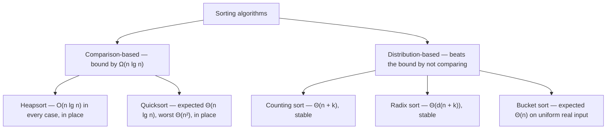
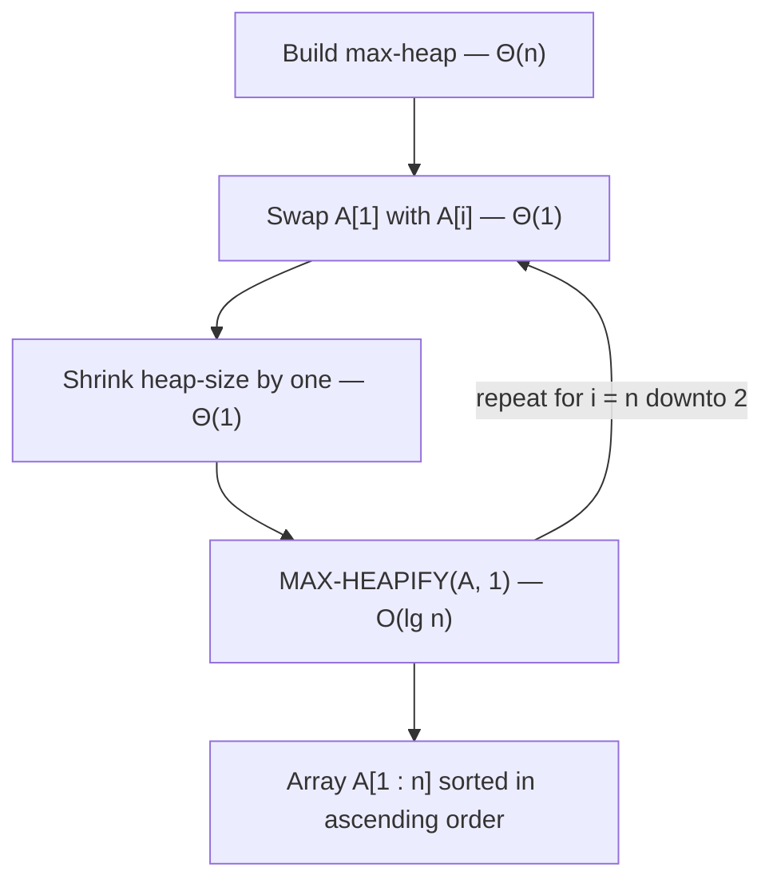
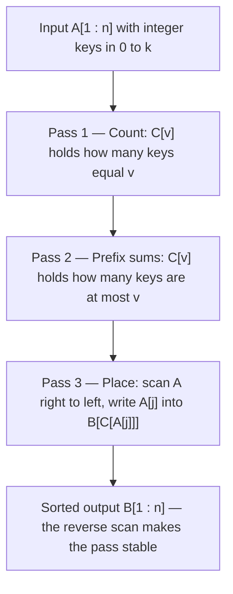

---
tags:
  - CCT3
  - Algoritmer
Topic: Heap Sort, Quick Sort, Counting Sort, Bucket Sort
Semester: CCT3
Course: Algoritmer
Litterature:
  - Introduction to Algorithms 4th ed.
Created: 26-09-2026
---
## Table of Contents

1. [[#4. Various Sorting Algorithms|4. Various Sorting Algorithms]]
	1. [[#4. Various Sorting Algorithms#4.1 Heaps and the Heap Structure|4.1 Heaps and the Heap Structure]]
		1. [[#4.1 Heaps and the Heap Structure#4.1.1 A Nearly Complete Binary Tree Held in an Array|4.1.1 A Nearly Complete Binary Tree Held in an Array]]
		2. [[#4.1 Heaps and the Heap Structure#4.1.2 Navigating the Tree by Index|4.1.2 Navigating the Tree by Index]]
		3. [[#4.1 Heaps and the Heap Structure#4.1.3 The Max-Heap and Min-Heap Properties|4.1.3 The Max-Heap and Min-Heap Properties]]
		4. [[#4.1 Heaps and the Heap Structure#4.1.4 Height, and Why It Sets the Running Times|4.1.4 Height, and Why It Sets the Running Times]]
	2. [[#4. Various Sorting Algorithms#4.2 Maintaining the Heap Property: `MAX-HEAPIFY`|4.2 Maintaining the Heap Property: `MAX-HEAPIFY`]]
		1. [[#4.2 Maintaining the Heap Property: `MAX-HEAPIFY`#4.2.1 The Procedure|4.2.1 The Procedure]]
		2. [[#4.2 Maintaining the Heap Property: `MAX-HEAPIFY`#4.2.2 Running Time|4.2.2 Running Time]]
	3. [[#4. Various Sorting Algorithms#4.3 Building a Heap|4.3 Building a Heap]]
		1. [[#4.3 Building a Heap#4.3.1 Correctness: The Loop Invariant|4.3.1 Correctness: The Loop Invariant]]
		2. [[#4.3 Building a Heap#4.3.2 Running Time: From a Loose Bound to a Tight One|4.3.2 Running Time: From a Loose Bound to a Tight One]]
	4. [[#4. Various Sorting Algorithms#4.4 The Heapsort Algorithm|4.4 The Heapsort Algorithm]]
	5. [[#4. Various Sorting Algorithms#4.5 Description of Quicksort|4.5 Description of Quicksort]]
		1. [[#4.5 Description of Quicksort#4.5.1 Divide, Conquer, Combine|4.5.1 Divide, Conquer, Combine]]
		2. [[#4.5 Description of Quicksort#4.5.2 Partitioning in Place|4.5.2 Partitioning in Place]]
		3. [[#4.5 Description of Quicksort#4.5.3 Correctness: The Partition Loop Invariant|4.5.3 Correctness: The Partition Loop Invariant]]
		4. [[#4.5 Description of Quicksort#4.5.4 Running Time of Partition|4.5.4 Running Time of Partition]]
	6. [[#4. Various Sorting Algorithms#4.6 Performance of Quicksort|4.6 Performance of Quicksort]]
		1. [[#4.6 Performance of Quicksort#4.6.1 Worst-Case Partitioning|4.6.1 Worst-Case Partitioning]]
		2. [[#4.6 Performance of Quicksort#4.6.2 Best-Case and Balanced Partitioning|4.6.2 Best-Case and Balanced Partitioning]]
		3. [[#4.6 Performance of Quicksort#4.6.3 Space and the Runtime Stack|4.6.3 Space and the Runtime Stack]]
		4. [[#4.6 Performance of Quicksort#4.6.4 Why the Average Case Stays Near the Best Case|4.6.4 Why the Average Case Stays Near the Best Case]]
		5. [[#4.6 Performance of Quicksort#4.6.5 The Limit of Comparison Sorting|4.6.5 The Limit of Comparison Sorting]]
	7. [[#4. Various Sorting Algorithms#4.7 Counting Sort|4.7 Counting Sort]]
		1. [[#4.7 Counting Sort#4.7.1 Step-by-Step Operation|4.7.1 Step-by-Step Operation]]
		2. [[#4.7 Counting Sort#4.7.2 Running Time|4.7.2 Running Time]]
		3. [[#4.7 Counting Sort#4.7.3 Stability|4.7.3 Stability]]
	8. [[#4. Various Sorting Algorithms#4.8 Radix Sort|4.8 Radix Sort]]
		1. [[#4.8 Radix Sort#4.8.1 Why the Intermediate Sort Must Be Stable|4.8.1 Why the Intermediate Sort Must Be Stable]]
		2. [[#4.8 Radix Sort#4.8.2 Worked Examples|4.8.2 Worked Examples]]
		3. [[#4.8 Radix Sort#4.8.3 Running Time|4.8.3 Running Time]]
		4. [[#4.8 Radix Sort#4.8.4 Radix Sort versus the Comparison Sorts|4.8.4 Radix Sort versus the Comparison Sorts]]
	9. [[#4. Various Sorting Algorithms#4.9 Bucket Sort|4.9 Bucket Sort]]
		1. [[#4.9 Bucket Sort#4.9.1 Correctness|4.9.1 Correctness]]
		2. [[#4.9 Bucket Sort#4.9.2 Expected Running Time|4.9.2 Expected Running Time]]

# 4. Various Sorting Algorithms

| Symbol / Term | Meaning | Where |
| :--- | :--- | :--- |
| $A[1:n]$ | An array of $n$ elements indexed from $1$; every array in this note is 1-indexed. | 4.1 |
| $A[p:r]$ | The subarray from index $p$ through index $r$, both endpoints included. | 4.5 |
| $A.\text{heap-size}$ | How many array entries currently belong to the heap; entries $\text{heap-size}+1$ through $n$ are ignored by heap operations ($0 \le A.\text{heap-size} \le n$). | 4.1 |
| $\text{PARENT}(i) = \lfloor i/2 \rfloor$ | Index of the parent of node $i$. | 4.1 |
| $\text{LEFT}(i) = 2i$ | Index of the left child of node $i$. | 4.1 |
| $\text{RIGHT}(i) = 2i + 1$ | Index of the right child of node $i$. | 4.1 |
| Height of a node | Number of edges on the longest simple downward path from that node to a leaf; the height of the heap is the height of its root. | 4.1 |
| Max-heap property | $A[\text{PARENT}(i)] \ge A[i]$ for every node $i > 1$, so the largest key sits at the root. | 4.1 |
| Min-heap property | $A[\text{PARENT}(i)] \le A[i]$ for every node $i > 1$, so the smallest key sits at the root. | 4.1 |
| `MAX-HEAPIFY(A, i)` | Restores the max-heap property in the subtree rooted at $i$ by floating $A[i]$ down; costs $O(\lg n)$. | 4.2 |
| $h$ | Height of the node on which `MAX-HEAPIFY` is called; that call costs $O(h)$. | 4.2 |
| `BUILD-MAX-HEAP(A, n)` | Converts an arbitrary array into a max-heap bottom-up in linear time, $\Theta(n)$. | 4.3 |
| `HEAPSORT(A, n)` | Sorts in place by repeatedly moving the root of the heap to the end of the active array; $O(n \lg n)$. | 4.4 |
| `QUICKSORT(A, p, r)` | Sorts $A[p:r]$ in place by partitioning around a pivot and recursing on both sides. | 4.5 |
| `PARTITION(A, p, r)` | Rearranges $A[p:r]$ around the pivot $x = A[r]$ and returns the pivot's final index; $\Theta(n)$ for $n = r - p + 1$. | 4.5 |
| $x$ | The pivot value that `PARTITION` selects, namely $x = A[r]$. | 4.5 |
| $q$ | The index the pivot occupies when partitioning finishes; the low side is $A[p:q-1]$, the high side is $A[q+1:r]$. | 4.5 |
| `COUNTING-SORT(A, n, k)` | Non-comparison sort for integer keys in the range $0$ to $k$; $\Theta(n + k)$. | 4.7 |
| $k$ (counting sort) | Upper bound on the key values, so every key satisfies $0 \le A[j] \le k$. | 4.7 |
| $B[1:n]$, $C[0:k]$ | Counting sort's output array and its counter array, which is later converted into prefix sums. | 4.7 |
| Stability | Equal keys appear in the output in the same relative order as in the input. | 4.7 |
| Satellite data | The payload carried alongside each key, such as a whole record; stability preserves the input order of equal keys' payloads. | 4.7 |
| `RADIX-SORT(A, n, d)` | Sorts $d$-digit keys with $d$ stable passes, least significant digit first; $\Theta(d(n + k))$. | 4.8 |
| $d$ | Number of digits per key; for $b$-bit keys split into $r$-bit chunks, $d = \lceil b/r \rceil$. | 4.8 |
| $b$ | Width of a key in bits in the bit-level version of radix sort. | 4.8 |
| $r$ | Number of bits per digit chunk, with $1 \le r \le b$; the choice $r = \lfloor \lg n \rfloor$ is asymptotically optimal. | 4.8 |
| $k$ (radix sort) | Number of possible values a single digit can take, that is, the radix; $k = 2^r$ for $r$-bit chunks. | 4.8 |
| LSD / MSD | Least significant digit first / most significant digit first. | 4.8 |
| `BUCKET-SORT(A, n)` | Distributes values from $[0, 1)$ into $n$ buckets, insertion-sorts each bucket, and concatenates them; expected $\Theta(n)$ under uniform input. | 4.9 |
| $B[0:n-1]$ | The $n$ bucket lists of bucket sort; bucket $i$ collects the values in $[i/n, (i+1)/n)$. | 4.9 |
| $\lfloor n \cdot A[i] \rfloor$ | The bucket index assigned to the value $A[i]$. | 4.9 |
| $n_i$ | Number of elements that land in bucket $i$; a $\text{Binomial}(n, 1/n)$ random variable. | 4.9 |
| $E[\cdot]$ | Expectation over the random input; for bucket occupancy, $E[n_i] = 1$ and $E[n_i^2] = 2 - 1/n$. | 4.9 |
| $T(n)$ | The worst-case running time on an input of size $n$; each recurrence in this note is solved either by expanding level by level or with the master theorem. | 4.2 |
| $c$ | The constant cost per element in quicksort's recursion tree, so that every level of the tree costs at most $cn$. | 4.6 |
| $\alpha$ | A constant split proportion with $0 < \alpha < 1$; an $\alpha : (1 - \alpha)$ split leaves subproblems of sizes $\alpha n$ and $(1 - \alpha)n$. | 4.6 |
| $\sum$ | Summation over the index written below the sigma; the note uses $\sum_{k=1}^{n} k = n(n+1)/2$ and the heapsort sum $\sum_{i=2}^{n} \lg i$. | 4.4 |
| $\lg$, $\log_b$ | $\lg n$ is the base-2 logarithm $\log_2 n$; $\log_b$ is the logarithm to base $b$. | 4.1 |
| $O$, $\Theta$, $\Omega$ | Asymptotic upper bound, tight bound, and lower bound; "expected" marks an average over randomized inputs. | Throughout |

_Table 4.1: Quick reference for the notation, procedures, and running-time vocabulary used throughout this note._

> [!note] Conventions
> - Arrays are 1-indexed, and the slice notation $A[p:r]$ includes both endpoints.
> - $\lg n$ means $\log_2 n$; every logarithm in this note is base $2$ unless written otherwise.
> - "Heap" means a binary max-heap unless a min-heap is named explicitly. Heap *memory* is an unrelated concept.
> - Running times are worst-case unless marked *expected* or *average*; expected times assume the stated randomized or distributional model.

Sorting is the oldest and best-studied problem in algorithm design, and this note covers five algorithms that attack it from two directions. **Heapsort** and **quicksort** are comparison sorts: they learn about the input only by comparing keys, and they pay for that generality with an $\Omega(n \lg n)$ lower bound. **Counting sort**, **radix sort**, and **bucket sort** refuse to play by that rule — by using key values as array indices, as digit positions, or as coordinates on the real line, they sort without meaningful comparisons and can reach $O(n)$ time under the right assumptions about the keys.

The five algorithms are worth studying together because each one is a different answer to the same question: *what structure makes the next element easy to place?* Heapsort builds a tree-shaped structure that keeps the maximum at the root, so extraction is cheap. Quicksort builds nothing and instead partitions, letting a single scan place the pivot permanently. The linear-time algorithms replace structure with arithmetic: an index computed from the key itself.



_Figure 4.1: The five sorting algorithms of this note, split by whether they compare keys or address memory directly. The two comparison sorts are bound by $\Omega(n \lg n)$, while the three distribution-based sorts trade that bound for assumptions about the keys._

| Algorithm | Idea in one line | Expected / average | Worst case | Extra space | Stable | In place |
| :--- | :--- | :--- | :--- | :--- | :--- | :--- |
| Heapsort | Build a max-heap, then repeatedly swap the root to the end | $\Theta(n \lg n)$ | $\Theta(n \lg n)$ | $\Theta(1)$ | No | Yes |
| Quicksort | Partition around a pivot, then recurse on both sides | $\Theta(n \lg n)$ | $\Theta(n^2)$ | $\Theta(\lg n)$ stack | No | Yes |
| Counting sort | Count keys, prefix-sum the counts, write each element to its computed position | $\Theta(n + k)$ | $\Theta(n + k)$ | $\Theta(n + k)$ | Yes | No |
| Radix sort | Sort $d$ times, one digit per pass, least significant digit first | $\Theta(d(n + k))$ | $\Theta(d(n + k))$ | $\Theta(n + k)$ | Yes | No |
| Bucket sort | Scatter uniform values into $n$ buckets, insertion-sort each, concatenate | $\Theta(n)$ | $\Theta(n^2)$ | $\Theta(n)$ | Yes, when the per-bucket sort is stable | No |

_Table 4.2: The five algorithms side by side — each one's guiding idea, its expected and worst-case running times, its auxiliary memory, and whether it is stable and in place. Bucket sort's worst case arises when every element lands in one bucket._

## 4.1 Heaps and the Heap Structure

Heapsort is the algorithm that combines the two best properties of its competitors: like merge sort it runs in $O(n \lg n)$ time in every case, and like insertion sort it sorts *in place*, needing only a constant amount of memory outside the input array. Its price is a more elaborate data structure. The **heap** is a nearly complete binary tree packed into an array — no pointers, no allocation, just index arithmetic — that keeps the largest element within instant reach of the root at all times. That same data structure, with the order reversed, is the standard implementation of a priority queue.

> [!warning] Terminology: The Heap Data Structure Is Not Heap Memory
> The word "heap" was coined for the heapsort data structure, and only later was it reused for the dynamically allocated, garbage-collected memory pool of languages such as Java and Python. In this note — and in any algorithmic context — a heap is strictly the tree-shaped **data structure**. A "heap overflow" has nothing to do with heapsort.

### 4.1.1 A Nearly Complete Binary Tree Held in an Array

A binary heap is an array object that we *view* as a nearly complete binary tree. Each array entry corresponds to one tree node, and the tree is filled level by level, left to right, so that only the bottom level may be partially empty. This shape is what makes the array representation pointer-free: because every level above the last is full, the position of any node's relatives is a simple function of its index.

Not every entry of the array has to belong to the heap. The attribute $A.\text{heap-size}$ records how many entries are active: only $A[1 : A.\text{heap-size}]$ are heap elements, while any entries beyond that boundary are excluded from heap operations. If $A.\text{heap-size} = 0$ the heap is empty; otherwise the root of the tree is always $A[1]$.

![[Pasted image 20260926150721.png]]

_Figure 4.2: A max-heap seen twice — as a binary tree whose nodes carry the keys, and as the array that stores it. The numbers above the nodes are array indices; lines above and below the array trace the parent–child pairs. The tree has height $3$, and the node at index $4$, holding the value $8$, has height $1$._

### 4.1.2 Navigating the Tree by Index

Because the tree is nearly complete, the parent, left child, and right child of node $i$ are found by integer arithmetic alone:

```text
PARENT(i)
1  return ⌊i / 2⌋

LEFT(i)
1  return 2i

RIGHT(i)
1  return 2i + 1
```

The same three operations are one machine instruction each on most architectures, since they are pure binary shifts: multiplying by $2$ shifts the index one bit to the left, dividing by $2$ with the floor taken shifts it one bit to the right. `LEFT` is therefore a single left shift, `RIGHT` is a left shift followed by an increment, and `PARENT` is a single right shift. High-performance implementations routinely define them as macros or inline functions for exactly this reason.

Every procedure in this section runs along a root-to-leaf path, so their costs are governed by the tree's height. The core procedures are collected below; each one is treated in full in the section named in the last column.

| Procedure | What it does | Running time | Section |
| :--- | :--- | :--- | :--- |
| `MAX-HEAPIFY(A, i)` | Restores the max-heap property in the subtree rooted at $i$ when that subtree is a heap except at $i$ itself | $O(\lg n)$ | 4.2 |
| `BUILD-MAX-HEAP(A, n)` | Turns an arbitrary, unordered array into a max-heap, working bottom-up | $O(n)$, in fact $\Theta(n)$ | 4.3 |
| `HEAPSORT(A, n)` | Sorts an array in place by repeated extraction of the maximum | $O(n \lg n)$ | 4.4 |
| `MAX-HEAP-INSERT(A, x)` | Adds a new key to the heap | $O(\lg n)$ | 4.1.4 |
| `MAX-HEAP-EXTRACT-MAX(A)` | Removes and returns the largest key | $O(\lg n)$ | 4.1.4 |
| `MAX-HEAP-INCREASE-KEY(A, i, key)` | Raises the key at node $i$, restoring the heap property upward | $O(\lg n)$ | 4.1.4 |
| `MAX-HEAP-MAXIMUM(A)` | Reads the largest key; it simply returns $A[1]$, so its cost is constant | $\Theta(1)$ | 4.1.4 |

_Table 4.3: The core heap procedures with their costs. The last four are the priority-queue operations: a max-heap supports insertion, extraction of the maximum, and key increases, each in logarithmic time._

### 4.1.3 The Max-Heap and Min-Heap Properties

> [!info] Definition: Max-Heap and Min-Heap Properties
> **Max-heap property.** For every node $i$ other than the root ($i > 1$):
>
> $$A[\text{PARENT}(i)] \ge A[i]$$
>
> The value of every node is at most the value of its parent, so the largest key of a max-heap sits at the root $A[1]$, and the subtree rooted at any node contains only values no larger than that node's own value.
>
> **Min-heap property.** For every node $i$ other than the root ($i > 1$):
>
> $$A[\text{PARENT}(i)] \le A[i]$$
>
> The value of every node is at least the value of its parent, so the smallest key of a min-heap sits at the root $A[1]$.
>
> **Breakdown:**
> - $A$ : The array that stores the heap.
> - $i$ : The array index of a node in the heap ($1 \le i \le A.\text{heap-size}$).
> - $\text{PARENT}(i)$ : The index $\lfloor i/2 \rfloor$ of node $i$'s parent.
> - $A[\text{PARENT}(i)]$ : The key stored at the parent node.
> - $A[i]$ : The key stored at node $i$.

The two properties are mirror images, and each is matched to its natural application: the max-heap drives heapsort and max-priority queues, while the min-heap drives min-priority queues, the shape used by Dijkstra's algorithm and by event schedulers. Note that the heap property is *local*: it constrains each parent–child pair, not the whole array. A heap is therefore not a sorted array, and only the root is guaranteed to hold the extreme key.

> [!example] Is This Array a Heap?
> Three candidate arrays, judged against the max-heap property (for the first two) and the min-heap property (for the third).
> **(a)** $A = [16, 14, 10, 8, 7, 9, 3, 2, 4, 1]$. Checking every parent–child pair: $16 \ge 14, 10$; $14 \ge 8, 7$; $10 \ge 9, 3$; $8 \ge 2, 4$; $7 \ge 1$. Every pair satisfies the property, so this is a valid max-heap — the same tree drawn in Figure 4.2. It holds $10$ elements, so its height is $\lfloor \lg 10 \rfloor = 3$ ✓.
> **(b)** $A = [16, 14, 10, 8, 7, 9, 3, 2, 4, 11]$. Only the last entry changed. Node $5$ holds $7$, but its left child at index $10$ holds $11 > 7$, so the pair $(\text{PARENT}(10), 10) = (5, 10)$ violates the property. The array is **not** a max-heap ✗ — and note that every other pair is still fine, which is why failures must be checked pair by pair.
> **(c)** $A = [1, 4, 2, 9, 6, 3]$. Checked against the min-heap property: $1 \le 4, 2$; $4 \le 9, 6$; $2 \le 3$. Valid min-heap ✓, with height $\lfloor \lg 6 \rfloor = 2$.

### 4.1.4 Height, and Why It Sets the Running Times

The **height of a node** is the number of edges on the longest simple downward path from that node to a leaf; the **height of the heap** is the height of its root. Because an $n$-element heap is a nearly complete binary tree, its height is exactly

$$\text{height} = \lfloor \lg n \rfloor = \Theta(\lg n),$$

where the floor appears because the bottom level may be only partly filled. Here $n$ is the number of active elements $A.\text{heap-size}$, and $\lg$ is the base-2 logarithm — the depth of a tree halves or doubles with each level, which is precisely what base-2 logarithms measure.

Every procedure in Table 4.3 travels along a path from the root downward or from a node upward, so its cost is proportional to the height of the subtree it touches. That single observation is the source of the $O(\lg n)$ entries in the table, and it will reappear as the $O(\lg i)$ cost inside heapsort's loop.

The four priority-queue operations deserve a word of intuition before the sorting algorithm takes over. `MAX-HEAP-MAXIMUM` is constant time because the maximum is already at the root. `MAX-HEAP-EXTRACT-MAX` swaps the root with the last active leaf, shrinks the heap, and calls `MAX-HEAPIFY` once — one root-to-leaf repair. `MAX-HEAP-INCREASE-KEY` raises a key and then walks *upward*, repeatedly swapping the node with its parent while the parent is smaller, so it too follows a single path. `MAX-HEAP-INSERT` appends a key of value $-\infty$ and immediately calls `MAX-HEAP-INCREASE-KEY`, which is why it inherits the logarithmic bound.

> [!example] Extracting the Maximum from a Ten-Element Heap
> Apply `MAX-HEAP-EXTRACT-MAX` to the max-heap $A = [16, 14, 10, 8, 7, 9, 3, 2, 4, 1]$ with $A.\text{heap-size} = 10$.
> **Step 1 — remember the maximum.** The root holds it: $\max = A[1] = 16$.
> **Step 2 — fill the root.** Move the last active element $A[10] = 1$ into position $1$ and decrement $A.\text{heap-size}$ to $9$, so the extracted maximum keeps the slot it already occupied:
>
> ```text
> active heap: [1, 14, 10, 8, 7, 9, 3, 2, 4]   (slot 10 holds the extracted 16, outside the heap)
> ```
>
> **Step 3 — repair with `MAX-HEAPIFY(A, 1)`.** The value $1$ floats down one root-to-leaf path, swapping with the larger child each time:
>
> ```text
> node 1: children 14 and 10 -> swap with 14   [14, 1, 10, 8, 7, 9, 3, 2, 4]
> node 2: children 8 and 7   -> swap with 8    [14, 8, 10, 1, 7, 9, 3, 2, 4]
> node 4: children 2 and 4   -> swap with 4    [14, 8, 10, 4, 7, 9, 3, 2, 1]
> node 8: leaf -> stop
> ```
>
> **Verification:** the active heap $[14, 8, 10, 4, 7, 9, 3, 2, 1]$ satisfies every parent–child constraint ($14 \ge 8, 10$; $8 \ge 4, 7$; $10 \ge 9, 3$; $4 \ge 2, 1$) ✓, the maximum $16$ no longer belongs to the heap ✓, and the descent used $3$ swaps on a heap of size $9$, within the $O(\lg 9) \approx 3.2$ bound ✓.

## 4.2 Maintaining the Heap Property: `MAX-HEAPIFY`

One operation does almost all the work in every heap algorithm: re-establishing the max-heap property in a subtree that is a heap everywhere except, possibly, at its root. `MAX-HEAPIFY` takes an array $A$ with its attribute $A.\text{heap-size}$ and an index $i$, and assumes that the two subtrees rooted at $\text{LEFT}(i)$ and $\text{RIGHT}(i)$ are already valid max-heaps while $A[i]$ may be smaller than its children. It then lets the value at $A[i]$ *float down* through the subtree, exchanging it with the larger child at each step, until the entire subtree rooted at $i$ obeys the max-heap property.

### 4.2.1 The Procedure

```text
MAX-HEAPIFY(A, i)
1  l = LEFT(i)
2  r = RIGHT(i)
3  if l <= A.heap-size and A[l] > A[i]
4      largest = l
5  else largest = i
6  if r <= A.heap-size and A[r] > A[largest]
7      largest = r
8  if largest != i
9      exchange A[i] with A[largest]
10     MAX-HEAPIFY(A, largest)
```

![[Pasted image 20260926150854.png]]

_Figure 4.3: The action of `MAX-HEAPIFY(A, 2)` on a heap of size $10$. The node that may violate the max-heap property is shaded. (a) The initial configuration, where $A[2]$ violates the property because it is not larger than both of its children. (b) The property is restored for node $2$ by exchanging $A[2]$ with $A[4]$, which in turn breaks it for node $4$; the recursive call `MAX-HEAPIFY(A, 4)` now runs with $i = 4$. (c) After $A[4]$ and $A[9]$ are swapped, node $4$ is fixed up and the recursive call `MAX-HEAPIFY(A, 9)` changes nothing further._

The mechanics of one call are short enough to follow line by line:

1. **Find the largest of three (lines 1–7).** Compare the current node $A[i]$ with its left child $A[\text{LEFT}(i)]$ and its right child $A[\text{RIGHT}(i)]$, keeping the index of the largest in `largest`. The guard `l <= A.heap-size` is what stops the scan at the heap boundary: an index beyond $A.\text{heap-size}$ is not part of the heap, even though the array slot exists.
2. **Test the property (line 8).** If `largest` is still $i$, the node is at least as large as both children, so the subtree rooted at $i$ already satisfies the max-heap property and the procedure stops.
3. **Swap and recurse (lines 9–10).** Otherwise the largest key is in a child, so exchange $A[i]$ with $A[\text{largest}]$. That swap moves the smaller value *down* into the child, which may destroy the heap property in the child's subtree, so `MAX-HEAPIFY` recurses on `largest`.

The recursion is a single descent: each recursive call moves one level down the tree, and the call at a leaf finds no larger child and returns immediately. The descent never visits more than one node per level, which is what keeps the cost proportional to the height rather than the size of the subtree.

### 4.2.2 Running Time

Each level of the descent does constant work — two comparisons and at most one swap — so the cost is the number of levels the value floats down. The interesting question is how many nodes can hide below a child of the current node. If the subtree at $i$ has $n$ nodes, then even in the worst case — reached when the bottom level is exactly half full, so that one child subtree is as large as possible — the subtree passed to the recursive call contains at most $2n/3$ nodes. Hence

$$T(n) \le T(2n/3) + \Theta(1),$$

where $T(n)$ is the worst-case running time on a subtree of $n$ nodes, $T(2n/3)$ is the time spent in the recursive call on the larger child subtree, and $\Theta(1)$ is the constant work of comparing and swapping. Here $n$ counts nodes, and the fraction $2/3$ is the worst split that a nearly complete tree can force.

> [!note] Tool: The Master Theorem
> The master theorem solves divide-and-conquer recurrences of the form $T(n) = aT(n/b) + f(n)$ with $a \ge 1$ and $b > 1$. Compute the watershed $n^{\log_b a}$ — the cost of the leaves of the recursion tree — and compare it with the driving function $f(n)$:
> - **Case 1.** If $f(n)$ is polynomially smaller than the watershed, then $T(n) = \Theta(n^{\log_b a})$.
> - **Case 2.** If $f(n) = \Theta(n^{\log_b a} \lg^{k} n)$ for some $k \ge 0$, then $T(n) = \Theta(n^{\log_b a} \lg^{k+1} n)$.
> - **Case 3.** If $f(n)$ is polynomially larger than the watershed (and satisfies the regularity condition), then $T(n) = \Theta(f(n))$.
> This note uses only Case 2 with $k = 0$, the situation where the driving function matches the watershed exactly and the solution picks up a single factor of $\lg n$.

The master theorem settles this recurrence in one line. With $a = 1$ and $b = 3/2$, the watershed is $n^{\log_b a} = n^{\log_{3/2} 1} = n^0 = 1$, while the driving function is $f(n) = \Theta(1) = \Theta(n^0 \lg^0 n)$. This is Case 2 with $k = 0$ — the driving function matches the watershed, up to a polylogarithm — so

$$T(n) = \Theta(\lg n) = O(\lg n).$$

The same conclusion follows directly from the height: a call on a node of height $h$ descends at most $h$ levels, spending $O(1)$ at each, so its running time is $T(n) = O(h)$; since the height of an $n$-element heap is $\lfloor \lg n \rfloor$, the bound is $O(\lg n)$. The two derivations agree, as they must: the recurrence is the analytic shadow of the descent.

> [!example] Tracing `MAX-HEAPIFY` on a Violating Node
> Take the valid max-heap from Figure 4.2, $A = [16, 14, 10, 8, 7, 9, 3, 2, 4, 1]$, and break it deliberately by calling `MAX-HEAPIFY(A, 2)` on the value $4$, which is smaller than both of its children.
> **Step 1 — node $2$.** Children: $A[4] = 14$ and $A[5] = 7$. The largest of $\{4, 14, 7\}$ is $14$ at index $4$, so exchange $A[2]$ with $A[4]$:
>
> ```text
> before:  [16,  4, 10, 14,  7, 9, 3, 2, 4, 1]
> after :  [16, 14, 10,  4,  7, 9, 3, 2, 4, 1]
>                             ^ the displaced 4 now sits at index 4
> ```
>
> **Step 2 — node $4$.** Children: $A[8] = 2$ and $A[9] = 8$. The largest of $\{4, 2, 8\}$ is $8$ at index $9$, so exchange again:
>
> ```text
> after :  [16, 14, 10,  8,  7, 9, 3, 2,  4, 1]
> ```
>
> **Step 3 — node $9$.** The indices $\text{LEFT}(9) = 18$ and $\text{RIGHT}(9) = 19$ both exceed $A.\text{heap-size} = 10$, so node $9$ is a leaf and the recursion returns.
> **Verification:** the final array $[16, 14, 10, 8, 7, 9, 3, 2, 4, 1]$ satisfies every parent–child constraint ($16 \ge 14, 10$; $14 \ge 8, 7$; $10 \ge 9, 3$; $8 \ge 2, 4$; $7 \ge 1$), and the descent used $2$ levels, within the bound $O(\lg 10) \approx 3.3$ levels ✓.

## 4.3 Building a Heap

`BUILD-MAX-HEAP` turns an arbitrary, unordered array into a max-heap by exploiting a fact about the tree's shape: the entries $A[\lfloor n/2 \rfloor + 1 : n]$ are leaves. A one-element subtree is trivially a heap, so the leaves need no work at all. The procedure therefore walks the *remaining* internal nodes from index $\lfloor n/2 \rfloor$ down to $1$, calling `MAX-HEAPIFY` on each. Processing in reverse index order guarantees that when node $i$ is handled, both of its children have already been processed and are roots of valid max-heaps — exactly the precondition `MAX-HEAPIFY` needs.

```text
BUILD-MAX-HEAP(A, n)
1  A.heap-size = n
2  for i = ⌊n/2⌋ downto 1
3      MAX-HEAPIFY(A, i)
```

![[Pasted image 20260926151029.png]]

_Figure 4.4: The operation of `BUILD-MAX-HEAP` on a $10$-element array, shown just before each call to `MAX-HEAPIFY` in line 3. The node indexed by $i$ in the current iteration is shaded. (a) The input array and the tree it represents, with the loop index at node $5$. (b) The structure that results, with $i$ now at node $4$. (c)–(e) The remaining iterations. Observe that whenever `MAX-HEAPIFY` is called on a node, both of that node's subtrees are already max-heaps. (f) The completed max-heap._

### 4.3.1 Correctness: The Loop Invariant

> [!summary] Theorem 1: Loop Invariant for `BUILD-MAX-HEAP`
> At the start of each iteration of the `for` loop of lines 2–3, each of the nodes $i + 1, i + 2, \dots, n$ is the root of a valid max-heap.
>
> **Breakdown:**
> - $i$ : The loop index; the next node to be heapified.
> - $i + 1, \dots, n$ : The nodes already handled by earlier iterations, all of which are roots of valid max-heaps.
> - $n$ : The number of elements, which is also the initial value of $A.\text{heap-size}$.
>
> **Proof:**
> - **Initialization:** Before the first iteration, $i = \lfloor n/2 \rfloor$, so the nodes $\lfloor n/2 \rfloor + 1, \lfloor n/2 \rfloor + 2, \dots, n$ are precisely the leaves. A leaf has no children, so the max-heap property holds vacuously and each leaf is the root of a one-element max-heap.
> - **Maintenance:** The children of node $i$ are $\text{LEFT}(i) = 2i$ and $\text{RIGHT}(i) = 2i + 1$, and both indices are strictly greater than $i$. By the invariant, both children are already roots of valid max-heaps, which is exactly the precondition of `MAX-HEAPIFY(A, i)`; after that call, node $i$ is also the root of a valid max-heap, and no node with index greater than $i$ was disturbed. Decrementing $i$ restores the invariant for the next iteration.
> - **Termination:** The loop ends with $i = 0$, so the invariant says that every node $1, 2, \dots, n$ is the root of a max-heap. In particular node $1$, the root of the whole tree, is the root of a max-heap — which is to say that the entire array is a max-heap.

### 4.3.2 Running Time: From a Loose Bound to a Tight One

The naive accounting is easy and pessimistic: there are $\lfloor n/2 \rfloor = O(n)$ calls to `MAX-HEAPIFY`, each costing $O(\lg n)$, for an upper bound of $O(n \lg n)$. That bound is correct but far from tight, because it charges the full height to every node. In reality almost all nodes are leaves or near-leaves, and a node of height $h$ costs only $O(h)$. Averaging the true costs over the levels of the tree is what turns the estimate linear.

An $n$-element heap has at most $\lceil n/2^{h+1} \rceil$ nodes of any given height $h$ — the higher the node, the fewer there are, and the count shrinks geometrically. Summing over all heights gives the following result.

> [!summary] Theorem 2: `BUILD-MAX-HEAP` Runs in Linear Time
> The max-heap can be built from an unordered array in $\Theta(n)$ time:
>
> $$\sum_{h=0}^{\lfloor \lg n \rfloor} \left\lceil \frac{n}{2^{h+1}} \right\rceil c h \le c n \sum_{h=0}^{\lfloor \lg n \rfloor} \frac{h}{2^h} < c n \sum_{h=0}^{\infty} \frac{h}{2^h} = c n \cdot 2 = O(n).$$
>
> **Breakdown:**
> - $h$ : Height of a node in the heap tree, from $0$ (a leaf) to $\lfloor \lg n \rfloor$ (the root).
> - $\lceil n/2^{h+1} \rceil \le n/2^h$ : The maximum number of nodes of height $h$, used to replace the ceiling by a simpler expression.
> - $c h$ : The $O(h)$ cost of running `MAX-HEAPIFY` at a node of height $h$.
> - $x = 1/2$ : The ratio of the geometric series, substituted into $\sum_{h=0}^{\infty} h x^h = \frac{x}{(1-x)^2}$.
> - $c n \cdot 2$ : The value of the series at $x = 1/2$, giving a bound linear in $n$.
>
> **Proof:** Sum the work performed at each height. Height $h$ contributes at most $\lceil n/2^{h+1} \rceil \le n/2^h$ nodes, each costing at most $c h$ for a suitable constant $c$, so the total work is bounded by $\sum_{h=0}^{\lfloor \lg n \rfloor} \lceil n/2^{h+1} \rceil c h \le c n \sum_{h=0}^{\lfloor \lg n \rfloor} h/2^h$. Extending the finite sum to an infinite one only increases it, and the infinite series is evaluated with the identity $\sum_{h=0}^{\infty} h x^h = x/(1-x)^2$ at $x = 1/2$: the series equals $\frac{1/2}{(1-1/2)^2} = \frac{1/2}{1/4} = 2$. Hence the total is at most $c n \cdot 2 = O(n)$; since every element must be looked at once, the bound is tight, so `BUILD-MAX-HEAP` runs in $\Theta(n)$ time. $\blacksquare$

The same construction works in the opposite direction. `BUILD-MIN-HEAP` has an identical structure, calling `MIN-HEAPIFY` instead of `MAX-HEAPIFY`, and it builds a min-heap from an unordered array in linear time $\Theta(n)$ as well. The loop invariant, the level-counting argument, and the geometric series carry over unchanged — only the direction of the inequality flips.

> [!example] Building a Max-Heap Step by Step
> Build a heap from $A = [4, 1, 3, 2, 16, 9, 10, 14, 8, 7]$, the input of Figure 4.4. With $n = 10$ the loop starts at $i = \lfloor 10/2 \rfloor = 5$; nodes $6$ through $10$ are leaves and need no work.
>
> ```text
> i = 5: A[5] = 16 vs child 7       -> already larger, unchanged
> i = 4: A[4] = 2  vs children 14, 8   -> swap with index 8
> i = 3: A[3] = 3  vs children  9, 10  -> swap with index 7
> i = 2: A[2] = 1  vs children 14, 16  -> swap with index 5,
>                                        then 1 vs child 7 -> swap with index 10
> i = 1: A[1] = 4  vs children 16, 10  -> swap with index 2,
>                                        then 4 vs children 14, 7 -> swap with index 4,
>                                        then 4 vs children 2, 8  -> swap with index 9
> ```
>
> **Verification:** the final array is $[16, 14, 10, 8, 7, 9, 3, 2, 4, 1]$, and every parent–child pair satisfies $A[\text{PARENT}(i)] \ge A[i]$: $16 \ge 14, 10$; $14 \ge 8, 7$; $10 \ge 9, 3$; $8 \ge 2, 4$; $7 \ge 1$ ✓. The tree of Figure 4.4(f) holds the same heap, so the hand trace agrees with the picture.

## 4.4 The Heapsort Algorithm

Heapsort combines the two procedures of the previous sections into a single in-place sorting routine. The array is first turned into a max-heap, which costs $\Theta(n)$; then the algorithm repeatedly removes the maximum. The trick that keeps it in place is to leave the removed element in the array: the heap shrinks by decrementing $A.\text{heap-size}$, so the slot that the extracted element occupies is simply declared to be outside the heap, and it happens to be exactly the position where that element belongs in the sorted output.

The five steps of the loop body, in order:

1. **Build the initial heap.** Call `BUILD-MAX-HEAP(A, n)` once, turning the input into a valid max-heap in $O(n)$ time.
2. **Extract the maximum.** Since the largest element is at the root $A[1]$, exchange $A[1]$ with $A[n]$; the maximum moves to its final position at the end of the array.
3. **Shrink the active heap.** Decrement $A.\text{heap-size}$, which removes the placed maximum from all further heap operations without discarding it from the array.
4. **Restore the heap property.** The element now at the root may violate the max-heap property, but its two subtrees are still valid max-heaps — the precondition of `MAX-HEAPIFY` — so a single call `MAX-HEAPIFY(A, 1)` repairs the heap over the remaining active subarray $A[1 : n-1]$.
5. **Iterate.** Repeat for the active heap sizes $n, n-1, \dots, 2$. Each iteration places the next largest element into the next position from the right, so the sorted region grows leftward from the end of the array.

```text
HEAPSORT(A, n)
1  BUILD-MAX-HEAP(A, n)
2  for i = n downto 2
3      exchange A[1] with A[i]
4      A.heap-size = A.heap-size - 1
5      MAX-HEAPIFY(A, 1)
```

![[Pasted image 20260926151119.png]]

_Figure 4.5: The operation of `HEAPSORT`. (a) The max-heap built by `BUILD-MAX-HEAP` in line 1. (b)–(j) The heap after each call of `MAX-HEAPIFY` in line 5, labeled with the value of $i$ at that moment. Only the shaded nodes remain in the heap; the unshaded ones hold the largest values in sorted order. (k) The resulting sorted array._



_Figure 4.6: The heapsort loop as a cycle. The one-off construction of the heap is drawn at the top; every pass of the loop then performs two constant-time steps and a single logarithmic repair, which is why the $n-1$ passes dominate the running time._

> [!important] Heapsort's Total Running Time
> `HEAPSORT` runs in $O(n \lg n)$ time in every case:
>
> $$T(n) = O(n) + \sum_{i=2}^{n} O(\lg i) = O(n) + (n - 1) \cdot O(\lg n) = O(n \lg n).$$
>
> **Breakdown:**
> - $O(n)$ : The one-time cost of `BUILD-MAX-HEAP(A, n)` in line 1.
> - $\sum_{i=2}^{n} O(\lg i)$ : The cost of the loop, one term per iteration; at iteration $i$ the active heap holds $i$ elements.
> - $(n - 1) \cdot O(\lg n)$ : Each of the $n - 1$ iterations costs $O(\lg i) \le O(\lg n)$, dominated by the `MAX-HEAPIFY` call in line 5.
>
> Because the swaps and the size decrements happen inside the array and the recursion of `MAX-HEAPIFY` uses no extra storage, heapsort sorts **in place**: its auxiliary memory is $O(1)$.

That combination — an $O(n \lg n)$ worst case with $O(1)$ auxiliary space — is unique among the algorithms in this note, and it is why heapsort survives in real systems as a fallback. Its practical weakness is not asymptotics but memory access: the `MAX-HEAPIFY` descent jumps between parent and child indices, which is far less cache-friendly than the sequential scans of quicksort.

> [!example] Sorting a Small Array with Heapsort
> Sort $A = [4, 1, 3, 2, 16, 9, 10, 14, 8, 7]$, the array already heapified in the example of Section 4.3, which reached the max-heap $[16, 14, 10, 8, 7, 9, 3, 2, 4, 1]$. The vertical bar marks the end of the active heap; everything to its right is already in its final position.
> **The first three iterations in detail.**
>
> ```text
> start          [16, 14, 10, 8, 7, 9, 3, 2, 4, 1]
> i = 10: swap A[1] = 16 with A[10] = 1
>                [1, 14, 10, 8, 7, 9, 3, 2, 4 | 16]
>         MAX-HEAPIFY(A, 1): the 1 floats down, 1 <-> 14 at node 1,
>                            then 1 <-> 8 at node 2, then 1 <-> 4 at node 4
>                [14, 8, 10, 4, 7, 9, 3, 2, 1 | 16]
> i = 9 : swap A[1] = 14 with A[9] = 1
>                [1, 8, 10, 4, 7, 9, 3, 2 | 14, 16]
>         MAX-HEAPIFY(A, 1): 1 <-> 10 at node 1, then 1 <-> 9 at node 3
>                [10, 8, 9, 4, 7, 1, 3, 2 | 14, 16]
> i = 8 : swap A[1] = 10 with A[8] = 2
>                [2, 8, 9, 4, 7, 1, 3 | 10, 14, 16]
>         MAX-HEAPIFY(A, 1): 2 <-> 9 at node 1, then 2 <-> 3 at node 3
>                [9, 8, 3, 4, 7, 1, 2 | 10, 14, 16]
> ```
>
> **Remaining iterations.** The same two moves repeat for the shrinking heap, placing $8, 7, 4, 3, 2, 1$ from right to left. After the iterations through $i = 3$ the array reads $[2, 1, 3, 4, 7, 8, 9, 10, 14, 16]$, and the final iteration, on a heap of size $2$, exchanges the last two entries.
> **Verification:** the output $[1, 2, 3, 4, 7, 8, 9, 10, 14, 16]$ is exactly the sorted order of the input multiset $\{4, 1, 3, 2, 16, 9, 10, 14, 8, 7\}$, reached in exactly $n - 1 = 9$ extractions, one per element ✓.

## 4.5 Description of Quicksort

Quicksort is a comparison-based sorting algorithm built on the divide-and-conquer paradigm, and it is the algorithm most working programmers actually reach for. Its worst-case running time is $\Theta(n^2)$ — worse than heapsort — yet its average behavior is the best in its class: on distinct elements, quicksort sorts in $\Theta(n \lg n)$ time with remarkably small hidden constants, sorts in place without duplicating the input, and touches memory in long sequential runs that suit the cache hierarchy and virtual-memory systems of real machines.

Its performance profile is worth fixing before the details: a worst case of $\Theta(n^2)$ reached when partitions are maximally unbalanced, an expected running time of $\Theta(n \lg n)$ when the input elements are distinct, and $O(1)$ auxiliary storage for the partitioning itself, with $O(\lg n)$ expected stack depth for the recursion. Three components produce that profile. **Partitioning** rearranges a subarray in place around a chosen *pivot*, so that smaller elements end up left of the pivot and larger ones right. **Recursive decomposition** then sorts the two sides independently. **Randomization** — choosing the pivot so that no fixed input ordering can reliably trigger the bad case — is what converts the good average behavior into a guarantee about expected time.

### 4.5.1 Divide, Conquer, Combine

Sorting the subarray $A[p:r]$ proceeds in three steps, one per paradigm phase:

1. **Divide** — partition the subarray into two (possibly empty) pieces around a pivot: every element of the low side $A[p:q-1]$ is at most the pivot $A[q]$, and every element of the high side $A[q+1:r]$ is at least the pivot. The index $q$ of the pivot is decided by the partitioning itself.
2. **Conquer** — sort the two sides independently by recursing on $A[p:q-1]$ and $A[q+1:r]$.
3. **Combine** — nothing to do. Because the sides were already arranged relative to $A[q]$ and sorted in place, the whole subarray $A[p:r]$ is sorted the moment both recursive calls return.

The empty combine step is the structural difference between quicksort and merge sort. Merge sort does its real work on the way *up* the recursion, merging two sorted halves; quicksort does it on the way *down*, in the partition, and then simply trusts the recursion. To sort an entire array the initial call is `QUICKSORT(A, 1, n)`.

```text
QUICKSORT(A, p, r)
1  if p < r
2      // Partition the subarray around the pivot, which ends up in A[q].
3      q = PARTITION(A, p, r)
4      QUICKSORT(A, p, q - 1)  // Recursively sort the low side
5      QUICKSORT(A, q + 1, r)  // Recursively sort the high side
```

### 4.5.2 Partitioning in Place

Everything hinges on `PARTITION`, which rearranges the subarray $A[p:r]$ in place and returns the final index of the pivot. The version used here keeps a single running boundary: the index $i$ marks the end of the low side, and a scan index $j$ walks through the unexamined region. Each element encountered is compared with the pivot, and if it belongs on the low side it is swapped into the slot just after the boundary, growing the low side by one.

```text
PARTITION(A, p, r)
1  x = A[r]             // The pivot
2  i = p - 1            // Highest index of the low side
3  for j = p to r - 1   // Process each element except the pivot
4      if A[j] <= x     // Does this element belong on the low side?
5          i = i + 1    // Increment index of the low side
6          exchange A[i] with A[j]
7  exchange A[i + 1] with A[r]  // Place pivot between the two partitions
8  return i + 1                 // Return the new pivot index
```

![[Pasted image 20260926151509.png]]

_Figure 4.7: The four regions maintained by `PARTITION` on a subarray $A[p:r]$. The values in $A[p:i]$ are all less than or equal to the pivot $x$; the values in $A[i+1:j-1]$ are all greater than $x$; the values in $A[j:r-1]$ have not yet been examined; and $A[r] = x$ itself._

![[Pasted image 20260926151413.png]]

_Figure 4.8: The operation of `PARTITION` on a sample array. The last entry $A[r]$ becomes the pivot $x$: the shaded low-side elements are at most $x$, the high-side elements are greater than $x$, the unshaded elements have not yet been assigned to either side, and the pivot is marked in the last position. (a) The initial array and variable settings, before any element has been placed on a side. (b) State after the first elements have been processed._

![[Pasted image 20260926151522.png]]

_Figure 4.9: The two cases for one iteration of `PARTITION`. (a) If $A[j] > x$, the only action is to increment $j$, which maintains the loop invariant. (b) If $A[j] \le x$, the index $i$ is incremented, $A[i]$ and $A[j]$ are swapped, and then $j$ is incremented — again maintaining the loop invariant._

The four regions are the key to reading the algorithm. At any moment during the loop the subarray is split into a low side $A[p:i]$ whose values are all $\le x$; a high side $A[i+1:j-1]$ whose values are all $> x$; an unexamined region $A[j:r-1]$; and the pivot sitting untouched at $A[r]$. The scan index $j$ sweeps the unexamined region from left to right, so after $n - 1$ comparisons per call every element but the pivot has been assigned to a side. The final two lines then swap the pivot into the gap between the sides — the position it will keep forever.

### 4.5.3 Correctness: The Partition Loop Invariant

> [!summary] Theorem 3: Loop Invariant for `PARTITION`
> At the beginning of each iteration of the `for` loop of lines 3–6, for every array index $k$:
> 1. If $p \le k \le i$, then $A[k] \le x$.
> 2. If $i + 1 \le k \le j - 1$, then $A[k] > x$.
> 3. If $k = r$, then $A[k] = x$.
>
> **Breakdown:**
> - $x$ : The pivot value, set to $A[r]$ in line 1.
> - $i$ : The index of the last element known to be on the low side, starting at $p - 1$.
> - $j$ : The scan index; everything left of $j$ has been classified.
> - $A[p:i]$, $A[i+1:j-1]$ : The low side and the high side respectively.
>
> **Proof:**
> - **Initialization:** Before the first iteration, $i = p - 1$ and $j = p$, so the ranges $A[p:i]$ and $A[i+1:j-1]$ are both empty and conditions 1 and 2 hold vacuously. Line 1 sets $x = A[r]$, which is condition 3.
> - **Maintenance:** Two cases arise. If $A[j] > x$, only $j$ is incremented; the element that leaves the unexamined region is greater than $x$, so it joins the high side and condition 2 still holds, while conditions 1 and 3 are untouched. If $A[j] \le x$, then $i$ is incremented, $A[i]$ and $A[j]$ are swapped, and $j$ is incremented: the element moved into $A[i]$ is $\le x$, extending the low side (condition 1), and the element pushed out of position $j$ into the old $A[i]$ slot is $> x$, keeping condition 2 true. Condition 3 is never affected because the loop never touches index $r$.
> - **Termination:** The loop runs for $r - p$ iterations and stops with $j = r$, so the unexamined region $A[j:r-1]$ is empty. Every element now lies in exactly one of three parts: $A[p:i] \le x$, $A[i+1:r-1] > x$, and $A[r] = x$.

Lines 7–8 finish the job: the pivot $A[r]$ is swapped with $A[i+1]$, so the pivot lands precisely between the low and high sides and the procedure returns $q = i + 1$. Every element to the left of $q$ is at most $A[q]$ and every element to the right is at least $A[q]$, which is exactly the condition the recursive calls rely on. Notice that the invariant also explains why the pivot is moved *last* rather than compared like the others: leaving $A[r]$ out of the scan keeps the loop's two cases mutually exclusive, and the single closing swap then puts the pivot where the two regions meet.

> [!example] Tracing `PARTITION` on a Sample Array
> Partition $A[1:8] = [2, 8, 7, 1, 3, 5, 6, 4]$, so $p = 1$, $r = 8$, and the pivot is $x = A[8] = 4$ with $i = 0$ and $j = 1$.
>
> ```text
> j = 1: A[1] = 2 <= 4  -> i = 1, swap A[1] with itself   [2, 8, 7, 1, 3, 5, 6, 4]
> j = 2: A[2] = 8 >  4  -> j advances only                [2, 8, 7, 1, 3, 5, 6, 4]
> j = 3: A[3] = 7 >  4  -> j advances only                [2, 8, 7, 1, 3, 5, 6, 4]
> j = 4: A[4] = 1 <= 4  -> i = 2, swap A[2] with A[4]     [2, 1, 7, 8, 3, 5, 6, 4]
> j = 5: A[5] = 3 <= 4  -> i = 3, swap A[3] with A[5]     [2, 1, 3, 8, 7, 5, 6, 4]
> j = 6: A[6] = 5 >  4  -> j advances only                [2, 1, 3, 8, 7, 5, 6, 4]
> j = 7: A[7] = 6 >  4  -> j advances only                [2, 1, 3, 8, 7, 5, 6, 4]
> close: swap A[i+1] = A[4] with A[8] = 4                 [2, 1, 3, 4, 7, 5, 6, 8]
> ```
>
> **How to read the columns.** The array on each line is the state *after* that step, so the final line is the outcome of line 7. Seven comparisons were made, one per scan step, matching the $n - 1 = 7$ loop iterations.
> **Verification:** the returned index is $q = i + 1 = 4$, the pivot $4$ sits at $A[4]$, everything before it ($2, 1, 3$) is $\le 4$, and everything after it ($7, 5, 6, 8$) is $\ge 4$ ✓.

### 4.5.4 Running Time of Partition

For a subarray of size $n = r - p + 1$, the accounting is immediate. Lines 1–2 take $\Theta(1)$. The `for` loop runs exactly $n - 1$ times, and each iteration performs a constant number of comparisons and at most one swap, so the loop costs $\Theta(n)$. Lines 7–8 take $\Theta(1)$. Adding the pieces gives

$$T(n) = \Theta(n)$$

for the running time of `PARTITION` on a subarray of size $n$. This linear cost is the recurring payment in every level of quicksort's recursion, and it is why the total running time is governed entirely by how deep that recursion goes.

## 4.6 Performance of Quicksort

Quicksort's running time is decided by the balance of its partitions, and the pivot alone determines the balance. If the subarray is cut into roughly equal halves, the recursion behaves like merge sort and runs in $\Theta(n \lg n)$. If it is cut into a piece of size $n-1$ and an empty piece, the recursion degrades into a chain and runs in $\Theta(n^2)$. The remarkable fact, proved at the end of this section, is that anything in between — any split that keeps a *constant* proportion on each side — still runs in $O(n \lg n)$. Only splits that get worse as $n$ shrinks are genuinely dangerous.

| Partition pattern | Split at each level | Recurrence | Solution |
| :--- | :--- | :--- | :--- |
| Best: perfectly balanced | $\lfloor (n-1)/2 \rfloor$ and $\lceil (n-1)/2 \rceil$ | $T(n) = 2T(n/2) + \Theta(n)$ | $\Theta(n \lg n)$ |
| Worst: maximally unbalanced | $n - 1$ and $0$ | $T(n) = T(n-1) + \Theta(n)$ | $\Theta(n^2)$ |
| Typical: constant proportion, e.g. $9$-to-$1$ | $9n/10$ and $n/10$ | $T(n) = T(9n/10) + T(n/10) + \Theta(n)$ | $O(n \lg n)$ |

_Table 4.4: Quicksort's three characteristic partition patterns and the running time each one produces. The balanced and constant-proportion rows differ only in the constant hidden by the asymptotics, which is why the average case tracks the best case so closely._

### 4.6.1 Worst-Case Partitioning

The worst case occurs when `PARTITION` produces subproblems of size $n - 1$ and $0$ at every level, so that each recursive call removes only the pivot. Since the empty subproblem costs $\Theta(1) = T(0)$, the recurrence is

$$T(n) = T(n-1) + T(0) + \Theta(n) = T(n-1) + \Theta(n),$$

where $T(n-1)$ is the cost of sorting the one large side, $T(0) = \Theta(1)$ is the base-case cost of the empty side, and $\Theta(n)$ is the partitioning cost of the current level. Expanding the recurrence — each level reduces the size by exactly one and pays for one partition — produces an arithmetic series:

$$T(n) = \sum_{k=1}^{n} \Theta(k) = \Theta\left(\sum_{k=1}^{n} k\right) = \Theta\left(\frac{n(n+1)}{2}\right) = \Theta(n^2).$$

The series uses $\sum_{k=1}^{n} k = n(n+1)/2$, the sum of the first $n$ integers, so the total work grows quadratically in $n$, matching the worst-case behavior of insertion sort.

This worst case is not exotic; it is the *default* behavior of the naive implementation. With the last element always chosen as the pivot, an already sorted input puts every element on the low side of the pivot, and a reverse-sorted input does the mirror image on the high side. Both cases produce the $n-1$ versus $0$ split at every level. This is also why randomization matters: with a randomly chosen pivot, a sorted input is no more dangerous than any other arrangement.

### 4.6.2 Best-Case and Balanced Partitioning

In the most evenly balanced scenario, `PARTITION` divides the $n - 1$ non-pivot elements as evenly as possible, into subproblems of size $\lfloor (n-1)/2 \rfloor$ and $\lceil (n-1)/2 \rceil$. Both sides then have size at most $n/2$, and the recurrence becomes

$$T(n) = 2T(n/2) + \Theta(n),$$

where $2T(n/2)$ counts the two recursive sorts and $\Theta(n)$ is the linear partitioning cost of this level. The master theorem applies directly: $a = 2$ and $b = 2$ give the watershed $n^{\log_2 2} = n^1$, and the driving function $f(n) = \Theta(n) = \Theta(n^1 \lg^0 n)$ matches it. This is Case 2 with $k = 0$, so

$$T(n) = \Theta(n \lg n).$$

> [!warning] Correction: The Best-Case Subproblem Sizes
> The source writes the two best-case subproblems as having sizes $\lfloor (n-1)/2 \rfloor$ and $\lceil (n-1)/2 \rceil - 1$. Removing the pivot from an $n$-element subarray leaves $n - 1$ elements, and the two sides must account for all of them, so the sizes are $\lfloor (n-1)/2 \rfloor$ and $\lceil (n-1)/2 \rceil$. For $n = 8$ that is $3$ and $4$ elements, and $3 + 4 = 7 = n - 1$; the source's formula would give $3$ and $3$, accounting for only $6$ elements. The conclusion is unaffected: both sides have size at most $n/2$, so the recurrence $T(n) = 2T(n/2) + \Theta(n)$ and its $\Theta(n \lg n)$ solution stand as written.

The balanced case is not fragile, which is the most important practical fact about quicksort. Suppose the partition is consistently lopsided, splitting the array into a piece of size $9n/10$ and a piece of size $n/10$ — a ratio that looks catastrophic next to an even split.

> [!example] Analysis of a $9$-to-$1$ Proportional Split
> Assume `PARTITION` always produces a $9$-to-$1$ ratio, so the recurrence is
>
> $$T(n) = T(9n/10) + T(n/10) + \Theta(n).$$
>
> **Cost per level.** Depth $0$ costs $cn$. Depth $1$ costs $c(n/10) + c(9n/10) = cn$, and the same holds at every level, because the two parts always sum back to the parent's size: $1/10 + 9/10 = 1$. Levels that are not completely filled cost strictly less than $cn$.
> **Shortest path.** Follow the $n/10$ branch: $n \to n/10 \to n/100 \to \cdots$, bottoming out after $\log_{10} n$ levels.
> **Longest path.** Follow the $9n/10$ branch: $n \to 9n/10 \to 81n/100 \to \cdots$, bottoming out after $\log_{10/9} n$ levels.
> **Total cost.** Both depths are $\Theta(\lg n)$, since they differ from $\lg n$ only by constant factors, so
>
> $$T(n) \le (\text{cost per level}) \times (\text{maximum depth}) = O(n) \times O(\lg n) = O(n \lg n).$$
>
> **Verification:** $1/10 + 9/10 = 1$ is what keeps each level's cost at $cn$ rather than letting it decay ✓; and the two depths are constant multiples of each other — for $n = 1024$, the shortest path has depth $\log_{10} 1024 \approx 3.01$ while the longest has depth $\log_{10/9} 1024 \approx 65.79$, and their ratio is $65.79 / 10 = 6.58$, exactly the constant $1/\log_2(10/9) \approx 6.58$ ✓.

![[Pasted image 20260926151728.png]]

_Figure 4.10: A recursion tree for quicksort in which `PARTITION` always produces a $9$-to-$1$ split. The nodes show subproblem sizes and the per-level costs are listed on the right; every level costs at most $cn$, and the tree is only $\Theta(\lg n)$ deep, giving $O(n \lg n)$ overall._

The $9$-to-$1$ example generalizes. Any split of constant proportion $\alpha : (1 - \alpha)$ with $0 < \alpha < 1$, no matter how extreme — even $99$-to-$1$ — produces a recursion tree of depth $\Theta(\lg n)$ in which every level costs at most $cn$. The ratio affects only the constant factor hidden inside the asymptotic notation, since $\log_{1/(1-\alpha)} n$ is always a fixed multiple of $\lg n$. What quicksort cannot survive is a split ratio that *worsens* with every level, because then the depth itself stops being logarithmic.

### 4.6.3 Space and the Runtime Stack

Quicksort sorts in place in the array, but it is not free of extra memory: every recursive call needs a stack frame to remember $p$, $r$, and the pending return point.

- Each recursive call consumes $O(1)$ space on the stack.
- The total auxiliary space is therefore proportional to the *maximum recursion depth*, not to $n$.
- In the balanced case that depth is bounded by $O(\lg n)$ frames, because the size at least halves on each level.
- In the worst case — the chain of $n - 1$ versus $0$ splits — the depth reaches $\Theta(n)$ frames, which is the real danger of the worst case on machines with small stacks.

This is the sense in which quicksort is "in place": the *data* movement happens inside $A$, and the extra space scales with depth rather than with the input size. It is the opposite trade from merge sort, which needs a full auxiliary array of size $\Theta(n)$ but never recurses deeper than $\lg n$ levels.

### 4.6.4 Why the Average Case Stays Near the Best Case

Real inputs do not partition identically at every level; they produce a mixture of balanced and unbalanced splits scattered through the recursion tree. The average behavior is close to the best case because unbalanced splits are *absorbed*: wherever a bad split occurs, the next good split effectively finishes the work the bad one left over, and the combination costs no more than a single good split would have.

> [!abstract] Why One Bad Split Is Harmless
> Suppose a "bad" split — the worst-case $n-1$ versus $0$ — is always followed immediately by a "good" split — a balanced one.
> 1. **Level 0 (bad).** Partitioning the array of size $n$ costs $\Theta(n)$ and produces subproblems of sizes $n - 1$ and $0$.
> 2. **Level 1 (good).** The subproblem of size $n - 1$ is partitioned into two pieces of size at most $(n-1)/2$, at an additional cost of $\Theta(n-1)$.
>
> The two-step sequence therefore produces subproblems of size $0$ and at most $(n-1)/2$ each, for a combined partitioning cost of
>
> $$\Theta(n) + \Theta(n-1) = \Theta(n).$$
>
> That is asymptotically the same as one balanced partition of the whole array: the bad split's overhead has vanished into the good split's budget, and the remaining subproblems are no larger than those of a well-balanced tree.

![[Pasted image 20260926151742.png]]

_Figure 4.11: (a) Two levels of a quicksort recursion tree: the root partition costs $n$ and produces a bad split into subarrays of sizes $0$ and $n - 1$; partitioning the size-$(n-1)$ subarray costs $n - 1$ and produces a good split into pieces of size $(n-1)/2 - 1$ and $(n-1)/2$. (b) A single, well-balanced level of a recursion tree. In both parts the shaded subproblems require $\Theta(n)$ work, yet the subproblems still to be solved in (a) are no larger than the corresponding ones in (b)._

The consequence is that occasional bad splits cannot push the tree deeper than $O(\lg n)$ on average, so the expected running time of quicksort on random permutations of distinct elements is $O(n \lg n)$. Randomization turns that expectation into a usable guarantee: choosing the pivot at random — for instance by exchanging $A[r]$ with a uniformly random element of $A[p:r]$ before partitioning — makes every input permutation equally likely regardless of the input's original order. No fixed input can then force the $\Theta(n^2)$ behavior, and the expected $O(n \lg n)$ bound holds for *every* input, adversarial or not.

### 4.6.5 The Limit of Comparison Sorting

Heapsort and quicksort are comparison sorts: their only access to the input is through pairwise key comparisons. That generality has an absolute price, proved by a counting argument over all possible inputs.

> [!summary] Theorem 4: The Comparison-Sort Lower Bound
> Any comparison sorting algorithm requires $\Omega(n \lg n)$ comparisons in the worst case.
>
> **Breakdown:**
> - **Decision tree** : The binary tree that records one algorithm's behavior: each internal node is one comparison, and each leaf is one possible output permutation.
> - $n!$ : The number of permutations of $n$ distinct elements; every permutation is the correct output for some input order, so each one needs its own leaf.
> - $2^h$ : The maximum number of leaves of a binary tree of height $h$, where $h$ counts the comparisons on the longest root-to-leaf path.
>
> **Proof:** Fix a deterministic comparison sort and run it on inputs of $n$ distinct keys. The sequence of comparisons it performs depends only on the outcomes of earlier comparisons, so every execution traces a path from the root to some leaf of the algorithm's decision tree. Every one of the $n!$ permutations must appear as a leaf, because each is the correct answer for some input order, so the tree has at least $n!$ leaves. A binary tree of height $h$ has at most $2^h$ leaves, giving
>
> $$2^h \ge n! \qquad\Longrightarrow\qquad h \ge \lg(n!).$$
>
> Keeping only the largest $n/2$ factors of $n!$ bounds the factorial from below:
>
> $$\lg(n!) \ge \lg\left((n/2)^{n/2}\right) = \frac{n}{2}\lg\frac{n}{2} = \Omega(n \lg n).$$
>
> The height $h$ is exactly the worst-case number of comparisons, so no comparison sort can beat $\Omega(n \lg n)$. $\blacksquare$

Heapsort's $O(n \lg n)$ worst case is therefore asymptotically optimal among comparison sorts, and quicksort's expected running time matches the bound as well. The next three sections get around the wall rather than breaking through it: counting, radix, and bucket sort never base a decision on a key comparison, so the decision-tree argument does not apply to them.

## 4.7 Counting Sort

Counting sort abandons comparison altogether. It assumes that each of the $n$ input elements is an integer in the range $0$ to $k$ for some integer $k$, and it uses the *values themselves* as array indices: one pass counts how often each key occurs, a second pass turns those counts into the exact output position of every key, and a third pass drops each element straight into its final slot. Because no two elements are ever compared, the algorithm is not subject to the $\Omega(n \lg n)$ lower bound that constrains every comparison sort (Theorem 4) — it buys its speed by assuming something about the keys that comparisons never needed to know.

The procedure takes the input array $A[1:n]$, the element count $n$, and the range bound $k$. It writes the sorted result into a new array $B[1:n]$ and uses an auxiliary array $C[0:k]$ as working storage.

```text
COUNTING-SORT(A, n, k)
1  let B[1:n] and C[0:k] be new arrays
2  for i = 0 to k
3      C[i] = 0
4  for j = 1 to n
5      C[A[j]] = C[A[j]] + 1
6  // C[i] now contains the number of elements equal to i.
7  for i = 1 to k
8      C[i] = C[i] + C[i - 1]
9  // C[i] now contains the number of elements less than or equal to i.
10 // Copy A to B, starting from the end of A.
11 for j = n downto 1
12     B[C[A[j]]] = A[j]
13     C[A[j]] = C[A[j]] - 1  // Handle duplicate values
14 return B
```



_Figure 4.12: Counting sort as a pipeline of three passes. Every key value is used directly as an index into the counter array $C$; the prefix sums turn the counts into final output positions, and the reverse placement pass writes each element straight into its slot without ever comparing two keys._

![[Pasted image 20260926151951.png]]

_Figure 4.13: The operation of `COUNTING-SORT` on an input array $A[1:8]$ whose entries are nonnegative integers no larger than $k = 5$. (a) The array $A$ and the auxiliary array $C$ after line 5. (b) The array $C$ after line 8, now holding prefix sums. (c)–(e) The output array $B$ and the array $C$ after one, two, and three iterations of the loop of lines 11–13. Only the shaded entries of $B$ have been filled in. (f) The final sorted output array $B$._

### 4.7.1 Step-by-Step Operation

1. **Initialize the counters (lines 2–3).** Set every entry of $C[0:k]$ to zero, which costs $\Theta(k)$.
2. **Count frequencies (lines 4–5).** Walk through $A$ once; for each element $A[j]$, increment $C[A[j]]$. After this pass $C[i]$ holds the exact number of input elements equal to $i$, and the pass costs $\Theta(n)$.
3. **Compute prefix sums (lines 7–8).** Accumulate $C$ from left to right, so that afterwards each $C[i]$ holds the number of input elements *less than or equal to* $i$ — in other words, the last output position that key $i$ can occupy. This costs $\Theta(k)$.
4. **Place the elements (lines 11–13).** Walk through $A$ in reverse. The value $C[A[j]]$ is the correct final index of $A[j]$ in $B$, so store $A[j]$ at $B[C[A[j]]]$ and then decrement $C[A[j]]$. Decrementing is what handles duplicates: if another element with the same key appears earlier in $A$, it will be placed in the position immediately before the one just used.

The reverse traversal in step 4 is not an accident — it is what makes the algorithm stable, as the next subsection shows. The whole procedure makes a constant number of passes over the input, which is the origin of its linear running time.

> [!example] Tracing `COUNTING-SORT` on a Duplicate-Rich Array
> Sort $A[1:8] = [2, 5, 3, 0, 2, 3, 0, 3]$ with $n = 8$ and $k = 5$. The array deliberately contains duplicate keys.
> **After counting (lines 4–5):** $C = [2, 0, 2, 3, 0, 1]$, because the input holds two $0$s, no $1$s, two $2$s, three $3$s, no $4$s, and one $5$.
> **After prefix sums (lines 7–8):** $C = [2, 2, 4, 7, 7, 8]$, so the last $3$, for example, belongs at output position $7$ and the sole $5$ at position $8$.
> **The reverse placement pass (lines 11–13):**
>
> ```text
> j = 8: A[8] = 3, C[3] = 7 -> B[7] = 3, C[3] = 6
> j = 7: A[7] = 0, C[0] = 2 -> B[2] = 0, C[0] = 1
> j = 6: A[6] = 3, C[3] = 6 -> B[6] = 3, C[3] = 5
> j = 5: A[5] = 2, C[2] = 4 -> B[4] = 2, C[2] = 3
> j = 4: A[4] = 0, C[0] = 1 -> B[1] = 0, C[0] = 0
> j = 3: A[3] = 3, C[3] = 5 -> B[5] = 3, C[3] = 4
> j = 2: A[2] = 5, C[5] = 8 -> B[8] = 5, C[5] = 7
> j = 1: A[1] = 2, C[2] = 3 -> B[3] = 2, C[2] = 2
> ```
>
> **Verification:** the counters end at $C = [0, 0, 2, 4, 7, 7]$, exactly the pre-counting counts minus the number of elements placed; the output is $B[1:8] = [0, 0, 2, 2, 3, 3, 3, 5]$, which is the input in sorted order ✓. Stability also holds: the $0$ at index $4$ of $A$ is written to $B[1]$ and the $0$ at index $7$ to $B[2]$, so their input order survives ✓.

### 4.7.2 Running Time

The four steps cost $\Theta(k) + \Theta(n) + \Theta(k) + \Theta(n)$ respectively, so the total running time of `COUNTING-SORT` is

$$T(n) = \Theta(n + k),$$

where $n$ is the number of elements, $k$ is the upper bound on the key values (so every key lies in $0 \le A[j] \le k$), and the two contributions come from the passes over the input ($\Theta(n)$) and the passes over the counter array ($\Theta(k)$).

The bound is linear in the *input size plus the key range*, not in the input size alone, and that distinction decides when counting sort is worth using. When the range of keys is linearly proportional to the number of elements — that is, when $k = O(n)$ — the running time collapses to $\Theta(n)$, making counting sort asymptotically faster than any comparison sort. When $k$ is enormous compared with $n$ (sorting a handful of 32-bit integers, say), the algorithm spends almost all of its time zeroing counters it never uses, and a comparison sort is the better choice.

### 4.7.3 Stability

> [!info] Definition: Stable Sorting
> A sorting algorithm is **stable** if elements with equal keys appear in the output in the same relative order as they appeared in the input.
>
> **Breakdown:**
> - **Key** : The value the sort orders by, such as the count in counting sort or the digit in radix sort.
> - **Satellite data** : The payload carried alongside each key, such as the rest of a record. A stable sort keeps the payloads of equal keys in their original sequence.
> - **Relative order** : Which of two equal-keyed elements came first in the input; stability means the same one comes first in the output.

> [!example] Stable versus Unstable in One Line
> Sort the two records $(3, 	ext{A})$ and $(3, 	ext{B})$ by key alone. Both carry the key $3$, so no comparison ever distinguishes them: a stable sort returns $(3, 	ext{A})$ before $(3, 	ext{B})$, exactly as they arrived, while an unstable sort may return them in either order. Both answers are correctly *sorted* — only the order of the payloads reveals which algorithm ran ✓.

> [!example] Why Heapsort Is Not Stable
> Table 4.2 lists heapsort as not stable, and the smallest possible counterexample uses just two records, $(3, \text{A})$ and $(3, \text{B})$.
> **Build.** `BUILD-MAX-HEAP` calls `MAX-HEAPIFY(A, 1)`; the child test compares keys only, asking whether $A[\text{LEFT}(1)] > A[1]$, that is, whether $(3, \text{B}) > (3, \text{A})$. The keys are equal, the strict test fails, and nothing moves — the heap is exactly the input.
> **Sort.** The single loop iteration of `HEAPSORT` swaps the root with the last active element, exchanging $A[1] = (3, \text{A})$ with $A[2] = (3, \text{B})$.
> **Verification:** the output is $(3, \text{B}), (3, \text{A})$ — sorted by key, but with the input order of the equal keys reversed, exactly what stability forbids ✓. The root-to-end swap moves records without ever asking whether their keys are equal, so heapsort can reorder equal keys.

Counting sort is stable, and the reason is precisely the reverse traversal of lines 11–13. The *rightmost* occurrence of a duplicated key in $A$ is processed first, and it is placed at index $C[A[j]]$ — the highest position still available for that key. Decrementing $C[A[j]]$ then moves the target one slot to the left, so the next duplicate, which sits earlier in the input, lands immediately before it. Duplicate keys are therefore written into the output from right to left, preserving their original left-to-right order.

Stability sounds like a technicality, but it is what gives counting sort its second career: it is the natural stable subroutine inside radix sort, where each pass must preserve the ordering established by earlier passes (Section 4.8). It also matters whenever the keys are separated from payload data — sorting a list of transactions by date should not scramble the transactions that share a date.

## 4.8 Radix Sort

Radix sort is the oldest algorithm in this note and the only one born outside computing: it descends from the mechanical card sorters of the early twentieth century, which could be programmed to inspect one column of a punched card at a time and drop each card into one of twelve bins. Repeat that column-by-column distribution enough times, gathering the cards in order after each pass, and the deck ends up sorted.

For keys with $d$ digits there are two ways to proceed, and only one of them scales cleanly:

- **Most significant digit (MSD) first.** Sorting on the leftmost digit first forces the data into separate piles that must then be sorted recursively and kept apart from one another. The bookkeeping of all those intermediate piles is the algorithm's whole cost.
- **Least significant digit (LSD) first.** Sorting on the rightmost digit first lets the whole dataset be gathered back into a single array after every pass. Repeat for digits $1$ through $d$ and the array is fully sorted after exactly $d$ passes, with no pile-tracking at all.

`RADIX-SORT` takes the LSD approach. It assumes every element of $A[1:n]$ has $d$ digits, where digit $1$ is the least significant and digit $d$ the most significant.

```text
RADIX-SORT(A, n, d)
1  for i = 1 to d
2      use a stable sort to sort array A[1:n] on digit i
```

![[Pasted image 20260926152056.png]]

_Figure 4.14: The operation of radix sort on seven $3$-digit numbers. The leftmost column is the input, and each remaining column shows the array after one more pass over an increasingly significant digit position. The shading marks the digit position that produced each list from the previous one._

### 4.8.1 Why the Intermediate Sort Must Be Stable

> [!important] The Necessity of Stability
> The intermediate sort used on each digit pass **must be stable**. When digit $i$ is sorted, stability preserves the relative order established by the passes on digits $1, 2, \dots, i - 1$. If two elements share the same digit $i$, stability guarantees that the element with the smaller value in its lower-order digits stays first.

The requirement is easy to see at the moment the algorithm would break: two keys that differ only in their least significant digit are placed in the correct relative order by pass $1$, and every later pass must leave that order alone. A stable sort does, because it only reorders elements whose current digit differs. Counting sort serves as the per-digit subroutine in practice, since a single digit has a small, fixed value range — ten values for decimal digits, or $2^r$ for an $r$-bit chunk.

Two implementation choices matter in practice. First, counting sort is the usual subroutine, because a single digit spans a small fixed range. Second, the auxiliary output array should be allocated once and reused: rather than allocating and freeing working storage on each of the $d$ passes, the algorithm alternates the roles of the input and output arrays from pass to pass, so element copying stays sequential and allocation-free.

### 4.8.2 Worked Examples

> [!example] Three Passes of Radix Sort
> Sort the seven $3$-digit numbers $[329, 457, 657, 839, 436, 720, 355]$, sorting on the units digit, then the tens, then the hundreds. Each pass uses a stable sort.
>
> ```text
> input                    [329, 457, 657, 839, 436, 720, 355]
> after digit 1 (units)    [720, 355, 436, 457, 657, 329, 839]
> after digit 2 (tens)     [720, 329, 436, 839, 355, 457, 657]
> after digit 3 (hundreds) [329, 355, 436, 457, 657, 720, 839]
> ```
>
> **Reading the trace.** In the first pass, $720$ ends with $0$ and therefore leads; $355$ ends with $5$; $457$ and $657$ both end in $7$ and stay in their input order, which is exactly where stability does its work. The second pass groups by tens digit and the third by hundreds digit.
> **Verification:** the final list is sorted — $329 < 355 < 436 < 457 < 657 < 720 < 839$ — and the three passes performed exactly $d = 3$ stable sorts on the digits, as the loop prescribes ✓.

> [!example] Sorting Records by Multiple Keys: Dates
> Sort calendar dates defined by three keys: **Year**, **Month**, and **Day**.
> - **Approach 1 — composite comparison:** compare years first; break ties by comparing months; break any remaining ties by comparing days.
> - **Approach 2 — radix sort with three stable passes:** run three stable sorts from the least to the most significant field:
>   1. **Pass 1:** sort all dates stably by **Day**.
>   2. **Pass 2:** sort all dates stably by **Month**.
>   3. **Pass 3:** sort all dates stably by **Year**.
> The two approaches agree. Sorting stably on Month only reorders dates that differ in the month, so any pair already distinguished by Day keeps its order; the final Year pass then orders the year groups while stability preserves month and day within each year.
> **Verification on four dates.** Starting from $(2024\text{-}03\text{-}05),\ (2023\text{-}03\text{-}08),\ (2024\text{-}01\text{-}05),\ (2023\text{-}11\text{-}02)$, the Day pass (stable) gives $(2023\text{-}11\text{-}02),\ (2024\text{-}03\text{-}05),\ (2024\text{-}01\text{-}05),\ (2023\text{-}03\text{-}08)$ — the days run $2, 5, 5, 8$ ✓; the Month pass gives $(2024\text{-}01\text{-}05),\ (2024\text{-}03\text{-}05),\ (2023\text{-}03\text{-}08),\ (2023\text{-}11\text{-}02)$ — months $1, 3, 3, 11$ ✓; the Year pass gives $(2023\text{-}03\text{-}08),\ (2023\text{-}11\text{-}02),\ (2024\text{-}01\text{-}05),\ (2024\text{-}03\text{-}05)$, which is the correctly sorted day, month, year order ✓.

### 4.8.3 Running Time

> [!summary] Theorem 5: Running Time of Radix Sort
> Given $n$ $d$-digit numbers in which each digit can take on up to $k$ possible values, `RADIX-SORT` correctly sorts the numbers in $\Theta(d(n + k))$ time when the intermediate stable sort runs in $\Theta(n + k)$ time.
>
> **Breakdown:**
> - $n$ : The number of keys to sort.
> - $d$ : The number of digits per key, and therefore the number of passes.
> - $k$ : The number of values a single digit can take, that is, the radix.
> - $\Theta(n + k)$ : The cost of one pass of counting sort.
> - $\Theta(d(n + k))$ : The cost of $d$ such passes.
>
> **Proof:** Correctness follows by induction on the digit index: the list is in correct order on digits $1, \dots, i$ after pass $i$, because the stable sort on digit $i + 1$ only reorders elements that differ in that digit, and $i = d$ gives the full key. For the running time, each digit lies in the range $0$ to $k - 1$, so counting sort on one digit costs $\Theta(n + k)$; performing $d$ sequential passes gives
>
> $$T(n) = d \cdot \Theta(n + k) = \Theta(d(n + k)).$$
>
> When $d$ is a constant and the digit values satisfy $k = O(n)$, the bound is $\Theta(n)$ — linear time in the number of elements. $\blacksquare$

On real machines keys are fixed-width binary words, and radix sort then works on chunks of bits rather than decimal digits. Choosing the chunk size is a genuine optimization problem: more bits per pass means fewer passes but a larger key range per pass.

> [!summary] Theorem 6: Radix Sort on Binary Words
> Given $n$ $b$-bit numbers and any positive integer $r \le b$, `RADIX-SORT` correctly sorts these numbers in $\Theta\left(\frac{b}{r}(n + 2^r)\right)$ time when the intermediate stable sort runs in $\Theta(n + k)$ time for keys in the range $0$ to $k$.
>
> **Breakdown:**
> - $b$ : The total number of bits in each key.
> - $r$ : The number of bits in each digit chunk, $r \le b$.
> - $d = \lceil b/r \rceil$ : The number of passes, one per chunk.
> - $2^r$ : The number of distinct values an $r$-bit chunk can take.
> - $\Theta\left(\frac{b}{r}(n + 2^r)\right)$ : The composite running time.
>
> **Proof:** Split every $b$-bit key into $d = \lceil b/r \rceil$ digits of $r$ bits each. Each $r$-bit digit is an integer in the range $0$ to $2^r - 1$, so a counting-sort pass over one digit has $k = 2^r - 1$ and costs $\Theta(n + 2^r)$. Multiplying by the number of passes and using $\lceil b/r \rceil = \Theta(b/r)$ gives
>
> $$T(n) = \Theta\left(\left\lceil \frac{b}{r} \right\rceil (n + 2^r)\right) = \Theta\left(\frac{b}{r}(n + 2^r)\right).$$
> $\blacksquare$

To minimize $\Theta\left(\frac{b}{r}(n + 2^r)\right)$ for given $n$ and $b$, note the two opposing effects: decreasing $r$ shrinks the digit range $2^r$ but increases the pass count $b/r$, while increasing $r$ reduces the number of passes but grows the digit range exponentially. The optimum depends on how $b$ compares with $\lfloor \lg n \rfloor$.

| Situation | Choice of $r$ | Passes $d$ | Resulting time |
| :--- | :--- | :--- | :--- |
| Short keys, $b < \lfloor \lg n \rfloor$ | $r = b$ | $1$ | $\Theta(n)$, since $2^b \le n$ makes $n + 2^b = \Theta(n)$ |
| Long keys, $b \ge \lfloor \lg n \rfloor$ | $r = \lfloor \lg n \rfloor$ | $\lceil b/\lg n \rceil$ | $\Theta\left(\frac{bn}{\lg n}\right)$ |
| $r$ much larger than $\lfloor \lg n \rfloor$ | — | very few | The $2^r$ term grows exponentially faster than the denominator $r$, so the time degrades to $\Omega\left(\frac{bn}{\lg n}\right)$ |
| $r$ much smaller than $\lfloor \lg n \rfloor$ | — | many | The per-pass cost stays $\Theta(n)$, but the pass count $b/r$ inflates the total |

_Table 4.5: Choosing the radix chunk size $r$ for $b$-bit keys. Setting $r = \lfloor \lg n \rfloor$ is optimal to within a constant factor whenever the keys are long relative to $\lg n$; short keys should be sorted in a single pass._

### 4.8.4 Radix Sort versus the Comparison Sorts

When the keys are $n$ words of $b = O(\lg n)$ bits, choosing $r \approx \lg n$ makes radix sort run in $\Theta(n)$ time — asymptotically beating quicksort's expected $\Theta(n \lg n)$. In practice the picture is more balanced, and the reasons are all constants and memory:

- **Constant factors.** Radix sort performs fewer total passes over the keys than quicksort performs comparisons, but each pass of counting sort makes several array traversals, a prefix-sum computation, and indirect memory writes. The heavier per-pass work offsets the smaller pass count.
- **Cache behavior.** Quicksort reads and writes sequential blocks of memory during partitioning, which suits hardware caches. Counting sort writes to scattered computed indices, producing more cache misses.
- **Memory overhead.** A counting-sort-based radix sort needs an auxiliary array of size $\Theta(n)$ plus counter storage of size $\Theta(2^r)$, so it does not sort in place. Where memory is constrained, in-place comparison algorithms such as quicksort or heapsort are often preferable.

## 4.9 Bucket Sort

Bucket sort is the third non-comparison algorithm, and it works by a completely different premise: instead of assuming that keys are small integers, it assumes that they are *random*. The input is taken to be $n$ real numbers drawn uniformly and independently from the half-open interval $[0, 1)$. Under that assumption — and unlike counting sort, which needs integer keys in a bounded range (Section 4.7) — bucket sort sorts in linear expected time, $\Theta(n)$.

Optimism pays off because a uniform distribution spreads the data thinly. If the interval is cut into $n$ equal pieces, each piece expects to receive only about one element, so the individual pieces are trivial to sort. The $n$ pieces are called **buckets**, and the strategy has four phases:

1. **Interval partitioning.** Divide $[0, 1)$ into $n$ equal subintervals of width $1/n$ each:
>
> $$[0, 1/n), [1/n, 2/n), \dots, [(n-1)/n, 1).$$
2. **Scatter.** Distribute the input into the buckets by the floor computation $A[i] \mapsto \lfloor n \cdot A[i] \rfloor$, which maps a value to the index of the subinterval containing it.
3. **Sort.** Sort each bucket individually with insertion sort — cheap, because each bucket holds few elements.
4. **Gather.** Concatenate the buckets in order, $B[0]$ first and $B[n-1]$ last, to produce the sorted output.

The procedure assumes an input array $A[1:n]$ with $0 \le A[i] < 1$ for every entry, and uses an auxiliary array $B[0:n-1]$ of linked lists to hold the buckets.

```text
BUCKET-SORT(A, n)
1  let B[0:n-1] be a new array
2  for i = 0 to n - 1
3      make B[i] an empty list
4  for i = 1 to n
5      insert A[i] into list B[⌊n * A[i]⌋]
6  for i = 0 to n - 1
7      sort list B[i] with insertion sort
8  concatenate the lists B[0], B[1], ..., B[n-1] together in order
9  return the concatenated lists
```

![[Pasted image 20260926152355.png]]

_Figure 4.15: The operation of `BUCKET-SORT` for $n = 10$. (a) The input array $A[1:10]$. (b) The array $B[0:9]$ of sorted buckets after line 7, with slashes marking the end of each bucket; bucket $i$ holds the values in the half-open interval $[i/10, (i+1)/10)$. The sorted output is the concatenation of the lists $B[0], B[1], \dots, B[9]$ in order._

> [!example] Scattering Ten Values into Ten Buckets
> Sort $A = [0.78, 0.17, 0.39, 0.26, 0.72, 0.94, 0.21, 0.12, 0.23, 0.68]$ with $n = 10$, so the bucket of a value $x$ is $\lfloor 10x \rfloor$.
>
> ```text
> values   0.78 0.17 0.39 0.26 0.72 0.94 0.21 0.12 0.23 0.68
> bucket      7    1    3    2    7    9    2    1    2    6
>
> B[1] = [0.12, 0.17]        B[6] = [0.68]
> B[2] = [0.21, 0.23, 0.26]  B[7] = [0.72, 0.78]
> B[3] = [0.39]              B[9] = [0.94]
> ```
>
> Bucket $2$ receives three elements and needs a real insertion-sort step; the others arrive nearly in order and are left (almost) untouched.
> **Verification:** $0.78 \mapsto \lfloor 7.8 \rfloor = 7$, $0.12 \mapsto \lfloor 1.2 \rfloor = 1$, and so on for all ten values; concatenating the buckets gives $[0.12, 0.17, 0.21, 0.23, 0.26, 0.39, 0.68, 0.72, 0.78, 0.94]$, which is the input in sorted order ✓.

### 4.9.1 Correctness

The correctness argument is a two-case comparison of any two elements. Take $A[i]$ and $A[j]$ with $A[i] \le A[j]$; since the mapping $x \mapsto \lfloor nx \rfloor$ is monotone, their bucket indices satisfy $\lfloor n \cdot A[i] \rfloor \le \lfloor n \cdot A[j] \rfloor$.

- **Same bucket.** If the two indices are equal, both elements land in the same list $B[k]$, and the insertion sort of lines 6–7 places them in the right order.
- **Different buckets.** If the first index is strictly smaller, then $A[i]$ sits in an earlier bucket than $A[j]$. Concatenation (line 8) preserves bucket order, so $A[i]$ precedes $A[j]$ in the output.

Either way the two elements come out in sorted order, and since the argument applies to every pair, the output is fully sorted.

### 4.9.2 Expected Running Time

Everything outside the per-bucket sort — creating the buckets, scattering the elements, concatenating the results — costs a total of $\Theta(n)$. The running time is therefore dominated by the $n$ insertion sorts. Writing $n_i$ for the random variable that counts the elements in bucket $B[i]$, and using the quadratic worst-case cost of insertion sort on a bucket, the total time is

$$T(n) = \Theta(n) + \sum_{i=0}^{n-1} O(n_i^2),$$

where $\Theta(n)$ collects the scatter and gather phases, $O(n_i^2)$ is the cost of sorting bucket $B[i]$, and the sum runs over all $n$ buckets; $n_i$ is a random variable because the input is random. Taking expectations and applying linearity of expectation,

$$E[T(n)] = \Theta(n) + \sum_{i=0}^{n-1} O\left(E[n_i^2]\right),$$

so the entire analysis reduces to finding the second moment of a single bucket's occupancy.

> [!summary] Theorem 7: Second Moment of Bucket Occupancy
> For $n$ elements distributed independently and uniformly over $n$ buckets, the occupancy $n_i$ of any bucket satisfies
>
> $$E[n_i^2] = 2 - \frac{1}{n}.$$
>
> **Breakdown:**
> - $n_i$ : The random variable counting the elements that land in bucket $B[i]$.
> - $p = 1/n$ : The probability that one given element lands in bucket $B[i]$.
> - $E[n_i]$, $\text{Var}(n_i)$ : The mean and variance of the bucket occupancy.
> - $E[n_i^2]$ : The second moment, the quantity the running time depends on, since insertion sort costs $O(n_i^2)$.
>
> **Proof:** Model each element as an independent Bernoulli trial that "succeeds" if the element falls into bucket $B[i]$. Each element lands there with probability $p = 1/n$ and elsewhere with probability $1 - 1/n$, so $n_i$ is the sum of $n$ independent Bernoulli variables and follows a $\text{Binomial}(n, p)$ distribution. Hence
>
> $$E[n_i] = np = n \cdot \frac{1}{n} = 1, \qquad \text{Var}(n_i) = np(1 - p) = n \cdot \frac{1}{n}\left(1 - \frac{1}{n}\right) = 1 - \frac{1}{n}.$$
>
> The variance identity $E[n_i^2] = \text{Var}(n_i) + (E[n_i])^2$ then gives
>
> $$E[n_i^2] = \left(1 - \frac{1}{n}\right) + 1^2 = 2 - \frac{1}{n}.$$
> $\blacksquare$

Substituting back into the expected running time,

$$E[T(n)] = \Theta(n) + \sum_{i=0}^{n-1} O\left(2 - \frac{1}{n}\right) = \Theta(n) + n \cdot O(1) = \Theta(n),$$

where the sum over $n$ buckets of a constant-order quantity contributes $n \cdot O(1) = O(n)$, which is absorbed by the leading $\Theta(n)$ term. The average-case running time of bucket sort is therefore **$\Theta(n)$**.

As a sanity check on the arithmetic: the total expected squared bucket occupancy is $\sum_{i=0}^{n-1} E[n_i^2] = n\left(2 - \frac{1}{n}\right) = 2n - 1$, so for $n = 10$ the expected total is $2 \cdot 10 - 1 = 19$, matching ten buckets that each average $2 - 0.1 = 1.9$ ✓. If every element collapsed into a single bucket, the same formula would read $n^2 + \Theta(n) = \Theta(n^2)$, which is exactly the worst case.

> [!note] Generalization to Non-Uniform Inputs
> Bucket sort does not strictly require a uniform distribution. As long as the input distribution guarantees that the sum of the squared bucket occupancies scales linearly with the input size — that is, $\sum_{i=0}^{n-1} E[n_i^2] = O(n)$ — the algorithm still runs in linear expected time $O(n)$.

---

> [!summary] Summary
> - **4.1 Heaps and the heap structure.** A binary heap is a nearly complete binary tree packed into an array and navigated by index arithmetic: $\text{PARENT}(i) = \lfloor i/2 \rfloor$, $\text{LEFT}(i) = 2i$, $\text{RIGHT}(i) = 2i+1$. The max-heap property $A[\text{PARENT}(i)] \ge A[i]$ keeps the largest key at the root, and since the height is $\lfloor \lg n \rfloor = \Theta(\lg n)$, every heap procedure that walks one root-to-leaf path costs $O(\lg n)$ — except reading the maximum, which is $\Theta(1)$.
> - **4.2 Maintaining the heap property.** `MAX-HEAPIFY` lets a too-small value float down, comparing each node with its two children and recursing into the larger one. Its worst-case recurrence is $T(n) \le T(2n/3) + \Theta(1)$, which the master theorem's Case 2 solves as $T(n) = \Theta(\lg n)$.
> - **4.3 Building a heap.** `BUILD-MAX-HEAP` heapifies the internal nodes from $i = \lfloor n/2 \rfloor$ down to $1$, which is correct by a loop invariant because both subtrees of node $i$ are already heaps when it is processed. The naive $O(n \lg n)$ estimate improves to $\Theta(n)$, since the number of nodes of height $h$ shrinks geometrically and $\sum_{h \ge 0} h/2^h = 2$.
> - **4.4 Heapsort.** Build a max-heap, then repeat $n - 1$ times: swap the root with the last active element, shrink `heap-size`, and repair the heap with `MAX-HEAPIFY(A, 1)`. The result is $O(n \lg n)$ in every case with $O(1)$ auxiliary memory — the only algorithm in this note with both properties.
> - **4.5 Quicksort's structure.** Partition $A[p:r]$ around the pivot $x = A[r]$ into $A[p:q-1] \le A[q] \le A[q+1:r]$ in $\Theta(n)$ time, correct by a loop invariant on the four regions, then recurse on both sides. The combine step is empty because the pivot is already in its final position.
> - **4.6 Quicksort's performance.** Balanced partitions give $T(n) = 2T(n/2) + \Theta(n) = \Theta(n \lg n)$; the maximally unbalanced split gives the arithmetic series $\Theta(n^2)$, which naive last-element pivoting hits on already-sorted input. Any constant-proportion split such as $9$-to-$1$ still yields $O(n \lg n)$, because bad splits are absorbed and the depth stays $\Theta(\lg n)$. Stack depth is $O(\lg n)$ expected but $\Theta(n)$ worst, and randomizing the pivot makes $O(n \lg n)$ expected for every input. A decision-tree argument then caps every comparison sort at $\Omega(n \lg n)$ comparisons in the worst case, so heapsort's worst-case guarantee is asymptotically optimal among comparison sorts.
> - **4.7 Counting sort.** For integer keys in $[0, k]$: count frequencies, convert the counts into prefix sums, then write each element to its computed position in one reverse pass. The cost is $\Theta(n + k)$, hence $\Theta(n)$ when $k = O(n)$; the reverse pass also makes the algorithm stable, which is what qualifies it as radix sort's subroutine.
> - **4.8 Radix sort.** $d$ stable passes from the least significant digit to the most significant sort $d$-digit keys in $\Theta(d(n + k))$. On $b$-bit keys processed in $r$-bit chunks the cost is $\Theta\left(\frac{b}{r}(n + 2^r)\right)$, minimized to within a constant factor by $r = \lfloor \lg n \rfloor$. Despite its better asymptotics for long keys, radix sort usually loses to quicksort on constant factors, cache behavior, and memory.
> - **4.9 Bucket sort.** Scatter the uniform values of $[0, 1)$ into $n$ buckets by $\lfloor n \cdot A[i] \rfloor$, insertion-sort each bucket, and concatenate. Bucket occupancy is $\text{Binomial}(n, 1/n)$, so $E[n_i^2] = 2 - 1/n$ and the expected running time is $\Theta(n)$.
> - **The thread through all five.** The comparison sorts — heapsort and quicksort — spend their effort building structure and are bound by $\Omega(n \lg n)$. The three distribution-based sorts — counting, radix, and bucket — exceed that bound only by assuming something about the keys: a bounded integer range, a fixed digit width, or a uniform distribution.
