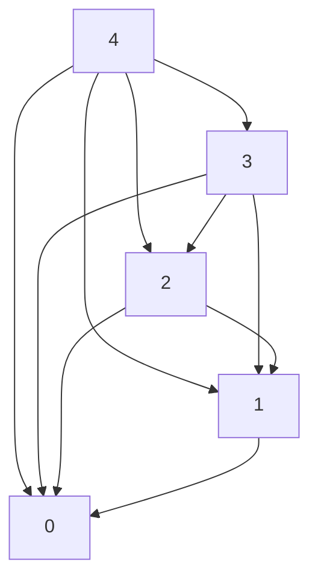

---
tags:
  - CCT3
  - Algoritmer
Topic: Dynamic programming, Greedy algorithms
Semester: CCT3
Course: Algoritmer
Litterature:
  - Introduction to Algorithms 4th ed.
Created: 30-09-2026
---
- - -
## Table of Contents

1. [[#Dynamic Programming|Dynamic Programming]]
2. [[#Greedy Algorithms|Greedy Algorithms]]
3. [[#Amortized Analysis|Amortized Analysis]]
4. [[#14 Dynamic Programming|14 Dynamic Programming]]
5. [[#Dynamic Programming vs. Divide-and-Conquer|Dynamic Programming vs. Divide-and-Conquer]]
6. [[#Application to Optimization Problems|Application to Optimization Problems]]
7. [[#The Four-Step Development Process|The Four-Step Development Process]]
8. [[#Classical Dynamic Programming Problems|Classical Dynamic Programming Problems]]
9. [[#14 Dynamic Programming#14.1 Rod cutting|14.1 Rod cutting]]
10. [[#14.1 Rod cutting#Problem Dynamics and Combinatorics|Problem Dynamics and Combinatorics]]
11. [[#14.1 Rod cutting#Recursive Formulations|Recursive Formulations]]
	1. [[#Recursive Formulations#Two-Subproblem Formulation|Two-Subproblem Formulation]]
	2. [[#Recursive Formulations#Optimal Substructure|Optimal Substructure]]
	3. [[#Recursive Formulations#Simplified One-Subproblem Formulation|Simplified One-Subproblem Formulation]]
12. [[#14.1 Rod cutting#Recursive top-down implementation|Recursive top-down implementation]]
13. [[#14.1 Rod cutting#The Cause of Inefficiency: Overlapping Subproblems|The Cause of Inefficiency: Overlapping Subproblems]]
14. [[#14.1 Rod cutting#Complexity and Combinatorial Analysis|Complexity and Combinatorial Analysis]]
	1. [[#Complexity and Combinatorial Analysis#Combinatorial Interpretation|Combinatorial Interpretation]]
15. [[#14.1 Rod cutting#Using dynamic programming for optimal rod cutting|Using dynamic programming for optimal rod cutting]]
	1. [[#Using dynamic programming for optimal rod cutting#The Time-Memory Trade-off|The Time-Memory Trade-off]]
16. [[#14.1 Rod cutting#Two Approaches to Dynamic Programming|Two Approaches to Dynamic Programming]]
17. [[#14.1 Rod cutting#Top-Down Memoized Implementation|Top-Down Memoized Implementation]]
18. [[#14.1 Rod cutting#Bottom-Up Implementation|Bottom-Up Implementation]]
19. [[#14.1 Rod cutting#Complexity Analysis|Complexity Analysis]]
	1. [[#Complexity Analysis#Bottom-Up Analysis|Bottom-Up Analysis]]
	2. [[#Complexity Analysis#Top-Down Analysis|Top-Down Analysis]]
20. [[#14.1 Rod cutting#Subproblem graphs|Subproblem graphs]]
21. [[#14.1 Rod cutting#Subproblem graphs|Subproblem graphs]]
22. [[#14.1 Rod cutting#Graph Perspectives: Bottom-Up vs. Top-Down|Graph Perspectives: Bottom-Up vs. Top-Down]]
23. [[#14.1 Rod cutting#Running Time and Graph Size|Running Time and Graph Size]]
24. [[#14.1 Rod cutting#Reconstructing a solution|Reconstructing a solution]]
25. [[#14.1 Rod cutting#Extended Dynamic Programming Algorithm|Extended Dynamic Programming Algorithm]]
26. [[#14.1 Rod cutting#Printing the Solution|Printing the Solution]]
27. [[#14.1 Rod cutting#Example Trace|Example Trace]]
28. [[#14 Dynamic Programming#14.2 Matrix-chain multiplication|14.2 Matrix-chain multiplication]]
29. [[#14.2 Matrix-chain multiplication#Matrix Multiplication and Associativity|Matrix Multiplication and Associativity]]
30. [[#14.2 Matrix-chain multiplication#Cost of Multiplying Two Rectangular Matrices|Cost of Multiplying Two Rectangular Matrices]]
31. [[#14.2 Matrix-chain multiplication#Impact of Parenthesization on Total Cost|Impact of Parenthesization on Total Cost]]
32. [[#14.2 Matrix-chain multiplication#Formal Problem Statement|Formal Problem Statement]]
33. [[#14.2 Matrix-chain multiplication#Counting the number of parenthesizations|Counting the number of parenthesizations]]
34. [[#14.2 Matrix-chain multiplication#Growth Rate and Exhaustive Search|Growth Rate and Exhaustive Search]]
35. [[#14.2 Matrix-chain multiplication#Applying dynamic programming|Applying dynamic programming]]
36. [[#14.2 Matrix-chain multiplication#Step 1: The structure of an optimal parenthesization|Step 1: The structure of an optimal parenthesization]]
37. [[#14.2 Matrix-chain multiplication#Optimal Substructure|Optimal Substructure]]
	1. [[#Optimal Substructure#Proof by Contradiction (Cut-and-Paste Argument)|Proof by Contradiction (Cut-and-Paste Argument)]]
38. [[#14.2 Matrix-chain multiplication#Constructing the Solution|Constructing the Solution]]
39. [[#14.2 Matrix-chain multiplication#Step 2: A recursive solution|Step 2: A recursive solution]]
40. [[#14.2 Matrix-chain multiplication#Defining the Subproblem Space|Defining the Subproblem Space]]
41. [[#14.2 Matrix-chain multiplication#Recursive Cost Formulation|Recursive Cost Formulation]]
42. [[#14.2 Matrix-chain multiplication#Tracking Optimal Split Decisions|Tracking Optimal Split Decisions]]
43. [[#14.2 Matrix-chain multiplication#Step 3: Computing the optimal costs|Step 3: Computing the optimal costs]]
44. [[#14.2 Matrix-chain multiplication#Determining the Computation Order|Determining the Computation Order]]
45. [[#14.2 Matrix-chain multiplication#Bottom-Up Matrix-Chain Order Algorithm|Bottom-Up Matrix-Chain Order Algorithm]]
46. [[#14.2 Matrix-chain multiplication#Complexity Analysis|Complexity Analysis]]
47. [[#14.2 Matrix-chain multiplication#Step 4: Constructing an optimal solution|Step 4: Constructing an optimal solution]]
48. [[#14.2 Matrix-chain multiplication#Recursive Reconstruction Logic|Recursive Reconstruction Logic]]
49. [[#14.2 Matrix-chain multiplication#Algorithm: Printing the Optimal Parenthesization|Algorithm: Printing the Optimal Parenthesization]]
50. [[#14.2 Matrix-chain multiplication#Example|Example]]
51. [[#15 Greedy Algorithms|15 Greedy Algorithms]]
52. [[#14.2 Matrix-chain multiplication#Key Applications of Greedy Algorithms|Key Applications of Greedy Algorithms]]
53. [[#15 Greedy Algorithms#15.1 An activity-selection problem|15.1 An activity-selection problem]]
54. [[#15.1 An activity-selection problem#Formal Problem Definition|Formal Problem Definition]]
55. [[#15.1 An activity-selection problem#Monotonic Finish Time Ordering|Monotonic Finish Time Ordering]]
56. [[#15.1 An activity-selection problem#Solution Strategy Overview|Solution Strategy Overview]]
57. [[#15.1 An activity-selection problem#The optimal substructure of the activity-selection problem|The optimal substructure of the activity-selection problem]]
58. [[#15.1 An activity-selection problem#Subproblem Definition|Subproblem Definition]]
59. [[#15.1 An activity-selection problem#Characterizing Optimal Substructure|Characterizing Optimal Substructure]]
	1. [[#Characterizing Optimal Substructure#Cut-and-Paste Proof|Cut-and-Paste Proof]]
60. [[#15.1 An activity-selection problem#Dynamic-Programming Recurrence|Dynamic-Programming Recurrence]]
61. [[#15.1 An activity-selection problem#Making the greedy choice|Making the greedy choice]]
62. [[#15.1 An activity-selection problem#The Earliest-Finish-Time Heuristic|The Earliest-Finish-Time Heuristic]]
63. [[#15.1 An activity-selection problem#Reduction to a Single Subproblem|Reduction to a Single Subproblem]]
64. [[#15.1 An activity-selection problem#Correctness of the Greedy Choice|Correctness of the Greedy Choice]]
65. [[#15.1 An activity-selection problem#Top-Down Greedy vs. Bottom-Up Dynamic Programming|Top-Down Greedy vs. Bottom-Up Dynamic Programming]]
66. [[#15.1 An activity-selection problem#A recursive greedy algorithm|A recursive greedy algorithm]]
67. [[#15.1 An activity-selection problem#Preconditions and Initialization|Preconditions and Initialization]]
68. [[#15.1 An activity-selection problem#Implementation|Implementation]]
69. [[#15.1 An activity-selection problem#Algorithm Mechanics|Algorithm Mechanics]]
70. [[#15.1 An activity-selection problem#Complexity Analysis|Complexity Analysis]]
	1. [[#Complexity Analysis#Why the Total Work is Linear|Why the Total Work is Linear]]
71. [[#15.1 An activity-selection problem#An iterative greedy algorithm|An iterative greedy algorithm]]
72. [[#15.1 An activity-selection problem#Implementation|Implementation]]
73. [[#15.1 An activity-selection problem#Invariant and Operational Mechanics|Invariant and Operational Mechanics]]
	1. [[#Invariant and Operational Mechanics#Why a Single Comparison Suffices|Why a Single Comparison Suffices]]
74. [[#15.1 An activity-selection problem#Complexity Analysis|Complexity Analysis]]
75. [[#15 Greedy Algorithms#15.2 Elements of the greedy strategy|15.2 Elements of the greedy strategy]]
76. [[#15.2 Elements of the greedy strategy#Pathways for Designing Greedy Algorithms|Pathways for Designing Greedy Algorithms]]
	1. [[#Pathways for Designing Greedy Algorithms#1. The Dynamic-Programming Transition Path|1. The Dynamic-Programming Transition Path]]
	2. [[#Pathways for Designing Greedy Algorithms#2. The Direct Greedy Design Path|2. The Direct Greedy Design Path]]
77. [[#15.2 Elements of the greedy strategy#Key Ingredients of Greedy Algorithms|Key Ingredients of Greedy Algorithms]]
78. [[#15.2 Elements of the greedy strategy#Greedy-choice property|Greedy-choice property]]
79. [[#15.2 Elements of the greedy strategy#Greedy Choice vs. Dynamic Programming|Greedy Choice vs. Dynamic Programming]]
80. [[#15.2 Elements of the greedy strategy#Proving Correctness: The Substitution Method|Proving Correctness: The Substitution Method]]
81. [[#15.2 Elements of the greedy strategy#Computational Efficiency and Preprocessing|Computational Efficiency and Preprocessing]]
82. [[#15.2 Elements of the greedy strategy#Optimal substructure|Optimal substructure]]
83. [[#15.2 Elements of the greedy strategy#Direct Application in Greedy Algorithms|Direct Application in Greedy Algorithms]]
84. [[#15.2 Elements of the greedy strategy#Greedy versus dynamic programming|Greedy versus dynamic programming]]
85. [[#15.2 Elements of the greedy strategy#The Knapsack Problems|The Knapsack Problems]]
	1. [[#The Knapsack Problems#Optimal Substructure in Both Variants|Optimal Substructure in Both Variants]]
86. [[#15.2 Elements of the greedy strategy#Why Greedy Works for Fractional, but Fails for 0-1|Why Greedy Works for Fractional, but Fails for 0-1]]
	1. [[#Why Greedy Works for Fractional, but Fails for 0-1#The Fractional Knapsack Greedy Strategy|The Fractional Knapsack Greedy Strategy]]
87. [[#15.2 Elements of the greedy strategy#The Fundamental Cause of Greedy Failure in 0-1|The Fundamental Cause of Greedy Failure in 0-1]]

# Introduction

Three sophisticated techniques are central to designing and analyzing efficient algorithms: _[[#Dynamic Programming]]_, _[[#Greedy Algorithms]]_, and _[[#Amortized Analysis]]_. While foundational paradigms like divide-and-conquer, randomization, and recurrence relations address basic algorithmic structures, these advanced techniques tackle more complex computational and optimization challenges.

### Dynamic Programming

Dynamic programming applies to optimization problems where finding an optimal solution requires making a sequence of choices. Each choice produces subproblems of the exact same structure as the original problem, causing identical subproblems to arise repeatedly.

>[!info] **Core Strategy of Dynamic Programming**
>Instead of recomputing the solution to identical subproblems multiple times, dynamic programming computes each subproblem's solution once and stores it. This caching strategy can dramatically reduce computational complexity, frequently transforming exponential-time algorithms into polynomial-time algorithms.

### Greedy Algorithms

Like _[[#Dynamic Programming]]_, greedy algorithms are designed for optimization problems requiring a series of decisions. However, they differ significantly in their decision-making strategy:

- **Local Optimality:** At each step, a greedy algorithm makes the choice that appears best at the moment (a *locally optimal* choice).
- **Efficiency:** Because greedy algorithms commit to local choices without reconsidering past decisions or exploring all subproblem combinations, they are generally faster than dynamic programming approaches.

### Amortized Analysis

Amortized analysis is an analytical technique used for algorithms that execute a sequence of related operations. 

Instead of determining the worst-case running time of each operation independently, amortized analysis establishes a **worst-case bound on the total cost of the entire sequence**.

>[!info] **Purpose of Amortized Analysis**
>In many data structures and algorithms, an occasional operation may be computationally expensive, while the vast majority of operations are inexpensive. Amortized analysis guarantees an average performance per operation over a worst-case sequence, ensuring that the expensive operations are balanced out by the cheaper ones.

---

# 14 Dynamic Programming

Dynamic programming, like the divide-and-conquer method, solves problems by combining the solutions to subproblems. In this context, the term `` `<programming>` `` refers to a tabular method of storing results rather than writing computer code.

### Dynamic Programming vs. Divide-and-Conquer

- **Divide-and-Conquer:** Partitions a problem into *disjoint* (non-overlapping) subproblems, solves them recursively, and combines their solutions to solve the original problem.
- **Dynamic Programming:** Applies when the subproblems **overlap**—meaning that subproblems share the same smaller sub-subproblems.

When subproblems overlap, a divide-and-conquer approach performs redundant work by repeatedly solving common subproblems. A dynamic-programming algorithm avoids this inefficiency by solving each sub-subproblem exactly once and saving its answer in a table, eliminating the cost of recomputing the answer each time. For a breakdown of how this is done, see the _[[#The Four-Step Development Process]]_.

### Application to Optimization Problems

Dynamic programming typically applies to **optimization problems**. These problems can have many possible solutions, each associated with a calculated value. The objective is to find a solution with the optimal (minimum or maximum) value.

>[!note] **"An" Optimal Solution vs. "The" Optimal Solution**
>Because several distinct configurations or solutions can yield the exact same optimal value, such a result is referred to as *an* optimal solution rather than *the* optimal solution.

### The Four-Step Development Process

Developing a dynamic-programming algorithm generally follows a sequence of four steps:

1. **Characterize the structure of an optimal solution.**
2. **Recursively define the value of an optimal solution.**
3. **Compute the value of an optimal solution**, typically in a bottom-up fashion.
4. **Construct an optimal solution from computed information.**

>[!info] **Value Computation vs. Solution Construction**
>Steps 1 through 3 form the core foundation of a dynamic-programming solution. If only the *numerical value* of an optimal solution is needed, Step 4 can be omitted. When the full solution must be constructed, maintaining auxiliary information during Step 3 simplifies the reconstruction process in Step 4.

### Classical Dynamic Programming Problems

Dynamic programming is well-suited for several classic computational challenges, which illustrate the differences discussed in _[[#Dynamic Programming vs. Divide-and-Conquer]]_:

- **Rod Cutting:** Partitioning a rod of a given length into smaller pieces to maximize total revenue based on piece prices.
- **Matrix-Chain Multiplication:** Finding the optimal parenthesization for a sequence of matrices to minimize the total number of scalar multiplications.
- **Longest Common Subsequence (LCS):** Identifying the longest subsequence shared between two sequences.
- **Optimal Binary Search Trees:** Constructing a search tree that minimizes expected lookup time given the access probabilities of keys.
## 14.1 Rod cutting

The **rod-cutting problem** addresses how to optimally partition a resource to maximize value. 

In this scenario, a company buys long steel rods of integer lengths and cuts them into shorter rods to sell. Assuming that making a cut costs nothing, the goal is to determine the best way to cut up a rod of length $n$ inches, given a price table $p_i$ that specifies the price charged for a rod of length $i$ inches (for $i = 1, 2, \dots$). 

If the market price $p_n$ for an uncut rod of length $n$ is high enough, the optimal strategy may be to make no cuts at all.

### Problem Dynamics and Combinatorics

A rod of length $n$ can be cut in $2^{n-1}$ different ways. This is because there are $n-1$ potential cutting locations (at each integer distance $i = 1, 2, \dots, n-1$ from the left end), and at each location, there is an independent binary choice: to cut or not to cut.

We represent a decomposition into pieces using additive notation. For example, a decomposition of $7 = 2 + 2 + 3$ means a 7-inch rod is cut into three pieces: two of length 2 inches and one of length 3 inches.

If an optimal solution partitions a rod into $k$ pieces (where $1 \le k \le n$) such that:

$$n = i_1 + i_2 + \dots + i_k$$

Then the maximum obtainable revenue $r_n$ is the sum of the prices of these pieces:

$$r_n = p_{i_1} + p_{i_2} + \dots + p_{i_k}$$

The table below lists the optimal revenues $r_i$ and their corresponding decompositions for lengths $1$ through $10$, based on a sample pricing structure:

| Length $i$ (inches) | Optimal Revenue $r_i$ | Optimal Decomposition |
| :--- | :--- | :--- |
| 1 | 1 | 1 (no cuts) |
| 2 | 5 | 2 (no cuts) |
| 3 | 8 | 3 (no cuts) |
| 4 | 10 | 2 + 2 |
| 5 | 13 | 2 + 3 |
| 6 | 17 | 6 (no cuts) |
| 7 | 18 | 1 + 6 or 2 + 2 + 3 |
| 8 | 22 | 2 + 6 |
| 9 | 25 | 3 + 6 |
| 10 | 30 | 10 (no cuts) |
![[Pasted image 20260930202124.png]]
Figure 14.1 A sample price table for rods. Each rod of length i inches earns the company pi dollars of revenue.

![[Pasted image 20260930202145.png]]
Figure 14.2 The 8 possible ways of cutting up a rod of length 4. Above each piece is the value of that piece, according to the sample price chart of Figure 14.1. The optimal strategy is part (c)4 cutting the rod into two pieces of length 24which has total value 10.

---

### Recursive Formulations

To solve a rod-cutting problem of size $n$, we can express its solution in terms of the optimal solutions to smaller subproblems. 

#### Two-Subproblem Formulation
The total revenue can be defined by choosing the best option among making no cuts, or making an initial cut at distance $i$ (where $1 \le i \le n-1$) to split the rod into two pieces of size $i$ and $n-i$, and then recursively finding the optimal cuts for both resulting pieces.

>[!summary] **Theorem: Two-Subproblem Cut Formulation**
>For $n \ge 1$, the maximum revenue $r_n$ is given by:
>
>$$r_n = \max \{ p_n, r_1 + r_{n-1}, r_2 + r_{n-2}, \dots, r_{n-1} + r_1 \}$$
>
>**Breakdown:**
>- **$r_n$**: The maximum obtainable revenue for a rod of length $n$.
>- **$p_n$**: The revenue obtained by making no cuts and selling the rod as a single piece of length $n$.
>- **$r_i + r_{n-i}$**: The sum of the optimal revenues obtained by cutting the rod into two initial pieces of size $i$ and $n-i$, and subsequently optimizing both pieces independently.
>- **$\max$**: The selection operator that chooses the strategy yielding the highest revenue among all possible partition boundaries.

#### Optimal Substructure
This problem displays **optimal substructure**: an overall optimal solution is built from the optimal solutions to independent subproblems. Once the first cut is made, the two resulting pieces can be treated as entirely independent instances of the rod-cutting problem.

#### Simplified One-Subproblem Formulation
We can simplify the recursive structure by dividing the rod into a first piece of length $i$ cut off the left end, and a right-hand remainder of length $n-i$. Under this view, **only the remainder** may be cut further, while the first piece of length $i$ is sold as-is without further division. 

An uncut rod is represented by setting $i = n$, which leaves a remainder of length $0$ with a baseline revenue of $r_0 = 0$.

>[!summary] **Theorem: Simplified Remainder Formulation**
>For $n \ge 1$, the maximum revenue can be recursively defined by optimizing only the remainder of the rod:
>
>$$r_n = \max_{1 \le i \le n} (p_i + r_{n-i})$$
>
>**Breakdown:**
>- **$r_n$**: The maximum obtainable revenue for a rod of length $n$.
>- **$p_i$**: The price of the first piece of length $i$ (sold directly without further cuts).
>- **$r_{n-i}$**: The optimal revenue obtained by recursively partitioning the remaining piece of length $n-i$.
>- **$\max_{1 \le i \le n}$**: An operator directing us to evaluate every possible first-cut length $i$ from $1$ to $n$, selecting the value that maximizes the sum of the immediate piece's price and the remainder's optimal revenue.

In this simplified formulation, highlighted in the context of _[[#Recursive Formulations]]_, an optimal solution incorporates the solution to only one subproblem (the remainder $n-i$) instead of two, significantly reducing the complexity of the recursive mapping.
### Recursive top-down implementation

The direct translation of the simplified single-subproblem recurrence (introduced in _[[#Simplified One-Subproblem Formulation]]_) produces a naive, recursive, top-down algorithm.

```python
def cut_rod(p, n):
    """
    Computes the maximum revenue obtainable for a rod of length n,
    given a price array p where p[i] is the price of a piece of length i.
    """
    # Base case: A rod of length 0 yields no revenue
    if n == 0:
        return 0
    
    # Initialize maximum revenue to negative infinity
    q = -float("inf")
    
    # Evaluate every possible first-cut position i from 1 to n
    for i in range(1, n + 1):
        # p[i - 1] corresponds to the price of a piece of length i (0-indexed array)
        q = max(q, p[i - 1] + cut_rod(p, n - i))
        
    return q
```
![[Pasted image 20260930202244.png]]
Figure 14.3 The recursion tree showing recursive calls resulting from a call C UT-ROD.p; n/ for n D 4. Each node label gives the size n of the corresponding subproblem, so that an edge from a parent with label s to a child with label t corresponds to cutting off an initial piece of size s  t and leaving a remaining subproblem of size t. A path from the root to a leaf corresponds to one of the 2 n1 ways of cutting up a rod of length n. In general, this recursion tree has 2 n nodes and 2 n1 leaves.
### The Cause of Inefficiency: Overlapping Subproblems

Although the direct recursive implementation correctly computes the optimal revenue $r_n$, its execution time grows exponentially with the input size $n$. For moderate values of $n$ (such as $n \ge 40$), the running time can take hours, with each incremental increase of $n$ by $1$ approximately doubling the total computation time.

The root cause of this inefficiency is that the procedure repeatedly computes solutions to the **exact same subproblems**. 

When computing `cut_rod(p, n)`, the function branches into calls for `cut_rod(p, n - i)` across all $i \in \{1, 2, \dots, n\}$, which in turn make identical redundant sub-calls down the branching tree. Rather than retaining previously calculated results, the algorithm continually recomputes them from scratch across different recursion paths.

---

### Complexity and Combinatorial Analysis

To quantify the cost of this recursion, we analyze the total number of calls $T(n)$ made by the algorithm for an input of size $n$.

>[!summary] Theorem: Recursive Running Time of Cut-Rod
>The total number of recursive calls $T(n)$ executed for an input rod of length $n$ satisfies the recurrence:
>
>$$T(n) = 1 + \sum_{j=0}^{n-1} T(j) = 2^n$$
>
>**Breakdown:**
>- **$T(n)$**: The total number of invocations of the recursive function for a rod of length $n$ (accounting for the root call and all descendant calls).
>- **$1$**: The initial invocation representing the current root call.
>- **$\sum_{j=0}^{n-1}$**: The Summation Operator, which aggregates all recursive calls generated across every possible remainder length $j = n - i$ (where $i$ ranges from $1$ to $n$).
>- **$T(j)$**: The total sub-calls required to solve the subproblem for the remaining rod piece of length $j$.
>- **$2^n$**: The closed-form exponential result showing that the overall running time is $\Theta(2^n)$.

#### Combinatorial Interpretation
The exponential running time corresponds directly to the problem's underlying search space:
- A rod of length $n$ contains $n - 1$ possible internal cut points.
- Every valid partitioning of the rod corresponds to choosing a subset from these $n - 1$ cut locations.
- Because a set of size $n - 1$ contains $2^{n-1}$ possible subsets, there are exactly $2^{n-1}$ distinct cutting configurations.
- The recursive execution tree contains $2^{n-1}$ leaves (one for each distinct partition), making the total number of nodes in the recursion tree $2^n$.
### Using dynamic programming for optimal rod cutting
#### The Time-Memory Trade-off

The core of the dynamic programming approach is to solve each subproblem exactly once and save its solution for future lookups. 

This introduces a **time-memory trade-off**:
- **Memory Cost:** Additional space is required to store the computed subproblem solutions (typically in an array, table, or hash table).
- **Time Savings:** By eliminating redundant computations, the time complexity for rod cutting is reduced from exponential time $\Theta(2^n)$ (described in the naive recursive implementation) to polynomial time $\Theta(n^2)$.

A dynamic programming approach achieves a polynomial running time when the total number of distinct subproblems is polynomial in the input size, and each subproblem can be solved in polynomial time.

---

### Two Approaches to Dynamic Programming

There are two main strategies for implementing a dynamic-programming solution. Both yield the same asymptotic running time, but differ in execution style and overhead:

1. **Top-Down with Memoization:**
   The algorithm is written recursively in a natural manner, but is modified to save the results of each subproblem. When a subproblem is encountered, the procedure first checks the storage table. If the solution is already saved, it returns the stored value immediately; otherwise, it computes the value recursively and saves it. The function is said to be *memoized* (it writes a "memo" to itself).
   
2. **Bottom-Up Method:**
   This approach uses a natural notion of subproblem "size" so that solving a larger subproblem depends only on having solved smaller subproblems. The algorithm solves subproblems in increasing order of size (smallest first). When solving a particular subproblem, all smaller prerequisite subproblems have already been solved and stored, allowing for direct, non-recursive lookups.

>[!tip] **Performance Comparison**
>While both approaches share the same asymptotic running time, the **bottom-up method** typically exhibits better constant factors in practice. This is because it avoids the overhead of recursive function calls and call stack management.

---

### Top-Down Memoized Implementation

The top-down approach initializes an auxiliary array with a placeholder (such as $-1$) to denote that a subproblem's solution has not yet been computed.

```python
def memoized_cut_rod(p, n):
    # Initialize array r[0...n] to store optimal revenues
    # We use -1 to indicate that the subproblem has not yet been solved
    r = [-1] * (n + 1)
    return memoized_cut_rod_aux(p, n, r)

def memoized_cut_rod_aux(p, n, r):
    # If the subproblem for length n has already been solved, return it
    if r[n] >= 0:
        return r[n]
    
    # Base case: A rod of length 0 yields 0 revenue
    if n == 0:
        q = 0
    else:
        q = -float('inf')
        # Find the optimal first cut i
        for i in range(1, n + 1):
            q = max(q, p[i - 1] + memoized_cut_rod_aux(p, n - i, r))
            
    # Save the computed value in r[n] before returning
    r[n] = q
    return q
```

---

### Bottom-Up Implementation

The bottom-up approach solves the subproblems in order of increasing rod length $j = 0, 1, \dots, n$.

```python
def bottom_up_cut_rod(p, n):
    # Initialize array r[0...n] to store optimal revenues
    r = [0] * (n + 1)
    
    # Base Case: r[0] is already initialized to 0
    
    # Solve subproblems in order of increasing size j
    for j in range(1, n + 1):
        q = -float('inf')
        # Find the optimal first cut i for a rod of length j
        for i in range(1, j + 1):
            # Direct array lookup of r[j - i] replaces the recursive call
            q = max(q, p[i - 1] + r[j - i])
        r[j] = q
        
    return r[n]
```

---

### Complexity Analysis

Both implementations achieve a running time of $\Theta(n^2)$.

#### Bottom-Up Analysis
The running time of `bottom_up_cut_rod` is dominated by the doubly nested loop structure. The outer loop runs $n$ times, and the inner loop runs $j$ times, where $j$ ranges from $1$ to $n$. The total number of inner loop iterations forms an arithmetic series.

>[!summary] **Theorem: Running Time of Bottom-Up Cut-Rod**
>The total execution time of the nested loops is proportional to the sum of the first $n$ integers:
>
>$$\sum_{j=1}^{n} j = \frac{n(n+1)}{2} = \Theta(n^2)$$
>
>**Breakdown:**
>- **$\sum_{j=1}^{n}$**: The Summation Operator, which aggregates the iterations of the inner loop as the rod size $j$ increases from $1$ to $n$.
>- **$j$**: The number of options evaluated (inner loop steps) when finding the optimal cut for a rod of length $j$.
>- **$\frac{n(n+1)}{2}$**: The closed-form sum of the arithmetic progression.
>- **$\Theta(n^2)$**: The tight asymptotic bound indicating quadratic growth.

#### Top-Down Analysis
The running time of `memoized_cut_rod` is also $\Theta(n^2)$. 

Because the algorithm returns a saved value immediately if a subproblem is already solved, it solves each subproblem of size $0, 1, \dots, n$ exactly once. To solve a subproblem of size $j$, the algorithm runs an inner loop of $j$ iterations. Aggregating these iterations across all unique subproblems yields the same arithmetic series as the bottom-up algorithm, resulting in a total running time of $\Theta(n^2)$.
### Subproblem graphs
### Subproblem graphs

To analyze and understand a dynamic-programming problem, it is essential to map the set of subproblems and their interdependencies. This structure is represented formally by a **subproblem graph**.

>[!info] **Definition: Subproblem Graph**
>A **subproblem graph** for a dynamic-programming problem is a directed graph $G = (V, E)$ where:
>- Each vertex $v \in V$ represents a unique subproblem.
>- A directed edge $(x, y) \in E$ goes from subproblem $x$ to subproblem $y$ if determining an optimal solution for $x$ directly depends on the solution to subproblem $y$.

You can think of the subproblem graph as a "collapsed" or "reduced" version of the recursion tree, where all redundant nodes representing the same subproblem are merged into a single vertex, with directed edges pointing from each parent problem to its dependent subproblems.


*A subproblem graph for rod cutting with $n = 4$. Solving subproblem $4$ requires direct edges to subproblems $3, 2, 1,$ and $0$.*

![[Pasted image 20260930202434.png]]
Figure 14.4 The subproblem graph for the rod-cutting problem with n D 4. The vertex labels give the sizes of the corresponding subproblems. A directed edge .x; y/ indicates that solving subproblem x requires a solution to subproblem y. This graph is a reduced version of the recursion tree of Figure 14.3, in which all nodes with the same label are collapsed into a single vertex and all edges go from parent to child.


---

### Graph Perspectives: Bottom-Up vs. Top-Down

The two algorithmic approaches to dynamic programming (discussed in _[[#Two Approaches to Dynamic Programming]]_) correspond directly to fundamental graph traversal strategies:

- **Bottom-Up Method (Reverse Topological Sort):**
  The bottom-up approach solves subproblems in an order where all dependencies $y$ adjacent to vertex $x$ are evaluated before computing $x$. In graph-theoretic terms, this process considers the vertices in a **reverse topological sort** (or a topological sort of the transposed graph $G^T$). No vertex is computed until all vertices it points to have been completely resolved.

- **Top-Down with Memoization (Depth-First Search):**
  The memoized top-down approach explores the subproblem graph via a **depth-first search** (DFS). It starts at the root problem, traverses downward along directed edges to solve and memoize smaller subproblems, and backtracks once the dependencies are computed.

---

### Running Time and Graph Size

The structure of the subproblem graph $G = (V, E)$ provides a direct way to determine the running time of a dynamic-programming algorithm. 

Because dynamic programming solves each distinct subproblem exactly once:
1. The number of subproblems solved equals the number of vertices $|V|$.
2. The time required to compute the solution to a particular subproblem $x$ is proportional to the number of choices considered, which equals the **out-degree** (the number of outgoing edges) of vertex $x$.

>[!summary] **Theorem: Running Time via Subproblem Graph**
>When the computation time for each subproblem is proportional to the number of subproblems it directly considers, the total running time of a dynamic-programming algorithm is linear in the size of its subproblem graph:
>
>$$T = \Theta(|V| + |E|)$$
>
>**Breakdown:**
>- **$T$**: The overall running time of the dynamic-programming algorithm.
>- **$G = (V, E)$**: The directed subproblem graph consisting of vertices $V$ and directed edges $E$.
>- **$|V|$**: The total number of distinct subproblems (vertices).
>- **$|E|$**: The total number of dependencies/transitions between subproblems (directed edges).
>- **$\Theta(|V| + |E|)$**: The total time complexity, representing work linear in the sum of the vertices and edges of the subproblem graph.

For the rod-cutting problem of size $n$, the subproblem graph has $|V| = n + 1$ vertices (representing lengths $0$ to $n$) and $|E| = \Theta(n^2)$ edges (since each vertex $j$ has outgoing edges to all smaller vertices $0, 1, \dots, j-1$). Consequently, the algorithm runs in $\Theta(|V| + |E|) = \Theta(n + n^2) = \Theta(n^2)$ time.
### Reconstructing a solution

The dynamic-programming procedures discussed previously (such as the bottom-up algorithm in _[[#Bottom-Up Implementation]]_) return only the *optimal value* (the maximum revenue $r_n$), but not the *optimal solution* itself (the specific sequence of cut lengths). This corresponds to Step 3 of _[[#The Four-Step Development Process]]_.

To construct the actual solution (Step 4), we extend the algorithm to record the choices that produce each optimal subproblem value.

---

### Extended Dynamic Programming Algorithm

For each rod length $j$, we record two values:
- $r[j]$: The maximum revenue obtainable for a rod of length $j$.
- $s[j]$: The optimal size of the first piece cut off when solving the subproblem of length $j$.

```python
def extended_bottom_up_cut_rod(p, n):
    """
    Computes both the maximum revenue array r and the optimal first-cut array s
    for a rod of length n and price table p.
    """
    # r[0...n] stores optimal revenues; s[1...n] stores the best first-cut lengths
    r = [0] * (n + 1)
    s = [0] * (n + 1)
    
    # Solve subproblems in order of increasing size j
    for j in range(1, n + 1):
        q = -float('inf')
        for i in range(1, j + 1):
            if q < p[i - 1] + r[j - i]:
                q = p[i - 1] + r[j - i]
                s[j] = i  # Record the best cut location for length j
        r[j] = q
        
    return r, s
```

---

### Printing the Solution

Once the array $s$ is populated, we can reconstruct the full decomposition of an optimal cut by iteratively tracing the cut decisions from the total length $n$ down to $0$.

```python
def print_cut_rod_solution(p, n):
    """
    Prints the complete list of piece sizes in an optimal decomposition 
    of a rod of length n.
    """
    r, s = extended_bottom_up_cut_rod(p, n)
    
    # Iteratively print each cut piece and reduce the remaining length
    while n > 0:
        print(s[n])
        n = n - s[n]
```

---

### Example Trace

Using a sample price array for rod lengths up to $10$, the computed revenue array $r$ and optimal first-cut array $s$ are structured as follows:

| Length $i$ | 0 | 1 | 2 | 3 | 4 | 5 | 6 | 7 | 8 | 9 | 10 |
| :--- | :--- | :--- | :--- | :--- | :--- | :--- | :--- | :--- | :--- | :--- | :--- |
| **$r[i]$** | 0 | 1 | 5 | 8 | 10 | 13 | 17 | 18 | 22 | 25 | 30 |
| **$s[i]$** | — | 1 | 2 | 3 | 2 | 2 | 6 | 1 | 2 | 3 | 10 |

>[!example] **Solution Reconstruction Examples**
>- **For $n = 10$:** 
>  - $s[10] = 10 \implies$ The optimal strategy is an uncut rod of size $10$. 
>  - Remainder: $10 - 10 = 0$. The process terminates, outputting: `10`.
>- **For $n = 7$:** 
>  - $s[7] = 1 \implies$ First piece is cut to length $1$.
>  - Remainder: $7 - 1 = 6$.
>  - $s[6] = 6 \implies$ Next piece is cut to length $6$.
>  - Remainder: $6 - 6 = 0$. The process terminates, outputting the decomposition: `1` and `6` (yielding total revenue $r_7 = p_1 + p_6 = 1 + 17 = 18$).
## 14.2 Matrix-chain multiplication

The **matrix-chain multiplication problem** is an optimization problem (as characterized in _[[#Application to Optimization Problems]]_) that seeks the most computationally efficient order for multiplying a sequence of matrices. 

Given a chain of $n$ matrices $\langle A_1, A_2, \dots, A_n \rangle$, where the matrices are not necessarily square, the objective is to compute the product:

$$A_1 A_2 \cdots A_n$$

while minimizing the total number of scalar multiplications required.

### Matrix Multiplication and Associativity

Matrix multiplication is **associative**, meaning that no matter how the operations are grouped, the resulting product matrix is identical:

$$(A_1 A_2) A_3 = A_1 (A_2 A_3)$$

Because of associativity, we can evaluate a chain by parenthesizing it to remove ambiguity and then repeatedly multiplying pairs of rectangular matrices.

A product of matrices is **fully parenthesized** if it is either a single matrix or the product of two fully parenthesized matrix products, enclosed in parentheses. For a chain of four matrices $\langle A_1, A_2, A_3, A_4 \rangle$, there are five distinct full parenthesizations:

1. $(A_1 (A_2 (A_3 A_4)))$
2. $(A_1 ((A_2 A_3) A_4))$
3. $((A_1 A_2) (A_3 A_4))$
4. $((A_1 (A_2 A_3)) A_4)$
5. $(((A_1 A_2) A_3) A_4)$

---

### Cost of Multiplying Two Rectangular Matrices

Multiplying two rectangular matrices $A$ (of dimensions $p \times q$) and $B$ (of dimensions $q \times r$) produces a matrix $C$ (of dimensions $p \times r$).

```python
def rectangular_matrix_multiply(A, B, C, p, q, r):
    """
    Computes C = C + A * B for matrices:
    A of size p x q, B of size q x r, and C of size p x r.
    """
    for i in range(p):
        for j in range(r):
            for k in range(q):
                # The innermost scalar multiplication dominates the runtime
                C[i][j] += A[i][k] * B[k][j]
```

The running time of this procedure is dominated by the scalar multiplications performed in the innermost loop. Consequently, the computational cost of multiplying two matrices of dimensions $p \times q$ and $q \times r$ is measured directly as the number of scalar multiplications:

$$\text{Cost} = p \cdot q \cdot r$$

---

### Impact of Parenthesization on Total Cost

The choice of parenthesization can dramatically change the total number of scalar operations needed to evaluate the product chain.

>[!example] **Cost Comparison for a 3-Matrix Chain**
>Consider three matrices $\langle A_1, A_2, A_3 \rangle$ with dimensions:
>- $A_1$: $10 \times 100$
>- $A_2$: $100 \times 5$
>- $A_3$: $5 \times 50$
>
>**Parenthesization 1: $((A_1 A_2) A_3)$**
>- Multiply $A_1$ ($10 \times 100$) and $A_2$ ($100 \times 5$):
>  - Scalar multiplications: $10 \cdot 100 \cdot 5 = 5{,}000$
>  - Resulting matrix size: $10 \times 5$
>- Multiply result by $A_3$ ($5 \times 50$):
>  - Scalar multiplications: $10 \cdot 5 \cdot 50 = 2{,}500$
>- **Total Cost:** $5{,}000 + 2{,}500 = 7{,}500$ scalar multiplications.
>
>**Parenthesization 2: $(A_1 (A_2 A_3))$**
>- Multiply $A_2$ ($100 \times 5$) and $A_3$ ($5 \times 50$):
>  - Scalar multiplications: $100 \cdot 5 \cdot 50 = 25{,}000$
>  - Resulting matrix size: $100 \times 50$
>- Multiply $A_1$ ($10 \times 100$) by the result ($100 \times 50$):
>  - Scalar multiplications: $10 \cdot 100 \cdot 50 = 50{,}000$
>- **Total Cost:** $25{,}000 + 50{,}000 = 75{,}000$ scalar multiplications.
>
>Computing the product via the first parenthesization is **10 times faster** than the second.

---

### Formal Problem Statement

>[!info] **The Matrix-Chain Multiplication Problem**
>Given a chain $\langle A_1, A_2, \dots, A_n \rangle$ of $n$ matrices, where matrix $A_i$ has dimensions $p_{i-1} \times p_i$ for $i = 1, 2, \dots, n$:
>- **Input:** The dimension sequence $\langle p_0, p_1, p_2, \dots, p_n \rangle$.
>- **Goal:** Determine a full parenthesization of the product $A_1 A_2 \cdots A_n$ that minimizes the total number of scalar multiplications.

>[!note] **Planning vs. Execution**
>The matrix-chain multiplication problem does not involve performing the actual matrix multiplications. Its goal is solely to determine an optimal multiplication order. The computational time spent finding this optimal sequence is outweighed by the time saved during the actual matrix multiplication stage.
### Counting the number of parenthesizations

Before developing a dynamic-programming algorithm for the matrix-chain multiplication problem (introduced in _[[#14.2 Matrix-chain multiplication]]_), we can analyze the efficiency of a brute-force approach that exhaustively checks every possible parenthesization.

Let $P(n)$ denote the number of alternative parenthesizations for a sequence of $n$ matrices:
- **Base Case ($n = 1$):** When the sequence contains only one matrix, there is only one way to parenthesize it ($P(1) = 1$).
- **Recursive Step ($n \ge 2$):** A fully parenthesized product splits the chain into two subproducts between the $k$-th and $(k+1)$-st matrices, where $k$ can be any integer from $1$ to $n-1$. The total number of ways to parenthesize the chain is the product of the number of ways to parenthesize the two subchains, summed over all possible split positions $k$.

>[!summary] **Theorem: Recurrence for Number of Parenthesizations**
>The number of valid parenthesizations $P(n)$ for a sequence of $n$ matrices satisfies the recurrence:
>
>$$P(n) = \begin{cases} 1 & \text{if } n = 1, \\ \sum_{k=1}^{n-1} P(k)P(n-k) & \text{if } n \ge 2 \end{cases}$$
>
>**Breakdown:**
>- **$P(n)$**: The total number of distinct full parenthesizations for a chain of $n$ matrices.
>- **$n = 1$**: The base condition where no multiplications or splits are performed.
>- **$\sum_{k=1}^{n-1}$**: The Summation Operator, which aggregates all possible split points between the matrices.
>- **$k$**: The index separating the left subchain $\langle A_1, \dots, A_k \rangle$ from the right subchain $\langle A_{k+1}, \dots, A_n \rangle$.
>- **$P(k)$**: The number of ways to fully parenthesize the prefix chain of length $k$.
>- **$P(n-k)$**: The number of ways to fully parenthesize the suffix chain of length $n-k$.

---

### Growth Rate and Exhaustive Search

The recurrence $P(n)$ generates the sequence of **Catalan numbers**, whose asymptotic growth rate satisfies:

$$P(n) = \Omega\left(\frac{4^n}{n^{3/2}}\right)$$

This grows at least as fast as $\Omega(2^n)$. 

Because the number of possible parenthesizations increases exponentially with $n$, an exhaustive brute-force search over all possible parenthesizations is computationally impractical for large chains. A dynamic programming strategy is required to compute the optimal parenthesization in polynomial time.
### Applying dynamic programming

To find the optimal parenthesization of a matrix chain efficiently, we apply the dynamic-programming methodology introduced in _[[#The Four-Step Development Process]]_:

1. **Characterize the structure of an optimal solution:** Identify how an optimal solution is composed of optimal solutions to subproblems (optimal substructure).
2. **Recursively define the value of an optimal solution:** Formulate a recurrence equation for the minimum scalar multiplication cost.
3. **Compute the value of an optimal solution:** Calculate the optimal cost, typically in a bottom-up tabular fashion to avoid recomputing overlapping subproblems.
4. **Construct an optimal solution from computed information:** Use auxiliary tracking tables recorded during computation to construct the fully parenthesized product.
### Step 1: The structure of an optimal parenthesization

The first step of the dynamic programming process (outlined in _[[#Applying dynamic programming]]_) is to characterize the optimal substructure of the problem and understand how to construct an optimal solution from optimal subproblem solutions.

To analyze subchains, we define notation:
- Let $A_{i..j}$ (for $i \le j$) denote the matrix that results from evaluating the subchain product $A_i A_{i+1} \cdots A_j$.

For any nontrivial problem where $i < j$, evaluating the matrix product $A_{i..j}$ requires choosing a split point between matrices $A_k$ and $A_{k+1}$ for some integer $k$ in the range $i \le k < j$. The full computation involves:
1. Evaluating the matrix product for the `` `<prefix>` `` subchain: $A_{i..k} = A_i A_{i+1} \cdots A_k$.
2. Evaluating the matrix product for the `` `<suffix>` `` subchain: $A_{k+1..j} = A_{k+1} A_{k+2} \cdots A_j$.
3. Multiplying the two resulting matrices together to produce the final matrix $A_{i..j}$.

The total computational cost of this split is the sum of the cost to compute $A_{i..k}$, the cost to compute $A_{k+1..j}$, and the cost of multiplying the two matrices together (as calculated in _[[#Cost of Multiplying Two Rectangular Matrices]]_).

---

### Optimal Substructure

The matrix-chain multiplication problem exhibits **optimal substructure**: an optimal solution to the overall problem contains within it optimal solutions to the independent subproblems.

>[!info] **Optimal Substructure Property**
>Suppose that an optimal parenthesization of $A_i A_{i+1} \cdots A_j$ splits the product between $A_k$ and $A_{k+1}$. Then:
>- The parenthesization used for the prefix subchain $A_i \cdots A_k$ must be an optimal parenthesization for that subchain.
>- The parenthesization used for the suffix subchain $A_{k+1} \cdots A_j$ must be an optimal parenthesization for that subchain.

#### Proof by Contradiction (Cut-and-Paste Argument)
If there existed a less costly way to parenthesize the prefix subchain $A_i \cdots A_k$, we could "cut out" the existing parenthesization and "paste in" the cheaper one. This substitution would produce a parenthesization of $A_i \cdots A_j$ with a lower total cost than the optimal solution, contradicting the assumption that the original solution was optimal. The exact same argument applies to the suffix subchain $A_{k+1} \cdots A_j$.

---

### Constructing the Solution

Because any optimal solution is built from optimal subproblem solutions, an optimal parenthesization for any chain $A_i \cdots A_j$ can be constructed by:
1. Splitting the problem into two subproblems: optimally parenthesizing $A_i \cdots A_k$ and $A_{k+1} \cdots A_j$.
2. Finding the optimal solutions to each subproblem independently.
3. Combining the subproblem solutions.

To ensure that the optimal split point is found, the algorithm must evaluate all possible split positions $k$ in the range $i \le k < j$ and select the one that minimizes total cost.
### Step 2: A recursive solution

The second step in the dynamic-programming process (outlined in _[[#Applying dynamic programming]]_) is to recursively define the value of an optimal solution in terms of optimal solutions to subproblems.

### Defining the Subproblem Space

Given the sequence of matrix dimensions $\langle p_0, p_1, p_2, \dots, p_n \rangle$, a subproblem consists of finding the minimum cost to evaluate the matrix product $A_{i..j} = A_i A_{i+1} \cdots A_j$ for any pair of indices satisfying $1 \le i \le j \le n$.

- Let $m[i, j]$ denote the minimum number of scalar multiplications needed to compute the matrix product $A_{i..j}$.
- The optimal cost for the entire chain $A_{1..n}$ is therefore given by $m[1, n]$.

---

### Recursive Cost Formulation

We can define $m[i, j]$ recursively by analyzing two cases:

1. **Base Case ($i = j$):**
   When the subchain consists of a single matrix $A_i$, no matrix multiplications are performed. Thus:
   $$m[i, i] = 0 \quad \text{for } i = 1, 2, \dots, n$$

2. **Recursive Step ($i < j$):**
   Using the optimal substructure established in _[[#Step 1: The structure of an optimal parenthesization]]_, if an optimal parenthesization splits $A_{i..j}$ between $A_k$ and $A_{k+1}$ (where $i \le k < j$), the total cost is the sum of:
   - The optimal cost to compute the prefix subproduct $A_{i..k}$: $m[i, k]$
   - The optimal cost to compute the suffix subproduct $A_{k+1..j}$: $m[k+1, j]$
   - The cost of multiplying matrix $A_{i..k}$ (of dimensions $p_{i-1} \times p_k$) by matrix $A_{k+1..j}$ (of dimensions $p_k \times p_j$), which requires $p_{i-1} p_k p_j$ scalar multiplications (see _[[#Cost of Rectangular Matrix Multiplication]]_).

Since the optimal split index $k$ is initially unknown, the algorithm must evaluate all $j - i$ possible split points $k \in \{i, i+1, \dots, j-1\}$ and choose the one that minimizes the total cost.

>[!summary] **Definition: Recurrence for Matrix-Chain Multiplication Cost**
>The minimum scalar multiplication cost $m[i, j]$ for the subchain $A_{i..j}$ is defined recursively as:
>
>$$m[i, j] = \begin{cases} 0 & \text{if } i = j, \\ \min_{i \le k < j} \left\{ m[i, k] + m[k+1, j] + p_{i-1}p_k p_j \right\} & \text{if } i < j \end{cases}$$
>
>**Breakdown:**
>- **$m[i, j]$**: The minimum number of scalar multiplications required to evaluate the matrix product $A_i A_{i+1} \cdots A_j$.
>- **$i, j$**: The start and end indices of the subchain, where $1 \le i \le j \le n$.
>- **$i = j$**: The base case condition where no operations are performed for a single matrix.
>- **$\min_{i \le k < j}$**: The minimization operator that evaluates every potential split index $k$ between $i$ and $j - 1$ to select the partition yielding the lowest overall cost.
>- **$m[i, k]$**: The optimal cost of computing the subchain from index $i$ to $k$.
>- **$m[k+1, j]$**: The optimal cost of computing the subchain from index $k+1$ to $j$.
>- **$p_{i-1}p_k p_j$**: The scalar multiplication cost to multiply the resulting intermediate matrices of dimensions $p_{i-1} \times p_k$ and $p_k \times p_j$.

---

### Tracking Optimal Split Decisions

The values in the table $m[i, j]$ provide only the *numerical costs* of optimal solutions. To reconstruct the actual parenthesization in Step 4, we define a complementary table $s[i, j]$:

- **$s[i, j]$**: Stores the optimal index $k$ (where $i \le k < j$) that achieves the minimum cost in the recurrence for $m[i, j]$:

$$m[i, j] = m[i, s[i, j]] + m[s[i, j] + 1, j] + p_{i-1} p_{s[i, j]} p_j$$
### Step 3: Computing the optimal costs

Directly executing the recursive cost formulation from _[[#Step 2: A recursive solution]]_ without caching results in exponential running time $\Theta(2^n)$, performing no better than the brute-force enumeration analyzed in _[[#Counting the number of parenthesizations]]_.

However, the problem exhibits **overlapping subproblems**: the total number of distinct subproblems across the recursion is quite small. A distinct subproblem is defined by choosing a pair of indices $(i, j)$ such that $1 \le i \le j \le n$. 

>[!info] **Subproblem Space Size**
>The total number of unique subproblems is given by the combinations of choosing two distinct indices plus the single-element chains:
>
>$$\binom{n}{2} + n = \frac{n(n-1)}{2} + n = \frac{n(n+1)}{2} = \Theta(n^2)$$
>
>Because the number of subproblems is polynomial ($\Theta(n^2)$), we can apply a tabular **bottom-up approach** (as introduced in _[[#Two Approaches to Dynamic Programming]]_) to compute and store the values of $m[i, j]$ efficiently.

---

### Determining the Computation Order

To fill the cost table $m[i, j]$ without making unmemoized recursive calls, we must establish a dependency order:

- To compute the minimum cost $m[i, j]$ for a subchain $A_{i..j}$, we must already have computed the costs for:
  - The left subchain $A_{i..k}$ (length $k - i + 1$)
  - The right subchain $A_{k+1..j}$ (length $j - k$)
- For any valid split $k$ where $i \le k < j$, both the left and right subchains are strictly shorter than the full chain $A_{i..j}$, whose length is $l = j - i + 1$.

Therefore, the algorithm must solve subproblems in **order of increasing chain length $l$**:
1. Initialize chains of length $l = 1$ ($m[i, i] = 0$).
2. Compute all chains of length $l = 2$ ($m[i, i+1]$).
3. Compute all chains of length $l = 3$ ($m[i, i+2]$), continuing up to length $l = n$ to find $m[1, n]$.

---

### Bottom-Up Matrix-Chain Order Algorithm

The bottom-up algorithm maintains two 2D tables:
- `m[1..n][1..n]`: Stores the optimal scalar multiplication costs $m[i, j]$.
- `s[1..n-1][2..n]`: Stores the optimal split index $k$ that achieves $m[i, j]$.

```python
def matrix_chain_order(p, n):
    """
    Computes the minimum scalar multiplication costs and optimal split points
    for a chain of n matrices with dimension sequence p = <p_0, p_1, ..., p_n>.
    """
    # Initialize table m (cost) and table s (split indices)
    # Using 1-based indexing offsets for clarity with mathematical notation
    m = [[0] * (n + 1) for _ in range(n + 1)]
    s = [[0] * (n + 1) for _ in range(n + 1)]
    
    # Base case: Chains of length 1 require 0 scalar multiplications
    for i in range(1, n + 1):
        m[i][i] = 0
        
    # l represents the current chain length being evaluated (from 2 to n)
    for l in range(2, n + 1):
        # i is the starting matrix index
        for i in range(1, n - l + 2):
            j = i + l - 1  # j is the ending matrix index
            m[i][j] = float('inf')
            
            # Evaluate all possible split locations k between i and j - 1
            for k in range(i, j):
                # Recurrence: cost(left) + cost(right) + multiplication cost
                q = m[i][k] + m[k + 1][j] + (p[i - 1] * p[k] * p[j])
                
                if q < m[i][j]:
                    m[i][j] = q  # Save optimal cost
                    s[i][j] = k  # Save optimal split point
                    
    return m, s
```

---

### Complexity Analysis

>[!summary] **Theorem: Running Time and Space Complexity of Matrix-Chain Order**
>For a chain of $n$ matrices, the dynamic-programming algorithm computes the optimal multiplication cost in:
>
>$$\text{Time Complexity} = \Theta(n^3)$$
>$$\text{Space Complexity} = \Theta(n^2)$$
>
>**Breakdown:**
>- **Time ($\Theta(n^3)$)**: The algorithm uses three nested loops:
>  1. The outer loop iterates over the chain length $l$ from $2$ to $n$ ($n - 1$ times).
>  2. The second loop iterates over start positions $i$ from $1$ to $n - l + 1$ (at most $n - 1$ times).
>  3. The innermost loop iterates over split points $k$ from $i$ to $j - 1$ (at most $n - 1$ times).
>  Each inner step performs constant $\Theta(1)$ work, leading to a tight bound of $\Theta(n^3)$.
>- **Space ($\Theta(n^2)$)**: The auxiliary tables $m$ and $s$ each require an $n \times n$ grid to store subproblem values, consuming $\Theta(n^2)$ total memory.

This polynomial running time $\Theta(n^3)$ is a substantial improvement over the exponential $\Omega(2^n)$ cost of exhaustive search.
![[Pasted image 20260930203656.png]]
Figure 14.5 The m and s tables computed by MATRIX-CHAIN-ORDER for n D 6 and the following matrix dimensions
### Step 4: Constructing an optimal solution

While the cost table $m[i, j]$ computed in _[[#Step 3: Computing the optimal costs]]_ provides the minimum scalar multiplication cost, it does not directly show how to multiply the matrices. To construct the optimal parenthesization, we use the auxiliary split table $s[i, j]$ (introduced in _[[#Tracking Optimal Split Decisions]]_).

### Recursive Reconstruction Logic

Each entry $s[i, j] = k$ records the optimal split point that divides the matrix subchain $A_i \cdots A_j$ into two subproducts: $A_i \cdots A_k$ and $A_{k+1} \cdots A_j$.

- **Final Multiplication:** For the entire chain $A_{1..n}$, the top-level split occurs at $k = s[1, n]$, meaning the final matrix multiplication is:
  $$A_{1..s[1, n]} \cdot A_{s[1, n] + 1..n}$$
- **Intermediate Subchains:** We determine the splits for the subchains recursively:
  - The left subchain $A_{1..s[1, n]}$ splits at $s[1, s[1, n]]$.
  - The right subchain $A_{s[1, n]+1..n}$ splits at $s[s[1, n] + 1, n]$.

This recursive decomposition continues down to subchains of length $1$ (individual matrices $A_i$), where no further parenthesization is required.

---

### Algorithm: Printing the Optimal Parenthesization

The recursive procedure `print_optimal_parens` prints the full parenthesization of the matrix product $A_i \cdots A_j$. Calling `print_optimal_parens(s, 1, n)` prints the complete parenthesization for the entire chain.

```python
def print_optimal_parens(s, i, j):
    """
    Recursively prints the optimal parenthesization of the matrix chain
    product A_i ... A_j using the split table s.
    """
    # Base case: A single matrix has no surrounding parentheses
    if i == j:
        print(f"A{i}", end="")
    else:
        print("(", end="")
        # Recursively print the left subchain: A_i ... A_{s[i, j]}
        print_optimal_parens(s, i, s[i][j])
        # Recursively print the right subchain: A_{s[i, j] + 1} ... A_j
        print_optimal_parens(s, s[i][j] + 1, j)
        print(")", end="")
```

---

### Example

>[!example] **Parenthesization Output for $n = 6$**
>For a chain of 6 matrices $\langle A_1, A_2, A_3, A_4, A_5, A_6 \rangle$, invoking `print_optimal_parens(s, 1, 6)` traverses the table $s$ and outputs the fully parenthesized expression:
>
>$$((A_1(A_2 A_3))((A_4 A_5)A_6))$$
>
>This representation specifies the exact execution order to achieve the minimum scalar multiplication cost $m[1, 6]$.
# 15 Greedy Algorithms

Algorithms for optimization problems typically proceed through a sequence of steps, facing a set of choices at each stage. While _[[#14 Dynamic Programming]]_ provides a robust framework by evaluating multiple choices and storing overlapping subproblem solutions, it can often be computationally excessive. 

For certain optimization problems, simpler and more efficient algorithms suffice.

>[!info] **The Greedy Strategy**
>A **greedy algorithm** always makes the choice that looks best at the current moment. It makes a *locally optimal* choice with the intent that these localized decisions will lead to a *globally optimal* solution.

Greedy algorithms do not guarantee an optimal solution for every optimization problem, but when applicable, they are considerably faster than dynamic programming approaches.

### Key Applications of Greedy Algorithms

- **Activity Selection:** Scheduling mutually compatible tasks that compete for a shared resource.
- **Data Compression:** Constructing optimal prefix codes (such as Huffman coding) to minimize encoded file size.
- **Cache Replacement:** Implementing optimal eviction policies, such as the `` `<furthest-in-future>` `` strategy when access patterns are predetermined.
- **Graph Optimization:** Constructing Minimum Spanning Trees (MSTs), finding single-source shortest paths (Dijkstra's algorithm), and executing set-covering heuristics.

---

## 15.1 An activity-selection problem

The **activity-selection problem** involves scheduling competing activities that require exclusive access to a single, shared resource (such as a conference room). The objective is to select a maximum-size subset of mutually compatible activities.

### Formal Problem Definition

- **Activity Set:** A set of $n$ proposed activities $S = \{a_1, a_2, \dots, a_n\}$.
- **Time Intervals:** Each activity $a_i$ requires exclusive use of the resource during a half-open time interval $[s_i, f_i)$, where:
  - $s_i$ is the **start time** ($0 \le s_i < \infty$)
  - $f_i$ is the **finish time** ($s_i < f_i < \infty$)
- **Compatibility:** Activities $a_i$ and $a_j$ are **mutually compatible** if their time intervals do not overlap:

$$s_i \ge f_j \quad \text{or} \quad s_j \ge f_i$$

- **Goal:** Find a maximum-size subset $S' \subseteq S$ such that all activities in $S'$ are mutually compatible.

### Monotonic Finish Time Ordering

To facilitate efficient selection, we assume that all activities are pre-sorted in monotonically increasing order of finish times:

$$f_1 \le f_2 \le f_3 \le \dots \le f_{n-1} \le f_n$$

>[!example] **Activity Compatibility**
>Consider a set of scheduled requests where an activity set $\{a_3, a_9, a_{11}\}$ contains non-overlapping intervals. While mutually compatible, it may not be maximal if an alternative subset like $\{a_1, a_4, a_8, a_{11}\}$ contains more total activities without conflict. Multiple distinct maximal subsets (such as $\{a_2, a_4, a_9, a_{11}\}$) can achieve the same optimal size.

---

### Solution Strategy Overview

The development of an optimal greedy solution follows a step-by-step refinement:
1. **Dynamic Programming Formulation:** Model the problem with dynamic programming by evaluating multiple split choices and considering all possible compatible subproblems.
2. **Greedy Reduction:** Prove that only a single choice—the greedy choice (the compatible activity that finishes earliest)—needs to be evaluated, reducing the remaining subproblems to just one.
3. **Recursive Greedy Algorithm:** Implement the greedy choice recursively.
4. **Iterative Greedy Algorithm:** Convert the recursion into an efficient iterative loop with minimal memory overhead.
![[Pasted image 20260930203851.png]]
Figure 15.1 A set fa1; a2; : : : ; a11g of activities. Activity ai has start time si and ûnish time fi .
### The optimal substructure of the activity-selection problem

To determine whether dynamic programming or greedy techniques apply to the activity-selection problem (introduced in _[[#15.1 An activity-selection problem]]_), we first establish its **optimal substructure**.

### Subproblem Definition

Let $S_{ij}$ denote the subset of activities that start after activity $a_i$ finishes and finish before activity $a_j$ starts:

$$S_{ij} = \{ a_k \in S : f_i \le s_k < f_k \le s_j \}$$

To frame the full problem within this notation, we can introduce fictitious boundary activities:
- $a_0$ with finish time $f_0 = 0$ (an activity finishing before all others start).
- $a_{n+1}$ with start time $s_{n+1} = \infty$ (an activity starting after all others finish).

Under this framing, the original problem is to find a maximum-size set of mutually compatible activities in $S_{0, n+1}$.

---

### Characterizing Optimal Substructure

Suppose an optimal (maximum-size) subset of mutually compatible activities for $S_{ij}$ is $A_{ij}$, and suppose $A_{ij}$ includes some activity $a_k$.

Including $a_k$ generates two independent subproblems:
1. Finding a maximum set of compatible activities in $S_{ik}$ (activities that start after $a_i$ finishes and finish before $a_k$ starts).
2. Finding a maximum set of compatible activities in $S_{kj}$ (activities that start after $a_k$ finishes and finish before $a_j$ starts).

Let $A_{ik} = A_{ij} \cap S_{ik}$ and $A_{kj} = A_{ij} \cap S_{kj}$. The optimal solution can be partitioned as:

$$A_{ij} = A_{ik} \cup \{a_k\} \cup A_{kj}$$

The total size of the optimal set is:

$$|A_{ij}| = |A_{ik}| + |A_{kj}| + 1$$

#### Cut-and-Paste Proof
If there existed a mutually compatible set $A'_{kj} \subseteq S_{kj}$ with more activities than $A_{kj}$ (such that $|A'_{kj}| > |A_{kj}|$), we could substitute $A'_{kj}$ in place of $A_{kj}$ within $A_{ij}$. This would yield a compatible subset of size:

$$|A_{ik}| + |A'_{kj}| + 1 > |A_{ik}| + |A_{kj}| + 1 = |A_{ij}|$$

This contradicts the assumption that $A_{ij}$ is an optimal solution. A symmetric argument applies to $S_{ik}$. Therefore, an optimal solution to $S_{ij}$ must contain optimal solutions to the independent subproblems $S_{ik}$ and $S_{kj}$.

---

### Dynamic-Programming Recurrence

Let $c[i, j]$ denote the number of activities in a maximum-size subset of mutually compatible activities in $S_{ij}$.

>[!summary] **Theorem: Dynamic-Programming Recurrence for Activity Selection**
>The maximum number of compatible activities $c[i, j]$ for the subproblem $S_{ij}$ is defined recursively as:
>
>$$c[i, j] = \begin{cases} 0 & \text{if } S_{ij} = \emptyset, \\ \max_{a_k \in S_{ij}} \{ c[i, k] + c[k, j] + 1 \} & \text{if } S_{ij} \ne \emptyset \end{cases}$$
>
>**Breakdown:**
>- **$c[i, j]$**: The maximum number of mutually compatible activities obtainable from the subset $S_{ij}$.
>- **$S_{ij} = \emptyset$**: The base case where no activities can both start after $a_i$ finishes and finish before $a_j$ starts, yielding a value of $0$.
>- **$\max_{a_k \in S_{ij}}$**: The maximization operator evaluating every valid activity $a_k$ within $S_{ij}$ to find which selection maximizes the total count.
>- **$c[i, k]$**: The optimal solution size for the subproblem between boundary activity $a_i$ and selected activity $a_k$.
>- **$c[k, j]$**: The optimal solution size for the subproblem between selected activity $a_k$ and boundary activity $a_j$.
>- **$+ 1$**: The inclusion of activity $a_k$ itself in the selected set.

While this recurrence can be computed using standard top-down memoization or bottom-up tabulation (as described in _[[#Two Approaches to Dynamic Programming]]_), evaluating all $a_k \in S_{ij}$ is computationally unnecessary because the problem admits an even more efficient choice mechanism: the **greedy choice**.
### Making the greedy choice

Rather than evaluating every possible activity $a_k$ to split the problem as required by the dynamic-programming recurrence in _[[#The optimal substructure of the activity-selection problem]]_, the activity-selection problem can be solved by making a sequence of **greedy choices**.

### The Earliest-Finish-Time Heuristic

Intuition suggests that to maximize the total number of scheduled activities, each choice should leave the shared resource available for as many subsequent activities as possible. 

- Of all mutually compatible activities selected, one must be the first to finish.
- To leave maximum remaining time for subsequent activities, the algorithm selects an activity with the **earliest finish time**.
- Since activities are sorted in monotonically increasing order of finish time ($f_1 \le f_2 \le \dots \le f_n$), the initial greedy choice is activity $a_1$.

---

### Reduction to a Single Subproblem

Making the greedy choice eliminates the need to solve two subproblems:

1. **No Prior Subproblem:** Because $s_1 < f_1$ and $f_1 \le f_i$ for all $i$, no activity in $S$ can finish before $s_1$. Thus, no activities can be scheduled prior to $a_1$.
2. **Single Forward Subproblem:** Let $S_k = \{ a_i \in S : s_i \ge f_k \}$ denote the set of activities that start after activity $a_k$ finishes. After selecting $a_1$, the only remaining subproblem to solve is $S_1$.

By optimal substructure, an optimal solution to the original problem consists of $a_1$ combined with an optimal solution to the single subproblem $S_1$.

---

### Correctness of the Greedy Choice

The greedy choice is provably optimal because choosing the activity with the earliest finish time never precludes finding an optimal solution.

>[!summary] **Theorem: Greedy Choice for Activity Selection**
>Consider any nonempty subproblem $S_k$, and let $a_m \in S_k$ be an activity with the earliest finish time. Then $a_m$ is included in some maximum-size subset of mutually compatible activities of $S_k$.
>
>**Breakdown:**
>- **$S_k$**: The subset of candidate activities that start after activity $a_k$ has finished ($S_k = \{ a_i \in S : s_i \ge f_k \}$).
>- **$a_m$**: The greedy choice within $S_k$, satisfying $f_m = \min \{ f_i : a_i \in S_k \}$.
>- **$A_k$**: A maximum-size subset of mutually compatible activities in $S_k$.
>- **$a_j$**: The activity in $A_k$ that finishes first.
>- **$A'_k$**: A modified set of activities constructed by replacing $a_j$ with $a_m$, defined as $A'_k = (A_k \setminus \{a_j\}) \cup \{a_m\}$.
>
>**Proof:**
>Let $A_k$ be a maximum-size subset of mutually compatible activities in $S_k$, and let $a_j \in A_k$ have the earliest finish time among all activities in $A_k$.
>1. If $a_j = a_m$, the greedy choice $a_m$ is already in the optimal set $A_k$, completing the proof.
>2. If $a_j \ne a_m$, construct a new set $A'_k = (A_k \setminus \{a_j\}) \cup \{a_m\}$.
>   - The activities in $A'_k$ are mutually compatible because $A_k$ is compatible, $a_j$ was the earliest activity to finish in $A_k$, and $f_m \le f_j$. Thus, replacing $a_j$ with an activity $a_m$ that finishes even earlier cannot create an overlap with any subsequent activity in $A_k$.
>   - The size of the set remains unchanged: $|A'_k| = |A_k|$.
>
>Therefore, $A'_k$ is also a maximum-size subset of mutually compatible activities for $S_k$, and it contains the greedy choice $a_m$.

---

### Top-Down Greedy vs. Bottom-Up Dynamic Programming

The greedy property allows the problem to be solved in a strictly **top-down fashion**:

- **Dynamic Programming (Bottom-Up):** Evaluates all subproblems first to make informed decisions for larger problems (as shown in _[[#Two Approaches to Dynamic Programming]]_).
- **Greedy Strategy (Top-Down):** Makes a locally optimal choice immediately, reducing the problem to a single smaller subproblem, which is then solved in the same manner.

Because finish times are pre-sorted, each activity is examined at most once in monotonically increasing order of finish times, yielding an efficient linear scan through the remaining activities.
### A recursive greedy algorithm

Building on the greedy choice property established in _[[#Making the greedy choice]]_, the activity-selection problem can be implemented as a straightforward, top-down recursive procedure.

### Preconditions and Initialization

The recursive algorithm assumes that the $n$ input activities are already sorted in monotonically increasing order of finish times:

$$f_1 \le f_2 \le \dots \le f_n$$

If the activities are not pre-sorted, sorting them requires $O(n \lg n)$ time.

To initialize the selection process across the entire set $S$, we introduce a fictitious base activity $a_0$ with finish time $f_0 = 0$. This defines the initial subproblem as $S_0 = S$, and the execution begins with the call:

$$\text{RECURSIVE-ACTIVITY-SELECTOR}(s, f, 0, n)$$

---

### Implementation

The procedure takes the array of start times $s$, finish times $f$, the index $k$ of the defining subproblem $S_k$, and the total number of activities $n$.

```python
def recursive_activity_selector(s, f, k, n):
    """
    Recursively finds a maximum-size set of mutually compatible activities 
    in subproblem S_k, where all candidate activities start after activity a_k finishes.
    
    Parameters:
    s : list - Start times of activities (1-indexed, s[0] is unused or 0)
    f : list - Finish times of activities (1-indexed, f[0] = 0)
    k : int  - Index of the activity defining the subproblem S_k
    n : int  - Total number of activities
    
    Returns:
    list - A maximum-size list of mutually compatible activity indices.
    """
    # Find the first activity in S_k that is compatible with a_k
    m = k + 1
    while m <= n and s[m] < f[k]:
        # Skip overlapping activities
        m += 1
        
    # If a compatible activity is found, include it and recurse on S_m
    if m <= n:
        return [m] + recursive_activity_selector(s, f, m, n)
    else:
        # Base case: No compatible activities remain (S_k is empty)
        return []
```

---

### Algorithm Mechanics

In any given call `recursive_activity_selector(s, f, k, n)`:
1. **Scanning for Greedy Choice:** The `while` loop checks activities $a_{k+1}, a_{k+2}, \dots, a_n$ sequentially until it identifies the first activity $a_m$ satisfying $s_m \ge f_k$. Because activities are ordered by finish time, $a_m$ is guaranteed to be the earliest-finishing compatible activity in $S_k$.
2. **Recursive Decomposition:** Once $a_m$ is identified, the algorithm returns the union of $\{a_m\}$ and the result of the recursive call on the remaining subproblem $S_m$.
3. **Termination:** If the index advances past $n$ ($m > n$), no activities in $S_k$ are compatible with $a_k$. In this case, $S_k = \emptyset$, and the procedure returns an empty set.

---

### Complexity Analysis

>[!summary] **Theorem: Running Time of Recursive Activity Selector**
>Assuming input activities are pre-sorted by finish time, the total running time of the recursive activity selector on $n$ activities is:
>
>$$T(n) = \Theta(n)$$
>
>**Breakdown:**
>- **$T(n)$**: The total time spent across the initial call and all recursive invocations.
>- **$n$**: The total number of activities in the input set.
>- **$\Theta(n)$**: A strictly linear bound reflecting that each activity is evaluated at most once during the execution.

#### Why the Total Work is Linear
Although each recursive call contains a `while` loop, the index $m$ is monotonically increasing across the entire recursion tree. Over all recursive calls, each activity $a_i$ is evaluated in the `while` loop condition at most once (specifically, in the final invocation where $k < i$). Consequently, the sum of all loop iterations across all recursive invocations is at most $n$, giving a total running time of $\Theta(n)$.
### An iterative greedy algorithm

The recursive procedure in _[[#A recursive greedy algorithm]]_ can be converted into an iterative algorithm. Because the procedure ends with a recursive call followed by a union operation (a pattern closely related to tail recursion), it can be rewritten as an efficient loop that avoids recursive call stack overhead.

The iterative procedure `GREEDY-ACTIVITY-SELECTOR` assumes the input activities are pre-sorted in monotonically increasing order of finish times ($f_1 \le f_2 \le \dots \le f_n$). It iteratively collects selected activities into a set $A$ and returns the final set.

---

### Implementation

```python
def greedy_activity_selector(s, f, n):
    """
    Iteratively selects a maximum-size set of mutually compatible activities
    from a list of activities sorted by finish times.
    
    Parameters:
    s : list - Start times of activities (1-indexed)
    f : list - Finish times of activities (1-indexed)
    n : int  - Total number of activities
    
    Returns:
    list - A list of selected activity indices representing a maximal compatible set.
    """
    # Select the first activity greedily
    A = [1]
    k = 1  # k tracks the index of the most recently added activity
    
    # Iterate through the remaining activities
    for m in range(2, n + 1):
        # Check if activity a_m starts after the most recently added activity finishes
        if s[m] >= f[k]:
            A.append(m)
            k = m  # Update k to the newly added activity
            
    return A
```

![[Pasted image 20260930204208.png]]
Figure 15.2 The operation of RECURSIVE-ACTIVITY-SELECTOR on the 11 activities from Figure 15.1. Activities considered in each recursive call appear between horizontal lines. The ûctitious activity a0 ûnishes at time 0, and the initial call RECURSIVE-ACTIVITY-SELECTOR.s; f; 0; 11/, selects activity a1. In each recursive call, the activities that have already been selected are blue, and the activity shown in tan is being considered. If the starting time of an activity occurs before the ûnish time of the most recently added activity (the arrow between them points left), it is rejected. Otherwise (the arrow points directly up or to the right), it is selected. The last recursive call, RECURSIVE-ACTIVITY-SELECTOR.s; f; 11; 11/, returns ;. The resulting set of selected activities is fa1; a4; a8; a11g.

---

### Invariant and Operational Mechanics

The algorithm tracks the most recently added activity using the variable $k$. 

>[!summary] **Invariant: Maximum Finish Time of Selected Set**
>Because activities are considered in monotonically increasing order of finish times, the finish time of the most recently selected activity $a_k$ is always the maximum finish time among all activities currently in $A$:
>
>$$f_k = \max \{ f_i : a_i \in A \}$$
>
>**Breakdown:**
>- **$f_k$**: The finish time of activity $a_k$, the most recent addition to set $A$.
>- **$A$**: The set of mutually compatible activities selected so far.
>- **$a_i$**: An individual activity that belongs to the selected set $A$.
>- **$\max \{ f_i : a_i \in A \}$**: The latest finish time among all activities currently in $A$.

#### Why a Single Comparison Suffices
To determine whether candidate activity $a_m$ is compatible with *every* activity already in $A$, the algorithm does not need to check $a_m$ against every element. Because $f_k$ is the maximum finish time of all activities in $A$, checking that:

$$s_m \ge f_k$$

guarantees that $a_m$ starts after all previously chosen activities have finished.

1. **Initialization:** Activity $a_1$ is greedily added to $A$, and $k$ is initialized to $1$.
2. **Scan:** The loop inspects each activity $a_m$ (for $m = 2, 3, \dots, n$). If $s_m \ge f_k$, $a_m$ is added to $A$, and $k$ is updated to $m$.
3. **Equivalence:** The set $A$ returned by this iterative procedure is identical to the set computed by the recursive formulation.

---

### Complexity Analysis

>[!summary] **Theorem: Running Time of Iterative Activity Selector**
>Given an input of $n$ activities pre-sorted by finish time, the iterative greedy activity selector runs in:
>
>$$T(n) = \Theta(n)$$
>
>**Breakdown:**
>- **$T(n)$**: The total execution time of the algorithm.
>- **$n$**: The number of candidate activities.
>- **$\Theta(n)$**: A strictly linear running time.

The single `for` loop executes exactly $n - 1$ iterations, performing constant $\Theta(1)$ work in each step. Therefore, the running time is $\Theta(n)$ when the activities are already sorted by finish times.
## 15.2 Elements of the greedy strategy

A greedy algorithm constructs an optimal solution to an optimization problem by making a sequence of choices. At each decision point, the algorithm makes the choice that appears best at the moment—a locally optimal choice—in the expectation that this strategy leads to a globally optimal solution.

While greedy heuristics do not produce optimal solutions for all optimization problems, they are provably effective for a significant class of problems.

---

### Pathways for Designing Greedy Algorithms

There are two primary ways to design and understand greedy algorithms:

#### 1. The Dynamic-Programming Transition Path
As demonstrated in the activity-selection problem (see _[[#15.1 An activity-selection problem]]_), a greedy algorithm can be derived systematically from dynamic programming:
1. **Determine optimal substructure:** Characterize how optimal solutions contain optimal solutions to subproblems.
2. **Develop a recursive formulation:** Formulate a recurrence relation defining the optimal value across all candidate subproblems.
3. **Show subproblem reduction:** Prove that making the greedy choice leaves only a single subproblem to solve.
4. **Prove safety:** Prove that making the greedy choice is always safe (it is part of at least one globally optimal solution).
5. **Develop a recursive greedy algorithm:** Implement the top-down greedy choice.
6. **Convert to an iterative algorithm:** Transform the recursive structure into an efficient loop (as in _[[#An iterative greedy algorithm]]_).

#### 2. The Direct Greedy Design Path
Instead of first deriving a full dynamic-programming recurrence, a more direct design process fashions the subproblems with the greedy choice in mind from the beginning:
1. **Cast the problem:** Frame the optimization problem as one where making an initial choice immediately reduces the problem to a single remaining subproblem.
2. **Prove the greedy-choice property:** Prove that there is always an optimal solution to the original problem that makes the greedy choice, making the choice globally safe.
3. **Demonstrate optimal substructure:** Show that combining an optimal solution of the remaining subproblem with the greedy choice produces an optimal solution to the original problem.

>[!note] **Underlying Connection to Dynamic Programming**
>Although the direct greedy method streamlines the design process, almost every greedy algorithm has a foundational (and typically more computationally expensive) dynamic-programming formulation beneath it.

---

### Key Ingredients of Greedy Algorithms

To determine whether a greedy algorithm can solve a particular optimization problem, two fundamental properties must be verified:

>[!info] **The Two Key Ingredients**
>1. **Greedy-Choice Property:** A globally optimal solution can be assembled by making locally optimal (greedy) choices without needing to consider results from future subproblems or re-evaluating past choices.
>2. **Optimal Substructure:** An optimal solution to the overall problem contains within it optimal solutions to the resulting subproblems.
### Greedy-choice property

The first essential component of a greedy algorithm is the **greedy-choice property**: a globally optimal solution can be assembled by making a sequence of locally optimal (greedy) choices. 

>[!info] **Definition: Greedy-Choice Property**
>At each decision point, the algorithm chooses the alternative that appears best in the current situation, without evaluating the solutions to future or unresolved subproblems.

---

### Greedy Choice vs. Dynamic Programming

The fundamental distinction between dynamic programming (introduced in _[[#14 Dynamic Programming]]_) and greedy algorithms lies in the relationship between making a decision and solving subproblems:

| Characteristic | Dynamic Programming | Greedy Strategy |
| :--- | :--- | :--- |
| **Decision Timing** | Makes a choice **after** evaluating solutions to constituent subproblems. | Makes a choice **before** solving the remaining subproblem. |
| **Direction of Flow** | Typically progresses **bottom-up** (or top-down with memoization), solving smaller subproblems first. | Progresses strictly **top-down**, making one greedy choice after another to reduce the problem size. |
| **Dependencies** | Decisions depend on the values/solutions of multiple smaller subproblems. | Decisions depend only on past choices and current state, never on future choices or subproblem solutions. |

---

### Proving Correctness: The Substitution Method

Because greedy heuristics do not always yield optimal solutions, every greedy algorithm requires a formal proof of correctness. 

A standard proof of the greedy-choice property follows a **substitution (or exchange) argument** (as demonstrated in _[[#Correctness of the Greedy Choice]]_):
1. Assume the existence of an optimal solution to the problem.
2. If the optimal solution does not include the greedy choice, modify the solution by substituting the greedy choice in place of an alternative element.
3. Prove that this substitution preserves feasibility and does not degrade the solution's quality, demonstrating that the greedy choice is part of at least one globally optimal solution.

---

### Computational Efficiency and Preprocessing

Making a greedy choice is typically much faster than evaluating all possible subproblem splits. 

To make greedy choices efficiently:
- **Preprocessing:** Inputs can be pre-sorted (such as ordering activities by finish times), allowing the algorithm to make decisions in a single linear scan ($\Theta(n)$ time).
- **Data Structures:** When elements change dynamically during execution, greedy algorithms often use priority queues (heaps) to identify and extract the locally optimal choice in logarithmic ($O(\lg n)$) time.
### Optimal substructure

A problem exhibits **optimal substructure** if an optimal solution to the overall problem contains within it optimal solutions to its subproblems. As established in _[[#14 Dynamic Programming]]_, this property is a necessary prerequisite for both dynamic programming and greedy algorithms.

### Direct Application in Greedy Algorithms

While dynamic programming evaluates multiple candidate subproblems and solves them before making a choice (as seen in _[[#The optimal substructure of the activity-selection problem]]_), greedy algorithms apply optimal substructure more directly:

1. **Top-Down Assumption:** The algorithm assumes that the subproblem was reached by already having made a locally optimal greedy choice.
2. **Inductive Combination:** To establish correctness, one only needs to show that combining an optimal solution to the remaining subproblem with the greedy choice produces an optimal solution to the original problem.
3. **Inductive Step:** This argument implicitly uses induction across subproblem reductions to prove that making the greedy choice at every step produces a globally optimal solution.

---

### Greedy versus dynamic programming

Because both dynamic programming and greedy algorithms rely on optimal substructure, choosing between the two techniques can be subtle. Applying dynamic programming when a greedy strategy works introduces unnecessary complexity, while applying a greedy approach when dynamic programming is required yields suboptimal results.

This distinction is clearly illustrated by comparing two variants of the **knapsack problem**:

---

### The Knapsack Problems

A thief robbing a store carries a knapsack with a maximum weight capacity of $W$ pounds. There are $n$ distinct items available, where each item $i$ has an integer weight $w_i$ and an integer value $v_i$. The objective is to maximize the total value of items carried within the weight limit $W$.

- **The 0-1 Knapsack Problem:**
  For each item, the thief must make a binary choice: take the complete item or leave it behind. The thief cannot take fractional amounts or duplicate items (analogous to indivisible *gold ingots*).
- **The Fractional Knapsack Problem:**
  The thief can take arbitrary fractions of each item rather than making an all-or-nothing choice (analogous to divisible *gold dust*).

#### Optimal Substructure in Both Variants
Both problems exhibit optimal substructure:
- **0-1 Variant:** If the optimal load of weight at most $W$ includes item $j$, the remaining items must form an optimal load of weight at most $W - w_j$ selected from the remaining $n - 1$ items.
- **Fractional Variant:** If the optimal load of weight at most $W$ includes a weight $w$ of item $j$, the remaining load must be an optimal load of weight at most $W - w$ selected from the remaining $n - 1$ items plus the remaining $w_j - w$ pounds of item $j$.

---

### Why Greedy Works for Fractional, but Fails for 0-1

#### The Fractional Knapsack Greedy Strategy
1. Compute the **value-to-weight ratio** (value density) for each item:

$$\text{Value Density} = \frac{v_i}{w_i}$$

2. Sort all items in descending order of their value density ($O(n \lg n)$ time).
3. Greedily take as much as possible of the item with the highest value density. If that item is exhausted and remaining capacity allows, take as much as possible of the item with the next highest density, continuing until the capacity $W$ is completely filled.

This greedy approach is provably optimal for the fractional problem.

---

>[!example] **Comparison on a Concrete Instance**
>Consider a knapsack with maximum weight capacity $W = 50\text{ lbs}$ and $3$ available items:
>
>| Item | Weight ($w_i$) | Value ($v_i$) | Value Density ($v_i / w_i$) |
>| :--- | :--- | :--- | :--- |
>| **Item 1** | $10\text{ lbs}$ | $\$60$ | $\$6/\text{lb}$ |
>| **Item 2** | $20\text{ lbs}$ | $\$100$ | $\$5/\text{lb}$ |
>| **Item 3** | $30\text{ lbs}$ | $\$120$ | $\$4/\text{lb}$ |
>
>- **Greedy Strategy (Fails for 0-1):**
>  - Greedily selects Item 1 first ($10\text{ lbs}$, $\$60$).
>  - Next selects Item 2 ($20\text{ lbs}$, $\$100$).
>  - Total weight is $30\text{ lbs}$; Item 3 ($30\text{ lbs}$) cannot fit in the remaining $20\text{ lbs}$ of capacity.
>  - **Total 0-1 Greedy Value:** $\$60 + \$100 = \$160$ (leaving $20\text{ lbs}$ of wasted space).
>
>- **Optimal 0-1 Solution:**
>  - Select Item 2 and Item 3, leaving Item 1 behind.
>  - Total weight: $20 + 30 = 50\text{ lbs}$ (exact capacity).
>  - **Optimal 0-1 Value:** $\$100 + \$120 = \$220$.
>
>- **Optimal Fractional Solution (Greedy Works):**
>  - Take all $10\text{ lbs}$ of Item 1 ($\$60$).
>  - Take all $20\text{ lbs}$ of Item 2 ($\$100$).
>  - Take $\frac{20}{30}$ of Item 3 ($20\text{ lbs}$ for $\frac{2}{3} \times \$120 = \$80$).
>  - **Total Fractional Greedy Value:** $\$60 + \$100 + \$80 = \$240$ (at capacity $50\text{ lbs}$).

![[Pasted image 20260930204505.png]]
Figure 15.3 An example showing that the greedy strategy does not work for the 0-1 knapsack problem. (a) The thief must select a subset of the three items shown whose weight must not exceed 50 pounds. (b) The optimal subset includes items 2 and 3. Any solution with item 1 is suboptimal, even though item 1 has the greatest value per pound. (c) For the fractional knapsack problem, taking the items in order of greatest value per pound yields an optimal solution.

---

### The Fundamental Cause of Greedy Failure in 0-1

The greedy strategy fails in the 0-1 knapsack problem because leaving an item behind or choosing a smaller, high-density item can leave unusable empty capacity in the knapsack, dragging down the overall effective value density of the load.

To solve the 0-1 knapsack problem, the algorithm must compare the subproblem of **including an item** with the subproblem of **excluding that item** before committing to a choice. This creates **overlapping subproblems**, necessitating a dynamic programming approach rather than a greedy one.

