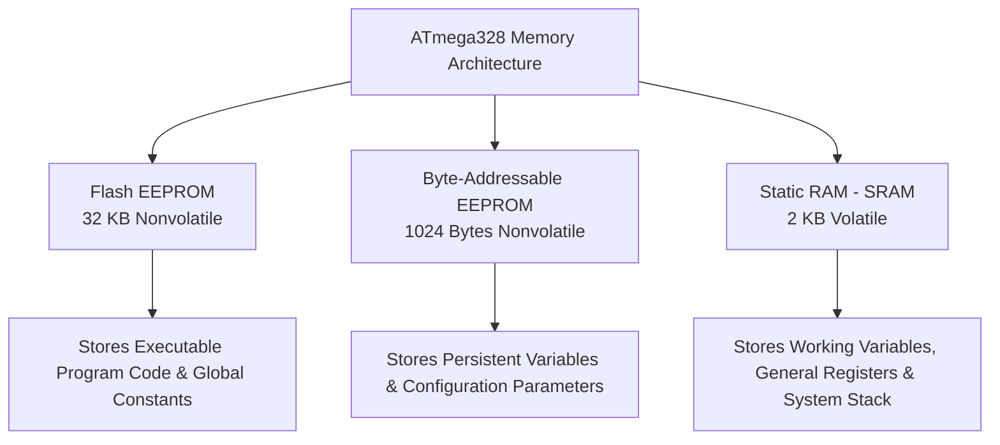
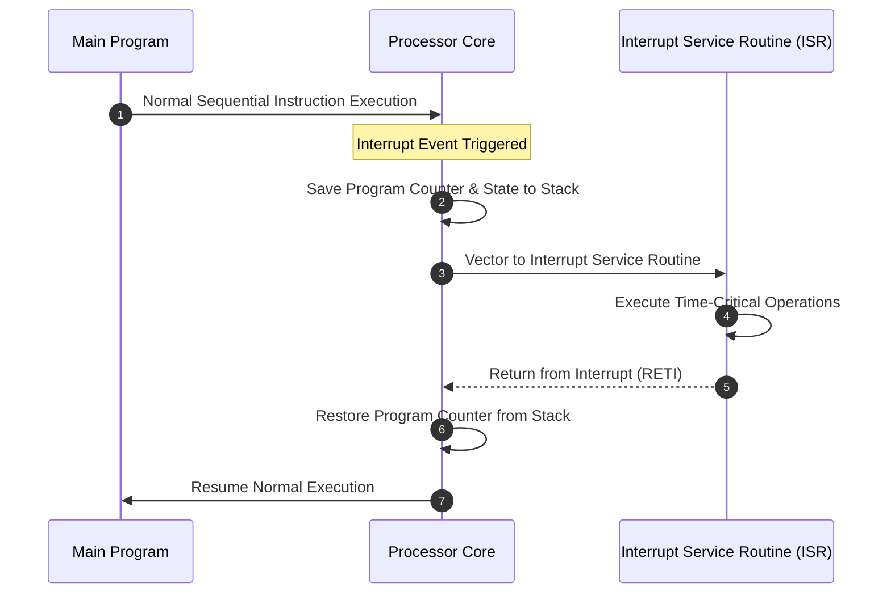
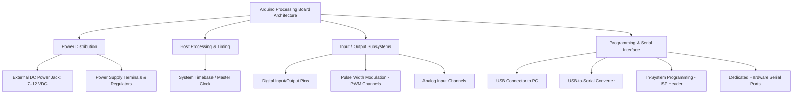
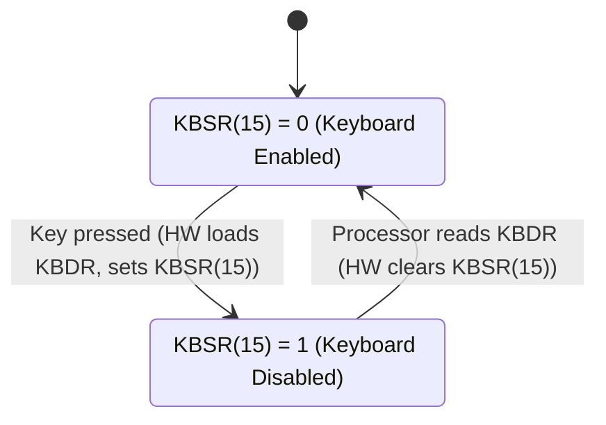
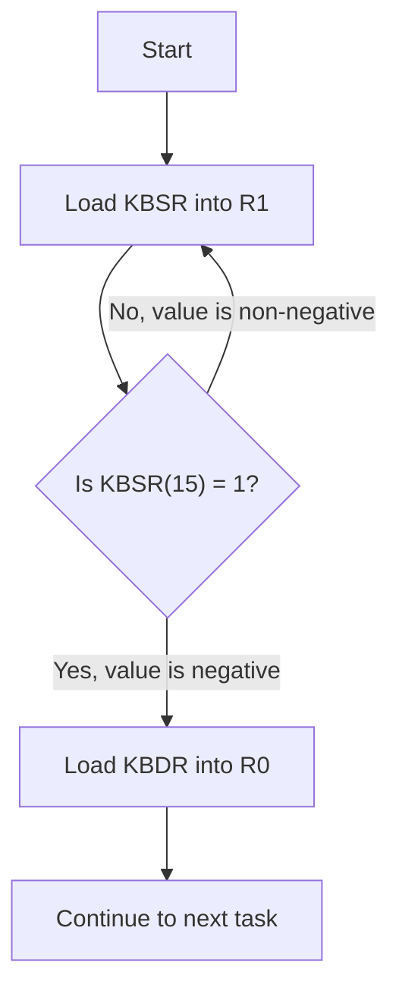

---
tags:
  - CCT3
  - indlejrede_systemer
Topic: "ATmega328 Architecture & Arduino Hardware Systems, Arduino UNO & Mega Hardware Platforms, LC-3 I/O Architecture: Privilege, Priority, and Memory-Mapped I/O, Computer I/O Fundamentals: Polling, Status Registers, and Device Synchronization"
Semester: CCT3
Course: Programmering af indlejrede systemer
Litterature:
  - "Arduino I: Getting Started"
  - "Introduction to Computing Systems: From Bits & Gates to C/C++ & Beyond, 3rd edition"
Created: 13-09-2026
---
# Table of Contents

1. [[#Arduino UNO R3 / ATmega328 Architecture & LC-3 I/O Systems|Arduino UNO R3 / ATmega328 Architecture & LC-3 I/O Systems]]
	1. [[#Arduino UNO R3 / ATmega328 Architecture & LC-3 I/O Systems#Quick Reference|Quick Reference]]
2. [[#PART I — Arduino UNO R3 & ATmega328 Microcontroller|PART I — Arduino UNO R3 & ATmega328 Microcontroller]]
	1. [[#PART I — Arduino UNO R3 & ATmega328 Microcontroller#1. ATmega328 Hardware Features|1. ATmega328 Hardware Features]]
		1. [[#1. ATmega328 Hardware Features#1.1 ATmega328 Memory|1.1 ATmega328 Memory]]
			1. [[#1.1 ATmega328 Memory#Flash EEPROM (In-System Programmable)|Flash EEPROM (In-System Programmable)]]
			2. [[#1.1 ATmega328 Memory#Byte-Addressable EEPROM|Byte-Addressable EEPROM]]
			3. [[#1.1 ATmega328 Memory#Static RAM (SRAM)|Static RAM (SRAM)]]
		2. [[#1. ATmega328 Hardware Features#1.2 ATmega328 Port System|1.2 ATmega328 Port System]]
		3. [[#1. ATmega328 Hardware Features#1.3 ATmega328 Internal Systems|1.3 ATmega328 Internal Systems]]
			1. [[#1.3 ATmega328 Internal Systems#Time Base|Time Base]]
			2. [[#1.3 ATmega328 Internal Systems#Timing Subsystem (Timers & PWM)|Timing Subsystem (Timers & PWM)]]
			3. [[#1.3 ATmega328 Internal Systems#Serial Communications|Serial Communications]]
			4. [[#1.3 ATmega328 Internal Systems#Analog-to-Digital Converter (ADC)|Analog-to-Digital Converter (ADC)]]
			5. [[#1.3 ATmega328 Internal Systems#Interrupts|Interrupts]]
	2. [[#PART I — Arduino UNO R3 & ATmega328 Microcontroller#2. Arduino UNO R3 Open Source Schematic|2. Arduino UNO R3 Open Source Schematic]]
	3. [[#PART I — Arduino UNO R3 & ATmega328 Microcontroller#3. Arduino Mega 2560 R3 Processing Board|3. Arduino Mega 2560 R3 Processing Board]]
3. [[#PART II — LC-3 Input/Output Systems|PART II — LC-3 Input/Output Systems]]
	1. [[#PART II — LC-3 Input/Output Systems#4. LC-3 I/O Fundamentals|4. LC-3 I/O Fundamentals]]
		1. [[#4. LC-3 I/O Fundamentals#4.1 Privilege, Priority, and Memory Address Space|4.1 Privilege, Priority, and Memory Address Space]]
			1. [[#4.1 Privilege, Priority, and Memory Address Space#Privilege|Privilege]]
			2. [[#4.1 Privilege, Priority, and Memory Address Space#Priority|Priority]]
			3. [[#4.1 Privilege, Priority, and Memory Address Space#Orthogonality of Privilege and Priority|Orthogonality of Privilege and Priority]]
			4. [[#4.1 Privilege, Priority, and Memory Address Space#The Processor Status Register (PSR)|The Processor Status Register (PSR)]]
		2. [[#4. LC-3 I/O Fundamentals#4.2 Organization of Memory|4.2 Organization of Memory]]
		3. [[#4. LC-3 I/O Fundamentals#4.3 I/O Device Fundamentals|4.3 I/O Device Fundamentals]]
			1. [[#4.3 I/O Device Fundamentals#Memory-Mapped I/O vs. Special I/O Instructions|Memory-Mapped I/O vs. Special I/O Instructions]]
			2. [[#4.3 I/O Device Fundamentals#Asynchronous vs. Synchronous I/O|Asynchronous vs. Synchronous I/O]]
			3. [[#4.3 I/O Device Fundamentals#Interrupt-Driven vs. Polling|Interrupt-Driven vs. Polling]]
		4. [[#4. LC-3 I/O Fundamentals#4.4 Input from the Keyboard|4.4 Input from the Keyboard]]
			1. [[#4.4 Input from the Keyboard#Keyboard Device Registers|Keyboard Device Registers]]
			2. [[#4.4 Input from the Keyboard#Polling-Based Input Routine|Polling-Based Input Routine]]
			3. [[#4.4 Input from the Keyboard#Polling Loop Flowchart|Polling Loop Flowchart]]
			4. [[#4.4 Input from the Keyboard#Memory-Mapped Input Data Path|Memory-Mapped Input Data Path]]
		5. [[#4. LC-3 I/O Fundamentals#4.5 Output to the Monitor|4.5 Output to the Monitor]]
			1. [[#4.5 Output to the Monitor#Monitor Device Registers|Monitor Device Registers]]
			2. [[#4.5 Output to the Monitor#Polling-Based Output Routine|Polling-Based Output Routine]]
			3. [[#4.5 Output to the Monitor#Memory-Mapped Output Data Path|Memory-Mapped Output Data Path]]
			4. [[#4.5 Output to the Monitor#Combined Example: Keyboard Echo|Combined Example: Keyboard Echo]]
		6. [[#4. LC-3 I/O Fundamentals#4.6 A More Sophisticated Input Routine|4.6 A More Sophisticated Input Routine]]
		7. [[#4. LC-3 I/O Fundamentals#4.7 Memory-Mapped I/O Data Path (Complete)|4.7 Memory-Mapped I/O Data Path (Complete)]]
		8. [[#4. LC-3 I/O Fundamentals#4.8 Comparison: ATmega328 vs. LC-3 I/O Philosophies|4.8 Comparison: ATmega328 vs. LC-3 I/O Philosophies]]

# Arduino UNO R3 / ATmega328 Architecture & LC-3 I/O Systems

---

## Quick Reference

| Concept / Register / Symbol | Address / Value | Description |
|---|---|---|
| **ATmega328** | — | $8\text{-bit}$ RISC microcontroller, $28\text{-pin}$, up to $20\text{ MIPS}$ @ $20\text{ MHz}$ |
| **Flash EEPROM** | $32\text{ KB}$ ($16\text{K} \times 16\text{-bit}$) | Nonvolatile; stores program code and global constants |
| **Byte EEPROM** | $1\text{ KB}$ ($1024\text{ B}$) | Nonvolatile; byte-addressable persistent data storage |
| **SRAM** | $2\text{ KB}$ | Volatile; registers, global variables, stack |
| **PORTB / PORTC / PORTD** | — | $8\text{-bit}$ / $7\text{-bit}$ / $8\text{-bit}$ general-purpose digital I/O ports |
| `DDRx` | — | Data Direction Register ($0$ = input, $1$ = output) |
| `PORTx` | — | Data Register (output level or pull-up enable) |
| `PINx` | — | Input Pins Address Register (read physical pin state) |
| **PWM** | — | Pulse Width Modulation via internal timers |
| **ADC** | $10\text{-bit}$, $0\text{–}5\text{ V}$ | Analog-to-Digital Converter, $1024$ quantization levels |
| **USART / SPI / TWI** | — | Serial communication subsystems |
| **KBSR** | $\text{xFE00}$ | Keyboard Status Register (bit $[15]$ = ready) |
| **KBDR** | $\text{xFE02}$ | Keyboard Data Register (bits $[7:0]$ = ASCII) |
| **DSR** | $\text{xFE04}$ | Display Status Register (bit $[15]$ = ready) |
| **DDR** | $\text{xFE06}$ | Display Data Register (bits $[7:0]$ = ASCII) |
| **PSR** | $\text{xFFFC}$ | Processor Status Register (privilege, priority, condition codes) |
| **MCR** | $\text{xFFFE}$ | Master Control Register |
| **System Space** | $\text{x0000}\text{–}\text{x2FFF}$ | Supervisor-only OS code and data |
| **User Space** | $\text{x3000}\text{–}\text{xFDFF}$ | User programs and data |
| **I/O Page** | $\text{xFE00}\text{–}\text{xFFFF}$ | Memory-mapped device and processor registers |
| `MIO.EN` | — | Memory/I/O Enable control signal |
| `R.W` | — | Read/Write direction control signal |
| $\Delta V$ | — | ADC voltage resolution per quantization step |
| $t_{\text{on}}$ | — | PWM active (logic-high) duration within one period |
| $T$ | — | Total waveform period; $T = \frac{1}{f}$ |
| **Orthogonal** | — | Independent axes; one property does not imply or constrain the other |

---

# PART I — Arduino UNO R3 & ATmega328 Microcontroller

---

## 1. ATmega328 Hardware Features

The host processor for the Arduino UNO R3 is the Microchip **ATmega328**, a $28\text{-pin}$, $8\text{-bit}$ microcontroller built on a **Reduced Instruction Set Computer (RISC)** architecture. It achieves an execution throughput of up to $20\text{ MIPS}$ at a $20\text{ MHz}$ clock frequency.

![[Pasted image 20260913175350.png]]

_Figure 1.1: ATmega328 microcontroller overview showing the $28\text{-pin}$ package and major subsystem block diagram._

> [!info] Core ATmega328 Subsystems
> - **Memory System:** $32\text{ KB}$ Flash, $1\text{ KB}$ EEPROM, $2\text{ KB}$ SRAM.
> - **Port System:** $14$ digital I/O pins ($6$ support PWM) and $6$ analog input pins across three general-purpose ports.
> - **Timer System:** Two $8\text{-bit}$ timer/counters, one $16\text{-bit}$ timer/counter, and PWM output channels.
> - **ADC:** $10\text{-bit}$ resolution with up to $8$ multiplexed channels.
> - **Interrupt System:** $26$ total interrupt sources ($2$ external, $24$ internal).
> - **Serial Communications:** Hardware USART, SPI, and TWI ($\text{I}^2\text{C}$).

The integrated architecture consolidates memory management, timing generation, input/output interfacing, analog-to-digital conversion, and serial networking onto a single semiconductor die.

---

### 1.1 ATmega328 Memory

The ATmega328 contains three distinct internal memory sections, each optimized for specific data retention and access requirements.



_Figure 1.2: Hierarchical overview of the three ATmega328 memory types and their primary functions._

![[Pasted image 20260913175441.png]]

_Figure 1.3: Detailed memory map showing the address allocation for Flash, EEPROM, and SRAM regions._

#### Flash EEPROM (In-System Programmable)

Flash EEPROM is dedicated to storing executable program instructions. It is **reprogrammable** and **nonvolatile** — contents persist when power is removed.

- **Capacity:** $32\text{ KB}$, organized as $16\text{K} \times 16\text{-bits}$ ($16{,}384$ locations of $16\text{-bit}$ word length).
- **Usage:** Stores the compiled program binary and large constant tables declared as global variables.
- **Access:** Programmed and erased in bulk units during device programming via [[In-System Programming (ISP)]].

#### Byte-Addressable EEPROM

Provides nonvolatile storage that can be read and written **byte-by-byte** during normal program execution, unlike Flash which requires bulk operations.

- **Capacity:** $1024$ bytes ($1\text{ KB}$).
- **Function:** Retains critical data across power cycles that must be updated occasionally at runtime.

> [!example] Common EEPROM Applications
> - Logging system malfunctions and fault data
> - Storing calibration parameters and system configuration
> - Electronic lock combinations
> - Garage door opener security sequences

#### Static RAM (SRAM)

SRAM is **volatile** memory used for high-speed dynamic data handling. All contents are lost when power is removed.

- **Capacity:** $2\text{ KB}$.
- **Allocation:**
  - **General-Purpose & I/O Registers:** Memory-mapped locations linked to the processor's core registers and peripheral control registers via a standard header file.
  - **Dynamic Storage:** Global variables, dynamically allocated variables, and the system execution stack (function calls and return addresses).

![[Pasted image 20260913175527.png]]

_Figure 1.4: SRAM internal layout showing the division between register file, I/O registers, and general-purpose data/stack space._

---

### 1.2 ATmega328 Port System

The ATmega328 provides general-purpose digital I/O organized into three ports:

- `PORTB`: $8\text{-bit}$ port (`PORTB[7:0]`)
- `PORTC`: $7\text{-bit}$ port (`PORTC[6:0]`)
- `PORTD`: $8\text{-bit}$ port (`PORTD[7:0]`)

Each port is controlled by three dedicated $8\text{-bit}$ registers:

| Register | Name | Function |
|---|---|---|
| `PORTx` | Data Register | Writes output logic levels; enables/disables internal pull-up resistors on inputs |
| `DDRx` | Data Direction Register | Configures each pin as input ($0$) or output ($1$) |
| `PINx` | Input Pins Address | Reads the current digital state of the physical pins |

_Table 1.1: Summary of the three control registers governing each digital I/O port._

> [!info] Port Configuration Truth Table
> The combination of `DDRx` and `PORTx` bits determines the electrical behavior of each pin.

| `DDxn` | `PORTxn` | I/O State | Pin Mode | Pull-Up |
| :---: | :---: | :---: | :--- | :---: |
| $0$ | $0$ | Input | Tri-state (High-Impedance / Hi-Z) | Disabled |
| $0$ | $1$ | Input | Source current when driven low | Enabled |
| $1$ | $0$ | Output | Output Low (Current Sink) | Disabled |
| $1$ | $1$ | Output | Output High (Current Source) | Disabled |

_Table 1.2: Port pin configuration based on Data Direction and Data Register bit combinations. `x` = port letter (B, C, D); `n` = bit index ($0$–$7$)._

![[Pasted image 20260913175554.png]]

_Figure 1.5: Internal schematic of a single port pin showing the DDR, PORT, and PIN register connections to the output driver and input buffer._

> [!tip] Port Initialization Practice
> Port direction registers (`DDRx`) and initial logic states (`PORTx`) are typically configured during the setup phase at the beginning of a program, setting all eight bits of a given port simultaneously.

> [!warning] Common Port Configuration Pitfall
> **Always configure `DDRx` before writing to `PORTx` for output operations.** If `DDRx` is left at its default ($0$ = input), writes to `PORTx` will merely toggle the internal pull-up resistor instead of driving the pin to the desired logic level. This is a frequent source of "why won't my LED light up?" bugs in Arduino projects.

---

### 1.3 ATmega328 Internal Systems

#### Time Base

The ATmega328 operates as a **synchronous finite state machine**, executing instructions through a standard _fetch-decode-execute_ cycle driven by an internal master clock.

Clock sources (in order of increasing frequency stability):

1. **Internal RC Oscillator** — selectable fixed frequencies via on-chip fuse bits.
2. **External RC Network** — moderate stability.
3. **Ceramic Resonator** — good stability.
4. **Quartz Crystal Oscillator** — highest stability and accuracy.

> [!important] Clock Source Selection
> When interfacing with external peripheral devices or timing-sensitive communication buses (e.g., USART, SPI), always select a high-stability source such as a **ceramic resonator** or **crystal oscillator**.

#### Timing Subsystem (Timers & PWM)

Specialized hardware counters generate precision waveforms, measure signal parameters (frequency, period, duty cycle), and track external events:

- Two $8\text{-bit}$ Timer/Counters
- One $16\text{-bit}$ Timer/Counter

**Pulse Width Modulation (PWM)** maintains a constant frequency while varying the proportion of time the signal stays logic-high during each period.

> [!summary] Theorem: PWM Duty Cycle
> $$\text{Duty Cycle (\%)} = \left( \frac{t_{\text{on}}}{T} \right) \times 100\%$$
>
> **Breakdown:**
> - $\text{Duty Cycle (\%)}$ : The percentage of one complete cycle during which the output is driven logic-high.
> - $t_{\text{on}}$ : The active on-time duration (logic-high state) within a single cycle.
> - $T$ : The total waveform period, where $T = t_{\text{on}} + t_{\text{off}} = \frac{1}{f}$ and $f$ is the waveform frequency.
> - $100\%$ : Scaling factor converting the fractional ratio to a percentage.

> [!example] Worked Example — PWM Duty Cycle Calculation
> Suppose a PWM signal has an on-time of $t_{\text{on}} = 2\text{ ms}$ and a total period of $T = 10\text{ ms}$.
>
> **Step 1:** Substitute into the formula:
> $$\text{Duty Cycle} = \left( \frac{2\text{ ms}}{10\text{ ms}} \right) \times 100\%$$
>
> **Step 2:** Simplify:
> $$\text{Duty Cycle} = 0.2 \times 100\% = 20\%$$
>
> **Interpretation:** The signal is logic-high for $20\%$ of each cycle. If used to drive a DC motor, the motor receives approximately $20\%$ of full power, running at reduced speed.

Common PWM applications include [[DC Motor Speed Control]] and [[Servo Motor Position Control]].

#### Serial Communications

The ATmega328 includes three hardware serial subsystems:

| Subsystem | Type | Key Characteristics |
|---|---|---|
| **USART** | Async / Sync | Full-duplex; programmable baud rate; $5$–$9$ bit data; parity; $1$–$2$ stop bits |
| **SPI** | Synchronous | Full-duplex; shared clock; $16\text{-bit}$ shift register architecture ($8\text{-bit}$ master + $8\text{-bit}$ slave) |
| **TWI** ($\text{I}^2\text{C}$) | Synchronous | Multidrop two-wire bus; up to $128$ addressable devices; up to $400\text{ kHz}$ |

_Table 1.3: Comparison of the three hardware serial communication subsystems available on the ATmega328._

#### Analog-to-Digital Converter (ADC)

The integrated ADC digitizes continuous analog voltages into quantized digital integers.

- **Resolution:** $10\text{-bit}$ ($2^{10} = 1024$ quantization levels), mapping $0\text{ V}$ to $5\text{ V}$ as integers $0_{10}$ to $1023_{10}$.

> [!summary] Theorem: ADC Voltage Resolution
> $$\Delta V = \frac{V_{\text{ref}}}{2^n} = \frac{5.0\text{ V}}{1024} \approx 4.88\text{ mV/step}$$
>
> **Breakdown:**
> - $\Delta V$ : The voltage resolution — the smallest distinguishable voltage difference between two adjacent digital output codes.
> - $V_{\text{ref}}$ : The reference voltage ($5.0\text{ V}$ on the Arduino UNO R3). This defines the full-scale input range.
> - $n$ : The number of ADC bits ($10$ for the ATmega328). Determines the total number of quantization levels ($2^n$).
> - $2^n$ : The total number of discrete digital output levels ($1024$ for $10\text{-bit}$).

> [!example] Worked Example — ADC Digital-to-Voltage Conversion
> Suppose the ADC returns the digital value $D = 512_{10}$. What analog voltage does this correspond to?
>
> **Step 1:** Compute the voltage per step:
> $$\Delta V = \frac{5.0\text{ V}}{1024} \approx 4.88\text{ mV}$$
>
> **Step 2:** Multiply by the digital reading:
> $$V_{\text{analog}} = D \times \Delta V = 512 \times 4.88\text{ mV} \approx 2500\text{ mV} = 2.5\text{ V}$$
>
> **Interpretation:** A reading of $512$ corresponds to approximately half the reference voltage — the midpoint of the input range, as expected since $512$ is roughly half of $1024$.

#### Interrupts

Interrupts allow the processor to respond immediately to critical asynchronous events by preempting normal execution.



_Figure 1.6: Sequence diagram illustrating the interrupt handling flow from trigger to return._

- **Total Vectors:** $26$ ($2$ external pin interrupts + $24$ internal peripheral interrupts).
- **Execution Flow:** Suspend main → save context → vector to ISR → execute → restore → resume.

> [!note] Forward Reference
> This interrupt mechanism is conceptually similar to the LC-3's interrupt-driven I/O model discussed in Part II. Both use a "save context → execute handler → restore context" pattern, though the LC-3 exposes this more explicitly through its PSR and dual-stack architecture. See Part II §4.3 for a comparison of interrupt-driven vs. polling I/O strategies.

---

## 2. Arduino UNO R3 Open Source Schematic

The Arduino platform is built on **open-source hardware and software** principles. Complete circuit schematics, design files, and source code are publicly available for inspection, modification, reproduction, and distribution.

> [!info] Open-Source Hardware Philosophy
> Open-source hardware allows users and designers to inspect, modify, reproduce, and distribute the physical board design, accelerating prototyping and custom embedded system implementations.

The complete Arduino UNO R3 schematic exposes the hardware interconnects among the ATmega328, USB communication interface, voltage regulation circuitry, and I/O headers.

---

## 3. Arduino Mega 2560 R3 Processing Board

The Arduino Mega 2560 R3 expands upon standard microcontroller boards with a broader complement of I/O interfaces, communication buses, and hardware subsystems.



_Figure 3.1: High-level block diagram of the Arduino Mega 2560 R3 board architecture._

**Key Hardware Subsystems:**

- **Power Management:** External DC barrel jack ($7\text{–}12\text{ VDC}$); regulated rails at $5\text{ V}$, $3.3\text{ V}$, and $\text{GND}$.
- **Microcontroller Core:** Dedicated clock circuitry for synchronous instruction execution and peripheral timing.
- **I/O Interfacing:** High-density digital headers, PWM output channels, and multi-channel analog inputs.
- **Communication & Programming:** USB-to-Serial converter, ISP header, and multi-channel hardware USART ports.

---

---

# PART II — LC-3 Input/Output Systems

---

## 4. LC-3 I/O Fundamentals

Up to this point, I/O has been abstracted through the `TRAP` instruction (e.g., `TRAP x23` for input, `TRAP x21` for output), which delegates work to the operating system via a *trap vector*. The generic term for this mechanism is a **system call** — the program requests an OS service without knowing how it is implemented.

This section examines how I/O actually works in the LC-3, what happens during a system call, and how the operating system orchestrates the process.

> [!abstract] Conceptual Bridge from Part I
> Where Part I described dedicated hardware peripheral subsystems (ADC, USART, PWM) that operate largely autonomously alongside the ATmega328 core, Part II describes how a simpler processor (the LC-3) achieves the same I/O functionality by mapping device registers directly into the memory address space. See §4.8 for a direct comparison of the two philosophies.

---

### 4.1 Privilege, Priority, and Memory Address Space

#### Privilege

Privilege concerns the **right** to perform certain actions (executing instructions, accessing memory). Not all programs have equal rights.

- **Supervisor mode** (privileged): Full access to all instructions and all memory.
- **User mode** (unprivileged): Restricted from executing certain instructions and accessing protected memory.

If a User-mode program attempts a Supervisor-only action, the hardware blocks it.

> [!example] Why Privilege Matters
> On a shared multi-user system, allowing any arbitrary program to execute `HALT` would stop the entire computer for all users. Similarly, unauthorized access to OS memory regions could crash the system.

#### Priority

Priority concerns the **urgency** of a program's need to execute. Every program is assigned a priority level that determines its urgency relative to all other programs. Higher-priority programs can interrupt lower-priority ones.

> [!example] Priority Assignment
> - User program → Priority $0$ (lowest urgency)
> - Keyboard input → Priority $4$ (user wants to type *now*)
> - Power failure → Priority $6$ (must save state immediately)

#### Orthogonality of Privilege and Priority

Privilege and priority are **completely independent** concepts.

> [!info] What Does "Orthogonal" Mean?
> In this context, **orthogonal** means the two properties operate on independent axes — the value of one places no constraint on the value of the other. A program's privilege level tells you nothing about its priority, and vice versa. This is analogous to how a point's $x$-coordinate is independent of its $y$-coordinate on a graph.

> [!example] High Priority, No Privilege
> A time-critical physics experiment program must interrupt the processor at a precise instant to record data. It has **high priority** (extreme urgency) but **no supervisor privilege** (still a user program).

> [!example] High Privilege, No Priority
> A system administrator's diagnostic program needs full memory access for maintenance. It requires **supervisor privilege** but has **no urgency** — it can run at any time.

#### The Processor Status Register (PSR)

The PSR encodes privilege, priority, and condition codes for the currently executing program.

| Bit(s) | Field | Description |
| :---: | :--- | :--- |
| $[15]$ | **Pr** (Privilege) | $0$ = Supervisor; $1$ = User |
| $[14:11]$ | Unused | — |
| $[10:8]$ | **PL** (Priority Level) | $\text{PL0}$ (lowest) to $\text{PL7}$ (highest) |
| $[7:3]$ | Unused | — |
| $[2]$ | **N** | Condition code: Negative |
| $[1]$ | **Z** | Condition code: Zero |
| $[0]$ | **P** | Condition code: Positive |

_Table 4.1: Bit-field layout of the $16\text{-bit}$ Processor Status Register (PSR)._

![[Pasted image 20260913175710.png]]

_Figure 4.1: Visual representation of the PSR register showing the privilege bit, priority level field, and condition code flags._

> [!info] Key Takeaway
> The PSR consolidates the privilege bit, $3\text{-bit}$ priority level, and three condition code flags (`N`, `Z`, `P`) into a single $16\text{-bit}$ hardware register. Condition codes are stored here so they can be saved and restored during context switches (e.g., interrupt handling). See [[LC-3 Branch Instruction]] for how these flags drive conditional branches.

---

### 4.2 Organization of Memory

The LC-3 has a $16\text{-bit}$ address space ($\text{x0000}\text{–}\text{xFFFF}$) divided into three regions:

| Address Range | Region | Privilege Required | Purpose |
| :--- | :--- | :--- | :--- |
| $\text{x0000}\text{–}\text{x2FFF}$ | **System Space** | Supervisor | OS code and data structures |
| $\text{x3000}\text{–}\text{xFDFF}$ | **User Space** | None | User programs and data |
| $\text{xFE00}\text{–}\text{xFFFF}$ | **I/O Page** | Supervisor | Memory-mapped I/O device registers and special processor registers |

_Table 4.2: LC-3 memory address space layout showing the three distinct regions and their access requirements._

> [!info] The I/O Page
> Addresses $\text{xFE00}\text{–}\text{xFFFF}$ do **not** correspond to physical memory locations. Instead, they identify hardware registers for I/O operations and special processor registers. For example, the PSR is mapped to $\text{xFFFC}$ and the MCR to $\text{xFFFE}$. This mapping allows the processor to use standard load/store instructions to interact with hardware.

**Stack Architecture:** The LC-3 maintains two separate stacks:
- **Supervisor Stack:** In system space; requires supervisor privilege.
- **User Stack:** In user space; no privilege required.

![[Pasted image 20260913175741.png]]

_Figure 4.2: LC-3 memory map showing System Space, User Space, and the I/O Page, along with the dual-stack architecture._

Each stack has its own pointer — the **Supervisor Stack Pointer (SSP)** and the **User Stack Pointer (USP)**. Register `R6` serves as the active stack pointer. Two hardware registers (**Saved SSP** and **Saved USP**) hold the inactive pointer. During a privilege transition, the current SP is saved and the other is loaded.

---

### 4.3 I/O Device Fundamentals

All I/O devices communicate with the processor through **device registers**. At minimum, every device requires:

1. A **data register** — holds the information being transferred.
2. A **status register** — indicates the device's current state (ready or busy).

#### Memory-Mapped I/O vs. Special I/O Instructions

| Approach | Mechanism | Example |
|---|---|---|
| **Special I/O Instructions** | Dedicated opcodes for I/O; remaining bits identify the device | Older architectures |
| **Memory-Mapped I/O** | Device registers assigned addresses in the memory space; standard load/store instructions used | LC-3, most modern systems |

_Table 4.3: Comparison of the two historical approaches to I/O instruction design._

> [!info] Memory-Mapped I/O in the LC-3
> Addresses $\text{x0000}\text{–}\text{xFDFF}$ are physical memory. Addresses $\text{xFE00}\text{–}\text{xFFFF}$ are I/O device registers. Standard `LD`, `LDI`, `LDR`, `ST`, `STI`, and `STR` instructions interact with I/O hardware by targeting the appropriate address.

#### Asynchronous vs. Synchronous I/O

I/O devices operate at speeds vastly different from the processor — this mismatch is **asynchronous** operation.

> [!example] Speed Disparity
> A $2\text{ GHz}$ processor has a $0.5\text{ ns}$ clock cycle. Even if reading an input register takes $10$ cycles ($5\text{ ns}$), a human typist produces $\sim 10$ characters/second. The processor could read the keyboard register $\sim 2 \times 10^{8}$ times per second while waiting.

A **handshaking protocol** using a single-bit **ready flag** in the status register synchronizes the two:
- **Input (keyboard):** Ready bit $= 1$ when a new character is available. Processor reads it and clears the bit.
- **Output (monitor):** Ready bit $= 1$ when the monitor can accept a new character.

#### Interrupt-Driven vs. Polling

| Strategy | Who Initiates? | Pros | Cons |
|---|---|---|---|
| **Interrupt-Driven** | I/O device | Processor free to do other work; efficient CPU usage | More complex hardware and software; requires context saving |
| **Polling** | Processor | Simple to implement; deterministic timing | Wastes CPU cycles in the wait loop; poor multitasking |

_Table 4.4: Comparison of the two fundamental I/O initiation strategies._

---

### 4.4 Input from the Keyboard

#### Keyboard Device Registers

| Register | Address | Purpose |
| :--- | :--- | :--- |
| **KBSR** (Keyboard Status Register) | $\text{xFE00}$ | Bit $[15]$ = ready flag. $1$ = new character waiting; $0$ = none |
| **KBDR** (Keyboard Data Register) | $\text{xFE02}$ | Bits $[7:0]$ = $8\text{-bit}$ ASCII code of the most recent keystroke |

_Table 4.5: LC-3 keyboard memory-mapped device registers._

![[Pasted image 20260913175815.png]]

_Figure 4.3: Internal structure of the KBSR and KBDR registers showing the ready bit and ASCII data fields._

**Synchronization behavior:**
1. Key pressed → hardware loads ASCII into `KBDR[7:0]` and sets `KBSR[15]` $= 1$.
2. While `KBSR[15]` $= 1$, the keyboard is **disabled** (no new keystrokes accepted).
3. Processor reads `KBDR` → hardware automatically clears `KBSR[15]` $= 0$, re-enabling the keyboard.

This guarantees each keystroke is captured **exactly once**.



_Figure 4.4: State diagram of the KBSR/KBDR handshaking protocol showing the ready-bit lifecycle._

> [!warning] Common Input Pitfall
> **Never read `KBDR` without first confirming `KBSR[15]` $= 1$.** Reading `KBDR` when no new character is available returns stale data from the previous keystroke, which can cause characters to appear duplicated in the program's input stream.

#### Polling-Based Input Routine

> [!example] Example — Polling-Based Keyboard Input
> This routine loops until a character is available, then loads it into `R0`.
>
> ```asm
> ; Polling-based keyboard input routine
> ; Loads the typed ASCII character into R0
> 
> START   LDI R1, KBSR_ADDR   ; Load KBSR contents into R1
>         BRzp START           ; If bit [15] is 0, no character yet — loop
>         LDI R0, KBDR_ADDR   ; Character is ready — load from KBDR into R0
>         BRnzp NEXT_TASK      ; Proceed to next task
> 
> KBSR_ADDR  .FILL xFE00       ; Memory-mapped address of KBSR
> KBDR_ADDR  .FILL xFE02       ; Memory-mapped address of KBDR
> ```
>
> **How `BRzp` works here:** The `LDI` instruction performs an indirect load — it reads the address stored at the label (e.g., $\text{xFE00}$), then loads the contents of *that* address (the actual KBSR register) into `R1`. Because bit $[15]$ is the **sign bit** in two's complement, $\text{KBSR}[15] = 1$ makes the loaded value **negative** (setting the `N` flag), while $\text{KBSR}[15] = 0$ leaves the value non-negative (setting `Z` or `P`). `BRzp` branches back to `START` only when the value is zero or positive — i.e., when no character is ready.

#### Polling Loop Flowchart



_Figure 4.5: Flowchart of the polling loop logic corresponding to the assembly routine above._

#### Memory-Mapped Input Data Path

1. **MAR** loaded with the device register address.
2. **Address control logic** detects the I/O page range and selects the device register to drive data onto the bus.
3. **MDR** loaded with the device register's contents.
4. Destination general-purpose register loaded from MDR.

![[Pasted image 20260913175857.png]]

_Figure 4.6: Data path for memory-mapped input showing the MDR input multiplexer selecting between memory and I/O device register output._

---

### 4.5 Output to the Monitor

#### Monitor Device Registers

| Register | Address | Purpose |
| :--- | :--- | :--- |
| **DSR** (Display Status Register) | $\text{xFE04}$ | Bit $[15]$ = ready flag. $1$ = ready for new character; $0$ = busy |
| **DDR** (Display Data Register) | $\text{xFE06}$ | Bits $[7:0]$ = $8\text{-bit}$ ASCII code to display |

_Table 4.6: LC-3 monitor memory-mapped device registers._

**Synchronization behavior:**
1. Processor writes ASCII to `DDR[7:0]` → hardware clears `DSR[15]` $= 0$ (monitor busy).
2. While `DSR[15]` $= 0$, the monitor cannot accept new characters.
3. Monitor finishes displaying → hardware sets `DSR[15]` $= 1$ (ready).

#### Polling-Based Output Routine

> [!example] Example — Polling-Based Monitor Output
> This routine waits for the monitor to be ready, then writes the character in `R0`.
>
> ```asm
> ; Polling-based monitor output routine
> ; Displays the ASCII character stored in R0
> 
> START   LDI R1, DSR_ADDR    ; Load DSR contents into R1
>         BRzp START           ; If bit [15] is 0, monitor busy — loop
>         STI R0, DDR_ADDR    ; Monitor ready — store R0 into DDR
>         BRnzp NEXT_TASK      ; Proceed to next task
> 
> DSR_ADDR   .FILL xFE04       ; Memory-mapped address of DSR
> DDR_ADDR   .FILL xFE06       ; Memory-mapped address of DDR
> ```

#### Memory-Mapped Output Data Path

1. **MAR** loaded with the device register address.
2. **MDR** loaded with the data to write.
3. **Address control logic** detects the I/O page address and asserts the load-enable signal of the target device register.

![[Pasted image 20260913180028.png]]

_Figure 4.7: Data path for memory-mapped output showing the address control logic routing MDR contents to the target device register._

#### Combined Example: Keyboard Echo

> [!example] Example — Keyboard Echo Program
> Combines input and output routines — waits for a keystroke, reads it, waits for the monitor, and displays the character.
>
> ```asm
> ; Keyboard echo: reads a character and displays it
> 
> START   LDI R1, KBSR_ADDR   ; Poll keyboard status
>         BRzp START           ; Wait for a keystroke
>         LDI R0, KBDR_ADDR   ; Read the typed character
> 
> ECHO    LDI R1, DSR_ADDR    ; Poll display status
>         BRzp ECHO            ; Wait for monitor to be ready
>         STI R0, DDR_ADDR    ; Echo the character to the screen
>         BRnzp NEXT_TASK
> 
> KBSR_ADDR  .FILL xFE00
> KBDR_ADDR  .FILL xFE02
> DSR_ADDR   .FILL xFE04
> DDR_ADDR   .FILL xFE06
> ```

---

### 4.6 A More Sophisticated Input Routine

A bare polling loop provides no user feedback. A more user-friendly approach includes a **prompt** — a message telling the user that input is expected.

**Sequence of operations:**
1. Save registers (`R1`, `R2`, `R3`).
2. Output a newline character (ASCII $\text{x0A}$).
3. Output a prompt string character-by-character, polling `DSR[15]` before each.
4. Poll for keyboard input, read from `KBDR`, echo to monitor.
5. Output a trailing newline.
6. Restore saved registers and branch to next task.

> [!example] Example — Sophisticated Input Routine with Prompt & Echo
>
> ```asm
> ; Sophisticated input routine with prompt and echo
> 
> START   ST  R1, SaveR1      ; Save registers needed
>         ST  R2, SaveR2      ; by this routine
>         ST  R3, SaveR3
> 
>         LD  R2, Newline
> L1      LDI R3, DSR
>         BRzp L1              ; Loop until monitor is ready
>         STI R2, DDR          ; Move cursor to new clean line
> 
>         LEA R1, Prompt       ; Starting address of prompt string
> Loop    LDR R0, R1, #0      ; Load next prompt character
>         BRz Input            ; Null terminator — end of prompt
> L2      LDI R3, DSR
>         BRzp L2              ; Loop until monitor is ready
>         STI R0, DDR          ; Write next prompt character
>         ADD R1, R1, #1       ; Increment prompt pointer
>         BRnzp Loop           ; Get next prompt character
> 
> Input   LDI R3, KBSR
>         BRzp Input           ; Poll until a character is typed
>         LDI R0, KBDR         ; Load input character into R0
> L3      LDI R3, DSR
>         BRzp L3              ; Loop until monitor is ready
>         STI R0, DDR          ; Echo input character
> 
> L4      LDI R3, DSR
>         BRzp L4              ; Loop until monitor is ready
>         STI R2, DDR          ; Move cursor to new clean line
> 
>         LD  R1, SaveR1       ; Restore registers
>         LD  R2, SaveR2       ; to original values
>         LD  R3, SaveR3
>         BRnzp NEXT_TASK      ; Do the program's next task
> 
> ; --- Data ---
> SaveR1  .BLKW 1
> SaveR2  .BLKW 1
> SaveR3  .BLKW 1
> DSR     .FILL xFE04
> DDR     .FILL xFE06
> KBSR    .FILL xFE00
> KBDR    .FILL xFE02
> Newline .FILL x000A          ; ASCII code for newline
> Prompt  .STRINGZ "Input a character>"
> ```

> [!tip] Control Characters
> Not all ASCII codes produce visible characters. **Control characters** trigger actions — e.g., ASCII $\text{x0A}$ (Newline) moves the cursor to the next line. The `.STRINGZ` pseudo-op appends a null terminator ($\text{x0000}$) to mark the end of the string. The output loop checks for this null terminator via `BRz`.

---

### 4.7 Memory-Mapped I/O Data Path (Complete)

The complete data path integrates input and output through a unified **Address Control Logic** block driven by three control signals:

| Signal | Function |
| :--- | :--- |
| **MIO.EN** | Memory/I/O Enable. $1$ = data transfer occurring this cycle; $0$ = no transfer |
| **MAR** | Target address. Decoded to determine memory vs. specific I/O device register |
| **R.W** | Read/Write direction. Controls data flow into or out of the MDR |

_Table 4.7: Control signals governing the memory-mapped I/O data path._

- **Read (Load):** Address control logic configures the input multiplexer to route data from memory or the appropriate I/O device register into the MDR.
- **Write (Store):** Address control logic either enables a memory write or asserts the load-enable line of the target device register.

![[Pasted image 20260913180150.png]]

_Figure 4.8: Complete data path implementation of memory-mapped I/O showing the Address Control Logic, MIO.EN, MAR, and R.W signal routing._

> [!note] Writeable Status Registers
> While basic polling only requires reading status registers, supporting **interrupt-driven I/O** requires that status registers (like `KBSR` and `DSR`) be writeable as well, so the operating system can manipulate the ready bits during interrupt handling.

---

### 4.8 Comparison: ATmega328 vs. LC-3 I/O Philosophies

Both architectures perform I/O, but through fundamentally different mechanisms.

| Aspect | ATmega328 (Part I) | LC-3 (Part II) |
|---|---|---|
| **I/O Access Method** | Dedicated peripheral registers accessed via memory-mapped names (`PORTB`, `KBDR` analogs) | Fully memory-mapped I/O in a reserved page ($\text{xFE00}\text{–}\text{xFFFF}$) |
| **Dedicated Peripherals** | ADC, PWM, USART, SPI, TWI — all built in | None; I/O handled externally via memory-mapped registers |
| **Instructions Used for I/O** | Standard load/store (no special I/O opcodes) | Standard `LD`/`ST` family (no special I/O opcodes) |
| **Privilege Model** | Simple (no user/supervisor distinction) | Two-mode: Supervisor and User, enforced by PSR bit $[15]$ |
| **Interrupt System** | $26$ vectors, hardware-triggered | Priority-based ($\text{PL0}\text{–}\text{PL7}$), PSR-managed |
| **Typical Use Case** | Embedded control (sensors, motors, real-time) | Teaching architecture; general-purpose computation |

_Table 4.8: Side-by-side comparison of the two architectures' approaches to I/O._

The ATmega328 offloads I/O complexity to dedicated hardware subsystems that the CPU merely configures; the LC-3 requires the CPU to explicitly manage every I/O interaction via polling or interrupt handling. Both, however, ultimately rely on the same core idea: **device registers accessed through the memory address space**.

---

>[!summary] Summary
> **Part I — ATmega328 / Arduino UNO R3:**
> - The ATmega328 is an $8\text{-bit}$ RISC microcontroller with $32\text{ KB}$ Flash, $1\text{ KB}$ EEPROM, $2\text{ KB}$ SRAM, three I/O ports (B/C/D), timers with PWM, a $10\text{-bit}$ ADC, and USART/SPI/TWI serial interfaces.
> - Port pins are configured via `DDRx` (direction) and `PORTx` (output/pull-up) registers, with `PINx` reading physical state. Forgetting to set `DDRx` before writing to `PORTx` is a common bug.
> - PWM duty cycle is defined as $\frac{t_{\text{on}}}{T} \times 100\%$; ADC resolution is $\frac{V_{\text{ref}}}{2^n} \approx 4.88\text{ mV/step}$. Worked examples demonstrate both.
> - The Arduino Mega 2560 R3 extends these capabilities with more I/O, communication buses, and power management.
>
> **Part II — LC-3 I/O:**
> - **Privilege** (right to act) and **priority** (urgency) are orthogonal — independent — concepts encoded in the $16\text{-bit}$ PSR register alongside condition codes.
> - The LC-3 address space is divided into System Space ($\text{x0000}\text{–}\text{x2FFF}$), User Space ($\text{x3000}\text{–}\text{xFDFF}$), and the I/O Page ($\text{xFE00}\text{–}\text{xFFFF}$).
> - I/O is **memory-mapped**: device registers (KBSR/KBDR for keyboard, DSR/DDR for monitor) occupy addresses in the I/O Page and are accessed with standard load/store instructions.
> - **Polling** loops check the ready bit ($[15]$) of status registers using the `BRzp` idiom (which exploits bit $[15]$ as the two's-complement sign bit); **interrupt-driven** I/O lets the device signal the processor when data is available.
> - The Address Control Logic uses `MIO.EN`, `MAR`, and `R.W` signals to route data between the MDR and either memory or I/O device registers.
> - Compared to the ATmega328's rich dedicated peripheral hardware, the LC-3 achieves I/O via a minimal, unified memory-mapped mechanism — trading peripheral sophistication for architectural simplicity.