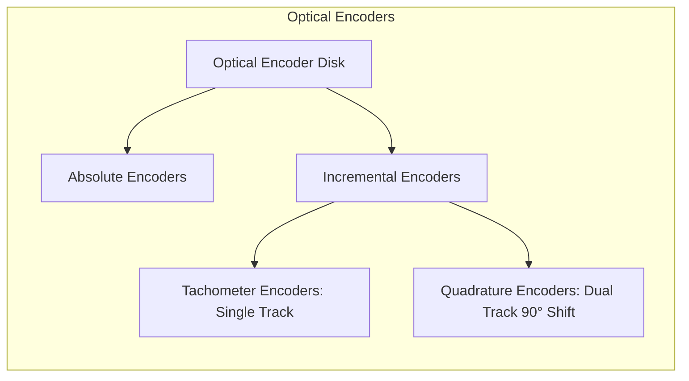
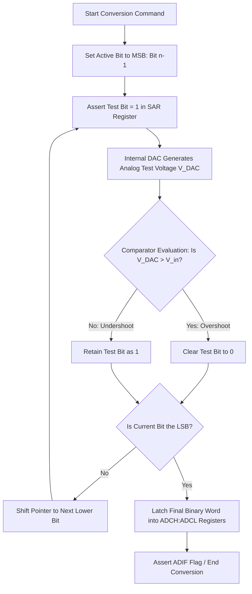
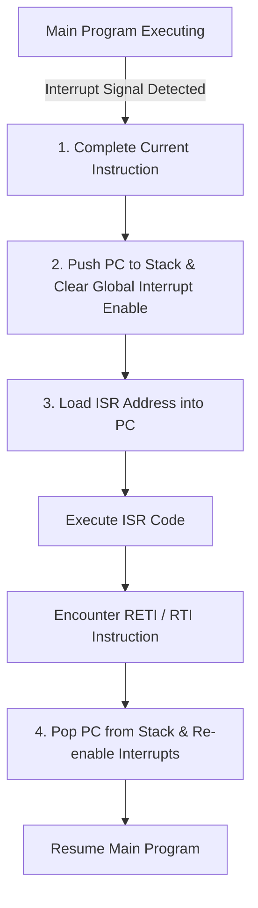
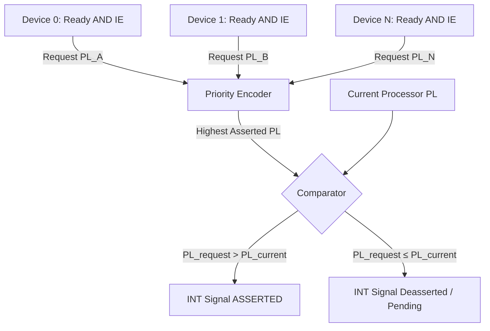

---
tags:
  - CCT3
  - indlejrede_systemer
Topic: analog-to-digital converter (ADC), interrupts,
Semester: CCT3
Course: Programmering af indlejrede systemer
Litterature:
  - Introduction to Computer Engineering
  - ATmega328P datasheet extracts
  - "Arduino I: Getting Started"
  - "Arduino II: Systems"
Created: 20-09-2026
---
# Table of Contents

1. [[#Quick Reference Guide|Quick Reference Guide]]
	1. [[#Quick Reference Guide#Sampling, Quantization & Signal Conditioning|Sampling, Quantization & Signal Conditioning]]
	2. [[#Quick Reference Guide#ATmega328 ADC Registers & API|ATmega328 ADC Registers & API]]
	3. [[#Quick Reference Guide#Interrupt Fundamentals & ATmega328 Registers|Interrupt Fundamentals & ATmega328 Registers]]
	4. [[#Quick Reference Guide#Compiler & API Interfaces|Compiler & API Interfaces]]
	5. [[#Quick Reference Guide#Timing & Architectural Concepts|Timing & Architectural Concepts]]
2. [[#1. Sensor Classification and Transducer Principles|1. Sensor Classification and Transducer Principles]]
	1. [[#1. Sensor Classification and Transducer Principles#1.1 Digital Sensors|1.1 Digital Sensors]]
		1. [[#1.1 Digital Sensors#Optical Encoders|Optical Encoders]]
	2. [[#1. Sensor Classification and Transducer Principles#1.2 Analog Sensors|1.2 Analog Sensors]]
3. [[#2. Analog-to-Digital Conversion (ADC) Fundamentals|2. Analog-to-Digital Conversion (ADC) Fundamentals]]
	1. [[#2. Analog-to-Digital Conversion (ADC) Fundamentals#2.1 Sampling and the Nyquist-Shannon Sampling Theorem|2.1 Sampling and the Nyquist-Shannon Sampling Theorem]]
	2. [[#2. Analog-to-Digital Conversion (ADC) Fundamentals#2.2 Quantization Mechanics and Resolution|2.2 Quantization Mechanics and Resolution]]
	3. [[#2. Analog-to-Digital Conversion (ADC) Fundamentals#2.3 Dynamic Range and Data Throughput|2.3 Dynamic Range and Data Throughput]]
4. [[#3. Transducer Interface Design (TID) & Signal Conditioning|3. Transducer Interface Design (TID) & Signal Conditioning]]
	1. [[#3. Transducer Interface Design (TID) & Signal Conditioning#3.1 Mathematical Modeling for Linear TID|3.1 Mathematical Modeling for Linear TID]]
	2. [[#3. Transducer Interface Design (TID) & Signal Conditioning#3.2 Operational Amplifier Hardware Implementations|3.2 Operational Amplifier Hardware Implementations]]
5. [[#4. ADC Hardware Architectures|4. ADC Hardware Architectures]]
	1. [[#4. ADC Hardware Architectures#4.1 1-Bit ADC (Analog Comparator) and Flash Architectures|4.1 1-Bit ADC (Analog Comparator) and Flash Architectures]]
	2. [[#4. ADC Hardware Architectures#4.2 Successive-Approximation Register (SAR) ADC|4.2 Successive-Approximation Register (SAR) ADC]]
	3. [[#4. ADC Hardware Architectures#4.3 Comparative Analysis of ADC Architectures|4.3 Comparative Analysis of ADC Architectures]]
6. [[#5. Microchip ATmega328 ADC Architecture and Registers|5. Microchip ATmega328 ADC Architecture and Registers]]
	1. [[#5. Microchip ATmega328 ADC Architecture and Registers#5.1 Architecture and Hardware Specifications|5.1 Architecture and Hardware Specifications]]
	2. [[#5. Microchip ATmega328 ADC Architecture and Registers#5.2 Control and Configuration Registers|5.2 Control and Configuration Registers]]
		1. [[#5.2 Control and Configuration Registers#1. ADC Multiplexer Selection Register (`ADMUX`)|1. ADC Multiplexer Selection Register (`ADMUX`)]]
		2. [[#5.2 Control and Configuration Registers#2. ADC Control and Status Register A (`ADCSRA`)|2. ADC Control and Status Register A (`ADCSRA`)]]
		3. [[#5.2 Control and Configuration Registers#3. Data Registers (`ADCH` and `ADCL`) and Register Interlocking|3. Data Registers (`ADCH` and `ADCL`) and Register Interlocking]]
7. [[#6. Firmware Implementation & Applications|6. Firmware Implementation & Applications]]
	1. [[#6. Firmware Implementation & Applications#6.1 Register-Level Bare-Metal C Implementation|6.1 Register-Level Bare-Metal C Implementation]]
	2. [[#6. Firmware Implementation & Applications#6.2 High-Level Arduino Environment Implementation|6.2 High-Level Arduino Environment Implementation]]
	3. [[#6. Firmware Implementation & Applications#6.3 Comprehensive Case Study: 8-Level Rain Gauge Bar Indicator|6.3 Comprehensive Case Study: 8-Level Rain Gauge Bar Indicator]]
8. [[#7. Digital-to-Analog Conversion (DAC) Mechanics|7. Digital-to-Analog Conversion (DAC) Mechanics]]
	1. [[#7. Digital-to-Analog Conversion (DAC) Mechanics#7.1 Binary-Weighted Summation Architecture|7.1 Binary-Weighted Summation Architecture]]
	2. [[#7. Digital-to-Analog Conversion (DAC) Mechanics#7.2 Pulse-Width Modulation (PWM) as an Approximate DAC|7.2 Pulse-Width Modulation (PWM) as an Approximate DAC]]
	3. [[#7. Digital-to-Analog Conversion (DAC) Mechanics#7.3 Dedicated External DAC Architectures|7.3 Dedicated External DAC Architectures]]
9. [[#8. Interrupt Fundamentals and Operational Necessity|8. Interrupt Fundamentals and Operational Necessity]]
	1. [[#8. Interrupt Fundamentals and Operational Necessity#8.1 Why Interrupt-Driven I/O Matters: A Performance Case Study|8.1 Why Interrupt-Driven I/O Matters: A Performance Case Study]]
10. [[#9. General Interrupt Response Mechanism|9. General Interrupt Response Mechanism]]
	1. [[#9. General Interrupt Response Mechanism#9.1 The Four-Step Sequence in Detail|9.1 The Four-Step Sequence in Detail]]
11. [[#10. ATmega328 Interrupt Architecture|10. ATmega328 Interrupt Architecture]]
	1. [[#10. ATmega328 Interrupt Architecture#10.1 Interrupt Source Classification|10.1 Interrupt Source Classification]]
	2. [[#10. ATmega328 Interrupt Architecture#10.2 Fixed Priority Hierarchy|10.2 Fixed Priority Hierarchy]]
12. [[#11. Interrupt Configuration Requirements|11. Interrupt Configuration Requirements]]
	1. [[#11. Interrupt Configuration Requirements#11.1 Register Bitmap Reference: `SREG` (Status Register)|11.1 Register Bitmap Reference: `SREG` (Status Register)]]
13. [[#12. Compiler Toolchain ISR Syntax|12. Compiler Toolchain ISR Syntax]]
	1. [[#12. Compiler Toolchain ISR Syntax#12.1 Microchip AVR GCC (`avr-gcc`) — Standard Template|12.1 Microchip AVR GCC (`avr-gcc`) — Standard Template]]
	2. [[#12. Compiler Toolchain ISR Syntax#12.2 ImageCraft JumpStart C — Pragma-Based Template|12.2 ImageCraft JumpStart C — Pragma-Based Template]]
	3. [[#12. Compiler Toolchain ISR Syntax#12.3 Arduino Development Environment (ADE) — Abstraction Layer|12.3 Arduino Development Environment (ADE) — Abstraction Layer]]
14. [[#13. External Interrupt Programming|13. External Interrupt Programming]]
	1. [[#13. External Interrupt Programming#13.1 Trigger Mode Configuration|13.1 Trigger Mode Configuration]]
		1. [[#13.1 Trigger Mode Configuration#Register Bitmap Reference: `EICRA`|Register Bitmap Reference: `EICRA`]]
		2. [[#13.1 Trigger Mode Configuration#Register Bitmap Reference: `EIMSK`|Register Bitmap Reference: `EIMSK`]]
		3. [[#13.1 Trigger Mode Configuration#Register Bitmap Reference: `EIFR`|Register Bitmap Reference: `EIFR`]]
		4. [[#13.1 Trigger Mode Configuration#Trigger Mode Encoding (INT0)|Trigger Mode Encoding (INT0)]]
	2. [[#13. External Interrupt Programming#13.2 Interrupt Flag Clearing Mechanics|13.2 Interrupt Flag Clearing Mechanics]]
	3. [[#13. External Interrupt Programming#13.3 External Interrupt Implementation in C (ImageCraft)|13.3 External Interrupt Implementation in C (ImageCraft)]]
	4. [[#13. External Interrupt Programming#13.4 External Interrupt Implementation in Arduino (ADE)|13.4 External Interrupt Implementation in Arduino (ADE)]]
15. [[#14. Internal Interrupt Programming: Timer/Counter0|14. Internal Interrupt Programming: Timer/Counter0]]
	1. [[#14. Internal Interrupt Programming: Timer/Counter0#14.1 Timer/Counter0 Overflow Mechanics|14.1 Timer/Counter0 Overflow Mechanics]]
		1. [[#14.1 Timer/Counter0 Overflow Mechanics#Register Bitmap Reference: `TIMSK0`|Register Bitmap Reference: `TIMSK0`]]
		2. [[#14.1 Timer/Counter0 Overflow Mechanics#Register Bitmap Reference: `TCCR0B`|Register Bitmap Reference: `TCCR0B`]]
	2. [[#14. Internal Interrupt Programming: Timer/Counter0#14.2 Timing Calculations|14.2 Timing Calculations]]
	3. [[#14. Internal Interrupt Programming: Timer/Counter0#14.3 Cross-Frequency Timing Comparison Table|14.3 Cross-Frequency Timing Comparison Table]]
	4. [[#14. Internal Interrupt Programming: Timer/Counter0#14.4 Timing at $10\text{ MHz}$ (ImageCraft / Standalone ATmega328)|14.4 Timing at $10\text{ MHz}$ (ImageCraft / Standalone ATmega328)]]
	5. [[#14. Internal Interrupt Programming: Timer/Counter0#14.5 Timing at $16\text{ MHz}$ (Arduino UNO R3)|14.5 Timing at $16\text{ MHz}$ (Arduino UNO R3)]]
	6. [[#14. Internal Interrupt Programming: Timer/Counter0#14.6 Timer Interrupt Implementation in C (ImageCraft, $10\text{ MHz}$)|14.6 Timer Interrupt Implementation in C (ImageCraft, $10\text{ MHz}$)]]
	7. [[#14. Internal Interrupt Programming: Timer/Counter0#14.7 Timer Interrupt Implementation in Arduino (ADE, $16\text{ MHz}$)|14.7 Timer Interrupt Implementation in Arduino (ADE, $16\text{ MHz}$)]]
16. [[#15. Foreground and Background Processing Architecture|15. Foreground and Background Processing Architecture]]
	1. [[#15. Foreground and Background Processing Architecture#Foreground/Background Demonstration Code (Arduino)|Foreground/Background Demonstration Code (Arduino)]]
17. [[#16. Interrupt-Driven I/O: Architectural Perspective (LC-3)|16. Interrupt-Driven I/O: Architectural Perspective (LC-3)]]
	1. [[#16. Interrupt-Driven I/O: Architectural Perspective (LC-3)#16.1 The Two-Part Architecture|16.1 The Two-Part Architecture]]
	2. [[#16. Interrupt-Driven I/O: Architectural Perspective (LC-3)#16.2 Part I: Causing the Interrupt — Three Prerequisites|16.2 Part I: Causing the Interrupt — Three Prerequisites]]
		1. [[#16.2 Part I: Causing the Interrupt — Three Prerequisites#Device Request Logic|Device Request Logic]]
		2. [[#16.2 Part I: Causing the Interrupt — Three Prerequisites#Priority and Preemption|Priority and Preemption]]
		3. [[#16.2 Part I: Causing the Interrupt — Three Prerequisites#INT Signal Generation|INT Signal Generation]]
	3. [[#16. Interrupt-Driven I/O: Architectural Perspective (LC-3)#16.3 Part II: Handling the Interrupt Request|16.3 Part II: Handling the Interrupt Request]]
		1. [[#16.3 Part II: Handling the Interrupt Request#Stage 1: Initiate the Interrupt (Context Switch)|Stage 1: Initiate the Interrupt (Context Switch)]]
		2. [[#16.3 Part II: Handling the Interrupt Request#Stage 2: Service the Interrupt|Stage 2: Service the Interrupt]]
		3. [[#16.3 Part II: Handling the Interrupt Request#Stage 3: Return from Interrupt (`RTI`)|Stage 3: Return from Interrupt (`RTI`)]]
	4. [[#16. Interrupt-Driven I/O: Architectural Perspective (LC-3)#16.4 Nested Interrupt Example|16.4 Nested Interrupt Example]]
	5. [[#16. Interrupt-Driven I/O: Architectural Perspective (LC-3)#16.5 Non-I/O Interrupt Sources|16.5 Non-I/O Interrupt Sources]]
18. [[#17. Applied Interrupt Examples|17. Applied Interrupt Examples]]
	1. [[#17. Applied Interrupt Examples#17.1 Real-Time Clock (RTC) via Timer Interrupts|17.1 Real-Time Clock (RTC) via Timer Interrupts]]
	2. [[#17. Applied Interrupt Examples#17.2 Interrupt-Driven USART Serial Communication|17.2 Interrupt-Driven USART Serial Communication]]

# Analog/Digital Conversion and Interrupt-Driven Embedded Systems

## Quick Reference Guide

### Sampling, Quantization & Signal Conditioning

| Concept / Syntax | Description / Mathematical Definition |
| :--- | :--- |
| Nyquist Criterion | $f_s \ge 2 f_{\text{max}}$ (Sampling rate must double the highest signal frequency) |
| Quantization Levels | $L = 2^n$ ($n$ = bit resolution) |
| ADC Step Size ($\Delta V$) | $\text{Resolution} = \frac{V_{\text{ref(high)}} - V_{\text{ref(low)}}}{2^b}$ |
| Theoretical SNR | $\text{Dynamic Range} = 20 \log_{10}(2^b) \approx 6.02 \cdot b\text{ dB}$ |
| TID Circuit Model | $V_2 = (V_1 \cdot K) + B$ ($K$: Scaling Gain, $B$: DC Offset Bias) |
| Ideal Op-Amp Axioms | $I_p = I_n = 0\text{ A}$ (Infinite input impedance), $V_p = V_n$ (Virtual short) |

### ATmega328 ADC Registers & API

| Concept / Syntax | Description / Mathematical Definition |
| :--- | :--- |
| `ADMUX` Register | Configures reference voltage source (`REFS[1:0]`), result justification (`ADLAR`), and channel (`MUX[3:0]`) |
| `ADCSRA` Register | Configures enable (`ADEN`), start conversion (`ADSC`), interrupt flag (`ADIF`), and prescaler (`ADPS[2:0]`) |
| Register Read Lock | Must read `ADCL` before `ADCH` to preserve $16$-bit data integrity |
| `analogRead(pin)` | $10$-bit conversion mapped from $0\text{--}5\text{ VDC} \longrightarrow 0\text{--}1023$ |
| `analogWrite(pin, val)` | $8$-bit PWM-based DAC approximation mapped from $0\text{--}255 \longrightarrow 0\text{--}5\text{ VDC}$ |

### Interrupt Fundamentals & ATmega328 Registers

| Concept / Syntax | Description / Mathematical Definition |
| :--- | :--- |
| ISR | Interrupt Service Routine — dedicated callback function executed upon interrupt trigger |
| Interrupt Sources | $26$ total: $2$ external (`INT0`, `INT1`) + $24$ internal peripheral vectors |
| `EIMSK` Register | External Interrupt Mask — locally enables `INT0` (bit $0$) and `INT1` (bit $1$) |
| `EICRA` Register | External Interrupt Control Register A — configures edge/level trigger sense (`ISC` bits) |
| `TIMSK0` Register | Timer/Counter0 Interrupt Mask — enables overflow interrupt (`TOIE0`, bit $0$) |
| `TCCR0B` Register | Timer/Counter0 Control Register B — configures clock prescaler (`CS[2:0]`) |
| `SREG` I-bit | Global Interrupt Enable flag in the CPU Status Register |
| `sei()` / `SEI` | Assembly instruction / C macro to set the global interrupt enable flag |
| `reti` | Return from Interrupt — restores PC from stack and re-enables global interrupts |

### Compiler & API Interfaces

| Concept / Syntax | Description / Mathematical Definition |
| :--- | :--- |
| `attachInterrupt(int, func, mode)` | Binds an external interrupt pin to an ISR with specified trigger mode |
| `interrupts()` / `noInterrupts()` | Globally enable / disable all interrupts |
| `ISR(vector_name)` | avr-gcc macro binding a function to a hardware interrupt vector (e.g., `INT0_vect`) |
| `#pragma interrupt_handler name:N` | ImageCraft pragma mapping a function to vector number $N$ |

### Timing & Architectural Concepts

| Concept / Syntax | Description / Mathematical Definition |
| :--- | :--- |
| Timer Tick Duration | $T_{\text{tick}} = \frac{N}{f_{\text{osc}}}$ |
| Timer Overflow Period | $T_{\text{overflow}} = 2^n \times T_{\text{tick}}$ |
| Interrupt Request Logic | $\text{IRQ} = \text{Ready Bit} \land \text{IE Bit}$ |
| Preemption Condition | $\text{PL}_{\text{request}} > \text{PL}_{\text{current}}$ |
| Vector Address (LC-3) | $\text{Addr} = \text{x0100} + \text{INTV}$ |

_Table 1.1: Comprehensive quick reference organized by conceptual domain — sampling theory, ATmega328 hardware registers, interrupt fundamentals, compiler interfaces, and timing/architectural principles._

---

>[!abstract] Unified Topic Overview
>Think of a microcontroller as a **translator** between the analog physical world and the digital computing world:
>- **Sections [[#1. Sensor Classification and Transducer Principles|1]]–[[#7. Digital-to-Analog Conversion (DAC) Mechanics|7]]** cover the **translation mechanisms** — how physical signals (temperature, voltage, distance) are digitized via **ADC** and how digital values are converted back to physical actions via **DAC**.
>- **Sections [[#8. Interrupt Fundamentals and Operational Necessity|8]]–[[#17. Applied Interrupt Examples|17]]** cover the **doorbell system** — how the CPU handles asynchronous, high-priority events (external pin transitions, timer overflows, ADC completions) using **interrupts** rather than wasteful polling.
>
>The two domains meet at the **`ADIF`/`ADIE` bits** of the ADC (see [[#5.2 Control and Configuration Registers|Section 5.2]]), where a conversion completion can itself trigger a background interrupt — enabling the microcontroller to sample sensors without blocking foreground execution.

---

## 1. Sensor Classification and Transducer Principles

Embedded control systems operate via a continuous cycle of **data acquisition**, **processing**, and **actuation**. A host microcontroller interfaces with the surrounding physical environment by acquiring physical parameters via *transducers*, computing control laws, and issuing control signals to output peripherals.


_Figure 1.1: Closed-loop embedded data acquisition, processing, and actuation cycle._

>[!info] Transducers: Sensors vs. Actuators
>A **transducer** is an electrical, physical, or electromechanical device that converts one form of energy into another:
>- **Input Transducers (Sensors):** Convert physical parameters (e.g., temperature, pressure, sound, optical flux, displacement) into electrical signals (voltage, current, resistance, or digital pulse trains).
>- **Output Transducers (Actuators / Displays):** Convert electrical control signals into physical actions or displays (e.g., solenoids, DC/stepper motors, audio speakers, LCDs).

### 1.1 Digital Sensors

_Digital sensors_ encode physical measurement data directly into discrete logic pulse trains. The target measurement is typically encoded into temporal or structural parameters of the signal:
- *Duty cycle* ($\%$)
- *Signal frequency* ($f$)
- *Signal period* ($T$)
- *Pulse count / rate*

Microcontrollers utilize hardware input capture timers and external interrupt pins (see [[#13. External Interrupt Programming|Section 13]]) to measure these temporal characteristics and decode the sensor values without requiring an intermediate analog conversion stage.

#### Optical Encoders
An _optical encoder_ monitors rotational position and angular velocity. It utilizes an etched, patterned disk placed between an optical emitter (infrared LED) and an optical photodetector. Rotation interrupts the optical beam, creating a pulsed digital logic sequence.


_Figure 1.2: Hierarchical classification of rotational optical encoders._

- **Absolute Encoders:** Contain multiple concentric tracks of etched patterns encoding unique binary or Gray-code words for every discrete angular sector. They retain true position immediately upon power-up without requiring a homing routine.
- **Incremental Tachometer Encoders:** Contain a single track of equidistant transparent/opaque sectors. They measure velocity by counting pulse frequency ($f = \frac{\text{pulses}}{\Delta t}$) against a known pulse-per-revolution (PPR) constant.
- **Quadrature Encoders:** Feature two distinct tracks (Channel A and Channel B) physically offset by $90^\circ$ of electrical phase. 
  - **Velocity:** Derived from pulse frequency on either channel.
  - **Direction:** Determined by evaluating phase precedence (i.e., if Channel A leads Channel B, rotation is clockwise; if Channel B leads Channel A, rotation is counterclockwise).

>[!example] Security Gate Monitoring with Absolute Encoders
>In an industrial security gate, an absolute optical encoder tracks gate angular displacement. If a power outage occurs while the gate is mid-travel, the microcontroller reads the physical binary track state immediately upon reboot, avoiding the need for mechanical recalibration or homing cycles.

---

### 1.2 Analog Sensors

_Analog sensors_ produce a continuous electrical output (typically a variable DC voltage, current, or resistance) proportional to the measured physical stimulus. Because microcontrollers are digital processing units, these continuous signals require two interface operations:
1. **Signal Conditioning (TID Circuitry):** External operational amplifier circuits scale, level-shift, and filter the raw sensor output to conform to the ADC input range ($0$ to $V_{\text{ref}}$). See [[#3. Transducer Interface Design (TID) & Signal Conditioning|Section 3]].
2. **Quantization and Digitization:** An Analog-to-Digital Converter converts the conditioned analog DC voltage into a discrete binary number.

>[!example] Common Analog Sensor Interfacing Configurations
>- **Flex Sensor (Resistive Transducer):** 
>  - *Characteristics:* Flat resistance $\approx 10\text{ k}\Omega$; bent ($90^\circ$) resistance $\approx 30\text{--}40\text{ k}\Omega$.
>  - *Interface:* Microcontrollers cannot measure electrical resistance directly. The sensor is placed in a fixed-resistor voltage divider to transform $\Delta R$ into a measurable $\Delta V$, which is then digitized by an ADC.
>- **Ultrasonic Distance Sensor (Maxbotix LV-EZ3):**
>  - *Principle:* Emits a $42\text{ kHz}$ acoustic burst and calculates transit time (Time-of-Flight).
>  - *Outputs:* Provides range data via three parallel interfaces: linear analog voltage ($10\text{ mV/inch}$), pulse-width modulation ($147\ \mu\text{s/inch}$), and RS-232 serial data ($9600\text{ bps}$).
>- **Linear Temperature Transducers (LM34 / LM35):**
>  - *LM34:* Direct Fahrenheit calibration ($+10.0\text{ mV/}^\circ\text{F}$, range $32^\circ\text{F}$ to $212^\circ\text{F}$).
>  - *LM35:* Direct Celsius calibration ($+10.0\text{ mV/}^\circ\text{C}$).
>  - *Interface:* Direct connection from sensor output pin to microcontroller ADC input channel.

>[!warning] Common Analog Sensor Pitfalls
>- **Impedance Mismatch:** Sensors with output impedance above $10\text{ k}\Omega$ can produce inaccurate ADC readings — use an op-amp buffer stage.
>- **Voltage Range Violation:** Applying voltages outside $0$ to $V_{CC}$ can damage the ADC multiplexer.
>- **Missing Signal Conditioning:** Directly connecting bipolar sensors (e.g., $\pm 5\text{ V}$ microphones) without level-shifting will clip negative half-cycles.

---

## 2. Analog-to-Digital Conversion (ADC) Fundamentals

The Analog-to-Digital Conversion process transforms continuous, infinite-resolution analog signals into discrete, finite-precision digital values through three sequential steps:


_Figure 2.1: The three fundamental stages of analog-to-digital conversion._

![[Pasted image 20260920202635.png]]

_Figure 2.2: Graphical representation of continuous analog sampling, discrete amplitude quantization, and final binary encoding._

---

### 2.1 Sampling and the Nyquist-Shannon Sampling Theorem

_Sampling_ captures instantaneous amplitude values of a continuous waveform at uniform time intervals ($T_s$). The selection of sampling frequency ($f_s = \frac{1}{T_s}$) defines the bandwidth capacity of the digitized system.

>[!summary] theorem : Nyquist Sampling Theorem
>To preserve the complete information content of a continuous analog signal and prevent aliasing distortion, the sampling frequency ($f_s$) must be at least twice the maximum frequency component ($f_{\text{max}}$) present in the input spectrum:
>
>$$f_s \ge 2 f_{\text{max}}$$
>
>**breakdown**:
>- $f_s$ : Sampling frequency ($\text{Hz}$ or $\text{samples/second}$).
>- $f_{\text{max}}$ : Highest frequency component present in the analog signal ($\text{Hz}$).
>- $2 f_{\text{max}}$ : The **Nyquist Rate** (the theoretical minimum boundary for lossless reconstruction).
>
>**proof**:
>Let an analog signal $x(t)$ have a Fourier transform $X(f)$ such that $X(f) = 0$ for all $|f| > f_{\text{max}}$. The ideal sampling process multiplies $x(t)$ by an impulse train $p(t) = \sum_{n=-\infty}^{\infty} \delta(t - n T_s)$. In the frequency domain, this multiplication convolves $X(f)$ with $P(f) = \frac{1}{T_s} \sum_{k=-\infty}^{\infty} \delta\left(f - \frac{k}{T_s}\right)$, resulting in periodic spectral copies of $X(f)$ centered at integer multiples of $f_s$:
>$$X_s(f) = \frac{1}{T_s} \sum_{k=-\infty}^{\infty} X(f - k f_s)$$
>To prevent the negative-frequency sideband of the $k=1$ copy from overlapping with the positive-frequency boundary of the baseband ($k=0$) copy, the spectral separation must satisfy:
>$$f_s - f_{\text{max}} \ge f_{\text{max}} \implies f_s \ge 2 f_{\text{max}}$$
>When this condition holds, an ideal low-pass reconstruction filter with cutoff $f_c = f_{\text{max}}$ isolates the original spectrum $X(f)$ without aliasing.

>[!example] Human Voice Bandwidth & Anti-Aliasing Filter Design
>Standard telecommunication systems restrict human voice transmission to $f_{\text{max}} = 4\text{ kHz}$.
>- **Nyquist Sampling Calculation:**
>  $$f_s \ge 2 \cdot 4\text{ kHz} = 8\text{ kHz}\ (8000\text{ samples/second})$$
>- **Anti-Aliasing Filter:** Any environmental high-frequency noise ($f > 4\text{ kHz}$) present at the ADC input will fold back into the audible spectrum as alias distortion. Therefore, a steep hardware **low-pass anti-aliasing filter** with cutoff frequency $f_c = 4\text{ kHz}$ is placed before the ADC sampling stage.

---

### 2.2 Quantization Mechanics and Resolution

_Quantization_ maps a continuous voltage range onto a finite set of $L$ discrete levels. For an $n$-bit converter, the total number of quantization steps is given by:

$$L = 2^n$$

- **$L$** : Total count of unique discrete binary states.
- **$n$** : Resolution bit-depth of the converter.

Increasing resolution reduces the step size between adjacent digital levels, lowering the associated *quantization error* ($e_q \le \frac{\Delta V}{2}$).

>[!summary] theorem : ADC Resolution (Step Size)
>The resolution (smallest detectable change in analog input voltage, $\Delta V$) is defined as the total input voltage span divided by the total number of quantization states:
>
>$$\text{Resolution} = \Delta V = \frac{V_{\text{Span}}}{2^b} = \frac{V_{\text{ref(high)}} - V_{\text{ref(low)}}}{2^b}$$
>
>**breakdown**:
>- $\Delta V$ : Voltage step size per Least Significant Bit ($\text{V/LSB}$ or $\text{mV/LSB}$).
>- $V_{\text{Span}}$ : Full-scale analog input voltage operating range ($V_{\text{ref(high)}} - V_{\text{ref(low)}}$).
>- $V_{\text{ref(high)}}$ : Upper analog reference voltage limit ($\text{V}$).
>- $V_{\text{ref(low)}}$ : Lower analog reference voltage limit ($\text{V}$, typically $0\text{ VDC}$).
>- $b$ : Digital bit-depth (resolution) of the ADC subsystem.
>- $2^b$ : Total discrete quantization intervals available.

>[!example] Comparative Step Size Calculations Across Resolutions ($0$ to $5\text{ VDC}$ Span)
>- **$1$-bit System ($2^1 = 2$ levels):**
>  $$\Delta V = \frac{5.0\text{ V} - 0.0\text{ V}}{2} = 2.50\text{ V}\quad (50.0\%\text{ full-scale step})$$
>- **$4$-bit System ($2^4 = 16$ levels):**
>  $$\Delta V = \frac{5.0\text{ V} - 0.0\text{ V}}{16} = 0.3125\text{ V} = 312.5\text{ mV}$$
>- **$10$-bit System (`ATmega328`, $2^{10} = 1024$ levels):**
>  $$\Delta V = \frac{5.0\text{ V} - 0.0\text{ V}}{1024} = 4.8828\times 10^{-3}\text{ V} \approx 4.88\text{ mV}$$
>- **$20$-bit System ($2^{20} = 1{,}048{,}576$ levels):**
>  $$\Delta V = \frac{5.0\text{ V} - 0.0\text{ V}}{1{,}048{,}576} \approx 4.768\times 10^{-6}\text{ V} = 4.77\ \mu\text{V}$$

---

### 2.3 Dynamic Range and Data Throughput

>[!summary] theorem : ADC Theoretical Dynamic Range (Signal-to-Noise Ratio)
>The dynamic range measures the ratio between the maximum measurable full-scale signal and the root-mean-square quantization noise floor:
>
>$$\text{Dynamic Range} = 20 \log_{10}(2^b) \approx 6.02 \cdot b\text{ dB}$$
>
>**breakdown**:
>- $\text{Dynamic Range}$ : Theoretical Signal-to-Quantization-Noise Ratio expressed in Decibels ($\text{dB}$).
>- $b$ : ADC bit resolution.
>- $\log_{10}$ : Common logarithm operator (base $10$).
>- $6.02$ : Linear-to-logarithmic conversion constant ($20 \log_{10}(2) \approx 6.0206$).

>[!example] System Bandwidth & Data Rate Evaluation
>A telecommunications voice hub digitizes $100{,}000$ concurrent voice channels. Each channel is sampled at $f_s = 8\text{ kHz}$ using a $10$-bit ADC ($b = 10$).
>
>$$\text{Data Rate} = N_{\text{channels}} \times f_s \times b$$
>$$\text{Data Rate} = 100{,}000\text{ channels} \times 8{,}000\frac{\text{samples}}{\text{s}} \times 10\frac{\text{bits}}{\text{sample}} = 8.0 \times 10^9\text{ bps} = 8\text{ Gbps}$$

---

## 3. Transducer Interface Design (TID) & Signal Conditioning

Direct connection of raw analog sensor outputs to an ADC can lead to signal clipping, low resolution utilization, or input stage damage. A **Transducer Interface Design (TID)** circuit maps the output voltage range of an arbitrary sensor into the optimal input voltage window of an ADC (typically $0$ to $5\text{ VDC}$).

![[Pasted image 20260920202953.png]]

_Figure 3.1: Block diagram of sensor signal conditioning. The scaling stage ($K$) adjusts the voltage span, while the DC bias stage ($B$) shifts the offset to match the ADC input range._

---

### 3.1 Mathematical Modeling for Linear TID

The transformation from sensor output voltage ($V_1$) to conditioned ADC input voltage ($V_2$) is governed by a two-variable system of linear equations:

>[!summary] theorem : Transducer Interface Mapping System
>$$\begin{cases}
>V_{2\text{max}} = (V_{1\text{max}} \cdot K) + B \\
>V_{2\text{min}} = (V_{1\text{min}} \cdot K) + B
>\end{cases}$$
>
>**breakdown**:
>- $V_{1\text{max}}$ : Maximum sensor output voltage under full-scale physical stimulus ($\text{V}$).
>- $V_{1\text{min}}$ : Minimum sensor output voltage under zero/minimum physical stimulus ($\text{V}$).
>- $V_{2\text{max}}$ : Target upper input reference voltage of the ADC (typically $+5.0\text{ VDC}$).
>- $V_{2\text{min}}$ : Target lower input reference voltage of the ADC (typically $0.0\text{ VDC}$).
>- $K$ : Scalar voltage gain/attenuation factor (dimensionless ratio).
>- $B$ : Constant DC offset bias voltage ($\text{VDC}$).

>[!example] Step-by-Step TID Circuit Solution: Photodiode Interface
>A photodiode connected to a transimpedance amplifier generates:
>- $V_{1\text{max}} = 0.0\text{ VDC}$ (peak optical illumination)
>- $V_{1\text{min}} = -2.50\text{ VDC}$ (dark current / no illumination)
>
>Target ADC parameters: $V_{2\text{min}} = 0.0\text{ VDC}$, $V_{2\text{max}} = 5.0\text{ VDC}$.
>
>1. **Set up the linear system:**
>   $$5.0 = (0.0 \cdot K) + B \quad \implies \quad B = 5.0\text{ VDC}$$
>   $$0.0 = (-2.50 \cdot K) + B$$
>2. **Substitute $B$ into the minimum equation:**
>   $$0.0 = -2.50 \cdot K + 5.0$$
>   $$2.50 \cdot K = 5.0 \quad \implies \quad K = \frac{5.0}{2.50} \implies K = -2.0$$
>   *(Note: The negative sign indicates an inverting gain stage is required to flip the negative sensor voltage to a positive ADC potential).*
>
>**Implementation Parameters:** Gain $K = -2.0$, Bias $B = +5.0\text{ VDC}$.

---

### 3.2 Operational Amplifier Hardware Implementations

Op-amps serve as the core building blocks for analog scaling and level-shifting networks.

![[Pasted image 20260920203215.png]]

_Figure 3.2: Circuit schematic and terminal conventions for an ideal operational amplifier._

>[!info] Axiomatic Properties of Ideal Op-Amps
>1. **Infinite Input Impedance ($R_{\text{in}} = \infty$):** Input pin currents are zero:
>   $$I_p = I_n = 0\text{ A}$$
>2. **Infinite Open-Loop Voltage Gain ($A_{vol} = \infty$):** Under negative feedback, the differential input voltage is forced to zero (Virtual Short):
>   $$V_p = V_n$$
>3. **Zero Output Impedance ($R_{\text{out}} = 0$):** Output acts as an ideal voltage source independent of load current.

![[Pasted image 20260920203350.png]]

_Figure 3.3: Standard operational amplifier configurations: Inverting, Non-inverting, Differential, and Summing configurations._

![[Pasted image 20260920203411.png]]

_Figure 3.4: Detailed nodal analysis for a non-inverting operational amplifier configuration._

![[Pasted image 20260920203425.png]]

_Figure 3.5: Multi-stage operational amplifier implementation realizing the photodiode TID conditioning transfer function ($V_o = -2 V_{\text{in}} + 5\text{ V}$)._

---

## 4. ADC Hardware Architectures

Different conversion architectures balance trade-offs between conversion speed, hardware complexity, and bit resolution. See [[#4.3 Comparative Analysis of ADC Architectures|Section 4.3]] for a direct comparison.

### 4.1 1-Bit ADC (Analog Comparator) and Flash Architectures

Operating an op-amp in an open-loop configuration (no feedback) yields a high-gain **comparator** or **1-bit ADC**:

$$V_o = \begin{cases} +V_{CC} & \text{if } V_{\text{in}} > V_{\text{th}} \\ -V_{CC}\ (\text{or GND}) & \text{if } V_{\text{in}} < V_{\text{th}} \end{cases}$$

![[Pasted image 20260920204342.png]]

_Figure 4.1: Schematic of an open-loop operational amplifier configured as a 1-bit threshold detector (comparator)._

A **Flash ADC** expands this concept by placing $2^n - 1$ comparators in parallel along a precision resistive ladder reference network. The input voltage is evaluated across all comparators simultaneously, producing a conversion in a single clock cycle at the expense of high power consumption and large silicon area.

---

### 4.2 Successive-Approximation Register (SAR) ADC

The `ATmega328` microcontroller incorporates an integrated **Successive-Approximation Register (SAR)** architecture.

![[Pasted image 20260920203437.png]]

_Figure 4.2: Functional block diagram of an internal Successive-Approximation ADC subsystem._


_Figure 4.3: Binary-search operational flowchart of the successive-approximation conversion algorithm._

- **Conversion Mechanics:** Operates via a binary search algorithm. It tests one bit per clock cycle, evaluating from the Most Significant Bit (MSB, bit $9$) down to the Least Significant Bit (LSB, bit $0$).
- **Timing Determinism:** A standard $10$-bit conversion on the `ATmega328` requires exactly **$13$ ADC clock cycles** regardless of the analog voltage level (the initial stabilization conversion requires $25$ cycles).

---

### 4.3 Comparative Analysis of ADC Architectures

| Architecture | Conversion Speed | Hardware Complexity | Power | Resolution | Typical Applications |
| :--- | :--- | :--- | :--- | :--- | :--- |
| **1-Bit Comparator** | Instantaneous (asynchronous) | Very Low (single op-amp) | Very Low | $1$ bit | Threshold detection, zero-crossing detectors, wake-up circuits |
| **Flash ADC** | Single clock cycle | Very High ($2^n - 1$ comparators) | Very High | $6$–$10$ bits | High-speed video sampling, radar signal processing, oscilloscopes |
| **SAR ADC** | $n$ clock cycles ($13$ for $10$-bit) | Moderate (internal DAC + comparator + logic) | Low | $8$–$18$ bits | Microcontroller peripherals, sensor sampling, data acquisition (e.g., `ATmega328`) |
| **Sigma-Delta ($\Sigma\Delta$)** | Very Slow (oversampling) | High (digital filter chain) | Moderate | $16$–$24$ bits | Audio, precision instrumentation, weigh scales |
| **Dual-Slope Integrating** | Very Slow ($ms$ range) | Moderate | Low | $12$–$22$ bits | Digital multimeters, low-frequency precision measurement |

_Table 4.1: Comparative summary of ADC architectural trade-offs across conversion speed, hardware complexity, power consumption, resolution, and typical application domains._

>[!tip] Architecture Selection Rule of Thumb
>- Need **absolute maximum speed**? → Flash ADC.
>- Need **balanced speed and resolution** for microcontroller sensor sampling? → SAR ADC (like the `ATmega328`).
>- Need **maximum precision** for slow signals (audio, measurement)? → Sigma-Delta or Dual-Slope.
>- Need **simple threshold detection** only? → 1-Bit Comparator.

---

## 5. Microchip ATmega328 ADC Architecture and Registers

### 5.1 Architecture and Hardware Specifications

The `ATmega328` contains an on-chip $10$-bit SAR ADC multiplexed across $6$ external analog input pins (`ADC[5:0]`).

- **Resolution:** $10$ bits ($2^{10} = 1024$ discrete digital levels).
- **Absolute Accuracy:** $\pm 2\text{ LSB}$ ($\pm 9.76\text{ mV}$ using a $5.0\text{ V}$ reference).
- **Conversion Latency:** $13$ ADC clock cycles ($13\text{--}260\ \mu\text{s}$ depending on prescaler configuration).
- **Input Impedance:** Optimized for analog signal sources with an output impedance of $10\text{ k}\Omega$ or less.
- **Reference Range:** $0\text{ V}$ to $V_{CC}$ (Voltages outside this range will cause clipping and can damage the internal multiplexer).

---

### 5.2 Control and Configuration Registers

#### 1. ADC Multiplexer Selection Register (`ADMUX`)

| Bit | 7 | 6 | 5 | 4 | 3 | 2 | 1 | 0 |
| :--- | :---: | :---: | :---: | :---: | :---: | :---: | :---: | :---: |
| **Field** | `REFS1` | `REFS0` | `ADLAR` | — | `MUX3` | `MUX2` | `MUX1` | `MUX0` |

_Table 5.1: Bit configuration layout of the ADMUX hardware register._

- **Reference Voltage Selection (`REFS[1:0]`):**
  - `00`: External reference voltage applied to the **`AREF`** pin.
  - `01`: **`AVCC`** pin with an external decoupling capacitor connected at the `AREF` pin.
  - `10`: *Reserved* (Do not use).
  - `11`: Internal precision $1.1\text{ VDC}$ bandgap reference.
- **ADC Left Adjust Result (`ADLAR`):**
  - `ADLAR = 0`: **Right-justified** format across `ADCH:ADCL` (standard $10$-bit readout).
  - `ADLAR = 1`: **Left-justified** format (allows direct $8$-bit readout by inspecting only `ADCH`).
- **Analog Channel Selection (`MUX[3:0]`):** Selects which channel (`ADC0` through `ADC5`) is routed to the SAR conversion core (`0000` = Channel $0$, `0101` = Channel $5$).

---

#### 2. ADC Control and Status Register A (`ADCSRA`)

| Bit | 7 | 6 | 5 | 4 | 3 | 2 | 1 | 0 |
| :--- | :---: | :---: | :---: | :---: | :---: | :---: | :---: | :---: |
| **Field** | `ADEN` | `ADSC` | `ADATE` | `ADIF` | `ADIE` | `ADPS2` | `ADPS1` | `ADPS0` |

_Table 5.2: Bit configuration layout of the ADCSRA hardware register._

- **`ADEN` (ADC Enable):** Writing `1` powers on the ADC circuitry; writing `0` disables it for power reduction.
- **`ADSC` (ADC Start Conversion):** Set to `1` in software to initiate a conversion. Hardware clears this bit back to `0` once the conversion cycle completes.
- **`ADIF` (ADC Interrupt Flag):** Hardware sets this bit to `1` when a conversion finishes. This flag can be used to trigger a background interrupt when `ADIE` is enabled (see [[#10. ATmega328 Interrupt Architecture|Section 10]]).
  - *Flag Clearing:* Cleared in software by writing a logical `1` to the bit (`ADCSRA |= (1 << ADIF)`).
- **`ADIE` (ADC Interrupt Enable):** When set to `1`, and the global `I`-bit in `SREG` is also set, an interrupt is triggered when `ADIF` is set. This enables **interrupt-driven ADC sampling** — the CPU can perform other work while conversions run in the background.
- **`ADPS[2:0]` (ADC Clock Prescaler Select):** Sets the division factor between the main system clock ($f_{\text{CPU}}$) and the ADC module clock ($f_{\text{ADC}}$):

$$f_{\text{ADC}} = \frac{f_{\text{CPU}}}{\text{Prescaler Factor}}$$

| `ADPS2` | `ADPS1` | `ADPS0` | Division Factor | ADC Clock at $f_{\text{CPU}} = 16\text{ MHz}$ |
| :---: | :---: | :---: | :---: | :---: |
| `0` | `0` | `0` | $2$ | $8.0\text{ MHz}$ *(Out of Spec)* |
| `0` | `1` | `1` | $8$ | $2.0\text{ MHz}$ *(High Speed / Low Precision)* |
| `1` | `1` | `0` | $64$ | $250\text{ kHz}$ |
| `1` | `1` | `1` | $128$ | $125\text{ kHz}$ *(Maximum $10$-bit Precision)* |

_Table 5.3: ADC prescaler configuration options and resulting clock frequencies for a $16\text{ MHz}$ system._

>[!important] ADC Clock Operating Boundaries
>To maintain full $10$-bit absolute accuracy ($\pm 2\text{ LSB}$), the internal SAR conversion core requires an operating frequency ($f_{\text{ADC}}$) between $50\text{ kHz}$ and $200\text{ kHz}$. Clocking above $200\text{ kHz}$ reduces conversion time but increases quantization error and nonlinearities.

---

#### 3. Data Registers (`ADCH` and `ADCL`) and Register Interlocking

The $10$-bit conversion value is distributed across two $8$-bit registers:

```
Right-Justified (ADLAR = 0):
ADCH: [  -   -   -   -   -   -  Bit9 Bit8 ]
ADCL: [ Bit7 Bit6 Bit5 Bit4 Bit3 Bit2 Bit1 Bit0 ]

Left-Justified (ADLAR = 1):
ADCH: [ Bit9 Bit8 Bit7 Bit6 Bit5 Bit4 Bit3 Bit2 ]
ADCL: [ Bit1 Bit0  -   -   -   -   -    -   ]
```

>[!warning] Mandatory Byte Read Sequence
>When reading a right-justified $10$-bit result (`ADLAR = 0`), software **must read `ADCL` first**, followed by **`ADCH`**. 
>
>Reading `ADCL` activates an internal hardware lock that prevents the ADC from updating either register during multi-byte reads. Once `ADCH` is read, the lock releases. Reading `ADCH` first can cause byte mismatch errors if a new conversion completes between reads.

---

>[!warning] Common ADC Pitfalls
>- **Reading `ADCH` before `ADCL`:** Causes register update mid-read, corrupting the $16$-bit result.
>- **Skipping ADC clock prescaler configuration:** Running $f_{\text{ADC}} > 200\text{ kHz}$ silently degrades accuracy.
>- **Forgetting the initial dummy conversion:** The first post-power-up conversion is unreliable — always discard it during `InitADC()`.
>- **Ignoring `AREF` decoupling:** Missing external capacitor on `AREF` when using `AVCC` reference causes noisy conversions.
>- **Applying input voltages outside $[0, V_{CC}]$:** Damages the internal multiplexer and clips readings.

---

## 6. Firmware Implementation & Applications

### 6.1 Register-Level Bare-Metal C Implementation

Below is the optimized register-level driver written for the `ATmega328` to initialize and sample analog channels.

```c
#include <avr/io.h>

/**
 * @brief Initializes the ADC subsystem for high-precision conversion.
 */
void InitADC(void)
{
    // Configure Reference: AVCC with external capacitor at AREF (REFS[1:0] = 01)
    // Channel selection defaults to ADC0; Right-adjusted results (ADLAR = 0)
    ADMUX = (1 << REFS0);

    // ADEN: Enable ADC module
    // ADPS[2:0] = 111: Set clock prescaler to 128 (16 MHz / 128 = 125 kHz ADC clock)
    // ADSC: Run an initial dummy conversion to stabilize internal analog circuitry
    ADCSRA = (1 << ADEN) | (1 << ADSC) | (1 << ADPS2) | (1 << ADPS1) | (1 << ADPS0);

    // Poll the ADIF (Interrupt Flag) bit until conversion is complete
    while (!(ADCSRA & (1 << ADIF)));

    // Clear ADIF by writing a logical 1
    ADCSRA |= (1 << ADIF);
}

/**
 * @brief Reads an analog channel and returns the 10-bit converted value.
 * @param channel The analog channel to sample (0 to 5 for standard DIP package).
 * @return unsigned int 10-bit right-justified conversion value (0 to 1023).
 */
unsigned int ReadADC(uint8_t channel)
{
    // Constrain input channel selection to valid range (0-5)
    channel &= 0x07;

    // Clear previous channel bits in ADMUX, preserve reference configuration (REFS0)
    ADMUX = (ADMUX & 0xF0) | channel;

    // Start conversion by asserting ADSC bit
    ADCSRA |= (1 << ADSC);

    // Poll ADIF bit until conversion is complete
    while (!(ADCSRA & (1 << ADIF)));

    // Clear interrupt flag by writing 1
    ADCSRA |= (1 << ADIF);

    // CRITICAL: Read ADCL first to lock registers, then read ADCH
    uint8_t low_byte  = ADCL;
    uint8_t high_byte = ADCH;

    // Concatenate bytes into single 16-bit integer
    return (unsigned int)((high_byte << 8) | low_byte);
}
```

---

### 6.2 High-Level Arduino Environment Implementation

The Arduino Development Environment (`ADE`) abstracts low-level register polling using `analogRead()`:

```cpp
const int potPin = A0;      // Analog input pin connected to potentiometer wiper
int sensorValue = 0;        // Stores raw 10-bit integer (0 - 1023)
float inputVoltage = 0.0;   // Stores calculated continuous voltage

void setup() {
    Serial.begin(9600);
}

void loop() {
    // Perform 10-bit conversion on channel A0
    sensorValue = analogRead(potPin);

    // Map the discrete integer count back to analog voltage (5.0V span / 1024)
    inputVoltage = sensorValue * (5.0 / 1024.0);

    Serial.print("Raw Register Count: ");
    Serial.print(sensorValue);
    Serial.print(" | Measured Voltage: ");
    Serial.println(inputVoltage, 3);

    delay(250);
}
```

---

### 6.3 Comprehensive Case Study: 8-Level Rain Gauge Bar Indicator

This project reads an analog potential from a $10\text{ k}\Omega$ potentiometer ($0$ to $5\text{ VDC}$) on `ADC0` and updates an 8-LED bar graph display on `PORTD` (pins `PD0` through `PD7`).

![[Pasted image 20260920204024.png]]

_Figure 6.1: Hardware schematic for the 8-LED Rain Gauge Level Indicator connected to the microcontroller._

![[Pasted image 20260920204202.png]]

_Figure 6.2: Low-level bit-mapping and pin layout for the PORTD Rain Gauge indicator circuit._

```c
#include <avr/io.h>

void delay_ms(void) {
    for (volatile int i = 0; i < 400; i++) {
        for (volatile int k = 0; k < 300; k++) {
            __asm__ __volatile__ ("nop");
        }
    }
}

void post_self_test(void) {
    DDRD = 0xFF; // Configure PORTD pins 0-7 as digital outputs

    // Incrementing binary counter sweep (0 -> 255)
    for (int i = 0; i < 256; i++) {
        PORTD = i;
        delay_ms();
    }
    // Decrementing binary counter sweep (255 -> 0)
    for (int i = 255; i >= 0; i--) {
        PORTD = i;
        delay_ms();
    }
}

int main(void) {
    post_self_test(); // Run visual Power-On Self-Test
    InitADC();        // Initialize ADC subsystem

    while (1) {
        unsigned int adc_reading = ReadADC(0); // Sample Channel 0

        // Map the 1024 total counts across 8 proportional 128-count bands
        if (adc_reading < 128)       PORTD = 0x01; // Level 1: 0000_0001
        else if (adc_reading < 256)  PORTD = 0x03; // Level 2: 0000_0011
        else if (adc_reading < 384)  PORTD = 0x07; // Level 3: 0000_0111
        else if (adc_reading < 512)  PORTD = 0x0F; // Level 4: 0000_1111
        else if (adc_reading < 640)  PORTD = 0x1F; // Level 5: 0001_1111
        else if (adc_reading < 768)  PORTD = 0x3F; // Level 6: 0011_1111
        else if (adc_reading < 896)  PORTD = 0x7F; // Level 7: 0111_1111
        else                         PORTD = 0xFF; // Level 8: 1111_1111

        delay_ms();
    }
    return 0;
}
```

---

## 7. Digital-to-Analog Conversion (DAC) Mechanics

A **Digital-to-Analog Converter (DAC)** performs the inverse operation of an ADC, translating discrete binary values back into continuous analog voltages.

### 7.1 Binary-Weighted Summation Architecture

A classic DAC uses an operational amplifier configured in a **summing amplifier** arrangement with binary-weighted input resistors:

![[Pasted image 20260920204351.png]]

_Figure 7.1: Block diagram of the binary-weighted summation DAC conversion method, with a low-pass reconstruction filter and output transducer interface._

1. **Digital Level Formatting:** Bit values are asserted as reference voltages ($V_{\text{ref}}$ for bit $= 1$, $0\text{ V}$ for bit $= 0$).
2. **Binary Weighting:** Input resistor values scale with powers of two ($R$, $2R$, $4R$, $\dots$, $2^{n-1}R$), scaling each branch current according to its bit significance:
   $$I_{\text{total}} = \sum_{k=0}^{n-1} \frac{b_k \cdot V_{\text{ref}}}{2^{n-1-k} R}$$
3. **Reconstruction Filtering:** A low-pass reconstruction filter removes high-frequency clock harmonics and quantization steps, restoring a smooth, continuous waveform.

---

### 7.2 Pulse-Width Modulation (PWM) as an Approximate DAC

The `ATmega328` does not feature an integrated on-chip hardware DAC peripheral. Instead, it approximates continuous analog output voltages using high-frequency **Pulse-Width Modulation (PWM)** via the Arduino `analogWrite()` function.


_Figure 7.2: Filtering a digital PWM square wave to produce an approximate DC analog output voltage._

- **Duty Cycle ($D$):** Controlled via an $8$-bit integer ($0$ to $255$):
  $$D = \frac{\text{Value}}{255} \times 100\%$$
- **Effective DC Voltage:** When passed through an external low-pass RC filter with a cutoff frequency well below the PWM carrier frequency ($f_c \ll f_{\text{PWM}}$), the pulse train averages to a continuous DC voltage:

$$V_{\text{out}} = V_{CC} \cdot \left(\frac{\text{Value}}{255}\right)$$

>[!example] PWM Duty Cycle to Analog Output Mapping
>- `analogWrite(pin, 0)`: $D = 0\%\quad \implies V_{\text{out}} = 0.0\text{ VDC}$
>- `analogWrite(pin, 64)`: $D = 25.1\%\implies V_{\text{out}} = 5.0\text{ V} \times \left(\frac{64}{255}\right) = 1.255\text{ VDC}$
>- `analogWrite(pin, 128)`: $D = 50.2\%\implies V_{\text{out}} = 5.0\text{ V} \times \left(\frac{128}{255}\right) = 2.510\text{ VDC}$
>- `analogWrite(pin, 255)`: $D = 100\%\ \implies V_{\text{out}} = 5.0\text{ VDC}$

---

### 7.3 Dedicated External DAC Architectures

For applications requiring low noise, high update rates, or true continuous outputs, external DAC ICs interface with the microcontroller via dedicated communication buses:

- **Parallel Bus Interface:** Fast data updates over multi-pin parallel lines (e.g., $8$-bit `DAC0808`, `MC1408P8`, and quad-channel `AD7305`).
- **Serial Peripheral Interface (SPI):** Pin-efficient serial data transfer with high clock rates (e.g., 4-channel `AD7304`, 8-channel `TLC5628`).

---

## 8. Interrupt Fundamentals and Operational Necessity

Under normal operating conditions, a microcontroller executes instructions in a deterministic **fetch-decode-execute** cycle governed by the main program. However, embedded and general-purpose systems must also respond to **asynchronous, unscheduled, high-priority events** originating from external hardware pins or internal peripheral modules (including the ADC `ADIF` flag discussed in [[#5.2 Control and Configuration Registers|Section 5.2]]).

Two fundamental paradigms govern processor-peripheral interaction:

- **Processor-Controlled (Polling):** The CPU continuously queries a device's status register in a tight loop, checking a "ready" bit. While simple, this approach wastes significant CPU cycles during idle waiting periods.
- **Device-Controlled (Interrupt-Driven):** The peripheral independently signals the CPU only when service is required, freeing the processor to perform useful computation during waiting intervals.

>[!info] Core Definitions
>- **Interrupt:** A hardware or software signal that alerts the CPU to a high-priority condition, temporarily suspending normal program execution.
>- **Interrupt Service Routine (ISR):** A dedicated callback function mapped to a specific interrupt source. The ISR contains the time-critical code that resolves the triggering event.

---

### 8.1 Why Interrupt-Driven I/O Matters: A Performance Case Study

Polling forces the CPU to burn clock cycles executing repetitive load and branch instructions while waiting for slow peripherals. Interrupt-driven I/O eliminates this overhead entirely.

>[!example] Performance Comparison: Keyboard Input Processing
>Consider a system reading and processing $1000$ batches of $100$ keyboard characters:
>
>- **Typing Rate:** $80\text{ wpm} \longrightarrow 1\text{ char every }0.125\text{ s}$
>- **Input Acquisition per Batch:** $T_{\text{input}} = 100 \times 0.125 = 12.5\text{ s}$
>- **Processing per Batch:** $T_{\text{process}} = 12.49999\text{ s}$
>- **ISR Overhead per Character:** $10\text{ instructions} \times 10\text{ ns} = 10^{-7}\text{ s}$
>- **Total ISR per Batch:** $T_{\text{batch\_ISR}} = 100 \times 10^{-7} = 0.00001\text{ s}$
>
>**Polling Model (Sequential — No Overlap):**
>$$T_{\text{batch}} = T_{\text{input}} + T_{\text{process}} = 12.5 + 12.49999 = 24.99999\text{ s}$$
>$$T_{\text{total}} = 1000 \times 24.99999 \approx 25{,}000\text{ s} \approx 7\text{ hours}$$
>
>**Interrupt-Driven Model (Overlapped — Parallel I/O + Compute):**
>$$T_{\text{batch}} = T_{\text{batch\_ISR}} + T_{\text{process}} = 0.00001 + 12.49999 = 12.5\text{ s}$$
>$$T_{\text{total}} \approx 1000 \times 12.5 \approx 12{,}500\text{ s} \approx 3.5\text{ hours}$$
>
>**Result:** Interrupt-driven execution **halves** total completion time by allowing background I/O acquisition to overlap with foreground data processing.

---

## 9. General Interrupt Response Mechanism

When an interrupt condition occurs, the microcontroller hardware executes a standardized four-step response sequence that is universal across virtually all processor architectures.


_Figure 9.1: Universal interrupt response flowchart showing the four-stage context switch cycle._

![[Pasted image 20260920204622.png]]

_Figure 9.2: Microcontroller interrupt response timing diagram showing main program suspension and ISR execution._

---

### 9.1 The Four-Step Sequence in Detail

1. **Instruction Completion:** The CPU finishes the active instruction currently in the execution pipeline. Interrupts are only recognized at **instruction boundaries** — never mid-instruction — to avoid the complexity of saving partially executed micro-operations.

2. **Context Preservation & Masking:**
   - The return address (current Program Counter value pointing to the *next* instruction) is pushed onto the **hardware stack**.
   - The CPU automatically clears the **global interrupt enable flag** to prevent nested interrupts from corrupting the active handler's execution.

3. **Branch to ISR:** The starting address of the designated ISR — resolved via the **interrupt vector table** — is loaded into the Program Counter (`PC`), and execution transfers to the handler.

4. **Return from Interrupt:** The ISR executes until it reaches the return instruction (`reti` on AVR, `RTI` on LC-3):
   - The saved return address is popped from the stack back into the `PC`.
   - Global interrupts are automatically re-enabled.
   - The main program resumes transparently at the exact point of interruption.

---

## 10. ATmega328 Interrupt Architecture

The `ATmega328` microcontroller incorporates a comprehensive interrupt subsystem with **$26$ distinct interrupt sources** organized in a fixed hardware priority hierarchy.

![[Pasted image 20260920204758.png]]

_Figure 10.1: ATmega328 interrupt vector map and priority hierarchy. (Adapted from Microchip, Inc.)_

### 10.1 Interrupt Source Classification

- **$2$ External Interrupt Sources:** Hardware pins driven by external electrical signals:
  - `INT0` (Physical Pin $4$ / Arduino Digital Pin $2$)
  - `INT1` (Physical Pin $5$ / Arduino Digital Pin $3$)
- **$24$ Internal Peripheral Interrupt Sources:** Generated automatically by on-chip hardware modules including Timer/Counters, ADC (`ADIF` flag from [[#5.2 Control and Configuration Registers|Section 5.2]]), USART, SPI, TWI, and EEPROM.

### 10.2 Fixed Priority Hierarchy

Interrupt requests are arbitrated by a fixed descending priority ranking:

1. **`RESET`** — Absolute highest priority.
2. **`INT0`** — External Interrupt Request $0$.
3. **`INT1`** — External Interrupt Request $1$.
4. **Internal Peripheral Vectors** — Priority descends through timer, ADC, USART, and other subsystem vectors.

>[!info] Simultaneous Interrupt Arbitration
>When multiple interrupt flags are asserted at the same clock cycle, the hardware priority encoder automatically services the highest-priority vector first. Lower-priority requests remain pending and are serviced sequentially after the higher-priority ISR completes and re-enables global interrupts.

---

## 11. Interrupt Configuration Requirements

Configuring any interrupt on the `ATmega328` requires completing four mandatory steps:

1. **Link the ISR to its Vector:** Bind the user-defined handler function to the correct hardware vector address using compiler-specific syntax.
2. **Configure Peripheral Control Registers:** Set the operational mode and trigger conditions (edge/level sensing, prescaler values, compare modes) in the source peripheral's registers.
3. **Locally Enable the Interrupt:** Set the individual interrupt enable bit within the peripheral's mask register (e.g., `EIMSK` for external, `TIMSK0` for timers).
4. **Globally Enable Interrupts:** Set the master `I`-bit in the CPU Status Register (`SREG`) using the `SEI` assembly instruction or `sei()` C macro.

>[!important] Dual-Enable Hierarchy — A Universal Pattern
>For any interrupt to fire, **both** the local peripheral enable bit **and** the global `I`-bit in `SREG` must be logic `1`. If either is cleared, the interrupt request is blocked (though the flag may still be set and remain pending).
>
>This is a **universal architectural pattern** — the LC-3 architecture uses the same two-gate design (see [[#16.2 Part I: Causing the Interrupt — Three Prerequisites|Section 16.2]]):
>- **Local Gate:** The device's `IE` bit (analogous to ATmega328's peripheral enable bits like `EIMSK`, `TIMSK0`, `ADIE`).
>- **Global Gate:** The processor's priority level and `INT` acknowledgment (analogous to the `I`-bit in `SREG`).
>
>Understanding this pattern once means understanding it across all processor architectures.

### 11.1 Register Bitmap Reference: `SREG` (Status Register)

| Bit | 7 | 6 | 5 | 4 | 3 | 2 | 1 | 0 |
| :--- | :---: | :---: | :---: | :---: | :---: | :---: | :---: | :---: |
| **Field** | `I` | `T` | `H` | `S` | `V` | `N` | `Z` | `C` |

_Table 11.1: Bit configuration layout of the SREG (Status Register). Bit $7$ (`I`) is the global interrupt enable flag; the remaining bits are arithmetic condition flags._

---

## 12. Compiler Toolchain ISR Syntax

### 12.1 Microchip AVR GCC (`avr-gcc`) — Standard Template

The `avr-gcc` toolchain uses the `ISR()` macro from `<avr/interrupt.h>` to bind a function to a named vector:

```c
#include <avr/io.h>
#include <avr/interrupt.h>

ISR(INT0_vect)
{
    // Time-critical interrupt handling code
}
```

### 12.2 ImageCraft JumpStart C — Pragma-Based Template

ImageCraft uses numeric vector indexing with a `#pragma` directive:

```c
#include <iom328pv.h>

#pragma interrupt_handler int0_handler:2

void int0_handler(void)
{
    // Time-critical interrupt handling code
    // Compiler automatically appends 'reti' instead of 'ret'
}
```

### 12.3 Arduino Development Environment (ADE) — Abstraction Layer

The ADE provides high-level functions that abstract register manipulation:

| Function | Equivalent | Purpose |
| :--- | :--- | :--- |
| `attachInterrupt(int, func, mode)` | Configures `EICRA`, `EIMSK` | Binds an external pin to an ISR |
| `detachInterrupt(int)` | Clears `EIMSK` bit | Disables a specific external interrupt |
| `interrupts()` | `sei()` / `SEI` | Globally enables all interrupts |
| `noInterrupts()` | `cli()` / `CLI` | Globally disables all interrupts |

_Table 12.1: Arduino Development Environment interrupt abstraction functions and their low-level equivalents._

---

## 13. External Interrupt Programming

The `ATmega328` provides two dedicated external interrupt pins (`INT0` on `PD2`, `INT1` on `PD3`) that detect electrical signal transitions and immediately vector the CPU to the corresponding ISR.

### 13.1 Trigger Mode Configuration

Each external interrupt pin supports four independently configurable trigger modes, selected via the **Interrupt Sense Control (`ISC`)** bits in the `EICRA` register.

#### Register Bitmap Reference: `EICRA`

| Bit | 7 | 6 | 5 | 4 | 3 | 2 | 1 | 0 |
| :--- | :---: | :---: | :---: | :---: | :---: | :---: | :---: | :---: |
| **Field** | — | — | — | — | `ISC11` | `ISC10` | `ISC01` | `ISC00` |

_Table 13.1: Bit configuration layout of the EICRA (External Interrupt Control Register A). Bits $[3:2]$ control INT1 sensing; bits $[1:0]$ control INT0 sensing._

#### Register Bitmap Reference: `EIMSK`

| Bit | 7 | 6 | 5 | 4 | 3 | 2 | 1 | 0 |
| :--- | :---: | :---: | :---: | :---: | :---: | :---: | :---: | :---: |
| **Field** | — | — | — | — | — | — | `INT1` | `INT0` |

_Table 13.2: Bit configuration layout of the EIMSK (External Interrupt Mask Register). Setting bit $0$ enables INT0; setting bit $1$ enables INT1._

#### Register Bitmap Reference: `EIFR`

| Bit | 7 | 6 | 5 | 4 | 3 | 2 | 1 | 0 |
| :--- | :---: | :---: | :---: | :---: | :---: | :---: | :---: | :---: |
| **Field** | — | — | — | — | — | — | `INTF1` | `INTF0` |

_Table 13.3: Bit configuration layout of the EIFR (External Interrupt Flag Register). Hardware sets INTF0/INTF1 when a triggering edge is detected. Software clears by writing logic `1`._

#### Trigger Mode Encoding (INT0)

| `ISC01` | `ISC00` | Trigger Mode | Description |
| :---: | :---: | :--- | :--- |
| `0` | `0` | Low Level | Interrupt fires continuously while pin is held at logic `0` |
| `0` | `1` | Any Change | Interrupt fires on both rising and falling edges |
| `1` | `0` | Falling Edge | Interrupt fires on high-to-low transition |
| `1` | `1` | Rising Edge | Interrupt fires on low-to-high transition |

_Table 13.4: External interrupt trigger sense control modes for INT0 (EICRA register)._

![[Pasted image 20260920205110.png]]

_Figure 13.1: ATmega328 external interrupt registers: EICRA (sense control), EIMSK (mask enable), and EIFR (flag status)._

---

### 13.2 Interrupt Flag Clearing Mechanics

>[!info] Automatic vs. Manual Flag Clearing
>The `INT0` interrupt flag (`INTF0` in `EIFR`) is set when the programmed edge condition occurs. It can be cleared in two ways:
>1. **Automatic:** Hardware clears the flag when the CPU vectors into the ISR.
>2. **Manual:** Software writes a logic `1` to the `INTF0` bit in `EIFR`.

---

### 13.3 External Interrupt Implementation in C (ImageCraft)

```c
#include <iom328pv.h>

#pragma interrupt_handler int0_ISR:2

void int0_ISR(void);
void initialize_interrupt_int0(void);

void initialize_interrupt_int0(void)
{
    DDRD = 0xFB;         // PD2 (INT0) as input (bit 2 = 0)
    PORTD &= ~0x04;      // Disable internal pull-up on PD2

    EIMSK = 0x01;        // Locally enable INT0
    EICRA = 0x03;        // Rising-edge trigger (ISC01=1, ISC00=1)

    asm("SEI");          // Globally enable interrupts (SREG I-bit)
}

void int0_ISR(void)
{
    // Time-critical actions executed on rising edge of PD2
}
```

---

### 13.4 External Interrupt Implementation in Arduino (ADE)

On the `Arduino UNO R3`, external interrupts map to specific digital pins:
- **Interrupt $0$ (`INT0`):** Digital Pin $2$
- **Interrupt $1$ (`INT1`):** Digital Pin $3$

```c
void setup()
{
    // Attach INT0 (pin 2) to ISR, triggered on RISING edge
    attachInterrupt(0, int0_ISR, RISING);
}

void loop()
{
    // Main program runs freely; ISR fires asynchronously
}

void int0_ISR(void)
{
    // Time-critical actions executed on rising edge of pin 2
}
```

>[!tip] Trigger Mode Constants in Arduino
>The `attachInterrupt()` `mode` parameter accepts four constants: `LOW`, `CHANGE`, `RISING`, and `FALLING`. Choose `FALLING` for active-low button presses with pull-up resistors, and `RISING` for active-high signals.

>[!warning] Common External Interrupt Pitfalls
>- **Forgetting `sei()`:** The most common error — local enable set, but global `I`-bit off means the ISR never fires.
>- **Leaving pull-up enabled on floating input pins:** Can cause spurious edge triggers from noise.
>- **Using slow ISRs:** Long ISRs delay all other interrupts and starve the main loop.
>- **Modifying shared variables without `volatile`:** The compiler may optimize away reads/writes that the ISR modifies.

---

## 14. Internal Interrupt Programming: Timer/Counter0

Internal interrupts are generated automatically by on-chip peripheral modules. The most common application is using **Timer/Counter0 overflow interrupts** to create deterministic, non-blocking timing intervals.

### 14.1 Timer/Counter0 Overflow Mechanics

- **Resolution:** $8$-bit counter ($0$ to $255$, i.e., $2^8 = 256$ counts).
- **Overflow Event (`TOV0`):** When the counter wraps from $255 \to 0$, the overflow flag is set.
- **Interrupt:** When `TOIE0` in `TIMSK0` is enabled, the overflow vectors the CPU to the Timer0 Overflow ISR.

#### Register Bitmap Reference: `TIMSK0`

| Bit | 7 | 6 | 5 | 4 | 3 | 2 | 1 | 0 |
| :--- | :---: | :---: | :---: | :---: | :---: | :---: | :---: | :---: |
| **Field** | — | — | — | — | — | `OCIE0B` | `OCIE0A` | `TOIE0` |

_Table 14.1: Bit configuration layout of the TIMSK0 (Timer/Counter0 Interrupt Mask Register). Setting `TOIE0` (bit $0$) enables the overflow interrupt._

#### Register Bitmap Reference: `TCCR0B`

| Bit | 7 | 6 | 5 | 4 | 3 | 2 | 1 | 0 |
| :--- | :---: | :---: | :---: | :---: | :---: | :---: | :---: | :---: |
| **Field** | `FOC0A` | `FOC0B` | — | — | `WGM02` | `CS02` | `CS01` | `CS00` |

_Table 14.2: Bit configuration layout of the TCCR0B (Timer/Counter0 Control Register B). Bits `CS[2:0]` select the clock prescaler division factor._

---

### 14.2 Timing Calculations

>[!summary] theorem : Timer Overflow Interval
>The duration of a single timer tick and the total overflow period are determined by the system clock frequency and the prescaler division factor:
>
>$$T_{\text{tick}} = \frac{N}{f_{\text{osc}}}$$
>
>$$T_{\text{overflow}} = 2^n \times T_{\text{tick}} = \frac{2^n \times N}{f_{\text{osc}}}$$
>
>**breakdown**:
>- $f_{\text{osc}}$ : Main microcontroller oscillator/clock frequency ($\text{Hz}$).
>- $N$ : Clock prescaler division factor (configured via `CS[2:0]` bits in `TCCR0B`).
>- $n$ : Bit-width of the timer counter ($n = 8$ for Timer/Counter0).
>- $T_{\text{tick}}$ : Duration of a single counter increment ($\text{s}$).
>- $T_{\text{overflow}}$ : Total time for the counter to count from $0$ to $2^n - 1$ and overflow ($\text{s}$).
>- $2^n$ : Total number of counts per overflow cycle ($256$ for $8$-bit).

---

### 14.3 Cross-Frequency Timing Comparison Table

| Prescaler $N$ | `CS[2:0]` | Tick @ $10\text{ MHz}$ | Overflow @ $10\text{ MHz}$ | Interrupts/sec @ $10\text{ MHz}$ | Tick @ $16\text{ MHz}$ | Overflow @ $16\text{ MHz}$ | Interrupts/sec @ $16\text{ MHz}$ |
| :---: | :---: | :---: | :---: | :---: | :---: | :---: | :---: |
| $1$ | `001` | $0.1\ \mu\text{s}$ | $25.6\ \mu\text{s}$ | $\approx 39{,}062$ | $0.0625\ \mu\text{s}$ | $16.0\ \mu\text{s}$ | $\approx 62{,}500$ |
| $8$ | `010` | $0.8\ \mu\text{s}$ | $204.8\ \mu\text{s}$ | $\approx 4{,}883$ | $0.5\ \mu\text{s}$ | $128.0\ \mu\text{s}$ | $\approx 7{,}812$ |
| $64$ | `011` | $6.4\ \mu\text{s}$ | $1.638\text{ ms}$ | $\approx 610$ | $4.0\ \mu\text{s}$ | $1.024\text{ ms}$ | $\approx 977$ |
| $256$ | `100` | $25.6\ \mu\text{s}$ | $6.554\text{ ms}$ | $\approx 153$ | $16.0\ \mu\text{s}$ | $4.096\text{ ms}$ | $\approx 244$ |
| $1024$ | `101` | $102.4\ \mu\text{s}$ | $26.214\text{ ms}$ | $\approx 38$ | $64.0\ \mu\text{s}$ | $16.384\text{ ms}$ | $\approx 61$ |

_Table 14.3: Timer/Counter0 timing characteristics comparing standalone ATmega328 ($10\text{ MHz}$) and Arduino UNO R3 ($16\text{ MHz}$) systems across all valid prescaler values. The "Interrupts/sec" column shows the approximate number of overflow interrupts required for a $1$-second delay._

---

### 14.4 Timing at $10\text{ MHz}$ (ImageCraft / Standalone ATmega328)

With $f_{\text{osc}} = 10\text{ MHz}$ and prescaler $N = 256$ (`CS[2:0] = 0b100`):

$$T_{\text{tick}} = \frac{256}{10 \times 10^6} = 25.6\ \mu\text{s}$$

$$T_{\text{overflow}} = 256 \times 25.6\ \mu\text{s} = 6.5536\text{ ms} \approx 6.55\text{ ms}$$

>[!example] $1$-Second Delay at $10\text{ MHz}$
>$$\text{Interrupts Required} = \frac{1000\text{ ms}}{6.55\text{ ms/interrupt}} \approx 153\text{ interrupts}$$

---

### 14.5 Timing at $16\text{ MHz}$ (Arduino UNO R3)

With $f_{\text{osc}} = 16\text{ MHz}$ and prescaler $N = 256$:

$$T_{\text{tick}} = \frac{256}{16 \times 10^6} = 16\ \mu\text{s}$$

$$T_{\text{overflow}} = 256 \times 16\ \mu\text{s} = 4.096\text{ ms} \approx 4.1\text{ ms}$$

>[!example] $1$-Second Delay at $16\text{ MHz}$
>$$\text{Interrupts Required} = \frac{1000\text{ ms}}{4.096\text{ ms/interrupt}} \approx 244\text{ interrupts}$$

---

### 14.6 Timer Interrupt Implementation in C (ImageCraft, $10\text{ MHz}$)

```c
#include <iom328pv.h>

#pragma interrupt_handler timer0_interrupt_isr:17

unsigned int input_delay;

void init_timer0_ovf_interrupt(void)
{
    TCCR0B = 0x04;  // Prescaler = 256 (overflow every 6.55 ms at 10 MHz)
    TIMSK0 = 0x01;  // Enable Timer0 Overflow Interrupt (TOIE0)
    asm("SEI");     // Global interrupt enable
}

void timer0_interrupt_isr(void)
{
    input_delay++;   // Increment software overflow counter
}

void delay(unsigned int number_of_6_55ms_interrupts)
{
    TCNT0 = 0x00;    // Reset hardware counter
    input_delay = 0;  // Reset software counter

    while (input_delay <= number_of_6_55ms_interrupts)
    {
        // Non-blocking wait — CPU available for other tasks
    }
}
```

---

### 14.7 Timer Interrupt Implementation in Arduino (ADE, $16\text{ MHz}$)

```c
#include <avr/interrupt.h>

unsigned int input_delay;

ISR(TIMER0_OVF_vect)
{
    input_delay++;
}

void init_timer0_ovf_interrupt(void)
{
    TCCR0B = 0x04;  // Prescaler = 256 (overflow every 4.1 ms at 16 MHz)
    TIMSK0 = 0x01;  // Enable Timer0 Overflow Interrupt
    asm("SEI");     // Global interrupt enable
}

void delay_timer0(unsigned int number_of_4_1ms_interrupts)
{
    TCNT0 = 0x00;
    input_delay = 0;

    while (input_delay <= number_of_4_1ms_interrupts)
    {
        // Non-blocking wait
    }
}
```

>[!note] Automatic Flag Clearing
>The Timer/Counter0 overflow flag (`TOV0` in `TIFR0`) is automatically cleared by hardware when the CPU vectors into the Timer0 Overflow ISR. No manual flag clearing is required.

>[!warning] Common Timer Interrupt Pitfalls
>- **Wrong prescaler for target frequency:** Copy-pasting $10\text{ MHz}$ code to a $16\text{ MHz}$ system without recalculating produces timing errors of $\approx 60\%$.
>- **Not resetting `TCNT0`:** Starting a delay without resetting the counter causes the first interval to be shorter than expected.
>- **Long ISRs:** ISRs longer than one overflow period ($4.1\text{ ms}$ at $16\text{ MHz}$ with $N=256$) will miss subsequent overflow events.
>- **Volatile-qualifier omission:** Software counters like `input_delay` should be declared `volatile unsigned int input_delay;` to prevent compiler optimization bugs.

---

## 15. Foreground and Background Processing Architecture

A single-core microcontroller achieves the *appearance* of concurrent multitasking by partitioning execution into two logical domains:

- **Foreground Processing:** The continuous main program loop handling routine, scheduled tasks (user interfaces, control algorithms, display updates).
- **Background Processing:** Time-critical, asynchronous tasks handled by the interrupt subsystem. The CPU "steals" clock cycles from the foreground to execute ISRs, then transparently returns control.

![[Pasted image 20260920205420.png]]

_Figure 15.1: Interrupt-driven background processing concept. The microcontroller handles routine user input in the foreground while monitoring safety-critical sensors via interrupts in the background._

![[Pasted image 20260920205430.png]]

_Figure 15.2: Foreground/background processing hardware demonstration on the Arduino UNO R3. (UNO R3 illustration used with permission of the Arduino Team, CC BY-NC-SA.)_

>[!example] Electronic Security Door Control System
>- **Foreground Tasks:** Polling keypad/card reader inputs, generating PWM motor drive signals for normal open/close cycles.
>- **Background Tasks (Interrupt-Driven):** Monitoring optical pinch-guard sensors, motor stall current detectors, and obstruction limit switches via hardware interrupts to immediately halt door movement upon hazard detection.

### Foreground/Background Demonstration Code (Arduino)

```c
#define green_LED 12    // Foreground indicator
#define red_LED   11    // Background indicator
#define ext_sw    2     // INT0 pushbutton

void setup()
{
    pinMode(green_LED, OUTPUT);
    pinMode(red_LED, OUTPUT);
    pinMode(ext_sw, INPUT);

    attachInterrupt(0, background, FALLING);
}

void loop()
{
    // FOREGROUND: Green LED on, red LED off
    digitalWrite(green_LED, HIGH);
    digitalWrite(red_LED, LOW);
}

void background(void)
{
    // BACKGROUND: ISR flashes red LED on external trigger
    digitalWrite(green_LED, LOW);

    for (int cycle = 0; cycle < 2; cycle++) {
        digitalWrite(red_LED, HIGH);
        for (unsigned int i = 0; i <= 64000; i++) asm("nop");
        digitalWrite(red_LED, LOW);
        for (unsigned int i = 0; i <= 64000; i++) asm("nop");
    }
    digitalWrite(red_LED, HIGH);
}
```

---

## 16. Interrupt-Driven I/O: Architectural Perspective (LC-3)

Beyond the ATmega328's embedded context, the interrupt mechanism is a universal computer architecture concept. The LC-3 architecture provides a clear model for understanding the complete hardware signaling and servicing pipeline.

### 16.1 The Two-Part Architecture

Interrupt-driven I/O is divided into two functional mechanisms:

1. **Signaling Mechanism (Part I):** The hardware protocol enabling a peripheral to generate and assert an interrupt request to the processor.
2. **Servicing Mechanism (Part II):** The processor's context-switch, vector-decode, ISR-execute, and context-restore pipeline.

---

### 16.2 Part I: Causing the Interrupt — Three Prerequisites

For a device to successfully interrupt the processor, **all three** conditions must be simultaneously satisfied:

1. **Service Requirement:** The device must need service (its Ready bit is `1`).
2. **Authorization:** The device must have permission to interrupt (its Interrupt Enable bit is `1`).
3. **Priority:** The device's priority must exceed the currently executing program's priority level.

>[!info] Parallel to ATmega328 Configuration
>These three LC-3 prerequisites map directly to the ATmega328 dual-enable pattern (see [[#11. Interrupt Configuration Requirements|Section 11]]):
>- **Service Requirement (Ready bit)** ↔ ATmega328 hardware flags (e.g., `INTF0`, `TOV0`, `ADIF`) set automatically by the peripheral.
>- **Authorization (IE bit)** ↔ ATmega328 local enable bits (e.g., `EIMSK[0]`, `TOIE0`, `ADIE`).
>- **Priority Comparison** ↔ ATmega328 fixed priority encoder + global `I`-bit in `SREG`.
>
>The **underlying architectural principle is universal**: no interrupt fires without service need, authorization, and sufficient priority — regardless of whether the CPU is a $16$-bit LC-3 educational model or an $8$-bit AVR embedded controller.

---

#### Device Request Logic

The interrupt request output of each device is the logical AND of its ready and enable bits:

$$\text{IRQ} = \text{Ready Bit} \land \text{IE Bit}$$

- **Ready Bit** (typically bit $[15]$ of the device status register): Set by hardware when the device needs service.
- **IE Bit** (typically bit $[14]$): Set by software (the OS or firmware) to grant interrupt permission.
- **$\land$** : Logical AND operator.

| Ready | IE | Needs Service? | Authorized? | IRQ Asserted? |
| :---: | :---: | :---: | :---: | :---: |
| `0` | `0` | No | No | `0` |
| `0` | `1` | No | Yes | `0` |
| `1` | `0` | Yes | No | `0` |
| `1` | `1` | Yes | Yes | **`1`** |

_Table 16.1: Truth table for device interrupt request generation._

![[Pasted image 20260920210454.png]]

_Figure 16.1: Interrupt enable bits and their role in gating device interrupt requests._

>[!important] IE Bit as a Software Gate
>If the IE bit is cleared (`0`), the device **cannot** interrupt the processor regardless of its ready state. The processor must fall back to polling. Only when the IE bit is set (`1`) does the device generate an interrupt request as soon as its ready bit becomes `1`.

---

#### Priority and Preemption

Every task runs at a defined **Priority Level (PL)**. A device can preempt the current program only if:

$$\text{PL}_{\text{request}} > \text{PL}_{\text{current}}$$

- **$\text{PL}_{\text{request}}$** : Priority level of the interrupting device.
- **$\text{PL}_{\text{current}}$** : Priority level of the currently executing program.

>[!example] Priority Preemption Scenarios (LC-3: PL0–PL7)
>- **PL0 (Lowest):** Overnight batch payroll processing. Any higher-priority event can preempt it freely.
>- **PL6 (High):** Nuclear power plant voltage surge mitigation. Routine events like keyboard input (lower PL) are blocked from interrupting this critical task.

---

#### INT Signal Generation

The master `INT` line is asserted through a multi-stage hardware evaluation:


_Figure 16.2: Hardware logic flow for master INT signal generation from multiple peripheral devices._

![[Pasted image 20260920210635.png]]

_Figure 16.3: Detailed schematic of INT signal generation circuitry including priority encoder and threshold comparator._

---

### 16.3 Part II: Handling the Interrupt Request

Once `INT` is detected at an instruction boundary, the processor executes three sequential stages:

#### Stage 1: Initiate the Interrupt (Context Switch)

**Saving Interrupted Program State:**
- The processor switches to the **Supervisor Stack** (if transitioning from User mode).
- Pushes the **Program Counter (`PC`)** and **Processor Status Register (`PSR`)** onto the stack.
- The PSR contains condition codes (`PSR[2:0]`), priority level (`PSR[10:8]`), and privilege mode (`PSR[15]`).

**Loading ISR State via Vectored Interrupt:**
- The interrupting device transmits an $8$-bit vector number (`INTV`) over the system bus.
- The processor computes the vector table address:

$$\text{Vector Address} = \text{x0100} + \text{INTV}$$

- **$\text{x0100}$** : Base address of the Interrupt Vector Table in LC-3 memory.
- **$\text{INTV}$** : $8$-bit vector identifier supplied by the interrupting device.

- The processor reads the $16$-bit ISR starting address from the computed vector table location and loads it into the `PC`.
- The `PSR` is initialized to Supervisor mode (`PSR[15] = 0`) at the device's priority level.

>[!note] General-Purpose Register Saving (LC-3 Convention)
>The LC-3 hardware does **not** automatically save general-purpose registers (`R0`–`R7`). The ISR itself is responsible for pushing any registers it modifies onto the Supervisor Stack (callee-save convention) and restoring them before returning.

---

#### Stage 2: Service the Interrupt

The processor fetches and executes the ISR instructions. The ISR performs the specific I/O operation required (e.g., reading a character from `KBDR`, writing a character to `DDR`). Execution proceeds in privileged Supervisor mode at the device's elevated priority level.

---

#### Stage 3: Return from Interrupt (`RTI`)

The `RTI` instruction (opcode `1000`) concludes the interrupt cycle:

1. **Pop `PC`:** Restores the return address — the next instruction of the interrupted program.
2. **Pop `PSR`:** Restores condition codes, priority level, and privilege mode to their pre-interrupt states.
3. **Stack Pointer Swap:** If returning to User mode, the Supervisor Stack Pointer is saved and the User Stack Pointer is restored to `R6`.

>[!info] Program Transparency
>After `RTI` completes, the interrupted program resumes execution with its `PC`, condition codes, priority level, and privilege mode restored to their exact pre-interrupt values. From the program's perspective, the interruption is completely invisible.

---

### 16.4 Nested Interrupt Example

This scenario demonstrates a program interrupted by Device B, which is itself interrupted by higher-priority Device C:

**Scenario Parameters:**
- **Program A:** User mode, executing `ADD` at `x3006`.
- **Device B:** Vector `xF1`, ISR at `x6200`–`x6210`, $\text{PL}_B > \text{PL}_A$.
- **Device C:** Vector `xF2`, ISR at `x6300`–`x6315`, $\text{PL}_C > \text{PL}_B$.

**Execution Sequence:**

1. **Program A → Device B:** At `x3006` boundary, `PSR_A` and `PC = x3007` are pushed. `PC ← x6200`.
2. **Device B → Device C:** At `x6202` boundary, `PSR_B` and `PC = x6203` are pushed. `PC ← x6300`.
3. **Device C Completes:** `RTI` pops `PC = x6203` and `PSR_B`. Device B resumes at `x6203`.
4. **Device B Completes:** `RTI` pops `PC = x3007` and `PSR_A`. Program A resumes at `x3007`.

![[Pasted image 20260920211105.png]]

_Figure 16.4: Complete execution flow timeline for nested interrupt-driven I/O showing Program A, Device B ISR, and Device C ISR interleaving._

![[Pasted image 20260920211146.png]]

_Figure 16.5: Supervisor stack snapshots during nested interrupt execution showing progressive context frame accumulation._

---

### 16.5 Non-I/O Interrupt Sources

The interrupt mechanism is universal and extends beyond I/O peripherals:

- **Timer Interrupts:** Periodic hardware timer events for real-time clocks and OS task scheduling.
- **Machine Check Interrupts:** Hardware diagnostic alerts for component or bus malfunctions.
- **Power Failure Interrupts:** Emergency signals triggered when supply voltage drops below threshold, granting the processor a few final clock cycles to save critical state to non-volatile storage.

---

## 17. Applied Interrupt Examples

### 17.1 Real-Time Clock (RTC) via Timer Interrupts

A software-based RTC cascades timer overflow interrupts through nested counter thresholds to track seconds, minutes, hours, and days. The tick timing derives directly from the calculations in [[#14.5 Timing at $16\text{ MHz}$ (Arduino UNO R3)|Section 14.5]].

**Cascading Architecture ($16\text{ MHz}$, Timer0 Overflow $\approx 4.1\text{ ms}$):**


_Figure 17.1: Cascading counter architecture for software-based real-time clock using Timer0 overflow interrupts._

```c
#include <avr/interrupt.h>

unsigned int day_ctr, hr_ctr, min_ctr, sec_ctr, ms_ctr;

ISR(TIMER0_OVF_vect)
{
    ms_ctr++;

    if (ms_ctr == 244)    { ms_ctr = 0; sec_ctr++; }  // ~1 second
    if (sec_ctr == 60)    { sec_ctr = 0; min_ctr++; }  // 1 minute
    if (min_ctr == 60)    { min_ctr = 0; hr_ctr++;  }  // 1 hour
    if (hr_ctr == 24)     { hr_ctr = 0;  day_ctr++; }  // 1 day
}

void init_timer0_ovf_interrupt(void)
{
    TCCR0B = 0x04;  // Prescaler = 256
    TIMSK0 = 0x01;  // Enable overflow interrupt
    asm("SEI");
}
```

---

### 17.2 Interrupt-Driven USART Serial Communication

This system uses two ATmega328 microcontrollers communicating at $9600\text{ Baud}$ to transmit and receive $12$-bit encoder position data.

![[Pasted image 20260920205713.png]]

_Figure 17.2: 12-bit encoder data framing format. Position data is serialized as two tagged bytes at 9600 Baud._

![[Pasted image 20260920205738.png]]

_Figure 17.3: Encoder test hardware configuration with transmitter and interrupt-driven receiver._

**Baud Rate Calculation ($8\text{ MHz}$ System Clock):**

$$\text{UBRR} = \frac{f_{\text{osc}}}{16 \times \text{Baud}} - 1 = \frac{8{,}000{,}000}{16 \times 9600} - 1 = 52.08 - 1 \approx 51\ (\text{0x33})$$

- **$\text{UBRR}$** : USART Baud Rate Register value ($16$-bit divisor).
- **$f_{\text{osc}}$** : System oscillator frequency ($8\text{ MHz}$).
- **$16$** : Fixed oversampling factor for asynchronous USART mode.
- **$\text{Baud}$** : Target serial communication rate ($9600\text{ bps}$).

The receiver uses the **USART Receive Complete Interrupt** (`USART_RX_vect`, Vector $19$) to process incoming bytes in the background without stalling the main program loop. Received $12$-bit position data is reconstructed from the two-byte framed stream and persisted to non-volatile EEPROM.

---

>[!summary] Key Concepts
>**Analog-to-Digital & Digital-to-Analog Conversion:**
>- **The Data Acquisition Loop:** Physical stimuli are converted to electrical signals by **sensors**, scaled and offset-conditioned by **TID circuits**, digitized by an **ADC**, processed by the **CPU**, and converted back to physical stimuli by **DACs** and **actuators**.
>- **Nyquist Sampling Theorem:** Lossless signal acquisition requires $f_s \ge 2 f_{\text{max}}$. Hardware **low-pass anti-aliasing filters** prevent high-frequency noise from folding into the baseband spectrum as alias distortion.
>- **Quantization & Dynamic Range:** Quantization divides continuous spans into $L = 2^b$ steps. Step size is $\Delta V = \frac{V_{\text{Span}}}{2^b}$, and theoretical dynamic range scales at $\approx 6.02 \cdot b\text{ dB}$.
>- **Transducer Interface Design (TID):** Uses operational amplifier stages to perform linear mapping ($V_2 = K \cdot V_1 + B$), matching the sensor output range to the ADC span ($0$ to $5\text{ VDC}$).
>- **ADC Architecture Selection:** Flash for speed, SAR for balance, Sigma-Delta for precision, 1-bit comparator for thresholds (see [[#4.3 Comparative Analysis of ADC Architectures|Section 4.3]]).
>- **ATmega328 ADC Architecture:** A $10$-bit SAR ADC multiplexed across $6$ channels. Configured via `ADMUX` (reference source, alignment, and channel routing) and `ADCSRA` (enable, trigger, interrupt flag, and prescaler). **Critical Interlock Rule:** In $10$-bit mode (`ADLAR = 0`), software must **read `ADCL` before `ADCH`** to prevent data corruption during register updates.
>- **Digital-to-Analog Conversion:** Approximated internally on the `ATmega328` via filtered **PWM** (`analogWrite()`), or generated with high precision using external parallel/SPI **DAC ICs**.
>
>**Interrupt Subsystem & Interrupt-Driven I/O:**
>- **Interrupt-Driven vs. Polling:** Interrupts eliminate CPU-wasting polling loops by allowing peripherals to signal the processor only when service is needed, enabling parallel foreground computation and background I/O.
>- **Universal Response Sequence:** (1) Complete current instruction → (2) Push PC and disable interrupts → (3) Vector to ISR → (4) Execute ISR → (5) `reti`/`RTI` restores PC and re-enables interrupts.
>- **ATmega328 Interrupt Architecture:** $26$ interrupt vectors ($2$ external + $24$ internal, including ADC completion `ADIF`) with fixed hardware priority. External interrupts (`INT0`/`INT1`) support four trigger modes via `EICRA`. Internal timer interrupts provide deterministic timing via prescaled overflow events.
>- **Universal Dual-Enable Pattern:** Both the local peripheral interrupt enable bit (e.g., `EIMSK`, `TIMSK0`, `ADIE`) and the global `I`-bit in `SREG` must be set for any interrupt to fire — a pattern mirrored in the LC-3 architecture (Ready $\land$ IE + priority arbitration).
>- **Timing Calculations:** Timer overflow period is $T_{\text{overflow}} = \frac{2^n \times N}{f_{\text{osc}}}$. At $16\text{ MHz}$ with prescaler $256$, Timer0 overflows every $\approx 4.1\text{ ms}$ (see [[#14.3 Cross-Frequency Timing Comparison Table|Section 14.3]] for full reference table).
>- **Foreground/Background Model:** The main loop handles routine tasks while ISRs handle asynchronous, time-critical events — achieving apparent multitasking on a single-core processor.
>- **Architectural Interrupt Protocol (LC-3):** Device request = Ready $\land$ IE. Preemption requires $\text{PL}_{\text{request}} > \text{PL}_{\text{current}}$. The `INT` signal is sampled only at instruction boundaries. Context is saved/restored via the Supervisor Stack using vectored addressing ($\text{x0100} + \text{INTV}$).
>- **Nested Interrupts:** Higher-priority ISRs can preempt lower-priority ISRs, creating stacked context frames on the Supervisor Stack that unwind in reverse order via successive `RTI` instructions.
>- **Real-World Applications:** Software RTCs (cascading timer overflow counters), interrupt-driven USART (background byte reception), and safety-critical background monitoring (obstruction detection, power failure handling).