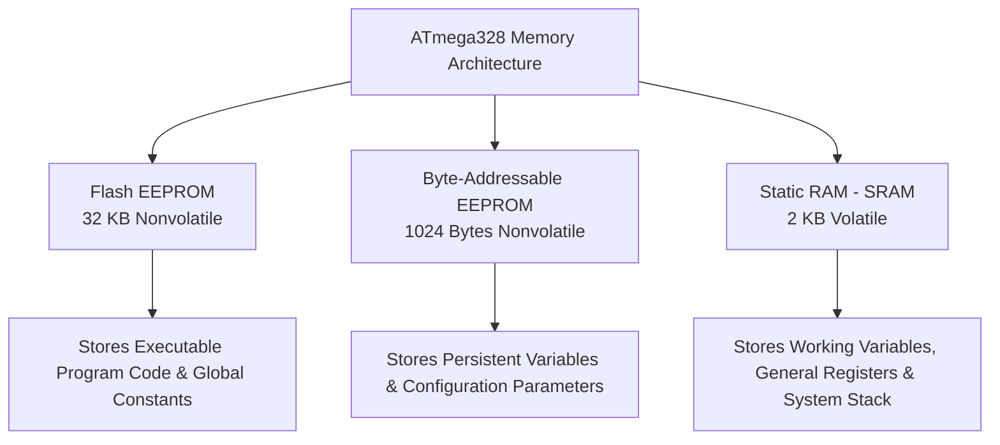
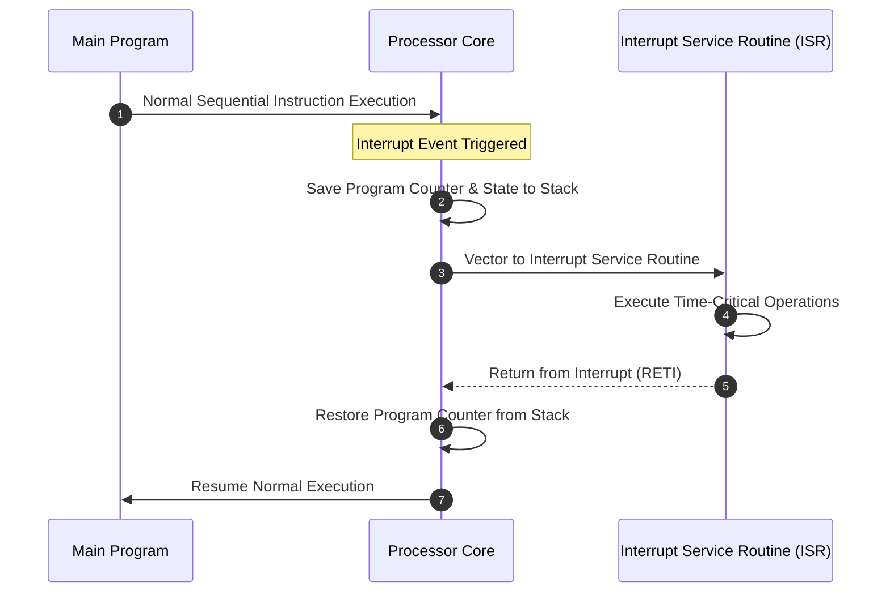
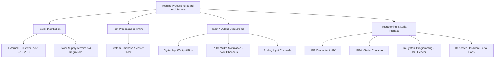

---
tags:
  - CCT3
  - indlejrede_systemer
Topic: "ATmega328 Architecture & Arduino Hardware Systems, Arduino UNO & Mega Hardware Platforms, LC-3 I/O Architecture: Privilege, Priority, and Memory-Mapped I/O, Computer I/O Fundamentals: Polling, Status Registers, and Device Synchronization"
Semester: CCT3
Course: Programmering af indlejrede systemer
Litterature:
  - "Arduino I: Getting Started"
  - "Introduction to Computing Systems: From Bits & Gates to C/C++ & Beyond, 3rd edition"
Created: 13-09-2026
---
- - -
## ADVANCED: ARDUINO UNO R3 HOST PROCESSOR – THE ATMEGA328

The host processor for the Arduino UNO R3 is the Microchip ATmega328, a 28-pin, 8-bit microcontroller. Its architecture is based on the **Reduced Instruction Set Computer (RISC)** concept, enabling it to achieve an execution throughput of 20 million instructions per second (MIPS) when operating at a clock frequency of 20 MHz.

![[Pasted image 20260913175350.png]]

> [!info] Core ATmega328 Subsystems
> - **Memory System:** 32 KB Flash, 1 KB EEPROM, 2 KB SRAM.
> - **Port System:** 14 digital I/O pins (6 support PWM) and 6 analog input pins across three general-purpose ports.
> - **Timer System:** Two 8-bit timer/counters, one 16-bit timer/counter, and PWM output channels.
> - **Analog-to-Digital Converter (ADC):** 10-bit resolution with up to 8 multiplexed channels.
> - **Interrupt System:** 26 total interrupt sources (2 external pin interrupts, 24 internal peripheral interrupts).
> - **Serial Communications:** Hardware USART, Serial Peripheral Interface (SPI), and Two-Wire Interface (TWI).

---

### ARDUINO UNO R3/ATMEGA328 HARDWARE FEATURES

The processing power of the Arduino UNO R3 is centered entirely around the integrated hardware systems of the ATmega328. The integrated architecture consolidates memory management, timing generation, input/output interfacing, analog-to-digital conversion, and serial networking onto a single semiconductor die.

---

### ATMEGA328 MEMORY

The ATmega328 contains three distinct internal memory sections, each optimized for specific data retention and access requirements:



![[Pasted image 20260913175441.png]]
#### ATmega328 In-System Programmable Flash EEPROM
In-system programmable (*ISP*) bulk flash EEPROM is dedicated to storing executable program instructions. It is reprogrammable and nonvolatile, meaning it retains its stored contents when the microcontroller is powered down.

- **Capacity & Organization:** 32 KB total capacity, arranged as 16K locations of 16-bit word length ($16\text{K} \times 16\text{ bits}$).
- **Usage:** Stores the program binary as well as large tables of constants declared as global variables.
- **Access:** Programmed and erased in bulk units during device programming.

#### ATmega328 Byte-Addressable EEPROM
Byte-addressable EEPROM provides nonvolatile data storage that can be read and written byte-by-byte during normal program execution.

- **Capacity:** 1024 bytes (1 KB).
- **Function:** Retains critical data during power failures that must be updated occasionally.
- **Common Applications:** Logging system malfunctions, recording fault data, storing system parameters, electronic lock combinations, and garage door opener security sequences.

#### ATmega328 Static Random Access Memory (SRAM)
Static RAM is volatile memory used for high-speed dynamic data handling; all contents are lost when power is removed.

- **Capacity:** 2 KB.
- **Allocation:**
  - **General-Purpose & I/O Registers:** Dedicated memory locations mapped directly to the processor's core registers and peripheral control registers. A standard header file links register names used in code to their physical hardware memory addresses.
  - **Dynamic Storage:** Stores global variables, dynamically allocated variables, and the system execution stack (used for function calls and return addresses).
    
![[Pasted image 20260913175527.png]]

---

### ATMEGA328 PORT SYSTEM

The ATmega328 provides general-purpose digital input/output (I/O) capability organized into three ports:
- `PORTB`: 8-bit port (`PORTB[7:0]`)
- `PORTC`: 7-bit port (`PORTC[6:0]`)
- `PORTD`: 8-bit port (`PORTD[7:0]`)

Each digital port is controlled through three dedicated 8-bit registers:
1. **Data Register (`PORTx`):** Used to write output logic levels to the port pins, or to enable/disable internal pull-up resistors when configured as inputs.
2. **Data Direction Register (`DDRx`):** Configures each individual pin as either an input (logic `0`) or an output (logic `1`).
3. **Input Pins Address Register (`PINx`):** Used to read the current digital state of the external physical pins.

| `DDxn` | `PORTxn` | Configured I/O State | Pin Operational Mode | Pull-Up Resistor |
| :---: | :---: | :---: | :--- | :---: |
| `0` | `0` | Input | Tri-state (High-Impedance / Hi-Z) | Disabled |
| `0` | `1` | Input | Source current when externally driven low | Enabled |
| `1` | `0` | Output | Output Low (Current Sink) | Disabled |
| `1` | `1` | Output | Output High (Current Source) | Disabled |

*Note: `x` denotes the port letter (`B`, `C`, `D`), and `n` represents the specific bit/pin index (`0`–`7`).*

![[Pasted image 20260913175554.png]]

> [!tip] Port Initialization Practice
> Port direction registers (`DDRx`) and initial logic states (`PORTx`) are typically defined during the setup phase at the beginning of a program, configuring all eight bits of a given port simultaneously.

---

### ATMEGA328 INTERNAL SYSTEMS

The internal peripheral systems inside the ATmega328 chip allow the execution of complex timing, signal acquisition, and communications tasks without requiring external controller hardware.

#### ATmega328 Time Base
The microcontroller acts as a synchronous finite state machine, executing instructions sequentially through a standard *fetch-decode-execute* sequence. An internal master clock distributes timing pulses across the processor core and all internal peripherals.

Clock sources can be supplied internally or via external timing components:
- **Internal RC Oscillator:** Selectable fixed frequencies programmed through on-chip fuse bits.
- **External Timing Sources:** Used when higher timing stability and accuracy are needed. In order of increasing frequency stability:
  1. External RC network
  2. Ceramic resonator
  3. Quartz crystal oscillator

> [!important]
> When interfacing the microcontroller with external peripheral devices or timing-sensitive communications buses, a high-stability source such as a **ceramic resonator** or **crystal oscillator** should be selected.

#### ATmega328 Timing Subsystem
The microcontroller contains specialized hardware counters used to generate precision waveforms, measure incoming signal parameters (frequency, period, duty cycle), or track external asynchronous events:
- Two **8-bit Timer/Counters**
- One **16-bit Timer/Counter**

#### Pulse Width Modulation Channels
A Pulse Width Modulated (**PWM**) signal maintains a constant operating frequency while modulating the proportion of time the signal remains at a logic-high state during each full period.

> [!summary] Mathematical Definition: PWM Duty Cycle
> 
> $$ \text{Duty Cycle (\%)} = \left( \frac{t_{\text{on}}}{T} \right) \times 100\% $$
> 
> **breakdown**:
> - $\text{Duty Cycle (\%)}$ : The percentage of one complete cycle during which the output pin is driven to a logic-high voltage.
> - $t_{\text{on}}$ : The active on-time duration (logic-high state) within a single cycle.
> - $T$ : The total waveform period ($T = t_{\text{on}} + t_{\text{off}} = \frac{1}{f}$, where $f$ is the waveform frequency).
> - $100\%$ : Scaling factor converting the fractional ratio to a percentage.

The ATmega328 uses its internal timers and prescaler clock dividers to output PWM signals ranging from high-frequency, low-duty-cycle pulses to low-frequency, high-duty-cycle pulses. Common applications include [[DC Motor Speed Control]] and [[Servo Motor Position Control]].

#### ATmega328 Serial Communications
Serial communication transmits information sequentially over a communication channel one bit at a time. The ATmega328 includes three distinct hardware-based serial communication subsystems:

##### Universal Synchronous and Asynchronous Receiver-Transmitter (USART)
- **Operation:** Supports full-duplex communication via independent transmit (`Tx`) and receive (`Rx`) hardware.
- **Asynchronous Mode:** Operates without a shared synchronization clock. Frame synchronization relies on start and stop framing bits flanking each data byte.
- **Configuration Features:**
  - Programmable Baud rates (bits per second).
  - Configurable data payload sizes (5 to 9 bits).
  - 1 or 2 stop bits per frame.
  - Hardware parity generation and verification (odd or even) to detect single-bit transmission errors.
  - Optional synchronous mode operation.

##### Serial Peripheral Interface (SPI)
- **Operation:** Synchronous full-duplex serial interface relying on a shared hardware clock line between transmitter and receiver, allowing higher throughput compared to asynchronous links.
- **Architecture:** Operates as a distributed 16-bit shift register consisting of an 8-bit master register and an 8-bit slave register.
- **Master/Slave Relationship:** The **Master** device outputs the synchronizing clock signal, while the connected **Slave** device receives the clock.

##### Two-Wire Serial Interface – TWI
- **Operation:** Multidrop, two-wire shared communications bus (compatible with the $\text{I}^2\text{C}$ standard) designed for networking local microcontrollers, sensors, memory devices, and displays.
- **Addressing & Capacity:** Connects up to 128 uniquely addressable devices over two physical signal lines.
- **Speed:** Supports data transfer rates up to 400 kHz within localized circuit designs.

#### ATmega328 Analog to Digital Converter – ADC
The integrated Analog-to-Digital Converter (**ADC**) digitizes continuous analog voltage levels into quantized digital integers.

- **Resolution:** 10-bit resolution ($2^{10} = 1024$ quantization levels), representing input voltages from $0\text{ V}$ to $5\text{ V}$ as integer values between $000_{16}$ ($0_{10}$) and $3\text{FF}_{16}$ ($1023_{10}$).
- **Voltage Resolution ($\Delta V$):**
  $$ \Delta V = \frac{V_{\text{ref}}}{2^n} = \frac{5.0\text{ V}}{1024} \approx 4.88\text{ mV/step} $$
  *(where $V_{\text{ref}} = 5\text{ V}$ and $n = 10\text{ bits}$)*

#### ATmega328 Interrupts
Interrupts allow the microcontroller to respond immediately to critical asynchronous hardware and software events by temporarily preempting normal program execution.



- **Execution Flow:** Upon receiving an interrupt trigger, the core suspends the main instruction stream, saves the execution context, and vectors to a dedicated **Interrupt Service Routine (ISR)**. When the ISR finishes, execution resumes where it was interrupted.
- **Interrupt Capacity:** 26 total interrupt vectors.
  - **2 External Pin Interrupts:** Triggered directly by voltage transitions on specific physical I/O pins.
  - **24 Internal Subsystem Interrupts:** Triggered by on-chip peripherals (timers, serial buffers, ADC conversion complete, EEPROM ready).

- - -
  
  ## ARDUINO UNO R3 OPEN SOURCE SCHEMATIC

The entire line of Arduino development platforms is built upon the concept of **open-source hardware and software**. Under this paradigm, complete circuit schematics, hardware design files, and software source code are openly published and shared across the development community to foster innovation, collaborative development, and widespread accessibility.

> [!info] Open-Source Hardware Philosophy
> Open-source hardware principles allow users and system designers to inspect, modify, reproduce, and distribute the physical design of the board, accelerating prototyping and custom embedded system implementations.

In accordance with this approach, the complete electrical schematic of the Arduino UNO R3 board is freely available, exposing the hardware interconnects among the host microcontroller, USB communication interface, voltage regulation circuitry, and I/O headers.

---

## ARDUINO MEGA 2560 R3 PROCESSING BOARD

The Arduino Mega 2560 R3 expands upon the capabilities of standard microcontroller boards, integrating a broader complement of input/output interfaces, communication buses, and dedicated hardware subsystems into a unified board layout.

### Hardware Architecture and Board Layout Components



- **Power Management System:**
  - **External DC Barrel Jack:** Accepts an unregulated input voltage ranging from $7\text{ VDC}$ to $12\text{ VDC}$ for standalone operation.
  - **Power Supply Terminals:** Provides regulated power distribution rails ($5\text{ V}$, $3.3\text{ V}$, and $\text{GND}$) for external circuits and expansion shields.
- **Microcontroller Core & Time Base:** Dedicated clock circuitry provides the synchronous time base required for instruction execution and peripheral timing.
- **Input/Output Interfacing:**
  - **Digital I/O Headers:** Multi-pin digital headers supporting high-density digital interfacing.
  - **PWM Outputs:** Dedicated digital output channels capable of pulse-width modulation for analog-like actuator and motor control.
  - **Analog Inputs:** Multi-channel analog inputs routed directly to the internal ADC.
- **Communication & Programming Interfaces:**
  - **USB Interface & Converter:** Bridges communication between a host PC and the microcontroller using a dedicated USB-to-Serial converter chip.
  - **In-System Programming (ISP) Connector:** Provides direct hardware-level programming access to the on-chip flash memory.
  - **Hardware Serial Communications:** Multi-channel serial USART pins for full-duplex communication with external sensors, displays, and secondary processors.

- - -
## I/O

Up to this point, the details of how a computer actually receives information from input devices (like a keyboard) and delivers information to output devices (like a monitor) have been abstracted away. Instead, the `TRAP` instruction (e.g., `TRAP x23` for input, `TRAP x21` for output) has been used to delegate these tasks to the operating system via a *trap vector*, trusting the OS to handle the underlying mechanics.

The more generic term for the `TRAP` instruction is a **system call** — the program calls on the operating system to perform a task while remaining completely unaware of how it is accomplished. This chapter examines how input and output actually work in the LC-3, what happens when a user program invokes a system call, and how the operating system orchestrates the entire process.

Before diving into the physical structures required for I/O, it is essential to understand a few foundational operating system concepts: **privilege**, **priority**, and the **memory address space layout**.

---

## Privilege, Priority, and the Memory Address Space

### Privilege and Priority

Privilege and priority are two fundamentally different (often described as *orthogonal*) concepts in computer processing.

#### Privilege

Privilege concerns the **right** to perform certain actions, such as executing a specific instruction or accessing a particular memory location. Not all programs have equal rights. For example, on a shared multi-user system, allowing any arbitrary program to execute a `HALT` instruction would stop the entire computer for all users. Similarly, certain memory locations belong exclusively to the operating system, and unauthorized access could crash the system.

To enforce these restrictions, every program is designated as either **privileged** or **unprivileged**:

- **Supervisor mode** (privileged): The program can execute all instructions and access all of memory.
- **User mode** (unprivileged): The program is restricted from executing certain instructions and accessing protected memory regions.

If a program running in User mode attempts an action requiring Supervisor mode, the hardware will not permit it.

#### Priority

Priority concerns the **urgency** of a program's need to execute. Every program is assigned a priority level that determines its urgency relative to all other programs. Higher-priority programs can interrupt lower-priority ones.

> [!example] Priority Assignment Example
> - A random user program might be assigned priority **0** (lowest urgency).
> - The keyboard might be assigned priority **4** (a user wants to input data *now*).
> - A power failure event might be assigned priority **6** (the system must react immediately to save state before losing power).

In this scenario, a user program would be interrupted by keyboard input, and that keyboard-driven program would itself be interrupted by a power failure event.

#### Two Orthogonal Notions

Privilege and priority are completely independent of each other. A program can have high priority without privilege, or high privilege without priority.

> [!example] Priority Without Privilege
> A user program tied to a time-critical physics experiment may need to interrupt the processor at a precise instant to record data. If it fails to preempt the currently running program, experimental data may be lost. This program has **high priority** (extreme urgency) but **no supervisor privilege** (it is still a user program).

> [!example] Privilege Without Priority
> A system administrator's diagnostic program may need to access all memory locations and execute all instructions for preventive maintenance. It requires **supervisor privilege** but has **no urgency** — whether it runs at 1 a.m. or 2 a.m. is irrelevant compared to time-critical tasks.

#### The Processor Status Register (PSR)

Each executing program has two critical registers associated with it: the **Program Counter (PC)** and the **Processor Status Register (PSR)**. The PSR encodes both the privilege level and the priority level of the currently running program, along with the condition codes.

| Bit(s) | Field | Description |
| :---: | :--- | :--- |
| `[15]` | **Pr** (Privilege) | `0` = Supervisor mode (privileged), `1` = User mode (unprivileged) |
| `[14:11]` | Unused | — |
| `[10:8]` | **PL** (Priority Level) | Ranges from `PL0` (lowest) to `PL7` (highest) |
| `[7:3]` | Unused | — |
| `[2]` | **N** (Negative) | Condition code: result was negative |
| `[1]` | **Z** (Zero) | Condition code: result was zero |
| `[0]` | **P** (Positive) | Condition code: result was positive |

![[Pasted image 20260913175710.png]]

> [!info] Key Takeaway
> The PSR is a 16-bit register that consolidates the program's privilege bit, its 3-bit priority level, and the three condition code flags (`N`, `Z`, `P`) into a single hardware register. The condition codes are stored in the PSR so they can be saved and restored during context switches such as interrupt handling.

---

### Organization of Memory

The LC-3 has a 16-bit address space spanning `x0000` to `xFFFF`. This address space is divided into three distinct regions:

| Address Range | Region | Privilege Required | Purpose |
| :--- | :--- | :--- | :--- |
| `x0000` – `x2FFF` | **System Space** | Supervisor | Operating system code and data structures |
| `x3000` – `xFDFF` | **User Space** | None | User programs and user data |
| `xFE00` – `xFFFF` | **I/O Page** | Supervisor | Memory-mapped I/O device registers and special processor registers |

> [!info] The I/O Page
> Addresses `xFE00` through `xFFFF` do not correspond to physical memory locations. Instead, they identify hardware registers involved in input/output operations and special processor registers. For example, the PSR is mapped to address `xFFFC` and the Master Control Register (MCR) is mapped to `xFFFE`. Mapping these registers into the address space allows the processor to use standard load/store instructions to interact with them.

**Stack Architecture:** The LC-3 maintains two separate stacks:
- **Supervisor Stack:** Located in system space, controlled by the operating system, requires supervisor privilege.
- **User Stack:** Located in user space, controlled by the user program, no privilege required.

![[Pasted image 20260913175741.png]]

Each stack has its own stack pointer — the **Supervisor Stack Pointer (SSP)** and the **User Stack Pointer (USP)**. Since a program executes in only one mode at a time, only one stack is active. Register `R6` typically serves as the active stack pointer. Two dedicated hardware registers, **Saved SSP** and **Saved USP**, hold the inactive stack pointer. When a privilege transition occurs (e.g., Supervisor → User), the current SP is saved to Saved SSP and the SP is loaded from Saved USP.

---

## Input/Output

All I/O devices — keyboards, monitors, disks, etc. — communicate with the processor through **device registers** tailored to each device's needs. At minimum, every I/O device requires two registers:
1. A **data register** to hold the information being transferred.
2. A **status register** to indicate the device's current state (e.g., ready or busy).

### Some Basic Characteristics of I/O

#### Memory-Mapped I/O vs. Special I/O Instructions

An instruction that interacts with an I/O device register must somehow identify which register it is targeting. Two historical approaches exist:

- **Special I/O Instructions:** A dedicated set of opcodes exists solely for I/O operations. The instruction's remaining bits identify the device register and the operation. This approach was used by older architectures.
- **Memory-Mapped I/O (preferred):** The same load and store instructions used for memory are reused for I/O. Each device register is assigned a unique address from the memory address space, making it indistinguishable from a memory location at the instruction level. A load from an input device address performs input; a store to an output device address performs output.

> [!info] Memory-Mapped I/O in the LC-3
> The LC-3 uses memory-mapped I/O. Addresses `x0000` through `xFDFF` correspond to actual memory. Addresses `xFE00` through `xFFFF` are reserved for I/O device registers. This means standard `LD`, `LDI`, `LDR`, `ST`, `STI`, and `STR` instructions can interact with I/O hardware simply by targeting the appropriate address.

#### Asynchronous vs. Synchronous

I/O devices typically operate at speeds vastly different from the processor, and not in lockstep with the processor's clock. This mismatch is called **asynchronous** operation.

> [!example] Speed Disparity
> A modern processor running at 2 GHz has a clock cycle of 0.5 nanoseconds. Even if reading an input register takes 10 clock cycles (5 ns), a human typist cannot possibly supply characters fast enough to keep the processor busy. The processor could theoretically read the keyboard register 200 million times per second, while a fast typist produces roughly 10 characters per second.

Because the two entities operate at different and variable speeds, a **handshaking protocol** is required. The simplest form is a single-bit **ready flag** in the device's status register:

- **For input (keyboard):** The ready bit is set to `1` when a new character has been typed. The processor reads the character and clears the bit to `0`. The processor checks the bit before reading to avoid re-reading the same character.
- **For output (monitor):** The ready bit is set to `1` when the monitor has finished displaying the previous character and can accept a new one.

If the device and processor *could* operate in perfect lockstep at a fixed rate, no ready bit would be needed — the processor would simply know exactly when new data is available. This hypothetical scenario is called **synchronous** I/O. In practice, nearly all processor-I/O interaction is asynchronous.

#### Interrupt-Driven vs. Polling

The question of *who initiates* the data transfer defines two fundamental I/O strategies:

- **Interrupt-Driven I/O:** The I/O device controls the interaction. When data is ready, the device sends an interrupt signal to the processor, effectively announcing that data is available. The processor suspends its current task, services the I/O, and resumes.
- **Polling:** The processor controls the interaction. It repeatedly checks (polls) the device's ready bit in a loop until the bit indicates that data is available or the device is ready. The processor is in charge of the timing.

---

### Input from the Keyboard

#### Basic Input Registers (KBDR and KBSR)

Keyboard input requires two memory-mapped device registers:

| Register | Address | Purpose |
| :--- | :--- | :--- |
| **KBSR** (Keyboard Status Register) | `xFE00` | Contains the ready bit at `[15]`. `1` = a new character is waiting; `0` = no new character. |
| **KBDR** (Keyboard Data Register) | `xFE02` | Contains the 8-bit ASCII code of the most recently typed character in bits `[7:0]`. |

Both registers are 16 bits wide to match the LC-3's addressable word size, even though only a subset of bits carries meaningful data.

![[Pasted image 20260913175815.png]]

**Synchronization behavior:**
1. When a key is struck, the keyboard hardware loads the ASCII code into `KBDR[7:0]` and automatically sets `KBSR[15]` to `1`.
2. While `KBSR[15] = 1`, the keyboard is disabled — no new keystrokes are accepted until the current character is read.
3. When the processor reads `KBDR`, the keyboard hardware automatically clears `KBSR[15]` to `0`, re-enabling the keyboard.

This mechanism guarantees that each keystroke is captured exactly once.

#### The Basic Input Service Routine

Using polling, the processor repeatedly tests `KBSR[15]` until it detects a `1`, then loads the character from `KBDR`:

```
; Polling-based keyboard input routine
; Loads the typed ASCII character into R0

START   LDI R1, KBSR_ADDR   ; Load KBSR contents into R1
        BRzp START           ; If bit [15] is 0, no character yet — loop
        LDI R0, KBDR_ADDR   ; Character is ready — load it from KBDR into R0
        BRnzp NEXT_TASK      ; Proceed to the next task

KBSR_ADDR  .FILL xFE00       ; Memory-mapped address of KBSR
KBDR_ADDR  .FILL xFE02       ; Memory-mapped address of KBDR
```

The `LDI` instruction performs an indirect load: it reads the address stored at the label (e.g., `xFE00`), then loads the contents of *that* address (the actual KBSR register) into the destination register. The `BRzp` branch checks the sign and zero condition codes — if `KBSR[15]` is `0`, the loaded value is non-negative, so the branch is taken and the loop repeats.

#### Implementation of Memory-Mapped Input

The data path for memory-mapped input closely mirrors a standard memory load operation:

1. The **MAR** is loaded with the address of the device register (instead of a memory location).
2. The **address control logic** detects that the address falls in the I/O page range and selects the appropriate device register to drive data onto the bus (instead of enabling memory).
3. The **MDR** is loaded with the device register's contents.
4. The destination general-purpose register is loaded from the MDR.

![[Pasted image 20260913175857.png]]

The only additional hardware is a multiplexer at the input to the MDR that can select between memory output and I/O device register output, controlled by the address control logic.

---

### Output to the Monitor

#### Basic Output Registers (DDR and DSR)

Monitor output uses two device registers analogous to the keyboard's:

| Register | Address | Purpose |
| :--- | :--- | :--- |
| **DSR** (Display Status Register) | `xFE04` | Contains the ready bit at `[15]`. `1` = monitor is ready for a new character; `0` = monitor is busy. |
| **DDR** (Display Data Register) | `xFE06` | Holds the 8-bit ASCII code to be displayed in bits `[7:0]`. |

**Synchronization behavior:**
1. When the processor writes an ASCII code to `DDR[7:0]`, the monitor hardware automatically clears `DSR[15]` to `0` and begins processing the character.
2. While `DSR[15] = 0`, the monitor is busy and cannot accept new characters.
3. When the monitor finishes displaying the character, it automatically sets `DSR[15]` back to `1`, signaling readiness for the next character.

#### The Basic Output Service Routine

Using polling, the processor waits for `DSR[15]` to become `1`, then stores the character into `DDR`:

```
; Polling-based monitor output routine
; Displays the ASCII character stored in R0

START   LDI R1, DSR_ADDR    ; Load DSR contents into R1
        BRzp START           ; If bit [15] is 0, monitor is busy — loop
        STI R0, DDR_ADDR    ; Monitor is ready — store R0 into DDR
        BRnzp NEXT_TASK      ; Proceed to the next task

DSR_ADDR   .FILL xFE04       ; Memory-mapped address of DSR
DDR_ADDR   .FILL xFE06       ; Memory-mapped address of DDR
```

Writing to `DDR` automatically clears `DSR[15]`, temporarily disabling further output until the monitor catches up.

#### Implementation of Memory-Mapped Output

The data path for memory-mapped output mirrors a standard store operation:

1. The **MAR** is loaded with the device register address.
2. The **MDR** is loaded with the data to be written.
3. The **address control logic** detects the I/O page address and asserts the load-enable signal of the target device register (instead of enabling a memory write).

![[Pasted image 20260913180028.png]]
Reading output device registers (e.g., polling `DSR`) uses the same read path as memory-mapped input — the address control logic routes the device register's contents through the MDR.

#### Example: Keyboard Echo

A simple echo program combines the input and output routines: it waits for a keystroke, reads the character, waits for the monitor to be ready, and displays the character on screen.

```
; Keyboard echo: reads a character and displays it

START   LDI R1, KBSR_ADDR   ; Poll keyboard status
        BRzp START           ; Wait for a keystroke
        LDI R0, KBDR_ADDR   ; Read the typed character

ECHO    LDI R1, DSR_ADDR    ; Poll display status
        BRzp ECHO            ; Wait for monitor to be ready
        STI R0, DDR_ADDR    ; Echo the character to the screen
        BRnzp NEXT_TASK

KBSR_ADDR  .FILL xFE00
KBDR_ADDR  .FILL xFE02
DSR_ADDR   .FILL xFE04
DDR_ADDR   .FILL xFE06
```

---

### A More Sophisticated Input Routine

A bare polling loop provides no feedback to the user, who may not know whether the program is running or waiting for input. A more user-friendly approach includes a **prompt** — a message displayed on the monitor telling the user that input is expected (similar to a command-line prompt like `%` or `C:\>`).

The enhanced routine performs the following sequence:
1. **Save registers** (`R1`, `R2`, `R3`) that will be used by the routine.
2. **Output a newline** character (ASCII `x0A`) to move the cursor to a fresh line.
3. **Output a prompt string** (e.g., `"Input a character>"`) character by character, polling `DSR[15]` before each character.
4. **Poll for keyboard input**, read the character from `KBDR`, and echo it to the monitor.
5. **Output a trailing newline** for clean formatting.
6. **Restore saved registers** and branch to the next task.

```Assembly
01 START ST R1,SaveR1 ; Save registers needed 02 ST R2,SaveR2 ; by this routine 03 ST R3,SaveR3 04 ; 05 LD R2,Newline 06 L1 LDI R3,DSR 07 BRzp L1 ; Loop until monitor is ready 08 STI R2,DDR ; Move cursor to new clean line 09 ; 0A LEA R1,Prompt ; Starting address of prompt string 0B Loop LDR R0,R1,#0 ; Write the input prompt 0C BRz Input ; End of prompt string 0D L2 LDI R3,DSR 0E BRzp L2 ; Loop until monitor is ready 0F STI R0,DDR ; Write next prompt character 10 ADD R1,R1,#1 ; Increment prompt pointer 11 BRnzp Loop ; Get next prompt character 12 ; 13 Input LDI R3,KBSR 14 BRzp Input ; Poll until a character is typed 15 LDI R0,KBDR ; Load input character into R0 16 L3 LDI R3,DSR 17 BRzp L3 ; Loop until monitor is ready 18 STI R0,DDR ; Echo input character 19 ; 1A L4 LDI R3,DSR 1B BRzp L4 ; Loop until monitor is ready 1C STI R2,DDR ; Move cursor to new clean line 1D LD R1,SaveR1 ; Restore registers 1E LD R2,SaveR2 ; to original values 1F LD R3,SaveR3 20 BRnzp NEXT_TASK ; Do the program's next task 21 ; 22 SaveR1 .BLKW 1 ; Memory for registers saved 23 SaveR2 .BLKW 1 24 SaveR3 .BLKW 1 25 DSR .FILL xFE04 26 DDR .FILL xFE06 27 KBSR .FILL xFE00 28 KBDR .FILL xFE02 29 Newline .FILL x000A ; ASCII code for newline 2A Prompt .STRINGZ ''Input a character>'' Figure 9.7 The more sophisticated input routine.
```

> [!tip] Control Characters
> Not all ASCII codes produce visible characters. **Control characters** trigger actions instead. For example, ASCII `x0A` (Newline) moves the cursor to the beginning of the next line. The prompt string is stored using the `.STRINGZ` pseudo-op, which appends a null terminator (`x0000`) to mark the end of the string. The output loop checks for this null terminator to know when the entire prompt has been displayed.

---

### Implementation of Memory-Mapped I/O, Revisited

The complete data path for memory-mapped I/O integrates both input and output capabilities through a unified **Address Control Logic** block that interprets three control signals:

| Signal | Function |
| :--- | :--- |
| **MIO.EN** | Memory/I/O Enable. `1` = a data transfer to/from memory or I/O is occurring this cycle; `0` = no transfer. |
| **MAR** | Contains the target address. The address control logic decodes this to determine whether the target is a memory location or a specific I/O device register. |
| **R.W** | Read/Write. Determines the direction of data flow (load from memory/I/O into MDR, or store from MDR to memory/I/O). |

**Read (Load) Operation:** The address control logic configures the input multiplexer to route data from either memory or the appropriate I/O device register into the MDR, based on the address in MAR.

**Write (Store) Operation:** The address control logic either enables a memory write or asserts the load-enable line of the specific device register identified by MAR, transferring the contents of the MDR to the target.

![[Pasted image 20260913180150.png]]
figur: Relevant data path implementation of memory-mapped I/O.

> [!note] Writeable Status Registers
> While the basic polling model only requires reading status registers, supporting interrupt-driven I/O requires that status registers (like `KBSR` and `DSR`) be writeable as well as readable, so the operating system can manipulate the ready bits during interrupt handling.