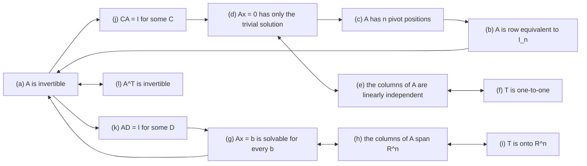

---
tags:
  - CCT3
  - Lin_Algebra
Topic: Karakterisering af invertible marticer og underrum.
Semester: CCT3
Course: Linær Algebra
Litterature:
  - Linear Algebra and Its Applications, Global Edition, 6ed
Created: 29-09-2026
---
## Table of Contents

1. [[#2.1 Characterizations of Invertible Matrices|2.1 Characterizations of Invertible Matrices]]
	1. [[#2.1 Characterizations of Invertible Matrices#Key Implications and Properties|Key Implications and Properties]]
	2. [[#2.1 Characterizations of Invertible Matrices#Classification of Square Matrices|Classification of Square Matrices]]
	3. [[#2.1 Characterizations of Invertible Matrices#Invertible Linear Transformations|Invertible Linear Transformations]]
	4. [[#2.1 Characterizations of Invertible Matrices#Numerical Notes|Numerical Notes]]
2. [[#2.2 Subspaces of $\mathbb{R}^n$|2.2 Subspaces of $\mathbb{R}^n$]]
	1. [[#2.2 Subspaces of $\mathbb{R}^n$#Geometric Interpretations and Counterexamples|Geometric Interpretations and Counterexamples]]
	2. [[#2.2 Subspaces of $\mathbb{R}^n$#Special Extreme Subspaces|Special Extreme Subspaces]]
	3. [[#2.2 Subspaces of $\mathbb{R}^n$#Column Space and Null Space of a Matrix|Column Space and Null Space of a Matrix]]
	4. [[#2.2 Subspaces of $\mathbb{R}^n$#Implicit versus Explicit Descriptions of Subspaces|Implicit versus Explicit Descriptions of Subspaces]]
	5. [[#2.2 Subspaces of $\mathbb{R}^n$#Basis for a Subspace|Basis for a Subspace]]
	6. [[#2.2 Subspaces of $\mathbb{R}^n$#Finding a Basis for the Null Space|Finding a Basis for the Null Space]]
	7. [[#2.2 Subspaces of $\mathbb{R}^n$#Finding a Basis for the Column Space|Finding a Basis for the Column Space]]
	8. [[#2.2 Subspaces of $\mathbb{R}^n$#Where the Two Halves Meet|Where the Two Halves Meet]]

# 2. Characterizations of Invertible Matrices and Subspaces

| Symbol or term | Meaning |
|---|---|
| $A$, an $n \times n$ matrix | A square matrix: $n$ rows and $n$ columns. In general an $m \times n$ matrix has $m$ rows and $n$ columns. |
| $A$, an $m \times n$ matrix | A rectangular matrix whose columns have $m$ entries each, so its column space lives in $\mathbb{R}^m$. |
| $I$ or $I_n$ | The identity matrix: ones on the main diagonal, zeros elsewhere; the matrix version of the number $1$. |
| $A^{-1}$ | The inverse of $A$: the unique matrix with $A^{-1}A = AA^{-1} = I$. |
| $A^T$ | The transpose of $A$: rows and columns interchanged. |
| $C$, $D$ | A left inverse ($CA = I$) and a right inverse ($AD = I$) of $A$. |
| IMT | Abbreviation used throughout this note for the **Invertible Matrix Theorem** (Theorem 1). |
| Invertible (nonsingular) | $A$ has an inverse; equivalently, all twelve statements of Theorem 1 hold for $A$. |
| Singular (noninvertible) | $A$ has no inverse; equivalently, every statement of Theorem 1 fails for $A$. |
| Elementary row operations | The three legal moves on a matrix: swap two rows; multiply a row by a nonzero scalar; add a multiple of one row to another. They never change the solution set of a system. |
| Row equivalence, $A \sim B$ | $B$ is obtained from $A$ by elementary row operations. |
| Echelon form | A row-reduction stop in which leading entries stair-step to the right with zeros below each pivot; not unique. |
| Reduced echelon form, RREF | The unique echelon form in which every pivot is $1$ and every other entry of a pivot column is $0$. |
| Pivot position (pivot) | The location of a leading entry in an echelon form of $A$; there are $n$ of them exactly when $A$ is invertible. |
| Pivot column | A column of $A$ whose position matches a column containing a pivot in an echelon form of $A$. |
| Basic variable | A variable whose column contains a pivot; it is expressed in terms of the free variables when solving. |
| Free variable | A variable whose column contains no pivot; solutions are parameterized by the free variables. |
| Homogeneous system | A system of the form $A\mathbf{x} = \mathbf{0}$; always consistent, since $\mathbf{x} = \mathbf{0}$ is a solution. |
| $\mathbb{R}^n$ | The set of all $n$-tuples of real numbers, read "$R$ to the $n$": $n$-dimensional Euclidean space. |
| $\mathbb{R}^m$ | The space of all $m$-entry columns; the output space of an $m \times n$ matrix. |
| Input space / output space | Informal names for $\mathbb{R}^n$ (where $\mathbf{x}$ lives) and $\mathbb{R}^m$ (where $A\mathbf{x}$ and $\mathbf{b}$ live). Keeping them apart avoids the most common confusion in this module. |
| $\mathbf{x}, \mathbf{b}, \mathbf{u}, \mathbf{v}, \mathbf{w}$ | Vectors, written as bold lowercase letters; each has $n$ entries when it lives in $\mathbb{R}^n$. |
| $\mathbf{0}$ | The zero vector: every entry is zero. |
| $\mathbf{a}_1, \dots, \mathbf{a}_n$ | The column vectors of the matrix $A = [\mathbf{a}_1 \; \mathbf{a}_2 \; \cdots \; \mathbf{a}_n]$. |
| $\mathbf{e}_1, \dots, \mathbf{e}_n$ | The standard basis vectors: the columns of $I_n$. |
| $c$ | A scalar, that is, a real number. |
| $\theta$, $\varepsilon$ | The rotation angle and the perturbation used in the two examples of the Numerical Notes. |
| $\mathbf{x} \mapsto A\mathbf{x}$ | The linear transformation defined by matrix multiplication with $A$ (read "$\mathbf{x}$ maps to $A\mathbf{x}$"). |
| $T$, $S$, $T^{-1}$ | A linear transformation, its inverse function, and the standard notation for that inverse. |
| $\implies$, $\iff$ | "Implies", and "if and only if" (logical equivalence). |
| One-to-one | Every $\mathbf{b}$ is the image of at most one $\mathbf{x}$; for a matrix transformation this means $\text{Nul } A = \{\mathbf{0}\}$. |
| Onto | Every $\mathbf{b}$ in the codomain is the image of some $\mathbf{x}$; for a matrix transformation this means $\text{Col } A$ is the whole codomain. |
| $H$ | A subset of $\mathbb{R}^n$; in this note usually a subspace. |
| Subspace | A set $H \subseteq \mathbb{R}^n$ that contains $\mathbf{0}$ and is closed under addition and scalar multiplication. |
| $\text{Span}\{\mathbf{v}_1, \dots, \mathbf{v}_p\}$ | The set of all linear combinations $c_1\mathbf{v}_1 + \dots + c_p\mathbf{v}_p$. |
| $\text{Col } A$ | The column space of $A$: the span of its columns, a subspace of $\mathbb{R}^m$. |
| $\text{Nul } A$ | The null space of $A$: the set of all solutions of $A\mathbf{x} = \mathbf{0}$, a subspace of $\mathbb{R}^n$. |
| $\mid$ | "Such that": in a set-builder description, everything after the bar is the condition the elements must satisfy. |
| Linearly independent set | A set whose only linear combination equal to $\mathbf{0}$ is the trivial one, with all coefficients $0$. |
| Linearly dependent set | A set that is not independent: some nontrivial combination of its vectors is $\mathbf{0}$, so at least one vector is a combination of the others. |
| Basis $\mathcal{B} = \{\mathbf{b}_1, \dots, \mathbf{b}_p\}$ | A linearly independent set that also spans $H$: the smallest spanning set a subspace can have. |
| Roundoff error | The small inaccuracy introduced when a computer rounds the result of an arithmetic operation to a fixed number of digits. |
| Condition number | A number reported by software that measures how close a matrix is to singular: $1$ for $I$, large for an ill-conditioned matrix, $\infty$ for a singular matrix. |
| Ill-conditioned | Invertible in exact arithmetic but nearly singular, so computed answers carry little reliability. |

_Table 2.1: Quick reference for every symbol, term, and abbreviation defined in this note._

---

This note joins the two halves of module B2 K1. The first half is the ***Invertible Matrix Theorem
(IMT)***: twelve statements about a square matrix that stand or fall together, so one computation
settles all of them at once. The second half zooms out from single systems to whole sets of vectors,
the ***subspaces of $\mathbb{R}^n$ ***, and to the two subspaces every matrix produces for free, its
column space $\text{Col } A$ and its null space $\text{Nul } A$. The halves meet at the end, and
the meeting is not a coincidence: for a square matrix $A$, the columns of $A$ span $\mathbb{R}^n$
exactly when $A$ is invertible (statement (h) of the theorem), and $\text{Nul } A = \{\mathbf{0}\}$
exactly when $A$ is invertible (statement (d)). Matrices and subspaces are two descriptions of one
structure, and this note moves between them in both directions.

> [!note] How this note maps to the course book
> The book is Lay, *Linear Algebra and Its Applications*, Global Edition, 6th edition. Its Theorems
> 8 and 9 of §2.3 are Theorems 1 and 2 here, and its Theorems 12 and 13 of §2.8 are Theorems 3 and
> 4. The lettering (a)–(l) of Theorem 1 is the book's own. In this note, §2.3 and §2.8 are the
> book's sections, while Section 2.1 and Section 2.2 are the two halves of the note.

---

## 2.1 Characterizations of Invertible Matrices

You already know how to answer the question "is this square matrix invertible?" by computing: invert
the matrix, or row reduce it and count pivots. Computing an answer works, but it gives no insight
into *why* the answer is what it is, and it does not carry over to statements about other objects.
This section replaces the computation with a *characterization*: a list of statements that all mean
exactly the same thing, so that proving any one of them proves all the others, and finding any one
of them false disproves all the others. That is a more economical arrangement than it sounds.
Instead of learning twelve theorems you learn one theorem with twelve faces, and you use whichever
face fits the problem in front of you.

The word *characterization* is worth taking literally. A characterization of a property is a list of
conditions that are individually different and jointly interchangeable: each can be checked without
reference to the others, and each is true exactly when the property is true. Mathematics is full of
them, and they are valued for a practical reason — a characterization lets you choose the test that
fits the tools in your hand. Here the property is invertibility, and the twelve tests range from
algebraic (an equation has only the trivial solution) through computational (count the pivot
positions) to geometric (the map covers the whole space and never merges two inputs). All twelve
will be used later in the course, and none of them is the "real" definition of invertibility — that
is the point of collecting them together.

The list below is the book's Theorem 8 of §2.3; the lettering (a)–(l) is kept identical to the book
so that you can read along without translating anything. Two conventions in the statement are worth
unpacking before you read it, because the whole list depends on them. Row equivalence to $I_n$ means
that $A$ can be carried to the identity matrix by elementary row operations — row swaps, scaling a
row by a nonzero number, and adding a multiple of one row to another — which changes the system's
appearance but never its solution set. And the phrase "the linear transformation
$\mathbf{x} \mapsto A\mathbf{x}$ " refers to the map that sends each vector $\mathbf{x}$ to the
product $A\mathbf{x}$; statements about that map and statements about the matrix $A$ are two ways
of saying the same thing, which is precisely why they can be listed in one theorem.

The two viewpoints in the list are worth naming, because later chapters lean on both. Statements (a)
through (e) and (j) through (l) are about the matrix: the array of numbers, its pivots, its columns,
its inverse, its transpose. Statements (f), (g) and (i) are about the map
$\mathbf{x} \mapsto A\mathbf{x}$: whether it merges inputs (one-to-one), whether it misses outputs
(onto), and whether every output can be produced (solvability for every $\mathbf{b}$). The theorem
says the two viewpoints can never disagree for a square matrix. Whenever a problem is phrased
geometrically — "does this map miss anything?" — you may answer with a pivot count, and whenever a
problem is phrased algebraically you may answer with a picture.

For square matrices and systems of $n$ linear equations in $n$ unknowns, fundamental concepts such
as matrix invertibility, linear independence, spanning, and solutions to linear systems are
interconnected.

> [!summary] Theorem 1: The Invertible Matrix Theorem
> Let $A$ be a square $n \times n$ matrix. Then the following statements are equivalent (for a given
> $A$, they are either all true or all false):
> a. $A$ is an invertible matrix.
> b. $A$ is row equivalent to the $n \times n$ identity matrix $I_n$.
> c. $A$ has $n$ pivot positions.
> d. The equation $A\mathbf{x} = \mathbf{0}$ has only the trivial solution.
> e. The columns of $A$ form a linearly independent set.
> f. The linear transformation $\mathbf{x} \mapsto A\mathbf{x}$ is one-to-one.
> g. The equation $A\mathbf{x} = \mathbf{b}$ has at least one solution for each $\mathbf{b}$ in
>    $\mathbb{R}^n$.
> h. The columns of $A$ span $\mathbb{R}^n$.
> i. The linear transformation $\mathbf{x} \mapsto A\mathbf{x}$ maps $\mathbb{R}^n$ onto
>    $\mathbb{R}^n$.
> j. There is an $n \times n$ matrix $C$ such that $CA = I$.
> k. There is an $n \times n$ matrix $D$ such that $AD = I$.
> l. $A^T$ is an invertible matrix.
>
> **Breakdown:**
> - $A$: the square coefficient matrix of $n$ equations in $n$ unknowns; $I_n$: the identity
>   matrix, the target of the row reduction in (b); $C$, $D$: a left and a right inverse, which
>   for square matrices coincide with $A^{-1}$.
> - $A^T$: the transpose, with $(A^T)^{-1} = (A^{-1})^T$.
>
> **Proof:**
> - **Core chain:** $(a) \implies (j)$: take $C = A^{-1}$. $(j) \implies (d)$: if $CA = I$ and
>   $A\mathbf{x} = \mathbf{0}$, then
>   $\mathbf{x} = I\mathbf{x} = C(A\mathbf{x}) = C\mathbf{0} = \mathbf{0}$. $(d) \implies (c)$: no
>   free variables means $n$ pivots. $(c) \implies (b)$: $n$ pivots in an $n \times n$ matrix lie
>   on the main diagonal, so the reduced echelon form is $I_n$. $(b) \implies (a)$: reducing $A$
>   to $I_n$ proves invertibility.
> - **Second route:** $(a) \implies (k)$: take $D = A^{-1}$. $(k) \implies (g)$:
>   $\mathbf{x} = D\mathbf{b}$ gives $A\mathbf{x} = A(D\mathbf{b}) = (AD)\mathbf{b} = \mathbf{b}$.
>   $(g) \implies (a)$: a solution for every $\mathbf{b}$ forces a pivot in every row, hence $n$
>   pivots.
> - **Clusters:** $(g) \iff (h) \iff (i)$: solvable for every $\mathbf{b}$ means the columns span
>   $\mathbb{R}^n$, which means onto. $(d) \iff (e) \iff (f)$: only the trivial solution means
>   independent columns, which means one-to-one.

The theorem is best read as a menu, not as a list of separate results. When you must decide whether
a square matrix is invertible, you are free to check whichever of the twelve statements is cheapest
for the matrix in front of you; when you must prove that a matrix is *not* invertible, you are free
to exhibit whichever failure is easiest to display. Row reduction serves all of these purposes at
once. If the reduction produces $n$ pivots, statement (c) is true and everything else follows; if it
produces fewer, the same reduction has already shown that $A\mathbf{x} = \mathbf{0}$ has a
nontrivial solution (so (d) fails), that the columns are linearly dependent (so (e) fails), and that
some vector $\mathbf{b}$ cannot be reached (so (g) fails). Nothing has to be checked twice, and no
statement can be true in isolation.

Choosing a statement is therefore a practical skill, and it is worth naming the shortcuts that pay
off most often. If the matrix is small and obviously singular — two equal rows, two equal columns, a
column of zeros — then quote the failure directly: a dependent column set (e) or a nontrivial switch
(h) needs no computation at all. If you are handed a candidate inverse $B$, check one product $AB$
and invoke (j) or (k); do not verify $BA$ as well. If the question is phrased about solutions —
"does $A\mathbf{x} = \mathbf{b}$ always have a solution?" — answer through (g), and if it is phrased
about maps — "is this transformation one-to-one?" — answer through (f). If the question is phrased
about a determinant, a rank, or a span, translate it into whichever of (a)–(l) it matches and then
read off the rest. What you should never do is re-derive the equivalence from scratch: the theorem
exists so that one fact about $A$, whichever you can get most cheaply, unlocks all eleven others.

The proof has a shape worth remembering, because the same shape reappears whenever equivalences are
chained together. Five statements form a closed loop,
$(a) \implies (j) \implies (d) \implies (c) \implies (b) \implies (a)$, and a second short route
$(a) \implies (k) \implies (g) \implies (a)$ joins the loop. Because the loop returns to its
starting point, every arrow in it reverses: the chain proves not only that (a) forces (b), but also
that (b) forces (a), and so on around the circle. The remaining statements are then attached in
equivalent clusters: (g), (h) and (i) all say "nothing is unreachable" — solvability, spanning and
being onto — while (d), (e) and (f) all say "nothing collapses" — trivial null space, independence
and being one-to-one. Finally (a) is paired with (l), because transposing a matrix does not change
whether it can be inverted.

_Figure 2.1: The implication cycle used in the proof of Theorem 1. The solid arrows form the two loops (a) → (j) → (d) → (c) → (b) → (a) and (a) → (k) → (g) → (a); the double-headed links attach the equivalent clusters (g)–(h)–(i), (d)–(e)–(f), and the pair (a)–(l)._

Because the proof is an argument about *implications*, it is worth reading it once in words rather
than in symbols, since that is the form in which you will later reconstruct it. The step
$(a) \implies (j)$ says that the second half of an inverse is easy: if a full inverse exists, then
it is in particular a left inverse. The step $(j) \implies (d)$ is the workhorse of the chain:
multiplying by $C$ is legitimate precisely because matrix multiplication distributes over sums, so a
solution of $A\mathbf{x} = \mathbf{0}$ gets trapped — anything $A$ sends to zero must already be
zero, and the only such vector is the trivial one. The step $(d) \implies (c)$ translates a fact
about solutions into a fact about the shape of the matrix: "no nontrivial solution" means "no free
variable" means "a pivot in every column", and since there are only $n$ columns, the count of pivots
is forced. The step $(c) \implies (b)$ finishes the desk work: with $n$ pivots in an $n \times n$
matrix, every row and every column contains one, so the reduced echelon form (RREF — the unique
echelon form in which every pivot is $1$ and every other pivot-column entry is $0$) has leading
ones down the diagonal, and the identity matrix is the only possibility. Finally $(b) \implies (a)$
closes the loop by reminding you what row equivalence to $I_n$ means: the row operations that
produce $I_n$ are exactly the reduction that produces the inverse. Once the loop is closed, the
second route $(a) \implies (k) \implies (g) \implies (a)$ can be read the same way: half an inverse
comes free with a full one; the step $(k) \implies (g)$ is constructive and does not merely claim
solvability but exhibits the solution $\mathbf{x} = D\mathbf{b}$; and $(g) \implies (a)$ reads the
guarantee backwards, since a solution for every right-hand side leaves no row of the echelon form
without a pivot, which is statement (c) in disguise. The clusters need no proof at all: (g), (h),
(i) are one statement seen through the equation, through the columns, and through the
transformation, and the same is true of (d), (e), (f).

Read this way, the two clusters are not two facts but two pictures of the same map. The cluster (d),
(e), (f) says that nothing collapses: no nonzero input is squashed to zero, no column is redundant,
and no two inputs share an output. The cluster (g), (h), (i) says that nothing is missed: every
target is reachable, the columns stretch to fill the whole space, and no output is left without a
preimage. For a square matrix the two failures are linked by counting. An $n \times n$ matrix has
$n$ pivot positions to distribute over $n$ rows and $n$ columns, so either every row and every
column gets one — nothing collapses and nothing is missed — or some row or some column goes without,
and then at least one direction is destroyed and at least one target is unreachable. There is no
intermediate case, and that absence of a middle ground is the whole content of the theorem.

> [!example] Deciding Invertibility with Pivot Positions
> Use the Invertible Matrix Theorem to decide whether $A$ is invertible:
> $$A = \begin{bmatrix} 1 & 0 & -2 \\ -3 & 1 & -2 \\ -5 & 1 & 9 \end{bmatrix}$$
> **Solution:** Row reduce $A$ and count pivot positions. Adding 3 times row 1 to row 2 and 5 times
> row 1 to row 3 gives
> $$A \sim \begin{bmatrix} 1 & 0 & -2 \\ 0 & 1 & -8 \\ 0 & 1 & -1 \end{bmatrix} \sim \begin{bmatrix} 1 & 0 & -2 \\ 0 & 1 & -8 \\ 0 & 0 & 7 \end{bmatrix}$$
> Each row operation can be checked by direct substitution: $\text{row}_2 + 3\,\text{row}_1$ is
> $(-3+3,\;1+0,\;-2-6) = (0,1,-8)$ ✓, and $\text{row}_3 + 5\,\text{row}_1$ is
> $(-5+5,\;1+0,\;9-10) = (0,1,-1)$ ✓. Subtracting row 2 from row 3 gives $(0,0,7)$ ✓. The matrix $A$
> has three pivot positions, a pivot in every row and every column. By statement (c) of the
> Invertible Matrix Theorem, $A$ is invertible — and the same count makes (a), (b) and (d)–(l) true
> at the same time.

> [!warning] Correction: The row reduction in the source example
> The source note-set displayed the intermediate matrices
> $\begin{bmatrix} 1 & 0 & -2 \\ 0 & 1 & 4 \\ 0 & 1 & 1 \end{bmatrix}$ and
> $\begin{bmatrix} 1 & 0 & -2 \\ 0 & 1 & 4 \\ 0 & 0 & 3 \end{bmatrix}$, which are not the results
> of the displayed operations: the correct second rows are $(0,1,-8)$ and $(0,1,-1)$, and the final
> subtraction gives $(0,0,7)$. The verdict is unaffected — three pivots, $A$ invertible, reduced
> echelon form $I_3$ — and the arithmetic has been corrected above.

Two habits make a row reduction like this one safe to do under time pressure. First, name the
operation before performing it — "row 3 plus five times row 1" — because the name of the operation
is also its check: the same phrase tells you which arithmetic to verify if the final count looks
wrong. Second, remember what the verdict depends on: only the count of pivots decides invertibility,
not the values in the nonzero entries, so a slip in the intermediate arithmetic rarely changes the
answer, but it will change every later conclusion drawn from those entries. That is exactly what
happened in the source example above — the arithmetic was off, the verdict was still right, and the
note records the correction anyway, because a study note that keeps a wrong intermediate step
teaches the wrong step.

### Key Implications and Properties

Two consequences of the theorem are worth isolating, because they are used constantly in exercises,
and both of them sharpen a statement rather than add a new one.

The first is that existence becomes uniqueness. An invertible matrix has $n$ pivot positions and
therefore no free variables, so statement (g) can be strengthened: the equation
$A\mathbf{x} = \mathbf{b}$ has a ***unique*** solution for each $\mathbf{b}$ in $\mathbb{R}^n$, not
merely "at least one". The argument is two lines long and you should be able to reproduce it: if
$\mathbf{x}$ and $\mathbf{y}$ are both solutions, then
$A(\mathbf{x} - \mathbf{y}) = A\mathbf{x} - A\mathbf{y} = \mathbf{b} - \mathbf{b} = \mathbf{0}$, so
$\mathbf{x} - \mathbf{y}$ lies in the null space of $A$; statement (d) says the only vector in that
null space is $\mathbf{0}$, hence $\mathbf{x} = \mathbf{y}$. Notice what this argument uses: not
the inverse, not a computation, only the two statements (d) and (g) that the theorem says are
equivalent. For square matrices, "a solution always exists" and "the solution is always unique" are
two halves of one property, and the Invertible Matrix Theorem is the bridge between them.

The second is that a one-sided inverse is automatically two-sided:

$$\text{If } AB = I \text{ for square } n \times n \text{ matrices } A, B,\; \text{then both are invertible, with } B = A^{-1} \text{ and } A = B^{-1}.$$

This is why statements (j) and (k) can appear in the theorem at all. Each of them supplies only half
of the inverse relation — one product equal to $I$ — yet in the square case half is enough, and the
missing half comes for free. In practice it means that verifying a single matrix product such as
$AB = I$ already proves both $A^{-1} = B$ and $B^{-1} = A$, so a candidate inverse never has to be
checked twice. For rectangular matrices the statement fails completely, and the failure is
instructive; the example at the end of [[#Invertible Linear Transformations]] shows a matrix that
has one one-sided inverse and cannot have the other. These two facts are also the first entries in
the dictionary assembled in [[#Where the Two Halves Meet]] , where the same statements reappear in
the language of subspaces.

Both facts are worth carrying forward as a reflex. When a problem presents a square matrix and asks
for a solution of $A\mathbf{x} = \mathbf{b}$, the first question to settle is not "what is the
solution?" but "which case is this?". If $A$ is invertible, a solution exists for every right-hand
side and is unique, so the remaining work is pure arithmetic. If $A$ is singular, the answer
reverses: existence depends on $\mathbf{b}$, and whenever a solution exists there are infinitely
many, parameterized by the free variables. A large share of exam questions are disguised versions of
this dichotomy, and the two-line argument above is the tool that turns it into something you can
quote.

Uniqueness is what makes an inverse worth computing. If $A$ is invertible and you have obtained an
inverse by any route — row reduction on $\begin{bmatrix} A & I \end{bmatrix}$, a formula, or a
candidate handed to you in a problem — then that inverse is *the* inverse, and the solution of any
system with coefficient matrix $A$ is $\mathbf{x} = A^{-1}\mathbf{b}$, with no further checking of
consistency or free variables. This is why later chapters care how expensive finding an inverse is,
and why the one-sided criterion matters so much: it turns the search for an inverse into a search
for any single matrix whose product with $A$ is $I$.

> [!example] One Product Certifies Both Matrices
> Let $A = \begin{bmatrix} 2 & 1 \\ 1 & 1 \end{bmatrix}$ and
> $B = \begin{bmatrix} 1 & -1 \\ -1 & 2 \end{bmatrix}$. Compute
> $$AB = \begin{bmatrix} 2(1) + 1(-1) & 2(-1) + 1(2) \\ 1(1) + 1(-1) & 1(-1) + 1(2) \end{bmatrix} = \begin{bmatrix} 1 & 0 \\ 0 & 1 \end{bmatrix} = I.$$
> Since $A$ and $B$ are square and $AB = I$, the implication above applies immediately:
> $B = A^{-1}$ and $A = B^{-1}$. There is no need to compute $BA$ at all — but it is reassuring
> that the other product agrees:
> $BA = \begin{bmatrix} 1(2) + (-1)(1) & 1(1) + (-1)(1) \\ -1(2) + 2(1) & -1(1) + 2(1) \end{bmatrix} = \begin{bmatrix} 1 & 0 \\ 0 & 1 \end{bmatrix}$
> ✓, exactly as the theorem promises.

### Classification of Square Matrices

The Invertible Matrix Theorem divides all $n \times n$ matrices into two disjoint classes, and every
square matrix you ever meet lands in exactly one of them:

1. **Invertible (nonsingular) matrices:** matrices that satisfy every equivalent condition in the
   theorem.
2. **Noninvertible (singular) matrices:** matrices that satisfy none of the conditions.

> [!info] Definition: Invertible and Singular Matrices
> A square matrix $A$ is ***invertible***, or ***nonsingular***, if $A^{-1}$ exists — equivalently,
> if any one statement of the IMT holds for $A$. It is ***singular***, or ***noninvertible***, if
> no inverse exists — equivalently, if every statement of the IMT fails for $A$.
>
> **Breakdown:**
> - ***Invertible***: the matrix can be undone, so no information is lost; twelve equivalent tests
>   are available.
> - ***Singular***: the matrix collapses at least one nonzero direction to $\mathbf{0}$, so it can
>   never be undone.
> - **Nonsingular / noninvertible:** the two alternative names; exam questions alternate between
>   them freely, so know all four words.

The second class is worth stating in its own right, because in practice you usually meet a singular
matrix through one of its symptoms rather than through a failed inversion. Negating any single
statement of the theorem gives a property of every singular matrix: a singular $n \times n$ matrix
is *not* row equivalent to $I_n$, it has *fewer* than $n$ pivot positions, its columns are linearly
dependent — some nontrivial combination of them is $\mathbf{0}$ — and the equation
$A\mathbf{x} = \mathbf{0}$ has a nontrivial solution, while $A\mathbf{x} = \mathbf{b}$ fails to have
a solution for some $\mathbf{b}$. Because the statements are equivalent, each of these symptoms is
a complete diagnosis: demonstrate any one of them and you have proved that the matrix is singular,
with all the others following automatically.

It helps to picture what those symptoms have in common. An invertible $n \times n$ matrix is a
transformation that loses no information: every vector of $\mathbb{R}^n$ is produced by exactly one
input, so the matrix can be undone. A singular matrix is a transformation that collapses at least
one direction to nothing — some nonzero vector is sent to $\mathbf{0}$ — and once a direction is
collapsed, information about it can never be recovered, which is why no inverse can exist. In
geometric language, a singular square matrix squashes all of $\mathbb{R}^n$ onto a lower-dimensional
region: a plane, a line, or even the single point $\mathbf{0}$. That region is the column space,
and the collapsed direction is the null space, both of which return in Section 2.2 as the two
natural subspaces of a matrix.

Spotting the failure is often faster than computing it. A square matrix is singular as soon as two
rows are equal, or one row is a multiple of another, or a row or a column is entirely zero, or two
columns coincide — each of these is a visible linear dependence among the columns, which is
statement (e) failing. The visible cases cover most exam questions; for the rest, a single row
reduction settles it, because the moment fewer than $n$ pivots appear, the same reduction has also
exhibited a nontrivial solution of $A\mathbf{x} = \mathbf{0}$. What you should not expect to find
is a matrix that is "half invertible": the collapse is an all-or-nothing property of the whole
matrix, and that is precisely why the theorem can list twelve equivalent statements instead of
twelve independent ones.

The classification also supplies the vocabulary for everything that follows. Whenever a theorem says
"for an invertible matrix" or "provided $A$ is nonsingular", it is stating which side of the divide
the matrix must lie on, and the contrapositive is usually the useful reading: statements proven for
singular matrices describe exactly what can go wrong when a system misbehaves. In the second half of
this note the same divide reappears geometrically — an invertible matrix has the smallest possible
null space and the largest possible column space — and the two descriptions may be used
interchangeably.

> [!example] Two $2 \times 2$ Matrices, Classified
> Row reduce $A = \begin{bmatrix} 1 & 2 \\ 2 & 5 \end{bmatrix}$: subtracting twice row 1 from row 2
> gives $\begin{bmatrix} 1 & 2 \\ 0 & 1 \end{bmatrix}$, which reduces further to $I_2$; so $A$ has
> two pivot positions and, by statement (c), is invertible (nonsingular). Now row reduce
> $B = \begin{bmatrix} 1 & 2 \\ 2 & 4 \end{bmatrix}$: the same subtraction gives
> $\begin{bmatrix} 1 & 2 \\ 0 & 0 \end{bmatrix}$, with a single pivot. Its columns are dependent,
> since the second column is twice the first,
> $2\begin{bmatrix} 1 \\ 2 \end{bmatrix} = \begin{bmatrix} 2 \\ 4 \end{bmatrix}$ ✓; and
> $B\begin{bmatrix} -2 \\ 1 \end{bmatrix} = \begin{bmatrix} 1(-2) + 2(1) \\ 2(-2) + 4(1) \end{bmatrix} = \begin{bmatrix} 0 \\ 0 \end{bmatrix}$
> ✓, so $B\mathbf{x} = \mathbf{0}$ has a nontrivial solution. Statement (e) fails, statement (d)
> fails, and $B$ is singular — for a square matrix, one failure drags all twelve statements down
> with it.

### Invertible Linear Transformations

Matrix multiplication is not only a way of combining arrays of numbers; it is composition of linear
transformations, the same operation seen from the other side. From that point of view, an invertible
matrix is the matrix of a transformation that can be undone. The relation
$A^{-1}A\mathbf{x} = \mathbf{x}$ says exactly that: multiplying an input $\mathbf{x}$ by $A$
transforms it into $A\mathbf{x}$, and multiplying by $A^{-1}$ transforms $A\mathbf{x}$ back into
$\mathbf{x}$. Thinking this way is not merely a change of vocabulary. It explains why the
Invertible Matrix Theorem speaks about one-to-one and onto at all — those are properties of
transformations, not of arrays — and it makes several of the twelve statements obvious: a
transformation can be undone precisely when it never merges two inputs and never misses an output.

> [!info] Definition: Invertible Linear Transformation
> A linear transformation $T: \mathbb{R}^n \to \mathbb{R}^n$ is ***invertible*** if there exists a
> function $S: \mathbb{R}^n \to \mathbb{R}^n$ such that
> $$S(T(\mathbf{x})) = \mathbf{x} \quad \text{and} \quad T(S(\mathbf{x})) = \mathbf{x} \quad \text{for all } \mathbf{x} \text{ in } \mathbb{R}^n.$$
> If such an $S$ exists, it is unique and it is automatically a linear transformation; it is called
> the ***inverse*** of $T$ and is written $T^{-1}$.
>
> **Breakdown:**
> - $T$: the transformation being inverted; $S$ (later $T^{-1}$): the function that undoes it.
> - The two identities: $T$ and $S$ undo each other from either side; requiring both is what makes
>   the inverse unique and linear.

The definition asks for both compositions because one direction alone is too weak: a function could
undo everything $T$ produces and still fail to be a genuine inverse. Demanding both recovers the
matrix situation exactly, and the next theorem makes the dictionary between a transformation and its
standard matrix precise. It is the book's Theorem 9 of §2.3.

Composition is also the reason matrix multiplication is defined the way it is. If $S$ has standard
matrix $B$ and $T$ has standard matrix $A$, then applying first $S$ and then $T$ gives
$(T \circ S)(\mathbf{x}) = A(B\mathbf{x}) = (AB)\mathbf{x}$, so the product of matrices is the
algebra of doing one transformation after another. An inverse is then a composition that returns
every vector to its starting point, in either order: $T^{-1} \circ T$ and $T \circ T^{-1}$ are both
the identity map, whose standard matrix is $I$. Seen this way, the two identities in the definition
are one requirement written twice — once for the input side and once for the output side — and the
matrix relation $A^{-1}A = AA^{-1} = I$ is their algebraic shadow.

The geometric content of the definition is exactly bijectivity. An invertible map pairs every input
with a distinct output and, conversely, every output with exactly one input: nothing is merged,
nothing is missed, so the map can be run backwards without ambiguity. The two examples show how
differently the failures can look. A rotation moves the plane rigidly, so it is one-to-one and onto,
and its inverse is the rotation back. A projection that flattens the plane onto a line merges whole
directions into single points and is therefore not one-to-one — and no inverse can exist, because
the information about where in a direction you started was destroyed by the map itself.

> [!summary] Theorem 2: Invertibility of Linear Transformations
> Let $T: \mathbb{R}^n \to \mathbb{R}^n$ be a linear transformation with standard matrix $A$. Then
> $T$ is invertible if and only if $A$ is invertible, and in that case
> $S(\mathbf{x}) = A^{-1}\mathbf{x}$ is the unique map with $S(T(\mathbf{x})) = \mathbf{x}$ and
> $T(S(\mathbf{x})) = \mathbf{x}$ for all $\mathbf{x}$.
>
> **Breakdown:**
> - $T$: the transformation; $A$: its $n \times n$ standard matrix, so
>   $T(\mathbf{x}) = A\mathbf{x}$; $S$ or $T^{-1}$: the inverse map, with standard matrix $A^{-1}$
>   .
>
> **Proof:**
> - ** $T$ invertible $\implies$ $A$ invertible:** $T(S(\mathbf{x})) = \mathbf{x}$ makes $T$ onto,
>   which is statement (i); the IMT then makes $A$ invertible.
> - ** $A$ invertible $\implies$ $T$ invertible:** $S(\mathbf{x}) = A^{-1}\mathbf{x}$ is linear, and
>   $S(T(\mathbf{x})) = (A^{-1}A)\mathbf{x} = \mathbf{x}$,
>   $T(S(\mathbf{x})) = (AA^{-1})\mathbf{x} = \mathbf{x}$ ✓, so $S = T^{-1}$.

Read in words, the two directions of the proof are the two halves of the dictionary between maps and
matrices. The forward direction says that if the transformation can be undone, then it must already
map onto its codomain, because undoing a vector requires it to have been produced in the first
place; onto-ness hands the conclusion straight to the IMT, which supplies invertibility of $A$. The
reverse direction constructs the inverse rather than assuming it: multiplication by $A^{-1}$ is
linear, and the two composition identities for it are just the associativity of matrix
multiplication. Nothing else is needed, and this is a good example of a proof where the hard work
was done in advance by a theorem — the pair (a) and (i) of the Invertible Matrix Theorem is what
makes the whole argument short.

> [!example] Rotations Are Invertible, Projections Are Not
> Let $T: \mathbb{R}^2 \to \mathbb{R}^2$ rotate every vector counterclockwise by an angle $\theta$,
> with standard matrix
> $R_\theta = \begin{bmatrix} \cos\theta & -\sin\theta \\ \sin\theta & \cos\theta \end{bmatrix}$.
> Intuitively, the way to undo a rotation is to rotate back, so the inverse should be
> $R_{-\theta} = \begin{bmatrix} \cos\theta & \sin\theta \\ -\sin\theta & \cos\theta \end{bmatrix}$
> . Theorem 2 confirms it, because
> $$R_\theta R_{-\theta} = \begin{bmatrix} \cos^2\theta + \sin^2\theta & \cos\theta\sin\theta - \sin\theta\cos\theta \\ \sin\theta\cos\theta - \cos\theta\sin\theta & \sin^2\theta + \cos^2\theta \end{bmatrix} = \begin{bmatrix} 1 & 0 \\ 0 & 1 \end{bmatrix} ✓$$
> using the identity $\cos^2\theta + \sin^2\theta = 1$. Since the rotation matrix is square and
> this one product is $I$, the matrix is invertible and $R_\theta^{-1} = R_{-\theta}$.
> For contrast, consider the projection $P$ onto the $x$ -axis, $P(x, y) = (x, 0)$, with standard
> matrix $\begin{bmatrix} 1 & 0 \\ 0 & 0 \end{bmatrix}$. It maps both $(0,1)$ and $(0,0)$ to
> $\mathbf{0}$, so it is not one-to-one; by statement (f) of the Invertible Matrix Theorem its
> matrix is not invertible, and indeed $P$ has no inverse — no function can recover the $y$
> -coordinate that the projection threw away.

> [!example] One-to-One Transformations on $\mathbb{R}^n$
> **Problem:** What can be deduced about a one-to-one linear transformation
> $T: \mathbb{R}^n \to \mathbb{R}^n$ ?
> **Solution:** If $T$ is one-to-one, the columns of its standard matrix $A$ are linearly
> independent, so statement (e) of the Invertible Matrix Theorem holds. Because $A$ is square, every
> other statement holds with it:
> 1. $A$ is invertible;
> 2. $T$ maps $\mathbb{R}^n$ onto $\mathbb{R}^n$ (statement (i));
> 3. $T$ is an invertible linear transformation, with $T^{-1}(\mathbf{x}) = A^{-1}\mathbf{x}$ by
>    Theorem 2.
> The moral is that for square matrices there is no such thing as "one-to-one but not onto": a
> transformation from $\mathbb{R}^n$ to itself is one-to-one exactly when it is onto, because both
> conditions collapse into the invertibility of the standard matrix ✓.

> [!warning] The Theorem Applies Strictly to Square Matrices
> Nothing above applies to rectangular matrices ($m \times n$ with $m \neq n$). The twelve
> statements are equivalent only because $A$ is square; for a rectangular matrix, "the columns are
> independent" and "the columns span the output space" are genuinely different conditions. The
> columns of a $4 \times 3$ matrix can be independent, and yet $A\mathbf{x} = \mathbf{b}$ still
> fails for some $\mathbf{b}$ in $\mathbb{R}^4$: three independent columns span at most a
> 3-dimensional subspace of a 4-dimensional space. The next example shows the same asymmetry through
> one-sided inverses.

> [!example] One Rectangular Matrix, Half an Inverse
> Take $A = \begin{bmatrix} 1 & 0 \\ 0 & 1 \\ 0 & 0 \end{bmatrix}$, a $3 \times 2$ matrix whose two
> columns are independent, and let $C = \begin{bmatrix} 1 & 0 & 0 \\ 0 & 1 & 0 \end{bmatrix}$. The
> product
> $$CA = \begin{bmatrix} 1 & 0 & 0 \\ 0 & 1 & 0 \end{bmatrix}\begin{bmatrix} 1 & 0 \\ 0 & 1 \\ 0 & 0 \end{bmatrix} = \begin{bmatrix} 1 & 0 \\ 0 & 1 \end{bmatrix} = I_2 ✓$$
> shows that $C$ is a left inverse of $A$. No right inverse can exist, however: for any
> $3 \times 2$ matrix $D$, the product $AD$ is a $3 \times 3$ matrix whose third row is a
> combination of the third row of $A$ — a row of zeros — so the third row of $AD$ is always zero and
> can never equal the third row $(0,0,1)$ of $I_3$. Half an inverse exists, and the other half does
> not: the guarantee that one-sided inverses are two-sided genuinely requires a square matrix.

### Numerical Notes

Everything above is exact arithmetic; computation is not. Roundoff error — the small inaccuracy a
computer introduces when it rounds the result of each arithmetic operation to a fixed number of
digits — turns invertibility into a delicate question. In practice an invertible matrix can be
*nearly singular*, or ***ill-conditioned***, in the sense that slight perturbations of its entries
can turn it into a singular matrix, and roundoff error is then dangerous in both directions. During
row reduction of an ill-conditioned matrix, arithmetic noise may hide a genuine pivot and make an
invertible matrix appear singular; in the other direction, noise can create tiny nonzero values
where zeros belong, making a singular matrix appear invertible. Neither failure is visible from the
row reduction alone, because the row reduction is exactly the place where the noise enters.

To quantify the danger, computational software reports a **condition number** for a square matrix;
the next definition states how it behaves and what it is used for.

> [!info] Definition: Condition Number
> The ***condition number*** of a square matrix is a measure, computed by software, of how sensitive
> its inversion is to perturbations of its entries. It is $1$ for the identity matrix (the optimal
> baseline), finite but large for an ill-conditioned matrix, and infinite for a singular matrix.
>
> **Breakdown:**
> - **Small** condition number: the matrix is far from singular and computed results can be trusted.
>   **Large**: high sensitivity to roundoff error and severe loss of precision.
> - **Infinite**: the exact signature of a singular matrix; when the computed value is extremely
>   large, software may be unable to tell the last two cases apart.

What should you do with this in practice? Treat the condition number as a health warning attached to
the answer, not to the matrix. A small condition number means the report can be trusted; a huge one
means the verdict may flip under tiny changes in the data, so check the result by an independent
route — for instance by substituting the computed solution back into the original system and
measuring the residual. In the language of [[#Classification of Square Matrices]] , ill-conditioning
means the matrix is invertible but sits extremely close to the wall between the two classes, and the
example below shows how thin that wall can be.

It is worth seeing how ill-conditioning appears inside a row reduction, because the symptom is easy
to mistake for a mistake. A nearly singular matrix produces a pivot that is tiny relative to the
entries around it; dividing the rows below by that pivot multiplies their arithmetic noise by
roughly the reciprocal of its size, so the trustworthy digits of the answer disappear one by one. A
pivot of size $10^{-8}$ reached from entries of size $10$ costs about eight digits of accuracy in
every later step — and at sixteen digits of working precision there is very little left. The same
phenomenon, read backwards, explains why professional software interchanges rows: choosing the
largest available entry as the pivot keeps the multipliers small and the computation stable.

Practical advice follows. When a computed answer depends on inverting or row reducing a matrix, ask
two questions before trusting it: how large was the condition number, and does the answer survive a
substitution check? If the condition number is close to the working precision, the honest conclusion
is not that the matrix is singular but that this computation cannot decide — a distinction that
matters in applications such as model fitting, where a nearly singular system is the shape of a
model whose parameters are not really determined by the data. And when a matrix has entries at
wildly different scales, rescaling its rows (and the matching right-hand sides) before computing can
lower the condition number while leaving the exact solution unchanged, since scaling an equation by
a nonzero number does not change its solution set.

> [!example] How Close Can an Invertible Matrix Be to Singular?
> Take $A_\varepsilon = \begin{bmatrix} 1 & 1 \\ 1 & 1 + \varepsilon \end{bmatrix}$ with
> $\varepsilon = 10^{-4}$. Its inverse is
> $$A_\varepsilon^{-1} = \frac{1}{\varepsilon}\begin{bmatrix} 1 + \varepsilon & -1 \\ -1 & 1 \end{bmatrix} = \begin{bmatrix} 10001 & -10000 \\ -10000 & 10000 \end{bmatrix},$$
> which can be checked directly: the first row of $A_\varepsilon A_\varepsilon^{-1}$ is
> $(1 \cdot 10001 + 1 \cdot (-10000),\; 1 \cdot (-10000) + 1 \cdot 10000) = (1, 0)$ ✓, and the
> second is
> $(1 \cdot 10001 + 1.0001 \cdot (-10000),\; 1 \cdot (-10000) + 1.0001 \cdot 10000) = (0, 1)$ ✓. So
> $A_\varepsilon$ is genuinely invertible. Yet changing a single entry by $10^{-4}$ turns it into
> the singular matrix $\begin{bmatrix} 1 & 1 \\ 1 & 1 \end{bmatrix}$, whose two columns are
> identical and which therefore fails every statement of the Invertible Matrix Theorem. The
> perturbation is tiny compared with the entries of $A_\varepsilon^{-1}$, which are of size $10^4$
> ; the condition number here is about $4 \times 10^4$, so a computer working at ordinary precision
> cannot be trusted to distinguish $A_\varepsilon$ from its singular neighbour.

The computations in this note are exact because the entries are small integers, and it is worth
knowing when that stops being true. For matrices with integer entries, compute the pivot count
exactly, by hand or with fractions: a computer working in decimals may report a pivot where none
exists, or miss one that does — the ill-conditioned example above is precisely the boundary case.
And never decide invertibility from a determinant that comes out as a tiny rounded number such as
$10^{-12}$: in exact arithmetic the determinant is either zero or it is not, and a floating-point
value that small cannot distinguish "singular" from "nearly singular" by itself.

---

## 2.2 Subspaces of $\mathbb{R}^n$

The Invertible Matrix Theorem studied a single system $A\mathbf{x} = \mathbf{b}$ and a single
matrix. The next step is to study whole *sets* of vectors at once, and to ask which sets behave like
smaller copies of $\mathbb{R}^n$ inside $\mathbb{R}^n$. Subspaces are exactly those sets, and they
arise from the most ordinary objects in the subject: the solution set of a homogeneous system, the
collection of vectors a matrix can produce, the lines and planes through the origin. The gain from
naming them is not decorative. Once a set is known to be a subspace, it can be described by a finite
list of spanning vectors, tested by two closure rules, and compared with other subspaces — which is
exactly what makes the matrix statements of Section 2.1 expressible in geometric language, and
geometric intuitions expressible as algebra.

The three closure rules are what make a subspace a world of its own. If $H$ is a subspace and you
take any two of its vectors, then their sum, their difference, and every multiple of each are again
in $H$; consequently every linear combination of any finite list of vectors of $H$ is in $H$ as
well, and every equation you can set up among those vectors can be solved within $H$. That
self-containment is why subspaces, rather than arbitrary subsets, are the right setting for the
questions of this section: a question asked inside a subspace can be answered inside it.

Testing a candidate subset is therefore a routine with a fixed order. First look for the zero
vector: if $\mathbf{0} \notin H$, stop, because no amount of further checking can rescue the set —
this one test disqualifies every line and plane that misses the origin, and every solution set of an
inhomogeneous system. Then test closure, and test it for *symbolic* vectors rather than examples:
take two general vectors of $H$, written in whatever form $H$ is described, and perform the
addition or the scaling in that notation. Using specific numbers instead is the most common mistake
in this material, because one passing example proves nothing, while one failing example is enough to
show that a set is not a subspace. If $H$ is described parametrically, closure tests are usually one
line of algebra; if it is described by a condition, the closure tests run through the condition.

> [!info] Definition: Subspace of $\mathbb{R}^n$
> A ***subspace*** of $\mathbb{R}^n$ is any subset $H$ of $\mathbb{R}^n$ satisfying three
> properties:
> 1. The zero vector $\mathbf{0}$ is in $H$.
> 2. For each $\mathbf{u}$ and $\mathbf{v}$ in $H$, the sum $\mathbf{u} + \mathbf{v}$ is in $H$
>    (*closed under addition*).
> 3. For each $\mathbf{u}$ in $H$ and each scalar $c$, the vector $c\mathbf{u}$ is in $H$ (*closed
>    under scalar multiplication*).
>
> **Breakdown:**
> - $H$: the subset tested, all three properties must hold; $\mathbf{0}$: the zero vector, which
>   pulls every subspace through the origin.
> - $\mathbf{u}, \mathbf{v}$: arbitrary vectors from $H$; $c$: an arbitrary scalar. **Closed
>   under:** the operation never takes you out of $H$.

Reading the three conditions as a list of technical requirements hides what they are really doing.
Condition 1 fixes where the set sits: every subspace passes through the origin. Conditions 2 and 3
fix how the set is shaped: it must be flat, in the sense that it contains every combination you can
build from its own vectors — sums, differences, multiples, and therefore every linear combination.
Together the three conditions say that a subspace absorbs the whole arithmetic of $\mathbb{R}^n$
without ever leaving itself, which is why anything you can do in $\mathbb{R}^n$ (solve equations,
take combinations, reason about dimension) can also be done inside a subspace. Notice also how the
conditions interact: once conditions 2 and 3 hold, taking the combination $0\mathbf{u}$ produces
$\mathbf{0}$, so a nonempty closed set automatically contains the zero vector — condition 1 is
stated separately because the empty set would otherwise qualify, and because the origin is the
quickest test of whether a candidate set is plausible. In geometric terms the effect of all three is
"flat object through the origin": a line or a plane in $\mathbb{R}^3$ is a subspace exactly when it
passes through the origin, and shifting such a line even slightly away from the origin already
violates condition 1.

> [!example] Spans Are Always Subspaces
> Let $\mathbf{v}_1, \mathbf{v}_2, \dots, \mathbf{v}_p$ be vectors in $\mathbb{R}^n$ and let
> $H = \text{Span}\{\mathbf{v}_1, \mathbf{v}_2, \dots, \mathbf{v}_p\}$. Then $H$ is a subspace of
> $\mathbb{R}^n$:
> 1. **Zero vector.** $\mathbf{0} = 0\mathbf{v}_1 + 0\mathbf{v}_2 + \dots + 0\mathbf{v}_p$ is a
>    linear combination with all coefficients zero ✓, so $\mathbf{0} \in H$.
> 2. **Closure under addition.** For $\mathbf{u} = s_1\mathbf{v}_1 + \dots + s_p\mathbf{v}_p$ and
>    $\mathbf{v} = t_1\mathbf{v}_1 + \dots + t_p\mathbf{v}_p$, the sum is
>    $\mathbf{u} + \mathbf{v} = (s_1 + t_1)\mathbf{v}_1 + \dots + (s_p + t_p)\mathbf{v}_p$, again a
>    linear combination ✓, so $\mathbf{u} + \mathbf{v} \in H$.
> 3. **Closure under scalar multiplication.** For any scalar $c$,
>    $c\mathbf{u} = (cs_1)\mathbf{v}_1 + \dots + (cs_p)\mathbf{v}_p$, once more a linear
>    combination ✓, so $c\mathbf{u} \in H$.
> All three properties hold, so $H$ is a subspace. It is called the ***subspace spanned (or
> generated) by*** $\mathbf{v}_1, \dots, \mathbf{v}_p$.

This example is the workhorse of the section. It shows that every span is automatically a subspace,
and it also explains why spans make such good descriptions: a span is a *small* piece of information
— a finite list of vectors — that pins down a set which may contain infinitely many vectors. The
traffic then runs in both directions. Every subspace you meet will be presented as a span, and the
practical question will never be "is it a subspace?" but "which vectors span it?" That question is
answered by bases, and the two matrix subspaces of this section are where the answer matters most.

There is a second way to read the span example that is worth keeping:
$\text{Span}\{\mathbf{v}_1, \dots, \mathbf{v}_p\}$ is not merely *a* subspace, it is the *smallest*
subspace containing all the given vectors. Any subspace that contains the $\mathbf{v}_i$ must
contain every combination of them, by the two closure rules, so it must contain their span; the span
therefore sits inside every other candidate and is the most economical description of the set those
vectors generate. That minimality is why span language keeps appearing: the column space is the span
of the columns, the null space will be described by a span, and a basis will be the shortest span
that still covers everything.

### Geometric Interpretations and Counterexamples

- **Lines through the origin:** if $\mathbf{v}_1 \neq \mathbf{0}$ and $\mathbf{v}_2 = k\mathbf{v}_1$
  for some scalar $k$, then $\text{Span}\{\mathbf{v}_1, \mathbf{v}_2\}$ is a straight line through
  the origin, a 1-dimensional subspace.
- **Planes through the origin:** if $\mathbf{v}_1$ and $\mathbf{v}_2$ are non-collinear vectors,
  then $\text{Span}\{\mathbf{v}_1, \mathbf{v}_2\}$ is a plane passing through the origin, a
  2-dimensional subspace.

These two cases exhaust everything you can picture in $\mathbb{R}^3$: lines and planes through the
origin, plus the two extreme cases of the next subsection. The pattern behind them is worth stating
explicitly, because it explains the word "dimension" before the course formally defines it. The span
of $p$ vectors is generated by $p$ directions; if those vectors are genuinely independent, the span
is $p$ -dimensional, and as soon as one vector is redundant — a multiple of another, or a
combination of the others — the span collapses to fewer dimensions. A line is the span of one
direction, a plane the span of two, and a span of three vectors in $\mathbb{R}^3$ either fills all
of $\mathbb{R}^3$ (if the three are independent) or collapses to a plane or a line (if they are
not). Nothing else can happen, and that rigidity is the first sign of how much structure the three
closure conditions impose.

Counterexamples matter as much as examples, because most sets are not subspaces and the habit of
testing the three conditions is what separates guessing from proving.

> [!example] Lines That Are Not Subspaces, and a Set That Almost Is
> A line $L$ not passing through the origin cannot be a subspace, and it fails all three conditions
> at once. Take $L$ in $\mathbb{R}^2$ given by $y = x + 1$:
> - **Zero vector:** $\mathbf{0} = (0,0)$ has $0 \neq 0 + 1$, so $\mathbf{0} \notin L$ ✓ (failure
>   already).
> - **Addition:** $(0,1)$ and $(1,2)$ lie on $L$, but $(0,1) + (1,2) = (1,3)$ has $3 \neq 1 + 1$,
>   so the sum points away from $L$ ✓.
> - **Scalar multiplication:** $(1,2) \in L$, but $2(1,2) = (2,4)$ has $4 \neq 2 + 1$, and
>   $0 \cdot (1,2) = \mathbf{0} \notin L$ ✓.
> A subtler non-example is the first quadrant of $\mathbb{R}^2$, the set of all
> $\begin{bmatrix} x \\ y \end{bmatrix}$ with $x \geq 0$ and $y \geq 0$. It contains $\mathbf{0}$
> and is closed under addition (
> $\begin{bmatrix} 1 \\ 2 \end{bmatrix} + \begin{bmatrix} 3 \\ 1 \end{bmatrix} = \begin{bmatrix} 4 \\ 3 \end{bmatrix}$
> ✓ stays in the quadrant), but it fails closure under scalar multiplication:
> $\begin{bmatrix} 1 \\ 1 \end{bmatrix}$ is in the set while
> $-1 \cdot \begin{bmatrix} 1 \\ 1 \end{bmatrix} = \begin{bmatrix} -1 \\ -1 \end{bmatrix}$ is not ✓.
> One failed condition is enough to disqualify a set, which is why a candidate subspace is often
> killed by the cheapest possible counterexample — here, by a single negative scalar.

### Special Extreme Subspaces

Every $\mathbb{R}^n$ contains two boundary cases of subspaces, one as large as possible and one as
small as possible:

1. **The full space $\mathbb{R}^n$:** $\mathbb{R}^n$ is a subspace of itself, since it contains
   $\mathbf{0}$ and is closed under addition and scalar multiplication — those operations were
   defined on all of $\mathbb{R}^n$ to begin with.
2. **The zero subspace $\{\mathbf{0}\}$:** the set containing only the zero vector satisfies all
   three conditions trivially, because $\mathbf{0} + \mathbf{0} = \mathbf{0}$ and
   $c\mathbf{0} = \mathbf{0}$ for every scalar $c$.

These two cases are not curiosities; they are the endpoints of a scale, and the Invertible Matrix
Theorem is a statement about landing at the endpoints. The smallest a null space can be is
$\{\mathbf{0}\}$, and the largest a column space can be is the whole of the output space; statement
(d) of Theorem 1 says that a square matrix is invertible exactly when its null space is minimal, and
statement (h) says it is invertible exactly when its column space is maximal. Being able to say
"minimal" and "maximal" in the language of subspaces is what makes those two statements geometric
rather than merely algebraic, and it is the first reason subspaces are worth the trouble.

> [!example] The Smallest, the Largest, and One in Between
> In $\mathbb{R}^2$: the zero subspace is the single point at the origin,
> $\{\mathbf{0}\} = \text{Span}\{\mathbf{0}\}$; the full space is
> $\mathbb{R}^2 = \text{Span}\{\mathbf{e}_1, \mathbf{e}_2\}$, spanned by the standard basis vectors
> $\mathbf{e}_1 = \begin{bmatrix} 1 \\ 0 \end{bmatrix}$ and
> $\mathbf{e}_2 = \begin{bmatrix} 0 \\ 1 \end{bmatrix}$; and in between there are the lines through
> the origin, such as $M = \text{Span}\left\{\begin{bmatrix} 1 \\ 2 \end{bmatrix}\right\}$. The
> line is closed under both operations for a one-line reason: every element of $M$ has the form
> $c\begin{bmatrix} 1 \\ 2 \end{bmatrix}$, and
> $c_1\begin{bmatrix} 1 \\ 2 \end{bmatrix} + c_2\begin{bmatrix} 1 \\ 2 \end{bmatrix} = (c_1 + c_2)\begin{bmatrix} 1 \\ 2 \end{bmatrix}$
> ✓ stays in $M$, while
> $c\left(c_1\begin{bmatrix} 1 \\ 2 \end{bmatrix}\right) = (cc_1)\begin{bmatrix} 1 \\ 2 \end{bmatrix}$
> ✓ stays in $M$ as well. These three kinds of set — the origin, the lines through it, and the whole
> plane — are the only subspaces of $\mathbb{R}^2$, which is a useful sanity check on any candidate
> subspace in the plane.

### Column Space and Null Space of a Matrix

Subspaces in linear algebra most often arise from matrices, in exactly two ways: as the set of all
linear combinations of the columns of a matrix, or as the set of all solutions of a homogeneous
linear system — homogeneous meaning that the right-hand side is $\mathbf{0}$. The two constructions
ask opposite questions about the same matrix. The first asks what the matrix can *produce*: which
target vectors $\mathbf{b}$ are hit by the mapping $\mathbf{x} \mapsto A\mathbf{x}$. The second
asks what the matrix *destroys*: which input vectors $\mathbf{x}$ are collapsed to zero by that same
mapping. Both answers are subspaces, and both live in the space where their vectors naturally sit.
Since the two spaces are so easily confused, it pays to fix the vocabulary now: for an $m \times n$
matrix, the input space is $\mathbb{R}^n$, the space of $n$ -entry columns where $\mathbf{x}$
lives, and the output space is $\mathbb{R}^m$, the space of $m$ -entry columns where $A\mathbf{x}$
and $\mathbf{b}$ live.

> [!info] Definition: Column Space
> The ***column space*** of an $m \times n$ matrix $A$, written $\text{Col } A$, is the set of all
> linear combinations of the columns of $A$:
> $$\text{Col } A = \text{Span}\{\mathbf{a}_1, \mathbf{a}_2, \dots, \mathbf{a}_n\} \quad \text{where } A = \begin{bmatrix} \mathbf{a}_1 & \mathbf{a}_2 & \dots & \mathbf{a}_n \end{bmatrix}.$$
>
> **Breakdown:**
> - $A$: an $m \times n$ matrix; $\mathbf{a}_1, \dots, \mathbf{a}_n$: its columns, each with $m$
>   entries, so each lies in $\mathbb{R}^m$; $\text{Col } A$: their span, a subspace of
>   $\mathbb{R}^m$.

Because each column of $A$ has $m$ entries, $\text{Col } A$ is a subspace of $\mathbb{R}^m$ — of the
output space, not the input space. It equals all of $\mathbb{R}^m$ if and only if the columns of $A$
span $\mathbb{R}^m$; otherwise it is a proper subspace of $\mathbb{R}^m$, thinner than the whole
output space. In the context of the system $A\mathbf{x} = \mathbf{b}$, the column space is
precisely the set of target vectors $\mathbf{b}$ for which the system has at least one solution,
because the matrix-vector product $A\mathbf{x}$ is by construction the linear combination that
$\mathbf{x}$ builds out of the columns of $A$. This is the same content as statement (h) of the
Invertible Matrix Theorem in the square case, seen from the subspace side rather than the equation
side; see [[#2.1 Characterizations of Invertible Matrices]] .

A picture is worth carrying here. For a $3 \times 2$ matrix whose two columns point in different
directions, the column space is the plane through the origin spanned by those two arrows: every
combination of the columns lands on that plane, and no combination can leave it. The equation
$A\mathbf{x} = \mathbf{b}$ therefore asks whether the target $\mathbf{b}$ lies on the plane — if it
does, the system is consistent; if the target pokes out of the plane, no solution exists. For a
square matrix the same picture explains the IMT: the columns reach all of $\mathbb{R}^n$ exactly
when their span is not a proper plane or line, which is exactly when the columns are independent.

> [!example] Is a Vector in the Column Space?
> Let $A = \begin{bmatrix} 1 & -3 & -4 \\ -4 & 6 & -2 \\ -3 & 7 & 6 \end{bmatrix}$ and
> $\mathbf{b} = \begin{bmatrix} 3 \\ 3 \\ -4 \end{bmatrix}$. Determine whether $\mathbf{b}$ lies in
> $\text{Col } A$.
> **Solution:** The vector $\mathbf{b}$ is in $\text{Col } A$ if and only if it can be written as a
> linear combination of the columns of $A$, which happens exactly when $A\mathbf{x} = \mathbf{b}$
> has a solution. Row reduce the augmented matrix:
> $$\begin{bmatrix} A & \mathbf{b} \end{bmatrix} = \begin{bmatrix} 1 & -3 & -4 & 3 \\ -4 & 6 & -2 & 3 \\ -3 & 7 & 6 & -4 \end{bmatrix} \sim \begin{bmatrix} 1 & -3 & -4 & 3 \\ 0 & -6 & -18 & 15 \\ 0 & -2 & -6 & 5 \end{bmatrix} \sim \begin{bmatrix} 1 & -3 & -4 & 3 \\ 0 & -6 & -18 & 15 \\ 0 & 0 & 0 & 0 \end{bmatrix}$$
> Each step is a checkable combination: $\text{row}_2 + 4\,\text{row}_1$ gives
> $(-4+4,\;6-12,\;-2-16,\;3+12) = (0,-6,-18,15)$ ✓ and $\text{row}_3 + 3\,\text{row}_1$ gives
> $(-3+3,\;7-9,\;6-12,\;-4+9) = (0,-2,-6,5)$ ✓; then $\text{row}_3 - \frac{1}{3}\,\text{row}_2$
> gives $(0,0,0,0)$ ✓. There is no row of the form $\begin{bmatrix} 0 & 0 & 0 & c \end{bmatrix}$
> with $c \neq 0$, so the system is consistent and $\mathbf{b} \in \text{Col } A$.
> It is worth writing the solution down, since the reduced system is small: the equations are
> $x_1 - 3x_2 - 4x_3 = 3$ and $-6x_2 - 18x_3 = 15$, so taking the free variable $x_3 = 0$ gives
> $x_2 = -\frac{5}{2}$ and $x_1 = -\frac{9}{2}$. Substituting into the original equation,
> $A\left(-\frac{9}{2}, -\frac{5}{2}, 0\right) = \left(-\frac{9}{2} + \frac{15}{2},\; 18 - 15,\; \frac{27}{2} - \frac{35}{2}\right) = (3, 3, -4) = \mathbf{b}$
> ✓. So $\mathbf{b} = -\frac{9}{2}\mathbf{a}_1 - \frac{5}{2}\mathbf{a}_2$, an explicit linear
> combination of the columns.

> [!info] Definition: Null Space
> The ***null space*** of an $m \times n$ matrix $A$, written $\text{Nul } A$, is the set of all
> solutions of the homogeneous equation $A\mathbf{x} = \mathbf{0}$:
> $$\text{Nul } A = \{\mathbf{x} \in \mathbb{R}^n \mid A\mathbf{x} = \mathbf{0}\}.$$
>
> **Breakdown:**
> - $A$: an $m \times n$ matrix; $\mathbf{x}$: a candidate solution with $n$ entries, so
>   $\mathbf{x} \in \mathbb{R}^n$; $\mathbf{0}$: the zero vector of $\mathbb{R}^m$, where the
>   products $A\mathbf{x}$ live.
> - $\mid$: "such that". The next theorem proves this solution set is a subspace.

The null space collects the directions the matrix cannot see: nonzero vectors that are mapped to
$\mathbf{0}$ are inputs whose information is lost, and no amount of post-processing can recover
them. Statement (d) of the Invertible Matrix Theorem was already a statement about the null space —
for a square matrix, invertibility means the null space is as small as a subspace can be, namely
$\{\mathbf{0}\}$ — and that is why an invertible matrix loses no information and can be undone. For
a singular matrix the null space is genuinely larger, and its size measures exactly how much is
lost.

Notice one contrast that these definitions make permanent: the solution set of a homogeneous system
is a subspace, but the solution set of an inhomogeneous system $A\mathbf{x} = \mathbf{b}$ with
$\mathbf{b} \neq \mathbf{0}$ is never a subspace, because it does not contain $\mathbf{0}$. The
difference is structural, not stylistic: homogeneous solutions can be added and scaled freely, while
inhomogeneous solutions cannot even be added to each other, since
$A(\mathbf{x} + \mathbf{y}) = \mathbf{b} + \mathbf{b} = 2\mathbf{b} \neq \mathbf{b}$. Whenever a
problem asks you to show that a solution set *is* a subspace, this is the first thing to check: the
system must be homogeneous, or at least the set must contain the zero vector.

Geometrically the null space is the set of directions the matrix flattens. A $2 \times 2$ singular
matrix collapses the plane onto a line; the null space is the line of vectors squashed to the single
point $\mathbf{0}$, and the column space is the line onto which everything is squashed. Both pass
through the origin and both are subspaces, and their sizes are complementary in the sense that the
collapse and the reach describe the same event from opposite sides. Reading a singular matrix is
therefore largely a matter of finding those two subspaces — which is exactly what the two basis
algorithms at the end of this note produce. The next theorem makes the promised subspace structure
official; it is the book's Theorem 12 of §2.8.

> [!summary] Theorem 3: Null Space as a Subspace
> The null space of an $m \times n$ matrix $A$ is a subspace of $\mathbb{R}^n$. Equivalently, the
> solution set of $m$ homogeneous equations in $n$ unknowns is a subspace of $\mathbb{R}^n$.
>
> **Breakdown:**
> - $A$: an $m \times n$ matrix ($m$ equations, $n$ unknowns); $\text{Nul } A$: the solution
>   vectors in $\mathbb{R}^n$, whose size measures how much of the input $A$ collapses to zero.
>
> **Proof:**
> - $A\mathbf{0} = \mathbf{0}$ ✓, so $\mathbf{0} \in \text{Nul } A$. If
>   $A\mathbf{u} = A\mathbf{v} = \mathbf{0}$, then
>   $A(\mathbf{u} + \mathbf{v}) = \mathbf{0} + \mathbf{0} = \mathbf{0}$ ✓. And if
>   $A\mathbf{u} = \mathbf{0}$, then $A(c\mathbf{u}) = c\mathbf{0} = \mathbf{0}$ ✓. All three
>   conditions hold.

The proof is short because it is really a statement about matrix multiplication rather than about
solutions: distributivity, $A(\mathbf{u} + \mathbf{v}) = A\mathbf{u} + A\mathbf{v}$, and
homogeneity, $A(c\mathbf{u}) = c(A\mathbf{u})$, are exactly the two properties needed, and
linearity is what makes them true. The same two properties also explain why the *column* space is a
subspace: it is a span, and the span example showed that closure for spans is just regrouping
coefficients. So the two matrix subspaces of this section are subspaces for the same reason in the
end — because matrix multiplication is linear.

> [!example] A Null Space That Is a Line
> Take $B = \begin{bmatrix} 1 & 2 \\ 2 & 4 \end{bmatrix}$ from the classification example earlier.
> Both columns are multiples of $\begin{bmatrix} 1 \\ 2 \end{bmatrix}$, and
> $B\mathbf{x} = \mathbf{0}$ means $x_1 + 2x_2 = 0$, that is, $x_1 = -2x_2$. Hence
> $$\text{Nul } B = \left\{ x_2\begin{bmatrix} -2 \\ 1 \end{bmatrix} : x_2 \text{ any real number} \right\} = \text{Span}\left\{\begin{bmatrix} -2 \\ 1 \end{bmatrix}\right\},$$
> a line through the origin, exactly the kind of subspace Theorem 3 describes. Two spot checks
> confirm the description:
> $B\begin{bmatrix} -2 \\ 1 \end{bmatrix} = \begin{bmatrix} 0 \\ 0 \end{bmatrix}$ ✓, while
> $B\begin{bmatrix} 1 \\ 1 \end{bmatrix} = \begin{bmatrix} 3 \\ 6 \end{bmatrix} \neq \mathbf{0}$ ✓,
> so $\begin{bmatrix} 1 \\ 1 \end{bmatrix}$ really is outside the null space. The singular matrix of
> the earlier example now has a geometric fingerprint: it annihilates a whole line, not just the
> single point $\mathbf{0}$, and that line is the direction of information the matrix destroys.

### Implicit versus Explicit Descriptions of Subspaces

The two matrix subspaces are described in opposite styles, and knowing which style you are facing
tells you immediately how to work with the subspace. A subspace described by a condition is called
*implicit*: you are given a test, not a list. A subspace described by a generating rule is called
*explicit*: you are given the list, and everything else about the set must be derived from it. The
distinction sounds pedantic until you need to answer a question about the set, at which point it
decides which computation you perform.

- **The null space $\text{Nul } A$ is defined *implicitly*,** by a condition that must be verified.
  To test whether an individual vector $\mathbf{v}$ belongs to $\text{Nul } A$, you simply evaluate
  $A\mathbf{v}$ and check whether it is $\mathbf{0}$ — one matrix-vector product, no solving. To
  obtain an explicit description of the whole space, you solve the homogeneous system and rewrite
  the solution in parametric vector form, as in [[#Finding a Basis for the Null Space]] below.
- **The column space $\text{Col } A$ is defined *explicitly*,** by a generating rule: its vectors
  are built directly as linear combinations of the columns of $A$. To decide whether an arbitrary
  vector belongs to $\text{Col } A$, you must solve $A\mathbf{x} = \mathbf{b}$ and check the system
  for consistency — membership is not free.

| Question | Null space (implicit) | Column space (explicit) |
|---|---|---|
| How is it defined? | By a condition: all $\mathbf{x}$ with $A\mathbf{x} = \mathbf{0}$. | By a rule: all combinations of the columns of $A$. |
| Testing a single vector | Compute $A\mathbf{v}$: the vector is in exactly when $A\mathbf{v} = \mathbf{0}$. | Solve $A\mathbf{x} = \mathbf{v}$: the vector is in exactly when the system is consistent. |
| Describing the whole set | Solve the homogeneous system, then use parametric vector form. | Nothing to do — the columns generate it; a basis comes from the pivot columns. |
| Where it lives | A subspace of $\mathbb{R}^n$, the input space. | A subspace of $\mathbb{R}^m$, the output space. |

_Table 2.2: The two descriptions side by side: how each subspace is defined, and what you must compute to test membership or to describe the whole set._

The practical lesson is to pick the description that matches the question. "Is this particular
vector in the null space?" is a multiplication; "is this particular vector in the column space?" is
a linear system. "What does the null space look like?" requires a full solve; "what does the column
space look like?" is answered by naming the pivot columns — which is why the last two subsections of
this note are devoted to exactly those two computations, and why the two algorithms look so
different even though they start from the same row reduction.

The two descriptions also differ in what they let you *construct*, not just what they let you test.
To exhibit a vector in $\text{Nul } A$ you demonstrate the implicit condition: any solution you can
write down is already a member. To exhibit a vector *outside* $\text{Col } A$ — the sharper form of
"does this set fail to span?" — you reduce the augmented matrix
$\begin{bmatrix} A & \mathbf{b} \end{bmatrix}$ and look for an inconsistent row, of the form
$\begin{bmatrix} 0 & \dots & 0 & c \end{bmatrix}$ with $c \neq 0$. Producing such a $\mathbf{b}$ is
the standard way to prove that a given set of vectors does not span the output space, and it is the
same computation as the consistency test in disguise.

> [!example] Testing the Two Descriptions on One Matrix
> With $B = \begin{bmatrix} 1 & 2 \\ 2 & 4 \end{bmatrix}$ again, the implicit test for the null
> space is a single product: is $\begin{bmatrix} -2 \\ 1 \end{bmatrix}$ in $\text{Nul } B$ ? Compute
> $B\begin{bmatrix} -2 \\ 1 \end{bmatrix} = \begin{bmatrix} 0 \\ 0 \end{bmatrix}$ ✓ — yes, with no
> solving required. On the explicit side, every vector in $\text{Col } B$ has the form
> $c_1\begin{bmatrix} 1 \\ 2 \end{bmatrix} + c_2\begin{bmatrix} 2 \\ 4 \end{bmatrix} = (c_1 + 2c_2)\begin{bmatrix} 1 \\ 2 \end{bmatrix}$
> , so the whole column space is the line
> $\text{Span}\left\{\begin{bmatrix} 1 \\ 2 \end{bmatrix}\right\}$ ✓, written down without any
> computation. Notice that the null space and the column space of this matrix are different lines —
> one in $\mathbb{R}^2$ as input space, one in $\mathbb{R}^2$ as output space — and that they happen
> to be perpendicular on the page only because of this example, a coincidence you should not expect
> in general.

### Basis for a Subspace

A subspace usually contains infinitely many vectors, so listing its elements is hopeless. What can
be done instead is to work with a small, finite generating set, and among all sets that span a given
subspace the most efficient one is the smallest. A spanning set is smallest exactly when it contains
no redundant vector, meaning no vector in it can be written as a combination of the others; and that
condition has a name you already know, because it is precisely linear independence. A spanning set
that is also linearly independent is called a basis, and it plays for a subspace the role that a
coordinate system plays for the plane: it gives every vector in the subspace a unique address.

> [!info] Definition: Basis for a Subspace
> A ***basis*** for a subspace $H$ of $\mathbb{R}^n$ is a linearly independent set of vectors in $H$
> that spans $H$.
>
> **Breakdown:**
> - $H$: the subspace described; $\mathcal{B} = \{\mathbf{b}_1, \dots, \mathbf{b}_p\}$: an ordered
>   candidate set of vectors in $H$.
> - **Independent:** $c_1\mathbf{b}_1 + \dots + c_p\mathbf{b}_p = \mathbf{0}$ forces all $c_i = 0$ —
>   no redundant vector. **Spans:** every vector of $H$ is a combination of the $\mathbf{b}_i$ — no
>   missing direction.

Why insist on both halves of the definition? Because each half delivers one thing you need, and
neither is enough alone. Independence makes the description *efficient*: if a vector could be
removed while the set still spanned $H$, the basis would be carrying dead weight. Spanning makes
the description *complete*: nothing in $H$ is left out. Together they make the description *unique*,
and this is the property that turns a basis into a coordinate system. Suppose $\mathbf{w}$ is
written in two ways as a combination of a basis,
$\mathbf{w} = c_1\mathbf{b}_1 + \dots + c_p\mathbf{b}_p = d_1\mathbf{b}_1 + \dots + d_p\mathbf{b}_p$
; subtracting gives $(c_1 - d_1)\mathbf{b}_1 + \dots + (c_p - d_p)\mathbf{b}_p = \mathbf{0}$, and
independence forces every $c_i - d_i = 0$. So the *coordinates* of $\mathbf{w}$ relative to the
basis are unique — exactly as the coordinates of a point in the plane are unique once an origin and
two axes are chosen. Two different bases of the same subspace may look nothing alike, but they must
contain the same number of vectors, and that common number is what the course will call the
dimension of the subspace.

A useful way to think about the word "smallest": if a spanning set contains a redundant vector
$\mathbf{v}$, then every combination that uses $\mathbf{v}$ can be rewritten without it, because
$\mathbf{v}$ is itself a combination of the others — so deleting $\mathbf{v}$ leaves the span
unchanged. A basis is what remains after every such deletion has been made: the cheapest list that
still spans, with no information duplicated.

Verifying a candidate basis is mechanical, and it always uses the same two checks. For spanning,
take a general vector of the space — or of the subspace, if the candidate is meant to span a proper
subspace — and try to solve for the coefficients; success with an arbitrary right-hand side means
the set spans. For independence, set the general combination equal to $\mathbf{0}$ and solve for the
coefficients; the only solution must be the trivial one. In clean cases both checks are a single row
reduction of the matrix whose columns are the candidates: $n$ pivots means a basis for
$\mathbb{R}^n$, fewer means the set is dependent, and a failed row for the general vector means the
span is too small. The two failures are independent, and each has a distinct symptom: a redundant
vector breaks independence, a missing direction breaks spanning.

> [!abstract] A Basis Is a Coordinate System
> Think of the standard basis as the default address system of the space:
> $\begin{bmatrix} 3 \\ 7 \end{bmatrix}$ is "three steps along $\mathbf{e}_1$, seven along
> $\mathbf{e}_2$ ". A different basis is a different address system for the same points — the
> vectors do not move, the addresses change — and the uniqueness argument above guarantees that
> every vector has exactly one address once a basis is fixed.

The columns of any invertible $n \times n$ matrix form a basis for all of $\mathbb{R}^n$, because
by the Invertible Matrix Theorem (statements (e) and (h)) those columns are linearly independent and
they span $\mathbb{R}^n$; see [[#Classification of Square Matrices]] . The reference example is the
set of columns of the $n \times n$ identity matrix $I_n$, denoted
$\mathbf{e}_1, \mathbf{e}_2, \dots, \mathbf{e}_n$:

$$\mathbf{e}_1 = \begin{bmatrix} 1 \\ 0 \\ \vdots \\ 0 \end{bmatrix}, \qquad \mathbf{e}_2 = \begin{bmatrix} 0 \\ 1 \\ \vdots \\ 0 \end{bmatrix}, \qquad \dots, \qquad \mathbf{e}_n = \begin{bmatrix} 0 \\ 0 \\ \vdots \\ 1 \end{bmatrix}.$$

> [!info] Definition: Standard Basis
> The ***standard basis*** for $\mathbb{R}^n$ is the set
> $\{\mathbf{e}_1, \mathbf{e}_2, \dots, \mathbf{e}_n\}$ of columns of the identity matrix $I_n$.
>
> **Breakdown:**
> - $\mathbf{e}_i$: a $1$ in position $i$, zeros elsewhere. They are independent and they span
>   $\mathbb{R}^n$, since $\mathbf{x} = x_1\mathbf{e}_1 + \dots + x_n\mathbf{e}_n$.
> - The entries of a vector are already its coordinates here; every other basis re-addresses the
>   same space.

Every other basis is a change of coordinate system, and the examples below show one in each of the
two subspaces that matter most, the null space and the column space.

> [!example] A Non-Standard Basis of $\mathbb{R}^2$
> Show that
> $\mathcal{B} = \left\{\begin{bmatrix} 1 \\ 1 \end{bmatrix}, \begin{bmatrix} 1 \\ -1 \end{bmatrix}\right\}$
> is a basis for $\mathbb{R}^2$.
> **Independence:** suppose
> $c_1\begin{bmatrix} 1 \\ 1 \end{bmatrix} + c_2\begin{bmatrix} 1 \\ -1 \end{bmatrix} = \begin{bmatrix} 0 \\ 0 \end{bmatrix}$
> . This unpacks into $c_1 + c_2 = 0$ and $c_1 - c_2 = 0$; adding the two equations gives
> $2c_1 = 0$ and subtracting them gives $2c_2 = 0$, so $c_1 = c_2 = 0$ ✓.
> **Spanning:** given any $\begin{bmatrix} x \\ y \end{bmatrix}$ in $\mathbb{R}^2$, take
> $c_1 = \frac{x+y}{2}$ and $c_2 = \frac{x-y}{2}$. Then
> $c_1\begin{bmatrix} 1 \\ 1 \end{bmatrix} + c_2\begin{bmatrix} 1 \\ -1 \end{bmatrix} = \begin{bmatrix} \frac{x+y}{2} + \frac{x-y}{2} \\ \frac{x+y}{2} - \frac{x-y}{2} \end{bmatrix} = \begin{bmatrix} x \\ y \end{bmatrix}$
> ✓, so the pair spans $\mathbb{R}^2$. For instance,
> $\begin{bmatrix} 3 \\ 7 \end{bmatrix} = 5\begin{bmatrix} 1 \\ 1 \end{bmatrix} - 2\begin{bmatrix} 1 \\ -1 \end{bmatrix}$
> ✓.
> Both halves of the definition hold, so $\mathcal{B}$ is a basis. Note how different the
> coordinates look in the two bases: the same vector $\begin{bmatrix} 3 \\ 7 \end{bmatrix}$ has
> entries $(3,7)$ relative to the standard basis and coordinates $(5,-2)$ relative to $\mathcal{B}$
> , and the uniqueness argument above guarantees that these coordinates are the only ones that work.

### Finding a Basis for the Null Space

Writing the solution set of a homogeneous linear system in parametric vector form systematically
produces a basis for $\text{Nul } A$; no new theory is needed, because the homogeneous system is
already the definition of the null space. The method runs in three steps. First, row reduce the
augmented matrix $\begin{bmatrix} A & \mathbf{0} \end{bmatrix}$ and identify the pivot columns and
the free variables: a basic variable is one whose column contains a pivot, and a free variable is
one whose column does not. Second, express each basic variable in terms of the free variables.
Third, write the general solution as a linear combination of fixed vectors, one per free variable —
the coefficients being exactly the free variables. The vectors produced by the third step span the
null space by construction, since every solution is one of their combinations by the previous step.
They are also independent for a visible reason: each of them carries a $1$ in the position of its
own free variable and a $0$ in the positions of the others, so a combination can vanish only if
every coefficient vanishes. Spanning plus independence is a basis, which is why the algorithm never
needs a separate verification step — though a substitution check is always worth doing anyway, since
it costs one multiplication per vector.

> [!example] Constructing a Basis for $\text{Nul } A$
> Find a basis for the null space of
> $$A = \begin{bmatrix} -3 & 6 & -1 & 1 & -7 \\ 1 & -2 & 2 & 3 & -1 \\ 2 & -4 & 5 & 8 & -4 \end{bmatrix}.$$
> **Solution:** Row reduce the augmented matrix $\begin{bmatrix} A & \mathbf{0} \end{bmatrix}$ to
> reduced echelon form:
> $$\begin{bmatrix} A & \mathbf{0} \end{bmatrix} \sim \begin{bmatrix} 1 & -2 & 0 & -1 & 3 & 0 \\ 0 & 0 & 1 & 2 & -2 & 0 \\ 0 & 0 & 0 & 0 & 0 & 0 \end{bmatrix},$$
> so the pivots are in columns 1 and 3: $x_1$ and $x_3$ are basic variables while $x_2, x_4, x_5$
> are free. Expressing the basic variables in terms of the free ones gives $x_1 = 2x_2 + x_4 - 3x_5$
> and $x_3 = -2x_4 + 2x_5$, so the general solution in parametric vector form is
> $$\mathbf{x} = \begin{bmatrix} x_1 \\ x_2 \\ x_3 \\ x_4 \\ x_5 \end{bmatrix} = \begin{bmatrix} 2x_2 + x_4 - 3x_5 \\ x_2 \\ -2x_4 + 2x_5 \\ x_4 \\ x_5 \end{bmatrix} = x_2\begin{bmatrix} 2 \\ 1 \\ 0 \\ 0 \\ 0 \end{bmatrix} + x_4\begin{bmatrix} 1 \\ 0 \\ -2 \\ 1 \\ 0 \end{bmatrix} + x_5\begin{bmatrix} -3 \\ 0 \\ 2 \\ 0 \\ 1 \end{bmatrix} = x_2\mathbf{u} + x_4\mathbf{v} + x_5\mathbf{w}.$$
> The vectors $\mathbf{u}, \mathbf{v}, \mathbf{w}$ span $\text{Nul } A$, and they are linearly
> independent: a combination $x_2\mathbf{u} + x_4\mathbf{v} + x_5\mathbf{w} = \mathbf{0}$ forces
> $x_2 = 0$, $x_4 = 0$ and $x_5 = 0$, as you can read directly from entries 2, 4 and 5 of the
> combination. Therefore $\{\mathbf{u}, \mathbf{v}, \mathbf{w}\}$ is a basis for $\text{Nul } A$,
> and substitution confirms that each basis vector really is annihilated by $A$:
> $A\mathbf{u} = \mathbf{0}$ ✓, $A\mathbf{v} = \mathbf{0}$ ✓ and $A\mathbf{w} = \mathbf{0}$ ✓.

### Finding a Basis for the Column Space

The column space is defined by all $n$ columns of $A$, but most of those columns are usually
redundant, and the pivot columns are the ones that are not. The reason is the single most useful
fact in the section: linear dependence relations among the columns of $A$ are defined by solutions
of $A\mathbf{x} = \mathbf{0}$, because the equation
$x_1\mathbf{a}_1 + x_2\mathbf{a}_2 + \dots + x_n\mathbf{a}_n = \mathbf{0}$ is literally a statement
about how the columns depend on one another. Elementary row operations do not change the solution
set of a system, so row reduction *preserves* those dependence relations exactly. When $A$ is row
reduced to an echelon form $B$, three observations follow:

- the pivot columns of $B$ are linearly independent;
- every non-pivot column of $B$ is a linear combination of the preceding pivot columns;
- and the corresponding columns of the *original* matrix $A$ satisfy exactly the same linear
  combinations, and the same independence relations.

The first two bullets describe $B$; the third bullet is the bridge back to $A$. To see why the
bridge holds, it helps to watch what a row operation does rather than what it produces. An
elementary row operation is an instruction for building new rows out of old ones, and applying it to
the augmented matrix produces a system whose equations are combinations of the original equations.
Any combination of equations that vanishes in the reduced system vanishes in the original system,
because the reduced equations are themselves combinations of the originals — and vice versa, since
row operations are reversible. A relation $x_1\mathbf{a}_1 + \dots + x_n\mathbf{a}_n = \mathbf{0}$
is exactly a list of $m$ vanishing combinations, one per row, so the set of relation vectors
$\mathbf{x}$ is preserved untouched by the reduction, and with it every dependence and independence
statement about the columns.

That is also why the pivot positions, and only the pivot positions, may be read off from $B$: they
tell you which columns are the independent ones, and the remaining columns are then forced to be
combinations of them. The theorem that records this is the book's Theorem 13 of §2.8.

Before turning to the theorem, here is that routine in the form you will actually execute it. Row
reduce $A$ — not the augmented matrix, since a right-hand side plays no role in a basis question for
$\text{Col } A$. Mark the columns of the echelon form that contain pivots. Then look up the columns
of the *original* matrix $A$ in exactly those positions; those are the vectors you keep. The
relation counts you read off the echelon form are a free cross-check: they confirm that the columns
of $A$ satisfy exactly the dependencies you carried back.

Why are the pivot columns the independent ones? Because of the staircase shape of the echelon form.
Reading the echelon form from left to right, the first pivot column cannot be a combination of
anything to its left, since there is nothing there; and each later pivot column has a nonzero entry
in a row where all earlier pivot columns have zeros, so it cannot be built from its predecessors no
matter which coefficients are allowed. The staircase therefore forces exactly one conclusion: the
independent set of columns is precisely the set of pivot columns. That is also why the *number* of
pivot columns is a property of the matrix and not of the row reduction you happened to perform — two
different reductions of the same matrix must report the same count, because they are describing the
same subspace.

> [!summary] Theorem 4: Basis for the Column Space
> The pivot columns of a matrix $A$ form a basis for the column space $\text{Col } A$.
>
> **Breakdown:**
> - $A$: an $m \times n$ matrix; **pivot columns:** the columns of $A$ whose positions match the
>   pivot columns of an echelon form of $A$; $\text{Col } A \subseteq \mathbb{R}^m$: the span of
>   all $n$ columns, of which only the pivot columns are needed.
>
> **Proof:**
> The pivot columns of the reduced echelon form $B$ are independent — each is a standard basis
> vector $\mathbf{e}_1, \mathbf{e}_2, \dots$ of an identity matrix — and every non-pivot column of
> $B$ is a unique combination of them. Row reduction preserves the solution set of
> $A\mathbf{x} = \mathbf{0}$, so the columns of $A$ satisfy exactly the same dependence relations
> as those of $B$: the pivot columns of $A$ are independent, and every non-pivot column of $A$ is a
> combination of them, hence redundant. They therefore span $\text{Col } A$ and are independent, so
> they are a basis.

> [!example] Determining a Basis for $\text{Col } A$
> Find a basis for the column space of
> $$A = \begin{bmatrix} \mathbf{a}_1 & \mathbf{a}_2 & \mathbf{a}_3 & \mathbf{a}_4 & \mathbf{a}_5 \end{bmatrix} = \begin{bmatrix} 1 & 3 & 3 & 2 & -9 \\ -2 & -2 & 2 & -8 & 2 \\ 2 & 3 & 0 & 7 & 1 \\ 3 & 4 & -1 & 11 & -8 \end{bmatrix}.$$
> **Solution:** Row reduce $A$ to its reduced echelon form $B$:
> $$B = \begin{bmatrix} \mathbf{b}_1 & \mathbf{b}_2 & \mathbf{b}_3 & \mathbf{b}_4 & \mathbf{b}_5 \end{bmatrix} = \begin{bmatrix} 1 & 0 & -3 & 5 & 0 \\ 0 & 1 & 2 & -1 & 0 \\ 0 & 0 & 0 & 0 & 1 \\ 0 & 0 & 0 & 0 & 0 \end{bmatrix}.$$
> 1. Identify the pivot columns: in $B$, the pivots sit in columns 1, 2 and 5.
> 2. Read the dependencies off $B$ and carry them back to $A$:
> $$\mathbf{b}_3 = -3\mathbf{b}_1 + 2\mathbf{b}_2 \quad \Longrightarrow \quad \mathbf{a}_3 = -3\mathbf{a}_1 + 2\mathbf{a}_2, \qquad \mathbf{b}_4 = 5\mathbf{b}_1 - \mathbf{b}_2 \quad \Longrightarrow \quad \mathbf{a}_4 = 5\mathbf{a}_1 - \mathbf{a}_2.$$
> 3. Select the corresponding columns of the original matrix: columns 3 and 4 are redundant, so the
>    pivot columns of $A$ form the basis:
> $$\text{Basis for } \text{Col } A = \left\{ \begin{bmatrix} 1 \\ -2 \\ 2 \\ 3 \end{bmatrix}, \begin{bmatrix} 3 \\ -2 \\ 3 \\ 4 \end{bmatrix}, \begin{bmatrix} -9 \\ 2 \\ 1 \\ -8 \end{bmatrix} \right\}.$$
> The carried-back relations can be checked directly in $A$:
> $-3\mathbf{a}_1 + 2\mathbf{a}_2 = (-3 + 6,\; 6 - 4,\; -6 + 6,\; -9 - 2) = (3, 2, 0, -1) = \mathbf{a}_3$
> ✓, and
> $5\mathbf{a}_1 - \mathbf{a}_2 = (5 - 3,\; -10 + 2,\; 10 - 3,\; 15 - 4) = (2, -8, 7, 11) = \mathbf{a}_4$
> ✓. The three basis vectors are independent because each carries a pivot position in $B$, so none
> of them is a combination of the other two.

> [!warning] Correction: One entry of the matrix in the example above
> The source note-set printed the $(4,3)$ entry of $A$ as $1$, i.e.
> $\mathbf{a}_3 = \begin{bmatrix} 3 \\ 2 \\ 0 \\ 1 \end{bmatrix}$. With that entry the example is
> inconsistent: the reduced echelon form of the printed matrix is
> $\begin{bmatrix} 1 & 0 & 0 & 5 & 0 \\ 0 & 1 & 0 & -1 & 0 \\ 0 & 0 & 1 & 0 & 0 \\ 0 & 0 & 0 & 0 & 1 \end{bmatrix}$
> , with pivots in columns 1, 2, 3, 5 — contradicting the pivot columns 1, 2, 5 used throughout.
> Changing the entry to $-1$, as displayed, makes every line consistent.

> [!warning] Use the Original Columns for a Basis of $\text{Col } A$
> Always build the basis for $\text{Col } A$ from the pivot columns of the **original matrix $A$ **,
> never from the columns of the echelon form $B$. Row operations preserve the *relations* among
> columns but change the columns themselves, so the column space is generally not preserved. In the
> example above every column of $B$ has a zero in the bottom row, so those vectors cannot span any
> vector of $\mathbb{R}^4$ with a nonzero fourth entry — and they need not belong to $\text{Col } A$
> at all. The echelon form is only a map of *which* columns to keep.

### Where the Two Halves Meet

It is worth collecting, in one place, the translations that connect the matrix statements of Section
2.1 with the subspace language of Section 2.2. They are all the same three translations, and once
they are visible, the Invertible Matrix Theorem reads as a theorem about subspaces that happens to
be phrased in algebra.

The first translation concerns the null space. For any matrix, $\text{Nul } A = \{\mathbf{0}\}$ is
the same as saying that $A\mathbf{x} = \mathbf{0}$ has only the trivial solution, which is statement
(d); for a square matrix this is also the statement that the columns are linearly independent,
statement (e), and that the transformation is one-to-one, statement (f). So "the matrix loses
nothing" can be tested either by failing to find a nonzero solution or by counting pivots, and the
two tests always agree.

The second translation concerns the column space. For an $m \times n$ matrix,
$\text{Col } A = \mathbb{R}^m$ is the same as saying that the columns span the output space, and for
a square matrix this is statement (h); the equivalent statement (g) says every equation
$A\mathbf{x} = \mathbf{b}$ is solvable, and statement (i) says the transformation is onto. So "the
matrix reaches everything" can be tested by comparing the span with the whole space or by checking
that no row of the echelon form is a row of zeros.

The third translation is about bases and combines the first two. The columns of a square matrix $A$
form a basis for $\mathbb{R}^n$ exactly when they are independent and span, that is, exactly when
(e) and (h) both hold — and by the Invertible Matrix Theorem, that is exactly when $A$ is
invertible. This is why the basis notion appeared so naturally among the columns of invertible
matrices earlier in this note: invertibility is the condition that makes the columns of a matrix —
the very columns that generate the column space — into a coordinate system for the entire space.

> [!important] Invertibility Is Exactly a Basis Condition
> For a square matrix, three statements from three different chapters are one statement:
> $\text{Nul } A = \{\mathbf{0}\}$, $\text{Col } A = \mathbb{R}^n$, and the columns of $A$ form a
> basis for $\mathbb{R}^n$ — each is the IMT in geometric language, and one row reduction checks all
> three.

The dictionary also runs the other way, and that direction is what makes the geometric statements
earn their keep. Given a subspace claim — "these vectors fill the whole space", "this set collapses
to a line" — translate it into a statement about a matrix and then use the algebra: independence and
spanning are tests you can perform mechanically, and a single count of pivots evaluates both at
once. The geometry tells you what to ask; the matrix arithmetic tells you the answer.

For revision, the highest-yield habit is to translate deliberately in both directions rather than
memorizing the halves separately. Take any statement of the IMT and ask what it says about
$\text{Nul } A$ and $\text{Col } A$; take any subspace statement and ask which matrix fact it
encodes. Two translations are worth doing by hand: a $2 \times 2$ matrix with a single pivot column,
whose null space is a line and whose column space is a line, and a $3 \times 3$ matrix with three
pivot columns, whose null space is $\{\mathbf{0}\}$ and whose column space fills $\mathbb{R}^3$.
Between those extremes sits every exam question on this material, and the row reduction that yields
the pivot count is also the evidence for every statement you might want to quote.

Taken together, the three translations explain the two algorithms of this module as well. For a
singular or rectangular matrix, the null space records the collapse and the pivot columns record the
reach, so one row reduction produces both a basis for the null space and the positions of a basis
for the column space. One computation, two subspaces — that is the practical summary of Sections 2.1
and 2.2 taken together, and it is the reason the two halves of module B2 K1 are studied in this
order.

---

> [!summary] Summary
> **Section 2.1 — Characterizations of Invertible Matrices.** The Invertible Matrix Theorem (Theorem
> 1) collects twelve equivalent conditions on a square matrix — from invertibility, pivot counts and
> the null space, through spanning, one-to-one and onto, to one-sided inverses and the transpose —
> so a single one decides all the others. Two sharpenings follow: solution is unique when it exists,
> and one-sided inverses of square matrices are two-sided. The theorem splits the square matrices
> into invertible (nonsingular) and singular, each negation of a statement diagnosing singularity.
> For transformations, $T$ is invertible exactly when its standard matrix is, with
> $T^{-1}(\mathbf{x}) = A^{-1}\mathbf{x}$ (Theorem 2). Numerically, ill-conditioned matrices are
> invertible but nearly singular, and the condition number ($1$ for $I$, large when
> ill-conditioned, $\infty$ when singular) measures the danger.
> **Section 2.2 — Subspaces of $\mathbb{R}^n$.** A subspace contains $\mathbf{0}$ and is closed
> under addition and scalar multiplication — a flat object through the origin — and every span is a
> subspace; the extremes are $\{\mathbf{0}\}$ and $\mathbb{R}^n$. Each matrix supplies two
> subspaces, described in opposite styles: the column space $\text{Col } A$ — the span of its
> columns in $\mathbb{R}^m$, and the set of reachable right-hand sides — and the null space
> $\text{Nul } A$, the solutions of $A\mathbf{x} = \mathbf{0}$ in $\mathbb{R}^n$, a subspace by
> Theorem 3. In practice both are handled through bases, with the standard basis as reference.
> Parametric vector form gives a basis for $\text{Nul } A$; the pivot columns of the original
> matrix — never of the echelon form — give a basis for $\text{Col } A$ by Theorem 4. The halves
> meet in three translations: a trivial null space, a full column space, and a basis of columns each
> say exactly that $A$ is invertible.
