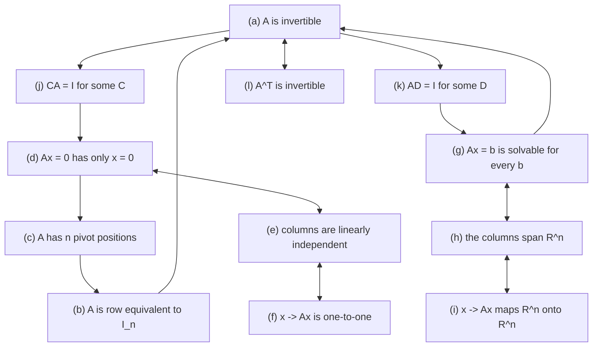
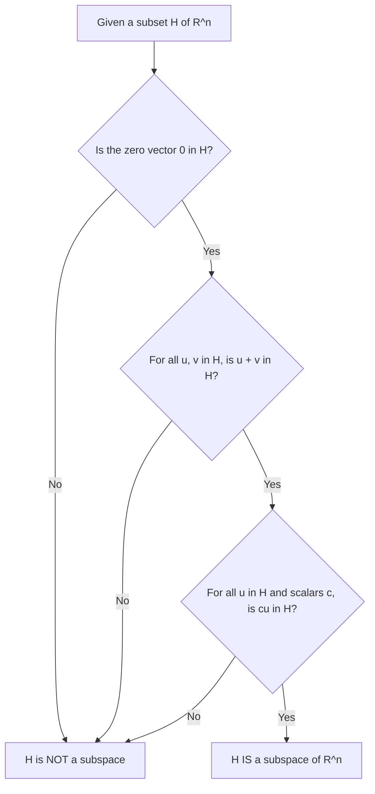

---
tags:
  - CCT3
  - Lin_Algebra
Topic: Karakterisering af invertible marticer og underrum.
Semester: CCT3
Course: Linær Algebra
Litterature:
  - Linear Algebra and Its Applications, Global Edition, 6ed
Created: 29-09-2026
---

---
## Table of Contents

1. [[#1. Characterization of Invertible Matrices and Subspaces of $\mathbb{R}^n$|1. Characterization of Invertible Matrices and Subspaces of $\mathbb{R}^n$]]
	1. [[#1. Characterization of Invertible Matrices and Subspaces of $\mathbb{R}^n$#1.1 The Invertible Matrix Theorem|1.1 The Invertible Matrix Theorem]]
	2. [[#1. Characterization of Invertible Matrices and Subspaces of $\mathbb{R}^n$#1.2 Key Implications and Properties|1.2 Key Implications and Properties]]
	3. [[#1. Characterization of Invertible Matrices and Subspaces of $\mathbb{R}^n$#1.3 Classification of Square Matrices|1.3 Classification of Square Matrices]]
	4. [[#1. Characterization of Invertible Matrices and Subspaces of $\mathbb{R}^n$#1.4 Invertible Linear Transformations|1.4 Invertible Linear Transformations]]
	5. [[#1. Characterization of Invertible Matrices and Subspaces of $\mathbb{R}^n$#1.5 Numerical Notes|1.5 Numerical Notes]]
	6. [[#1. Characterization of Invertible Matrices and Subspaces of $\mathbb{R}^n$#1.6 Subspaces of $\mathbb{R}^n$|1.6 Subspaces of $\mathbb{R}^n$]]
		1. [[#1.6 Subspaces of $\mathbb{R}^n$#1.6.1 Geometric Interpretations and Counterexamples|1.6.1 Geometric Interpretations and Counterexamples]]
		2. [[#1.6 Subspaces of $\mathbb{R}^n$#1.6.2 The Extreme Subspaces|1.6.2 The Extreme Subspaces]]
		3. [[#1.6 Subspaces of $\mathbb{R}^n$#1.6.3 Column Space and Null Space|1.6.3 Column Space and Null Space]]
		4. [[#1.6 Subspaces of $\mathbb{R}^n$#1.6.4 Implicit versus Explicit Descriptions of Subspaces|1.6.4 Implicit versus Explicit Descriptions of Subspaces]]
		5. [[#1.6 Subspaces of $\mathbb{R}^n$#1.6.5 Basis for a Subspace|1.6.5 Basis for a Subspace]]
		6. [[#1.6 Subspaces of $\mathbb{R}^n$#1.6.6 Finding a Basis for the Null Space|1.6.6 Finding a Basis for the Null Space]]
		7. [[#1.6 Subspaces of $\mathbb{R}^n$#1.6.7 Finding a Basis for the Column Space|1.6.7 Finding a Basis for the Column Space]]

# 1. Characterization of Invertible Matrices and Subspaces of $\mathbb{R}^n$

| Symbol / term | Meaning | Where |
|---|---|---|
| $A$ | A coefficient matrix; $m \times n$ in general, $n \times n$ (square) in the first half of this note | [[#1.1 The Invertible Matrix Theorem]] |
| $I_n$ (or $I$) | The $n \times n$ **identity matrix**: ones on the main diagonal, zeros elsewhere | [[#1.1 The Invertible Matrix Theorem]] |
| $A^{-1}$ | The **inverse** of $A$: the matrix with $A^{-1}A = AA^{-1} = I$ | [[#1.2 Key Implications and Properties]] |
| $A^{T}$ | The **transpose** of $A$: rows and columns interchanged | [[#1.1 The Invertible Matrix Theorem]] |
| $\det A$ | The **determinant** of $A$; $A$ is invertible exactly when $\det A \neq 0$ | [[#1.3 Classification of Square Matrices]] |
| $\text{rank } A$ | The **rank** of $A$: the number of pivot columns | [[#1.6.3 Column Space and Null Space]] |
| $\dim H$ | The **dimension** of a subspace: the number of vectors in any basis of $H$ | [[#1.6.5 Basis for a Subspace]] |
| $C$, $D$ | A **left inverse** ($CA = I$) and a **right inverse** ($AD = I$) of $A$ | [[#1.1 The Invertible Matrix Theorem]] |
| $\mathbf{x}, \mathbf{b}$ | Vectors in $\mathbb{R}^n$; $\mathbf{x}$ is the unknown, $\mathbf{b}$ the target | [[#1.1 The Invertible Matrix Theorem]] |
| $\mathbf{0}$ | The **zero vector**, all entries equal to $0$ | Section 1.6 |
| $\mathbb{R}^n$ | $n$-dimensional Euclidean space: all $n$-tuples of real numbers | Section 1.6 |
| $\mathbf{x} \mapsto A\mathbf{x}$ | "$\mathbf{x}$ maps to $A\mathbf{x}$": the **matrix transformation** defined by $A$ | [[#1.4 Invertible Linear Transformations]] |
| $T$, $S$ | A linear transformation and its candidate inverse, both $\mathbb{R}^n \to \mathbb{R}^n$ | [[#1.4 Invertible Linear Transformations]] |
| $T^{-1}$ | The **inverse transformation** of $T$, undoing what $T$ did | [[#1.4 Invertible Linear Transformations]] |
| $\sim$ | **Row equivalence**: the matrix on the left row-reduces to the one on the right | [[#1.1 The Invertible Matrix Theorem]] |
| $\text{Span}\{\mathbf{v}_1, \dots, \mathbf{v}_p\}$ | The set of **all** linear combinations $c_1\mathbf{v}_1 + \dots + c_p\mathbf{v}_p$ | Section 1.6 |
| $H$ | A **subspace**: a subset of $\mathbb{R}^n$ closed under addition and scalar multiplication | Section 1.6 |
| $\mathbf{a}_1, \dots, \mathbf{a}_n$ | The column vectors of $A$; each $\mathbf{a}_j$ lives in $\mathbb{R}^m$ | [[#1.6.3 Column Space and Null Space]] |
| $\text{Col } A$ | The **column space** of $A$: the span of its columns, a subspace of $\mathbb{R}^m$ | [[#1.6.3 Column Space and Null Space]] |
| $\text{Nul } A$ | The **null space** of $A$: all solutions of $A\mathbf{x} = \mathbf{0}$, a subspace of $\mathbb{R}^n$ | [[#1.6.3 Column Space and Null Space]] |
| $\mathcal{B} = \{\mathbf{b}_1, \dots, \mathbf{b}_p\}$ | A **basis**: a linearly independent spanning set for a subspace | [[#1.6.5 Basis for a Subspace]] |
| $\mathbf{e}_1, \dots, \mathbf{e}_n$ | The **standard basis** vectors of $\mathbb{R}^n$ (the columns of $I_n$) | [[#1.6.5 Basis for a Subspace]] |
| $\implies$ | "Implies": if the statement on the left holds, the one on the right must hold | [[#1.1 The Invertible Matrix Theorem]] |
| $\iff$ | "If and only if": the two statements are equivalent, each implying the other | [[#1.1 The Invertible Matrix Theorem]] |
| $\neq$ / $\notin$ | "Is not equal to" / "is not an element of" | [[#1.6 Subspaces of $\mathbb{R}^n$]] |
| $\cdot$ | The multiplication dot: $c \cdot \mathbf{u}$ is the scalar multiple of $\mathbf{u}$ by $c$ | [[#1.6 Subspaces of $\mathbb{R}^n$]] |
| $\vdots$ | Vertical ellipsis: "continue the same pattern down the column" | [[#1.6.5 Basis for a Subspace]] |
| $\in$ / $\mid$ | Set-builder symbols: "is an element of" / "such that" | [[#1.6.3 Column Space and Null Space]] |
| IMT | **Invertible Matrix Theorem (IMT)** — the equivalence theorem of Section 1.1 | [[#1.1 The Invertible Matrix Theorem]] |
| RREF | **Reduced row echelon form (RREF)** — the fully reduced output of Gauss–Jordan elimination | [[#1.6.6 Finding a Basis for the Null Space]] |

---

## 1.1 The Invertible Matrix Theorem

For a square matrix, invertibility is not an isolated property that you test and then file away. It
is a hub. A dozen apparently unrelated questions — about pivots, about solutions, about spanning and
independence, about the geometry of a transformation — all turn out to have the same answer, and
that answer is exactly the invertibility of $A$. This is what the **Invertible Matrix Theorem
(IMT)** records, and it is the single most-used result in the first half of a linear algebra course.

The practical payoff is leverage. Suppose you have already row-reduced a matrix and counted its
pivots. Without any further computation you now know whether its columns are linearly independent,
whether $A\mathbf{x} = \mathbf{b}$ is solvable for every $\mathbf{b}$, whether the associated
transformation is one-to-one, whether a one-sided inverse exists, and whether $A^T$ is invertible.
One row reduction answers $12$ questions.
> [!abstract] The IMT as a Single Circuit
> Think of the $12$ statements as lamps wired to one circuit. Light any single lamp and the circuit is live, so every other lamp lights with it. Prove any single lamp dark and the circuit is dead, so every other lamp is dark too. That is why you never work through all $12$: one decisive test settles the lot, and the pivot count is simply the easiest test to perform.

It is worth pausing on how unusual this is. In most of mathematics, "does a solution exist?" and "is
the solution unique?" are separate questions with separate answers. For square matrices the IMT says
they are the *same* question: existence forces uniqueness and uniqueness forces existence. That
collapse is a special feature of the square case, and Section 1.3 shows precisely where it breaks.

A word on how the proof works, because the structure is reusable. To prove $12$ statements
equivalent, you do not need $12 \times 11 = 132$ implications. It suffices to arrange a subset in a
closed **circle** of implications — then every statement on the circle implies every other — and
afterwards to hook each remaining statement onto that circle with a single equivalence. The circle
used here is $(a) \to (j) \to (d) \to (c) \to (b) \to (a)$.

> [!summary] Theorem 1: The Invertible Matrix Theorem
> Let $A$ be a square $n \times n$ matrix. Then the following statements are **equivalent** — for a given $A$ they are either all true or all false:
>
> a. $A$ is an invertible matrix.
> b. $A$ is row equivalent to the $n \times n$ identity matrix $I_n$.
> c. $A$ has $n$ pivot positions.
> d. The equation $A\mathbf{x} = \mathbf{0}$ has only the trivial solution.
> e. The columns of $A$ form a linearly independent set.
> f. The linear transformation $\mathbf{x} \mapsto A\mathbf{x}$ is one-to-one.
> g. The equation $A\mathbf{x} = \mathbf{b}$ has at least one solution for each $\mathbf{b}$ in $\mathbb{R}^n$.
> h. The columns of $A$ span $\mathbb{R}^n$.
> i. The linear transformation $\mathbf{x} \mapsto A\mathbf{x}$ maps $\mathbb{R}^n$ onto $\mathbb{R}^n$.
> j. There is an $n \times n$ matrix $C$ such that $CA = I$.
> k. There is an $n \times n$ matrix $D$ such that $AD = I$.
> l. $A^T$ is an invertible matrix.
>
> **Breakdown:**
> - $A$ : An $n \times n$ square coefficient matrix.
> - $I_n$ (or $I$) : The $n \times n$ identity matrix, with ones along the main diagonal and zeros elsewhere.
> - $A^T$ : The transpose of $A$, obtained by interchanging its rows and columns.
> - $C, D$ : A left inverse and a right inverse for $A$, respectively.
> - $\mathbf{x} \mapsto A\mathbf{x}$ : The linear transformation defined by multiplying an input vector by $A$.
> - **Equivalence** : If any one of these statements is established as true for a square matrix $A$, all the others are automatically true. If any one is false, all are false.
>
> **Proof:**
> The equivalence is established by building a circular chain of implications among core statements, then attaching the remaining statements to that chain:
>
> 1. **Core circular chain:**
>    - $(a) \implies (j)$: If $A$ is invertible, its inverse $A^{-1}$ exists. Setting $C = A^{-1}$ yields $CA = A^{-1}A = I$.
>    - $(j) \implies (d)$: If $CA = I$ and $A\mathbf{x} = \mathbf{0}$, then multiplying both sides by $C$ gives $\mathbf{x} = I\mathbf{x} = C(A\mathbf{x}) = C\mathbf{0} = \mathbf{0}$, so only the trivial solution exists.
>    - $(d) \implies (c)$: If $A\mathbf{x} = \mathbf{0}$ has only the trivial solution, the system has no free variables, which requires a pivot in every column — $n$ pivots in total.
>    - $(c) \implies (b)$: An $n \times n$ matrix with $n$ pivots must have those pivots on the main diagonal, so its reduced echelon form is $I_n$.
>    - $(b) \implies (a)$: If $A$ is row equivalent to $I_n$, it can be reduced to $I_n$ by elementary row operations, which proves $A$ is invertible.
> 2. **Linking the remaining statements:**
>    - $(a) \implies (k)$: If $A$ is invertible, setting $D = A^{-1}$ satisfies $AD = I$.
>    - $(k) \implies (g)$: If $AD = I$, then for any $\mathbf{b} \in \mathbb{R}^n$, choosing $\mathbf{x} = D\mathbf{b}$ gives $A\mathbf{x} = A(D\mathbf{b}) = (AD)\mathbf{b} = I\mathbf{b} = \mathbf{b}$, guaranteeing at least one solution.
>    - $(g) \implies (a)$: If $A\mathbf{x} = \mathbf{b}$ has a solution for every $\mathbf{b}$, then $A$ must have a pivot in every row ($n$ pivots), which links back to invertibility.
>    - $(g) \iff (h) \iff (i)$: For any matrix transformation, "solvable for every $\mathbf{b}$", "the columns span $\mathbb{R}^n$", and "maps $\mathbb{R}^n$ onto $\mathbb{R}^n$" are three ways of saying the same thing.
>    - $(d) \iff (e) \iff (f)$: "Only the trivial solution", "the columns are linearly independent", and "the transformation is one-to-one" are likewise equivalent.
>    - $(a) \iff (l)$: $A$ is invertible if and only if $A^T$ is invertible, with $(A^T)^{-1} = (A^{-1})^T$.

_Figure 1.1: The implication structure of the Invertible Matrix Theorem — the core cycle $(a) \to (j) \to (d) \to (c) \to (b) \to (a)$ closes the loop, while the remaining statements attach to it in equivalent pairs and triples._

![[Pasted image 20260929121414.png]]

_Figure 1.2: The relations between statements (a), (j), (d), (c) and (b) — the core circular chain of implications that anchors the proof._

![[Pasted image 20260929121508.png]]

_Figure 1.3: The remaining relations — how statements (e), (f), (g), (h), (i), (k) and (l) attach to the core chain._

$12$ statements are hard to memorise as a flat list but easy to retain once grouped. They fall
into four families:

- **Algebraic invertibility — (a), (j), (k), (l).** $A$ has a genuine two-sided inverse; some $C$
  satisfies $CA = I$; some $D$ satisfies $AD = I$; the transpose $A^T$ is invertible.
- **Pivot structure — (b), (c).** Row reduction reaches $I_n$; there are $n$ pivot positions.
- **Uniqueness — (d), (e), (f).** The homogeneous equation $A\mathbf{x} = \mathbf{0}$ has only the
trivial solution; the columns are linearly independent; the transformation $\mathbf{x} \mapsto A\mathbf{x}$ is one-to-one.
- **Existence — (g), (h), (i).** $A\mathbf{x} = \mathbf{b}$ is solvable for every $\mathbf{b}$; the
  columns span $\mathbb{R}^n$; the transformation maps $\mathbb{R}^n$ onto $\mathbb{R}^n$.

The symmetry between the last two families is the conceptual heart of the theorem. Three statements
are about *uniqueness* and three are about *existence*, and the IMT asserts that for a square matrix
they stand or fall together. Independent columns (uniqueness) force spanning columns (existence),
and conversely. Nothing in the definitions makes this obvious — it is the theorem's content, and it
is exactly what fails for rectangular matrices.

Held against the four families, statement (c) is the natural entry point:

- It is the only family member you can *compute* directly, by row reduction.
- Once you know the number of pivots, the whole theorem is decided.
- Statements (d) through (l) then follow for free, with no extra work.

Two of the statements deserve individual comment because students routinely overlook them:

- **(j) and (k) are deliberately separate.** For a general matrix, a left inverse and a right
  inverse are different animals, and having one does not guarantee the other. The IMT says that in
the square case the distinction evaporates — which is the content of [[#1.2 Key Implications and Properties]].
- **(l) is not obvious.** Row operations on $A$ and on $A^T$ have no visible connection, yet a
matrix is invertible precisely when its transpose is. One way to see it is that $\det(A^T) = \det A$, since transposition leaves a determinant unchanged, and invertibility is equivalent to having
  nonzero determinant. The explicit inverse is $(A^T)^{-1} = (A^{-1})^T$: transpose and invert
  commute.

In practice the workflow is always the same, and it is short:

1. Row-reduce $A$ once, to echelon form — reduced echelon form is not required, since pivots are
   visible in either.
2. Count the pivot positions.
3. If you find $n$ pivots, every statement in the IMT is true. If you find fewer than $n$, every
   statement is false.
4. No further test is ever needed. In particular, you never need to compute $A^{-1}$ merely to
   decide whether $A^{-1}$ exists.

Three habits make the theorem reliable under exam conditions:

- **Name the statement you are using.** Writing "by (c)" or "by (h)" takes a second and makes your
  reasoning checkable.
- **Check squareness first.** Before invoking any statement, confirm that $A$ really is $n \times n$
  — most lost marks in this topic come from applying the IMT to a rectangular matrix.
- **Prefer pivots to determinants.** Counting pivots costs one row reduction and works for any size,
  whereas a determinant is slower and tells you nothing about *which* statements fail.

---

## 1.2 Key Implications and Properties

The IMT pays two immediate dividends, and both recur constantly in later chapters.

**Uniqueness is free.** Because an invertible $n \times n$ matrix has $n$ pivot positions, it has a
pivot in every column and therefore **no free variables**. Non-uniqueness of solutions can only come
from free variables: if a solution exists and there is a free variable, you can vary it and obtain
infinitely many solutions. With no free variables there is nothing left to vary, so statement (g)
can be strengthened from "at least one solution" to "**exactly one** solution": the equation
$A\mathbf{x} = \mathbf{b}$ has a *unique* solution for each $\mathbf{b}$ in $\mathbb{R}^n$.
Combining this with existence, an invertible matrix gives a unique solution for *every* right-hand
side — which is why the formula $\mathbf{x} = A^{-1}\mathbf{b}$ is so powerful.

**One-sided inverses are automatically two-sided.** This is the more surprising consequence, and it
is worth understanding why it should be surprising. For functions between arbitrary sets, a left
inverse exists exactly when the function is injective and a right inverse exists exactly when it is
surjective; neither condition implies the other. Matrices behave differently — but only because they
are square.

> [!summary] Theorem 2: Two-Sided Invertibility of Square Products
> Let $A$ and $B$ be square $n \times n$ matrices. If $AB = I$, then both $A$ and $B$ are invertible, with:
> $$B = A^{-1} \quad \text{and} \quad A = B^{-1}$$
>
> **Breakdown:**
> - $A, B$ : Square $n \times n$ matrices; $B$ acts as a right inverse of $A$, and $A$ as a left inverse of $B$.
> - $I$ : The $n \times n$ identity matrix, so $AB = I$ says the product is the identity.
>
> **Proof:**
> Since $AB = I$, statement (k) of the IMT holds for $A$ (take $D = B$), so $A$ is invertible. Multiplying $AB = I$ on the left by $A^{-1}$ gives $A^{-1}(AB) = A^{-1}I$, hence $B = A^{-1}$. Because $A^{-1}$ is itself invertible with inverse $A$, it follows that $B^{-1} = (A^{-1})^{-1} = A$.

> [!example] One Product Is Enough for Square Matrices
> Let
> $$A = \begin{bmatrix} 1 & 1 \\ 0 & 1 \end{bmatrix}, \qquad B = \begin{bmatrix} 1 & -1 \\ 0 & 1 \end{bmatrix}$$
> Compute the single product
> $$AB = \begin{bmatrix} 1 & 1 \\ 0 & 1 \end{bmatrix}\begin{bmatrix} 1 & -1 \\ 0 & 1 \end{bmatrix} = \begin{bmatrix} 1 & 0 \\ 0 & 1 \end{bmatrix} = I$$
> Both matrices are square $2 \times 2$, so Theorem 2 applies: $A$ and $B$ are invertible with $B = A^{-1}$ and $A = B^{-1}$. In particular $BA = I$, even though we never computed it.
>
> **Check:** $BA = \begin{bmatrix} 1 & -1 \\ 0 & 1 \end{bmatrix}\begin{bmatrix} 1 & 1 \\ 0 & 1 \end{bmatrix} = \begin{bmatrix} 1 & 1 - 1 \\ 0 & 1 \end{bmatrix} = \begin{bmatrix} 1 & 0 \\ 0 & 1 \end{bmatrix} = I$ ✓

What makes this work is worth isolating, because the same three steps recur:

- $AB = I$ says $B$ is a **right** inverse of $A$ — that is statement (k) of the IMT.
- The IMT converts statement (k) into invertibility of $A$, and this is the only place squareness is
  used.
- Once $A^{-1}$ is known to exist, $B = A^{-1}$ follows from one multiplication, and $BA = I$ is
  then automatic.

This is a genuine shortcut in both directions. If you are handed two square matrices and asked to
prove them inverse to each other, checking the single product $AB = I$ suffices — you never need to
compute $BA$ as well. And if you are asked whether a candidate $B$ really is $A^{-1}$, one
multiplication settles it.

It is worth being explicit about what fails once the square hypothesis is dropped:

- A matrix of size $m \times n$ with $m > n$ can have a **left** inverse ($CA = I_n$) when its
  columns are independent, but no right inverse.
- A matrix with $m < n$ can have a **right** inverse ($AD = I_m$) when its columns span
  $\mathbb{R}^m$, but no left inverse.
- Only when $m = n$ do the two notions coincide, and only then does $AB = I$ license the conclusion
  $BA = I$.

Notice where squareness enters the proof: it enters through statement (k), which is part of the IMT
and therefore available only for square matrices. **Theorem 2 fails outright for rectangular
matrices.** If $A$ is $m \times n$ with $m \neq n$, a matrix $B$ with $AB = I_m$ does not make $A$
and $B$ inverse to each other, because neither can be invertible in the two-sided sense. Always
confirm that both matrices are square *and* of matching size before invoking either the IMT or
Theorem 2.

---

## 1.3 Classification of Square Matrices

The IMT is more than a list of equivalences — it is a **classification**. It splits the set of all
$n \times n$ matrices into two disjoint classes, with no middle ground:

1. **Invertible (nonsingular) matrices** — those satisfying all $12$ equivalent conditions.
2. **Noninvertible (singular) matrices** — those satisfying none of them.

There is no such thing as a matrix that satisfies half the IMT. This is what gives the theorem its
teeth: a single verified condition exonerates the matrix completely, and a single failed condition
condemns it completely. You never have to check more than one statement, and you never have to check
all $12$.

Because the two classes are exhaustive and complementary, the negation of any one statement
automatically describes a property of every singular matrix. Negating the list gives the full
profile of the singular case:

- $A$ is **not** invertible, so $A^{-1}$ does not exist.
- $A$ is **not** row equivalent to $I_n$; row reduction stalls with at least one zero row.
- $A$ has **fewer than** $n$ pivot positions, hence at least one free variable.
- $A\mathbf{x} = \mathbf{0}$ has **nontrivial** solutions — indeed infinitely many of them.
- The columns of $A$ are **linearly dependent**.
- The transformation $\mathbf{x} \mapsto A\mathbf{x}$ is **not** one-to-one.
- The columns **do not span** $\mathbb{R}^n$, so the transformation is not onto.
- There is **some** $\mathbf{b} \in \mathbb{R}^n$ for which $A\mathbf{x} = \mathbf{b}$ is
  inconsistent.
- $A^T$ is **not** invertible.

Two practical consequences follow from having the full negation list:

- **To prove a matrix invertible**, verify any single statement — usually (c) by row reduction, or
  (d) by showing $A\mathbf{x} = \mathbf{0}$ has only the trivial solution.
- **To prove a matrix singular**, disprove any single statement — usually (d) by exhibiting one
  nonzero solution of $A\mathbf{x} = \mathbf{0}$, or (g) by exhibiting a $\mathbf{b}$ for which the
  system is inconsistent.

Each of these is a usable test, and in an exam setting the cheapest is almost always the pivot
count: row-reduce once and compare the number of pivots with $n$.

> [!example] Determining Invertibility via Pivot Positions
> Use the Invertible Matrix Theorem to decide whether $A$ is invertible:
> $$A = \begin{bmatrix} 1 & 0 & -2 \\ -3 & 1 & -2 \\ -5 & 1 & 9 \end{bmatrix}$$
>
> **Solution:**
> Row-reduce $A$ to locate its pivot positions. Clear the first column with $R_2 \leftarrow R_2 + 3R_1$ and $R_3 \leftarrow R_3 + 5R_1$:
> $$A \sim \begin{bmatrix} 1 & 0 & -2 \\ 0 & 1 & -8 \\ 0 & 1 & -1 \end{bmatrix}$$
> Then clear the second column with $R_3 \leftarrow R_3 - R_2$:
> $$A \sim \begin{bmatrix} 1 & 0 & -2 \\ 0 & 1 & -8 \\ 0 & 0 & 7 \end{bmatrix}$$
> The echelon form has $3$ nonzero pivots ($1$, $1$, $7$), so $A$ has $3$ pivot positions — a pivot in every row and every column. By statement (c) of the IMT, $A$ is invertible.
>
> **Check:** an echelon form with $3$ pivots reduces further to $I_3$, and the determinant of the echelon form is $1 \cdot 1 \cdot 7 = 7 \neq 0$, agreeing with $\det A = 7$ ✓

> [!warning] Correction: Intermediate Matrices in the Pivot-Count Example
> The source note-set displayed this row reduction as $A \sim \begin{bmatrix} 1 & 0 & -2 \\ 0 & 1 & 4 \\ 0 & 1 & 1 \end{bmatrix} \sim \begin{bmatrix} 1 & 0 & -2 \\ 0 & 1 & 4 \\ 0 & 0 & 3 \end{bmatrix}$. Those intermediate matrices cannot be reached from the stated $A$ by row operations: their determinants are $-3$ and $3$, whereas $\det A = 7$, and the row operations used here preserve the determinant. The errors are sign slips in the third column — the correct results are $R_2 + 3R_1 = \begin{bmatrix} 0 & 1 & -8 \end{bmatrix}$ (not $\begin{bmatrix} 0 & 1 & 4 \end{bmatrix}$) and $R_3 + 5R_1 = \begin{bmatrix} 0 & 1 & -1 \end{bmatrix}$ (not $\begin{bmatrix} 0 & 1 & 1 \end{bmatrix}$), giving a final pivot of $7$ rather than $3$. The **conclusion is unaffected**: $A$ still has $3$ pivots and is invertible.

A companion example on the singular side makes the "all or nothing" behaviour concrete, and shows
how much information a single row reduction yields.

> [!example] A Singular Matrix Fails Every Statement
> Classify $A = \begin{bmatrix} 1 & 2 & 3 \\ 4 & 5 & 6 \\ 7 & 8 & 9 \end{bmatrix}$ using the IMT.
>
> **Solution:**
> Row-reduce: $R_2 \leftarrow R_2 - 4R_1$ gives $\begin{bmatrix} 0 & -3 & -6 \end{bmatrix}$ and $R_3 \leftarrow R_3 - 7R_1$ gives $\begin{bmatrix} 0 & -6 & -12 \end{bmatrix}$, so
> $$A \sim \begin{bmatrix} 1 & 2 & 3 \\ 0 & -3 & -6 \\ 0 & -6 & -12 \end{bmatrix} \sim \begin{bmatrix} 1 & 2 & 3 \\ 0 & -3 & -6 \\ 0 & 0 & 0 \end{bmatrix}$$
> There are only $2$ pivot positions, so statement (c) fails and $A$ is singular. By the classification, **every** IMT statement now fails: $A\mathbf{x} = \mathbf{0}$ has nontrivial solutions, the columns are linearly dependent, they do not span $\mathbb{R}^3$, the transformation is neither one-to-one nor onto, and $A^T$ is not invertible.
>
> **Check:** $R_3 - 2R_2 = \begin{bmatrix} 0 & -6 & -12 \end{bmatrix} - \begin{bmatrix} 0 & -6 & -12 \end{bmatrix} = \begin{bmatrix} 0 & 0 & 0 \end{bmatrix}$, confirming the zero row, and $\det A = 1(45 - 48) - 2(36 - 42) + 3(32 - 35) = -3 + 12 - 9 = 0$ ✓

> [!warning] Strict Restriction to Square Matrices
> The IMT applies **strictly to square matrices** ($n \times n$). It cannot be used for rectangular matrices ($m \times n$ with $m \neq n$).
>
> Concretely: if the columns of a $4 \times 3$ matrix are linearly independent, this does **not** imply that $A\mathbf{x} = \mathbf{b}$ has a solution for every $\mathbf{b}$ in $\mathbb{R}^4$. Three independent vectors in $\mathbb{R}^4$ span only a $3$-dimensional subspace, so most targets $\mathbf{b}$ are unreachable. Independence (uniqueness) simply does not force spanning (existence) once the matrix is not square.

> [!example] Independent Columns Do Not Force Spanning
> Take the $4 \times 3$ matrix
> $$A = \begin{bmatrix} 1 & 0 & 0 \\ 0 & 1 & 0 \\ 0 & 0 & 1 \\ 1 & 1 & 1 \end{bmatrix}, \qquad \mathbf{b} = \begin{bmatrix} 0 \\ 0 \\ 0 \\ 1 \end{bmatrix}$$
> The columns are linearly independent — the top $3$ rows form $I_3$, giving a pivot in every column — yet $A\mathbf{x} = \mathbf{b}$ has no solution:
> $$\begin{bmatrix} A & \mathbf{b} \end{bmatrix} = \begin{bmatrix} 1 & 0 & 0 & 0 \\ 0 & 1 & 0 & 0 \\ 0 & 0 & 1 & 0 \\ 1 & 1 & 1 & 1 \end{bmatrix} \sim \begin{bmatrix} 1 & 0 & 0 & 0 \\ 0 & 1 & 0 & 0 \\ 0 & 0 & 1 & 0 \\ 0 & 0 & 0 & 1 \end{bmatrix}$$
> The final row is $\begin{bmatrix} 0 & 0 & 0 & 1 \end{bmatrix}$ — a pivot in the augmented column — so the system is inconsistent and $\mathbf{b} \notin \text{Col } A$.
>
> **Check:** $A$ has rank $3$, so $\dim \text{Col } A = 3 < 4$ and $\text{Col } A \neq \mathbb{R}^4$. Explicitly, $\text{Col } A = \{(b_1, b_2, b_3, b_1 + b_2 + b_3)\}$; the target $\mathbf{b}$ above has $b_4 = 1 \neq 0 + 0 + 0$ ✓

Two lessons are worth extracting from this example:

- Independence of the columns is a statement about **uniqueness**: at most one $\mathbf{x}$ can
  solve $A\mathbf{x} = \mathbf{b}$.
- Spanning is a statement about **existence**: some $\mathbf{b}$ admits no solution at all.
- With $m > n$ the first can hold while the second fails. The IMT is what fuses the two, and it is
  precisely what is unavailable here.

That warning is not a technical footnote — it is the boundary of the entire theorem. Every statement
in the IMT concerns a matrix that maps $\mathbb{R}^n$ to $\mathbb{R}^n$, i.e. a transformation from
a space to *itself*. The moment domain and codomain have different dimensions, existence and
uniqueness decouple and the $12$ statements split into independent groups. When you meet a
rectangular matrix, you must reason about existence and uniqueness separately.

---

## 1.4 Invertible Linear Transformations

Matrix multiplication is not an arbitrary operation on arrays of numbers — it corresponds to the
**composition** of linear transformations. This correspondence is what makes the inverse geometric
rather than merely algebraic. When $A$ is invertible, the relation $A^{-1}A\mathbf{x} = \mathbf{x}$
describes one transformation undoing another: multiplying an input $\mathbf{x}$ by $A$ carries it to
$A\mathbf{x}$, and multiplying by $A^{-1}$ carries $A\mathbf{x}$ straight back to $\mathbf{x}$, with
nothing lost along the way.

The inverse is not merely a left inverse. Both orders must return the original input, because matrix
multiplication is not commutative and a one-sided inverse would leave open the possibility that
information was discarded in one direction. Invertibility means the transformation is a perfect,
reversible relabelling of the space.

![[Pasted image 20260929121554.png]]

_Figure 1.4: The transformation $\mathbf{x} \mapsto A\mathbf{x}$ followed by $A^{-1}$, which sends $A\mathbf{x}$ back to the original vector $\mathbf{x}$._

> [!info] Definition: Invertible Linear Transformation
> A linear transformation $T: \mathbb{R}^n \to \mathbb{R}^n$ is **invertible** if there exists a function $S: \mathbb{R}^n \to \mathbb{R}^n$ such that:
> $$S(T(\mathbf{x})) = \mathbf{x} \quad \text{for all } \mathbf{x} \text{ in } \mathbb{R}^n$$
> $$T(S(\mathbf{x})) = \mathbf{x} \quad \text{for all } \mathbf{x} \text{ in } \mathbb{R}^n$$
>
> **Breakdown:**
> - $T$ : The linear transformation being inverted.
> - $S$ : The candidate reverse map; both compositions must return the original input.
> - $\mathbf{x}$ : An arbitrary vector in $\mathbb{R}^n$ — the conditions must hold for *every* $\mathbf{x}$, not merely for some.
>
> If such an $S$ exists it is unique and is guaranteed to be a linear transformation. This unique function is called the **inverse** of $T$, written $T^{-1}$.

Both halves of that definition matter, and it is instructive to see what each one alone would give.
If only $S(T(\mathbf{x})) = \mathbf{x}$ held, then $T$ would be one-to-one — distinct inputs could
not collide, since $S$ would separate them again — but $T$ might still fail to reach all of
$\mathbb{R}^n$. If only $T(S(\mathbf{x})) = \mathbf{x}$ held, then $T$ would be onto but possibly
many-to-one. Requiring both is exactly the transformation-level mirror of Theorem 2, and it mirrors
the IMT's identification of one-to-one with onto.

> [!summary] Theorem 3: Invertibility of Linear Transformations (Lay, Theorem 9)
> Let $T: \mathbb{R}^n \to \mathbb{R}^n$ be a linear transformation and let $A$ be the standard matrix for $T$. Then $T$ is invertible if and only if $A$ is an invertible matrix. In that case, the linear transformation $S$ given by $S(\mathbf{x}) = A^{-1}\mathbf{x}$ is the unique function satisfying $S(T(\mathbf{x})) = \mathbf{x}$ and $T(S(\mathbf{x})) = \mathbf{x}$ for all $\mathbf{x} \in \mathbb{R}^n$.
>
> **Breakdown:**
> - $T$ : A linear transformation mapping $\mathbb{R}^n$ to $\mathbb{R}^n$.
> - $A$ : The $n \times n$ standard matrix of $T$, defined by $T(\mathbf{x}) = A\mathbf{x}$.
> - $S$ (or $T^{-1}$) : The inverse transformation, mapping $\mathbb{R}^n$ back to $\mathbb{R}^n$.
> - $A^{-1}$ : The matrix inverse of $A$.
> - $\mathbf{x}$ : An arbitrary vector in $\mathbb{R}^n$.
>
> **Proof:**
> 1. **Forward direction ($T$ invertible $\implies A$ invertible):** Suppose $T$ is invertible. Then $T(S(\mathbf{x})) = \mathbf{x}$ implies $T$ maps $\mathbb{R}^n$ *onto* $\mathbb{R}^n$: given any $\mathbf{b} \in \mathbb{R}^n$, set $\mathbf{x} = S(\mathbf{b})$ to obtain $T(\mathbf{x}) = T(S(\mathbf{b})) = \mathbf{b}$. Since $T$ is onto, statement (i) of the IMT holds, so its standard matrix $A$ is invertible.
> 2. **Reverse direction ($A$ invertible $\implies T$ invertible):** Suppose $A$ is invertible and define $S(\mathbf{x}) = A^{-1}\mathbf{x}$. Because matrix multiplication is a linear operation, $S$ is a linear transformation. Verifying the two composition equations:
>    $$S(T(\mathbf{x})) = S(A\mathbf{x}) = A^{-1}(A\mathbf{x}) = (A^{-1}A)\mathbf{x} = I\mathbf{x} = \mathbf{x}$$
>    $$T(S(\mathbf{x})) = T(A^{-1}\mathbf{x}) = A(A^{-1}\mathbf{x}) = (AA^{-1})\mathbf{x} = I\mathbf{x} = \mathbf{x}$$
>    Thus $T$ is invertible and $S = T^{-1}$.

Theorem 3 is the bridge that lets you answer geometric questions with matrix arithmetic and vice
versa. Anything the IMT tells you about $A$ transfers immediately to $T$: if the columns of $A$ are
independent then $T$ is one-to-one; if they span $\mathbb{R}^n$ then $T$ is onto; if $A$ is
invertible then $T$ can be run backwards by the single formula $T^{-1}(\mathbf{x}) = A^{-1}\mathbf{x}$. In the other direction, a geometric observation about $T$ — for instance that it
squashes $\mathbb{R}^n$ onto a lower-dimensional subset — tells you immediately that $A$ is
singular.

In working terms, Theorem 3 licenses these translations:

- $T$ is one-to-one $\iff$ the columns of $A$ are linearly independent $\iff$ $A\mathbf{x} = \mathbf{0}$ has only the trivial solution.
- $T$ maps $\mathbb{R}^n$ onto $\mathbb{R}^n$ $\iff$ the columns of $A$ span $\mathbb{R}^n$ $\iff$
  $A\mathbf{x} = \mathbf{b}$ is solvable for every $\mathbf{b}$.
- $T$ is invertible $\iff$ $A$ is invertible, in which case the standard matrix of $T^{-1}$ is
  exactly $A^{-1}$.
- $T$ compresses $\mathbb{R}^n$ into a lower-dimensional subset $\iff$ $A$ is singular $\iff$ $A$
  has fewer than $n$ pivots.

> [!example] One-to-One Transformations on $\mathbb{R}^n$
> **Problem:** What can be deduced about a one-to-one linear transformation $T: \mathbb{R}^n \to \mathbb{R}^n$?
>
> **Solution:**
> If $T$ is one-to-one, statement (f) of the IMT holds, so the columns of its standard matrix $A$ are linearly independent by statement (e). Because $A$ is *square* ($n \times n$), the full IMT now applies and yields all three conclusions at once:
> 1. $A$ is invertible.
> 2. $T$ maps $\mathbb{R}^n$ onto $\mathbb{R}^n$.
> 3. $T$ is an invertible linear transformation, with $T^{-1}(\mathbf{x}) = A^{-1}\mathbf{x}$.
>
> **Check:** the deduction "one-to-one $\implies$ onto" uses squareness essentially; see [[#1.3 Classification of Square Matrices]] for the rectangular counterexample ✓

The step from "one-to-one" to "onto" in that example is valid **only** because $T$ maps
$\mathbb{R}^n$ to $\mathbb{R}^n$ with equal domain and codomain dimension. A linear transformation
$T: \mathbb{R}^3 \to \mathbb{R}^4$ whose columns are independent is one-to-one but emphatically not
onto — its range is a $3$-dimensional subspace sitting inside a $4$-dimensional space. Conversely a
map
$T: \mathbb{R}^4 \to \mathbb{R}^3$ can be onto without being one-to-one. Only the square case lets
you transfer one property to the other.

The dimensional bookkeeping behind this is simple and worth internalising:

- Into a **larger** space ($n < m$): a transformation can be one-to-one but never onto.
- Into a **smaller** space ($n > m$): a transformation can be onto but never one-to-one.
- Into the **same** space ($n = m$): one-to-one and onto are equivalent, and both are equivalent to
  invertibility.

---

## 1.5 Numerical Notes

Everything above has been exact arithmetic over the real numbers. Real computation is not exact, and
for invertibility in particular the gap between theory and practice matters a great deal.

In practical computation an invertible matrix may be *nearly singular*, or **ill-conditioned**,
meaning that a slight perturbation of its entries — sometimes in the tenth decimal place — can make
it genuinely singular. Ill-conditioning is not a defect of the matrix; it is a property of the
problem. The matrix $\begin{bmatrix} 1 & 1 \\ 1 & 1.0000001 \end{bmatrix}$ is perfectly invertible,
yet it sits a hair's breadth from the singular matrix $\begin{bmatrix} 1 & 1 \\ 1 & 1 \end{bmatrix}$, and no numerical procedure can be expected to tell them apart reliably.

Because computers round every intermediate result, two distinct failure modes appear in row
reduction:

- Row reduction on an ill-conditioned matrix may fail to identify all $n$ pivot positions,
  incorrectly making an invertible matrix appear singular. A pivot that should be $10^{-9}$ can be
  swamped by roundoff and read as zero.
- Roundoff error can introduce tiny nonzero values where exact zeros belong, making a singular
  matrix appear invertible. A pivot that should be exactly $0$ comes out as $10^{-16}$, and the
  algorithm happily continues.

The practical guidance that follows is standard:

- Treat any computed pivot that is tiny relative to the largest entry of the matrix with suspicion.
- Report invertibility questions in terms of conditioning rather than a bare "singular" or
  "nonsingular".
- Prefer numerically stable algorithms (QR or SVD based) over textbook Gauss–Jordan when accuracy
  matters.
- Remember that a matrix can be invertible in exact arithmetic and still be useless in floating
  point.

> [!note] Matrix Condition Number
> Computational software measures the numerical stability of a square matrix with a **condition number**:
> - **Identity Matrix:** Has a condition number of $1$ (the optimal baseline).
> - **Ill-Conditioned Matrix:** Has a large condition number, signalling high sensitivity to roundoff errors and severe precision loss during computations.
> - **Singular Matrix:** Has an infinite condition number.
>
> When the condition number is extremely large, computational software may not be able to reliably distinguish between a singular matrix and an ill-conditioned one.

> [!tip] Never Judge Invertibility by a Near-Zero Determinant Alone
> A determinant of $10^{-12}$ computed in floating point is not evidence of singularity: roundoff in a perfectly invertible matrix can produce exactly that. When a matrix behaves suspiciously, ask your software for the condition number (in Python, `numpy.linalg.cond(A)`) rather than trusting the determinant. A condition number of about $10^{k}$ means you should expect to lose roughly $k$ significant digits of accuracy.

---

## 1.6 Subspaces of $\mathbb{R}^n$

> [!note] Source and Reading
> This block covers **§2.8 "Subspaces of $\mathbb{R}^n$"** of Lay, *Linear Algebra and Its Applications*, Global Edition, 6th ed. The two theorems below keep their textbook numbers in parentheses — Theorem 12 and Theorem 13 — so you can cross-check against the book.

The second half of this note changes the object of study. Instead of asking questions about one
matrix — is it invertible, how many pivots does it have — we ask which *sets of vectors* behave like
vector spaces in their own right. These sets are called subspaces, and they arise constantly when
analysing coefficient matrices and the solution sets of systems $A\mathbf{x} = \mathbf{b}$.

The idea behind the definition is "a vector space in miniature". Rather than re-verifying all eight
vector-space axioms, it turns out that for a subset of $\mathbb{R}^n$ only three properties need
checking, because the remaining axioms — commutativity, associativity, distributivity and so on —
are inherited automatically from $\mathbb{R}^n$.

> [!info] Definition: Subspace of $\mathbb{R}^n$
> A **subspace** of $\mathbb{R}^n$ is any subset $H$ of $\mathbb{R}^n$ satisfying three properties:
> 1. The zero vector $\mathbf{0}$ is in $H$.
> 2. For each $\mathbf{u}$ and $\mathbf{v}$ in $H$, the sum $\mathbf{u} + \mathbf{v}$ is in $H$ (*closed under addition*).
> 3. For each $\mathbf{u}$ in $H$ and each scalar $c$, the vector $c\mathbf{u}$ is in $H$ (*closed under scalar multiplication*).
>
> **Breakdown:**
> - $H$ : A subset of vectors residing in $\mathbb{R}^n$.
> - $\mathbb{R}^n$ : $n$-dimensional Euclidean space, consisting of all $n$-tuples of real numbers.
> - $\mathbf{0}$ : The zero vector in $\mathbb{R}^n$, all of whose entries are zero.
> - $\mathbf{u}, \mathbf{v}$ : Arbitrary vectors belonging to $H$.
> - $c$ : An arbitrary real scalar.
> - **Closure property** : Applying vector addition or scalar multiplication to elements of $H$ always produces a vector that is still inside $H$.

> [!abstract] A Subspace Is a Sealed Room
> Picture a subspace as a room inside $\mathbb{R}^n$ with no doors. Add any $2$ vectors already in the room and you are still in the room; stretch any vector by any scalar and you are still in the room. A line or a plane that misses the origin is not a room at all — it is a ledge, and scaling by $0$ drops you straight off it.

**Closure** is the operative word: a subspace is a set you cannot escape by adding or scaling.
Conditions $2$ and 3 say exactly that no sequence of vector-space operations can take you outside
$H$,
which is why $H$ inherits the full vector-space structure from $\mathbb{R}^n$.

The three conditions are not three independent ornaments. Condition $1$ is logically what condition
$3$
gives you at $c = 0$, so strictly speaking it is redundant. It is listed separately for a purely
practical reason: it is by far the fastest way to disqualify a candidate set. Checking "does $H$
contain $\mathbf{0}$?" takes seconds and settles most textbook problems outright.

Geometrically, a subspace must always pass through the origin — precisely because of the zero-vector
requirement. A line or a plane in $\mathbb{R}^3$ is a subspace **if and only if** it passes through
the origin. Shift it by even one unit and it stops being a subspace, no matter how much it still
looks like a line or a plane. This single geometric fact eliminates most incorrect candidates on
sight.

Typical non-examples, and the condition each one violates:

- A line or plane **not** through the origin — fails condition $1$ (no zero vector), and usually
  conditions $2$ and 3 as well.
- The first quadrant of $\mathbb{R}^2$ — fails condition $3$, since $-1 \cdot \begin{bmatrix} 1 \\ 1 \end{bmatrix}$ leaves the set.
- A closed ball of radius $1$ around the origin — fails condition $3$, since scaling by $2$ leaves
  the
  ball.
- The union of two distinct lines through the origin — fails condition $2$, since the sum of a
  vector
  from each line lands between them.
- The set of vectors with integer entries — fails condition $3$, since $\tfrac{1}{2}\mathbf{u}$ need
  not have integer entries.

![[Pasted image 20260929121637.png]]

_Figure 1.5: $\text{Span}\{\mathbf{v}_1, \mathbf{v}_2\}$ drawn as a plane through the origin — the prototypical $2$-dimensional subspace of $\mathbb{R}^3$._

> [!example] Spans as Subspaces
> Let $\mathbf{v}_1, \mathbf{v}_2, \dots, \mathbf{v}_p$ be vectors in $\mathbb{R}^n$ and let $H = \text{Span}\{\mathbf{v}_1, \mathbf{v}_2, \dots, \mathbf{v}_p\}$. Show that $H$ is a subspace of $\mathbb{R}^n$.
>
> **Solution:** Verify the three defining properties.
>
> 1. **Zero vector:**
>    $$\mathbf{0} = 0\mathbf{v}_1 + 0\mathbf{v}_2 + \dots + 0\mathbf{v}_p$$
>    Since $\mathbf{0}$ is a linear combination of the vectors, $\mathbf{0} \in H$.
> 2. **Closure under addition:** Take any $2$ vectors in $H$, say $\mathbf{u} = s_1\mathbf{v}_1 + \dots + s_p\mathbf{v}_p$ and $\mathbf{v} = t_1\mathbf{v}_1 + \dots + t_p\mathbf{v}_p$. Then
>    $$\mathbf{u} + \mathbf{v} = (s_1 + t_1)\mathbf{v}_1 + \dots + (s_p + t_p)\mathbf{v}_p$$
>    which is again a linear combination of the spanning set, so $\mathbf{u} + \mathbf{v} \in H$.
> 3. **Closure under scalar multiplication:** For any scalar $c$,
>    $$c\mathbf{u} = c(s_1\mathbf{v}_1 + \dots + s_p\mathbf{v}_p) = (cs_1)\mathbf{v}_1 + \dots + (cs_p)\mathbf{v}_p$$
>    which is again a linear combination of the spanning set, so $c\mathbf{u} \in H$.
>
> The set $\text{Span}\{\mathbf{v}_1, \dots, \mathbf{v}_p\}$ is called the **subspace spanned (or generated) by** $\mathbf{v}_1, \dots, \mathbf{v}_p$.
>
> **Check:** each of the three verifications reduces to the single observation that a linear combination of linear combinations is again a linear combination of the same generators, which is exactly closure ✓

This example is the workhorse of the whole section. Nearly every subspace encountered in this course
is presented as a span, and the argument above guarantees that **every span is automatically a
subspace** — no further checking required. Whenever you are shown a set defined as "all linear
combinations of …", you may immediately treat it as a subspace.

That is not to say every subspace is *described* as a span. The null space of a matrix is not, at
least not at first; it is described by a condition instead. Converting such implicit descriptions
into explicit span descriptions is exactly the task of [[#1.6.6 Finding a Basis for the Null Space]].

The practical procedure for an arbitrary candidate set $H$ is therefore:

1. Check whether $\mathbf{0} \in H$. If not, stop — $H$ is not a subspace.
2. Check closure under addition for *arbitrary* $\mathbf{u}, \mathbf{v} \in H$, not for two
   particular vectors you happen to like.
3. Check closure under scalar multiplication for *arbitrary* scalars $c$, not just for $c = 2$.

A single counterexample to any of the three disqualifies $H$; verifying all three for arbitrary
elements proves it.

When you disprove closure, exhibit a concrete counterexample rather than arguing in general:

- To refute closure under addition, name specific $\mathbf{u}, \mathbf{v} \in H$ with $\mathbf{u} + \mathbf{v} \notin H$.
- To refute closure under scalar multiplication, name a specific $\mathbf{u} \in H$ and scalar $c$
  with $c\mathbf{u} \notin H$.
- To refute the zero-vector condition, simply observe $\mathbf{0} \notin H$ — no computation needed.

### 1.6.1 Geometric Interpretations and Counterexamples

The dimension of a span is determined by how many of the generating vectors point in genuinely new
directions. Redundant generators contribute nothing, and this is visible geometrically:

- **Lines through the origin:** If $\mathbf{v}_1 \neq \mathbf{0}$ and $\mathbf{v}_2 = k\mathbf{v}_1$
  for some scalar $k$, then $\text{Span}\{\mathbf{v}_1, \mathbf{v}_2\}$ is just a straight line
  through the origin — a $1$-dimensional subspace. The second vector added no new direction, so the
  span collapsed from a plane to a line.
- **Planes through the origin:** If $\mathbf{v}_1$ and $\mathbf{v}_2$ are non-collinear,
  $\text{Span}\{\mathbf{v}_1, \mathbf{v}_2\}$ is a plane through the origin — a $2$-dimensional
  subspace.

The pattern generalises: the dimension of a span equals the number of linearly independent vectors
among the generators, which is why counting pivots keeps reappearing. Three independent vectors in
$\mathbb{R}^3$ span all of $\mathbb{R}^3$; $3$ vectors in $\mathbb{R}^3$ with one dependent on the
other two span only a plane.

The dimension count is the organising principle:

- $p$ vectors can span a subspace of dimension at most $p$.
- The span has dimension exactly $p$ precisely when the $p$ vectors are linearly independent.
- Dependence among the generators lowers the dimension but leaves the subspace itself unchanged.
- In $\mathbb{R}^n$, no subspace can have dimension greater than $n$.

> [!example] Non-Subspace: Lines Not Containing the Origin
> Show that a line $L$ not passing through the origin cannot be a subspace.
>
> **Solution:** Such a line violates all three defining criteria at once:
> - It does not contain the zero vector: $\mathbf{0} \notin L$.
> - Adding $2$ vectors $\mathbf{u}, \mathbf{v}$ whose tips lie on $L$ produces a resultant $\mathbf{u} + \mathbf{v}$ that points away from $L$.
> - Multiplying a vector $\mathbf{w}$ on $L$ by a scalar such as $2$ or $0$ yields $2\mathbf{w}$ or $\mathbf{0}$, neither of which lies on $L$.
>
> **Check:** the single failure $\mathbf{0} \notin L$ already suffices by property 1; the other two are listed to show how thoroughly closure breaks down ✓

![[Pasted image 20260929121744.png]]

_Figure 1.6: A collinear pair $\mathbf{v}_1, \mathbf{v}_2$ — the span collapses to a single line through the origin rather than a plane._

![[Pasted image 20260929121700.png]]

_Figure 1.7: The sum $\mathbf{u} + \mathbf{v}$ of $2$ vectors on a line $L$ that misses the origin — the resultant leaves $L$ entirely, so $L$ is not closed under addition._

Because the origin test is so decisive, it is worth having the full decision procedure collected in
one place. Note the logical shape: a single "no" disqualifies $H$, and only three consecutive "yes"s
prove it.

_Figure 1.8: The subspace test as a decision tree — a single "no" at any stage disqualifies $H$, and in practice the zero-vector question settles most cases immediately._

### 1.6.2 The Extreme Subspaces

Every $\mathbb{R}^n$ contains two boundary cases, and both are worth memorising because they are the
degenerate answers to "how small, or how large, can a subspace be?"

1. **The full space ($\mathbb{R}^n$):** $\mathbb{R}^n$ is a subspace of itself. It trivially
   contains $\mathbf{0}$ and is closed under all vector addition and scalar multiplication, since
   those operations can never produce anything outside $\mathbb{R}^n$.
2. **The zero subspace ($\{\mathbf{0}\}$):** the set containing only the zero vector. It satisfies
all three conditions, because $\mathbf{0} + \mathbf{0} = \mathbf{0}$ and $c\mathbf{0} = \mathbf{0}$
for every scalar $c$.

In $\mathbb{R}^3$ the complete list of subspaces is therefore short: the origin $\{\mathbf{0}\}$,
every line through the origin, every plane through the origin, and $\mathbb{R}^3$ itself. Nothing
else qualifies — not a line or plane shifted off the origin, not a solid ball, not a ray, not a
half-space, not the union of two lines through the origin. Each of these fails one of the three
conditions, and most fail the zero-vector test immediately.

Why the usual non-candidates fail, condition by condition:

- A line or plane off the origin — lacks $\mathbf{0}$, so condition $1$ fails.
- A ray from the origin — not closed under negative scalars, so condition $3$ fails.
- A solid ball — not closed under large scalars, so condition $3$ fails.
- A half-space — not closed under negative scalars, so condition $3$ fails.
- The union of two distinct lines through the origin — not closed under addition, so condition $2$
  fails.

The zero subspace is easy to overlook but important: it is the null space of any matrix whose
columns are linearly independent, and by statement (d) of the IMT that is exactly the invertible
case.

### 1.6.3 Column Space and Null Space

Two subspaces are attached to every matrix, and between them they carry most of the structural
information a matrix holds about the system $A\mathbf{x} = \mathbf{b}$. They arise in fundamentally
different ways: one is built from the *columns* of the matrix, the other from the *solutions* of a
homogeneous system. Learning to keep them apart is the main skill of this section.

> [!info] Definition: Column Space
> The **column space** of an $m \times n$ matrix $A$, denoted $\text{Col } A$, is the set of all linear combinations of the columns of $A$. If $A = \begin{bmatrix} \mathbf{a}_1 & \mathbf{a}_2 & \dots & \mathbf{a}_n \end{bmatrix}$, then:
> $$\text{Col } A = \text{Span}\{\mathbf{a}_1, \mathbf{a}_2, \dots, \mathbf{a}_n\}$$
>
> **Breakdown:**
> - $A$ : An $m \times n$ matrix with real entries.
> - $\mathbf{a}_1, \dots, \mathbf{a}_n$ : The $n$ column vectors of $A$, each living in $\mathbb{R}^m$.
> - $\text{Col } A$ : The resulting subspace of $\mathbb{R}^m$.

![[Pasted image 20260929121836.png]]

_Figure 1.9: The column space of a matrix, viewed as the span of its column vectors._

Since every column of an $m \times n$ matrix has $m$ entries, $\text{Col } A$ is a subspace of
$\mathbb{R}^m$. Watch the index: the column space lives in the space determined by the number of
**rows**, not columns. It equals all of $\mathbb{R}^m$ exactly when the columns span $\mathbb{R}^m$;
otherwise it is a proper subspace of smaller dimension.

The system-level interpretation is the one to internalise. In the linear system $A\mathbf{x} = \mathbf{b}$, the product $A\mathbf{x}$ *is* a linear combination of the columns of $A$, with the
entries of $\mathbf{x}$ as the weights:

$$A\mathbf{x} = x_1\mathbf{a}_1 + x_2\mathbf{a}_2 + \dots + x_n\mathbf{a}_n$$

> [!info] Breakdown: The Column Expansion of $A\mathbf{x}$
> - $\mathbf{x}$ : The input vector, whose entries act as weights.
> - $x_1, \dots, x_n$ : The weights, one per column of $A$; all are real scalars.
> - $\mathbf{a}_1, \dots, \mathbf{a}_n$ : The columns of $A$, each living in $\mathbb{R}^m$.
> - $A\mathbf{x}$ : The resulting linear combination, necessarily a vector of $\text{Col } A \subseteq \mathbb{R}^m$.

So asking whether $A\mathbf{x} = \mathbf{b}$ has a solution is literally asking whether $\mathbf{b}$
can be written as a linear combination of the columns of $A$. In other words, $\text{Col } A$ is
precisely the set of all target vectors $\mathbf{b}$ for which the system is consistent:
$A\mathbf{x} = \mathbf{b}$ is solvable **if and only if** $\mathbf{b} \in \text{Col } A$.

Three facts about $\text{Col } A$ are worth memorising:

- $\text{Col } A$ is a subspace of $\mathbb{R}^m$, so its vectors have $m$ entries.
- $A\mathbf{x} = \mathbf{b}$ is consistent $\iff$ $\mathbf{b} \in \text{Col } A$.
- $\text{Col } A = \mathbb{R}^m$ $\iff$ $A$ has a pivot in every row $\iff$ $A\mathbf{x} = \mathbf{b}$ is consistent for every $\mathbf{b} \in \mathbb{R}^m$.

> [!example] Determining if a Vector is in the Column Space
> Let $A = \begin{bmatrix} 1 & -3 & -4 \\ -4 & 6 & -2 \\ -3 & 7 & 6 \end{bmatrix}$ and $\mathbf{b} = \begin{bmatrix} 3 \\ 3 \\ -4 \end{bmatrix}$. Determine whether $\mathbf{b} \in \text{Col } A$.
>
> **Solution:**
> The vector $\mathbf{b}$ lies in $\text{Col } A$ if and only if it can be written as a linear combination of the columns of $A$, which is equivalent to $A\mathbf{x} = \mathbf{b}$ having a solution. Row-reduce the augmented matrix:
> $$\begin{bmatrix} 1 & -3 & -4 & 3 \\ -4 & 6 & -2 & 3 \\ -3 & 7 & 6 & -4 \end{bmatrix} \sim \begin{bmatrix} 1 & -3 & -4 & 3 \\ 0 & -6 & -18 & 15 \\ 0 & -2 & -6 & 5 \end{bmatrix} \sim \begin{bmatrix} 1 & -3 & -4 & 3 \\ 0 & -6 & -18 & 15 \\ 0 & 0 & 0 & 0 \end{bmatrix}$$
> The system is consistent: there is no row of the form $\begin{bmatrix} 0 & 0 & 0 & c \end{bmatrix}$ with $c \neq 0$. Hence $A\mathbf{x} = \mathbf{b}$ has a solution and $\mathbf{b} \in \text{Col } A$.
>
> **Check:** the echelon system gives $x_2 = -\tfrac{5}{2} - 3x_3$ and $x_1 = -\tfrac{9}{2} - 5x_3$. Taking $x_3 = 0$ gives $\mathbf{x} = \begin{bmatrix} -9/2 \\ -5/2 \\ 0 \end{bmatrix}$, and $A\mathbf{x} = \begin{bmatrix} -\tfrac{9}{2} + \tfrac{15}{2} \\ 18 - 15 \\ \tfrac{27}{2} - \tfrac{35}{2} \end{bmatrix} = \begin{bmatrix} 3 \\ 3 \\ -4 \end{bmatrix} = \mathbf{b}$ ✓

> [!info] Definition: Null Space
> The **null space** of an $m \times n$ matrix $A$, denoted $\text{Nul } A$, is the set of all solutions of the homogeneous equation $A\mathbf{x} = \mathbf{0}$:
> $$\text{Nul } A = \{\mathbf{x} \in \mathbb{R}^n \mid A\mathbf{x} = \mathbf{0}\}$$
>
> **Breakdown:**
> - $\mathbf{x}$ : A solution vector in $\mathbb{R}^n$.
> - $\mathbf{0}$ : The zero vector in $\mathbb{R}^m$ on the right-hand side (and, in $\mathbf{x} \in \mathbb{R}^n$, the origin of the domain).
> - $\text{Nul } A$ : The solution set, forming a subset of $\mathbb{R}^n$.

> [!example] Testing Membership in $\text{Nul } A$
> Let $A = \begin{bmatrix} 1 & -3 \\ -2 & 6 \end{bmatrix}$. Is $\mathbf{v} = \begin{bmatrix} 3 \\ 1 \end{bmatrix}$ in $\text{Nul } A$? Is $\mathbf{w} = \begin{bmatrix} 1 \\ 0 \end{bmatrix}$?
>
> **Solution:** The definition is implicit, so each test is a single multiplication:
> $$A\mathbf{v} = \begin{bmatrix} 3 - 3 \\ -6 + 6 \end{bmatrix} = \begin{bmatrix} 0 \\ 0 \end{bmatrix} \implies \mathbf{v} \in \text{Nul } A$$
> $$A\mathbf{w} = \begin{bmatrix} 1 - 0 \\ -2 + 0 \end{bmatrix} = \begin{bmatrix} 1 \\ -2 \end{bmatrix} \neq \mathbf{0} \implies \mathbf{w} \notin \text{Nul } A$$
>
> **Check:** the second row of $A$ is $-2$ times the first, so $A$ has rank $1$ and $A\mathbf{x} = \mathbf{0}$ reduces to the single equation $x_1 - 3x_2 = 0$, which $\mathbf{v}$ satisfies ($3 - 3 \cdot 1 = 0$) and $\mathbf{w}$ does not ($1 - 3 \cdot 0 = 1$) ✓

Notice how cheap that test was: membership in $\text{Nul } A$ is settled by one matrix–vector
product, with no row reduction and no system to solve.

> [!summary] Theorem 4: The Null Space Is a Subspace (Lay, Theorem 12)
> The null space of an $m \times n$ matrix $A$ is a subspace of $\mathbb{R}^n$. Equivalently, the solution set of a system $A\mathbf{x} = \mathbf{0}$ of $m$ homogeneous linear equations in $n$ unknowns is a subspace of $\mathbb{R}^n$.
>
> **Breakdown:**
> - $m$ : The number of equations (and rows).
> - $n$ : The number of unknowns (and columns).
> - $\text{Nul } A$ : The subspace of $\mathbb{R}^n$ comprising all solution vectors $\mathbf{x}$.
>
> **Proof:**
> 1. **Zero vector:** $A\mathbf{0} = \mathbf{0}$ for any matrix $A$, so $\mathbf{0} \in \text{Nul } A$.
> 2. **Closure under addition:** Let $\mathbf{u}, \mathbf{v} \in \text{Nul } A$, so $A\mathbf{u} = \mathbf{0}$ and $A\mathbf{v} = \mathbf{0}$. By the distributive property of matrix multiplication,
>    $$A(\mathbf{u} + \mathbf{v}) = A\mathbf{u} + A\mathbf{v} = \mathbf{0} + \mathbf{0} = \mathbf{0}$$
>    Hence $\mathbf{u} + \mathbf{v} \in \text{Nul } A$.
> 3. **Closure under scalar multiplication:** For $\mathbf{u} \in \text{Nul } A$ and any scalar $c$,
>    $$A(c\mathbf{u}) = c(A\mathbf{u}) = c(\mathbf{0}) = \mathbf{0}$$
>    Hence $c\mathbf{u} \in \text{Nul } A$.
>
> All three properties hold, so $\text{Nul } A$ is a subspace of $\mathbb{R}^n$.

The word *homogeneous* is doing real work in Theorem 4, and it is the most common source of
confusion here. The solution set of $A\mathbf{x} = \mathbf{b}$ with $\mathbf{b} \neq \mathbf{0}$ is
**not** a subspace: it does not contain $\mathbf{0}$, since $A\mathbf{0} = \mathbf{0} \neq \mathbf{b}$. What it is, instead, is a *translate* of $\text{Nul } A$: if $\mathbf{p}$ is one
particular solution of $A\mathbf{x} = \mathbf{b}$, then the full solution set is $\mathbf{p} + \text{Nul } A$. Geometrically this is a line or plane shifted off the origin — an affine set, not a
subspace.

Three parallel facts about $\text{Nul } A$:

- $\text{Nul } A$ is a subspace of $\mathbb{R}^n$, so its vectors have $n$ entries.
- $\text{Nul } A = \{\mathbf{0}\}$ exactly when $A$ has a pivot in every column, i.e. when the
  columns are independent.
- $\text{Nul } A$ contains nonzero vectors exactly when $A\mathbf{x} = \mathbf{0}$ has free
  variables.

The two subspaces are also linked by a count. Every column of $A$ is either a pivot column or a
free-variable column, so:

$$\dim \text{Col } A + \dim \text{Nul } A = \text{rank } A + (n - \text{rank } A) = n$$

> [!info] Breakdown: The Rank–Nullity Relation
> - $\dim \text{Col } A$ : Dimension of the column space; equals the number of pivot columns.
> - $\dim \text{Nul } A$ : Dimension of the null space; equals the number of free variables.
> - $\text{rank } A$ : The number of pivot columns of $A$.
> - $n$ : The total number of columns of $A$, each one either a pivot column or a free-variable column.

In words: the number of pivot
columns plus the number of free variables equals the total number of columns. This is the
rank–nullity relation, and it is a useful arithmetic check on any basis computation — if your bases
have the wrong total number of vectors, something went wrong.

Read the identity as a budget:

- Each of the $n$ columns is spent either as a pivot column or as a free-variable column.
- Pivot columns build $\text{Col } A$; free-variable columns build $\text{Nul } A$.
- The two counts always add up to $n$, whatever the shape of $A$.

| | $\text{Col } A$ | $\text{Nul } A$ |
|---|---|---|
| Built from | Linear combinations of the **columns** of $A$ | Solutions $\mathbf{x}$ of the **homogeneous** system $A\mathbf{x} = \mathbf{0}$ |
| Lives in | $\mathbb{R}^m$ (number of **rows** of $A$) | $\mathbb{R}^n$ (number of **columns** of $A$) |
| Dimension | Number of pivot columns = rank of $A$ | Number of free variables = $n - \text{rank } A$ |
| System meaning | The set of $\mathbf{b}$ for which $A\mathbf{x} = \mathbf{b}$ is consistent | The solutions added to any particular solution of $A\mathbf{x} = \mathbf{b}$ |
| Found by | Take the pivot columns of the **original** $A$ | Solve $A\mathbf{x} = \mathbf{0}$; read off parametric vector form |

_Table 1.1: Column space versus null space at a glance — the two fundamental subspaces of a matrix and how they differ._

> [!warning] The Two Subspaces Live in Different Spaces
> The most common exam error in this section is mixing up where these subspaces live. For an $m \times n$ matrix, $\text{Col } A$ is a subspace of $\mathbb{R}^m$ while $\text{Nul } A$ is a subspace of $\mathbb{R}^n$. A vector in $\text{Col } A$ has $m$ entries; a vector in $\text{Nul } A$ has $n$ entries. When $m \neq n$ they are not even subsets of the same space, so their vectors can never be compared, added, or intersected. Always ask first: "how many entries should a vector in this subspace have?"

### 1.6.4 Implicit versus Explicit Descriptions of Subspaces

Beyond living in different spaces, the two subspaces differ in the *kind* of description each
provides — and knowing which kind you have tells you immediately which question will be easy and
which will be awkward.

An **explicit** description hands you a generating rule: it tells you how to *produce* members of
the set. An **implicit** description hands you a condition: it tells you how to *test* candidates.
Each is convenient for one task and inconvenient for the other.
> [!abstract] A Recipe Versus a Bouncer's List
> An **explicit** description is a recipe: follow it and you produce a member of the subspace. An **implicit** description is a bouncer's list: hand it a candidate and it answers yes or no. Recipes are good for generating, lists are good for testing — and no single description is convenient at both jobs.

> [!info] Definition: Parametric Vector Form
> The **parametric vector form** of the solution set of $A\mathbf{x} = \mathbf{0}$ expresses the general solution as a linear combination of fixed vectors, using the free variables as coefficients:
> $$\mathbf{x} = s\,\mathbf{u} + t\,\mathbf{v} + \dots$$
>
> **Breakdown:**
> - $\mathbf{x}$ : The general solution vector; every solution arises from some choice of the parameters.
> - $s, t, \dots$ : The **parameters** — the free variables, each free to take any real value.
> - $\mathbf{u}, \mathbf{v}, \dots$ : Fixed vectors; they span the solution set and are linearly independent.

Each parameter contributes exactly one vector to the combination, which is why the number of free
variables equals the dimension of $\text{Nul } A$.

> [!example] Reading a Parametric Vector Form
> Let $A = \begin{bmatrix} 1 & 0 & 2 \\ 2 & 0 & 4 \end{bmatrix}$. Row reduction gives the single equation $x_1 + 2x_3 = 0$, with $x_2$ and $x_3$ free, so
> $$\mathbf{x} = \begin{bmatrix} -2x_3 \\ x_2 \\ x_3 \end{bmatrix} = x_2 \begin{bmatrix} 0 \\ 1 \\ 0 \end{bmatrix} + x_3 \begin{bmatrix} -2 \\ 0 \\ 1 \end{bmatrix}$$
> There are $2$ parameters ($x_2$ and $x_3$) and therefore $2$ vectors, so $\dim \text{Nul } A = 2$.
>
> **Check:** $A\begin{bmatrix} 0 \\ 1 \\ 0 \end{bmatrix} = \begin{bmatrix} 0 \\ 0 \end{bmatrix}$ and $A\begin{bmatrix} -2 \\ 0 \\ 1 \end{bmatrix} = \begin{bmatrix} -2 + 2 \\ -4 + 4 \end{bmatrix} = \begin{bmatrix} 0 \\ 0 \end{bmatrix}$, so both vectors lie in $\text{Nul } A$ ✓

- **Null space ($\text{Nul } A$):** defined **implicitly**, by a condition every member must
  satisfy. To test whether a given vector $\mathbf{v}$ belongs to $\text{Nul } A$, compute
  $A\mathbf{v}$ and check whether it equals $\mathbf{0}$ — a single matrix multiplication settles
  it. But *producing* all of $\text{Nul } A$ requires work: you must solve the homogeneous system
  $A\mathbf{x} = \mathbf{0}$ and write the solution in parametric vector form.
- **Column space ($\text{Col } A$):** defined **explicitly**, by a generating rule. Vectors in
  $\text{Col } A$ are built directly as linear combinations of the columns of $A$, so producing
  members is trivial. But *testing* whether an arbitrary vector belongs requires solving
  $A\mathbf{x} = \mathbf{b}$ to check consistency — the harder question.

| Subspace | Type | Testing membership | Producing all members |
|---|---|---|---|
| $\text{Nul } A$ | **Implicit** (a condition $A\mathbf{x} = \mathbf{0}$ to verify) | Easy: compute $A\mathbf{v}$, compare with $\mathbf{0}$ | Solve $A\mathbf{x} = \mathbf{0}$; write parametric vector form |
| $\text{Col } A$ | **Explicit** (a generating rule: the columns) | Solve $A\mathbf{x} = \mathbf{b}$; test consistency | Easy: take linear combinations of the columns of $A$ |

_Table 1.2: Implicit versus explicit descriptions — each subspace is easy for one task and awkward for the other._

This complementarity explains why the two subspaces are always paired in practice. To find a basis
for $\text{Nul } A$ you must convert an implicit description into an explicit one, by solving the
system. To find a basis for $\text{Col } A$ you already hold an explicit spanning set and only need
to discard the redundant columns. Those are the tasks of the next two sections, and they are
genuinely different procedures.

Recognising which description you have also tells you how to answer "is $\mathbf{v}$ in the
subspace?":

- For an **explicit** description, set up and solve a linear system — there is usually no shortcut.
- For an **implicit** description, evaluate the defining condition: one substitution, no system to
  solve.
- Either way the verdict concerns one *particular* vector, not a description of the whole subspace.

### 1.6.5 Basis for a Subspace

A subspace almost always contains infinitely many vectors, so listing its members is hopeless. The
way to work with one is to find a small, finite generating set — and the smallest possible spanning
set is exactly one containing no redundant vectors, which is to say a linearly independent spanning
set. That is a basis.

> [!info] Definition: Basis for a Subspace
> A **basis** for a subspace $H$ of $\mathbb{R}^n$ is a linearly independent set of vectors in $H$ that spans $H$.
>
> **Breakdown:**
> - $H$ : A subspace of $\mathbb{R}^n$.
> - $\mathcal{B} = \{\mathbf{b}_1, \mathbf{b}_2, \dots, \mathbf{b}_p\}$ : An ordered set of vectors in $H$.
> - **Linearly independent** : $c_1\mathbf{b}_1 + c_2\mathbf{b}_2 + \dots + c_p\mathbf{b}_p = \mathbf{0}$ holds only when $c_1 = c_2 = \dots = c_p = 0$.
> - **Spanning set** : Every vector in $H$ can be written as a linear combination of $\{\mathbf{b}_1, \dots, \mathbf{b}_p\}$, so $\text{Span}\{\mathbf{b}_1, \dots, \mathbf{b}_p\} = H$.

The two conditions rule out opposite failures, and this is worth spelling out because students often
check only one:

- **Spanning alone** permits redundancy. You may have far more vectors than necessary — three
  vectors spanning a plane, for instance.
- **Independence alone** permits incompleteness. Your vectors may be independent but fail to reach
  every part of $H$ — $2$ independent vectors inside a $3$-dimensional subspace do not span it.

A basis is the unique size at which both conditions hold simultaneously: few enough to be
independent, many enough to span. That size is the **dimension** of $H$, and every basis of $H$ has
exactly that many vectors. The basis itself is not unique — infinitely many different bases exist
for any nonzero subspace — but its *size* is an invariant of the subspace.

The columns of any invertible $n \times n$ matrix form a basis for all of $\mathbb{R}^n$, since by
the IMT they are linearly independent (statement (e)) and span $\mathbb{R}^n$ (statement (h)). The
primary example is the set of columns of $I_n$, written $\mathbf{e}_1, \mathbf{e}_2, \dots, \mathbf{e}_n$:

$$\mathbf{e}_1 = \begin{bmatrix} 1 \\ 0 \\ \vdots \\ 0 \end{bmatrix}, \quad \mathbf{e}_2 = \begin{bmatrix} 0 \\ 1 \\ \vdots \\ 0 \end{bmatrix}, \quad \dots, \quad \mathbf{e}_n = \begin{bmatrix} 0 \\ 0 \\ \vdots \\ 1 \end{bmatrix}$$

> [!info] Breakdown: The Standard Basis Vectors
> - $\mathbf{e}_i$ : The $i$-th standard basis vector — the $i$-th column of $I_n$.
> - The single $1$ : Sits in entry $i$; that position is the only thing distinguishing $\mathbf{e}_i$ from the others.
> - The zeros : Fill every remaining entry, so the vectors point along the coordinate axes.
> - $\vdots$ : The pattern continues down the column; $\mathbf{e}_n$ carries its $1$ in the last entry.

The set $\{\mathbf{e}_1, \mathbf{e}_2, \dots, \mathbf{e}_n\}$ is called the **standard basis** for
$\mathbb{R}^n$.

![[Pasted image 20260929121905.png]]

_Figure 1.10: The standard basis for $\mathbb{R}^3$ — the three unit vectors $\mathbf{e}_1, \mathbf{e}_2, \mathbf{e}_3$ along the coordinate axes._

Two conventions make bases easier to work with:

- **Order matters.** A basis is technically an ordered list, because coordinates are read off in the
  order of the basis vectors.
- **Counting shortcuts the check.** Inside a subspace $H$ of dimension $p$, any $p$ linearly
  independent vectors automatically span $H$, and any $p$ vectors spanning $H$ are automatically
  independent.

> [!example] Columns of an Invertible Matrix Form a Basis
> Show that the columns of $A = \begin{bmatrix} 1 & 3 \\ 2 & 7 \end{bmatrix}$ form a basis for $\mathbb{R}^2$.
>
> **Solution:**
> Compute $\det A = 1 \cdot 7 - 3 \cdot 2 = 1 \neq 0$, so $A$ is invertible. By the IMT, statement (e) gives linear independence of the columns and statement (h) gives that they span $\mathbb{R}^2$. Both basis conditions hold, so the columns $\begin{bmatrix} 1 \\ 2 \end{bmatrix}$ and $\begin{bmatrix} 3 \\ 7 \end{bmatrix}$ form a basis for $\mathbb{R}^2$.
>
> **Check:** $A \sim \begin{bmatrix} 1 & 3 \\ 0 & 1 \end{bmatrix} \sim I_2$, confirming $2$ pivot positions and hence invertibility ✓

> [!warning] A Spanning Set Is Not Automatically a Basis
> Having a spanning set is only half the requirement. The $3$ vectors $\begin{bmatrix} 1 \\ 0 \end{bmatrix}, \begin{bmatrix} 0 \\ 1 \end{bmatrix}, \begin{bmatrix} 1 \\ 1 \end{bmatrix}$ span $\mathbb{R}^2$ but do not form a basis, because they are linearly dependent — the third is the sum of the first two. Always verify independence before declaring a basis, and check that the number of vectors matches the expected dimension.

### 1.6.6 Finding a Basis for the Null Space

For $\text{Nul } A$ the description is implicit — a condition rather than a generating rule — so the
route to a basis is to make it explicit. Solve $A\mathbf{x} = \mathbf{0}$ and write the solution set
in parametric vector form; the vectors appearing in that parametric form are then a basis.

The reason this works is worth understanding rather than memorising. The parametric vector form
expresses every solution as a combination of a fixed list of vectors, so those vectors **span** the
solution set by construction. They are **linearly independent** because of the free-variable
bookkeeping: each basis vector carries a $1$ in the coordinate of its own free variable and $0$ in
the coordinates of the other free variables. Setting a combination equal to $\mathbf{0}$ therefore
forces each free-variable coefficient to be $0$, one coordinate at a time.

The procedure is always the same:

1. Row-reduce $\begin{bmatrix} A & \mathbf{0} \end{bmatrix}$ to RREF.
2. Identify the pivot columns; every remaining variable is free.
3. Solve for each basic variable in terms of the free variables.
4. Write the general solution $\mathbf{x}$ in parametric vector form.
5. Read off the vectors multiplying each free variable — they form the basis.

> [!example] Constructing a Basis for $\text{Nul } A$
> Find a basis for the null space of
> $$A = \begin{bmatrix} -3 & 6 & -1 & 1 & -7 \\ 1 & -2 & 2 & 3 & -1 \\ 2 & -4 & 5 & 8 & -4 \end{bmatrix}$$
>
> **Solution:**
> Row-reduce the augmented matrix $\begin{bmatrix} A & \mathbf{0} \end{bmatrix}$ to reduced row echelon form (RREF):
> $$\begin{bmatrix} A & \mathbf{0} \end{bmatrix} \sim \begin{bmatrix} 1 & -2 & 0 & -1 & 3 & 0 \\ 0 & 0 & 1 & 2 & -2 & 0 \\ 0 & 0 & 0 & 0 & 0 & 0 \end{bmatrix}$$
> The pivot columns are 1 and 3, so the basic variables are $x_1$ and $x_3$, and the free variables are $x_2, x_4, x_5$. Express the basic variables in terms of the free ones:
> $$\begin{aligned} x_1 &= 2x_2 + x_4 - 3x_5 \\ x_3 &= -2x_4 + 2x_5 \end{aligned}$$
> Write the general solution in parametric vector form:
> $$\mathbf{x} = \begin{bmatrix} x_1 \\ x_2 \\ x_3 \\ x_4 \\ x_5 \end{bmatrix} = \begin{bmatrix} 2x_2 + x_4 - 3x_5 \\ x_2 \\ -2x_4 + 2x_5 \\ x_4 \\ x_5 \end{bmatrix} = x_2 \begin{bmatrix} 2 \\ 1 \\ 0 \\ 0 \\ 0 \end{bmatrix} + x_4 \begin{bmatrix} 1 \\ 0 \\ -2 \\ 1 \\ 0 \end{bmatrix} + x_5 \begin{bmatrix} -3 \\ 0 \\ 2 \\ 0 \\ 1 \end{bmatrix} = x_2 \mathbf{u} + x_4 \mathbf{v} + x_5 \mathbf{w}$$
> The vectors $\mathbf{u}, \mathbf{v}, \mathbf{w}$ span $\text{Nul } A$ by construction. They are linearly independent because $x_2\mathbf{u} + x_4\mathbf{v} + x_5\mathbf{w} = \mathbf{0}$ forces $x_2 = x_4 = x_5 = 0$, read directly off entries $2$, $4$ and $5$ of the sum. Therefore $\{\mathbf{u}, \mathbf{v}, \mathbf{w}\}$ is a basis for $\text{Nul } A$.
>
> **Check:** $A\mathbf{u} = \begin{bmatrix} -6 + 6 \\ 2 - 2 \\ 4 - 4 \end{bmatrix} = \mathbf{0}$, $A\mathbf{v} = \begin{bmatrix} -3 - 1 + 2 \\ 1 - 2 + 1 \\ 2 - 2 + 8 - 8 \end{bmatrix} = \mathbf{0}$ and $A\mathbf{w} = \begin{bmatrix} 9 + 7 - 7 \\ -3 + 3 \\ -6 - 8 + 8 \end{bmatrix} = \mathbf{0}$, so all $3$ vectors lie in $\text{Nul } A$ ✓

Two observations generalise from this example, and both are worth carrying forward:

- **The number of basis vectors equals the number of free variables.** Here there are three free
variables and the basis has $3$ vectors, so $\dim \text{Nul } A = 3$. In general $\dim \text{Nul } A = n - \text{rank } A$; for this matrix $n = 5$ and $\text{rank } A = 2$, giving $3$.
- **The basis is never unique.** A different choice of free variables, or a different sequence of
  row operations leading to a different but equivalent RREF, produces a different basis for the same
  subspace. Any of them is correct; there is no single canonical basis for $\text{Nul } A$.

### 1.6.7 Finding a Basis for the Column Space

For $\text{Col } A$ the situation is reversed. You already hold an explicit spanning set — the
columns of $A$ themselves — so the only task is discarding the redundant ones. The tool for
identifying them is the same one used throughout: linear dependence relations among the columns of
$A$ are exactly the solutions of $A\mathbf{x} = \mathbf{0}$, and elementary row operations do not
change that solution set. Row reduction therefore preserves the linear dependence relations among
the columns *exactly*.

The procedure mirrors the null-space one, but with a twist at the final step:

1. Row-reduce $A$ to an echelon form $B$.
2. Identify the pivot columns of $B$.
3. Translate those positions back to the **original** matrix $A$.
4. Take those columns of $A$, in their original order, as the basis.
5. Sanity-check: the number of vectors must equal $\text{rank } A$.

This is a subtle and frequently misunderstood point. Row operations change the columns themselves,
often drastically, but they leave the *relations between* the columns untouched. That is precisely
what makes the following procedure valid: reduce $A$ to an echelon form $B$, use $B$ to read off
which columns are redundant, then go back to $A$ and keep the corresponding columns.

If $A$ is row-reduced to an echelon form $B$:

- Columns of $B$ containing pivot positions are linearly independent.
- Non-pivot columns of $B$ are linear combinations of the preceding pivot columns, with coefficients
  read straight off the entries of $B$.
- The corresponding columns of the original matrix $A$ satisfy exactly the same linear combinations
  and the same independence relations.

The sentence to remember is short: **row operations preserve the dependence relations, not the
columns.**

> [!summary] Theorem 5: Basis for the Column Space (Lay, Theorem 13)
> The pivot columns of a matrix $A$ form a basis for the column space $\text{Col } A$.
>
> **Breakdown:**
> - $A$ : An $m \times n$ matrix.
> - **Pivot columns** : The columns of $A$ corresponding to the columns containing leading entries (pivots) in an echelon form of $A$.
> - $\text{Col } A$ : The subspace of $\mathbb{R}^m$ spanned by the columns of $A$.
>
> **Proof:**
> Let $B$ be the RREF of $A$. The pivot columns of $B$ are linearly independent because they are exactly standard basis vectors $\mathbf{e}_1, \mathbf{e}_2, \dots$, padded with zero rows. Every non-pivot column of $B$ is a unique linear combination of these pivot columns, with coefficients read directly from the entries of $B$.
>
> Since row reduction preserves the solution set of $A\mathbf{x} = \mathbf{0}$, the columns of $A$ satisfy the same linear dependence relationships as the columns of $B$. Therefore:
> 1. The pivot columns of $A$ are linearly independent.
> 2. Every non-pivot column of $A$ is a linear combination of the pivot columns, making it redundant for generating $\text{Col } A$.
>
> Hence the pivot columns of $A$ span $\text{Col } A$ and are linearly independent — a basis for $\text{Col } A$.

> [!example] Determining a Basis for $\text{Col } A$
> Find a basis for the column space of
> $$A = \begin{bmatrix} \mathbf{a}_1 & \mathbf{a}_2 & \mathbf{a}_3 & \mathbf{a}_4 & \mathbf{a}_5 \end{bmatrix} = \begin{bmatrix} 1 & 3 & 3 & 2 & -9 \\ -2 & -2 & 2 & -8 & 2 \\ 2 & 3 & 0 & 7 & 1 \\ 3 & 4 & 1 & 11 & -8 \end{bmatrix}$$
>
> **Solution:**
> Row-reduce $A$ to RREF $B$:
> $$B = \begin{bmatrix} \mathbf{b}_1 & \mathbf{b}_2 & \mathbf{b}_3 & \mathbf{b}_4 & \mathbf{b}_5 \end{bmatrix} = \begin{bmatrix} 1 & 0 & 0 & 5 & 0 \\ 0 & 1 & 0 & -1 & 0 \\ 0 & 0 & 1 & 0 & 0 \\ 0 & 0 & 0 & 0 & 1 \end{bmatrix}$$
> 1. **Identify the pivot columns:** the pivots of $B$ sit in columns $1$, $2$, $3$ and $5$, so $\text{rank } A = 4$.
> 2. **Read off the dependence relations:** column $4$ is the only non-pivot column, and
>    $$\mathbf{b}_4 = 5\mathbf{b}_1 - \mathbf{b}_2 + 0\mathbf{b}_3 \implies \mathbf{a}_4 = 5\mathbf{a}_1 - \mathbf{a}_2$$
> 3. **Select the corresponding columns of the original matrix:** column $4$ is redundant, so the pivot columns $\{\mathbf{a}_1, \mathbf{a}_2, \mathbf{a}_3, \mathbf{a}_5\}$ form a basis for $\text{Col } A$:
>    $$\text{Basis for } \text{Col } A = \left\{ \begin{bmatrix} 1 \\ -2 \\ 2 \\ 3 \end{bmatrix}, \begin{bmatrix} 3 \\ -2 \\ 3 \\ 4 \end{bmatrix}, \begin{bmatrix} 3 \\ 2 \\ 0 \\ 1 \end{bmatrix}, \begin{bmatrix} -9 \\ 2 \\ 1 \\ -8 \end{bmatrix} \right\}$$
>
> Since the basis has $4$ vectors in $\mathbb{R}^4$, in fact $\text{Col } A = \mathbb{R}^4$: every $\mathbf{b}$ in $\mathbb{R}^4$ is reachable, so $A\mathbf{x} = \mathbf{b}$ is consistent for every $\mathbf{b}$.
>
> **Check:** $5\mathbf{a}_1 - \mathbf{a}_2 = 5\begin{bmatrix} 1 \\ -2 \\ 2 \\ 3 \end{bmatrix} - \begin{bmatrix} 3 \\ -2 \\ 3 \\ 4 \end{bmatrix} = \begin{bmatrix} 5 - 3 \\ -10 + 2 \\ 10 - 3 \\ 15 - 4 \end{bmatrix} = \begin{bmatrix} 2 \\ -8 \\ 7 \\ 11 \end{bmatrix} = \mathbf{a}_4$, confirming the dependence relation ✓

> [!warning] Correction: Echelon Form and Basis in the Column Space Example
> The source note-set gave the RREF as $B = \begin{bmatrix} 1 & 0 & -3 & 5 & 0 \\ 0 & 1 & 2 & -1 & 0 \\ 0 & 0 & 0 & 0 & 1 \\ 0 & 0 & 0 & 0 & 0 \end{bmatrix}$, with pivots in columns $1$, 2, 5 and basis $\{\mathbf{a}_1, \mathbf{a}_2, \mathbf{a}_5\}$. That $B$ is **not** row-equivalent to the matrix as printed: it has rank $3$ while the printed $A$ has rank $4$, and the printed relation $\mathbf{a}_3 = -3\mathbf{a}_1 + 2\mathbf{a}_2$ fails in the fourth entry, since $-3 \cdot 3 + 2 \cdot 4 = -1 \neq 1$.
>
> The likely cause is a transcription slip in one entry. With $\mathbf{a}_3 = \begin{bmatrix} 3 \\ 2 \\ 0 \\ -1 \end{bmatrix}$ — that is, $-1$ rather than $1$ in row $4$, column $3$, the value used in the textbook — the matrix does reduce to the printed $B$, the pivots are columns $1$, $2$ and $5$, and $\{\mathbf{a}_1, \mathbf{a}_2, \mathbf{a}_5\}$ with $\dim \text{Col } A = 3$ is exactly right. Check which version your lecture used before relying on these numbers.

> [!warning] Use Original Columns for a $\text{Col } A$ Basis
> Always build the basis for $\text{Col } A$ from the pivot columns of the **original matrix $A$**, never from the columns of its echelon form $B$.
>
> Row operations change the column space drastically, even though they preserve dependence relations. In the textbook variant of the example above — the one whose echelon form has a bottom row of zeros — every column of that echelon form has a zero in its fourth entry, so those vectors cannot span anything in $\mathbb{R}^4$ with a nonzero fourth component, and in general they do not even belong to $\text{Col } A$. Use an echelon form only to *identify* which pivot positions to take, then copy those columns from the original $A$ unchanged.

---

> [!summary] Summary
> - **1.1 The Invertible Matrix Theorem** — For a square $n \times n$ matrix $A$, $12$ statements are equivalent: invertibility, row equivalence to $I_n$, $n$ pivot positions, trivial null equation, independent columns, one-to-one transformation, solvability for every $\mathbf{b}$, spanning columns, onto transformation, existence of a left inverse, existence of a right inverse, and invertibility of $A^T$. The proof runs a circular chain $(a) \to (j) \to (d) \to (c) \to (b) \to (a)$ and hooks the remaining statements onto it. One row reduction answers $12$ questions, and the statements group into families of existence and uniqueness that coincide only because $A$ is square.
> - **1.2 Key Implications and Properties** — An invertible matrix gives a *unique* solution for every $\mathbf{b}$, because there are no free variables; and for square matrices a one-sided inverse is automatically two-sided, so $AB = I$ forces $B = A^{-1}$ and $A = B^{-1}$ (Theorem 2). Both facts depend essentially on squareness.
> - **1.3 Classification of Square Matrices** — The IMT partitions $n \times n$ matrices into invertible (all $12$ statements true) and singular (all $12$ false), with no middle case; negating any statement gives the full profile of the singular case. Counting pivots is the practical test, and the theorem cannot be applied to rectangular matrices at all.
> - **1.4 Invertible Linear Transformations** — $T: \mathbb{R}^n \to \mathbb{R}^n$ is invertible when a two-sided reverse map $S$ exists, and by Theorem 3 this happens exactly when the standard matrix $A$ is invertible, with $T^{-1}(\mathbf{x}) = A^{-1}\mathbf{x}$. Consequently a one-to-one transformation on $\mathbb{R}^n$ is automatically onto — again, only because the matrix is square.
> - **1.5 Numerical Notes** — Ill-conditioned matrices blur the exact picture: roundoff can hide genuine pivots or manufacture spurious ones. The condition number ($1$ for $I$, large for ill-conditioned, infinite for singular) is the reliable diagnostic, not a near-zero determinant.
> - **1.6 Subspaces of $\mathbb{R}^n$** — A subspace is a subset of $\mathbb{R}^n$ containing $\mathbf{0}$ and closed under addition and scalar multiplication, and geometrically it must pass through the origin. Every span is a subspace; lines and planes through the origin are the low-dimensional cases, and $\{\mathbf{0}\}$ and $\mathbb{R}^n$ are the two extremes. A matrix carries two subspaces: $\text{Col } A \subseteq \mathbb{R}^m$, defined explicitly by the columns and equal to the set of $\mathbf{b}$ for which $A\mathbf{x} = \mathbf{b}$ is consistent, and $\text{Nul } A \subseteq \mathbb{R}^n$, defined implicitly by $A\mathbf{x} = \mathbf{0}$ and a subspace by Theorem 4 (the non-homogeneous solution set is only a translate of it). A basis is an independent spanning set whose size is the dimension; bases for $\text{Nul } A$ come from parametric vector form and number $n - \text{rank } A$, while bases for $\text{Col } A$ are the pivot columns of the *original* matrix (Theorem 5), never of its echelon form.
