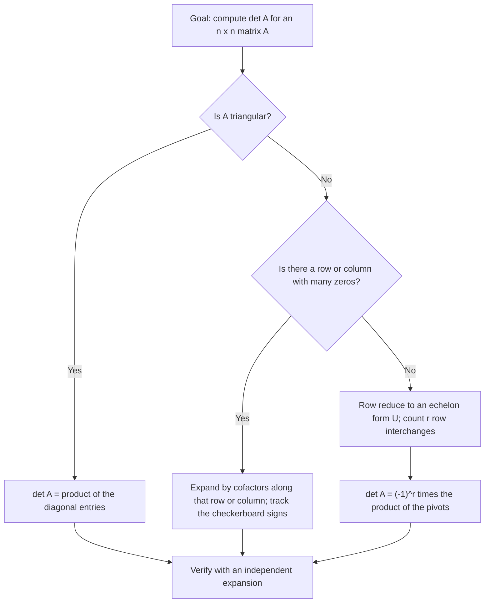

---
tags:
  - CCT3
  - Lin_Algebra
Topic: Baser for underrum og vektorrum samt determinanter
Semester: CCT3
Course: Linær Algebra
Litterature:
  - Linear Algebra and Its Applications, Global Edition, 6ed
Created: 05-10-2026
---
## Table of Contents

1. [[#1.1 Coordinate Systems|1.1 Coordinate Systems]]
2. [[#1.2 The Dimension of a Subspace|1.2 The Dimension of a Subspace]]
3. [[#1.3 Rank and the Invertible Matrix Theorem|1.3 Rank and the Invertible Matrix Theorem]]
4. [[#1.4 Numerical Notes: Roundoff and Effective Rank|1.4 Numerical Notes: Roundoff and Effective Rank]]
5. [[#1.5 Practice Problems: Dimension, Rank, and Coordinates|1.5 Practice Problems: Dimension, Rank, and Coordinates]]
6. [[#1.6 Determinants: Motivation and Geometric Meaning|1.6 Determinants: Motivation and Geometric Meaning]]
	1. [[#1.6 Determinants: Motivation and Geometric Meaning#1.6.1 Motivating Example: Weighing Diamonds|1.6.1 Motivating Example: Weighing Diamonds]]
	2. [[#1.6 Determinants: Motivation and Geometric Meaning#1.6.2 Determinants as Area and Volume Scaling|1.6.2 Determinants as Area and Volume Scaling]]
7. [[#1.7 Introduction to Determinants|1.7 Introduction to Determinants]]
	1. [[#1.7 Introduction to Determinants#1.7.1 Deriving the $3 \times 3$ Determinant|1.7.1 Deriving the $3 \times 3$ Determinant]]
	2. [[#1.7 Introduction to Determinants#1.7.2 Base Cases|1.7.2 Base Cases]]
	3. [[#1.7 Introduction to Determinants#1.7.3 Recursive Definition via Submatrices|1.7.3 Recursive Definition via Submatrices]]
	4. [[#1.7 Introduction to Determinants#1.7.4 Cofactors and Cofactor Expansion|1.7.4 Cofactors and Cofactor Expansion]]
	5. [[#1.7 Introduction to Determinants#1.7.5 Bounding the Determinant|1.7.5 Bounding the Determinant]]
8. [[#1.8 Properties of Determinants|1.8 Properties of Determinants]]
	1. [[#1.8 Properties of Determinants#1.8.1 Row Operations and the Determinant|1.8.1 Row Operations and the Determinant]]
	2. [[#1.8 Properties of Determinants#1.8.2 Determinant from Echelon Form and the Invertibility Criterion|1.8.2 Determinant from Echelon Form and the Invertibility Criterion]]
	3. [[#1.8 Properties of Determinants#1.8.3 Column Operations and the Transpose|1.8.3 Column Operations and the Transpose]]
	4. [[#1.8 Properties of Determinants#1.8.4 Determinants and Matrix Products|1.8.4 Determinants and Matrix Products]]
	5. [[#1.8 Properties of Determinants#1.8.5 Linearity in Each Column|1.8.5 Linearity in Each Column]]
	6. [[#1.8 Properties of Determinants#1.8.6 Practice Problems|1.8.6 Practice Problems]]

# 1. Bases for Subspaces and Vector Spaces, and Determinants

| Symbol or term | Meaning |
|---|---|
| $\mathcal{B} = \{\mathbf{b}_1, \dots, \mathbf{b}_p\}$ | An *ordered basis* for a subspace $H$: $p$ linearly independent vectors that span $H$. |
| $[\mathbf{x}]_\mathcal{B}$ | The $\mathcal{B}$-coordinate vector of $\mathbf{x}$: the unique weights $c_1, \dots, c_p$ with $\mathbf{x} = c_1\mathbf{b}_1 + \dots + c_p\mathbf{b}_p$. |
| $\mathbb{R}^n$ | Euclidean $n$-space; its dimension is $n$. |
| $H$ | A subspace — here, one that has a basis of $p$ vectors. |
| $\{\mathbf{0}\}$ | The zero subspace; its dimension is $0$ by definition. |
| $\operatorname{Span}\{\mathbf{v}_1, \dots, \mathbf{v}_k\}$ | The set of all linear combinations of the listed vectors. |
| $\dim H$ | Dimension of $H$: the number of vectors in any basis of $H$. |
| $\operatorname{Nul} A$ | Null space of $A$: the set of all solutions of $A\mathbf{x} = \mathbf{0}$. |
| $\dim \operatorname{Nul} A$ | The number of free variables in $A\mathbf{x} = \mathbf{0}$ (the nullity of $A$). |
| $\operatorname{Col} A$ | Column space of $A$: the span of the columns of $A$. |
| $\operatorname{rank} A$ | Rank of $A$: $\dim \operatorname{Col} A$, equal to the number of pivot columns of $A$. |
| $I_n$ | The $n \times n$ identity matrix. |
| $A^T$ | Transpose of $A$: rows and columns interchanged. |
| $\det A$, $\lvert A \rvert$ | Determinant of a square matrix $A$; $\lvert A \rvert$ is an alternative notation. |
| $a_{ij}$ | The entry in row $i$, column $j$ of $A$. |
| $A_{ij}$ | The submatrix left after deleting row $i$ and column $j$ of $A$. |
| $C_{ij}$ | The $(i,j)$-cofactor of $A$: $C_{ij} = (-1)^{i+j} \det A_{ij}$. |
| $(-1)^{i+j}$ | The cofactor sign factor; it creates the alternating checkerboard pattern. |
| $\Delta$ | The explicit six-term expression for a $3 \times 3$ determinant that motivates the recursive definition. |
| $U$, $u_{11}, \dots, u_{nn}$ | An echelon form of $A$ and its pivots (the diagonal entries of $U$). |
| $r$ | The number of row interchanges used while reducing $A$ to $U$; $\det A = (-1)^r \det U$. |
| $R_i \leftarrow R_i + kR_j$ | Row replacement (add a multiple of one row to another); leaves the determinant unchanged. |
| $R_i \leftrightarrow R_j$ | Row interchange; negates the determinant. |
| $R_i \leftarrow kR_i$ | Row scaling by $k$; multiplies the determinant by $k$. |
| $\sim$ | Row equivalence: the two matrices differ by elementary row operations. |
| $T(\mathbf{x})$ | The determinant viewed as a function of a single column vector of the matrix. |
| $D$, $d_{ij}$ | The design matrix of a weighing scheme and its entries ($1$ = left pan, $-1$ = right pan). |
| $\det(D^T D)$ | The quantity maximized by an accurate weighing design. |
| $n!$ | Factorial, $n! = n(n-1) \cdots 1$: the number of terms in a full cofactor expansion. |
| Jacobian | The determinant of the matrix of first partial derivatives; the volume-scaling factor in multivariable calculus. |
| IMT | Invertible Matrix Theorem: the list of equivalent conditions for invertibility. |
| SVD | Singular Value Decomposition: the numerically robust tool for determining *effective* rank. |
| ✓ | Marks the verification step that closes each computed example. |

_Table 1.1: Quick-reference table of every symbol, operator, abbreviation, and convention used in this note._

## 1.1 Coordinate Systems

A coordinate system provides a way to uniquely identify vectors within a subspace.
In everyday life we take this idea for granted: a street address identifies one building, not several, and that uniqueness is what makes the address useful.
Developing coordinate systems for subspaces leads naturally to the concepts of dimension and rank, because the number of coordinates a vector needs is exactly the size of the basis you chose.

The primary reason for selecting a basis for a subspace $H$, rather than merely a spanning set, is that each vector in $H$ can be written in *only one way* as a linear combination of the basis vectors.
A spanning set only guarantees that a representation exists.
A basis guarantees that there is exactly one, and uniqueness is what turns a recipe for building vectors into an actual coordinate system.
Without uniqueness the phrase "the coordinates of $\mathbf{x}$" would be meaningless, because the same vector could be described by two different lists of numbers, and no calculation could be trusted.
This is the sense in which a coordinate vector is a description rather than an object: the vector $\mathbf{x}$ is fixed, while the numbers that describe it depend on the basis that was chosen.
Everything in the rest of this chapter follows from taking that dependence seriously, and much of applied linear algebra is largely the art of choosing the basis that makes a given problem easy.

To see why uniqueness holds, suppose $\mathcal{B} = \{\mathbf{b}_1, \dots, \mathbf{b}_p\}$ is a basis for $H$.
If a vector $\mathbf{x} \in H$ could be represented in two ways:

$$
\mathbf{x} = c_1\mathbf{b}_1 + \dots + c_p\mathbf{b}_p \quad \text{and} \quad \mathbf{x} = d_1\mathbf{b}_1 + \dots + d_p\mathbf{b}_p
$$

Subtracting the two equations gives:

$$
\mathbf{0} = \mathbf{x} - \mathbf{x} = (c_1 - d_1)\mathbf{b}_1 + \dots + (c_p - d_p)\mathbf{b}_p
$$

Because the basis set $\mathcal{B}$ is linearly independent, all weights in this combination must equal zero:

$$
c_j - d_j = 0 \implies c_j = d_j \quad \text{for } 1 \le j \le p
$$

This confirms that the two representations are identical.
Notice which hypothesis does the work: the argument uses *only* linear independence, while existence of a representation comes from spanning.
A basis is precisely a set with both properties, which is why it delivers exactly one representation for every vector.
If the set spanned but was dependent, the same $\mathbf{x}$ would have infinitely many representations; if it were independent but did not span, some vectors of $H$ would have none.

>[!info] Definition: Coordinates Relative to a Basis
>Suppose the set $\mathcal{B} = \{\mathbf{b}_1, \dots, \mathbf{b}_p\}$ is an ordered basis for a subspace $H$. For each $\mathbf{x} \in H$, the ***coordinates of $\mathbf{x}$ relative to the basis $\mathcal{B}$*** (or the ***$\mathcal{B}$-coordinates of $\mathbf{x}$***) are the scalars $c_1, \dots, c_p$ such that:
>$$\mathbf{x} = c_1\mathbf{b}_1 + \dots + c_p\mathbf{b}_p$$
>The vector in $\mathbb{R}^p$:
>$$[\mathbf{x}]_\mathcal{B} = \begin{bmatrix} c_1 \\ \vdots \\ c_p \end{bmatrix}$$
>is called the ***coordinate vector of $\mathbf{x}$ relative to $\mathcal{B}$*** (or the ***$\mathcal{B}$-coordinate vector of $\mathbf{x}$***).
>
>**Breakdown:**
>- $\mathcal{B}$ : An ordered basis of $p$ linearly independent vectors spanning $H$; $\mathbf{x}$ : a vector in $H$; $c_1, \dots, c_p$ : the unique weights on the basis vectors; $[\mathbf{x}]_\mathcal{B}$ : those weights collected into a column vector in $\mathbb{R}^p$.

>[!abstract] Analogy: Coordinates Are an Address
>A coordinate vector is an address. The basis fixes the street grid — the directions it is legal to walk along — and the coordinates say how far to walk along each one.
>Choose a different basis and the point has not moved, but its address changes, which is why a coordinate vector must always name the basis that produced it.

The word *ordered* in the definition is doing real work.
The basis is a list, not a bag: swapping $\mathbf{b}_1$ and $\mathbf{b}_2$ produces a different basis, and it swaps the first two entries of every coordinate vector.
Two bases that differ only by order therefore encode the same geometry in two different coordinate systems, exactly as writing an address "Stockholm, 5 Main Street" reorders information without changing the building.

>[!warning] Order and uniqueness both matter
>- **Order:** $[\mathbf{x}]_\mathcal{B}$ depends on the *order* of the basis vectors. With $\mathcal{B} = \{\mathbf{b}_1, \mathbf{b}_2\}$ you may get $[\mathbf{x}]_\mathcal{B} = (2, 3)$, but with the reordered basis $\{\mathbf{b}_2, \mathbf{b}_1\}$ the same vector has coordinate vector $(3, 2)$.
>- **Uniqueness:** If the spanning set is *not* linearly independent, coordinates are not unique — there are then infinitely many weight lists describing the same $\mathbf{x}$, and $[\mathbf{x}]_\mathcal{B}$ is not well defined.

>[!example] Example 1: Finding the Coordinate Vector
>Let $\mathbf{v}_1 = \begin{bmatrix} 3 \\ 6 \\ 2 \end{bmatrix}$, $\mathbf{v}_2 = \begin{bmatrix} -1 \\ 0 \\ 1 \end{bmatrix}$, $\mathbf{x} = \begin{bmatrix} 3 \\ 12 \\ 7 \end{bmatrix}$, and $\mathcal{B} = \{\mathbf{v}_1, \mathbf{v}_2\}$. The set $\mathcal{B}$ forms a basis for $H = \operatorname{Span}\{\mathbf{v}_1, \mathbf{v}_2\}$ because $\mathbf{v}_1$ and $\mathbf{v}_2$ are linearly independent. Determine if $\mathbf{x} \in H$, and if so, calculate $[\mathbf{x}]_\mathcal{B}$.
>
>**Solution:** If $\mathbf{x}$ is in $H$, the vector equation $c_1\mathbf{v}_1 + c_2\mathbf{v}_2 = \mathbf{x}$ must be consistent:
>$$c_1 \begin{bmatrix} 3 \\ 6 \\ 2 \end{bmatrix} + c_2 \begin{bmatrix} -1 \\ 0 \\ 1 \end{bmatrix} = \begin{bmatrix} 3 \\ 12 \\ 7 \end{bmatrix}$$
>Set up the augmented matrix and row reduce:
>$$\begin{bmatrix} 3 & -1 & 3 \\ 6 & 0 & 12 \\ 2 & 1 & 7 \end{bmatrix} \sim \begin{bmatrix} 1 & 0 & 2 \\ 0 & 1 & 3 \\ 0 & 0 & 0 \end{bmatrix}$$
>The system is consistent, giving $c_1 = 2$ and $c_2 = 3$. Therefore, $\mathbf{x}$ is in $H$, and its $\mathcal{B}$-coordinate vector is:
>$$[\mathbf{x}]_\mathcal{B} = \begin{bmatrix} 2 \\ 3 \end{bmatrix}$$
>The third row of zeros is informative: it says the three equations impose only two independent conditions, so the system is consistent and the solution is unique, which is precisely what a basis guarantees. Consistency is the membership test for $H$, and the unique solution is the coordinate vector.
>
>✓ Check: $2\mathbf{v}_1 + 3\mathbf{v}_2 = \begin{bmatrix} 6 \\ 12 \\ 4 \end{bmatrix} + \begin{bmatrix} -3 \\ 0 \\ 3 \end{bmatrix} = \begin{bmatrix} 3 \\ 12 \\ 7 \end{bmatrix} = \mathbf{x}$.

![[Pasted image 20261005200107.png]]

_Figure 1.1: A coordinate system on a plane $H$ in $\mathbb{R}^3$: the basis vectors $\mathbf{b}_1$ and $\mathbf{b}_2$ lie in $H$, and the basis imposes a coordinate grid on the plane so that points of $H$ can be addressed by two numbers instead of three._

The figure shows the geometric content of the definition.
Every vector of the plane $H$ can be reached by travelling a certain distance along $\mathbf{b}_1$ and then a certain distance along $\mathbf{b}_2$, and those two distances are the coordinates.
The grid lines drawn in the picture are the images of the ordinary grid of $\mathbb{R}^2$: the coordinate system of the plane is just a skewed copy of the familiar coordinate system of the two-dimensional plane.

In the picture, the grid lines through the origin are the images of the coordinate axes of $\mathbb{R}^2$: each line collects the vectors with a fixed first coordinate or a fixed second coordinate.
Coordinates measured along $\mathbf{b}_1$ and $\mathbf{b}_2$ therefore play the same role in $H$ that ordinary $x$- and $y$-coordinates play in the plane.
The vectors of $H$ still have three entries, and those entries are perfectly valid numbers; they are simply measured against the standard axes of $\mathbb{R}^3$, which do not lie in $H$ and therefore say nothing directly about the plane's internal geometry.

Even though vectors in $H$ reside in $\mathbb{R}^3$, they are completely determined by coordinate vectors in $\mathbb{R}^2$.
The basis $\mathcal{B}$ introduces a coordinate grid on the plane $H$, making it act like $\mathbb{R}^2$.
This is worth pausing on, because it is the practical payoff of the whole theory.
A question posed inside the plane $H$ can be translated into a question about ordinary $2$-tuples, solved there with the tools of the previous chapters, and translated back into $H$.
Nothing is lost in the process, because the translation is reversible.

The correspondence $\mathbf{x} \mapsto [\mathbf{x}]_\mathcal{B}$ is a one-to-one mapping between $H$ and $\mathbb{R}^2$ that preserves linear combinations.
Such a mapping is called an ***isomorphism***, and $H$ is said to be ***isomorphic*** to $\mathbb{R}^2$.
In general, if a subspace $H$ has a basis of $p$ vectors, the mapping $\mathbf{x} \mapsto [\mathbf{x}]_\mathcal{B}$ makes $H$ look and behave identically to $\mathbb{R}^p$.

"Preserves linear combinations" means that it does not matter whether you combine vectors first and then take coordinates, or take coordinates first and then combine the ordinary tuples: both orders give the same answer.
Concretely, if $[\mathbf{u}]_\mathcal{B} = \mathbf{c}$ and $[\mathbf{v}]_\mathcal{B} = \mathbf{d}$, then

$$
[\mathbf{u} + \mathbf{v}]_\mathcal{B} = \mathbf{c} + \mathbf{d}, \qquad [k\mathbf{u}]_\mathcal{B} = k\mathbf{c}
$$

for every scalar $k$.
Everything you know about $\mathbb{R}^p$ therefore transfers verbatim to $H$, with coordinates standing in for vectors.
Linear independence, spanning sets, and solving systems are all preserved, so statements can be proved once in $\mathbb{R}^p$ and then used everywhere.
This is exactly why the ideas of dimension, rank, and nullity can be computed from a matrix rather than from geometric reasoning in the original space.

This transfer principle is the reason the rest of this chapter can be stated for $\mathbb{R}^n$ and still apply to every subspace with a basis.
A theorem about independence, spanning, or systems of equations that is proved for $\mathbb{R}^n$ becomes a theorem about $H$ as soon as the statement is pulled through the coordinate map.
It also gives a diagnostic procedure worth remembering: if a claim about a subspace looks unfamiliar, translate it into coordinates, settle it in $\mathbb{R}^p$, and translate the answer back.

>[!example] Mini-Example: Linear Combinations Pass Through the Coordinate Map
>Keep $\mathcal{B} = \{\mathbf{v}_1, \mathbf{v}_2\}$ and $\mathbf{x}$ from Example 1, so $[\mathbf{x}]_\mathcal{B} = \begin{bmatrix} 2 \\ 3 \end{bmatrix}$.
>
>- Scaling: $3\mathbf{x} = 6\mathbf{v}_1 + 9\mathbf{v}_2$, so $[3\mathbf{x}]_\mathcal{B} = \begin{bmatrix} 6 \\ 9 \end{bmatrix} = 3[\mathbf{x}]_\mathcal{B}$.
>- Adding: $\mathbf{x} + 2\mathbf{v}_1 = 4\mathbf{v}_1 + 3\mathbf{v}_2$, so $[\mathbf{x} + 2\mathbf{v}_1]_\mathcal{B} = \begin{bmatrix} 4 \\ 3 \end{bmatrix} = [\mathbf{x}]_\mathcal{B} + 2[\mathbf{e}_1]_\mathcal{B}$, where $[\mathbf{e}_1]_\mathcal{B} = \begin{bmatrix} 1 \\ 0 \end{bmatrix}$ is the coordinate vector of the first basis vector itself.
>
>✓ Check: $6\mathbf{v}_1 + 9\mathbf{v}_2 = \begin{bmatrix} 18 \\ 36 \\ 12 \end{bmatrix} + \begin{bmatrix} -9 \\ 0 \\ 9 \end{bmatrix} = \begin{bmatrix} 9 \\ 36 \\ 21 \end{bmatrix} = 3\mathbf{x}$, which confirms the scaled coordinates.

To find a coordinate vector in practice, remember that the definition is a linear system in disguise.
Writing $\mathbf{x} = c_1\mathbf{b}_1 + \dots + c_p\mathbf{b}_p$ and expressing both sides in standard coordinates turns the definition into an augmented matrix $[\mathbf{b}_1 \ \cdots \ \mathbf{b}_p \ \mathbf{x}]$.
Row reducing that matrix either reveals an inconsistency (meaning $\mathbf{x} \notin H$) or produces the coordinate vector directly.

Two extreme cases are worth keeping in mind.
If the basis is the standard basis of $\mathbb{R}^n$, the coordinate vector of a vector is the vector itself.
If the basis consists of a single vector, the coordinate vector has one entry, matching the fact that the line it spans is one-dimensional.
The coordinate vector therefore carries the whole content of the definition: everything computable about $\mathbf{x}$ inside $H$ can be computed from $[\mathbf{x}]_\mathcal{B}$ alone.
The length of the coordinate vector is the number of vectors in the basis, a number that every basis of $H$ shares.
Naming that number is the job of [[#1.2 The Dimension of a Subspace]].

The basis itself is a choice, and different choices produce different coordinate vectors for the same vector.
What cannot change is the number of entries: every coordinate vector of a vector in a $p$-dimensional subspace has exactly $p$ entries.
Dimension is therefore intrinsic to the subspace, while coordinates depend on the basis selected to describe it.

---

## 1.2 The Dimension of a Subspace

If a subspace $H$ has a basis of $p$ vectors, every basis of $H$ must consist of exactly $p$ vectors.
This is the fact that makes the word *dimension* meaningful: a subspace has one size, not many, so an exam question asking for "the" dimension of a subspace always has a single answer.
Intuitively, the isomorphism of the previous section explains it.
All of $H$ looks like $\mathbb{R}^p$ through coordinates, and in $\mathbb{R}^p$ you cannot build a spanning set from fewer than $p$ vectors, nor keep more than $p$ vectors linearly independent.
The two constraints meet at exactly $p$, and that meeting point is the dimension.

A sketch of the argument helps explain why no other number is possible.
If one basis had fewer vectors than another, the longer list would be forced to be dependent by the shorter one; if it had more, the shorter list would fail to span.
Both possibilities contradict the properties that define a basis, so the counts must agree.
The formal version of this reasoning is the exchange argument that reconstructs one basis from another vector by vector, and it is the technical heart of the statement that all bases of $H$ have the same size.

>[!info] Definition: Dimension
>The ***dimension*** of a nonzero subspace $H$, denoted by $\dim H$, is the number of vectors in any basis for $H$. The dimension of the zero subspace $\{\mathbf{0}\}$ is defined to be zero.
>
>**Breakdown:**
>- $H$ : A subspace of $\mathbb{R}^n$; $\dim H$ : the exact count of vectors in any basis for $H$; $\{\mathbf{0}\}$ : the zero subspace, spanned by the empty set, whose dimension is set to $0$ by convention.

The space $\mathbb{R}^n$ has dimension $n$, as every basis for $\mathbb{R}^n$ consists of $n$ vectors.
In geometric terms:

- A line through $\mathbf{0}$ is one-dimensional.
- A plane through $\mathbf{0}$ is two-dimensional.

Dimension is therefore a precise, countable version of the informal idea of "how many directions of freedom" a subspace has.
A line has one direction of freedom, because you can only walk along it.
A plane has two, because you can walk along it and across it.
The zero subspace has none, because the only vector in it cannot move anywhere, which is why its dimension is declared to be $0$ rather than left undefined.
Notice also that a subspace of $\mathbb{R}^n$ can never have dimension greater than $n$: there simply are not more than $n$ independent directions available, a point worth remembering when checking whether a claimed basis makes sense.

Dimension is an invariant rather than a property of a description.
The same subspace described as a span, as a null space, or as a solution set must produce the same number, and any disagreement between the three routes signals an arithmetic error somewhere.

>[!info] Definition: Echelon Form and Pivots
>An **echelon form** of a matrix is the staircase shape produced by row reduction: reading from the top, the first nonzero entry of each row lies strictly to the right of the first nonzero entry of the row above it, and any rows of zeros sit at the bottom. The leading nonzero entries are the **pivots**, and the columns that contain them are the **pivot columns**.
>Pivots are what let rank, nullity, and linear dependence be read straight off a reduced matrix, so every counting recipe in this chapter is a pivot count in disguise.
>
>**Breakdown:**
>- **Echelon form** : the staircase-shaped row-equivalent form produced by reduction; **pivot** : the leading nonzero entry of a nonzero row of that form; **pivot column** : a column of the original matrix that contains a pivot.

To *compute* a dimension you need a basis, and in practice bases come from parametric descriptions.
There are three situations that cover almost every exercise.
If the subspace is given as the span of a list of vectors, arrange them as the columns of a matrix, row reduce, and count pivot columns: the pivot columns of the original list are a basis, and the count is the dimension.
If the subspace is a null space, solve the homogeneous system and count free variables.
If the subspace is described geometrically, such as "all vectors with $x_1 + x_2 - x_3 = 0$", solve for the leading variables in terms of the free ones and read off the parametric vector form, which is the same as the null-space recipe.

In every case the arithmetic is the same row reduction; what changes is where the matrix comes from.
That is why the three descriptions of a subspace are often interchangeable in exercises, and why a dimension can be cross-checked by re-deriving it from a different description.
The geometric reading of a dimension is worth keeping alongside the algebraic one: each independent linear equation imposed on $\mathbb{R}^n$ removes exactly one direction, so two independent equations in $\mathbb{R}^4$ describe a two-dimensional subspace.
That shortcut is the Rank Theorem read backwards — the number of free variables is $n$ minus the number of pivots — and it is often the fastest way to predict an answer before doing any algebra.

The null space is the most important of the three cases, because null spaces are where "degrees of freedom" become numbers. Its basis vectors are read straight off the parametric vector form of the solutions of $A\mathbf{x} = \mathbf{0}$, one vector per free variable.

The same recipe applies to any solution set: the parametric vector form always exhibits a basis, and the number of parameters is always the dimension.

>[!example] Example 2: Dimension of a Null Space
>To find the dimension of the null space $\operatorname{Nul} A$ for a matrix $A$, solve the homogeneous equation $A\mathbf{x} = \mathbf{0}$ and express the general solution in parametric vector form. Each free variable corresponds to a basis vector in the spanning set for $\operatorname{Nul} A$.
>
>Therefore, to find $\dim \operatorname{Nul} A$, count the number of free variables in the equation $A\mathbf{x} = \mathbf{0}$.
>
>Why this works: the free variables are parameters you may choose freely, so the solution set is the set of all linear combinations of the vectors multiplied by those parameters. Those vectors are automatically linearly independent, because each one carries a $1$ in a position where all the others carry $0$ (each is attached to a different free variable), so they form a basis.
>✓ Check: applied to the matrix of the worked example just below, the recipe counts one free variable and produces a one-dimensional null space, so the count of parameters and the count of basis vectors agree by construction.

>[!example] Worked Example: Counting Free Variables to Get $\dim \operatorname{Nul} A$
>Let $A = \begin{bmatrix} 1 & 2 & 3 \\ 2 & 4 & 7 \end{bmatrix}$. Solve $A\mathbf{x} = \mathbf{0}$ and read off the nullity.
>
>**Solution:** Row reduce:
>$$\begin{bmatrix} 1 & 2 & 3 \\ 2 & 4 & 7 \end{bmatrix} \sim \begin{bmatrix} 1 & 2 & 0 \\ 0 & 0 & 1 \end{bmatrix}$$
>Columns $1$ and $3$ are pivot columns, so $x_2$ is a free variable. The equations are $x_1 = -2x_2$ and $x_3 = 0$, so
>$$\mathbf{x} = x_2 \begin{bmatrix} -2 \\ 1 \\ 0 \end{bmatrix}$$
>One free variable, so $\dim \operatorname{Nul} A = 1$ and $\operatorname{Nul} A = \operatorname{Span}\left\{\begin{bmatrix} -2 \\ 1 \\ 0 \end{bmatrix}\right\}$.
>
>✓ Check: $A\begin{bmatrix} -2 \\ 1 \\ 0 \end{bmatrix} = \begin{bmatrix} -2 + 2 \\ -4 + 4 \end{bmatrix} = \begin{bmatrix} 0 \\ 0 \end{bmatrix}$, so the vector is genuinely in the null space — and one free variable is the only source of freedom, which is why the nullity is $1$ and not $0$.

>[!info] Definition: Rank
>The ***rank*** of a matrix $A$, denoted by $\operatorname{rank} A$, is the dimension of the column space of $A$.
>
>**Breakdown:**
>- $A$ : An $m \times n$ matrix; $\operatorname{Col} A$ : the span of the columns of $A$; $\operatorname{rank} A$ : $\dim \operatorname{Col} A$, equal to the number of pivot columns of $A$.

Rank measures how many *independent* directions the columns of $A$ provide.
The pivot columns of any echelon form of $A$ are linearly independent, and every other column is a combination of them, so the pivots are exactly a basis of the column space and the rank is exactly the pivot count.
Reading a rank off a matrix is therefore a matter of row reducing and counting pivots, the same operation that produces nearly every other quantity in this chapter.
A rank that falls short of the number of columns means the columns contain redundancy; a rank that equals the number of columns means they are independent.

Two bounds follow immediately from the definition and are worth remembering: the rank of an $m \times n$ matrix is at most $m$, because the column space lives in $\mathbb{R}^m$, and at most $n$, because it takes at most $n$ columns to span it.
A matrix is said to have *full rank* when it attains the largest value its shape allows, and full rank is exactly the situation in which no column is redundant.
The rank of $A$ and the rank of $A^T$ always agree, even though the two matrices may look completely different, and the transpose identity for determinants derived later in this note explains why.
In practice this agreement is a useful check on a computed rank, since a mistake in the reduction is unlikely to preserve the symmetry between rows and columns.

>[!example] Example 3: Determining the Rank of a Matrix
>Determine the rank of the matrix:
>$$A = \begin{bmatrix} 2 & 5 & -3 & -4 & 8 \\ 4 & 7 & -4 & -3 & 9 \\ 6 & 9 & -5 & -2 & 4 \\ 0 & -9 & 6 & 5 & -6 \end{bmatrix}$$
>
>**Solution:** Row reduce $A$ to echelon form. Eliminate below the first pivot with $R_2 \leftarrow R_2 - 2R_1$ and $R_3 \leftarrow R_3 - 3R_1$:
>$$A \sim \begin{bmatrix} 2 & 5 & -3 & -4 & 8 \\ 0 & -3 & 2 & 5 & -7 \\ 0 & -6 & 4 & 10 & -20 \\ 0 & -9 & 6 & 5 & -6 \end{bmatrix}$$
>Continue: $R_3 \leftarrow R_3 - 2R_2$ and $R_4 \leftarrow R_4 - 3R_2$:
>$$\sim \begin{bmatrix} 2 & 5 & -3 & -4 & 8 \\ 0 & -3 & 2 & 5 & -7 \\ 0 & 0 & 0 & 0 & -6 \\ 0 & 0 & 0 & -10 & 15 \end{bmatrix}$$
>Interchange the last two rows ($R_3 \leftrightarrow R_4$) to reach echelon form:
>$$\sim \begin{bmatrix} \mathbf{2} & 5 & -3 & -4 & 8 \\ 0 & \mathbf{-3} & 2 & 5 & -7 \\ 0 & 0 & 0 & \mathbf{-10} & 15 \\ 0 & 0 & 0 & 0 & \mathbf{-6} \end{bmatrix}$$
>The matrix has 4 pivot columns (columns $1$, $2$, $4$, and $5$). Thus:
>$$\operatorname{rank} A = 4$$
>
>✓ Check: the $4 \times 4$ submatrix built from columns $1$, $2$, $4$, $5$ has determinant $360 \neq 0$, so those four columns are linearly independent and can support four pivots; together with the echelon form this pins the rank at exactly $4$. The Rank Theorem below then predicts $\dim \operatorname{Nul} A = 5 - 4 = 1$, which matches the single free variable (column $3$) in the reduction.

>[!warning] Correction: the rank in the source's example
>The source reported $\operatorname{rank} A = 3$ with pivot columns $1$, $2$, and $4$, and its intermediate step showed a $14$ in the $(3,4)$-position after $R_3 \leftarrow R_3 - 3R_1$. That entry is wrong: $-2 - 3(-4) = 10$, not $14$. With the correct arithmetic the third row becomes $\begin{bmatrix} 0 & 0 & 0 & 0 & -6 \end{bmatrix}$ and the fourth row keeps a pivot, so the echelon form has **four** pivots (columns $1$, $2$, $4$, $5$) and $\operatorname{rank} A = 4$.

Because the nonpivot columns correspond to free variables in $A\mathbf{x} = \mathbf{0}$, and the total number of columns equals pivot columns plus nonpivot columns, the dimensions of $\operatorname{Col} A$ and $\operatorname{Nul} A$ are directly related.
This is the content of the next theorem, and it is the single most useful accounting identity in the subject.
The columns of an $m \times n$ matrix split into the ones that carry independent information (pivots, counted by the rank) and the redundant ones, each of which contributes one degree of freedom to the null space.
Nothing else can happen to a column: it is a pivot column or it is not, so the two counts must add up to $n$.

>[!summary] Theorem 1: The Rank Theorem (book: Theorem 14)
>If a matrix $A$ has $n$ columns, then:
>$$\operatorname{rank} A + \dim \operatorname{Nul} A = n$$
>
>**Breakdown:**
>- $A$ : An $m \times n$ matrix with $n$ columns; $\operatorname{rank} A$ : the number of pivot columns; $\dim \operatorname{Nul} A$ : the number of nonpivot columns, that is, the number of free variables.
>
>**Proof:**
>The rank of $A$ equals the number of pivot columns in $A$. The dimension of $\operatorname{Nul} A$ equals the number of free variables in $A\mathbf{x} = \mathbf{0}$, which matches the number of nonpivot columns. Since every column is either a pivot column or a nonpivot column, the sum of the pivot columns and nonpivot columns is the total number of columns $n$. Hence, $\operatorname{rank} A + \dim \operatorname{Nul} A = n$.

Two special cases are worth memorizing, because they are the ones that appear in exercises.
If the columns of $A$ are linearly independent, then the rank equals the number of columns and the nullity is $0$, so the only solution of $A\mathbf{x} = \mathbf{0}$ is $\mathbf{x} = \mathbf{0}$.
If the columns of $A$ span $\mathbb{R}^m$, then the rank equals the number of rows, and whenever $m < n$ there must be free variables and hence a nontrivial null space.
The theorem also gives a cheap sanity check: after computing a rank, you can predict the nullity without solving the homogeneous system, and vice versa.

One practical warning: the rank is the number of pivots of the reduced form, not the number of nonzero rows of the original matrix.
Elimination can create rows of zeros that were not visible at the start, and it can also destroy visible ones, so the count must always be taken from the echelon form.
The theorem also shows that rank and nullity are not independent pieces of information: once one of them is known, the other is fixed, and questions about free variables can be answered without solving the homogeneous system at all.

>[!example] Mini-Example: Using the Rank Theorem as a Ledger
>- For $A = \begin{bmatrix} 1 & 2 & 3 \\ 2 & 4 & 7 \end{bmatrix}$ from the worked example above: $\operatorname{rank} A + \dim \operatorname{Nul} A = 2 + 1 = 3$, and $A$ has $n = 3$ columns. ✓
>- For the $4 \times 5$ matrix of Example 3: $\operatorname{rank} A + \dim \operatorname{Nul} A = 4 + 1 = 5 = n$. ✓
>
>Read the identity as a conservation law: every column is either a pivot (counted by the rank) or a free-variable generator (counted by the nullity), and nothing is left over.

Another consequence of having a dimension is that "enough vectors" and "not too many vectors" become the same condition, which is the Basis Theorem.
It saves real work: to prove that a set of $p$ vectors is a basis of a $p$-dimensional space you only have to verify *one* of the two basis properties, never both.
In an exam this is often the difference between a two-minute answer and a page of computation, so it is worth recognizing the situation when it arises: count the vectors first, compare the count with the known dimension, and then check whichever property is easiest.

The theorem also explains why a spanning set with more than $p$ vectors cannot be a basis of a $p$-dimensional space: the count alone rules it out before any computation.
Conversely, a set with fewer than $p$ vectors can never span, so both failure modes are visible from the number of vectors.

>[!summary] Theorem 2: The Basis Theorem (book: Theorem 15)
>Let $H$ be a $p$-dimensional subspace of $\mathbb{R}^n$.
>1. Any linearly independent set of exactly $p$ elements in $H$ is automatically a basis for $H$.
>2. Any set of $p$ elements of $H$ that spans $H$ is automatically a basis for $H$.
>
>**Breakdown:**
>- $H$ : A subspace of $\mathbb{R}^n$ with $\dim H = p$; $p$ : the exact number of vectors a basis of $H$ must contain.
>
>**Proof:**
>Because $H$ is isomorphic to $\mathbb{R}^p$, a set of $p$ vectors in $H$ behaves like a set of $p$ vectors in $\mathbb{R}^p$. In $\mathbb{R}^p$, a set of $p$ vectors is linearly independent if and only if it spans $\mathbb{R}^p$. Thus, for a $p$-dimensional subspace, any collection of $p$ vectors that is linearly independent must span $H$, and any collection of $p$ vectors that spans $H$ must be linearly independent. In either case, the set satisfies both criteria for a basis.

>[!example] Mini-Example: One Check Instead of Two
>Let $H$ be the plane $H = \{(a, b, 0) : a, b \in \mathbb{R}\}$ in $\mathbb{R}^3$, so $\dim H = 2$.
>
>- The two vectors $(1,1,0)$ and $(2,-1,0)$ lie in $H$ and are linearly independent (neither is a multiple of the other), so by part 1 they are *automatically* a basis of $H$ — no spanning check needed.
>- The two vectors $(1,0,0)$ and $(1,1,0)$ span $H$ (indeed $(0,1,0) = (1,1,0) - (1,0,0)$), so by part 2 they are *automatically* a basis of $H$ — no independence check needed.
>
>✓ Check: for the first pair, solving $a(1,1,0) + b(2,-1,0) = (x,y,0)$ gives $a = (x + 2y)/3$ and $b = (x - y)/3$, so every vector of $H$ is hit exactly once, confirming that the pair really does span $H$ as the theorem promised.

The Basis Theorem is what turns many basis questions into determinant questions, as the next example shows.

>[!example] Exam-Style Example: A Basis Test with a Parameter
>For which values of $t$ do the vectors $\mathbf{v}_1 = (1, t, 0)$, $\mathbf{v}_2 = (0, 1, t)$, and $\mathbf{v}_3 = (t, 0, 1)$ form a basis of $\mathbb{R}^3$?
>
>**Solution:** $\mathbb{R}^3$ has dimension $3$, so by the Basis Theorem the three vectors form a basis exactly when they are linearly independent. Arrange them as the columns of
>$$M_t = \begin{bmatrix} 1 & 0 & t \\ t & 1 & 0 \\ 0 & t & 1 \end{bmatrix}$$
>and expand along the first row: $\det M_t = 1 \cdot \det \begin{bmatrix} 1 & 0 \\ t & 1 \end{bmatrix} + t \cdot \det \begin{bmatrix} t & 1 \\ 0 & t \end{bmatrix} = 1 + t^3$. The only real root is $t = -1$, so the vectors form a basis for every $t \neq -1$.
>
>At $t = -1$ the vectors become $(1, -1, 0)$, $(0, 1, -1)$, and $(-1, 0, 1)$, and the third is the combination $-\mathbf{v}_1 - \mathbf{v}_2$; the set is dependent and its span is two-dimensional.
>
>✓ Check: at $t = -1$ the relation $\mathbf{v}_1 + \mathbf{v}_2 + \mathbf{v}_3 = \mathbf{0}$ confirms the dependence, and the first two vectors remain independent, so the span has dimension $2$; for every other $t$ the determinant is nonzero, so the three vectors are independent and, by the count in the Basis Theorem, a basis of $\mathbb{R}^3$.

Dimensions, ranks, and nullities feed directly into invertibility, which is the subject of the next section.
A square matrix that neither collapses a nonzero vector to zero (nullity $0$) nor misses any direction (rank $n$) is invertible, and those two statements turn out to be the same statement.
Both are also the same as saying that the determinant is nonzero, which is where the second half of the note will end up.

Keeping that connection in mind makes the two halves of the note easier to hold together: the first half measures independence with dimensions, and the determinant later measures it with a single number.

---

## 1.3 Rank and the Invertible Matrix Theorem

The definitions of rank, dimension, null space, and column space provide additional equivalent conditions for the invertibility of square matrices.
The four new conditions add five more entries for the Invertible Matrix Theorem (IMT), the running list of statements that are all equivalent to invertibility.
Each of the new conditions is a way of saying the same thing: an invertible $n \times n$ matrix must have *no redundancy*, so nothing may be lost (nullity $0$) and nothing may be missing (rank $n$).
Thinking of invertibility as "no loss and no gaps" is the fastest way to remember the list, because every statement below is a different way of ruling out one of the two failures.
Every one of them can be checked in a single row reduction, which is why they are practical rather than merely theoretical.

Geometrically, a non-invertible square matrix collapses at least one direction to nothing, which is why some nonzero vector is sent to $\mathbf{0}$; invertibility is the statement that no direction collapses and no direction is missing.
This picture also explains why the conditions come in pairs: every statement about the null space has a twin statement about the column space, and every statement about rank has a twin statement about dimension.
When solving problems, the practical advice is to test whichever condition is cheapest for the matrix at hand, because the theorem guarantees that all the other conditions share its truth value.
Because the chain of implications closes into a loop, the equivalence of (m)–(q) does not depend on the order in which the conditions are listed: proving any one of them proves all of them, and disproving one disproves them all.
In an exam this is a licence to use the cheapest test and quote the rest, and a single counterexample — one nonzero vector in the null space, say — rules out the entire list at once.

>[!summary] Theorem 3: The Invertible Matrix Theorem (Continued)
>Let $A$ be an $n \times n$ matrix. The following statements are each equivalent to the statement that $A$ is an invertible matrix:
>
>- **m.** The columns of $A$ form a basis of $\mathbb{R}^n$.
>- **n.** $\operatorname{Col} A = \mathbb{R}^n$
>- **o.** $\operatorname{rank} A = n$
>- **p.** $\dim \operatorname{Nul} A = 0$
>- **q.** $\operatorname{Nul} A = \{\mathbf{0}\}$
>
>**Breakdown:**
>- $A$ : An $n \times n$ square matrix; $\operatorname{Col} A$ : its column space; $\operatorname{Nul} A$ : its null space; $\operatorname{rank} A$ : $\dim \operatorname{Col} A$.
>
>**Proof:**
>Statement (**m**) is logically equivalent to the existing conditions that the columns of $A$ are linearly independent and span $\mathbb{R}^n$.
>
>The remaining statements follow in a chain of implications:
>$$\text{Equation } A\mathbf{x} = \mathbf{b} \text{ is consistent for all } \mathbf{b} \implies (\text{n}) \implies (\text{o}) \implies (\text{p}) \implies (\text{q}) \implies A\mathbf{x} = \mathbf{0} \text{ has only the trivial solution}$$
>
>1. If $A\mathbf{x} = \mathbf{b}$ has a solution for every $\mathbf{b} \in \mathbb{R}^n$, then the columns span $\mathbb{R}^n$, so $\operatorname{Col} A = \mathbb{R}^n$ (**n**).
>2. If $\operatorname{Col} A = \mathbb{R}^n$, its dimension is $n$, so $\operatorname{rank} A = n$ (**o**).
>3. If $\operatorname{rank} A = n$, then by the Rank Theorem ($n + \dim \operatorname{Nul} A = n$), $\dim \operatorname{Nul} A = 0$ (**p**).
>4. If $\dim \operatorname{Nul} A = 0$, the null space contains only the zero vector, so $\operatorname{Nul} A = \{\mathbf{0}\}$ (**q**).
>5. If $\operatorname{Nul} A = \{\mathbf{0}\}$, then $A\mathbf{x} = \mathbf{0}$ has only the trivial solution, which is a known condition for invertibility.

The chain is a loop, not a ladder.
It starts from a known invertibility condition (consistency for every $\mathbf{b}$) and ends at another known condition (unique solution of the homogeneous equation), so every statement in between is also equivalent to invertibility itself.
In practice, this means that proving any one of (m)–(q) for a specific matrix proves all of them at once, and a single row reduction settles the question.

>[!example] Mini-Example: Testing the New Conditions on Two $2 \times 2$ Matrices
>- $A = \begin{bmatrix} 2 & 0 \\ 0 & 3 \end{bmatrix}$: two pivot columns, so $\operatorname{rank} A = 2 = n$; $\operatorname{Col} A = \mathbb{R}^2$; there are no free variables, so $\operatorname{Nul} A = \{\mathbf{0}\}$ and $\dim \operatorname{Nul} A = 0$; the two columns are linearly independent and span $\mathbb{R}^2$, so together they form a basis of $\mathbb{R}^2$. Every one of (m)–(q) holds, and indeed $\det A = 6 \neq 0$, so $A$ is invertible.
>- $B = \begin{bmatrix} 1 & 2 \\ 2 & 4 \end{bmatrix}$: the second column is twice the first, so $\operatorname{rank} B = 1 \neq 2$ and $\operatorname{Col} B$ is only a line; the free variables give $\operatorname{Nul} B = \operatorname{Span}\left\{\begin{bmatrix} -2 \\ 1 \end{bmatrix}\right\} \neq \{\mathbf{0}\}$ with dimension $1$.
>
>✓ Check: $\operatorname{rank} B + \dim \operatorname{Nul} B = 1 + 1 = 2 = n$, and for $A$ the same ledger reads $2 + 0 = 2 = n$; notice how a rank that falls short of $n$ must be compensated by a nullity that exceeds $0$.

The practical value of the list is that it lets you answer an invertibility question with whichever computation is fastest.

That freedom is not a license to guess: whichever test is used, the others must follow automatically, and one row reduction is enough to read the rank and the number of free variables off the same echelon form.
For a matrix with symbolic entries the determinant is usually the most informative test, because it produces a single expression whose zeros mark exactly the exceptional parameter values.
For a matrix with numerical entries, pivot counting is both faster and less error-prone.
If the matrix is small and has many zeros, expand a determinant.
If it is large or has awkward numbers, row reduce and count pivots instead.
If a dependence is visible by inspection — one column a multiple of another, a row of zeros — then the null space is nonzero and the matrix cannot be invertible, and no arithmetic is needed at all.
The following example puts the symbolic test to work on a whole family of matrices at once.

>[!example] Exam-Style Example: Rank with a Parameter
>For which values of $t$ does $A_t = \begin{bmatrix} 1 & 1 & t \\ 1 & t & 1 \\ t & 1 & 1 \end{bmatrix}$ have rank $3$, rank $2$, and rank $1$?
>
>**Solution:** Expand along the first row: $\det A_t = (t - 1) - (1 - t) + t(1 - t^2) = -(t - 1)^2(t + 2)$, which is zero exactly at $t = 1$ and $t = -2$. At every other value the rank is $3$.
>
>At $t = 1$ all three rows equal $(1, 1, 1)$, so the rank is $1$. At $t = -2$ each row sums to zero, so $(1, 1, 1)$ lies in the null space and the rank is $2$.
>
>✓ Check: the Rank Theorem reconciles the three cases — rank $3$ with nullity $0$, rank $2$ with nullity $1$, and rank $1$ with nullity $2$ all satisfy $\operatorname{rank} A_t + \dim \operatorname{Nul} A_t = 3$; at $t = 1$ the null space is the plane $x_1 + x_2 + x_3 = 0$, and at $t = -2$ it is the line spanned by $(1, 1, 1)$.

---

## 1.4 Numerical Notes: Roundoff and Effective Rank

While reducing a matrix to echelon form is straightforward for hand computations, real-world numerical rank determination is sensitive to rounding errors.
On paper the entries are exact symbols.
Inside a computer they are binary floating-point numbers with a fixed number of significant digits, and an entry that *should* be a clean zero can arrive as a tiny nonzero number such as $10^{-16}$.

If exact arithmetic is not used, floating-point roundoff can alter the computed rank.
For example, consider the matrix:

$$
\begin{bmatrix} 5 & 7 \\ 5 & x \end{bmatrix}
$$

If $x$ is theoretically $7$, but stored with a minute computational error (e.g., $7.00000001$), the algorithm may not treat $x - 7$ as zero, classifying the matrix as rank 2 instead of rank 1.

Notice that the culprit is the pivot test rather than the elimination itself.
As soon as the second pivot is treated as nonzero, everything that follows proceeds as if the matrix were genuinely invertible, and the final answer is wrong as a statement about the intended matrix even though it is correct as a statement about the stored one.

>[!example] Worked Example: One Rounding Error Changes the Rank
>Take the matrix $\begin{bmatrix} 5 & 7 \\ 5 & x \end{bmatrix}$ with $x$ stored as $7.00000001$ instead of $7$.
>
>In exact arithmetic with $x = 7$ the two rows are identical, so the columns are linearly dependent and the rank is $1$: elimination produces a second pivot of $x - 7 = 0$, and the row of zeros that follows announces the dependence.
>
>With the stored value the second pivot is $x - 7 = 10^{-8}$, since the determinant is $5(x - 7) = 5 \cdot 10^{-8}$, which is nonzero. A program that tests "is this pivot exactly zero?" answers *no* and reports rank $2$, while a program that compares the pivot against a tolerance answers *yes* and reports rank $1$.
>
>✓ Check: $5 \cdot 7.00000001 - 35 = 5 \cdot 10^{-8}$, so the determinant of the stored matrix really is nonzero — the rank is genuinely $2$ for the stored matrix and $1$ for the matrix the data was supposed to represent.

The lesson generalizes far beyond this $2 \times 2$ example.
Rank is a discontinuous function of the entries: perturbing a single entry of a rank-one matrix by $10^{-8}$ jumps the exact rank to $2$, even though the matrix is still, for every practical purpose, a rank-one matrix.
There is no way to fix this by computing more carefully, because the ambiguity lives in the data, not in the algorithm.
What can be fixed is the *question*: instead of asking "is the rank exactly $k$?", one asks "how many directions carry a meaningful amount of the matrix?", which is a question a computer can answer reliably.

In practice, the effective rank of a matrix is commonly determined via *Singular Value Decomposition* (SVD).
The SVD writes $A = U\Sigma V^T$ with $\Sigma$ diagonal, and the diagonal entries $\sigma_1 \ge \sigma_2 \ge \dots \ge 0$ measure how much of the matrix acts in each independent direction.
Rank is then defined as the number of singular values above a small tolerance: near-dependent columns produce singular values that are tiny but not exactly zero, and the tolerance separates the numerically meaningless ones from the genuine ones.
A matrix whose columns are almost dependent therefore has a very small but nonzero singular value, which is precisely the numerical signature of the roundoff problem above.
That is why numerical rank is called *effective* rank — it is a statement about the data as stored, and about the tolerance you chose, not a statement about pure exact arithmetic.
The size of the tolerance sets the meaning of the answer: a loose tolerance removes genuine but weak directions along with the noise, while a tight one keeps noise dressed up as structure.
For data on a bounded scale a common convention is to compare each singular value against a fixed fraction of the largest one, $\sigma_1$, so that the test is relative rather than absolute.

A useful mental model is to think of the singular values as loudness levels: a genuine dimension of the data is loud, a roundoff artifact whispers, and the tolerance decides how quiet is quiet enough to ignore.
Choosing that tolerance is a modelling decision rather than a mathematical one, which is why anyone reporting a numerical rank should also report the tolerance behind it.
The matrix of the example makes the point vividly: it has one loud direction and one whisper, so it behaves like a rank-one matrix in every application even though its exact rank over the real numbers is two.
For hand computations none of this matters, and the exact pivot count is always the right answer; the caution is aimed at anyone writing or trusting code.

A practical middle ground is to compute numerically first, to see how the numbers behave, and then to confirm the structure with an exact argument on a representative small case.

The mechanism is completely transparent in the smallest possible case.

>[!example] Mini-Example: Effective Rank for a Diagonal Matrix
>Take $A = \begin{bmatrix} 1 & 0 \\ 0 & 10^{-8} \end{bmatrix}$, a matrix whose columns already point along two perpendicular directions.
>Its singular values are the diagonal entries, $\sigma_1 = 1$ and $\sigma_2 = 10^{-8}$, so the exact rank is $2$ — both entries are nonzero.
>At a tolerance of $10^{-6}$, however, only $\sigma_1$ clears the threshold, and the *effective* rank is $1$: the second direction whispers in exactly the way the roundoff artifact of the example above does.
>
>✓ Check: $A^TA = \begin{bmatrix} 1 & 0 \\ 0 & 10^{-16} \end{bmatrix}$ has eigenvalues $1$ and $10^{-16}$, whose square roots are $\sigma_1 = 1$ and $\sigma_2 = 10^{-8}$, so the loud direction is $10^8$ times the quiet one and the tolerance alone decides which of them counts.

---

## 1.5 Practice Problems: Dimension, Rank, and Coordinates

The three problems below mix the section's main skills: computing a dimension from a spanning set, moving between a vector and its coordinate vector, and reasoning about the largest possible dimension.
A useful habit before starting any of them is to decide which tool applies — pivots for spanning sets, solving a system for coordinates, and the ambient dimension for existence questions — because choosing the tool is most of the work.

Each problem is deliberately short, so the method rather than the arithmetic is the real content.
A habit worth adopting is to predict the shape of the answer before computing it, and then to check that the computation agrees with the prediction.
Worked at speed, each problem is a one-line question — what is the dimension, what is the coordinate vector, what is the largest possible dimension — and the solutions below show the bookkeeping that justifies the one-line answer.
A wrong answer here almost always traces back to a misread description of the subspace, so it pays to restate each subspace in your own words before computing anything.

>[!example] Practice Problem 1
>Determine the dimension of the subspace $H$ of $\mathbb{R}^3$ spanned by the vectors:
>$$\mathbf{v}_1 = \begin{bmatrix} 2 \\ -8 \\ 6 \end{bmatrix}, \quad \mathbf{v}_2 = \begin{bmatrix} 3 \\ -7 \\ -1 \end{bmatrix}, \quad \mathbf{v}_3 = \begin{bmatrix} -1 \\ 6 \\ -7 \end{bmatrix}$$
>
>**Solution:** Construct matrix $A = [\mathbf{v}_1 \ \mathbf{v}_2 \ \mathbf{v}_3]$ and row reduce to find the pivot columns:
>$$\begin{bmatrix} 2 & 3 & -1 \\ -8 & -7 & 6 \\ 6 & -1 & -7 \end{bmatrix} \sim \begin{bmatrix} 2 & 3 & -1 \\ 0 & 5 & 2 \\ 0 & -10 & -4 \end{bmatrix} \sim \begin{bmatrix} \mathbf{2} & 3 & -1 \\ 0 & \mathbf{5} & 2 \\ 0 & 0 & 0 \end{bmatrix}$$
>There are 2 pivot columns (columns $1$ and $2$). Thus, $\{\mathbf{v}_1, \mathbf{v}_2\}$ is a basis for $H$, and:
>$$\dim H = 2$$
>
>✓ Check: the third column is a combination of the first two — the reduction shows $11\mathbf{v}_1 - 4\mathbf{v}_2 + 10\mathbf{v}_3 = \mathbf{0}$, i.e. $\mathbf{v}_3 = -1.1\mathbf{v}_1 + 0.4\mathbf{v}_2$ — so the spanning set collapses to two independent vectors, in agreement with the two pivots.

>[!example] Practice Problem 2
>Consider the basis $\mathcal{B} = \left\{ \begin{bmatrix} 1 \\ 0.2 \end{bmatrix}, \begin{bmatrix} 0.2 \\ 1 \end{bmatrix} \right\}$ for $\mathbb{R}^2$. If $[\mathbf{x}]_\mathcal{B} = \begin{bmatrix} 3 \\ 2 \end{bmatrix}$, find $\mathbf{x}$.
>
>**Solution:** Apply the coordinate definition $\mathbf{x} = c_1\mathbf{b}_1 + c_2\mathbf{b}_2$:
>$$\mathbf{x} = 3 \begin{bmatrix} 1 \\ 0.2 \end{bmatrix} + 2 \begin{bmatrix} 0.2 \\ 1 \end{bmatrix} = \begin{bmatrix} 3 \\ 0.6 \end{bmatrix} + \begin{bmatrix} 0.4 \\ 2 \end{bmatrix} = \begin{bmatrix} 3.4 \\ 2.6 \end{bmatrix}$$
>
>✓ Check: convert back by solving $c_1 + 0.2c_2 = 3.4$ and $0.2c_1 + c_2 = 2.6$. Substituting gives $c_2 = 2$ and then $c_1 = 3$, recovering the original coordinate vector, so no information was lost in the round trip.

>[!example] Practice Problem 3
>Could $\mathbb{R}^3$ contain a four-dimensional subspace? Explain.
>
>**Solution:** No. A four-dimensional subspace would require a basis consisting of 4 linearly independent vectors. However, any set of 4 vectors in $\mathbb{R}^3$ must be linearly dependent because the number of vectors ($p = 4$) exceeds the dimension of the ambient space ($n = 3$). Therefore, no subspace of $\mathbb{R}^3$ can have a dimension greater than 3.
>
>✓ Check: the general principle is $0 \le \dim H \le n$ for every subspace $H$ of $\mathbb{R}^n$, with $\{\mathbf{0}\}$ (dimension $0$) and $\mathbb{R}^n$ itself (dimension $n$) as the extremes. A four-pivot echelon form of a $3 \times 4$ matrix would need four nonzero rows, which is impossible with only three rows — the same obstruction seen from the row side.

---

## 1.6 Determinants: Motivation and Geometric Meaning

The determinant is a scalar value associated with a square matrix that encodes critical information about the matrix's properties, including invertibility and geometric scaling behavior.
Two independent motivations make it worth knowing.
One comes from experimental design: the determinant tells you how much *information* a batch of measurements carries, which is a question about accuracy and money rather than about geometry.
The other comes from geometry: the determinant tells you by how much an area or a volume is stretched.
Both motivations turn out to produce the same number, which is a good sign that the determinant is a natural object rather than a computational accident.

### 1.6.1 Motivating Example: Weighing Diamonds

When weighing $n$ small objects (e.g., gemstones) using a two-pan balance, objects can be weighed in groups to improve accuracy.
Weighing each gem alone gives $n$ measurements, but each measurement is a separate act with its own error, and nothing about the procedure exploits the fact that all the weights are being estimated together.
Placing several gems on the pans at once creates measurements that mix the unknown weights, and the mixing can be arranged so that the errors cancel in the final estimates.
A *design matrix* $D$ encodes the weighing strategy:

- $d_{ij} = 1$ if object $s_j$ is placed in the left pan during weighing $i$
- $d_{ij} = -1$ if object $s_j$ is placed in the right pan during weighing $i$

The matrix $D$ is $m \times n$, where $m$ is the number of weighings and $n$ is the number of objects.
The accuracy of a weighing design is highest when the design matrix maximizes $\det(D^T D)$.
The reason is that each weighing produces one measurement whose error is roughly independent of the others; if the weighing patterns are cleverly chosen, the unknown weights can be recovered from measurements whose errors partly cancel, and $\det(D^T D)$ grows precisely when the patterns differ from one another as much as possible.
A large value of $\det(D^T D)$ therefore means the experiment yields a lot of independent information per weighing, and small value means the weighings are telling you nearly the same thing twice.

Note also that $D$ itself is generally not square, so $\det D$ need not even exist; the information content is measured through the square matrix $D^T D$, whose entries are the dot products of the weighing patterns with one another.
That is a hint about the criterion as well: $\det(D^T D) = 0$ would mean the weighings were linearly dependent, in which case some combination of the unknown weights could not be recovered at all.

For example, with four objects and four weighings, the design matrix:

$$
D = \begin{bmatrix} 1 & 1 & 1 & 1 \\ 1 & 1 & -1 & -1 \\ 1 & -1 & 1 & -1 \\ 1 & -1 & -1 & 1 \end{bmatrix}
$$

yields $\det(D^T D) = 256$, which is superior to a design where all objects start in the same pan (yielding $\det(D^T D) = 64$).

>[!example] Worked Example: Comparing Two Four-Object Designs
>The optimal design above balances each pan: every row has two $1$s and two $-1$s, and each row is orthogonal to every other row, meaning that the dot product of any two distinct rows is $0$. Consequently
>$$D^T D = \begin{bmatrix} 4 & 0 & 0 & 0 \\ 0 & 4 & 0 & 0 \\ 0 & 0 & 4 & 0 \\ 0 & 0 & 0 & 4 \end{bmatrix} = 4I_4$$
>so $\det(D^T D) = 4 \cdot 4 \cdot 4 \cdot 4 = 256$. Because the rows are orthogonal, no weighing repeats information already supplied by another, and the four measurements carry the maximum possible independent information about the four weights.
>
>The comparison design moves one object to the right pan and then another, never mixing the pans cleverly; its design matrix has $\det(D^T D) = 64$, only a quarter as large. Both designs use four weighings, so the difference in accuracy is entirely due to the pattern.
>
>✓ Check: for the optimal design, $\det D = -16$, so $\det(D^T D) = \det(D)\det(D) = (-16)(-16) = 256$ by the multiplicative property of determinants.

Why should $256$ be the best possible value here?
Each column of $D$ has four entries of $\pm 1$, so its Euclidean length is always $2$ and therefore $\lvert \det D \rvert \le 2 \cdot 2 \cdot 2 \cdot 2 = 16$.
Squaring gives $\det(D^T D) = (\det D)^2 \le 256$, so the design above is optimal, and the only way to attain the bound is to make the columns pairwise orthogonal.
A matrix whose rows are pairwise orthogonal and have equal length is called a *Hadamard* matrix, and the design problem for $n$ objects and $n$ weighings is exactly the problem of finding a Hadamard matrix of order $n$.
That is why the design matrix of the example is worth remembering as a pattern rather than as a table of signs.

The criterion is idealized: it ignores practical constraints such as the capacity of the balance and the weights of the individual objects, which is why the design that maximizes $\det(D^T D)$ sometimes has to be approximated in a real laboratory.

Even so, the value of the criterion is that it turns a question about experimental strategy into a question about a determinant, which is a quantity that algebra can reason about.

>[!warning] Correction: the design matrix in the source
>The source's matrix had first row $\begin{bmatrix} 1 & -1 & -1 & -1 \end{bmatrix}$. As printed, that row is *not* orthogonal to the others and the design is not balanced: it gives $\det(D^T D) = 64$, the very same value as the design it is meant to beat, so the claimed comparison with $256$ cannot hold. The first row must be $\begin{bmatrix} 1 & 1 & 1 & 1 \end{bmatrix}$ (all four objects in the left pan in that weighing), which is the matrix repeated in the worked example above and gives $\det(D^T D) = 256$ as claimed.

Beyond weighing optimization, the determinant measures how a linear transformation scales area (in 2D) or volume (in 3D).
When a matrix transforms a geometric figure, the absolute value of its determinant gives the factor by which area or volume changes.
This concept generalizes to higher dimensions and plays a critical role in multivariable calculus through the *Jacobian*: when a change of variables turns a difficult region into a rectangle, the determinant of the Jacobian matrix, that is, of the matrix of first partial derivatives, supplies exactly the correction factor that keeps integrals — and probabilities — consistent.
The same idea appears wherever a linear map is used to change coordinates: the determinant is the exchange rate between the new and old units of volume.

### 1.6.2 Determinants as Area and Volume Scaling

The scaling interpretation is worth making concrete, because it explains the sign of the determinant as well as its magnitude.
Multiplying a figure by a matrix sends the unit square (or cube) to a parallelogram (or parallelepiped), and the determinant of the matrix is the signed area (or volume) of that image.
The magnitude is the stretch factor.
The sign records whether the transformation flips the orientation of space, that is, whether it turns a right-handed coordinate frame into a left-handed one.
A matrix with determinant $0$ flattens the figure onto a lower-dimensional set, which is the geometric face of the rank deficiency studied earlier in this note.
Two mundane examples show the range of the picture: a rotation has determinant $1$, because it preserves area and orientation, while a projection onto a line in the plane has determinant $0$, because it flattens every figure onto that line.
Both values are predictable from the geometry alone, before any determinant is computed, which is the point of having a geometric definition of the quantity.

The generalization to higher dimensions is immediate in principle: a $3 \times 3$ matrix sends the unit cube to a parallelepiped whose volume is the determinant, and an $n \times n$ matrix scales $n$-dimensional volume by its determinant.
Because volume is a product of lengths, the determinant responds to scaling one column by multiplying by exactly that factor, which is the geometric face of the row-scaling rule of Theorem 6.
The same reasoning reads the other two rules geometrically: shearing a parallelepiped along one edge changes its shape but not its volume, and swapping two edges reverses the handedness without changing the amount of space covered.

>[!example] Mini-Example: Three $2 \times 2$ Transformations
>Track what each matrix does to the unit square of area $1$.
>
>- Stretching: $A = \begin{bmatrix} 3 & 0 \\ 0 & 2 \end{bmatrix}$ sends the unit square to a $3 \times 2$ rectangle of area $6$, and $\det A = 6$: areas are multiplied by $6$.
>- Shearing: $B = \begin{bmatrix} 1 & 1 \\ 0 & 1 \end{bmatrix}$ sends the unit square to a parallelogram with the same base and the same height, so the area is unchanged, and indeed $\det B = 1 \cdot 1 - 1 \cdot 0 = 1$.
>- Reflecting: $C = \begin{bmatrix} 1 & 0 \\ 0 & -1 \end{bmatrix}$ also preserves area but flips the plane over, and $\det C = -1$; the magnitude $1$ is the area factor and the minus sign records the reversal of orientation.
>
>✓ Check: the general rule is that the image of a figure of area $a$ under a matrix $M$ has area $\lvert \det M \rvert \cdot a$, so with $a = 1$ the three matrices give areas $6$, $1$, and $1$, matching the pictures.

The determinant is therefore more than a computational gadget: it is the factor by which a linear map distorts measure.
Sections [[#1.7 Introduction to Determinants]] and [[#1.8 Properties of Determinants]] now build the machinery for computing it, starting from the smallest cases and working upward, and then turn that machinery into a practical tool for the invertibility questions of the first half of the note.

---

## 1.7 Introduction to Determinants

A $2 \times 2$ matrix is invertible if and only if its determinant is nonzero.
To extend this to larger matrices, the determinant of an $n \times n$ matrix is defined recursively: the $n \times n$ determinant is expressed in terms of $(n-1) \times (n-1)$ determinants, which in turn reduce to $2 \times 2$ (or $1 \times 1$) cases where the value is immediate.
The recursion is the price of generality, and it is also the source of the useful "expand along a line with many zeros" technique used throughout this section.

### 1.7.1 Deriving the $3 \times 3$ Determinant

Consider an invertible $3 \times 3$ matrix $A = [a_{ij}]$ with $a_{11} \neq 0$.
Row-reducing $A$ (multiplying rows $2$ and $3$ by $a_{11}$, then eliminating below the first pivot) produces:

$$
A \sim \begin{bmatrix} a_{11} & a_{12} & a_{13} \\ 0 & a_{11}a_{22} - a_{12}a_{21} & a_{11}a_{23} - a_{13}a_{21} \\ 0 & a_{11}a_{32} - a_{12}a_{31} & a_{11}a_{33} - a_{13}a_{31} \end{bmatrix}
$$

Continuing elimination (assuming the $(2,2)$-entry is nonzero) yields an upper triangular form whose $(3,3)$-entry is $a_{11}\Delta$, where:

$$
\Delta = a_{11}a_{22}a_{33} + a_{12}a_{23}a_{31} + a_{13}a_{21}a_{32} - a_{11}a_{23}a_{32} - a_{12}a_{21}a_{33} - a_{13}a_{22}a_{31}
$$

Since $A$ is invertible, $\Delta$ must be nonzero.
This expression $\Delta$ is defined as the ***determinant*** of the $3 \times 3$ matrix $A$.

The six terms of $\Delta$ have a memorable shape: they are the three "downward" products ($a_{11}a_{22}a_{33}$ and the two wrap-around products, all with a plus sign) minus the three "upward" wrap-around products, all with a minus sign.
This is the pattern behind the schoolbook rule of Sarrus.
It is also exactly why that rule works *only* for $3 \times 3$ matrices: for larger sizes the wrap-around picture has no consistent analogue, so the recursive definition must take over.
The derivation also explains where the alternating signs of the cofactor machinery come from: each elimination step below the first pivot flips the role of the rows above it, and the flips accumulate into the $+ - + -$ pattern that the next subsection turns into a bookkeeping rule.

Counting the terms is a useful habit: a $2 \times 2$ determinant has $2$ terms, the $3 \times 3$ expression above has $6$, and a $4 \times 4$ determinant has $24$, one for each way of choosing an entry from every row and every column.
The recursive definition reproduces that count automatically.
It is also the reason determinants become unreasonably expensive so quickly, a point quantified in the cost table of Section 1.7.5.

### 1.7.2 Base Cases

- **$1 \times 1$ matrix:** For $A = [a_{11}]$, define $\det A = a_{11}$.
- **$2 \times 2$ matrix:** For $A = [a_{ij}]$, define $\det A = a_{11}a_{22} - a_{12}a_{21}$.

The $2 \times 2$ definition is the geometric scaling story in miniature.
The quantity $a_{11}a_{22} - a_{12}a_{21}$ is the signed area of the parallelogram spanned by the two columns of the matrix.
It vanishes exactly when the columns are dependent, that is, when the parallelogram degenerates to a line segment, and it is positive exactly when the second column lies counterclockwise from the first.
Both base cases are also consistent with the triangular rule: for a $1 \times 1$ matrix, and for a $2 \times 2$ triangular matrix, the determinant is simply the product of the diagonal entries.

The $2 \times 2$ case also shows why the determinant decides invertibility at that size: the formula is a difference of products, and it vanishes exactly when one column is a multiple of the other, which is precisely the situation in which the two columns fail to form a basis.
With these two cases the recursion is complete: an $n \times n$ determinant is expressed through $(n-1) \times (n-1)$ determinants, and each step reduces the size by one until a base case is reached.

### 1.7.3 Recursive Definition via Submatrices

The $3 \times 3$ determinant can be rewritten by grouping terms using $2 \times 2$ determinants:

$$
\Delta = a_{11} \det \begin{bmatrix} a_{22} & a_{23} \\ a_{32} & a_{33} \end{bmatrix} - a_{12} \det \begin{bmatrix} a_{21} & a_{23} \\ a_{31} & a_{33} \end{bmatrix} + a_{13} \det \begin{bmatrix} a_{21} & a_{22} \\ a_{31} & a_{32} \end{bmatrix}
$$

Each $2 \times 2$ submatrix is obtained by deleting the first row and one column from $A$.
Notice the alternating signs attached to the three terms, and notice that the entries $a_{11}, a_{12}, a_{13}$ are exactly the first row: the determinant of a larger matrix can be assembled from its first row and determinants of smaller matrices, which is the seed of the recursion.
This pattern generalizes: for any square matrix $A$, let $A_{ij}$ denote the ***submatrix*** formed by deleting the $i$th row and $j$th column of $A$.
Deleting a row and a column from an $n \times n$ matrix always leaves an $(n-1) \times (n-1)$ matrix, so the recursion has somewhere to go, and it terminates at the base cases of the previous subsection.

The definition carries a small promise: although the formula is written using the first row, no row is special.
That promise is kept by Theorem 4 below, and it is precisely what makes it possible to organize a computation around whichever row or column happens to be easiest.
Think of the recursion as peeling the matrix one row and one column at a time: each application of the definition replaces one $n \times n$ problem by $n$ problems of size $(n-1) \times (n-1)$, which is why the work grows so quickly.
Drawn as a tree, the expansion has $n!$ leaves, one for every way of choosing $n$ entries with no two sharing a row or a column.

>[!example] Submatrix Construction
>Given:
>$$A = \begin{bmatrix} 1 & 2 & 5 & 0 \\ 2 & 0 & 4 & 1 \\ 3 & 1 & 0 & 7 \\ 0 & 4 & 2 & 0 \end{bmatrix}$$
>To form $A_{32}$, delete row $3$ and column $2$:
>$$A_{32} = \begin{bmatrix} 1 & 5 & 0 \\ 2 & 4 & 1 \\ 0 & 2 & 0 \end{bmatrix}$$
>
>✓ Check: deleting row $3$ removes $\begin{bmatrix} 3 & 1 & 0 & 7 \end{bmatrix}$, and deleting column $2$ removes the second entry of every remaining row, leaving rows $1$, $2$, $4$ and columns $1$, $3$, $4$ exactly as displayed; the result is $3 \times 3$, as it must be for a $4 \times 4$ matrix.

>[!info] Definition: Determinant of an $n \times n$ Matrix
>For $n \geq 2$, the determinant of an $n \times n$ matrix $A = [a_{ij}]$ is the sum of $n$ terms of the form $\pm a_{1j} \det A_{1j}$, with alternating signs, using entries from the first row:
>$$\det A = a_{11} \det A_{11} - a_{12} \det A_{12} + \cdots + (-1)^{1+n} a_{1n} \det A_{1n} = \sum_{j=1}^{n} (-1)^{1+j} a_{1j} \det A_{1j}$$
>
>**Breakdown:**
>- $A$ : An $n \times n$ square matrix; $a_{1j}$ : the entry in the first row, $j$th column; $A_{1j}$ : the $(n-1) \times (n-1)$ submatrix obtained by deleting row $1$ and column $j$; $(-1)^{1+j}$ : the alternating sign factor, which is $+$ when $1+j$ is even and $-$ when $1+j$ is odd; $\det A_{1j}$ : the determinant of the submatrix, computed recursively by the same rule.

>[!example] Example 1: Computing a $3 \times 3$ Determinant
>Compute $\det A$ for:
>$$A = \begin{bmatrix} 1 & 5 & 0 \\ 2 & 4 & -1 \\ 0 & -2 & 0 \end{bmatrix}$$
>
>**Solution:** Expand across the first row:
>$$\det A = 1 \cdot \det \begin{bmatrix} 4 & -1 \\ -2 & 0 \end{bmatrix} - 5 \cdot \det \begin{bmatrix} 2 & -1 \\ 0 & 0 \end{bmatrix} + 0 \cdot \det \begin{bmatrix} 2 & 4 \\ 0 & -2 \end{bmatrix}$$
>$$= 1(0 - 2) - 5(0 - 0) + 0(4 - 0) = -2$$
>The zero entry $a_{13}$ kills its whole term: the third subdeterminant never has to be evaluated.
>
>✓ Check: expanding down the third column instead gives $\det A = 0 \cdot C_{13} + (-1)(-1)^{2+3}\det\begin{bmatrix} 1 & 5 \\ 0 & -2\end{bmatrix} + 0 \cdot C_{33} = (-1)(-1)(-2) = -2$, the same value.

An alternative notation replaces brackets with vertical bars: $\det A = \lvert A \rvert$.

### 1.7.4 Cofactors and Cofactor Expansion

The ***$(i,j)$-cofactor*** of $A$ is the number:

$$
C_{ij} = (-1)^{i+j} \det A_{ij}
$$

Using cofactors, the determinant expansion across the first row becomes:

$$
\det A = a_{11}C_{11} + a_{12}C_{12} + \cdots + a_{1n}C_{1n}
$$

The sign factor $(-1)^{i+j}$ produces a checkerboard pattern that depends on the *position* of the entry, not its value:

$$
\begin{bmatrix} + & - & + & \cdots \\ - & + & - & \cdots \\ + & - & + & \cdots \\ \vdots & \vdots & \vdots & \ddots \end{bmatrix}
$$

Folding the sign into the cofactor is a bookkeeping device: it lets you write the expansion as a plain sum with no visible alternation, at the cost of having to remember that each cofactor already carries its sign.
The most common computational error in the whole chapter is forgetting one of these signs, which is why writing the checkerboard pattern next to a hand computation before starting is a good habit.

When a row contains a zero, the sign of that term still matters for bookkeeping but not for arithmetic, since the term vanishes either way.
For larger matrices it pays to write the checkerboard signs above the chosen row or column before computing any subdeterminant, so that each sign is read off from the pattern instead of being remembered.
The next theorem says that the first row in the definition is arbitrary — any row, and even any column, produces the same total.

>[!summary] Theorem 4: Cofactor Expansion Across Any Row or Column (book: Theorem 1)
>The determinant of an $n \times n$ matrix $A$ can be computed by a cofactor expansion across *any* row or down *any* column.
>
>Expansion across the $i$th row:
>$$\det A = a_{i1}C_{i1} + a_{i2}C_{i2} + \cdots + a_{in}C_{in}$$
>
>Expansion down the $j$th column:
>$$\det A = a_{1j}C_{1j} + a_{2j}C_{2j} + \cdots + a_{nj}C_{nj}$$
>
>**Breakdown:**
>- $a_{ij}$ : the entry in row $i$, column $j$ of $A$; $C_{ij}$ : the $(i,j)$-cofactor $(-1)^{i+j}\det A_{ij}$; $A_{ij}$ : the submatrix formed by deleting row $i$ and column $j$.
>
>**Proof:**
>Omitted (requires a lengthy inductive argument). The key insight is that the alternating sign structure and the recursive submatrix construction ensure that every row and every column yields the same scalar value.

The freedom to choose the expansion line is what makes hand computation practical: pick the line with the most zeros, and each zero entry deletes an entire term.
With a $4 \times 4$ matrix this can cut the work from four $3 \times 3$ determinants to one, and with a $5 \times 5$ matrix the difference is even more dramatic.

>[!tip] Strategic Expansion
>When computing determinants by hand, choose a row or column with the most zeros. Each zero entry eliminates a cofactor term entirely, so those sub-determinants need not be calculated.

>[!example] Example 2: Expansion Across a Row with Zeros
>Compute $\det A$ by expanding across the third row:
>$$A = \begin{bmatrix} 1 & 5 & 0 \\ 2 & 4 & -1 \\ 0 & -2 & 0 \end{bmatrix}$$
>
>**Solution:**
>$$\det A = a_{31}C_{31} + a_{32}C_{32} + a_{33}C_{33}$$
>$$= 0 \cdot C_{31} + (-2)(-1)^{3+2} \det \begin{bmatrix} 1 & 0 \\ 2 & -1 \end{bmatrix} + 0 \cdot C_{33}$$
>$$= 0 + (-2)(-1)(1 \cdot (-1) - 0 \cdot 2) + 0 = 2(-1) = -2$$
>Only one of the three terms survives, which is exactly why the third row, with its two zeros, was the smart choice.
>
>✓ Check: the value agrees with Example 1, where the same matrix was expanded across the first row; both expansions must give the same determinant by Theorem 4.

>[!example] Example 3: Exploiting Zeros in a Larger Matrix
>Compute $\det A$ for:
>$$A = \begin{bmatrix} 3 & -7 & 8 & 9 & -6 \\ 0 & 2 & -5 & 7 & 3 \\ 0 & 0 & 1 & 5 & 0 \\ 0 & 0 & 2 & 4 & -1 \\ 0 & 0 & 0 & -2 & 0 \end{bmatrix}$$
>
>**Solution:** Expand down the first column (only the first entry is nonzero):
>$$\det A = 3 \cdot \det \begin{bmatrix} 2 & -5 & 7 & 3 \\ 0 & 1 & 5 & 0 \\ 0 & 2 & 4 & -1 \\ 0 & 0 & -2 & 0 \end{bmatrix}$$
>Expand this $4 \times 4$ determinant down its first column:
>$$= 3 \cdot 2 \cdot \det \begin{bmatrix} 1 & 5 & 0 \\ 2 & 4 & -1 \\ 0 & -2 & 0 \end{bmatrix}$$
>This $3 \times 3$ determinant was computed in Example 1 as $-2$. Therefore:
>$$\det A = 3 \cdot 2 \cdot (-2) = -12$$
>Two expansions peeled off the zeros of the first column and left a determinant already computed, which is the whole point of choosing the expansion line well.
>
>✓ Check: the $3 \times 3$ factor was verified independently in Example 1 as $-2$, once across a row and once down a column, so the product $3 \cdot 2 \cdot (-2) = -12$ inherits that verification.

>[!summary] Theorem 5: Determinant of a Triangular Matrix (book: Theorem 2)
>If $A$ is a triangular matrix (upper or lower), then $\det A$ is the product of the entries on the main diagonal of $A$.
>
>**Breakdown:**
>- $A$ : An $n \times n$ upper or lower triangular matrix (all entries above or below the main diagonal are zero); main diagonal entries : $a_{11}, a_{22}, \dots, a_{nn}$.
>
>**Proof:**
>Repeatedly expanding along the first column (for upper triangular) or first row (for lower triangular), each step isolates one diagonal entry multiplied by a smaller triangular determinant. The recursion terminates at a $1 \times 1$ determinant, yielding $\det A = a_{11} \cdot a_{22} \cdots a_{nn}$.

The triangular rule is the reason row reduction will become the method of choice for computing determinants.

>[!example] Mini-Example: The Triangular Rule in Action
>For $A = \begin{bmatrix} 2 & 7 & 0 \\ 0 & -3 & 5 \\ 0 & 0 & 4 \end{bmatrix}$ the determinant is immediate: $\det A = 2 \cdot (-3) \cdot 4 = -24$, because every entry below the diagonal is zero by construction and no expansion is needed.
>
>✓ Check: expanding across the first column gives $2 \cdot \det\begin{bmatrix} -3 & 5 \\ 0 & 4\end{bmatrix} = 2 \cdot (-12) = -24$, the same value.
Reducing a matrix to echelon form is mechanical, and once the matrix is triangular the determinant is a single product, with only the row interchanges requiring attention.
Triangular matrices also explain the invertibility criterion in advance: a triangular matrix is invertible exactly when no diagonal entry is zero, and its determinant is the product of those same entries, so zero diagonal entries and a zero determinant are two descriptions of the same failure.

>[!warning] Zero Row or Column
>If an entire row or column of $A$ consists of zeros, then every term in the cofactor expansion along that row or column is zero, so $\det A = 0$.

### 1.7.5 Bounding the Determinant

For an $n \times n$ matrix, the determinant is a sum of $n!$ signed terms, each a product of $n$ entries.
If $p$ is the product of the $n$ largest entries in absolute value (counting repeats), then:

$$
-n!\,p \leq \det A \leq n!\,p
$$

The bound is crude but occasionally useful as a sanity check: it says that a determinant can never be enormous compared with the entries of its matrix.
It follows immediately from the description of the determinant as a sum of $n!$ products, each at most $p$ in absolute value.
For $n = 2$ the bound reads $-2p \le \det A \le 2p$, which is as tight as possible for that size, because the two terms $p$ and $-p$ can both occur.

>[!warning] Correction: the bound in the source
>The source printed the bound as $-np \le \det A \le np$, which drops the factorial and is **not valid** for $n \geq 3$. For instance $A = \begin{bmatrix} 1 & 1 & 1 \\ 1 & 1 & -1 \\ 1 & -1 & 1 \end{bmatrix}$ has $n = 3$ largest entries $1, 1, 1$, so $p = 1$ and $np = 3$, yet $\det A = -4$, that is, $\lvert \det A \rvert = 4 > 3$. With the factorial the bound reads $\lvert \det A \rvert \leq 3! \cdot 1 = 6$, and $4 \le 6$ holds. The corrected statement above restores the factor present in the source's own reasoning, namely a sum of $n!$ terms each bounded by $p$.

>[!warning] Correction: the value in the bounding example
>The source evaluated its $2 \times 2$ example as $\det A = 54 + 35 = 89$, adding the two products. The correct computation subtracts the off-diagonal product: $\det A = 6 \cdot 9 - (-5)(-7) = 54 - 35 = 19$. The bound is satisfied either way, but the determinant is $19$, not $89$.

>[!example] Worked Example: Testing the Bound on a $2 \times 2$ Matrix
>Let $A = \begin{bmatrix} 6 & -5 \\ -7 & 9 \end{bmatrix}$. The two largest entries in absolute value are $9$ and $7$, so $p = 9 \cdot 7 = 63$ and $n!\,p = 2 \cdot 63 = 126$.
>
>The determinant is
>$$\det A = 6 \cdot 9 - (-5)(-7) = 54 - 35 = 19,$$
>which falls within $[-126, 126]$, as the bound promises.
>
>✓ Check: $54 - 35 = 19$, and $-126 \le 19 \le 126$. Note also that for $n = 2$ the corrected bound $n!\,p = 2p$ agrees with the $np$ printed in the source, since $2! = 2$; the missing factorial is invisible at this size and only shows up for $n \geq 3$.

The $n!$ in the bound is also a warning about cost.
Because cofactor expansion generates $n!$ terms, it is hopeless for large matrices, and practical computation uses row reduction instead:

| Method | Cost for an $n \times n$ matrix | $n = 25$ |
|---|---|---|
| Cofactor expansion | more than $n!$ multiplications | $25! \approx 1.55 \times 10^{25}$ multiplications — about $500{,}000$ years at one trillion multiplications per second |
| Row reduction (Section 1.8) | approximately $2n^3/3$ operations | roughly $10{,}000$ operations — a fraction of a second on modern hardware |

_Table 1.2: Comparison of the cost of computing an $n \times n$ determinant by cofactor expansion versus by row reduction, with the $25 \times 25$ case as a concrete illustration._

The gap is not a constant factor but a change of regime: $n!$ grows faster than any exponential, while $2n^3/3$ is a polynomial.
Doubling the size of a matrix roughly multiplies the cofactor cost by a factor of $n$ itself, whereas row reduction's cost grows by a factor of about $8$.
This is why practical determinant computation relies on row reduction methods, and why most computational software uses the row reduction approach.
The properties developed in the next section are therefore not just bookkeeping rules; they are the foundation of every determinant that a computer evaluates.

Real applications rarely supply integer entries, and floating-point row reduction with partial pivoting is the standard implementation; the elimination bookkeeping and the sign tracking described here survive unchanged in that setting.
The bound and the cost estimate therefore play complementary roles: the bound tells you how large an answer to expect, and the cost tells you which method can deliver it.
The cost table therefore describes more than arithmetic: it explains why every serious software library computes determinants as a by-product of an elimination routine rather than as a sum of cofactors.

---

## 1.8 Properties of Determinants

The key to efficiently computing determinants lies in understanding how they respond to elementary row operations.
Rather than relying solely on cofactor expansion, row reduction provides a far more practical method for larger matrices.
The idea is to reduce a matrix to triangular form, where the determinant is just the product of the diagonal by Theorem 5, while recording the price of each operation.
The three operations have three different effects: one is free, one flips a sign, and one multiplies by a scalar, and the whole method is a matter of keeping that ledger straight.

_Figure 1.2: A decision guide for computing a determinant by hand: triangular matrices are immediate, zeros invite cofactor expansion, and row reduction is the general fallback for dense matrices._

The flowchart is best read as a set of default choices rather than a rigid algorithm.
Triangular matrices are free, so it always pays to check first whether the matrix is already triangular or can be made triangular in one obvious step.
Sparse rows or columns make cofactor expansion attractive, because each zero deletes a term.
Dense matrices are the normal case, and for those the reduction route is both the fastest by hand and by far the fastest by machine.
Whichever route is taken, the last box is the same: verify the result with a second and independent computation whenever the numbers allow it.
Verification is cheap here, because the determinant may be expanded along any row or any column, and the value of the check comes precisely from the two computations being different.

### 1.8.1 Row Operations and the Determinant

Each of the three elementary row operations changes the determinant in a simple, predictable way.
The pattern is easy to remember because only two of the three rules involve a factor, and only one of them changes the sign.

>[!summary] Theorem 6: Effect of Row Operations on Determinants (book: Theorem 3)
>Let $A$ be a square matrix.
>
>**a.** If a multiple of one row of $A$ is added to another row to produce a matrix $B$, then $\det B = \det A$.
>
>**b.** If two rows of $A$ are interchanged to produce $B$, then $\det B = -\det A$.
>
>**c.** If one row of $A$ is multiplied by a scalar $k$ to produce $B$, then $\det B = k \det A$.
>
>**Breakdown:**
>- $A$ : the original $n \times n$ matrix; $B$ : the matrix obtained after one elementary row operation; $k$ : a nonzero scalar used to scale a row; row replacement (a) adds a multiple of one row to a *different* row and leaves $\det A$ unchanged; row interchange (b) swaps two rows and flips the sign of $\det A$; row scaling (c) multiplies a single row by $k$ and multiplies $\det A$ by $k$.
>
>**Proof:**
>The proof proceeds by induction on the size $n$ of the matrix. The $2 \times 2$ case can be verified directly. Assume the theorem holds for $k \times k$ matrices with $k \geq 2$, and let $n = k + 1$. The elementary operation $E$ acts on either one or two rows of $A$. Expand $\det(EA)$ across a row $i$ that is *unchanged* by $E$. The submatrices obtained by deleting row $i$ and column $j$ from $EA$ are related to the corresponding submatrices of $A$ by the same type of elementary operation. Since these submatrices are $k \times k$, the induction hypothesis applies, giving $\det B_{ij} = \alpha \det A_{ij}$ where $\alpha \in \{1, -1, r\}$ depending on the operation. Factoring $\alpha$ out of the cofactor expansion yields $\det(EA) = \alpha \det A$. The base case $n = 1$ is trivial.

Rule (c) has a useful reading in the other direction: a common factor shared by every entry of a single row can be pulled out in front of the determinant.
That move simplifies arithmetic before a cofactor expansion and often produces a leading $1$ that makes elimination painless, as the second worked example below shows.

A uniform explanation of all three rules appears later, when determinants of products are related to products of determinants in Theorem 9: viewed through elementary matrices, a row replacement has determinant $1$, an interchange has determinant $-1$, and a scaling has determinant $k$, so the product formula does the entire bookkeeping at once.
Note carefully that the factor must be common to an entire *row*; entries scattered across different rows cannot be pulled out.

>[!tip] Factoring Scalars from Rows
>A direct consequence of Theorem 6(c) is that a common factor can be pulled out of an entire row:
>$$\det \begin{bmatrix} \cdots \\ -5k & 2k & 3k \\ \cdots \end{bmatrix} = k \cdot \det \begin{bmatrix} \cdots \\ -5 & 2 & 3 \\ \cdots \end{bmatrix}$$
>where the other rows remain unchanged. This is useful for simplifying arithmetic before row reduction.

>[!example] Mini-Example: Pulling a Factor Out of One Row
>$$\det \begin{bmatrix} 1 & 1 & 1 \\ -10 & 4 & 6 \\ 0 & 1 & 0 \end{bmatrix} = 2 \det \begin{bmatrix} 1 & 1 & 1 \\ -5 & 2 & 3 \\ 0 & 1 & 0 \end{bmatrix}$$
>because row $2$ of the left-hand matrix is exactly twice row $2$ of the right-hand matrix, and the other two rows are identical.
>
>✓ Check: the right-hand determinant is $-8$, so the left-hand one is $2 \cdot (-8) = -16$; expanding each matrix along its second column confirms the two values directly.

>[!example] Example 1: Determinant via Row Reduction to Echelon Form
>Compute $\det A$ for:
>$$A = \begin{bmatrix} 1 & 4 & 2 \\ 2 & 8 & 9 \\ 1 & 7 & 0 \end{bmatrix}$$
>
>**Solution:** Reduce $A$ to upper triangular form, tracking how each operation affects the determinant.
>
>Step 1 — Row replacements (do not change the determinant):
>$$R_2 \leftarrow R_2 - 2R_1, \quad R_3 \leftarrow R_3 - R_1$$
>$$\det A = \det \begin{bmatrix} 1 & 4 & 2 \\ 0 & 0 & 5 \\ 0 & 3 & -2 \end{bmatrix}$$
>
>Step 2 — Row interchange (flips the sign):
>$$R_2 \leftrightarrow R_3$$
>$$\det A = -\det \begin{bmatrix} 1 & 4 & 2 \\ 0 & 3 & -2 \\ 0 & 0 & 5 \end{bmatrix}$$
>
>The matrix is now upper triangular. The determinant of a triangular matrix is the product of its diagonal entries:
>$$\det A = -(1)(3)(5) = -15$$
>
>✓ Check: the only price paid for the reduction was the single interchange, so one sign flip was recorded; expanding the original $A$ along its first row gives $1(0 \cdot 0 - 9 \cdot 7) - 4(2 \cdot 0 - 9 \cdot 1) + 2(2 \cdot 7 - 8 \cdot 1) = -63 + 36 + 12 = -15$, matching the reduced-form result.

>[!example] Example 2: Combining Factoring and Row Reduction
>Compute $\det A$ for:
>$$A = \begin{bmatrix} 2 & -8 & 6 & 8 \\ 3 & -9 & 5 & 10 \\ -3 & 0 & 1 & -2 \\ 1 & -4 & 0 & 6 \end{bmatrix}$$
>
>**Solution:** Factor 2 from the first row to create a leading 1:
>$$\det A = 2 \det \begin{bmatrix} 1 & -4 & 3 & 4 \\ 3 & -9 & 5 & 10 \\ -3 & 0 & 1 & -2 \\ 1 & -4 & 0 & 6 \end{bmatrix}$$
>
>Eliminate below the first pivot using row replacements (no determinant change):
>$$= 2 \det \begin{bmatrix} 1 & -4 & 3 & 4 \\ 0 & 3 & -4 & -2 \\ 0 & -12 & 10 & 10 \\ 0 & 0 & -3 & 2 \end{bmatrix}$$
>
>Eliminate below the second pivot ($R_3 \leftarrow R_3 + 4R_2$):
>$$= 2 \det \begin{bmatrix} 1 & -4 & 3 & 4 \\ 0 & 3 & -4 & -2 \\ 0 & 0 & -6 & 2 \\ 0 & 0 & -3 & 2 \end{bmatrix}$$
>
>Eliminate below the third pivot ($R_4 \leftarrow R_4 - \frac{1}{2}R_3$):
>$$= 2 \det \begin{bmatrix} 1 & -4 & 3 & 4 \\ 0 & 3 & -4 & -2 \\ 0 & 0 & -6 & 2 \\ 0 & 0 & 0 & 1 \end{bmatrix}$$
>
>The matrix is upper triangular:
>$$\det A = 2(1)(3)(-6)(1) = -36$$
>
>✓ Check: the factored determinant is $(1)(3)(-6)(1) = -18$, and multiplying by the extracted factor $2$ gives $-36$; the sign is consistent with the fact that no row interchange was performed, so the determinant keeps the sign of the product of the pivots.

The two examples above show the standard division of labour between the three rules.
Row replacements do the heavy lifting and are free of charge, the factoring rule cleans up arithmetic before the work starts, and the interchange rule is the only one that must be remembered at the end.
A good habit is to write the sign ledger, for instance "$-1 \times$" in the margin, as soon as an interchange occurs, rather than trying to reconstruct it at the end.

A second habit is to reduce only as far as echelon form, since continuing to reduced echelon form is extra work that cannot change the determinant once the product of the pivots is known.

### 1.8.2 Determinant from Echelon Form and the Invertibility Criterion

If a square matrix $A$ is reduced to an echelon form $U$ using only row replacements and $r$ row interchanges, then:

$$
\det A = (-1)^r \det U
$$

Since $U$ is triangular, $\det U$ is the product of its diagonal entries $u_{11}, \dots, u_{nn}$.
If $A$ is invertible, all diagonal entries of $U$ are pivots (nonzero).
If $A$ is not invertible, at least $u_{nn} = 0$, making the product zero.
This gives:

$$
\det A = \begin{cases} (-1)^r \cdot (\text{product of pivots in } U) & \text{when } A \text{ is invertible} \\ 0 & \text{when } A \text{ is not invertible} \end{cases}
$$

Although the echelon form $U$ and the individual pivots are not unique (since $U$ is not fully reduced), the *product* of the pivots is unique up to sign.
That is the reason the algorithm may stop at echelon form instead of continuing to reduced echelon form: different valid reductions may produce different-looking pivots, but they cannot produce a different determinant.
Scaling a row by a constant and compensating later is therefore safe, as long as the compensation is tracked, and it is often the fastest route to a clean pivot.

A second consequence is that any valid reduction produces the same determinant: the pivots themselves may differ from one reduction to another, but the product of the pivots, together with the sign ledger, cannot change.

>[!summary] Theorem 7: Invertibility Criterion (book: Theorem 4)
>A square matrix $A$ is invertible if and only if $\det A \neq 0$.
>
>**Breakdown:**
>- $A$ : an $n \times n$ square matrix; $\det A$ : its determinant; invertible : $A$ has an inverse matrix $A^{-1}$ with $AA^{-1} = A^{-1}A = I_n$.
>
>**Proof:**
>If $A$ is invertible, row reduction produces an echelon form $U$ with all nonzero pivots, so $\det U \neq 0$. Since $\det A = (-1)^r \det U$, we have $\det A \neq 0$. Conversely, if $A$ is not invertible, the echelon form $U$ has at least one zero on the diagonal, so $\det U = 0$ and $\det A = 0$.

This criterion is the bridge between the two halves of the note.
A nonzero determinant means the columns of $A$ form a basis of $\mathbb{R}^n$, which is statement (m) of [[#1.3 Rank and the Invertible Matrix Theorem]], and it also means the rank is $n$ and the nullity is $0$.
So the whole IMT can be summarized in a single number: the determinant is the numerical shadow of the geometry.

That is also why the determinant earns its place as the first thing computed for a square matrix in practice: a single row reduction yields the pivot information and the determinant together, with the sign ledger as the only extra bookkeeping.

>[!important] The Equivalence Chain
>$\det A \neq 0 \iff A \text{ is invertible} \iff \operatorname{rank} A = n \iff \dim \operatorname{Nul} A = 0 \iff \operatorname{Nul} A = \{\mathbf{0}\}$.
>Read from any end, this is the shortest summary of the whole note: a determinant test, a rank test, and a null-space test that can never disagree.

A small parametric example shows how one determinant settles an entire family of matrices at once.

>[!example] Exam-Style Example: A Parameter in the Invertibility Test
>For which values of $k$ is $A_k = \begin{bmatrix} k & 1 \\ 1 & k \end{bmatrix}$ invertible?
>
>**Solution:** $\det A_k = k^2 - 1 = (k - 1)(k + 1)$, so by Theorem 7 the matrix is invertible exactly when $k \neq \pm 1$.
>
>At $k = 1$ the two rows are equal, and at $k = -1$ the second row is the negative of the first; in both cases the columns are dependent.
>
>✓ Check: at $k = 0$, say, $\det A_0 = -1 \neq 0$, so $A_0$ is invertible and every condition of the IMT holds at once — $\operatorname{rank} A_0 = 2$, $\dim \operatorname{Nul} A_0 = 0$, and the columns form a basis of $\mathbb{R}^2$ — while at $k = \pm 1$ the rank drops to $1$ and the nullity rises to $1$.

>[!warning] Linear Dependence and Zero Determinant
>A direct consequence of Theorem 7 is that $\det A = 0$ whenever the columns of $A$ are linearly dependent, or equivalently, when the rows of $A$ are linearly dependent. In practice, this is immediately visible when:
>- Two rows (or two columns) are identical.
>- A row (or column) consists entirely of zeros.
>- One row (or column) is a scalar multiple of another.

>[!example] Example 3: Detecting a Zero Determinant
>Compute $\det A$ for:
>$$A = \begin{bmatrix} 3 & -1 & 2 & -5 \\ 0 & 5 & -3 & -6 \\ -6 & 7 & -7 & 4 \\ 5 & -8 & 0 & 9 \end{bmatrix}$$
>
>**Solution:** Perform $R_3 \leftarrow R_3 + 2R_1$:
>$$\det A = \det \begin{bmatrix} 3 & -1 & 2 & -5 \\ 0 & 5 & -3 & -6 \\ 0 & 5 & -3 & -6 \\ 5 & -8 & 0 & 9 \end{bmatrix} = 0$$
>The second and third rows are now identical, indicating linear dependence among the rows. Therefore, $\det A = 0$.
>
>✓ Check: a row replacement leaves the determinant unchanged, so the reduced matrix has exactly the determinant of $A$; two identical rows force the determinant to be zero, because their contributions to every cofactor expansion cancel in pairs, so $\det A = 0$ follows without any further computation.

>[!example] Example 4: Combining Row Operations with Cofactor Expansion
>Compute $\det A$ for:
>$$A = \begin{bmatrix} 0 & 1 & -2 & 1 \\ -2 & 5 & 7 & 3 \\ 0 & 3 & 6 & -2 \\ 2 & -5 & 4 & -2 \end{bmatrix}$$
>
>**Solution:** Use the $-2$ in column $1$ as a pivot to eliminate the $2$ below it ($R_4 \leftarrow R_4 + R_2$):
>$$\det A = \det \begin{bmatrix} 0 & 1 & -2 & 1 \\ -2 & 5 & 7 & 3 \\ 0 & 3 & 6 & -2 \\ 0 & 0 & 11 & 1 \end{bmatrix}$$
>Expand down the first column (only one nonzero entry):
>$$= -(-2) \det \begin{bmatrix} 1 & -2 & 1 \\ 3 & 6 & -2 \\ 0 & 11 & 1 \end{bmatrix} = 2 \det \begin{bmatrix} 1 & -2 & 1 \\ 3 & 6 & -2 \\ 0 & 11 & 1 \end{bmatrix}$$
>Apply $R_2 \leftarrow R_2 - 3R_1$:
>$$= 2 \det \begin{bmatrix} 1 & -2 & 1 \\ 0 & 12 & -5 \\ 0 & 11 & 1 \end{bmatrix}$$
>Expand down the first column:
>$$= 2(1) \det \begin{bmatrix} 12 & -5 \\ 11 & 1 \end{bmatrix} = 2(12 \cdot 1 + 55) = 2(67) = 134$$
>
>✓ Check: $12 \cdot 1 - (-5)(11) = 12 + 55 = 67$ and $2 \cdot 67 = 134$; an independent expansion of the original $A$ along its first column gives the same value, $-(-2)(6) + (-1)(2)(-61) = 12 + 122 = 134$.

>[!warning] Correction: the final value in Example 4
>The source carried the entry $-3$ into the last rows, computing $\det A = 2(12 - 15) = -6$. The elimination $R_4 \leftarrow R_4 + R_2$ applied to $\begin{bmatrix} 2 & -5 & 4 & -2 \end{bmatrix}$ with $\begin{bmatrix} -2 & 5 & 7 & 3 \end{bmatrix}$ in row 2 yields $\begin{bmatrix} 0 & 0 & 11 & 1 \end{bmatrix}$, so the final $2 \times 2$ determinant is $12 \cdot 1 - (-5)(11) = 67$ and **$\det A = 2 \cdot 67 = 134$**, as obtained above in two independent ways.

### 1.8.3 Column Operations and the Transpose

Column operations affect the determinant in exactly the same way as the corresponding row operations.
This follows from the relationship between a matrix and its transpose: transposing swaps rows and columns while leaving the determinant alone, so any statement about rows automatically has a column twin.
The identity is also what makes the determinant symmetric in its two indices, so the same algorithm applied to $A^T$ computes $\det A$.

Column operations are especially useful when a column is already sparse or when the matrix has a special structure in its columns, and they cost nothing conceptually: only the sign rule changes anything, and only when columns are swapped.

>[!example] Mini-Example: Transposing and Using a Column Operation
>For $A = \begin{bmatrix} 1 & 2 \\ 3 & 4 \end{bmatrix}$: $\det A = 1 \cdot 4 - 2 \cdot 3 = -2$, and $\det A^T = \det\begin{bmatrix} 1 & 3 \\ 2 & 4 \end{bmatrix} = 1 \cdot 4 - 3 \cdot 2 = -2$, so the transpose leaves the value alone.
>A column replacement such as $C_2 \leftarrow C_2 - 2C_1$ leaves the determinant unchanged as well: the resulting matrix $\begin{bmatrix} 1 & 0 \\ 3 & -2 \end{bmatrix}$ still has determinant $-2$.
>
>✓ Check: both computations return $-2$, and each is the transpose of a rule already verified for rows.

>[!summary] Theorem 8: Determinant of a Transpose (book: Theorem 5)
>If $A$ is an $n \times n$ matrix, then:
>$$\det A^T = \det A$$
>
>**Breakdown:**
>- $A$ : an $n \times n$ square matrix; $A^T$ : its transpose, with rows and columns swapped.
>
>**Proof:**
>The proof uses mathematical induction on $n$. For $n = 1$, the result is trivial. Assume the theorem holds for $k \times k$ determinants, and let $n = k + 1$. The $(1,j)$-cofactor of $A$ equals the $(j,1)$-cofactor of $A^T$ because both involve $k \times k$ subdeterminants, and the induction hypothesis guarantees these subdeterminants are equal. Therefore, the cofactor expansion of $\det A$ across the first row equals the cofactor expansion of $\det A^T$ down the first column. By the principle of mathematical induction, $\det A^T = \det A$ for all $n \geq 1$.

Because $\det A^T = \det A$, every property stated for row operations in Theorem 6 applies equally to column operations:

- Adding a multiple of one column to another does not change the determinant.
- Interchanging two columns negates the determinant.
- Multiplying a column by $k$ multiplies the determinant by $k$.

The practical consequence is a doubling of hand-computation options: a matrix with a sparse *column* can be reduced by column operations just as a matrix with a sparse row can be reduced by row operations.
The transpose identity also explains why the ranks of $A$ and $A^T$ always agree, a fact that is far from obvious when the rank is defined through pivot columns: the pivot structure may look completely different in the transposed matrix, yet the count of independent directions cannot change.
In practice this symmetry halves the work of checking a determinant identity: a rule proved for rows never needs a separate proof for columns.

### 1.8.4 Determinants and Matrix Products

>[!summary] Theorem 9: Multiplicative Property of Determinants (book: Theorem 6)
>If $A$ and $B$ are $n \times n$ matrices, then:
>$$\det(AB) = (\det A)(\det B)$$
>
>**Breakdown:**
>- $A, B$ : $n \times n$ square matrices; $AB$ : their product; $\det(AB)$ : the determinant of the product matrix.
>
>**Proof:**
>If $A$ is not invertible, then $AB$ is also not invertible, so both $\det(AB)$ and $(\det A)(\det B)$ equal zero. If $A$ is invertible, it can be written as a product of elementary matrices: $A = E_p E_{p-1} \cdots E_1$. Applying the reformulated Theorem 6 ($\det(EA) = (\det E)(\det A)$) repeatedly:
>$$\det(AB) = \det(E_p \cdots E_1 B) = (\det E_p) \cdots (\det E_1)(\det B) = (\det A)(\det B)$$

The multiplicative property is what lets determinants travel through matrix products: the determinant of a long product is the product of the individual determinants, no matter how large the matrices are.
It also gives the determinant of an inverse for free, since $1 = \det I = \det(AA^{-1}) = (\det A)(\det A^{-1})$ forces $\det A^{-1} = 1/\det A$.
And it explains the orientation rule from the geometric section: composing two transformations multiplies their volume scaling factors, so the determinant is compatible with composition in exactly the way a scaling factor should be.

Notice also how the proof leans on the previous theorem rather than on a direct expansion: determinants of products reduce to products of determinants because elementary matrices are exactly the operations whose effect on the determinant is already known.

>[!example] Example 5: Verifying the Multiplicative Property
>Let $A = \begin{bmatrix} 6 & -1 \\ 3 & 2 \end{bmatrix}$ and $B = \begin{bmatrix} 4 & 3 \\ 1 & -2 \end{bmatrix}$.
>
>Compute the product:
>$$AB = \begin{bmatrix} 6 & -1 \\ 3 & 2 \end{bmatrix} \begin{bmatrix} 4 & 3 \\ 1 & -2 \end{bmatrix} = \begin{bmatrix} 23 & 20 \\ 14 & 5 \end{bmatrix}$$
>
>Verify:
>$$\det(AB) = 23(5) - 20(14) = 115 - 280 = -165$$
>$$(\det A)(\det B) = (12 + 3)(-8 - 3) = (15)(-11) = -165$$
>
>Both sides agree, confirming $\det(AB) = (\det A)(\det B)$.
>
>✓ Check: $115 - 280 = -165$ on the left and $15 \cdot (-11) = -165$ on the right, so the identity holds with an exact match.

>[!warning] Determinants Do Not Distribute Over Addition
>A common misconception is that $\det(A + B) = \det A + \det B$. This is **false** in general. The multiplicative property has no additive analogue.

The failure of additivity is easy to see in the geometric picture: adding matrix entries changes where the columns point, and the area of the new parallelogram has no reason to be the sum of the two old areas.

The contrast with the multiplicative property could hardly be sharper, and the two are worth stating side by side when revising: products factor, sums do not.
A quick counterexample makes the point, since $A = B = I_2$ gives $\det(A + B) = \det(2I_2) = 4$ while $\det A + \det B = 1 + 1 = 2$.
The slogan worth taking away is that the determinant is multiplicative but not additive, and the failure of additivity is easiest to believe geometrically: adding matrices moves the columns, and the areas have no reason to add.
The product rule also has an immediate consequence for invertibility: a product of invertible matrices is invertible, because a product of nonzero numbers cannot be zero.

### 1.8.5 Linearity in Each Column

The determinant can be viewed as a function of the column vectors of a matrix.
If all columns except the $j$th are held fixed, the determinant is a *linear function* of that single column vector.

Let $A = [\mathbf{a}_1 \ \cdots \ \mathbf{a}_{j-1} \ \mathbf{x} \ \mathbf{a}_{j+1} \ \cdots \ \mathbf{a}_n]$, and define $T(\mathbf{x}) = \det A$. Then:

1. $T(c\mathbf{x}) = c \, T(\mathbf{x})$ for all scalars $c$ and vectors $\mathbf{x} \in \mathbb{R}^n$
2. $T(\mathbf{u} + \mathbf{v}) = T(\mathbf{u}) + T(\mathbf{v})$ for all $\mathbf{u}, \mathbf{v} \in \mathbb{R}^n$

Property 1 is Theorem 6(c) applied to columns, read through the transpose identity of Theorem 8.
Property 2 follows from expanding the determinant down the $j$th column.
This *multilinearity* of the determinant is a foundational property with important applications in advanced linear algebra and multivariable calculus: it is exactly the property that makes the determinant the natural "volume form" attached to a matrix, the algebraic counterpart of the volume scaling discussed in [[#1.6 Determinants: Motivation and Geometric Meaning]].

Seen this way, multilinearity is the algebraic shadow of the geometric statement that the volume of a parallelepiped depends linearly on each edge when the other edges are held fixed.

>[!example] Mini-Example: Linearity in the First Column
>Fix the second column to be $\mathbf{a}_2 = \begin{bmatrix} 2 \\ 4 \end{bmatrix}$ and let $T(\mathbf{x}) = \det \begin{bmatrix} \mathbf{x} & \mathbf{a}_2 \end{bmatrix}$.
>
>- With $\mathbf{u} = \begin{bmatrix} 1 \\ 3 \end{bmatrix}$ and $\mathbf{v} = \begin{bmatrix} 5 \\ -1 \end{bmatrix}$: $T(\mathbf{u}) = -2$ and $T(\mathbf{v}) = 22$, while $T(\mathbf{u} + \mathbf{v}) = T\begin{bmatrix} 6 \\ 2 \end{bmatrix} = 6 \cdot 4 - 2 \cdot 2 = 20 = -2 + 22$. ✓
>- Scaling: $T(3\mathbf{u}) = T\begin{bmatrix} 3 \\ 9 \end{bmatrix} = 3 \cdot 4 - 2 \cdot 9 = -6 = 3 \cdot (-2)$.
>
>✓ Check: both properties hold simultaneously here, which is what "linear in that column" means — stretching the column stretches the determinant, and adding columns adds determinants.

Note carefully what multilinearity does *not* say: the determinant is not linear as a function of the whole matrix.
It is linear in one column at a time, with the other columns frozen.
This is why the determinant can detect dependence, since two proportional columns force the value to zero, but refuses to split across a sum of entire matrices.
The zero-column consequence has a one-line proof in this language: swapping two equal columns must flip the sign of the determinant while leaving the matrix unchanged, which forces $\det A = -\det A$.

### 1.8.6 Practice Problems

>[!example] Practice Problem 1
>Compute the determinant in as few steps as possible:
>$$\det \begin{bmatrix} 1 & 3 & -1 & 2 \\ 2 & 5 & 1 & -2 \\ 0 & 4 & 5 & 1 \\ 3 & -10 & 6 & 8 \end{bmatrix}$$
>
>**Solution:** Eliminate below the first pivot:
>$$R_2 \leftarrow R_2 - 2R_1, \quad R_4 \leftarrow R_4 - 3R_1$$
>$$= \det \begin{bmatrix} 1 & 3 & -1 & 2 \\ 0 & -1 & 3 & -6 \\ 0 & 4 & 5 & 1 \\ 0 & -19 & 9 & 2 \end{bmatrix}$$
>
>Expand down the first column:
>$$= 1 \cdot \det \begin{bmatrix} -1 & 3 & -6 \\ 4 & 5 & 1 \\ -19 & 9 & 2 \end{bmatrix}$$
>
>Continue with row operations or cofactor expansion on the $3 \times 3$ matrix. Expanding down its third column:
>$$= -6 \det \begin{bmatrix} 4 & 5 \\ -19 & 9 \end{bmatrix} - 1 \det \begin{bmatrix} -1 & 3 \\ -19 & 9 \end{bmatrix} + 2 \det \begin{bmatrix} -1 & 3 \\ 4 & 5 \end{bmatrix}$$
>$$= -6(36 + 95) - (-9 + 57) + 2(-5 - 12) = -786 - 48 - 34 = -868$$
>
>So the determinant is $-868$.
>
>✓ Check: the three $2 \times 2$ determinants are $-6(131) = -786$, $-1(48) = -48$, and $2(-17) = -34$, and $-786 - 48 - 34 = -868$; the row replacements used in the first step leave the determinant unchanged, so this is the determinant of the original matrix.

>[!example] Practice Problem 2
>Use a determinant to decide if $\mathbf{v}_1, \mathbf{v}_2, \mathbf{v}_3$ are linearly independent, where:
>$$\mathbf{v}_1 = \begin{bmatrix} 5 \\ -7 \\ 9 \end{bmatrix}, \quad \mathbf{v}_2 = \begin{bmatrix} -3 \\ 3 \\ -5 \end{bmatrix}, \quad \mathbf{v}_3 = \begin{bmatrix} 2 \\ -7 \\ 5 \end{bmatrix}$$
>
>**Solution:** Form the matrix $A = [\mathbf{v}_1 \ \mathbf{v}_2 \ \mathbf{v}_3]$ and compute $\det A$:
>$$\det A = \det \begin{bmatrix} 5 & -3 & 2 \\ -7 & 3 & -7 \\ 9 & -5 & 5 \end{bmatrix}$$
>
>Expanding across the first row:
>$$= 5(15 - 35) - (-3)(-35 + 63) + 2(35 - 27) = 5(-20) + 3(28) + 2(8) = -100 + 84 + 16 = 0$$
>
>Since $\det A = 0$, the columns are linearly dependent, so $\mathbf{v}_1, \mathbf{v}_2, \mathbf{v}_3$ are **not** linearly independent.
>
>✓ Check: expanding down the third column instead gives $2(35 - 27) + 7(-25 + 27) + 5(15 - 21) = 16 + 14 - 30 = 0$, confirming the zero and hence the dependence.

>[!example] Practice Problem 3
>Let $A$ be an $n \times n$ matrix such that $A^2 = I$. Show that $\det A = \pm 1$.
>
>**Solution:** Apply the multiplicative property (Theorem 9):
>$$\det(A^2) = \det(A \cdot A) = (\det A)(\det A) = (\det A)^2$$
>
>Since $A^2 = I$ and $\det I = 1$:
>$$(\det A)^2 = 1 \implies \det A = \pm 1$$
>
>✓ Check: the conclusion also follows from invertibility, since $A^2 = I$ forces $A$ to be invertible (its inverse is $A$), so $\det A \neq 0$ by Theorem 7, and the only two numbers whose square is $1$ are $\pm 1$. For example, $\begin{bmatrix} 0 & 1 \\ 1 & 0 \end{bmatrix}$ has determinant $-1$ while $I_2$ has determinant $1$.

Taken together, the three problems illustrate the three ways determinants are used in exercises: as a computational target, as a linear-dependence test, and as an algebraic tool for proving statements about products.

It is worth noticing how much of the work in each problem was structural: the row-reduction problem needed no cleverness beyond choosing a good expansion line, the independence problem reduced to a single number, and the third problem needed no computation at all once the multiplicative property was in hand.
Before the next practice session it is worth re-deriving one example of each type from memory: a row reduction, a cofactor expansion that exploits zeros, and a parameterized invertibility question.

---

>[!summary] Summary
>- **Section 1.1 (Coordinate Systems):** a basis gives every vector in a subspace a *unique* coordinate vector $[\mathbf{x}]_\mathcal{B}$, because existence comes from spanning and uniqueness from linear independence; the map $\mathbf{x} \mapsto [\mathbf{x}]_\mathcal{B}$ is an isomorphism that turns a $p$-dimensional subspace into a working copy of $\mathbb{R}^p$.
>- **Section 1.2 (The Dimension of a Subspace):** every basis of a subspace has the same number of vectors, which makes $\dim H$ well defined; the rank counts pivot columns, the nullity counts free variables, and the Rank Theorem (Theorem 1) balances them as $\operatorname{rank} A + \dim \operatorname{Nul} A = n$; the Basis Theorem (Theorem 2) then turns independence or spanning alone into a basis test whenever the count is right.
>- **Section 1.3 (Rank and the Invertible Matrix Theorem):** for an $n \times n$ matrix, "the columns form a basis of $\mathbb{R}^n$", "$\operatorname{Col} A = \mathbb{R}^n$", "$\operatorname{rank} A = n$", "$\dim \operatorname{Nul} A = 0$", and "$\operatorname{Nul} A = \{\mathbf{0}\}$" are all equivalent to invertibility, joining the existing conditions of the IMT.
>- **Section 1.4 (Numerical Notes):** in floating-point arithmetic a vanishing pivot may arrive as a tiny nonzero number, so the computed rank can differ from the exact rank; effective rank is determined in practice by the SVD, which counts the singular values above a tolerance.
>- **Section 1.5 (Practice Problems: Dimension, Rank, and Coordinates):** dimensions and coordinate vectors are both computed by row reduction — counting pivots gives the dimension of a span, and solving a system gives $[\mathbf{x}]_\mathcal{B}$ — and no subspace of $\mathbb{R}^n$ can exceed dimension $n$.
>- **Section 1.6 (Determinants: Motivation and Geometric Meaning):** through $\det(D^T D)$ the determinant measures how much information a set of weighings carries, with $256$ for the balanced Hadamard design and $64$ for the sequential one; geometrically $\lvert \det A \rvert$ is the factor by which areas and volumes are scaled, the sign records orientation, and the Jacobian carries the idea into multivariable calculus.
>- **Section 1.7 (Introduction to Determinants):** the determinant is defined recursively, with the six-term expression $\Delta$ for the $3 \times 3$ case; cofactor expansion works along any row or column (Theorem 4), a triangular matrix's determinant is the product of its diagonal (Theorem 5), a zero row or column forces a zero determinant, and the general bound is $\lvert \det A \rvert \le n!\,p$ — which is why row reduction, not cofactor expansion, is used in practice.
>- **Section 1.8 (Properties of Determinants):** row replacements leave the determinant alone, an interchange flips its sign, and a scaling by $k$ multiplies it by $k$ (Theorem 6); consequently $\det A = (-1)^r \det U$ for any echelon form $U$, $A$ is invertible exactly when $\det A \neq 0$ (Theorem 7), columns obey the same rules as rows because $\det A^T = \det A$ (Theorem 8), $\det(AB) = (\det A)(\det B)$ while $\det(A+B) \neq \det A + \det B$ (Theorem 9), and the determinant is linear in each column separately.
