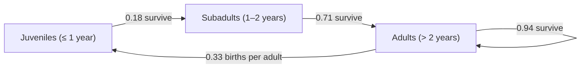
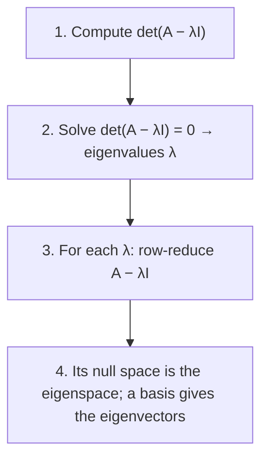

---
tags:
  - CCT3
  - Lin_Algebra
Topic: "Egenværdier og -vektorer samt det karakteristiske polynomium / Eigenvalues and\r

  Eigenvectors"
Semester: CCT3
Course: Linær Algebra
Litterature:
  - Linear Algebra and Its Applications, Global Edition, 6ed
Created: 06-10-2026
---
## Table of Contents

1. [[#5. Eigenvalues and Eigenvectors|5. Eigenvalues and Eigenvectors]]
	1. [[#5. Eigenvalues and Eigenvectors#5.0 Introductory Example|5.0 Introductory Example]]
		1. [[#5.0 Introductory Example#Dynamical Systems and Spotted Owls|Dynamical Systems and Spotted Owls]]
	2. [[#5. Eigenvalues and Eigenvectors#5.1 Eigenvectors and Eigenvalues|5.1 Eigenvectors and Eigenvalues]]
		1. [[#5.1 Eigenvectors and Eigenvalues#Checking Eigenvectors and Eigenvalues|Checking Eigenvectors and Eigenvalues]]
		2. [[#5.1 Eigenvectors and Eigenvalues#Eigenspaces|Eigenspaces]]
		3. [[#5.1 Eigenvectors and Eigenvalues#Eigenvalues of Triangular Matrices|Eigenvalues of Triangular Matrices]]
		4. [[#5.1 Eigenvectors and Eigenvalues#Zero as an Eigenvalue|Zero as an Eigenvalue]]
		5. [[#5.1 Eigenvectors and Eigenvalues#Linear Independence of Eigenvectors|Linear Independence of Eigenvectors]]
		6. [[#5.1 Eigenvectors and Eigenvalues#Eigenvectors and Difference Equations|Eigenvectors and Difference Equations]]
		7. [[#5.1 Eigenvectors and Eigenvalues#Practice Problems|Practice Problems]]
	3. [[#5. Eigenvalues and Eigenvectors#5.2 The Characteristic Equation|5.2 The Characteristic Equation]]
		1. [[#5.2 The Characteristic Equation#From Eigenvalue Definition to the Characteristic Equation|From Eigenvalue Definition to the Characteristic Equation]]
		2. [[#5.2 The Characteristic Equation#Determinant Review|Determinant Review]]
		3. [[#5.2 The Characteristic Equation#Zero Eigenvalue and Invertibility|Zero Eigenvalue and Invertibility]]
		4. [[#5.2 The Characteristic Equation#The Characteristic Equation and Characteristic Polynomial|The Characteristic Equation and Characteristic Polynomial]]
		5. [[#5.2 The Characteristic Equation#Algebraic Multiplicity|Algebraic Multiplicity]]
		6. [[#5.2 The Characteristic Equation#Similarity|Similarity]]
		7. [[#5.2 The Characteristic Equation#Application to Dynamical Systems|Application to Dynamical Systems]]
		8. [[#5.2 The Characteristic Equation#Numerical Notes on Eigenvalue Computation|Numerical Notes on Eigenvalue Computation]]

---

# 5. Eigenvalues and Eigenvectors

| Symbol / Notation | Name | Meaning in this note |
|---|---|---|
| $x_{k+1} = Ax_k$ | Difference equation | Recursive rule for a discrete linear dynamical system; $x_k$ is the state at step $k$ |
| $Ax = \lambda x$ | Eigenvalue equation | The defining relation: $A$ maps the nonzero vector $x$ onto a scalar multiple of itself |
| $\lambda$ | Eigenvalue | The scalar factor by which $A$ stretches an eigenvector; $\lambda = 0$ is allowed |
| $(A - \lambda I)x = 0$ | Eigenvalue test equation | Has a nontrivial solution if and only if $\lambda$ is an eigenvalue of $A$ |
| $I$ | Identity matrix | The $n \times n$ matrix with $1$ on the diagonal and $0$ elsewhere |
| $\operatorname{Nul}(A - \lambda I)$ | Eigenspace | The subspace consisting of all eigenvectors for $\lambda$, plus the zero vector |
| $\det(A - \lambda I) = 0$ | Characteristic equation | Scalar equation whose solutions are exactly the eigenvalues of $A$ |
| $\det(A - \lambda I)$ | Characteristic polynomial | Polynomial of degree $n$ in $\lambda$ obtained by expanding the determinant |
| $A_{ij}$ | Submatrix | Matrix obtained from $A$ by deleting row $i$ and column $j$; used in cofactor expansion |
| $(-1)^{i+j}\det A_{ij}$ | Cofactor | The signed minor attached to position $(i,j)$ |
| $P^{-1}AP$ | Similarity transformation | Produces a matrix similar to $A$; similar matrices share eigenvalues |
| $\lambda = 0$ is an eigenvalue | Singularity test | True if and only if $A$ is not invertible |
| IMT | Invertible Matrix Theorem | The running list of equivalent conditions for a square matrix to be invertible |
| QR algorithm | Iterative eigenvalue method | Named for the factorization into an orthogonal matrix $Q$ and an upper-triangular matrix $R$ |
| $\operatorname{tr} A$ | Trace | Sum of the diagonal entries of $A$; equals the sum of the eigenvalues counted with multiplicity |
| $\lambda$ with largest $\lvert\lambda\rvert$ | Dominant eigenvalue | Controls the long-term behavior of $x_{k+1} = Ax_k$: components with $\lvert\lambda\rvert < 1$ die out, $\lambda = 1$ persists, $\lvert\lambda\rvert > 1$ grows |

_Table 5.1: Quick reference of the concepts, symbols, and abbreviations introduced in this note._

---

## 5.0 Introductory Example

### Dynamical Systems and Spotted Owls

The northern spotted owl population in the Pacific Northwest became a focal point of conflict between environmental conservation and the timber industry.
Mathematical ecologists model the owl population to study the effects of logging, wildfires, and competition with invasive species.
The owl example is worth keeping in mind throughout the chapter, because everything developed in Section 5.1 and Section 5.2 exists to answer one practical question about models like it: given a transition rule that steps the system forward one year at a time, what happens in the long run?

The spotted owl life cycle has three stages: _juvenile_ (up to 1 year), _subadult_ (1–2 years), and _adult_ (older than 2 years).
Owls mate for life during the subadult and adult stages, begin breeding as adults, and can live up to 20 years.
A critical survival bottleneck occurs when juveniles leave the nest and must find a new home range (and usually a mate).

The population is modeled at yearly intervals $k = 0, 1, 2, \ldots$ by counting only females (assuming a 1:1 male-to-female ratio).
Counting only females is a standard simplification: births are limited by the number of breeding females, so the female population already determines the growth rate of the whole population.
The population at year $k$ is described by the vector $x_k = (j_k, s_k, a_k)$, where $j_k$, $s_k$, and $a_k$ are the numbers of females in the juvenile, subadult, and adult stages, respectively.

Using field data, the following stage-matrix model was developed:

$$\begin{bmatrix} j_{k+1} \\ s_{k+1} \\ a_{k+1} \end{bmatrix} = \begin{bmatrix} 0 & 0 & 0.33 \\ 0.18 & 0 & 0 \\ 0 & 0.71 & 0.94 \end{bmatrix} \begin{bmatrix} j_k \\ s_k \\ a_k \end{bmatrix}$$

> [!example] Stage-Matrix Breakdown
> - **Equation:** $x_{k+1} = Ax_k$
> - **Breakdown:**
>     - **$j_k$**: Number of juvenile females at year $k$.
>     - **$s_k$**: Number of subadult females at year $k$.
>     - **$a_k$**: Number of adult females at year $k$.
>     - **$0.33$**: Average birth rate — new juvenile females produced per adult female.
>     - **$0.18$**: Juvenile survival rate — fraction of juveniles that survive to become subadults. This is the entry most affected by old-growth forest availability.
>     - **$0.71$**: Subadult survival rate — fraction of subadults surviving to adulthood.
>     - **$0.94$**: Adult survival rate — fraction of adults surviving to the next year.

A helpful way to read the matrix is column by column: column $j$ of $A$ describes where the individuals currently in stage $j$ end up one year later.
Column 1 says that juveniles either become subadults (with fraction $0.18$) or leave the model; column 2 says subadults become adults with fraction $0.71$; column 3 says adults survive with fraction $0.94$ and each produces $0.33$ new juvenile females.
The "missing" mass in each column represents mortality, so the entries are precisely the demographic data the ecologists measured in the field.
What makes the model mathematically tractable is that it is _linear_: next year's counts are a fixed linear combination of this year's counts, with no interaction terms between the stages.
Real ecosystems are of course nonlinear, but within a reasonable range of population sizes the linear model is an excellent approximation — and it is exactly the class of models that eigenvalues can be brought to bear on.
Like every model, this one is an idealization: the rates are field estimates, density dependence and environmental variation are ignored, and the three stages are coarse buckets for a continuous biology.
The defense of the approach is not that it is literally true but that it is sensitive in the right places — small changes in the matrix produce clear, testable predictions, as the juvenile-survival analysis shows.
Sensitivity of that kind is exactly what eigenvalues quantify.

_Figure 5.1: The three-stage owl life cycle encoded by the stage matrix — juveniles grow into subadults, subadults into adults, and adults survive and produce new juveniles._

This model is a _difference equation_ of the form $x_{k+1} = Ax_k$, often called a _discrete linear dynamical system_ because it describes how a system changes over time.
Right now the model can only be iterated one year at a time: to know year 30 you must first compute years 1 through 29.
Section 5.1 and Section 5.2 develop the tools — eigenvectors and eigenvalues — that convert the recursion into an explicit formula for $x_k$, and the application at the end of Section 5.2 ([[#Application to Dynamical Systems]]) works out a complete model of exactly this type.

The $18\%$ juvenile survival rate is the most sensitive parameter.
While $60\%$ of juveniles normally survive leaving the nest, only $30\%$ of those find new home ranges in fragmented forests — the rest perish during the search.
If $50\%$ of nest-leaving juveniles could find new home ranges, the population model predicts the owls would thrive rather than face eventual decline.
"Most sensitive" will get a precise meaning once eigenvalues are available: a small change in a matrix entry moves the eigenvalues, and the eigenvalues control the long-term growth rate.

The goal of this chapter is to dissect the action of a linear transformation $x \mapsto Ax$ into elements that are easily visualized.
All matrices in this context are square.
The core concepts — eigenvectors and eigenvalues — are useful throughout pure and applied mathematics, appearing in differential equations, continuous dynamical systems, engineering design, physics, and chemistry.
"Dissecting" the transformation means finding the directions on which it acts one-dimensionally — pure scaling — because those special directions organize everything else the transformation does.
Once the scaling directions and their scaling factors are known, the behavior of $A$ on arbitrary vectors can be assembled from them, much as the axes of a rotated ellipse explain its entire shape.
An explicit formula also changes what can be asked of the model.
With a closed form for $x_k$, an ecologist can predict the population decades ahead without simulating year by year, and can compare conservation strategies — which matrix entry to improve — before committing resources in the field.
That practical payoff is what waits at the end of this chapter.

---

## 5.1 Eigenvectors and Eigenvalues

Although a transformation $x \mapsto Ax$ may move vectors in many directions, there are often special vectors on which the action of $A$ is very simple — $A$ merely "stretches" or "dilates" them without changing their direction, similar to a scalar of the vector.

Geometrically, an eigenvector is a vector that stays on its own line through the origin when $A$ is applied: it may be stretched, compressed, or reversed, but it is never knocked sideways.
The eigenvalue records _how much_ scaling happens along that line.
A factor of $2$ doubles the length, a factor of $1/2$ halves it, a factor of $1$ leaves the vector completely fixed, and a negative factor reverses direction as well as scaling.
Most vectors are _not_ eigenvectors — applying $A$ to them produces a vector pointing in a genuinely new direction.

A good mental picture is to think of eigenvectors as the hidden skeleton of the transformation: the few directions that the map respects, around which all other motion is organized.
Later in the course this skeleton becomes the main computational tool, when matrices are rewritten in coordinates aligned with their eigenvectors (diagonalization).
Two questions organize everything that follows.
The first is easy: given a candidate vector and a candidate scalar, does $Ax = \lambda x$ actually hold?
The second is hard: given only $A$, discover all the scalars $\lambda$ for which such special directions exist.
Section 5.1 settles the first question and the easy half of the second (eigenvectors once $\lambda$ is known); Section 5.2 cracks the hard half.

> [!example] Simple Stretching
> Let $A = \begin{bmatrix} 3 & -2 \\ 1 & 0 \end{bmatrix}$, $u = \begin{bmatrix} 1 \\ 1 \end{bmatrix}$, and $v = \begin{bmatrix} 2 \\ 1 \end{bmatrix}$.
>
> **Computing $Au$:**
> $$Au = \begin{bmatrix} 3 & -2 \\ 1 & 0 \end{bmatrix}\begin{bmatrix} 1 \\ 1 \end{bmatrix} = \begin{bmatrix} 3 - 2 \\ 1 + 0 \end{bmatrix} = \begin{bmatrix} 1 \\ 1 \end{bmatrix} = 1 \cdot u \checkmark$$
> So $A$ leaves $u$ completely fixed: $u$ is an eigenvector with eigenvalue $\lambda = 1$.
>
> **Computing $Av$:**
> $$Av = \begin{bmatrix} 3 & -2 \\ 1 & 0 \end{bmatrix}\begin{bmatrix} 2 \\ 1 \end{bmatrix} = \begin{bmatrix} 6 - 2 \\ 2 + 0 \end{bmatrix} = \begin{bmatrix} 4 \\ 2 \end{bmatrix} = 2\begin{bmatrix} 2 \\ 1 \end{bmatrix} = 2v \checkmark$$
> So $A$ merely stretches $v$ by a factor of $2$ without changing its direction: $v$ is an eigenvector with eigenvalue $\lambda = 2$.

> [!warning]- Correction: 
> the source note-set gave $A = \begin{bmatrix} 3 & 2 \\ 1 & 0 \end{bmatrix}$ in this example while claiming $Av = 2v$. That matrix gives $Av = \begin{bmatrix} 8 \\ 2 \end{bmatrix}$, which is not a scalar multiple of $v = \begin{bmatrix} 2 \\ 1 \end{bmatrix}$ (and $Au = \begin{bmatrix} 5 \\ 1 \end{bmatrix}$, not a multiple of $u$ either), so neither vector would be an eigenvector — contradicting both the claim and Figure 5.2. The entry that makes everything consistent is $-2$: with $A = \begin{bmatrix} 3 & -2 \\ 1 & 0 \end{bmatrix}$ the eigenvalues are $1$ and $2$, and $Au = u$, $Av = 2v$ as computed above (both verified by direct multiplication ✓).

![[Pasted image 20261006210938.png]]

_Figure 5.2: Effects of multiplication by $A$ — the vector $u$ is fixed by $A$ while $v$ is stretched by a factor of 2, each staying on its own line through the origin._

This leads to studying equations of the form:

$$Ax = \lambda x$$

where special vectors are transformed by $A$ into scalar multiples of themselves.

> [!info] Definition: Eigenvector and Eigenvalue
> An **eigenvector** of an $n \times n$ matrix $A$ is a _nonzero_ vector $x$ such that $Ax = \lambda x$ for some scalar $\lambda$.
>
> A scalar $\lambda$ is called an **eigenvalue** of $A$ if there is a _nontrivial_ solution $x$ of $Ax = \lambda x$; such an $x$ is called an eigenvector corresponding to $\lambda$.
>
> - **Breakdown:**
>     - **$A$**: An $n \times n$ square matrix representing the linear transformation.
>     - **$x$**: A nonzero vector — the eigenvector. Its direction is preserved by $A$.
>     - **$\lambda$** (lambda): A scalar — the eigenvalue. It represents the factor by which $A$ stretches or compresses $x$.

The word "eigen" is German for "own" or "characteristic": an eigenvector is a vector that keeps its _own_ direction under the transformation.
Note the deliberate asymmetry in the definition.
An eigenvector _must_ be nonzero, because $A0 = \lambda 0$ holds trivially for every $\lambda$ and would make the concept meaningless.
An eigenvalue, however, _may_ be zero: $\lambda = 0$ simply means $A$ collapses some nonzero vector down to the zero vector, which can happen exactly when $A$ is not invertible (see [[#Zero as an Eigenvalue]]).
One more convention to internalize immediately: eigenvectors are never unique.
If $x$ is an eigenvector for $\lambda$, then so is $cx$ for every scalar $c \neq 0$, with the same eigenvalue — the eigenvalue belongs to the _direction_, not to any particular vector on it.
That is why the natural object to study is not a single eigenvector but the whole eigenspace, introduced next.

### Checking Eigenvectors and Eigenvalues

It is straightforward to verify whether a given vector is an eigenvector or whether a given scalar is an eigenvalue: multiply and compare.
The procedure is always the same — compute $Ax$ and ask whether the result is a scalar multiple of $x$.
In practice this means checking component ratios: $Ax$ is a multiple of $x$ exactly when the ratio $(Ax)_i / x_i$ is the same number for every nonzero component (and the zero components of $Ax$ line up with those of $x$).
For a claimed eigenvalue $\lambda$, the equivalent test is to row-reduce $A - \lambda I$: a column without a pivot (a free variable) certifies $\lambda$ as an eigenvalue.
The hard direction, _finding_ eigenvectors and eigenvalues when nobody hands them to you, is the subject of Section 5.2.

> [!example] Checking if Vectors are Eigenvectors
> Let $A = \begin{bmatrix} 1 & 6 \\ 5 & 2 \end{bmatrix}$, $u = \begin{bmatrix} 6 \\ -5 \end{bmatrix}$, and $v = \begin{bmatrix} 3 \\ 2 \end{bmatrix}$.
>
> **Testing $u$:**
> $$Au = \begin{bmatrix} 1 & 6 \\ 5 & 2 \end{bmatrix}\begin{bmatrix} 6 \\ -5 \end{bmatrix} = \begin{bmatrix} 6 - 30 \\ 30 - 10 \end{bmatrix} = \begin{bmatrix} -24 \\ 20 \end{bmatrix} = -4\begin{bmatrix} 6 \\ -5 \end{bmatrix} = -4u \checkmark$$
> Since $Au = -4u$, $u$ **is** an eigenvector corresponding to eigenvalue $\lambda = -4$. Notice the negative eigenvalue: $A$ reverses the direction of $u$ while stretching it by a factor of 4.
>
> **Testing $v$:**
> $$Av = \begin{bmatrix} 1 & 6 \\ 5 & 2 \end{bmatrix}\begin{bmatrix} 3 \\ 2 \end{bmatrix} = \begin{bmatrix} 15 \\ 19 \end{bmatrix} \neq \lambda\begin{bmatrix} 3 \\ 2 \end{bmatrix} \text{ for any } \lambda$$
> (Two vectors are scalar multiples only if their component ratios agree; here $15/3 = 5$ but $19/2 = 9.5$.) Since $Av$ is not a scalar multiple of $v$, $v$ **is not** an eigenvector of $A$.
>
> ![[Pasted image 20261006211003.png]]
>
> _Figure 5.3: $Au = -4u$, so $u$ is an eigenvector, but $Av \neq \lambda v$ for every scalar $\lambda$, so $v$ is not._

> [!example] Finding Eigenvectors for a Known Eigenvalue
> Show that $\lambda = 7$ is an eigenvalue of $A = \begin{bmatrix} 1 & 6 \\ 5 & 2 \end{bmatrix}$ and find the corresponding eigenvectors.
>
> **Step 1:** $\lambda = 7$ is an eigenvalue if and only if $Ax = 7x$ has a nontrivial solution. Rewrite as:
> $$(A - 7I)x = 0$$
>
> **Step 2:** Compute $A - 7I$:
> $$A - 7I = \begin{bmatrix} 1 & 6 \\ 5 & 2 \end{bmatrix} - \begin{bmatrix} 7 & 0 \\ 0 & 7 \end{bmatrix} = \begin{bmatrix} -6 & 6 \\ 5 & -5 \end{bmatrix}$$
>
> **Step 3:** The columns are linearly dependent (second column is $-1$ times the first), so nontrivial solutions exist. Thus $\lambda = 7$ is confirmed as an eigenvalue.
>
> **Step 4:** Row reduce to find eigenvectors:
> $$\begin{bmatrix} -6 & 6 & 0 \\ 5 & -5 & 0 \end{bmatrix} \sim \begin{bmatrix} 1 & -1 & 0 \\ 0 & 0 & 0 \end{bmatrix}$$
>
> The general solution is $x = x_2 \begin{bmatrix} 1 \\ 1 \end{bmatrix}$. Each vector of this form with $x_2 \neq 0$ is an eigenvector corresponding to $\lambda = 7$.
>
> **Check:** $A\begin{bmatrix} 1 \\ 1 \end{bmatrix} = \begin{bmatrix} 7 \\ 7 \end{bmatrix} = 7\begin{bmatrix} 1 \\ 1 \end{bmatrix}$ ✓

The previous example shows the standard template: move everything to one side as $(A - \lambda I)x = 0$, then ask whether that homogeneous system has a nontrivial solution.
The same template works for every matrix and every eigenvalue, which is why it gets a name of its own in the next subsection.

> [!warning] Row Reduction Limitation
> Although row reduction is used to find _eigenvectors_ (once an eigenvalue is known), it **cannot** be used to find _eigenvalues_. An echelon form of a matrix $A$ usually does not display the eigenvalues of $A$.

The reason is that row operations change the eigenvalues (they preserve the solution set of $Ax = 0$, but not the transformation itself), a point taken up again in [[#Similarity]] in Section 5.2.

### Eigenspaces

The equivalence $Ax = \lambda x \iff (A - \lambda I)x = 0$ holds for any $\lambda$.
Therefore:

> [!info] Definition: Eigenspace
> A scalar $\lambda$ is an eigenvalue of an $n \times n$ matrix $A$ if and only if the equation
> $$(A - \lambda I)x = 0$$
> has a nontrivial solution.
>
> The set of all solutions is the null space of $A - \lambda I$, which is a subspace of $\mathbb{R}^n$ called the **eigenspace** of $A$ corresponding to $\lambda$. The eigenspace consists of the zero vector and all eigenvectors corresponding to $\lambda$.
>
> - **Breakdown:**
>     - **$A - \lambda I$**: The matrix formed by subtracting $\lambda$ from each diagonal entry of $A$.
>     - **$I$**: The $n \times n$ identity matrix.
>     - **Null space of $(A - \lambda I)$**: All vectors $x$ satisfying $(A - \lambda I)x = 0$. This _is_ the eigenspace.

Because an eigenspace is a null space, it is automatically a subspace of $\mathbb{R}^n$.
In practical terms: sums and scalar multiples of eigenvectors for the _same_ $\lambda$ are again eigenvectors for that $\lambda$ (or the zero vector), so eigenvectors never come alone — they come as an entire flat through the origin.
Geometrically, an eigenspace is the whole line, plane, or higher-dimensional flat on which $A$ acts as a simple dilation, and every nonzero point of that flat is an eigenvector.
The mechanical recipe for finding an eigenspace, once $\lambda$ is known, is always the same three moves.
Row-reduce $A - \lambda I$, read off the free variables, and write one basis vector per free variable — exactly as in the $3 \times 3$ example below.
The number of free variables you obtain is the dimension of the eigenspace.
Notice how much of this is recycled machinery: computing an eigenspace is nothing but finding a basis for a null space, a skill from earlier in the course.
What the eigenvalue language adds is the interpretation — those null-space vectors are precisely the directions on which $A$ becomes one-dimensional.
So the linear-algebra habits already built (row-reduce, identify free variables, write a parametric solution) transfer to this chapter without change; the new vocabulary — eigenvalue, eigenspace, multiplicity — is the layer of meaning placed on top of that familiar mechanics.

For the matrix $A = \begin{bmatrix} 1 & 6 \\ 5 & 2 \end{bmatrix}$ from the examples above:

- The eigenspace for $\lambda = 7$ is the line through $(1, 1)$ and the origin (all multiples of $(1, 1)$).
- The eigenspace for $\lambda = -4$ is the line through $(6, -5)$ and the origin.

Geometrically, $A$ acts as a simple dilation (stretching/compressing) on each eigenspace.
For the matrix at hand this means: on the line spanned by $(1,1)$ the map multiplies every vector by $7$, and on the line spanned by $(6,-5)$ it multiplies by $-4$ (reversing direction).
Every other vector is a mixture of the two directions and is therefore knocked onto a new line — only points on the two eigenspaces stay on their own line.

![[Pasted image 20261006211057.png]]

_Figure 5.4: The eigenspaces of $A = \begin{bmatrix} 1 & 6 \\ 5 & 2 \end{bmatrix}$ for $\lambda = -4$ and $\lambda = 7$ — two lines through the origin, each stretched by $A$ without being rotated._

> [!example] Finding a Basis for an Eigenspace ($3 \times 3$ Case)
> Let $A = \begin{bmatrix} 4 & -1 & 6 \\ 2 & 1 & 6 \\ 2 & -1 & 8 \end{bmatrix}$. Given that $\lambda = 2$ is an eigenvalue, find a basis for the corresponding eigenspace.
>
> **Step 1:** Form $A - 2I$:
> $$A - 2I = \begin{bmatrix} 4 & -1 & 6 \\ 2 & 1 & 6 \\ 2 & -1 & 8 \end{bmatrix} - \begin{bmatrix} 2 & 0 & 0 \\ 0 & 2 & 0 \\ 0 & 0 & 2 \end{bmatrix} = \begin{bmatrix} 2 & -1 & 6 \\ 2 & -1 & 6 \\ 2 & -1 & 6 \end{bmatrix}$$
>
> **Step 2:** Row reduce the augmented matrix for $(A - 2I)x = 0$:
> $$\begin{bmatrix} 2 & -1 & 6 & 0 \\ 2 & -1 & 6 & 0 \\ 2 & -1 & 6 & 0 \end{bmatrix} \sim \begin{bmatrix} 2 & -1 & 6 & 0 \\ 0 & 0 & 0 & 0 \\ 0 & 0 & 0 & 0 \end{bmatrix}$$
>
> The presence of free variables confirms $\lambda = 2$ is an eigenvalue.
>
> **Step 3:** The general solution is:
> $$\begin{bmatrix} x_1 \\ x_2 \\ x_3 \end{bmatrix} = x_2 \begin{bmatrix} 1/2 \\ 1 \\ 0 \end{bmatrix} + x_3 \begin{bmatrix} -3 \\ 0 \\ 1 \end{bmatrix}, \quad x_2, x_3 \text{ free}$$
>
> The eigenspace is a _two-dimensional_ subspace of $\mathbb{R}^3$ (a plane through the origin). Scaling the first basis vector by 2 to clear the fraction, a basis is:
> $$\left\{ \begin{bmatrix} 1 \\ 2 \\ 0 \end{bmatrix}, \begin{bmatrix} -3 \\ 0 \\ 1 \end{bmatrix} \right\}$$
>
> **Check:** $A\begin{bmatrix} 1 \\ 2 \\ 0 \end{bmatrix} = \begin{bmatrix} 2 \\ 4 \\ 0 \end{bmatrix} = 2\begin{bmatrix} 1 \\ 2 \\ 0 \end{bmatrix}$ and $A\begin{bmatrix} -3 \\ 0 \\ 1 \end{bmatrix} = \begin{bmatrix} -6 \\ 0 \\ 2 \end{bmatrix} = 2\begin{bmatrix} -3 \\ 0 \\ 1 \end{bmatrix}$ ✓
>
> ![[Pasted image 20261006211112.png]]
>
> _Figure 5.5: $A$ acts as a dilation on the eigenspace for $\lambda = 2$ — every vector in the plane is doubled, and the plane itself is unchanged._

> [!tip] Checking Your Work
> Whenever you find candidate eigenvectors, verify them by direct multiplication before moving on: compute $Av$ and check that the result is a scalar multiple of $v$.
> The check is cheap, and it catches sign errors and arithmetic slips immediately.

> [!warning] Correction: the source's verification tip claimed that for $A = \begin{bmatrix} 1 & 2 \\ 1 & 2 \end{bmatrix}$ the vector $u = \begin{bmatrix} -1 \\ 1 \end{bmatrix}$ satisfies $Au = \begin{bmatrix} 1 \\ -1 \end{bmatrix} = -1 \cdot u$. Direct multiplication gives $Au = \begin{bmatrix} -1+2 \\ -1+2 \end{bmatrix} = \begin{bmatrix} 1 \\ 1 \end{bmatrix}$, which is not a multiple of $u$ — so $u$ is not an eigenvector and $-1$ is not an eigenvalue (the eigenvalues of this $A$ are $0$ and $3$). A correct positive check with the same matrix: $w = \begin{bmatrix} 1 \\ 1 \end{bmatrix}$ gives $Aw = \begin{bmatrix} 3 \\ 3 \end{bmatrix} = 3w$ ✓

One last remark on how eigenspaces are computed in practice, by hand versus by machine:

> [!note] Numerical Computation
> For manual computation with simple cases and a known eigenvalue, row reduction of $(A - \lambda I)x = 0$ works well and is the method used throughout this note.
> Computer programs, by contrast, compute approximations for eigenvalues and eigenvectors _simultaneously_ for greater reliability, since roundoff error in row reduction can occasionally produce an incorrect number of pivots.

Experience also shows three slips that cause most wrong answers in this section, so watch for them explicitly.
First, subtracting $\lambda$ from _every_ entry of $A$ instead of only the diagonal ones — it is $A - \lambda I$, not $A - \lambda$ everywhere.
Second, sign errors in cofactor expansion, especially when the entry $a_{ij}$ is itself negative; write the $(-1)^{i+j}$ sign, the entry, and the minor as three separate factors before multiplying.
Third, reporting $x = 0$ as an eigenvector — the zero vector is in every eigenspace, but it is never an eigenvector; if your row reduction returns only the trivial solution, then that $\lambda$ was not an eigenvalue at all.

### Eigenvalues of Triangular Matrices

Triangular matrices are the one case where eigenvalues can simply be read off the matrix.
That makes them the standard sanity check for hand computations — and, less obviously, the target of most numerical eigenvalue algorithms, which gradually bend a general matrix into triangular form without changing its eigenvalues (see [[#Numerical Notes on Eigenvalue Computation]]).

> [!summary] Theorem 1: Eigenvalues of a Triangular Matrix
> The eigenvalues of a triangular matrix are the entries on its main diagonal.
>
> **Breakdown:**
> - **Triangular matrix**: A square matrix where all entries above (upper triangular) or below (lower triangular) the main diagonal are zero.
> - **Main diagonal**: The entries $a_{11}, a_{22}, \ldots, a_{nn}$.
>
> **Proof:**
> Consider the $3 \times 3$ upper triangular case; the general $n \times n$ case is identical in structure. If $A$ is upper triangular, then:
> $$A - \lambda I = \begin{bmatrix} a_{11} - \lambda & a_{12} & a_{13} \\ 0 & a_{22} - \lambda & a_{23} \\ 0 & 0 & a_{33} - \lambda \end{bmatrix}$$
> The scalar $\lambda$ is an eigenvalue if and only if $(A - \lambda I)x = 0$ has a nontrivial solution (i.e., a free variable). Because $A - \lambda I$ is triangular, this happens if and only if at least one diagonal entry of $A - \lambda I$ is zero — that is, $\lambda$ equals one of $a_{11}, a_{22}, a_{33}$. The argument for lower triangular matrices is analogous.

The proof is worth remembering because it is the first appearance of the central logic of the whole chapter: eigenvalue questions are really questions about when a certain homogeneous system has free variables.

> [!example] Reading Eigenvalues from Triangular Matrices
> - $A = \begin{bmatrix} 3 & 6 & -8 \\ 0 & 0 & 6 \\ 0 & 0 & 2 \end{bmatrix}$ (upper triangular) → eigenvalues: $3, 0, 2$ — simply the diagonal entries. Note that $0$ appears: by the result of [[#Zero as an Eigenvalue]], the matrix is not invertible.
> - $B = \begin{bmatrix} 4 & 0 & 0 \\ -2 & 1 & 0 \\ 5 & 3 & -4 \end{bmatrix}$ (lower triangular) → eigenvalues: $4, 1, -4$ — again the diagonal, regardless of how large the entries below it are.

The extreme case is a diagonal matrix, where the standard basis vectors $e_1, \ldots, e_n$ are themselves eigenvectors and the diagonal entries are the eigenvalues.
Diagonal matrices are therefore the simplest possible objects from the eigenvalue point of view — and the whole later project of diagonalization is the attempt to rewrite a general matrix so that it _looks_ diagonal when viewed in eigenvector coordinates.

### Zero as an Eigenvalue

A matrix $A$ has eigenvalue $\lambda = 0$ if and only if $Ax = 0x = 0$ has a nontrivial solution.
This is equivalent to $Ax = 0$ having a nontrivial solution, which occurs if and only if $A$ is **not invertible**.
Zero is therefore the only eigenvalue that carries direct information about invertibility: every other eigenvalue can occur for both invertible and non-invertible matrices, but $\lambda = 0$ happens exactly when the matrix is singular.
Geometrically, $\lambda = 0$ means the transformation crushes an entire direction down to the origin — the image of $A$ has fewer dimensions than $\mathbb{R}^n$, and information along that direction is unrecoverable, which is precisely what non-invertibility means.

> [!important] Zero Eigenvalue and Invertibility
> $\lambda = 0$ is an eigenvalue of $A$ **if and only if** $A$ is not invertible.

This equivalence will reappear in Section 5.2 as a new entry of the Invertible Matrix Theorem (IMT), once determinants give a second way to detect it.

### Linear Independence of Eigenvectors

The next theorem says that eigenvectors belonging to _different_ eigenvalues can never depend on each other.
Intuitively, each eigenspace points in a genuinely different direction from the others, so taking one vector from each of several eigenspaces can never create a dependence.
This fact will be essential when eigenvectors are assembled into bases — for instance, when diagonalizing matrices later in the chapter.

> [!summary] Theorem 2: Linear Independence of Eigenvectors
> If $v_1, \ldots, v_r$ are eigenvectors corresponding to _distinct_ eigenvalues $\lambda_1, \ldots, \lambda_r$ of an $n \times n$ matrix $A$, then the set $\{v_1, \ldots, v_r\}$ is linearly independent.
>
> **Breakdown:**
> - **$v_1, \ldots, v_r$**: Eigenvectors, each associated with a different eigenvalue.
> - **$\lambda_1, \ldots, \lambda_r$**: Distinct eigenvalues (no two are equal).
> - **Key implication**: Eigenvectors from different eigenspaces are automatically linearly independent — you never need to check.
>
> **Proof:**
> Suppose for contradiction that $\{v_1, \ldots, v_r\}$ is linearly dependent. Since $v_1 \neq 0$, one of the vectors is a linear combination of the preceding ones. Let $p$ be the least index such that $v_{p+1}$ is a linear combination of the preceding (linearly independent) vectors:
> $$c_1 v_1 + \cdots + c_p v_p = v_{p+1} \quad \text{(5)}$$
>
> Multiply both sides by $A$ and use $Av_k = \lambda_k v_k$:
> $$c_1 \lambda_1 v_1 + \cdots + c_p \lambda_p v_p = \lambda_{p+1} v_{p+1} \quad \text{(6)}$$
>
> Multiply equation (5) by $\lambda_{p+1}$ and subtract from (6):
> $$c_1(\lambda_1 - \lambda_{p+1})v_1 + \cdots + c_p(\lambda_p - \lambda_{p+1})v_p = 0 \quad \text{(7)}$$
>
> Since $\{v_1, \ldots, v_p\}$ is linearly independent, all weights in (7) must be zero. But none of the factors $(\lambda_i - \lambda_{p+1})$ are zero because the eigenvalues are distinct. Therefore $c_i = 0$ for all $i = 1, \ldots, p$. Substituting back into (5) gives $v_{p+1} = 0$, which contradicts the definition of an eigenvector (must be nonzero). Hence the set must be linearly independent.

The trick worth remembering from the proof is the "apply $A$, then subtract $\lambda_{p+1}$ times the original relation" move.
It eliminates $v_{p+1}$ and leaves only the earlier eigenvectors, whose coefficients must then vanish one by one because their eigenvalues are all different from $\lambda_{p+1}$.
In everyday use the theorem is a free shortcut: to certify that a list of eigenvectors is linearly independent, it is enough to check that their eigenvalues are distinct — no row reduction, no determinants, no computation at all.
Practice Problem 3 below shows the one subtlety: when several eigenvectors share an eigenvalue, their independence must come from somewhere else (such as the hypothesis of the problem), and the theorem is then applied to the eigenspaces as groups.

> [!example] An Instant Independence Check
> For $A = \begin{bmatrix} 1 & 6 \\ 5 & 2 \end{bmatrix}$ the examples of [[#Checking Eigenvectors and Eigenvalues]] produced the eigenvector $\begin{bmatrix} 1 \\ 1 \end{bmatrix}$ for $\lambda = 7$ and the eigenvector $\begin{bmatrix} 6 \\ -5 \end{bmatrix}$ for $\lambda = -4$.
> Because $7 \neq -4$, Theorem 2 immediately guarantees that $\left\{ \begin{bmatrix} 1 \\ 1 \end{bmatrix}, \begin{bmatrix} 6 \\ -5 \end{bmatrix} \right\}$ is linearly independent — no row reduction, no determinants, no computation of any kind.
> **Check:** neither vector is a scalar multiple of the other, as the differing component ratios $1/6 \neq 1/(-5)$ confirm ✓

### Eigenvectors and Difference Equations

The first-order difference equation from the introductory example takes the form:

$$x_{k+1} = Ax_k \quad (k = 0, 1, 2, \ldots)$$

This is a recursive description of a sequence $\{x_k\}$ in $\mathbb{R}^n$.
A _solution_ is an explicit formula for $x_k$ that does not depend directly on $A$ or on preceding terms other than the initial term $x_0$.

The simplest solution is constructed by taking an eigenvector $x_0$ with corresponding eigenvalue $\lambda$.
Each application of $A$ then just multiplies by another factor of $\lambda$, so after $k$ steps the state is simply $\lambda^k x_0$.
Even at this early stage the factor $\lambda^k$ tells the whole long-term story of such a solution: $\lambda > 1$ grows without bound, $\lambda = 1$ stays constant, $|\lambda| < 1$ decays to zero, $\lambda = -1$ oscillates forever between two states, and $\lambda < -1$ oscillates while growing.

$$x_k = \lambda^k x_0 \quad (k = 1, 2, \ldots)$$

> [!example] Verifying the Difference Equation Solution
> - **Equation:** $x_k = \lambda^k x_0$
> - **Breakdown:**
>     - **$x_k$**: The state vector at time step $k$.
>     - **$\lambda$**: The eigenvalue of $A$ associated with $x_0$.
>     - **$x_0$**: The initial vector, which must be an eigenvector of $A$.
>     - **$k$**: The discrete time step index.
>
> **Verification:**
> $$Ax_k = A(\lambda^k x_0) = \lambda^k (Ax_0) = \lambda^k (\lambda x_0) = \lambda^{k+1} x_0 = x_{k+1} \quad \checkmark$$

Linear combinations of solutions of this form are also solutions, because the system is linear: if two sequences satisfy $x_{k+1} = Ax_k$, then any linear combination of them does too.
This is the seed of the general method — write $x_0$ as a combination of eigenvectors, then let each component evolve by its own factor $\lambda^k$.
If the eigenvectors of $A$ form a basis of $\mathbb{R}^n$ — which they do whenever there are $n$ linearly independent ones — then _every_ initial state $x_0$ can be decomposed this way, and the formula captures every possible solution.
[[#Application to Dynamical Systems]] in Section 5.2 carries the recipe out in full.
A preview of where this leads: continuous dynamical systems $\frac{dx}{dt} = Ax$, studied in differential equations, run on the same logic, with the role of $\lambda^k$ taken by $e^{\lambda t}$.
Eigenvectors are still the directions that decouple, and eigenvalues still decide growth versus decay.
The discrete setting here is the cleanest place to learn the pattern before meeting its continuous twin.

### Practice Problems

Work through these before reading the solutions; they review verification, repeated application of $A$, independence, and scaling.
They also mirror the three standard exam skills of this section — testing a claimed eigenvalue, computing $A^m x$ on an eigenvector, and reasoning about independence — so they double as a self-check on the material so far.

1. Is $5$ an eigenvalue of $A = \begin{bmatrix} 6 & -3 & 1 \\ 3 & 0 & 5 \\ -2 & 2 & 6 \end{bmatrix}$?
2. If $x$ is an eigenvector of $A$ corresponding to $\lambda$, what is $A^3 x$?
3. Suppose $b_1$ and $b_2$ are eigenvectors corresponding to distinct eigenvalues $\lambda_1$ and $\lambda_2$, and $b_3$ and $b_4$ are linearly independent eigenvectors corresponding to a third distinct eigenvalue $\lambda_3$. Does it necessarily follow that $\{b_1, b_2, b_3, b_4\}$ is linearly independent?
4. If $A$ is an $n \times n$ matrix and $\lambda$ is an eigenvalue of $A$, show that $2\lambda$ is an eigenvalue of $2A$.

> [!example] Solutions to the Practice Problems
> **1.** Test the equation $(A - 5I)x = 0$: $5$ is an eigenvalue iff $A - 5I$ is singular.
> $$A - 5I = \begin{bmatrix} 1 & -3 & 1 \\ 3 & -5 & 5 \\ -2 & 2 & 1 \end{bmatrix}$$
> Expanding along the first row: $\det(A - 5I) = 1(-5 - 10) + 3(3 + 10) + 1(6 - 10) = -15 + 39 - 4 = 20 \neq 0$.
> Since $A - 5I$ is invertible, the equation has only the trivial solution, and **$5$ is not an eigenvalue** of $A$ ✓
>
> **2.** Apply $A$ repeatedly and use $Ax = \lambda x$ at each step: $A^2 x = A(\lambda x) = \lambda Ax = \lambda^2 x$, hence $A^3 x = \lambda^3 x$. In general $A^m x = \lambda^m x$ ✓
>
> **3.** Yes. Consider a dependence relation $c_1 b_1 + c_2 b_2 + c_3 b_3 + c_4 b_4 = 0$ and group it as $(c_1 b_1) + (c_2 b_2) + (c_3 b_3 + c_4 b_4) = 0$. Each group is either zero or an eigenvector of $A$ — for $\lambda_1$, $\lambda_2$, and $\lambda_3$ respectively, since any linear combination of $\lambda_3$-eigenvectors stays in the $\lambda_3$-eigenspace. By Theorem 2 ([[#Linear Independence of Eigenvectors]]), nonzero eigenvectors belonging to the distinct eigenvalues $\lambda_1, \lambda_2, \lambda_3$ are linearly independent, so each group must vanish on its own: $c_1 b_1 = 0 \Rightarrow c_1 = 0$, likewise $c_2 = 0$, and $c_3 b_3 + c_4 b_4 = 0 \Rightarrow c_3 = c_4 = 0$ because $b_3, b_4$ are linearly independent by hypothesis. Hence the whole set is linearly independent ✓
>
> **4.** If $Ax = \lambda x$ with $x \neq 0$, then $(2A)x = 2(Ax) = 2\lambda x$ with the same nonzero $x$. So $2\lambda$ is an eigenvalue of $2A$ (with the same eigenvector) ✓

With these problems the toolkit of Section 5.1 is complete: verify claimed eigenvectors by multiplication, find eigenspaces by row-reducing $A - \lambda I$, and certify independence from distinct eigenvalues without any computation.
What is still missing is a way to _discover_ the eigenvalues in the first place — and that is exactly the gap the characteristic equation closes.

---

## 5.2 The Characteristic Equation

Useful information about the eigenvalues of a square matrix $A$ is encoded in a special scalar equation called the **characteristic equation** of $A$.
The word "characteristic" points to the ambition: this one equation captures the eigenvalue fingerprint of the whole matrix.
The core idea is to convert the matrix equation $(A - \lambda I)x = 0$, which involves two unknowns ($\lambda$ and $x$), into a single scalar equation involving only $\lambda$.
This is the decisive step of the chapter: once the eigenvalues can be found from one polynomial equation, the eigenvectors follow by the routine row reduction of Section 5.1.
The strategic idea is to stop asking about $x$ for a moment and ask only about $\lambda$: for which $\lambda$ could the equation $(A - \lambda I)x = 0$ possibly have a nonzero solution?
That existence question is one the determinant is built to answer.

### From Eigenvalue Definition to the Characteristic Equation

Recall that $\lambda$ is an eigenvalue of $A$ if and only if $(A - \lambda I)x = 0$ has a nontrivial solution.
By the IMT, this is equivalent to $A - \lambda I$ being _not invertible_, which happens precisely when its determinant is zero.
If you would like one image for why the determinant detects this: $\det M$ measures the factor by which $M$ scales volumes, so $\det M = 0$ means $M$ crushes all of space into a lower-dimensional set — some nonzero direction is sent to zero, which is exactly the situation "$(M)x = 0$ has a nontrivial solution" describes.
Applied with $M = A - \lambda I$, the crushed direction is precisely an eigenvector for $\lambda$.
The chain of equivalences below is worth memorizing, because it is the bridge between the vector world of Section 5.1 and the polynomial world of this section:

$$\lambda \text{ is an eigenvalue} \iff (A - \lambda I)x = 0 \text{ has a nontrivial solution} \iff A - \lambda I \text{ is singular} \iff \det(A - \lambda I) = 0$$

> [!example] Finding Eigenvalues via the Characteristic Equation ($2 \times 2$)
> Find the eigenvalues of $A = \begin{bmatrix} 2 & 3 \\ 3 & -6 \end{bmatrix}$.
>
> **Step 1:** Form $A - \lambda I$:
> $$A - \lambda I = \begin{bmatrix} 2 & 3 \\ 3 & -6 \end{bmatrix} - \begin{bmatrix} \lambda & 0 \\ 0 & \lambda \end{bmatrix} = \begin{bmatrix} 2 - \lambda & 3 \\ 3 & -6 - \lambda \end{bmatrix}$$
>
> **Step 2:** Set the determinant equal to zero. For a $2 \times 2$ matrix, $\det \begin{bmatrix} a & b \\ c & d \end{bmatrix} = ad - bc$:
> $$\det(A - \lambda I) = (2 - \lambda)(-6 - \lambda) - (3)(3) = 0$$
>
> **Step 3:** Expand and simplify:
> $$(-12 - 2\lambda + 6\lambda + \lambda^2) - 9 = \lambda^2 + 4\lambda - 21 = (\lambda - 3)(\lambda + 7) = 0$$
>
> **Step 4:** Solve: $\lambda = 3$ or $\lambda = -7$. These are the eigenvalues of $A$.
>
> **Check:** $\det(A - 3I) = \det\begin{bmatrix} -1 & 3 \\ 3 & -9 \end{bmatrix} = 9 - 9 = 0$ and $\det(A + 7I) = \det\begin{bmatrix} 9 & 3 \\ 3 & 1 \end{bmatrix} = 9 - 9 = 0$ ✓

> [!warning] Correction: the source note-set used $A = \begin{bmatrix} 2 & 3 \\ 3 & 6 \end{bmatrix}$ in this example but then expanded to $\lambda^2 + 4\lambda - 21 = (\lambda - 3)(\lambda + 7)$, which does not follow from that matrix. With $(2,2)$-entry $6$ the characteristic polynomial is $(2-\lambda)(6-\lambda) - 9 = \lambda^2 - 8\lambda + 3$, whose roots $4 \pm \sqrt{13}$ are irrational — the factorization the source wrote is impossible. The computation is consistent only with the entry $-6$: $(2 - \lambda)(-6 - \lambda) - 9 = \lambda^2 + 4\lambda - 21 = (\lambda - 3)(\lambda + 7)$. The example above therefore uses $A = \begin{bmatrix} 2 & 3 \\ 3 & -6 \end{bmatrix}$, and both roots are verified by substitution ✓

The complete eigenvalue workflow is always the same four steps, and it is worth internalizing as a single routine:

For $2 \times 2$ matrices there is a useful shortcut that also doubles as an error check: the characteristic polynomial is $\lambda^2 - (\text{trace of } A)\,\lambda + \det A$.
In the example above, the trace is $2 + (-6) = -4$ and the determinant is $2(-6) - 9 = -21$, giving $\lambda^2 + 4\lambda - 21$ — matching the direct expansion ✓.
Equivalently, the two eigenvalues must sum to the trace ($3 + (-7) = -4$ ✓) and multiply to the determinant ($3 \cdot (-7) = -21$ ✓).
Whenever a hand computation fails these two checks, a sign error has crept in somewhere.

_Figure 5.6: The standard four-step pipeline from a square matrix to its eigenvalues and eigenvectors — the first half lives in this section, the second half in Section 5.1._

---

### Determinant Review

Determinants enter this chapter for one reason only: they convert the existence question "does $(A - \lambda I)x = 0$ have a nonzero solution?" into an arithmetic test, $\det(A - \lambda I) = 0$.
Everything in this subsection is machinery for evaluating that test on matrices larger than $2 \times 2$.

For larger matrices, the determinant is computed by **cofactor expansion** across any row or down any column.
The submatrix $A_{ij}$ is obtained from $A$ by deleting the $i$th row and $j$th column, and the sign $(-1)^{i+j}$ alternates in a checkerboard pattern starting with $+$ in the upper-left corner.

**Expansion across the $i$th row:**

$$\det A = (-1)^{i+1} a_{i1} \det A_{i1} + (-1)^{i+2} a_{i2} \det A_{i2} + \cdots + (-1)^{i+n} a_{in} \det A_{in}$$

**Expansion down the $j$th column:**

$$\det A = (-1)^{1+j} a_{1j} \det A_{1j} + (-1)^{2+j} a_{2j} \det A_{2j} + \cdots + (-1)^{n+j} a_{nj} \det A_{nj}$$

In these formulas, $a_{ij}$ is the entry in the $i$th row and $j$th column of $A$, $A_{ij}$ is the $(n-1) \times (n-1)$ submatrix formed by deleting row $i$ and column $j$, $(-1)^{i+j}$ is the alternating sign factor for position $(i, j)$, and $\det A_{ij}$ is called the _minor_; the signed product $(-1)^{i+j} \det A_{ij}$ is the _cofactor_.
Every row and every column gives the same value of $\det A$, so choose the row or column with the most zeros — every zero entry skips a whole sub-determinant.
One honest warning about this method: cofactor expansion is conceptually clean but computationally expensive, since the number of multiplications grows roughly factorially with $n$.
For anything larger than about $3 \times 3$, the practical route is property (e) of Theorem 3 below — row-reduce toward triangular form, multiplying the diagonal entries and keeping track of row swaps and scalings along the way.
Cofactor expansion survives in the toolbox mainly for theory, for small matrices, and for sparse ones with a zero-rich row or column.
There is also a structural reason to keep it alive: it proves facts about determinants symbolically, one entry at a time, and most theoretical identities involving $\det A$ are ultimately statements about these signed sub-determinants.
For hand computation, though, the rule of thumb stands: expand only when zeros make it cheap.

> [!example] Computing a $3 \times 3$ Determinant
> Compute $\det A$ for $A = \begin{bmatrix} 2 & 3 & -1 \\ 4 & 0 & 1 \\ 0 & 2 & 1 \end{bmatrix}$.
>
> Expanding down the first column (signs: $+,-,+$):
> $$\det A = a_{11} \det A_{11} - a_{21} \det A_{21} + a_{31} \det A_{31}$$
> $$= 2 \det \begin{bmatrix} 0 & 1 \\ 2 & 1 \end{bmatrix} - 4 \det \begin{bmatrix} 3 & -1 \\ 2 & 1 \end{bmatrix} + 0 \det \begin{bmatrix} 3 & -1 \\ 0 & 1 \end{bmatrix}$$
> $$= 2(0 \cdot 1 - 1 \cdot 2) - 4(3 \cdot 1 - (-1) \cdot 2) + 0 = 2(-2) - 4(5) + 0 = -4 - 20 = -24$$
>
> **Check** by expanding across the first row instead: $2(0 \cdot 1 - 1 \cdot 2) - 3(4 \cdot 1 - 1 \cdot 0) + (-1)(4 \cdot 2 - 0 \cdot 0) = -4 - 12 - 8 = -24$ ✓

> [!warning] Correction: the source note-set ended this example by claiming "the source states the answer is $0$", computed from the variant matrix $\begin{bmatrix} 2 & 3 & 1 \\ 4 & 0 & 1 \\ 0 & 2 & 1 \end{bmatrix}$ as $2(0-2) - 4(3-2) + 0 = -4 - 4 = 0$. Neither conclusion is correct: $-4 - 4 = -8$, not $0$, so even the variant matrix has determinant $-8$; and for the matrix as originally written, with $(1,3)$-entry $-1$, the correct value is $-24$ (verified two ways above ✓). The value $0$ is not attainable under either reading.

> [!summary] Theorem 3: Properties of Determinants
> Let $A$ and $B$ be $n \times n$ matrices.
>
> a. $A$ is invertible if and only if $\det A \neq 0$.
> b. $\det(AB) = (\det A)(\det B)$.
> c. $\det A^T = \det A$.
> d. If $A$ is triangular, then $\det A$ is the product of the entries on the main diagonal.
> e. A row replacement operation does not change the determinant. A row interchange changes the sign. A row scaling scales the determinant by the same factor.
>
> **Breakdown:**
> - **Property (b)**: The determinant is _multiplicative_; it powers the proof of Theorem 4 below.
> - **Property (d)**: For triangular matrices, $\det A$ is the product of the diagonal entries — this makes computing $\det(A - \lambda I)$ trivial when $A$ is triangular and explains Theorem 1.
>
> **Proof:** Proof omitted — beyond the scope of this note.

Property (c) is the quiet workhorse of the list: because transposing changes nothing, every statement about expanding along rows automatically also holds for columns.
Property (b) is the one to watch for — it returns in the proof of Theorem 4, where it shows that similar matrices have identical characteristic polynomials.
Property (a) is the determinant entry of the IMT itself, and it is doing the heavy lifting in this chapter: it is what turns "nontrivial solution exists" into "determinant is zero".
Property (e) is the practical one: to compute a determinant by hand for $n \geq 4$, use row replacement freely (it is free), count the row swaps (each one flips the sign), and remember that scaling a row by $c$ scales the determinant by $c$.
Once the matrix is triangular, property (d) finishes the job by multiplying the diagonal.

> [!example] Using Property (d): A Triangular Determinant in One Line
> Compute $\det B$ for $B = \begin{bmatrix} 2 & 1 & 4 \\ 0 & -3 & 5 \\ 0 & 0 & 1 \end{bmatrix}$.
> Since $B$ is upper triangular, Theorem 3d gives the determinant as the product of the diagonal entries: $\det B = 2 \cdot (-3) \cdot 1 = -6$.
> **Check:** $B$ is already triangular, so its pivots are exactly the diagonal entries $2, -3, 1$; since no row operation was performed, property (e) confirms nothing was changed along the way ✓

### Zero Eigenvalue and Invertibility

The number $0$ is an eigenvalue of $A$ if and only if there exists a nonzero vector $x$ such that $Ax = 0x = 0$, which happens if and only if $\det(A - 0I) = \det A = 0$.
Combined with [[#Zero as an Eigenvalue]] in Section 5.1, this adds a new entry to the IMT:

> [!important] Invertible Matrix Theorem (Continued)
> Let $A$ be an $n \times n$ matrix. Then $A$ is invertible if and only if:
> - The number $0$ is **not** an eigenvalue of $A$.

Together with property (a) of Theorem 3, the three tests — nonzero determinant, invertibility, and "zero is not an eigenvalue" — are now one and the same condition seen from three sides.

---

### The Characteristic Equation and Characteristic Polynomial

> [!info] Definition: Characteristic Equation
> A scalar $\lambda$ is an eigenvalue of an $n \times n$ matrix $A$ if and only if $\lambda$ satisfies the **characteristic equation**:
> $$\det(A - \lambda I) = 0$$
>
> The expression $\det(A - \lambda I)$, when expanded, is a polynomial of degree $n$ in $\lambda$, called the **characteristic polynomial** of $A$.

The name is apt: the characteristic polynomial is genuinely characteristic of the matrix.
It encodes the eigenvalues with their multiplicities and — as Theorem 4 below shows — it does not even change when the matrix is rewritten in different coordinates.
Why is it a polynomial of degree $n$?
Every term in the determinant expansion is a product of $n$ entries, one from each row and column, and the highest power of $\lambda$ comes from multiplying the $n$ diagonal factors $(a_{11} - \lambda) \cdots (a_{nn} - \lambda)$, whose leading term is $(-1)^n \lambda^n$.
All other terms involve fewer diagonal factors and therefore lower powers of $\lambda$.
One convention note: some texts define the characteristic polynomial as $\det(\lambda I - A)$ instead of $\det(A - \lambda I)$.
The two differ only by the factor $(-1)^n$, so they have exactly the same roots and the same multiplicities; never mix conventions inside a single computation.

> [!example] Characteristic Equation of a Triangular Matrix
> Find the characteristic equation of $A = \begin{bmatrix} 5 & -2 & 6 & -1 \\ 0 & 3 & -8 & 0 \\ 0 & 0 & 5 & 4 \\ 0 & 0 & 0 & 1 \end{bmatrix}$.
>
> Since $A$ is upper triangular, $A - \lambda I$ is also upper triangular:
> $$A - \lambda I = \begin{bmatrix} 5 - \lambda & -2 & 6 & -1 \\ 0 & 3 - \lambda & -8 & 0 \\ 0 & 0 & 5 - \lambda & 4 \\ 0 & 0 & 0 & 1 - \lambda \end{bmatrix}$$
>
> By the determinant property for triangular matrices (Theorem 3d), the determinant is the product of the diagonal entries:
> $$\det(A - \lambda I) = (5 - \lambda)(3 - \lambda)(5 - \lambda)(1 - \lambda)$$
>
> The characteristic equation is:
> $$(5 - \lambda)^2(3 - \lambda)(1 - \lambda) = 0 \quad \text{or equivalently} \quad (\lambda - 5)^2(\lambda - 3)(\lambda - 1) = 0$$
>
> Expanded form: $\lambda^4 - 14\lambda^3 + 68\lambda^2 - 130\lambda + 75 = 0$.
>
> **Check:** expanding $(\lambda - 5)^2(\lambda - 3)(\lambda - 1) = (\lambda^2 - 10\lambda + 25)(\lambda^2 - 4\lambda + 3)$ gives $\lambda^4 - 14\lambda^3 + 68\lambda^2 - 130\lambda + 75$ ✓ The eigenvalues are $5$ (twice), $3$, and $1$ — exactly the diagonal of $A$, as Theorem 1 promises.

To verify that a claimed $\lambda$ really is an eigenvalue without factoring anything, row reduce $A - \lambda I$.
If you get a pivot in every column, then $\lambda$ is _not_ an eigenvalue; a true eigenvalue produces at least one column without a pivot, i.e., a free variable.
If the polynomial does not factor at a glance, test the rational candidates first: for a monic polynomial they are the divisors of the constant term, and each candidate is checked by substitution (or by the row-reduction test above).
Anything that survives that sieve belongs to the computer methods of [[#Numerical Notes on Eigenvalue Computation]].

### Algebraic Multiplicity

Repeated eigenvalues are common — the $4 \times 4$ triangular example of the previous subsection already had $\lambda = 5$ twice — so the language needs a way to record how many times each eigenvalue occurs.

> [!info] Definition: Algebraic Multiplicity
> The **(algebraic) multiplicity** of an eigenvalue $\lambda$ is its multiplicity as a root of the characteristic equation — that is, the number of times $(\lambda - \lambda_i)$ appears as a factor of the characteristic polynomial.

> [!example] Reading Eigenvalues and Multiplicities from a Characteristic Polynomial
> The characteristic polynomial of a $6 \times 6$ matrix is $\lambda^6 - 4\lambda^5 - 12\lambda^4$.
>
> Factor the polynomial:
> $$\lambda^6 - 4\lambda^5 - 12\lambda^4 = \lambda^4(\lambda^2 - 4\lambda - 12) = \lambda^4(\lambda - 6)(\lambda + 2)$$
>
> The eigenvalues and their multiplicities are:
>
> | Eigenvalue | Multiplicity |
> |:----------:|:------------:|
> | $0$ | $4$ |
> | $6$ | $1$ |
> | $-2$ | $1$ |
>
> **Check:** multiplicities sum to $4 + 1 + 1 = 6$, the size of the matrix ✓ Notice that $\lambda = 0$ has multiplicity 4, so this matrix is far from invertible — exactly what the test of [[#Zero as an Eigenvalue]] predicts.

_Table 5.2: Eigenvalues of the $6 \times 6$ matrix with characteristic polynomial $\lambda^6 - 4\lambda^5 - 12\lambda^4$, read off from its factorization._

Because the characteristic equation for an $n \times n$ matrix is an $n$th-degree polynomial, it has exactly $n$ roots counting multiplicities (when complex roots are included) — this is the fundamental theorem of algebra at work.
Complex eigenvalues will be addressed later; for now, only real eigenvalues are considered.
Keep the word _algebraic_ in the name: it counts multiplicity as a root of the polynomial, and it will later be contrasted with the _geometric_ multiplicity, the dimension of the eigenspace, which can never exceed the algebraic one.
Multiplicities also give a fast bookkeeping check on any eigenvalue computation: they must add up to $n$, the size of the matrix, once complex roots are included.
And a repeated eigenvalue is a quiet warning flag — it is precisely the situation where the eigenspace can turn out smaller than expected, which is what makes diagonalization fail for some matrices later in the chapter.
At the two extremes the picture is clear.
For the identity matrix, the single eigenvalue $\lambda = 1$ has algebraic multiplicity $n$, and its eigenspace is all of $\mathbb{R}^n$ — as large as it can possibly be.
At the other extreme, a repeated eigenvalue can come with an eigenspace of dimension only $1$, and that shortfall between algebraic and geometric multiplicity is the precise obstruction to diagonalization.

In practice, the characteristic equation is important mainly for theoretical purposes.
Eigenvalues of any matrix larger than $2 \times 2$ should be found by computer, unless the matrix is triangular or has other special properties.
Even though a $3 \times 3$ characteristic polynomial is manageable to compute by hand, factoring it can be difficult — and factoring is exactly where hand computations tend to die.

---

### Similarity

Diagonalization will require comparing matrices that represent the _same_ linear transformation in different coordinate systems.
The right notion of "same eigen-structure" for this purpose is similarity.
When that construction is finally carried out, the connecting matrix $P$ will turn out to be the matrix whose columns are eigenvectors of $A$ — so the abstract definition below is already shaped by the concrete goal ahead.

> [!info] Definition: Similar Matrices
> An $n \times n$ matrix $A$ is **similar** to an $n \times n$ matrix $B$ if there exists an invertible matrix $P$ such that:
> $$P^{-1}AP = B \quad \text{or equivalently} \quad A = PBP^{-1}$$
>
> The transformation $A \mapsto P^{-1}AP$ is called a **similarity transformation**. Similarity is symmetric: if $A$ is similar to $B$, then $B$ is similar to $A$.

Intuitively, $B = P^{-1}AP$ means: change coordinates by $P$, apply $A$, then change coordinates back.
Similar matrices are therefore the same transformation viewed from different bases, and any property that belongs to the transformation itself — like its eigenvalues — must survive the change of viewpoint.
This is why similarity, not row equivalence, is the right equivalence relation for eigenvalue questions.
The payoff, which arrives with diagonalization, is computational: if $A$ is similar to a diagonal matrix $D = P^{-1}AP$, then hard operations on $A$ become trivial operations on $D$.
For instance $A^k = P D^k P^{-1}$, and powers of a diagonal matrix are just powers of its diagonal entries — which is exactly what makes the dynamical-systems recipe below work.
Similarity is thus not a curiosity but the engine of the whole chapter.
Two quick consequences are worth recording.
Since similar matrices have the same characteristic polynomial, they automatically share its trace (the sum of the eigenvalues, which equals the $\lambda^{n-1}$ coefficient up to sign) and its determinant (the product of the eigenvalues).
And since row operations generally change both the trace and the determinant, row-equivalent matrices usually have completely different eigenvalues — a second way to see why the two notions must not be confused.
Similarity is in fact an equivalence relation: every matrix is similar to itself (take $P = I$), the relation is symmetric by definition, and it is transitive, since $B = P^{-1}AP$ and $C = Q^{-1}BQ$ combine into $C = (PQ)^{-1}A(PQ)$.
Its equivalence classes are the true objects of this chapter — individual matrices are just coordinates chosen for them.

> [!summary] Theorem 4: Similar Matrices Share Eigenvalues
> If $n \times n$ matrices $A$ and $B$ are similar, then they have the same characteristic polynomial and hence the same eigenvalues (with the same multiplicities).
>
> **Breakdown:**
> - **$P$**: An invertible matrix that connects $A$ and $B$ via $B = P^{-1}AP$.
> - **Key implication**: Similarity preserves the entire eigenvalue structure — eigenvalues, their algebraic multiplicities, and the characteristic polynomial are all invariant under similarity transformations.
>
> **Proof:**
> If $B = P^{-1}AP$, then (writing $\lambda I = \lambda P^{-1}IP = P^{-1}(\lambda I)P$):
> $$B - \lambda I = P^{-1}AP - \lambda P^{-1}P = P^{-1}(A - \lambda I)P$$
>
> Using the multiplicative property of determinants (Theorem 3b, $\det(XY) = \det X \cdot \det Y$):
> $$\det(B - \lambda I) = \det(P^{-1}) \cdot \det(A - \lambda I) \cdot \det(P)$$
>
> Since $\det(P^{-1}) \cdot \det(P) = \det(P^{-1}P) = \det I = 1$:
> $$\det(B - \lambda I) = \det(A - \lambda I)$$
>
> Therefore $A$ and $B$ have the same characteristic polynomial.

> [!example] Similar Matrices in Action
> Let $A = \begin{bmatrix} 2 & 0 \\ 0 & 3 \end{bmatrix}$ and $P = \begin{bmatrix} 1 & 1 \\ 0 & 1 \end{bmatrix}$, so $P^{-1} = \begin{bmatrix} 1 & -1 \\ 0 & 1 \end{bmatrix}$. Then:
> $$B = P^{-1}AP = \begin{bmatrix} 1 & -1 \\ 0 & 1 \end{bmatrix}\begin{bmatrix} 2 & 0 \\ 0 & 3 \end{bmatrix}\begin{bmatrix} 1 & 1 \\ 0 & 1 \end{bmatrix} = \begin{bmatrix} 2 & -3 \\ 0 & 3 \end{bmatrix}\begin{bmatrix} 1 & 1 \\ 0 & 1 \end{bmatrix} = \begin{bmatrix} 2 & -1 \\ 0 & 3 \end{bmatrix}$$
> $A$ and $B$ look different, but $B$ is triangular, so Theorem 1 reads off its eigenvalues as $2$ and $3$ — exactly the eigenvalues of $A$ ✓
> The eigenvectors, by contrast, are _not_ preserved: they get moved by $P$ (if $Ax = \lambda x$, then $B(P^{-1}x) = \lambda(P^{-1}x)$).

> [!warning] Common Misconceptions About Similarity
> 1. **Same eigenvalues $\neq$ similar.** The matrices $\begin{bmatrix} 2 & 1 \\ 0 & 2 \end{bmatrix}$ and $\begin{bmatrix} 2 & 0 \\ 0 & 2 \end{bmatrix}$ both have eigenvalue $2$ (with multiplicity 2), but they are _not_ similar — the second is $2I$, and $P^{-1}(2I)P = 2I$ for every invertible $P$, so it is similar only to itself.
> 2. **Similarity $\neq$ row equivalence.** Row operations on a matrix generally _change_ its eigenvalues. If $B = EA$ for some invertible $E$, that is row equivalence, not similarity — and it is why row reduction cannot find eigenvalues (see [[#Checking Eigenvectors and Eigenvalues]] in Section 5.1).

---

### Application to Dynamical Systems

Eigenvalues and eigenvectors provide the key to solving the discrete dynamical system $x_{k+1} = Ax_k$ explicitly.
This answers the question left open by the owl model of Section 5.0: instead of iterating year by year, the recipe below gives $x_k$ in closed form, and the long-term fate of the system can be read straight off the eigenvalues.
The example is worked for a $2 \times 2$ matrix so that every step can be done by hand, but the recipe itself scales unchanged: for the $3 \times 3$ owl matrix one would find three eigenvalues and three eigenvectors, decompose $x_0$ in that eigenbasis, and let each component evolve by its own $\lambda^k$ — typically with a computer doing the factoring.

> [!example] Long-Term Behavior of a Dynamical System
> Let $A = \begin{bmatrix} 0.95 & 0.03 \\ 0.05 & 0.97 \end{bmatrix}$. Analyze the long-term behavior of $x_{k+1} = Ax_k$ with $x_0 = \begin{bmatrix} 0.6 \\ 0.4 \end{bmatrix}$.
>
> **Step 1: Find the eigenvalues.** The characteristic equation is:
> $$\det(A - \lambda I) = (0.95 - \lambda)(0.97 - \lambda) - (0.03)(0.05) = \lambda^2 - 1.92\lambda + 0.92 = 0$$
>
> Using the quadratic formula:
> $$\lambda = \frac{1.92 \pm \sqrt{(1.92)^2 - 4(0.92)}}{2} = \frac{1.92 \pm \sqrt{0.0064}}{2} = \frac{1.92 \pm 0.08}{2}$$
>
> So $\lambda_1 = 1$ and $\lambda_2 = 0.92$.
>
> **Step 2: Find eigenvectors.** The corresponding eigenvectors are multiples of:
> $$v_1 = \begin{bmatrix} 3 \\ 5 \end{bmatrix} \quad (\text{for } \lambda_1 = 1), \qquad v_2 = \begin{bmatrix} 1 \\ -1 \end{bmatrix} \quad (\text{for } \lambda_2 = 0.92)$$
>
> **Step 3: Express $x_0$ as a linear combination of eigenvectors.** Since $\{v_1, v_2\}$ is a basis for $\mathbb{R}^2$, write $x_0 = c_1 v_1 + c_2 v_2$:
> $$\begin{bmatrix} c_1 \\ c_2 \end{bmatrix} = \begin{bmatrix} 3 & 1 \\ 5 & -1 \end{bmatrix}^{-1} \begin{bmatrix} 0.60 \\ 0.40 \end{bmatrix} = \frac{1}{-8}\begin{bmatrix} -1 & -1 \\ -5 & 3 \end{bmatrix}\begin{bmatrix} 0.60 \\ 0.40 \end{bmatrix} = \begin{bmatrix} 0.125 \\ 0.225 \end{bmatrix}$$
>
> **Step 4: Write the explicit solution.** Since $Av_1 = 1 \cdot v_1$ and $Av_2 = 0.92 \cdot v_2$:
> $$x_k = c_1(1)^k v_1 + c_2(0.92)^k v_2 = 0.125 \begin{bmatrix} 3 \\ 5 \end{bmatrix} + 0.225(0.92)^k \begin{bmatrix} 1 \\ -1 \end{bmatrix}$$
>
> - **Breakdown:**
>     - **$c_1 = 0.125$**: Weight of the steady-state eigenvector $v_1$ (associated with $\lambda = 1$).
>     - **$c_2 = 0.225$**: Weight of the decaying eigenvector $v_2$ (associated with $\lambda = 0.92$).
>     - **$(0.92)^k$**: This term decays to zero as $k \to \infty$ because $|0.92| < 1$.
>     - **$(1)^k = 1$**: This term persists forever because $\lambda = 1$.
>
> **Long-term behavior:** As $k \to \infty$, $(0.92)^k \to 0$, so:
> $$x_k \to 0.125 \begin{bmatrix} 3 \\ 5 \end{bmatrix} = \begin{bmatrix} 0.375 \\ 0.625 \end{bmatrix}$$
>
> **Check:** $Av_1 = \begin{bmatrix} 0.95 \cdot 3 + 0.03 \cdot 5 \\ 0.05 \cdot 3 + 0.97 \cdot 5 \end{bmatrix} = \begin{bmatrix} 3 \\ 5 \end{bmatrix} = 1 \cdot v_1$ and $Av_2 = \begin{bmatrix} 0.92 \\ -0.92 \end{bmatrix} = 0.92\, v_2$ ✓, and $0.125\, v_1 + 0.225\, v_2 = \begin{bmatrix} 0.375 + 0.225 \\ 0.625 - 0.225 \end{bmatrix} = \begin{bmatrix} 0.60 \\ 0.40 \end{bmatrix} = x_0$ ✓
>
> The system converges to a steady state determined entirely by the eigenvector associated with $\lambda = 1$.

Notice also where Theorem 2 quietly did some work in Step 3: because $v_1$ and $v_2$ belong to distinct eigenvalues ($1$ and $0.92$), they are automatically linearly independent, hence automatically a basis of $\mathbb{R}^2$, so the decomposition $x_0 = c_1 v_1 + c_2 v_2$ is guaranteed to exist — no independence check was needed.

Two structural observations make this example typical.
First, the columns of $A$ each sum to $1$ ($0.95 + 0.05 = 1$ and $0.03 + 0.97 = 1$), so the entries of $x_k$ — here the _proportions_ of a population in two groups — always add up to the same total: $0.6 + 0.4 = 1$ at the start, and $0.375 + 0.625 = 1$ in the limit.
Such column-sum-one matrices always have $\lambda = 1$ as an eigenvalue, which is exactly the eigenvalue that carries the steady state.
Second, the long-term behavior is governed entirely by the _dominant_ eigenvalue — the one with the largest absolute value.
Components with $|\lambda| < 1$ die out, a component with $\lambda = 1$ persists as a steady state, and any component with $|\lambda| > 1$ grows without bound.
For the spotted owl model of Section 5.0, "thrive versus decline" is precisely the question of whether the dominant eigenvalue of the stage matrix lies above or below $1$ — and raising the juvenile survival entry from $0.18$ to $0.5 \cdot 0.6 = 0.30$ is what pushes it across that threshold.
The same skeleton appears far beyond ecology.
Web search engines rank pages using the dominant eigenvector of a huge link matrix, weather and migration models iterate column-sum-one matrices exactly like the one above, and vibration analysis in engineering decomposes structures into normal modes — eigenvectors once again.
Whenever a linear rule is applied repeatedly, the eigenvalues of that rule are the quantities that matter.
The unifying lesson is methodological: repeated application of a linear rule is always understood through the eigen-structure of that rule.

---

### Numerical Notes on Eigenvalue Computation

Three facts place the hand techniques of this chapter in context — and explain why the rest of the chapter quietly restricts attention to matrices that are small or structured enough to handle by hand.
First, there is no general formula or finite algorithm to solve the characteristic equation of a general $n \times n$ matrix for $n \geq 5$ (a consequence of the Abel–Ruffini theorem); symbolic software can find the characteristic polynomial for moderate-sized matrices, but solving it is a separate challenge.
Second, the best methods avoid the characteristic polynomial entirely: modern numerical software (e.g., MATLAB) computes eigenvalues directly and then constructs the characteristic polynomial _from_ the eigenvalues by expanding $(\lambda - \lambda_1)(\lambda - \lambda_2) \cdots (\lambda - \lambda_n)$ — the reverse of the hand method used here.
Third, many algorithms estimate eigenvalues by constructing a sequence of matrices similar to $A$ (and thus sharing its eigenvalues, by Theorem 4) that gradually approach a diagonal or triangular form.
For example, **Jacobi's method** (for symmetric matrices) computes $A_1 = A$ and $A_{k+1} = P_k^{-1} A_k P_k$, where the off-diagonal entries tend to zero and the diagonal entries approach the eigenvalues.
The **QR algorithm** — named for the factorization of a matrix into an orthogonal matrix $Q$ and an upper-triangular matrix $R$ — is another powerful iterative approach, and it is the workhorse of production eigenvalue software.
Notice the two ideas from this chapter doing the heavy lifting: similarity guarantees that nothing eigenvalue-relevant is lost along the way, and Theorem 1 guarantees that once triangular form is reached, the eigenvalues can simply be read off the diagonal.
One practical question remains: when does an iterative method stop?
The standard answer is residual checking — once $\lVert Av - \lambda v \rVert$ is small for a candidate pair $(\lambda, v)$, the pair satisfies the defining equation $Av = \lambda v$ to the requested accuracy, and no further iteration can matter.
Accuracy is thereby audited against the definition itself, not against the algorithm that produced the candidate.
It is a fitting way to close the chapter: even the most sophisticated production software is ultimately checked by the very first definition of this note.

---

> [!summary] Summary
> **Section 5.0 (Introductory Example)** set up the motivating problem: the northern spotted owl population is modeled as a discrete linear dynamical system $x_{k+1} = Ax_k$ with a $3 \times 3$ stage matrix whose entries encode birth and survival rates, and the juvenile-survival parameter decides whether the population thrives or declines.
>
> **Section 5.1 (Eigenvectors and Eigenvalues)** defined eigenvectors (nonzero $x$ with $Ax = \lambda x$) and eigenvalues, showed how to verify them by direct multiplication, introduced eigenspaces as the null spaces $\operatorname{Nul}(A - \lambda I)$, proved that triangular matrices have their diagonal entries as eigenvalues (Theorem 1), that $\lambda = 0$ is an eigenvalue exactly when $A$ is not invertible, and that eigenvectors belonging to distinct eigenvalues are linearly independent (Theorem 2) — which in turn yields the eigenvector solutions $x_k = \lambda^k x_0$ of difference equations.
>
> **Section 5.2 (The Characteristic Equation)** converted the eigenvalue problem into the scalar equation $\det(A - \lambda I) = 0$ via the IMT, reviewed cofactor expansion and the determinant properties (Theorem 3), defined the characteristic polynomial and algebraic multiplicity, showed that similar matrices $B = P^{-1}AP$ share the same characteristic polynomial and eigenvalues (Theorem 4) while warning that same-eigenvalues and row-equivalence are weaker notions, and closed the loop by solving $x_{k+1} = Ax_k$ explicitly — long-term behavior is controlled by the dominant eigenvalue — plus the numerical reality that real-world eigenvalues are computed by iterative similarity methods, never by expanding polynomials.
