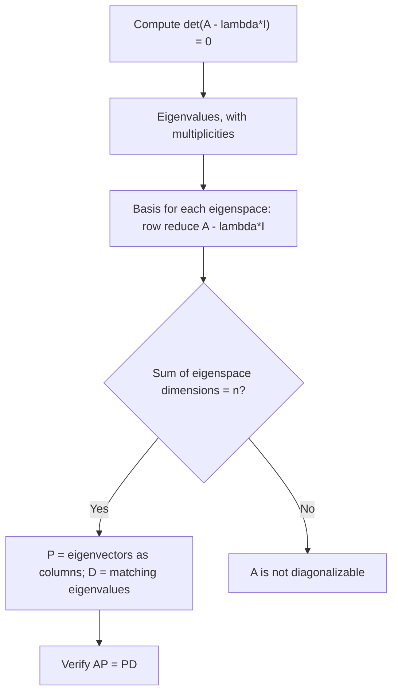

---
tags:
  - CCT3
  - Lin_Algebra
Topic: Diagonalisering og basisskifte.
Semester: CCT3
Course: Linær Algebra
Litterature:
  - Linear Algebra and Its Applications, Global Edition, 6ed
Created: 06-10-2026
---
## Table of Contents

1. [[#4. Diagonalisering og basisskifte|4. Diagonalisering og basisskifte]]
	1. [[#4. Diagonalisering og basisskifte#4.1 Diagonalization|4.1 Diagonalization]]
		1. [[#4.1 Diagonalization#Powers of a Matrix|Powers of a Matrix]]
		2. [[#4.1 Diagonalization#Diagonalizability|Diagonalizability]]
		3. [[#4.1 Diagonalization#Step-by-Step Diagonalization Procedure|Step-by-Step Diagonalization Procedure]]
		4. [[#4.1 Diagonalization#Sufficient Condition for Diagonalizability|Sufficient Condition for Diagonalizability]]
		5. [[#4.1 Diagonalization#Matrices with Non-Distinct Eigenvalues|Matrices with Non-Distinct Eigenvalues]]
		6. [[#4.1 Diagonalization#Practice Problems (Diagonalization)|Practice Problems (Diagonalization)]]
	2. [[#4. Diagonalisering og basisskifte#4.2 Eigenvectors and Linear Transformations|4.2 Eigenvectors and Linear Transformations]]
		1. [[#4.2 Eigenvectors and Linear Transformations#Eigenvectors of Linear Transformations|Eigenvectors of Linear Transformations]]
		2. [[#4.2 Eigenvectors and Linear Transformations#The Matrix of a Linear Transformation|The Matrix of a Linear Transformation]]
		3. [[#4.2 Eigenvectors and Linear Transformations#Linear Transformations on $\mathbb{R}^n$|Linear Transformations on $\mathbb{R}^n$]]
		4. [[#4.2 Eigenvectors and Linear Transformations#Similarity of Matrix Representations|Similarity of Matrix Representations]]
		5. [[#4.2 Eigenvectors and Linear Transformations#Numerical Notes|Numerical Notes]]
		6. [[#4.2 Eigenvectors and Linear Transformations#Practice Problems (Linear Transformations)|Practice Problems (Linear Transformations)]]

# 4. Diagonalisering og basisskifte

| Symbol / term | Meaning in this note |
|---|---|
| $A$ | The square ($n \times n$) matrix being diagonalized, or the standard matrix of a transformation $T(x) = Ax$. |
| $A = PDP^{-1}$ | Diagonalization: $A$ written as a change of basis wrapped around a diagonal matrix. |
| $A^k = PD^kP^{-1}$ | Powers of a diagonalizable matrix; $D^k$ simply raises each diagonal entry to the $k$-th power. |
| $AP = PD$ | The column-by-column identity that defines the factorization, and the cheapest check of a candidate $P$ and $D$. |
| $D$ | Diagonal matrix whose diagonal entries are the eigenvalues, in the same order as the matching eigenvector columns of $P$. (In §4.2, $D$ also denotes the left double-shift operator on signals — context distinguishes the two.) |
| $P$ | Invertible matrix whose columns are $n$ linearly independent eigenvectors of $A$. |
| $P^{-1}$ | Inverse of $P$; it exists precisely because the columns of $P$ are linearly independent. |
| $\left[\,P \mid AP\,\right]$ | Augmented matrix; row-reducing it to $\left[\,I \mid P^{-1}AP\,\right]$ delivers the similarity product without forming $P^{-1}$ separately. |
| $I$ | Identity matrix. |
| $\lambda$ | Eigenvalue: the scalar in $Av = \lambda v$ or $T(x) = \lambda x$. |
| $v$, $x$ | Eigenvectors: nonzero vectors that $A$ or $T$ scales instead of rotating. |
| $\lambda_1, \dots, \lambda_p$ | The distinct eigenvalues of $A$ (so $p \leq n$). |
| $\det(A - \lambda I)$ | Characteristic polynomial of $A$; its roots are the eigenvalues of $A$. |
| Algebraic multiplicity | Multiplicity of $\lambda$ as a root of the characteristic polynomial. |
| Geometric multiplicity | Dimension of the eigenspace of $\lambda$, i.e. $\dim \operatorname{Nul}(A - \lambda I)$ — the number of free variables when $A - \lambda I$ is row reduced. |
| Eigenvector basis | A basis of $\mathbb{R}^n$ (or of $V$) consisting entirely of eigenvectors. |
| $\mathcal{B} = \{b_1, \dots, b_n\}$ | Ordered basis of $V$; $\mathcal{B}_k$ denotes a basis of the eigenspace for $\lambda_k$. |
| $[x]_{\mathcal{B}}$ | Coordinate vector of $x$ relative to $\mathcal{B}$. |
| $[T]_{\mathcal{B}} = M$ | Matrix representation of $T$ relative to $\mathcal{B}$; its $j$-th column is $[T(b_j)]_{\mathcal{B}}$. |
| $[T(x)]_{\mathcal{B}} = [T]_{\mathcal{B}}[x]_{\mathcal{B}}$ | Defining property of the matrix representation: acting in $V$ equals matrix multiplication in $\mathbb{R}^n$. |
| $P^{-1}AP$ | The matrix of the transformation $x \mapsto Ax$ relative to the basis formed by the columns of $P$. |
| $P_{\mathcal{B}}$ | Change-of-coordinates matrix whose columns are the basis $\mathcal{B}$; it satisfies $P_{\mathcal{B}}[x]_{\mathcal{B}} = x$. |
| $\operatorname{tr} A$, $\operatorname{rank} A$, $\operatorname{Nul} A$ | Trace (the sum of the diagonal entries, equal to the sum of the eigenvalues), rank (number of pivots) and null space; the rank theorem gives $\dim \operatorname{Nul} A = n - \operatorname{rank} A$. |
| Similar matrices | $A \sim C$ means $C = P^{-1}AP$ for some invertible $P$; being similar is an equivalence relation. |
| $\mathbb{R}^n$ | Vector space of $n$-tuples (column vectors) of real numbers. |
| $\mathbb{P}_n$ | Vector space of polynomials of degree at most $n$ ($\mathbb{P}_2$ in the worked example). |
| $C^\infty(\mathbb{R})$ | Vector space of infinitely differentiable functions on $\mathbb{R}$; the home of the differentiation example. |
| $\mathbb{S}$ | Vector space of discrete-time signals $\{x_k\}$ (doubly infinite sequences). |
| $\{s_k\}$, $\{x_k\}$ | Signal sequences; $\{s_k\} = \{\cos(k\pi/2)\}$ is the example eigenvector and $D(\{x_k\}) = \{x_{k+2}\}$ is the left double-shift. |
| $T: V \to V$ | A linear transformation from a vector space into itself. |
| Jordan canonical form | Nearly diagonal, upper-triangular matrix representing a transformation that cannot be diagonalized. |
| Jordan block | One eigenvalue on the diagonal, possibly $1$'s on the superdiagonal (the entries directly above the diagonal), and zeros elsewhere; the building block of Jordan form, one block per independent eigenvector direction. |
| Defective matrix | A matrix that is not diagonalizable: some eigenvalue has geometric multiplicity smaller than its algebraic multiplicity. |
| Eigenfunction | An eigenvector of a transformation on a function space, e.g. $e^{kt}$ for the differentiation operator. |
| Nilpotent matrix | A square matrix $N$ with $N^m = 0$ for some integer $m \geq 1$. |
| $k$ | The exponent in powers $A^k$ and $D^k$, and the index of a sequence $\{x_k\}$. |
| $r_i$ | The coefficients in an expansion $x = r_1b_1 + \cdots + r_nb_n$; they are the entries of the coordinate vector $[x]_{\mathcal{B}}$. |
| $\operatorname{diag}(\lambda_1, \dots, \lambda_n)$ | Diagonal matrix with the listed entries on its main diagonal. |
| $\sim$ | Two overloaded uses: $A \sim B$ marks row-equivalence in row-reduction displays, while in the Similar matrices row above, $A \sim C$ is shorthand for similarity. The two never appear in the same context. |
| $\S$ | Section sign, used to point to a textbook section (as in "§5.4"). |
| **IMT** | Invertible Matrix Theorem — the list of equivalent conditions for invertibility; used here to conclude that a matrix whose columns are linearly independent is invertible. |
| ✓ | Substitution check: the displayed result has been verified by direct computation. |

_Table 4.1: Quick reference for every symbol, operator, and abbreviation this note defines or relies on._

---

Most matrices look complicated only because they are being read in the wrong coordinates.
A square matrix $A$ is often **diagonalizable**: all of its eigenvalue–eigenvector information can be packaged into one factorization $A = PDP^{-1}$ in which $D$ is diagonal.
The factorization is worth the effort because diagonal matrices are trivial to work with — raising $D$ to a power raises each diagonal entry on its own, so $A^k = PD^kP^{-1}$ turns an expensive repeated matrix product into two cheap multiplications.

This is not a party trick.
Dynamical systems, difference equations and Markov chains are studied by iterating $x_{k+1} = Ax_k$, and a closed formula for $A^k$ is exactly what *decouples* the system: in eigenvector coordinates it becomes $n$ independent one-dimensional recursions instead of one tangled $n$-dimensional one.
The same idea answers the qualitative questions that matter in applications — does the system grow, decay, oscillate, or settle into a steady state — because those answers live in the sizes of the eigenvalues rather than in the individual matrix entries.

One warning about notation before starting: the letter $D$ is overloaded in this chapter.
In §4.1 it always means the diagonal matrix of eigenvalues, while in the signal example of §4.2 it means the left double-shift operator on sequences.
Both are standard in the textbook, so the habit to build is reading $D$ from context, and the quick-reference table above lists both meanings.

By the end of this note you should be able to:

- decide whether a given square matrix is diagonalizable, and produce $P$ and $D$ when it is;
- compute powers of a diagonalizable matrix from the factorization $A = PDP^{-1}$;
- explain why distinct eigenvalues settle the question immediately, and why repeated eigenvalues do not;
- compute the matrix representation $[T]_\mathcal{B}$ of an abstract linear transformation and use $[T(x)]_\mathcal{B} = [T]_\mathcal{B}[x]_\mathcal{B}$;
- describe diagonalization as a change of basis, and say what Jordan form does when diagonalization is impossible.

A few earlier results do most of the heavy lifting here, so it is worth recalling them by name before starting: the definitions of eigenvalue, eigenvector and eigenspace; the independence of eigenvectors belonging to distinct eigenvalues; the determinant test for invertibility; and the Invertible Matrix Theorem, which ties independence, invertibility, rank and nullity into one list of equivalent statements.
If any of those feels shaky, the fastest repair is a short reread of Sections 5.1–5.2 on eigenvalues and the characteristic equation, plus Section 1.7 on linear independence, because everything below is built directly on them.
Nothing in this note assumes those results are memorized word for word — only that the ideas are available when they are invoked.

Section 4.1 builds the machinery: powers of diagonal matrices, the Diagonalization Theorem, a four-step procedure, the sufficient condition of distinct eigenvalues, and the repeated-eigenvalue case.
Section 4.2 then [[#4.2 Eigenvectors and Linear Transformations|reframes the same story in the language of linear transformations]], where $A = PDP^{-1}$ becomes a statement about change of basis — about *choosing coordinates* in which a transformation is as simple as it can be.

---

## 4.1 Diagonalization

Diagonalization is the factorization of a square matrix $A$ into $A = PDP^{-1}$ with $D$ diagonal.
Because $P$ is invertible, the equation says that $A$ and $D$ are *similar*: they describe the same linear transformation in two coordinate systems, one of which is built from the eigenvectors of $A$.
In that coordinate system the transformation has no cross-talk at all — every coordinate is merely stretched by its own eigenvalue.

It helps to keep track of what each of the three matrices is doing.

- $P$ is a dictionary: its columns are the directions that $A$ does not rotate, written in the standard coordinates.
- $D$ is the simple story: it records how much each of those directions is stretched.
- $P^{-1}$ is the translator back into standard coordinates, so that the product $PDP^{-1}$ still describes what $A$ does to ordinary vectors.

The eigenvectors are the directions worth building coordinates from precisely because they are the directions $A$ refuses to mix: each one is stretched on its own, with nothing leaking across coordinates.
Seen this way, non-diagonalizability is easy to picture geometrically — the matrix does not have enough of these undeflected directions to span the space, so some vectors are inevitably sheared sideways.
That picture also explains in advance why repeated eigenvalues are where trouble shows up: several directions must share a single stretch factor, and whether they really do is a separate question from the algebra.
Holding the geometric reading alongside the algebraic one is the fastest way to keep a long computation meaningful.

Similar is not the same as equal, and the distinction is the whole point.
$A$ and $D$ are rarely equal as matrices, yet they carry identical information about the transformation, exactly as "3 metres" and "300 centimetres" are different symbols for one length.
Everything that survives a change of description — eigenvalues, determinant, trace, rank, invertibility — is shared by the two matrices; everything that does not survive it, such as the actual list of entries, is allowed to differ.

Three payoffs make this factorization the centrepiece of Chapter 5.

- **Powers become easy.** $A^k = PD^kP^{-1}$, so long-term behaviour (growth, decay, steady states) is read off the diagonal of $D$ instead of computed entry by entry.
- **Systems decouple.** The substitution $x = Pu$ turns $x_{k+1} = Ax_k$ into $u_{k+1} = Du_k$, i.e. $n$ separate scalar recursions that can each be solved on their own.
- **Structure becomes visible.** The eigenvalues on the diagonal of $D$ reveal the geometry of $A$: which directions are stretched, shrunk, or flipped, and by how much.

None of this is available for free: the whole method rests on the factorization existing, and many matrices simply do not admit one.
The rest of Section 4.1 is therefore devoted to deciding when a factorization exists, how to construct it, and what to do when it does not.

It is also worth knowing where the idea is heading beyond the present chapter.
The same factorization powers the analysis of Markov chains, of linear recurrence relations, and of systems of linear differential equations, and complex eigenvalues extend it to rotations and oscillations.
Nothing beyond eigenvalues, eigenspaces and one row reduction per distinct eigenvalue is needed in what follows, so the machinery in this note is genuinely self-contained.
The four subsections that follow answer four questions in order: how do powers of a diagonal matrix behave, when is a matrix diagonalizable, how is a diagonalization carried out, and what happens when eigenvalues repeat.

### Powers of a Matrix

Computing powers of a diagonal matrix is straightforward because it only requires raising each diagonal entry to that power.
There is no coupling between the entries to keep track of: the diagonal entries of a product of diagonal matrices are products of the corresponding entries, and every off-diagonal entry is a sum whose terms all contain a zero.
That is the whole reason to diagonalize — it converts the one hard operation, repeated multiplication, into two easy operations, translation plus powers of scalars.

> [!example] Powers of a Diagonal Matrix
> If $D = \begin{bmatrix} 5 & 0 \\ 0 & 3 \end{bmatrix}$, then:
> $$D^2 = \begin{bmatrix} 5 & 0 \\ 0 & 3 \end{bmatrix} \begin{bmatrix} 5 & 0 \\ 0 & 3 \end{bmatrix} = \begin{bmatrix} 5^2 & 0 \\ 0 & 3^2 \end{bmatrix}$$
> In general, for $k \geq 1$:
> $$D^k = \begin{bmatrix} 5^k & 0 \\ 0 & 3^k \end{bmatrix}$$
> *Check:* the off-diagonal entries of $D^2$ are $0 \cdot 5 + 5 \cdot 0 = 0$, and the diagonal entries are $5^2$ and $3^2$, matching the formula at $k = 2$. ✓

If $A = PDP^{-1}$ for some invertible $P$ and diagonal $D$, then $A^k$ is also easy to compute because the intermediate $P^{-1}P$ terms simplify to the identity matrix $I$.
The mechanism is a telescoping product in which each interior $P^{-1}P$ collapses:

$$A^k = (PDP^{-1})(PDP^{-1}) \cdots (PDP^{-1}) = PD(P^{-1}P)D(P^{-1}P) \cdots DP^{-1} = PD^kP^{-1}$$

The factorization behaves like a round trip: $P^{-1}$ translates into eigenvector coordinates, $D^k$ does the repeated stretching there, and $P$ translates back.
Because matrix multiplication is associative, the collapse of neighbouring $P$ and $P^{-1}$ factors is always legal; no assumption beyond the existence of the factorization itself is needed.
For $k \geq 1$ the formula is immediate, and for $k = 0$ it still gives $PD^0P^{-1} = PIP^{-1} = I = A^0$, so the convention extends harmlessly.
When $A$ is not diagonalizable the same idea survives in weakened form: powers can still be computed from a Jordan form, but the answer is a polynomial times a power rather than a clean single term.

Applied to a single eigenvector, the factorization says something simple enough to remember: $A^kv = \lambda^k v$.
The direction survives untouched and only the length changes, by the factor $\lambda^k$, so the long-run behaviour of $A^k$ is decided by the sizes of the eigenvalues rather than by the size of the matrix.
An eigenvalue with $|\lambda| > 1$ makes its direction grow without bound, $|\lambda| < 1$ makes it decay towards zero, $\lambda = 1$ keeps it fixed, and a negative eigenvalue alternates the sign at every step because the powers $\lambda^k$ do.
In practice this is why a population model or a difference equation can be summarized by a handful of numbers instead of by iteration.

The construction also shows that the factorization is not unique: eigenvectors may be rescaled by any nonzero constant and listed in any order, with the diagonal of $D$ reordered to match, and the product $PDP^{-1}$ is unchanged.
That freedom is a convenience rather than a defect — it means any convenient scaling of the eigenvectors is acceptable, and two answers that differ only in such choices are both correct.

> [!example] Powers of a Diagonalized Matrix
> Let $A = \begin{bmatrix} 7 & 2 \\ -4 & 1 \end{bmatrix}$. Find a formula for $A^k$, given that $A = PDP^{-1}$ where:
> $$P = \begin{bmatrix} 1 & -1 \\ -1 & 2 \end{bmatrix} \quad \text{and} \quad D = \begin{bmatrix} 5 & 0 \\ 0 & 3 \end{bmatrix}$$
> **Step 1:** Compute $P^{-1}$ using the $2 \times 2$ inverse formula:
> $$P^{-1} = \frac{1}{(1)(2) - (-1)(-1)} \begin{bmatrix} 2 & 1 \\ 1 & 1 \end{bmatrix} = \begin{bmatrix} 2 & 1 \\ 1 & 1 \end{bmatrix}$$
> **Step 2:** Observe the algebraic simplification for $A^2$:
> $$A^2 = (PDP^{-1})(PDP^{-1}) = PD(P^{-1}P)DP^{-1} = P(DI)DP^{-1} = PD^2P^{-1}$$
> **Step 3:** Generalize to $A^k$ for $k \geq 1$:
> $$A^k = PD^kP^{-1} = \begin{bmatrix} 1 & -1 \\ -1 & 2 \end{bmatrix} \begin{bmatrix} 5^k & 0 \\ 0 & 3^k \end{bmatrix} \begin{bmatrix} 2 & 1 \\ 1 & 1 \end{bmatrix}$$
> $$= \begin{bmatrix} 1 & -1 \\ -1 & 2 \end{bmatrix} \begin{bmatrix} 2 \cdot 5^k & 5^k \\ 3^k & 3^k \end{bmatrix} = \begin{bmatrix} 2 \cdot 5^k - 3^k & 5^k - 3^k \\ -2 \cdot 5^k + 2 \cdot 3^k & -5^k + 2 \cdot 3^k \end{bmatrix}$$
> *Check ($k = 1$):* the formula returns $2 \cdot 5 - 3 = 7$, $5 - 3 = 2$, $-10 + 6 = -4$ and $-5 + 6 = 1$, which is exactly the given $A$. ✓
> *Check ($k = 2$):* the formula gives $\begin{bmatrix} 41 & 16 \\ -32 & -7 \end{bmatrix}$, and indeed $A^2 = \begin{bmatrix} 7 & 2 \\ -4 & 1 \end{bmatrix}\begin{bmatrix} 7 & 2 \\ -4 & 1 \end{bmatrix} = \begin{bmatrix} 49 - 8 & 14 + 2 \\ -28 - 4 & -8 + 1 \end{bmatrix} = \begin{bmatrix} 41 & 16 \\ -32 & -7 \end{bmatrix}$. ✓

The answer $A^k = \begin{bmatrix} 2 \cdot 5^k - 3^k & 5^k - 3^k \\ -2 \cdot 5^k + 2 \cdot 3^k & -5^k + 2 \cdot 3^k \end{bmatrix}$ is worth reading qualitatively, not just algebraically.
For large $k$ the term $5^k$ dominates every entry, so the direction of $A^kv$ for any vector $v$ creeps towards the eigenvector for $\lambda = 5$.
This is the mechanism behind long-run behaviour in difference-equation models, and it is visible only because the eigenvalues were separated out.
Notice too how little work the $2 \times 2$ inverse required — the $2 \times 2$ formula reduces inversion to a determinant and a swap — whereas an unrestricted matrix power has no such shortcut.
The example also shows where the real difficulty sits: everything except the formula for $P^{-1}$ was bookkeeping, and the factorization itself was handed to us. Producing $P$ and $D$ from scratch is the job of the next section, and it is the only genuinely hard part of the method.

### Diagonalizability

The definition is deliberately undemanding-looking: a matrix is diagonalizable if *some* invertible $P$ works.
The real work is deciding whether such a $P$ exists and, when it does, constructing it — and the answer always comes from the eigenvectors.
Note what the definition does not ask: $A$ need not be invertible, symmetric, or triangular, and $D$ is allowed to have zeros on its diagonal.
The only requirement is that some invertible change of coordinates makes the matrix diagonal.

> [!info] Definition: Diagonalizable Matrix
> A square matrix $A$ is **diagonalizable** if it is similar to a diagonal matrix — that is, if there exists an invertible matrix $P$ and a diagonal matrix $D$ such that:
> $$A = PDP^{-1}$$

The definition says nothing yet about how to find $P$ or $D$; it only asserts that some such pair exists, and the theorem below turns that assertion into a test.
It is worth noticing how weak the requirement really is: nothing constrains the diagonal entries of $D$, so a matrix with zero eigenvalues can still qualify, and nothing demands symmetry, triangularity, or any special pattern of entries in $A$.
A single counterexample settles the question in the negative: if a matrix is *not* diagonalizable, no clever choice of basis can rescue it — the whole question is decided by the eigenvectors it possesses.

> [!example] Reading a factorization column by column
> The matrix $A = \begin{bmatrix} 7 & 2 \\ -4 & 1 \end{bmatrix}$ from the powers example is diagonalizable, since it satisfies $A = PDP^{-1}$ with $P = \begin{bmatrix} 1 & -1 \\ -1 & 2 \end{bmatrix}$ and $D = \begin{bmatrix} 5 & 0 \\ 0 & 3 \end{bmatrix}$.
> *Check:* $A\begin{bmatrix} 1 \\ -1 \end{bmatrix} = \begin{bmatrix} 5 \\ -5 \end{bmatrix} = 5\begin{bmatrix} 1 \\ -1 \end{bmatrix}$ and $A\begin{bmatrix} -1 \\ 2 \end{bmatrix} = \begin{bmatrix} -3 \\ 6 \end{bmatrix} = 3\begin{bmatrix} -1 \\ 2 \end{bmatrix}$. ✓
> The columns of $P$ are eigenvectors of $A$, and the diagonal entries of $D$ are their eigenvalues — in exactly the same order.

That column-by-column reading is the entire content of the next theorem, which is the working tool of this whole note.
Read it in two directions: from a factorization to eigenvectors, and from eigenvectors back to a factorization.
It is used far more often in the constructive direction — collect eigenvectors, check independence, assemble $P$ and $D$ — than as an abstract test.

> [!summary] Theorem 1: The Diagonalization Theorem (Textbook Theorem 5)
> An $n \times n$ matrix $A$ is diagonalizable if and only if $A$ has $n$ linearly independent eigenvectors. In fact, $A = PDP^{-1}$ with $D$ diagonal if and only if the columns of $P$ are $n$ linearly independent eigenvectors of $A$, in which case the diagonal entries of $D$ are the corresponding eigenvalues. Equivalently, $A$ is diagonalizable if and only if its eigenvectors form a basis of $\mathbb{R}^n$, called an **eigenvector basis** of $\mathbb{R}^n$.
>
> **Breakdown:**
> - $A = PDP^{-1}$: the factorization; $A$ is the $n \times n$ matrix being diagonalized.
> - $P = [v_1\ \cdots\ v_n]$: the invertible matrix whose columns are the linearly independent eigenvectors of $A$ (same column order as the eigenvalues in $D$).
> - $D = \operatorname{diag}(\lambda_1, \ldots, \lambda_n)$: the diagonal matrix of eigenvalues.
> - $P^{-1}$: the inverse of the eigenvector matrix; it exists because those columns are linearly independent.
>
> **Proof:**
> Let $P = [v_1 \ \cdots \ v_n]$ and $D = \operatorname{diag}(\lambda_1, \ldots, \lambda_n)$. By columns, $AP = [Av_1 \ \cdots \ Av_n]$ and $PD = [\lambda_1 v_1 \ \cdots \ \lambda_n v_n]$.
> If $A = PDP^{-1}$, right-multiplying by $P$ gives $AP = PD$, so comparing columns yields $Av_j = \lambda_j v_j$ for every $j$; since $P$ is invertible its columns are nonzero, so each $v_j$ is an eigenvector with eigenvalue $\lambda_j$.
> Conversely, $n$ independent eigenvectors with matched eigenvalues build matrices $P$ and $D$ satisfying $AP = PD$ column by column, and independence makes $P$ invertible by the Invertible Matrix Theorem (IMT), so $A = PDP^{-1}$.

The theorem has a geometric reading that repays a moment's thought: diagonalizing $A$ means finding a basis in which the transformation $x \mapsto Ax$ *acts by scaling each coordinate independently*.
The matrix is complicated; the transformation, seen in its own coordinates, is not.
Two consequences of the theorem are easy to miss and worth stating explicitly.
First, the correspondence is order-sensitive: swapping two columns of $P$ while leaving $D$ alone breaks the factorization, so the pairing between an eigenvector and its eigenvalue must be preserved.
Second, independence is checked on the eigenvectors *as a set*; two eigenvectors for the same eigenvalue are usually dependent, while eigenvectors for distinct eigenvalues never are.

A compact way to remember the theorem is that three statements say exactly the same thing: $A$ is diagonalizable, $A$ is similar to a diagonal matrix, and the eigenvectors of $A$ form a basis of $\mathbb{R}^n$.
When the theorem fails, the reason is also always the same: the eigenspaces together supply fewer than $n$ independent vectors.
Two apparent failure modes are worth ruling out first, because neither is a real failure — a matrix may simply have complex eigenvalues, so that fewer than $n$ real eigenvalues exist, and arithmetic slips in the characteristic equation or in a row reduction can mimic the real thing.
Checking the eigenvector count directly is what distinguishes the three cases.

> [!warning] Pitfall: dependent eigenvectors, and confusing diagonalizable with invertible
> If the eigenvectors you collect are linearly dependent, the matrix $P$ built from them is singular, and "$A = PDP^{-1}$" is not a valid factorization — always check independence before writing the answer, since by the IMT the invertibility of $P$ is exactly its column independence.
> Keep two definitions apart as well: *diagonalizable* is not *invertible*. A diagonalizable matrix may have $0$ as an eigenvalue (like the triangular matrix below), and an invertible matrix need not be diagonalizable — the invertible matrix $\begin{bmatrix} 4 & -9 \\ 4 & -8 \end{bmatrix}$ of Section 4.2 has no eigenvector basis at all.

### Step-by-Step Diagonalization Procedure

To diagonalize an $n \times n$ matrix $A$, implement the following four steps:

1. **Find the eigenvalues of $A$:** Compute the roots of the characteristic equation $\det(A - \lambda I) = 0$.
2. **Find $n$ linearly independent eigenvectors:** Find a basis for each eigenspace. If the sum of the dimensions of these eigenspaces is less than $n$, the matrix is **not diagonalizable**.
3. **Construct $P$:** Set the eigenvectors found in Step 2 as the columns of $P$. They can be ordered in any way.
4. **Construct $D$:** Place the corresponding eigenvalues on the main diagonal of $D$, ensuring their order matches the column order of the eigenvectors in $P$.

Step 2 is where all the information is.
Step 1 always produces $n$ eigenvalues *counted with multiplicity*, but diagonalization needs $n$ independent *vectors*, and only Step 2 can tell whether the matrix supplies them.
In practice Step 2 means one row reduction per distinct eigenvalue, and the number of free variables in that reduction is the dimension of the corresponding eigenspace.
Steps 3 and 4 are bookkeeping, and the ordering freedom they allow is a useful safety valve: any ordering of the eigenvectors is fine as long as the eigenvalues follow it in lockstep.
Choosing an ordering that matches the order in which you found the eigenvectors is the simplest way to avoid bookkeeping errors.

A few practical habits make the four steps faster and less error-prone.

- For a triangular matrix, read the eigenvalues straight off the diagonal instead of expanding a determinant; this shortcut also covers block-triangular cases.
- To measure an eigenspace, use $\dim \operatorname{Nul}(A - \lambda I) = n - \operatorname{rank}(A - \lambda I)$: a quick rank calculation beats a full row reduction when only the dimension is needed.
- Choose the simplest basis vectors for each eigenspace — small integers, no fractions — since every nonzero multiple of an eigenvector is again an eigenvector.
- Order $D$'s diagonal to match the columns of $P$ exactly, and never reorder one without the other.
- After assembling the pair, verify $AP = PD$ once: a single multiplication checks independence, the pairing, and the arithmetic together.

Factoring the characteristic polynomial is the step where time is most often lost, and a few habits help.
For a $2 \times 2$ matrix, use the trace and determinant directly: $\lambda^2 - (\operatorname{tr} A)\lambda + \det A = 0$.
For larger matrices, try integer candidates built from the constant term and the leading coefficient before reaching for anything else, and remember that a triangular matrix needs no factoring at all — its eigenvalues sit on the diagonal.
If the polynomial refuses to factor over the reals, that is information rather than failure: over $\mathbb{R}$ the matrix cannot be diagonalized, and the complex roots are the reason.

_Figure 4.1: The diagonalization decision flow — the single branch point is whether the eigenspaces supply $n$ linearly independent eigenvectors._

The verification step in the diagram deserves emphasis, because it is cheaper than it looks.

> [!important] Verify a diagonalization with $AP = PD$ — never with an inverse
> If $AP = PD$ and $P$ is invertible, then $A = PDP^{-1}$: two ordinary matrix multiplications settle the correctness of a factorization, and no inverse ever has to be computed to check an answer.

Multiplying $AP = PD$ on the right by $P^{-1}$ recovers exactly the factorization, which is why the two products are enough.
This makes the check the natural final line of every diagonalization, and it catches both a wrong eigenvalue and a mismatched column order in one stroke.

> [!example] Diagonalizing a $3 \times 3$ Matrix
> Diagonalize the matrix:
> $$A = \begin{bmatrix} 1 & 3 & 3 \\ -3 & -5 & -3 \\ 3 & 3 & 1 \end{bmatrix}$$
> **Step 1: Find the eigenvalues.**
> The characteristic equation is:
> $$\det(A - \lambda I) = -\lambda^3 - 3\lambda^2 + 4 = -(\lambda - 1)(\lambda + 2)^2 = 0$$
> The eigenvalues are $\lambda_1 = 1$ and $\lambda_2 = -2$ (with multiplicity $2$).
> **Step 2: Find three linearly independent eigenvectors.**
> - For $\lambda_1 = 1$, row reduce $A - I$:
>   $$A - I = \begin{bmatrix} 0 & 3 & 3 \\ -3 & -6 & -3 \\ 3 & 3 & 0 \end{bmatrix} \sim \begin{bmatrix} 1 & 0 & -1 \\ 0 & 1 & 1 \\ 0 & 0 & 0 \end{bmatrix} \implies v_1 = \begin{bmatrix} 1 \\ -1 \\ 1 \end{bmatrix}$$
> - For $\lambda_2 = -2$, row reduce $A + 2I$:
>   $$A + 2I = \begin{bmatrix} 3 & 3 & 3 \\ -3 & -3 & -3 \\ 3 & 3 & 3 \end{bmatrix} \sim \begin{bmatrix} 1 & 1 & 1 \\ 0 & 0 & 0 \\ 0 & 0 & 0 \end{bmatrix} \implies v_2 = \begin{bmatrix} -1 \\ 1 \\ 0 \end{bmatrix}, \quad v_3 = \begin{bmatrix} -1 \\ 0 \\ 1 \end{bmatrix}$$
> Since $\{v_1, v_2, v_3\}$ is linearly independent, we have enough vectors to proceed.
> **Step 3: Construct $P$.**
> $$P = [v_1 \ v_2 \ v_3] = \begin{bmatrix} 1 & -1 & -1 \\ -1 & 1 & 0 \\ 1 & 0 & 1 \end{bmatrix}$$
> **Step 4: Construct $D$.**
> $$D = \begin{bmatrix} 1 & 0 & 0 \\ 0 & -2 & 0 \\ 0 & 0 & -2 \end{bmatrix}$$
> *Verification check:* Confirm that $AP = PD$:
> $$AP = \begin{bmatrix} 1 & 3 & 3 \\ -3 & -5 & -3 \\ 3 & 3 & 1 \end{bmatrix} \begin{bmatrix} 1 & -1 & -1 \\ -1 & 1 & 0 \\ 1 & 0 & 1 \end{bmatrix} = \begin{bmatrix} 1 & 2 & 2 \\ -1 & -2 & 0 \\ 1 & 0 & -2 \end{bmatrix}$$
> $$PD = \begin{bmatrix} 1 & -1 & -1 \\ -1 & 1 & 0 \\ 1 & 0 & 1 \end{bmatrix} \begin{bmatrix} 1 & 0 & 0 \\ 0 & -2 & 0 \\ 0 & 0 & -2 \end{bmatrix} = \begin{bmatrix} 1 & 2 & 2 \\ -1 & -2 & 0 \\ 1 & 0 & -2 \end{bmatrix} \quad \checkmark$$

Note how the multiplicities played out here: the eigenvalue $-2$ has algebraic multiplicity $2$ and its eigenspace is two-dimensional, so it contributes two independent eigenvectors.
A repeated eigenvalue costs the matrix nothing as long as its eigenspace grows correspondingly, and in this case the eigenspace was large simply because $A + 2I$ had rank $1$ — two free variables.
The same observation is what makes the non-diagonalizable example below fail, so it is worth pausing on the contrast.

Reading the answer rather than only computing it is a habit worth keeping: $D$ says that along the eigenvector for $\lambda = 1$ the transformation is a pure stretch by the factor $1$, so that direction is fixed, while along the two-dimensional eigenspace for $\lambda = -2$ every vector is scaled by $-2$ and therefore flips through the origin.
Nothing in $P$ or $D$ refers to the original matrix entries any more, which is exactly the sense in which the transformation has been simplified rather than merely rewritten.

> [!example] Powers of a $3 \times 3$ Matrix from Its Diagonalization
> The factorization just computed — $A = \begin{bmatrix} 1 & 3 & 3 \\ -3 & -5 & -3 \\ 3 & 3 & 1 \end{bmatrix}$, $P = \begin{bmatrix} 1 & -1 & -1 \\ -1 & 1 & 0 \\ 1 & 0 & 1 \end{bmatrix}$, $D = \begin{bmatrix} 1 & 0 & 0 \\ 0 & -2 & 0 \\ 0 & 0 & -2 \end{bmatrix}$ — gives powers through $A^k = PD^kP^{-1}$.
> **Step 1:** Compute $P^{-1}$ (its determinant is $1$, so the reduction is painless):
> $$P^{-1} = \begin{bmatrix} 1 & 1 & 1 \\ 1 & 2 & 1 \\ -1 & -1 & 0 \end{bmatrix}$$
> **Step 2:** Assemble $A^k$, using $D^k = \operatorname{diag}\left(1, (-2)^k, (-2)^k\right)$:
> $$A^k = \begin{bmatrix} 1 & 1 - (-2)^k & 1 - (-2)^k \\ (-2)^k - 1 & 2(-2)^k - 1 & (-2)^k - 1 \\ 1 - (-2)^k & 1 - (-2)^k & 1 \end{bmatrix}$$
> *Check ($k = 1$):* substituting $(-2)^1 = -2$ returns exactly $A$. ✓
> *Check ($k = 2$):* substituting $(-2)^2 = 4$ gives $\begin{bmatrix} 1 & -3 & -3 \\ 3 & 7 & 3 \\ -3 & -3 & 1 \end{bmatrix}$, which equals $A^2$. ✓
> **Step 3: Read the behaviour, not just the formula.** The eigenvalue $1$ leaves its direction fixed, while the double eigenvalue $-2$ scales its two-dimensional eigenspace by $(-2)^k$: entries grow by a factor $2$ per step and alternate in sign, so $A^k$ oscillates with ever-increasing amplitude instead of settling down.

> [!example] A Non-Diagonalizable Matrix
> Attempt to diagonalize:
> $$A = \begin{bmatrix} 2 & 4 & 3 \\ -4 & -6 & -3 \\ 3 & 3 & 1 \end{bmatrix}$$
> **Step 1:** The characteristic equation is identical to the previous example:
> $$\det(A - \lambda I) = -(\lambda - 1)(\lambda + 2)^2 = 0$$
> The eigenvalues are $\lambda_1 = 1$ and $\lambda_2 = -2$.
> **Step 2: Find eigenvectors.**
> - For $\lambda_1 = 1$, we obtain the basis vector $v_1 = \begin{bmatrix} 1 \\ -1 \\ 1 \end{bmatrix}$.
> - For $\lambda_2 = -2$, row reduce $A + 2I$:
>   $$A + 2I = \begin{bmatrix} 4 & 4 & 3 \\ -4 & -4 & -3 \\ 3 & 3 & 3 \end{bmatrix} \sim \begin{bmatrix} 1 & 1 & 0 \\ 0 & 0 & 1 \\ 0 & 0 & 0 \end{bmatrix}$$
>   The general solution has only one free variable, yielding the eigenspace basis:
>   $$v_2 = \begin{bmatrix} -1 \\ 1 \\ 0 \end{bmatrix}$$
> Because every eigenvector of $A$ is a multiple of either $v_1$ or $v_2$, we cannot construct a basis of $\mathbb{R}^3$ using eigenvectors of $A$. Thus, $A$ is **not diagonalizable**.
> *Check:* the two eigenvectors are genuine: $Av_1 = v_1$ and $Av_2 = -2v_2$. ✓
> The failure is not in the arithmetic but in the supply of vectors — $A$ has only two independent eigenvectors, and three are needed.

This matrix has the same characteristic polynomial as the diagonalizable one above, and the two examples differ in exactly one respect: the eigenspace for the double eigenvalue $-2$ shrank from dimension $2$ to dimension $1$.
Nothing else changed — not the eigenvalues, not their multiplicities, not the size of the matrix.
That single difference decides the whole question, and quantifying it is the subject of the subsection on repeated eigenvalues below.
> [!info] Definition: Defective Matrix
> A matrix is **defective** if it is not diagonalizable — equivalently, if its eigenspaces together supply fewer than $n$ independent eigenvectors, so some eigenvalue has geometric multiplicity smaller than its algebraic multiplicity.

There is a rank way to see the same defect, and it is quicker than comparing eigenspace sizes: a two-dimensional eigenspace would require $A + 2I$ to have rank $3 - 2 = 1$, and instead its rank is $2$.
Rank deficiency of the eigenspace matrices is precisely where diagonalization is won or lost, and the count $\dim \operatorname{Nul}(A - \lambda I) = n - \operatorname{rank}(A - \lambda I)$ is the fastest way to keep score.

### Sufficient Condition for Diagonalizability

Having distinct eigenvalues is a sufficient, but not necessary, condition for a matrix to be diagonalizable.
In other words, distinct eigenvalues settle the question immediately in the affirmative; repeated eigenvalues leave it open.
This makes distinct eigenvalues the fastest available test: compute the characteristic polynomial, count the roots, and in the best case the diagonalization question is already answered.

The reason distinct eigenvalues always win is a linear-independence fact from earlier in the course: eigenvectors belonging to *different* eigenvalues are automatically linearly independent.
The intuition is that a vector cannot be stretched by two different factors at once — if $v$ were an eigenvector for both $\lambda_1 \neq \lambda_2$, then $(\lambda_1 - \lambda_2)v = 0$ would force $v = 0$, which eigenvectors never are.
With $n$ distinct eigenvalues, the $n$ eigenvectors are therefore independent, and Theorem 1 applies without any further checking.

The practical strategy is therefore to compute the eigenvalues first and only then decide how much work remains.
If the characteristic polynomial has $n$ distinct roots, the matrix is diagonalizable and no eigenspace computation is needed beyond producing eigenvectors for the answer; if some root repeats, fall back on the eigenspace count of the next subsection.
Doing it in this order saves row reductions in the easy case, which is most cases in exercises.

Two questions that beginners often blend together are worth separating explicitly.
"Does this matrix have $n$ real eigenvalues?" asks about the *number* of eigenvalues, and it can fail because of complex roots.
"Does this matrix have $n$ independent eigenvectors?" asks about the *sizes* of the eigenspaces, and it can fail even when the previous question succeeds.
The first question is necessary for the second but not sufficient; the second is what actually decides diagonalizability.

> [!summary] Theorem 2: Matrices with Distinct Eigenvalues (Textbook Theorem 6)
> An $n \times n$ matrix with $n$ distinct eigenvalues is diagonalizable.
>
> **Breakdown:**
> - $n$: the size of the matrix, and the number of distinct eigenvalues assumed.
> - $v_1, \ldots, v_n$: eigenvectors chosen for the $n$ distinct eigenvalues; no two of them can be parallel.
> - "Sufficient": the condition implies diagonalizability, but — as the next subsection shows — it is not required for it.
>
> **Proof:** Let $v_1, \ldots, v_n$ be eigenvectors corresponding to the $n$ distinct eigenvalues of $A$. Because the eigenvalues are distinct, the set $\{v_1, \ldots, v_n\}$ is linearly independent, so by Theorem 1 the matrix is diagonalizable.

> [!example] Diagonalizability of a Triangular Matrix with Distinct Eigenvalues
> Determine if the following matrix is diagonalizable:
> $$A = \begin{bmatrix} 5 & -8 & 1 \\ 0 & 0 & 7 \\ 0 & 0 & 2 \end{bmatrix}$$
> Because $A$ is triangular, its eigenvalues are the diagonal entries: $5, 0,$ and $2$.
> Since $A$ is a $3 \times 3$ matrix with three distinct eigenvalues, it is diagonalizable by Theorem 2.
> *Check:* for a triangular matrix, $\det(A - \lambda I) = (5 - \lambda)(0 - \lambda)(2 - \lambda)$, whose roots are exactly $5, 0$, and $2$ — so the three eigenvalues really are distinct. ✓

Note that one of the eigenvalues here is $0$, and the matrix is diagonalizable all the same.
An eigenvalue of zero says the matrix is not invertible; it says nothing about diagonalizability, because the corresponding eigenvector is still a perfectly good direction to build coordinates from.

The example also shows a useful sanity check that costs nothing: for any square matrix the eigenvalues sum to the trace and multiply to the determinant, so $5 + 0 + 2 = 7$ should match the sum of the diagonal entries and $5 \cdot 0 \cdot 2 = 0$ should match $\det A = 0$.
Checking those two numbers catches most sign errors in a characteristic polynomial before they propagate into the eigenvectors.

> [!warning] Pitfall: repeated eigenvalues are not a verdict
> The converse of Theorem 2 is false: a matrix with repeated eigenvalues can still be diagonalizable.
> Repeated eigenvalues are a signal to check the eigenspaces carefully, not to conclude that diagonalization fails.
> Failure happens only when some eigenspace is *smaller* than the multiplicity of its eigenvalue — the exact condition quantified in [[#Matrices with Non-Distinct Eigenvalues|the subsection on repeated eigenvalues]].

### Matrices with Non-Distinct Eigenvalues

When an $n \times n$ matrix has fewer than $n$ distinct eigenvalues, it may still be diagonalizable if the algebraic multiplicity of each eigenvalue equals the dimension of its corresponding eigenspace.
Comparing those two numbers needs a name for each of them.
The comparison is not symmetric: an eigenspace can never be *larger* than the multiplicity of its eigenvalue, so the only possible failure is an eigenspace that comes up short.

> [!info] Definition: Algebraic and Geometric Multiplicity
> The **algebraic multiplicity** of an eigenvalue $\lambda$ is its multiplicity as a root of the characteristic polynomial $\det(A - \lambda I)$ — how many times it is counted as an eigenvalue. The **geometric multiplicity** of $\lambda$ is the dimension of its eigenspace, $\dim \operatorname{Nul}(A - \lambda I)$ — the number of free variables when $A - \lambda I$ is row reduced. The geometric multiplicity is always at most the algebraic multiplicity, so the only question is whether the gap ever closes.

> [!example] Algebraic versus geometric multiplicity, side by side
> For $A = \begin{bmatrix} 1 & 3 & 3 \\ -3 & -5 & -3 \\ 3 & 3 & 1 \end{bmatrix}$ (diagonalized above), $\lambda = -2$ has algebraic multiplicity $2$ and its eigenspace has dimension $2$: the two multiplicities agree, and the matrix is diagonalizable.
> For $A = \begin{bmatrix} 2 & 4 & 3 \\ -4 & -6 & -3 \\ 3 & 3 & 1 \end{bmatrix}$ (the defective one), $\lambda = -2$ still has algebraic multiplicity $2$, but its eigenspace has dimension $1$: the multiplicities disagree, and diagonalization fails.
> *Check:* $\dim \operatorname{Nul}(A + 2I) = 3 - \operatorname{rank}(A + 2I)$ gives $3 - 1 = 2$ in the first case and $3 - 2 = 1$ in the second. ✓

The diagonalization question therefore becomes a count: the total of all eigenspace dimensions must reach $n$, and each individual eigenspace can never exceed its eigenvalue's multiplicity.
Read against the two $3 \times 3$ examples above, the count is transparent: in the diagonalizable one the dimensions $1 + 2 = 3$ reached $n$, while in the defective one they summed to only $1 + 1 = 2$.
One subtlety deserves naming because it is easy to overlook over the real numbers: if the characteristic polynomial does not split into linear factors, some eigenvalues are complex, and the matrix is not diagonalizable as a real matrix no matter how its eigenspaces behave.

Over the complex numbers every square matrix has exactly $n$ eigenvalues counted with multiplicity, so the only interesting failure in that setting is the eigenvector count; over the reals there is an extra failure mode, namely a shortfall in the number of real eigenvalues.

> [!example] A Rotation Matrix: No Real Eigenvalues, Yet Diagonalizable over $\mathbb{C}$
> Let $R = \begin{bmatrix} 0 & -1 \\ 1 & 0 \end{bmatrix}$, the $90^\circ$ rotation of the plane. Its characteristic polynomial is $\lambda^2 + 1$, which has no real roots, so $R$ has no real eigenvectors at all: it is not diagonalizable over $\mathbb{R}$, and no choice of basis can change that.
> Over the complex numbers the same polynomial has the two distinct roots $i$ and $-i$, so $R$ is diagonalizable over $\mathbb{C}$ — two distinct eigenvalues are enough, as Theorem 2 says, once complex scalars are allowed.
> Geometrically this makes sense: a quarter-turn mixes the two coordinate directions so thoroughly that no real vector comes back merely scaled, and only complex coordinates expose the underlying stretching.
> *Check:* if $Rv = \lambda v$ for a real $\lambda$ and a nonzero $v$, then $R^2v = \lambda^2v$; since $R^2 = -I$ this forces $\lambda^2 = -1$, which no real $\lambda$ satisfies. ✓

For problems in this course the working checklist is short and worth writing down before starting: list the distinct eigenvalues, compute $\dim \operatorname{Nul}(A - \lambda I)$ for each, add the dimensions, and compare with $n$.

> [!summary] Theorem 3: Multiplicities and Diagonalizability (Textbook Theorem 7)
> Let $A$ be an $n \times n$ matrix whose distinct eigenvalues are $\lambda_1, \ldots, \lambda_p$.
>
> a. For $1 \leq k \leq p$, the dimension of the eigenspace for $\lambda_k$ is less than or equal to the algebraic multiplicity of the eigenvalue $\lambda_k$.
> b. The matrix $A$ is diagonalizable if and only if the sum of the dimensions of the eigenspaces equals $n$. This occurs if and only if (i) the characteristic polynomial factors completely into linear factors and (ii) the dimension of the eigenspace for each $\lambda_k$ equals the algebraic multiplicity of $\lambda_k$.
> c. If $A$ is diagonalizable and $\mathcal{B}_k$ is a basis for the eigenspace corresponding to $\lambda_k$ for each $k$, then the total collection of vectors in the sets $\mathcal{B}_1, \ldots, \mathcal{B}_p$ forms an eigenvector basis for $\mathbb{R}^n$.
>
> **Breakdown:**
> - $\lambda_1, \ldots, \lambda_p$: the *distinct* eigenvalues, so $p \leq n$; writing them this way keeps every eigenvalue listed exactly once.
> - $\mathcal{B}_k$: any basis of the eigenspace for $\lambda_k$; its size is the geometric multiplicity of $\lambda_k$.
> - Sum of dimensions: $\dim(\text{eigenspace for } \lambda_1) + \cdots + \dim(\text{eigenspace for } \lambda_p)$ — this total is what is compared with $n$.
>
> **Proof (sketch):**
> Part (a) is the key estimate: $\dim \operatorname{Nul}(A - \lambda_k I)$ is at most the algebraic multiplicity of $\lambda_k$, which one shows by factoring out one eigenvector at a time and watching the multiplicity drop by one each time.
> Eigenvectors belonging to *distinct* eigenvalues are linearly independent, so $A$ can supply at most $n$ independent eigenvectors in total: $\sum_{k=1}^{p} \dim \operatorname{Nul}(A - \lambda_k I) \leq n$, with equality only if every eigenspace is as large as its multiplicity.
> If equality holds, the combined eigenspace bases are $n$ linearly independent vectors in $\mathbb{R}^n$, hence a basis, and Theorem 1 makes $A$ diagonalizable; if some eigenspace is smaller than its multiplicity, the total falls short of $n$ and Theorem 1 forbids an eigenvector basis. Part (c) is precisely that equality case.

> [!example] Diagonalizing a $4 \times 4$ Matrix with Multiple Eigenvalues
> Diagonalize the matrix, if possible:
> $$A = \begin{bmatrix} 5 & 0 & 0 & 0 \\ 0 & 5 & 0 & 0 \\ 1 & 4 & 3 & 0 \\ -1 & -2 & 0 & 3 \end{bmatrix}$$
> **Step 1: Find the eigenvalues.**
> Because $A$ is triangular, the eigenvalues are its diagonal entries: $\lambda_1 = 5$ (multiplicity $2$) and $\lambda_2 = 3$ (multiplicity $2$).
> **Step 2: Find bases for the eigenspaces.**
> - For $\lambda_1 = 5$, row reduce $A - 5I$:
>   $$A - 5I = \begin{bmatrix} 0 & 0 & 0 & 0 \\ 0 & 0 & 0 & 0 \\ 1 & 4 & -2 & 0 \\ -1 & -2 & 0 & -2 \end{bmatrix} \sim \begin{bmatrix} 1 & 0 & 2 & 4 \\ 0 & 1 & -1 & -1 \\ 0 & 0 & 0 & 0 \\ 0 & 0 & 0 & 0 \end{bmatrix}$$
>   The general solution is $x_1 = -2x_3 - 4x_4$ and $x_2 = x_3 + x_4$, which yields the basis:
>   $$v_1 = \begin{bmatrix} -8 \\ 4 \\ 4 \\ 0 \end{bmatrix}, \quad v_2 = \begin{bmatrix} -16 \\ 4 \\ 0 \\ 4 \end{bmatrix}$$
>   The dimension of this eigenspace is $2$, matching its algebraic multiplicity.
> - For $\lambda_2 = 3$, row reduce $A - 3I$:
>   $$A - 3I = \begin{bmatrix} 2 & 0 & 0 & 0 \\ 0 & 2 & 0 & 0 \\ 1 & 4 & 0 & 0 \\ -1 & -2 & 0 & 0 \end{bmatrix} \sim \begin{bmatrix} 1 & 0 & 0 & 0 \\ 0 & 1 & 0 & 0 \\ 0 & 0 & 0 & 0 \\ 0 & 0 & 0 & 0 \end{bmatrix}$$
>   The general solution has free variables $x_3$ and $x_4$, yielding the basis:
>   $$v_3 = \begin{bmatrix} 0 \\ 0 \\ 1 \\ 0 \end{bmatrix}, \quad v_4 = \begin{bmatrix} 0 \\ 0 \\ 0 \\ 1 \end{bmatrix}$$
>   The dimension of this eigenspace is $2$, matching its algebraic multiplicity.
> **Step 3: Construct $P$ and $D$.**
> The total collection $\{v_1, v_2, v_3, v_4\}$ forms an eigenvector basis for $\mathbb{R}^4$.
> $$P = \begin{bmatrix} -8 & -16 & 0 & 0 \\ 4 & 4 & 0 & 0 \\ 4 & 0 & 1 & 0 \\ 0 & 4 & 0 & 1 \end{bmatrix}, \quad D = \begin{bmatrix} 5 & 0 & 0 & 0 \\ 0 & 5 & 0 & 0 \\ 0 & 0 & 3 & 0 \\ 0 & 0 & 0 & 3 \end{bmatrix}$$
> *Check:* $Av_1 = 5v_1$, $Av_2 = 5v_2$, $Av_3 = 3v_3$ and $Av_4 = 3v_4$, exactly as the diagonal entries of $D$ require. ✓

> [!warning] Correction: basis vector for $\lambda_1 = 5$ in the $4 \times 4$ example
> The source note-set listed $v_1 = \begin{bmatrix} -8 \\ 4 \\ 1 \\ 0 \end{bmatrix}$. That vector is not an eigenvector: $(A - 5I)v_1 = \begin{bmatrix} 0 \\ 0 \\ 6 \\ 0 \end{bmatrix} \neq 0$.
> Setting $x_3 = 1, x_4 = 0$ in the general solution gives $\begin{bmatrix} -2 \\ 1 \\ 1 \\ 0 \end{bmatrix}$, and scaling it by $4$ gives the correct third entry: $v_1 = \begin{bmatrix} -8 \\ 4 \\ 4 \\ 0 \end{bmatrix}$ → the entry $1$ should be $4$.
> (Equivalently, the unscaled basis $\left\{\begin{bmatrix} -2 \\ 1 \\ 1 \\ 0 \end{bmatrix}, \begin{bmatrix} -4 \\ 1 \\ 0 \\ 1 \end{bmatrix}\right\}$ works; every later step, including $P$, uses the corrected vector.)

The pattern is worth memorizing: repeated eigenvalues are harmless as long as *each* eigenspace grows to the size of its multiplicity.
Here both eigenspaces have dimension $2$, their dimensions sum to the full $n = 4$, and Theorem 3(b) guarantees an eigenvector basis.
Compare this with the $3 \times 3$ non-diagonalizable example: there the eigenspace for $-2$ had dimension $1$ against multiplicity $2$, the dimensions summed to only $2$ instead of $3$, and no amount of clever ordering could rescue the factorization.
Geometric multiplicity is thus the quantity that measures how far a matrix is from being diagonalizable, and the gap between the two multiplicities is exactly what Jordan form later fills in.
A useful habit when a repeated eigenvalue appears: compute $\dim \operatorname{Nul}(A - \lambda I)$ before doing anything else, since that single number decides whether the eigenspace pulls its weight.
Another way to say the same thing is that you want the geometric multiplicity to *catch up* with the algebraic multiplicity, and every extra unit of rank in $A - \lambda I$ is one unit of eigenvector supply that never arrives.
Theorem 3(c) is what turns the separate eigenspaces into an answer: the union of their bases is automatically independent, because eigenvectors for distinct eigenvalues always are, so the eigenvector basis of $\mathbb{R}^n$ is assembled by concatenation.
That is also why the ordering of the columns in $P$ never endangers independence — it only has to stay consistent with $D$.
A useful forward pointer: symmetric matrices are always diagonalizable, and even orthogonally so, which is why they are treated separately later in the book; nothing in this note depends on that fact, but it explains why symmetry is such a welcome property in applications.

### Practice Problems (Diagonalization)

Work the following before moving on to linear transformations; problems 1 and 2 are computational, problem 3 is the conceptual check that the multiplicities are being read correctly.

1. Compute $A^8$, where $A = \begin{bmatrix} 4 & -3 \\ 2 & -1 \end{bmatrix}$.
2. Let $A = \begin{bmatrix} -3 & 12 \\ -2 & 7 \end{bmatrix}$, $v_1 = \begin{bmatrix} 3 \\ 1 \end{bmatrix}$, and $v_2 = \begin{bmatrix} 2 \\ 1 \end{bmatrix}$. Suppose you are told that $v_1$ and $v_2$ are eigenvectors of $A$. Use this information to diagonalize $A$.
3. Let $A$ be a $4 \times 4$ matrix with eigenvalues $5$, $3$, and $2$, and suppose you know that the eigenspace for $\lambda = 3$ is two-dimensional. Do you have enough information to determine if $A$ is diagonalizable?

Strategy worth trying before reading on: the first problem is fastest by diagonalizing once and then reading the formula at $k = 8$, the second is pure bookkeeping once you match each eigenvector with its eigenvalue, and the third is decided purely by counting multiplicities and eigenspace dimensions.

The worked solutions below are added enrichment — the problem statements come from the source note-set, the solutions do not.

> [!example] Worked solution 1: computing $A^8$
> Let $A = \begin{bmatrix} 4 & -3 \\ 2 & -1 \end{bmatrix}$. Its trace is $3$ and its determinant is $2$, so the characteristic equation is $\lambda^2 - 3\lambda + 2 = (\lambda - 1)(\lambda - 2) = 0$: the eigenvalues are $1$ and $2$, distinct, so $A$ is diagonalizable by Theorem 2.
> Eigenvectors: $A - I = \begin{bmatrix} 3 & -3 \\ 2 & -2 \end{bmatrix}$ gives $v_1 = \begin{bmatrix} 1 \\ 1 \end{bmatrix}$ for $\lambda_1 = 1$, and $A - 2I = \begin{bmatrix} 2 & -3 \\ 2 & -3 \end{bmatrix}$ gives $v_2 = \begin{bmatrix} 3 \\ 2 \end{bmatrix}$ for $\lambda_2 = 2$.
> With $P = \begin{bmatrix} 1 & 3 \\ 1 & 2 \end{bmatrix}$ and $D = \begin{bmatrix} 1 & 0 \\ 0 & 2 \end{bmatrix}$, the $2 \times 2$ inverse formula gives $P^{-1} = \begin{bmatrix} -2 & 3 \\ 1 & -1 \end{bmatrix}$ (here $\det P = -1$), so
> $$A^8 = PD^8P^{-1} = \begin{bmatrix} 1 & 3 \\ 1 & 2 \end{bmatrix}\begin{bmatrix} 1 & 0 \\ 0 & 256 \end{bmatrix}\begin{bmatrix} -2 & 3 \\ 1 & -1 \end{bmatrix} = \begin{bmatrix} 766 & -765 \\ 510 & -509 \end{bmatrix}$$
> *Check ($k = 1$):* replacing $D^8$ by $D$ returns $\begin{bmatrix} 4 & -3 \\ 2 & -1 \end{bmatrix} = A$. ✓
> *Check (substitution):* $A^2 = \begin{bmatrix} 10 & -9 \\ 6 & -5 \end{bmatrix}$, and multiplying the formula at $k = 8$ out entry by entry reproduces the matrix above, so no sign or ordering slip has survived. ✓

> [!example] Worked solution 2: diagonalizing $A$ from a given eigenvector pair
> Let $A = \begin{bmatrix} -3 & 12 \\ -2 & 7 \end{bmatrix}$. The eigenvalues are read off by applying $A$ to the given vectors: $Av_1 = \begin{bmatrix} -9 + 12 \\ -6 + 7 \end{bmatrix} = \begin{bmatrix} 3 \\ 1 \end{bmatrix} = v_1$, so $\lambda_1 = 1$; and $Av_2 = \begin{bmatrix} -6 + 12 \\ -4 + 7 \end{bmatrix} = \begin{bmatrix} 6 \\ 3 \end{bmatrix} = 3v_2$, so $\lambda_2 = 3$.
> The two vectors are independent, so they can serve as columns: $P = \begin{bmatrix} 3 & 2 \\ 1 & 1 \end{bmatrix}$, $D = \begin{bmatrix} 1 & 0 \\ 0 & 3 \end{bmatrix}$, and $P^{-1} = \begin{bmatrix} 1 & -2 \\ -1 & 3 \end{bmatrix}$ because $\det P = 1$.
> *Check:* $PDP^{-1} = \begin{bmatrix} 3 & 6 \\ 1 & 3 \end{bmatrix}\begin{bmatrix} 1 & -2 \\ -1 & 3 \end{bmatrix} = \begin{bmatrix} -3 & 12 \\ -2 & 7 \end{bmatrix} = A$. ✓

> [!example] Worked solution 3: does the data determine diagonalizability?
> Yes — the information is sufficient, and $A$ must be diagonalizable.
> Because $\lambda = 3$ already accounts for two of the four eigenvalues, the remaining multiplicities are forced: every listed eigenvalue has multiplicity at least $1$, and the multiplicities total $n = 4$, so $5$ and $2$ each occur exactly once.
> Each eigenspace has dimension at least $1$ and at most the multiplicity of its eigenvalue, so the eigenspaces for $5$ and $2$ are one-dimensional, while the eigenspace for $3$ is two-dimensional by hypothesis. The dimensions sum to $1 + 2 + 1 = 4 = n$, so by Theorem 3(b) the matrix is diagonalizable.
> *Check:* the count uses only the bounds $1 \leq \dim \operatorname{Nul}(A - \lambda I) \leq$ (algebraic multiplicity of $\lambda$) together with the given two-dimensional eigenspace, and the equality of the sum with $n$ is what decides the question. ✓

Self-checks that catch most slips before they cost marks:

- The eigenvalues must sum to the trace of the matrix and multiply to the determinant, with complex values allowed in the sum and product.
- A computed factorization should survive the $AP = PD$ test, column by column as well as in the product.
- The number of independent eigenvectors actually produced must be $n$, not merely close to it.
- In a multiplicity-counting problem, remember that every listed eigenvalue supplies at least one independent eigenvector, so the eigenspace dimensions can be bounded from below as well as from above.

---

## 4.2 Eigenvectors and Linear Transformations

This section follows the textbook's §5.4.
The concepts of eigenvalues and eigenvectors extend naturally beyond matrix multiplication to general linear transformations $T: V \to V$ acting on any vector space $V$.
When $V$ is a finite-dimensional vector space and possesses a basis consisting of eigenvectors of $T$, the transformation $T$ can be represented simply as left-multiplication by a diagonal matrix.

The setting changes, but nothing essential is lost.
An exponential function, a polynomial, and a signal can each be an eigenvector of an appropriate transformation, and a matrix $x \mapsto Ax$ is just the special case $V = \mathbb{R}^n$.
This generality is not decoration: differential equations are solved by finding eigenfunctions of derivative operators, and signal processing is built on eigenvectors of shift operators that delay or advance a sequence.
Abstract vectors spaces are the price of admission for seeing those two applications as one idea.

Nothing in this section requires you to unlearn matrices: the matrices reappear, but now as *representations* of transformations that may act on polynomials or on signals, and the basis becomes something you choose rather than something given.

The payoff is the same as before, one level up — a transformation that looks messy in one basis can be diagonal in another, and the passage between the two bases is itself a matrix multiplication.
The order of business mirrors the earlier sections: first the definition for abstract spaces, then the machinery that turns a transformation into a matrix ($[T]_\mathcal{B}$), then the diagonal case for transformations of $\mathbb{R}^n$, and finally what similarity means when diagonalization is impossible.
Each step replaces a statement about vectors with a statement about their coordinates, so the linear algebra you already know keeps applying.

> [!abstract] Analogy: a basis is a choice of language
> A basis is a choice of language for describing a transformation, and a basis of eigenvectors is the language in which the transformation has no cross-talk: each coordinate is simply scaled by its own eigenvalue. A melody is the same melody whether it is written in notes or in tablature; the notation changes, the music does not — just as the matrix changes with the basis while the transformation stays put.

Diagonalization is therefore less a property of a matrix than a property of the transformation, and the matrix $P$ is a translation dictionary between two languages.
This is the sense in which $A = PDP^{-1}$ and "$D$ is the $\mathcal{B}$-matrix for $T$" are the same statement, and the bridge between them is the subject of this section.
### Eigenvectors of Linear Transformations

Linear transformations can act on various vector spaces, such as function spaces, spaces of polynomials $\mathbb{P}_n$, or discrete-time signal spaces $\mathbb{S}$.
Eigenvalues and eigenvectors are defined for transformations mapping any vector space to itself, and the definition transfers verbatim: the only change is that "$Av$" becomes "$T(v)$".
Even for a single transformation, the set of eigenvectors for a fixed eigenvalue forms a subspace, so the language of eigenspaces carries over unchanged as well.
Two small cases are worth keeping in mind because they explain a lot of later behaviour: every nonzero vector is an eigenvector of the identity transformation with eigenvalue $1$, and every nonzero vector in the kernel of $T$ is an eigenvector with eigenvalue $0$, so an invertible transformation is exactly one that does not have $0$ as an eigenvalue.
A third case is the scaling transformation $T(x) = cx$: every nonzero vector is an eigenvector, with the single eigenvalue $c$, which is the cleanest illustration of the idea that eigenvectors are directions the transformation is content to leave alone.
The definition is deliberately identical to the matrix one because a matrix transformation is just the special case where the vector space is $\mathbb{R}^n$ and the "vector" is a column; nothing about eigenspaces depends on vectors having entries.
Sums and scalar multiples of eigenvectors for a fixed eigenvalue are again eigenvectors, so every eigenvalue of $T$ brings an eigenspace with it, exactly as in the matrix case.
Finding eigenvectors of an abstract transformation is a matter of solving $T(x) = \lambda x$ directly, which is what makes the examples below short: no characteristic polynomial is needed when the transformation's action is transparent.
In practice the two questions are always the same — which elements does the transformation merely scale, and by what factor.
For a shift operator the answer can be read off the definition, for a derivative operator it comes from knowing how basic functions differentiate, and for a matrix transformation it is a row reduction: three presentations of one question.

> [!info] Definition: Eigenvector and Eigenvalue of a Linear Transformation
> Let $V$ be a vector space. An **eigenvector** of a linear transformation $T: V \to V$ is a nonzero vector $x \in V$ such that $T(x) = \lambda x$ for some scalar $\lambda$.
> A scalar $\lambda$ is called an **eigenvalue** of $T$ if there exists a nontrivial (nonzero) solution $x$ to $T(x) = \lambda x$; such an $x$ is called an eigenvector corresponding to $\lambda$.
> - **Breakdown:** $V$ — a vector space (finite- or infinite-dimensional); $T$ — a linear mapping from $V$ into itself; $x$ — a nonzero vector whose direction is invariant under $T$; $\lambda$ — the eigenvalue scalar that scales $x$.

> [!example] Sinusoidal Signal as an Eigenvector of a Shift Operator
> Consider the discrete-time sinusoidal signal $\{s_k\} = \left\{ \cos\left(\frac{k\pi}{2}\right) \right\}$, where $k$ ranges over all integers.
> Let $D$ be the *left double-shift* linear transformation defined by:
> $$D(\{x_k\}) = \{x_{k+2}\}$$
> Applying $D$ to $\{s_k\}$ and setting $\{y_k\} = D(\{s_k\})$:
> $$y_k = s_{k+2} = \cos\left(\frac{(k+2)\pi}{2}\right) = \cos\left(\frac{k\pi}{2} + \pi\right)$$
> Using the trigonometric identity $\cos(\theta + \pi) = -\cos(\theta)$:
> $$y_k = -\cos\left(\frac{k\pi}{2}\right) = -s_k$$
> Therefore:
> $$D(\{s_k\}) = -\{s_k\} = (-1)\{s_k\}$$
> This confirms that $\{s_k\}$ is an eigenvector of the double-shift transformation $D$ corresponding to the eigenvalue $\lambda = -1$. Geometrically, shifting this signal by two units negates each value, which corresponds to scalar multiplication by $-1$.
> *Check:* the identity $\cos(\theta + \pi) = -\cos(\theta)$ holds for every $\theta$, so the shift is verified at every index $k$ simultaneously. ✓

![[Pasted image 20261006211333.png]]

_Figure 4.2: The discrete-time signal $\{s_k\} = \{\cos(k\pi/2)\}$ sampled at integer indices, illustrating that shifting it two steps negates every value — the signal is an eigenvector of the double-shift operator with eigenvalue $-1$._

This signal has period $4$: its values cycle through $1, 0, -1, 0, 1, \dots$, so shifting by two positions lands on the opposite phase and flips every sign.
In signal-processing language the eigenvectors of a shift operator are the discrete sinusoids at the frequencies matching the shift, which is why describing a signal by frequency turns delay systems into simple multiplications.
That is the same decoupling idea as a diagonal matrix $D$: one choice of coordinates makes an otherwise tangled operation independent in each coordinate.
The example shows why the eigenvalue is $-1$ rather than some quantity obtained by solving a characteristic equation: a two-step shift reverses the sign of this particular signal, and that is the entire content of $T(x) = \lambda x$.
Worth noticing is how unlikely the result could have seemed in advance — a *shift* operator moves data along, which sounds like it should destroy the signal, yet this signal's shape is perfectly preserved.
> [!info] Definition: Eigenfunction
> An **eigenfunction** of a transformation on a function space is simply an eigenvector of that transformation: a nonzero function $f$ with $T(f) = \lambda f$ for some scalar $\lambda$. The exponential functions are the standard family of examples for differentiation-type operators.

> [!example] Exponential Functions as Eigenfunctions of Differentiation
> Let $T: C^\infty(\mathbb{R}) \to C^\infty(\mathbb{R})$ be the differentiation operator, $T(f) = f'$. For every real $k$:
> $$T(e^{kt}) = \frac{d}{dt} e^{kt} = k\,e^{kt}$$
> so each exponential $e^{kt}$ is an eigenfunction of $T$ with eigenvalue $k$.
> The transformation has infinitely many eigenvalues, one for every real $k$, and the eigenspace for $k$ consists of all multiples $c\,e^{kt}$ of that exponential.
> *Check:* differentiating $e^{kt}$ multiplies it by $k$, and substituting $t = 0$ gives the value $1$ on both sides of the identity $T(e^{kt}) = k\,e^{kt}$, confirming the scalar is $k$. ✓

Eigenfunctions are not a curiosity: they are the reason the method of separation of variables works for linear differential equations, and the reason a signal can be decomposed into frequencies that a system scales rather than mixes.
An infinite-dimensional space also shows that not every concept from the finite case survives unchanged — here there are infinitely many eigenvalues, one per real number, and there is no matrix to row reduce.
What does survive is the logic of the definition: find the elements the operator merely scales, and the operator becomes multiplication by a scalar on each of them.
That is precisely the move that solves linear differential equations: expand the unknown in terms of eigenfunctions, and differentiation turns into multiplication by the eigenvalue.

### The Matrix of a Linear Transformation

Let $V$ be an $n$-dimensional vector space, and let $T: V \to V$ be a linear transformation.
Choosing an ordered basis $\mathcal{B} = \{b_1, b_2, \ldots, b_n\}$ for $V$ allows every vector $x \in V$ to be uniquely identified by its coordinate vector $[x]_\mathcal{B} \in \mathbb{R}^n$.
Coordinates are the only way to bring abstract vectors into contact with matrices, and the basis must be ordered so that the coefficient list has a definite meaning.
Uniqueness matters here: a different basis gives a different coordinate vector for the same $x$, which is exactly why the matrix representing $T$ depends on the basis as well.
That dependence is not a defect but the central theme of the section: the transformation is fixed, while the matrix is a description of it that changes with the language of the description.
Choosing $\mathcal{B}$ well is therefore a design decision, and the best possible choice — when it exists — is a basis of eigenvectors.
A second, more mundane consequence is that all coordinate computations require the *ordered* basis: without a fixed order, a list of coefficients has no definite meaning.

If $x = r_1 b_1 + r_2 b_2 + \cdots + r_n b_n$, then:

$$[x]_\mathcal{B} = \begin{bmatrix} r_1 \\ r_2 \\ \vdots \\ r_n \end{bmatrix}$$

Because $T$ is linear:

$$T(x) = T(r_1 b_1 + \cdots + r_n b_n) = r_1 T(b_1) + \cdots + r_n T(b_n) \quad \text{--- (1)}$$

Applying the coordinate mapping to equation $(1)$:

$$[T(x)]_\mathcal{B} = r_1 [T(b_1)]_\mathcal{B} + \cdots + r_n [T(b_n)]_\mathcal{B} \quad \text{--- (2)}$$

Since coordinate vectors exist in $\mathbb{R}^n$, equation $(2)$ can be expressed as matrix multiplication:

$$[T(x)]_\mathcal{B} = M [x]_\mathcal{B} \quad \text{--- (3)}$$

where:

$$M = \begin{bmatrix} [T(b_1)]_\mathcal{B} & [T(b_2)]_\mathcal{B} & \cdots & [T(b_n)]_\mathcal{B} \end{bmatrix} \quad \text{--- (4)}$$

Linearity is what makes equation $(1)$ possible: applying $T$ to a combination of basis vectors distributes over the coefficients, so $T$ is completely determined by the $n$ vectors $T(b_1), \ldots, T(b_n)$.
Equations $(1)$–$(4)$ compress the whole theory into four lines: linearity reduces the unknown action of $T$ to finitely many data, and coordinates turn the resulting combination into matrix multiplication.
Without linearity none of this would work — the image of a general vector could not be recovered from the images of the basis vectors, and no matrix could represent the transformation.
Equation $(4)$ is the practical heart of the section: the matrix of $T$ is assembled from the images of the basis vectors, each one *converted back into $\mathcal{B}$-coordinates*.

> [!info] Definition: Matrix Representation Relative to a Basis
> The matrix $M$ is the **matrix representation of $T$ relative to the basis $\mathcal{B}$**, denoted by $[T]_\mathcal{B}$.
> The relationship $[T(x)]_\mathcal{B} = [T]_\mathcal{B} [x]_\mathcal{B}$ states that the action of $T$ on coordinate vectors is equivalent to left-multiplication by the matrix $[T]_\mathcal{B}$.

![[Pasted image 20261006211405.png]]

_Figure 4.3: The coordinate-mapping diagram: passing from $x$ to $T(x)$ inside $V$ is equivalent to passing from $[x]_\mathcal{B}$ to $[T]_\mathcal{B}[x]_\mathcal{B}$ inside $\mathbb{R}^n$._

The diagram is a commuting square: you may travel along the top (apply $T$) or along the bottom (apply the matrix), and the two routes agree for every $x$.
That agreement is what "the matrix represents $T$" means, and it is exactly what a computation of $[T]_\mathcal{B}$ must be checked against.
Because the square commutes for all vectors, the matrix is forced: no other matrix can reproduce the same outputs on a spanning set.
The easiest way to test a claimed matrix representation is therefore to act on the basis vectors: a matrix is the right one precisely when its $j$-th column is the coordinate vector $[T(b_j)]_\mathcal{B}$ for every $j$.

When $\mathcal{B}$ is a basis of eigenvectors, the round trip through coordinates becomes concrete and easy to picture: translate into $\mathcal{B}$-coordinates, scale each coordinate by its eigenvalue, translate back — the composite is the original transformation.

_Figure 4.4: The round trip behind $A = PDP^{-1}$: $P^{-1}$ translates a vector into eigenvector coordinates, $D$ scales each coordinate by its eigenvalue, and $P$ translates back — the composite is the original transformation._

> [!example] Finding the Matrix of a Transformation
> Let $\mathcal{B} = \{b_1, b_2\}$ be a basis for a vector space $V$. Let $T: V \to V$ be a linear transformation satisfying:
> $$T(b_1) = 3b_1 - 2b_2 \quad \text{and} \quad T(b_2) = 4b_1 + 7b_2$$
> **Step 1:** Determine the $\mathcal{B}$-coordinate vectors of the transformed basis elements:
> $$[T(b_1)]_\mathcal{B} = \begin{bmatrix} 3 \\ -2 \end{bmatrix}, \qquad [T(b_2)]_\mathcal{B} = \begin{bmatrix} 4 \\ 7 \end{bmatrix}$$
> **Step 2:** Form $[T]_\mathcal{B}$ by placing coordinate vectors into columns:
> $$[T]_\mathcal{B} = \begin{bmatrix} [T(b_1)]_\mathcal{B} & [T(b_2)]_\mathcal{B} \end{bmatrix} = \begin{bmatrix} 3 & 4 \\ -2 & 7 \end{bmatrix}$$
> *Check:* reading the columns back gives $[T(b_1)]_\mathcal{B} = \begin{bmatrix} 3 \\ -2 \end{bmatrix} \leftrightarrow 3b_1 - 2b_2$ and $[T(b_2)]_\mathcal{B} = \begin{bmatrix} 4 \\ 7 \end{bmatrix} \leftrightarrow 4b_1 + 7b_2$, which reproduces the two given images of the basis vectors. ✓

![[Pasted image 20261006211424.png]]

_Figure 4.5: The linear transformation of the example applied to the basis vectors $b_1$ and $b_2$, with the images expressed in $\mathcal{B}$-coordinates._

The recipe the example used is worth stating in isolation, because every computation of a matrix representation follows this same three-step pattern:

- **Apply $T$ to each basis vector** $b_j$ separately; use linearity rather than trying to process a general $x$.
- **Express each image in $\mathcal{B}$-coordinates**, i.e. write $T(b_j)$ as a combination of $b_1, \ldots, b_n$ and read off the coefficients.
- **Place those coordinate vectors as the columns** of $[T]_\mathcal{B}$, keeping the basis order fixed.

The second step is where mistakes happen most often.
It is tempting to write down the coefficients of $T(b_j)$ in the *standard* basis and stop there, but the definition demands coordinates relative to $\mathcal{B}$ itself — a different conversion unless $\mathcal{B}$ happens to be the standard basis.
When $\mathcal{B}$ is the standard basis, the coordinates of a vector are just its entries, which is why the two operations are easy to confuse in the familiar setting.
The order of the basis is part of the data as well, so fix the order at the start of a computation and never permute it midway: swapping two basis vectors swaps two columns of $[T]_\mathcal{B}$ and silently produces a different matrix.
A cheap dimensional check is available too: $[T]_\mathcal{B}$ must have exactly $n$ columns, one per basis vector, with the $j$-th column holding the $\mathcal{B}$-coordinates of $T(b_j)$.

> [!example] Differentiation Operator on Polynomials
> Let $\mathbb{P}_2$ be the space of polynomials of degree at most 2, with standard basis $\mathcal{B} = \{1, t, t^2\}$. Define the differentiation transformation $T: \mathbb{P}_2 \to \mathbb{P}_2$ by:
> $$T(a_0 + a_1 t + a_2 t^2) = a_1 + 2a_2 t$$
> **a. Find the matrix $[T]_\mathcal{B}$:**
> 1. Compute the derivative of each basis element:
>    $$T(1) = 0, \quad T(t) = 1, \quad T(t^2) = 2t$$
> 2. Convert each result into its $\mathcal{B}$-coordinate vector:
>    $$[T(1)]_\mathcal{B} = \begin{bmatrix} 0 \\ 0 \\ 0 \end{bmatrix}, \quad [T(t)]_\mathcal{B} = \begin{bmatrix} 1 \\ 0 \\ 0 \end{bmatrix}, \quad [T(t^2)]_\mathcal{B} = \begin{bmatrix} 0 \\ 2 \\ 0 \end{bmatrix}$$
>    ![[Pasted image 20261006211449.png]]
>
>    _Figure 4.6: The derivative of each basis polynomial of $\mathbb{P}_2$ written in $\mathcal{B}$-coordinates — the raw data for the columns of $[T]_\mathcal{B}$._
> 3. Combine them into the matrix:
>    $$[T]_\mathcal{B} = \begin{bmatrix} 0 & 1 & 0 \\ 0 & 0 & 2 \\ 0 & 0 & 0 \end{bmatrix}$$
> **b. Verify $[T(p)]_\mathcal{B} = [T]_\mathcal{B}[p]_\mathcal{B}$ for a general polynomial $p(t) = a_0 + a_1 t + a_2 t^2$:**
> Direct evaluation:
> $$[T(p)]_\mathcal{B} = [a_1 + 2a_2 t]_\mathcal{B} = \begin{bmatrix} a_1 \\ 2a_2 \\ 0 \end{bmatrix}$$
> Matrix multiplication:
> $$[T]_\mathcal{B}[p]_\mathcal{B} = \begin{bmatrix} 0 & 1 & 0 \\ 0 & 0 & 2 \\ 0 & 0 & 0 \end{bmatrix}\begin{bmatrix} a_0 \\ a_1 \\ a_2 \end{bmatrix} = \begin{bmatrix} a_1 \\ 2a_2 \\ 0 \end{bmatrix} \quad \checkmark$$
> ![[Pasted image 20261006211511.png]]
>
> _Figure 4.7: The verification that $[T]_\mathcal{B}[p]_\mathcal{B}$ reproduces $[T(p)]_\mathcal{B}$ for an arbitrary polynomial $p \in \mathbb{P}_2$._
> ![[Pasted image 20261006211526.png]]
>
> _Figure 4.8: Matrix representation of a linear transformation (textbook Figure 3)._
> Notice what the matrix records: differentiating three times annihilates every polynomial of degree at most two, so $[T]_\mathcal{B}^3 = 0$, the matrix way of saying $T^3 = 0$ for this transformation.

> [!info] Definition: Nilpotent Matrix
> A square matrix $N$ is **nilpotent** if $N^m = 0$ for some integer $m \geq 1$. The matrix $[T]_\mathcal{B} = \begin{bmatrix} 0 & 1 & 0 \\ 0 & 0 & 2 \\ 0 & 0 & 0 \end{bmatrix}$ of the example above is nilpotent with $m = 3$; a nilpotent matrix is never invertible, and $0$ is its only eigenvalue.

The matrix $\begin{bmatrix} 0 & 1 & 0 \\ 0 & 0 & 2 \\ 0 & 0 & 0 \end{bmatrix}$ is visibly triangular with zeros on the diagonal, so its only eigenvalue is $0$ — matching the geometric fact that differentiating a polynomial reduces its degree, and no nonzero polynomial is merely scaled by differentiation.
Part (b) of the example is the general habit worth copying: verifying a computed matrix against a general vector, not just one example vector, and confirming that both routes in the commuting square give the same answer.
The example is also a good template for computations in abstract spaces: identify the basis, apply the transformation to each basis vector, convert the results into coordinates, assemble the columns, and verify once with a general element.
Polynomial spaces are the friendliest place to practise this, because with the standard basis the coordinates of a polynomial are literally its coefficients.

### Linear Transformations on $\mathbb{R}^n$

When working in $\mathbb{R}^n$, a linear transformation typically appears as matrix multiplication $T(x) = Ax$.
If $A$ is diagonalizable — the situation analysed in [[#4.1 Diagonalization|§4.1]] — there exists an eigenvector basis $\mathcal{B}$ for $\mathbb{R}^n$ that diagonalizes the matrix representation of $T$.
The point of the theorem below is that this is not merely a way of rewriting $D$: it identifies $D$ as the matrix of the *original* transformation in the new coordinates.

> [!summary] Theorem 4: Diagonal Matrix Representation (Textbook Theorem 8)
> Suppose $A = PDP^{-1}$, where $D$ is a diagonal $n \times n$ matrix. If $\mathcal{B}$ is the basis for $\mathbb{R}^n$ formed from the columns of $P$, then $D$ is the $\mathcal{B}$-matrix for the transformation $x \mapsto Ax$.
>
> **Breakdown:**
> - $A$: the $n \times n$ standard matrix of the transformation $T(x) = Ax$.
> - $P = [b_1 \ b_2 \ \cdots \ b_n]$: the change-of-coordinates matrix $P_\mathcal{B}$, whose columns form the basis $\mathcal{B}$.
> - $D$: the diagonal matrix representing $T$ relative to the eigenvector basis $\mathcal{B}$ (that is, $[T]_\mathcal{B} = D$).
> - **Key insight:** diagonalizing $A$ is geometrically equivalent to finding an eigenvector basis in which the transformation acts simply by scaling each coordinate independently.
>
> **Proof:**
> Let the columns of $P$ be $b_1, \ldots, b_n$, so $\mathcal{B} = \{b_1, \ldots, b_n\}$ and $P = [b_1 \ \cdots \ b_n]$. Since $P$ is the change-of-coordinates matrix, $P[x]_\mathcal{B} = x$, hence $[x]_\mathcal{B} = P^{-1}x$.
> The columns of $[T]_\mathcal{B}$ are the $\mathcal{B}$-coordinates of $Ab_1, \ldots, Ab_n$, so applying $[v]_\mathcal{B} = P^{-1}v$ to each column gives $[T]_\mathcal{B} = [P^{-1}Ab_1 \ \cdots \ P^{-1}Ab_n] = P^{-1}A[b_1 \ \cdots \ b_n] = P^{-1}AP = D$.

> [!example] Diagonal Matrix Representation
> Define $T: \mathbb{R}^2 \to \mathbb{R}^2$ by $T(x) = Ax$, where $A = \begin{bmatrix} 7 & 2 \\ -4 & 1 \end{bmatrix}$. Find a basis $\mathcal{B}$ for $\mathbb{R}^2$ such that the $\mathcal{B}$-matrix for $T$ is diagonal.
> From previous diagonalization results, $A = PDP^{-1}$ with:
> $$P = \begin{bmatrix} 1 & -1 \\ -1 & 2 \end{bmatrix}, \qquad D = \begin{bmatrix} 5 & 0 \\ 0 & 3 \end{bmatrix}$$
> Setting the basis $\mathcal{B} = \{b_1, b_2\}$ to be the columns of $P$:
> $$b_1 = \begin{bmatrix} 1 \\ -1 \end{bmatrix}, \qquad b_2 = \begin{bmatrix} -1 \\ 2 \end{bmatrix}$$
> By Theorem 4, the matrix for $T$ relative to $\mathcal{B}$ is precisely the diagonal matrix $D = \begin{bmatrix} 5 & 0 \\ 0 & 3 \end{bmatrix}$. The mappings $x \mapsto Ax$ and $u \mapsto Du$ describe the exact same linear transformation under different coordinate systems.
> *Check:* $A b_1 = \begin{bmatrix} 5 \\ -5 \end{bmatrix} = 5b_1$ and $A b_2 = \begin{bmatrix} -3 \\ 6 \end{bmatrix} = 3b_2$, so in $\mathcal{B}$-coordinates $T$ is indeed the diagonal scaling $D$. ✓

The theorem closes the circle with Section 4.1: "diagonalize $A$" and "find coordinates in which $T$ is diagonal" are two descriptions of one task.
The matrix $A$ alone does not say whether a transformation is simple; the pair (transformation, basis) does.
Iterating $T$ is also transparent in these coordinates: $D^k$ scales $u = [x]_\mathcal{B}$ coordinate by coordinate, so the long-term behaviour of $T^k$ is decided by whether the eigenvalues have magnitude below, equal to, or above 1.
This is precisely the connection that makes diagonalization the standard tool for discrete dynamical systems.

The theorem also settles a question the earlier sections left implicit: $D$ is not a new matrix invented during diagonalization, but the matrix of the *same* transformation re-expressed in the eigenvector coordinates.
Nothing about the transformation changed when $P$ and $D$ were produced; only the description did, and the theorem is the bookkeeping that keeps the two descriptions consistent.
In that light, "diagonalizable" is a property of the transformation, and the matrix version of the statement is just the special case where coordinates have not yet been chosen.

### Similarity of Matrix Representations

The identity $[T]_\mathcal{B} = P^{-1}AP$ holds whether or not $D$ is diagonal.
More broadly, if $A = PCP^{-1}$, then $C$ is the $\mathcal{B}$-matrix for the transformation $x \mapsto Ax$, where the columns of $P$ form the basis $\mathcal{B}$.
Change of basis, not diagonalization, is the general phenomenon — diagonalization is the special case in which the new matrix happens to be diagonal, and the product $P^{-1}AP$ itself is computed most quickly by the augmented reduction described in [[#Numerical Notes|Numerical Notes]].
It is also why invertibility of $P$ is essential: a change of basis must be reversible, so that coordinates can be translated in both directions.

![[Pasted image 20261006211602.png]]

_Figure 4.9: Similarity of two matrix representations: $A$ and $C$ describe the same transformation in two different bases, linked by $C = P^{-1}AP$._

The set of all matrices **similar** to a matrix $A$ coincides with the set of all matrix representations of the linear transformation $x \mapsto Ax$ with respect to different choices of basis.
So similarity of matrices is never an accident of algebra; it is exactly the freedom of changing coordinates.
Two similar matrices share every property that belongs to the transformation rather than to the coordinates: eigenvalues, determinant, trace, rank, invertibility, and characteristic polynomial.
Everything in that list can therefore be computed from whichever similar matrix happens to be easiest — a triangular one, for instance.

That shared list is a powerful shortcut: when a problem asks for an invariant of a matrix, you may replace the matrix by any similar one before computing, so a diagonal or triangular form is usually the fastest route.
The converse, however, fails: identical invariants do not make two matrices similar, as the following pair shows.

> [!example] Same Trace, Determinant and Characteristic Polynomial — Still Not Similar
> The shear matrix $J = \begin{bmatrix} 1 & 1 \\ 0 & 1 \end{bmatrix}$ and the identity $I$ share the trace $2$, the determinant $1$ and the characteristic polynomial $(\lambda - 1)^2$, yet they are not similar.
> The difference is invisible in those invariants but obvious in the eigenspaces: $I$ has the two-dimensional eigenspace $\mathbb{R}^2$, while $J - I = \begin{bmatrix} 0 & 1 \\ 0 & 0 \end{bmatrix}$ has null space spanned by $\begin{bmatrix} 1 \\ 0 \end{bmatrix}$ alone.
> *Check:* if $J = PIP^{-1}$ for an invertible $P$, then $J = I$, a contradiction — so no such $P$ exists; equivalently, similar matrices must have eigenspaces of the same dimension for every eigenvalue. ✓
Similarity is thus finer than any finite checklist of scalar invariants, and the extra information lives in the Jordan structure.
Similarity also behaves like an equivalence relation on square matrices: each matrix is similar to itself, similarity is symmetric, and it is transitive, which is what lets the collection of $n \times n$ matrices be organized into similarity classes, one class per "transformation up to coordinates".

When a matrix is not diagonalizable (due to a shortage of linearly independent eigenvectors), it cannot be represented by a diagonal matrix.
However, it can always be represented by a nearly-diagonal, upper-triangular matrix called the **Jordan canonical form**.
The off-diagonal entries in a Jordan block record precisely the eigenvectors that were missing, so Jordan form shows how close a non-diagonalizable matrix comes to being diagonal rather than hiding the failure.
It is the natural endpoint of this chapter's logic: if no basis makes the transformation purely diagonal, choose the basis that makes it as triangular as possible.

> [!info] Definition: Jordan Block
> A **Jordan block** is a square matrix with one eigenvalue on its diagonal, possibly $1$'s on the superdiagonal — the entries immediately above the diagonal — and zeros elsewhere. A Jordan form is block-diagonal, built from one block per independent eigenvector direction, and the number of $1$'s in a block records how many eigenvectors that eigenvalue is missing.
For a diagonalizable matrix every block consists of a single entry and no $1$'s appear at all, which is exactly why diagonalization can be described as the ideal case of the Jordan decomposition and why Jordan form is the natural fallback when the ideal is out of reach.

The wider moral, and the reason change of basis deserves this much attention, is that matrices are descriptions rather than objects of study in their own right.
A question about a matrix is really a question about a transformation, and the answer should not depend on which basis a careless computation happened to use.
Similarity is the precise statement of that independence, and diagonalization is the best available answer to the question "which basis makes this transformation easiest to read".

> [!example] Non-Diagonalizable Transformation to Jordan Form
> Let $A = \begin{bmatrix} 4 & -9 \\ 4 & -8 \end{bmatrix}$, $b_1 = \begin{bmatrix} 3 \\ 2 \end{bmatrix}$, and $b_2 = \begin{bmatrix} 2 \\ 1 \end{bmatrix}$.
> The characteristic polynomial of $A$ is $(\lambda + 2)^2$, but the eigenspace for $\lambda = -2$ is only one-dimensional, meaning $A$ is not diagonalizable.
> Let $\mathcal{B} = \{b_1, b_2\}$ and $P = [b_1 \ b_2] = \begin{bmatrix} 3 & 2 \\ 2 & 1 \end{bmatrix}$. Compute the $\mathcal{B}$-matrix $[T]_\mathcal{B} = P^{-1}AP$:
> **Step 1:** Compute $AP$:
> $$AP = \begin{bmatrix} 4 & -9 \\ 4 & -8 \end{bmatrix} \begin{bmatrix} 3 & 2 \\ 2 & 1 \end{bmatrix} = \begin{bmatrix} -6 & -1 \\ -4 & 0 \end{bmatrix}$$
> **Step 2:** Compute $P^{-1}$:
> $$P^{-1} = \frac{1}{(3)(1) - (2)(2)}\begin{bmatrix} 1 & -2 \\ -2 & 3 \end{bmatrix} = \begin{bmatrix} -1 & 2 \\ 2 & -3 \end{bmatrix}$$
> **Step 3:** Compute $P^{-1}AP$:
> $$P^{-1}AP = \begin{bmatrix} -1 & 2 \\ 2 & -3 \end{bmatrix}\begin{bmatrix} -6 & -1 \\ -4 & 0 \end{bmatrix} = \begin{bmatrix} -2 & 1 \\ 0 & -2 \end{bmatrix}$$
> The resulting matrix is in Jordan form, displaying the eigenvalue $-2$ along the main diagonal.
> *Check:* the factorization is consistent, because $AP = \begin{bmatrix} -6 & -1 \\ -4 & 0 \end{bmatrix}$ and $P\begin{bmatrix} -2 & 1 \\ 0 & -2 \end{bmatrix} = \begin{bmatrix} 3 & 2 \\ 2 & 1 \end{bmatrix}\begin{bmatrix} -2 & 1 \\ 0 & -2 \end{bmatrix} = \begin{bmatrix} -6 & -1 \\ -4 & 0 \end{bmatrix}$ — the two sides agree. ✓

The matrix $A$ in this example is invertible, since $\det A = 4 \neq 0$, yet it has no eigenvector basis — a reminder that the two properties are independent.
Its Jordan form $\begin{bmatrix} -2 & 1 \\ 0 & -2 \end{bmatrix}$ is close to diagonal but not diagonal, and the single $1$ above the diagonal is the fingerprint of the missing second eigenvector.
Note also that the diagonal entry $-2$ appears twice, once for each multiplicity, exactly as the characteristic polynomial predicts.

### Numerical Notes

One computational habit is worth isolating, because the product $P^{-1}AP$ appears in every change-of-basis problem and computing $P^{-1}$ as a separate matrix invites arithmetic slips.
The augmented-matrix trick below replaces two computations with one reduction, and it works for any invertible $P$.

> [!tip] Computing $P^{-1}AP$ Efficiently
> An efficient method to compute the similarity product $P^{-1}AP$ without computing $P^{-1}$ separately is to compute the matrix product $AP$ first, then row reduce the augmented matrix:
> $$\begin{bmatrix} P & \mid & AP \end{bmatrix} \sim \begin{bmatrix} I & \mid & P^{-1}AP \end{bmatrix}$$
> Note what the second block contains: not $P^{-1}$, but the finished product $P^{-1}AP$ — which is exactly what a change-of-basis computation needs, so $P^{-1}$ never has to be formed on its own.

The reduction works for the same reason the usual inverse algorithm does: row operations on $[P \mid AP]$ apply a sequence of elementary matrices to $P$, and when that sequence has turned $P$ into $I$, the same sequence has turned $AP$ into $P^{-1}AP$.
Reading the trick from right to left is also useful: it says that any similarity computation is just a disguised row reduction, with no need for a separate determinant or adjugate.

As a rule of thumb, use the augmentation whenever $P$ is larger than $2 \times 2$, since the work of a single reduction grows only with the matrix size while the inverse formula's bookkeeping grows much faster.
For a $2 \times 2$ matrix the determinant formula is just as quick, and either route benefits from the same habit: after computing $P^{-1}AP$, verify $AP = P(P^{-1}AP)$ once as a final check.

### Practice Problems (Linear Transformations)

The first problem tests the recipe for building a matrix representation; the second returns to similarity and asks you to verify that it behaves like a genuine equivalence.

1. Find $T(a_0 + a_1 t + a_2 t^2)$ if $T$ is the linear transformation from $\mathbb{P}_2$ to $\mathbb{P}_2$ whose matrix relative to $\mathcal{B} = \{1, t, t^2\}$ is:
   $$[T]_\mathcal{B} = \begin{bmatrix} 3 & 4 & 0 \\ 0 & 5 & -1 \\ 1 & -2 & 7 \end{bmatrix}$$
2. Matrix similarity is an equivalence relation. Verify the following properties for $n \times n$ matrices $A, B,$ and $C$:
   - **a. Reflexivity:** $A$ is similar to $A$.
   - **b. Transitivity:** If $A$ is similar to $B$ and $B$ is similar to $C$, then $A$ is similar to $C$.

In the first problem, the matrix product does all the work: multiply $[T]_\mathcal{B}$ by the coordinate vector of the input polynomial and translate the result back into a polynomial.
In the second, each property is proved by choosing invertible matrices explicitly — for instance, $I$ handles reflexivity and products of the relevant change-of-basis matrices handle transitivity.

A tip that applies to both: write down the change-of-basis matrices by name before computing anything, because the proof of a similarity statement never requires the actual entries — only the existence of invertible matrices with the right products.
For problem 1, the resulting polynomial is a combination of the three basis elements whose coefficients are the entries of the product $[T]_\mathcal{B}[p]_\mathcal{B}$.

The worked solutions below are added enrichment — the problems come from the source note-set, the solutions do not.

> [!example] Worked solution 1: $T(a_0 + a_1t + a_2t^2)$ from its matrix
> The coordinate vector of $p = a_0 + a_1t + a_2t^2$ relative to $\mathcal{B} = \{1, t, t^2\}$ is $[p]_\mathcal{B} = \begin{bmatrix} a_0 \\ a_1 \\ a_2 \end{bmatrix}$, so
> $$[T(p)]_\mathcal{B} = [T]_\mathcal{B}[p]_\mathcal{B} = \begin{bmatrix} 3 & 4 & 0 \\ 0 & 5 & -1 \\ 1 & -2 & 7 \end{bmatrix}\begin{bmatrix} a_0 \\ a_1 \\ a_2 \end{bmatrix} = \begin{bmatrix} 3a_0 + 4a_1 \\ 5a_1 - a_2 \\ a_0 - 2a_1 + 7a_2 \end{bmatrix}$$
> Reading the three coordinates back off the basis gives
> $$T(a_0 + a_1 t + a_2 t^2) = (3a_0 + 4a_1) + (5a_1 - a_2)t + (a_0 - 2a_1 + 7a_2)t^2$$
> *Check:* on $p = t$, where $[p]_\mathcal{B} = \begin{bmatrix} 0 \\ 1 \\ 0 \end{bmatrix}$, the matrix returns $\begin{bmatrix} 4 \\ 5 \\ -2 \end{bmatrix}$, and the formula gives $T(t) = 4 + 5t - 2t^2$, whose coordinate vector is the same. ✓

> [!example] Worked solution 2: reflexivity and transitivity of similarity
> **a. Reflexivity.** Take $P = I$, which is invertible: $A = IAI^{-1}$, so $A$ is similar to itself.
> **b. Transitivity.** Suppose $A$ is similar to $B$ and $B$ is similar to $C$, so $A = PBP^{-1}$ and $B = QCQ^{-1}$ for invertible $P$ and $Q$. Substituting,
> $$A = P(QCQ^{-1})P^{-1} = (PQ)C(Q^{-1}P^{-1}) = (PQ)C(PQ)^{-1}$$
> and $PQ$ is invertible as a product of invertible matrices, so $A$ is similar to $C$.
> *Check:* the middle step uses $(PQ)^{-1} = Q^{-1}P^{-1}$, and invertibility of $PQ$ is exactly what the definition of similarity demands. ✓

> [!note] Ambiguity: the list of similarity properties looks incomplete
> The source note-set lists reflexivity as (a) and transitivity as (b), and ends on that line.
> Symmetry — if $A$ is similar to $B$, then $B$ is similar to $A$ — is the missing third property of the standard trio, but it is not stated in the source, so it has been left out here rather than invented.

---

> [!summary] Summary
> This note follows one idea through two settings: a transformation is as simple as the basis you describe it in.
>
> - **§4.1 — Diagonalization.** The factorization $A = PDP^{-1}$ is possible exactly when $A$ has $n$ linearly independent eigenvectors (Theorem 1): the columns of $P$ are those eigenvectors and the diagonal entries of $D$ are the corresponding eigenvalues, in matching order.
> - **Why it matters.** Powers collapse to $A^k = PD^kP^{-1}$, which is what makes difference equations and dynamical systems solvable in closed form, and the eigenvalues read off the diagonal decide growth, decay and steady states.
> - **The procedure.** Four steps: roots of $\det(A - \lambda I) = 0$; a basis for each eigenspace; those eigenvectors as the columns of $P$; their eigenvalues in the same order on the diagonal of $D$. The branch point is whether the eigenspaces supply $n$ independent vectors, and $AP = PD$ is the cheap verification.
> - **When it works.** $n$ distinct eigenvalues are sufficient (Theorem 2) but not necessary; with repeated eigenvalues, diagonalization succeeds precisely when each eigenspace is as large as its algebraic multiplicity (Theorem 3), and the union of eigenspace bases is then an eigenvector basis of $\mathbb{R}^n$.
> - **§4.2 — Linear transformations.** Eigenvalues and eigenvectors transfer verbatim to $T: V \to V$ on any vector space — signals under a shift, exponentials under differentiation — and every such $T$ on a finite-dimensional $V$ has a matrix representation $[T]_\mathcal{B}$ built from the $\mathcal{B}$-coordinates of the images of the basis vectors, with $[T(x)]_\mathcal{B} = [T]_\mathcal{B}[x]_\mathcal{B}$.
> - **The bridge.** If $\mathcal{B}$ is formed from the columns of $P$ in $A = PDP^{-1}$, then $D$ *is* $[T]_\mathcal{B}$ (Theorem 4): diagonalizing $A$ is nothing but choosing the eigenvector coordinates in which $T$ scales each axis independently.
> - **Change of basis and its limits.** $[T]_\mathcal{B} = P^{-1}AP$ holds for every basis, so similarity classes are exactly the sets of bases in which one transformation can be written; when no eigenvector basis exists, Jordan form is the closest triangular analogue, computable efficiently through $\left[\,P \mid AP\,\right] \sim \left[\,I \mid P^{-1}AP\,\right]$.
