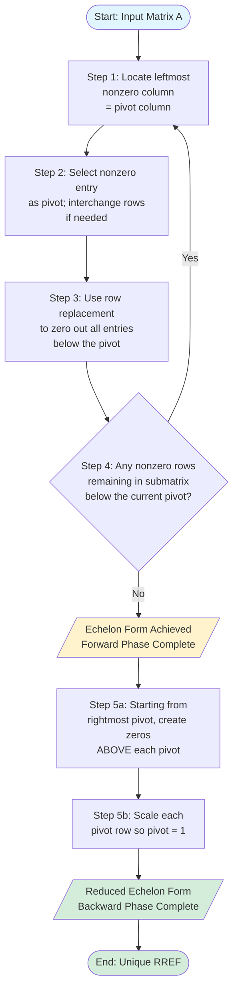
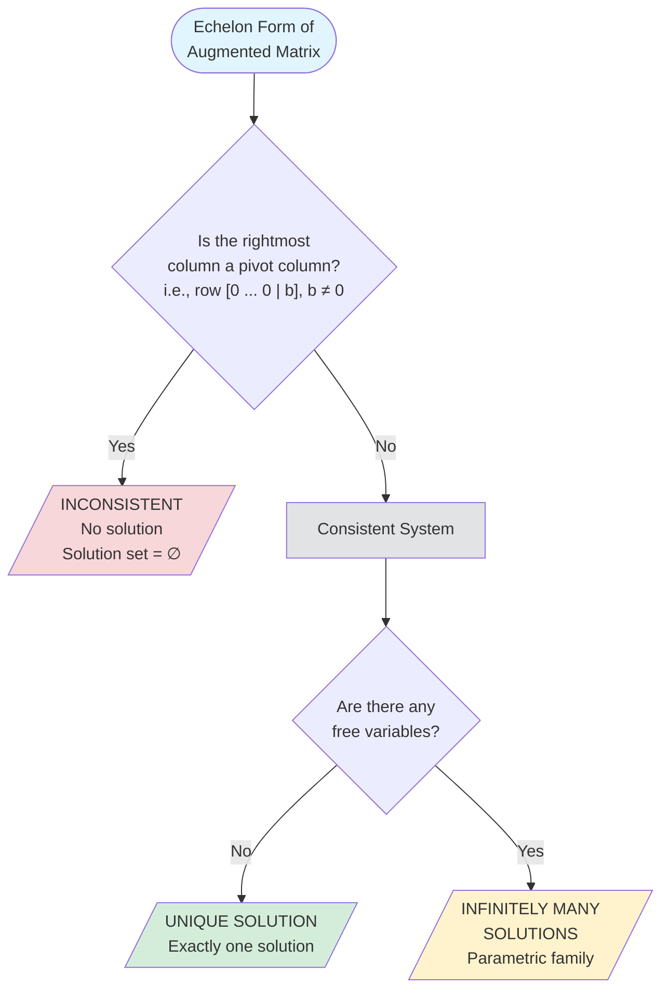

---
tags:
  - CCT3
  - Lin_Algebra
Topic: Lineære ligningssystemer , deres (in)konsistens og løsningsmetoder.
Semester: CCT3
Course: Linær Algebra
Litterature:
  - Linear Algebra and Its Applications, Global Edition, 6ed
Created: 14-09-2026
---
- - -
# Table of Contents

1. [[#1. Introduction|1. Introduction]]
2. [[#2. Systems of Linear Equations|2. Systems of Linear Equations]]
	1. [[#2. Systems of Linear Equations#2.1 Definition of a Linear Equation|2.1 Definition of a Linear Equation]]
	2. [[#2. Systems of Linear Equations#2.2 Systems, Solutions, and Equivalence|2.2 Systems, Solutions, and Equivalence]]
	3. [[#2. Systems of Linear Equations#2.3 Geometric Interpretation|2.3 Geometric Interpretation]]
3. [[#3. Matrix Notation|3. Matrix Notation]]
	1. [[#3. Matrix Notation#3.1 Matrices from Linear Systems|3.1 Matrices from Linear Systems]]
4. [[#4. Solving a Linear System|4. Solving a Linear System]]
	1. [[#4. Solving a Linear System#4.1 The Elimination Strategy|4.1 The Elimination Strategy]]
	2. [[#4. Solving a Linear System#4.2 Elementary Row Operations|4.2 Elementary Row Operations]]
	3. [[#4. Solving a Linear System#4.3 Step-by-Step Elimination Example|4.3 Step-by-Step Elimination Example]]
5. [[#5. Row Reduction and Echelon Forms|5. Row Reduction and Echelon Forms]]
	1. [[#5. Row Reduction and Echelon Forms#5.1 Echelon Form and Reduced Echelon Form|5.1 Echelon Form and Reduced Echelon Form]]
	2. [[#5. Row Reduction and Echelon Forms#5.2 Uniqueness of the Reduced Echelon Form|5.2 Uniqueness of the Reduced Echelon Form]]
	3. [[#5. Row Reduction and Echelon Forms#5.3 Pivot Positions and Pivot Columns|5.3 Pivot Positions and Pivot Columns]]
	4. [[#5. Row Reduction and Echelon Forms#5.4 The Row Reduction Algorithm|5.4 The Row Reduction Algorithm]]
6. [[#6. Solutions of Linear Systems|6. Solutions of Linear Systems]]
	1. [[#6. Solutions of Linear Systems#6.1 Basic and Free Variables|6.1 Basic and Free Variables]]
	2. [[#6. Solutions of Linear Systems#6.2 Parametric Descriptions|6.2 Parametric Descriptions]]
	3. [[#6. Solutions of Linear Systems#6.3 Back-Substitution|6.3 Back-Substitution]]
7. [[#7. Existence and Uniqueness Theorem|7. Existence and Uniqueness Theorem]]
	1. [[#7. Existence and Uniqueness Theorem#Procedure for Solving Any Linear System|Procedure for Solving Any Linear System]]
8. [[#8. Numerical Considerations|8. Numerical Considerations]]
	1. [[#8. Numerical Considerations#8.1 Floating-Point Arithmetic|8.1 Floating-Point Arithmetic]]
	2. [[#8. Numerical Considerations#8.2 Computational Complexity|8.2 Computational Complexity]]
9. [[#9. Solution Verification|9. Solution Verification]]

# Linear Equations in Linear Algebra

| Concept | Notation / Form | Description |
|---|---|---|
| Linear Equation | $a_1x_1 + a_2x_2 + \dots + a_nx_n = b$ | Equation where all variables appear to the first power only |
| Augmented Matrix | $\begin{bmatrix} A & \mathbf{b} \end{bmatrix}$ | Coefficient matrix with constants appended as an extra column |
| Echelon Form (REF) | Staircase pattern of leading entries | Zeros below each leading entry; zero rows at bottom |
| Reduced Echelon Form (RREF) | Leading $1$s isolated in columns | Unique form; leading $1$s are the only nonzero entry in their column |
| Pivot Position | Location of leading $1$ in RREF | Determines basic variables and system structure |
| Basic Variable | Variable in a pivot column | Uniquely determined by the system |
| Free Variable | Variable in a non-pivot column | Acts as a parameter; can take any real value |
| Row Replacement | $R_i \leftarrow R_i + cR_j$ | Add a multiple of one row to another |
| Row Interchange | $R_i \leftrightarrow R_j$ | Swap two rows |
| Row Scaling | $R_i \leftarrow cR_i$, $c \neq 0$ | Multiply a row by a nonzero constant $c$ |
| Consistent System | At least one solution | No row of the form $\begin{bmatrix} 0 & \dots & 0 & b \end{bmatrix}$ with $b \neq 0$ |
| Inconsistent System | No solution | Contains a contradictory row $0 = b$, $b \neq 0$ |
| Flop | Single $+$, $-$, $\times$, or $/$ | Unit of computational cost for floating-point arithmetic |
| $\approx$ | Approximately equal | Used for asymptotic complexity estimates |
| $\sim$ | Row equivalent | Written between matrices $A \sim B$ to mean "$A$ can be transformed into $B$ via a finite sequence of elementary row operations" |

---

## 1. Introduction

Large-scale mathematical models in science, engineering, and business are typically *linear*—formulated and solved as systems of linear equations. The practical importance of linear algebra grows in direct proportion to advances in computing power, making it a foundational subject across diverse disciplines.

> [!info] Interconnection with Computing Power
> Each improvement in hardware and software enables larger computations, creating an ongoing demand for greater capabilities. Computer science is deeply tied to linear algebra through the expansion of parallel processing and large-scale numerical computation.

---

## 2. Systems of Linear Equations

### 2.1 Definition of a Linear Equation

> [!summary] Definition: Linear Equation
> A **linear equation** in the variables $x_1, x_2, \dots, x_n$ is an equation that can be written in the form:
> $$a_1x_1 + a_2x_2 + \dots + a_nx_n = b$$
>
> **Breakdown:**
> - **$x_1, x_2, \dots, x_n$** : The variables (unknowns) of the equation.
> - **$a_1, a_2, \dots, a_n$** : The *coefficients*, real or complex numbers typically known in advance.
> - **$b$** : The constant term on the right-hand side.
> - **$n$** : The number of variables (any positive integer).

In introductory exercises, $n$ typically ranges from $2$ to $5$. In large-scale applied problems, $n$ can be $50$, $5{,}000$, or even larger.

An equation is linear if and only if it can be algebraically rearranged into the standard form above. The presence of variable products, roots, or other non-linear functions of the variables makes an equation non-linear. Note that constants involving non-linear operations (such as $\sqrt{6}$) are perfectly acceptable—what matters is that the *variables themselves* appear only to the first power.

> [!example] Identifying Linear vs. Non-Linear Equations
> **Linear** (rearrangeable into standard form):
> - $4x_1 - 5x_2 + 2 = x_1 \;\implies\; 3x_1 - 5x_2 = -2$
> - $x_2 = 2(\sqrt{6} - x_1) + x_3 \;\implies\; 2x_1 + x_2 - x_3 = 2\sqrt{6}$
>
> **Non-Linear** (cannot be expressed in standard form):
> - $4x_1 - 5x_2 = x_1 x_2$ — contains the variable product $x_1 x_2$
> - $x_2 = 2\sqrt{x_1} - 6$ — contains the non-linear operation $\sqrt{x_1}$ on a variable

### 2.2 Systems, Solutions, and Equivalence

> [!summary] Definition: System of Linear Equations and Solutions
> A **system of linear equations** (or **linear system**) is a collection of one or more linear equations (as defined in [[#2.1 Definition of a Linear Equation]]) involving the same set of variables $x_1, x_2, \dots, x_n$.
>
> - **Solution:** An ordered list $(s_1, s_2, \dots, s_n)$ that makes every equation true when substituted for $x_1, x_2, \dots, x_n$.
> - **Solution Set:** The set of *all* possible solutions.
> - **Equivalent Systems:** Two systems sharing the exact same solution set.

> [!example] Verifying a Solution
> Consider the system:
> $$\begin{aligned} 2x_1 - x_2 + 1.5x_3 &= 8 \\ x_1 - 4x_3 &= -7 \end{aligned}$$
>
> The ordered triple $(5,\; 6.5,\; 3)$ is a solution because:
> - $2(5) - (6.5) + 1.5(3) = 10 - 6.5 + 4.5 = 8$ ✓
> - $5 - 4(3) = 5 - 12 = -7$ ✓

### 2.3 Geometric Interpretation

For a system of two equations in two variables, each equation represents a line in the plane. A solution corresponds to a point lying on *both* lines simultaneously.

> [!example] Intersection of Two Lines
> $$\begin{aligned} x_1 - 2x_2 &= -1 \\ -x_1 + 3x_2 &= 3 \end{aligned}$$
>
> Testing $(3,\, 2)$:
> - Line $1$: $3 - 2(2) = -1$ ✓
> - Line $2$: $-3 + 3(2) = 3$ ✓
>
> The unique intersection point $(3,\, 2)$ is the sole solution.

![[Pasted image 20260914185006.png]]

_Figure 2.1: Two lines intersecting at exactly one point, representing a unique solution._

Two lines in a plane can interact in exactly three ways, corresponding to the three possible outcomes for any linear system:

| Case | Geometric Picture | Number of Solutions |
|---|---|---|
| Single intersection | Lines cross at one point | Exactly one |
| Parallel lines | Same slope, different intercepts | None (no intersection) |
| Coincident lines | Identical lines | Infinitely many |

_Table 2.1: The three geometric possibilities for a two-variable linear system._

> [!example] Parallel Lines (No Solution) and Coincident Lines (Infinitely Many)
> **Parallel (No Solution):**
> $$\begin{aligned} x_1 - 2x_2 &= -1 \\ -x_1 + 2x_2 &= 3 \end{aligned}$$
> Adding both equations yields $0 = 2$, a contradiction. The lines never intersect.
>
> **Coincident (Infinitely Many Solutions):**
> $$\begin{aligned} x_1 - 2x_2 &= -1 \\ -x_1 + 2x_2 &= 1 \end{aligned}$$
> Multiplying the second equation by $-1$ produces the first equation exactly. Both describe the same line.

![[Pasted image 20260914185119.png]]

_Figure 2.2: (a) Parallel lines with no solution. (b) Coincident lines with infinitely many solutions._

> [!summary] Possible Outcomes of a Linear System
> A system of linear equations has exactly one of three outcomes:
> 1. **No solution** (inconsistent)
> 2. **Exactly one solution** (unique)
> 3. **Infinitely many solutions**

> [!info] Definition: Consistency
> - **Consistent:** The system has at least one solution (either unique or infinitely many).
> - **Inconsistent:** The system has no solution at all.
>
> This distinction is formalized in the [[#7. Existence and Uniqueness Theorem]].

> [!warning] Common Pitfall: "No Solution" $\neq$ "$x = 0$" Solution
> A frequent beginner mistake is to conflate an **inconsistent system** (no solution) with a system whose solution happens to be all zeros ($x_1 = x_2 = \dots = 0$).
>
> - **Inconsistent system:** The solution set is **empty** ($\emptyset$). No values of the variables satisfy the equations. Example contradiction: $0 = 2$.
> - **Zero solution:** The solution set contains exactly one element: the tuple $(0, 0, \dots, 0)$. This is a perfectly valid, unique solution.
>
> Substituting $x_i = 0$ into an inconsistent system will *not* make its equations true—the system genuinely has no answer at all.

---

## 3. Matrix Notation

### 3.1 Matrices from Linear Systems

The essential information of a linear system (see [[#2.2 Systems, Solutions, and Equivalence]]) can be recorded compactly in a rectangular array called a **matrix**.

> [!summary] Definition: Matrix and Matrix Size
> An **$m \times n$ matrix** (read "$m$ by $n$") is a rectangular array of numbers with $m$ rows and $n$ columns. The number of rows is always listed first.
>
> - **Coefficient Matrix:** Contains only the variable coefficients, aligned in columns.
> - **Augmented Matrix:** The coefficient matrix with an additional rightmost column containing the constants $b$.

> [!example] Constructing Coefficient and Augmented Matrices
> Given the system:
> $$\begin{aligned} x_1 - 2x_2 + x_3 &= 0 \\ 2x_2 - 8x_3 &= 8 \\ 5x_1 - 5x_3 &= 10 \end{aligned}$$
>
> When a variable is absent from an equation, its coefficient is $0$ (e.g., the second equation is $0x_1 + 2x_2 - 8x_3 = 8$).
>
> **Coefficient Matrix** ($3 \times 3$):
> $$\begin{bmatrix} 1 & -2 & 1 \\ 0 & 2 & -8 \\ 5 & 0 & -5 \end{bmatrix}$$
>
> **Augmented Matrix** ($3 \times 4$):
> $$\begin{bmatrix} 1 & -2 & 1 & 0 \\ 0 & 2 & -8 & 8 \\ 5 & 0 & -5 & 10 \end{bmatrix}$$

---

## 4. Solving a Linear System

### 4.1 The Elimination Strategy

The basic strategy is to transform the original system into an *equivalent* system (same solution set, as defined in [[#2.2 Systems, Solutions, and Equivalence]]) that is simpler to solve, by systematically eliminating variables:

1. Use the $x_1$ term in equation $1$ to eliminate $x_1$ from all subsequent equations.
2. Use the $x_2$ term in equation $2$ to eliminate $x_2$ from the remaining equations.
3. Continue until a triangular system is reached, then solve by back-substitution.

### 4.2 Elementary Row Operations

These three operations, applied to the augmented matrix, correspond directly to valid algebraic manipulations of the equations and never change the solution set.

> [!info] The Three Elementary Row Operations
> 1. **Replacement:** $R_i \leftarrow R_i + cR_j$ — Replace one row with the sum of itself and a multiple of another row.
> 2. **Interchange:** $R_i \leftrightarrow R_j$ — Swap two rows.
> 3. **Scaling:** $R_i \leftarrow cR_i$ — Multiply all entries in a row by a nonzero constant $c$.

> [!warning] Scaling Restriction
> The scaling constant $c$ must be **nonzero**. Multiplying a row by $0$ destroys information and changes the solution set.

Every elementary row operation is **reversible**:
- Interchange: swap the same two rows again.
- Scaling by $c$: scale by $\dfrac{1}{c}$.
- Replacement ($+cR_j$): replace with $-cR_j$.

> [!summary] Definition: Row Equivalence
> Two matrices $A$ and $B$ are **row equivalent**, written $A \sim B$, if a finite sequence of elementary row operations transforms one into the other. The symbol $\sim$ is used between successive matrices in a row-reduction sequence.
>
> **Theorem:** If the augmented matrices of two linear systems are row equivalent, the two systems have the exact same solution set.

### 4.3 Step-by-Step Elimination Example

> [!example] Complete Row Reduction of a $3 \times 4$ Augmented Matrix
> Starting system and augmented matrix:
> $$\begin{aligned} x_1 - 2x_2 + x_3 &= 0 \\ 2x_2 - 8x_3 &= 8 \\ 5x_1 - 5x_3 &= 10 \end{aligned} \qquad \begin{bmatrix} 1 & -2 & 1 & 0 \\ 0 & 2 & -8 & 8 \\ 5 & 0 & -5 & 10 \end{bmatrix}$$
>
> **Step $1$ — Eliminate $x_1$ from Row $3$:** $R_3 \leftarrow R_3 + (-5)R_1$
> $$\sim \begin{bmatrix} 1 & -2 & 1 & 0 \\ 0 & 2 & -8 & 8 \\ 0 & 10 & -10 & 10 \end{bmatrix}$$
>
> **Step $2$ — Scale Row $2$:** $R_2 \leftarrow \frac{1}{2}R_2$
> $$\sim \begin{bmatrix} 1 & -2 & 1 & 0 \\ 0 & 1 & -4 & 4 \\ 0 & 10 & -10 & 10 \end{bmatrix}$$
>
> **Step $3$ — Eliminate $x_2$ from Row $3$:** $R_3 \leftarrow R_3 + (-10)R_2$
> $$\sim \begin{bmatrix} 1 & -2 & 1 & 0 \\ 0 & 1 & -4 & 4 \\ 0 & 0 & 30 & -30 \end{bmatrix}$$
>
> **Step $4$ — Scale Row $3$:** $R_3 \leftarrow \frac{1}{30}R_3$ → triangular form achieved.
> $$\sim \begin{bmatrix} 1 & -2 & 1 & 0 \\ 0 & 1 & -4 & 4 \\ 0 & 0 & 1 & -1 \end{bmatrix}$$
>
> **Step $5$ — Upward elimination:** Clear entries above $x_3$, then above $x_2$.
> $$\sim \begin{bmatrix} 1 & 0 & 0 & 1 \\ 0 & 1 & 0 & 0 \\ 0 & 0 & 1 & -1 \end{bmatrix}$$
>
> **Solution:** $(x_1,\, x_2,\, x_3) = (1,\, 0,\, -1)$.

**Geometric meaning:** In $\mathbb{R}^3$, each equation represents a plane. The solution $(1,\, 0,\, -1)$ is the unique point where all three planes intersect.

![[Pasted image 20260914190015.png]]

_Figure 4.1: Three planes intersecting at the unique solution point $(1,\, 0,\, -1)$._

**Verification** by substituting into the original equations:
$$\begin{aligned} 1(1) - 2(0) + 1(-1) &= 0 \; \checkmark \\ 2(0) - 8(-1) &= 8 \; \checkmark \\ 5(1) - 5(-1) &= 10 \; \checkmark \end{aligned}$$

> [!question] Self-Check
> Why does verifying a solution by substituting back into the *original* equations (rather than the reduced ones) provide a stronger guarantee of correctness?
>
> _Hint: Think about what types of errors each check can catch._

---

## 5. Row Reduction and Echelon Forms

### 5.1 Echelon Form and Reduced Echelon Form

> [!info] Terminology
> - **Nonzero Row/Column:** Contains at least one nonzero entry.
> - **Leading Entry:** The leftmost nonzero entry in a nonzero row.

> [!summary] Definition: Echelon Form (REF)
> A matrix is in **echelon form** if:
> 1. All nonzero rows are above any all-zero rows.
> 2. Each leading entry is in a column strictly to the right of the leading entry above it.
> 3. All entries below a leading entry are zero.

> [!summary] Definition: Reduced Echelon Form (RREF)
> A matrix is in **reduced echelon form** if it satisfies all echelon conditions *plus*:
> 4. Every leading entry equals $1$.
> 5. Each leading $1$ is the *only* nonzero entry in its column.

> [!example] Echelon Form vs. Reduced Echelon Form
> **Echelon Form (not reduced):**
> $$\begin{bmatrix} 2 & -3 & 2 & 1 \\ 0 & 1 & -4 & 8 \\ 0 & 0 & 0 & \frac{5}{2} \end{bmatrix}$$
> Leading entries step down-right and entries below them are zero, but the leading entries are not all $1$, and column $2$ has a nonzero entry ($-3$) above its leading $1$.
>
> **Reduced Echelon Form:**
> $$\begin{bmatrix} 1 & 0 & 0 & 29 \\ 0 & 1 & 0 & 16 \\ 0 & 0 & 1 & 3 \end{bmatrix}$$
> Every leading entry is $1$ and is isolated in its column.

In general matrix patterns, $\blacksquare$ denotes a nonzero leading entry and $*$ denotes an arbitrary entry:

**Echelon Form patterns:**
$$\begin{bmatrix} \blacksquare & * & * & * \\ 0 & \blacksquare & * & * \\ 0 & 0 & 0 & 0 \end{bmatrix} \qquad \begin{bmatrix} 0 & \blacksquare & * & * \\ 0 & 0 & 0 & \blacksquare \\ 0 & 0 & 0 & 0 \end{bmatrix}$$

**Reduced Echelon Form patterns:**
$$\begin{bmatrix} 1 & 0 & * & * \\ 0 & 1 & * & * \\ 0 & 0 & 0 & 0 \end{bmatrix} \qquad \begin{bmatrix} 0 & 1 & * & 0 \\ 0 & 0 & 0 & 1 \\ 0 & 0 & 0 & 0 \end{bmatrix}$$

> [!note] Historical Context
> A similar elimination method was developed by Chinese mathematicians around $250$ B.C. Carl Friedrich Gauss rediscovered it in the nineteenth century, and Wilhelm Jordan popularized the full algorithm in $1888$.

### 5.2 Uniqueness of the Reduced Echelon Form

While a matrix can be reduced to *many* different echelon forms depending on the sequence of row operations, the reduced echelon form is always the same.

> [!summary] Theorem: Uniqueness of the Reduced Echelon Form
> Each matrix is row equivalent to **one and only one** reduced echelon matrix.
>
> **Breakdown:**
> - The forward phase (to echelon form) is not unique—different operation sequences yield different echelon matrices.
> - The backward phase (to RREF) always converges to the same unique result regardless of the path taken.

> [!info] Computational Abbreviations
> - **REF:** (Row) Echelon Form
> - **RREF:** Reduced (Row) Echelon Form

### 5.3 Pivot Positions and Pivot Columns

> [!summary] Definition: Pivot Position and Pivot Column
> - **Pivot Position:** A location in matrix $A$ that corresponds to a leading $1$ in the RREF of $A$.
> - **Pivot Column:** A column of $A$ that contains a pivot position.

Because RREF is unique (see [[#5.2 Uniqueness of the Reduced Echelon Form]]), pivot positions are fixed properties of the original matrix—they do not depend on which sequence of row operations you use.

> [!info] Pivots vs. Original Entries
> A **pivot** is the nonzero value actively used during elimination to create zeros. The numerical values of pivots during intermediate steps (e.g., $3$, $-2$, $-5$) depend on the operations chosen and may differ from the entries that originally occupied those positions in $A$.

> [!example] Locating Pivot Columns via Row Reduction
> Row reduce the matrix:
> $$A = \begin{bmatrix} 0 & 3 & -6 & 4 & 9 \\ 1 & -2 & -1 & 3 & 1 \\ -2 & 3 & 0 & -3 & -1 \\ 1 & 4 & 5 & -9 & -7 \end{bmatrix}$$
>
> **Step $1$:** Interchange $R_1 \leftrightarrow R_4$ to place a nonzero entry at the top of column $1$:
> $$\sim \begin{bmatrix} \mathbf{1} & 4 & 5 & -9 & -7 \\ 1 & -2 & -1 & 3 & 1 \\ -2 & 3 & 0 & -3 & -1 \\ 0 & 3 & -6 & 4 & 9 \end{bmatrix}$$
>
> ![[Pasted image 20260914192449.png]]
>
> _Figure 5.1: Pivot established in row $1$, column $1$._
>
> **Step $2$:** Eliminate below the first pivot ($R_2 \leftarrow R_2 - R_1$, $R_3 \leftarrow R_3 + 2R_1$):
> $$\sim \begin{bmatrix} \mathbf{1} & 4 & 5 & -9 & -7 \\ 0 & \mathbf{-2} & 4 & -6 & -6 \\ 0 & 5 & -10 & 15 & 15 \\ 0 & 3 & -6 & 4 & 9 \end{bmatrix}$$
>
> ![[Pasted image 20260914192538.png]]
>
> _Figure 5.2: Zeros created below the first pivot; second pivot identified in column $2$._
>
> **Step $3$:** Eliminate below the second pivot ($R_3 \leftarrow R_3 + \frac{5}{2}R_2$, $R_4 \leftarrow R_4 + \frac{3}{2}R_2$):
> $$\sim \begin{bmatrix} \mathbf{1} & 4 & 5 & -9 & -7 \\ 0 & \mathbf{-2} & 4 & -6 & -6 \\ 0 & 0 & 0 & 0 & 0 \\ 0 & 0 & 0 & -5 & 0 \end{bmatrix}$$
>
> ![[Pasted image 20260914192616.png]]
>
> _Figure 5.3: Zeros created below the second pivot; column $3$ has no viable pivot._
>
> **Step $4$:** Interchange $R_3 \leftrightarrow R_4$ to move the zero row to the bottom:
> $$\sim \begin{bmatrix} \mathbf{1} & 4 & 5 & -9 & -7 \\ 0 & \mathbf{-2} & 4 & -6 & -6 \\ 0 & 0 & 0 & \mathbf{-5} & 0 \\ 0 & 0 & 0 & 0 & 0 \end{bmatrix}$$
>
> ![[Pasted image 20260914192629.png]]
>
> _Figure 5.4: Matrix in echelon form with three pivots._
>
> **Pivot columns:** Columns $\mathbf{1}$, $\mathbf{2}$, and $\mathbf{4}$ of the original matrix $A$.
>
> ![[Pasted image 20260914192644.png]]
>
> _Figure 5.5: Pivot columns highlighted in the original matrix._

### 5.4 The Row Reduction Algorithm

The algorithm has two phases:

| Phase | Steps | Goal |
|---|---|---|
| **Forward** | $1$–$4$ | Produce echelon form (zeros below pivots) |
| **Backward** | $5$ | Produce reduced echelon form (zeros above pivots, scale to $1$) |

_Table 5.1: The two phases of the row reduction algorithm._

The overall flow of the algorithm is summarized below:

_Figure 5.6: Flowchart of the row reduction algorithm, showing the forward phase (Steps $1$–$4$) and the backward phase (Step $5$)._

**The Five Steps:**

1. **Locate** the leftmost nonzero column (pivot column); the pivot position is at the top.
2. **Select** a nonzero entry in the pivot column as the pivot; interchange rows if needed.
3. **Eliminate** all entries below the pivot using row replacement.
4. **Cover** the pivot row and all rows above it; repeat Steps $1$–$3$ on the remaining submatrix.
5. **Backward phase:** Starting from the rightmost pivot, create zeros above each pivot and scale each pivot to $1$.

> [!example] Full Row Reduction: Forward and Backward Phases
> Reduce to echelon form and then to RREF:
> $$\begin{bmatrix} 0 & 3 & -6 & 6 & 4 & -5 \\ 3 & -7 & 8 & -5 & 8 & 9 \\ 3 & -9 & 12 & -9 & 6 & 15 \end{bmatrix}$$
>
> ![[Pasted image 20260914192821.png]]
>
> _Figure 5.7: Original $3 \times 6$ matrix before reduction._
>
> ---
>
> **Forward Phase:**
>
> **Steps $1$–$2$:** Interchange $R_1 \leftrightarrow R_3$:
> $$\sim \begin{bmatrix} \mathbf{3} & -9 & 12 & -9 & 6 & 15 \\ 3 & -7 & 8 & -5 & 8 & 9 \\ 0 & 3 & -6 & 6 & 4 & -5 \end{bmatrix}$$
>
> ![[Pasted image 20260914192833.png]]
>
> _Figure 5.8: First pivot established after row interchange._
>
> **Step $3$:** $R_2 \leftarrow R_2 - R_1$:
> $$\sim \begin{bmatrix} \mathbf{3} & -9 & 12 & -9 & 6 & 15 \\ 0 & \mathbf{2} & -4 & 4 & 2 & -6 \\ 0 & 3 & -6 & 6 & 4 & -5 \end{bmatrix}$$
>
> ![[Pasted image 20260914192841.png]]
>
> _Figure 5.9: Zeros below the first pivot._
>
> **Step $4$:** Next pivot in column $2$. $R_3 \leftarrow R_3 - \frac{3}{2}R_2$:
> $$\sim \begin{bmatrix} \mathbf{3} & -9 & 12 & -9 & 6 & 15 \\ 0 & \mathbf{2} & -4 & 4 & 2 & -6 \\ 0 & 0 & 0 & 0 & \mathbf{1} & 4 \end{bmatrix}$$
>
> ![[Pasted image 20260914192848.png]]
>
> _Figure 5.10: Second pivot identified in the submatrix._
>
> ![[Pasted image 20260914192903.png]]
>
> _Figure 5.11: Echelon form achieved (forward phase complete)._
>
> ---
>
> **Backward Phase:**
>
> **Step $5$a:** Clear above the rightmost pivot (column $5$). $R_1 \leftarrow R_1 - 6R_3$, $R_2 \leftarrow R_2 - 2R_3$:
> $$\sim \begin{bmatrix} 3 & -9 & 12 & -9 & 0 & -9 \\ 0 & 2 & -4 & 4 & 0 & -14 \\ 0 & 0 & 0 & 0 & 1 & 4 \end{bmatrix}$$
>
> ![[Pasted image 20260914192939.png]]
>
> _Figure 5.12: Entries above the third pivot cleared._
>
> ![[Pasted image 20260914192959.png]]
>
> _Figure 5.13: Matrix after clearing above the rightmost pivot._
>
> **Step $5$b:** Scale $R_2 \leftarrow \frac{1}{2}R_2$:
> $$\sim \begin{bmatrix} 3 & -9 & 12 & -9 & 0 & -9 \\ 0 & \mathbf{1} & -2 & 2 & 0 & -7 \\ 0 & 0 & 0 & 0 & 1 & 4 \end{bmatrix}$$
>
> ![[Pasted image 20260914193012.png]]
>
> _Figure 5.14: Second pivot scaled to $1$._
>
> **Step $5$c:** Clear above the second pivot. $R_1 \leftarrow R_1 + 9R_2$:
> $$\sim \begin{bmatrix} 3 & 0 & -6 & 9 & 0 & -72 \\ 0 & 1 & -2 & 2 & 0 & -7 \\ 0 & 0 & 0 & 0 & 1 & 4 \end{bmatrix}$$
>
> ![[Pasted image 20260914193023.png]]
>
> _Figure 5.15: Entries above the second pivot cleared._
>
> **Step $5$d:** Scale $R_1 \leftarrow \frac{1}{3}R_1$:
> $$\sim \begin{bmatrix} \mathbf{1} & 0 & -2 & 3 & 0 & -24 \\ 0 & \mathbf{1} & -2 & 2 & 0 & -7 \\ 0 & 0 & 0 & 0 & \mathbf{1} & 4 \end{bmatrix}$$
>
> ![[Pasted image 20260914193039.png]]
>
> _Figure 5.16: Unique reduced echelon form (RREF) achieved._

> [!note] Numerical Note: Partial Pivoting
> Computational software selects the entry with the **largest absolute value** in the pivot column as the pivot. This technique, called **partial pivoting**, minimizes roundoff errors in floating-point arithmetic.

---

## 6. Solutions of Linear Systems

### 6.1 Basic and Free Variables

> [!info] Definitions: Basic and Free Variables
> - **Basic Variables:** Variables corresponding to pivot columns (defined in [[#5.3 Pivot Positions and Pivot Columns]]) in the augmented matrix.
> - **Free Variables:** Variables corresponding to non-pivot columns (excluding the rightmost constants column).

When a system is consistent, the RREF isolates each basic variable into exactly one equation, allowing it to be expressed in terms of the free variables.

> [!example] General Solution with One Free Variable
> Given the RREF augmented matrix:
> $$\begin{bmatrix} 1 & 0 & -5 & 1 \\ 0 & 1 & 1 & 4 \\ 0 & 0 & 0 & 0 \end{bmatrix}$$
>
> The corresponding equations are:
> $$\begin{aligned} x_1 - 5x_3 &= 1 \\ x_2 + x_3 &= 4 \\ 0 &= 0 \end{aligned}$$
>
> - **Basic variables:** $x_1,\, x_2$ (pivot columns $1$ and $2$)
> - **Free variable:** $x_3$ (non-pivot column $3$)
>
> Solving for the basic variables:
> $$\begin{cases} x_1 = 1 + 5x_3 \\ x_2 = 4 - x_3 \\ x_3 \text{ is free} \end{cases}$$
>
> Every choice of $x_3 \in \mathbb{R}$ produces a valid solution:
> - $x_3 = 0 \implies (1,\, 4,\, 0)$
> - $x_3 = 1 \implies (6,\, 3,\, 1)$

> [!example] General Solution with Two Free Variables
> Given the echelon form:
> $$\begin{bmatrix} 1 & 6 & 2 & -5 & -2 & -4 \\ 0 & 0 & 2 & -8 & -1 & 3 \\ 0 & 0 & 0 & 0 & 1 & 7 \end{bmatrix}$$
>
> After completing the backward phase to RREF:
> $$\sim \begin{bmatrix} 1 & 6 & 0 & 3 & 0 & 0 \\ 0 & 0 & 1 & -4 & 0 & 5 \\ 0 & 0 & 0 & 0 & 1 & 7 \end{bmatrix}$$
>
> The system ($5$ variables, $6$ columns) becomes:
> $$\begin{aligned} x_1 + 6x_2 + 3x_4 &= 0 \\ x_3 - 4x_4 &= 5 \\ x_5 &= 7 \end{aligned}$$
>
> - **Basic:** $x_1,\, x_3,\, x_5$ (pivot columns $1$, $3$, $5$)
> - **Free:** $x_2,\, x_4$ (non-pivot columns $2$, $4$)
>
> **General solution:**
> $$\begin{cases} x_1 = -6x_2 - 3x_4 \\ x_2 \text{ is free} \\ x_3 = 5 + 4x_4 \\ x_4 \text{ is free} \\ x_5 = 7 \end{cases}$$

### 6.2 Parametric Descriptions

Descriptions expressing basic variables in terms of free variables are called **parametric descriptions**, where free variables act as *parameters*.

> [!info] Conventions
> - **Standard convention:** Always choose the free variables as parameters.
> - **Inconsistent systems:** The solution set is empty ($\emptyset$). No parametric description exists, even if free variables appear during intermediate steps.

### 6.3 Back-Substitution

When a matrix is in echelon form (but not RREF), the system can be solved by **back-substitution**: solve the bottom equation first, then substitute upward.

> [!example] Back-Substitution
> Given the echelon system:
> $$\begin{aligned} x_1 - 7x_2 + 2x_3 - 5x_4 + 8x_5 &= 10 \\ x_2 - 3x_3 + 3x_4 + x_5 &= -5 \\ x_4 - x_5 &= 4 \end{aligned}$$
>
> 1. From equation $3$: $x_4 = 4 + x_5$
> 2. Substitute into equation $2$: $x_2 = -5 + 3x_3 - 3(4 + x_5) - x_5 = -17 + 3x_3 - 4x_5$
> 3. Substitute both into equation $1$ to solve for $x_1$.

> [!tip] RREF vs. Back-Substitution
> Completing the backward phase to RREF (see [[#5.4 The Row Reduction Algorithm]]) requires the same total number of arithmetic operations as back-substitution but significantly reduces manual calculation errors.

> [!question] Self-Check
> A system has the RREF augmented matrix $\begin{bmatrix} 1 & 0 & 3 & 0 & 5 \\ 0 & 1 & -1 & 0 & 2 \\ 0 & 0 & 0 & 1 & -3 \\ 0 & 0 & 0 & 0 & 0 \end{bmatrix}$. Identify the basic variables, the free variables, and write the general solution.

---

## 7. Existence and Uniqueness Theorem

> [!summary] Theorem: Existence and Uniqueness
> A linear system is **consistent** if and only if the rightmost column of the augmented matrix is **not** a pivot column—that is, if and only if no echelon form contains a row of the form:
> $$\begin{bmatrix} 0 & \dots & 0 & b \end{bmatrix} \quad \text{with } b \neq 0$$
>
> If the system is consistent, the solution set contains:
> 1. **A unique solution** when there are no free variables.
> 2. **Infinitely many solutions** when there is at least one free variable.
>
> **Breakdown:**
> - **$\begin{bmatrix} 0 & \dots & 0 & b \end{bmatrix}$, $b \neq 0$:** Represents $0 = b$, an algebraic contradiction indicating no solution exists.
> - **Free variables present:** At least one variable can take any value, generating infinitely many distinct solutions.
> - **No free variables:** Every variable is uniquely fixed by a pivot, yielding exactly one solution.

The theorem can be visualized as a decision tree applied to the echelon form of the augmented matrix:

_Figure 7.1: Decision tree for classifying the solution set of a linear system from its echelon form._

> [!warning] Characteristic of Inconsistency
> An augmented matrix containing a row $\begin{bmatrix} 0 & 0 & \dots & 0 & b \end{bmatrix}$ with $b \neq 0$ immediately signals that the system is **inconsistent**. No further reduction is needed.

> [!example] Detecting an Inconsistent System
> $$\begin{aligned} x_2 - 4x_3 &= 8 \\ 2x_1 - 3x_2 + 2x_3 &= 1 \\ 4x_1 - 8x_2 + 12x_3 &= 1 \end{aligned}$$
>
> Row reducing the augmented matrix:
> $$\begin{bmatrix} 0 & 1 & -4 & 8 \\ 2 & -3 & 2 & 1 \\ 4 & -8 & 12 & 1 \end{bmatrix} \sim \begin{bmatrix} 2 & -3 & 2 & 1 \\ 0 & 1 & -4 & 8 \\ 0 & -2 & 8 & -1 \end{bmatrix} \sim \begin{bmatrix} 2 & -3 & 2 & 1 \\ 0 & 1 & -4 & 8 \\ 0 & 0 & 0 & 15 \end{bmatrix}$$
>
> The last row represents $0 = 15$, a contradiction. The system is **inconsistent**.

### Procedure for Solving Any Linear System

> [!info] Complete Procedure
> 1. Write the augmented matrix.
> 2. **Forward phase:** Reduce to echelon form (see [[#5.4 The Row Reduction Algorithm]]). Check for inconsistency (a row $[0 \dots 0 \mid b]$ with $b \neq 0$). If found, **stop**—no solution.
> 3. **Backward phase:** Continue to RREF.
> 4. Translate back to equations.
> 5. Express each basic variable in terms of the free variables (parametric description, see [[#6.2 Parametric Descriptions]]).

---

## 8. Numerical Considerations

### 8.1 Floating-Point Arithmetic

> [!note] Floating-Point Representation and Roundoff Error
> Computational software represents real numbers as:
> $$\pm\, .d_1 d_2 \dots d_p \times 10^r$$
>
> **Breakdown:**
> - **$\pm$** : Sign of the number.
> - **$.d_1 d_2 \dots d_p$** : The mantissa (significand); $p$ digits of precision (typically $8$–$16$).
> - **$10$** : Decimal base.
> - **$r$** : Integer exponent for order of magnitude.
>
> Because $p$ is finite, arithmetic is subject to **roundoff error** during calculations and when representing numbers like $\frac{1}{3}$ that have no exact finite decimal form.

### 8.2 Computational Complexity

> [!note] Flop Counts for Row Reduction
> A **flop** (floating-point operation) is a single $+$, $-$, $\times$, or $/$ on two real numbers.
>
> For an $n \times (n+1)$ augmented matrix:
>
> **Forward phase (to echelon form):**
> $$\text{Flops} \approx \frac{2}{3}n^3 + \frac{1}{2}n^2 - \frac{7}{6}n \approx \frac{2}{3}n^3$$
>
> **Backward phase (to RREF):**
> $$\text{Flops} \leq n^2$$
>
> **Breakdown:**
> - **$n$** : Number of equations/variables.
> - **$\frac{2}{3}n^3$** : The dominant cubic term; for $n \geq 30$, this accounts for nearly all computation time.
> - **$n^2$** : Quadratic upper bound for the backward phase, which is comparatively inexpensive.

---

## 9. Solution Verification

Always verify solutions by substituting back into the *original* equations.

> [!example] Verifying a Parametric Solution
> Consider the original linear system:
> $$\begin{aligned} x_1 + 2x_2 - x_3 &= 4 \\ 2x_1 + 5x_2 - 3x_3 &= 7 \\ 3x_1 + 7x_2 - 4x_3 &= 11 \end{aligned}$$
>
> **Step $1$ — Row reduce the augmented matrix:**
> $$\begin{bmatrix} 1 & 2 & -1 & 4 \\ 2 & 5 & -3 & 7 \\ 3 & 7 & -4 & 11 \end{bmatrix}$$
>
> Apply $R_2 \leftarrow R_2 - 2R_1$ and $R_3 \leftarrow R_3 - 3R_1$:
> $$\sim \begin{bmatrix} 1 & 2 & -1 & 4 \\ 0 & 1 & -1 & -1 \\ 0 & 1 & -1 & -1 \end{bmatrix}$$
>
> Apply $R_3 \leftarrow R_3 - R_2$:
> $$\sim \begin{bmatrix} 1 & 2 & -1 & 4 \\ 0 & 1 & -1 & -1 \\ 0 & 0 & 0 & 0 \end{bmatrix}$$
>
> Apply $R_1 \leftarrow R_1 - 2R_2$ to obtain RREF:
> $$\sim \begin{bmatrix} 1 & 0 & 1 & 6 \\ 0 & 1 & -1 & -1 \\ 0 & 0 & 0 & 0 \end{bmatrix}$$
>
> **Step $2$ — Extract the parametric solution:**
>
> - **Basic variables:** $x_1,\, x_2$ (pivot columns $1$ and $2$)
> - **Free variable:** $x_3$ (non-pivot column $3$)
>
> $$\begin{cases} x_1 = 6 - x_3 \\ x_2 = -1 + x_3 \\ x_3 \text{ is free} \end{cases}$$
>
> **Step $3$ — Verify by substituting into each original equation, keeping $x_3$ symbolic:**
>
> - **Equation $1$:** $x_1 + 2x_2 - x_3$
> $$(6 - x_3) + 2(-1 + x_3) - x_3 = 6 - x_3 - 2 + 2x_3 - x_3 = 4 \; \checkmark$$
>
> - **Equation $2$:** $2x_1 + 5x_2 - 3x_3$
> $$2(6 - x_3) + 5(-1 + x_3) - 3x_3 = 12 - 2x_3 - 5 + 5x_3 - 3x_3 = 7 \; \checkmark$$
>
> - **Equation $3$:** $3x_1 + 7x_2 - 4x_3$
> $$3(6 - x_3) + 7(-1 + x_3) - 4x_3 = 18 - 3x_3 - 7 + 7x_3 - 4x_3 = 11 \; \checkmark$$
>
> All three equations simplify to their correct constants **for every value of $x_3$**—the $x_3$ terms cancel out completely. This confirms the general solution is valid for all $x_3 \in \mathbb{R}$.

> [!tip] Verification Best Practice
> Substitute the parametric expressions into the *original, unreduced* equations. If every equation simplifies to a true constant statement for **all** values of the free parameters (i.e., the parameter terms cancel out), the solution is confirmed. If parameter terms persist, an error occurred in the row reduction.

> [!important] Why Verification Matters
> Verification is the final safeguard against arithmetic slips. Because every elementary row operation should preserve the solution set, any inconsistency between the parametric solution and the original equations pinpoints a computational error—not a flaw in the method itself.

---

> [!summary] Summary
> **Linear equations** take the form $a_1x_1 + \dots + a_nx_n = b$. A **system** of such equations can be encoded as an **augmented matrix** and solved via **elementary row operations** (replacement, interchange, scaling), which preserve the solution set. Two matrices are **row equivalent** (written $A \sim B$) if a finite sequence of such operations transforms one into the other.
>
> The **row reduction algorithm** transforms any matrix first into **echelon form** (forward phase) and then into the unique **reduced echelon form** (backward phase). **Pivot positions** in the RREF determine **basic variables** (uniquely determined) and **free variables** (arbitrary parameters).
>
> The **Existence and Uniqueness Theorem** states that a system is consistent if and only if the rightmost augmented column is not a pivot column. Consistent systems have either a **unique solution** (no free variables) or **infinitely many solutions** (at least one free variable). A row of the form $[0 \dots 0 \mid b]$ with $b \neq 0$ signals **inconsistency**—which is not the same as "$x = 0$"; an inconsistent system has *no solution at all*.
>
> In practice, computational considerations such as **floating-point roundoff error** and **cubic flop complexity** ($\approx \frac{2}{3}n^3$) govern the feasibility of solving large-scale systems.