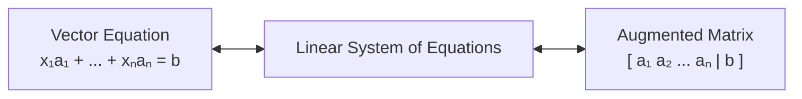
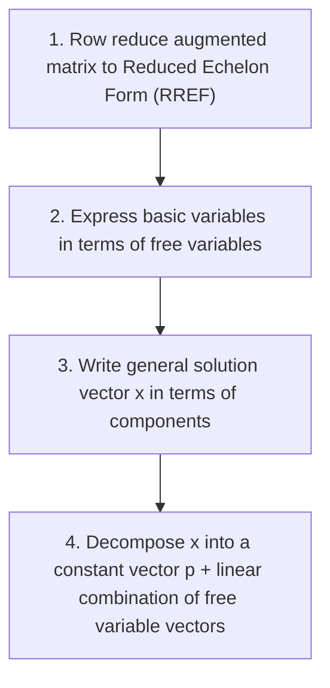

---
tags:
  - CCT3
  - Lin_Algebra
Topic: Linearkombinationer og spænd af vektorer samt matrix-vektorprodukter.
Semester: CCT3
Course: Linær Algebra
Litterature:
  - Linear Algebra and Its Applications, Global Edition, 6ed
Created: 14-09-2026
---
- - -
# Table of Contents

1. [[#Vector Equations, Matrix Equations, and Solution Sets|Vector Equations, Matrix Equations, and Solution Sets]]
	1. [[#Vector Equations, Matrix Equations, and Solution Sets#Vectors in $\mathbb{R}^n$ and Geometric Foundations|Vectors in $\mathbb{R}^n$ and Geometric Foundations]]
		1. [[#Vectors in $\mathbb{R}^n$ and Geometric Foundations#Fundamental Vector Operations|Fundamental Vector Operations]]
		2. [[#Vectors in $\mathbb{R}^n$ and Geometric Foundations#Geometric Interpretations in $\mathbb{R}^2$ and $\mathbb{R}^3$|Geometric Interpretations in $\mathbb{R}^2$ and $\mathbb{R}^3$]]
			1. [[#Geometric Interpretations in $\mathbb{R}^2$ and $\mathbb{R}^3$#Geometric Effects of Scalar Multiplication|Geometric Effects of Scalar Multiplication]]
		3. [[#Vectors in $\mathbb{R}^n$ and Geometric Foundations#Algebraic Properties of $\mathbb{R}^n$|Algebraic Properties of $\mathbb{R}^n$]]
	2. [[#Vector Equations, Matrix Equations, and Solution Sets#Linear Combinations and Vector Equations|Linear Combinations and Vector Equations]]
		1. [[#Linear Combinations and Vector Equations#Equivalence Between Vector Equations and Linear Systems|Equivalence Between Vector Equations and Linear Systems]]
		2. [[#Linear Combinations and Vector Equations#The Span of a Set of Vectors|The Span of a Set of Vectors]]
			1. [[#The Span of a Set of Vectors#Geometric Structure of Spans in $\mathbb{R}^3$:|Geometric Structure of Spans in $\mathbb{R}^3$:]]
		3. [[#Linear Combinations and Vector Equations#Linear Combinations in Applications|Linear Combinations in Applications]]
	3. [[#Vector Equations, Matrix Equations, and Solution Sets#The Matrix Equation $A\mathbf{x} = \mathbf{b}$|The Matrix Equation $A\mathbf{x} = \mathbf{b}$]]
		1. [[#The Matrix Equation $A\mathbf{x} = \mathbf{b}$#Computational Rules for $A\mathbf{x}$|Computational Rules for $A\mathbf{x}$]]
		2. [[#The Matrix Equation $A\mathbf{x} = \mathbf{b}$#Existence of Solutions and Conditions for Spanning $\mathbb{R}^m$|Existence of Solutions and Conditions for Spanning $\mathbb{R}^m$]]
		3. [[#The Matrix Equation $A\mathbf{x} = \mathbf{b}$#Linearity Properties of $A\mathbf{x}$|Linearity Properties of $A\mathbf{x}$]]
	4. [[#Vector Equations, Matrix Equations, and Solution Sets#Solution Sets of Linear Systems|Solution Sets of Linear Systems]]
		1. [[#Solution Sets of Linear Systems#Homogeneous Linear Systems|Homogeneous Linear Systems]]
		2. [[#Solution Sets of Linear Systems#Parametric Vector Form|Parametric Vector Form]]
		3. [[#Solution Sets of Linear Systems#Nonhomogeneous Linear Systems and Geometric Translations|Nonhomogeneous Linear Systems and Geometric Translations]]
		4. [[#Solution Sets of Linear Systems#Procedure: Converting to Parametric Vector Form|Procedure: Converting to Parametric Vector Form]]

# Vector Equations, Matrix Equations, and Solution Sets

| Concept / Notation | Mathematical Form | Description |
| :--- | :--- | :--- |
| **Vector Space** $\mathbb{R}^n$ | $\mathbf{u} \in \mathbb{R}^n$ | The collection of all ordered $n$-tuples of real numbers written as $n \times 1$ column matrices. |
| **Zero Vector** $\mathbf{0}$ | $\mathbf{0} = \begin{bmatrix} 0 \\ 0 \\ \vdots \\ 0 \end{bmatrix}$ | The additive identity in $\mathbb{R}^n$ whose entries are all zero. |
| **Vector Addition** | $\mathbf{u} + \mathbf{v} = \begin{bmatrix} u_1 + v_1 \\ \vdots \\ u_n + v_n \end{bmatrix}$ | Entrywise addition of two vectors of identical dimension. |
| **Scalar Multiplication** | $c\mathbf{u} = \begin{bmatrix} c u_1 \\ \vdots \\ c u_n \end{bmatrix}$ | Multiplying each component of a vector by a real scalar $c$. |
| **Linear Combination** | $\mathbf{y} = c_1\mathbf{v}_1 + \dots + c_p\mathbf{v}_p$ | Sum of scalar multiples of a set of vectors using weights $c_i$. |
| **Span** | $\text{Span}\{\mathbf{v}_1, \dots, \mathbf{v}_p\}$ | The set of all possible linear combinations of $\{\mathbf{v}_1, \dots, \mathbf{v}_p\}$. |
| **Matrix-Vector Product** | $A\mathbf{x} = x_1\mathbf{a}_1 + \dots + x_n\mathbf{a}_n$ | Linear combination of the columns of $A$ weighted by entries of $\mathbf{x}$. |
| **Identity Matrix** $I_n$ | $I_n\mathbf{x} = \mathbf{x}$ | An $n \times n$ matrix with $1$s on the main diagonal and $0$s elsewhere. |
| **Homogeneous System** | $A\mathbf{x} = \mathbf{0}$ | A system with a zero right-hand side; always has the trivial solution $\mathbf{x} = \mathbf{0}$. |
| **Parametric Vector Form** | $\mathbf{x} = \mathbf{p} + t_1\mathbf{v}_1 + \dots + t_k\mathbf{v}_k$ | Explicit vector description of a solution space decomposed into particular and homogeneous parts. |

_Table 1.1: Core vector, matrix, and linear system notations and operations._

---

## Vectors in $\mathbb{R}^n$ and Geometric Foundations

A **vector** is defined as an ordered list of numbers. When represented algebraically, vectors are formatted as column matrices ($n \times 1$ matrices). The set of all vectors containing $n$ real entries is denoted by $\mathbb{R}^n$ (read "_r-n_"), where $\mathbb{R}$ indicates the real number field and $n$ specifies the dimensional space.

>[!info] Definition: Vectors in $\mathbb{R}^2$ and $\mathbb{R}^n$
> An $n$-dimensional column vector $\mathbf{u} \in \mathbb{R}^n$ is written as:
> $$\mathbf{u} = \begin{bmatrix} u_1 \\ u_2 \\ \vdots \\ u_n \end{bmatrix}$$
>
> **Breakdown:**
> - $\mathbb{R}^n$ : The set of all $n \times 1$ column vectors with real entries.
> - $n$ : The dimension of the vector space (number of entries).
> - $\mathbf{u}$ : The column vector.
> - $u_i$ : The $i$-th scalar entry (component) of the vector, where $i \in \{1, 2, \dots, n\}$.

>[!note]
> While vectors are typically defined over the real numbers ($\mathbb{R}$), vector definitions, algebraic properties, and geometric operations remain valid when entries are drawn from the complex field ($\mathbb{C}$).

### Fundamental Vector Operations

1. **Equality:** Two vectors $\mathbf{u}, \mathbf{v} \in \mathbb{R}^n$ are **equal** ($\mathbf{u} = \mathbf{v}$) if and only if their corresponding entries are equal ($u_i = v_i$ for all $i$). Changing the order of entries produces an entirely distinct vector:
   $$\begin{bmatrix} 4 \\ 7 \end{bmatrix} \neq \begin{bmatrix} 7 \\ 4 \end{bmatrix}$$
2. **Vector Addition:** Given $\mathbf{u}, \mathbf{v} \in \mathbb{R}^n$, their sum $\mathbf{u} + \mathbf{v}$ is obtained by adding corresponding entries.
3. **Scalar Multiplication:** Given a vector $\mathbf{u}$ and a real scalar $c \in \mathbb{R}$, the scalar multiple $c\mathbf{u}$ is obtained by multiplying every entry of $\mathbf{u}$ by $c$.

>[!summary] Definition: Vector Addition and Scalar Multiplication
> For $\mathbf{u}, \mathbf{v} \in \mathbb{R}^n$ and $c \in \mathbb{R}$:
> $$\mathbf{u} + \mathbf{v} = \begin{bmatrix} u_1 + v_1 \\ u_2 + v_2 \\ \vdots \\ u_n + v_n \end{bmatrix}, \quad c\mathbf{u} = \begin{bmatrix} c u_1 \\ c u_2 \\ \vdots \\ c u_n \end{bmatrix}$$
>
> **breakdown**:
> - $\mathbf{u}, \mathbf{v}$ : Vectors in $\mathbb{R}^n$ being combined.
> - $c$ : A real scalar multiplier.
> - $\mathbf{u} + \mathbf{v}$ : The resulting vector sum in $\mathbb{R}^n$.
> - $c\mathbf{u}$ : The resulting scaled vector in $\mathbb{R}^n$.

>[!example] Example: Vector Arithmetic in $\mathbb{R}^2$
> Let $\mathbf{u} = \begin{bmatrix} 1 \\ -2 \end{bmatrix}$ and $\mathbf{v} = \begin{bmatrix} 2 \\ -5 \end{bmatrix}$. Compute $4\mathbf{u} + (-3)\mathbf{v}$:
>
> 1. Scale the vectors:
>    $$4\mathbf{u} = 4 \begin{bmatrix} 1 \\ -2 \end{bmatrix} = \begin{bmatrix} 4 \\ -8 \end{bmatrix}, \quad (-3)\mathbf{v} = -3 \begin{bmatrix} 2 \\ -5 \end{bmatrix} = \begin{bmatrix} -6 \\ 15 \end{bmatrix}$$
> 2. Add the resulting components:
>    $$4\mathbf{u} + (-3)\mathbf{v} = \begin{bmatrix} 4 + (-6) \\ -8 + 15 \end{bmatrix} = \begin{bmatrix} -2 \\ 7 \end{bmatrix}$$

>[!note] Distinction Between Column Vectors and Row Matrices
> Compact inline notation such as $(3, -1)$ uses parentheses to denote a column vector $\begin{bmatrix} 3 \\ -1 \end{bmatrix}$. This is distinct from a $1 \times 2$ row matrix $\begin{bmatrix} 3 & -1 \end{bmatrix}$:
> $$\begin{bmatrix} 3 \\ -1 \end{bmatrix} \neq \begin{bmatrix} 3 & -1 \end{bmatrix}$$
> Although their entries are identical, their matrix dimensions ($2 \times 1$ vs. $1 \times 2$) differ.

---

### Geometric Interpretations in $\mathbb{R}^2$ and $\mathbb{R}^3$

In a Cartesian coordinate plane, a vector $\begin{bmatrix} a \\ b \end{bmatrix}$ can be visualized in two equivalent ways:
1. **As a Coordinate Point:** The vector corresponds to the point $(a, b)$ in $\mathbb{R}^2$.
2. **As a Directed Line Segment (Arrow):** The vector corresponds to an arrow starting at the origin $(0, 0)$ and terminating at the point $(a, b)$. The arrow displays both magnitude ($\text{Length} = \sqrt{a^2 + b^2}$) and direction.

![[Pasted image 20260915191904.png]]
_Figure 1.1: Geometric representation of vectors in $\mathbb{R}^2$ as coordinate points._

![[Pasted image 20260915191912.png]]
_Figure 1.2: Geometric representation of vectors as directed line segments (arrows) originating from $(0, 0)$._

>[!summary] Rule: The Parallelogram Rule for Addition
> If $\mathbf{u}$ and $\mathbf{v}$ in $\mathbb{R}^2$ are represented as points, then $\mathbf{u} + \mathbf{v}$ corresponds to the fourth vertex of the parallelogram whose other three vertices are $\mathbf{u}$, $\mathbf{0}$, and $\mathbf{v}$.
>
> **breakdown**:
> - $\mathbf{u}, \mathbf{v}$ : Adjacent vector sides drawn from the origin $\mathbf{0}$.
> - $\mathbf{0}$ : The coordinate origin $(0, 0)$.
> - $\mathbf{u} + \mathbf{v}$ : The terminal vertex corresponding to the diagonal of the parallelogram.

![[Pasted image 20260915192129.png]]
_Figure 1.3: The parallelogram rule for vector addition in $\mathbb{R}^2$._

>[!example] Example: Applying the Parallelogram Rule
> Let $\mathbf{u} = \begin{bmatrix} 2 \\ 2 \end{bmatrix}$ and $\mathbf{v} = \begin{bmatrix} -6 \\ 1 \end{bmatrix}$. 
> 
> The vector sum is:
> $$\mathbf{u} + \mathbf{v} = \begin{bmatrix} 2 + (-6) \\ 2 + 1 \end{bmatrix} = \begin{bmatrix} -4 \\ 3 \end{bmatrix}$$
> 
> The points $(0, 0)$, $(2, 2)$, $(-6, 1)$, and $(-4, 3)$ form the four vertices of a geometric parallelogram in $\mathbb{R}^2$.

![[Pasted image 20260915192149.png]]
_Figure 1.4: Geometric addition of $\mathbf{u} = (2, 2)$ and $\mathbf{v} = (-6, 1)$ yielding $(-4, 3)$._

#### Geometric Effects of Scalar Multiplication

Multiplying a vector $\mathbf{u}$ by a scalar $c$:
- Scales the length of the vector by $|c|$.
- **Preserves direction** if $c > 0$.
- **Reverses direction** ($180^\circ$ inversion) if $c < 0$.
- Traces a continuous straight line passing through the origin $\mathbf{0}$ as $c$ ranges across all real numbers.

![[Pasted image 20260915192216.png]]
_Figure 1.5: Geometric scaling and direction reversal under scalar multiplication._

![[Pasted image 20260915192747.png]]
_Figure 1.6: The set of all scalar multiples of $\mathbf{u}$ forming a $1$-dimensional line passing through the origin in $\mathbb{R}^n$._

---

### Algebraic Properties of $\mathbb{R}^n$

Vector operations in $\mathbb{R}^n$ satisfy eight fundamental axioms inherited from real arithmetic. These properties underpin every result about linear systems discussed later in [[#The Matrix Equation $A\mathbf{x} = \mathbf{b}$]] and [[#Solution Sets of Linear Systems]].

>[!summary] Theorem: Algebraic Properties of $\mathbb{R}^n$
> For all vectors $\mathbf{u}, \mathbf{v}, \mathbf{w} \in \mathbb{R}^n$ and all scalars $c, d \in \mathbb{R}$:
> 1. $\mathbf{u} + \mathbf{v} = \mathbf{v} + \mathbf{u}$ *(Commutativity)*
> 2. $(\mathbf{u} + \mathbf{v}) + \mathbf{w} = \mathbf{u} + (\mathbf{v} + \mathbf{w})$ *(Associativity)*
> 3. $\mathbf{u} + \mathbf{0} = \mathbf{0} + \mathbf{u} = \mathbf{u}$ *(Additive Identity)*
> 4. $\mathbf{u} + (-\mathbf{u}) = -\mathbf{u} + \mathbf{u} = \mathbf{0}$ *(Additive Inverse, where $-\mathbf{u} = (-1)\mathbf{u}$)*
> 5. $c(\mathbf{u} + \mathbf{v}) = c\mathbf{u} + c\mathbf{v}$ *(Distributivity over vector addition)*
> 6. $(c + d)\mathbf{u} = c\mathbf{u} + d\mathbf{u}$ *(Distributivity over scalar addition)*
> 7. $c(d\mathbf{u}) = (cd)\mathbf{u}$ *(Scalar Associativity)*
> 8. $1\mathbf{u} = \mathbf{u}$ *(Multiplicative Identity)*
>
> **breakdown**:
> - $\mathbf{u}, \mathbf{v}, \mathbf{w}$ : Vectors in $\mathbb{R}^n$.
> - $c, d$ : Real scalars ($\in \mathbb{R}$).
> - $\mathbf{0}$ : The $n \times 1$ zero vector containing all zero entries.
> - $-\mathbf{u}$ : The additive inverse of $\mathbf{u}$, defined as $(-1)\mathbf{u}$.

Vector subtraction is formally defined as adding the additive inverse: $\mathbf{u} - \mathbf{v} = \mathbf{u} + (-1)\mathbf{v}$.

![[Pasted image 20260915192846.png]]
_Figure 1.7: Vector subtraction $\mathbf{u} - \mathbf{v}$ illustrated as adding $(-1)\mathbf{v}$ to $\mathbf{u}$._

---

## Linear Combinations and Vector Equations

>[!summary] Definition: Linear Combination
> Given vectors $\mathbf{v}_1, \mathbf{v}_2, \dots, \mathbf{v}_p \in \mathbb{R}^n$ and scalars $c_1, c_2, \dots, c_p \in \mathbb{R}$, the vector $\mathbf{y}$ formed by:
> $$\mathbf{y} = c_1\mathbf{v}_1 + c_2\mathbf{v}_2 + \dots + c_p\mathbf{v}_p$$
> is called a **linear combination** of $\mathbf{v}_1, \dots, \mathbf{v}_p$ with **weights** $c_1, \dots, c_p$.
>
> **breakdown**:
> - $\mathbf{y}$ : The resulting linear combination vector in $\mathbb{R}^n$.
> - $\mathbf{v}_1, \dots, \mathbf{v}_p$ : The collection of given vectors in $\mathbb{R}^n$.
> - $c_1, \dots, c_p$ : The scalar weights applied to each respective vector.

![[Pasted image 20260915192959.png]]
_Figure 2.1: Geometric grid spanned by linear combinations of vectors $\mathbf{v}_1$ and $\mathbf{v}_2$._

### Equivalence Between Vector Equations and Linear Systems

A vector equation can be expanded component-by-component into an ordinary system of linear equations.

>[!info] Equivalence Principle
> The vector equation:
> $$x_1\mathbf{a}_1 + x_2\mathbf{a}_2 + \dots + x_n\mathbf{a}_n = \mathbf{b}$$
> has the exact same solution set as the system of linear equations represented by the augmented matrix:
> $$\begin{bmatrix} \mathbf{a}_1 & \mathbf{a}_2 & \dots & \mathbf{a}_n & \mathbf{b} \end{bmatrix}$$
> A vector $\mathbf{b}$ can be generated as a linear combination of $\mathbf{a}_1, \dots, \mathbf{a}_n$ **if and only if** the associated linear system is consistent.

>[!example] Example: Solving a Vector Equation
> Determine if $\mathbf{b} = \begin{bmatrix} 7 \\ 4 \\ -3 \end{bmatrix}$ is a linear combination of $\mathbf{a}_1 = \begin{bmatrix} 1 \\ -2 \\ -5 \end{bmatrix}$ and $\mathbf{a}_2 = \begin{bmatrix} 2 \\ 5 \\ 6 \end{bmatrix}$.
>
> 1. Set up the vector equation:
>    $$x_1 \begin{bmatrix} 1 \\ -2 \\ -5 \end{bmatrix} + x_2 \begin{bmatrix} 2 \\ 5 \\ 6 \end{bmatrix} = \begin{bmatrix} 7 \\ 4 \\ -3 \end{bmatrix}$$
> 2. Construct and row reduce the augmented matrix:
>    $$\begin{bmatrix} 1 & 2 & 7 \\ -2 & 5 & 4 \\ -5 & 6 & -3 \end{bmatrix} \xrightarrow{R_2 + 2R_1,\; R_3 + 5R_1} \begin{bmatrix} 1 & 2 & 7 \\ 0 & 9 & 18 \\ 0 & 16 & 32 \end{bmatrix} \xrightarrow{\frac{1}{9}R_2} \begin{bmatrix} 1 & 2 & 7 \\ 0 & 1 & 2 \\ 0 & 16 & 32 \end{bmatrix} \xrightarrow{R_1 - 2R_2,\; R_3 - 16R_2} \begin{bmatrix} 1 & 0 & 3 \\ 0 & 1 & 2 \\ 0 & 0 & 0 \end{bmatrix}$$
> 3. Read the weights directly:
>    $$x_1 = 3, \quad x_2 = 2$$
>
> Thus, the system is consistent and $\mathbf{b}$ is expressed as:
> $$3\mathbf{a}_1 + 2\mathbf{a}_2 = \mathbf{b}$$

---

### The Span of a Set of Vectors

>[!summary] Definition: Span
> If $\mathbf{v}_1, \dots, \mathbf{v}_p \in \mathbb{R}^n$, the set of all linear combinations of $\mathbf{v}_1, \dots, \mathbf{v}_p$ is denoted by $\text{Span}\{\mathbf{v}_1, \dots, \mathbf{v}_p\}$:
> $$\text{Span}\{\mathbf{v}_1, \dots, \mathbf{v}_p\} = \{c_1\mathbf{v}_1 + c_2\mathbf{v}_2 + \dots + c_p\mathbf{v}_p \mid c_1, \dots, c_p \in \mathbb{R}\}$$
>
> **breakdown**:
> - $\text{Span}\{\mathbf{v}_1, \dots, \mathbf{v}_p\}$ : The subspace generated by the collection of vectors.
> - $c_i$ : Arbitrary real scalar weights.
> - $\mathbf{v}_i$ : Generating (spanning) vectors in $\mathbb{R}^n$.

Membership questions for $\text{Span}$ reduce directly to consistency questions for a linear system — see [[#Existence of Solutions and Conditions for Spanning $\mathbb{R}^m$]].

#### Geometric Structure of Spans in $\mathbb{R}^3$:
- **$\text{Span}\{\mathbf{v}\}$ (Single Nonzero Vector):** Forms a **line** passing through the origin $\mathbf{0}$ and $\mathbf{v}$.
- **$\text{Span}\{\mathbf{u}, \mathbf{v}\}$ (Two Non-Collinear Vectors):** Forms a **plane** passing through the origin $\mathbf{0}$, containing both $\mathbf{u}$ and $\mathbf{v}$.

![[Pasted image 20260915193139.png]]
_Figure 2.2: $\text{Span}\{\mathbf{v}\}$ visualized as a line passing through the origin in $\mathbb{R}^3$._

![[Pasted image 20260915193149.png]]
_Figure 2.3: $\text{Span}\{\mathbf{u}, \mathbf{v}\}$ visualized as a plane passing through the origin in $\mathbb{R}^3$._

>[!example] Example: Determining Membership in a Span
> Let $\mathbf{a}_1 = \begin{bmatrix} 1 \\ -2 \\ 3 \end{bmatrix}$, $\mathbf{a}_2 = \begin{bmatrix} 5 \\ -13 \\ -3 \end{bmatrix}$, and $\mathbf{b} = \begin{bmatrix} -3 \\ 8 \\ 1 \end{bmatrix}$. Determine if $\mathbf{b} \in \text{Span}\{\mathbf{a}_1, \mathbf{a}_2\}$.
>
> Row reduce the augmented matrix $[\mathbf{a}_1 \; \mathbf{a}_2 \mid \mathbf{b}]$:
> $$\begin{bmatrix} 1 & 5 & -3 \\ -2 & -13 & 8 \\ 3 & -3 & 1 \end{bmatrix} \sim \begin{bmatrix} 1 & 5 & -3 \\ 0 & -3 & 2 \\ 0 & -18 & 10 \end{bmatrix} \sim \begin{bmatrix} 1 & 5 & -3 \\ 0 & -3 & 2 \\ 0 & 0 & -2 \end{bmatrix}$$
> 
> The third row represents $0 = -2$, which is a contradiction (inconsistent). Therefore, $\mathbf{b} \notin \text{Span}\{\mathbf{a}_1, \mathbf{a}_2\}$.

---

### Linear Combinations in Applications

Linear combinations offer a systematic way to allocate multi-category quantities such as production costs distributed across materials, labor, and overhead.

$$\text{Total Cost} = (\text{Number of Units}) \times (\text{Cost per Unit})$$

>[!example] Example: Multi-Category Production Costs
> A company manufactures two products, $B$ and $C$. The costs per dollar of output across materials, labor, and overhead are summarized as vectors:
> $$\mathbf{b} = \begin{bmatrix} 0.45 \\ 0.25 \\ 0.15 \end{bmatrix}, \quad \mathbf{c} = \begin{bmatrix} 0.40 \\ 0.30 \\ 0.15 \end{bmatrix}$$
>
> 1. **Economic Interpretation of $100\mathbf{b}$:**
>    $$100\mathbf{b} = 100 \begin{bmatrix} 0.45 \\ 0.25 \\ 0.15 \end{bmatrix} = \begin{bmatrix} 45 \\ 25 \\ 15 \end{bmatrix}$$
>    This vector represents the specific costs required to produce $\$100$ worth of product $B$: $\$45$ for materials, $\$25$ for labor, and $\$15$ for overhead.
>
> 2. **Total Cost for Combined Production:**
>    If the company produces $x_1$ dollars worth of product $B$ and $x_2$ dollars worth of product $C$, the total categorized cost is given by the linear combination:
>    $$\mathbf{x}_{\text{total}} = x_1\mathbf{b} + x_2\mathbf{c}$$
>
> **Practical Connection:** Asking "given a specific target cost vector $\mathbf{t}$, is there a production plan $(x_1, x_2)$ that achieves it?" is *exactly* a spanning/consistency question. See [[#Existence of Solutions and Conditions for Spanning $\mathbb{R}^m$]] for the general theory that answers this.

---

## The Matrix Equation $A\mathbf{x} = \mathbf{b}$

Matrix-vector multiplication provides a compact representation for [[#Linear Combinations and Vector Equations|linear combinations of column vectors]].

>[!summary] Definition: Product of a Matrix and a Vector
> If $A$ is an $m \times n$ matrix with columns $\mathbf{a}_1, \mathbf{a}_2, \dots, \mathbf{a}_n$, and $\mathbf{x} \in \mathbb{R}^n$, then the product $A\mathbf{x}$ is defined as:
> $$A\mathbf{x} = \begin{bmatrix} \mathbf{a}_1 & \mathbf{a}_2 & \dots & \mathbf{a}_n \end{bmatrix} \begin{bmatrix} x_1 \\ x_2 \\ \vdots \\ x_n \end{bmatrix} = x_1\mathbf{a}_1 + x_2\mathbf{a}_2 + \dots + x_n\mathbf{a}_n$$
>
> **breakdown**:
> - $A$ : An $m \times n$ matrix with $m$ rows and $n$ columns.
> - $\mathbf{a}_j$ : The $j$-th column vector of $A$ ($\mathbf{a}_j \in \mathbb{R}^m$).
> - $\mathbf{x}$ : An $n \times 1$ column vector in $\mathbb{R}^n$.
> - $x_j$ : The scalar entry in $\mathbf{x}$ acting as the weight for column $\mathbf{a}_j$.
> - $A\mathbf{x}$ : The resulting output vector in $\mathbb{R}^m$.

>[!warning] Dimension Compatibility Requirement
> The product $A\mathbf{x}$ is defined **only if** the number of columns in matrix $A$ equals the number of components in vector $\mathbf{x}$. 
> $$\text{Matrix Dimension: } (m \times n) \times \text{Vector Dimension: } (n \times 1) \longrightarrow \text{Output Dimension: } (m \times 1)$$

>[!summary] Theorem: Fundamental Equivalence of Linear Representations
> If $A$ is an $m \times n$ matrix with columns $\mathbf{a}_1, \dots, \mathbf{a}_n$, and $\mathbf{b} \in \mathbb{R}^m$, then:
> 1. The **matrix equation**: $A\mathbf{x} = \mathbf{b}$
> 2. The **vector equation**: $x_1\mathbf{a}_1 + x_2\mathbf{a}_2 + \dots + x_n\mathbf{a}_n = \mathbf{b}$
> 3. The **system of linear equations** with augmented matrix: $\begin{bmatrix} \mathbf{a}_1 & \mathbf{a}_2 & \dots & \mathbf{a}_n & \mathbf{b} \end{bmatrix}$
>
> have identical solution sets.
>
> **breakdown**:
> - $A$ : The coefficient matrix ($m \times n$).
> - $\mathbf{x}$ : The unknown vector of variables ($n \times 1$).
> - $\mathbf{b}$ : The target constant vector ($m \times 1$).

---

### Computational Rules for $A\mathbf{x}$

There are two primary methods for calculating the product $A\mathbf{x}$:

1. **Linear Combination of Columns:**
   $$A\mathbf{x} = x_1\mathbf{a}_1 + x_2\mathbf{a}_2 + \dots + x_n\mathbf{a}_n$$
2. **Row–Vector Rule (Dot Product Method):**
   The $i$-th entry in $A\mathbf{x}$ is computed by multiplying corresponding entries of row $i$ of matrix $A$ and vector $\mathbf{x}$, then summing the products.

>[!example] Example: Computing $A\mathbf{x}$ via the Row–Vector Rule
> Given $A = \begin{bmatrix} 1 & 2 & -1 \\ 0 & -5 & 3 \end{bmatrix}$ and $\mathbf{x} = \begin{bmatrix} 4 \\ 3 \\ 7 \end{bmatrix}$:
> 
> $$A\mathbf{x} = \begin{bmatrix} (1)(4) + (2)(3) + (-1)(7) \\ (0)(4) + (-5)(3) + (3)(7) \end{bmatrix} = \begin{bmatrix} 4 + 6 - 7 \\ 0 - 15 + 21 \end{bmatrix} = \begin{bmatrix} 3 \\ 6 \end{bmatrix}$$

>[!note] The Identity Matrix
> The **identity matrix** $I_n$ is an $n \times n$ square matrix with $1$s along the main diagonal and $0$s elsewhere. For every vector $\mathbf{x} \in \mathbb{R}^n$:
> $$I_n\mathbf{x} = \mathbf{x}$$

>[!note] Numerical Optimization: Memory Layout and Computation Strategy
> Efficient computational execution of $A\mathbf{x}$ depends on how matrix data is stored in contiguous memory:
> - **Column-Major Languages (e.g., Fortran):** Matrix entries are stored column-by-column; algorithms compute $A\mathbf{x}$ as a linear combination of the columns of $A$.
> - **Row-Major Languages (e.g., C):** Matrix entries are stored row-by-row; algorithms compute $A\mathbf{x}$ using the row-vector dot product rule.
>
> Both methods produce identical mathematical results but differ substantially in cache-efficiency for large matrices.

---

### Existence of Solutions and Conditions for Spanning $\mathbb{R}^m$

The equation $A\mathbf{x} = \mathbf{b}$ has a solution **if and only if** $\mathbf{b}$ is a linear combination of the columns of $A$ — that is, $\mathbf{b} \in \text{Span}\{\mathbf{a}_1, \dots, \mathbf{a}_n\}$ (see [[#The Span of a Set of Vectors]]).

![[Pasted image 20260915194651.png]]
_Figure 3.1: The column space $\text{Span}\{\mathbf{a}_1, \mathbf{a}_2, \mathbf{a}_3\}$ forming a plane in $\mathbb{R}^3$, showing non-spanning of the full $3$-dimensional space._

>[!example] Example: Determining Consistency for All Possible $\mathbf{b}$
> Let $A = \begin{bmatrix} 1 & 3 & 4 \\ -4 & 2 & -6 \\ -3 & -2 & -7 \end{bmatrix}$ and $\mathbf{b} = \begin{bmatrix} b_1 \\ b_2 \\ b_3 \end{bmatrix}$. Is $A\mathbf{x} = \mathbf{b}$ consistent for **every** possible $\mathbf{b} \in \mathbb{R}^3$?
>
> 1. Row reduce the augmented matrix, keeping $\mathbf{b}$ symbolic:
>    $$\begin{bmatrix} 1 & 3 & 4 & b_1 \\ -4 & 2 & -6 & b_2 \\ -3 & -2 & -7 & b_3 \end{bmatrix} \sim \begin{bmatrix} 1 & 3 & 4 & b_1 \\ 0 & 14 & 10 & b_2 + 4b_1 \\ 0 & 7 & 5 & b_3 + 3b_1 \end{bmatrix} \sim \begin{bmatrix} 1 & 3 & 4 & b_1 \\ 0 & 14 & 10 & b_2 + 4b_1 \\ 0 & 0 & 0 & b_1 - \tfrac{1}{2}b_2 + b_3 \end{bmatrix}$$
> 2. The last row corresponds to the equation:
>    $$0 = b_1 - \tfrac{1}{2}b_2 + b_3$$
> 3. If $b_1 - \tfrac{1}{2}b_2 + b_3 \neq 0$, the row becomes an inconsistency of the form $\begin{bmatrix} 0 & 0 & 0 & k \end{bmatrix}$ with $k \neq 0$, so no solution exists.
>
> **Conclusion:** $A\mathbf{x} = \mathbf{b}$ is consistent **only** for $\mathbf{b}$ vectors satisfying $b_1 - \tfrac{1}{2}b_2 + b_3 = 0$. Geometrically, this defines a plane through the origin in $\mathbb{R}^3$ — the columns of $A$ span only this $2$-dimensional plane, not the full space. This is why the spanning theorem below requires a pivot in **every** row.

A set of vectors $\{\mathbf{v}_1, \dots, \mathbf{v}_p\}$ in $\mathbb{R}^m$ **spans** $\mathbb{R}^m$ if every vector in $\mathbb{R}^m$ can be written as a linear combination of $\{\mathbf{v}_1, \dots, \mathbf{v}_p\}$; that is, $\text{Span}\{\mathbf{v}_1, \dots, \mathbf{v}_p\} = \mathbb{R}^m$.

>[!summary] Theorem: Logically Equivalent Conditions for Spanning $\mathbb{R}^m$
> Let $A$ be an $m \times n$ matrix. The following statements are logically equivalent:
> a. For each $\mathbf{b} \in \mathbb{R}^m$, the equation $A\mathbf{x} = \mathbf{b}$ has a solution.
> b. Each $\mathbf{b} \in \mathbb{R}^m$ is a linear combination of the columns of $A$.
> c. The columns of $A$ span $\mathbb{R}^m$ (i.e., $\text{Span}\{\mathbf{a}_1, \dots, \mathbf{a}_n\} = \mathbb{R}^m$).
> d. Matrix $A$ has a pivot position in every row.
>
> **breakdown**:
> - $A$ : The $m \times n$ coefficient matrix.
> - $m$ : Row dimension (target space $\mathbb{R}^m$).
> - $n$ : Column dimension (number of spanning vectors).
> - Pivot in every row: Ensures the row echelon form of $A$ contains no zero rows, preventing contradictions of the form $\begin{bmatrix} 0 & 0 & \dots & 0 & d \end{bmatrix}$ where $d \neq 0$.
>
> **proof**:
> The equivalence of (a), (b), and (c) follows directly from the definitions of matrix-vector multiplication and span.
> 
> To show $(a) \iff (d)$: Row reduce the augmented matrix $\begin{bmatrix} A & \mathbf{b} \end{bmatrix}$ to echelon form $\begin{bmatrix} U & \mathbf{d} \end{bmatrix}$.
> - If statement (d) holds, every row in $U$ has a pivot position. Therefore, no pivot can exist in the augmented column $\mathbf{d}$, guaranteeing consistency for any $\mathbf{b}$. Hence, (a) is true.
> - If statement (d) is false, the bottom row of $U$ contains only zeros. Choosing a vector $\mathbf{d}$ with a non-zero bottom entry produces an inconsistent row $\begin{bmatrix} 0 & \dots & 0 & d_m \end{bmatrix}$. Tracing back the row operations yields a vector $\mathbf{b}$ for which $A\mathbf{x} = \mathbf{b}$ has no solution. Hence, (a) is false.

>[!warning] Warning: Coefficient Matrix vs. Augmented Matrix
> The requirement of having a pivot position in every row applies strictly to the **coefficient matrix** $A$, **not** to the augmented matrix $\begin{bmatrix} A & \mathbf{b} \end{bmatrix}$.

---

### Linearity Properties of $A\mathbf{x}$

>[!summary] Theorem: Linearity Properties of Matrix Multiplication
> If $A$ is an $m \times n$ matrix, $\mathbf{u}, \mathbf{v} \in \mathbb{R}^n$, and $c \in \mathbb{R}$, then:
> 1. $A(\mathbf{u} + \mathbf{v}) = A\mathbf{u} + A\mathbf{v}$ *(Additivity)*
> 2. $A(c\mathbf{u}) = c(A\mathbf{u})$ *(Homogeneity)*
>
> **breakdown**:
> - $A$ : An $m \times n$ matrix representing a linear transformation.
> - $\mathbf{u}, \mathbf{v}$ : Vectors in the domain $\mathbb{R}^n$.
> - $c$ : A real scalar multiplier.
>
> **proof**:
> Let $A = \begin{bmatrix} \mathbf{a}_1 & \dots & \mathbf{a}_n \end{bmatrix}$ and $\mathbf{u} = \begin{bmatrix} u_1 \\ \vdots \\ u_n \end{bmatrix}$, $\mathbf{v} = \begin{bmatrix} v_1 \\ \vdots \\ v_n \end{bmatrix}$.
> 
> For property (1):
> $$\begin{aligned}
> A(\mathbf{u} + \mathbf{v}) &= \begin{bmatrix} \mathbf{a}_1 & \dots & \mathbf{a}_n \end{bmatrix} \begin{bmatrix} u_1 + v_1 \\ \vdots \\ u_n + v_n \end{bmatrix} = \sum_{i=1}^n (u_i + v_i)\mathbf{a}_i \\
> &= \sum_{i=1}^n u_i\mathbf{a}_i + \sum_{i=1}^n v_i\mathbf{a}_i = A\mathbf{u} + A\mathbf{v}
> \end{aligned}$$
> 
> For property (2):
> $$A(c\mathbf{u}) = \sum_{i=1}^n (c u_i)\mathbf{a}_i = c \sum_{i=1}^n u_i\mathbf{a}_i = c(A\mathbf{u})$$

---

## Solution Sets of Linear Systems

>[!abstract] Framing: Why Solution Sets Matter Geometrically
> A solution set is not just an algebraic answer — it has a **geometric shape** determined by two factors: whether the system is *consistent* and how many *free variables* it has. This section explores the two great families of linear systems:
> - **Homogeneous systems** ($A\mathbf{x} = \mathbf{0}$): Solution sets always pass through the origin, forming subspaces (points, lines, planes, etc.) rooted at $\mathbf{0}$.
> - **Nonhomogeneous systems** ($A\mathbf{x} = \mathbf{b}$): When consistent, their solution sets are *parallel translations* of the corresponding homogeneous solution set, shifted away from the origin by a particular solution $\mathbf{p}$.
>
> This geometric duality — that every nonhomogeneous solution set is a shifted copy of a homogeneous one — is the central insight of the section. The parametric vector form is the algebraic tool that makes this shift explicit.

### Homogeneous Linear Systems

A linear system is **homogeneous** if it can be written in the form:

$$A\mathbf{x} = \mathbf{0}$$

- **Trivial Solution:** The zero vector $\mathbf{x} = \mathbf{0} \in \mathbb{R}^n$ is always a solution because $A\mathbf{0} = \mathbf{0}$.
- **Nontrivial Solution:** A nonzero vector $\mathbf{x} \neq \mathbf{0}$ that satisfies $A\mathbf{x} = \mathbf{0}$.

![[Pasted image 20260915194941.png]]
_Figure 4.1: The solution set of a homogeneous linear system contains at least the origin (trivial solution)._

>[!info] Existence Criterion for Nontrivial Solutions
> The homogeneous equation $A\mathbf{x} = \mathbf{0}$ has a nontrivial solution **if and only if** the system has at least one **free variable** (i.e., at least one non-pivot column in matrix $A$).

>[!example] Example: Solving a Homogeneous System
> Solve the homogeneous system:
> $$\begin{aligned}
> 3x_1 + 5x_2 - 4x_3 &= 0 \\
> -3x_1 - 2x_2 + 4x_3 &= 0 \\
> 6x_1 + x_2 - 8x_3 &= 0
> \end{aligned}$$
>
> 1. Row reduce the augmented matrix:
>    $$\begin{bmatrix} 3 & 5 & -4 & 0 \\ -3 & -2 & 4 & 0 \\ 6 & 1 & -8 & 0 \end{bmatrix} \sim \begin{bmatrix} 3 & 5 & -4 & 0 \\ 0 & 3 & 0 & 0 \\ 0 & 0 & 0 & 0 \end{bmatrix} \sim \begin{bmatrix} 1 & 0 & -\frac{4}{3} & 0 \\ 0 & 1 & 0 & 0 \\ 0 & 0 & 0 & 0 \end{bmatrix}$$
> 2. Express basic variables in terms of the free variable $x_3$:
>    $$x_1 = \frac{4}{3}x_3, \quad x_2 = 0, \quad x_3 \text{ is free}$$
> 3. Decompose into **parametric vector form**:
>    $$\mathbf{x} = \begin{bmatrix} x_1 \\ x_2 \\ x_3 \end{bmatrix} = \begin{bmatrix} \frac{4}{3}x_3 \\ 0 \\ x_3 \end{bmatrix} = x_3 \begin{bmatrix} \frac{4}{3} \\ 0 \\ 1 \end{bmatrix} = x_3\mathbf{v}$$
>
> The solution set is the line $\text{Span}\{\mathbf{v}\}$ passing through the origin in $\mathbb{R}^3$.

![[Pasted image 20260915195001.png]]
_Figure 4.2: Solution set of $A\mathbf{x} = \mathbf{0}$ with one free variable forming a straight line through the origin._

---

### Parametric Vector Form

Whenever a solution set is described explicitly using decomposed vectors multiplied by free variables (or parameters), the resulting representation is called the **parametric vector form** of the solution set.

>[!info] Definition: Parametric Vector Form
> A solution set is in **parametric vector form** when written as:
> $$\mathbf{x} = \mathbf{p} + t_1\mathbf{v}_1 + t_2\mathbf{v}_2 + \dots + t_k\mathbf{v}_k$$
> where $t_1, t_2, \dots, t_k \in \mathbb{R}$ are arbitrary real parameters.
>
> **breakdown**:
> - $\mathbf{x}$ : The general solution vector of the linear system.
> - $\mathbf{p}$ : A fixed particular solution vector (equals $\mathbf{0}$ for homogeneous systems).
> - $\mathbf{v}_1, \dots, \mathbf{v}_k$ : Fixed direction vectors corresponding to each free variable in the system.
> - $t_1, \dots, t_k$ : Real-valued parameters (formerly the free variables) generating the entire solution space as they vary independently over $\mathbb{R}$.
> - $k$ : The number of free variables (equals the dimension of the solution set).

For homogeneous systems ($\mathbf{p} = \mathbf{0}$), the parametric vector form simplifies to a pure spanning set $\text{Span}\{\mathbf{v}_1, \dots, \mathbf{v}_k\}$.

>[!example] Example: Homogeneous Equation with Two Free Variables
> Describe all solutions of the single equation:
> $$10x_1 - 3x_2 - 2x_3 = 0$$
>
> 1. Solve for the basic variable:
>    $$x_1 = 0.3x_2 + 0.2x_3$$
> 2. Decompose into parametric vector form:
>    $$\mathbf{x} = \begin{bmatrix} 0.3x_2 + 0.2x_3 \\ x_2 \\ x_3 \end{bmatrix} = x_2\begin{bmatrix} 0.3 \\ 1 \\ 0 \end{bmatrix} + x_3\begin{bmatrix} 0.2 \\ 0 \\ 1 \end{bmatrix} = x_2\mathbf{u} + x_3\mathbf{v}$$
>
> The solution set is $\text{Span}\{\mathbf{u}, \mathbf{v}\}$, geometrically a plane through the origin in $\mathbb{R}^3$.

---

### Nonhomogeneous Linear Systems and Geometric Translations

When a nonhomogeneous system $A\mathbf{x} = \mathbf{b}$ has solutions, its solution set is a **geometric translation** of the solution set of the corresponding [[#Homogeneous Linear Systems|homogeneous system]] $A\mathbf{x} = \mathbf{0}$.

![[Pasted image 20260915195046.png]]
_Figure 4.3: Vector addition $\mathbf{v} + \mathbf{p}$ geometrically translating vector $\mathbf{v}$ along $\mathbf{p}$._

>[!summary] Theorem: Solution Set of a Consistent Nonhomogeneous System
> Suppose $A\mathbf{x} = \mathbf{b}$ is consistent and $\mathbf{p}$ is a particular solution ($A\mathbf{p} = \mathbf{b}$). Then the solution set of $A\mathbf{x} = \mathbf{b}$ is the set of all vectors of the form:
> $$\mathbf{w} = \mathbf{p} + \mathbf{v}_h$$
> where $\mathbf{v}_h$ is any solution to the homogeneous equation $A\mathbf{x} = \mathbf{0}$.
>
> **breakdown**:
> - $\mathbf{w}$ : The general solution to $A\mathbf{x} = \mathbf{b}$.
> - $\mathbf{p}$ : A fixed particular solution vector satisfying $A\mathbf{p} = \mathbf{b}$.
> - $\mathbf{v}_h$ : The general solution to the associated homogeneous system $A\mathbf{v}_h = \mathbf{0}$.
>
> **proof**:
> Let $\mathbf{p}$ be a particular solution so that $A\mathbf{p} = \mathbf{b}$. 
> 
> If $\mathbf{w}$ is any solution to $A\mathbf{x} = \mathbf{b}$, define $\mathbf{v}_h = \mathbf{w} - \mathbf{p}$. Applying the [[#Linearity Properties of $A\mathbf{x}$|linearity of matrix multiplication]]:
> $$A\mathbf{v}_h = A(\mathbf{w} - \mathbf{p}) = A\mathbf{w} - A\mathbf{p} = \mathbf{b} - \mathbf{b} = \mathbf{0}$$
> Thus, $\mathbf{v}_h$ is a solution to $A\mathbf{x} = \mathbf{0}$, and $\mathbf{w} = \mathbf{p} + \mathbf{v}_h$. 
> 
> Conversely, for any homogeneous solution $\mathbf{v}_h$:
> $$A(\mathbf{p} + \mathbf{v}_h) = A\mathbf{p} + A\mathbf{v}_h = \mathbf{b} + \mathbf{0} = \mathbf{b}$$
> proving that every vector of the form $\mathbf{p} + \mathbf{v}_h$ solves $A\mathbf{x} = \mathbf{b}$.

![[Pasted image 20260915195119.png]]
_Figure 4.4: The solution line of $A\mathbf{x} = \mathbf{b}$ as a translation of the homogeneous line $A\mathbf{x} = \mathbf{0}$ by particular solution $\mathbf{p}$._

![[Pasted image 20260915195143.png]]
_Figure 4.5: The solution plane of $A\mathbf{x} = \mathbf{b}$ parallel to the homogeneous solution plane $A\mathbf{x} = \mathbf{0}$._

>[!warning] Consistency Precondition
> This theorem applies exclusively to systems $A\mathbf{x} = \mathbf{b}$ that possess at least one solution $\mathbf{p}$. If $A\mathbf{x} = \mathbf{b}$ is inconsistent, its solution set is empty.

---

### Procedure: Converting to Parametric Vector Form

>[!example] Example: Step-by-Step Parametric Form Deconstruction
> Describe the solution set of $A\mathbf{x} = \mathbf{b}$ in parametric vector form, where:
> $$\begin{bmatrix} A & \mathbf{b} \end{bmatrix} = \begin{bmatrix} 3 & 5 & -4 & 7 \\ -3 & -2 & 4 & -1 \\ 6 & 1 & -8 & -4 \end{bmatrix}$$
>
> 1. **Row reduce to reduced echelon form:**
>    $$\begin{bmatrix} 3 & 5 & -4 & 7 \\ -3 & -2 & 4 & -1 \\ 6 & 1 & -8 & -4 \end{bmatrix} \sim \begin{bmatrix} 1 & 0 & -\frac{4}{3} & -1 \\ 0 & 1 & 0 & 2 \\ 0 & 0 & 0 & 0 \end{bmatrix}$$
> 2. **Express basic variables in terms of the free variable $x_3$:**
>    $$\begin{aligned}
>    x_1 &= -1 + \frac{4}{3}x_3 \\
>    x_2 &= 2 \\
>    x_3 &\text{ is free}
>    \end{aligned}$$
> 3. **Decompose the general vector $\mathbf{x}$:**
>    $$\mathbf{x} = \begin{bmatrix} x_1 \\ x_2 \\ x_3 \end{bmatrix} = \begin{bmatrix} -1 + \frac{4}{3}x_3 \\ 2 \\ x_3 \end{bmatrix} = \begin{bmatrix} -1 \\ 2 \\ 0 \end{bmatrix} + x_3 \begin{bmatrix} \frac{4}{3} \\ 0 \\ 1 \end{bmatrix} = \mathbf{p} + x_3\mathbf{v}$$
>
> **Interpretation:** The solution set is a line passing through $\mathbf{p} = \begin{bmatrix} -1 \\ 2 \\ 0 \end{bmatrix}$ parallel to the vector $\mathbf{v} = \begin{bmatrix} \tfrac{4}{3} \\ 0 \\ 1 \end{bmatrix}$.

>[!tip] Verification via Direct Matrix Multiplication
> To verify a parametric solution $\mathbf{x} = \mathbf{p} + t\mathbf{v}$:
> 4. Check that $A\mathbf{p} = \mathbf{b}$ (particular solution validity).
> 5. Check that $A\mathbf{v} = \mathbf{0}$ (homogeneous solution validity).
>
> By linearity: $A(\mathbf{p} + t\mathbf{v}) = A\mathbf{p} + t(A\mathbf{v}) = \mathbf{b} + t(\mathbf{0}) = \mathbf{b}$.

---

> [!summary] Summary: Vector Equations and Linear Systems
> - **Vectors:** Elements of $\mathbb{R}^n$ represented as $n \times 1$ matrices, geometrically visualized as coordinate points or directed line segments from the origin.
> - **Vector Addition and Scaling:** Defined entrywise, satisfying $8$ vector space axioms. Addition follows the geometric Parallelogram Rule.
> - **Linear Combination & Span:** $\text{Span}\{\mathbf{v}_1, \dots, \mathbf{v}_p\}$ is the collection of all possible linear combinations. Spans geometrically represent lines, planes, or hyperplanes passing through the origin $\mathbf{0}$.
> - **Applications:** Linear combinations model real-world quantities such as multi-category production costs, where each vector represents a distinct resource category and target vectors become spanning/consistency questions.
> - **Unified Equivalence:** The matrix equation $A\mathbf{x} = \mathbf{b}$, the vector equation $x_1\mathbf{a}_1 + \dots + x_n\mathbf{a}_n = \mathbf{b}$, and the augmented matrix $\begin{bmatrix} A & \mathbf{b} \end{bmatrix}$ describe the exact same mathematical system.
> - **Computation:** The choice between column-linear-combination and row-vector-dot-product methods depends on hardware memory layout (column-major vs. row-major storage).
> - **Spanning $\mathbb{R}^m$:** Columns of an $m \times n$ matrix $A$ span $\mathbb{R}^m$ if and only if $A$ has a pivot position in every row. When this fails, consistency is restricted to a lower-dimensional subspace of "reachable" targets $\mathbf{b}$.
> - **Homogeneous Systems ($A\mathbf{x} = \mathbf{0}$):** Always have the trivial solution $\mathbf{x} = \mathbf{0}$; possess nontrivial solutions if and only if there is at least one free variable.
> - **Parametric Vector Form:** The explicit representation $\mathbf{x} = \mathbf{p} + t_1\mathbf{v}_1 + \dots + t_k\mathbf{v}_k$ decomposes any solution set into a particular solution plus a spanning set of directions.
> - **Nonhomogeneous Solutions ($A\mathbf{x} = \mathbf{b}$):** When consistent, the solution set forms a translated flat subspace $\mathbf{x} = \mathbf{p} + \mathbf{v}_h$, where $\mathbf{p}$ is a particular solution and $\mathbf{v}_h \in \text{Span}\{\text{homogeneous solutions}\}$ — geometrically, a parallel copy of the homogeneous solution set shifted away from the origin.