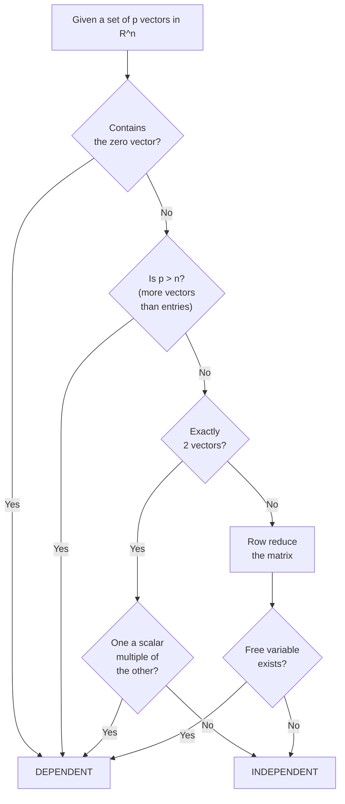
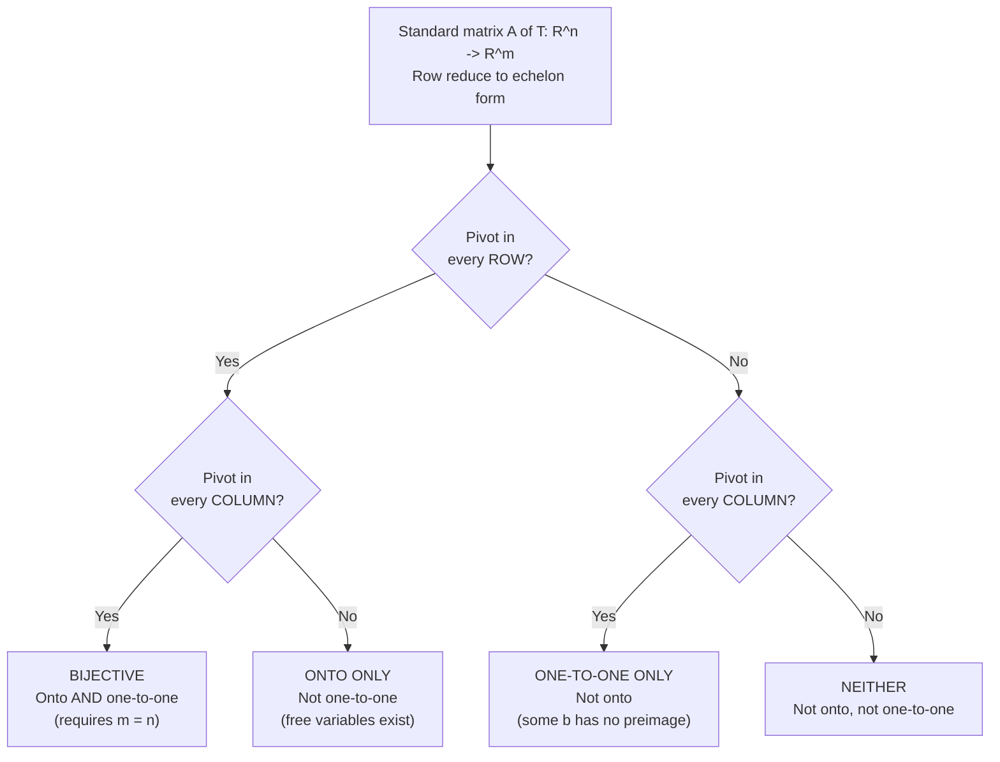

---
tags:
  - CCT3
  - Lin_Algebra
Topic:
Semester: CCT3
Course: Linær Algebra
Litterature:
Created:
---
# Table of Contents

1. [[#Quick Reference|Quick Reference]]
2. [[#1. Linear Independence|1. Linear Independence]]
	1. [[#1. Linear Independence#1.1 Linear Independence of Matrix Columns|1.1 Linear Independence of Matrix Columns]]
	2. [[#1. Linear Independence#1.2 Sets of One or Two Vectors|1.2 Sets of One or Two Vectors]]
	3. [[#1. Linear Independence#1.3 Sets of Two or More Vectors|1.3 Sets of Two or More Vectors]]
	4. [[#1. Linear Independence#1.4 Special Criteria for Linear Dependence|1.4 Special Criteria for Linear Dependence]]
	5. [[#1. Linear Independence#1.5 Decision Flow for Testing Linear Independence|1.5 Decision Flow for Testing Linear Independence]]
3. [[#2. Introduction to Linear Transformations|2. Introduction to Linear Transformations]]
	1. [[#2. Introduction to Linear Transformations#2.1 Definitions: Transformation, Domain, Codomain, and Range|2.1 Definitions: Transformation, Domain, Codomain, and Range]]
	2. [[#2. Introduction to Linear Transformations#2.2 Matrix Transformations|2.2 Matrix Transformations]]
	3. [[#2. Introduction to Linear Transformations#2.3 Geometric Examples of Matrix Transformations|2.3 Geometric Examples of Matrix Transformations]]
	4. [[#2. Introduction to Linear Transformations#2.4 Linear Transformations|2.4 Linear Transformations]]
4. [[#3. The Matrix of a Linear Transformation|3. The Matrix of a Linear Transformation]]
	1. [[#3. The Matrix of a Linear Transformation#3.1 Geometric Transformations of $\mathbb{R}^2$|3.1 Geometric Transformations of $\mathbb{R}^2$]]
	2. [[#3. The Matrix of a Linear Transformation#3.2 Existence and Uniqueness: Onto and One-to-One|3.2 Existence and Uniqueness: Onto and One-to-One]]
	3. [[#3. The Matrix of a Linear Transformation#3.3 Theorems on Onto and One-to-One|3.3 Theorems on Onto and One-to-One]]
	4. [[#3. The Matrix of a Linear Transformation#3.4 Classification Flowchart for Standard Matrices|3.4 Classification Flowchart for Standard Matrices]]
	5. [[#3. The Matrix of a Linear Transformation#3.5 Equivalence Cheat Sheet|3.5 Equivalence Cheat Sheet]]
	6. [[#3. The Matrix of a Linear Transformation#3.6 Geometric Transformations Reference|3.6 Geometric Transformations Reference]]
		1. [[#3.6 Geometric Transformations Reference#Reflections|Reflections]]
		2. [[#3.6 Geometric Transformations Reference#Contractions and Expansions|Contractions and Expansions]]
		3. [[#3.6 Geometric Transformations Reference#Shears|Shears]]
		4. [[#3.6 Geometric Transformations Reference#Projections|Projections]]

# Linear Independence and Linear Transformations

## Quick Reference

| Concept | Notation / Form | Key Idea |
|---|---|---|
| Linear Independence | $x_1\mathbf{v}_1 + \dots + x_p\mathbf{v}_p = \mathbf{0}$ has only $x_i = 0$ | No vector is redundant |
| Linear Dependence | $\exists\; c_1, \dots, c_p$ not all zero s.t. $\sum c_i\mathbf{v}_i = \mathbf{0}$ | At least one vector is a combination of others |
| Trivial Solution | $\mathbf{x} = \mathbf{0}$ | All weights equal zero |
| Linear Dependence Relation | $c_1\mathbf{v}_1 + \dots + c_p\mathbf{v}_p = \mathbf{0},\; c_j \neq 0$ | Certificate of dependence |
| Matrix Column Independence | $A\mathbf{x} = \mathbf{0}$ has only $\mathbf{x} = \mathbf{0}$ | Pivot in every column of $A$ |
| Transformation | $T: \mathbb{R}^n \to \mathbb{R}^m$ | Rule assigning each $\mathbf{x}$ a unique $T(\mathbf{x})$ |
| Matrix Transformation | $T(\mathbf{x}) = A\mathbf{x}$ | Transformation via matrix multiplication |
| Linear Transformation | $T(\mathbf{u}+\mathbf{v}) = T(\mathbf{u})+T(\mathbf{v}),\; T(c\mathbf{u}) = cT(\mathbf{u})$ | Preserves addition and scalar multiplication |
| Standard Matrix | $A = \begin{bmatrix} T(\mathbf{e}_1) & \dots & T(\mathbf{e}_n) \end{bmatrix}$ | Columns are images of standard basis vectors |
| Onto (Surjective) | $\operatorname{Range}(T) = \mathbb{R}^m$ | Pivot in every **row** of $A$ |
| One-to-One (Injective) | $T(\mathbf{x}) = \mathbf{b}$ has at most one solution | Pivot in every **column** of $A$ |
| Superposition Principle | $T\!\left(\sum c_i\mathbf{v}_i\right) = \sum c_i T(\mathbf{v}_i)$ | Linear combination of inputs → same combination of outputs |

---

## 1. Linear Independence

Homogeneous linear systems $A\mathbf{x} = \mathbf{0}$ can be reframed as vector equations, shifting focus from solving for unknowns to analyzing the structural relationships among column vectors.

Consider the homogeneous vector equation:

$$x_1 \begin{bmatrix} 1 \\ 2 \\ 3 \end{bmatrix} + x_2 \begin{bmatrix} 4 \\ 5 \\ 6 \end{bmatrix} + x_3 \begin{bmatrix} 2 \\ 1 \\ 0 \end{bmatrix} = \begin{bmatrix} 0 \\ 0 \\ 0 \end{bmatrix}$$

This equation always admits the ***trivial solution*** $x_1 = x_2 = x_3 = 0$. The fundamental question is whether this is the *only* solution or whether nontrivial solutions exist.

> [!summary] Definition: Linear Independence and Dependence
> An indexed set of vectors $\{\mathbf{v}_1, \dots, \mathbf{v}_p\}$ in $\mathbb{R}^n$ is ***linearly independent*** if the vector equation
> $$x_1\mathbf{v}_1 + x_2\mathbf{v}_2 + \dots + x_p\mathbf{v}_p = \mathbf{0}$$
> has **only** the trivial solution.
>
> The set is ***linearly dependent*** if there exist weights $c_1, \dots, c_p$, *not all zero*, such that
> $$c_1\mathbf{v}_1 + c_2\mathbf{v}_2 + \dots + c_p\mathbf{v}_p = \mathbf{0}$$
>
> **breakdown**:
> - $\{\mathbf{v}_1, \dots, \mathbf{v}_p\}$ : An indexed collection of $p$ vectors in $\mathbb{R}^n$.
> - $x_1, \dots, x_p$ : Scalar unknowns (weights) in the vector equation.
> - $c_1, \dots, c_p$ : Specific scalar weights where at least one $c_j \neq 0$.
> - $\mathbf{0}$ : The zero vector in $\mathbb{R}^n$.

An equation of the form $c_1\mathbf{v}_1 + \dots + c_p\mathbf{v}_p = \mathbf{0}$ with at least one nonzero weight is called a ***linear dependence relation***. By convention, saying "the vectors $\mathbf{v}_1, \dots, \mathbf{v}_p$ are linearly independent" means the set $\{\mathbf{v}_1, \dots, \mathbf{v}_p\}$ is linearly independent.

> [!example] Example: Determining Linear Independence
> Let $\mathbf{v}_1 = \begin{bmatrix} 1 \\ 2 \\ 3 \end{bmatrix}$, $\mathbf{v}_2 = \begin{bmatrix} 4 \\ 5 \\ 6 \end{bmatrix}$, $\mathbf{v}_3 = \begin{bmatrix} 2 \\ 1 \\ 0 \end{bmatrix}$.
>
> **a.** Is $\{\mathbf{v}_1, \mathbf{v}_2, \mathbf{v}_3\}$ linearly independent?
> **b.** If dependent, find a linear dependence relation.
>
> **Solution (Part a):**
> Set up the augmented matrix for $x_1\mathbf{v}_1 + x_2\mathbf{v}_2 + x_3\mathbf{v}_3 = \mathbf{0}$ and row reduce:
> $$\begin{bmatrix} 1 & 4 & 2 & 0 \\ 2 & 5 & 1 & 0 \\ 3 & 6 & 0 & 0 \end{bmatrix} \sim \begin{bmatrix} 1 & 4 & 2 & 0 \\ 0 & -3 & -3 & 0 \\ 0 & 0 & 0 & 0 \end{bmatrix}$$
> Variables $x_1$ and $x_2$ are basic (pivot columns); $x_3$ is free. Each nonzero $x_3$ yields a nontrivial solution, so the vectors are ***linearly dependent***.
>
> **Solution (Part b):**
> Reduce to RREF:
> $$\begin{bmatrix} 1 & 0 & -2 & 0 \\ 0 & 1 & 1 & 0 \\ 0 & 0 & 0 & 0 \end{bmatrix}$$
> This gives $x_1 = 2x_3$, $x_2 = -x_3$, with $x_3$ free. Choosing $x_3 = 5$:
> $$10\mathbf{v}_1 - 5\mathbf{v}_2 + 5\mathbf{v}_3 = \mathbf{0}$$
> This is one of infinitely many valid dependence relations.

---

### 1.1 Linear Independence of Matrix Columns

For a matrix $A = \begin{bmatrix} \mathbf{a}_1 & \mathbf{a}_2 & \dots & \mathbf{a}_n \end{bmatrix}$, the equation $A\mathbf{x} = \mathbf{0}$ expands to:

$$x_1\mathbf{a}_1 + x_2\mathbf{a}_2 + \dots + x_n\mathbf{a}_n = \mathbf{0}$$

Each dependence relation among the columns corresponds directly to a nontrivial solution of $A\mathbf{x} = \mathbf{0}$.

> [!summary] Characterization: Linear Independence of Matrix Columns
> The columns of a matrix $A$ are ***linearly independent*** if and only if $A\mathbf{x} = \mathbf{0}$ has **only** the trivial solution.
>
> **breakdown**:
> - $A = \begin{bmatrix} \mathbf{a}_1 & \dots & \mathbf{a}_n \end{bmatrix}$ : An $m \times n$ matrix with column vectors $\mathbf{a}_i \in \mathbb{R}^m$.
> - $\mathbf{x} \in \mathbb{R}^n$ : Vector of scalar unknowns.
> - $\mathbf{0} \in \mathbb{R}^m$ : The zero vector in the codomain.

> [!example] Example: Testing Matrix Columns for Independence
> Determine if the columns of $A = \begin{bmatrix} 0 & 1 & 4 \\ 1 & 2 & -1 \\ 5 & 8 & 0 \end{bmatrix}$ are linearly independent.
>
> **Solution:**
> Row reduce the augmented matrix:
> $$\begin{bmatrix} 0 & 1 & 4 & 0 \\ 1 & 2 & -1 & 0 \\ 5 & 8 & 0 & 0 \end{bmatrix} \sim \begin{bmatrix} 1 & 2 & -1 & 0 \\ 0 & 1 & 4 & 0 \\ 0 & 0 & 13 & 0 \end{bmatrix}$$
> There is a pivot in every column → no free variables → only the trivial solution. The columns are ***linearly independent***.

> [!tip] Quick Check
> For an $m \times n$ matrix, column independence requires a pivot in every column. This is only possible when $n \leq m$ (at most as many columns as rows). See also [[#1.4 Special Criteria for Linear Dependence]].

---

### 1.2 Sets of One or Two Vectors

**Single vector:** $\{\mathbf{v}\}$ is linearly independent if and only if $\mathbf{v} \neq \mathbf{0}$. The set $\{\mathbf{0}\}$ is always dependent because $x_1\mathbf{0} = \mathbf{0}$ for any $x_1$.

> [!summary] Characterization: Two Vectors
> A set $\{\mathbf{v}_1, \mathbf{v}_2\}$ is ***linearly dependent*** if and only if one vector is a scalar multiple of the other. It is ***linearly independent*** if and only if neither is a scalar multiple of the other.
>
> **breakdown**:
> - Scalar multiple : An equation of the form $\mathbf{v}_1 = c\mathbf{v}_2$ or $\mathbf{v}_2 = c\mathbf{v}_1$ for some scalar $c$.

> [!example] Example: Two-Vector Independence
> **a.** $\mathbf{v}_1 = \begin{bmatrix} 3 \\ 1 \end{bmatrix},\; \mathbf{v}_2 = \begin{bmatrix} 6 \\ 2 \end{bmatrix}$: Since $\mathbf{v}_2 = 2\mathbf{v}_1$, the dependence relation is $-2\mathbf{v}_1 + \mathbf{v}_2 = \mathbf{0}$. ***Dependent.***
>
> **b.** $\mathbf{v}_1 = \begin{bmatrix} 3 \\ 2 \end{bmatrix},\; \mathbf{v}_2 = \begin{bmatrix} 6 \\ 2 \end{bmatrix}$: No scalar $c$ satisfies $\mathbf{v}_1 = c\mathbf{v}_2$ (since $3/6 \neq 2/2$). Only $c = d = 0$ works. ***Independent.***

**Geometric interpretation:** Two vectors are dependent if and only if they are collinear (lie on the same line through the origin). Independent vectors define two distinct directional lines.

![[Pasted image 20260921195909.png]]

_Figure 1.1: Geometric illustration of linearly independent vectors in $\mathbb{R}^2$; the two vectors define distinct directions through the origin._

---

### 1.3 Sets of Two or More Vectors

> [!summary] Theorem: Characterization of Linearly Dependent Sets
> An indexed set $S = \{\mathbf{v}_1, \dots, \mathbf{v}_p\}$ with $p \geq 2$ is ***linearly dependent*** if and only if at least one vector in $S$ is a linear combination of the others. Moreover, if $\mathbf{v}_1 \neq \mathbf{0}$, then some $\mathbf{v}_j$ (with $j > 1$) is a linear combination of the preceding vectors $\mathbf{v}_1, \dots, \mathbf{v}_{j-1}$.
>
> **breakdown**:
> - $S = \{\mathbf{v}_1, \dots, \mathbf{v}_p\}$ : An indexed set of $p \geq 2$ vectors in $\mathbb{R}^n$.
> - $\mathbf{v}_1 \neq \mathbf{0}$ : The first vector is nonzero.
> - $\mathbf{v}_j$ : A specific vector with index $j > 1$.
> - $\mathbf{v}_1, \dots, \mathbf{v}_{j-1}$ : All vectors preceding $\mathbf{v}_j$ in the indexed set.
>
> **proof**:
> *Forward direction:* If $\mathbf{v}_j = c_1\mathbf{v}_1 + \dots + c_{j-1}\mathbf{v}_{j-1}$, rearranging gives a dependence relation with weight $-1$ on $\mathbf{v}_j$:
> $$c_1\mathbf{v}_1 + \dots + c_{j-1}\mathbf{v}_{j-1} + (-1)\mathbf{v}_j + 0\mathbf{v}_{j+1} + \dots + 0\mathbf{v}_p = \mathbf{0}$$
>
> *Reverse direction:* Assume $S$ is dependent with weights $c_1, \dots, c_p$ not all zero. Let $j$ be the largest index with $c_j \neq 0$. If $j = 1$, then $c_1\mathbf{v}_1 = \mathbf{0}$, contradicting $\mathbf{v}_1 \neq \mathbf{0}$. So $j > 1$, and:
> $$\mathbf{v}_j = \left(-\frac{c_1}{c_j}\right)\mathbf{v}_1 + \dots + \left(-\frac{c_{j-1}}{c_j}\right)\mathbf{v}_{j-1}$$

> [!warning] Critical Distinction
> This theorem does **not** say *every* vector in a dependent set is a combination of the others — only that *at least one* must be.

> [!example] Example: Geometric Interpretation in $\mathbb{R}^3$
> Let $\mathbf{u} = \begin{bmatrix} 3 \\ 1 \\ 0 \end{bmatrix}$, $\mathbf{v} = \begin{bmatrix} 1 \\ 6 \\ 0 \end{bmatrix}$. Their span forms the $x_1x_2$-plane. A vector $\mathbf{w}$ lies in $\operatorname{Span}\{\mathbf{u}, \mathbf{v}\}$ if and only if $\{\mathbf{u}, \mathbf{v}, \mathbf{w}\}$ is linearly dependent.
>
> - If $\mathbf{w} \in \operatorname{Span}\{\mathbf{u}, \mathbf{v}\}$, then $\mathbf{w}$ is a combination of $\mathbf{u}$ and $\mathbf{v}$ → dependent.
> - If $\{\mathbf{u}, \mathbf{v}, \mathbf{w}\}$ is dependent, since $\mathbf{u} \neq \mathbf{0}$ and $\mathbf{v}$ is not a multiple of $\mathbf{u}$, the "redundant" vector must be $\mathbf{w}$ → $\mathbf{w} \in \operatorname{Span}\{\mathbf{u}, \mathbf{v}\}$.

![[Pasted image 20260921201651.png]]

_Figure 1.2: Linear dependence in $\mathbb{R}^3$; the vector $\mathbf{w}$ lies in the plane spanned by $\mathbf{u}$ and $\mathbf{v}$._

---

### 1.4 Special Criteria for Linear Dependence

Two quick tests allow determination of dependence without row reduction:

> [!summary] Theorem: More Vectors Than Entries
> Any set $\{\mathbf{v}_1, \dots, \mathbf{v}_p\}$ in $\mathbb{R}^n$ is ***linearly dependent*** if $p > n$.
>
> **breakdown**:
> - $p$ : Number of vectors in the set.
> - $n$ : Number of entries per vector (dimension of $\mathbb{R}^n$).
> - $A = \begin{bmatrix} \mathbf{v}_1 & \dots & \mathbf{v}_p \end{bmatrix}$ : The $n \times p$ matrix formed with the vectors as columns; having more columns than rows guarantees at least one free variable.
>
> **proof**:
> $A\mathbf{x} = \mathbf{0}$ is a system of $n$ equations in $p$ unknowns. If $p > n$, there are more variables than equations, so at least one free variable exists → nontrivial solutions → dependent.

![[Pasted image 20260921201811.png]]

_Figure 1.3: When $p > n$, the columns of the matrix must be linearly dependent because there are more unknowns than equations._

> [!warning] Limitation
> This test only applies when $p > n$. It gives no information when $p \leq n$.

> [!summary] Theorem: Sets Containing the Zero Vector
> If $S = \{\mathbf{v}_1, \dots, \mathbf{v}_p\}$ contains $\mathbf{0}$, then $S$ is ***linearly dependent***.
>
> **breakdown**:
> - $\mathbf{0} \in S$ : The zero vector is a member of the set.
>
> **proof**:
> Reorder so $\mathbf{v}_1 = \mathbf{0}$. Then $1 \cdot \mathbf{v}_1 + 0 \cdot \mathbf{v}_2 + \dots + 0 \cdot \mathbf{v}_p = \mathbf{0}$ with a nonzero weight ($c_1 = 1$).

> [!tip] Inspection Shortcuts for Dependence
> Before performing row reduction, always check these fast criteria in order. Any one of them **immediately** proves dependence:
>
> 1. **Zero-vector test:** Does the set contain $\mathbf{0}$? → dependent.
> 2. **Count test:** Is $p > n$ (more vectors than entries)? → dependent.
> 3. **Scalar-multiple test** (two-vector sets only): Is one vector a scalar multiple of the other? → dependent.
> 4. **Row reduction:** If none of the above apply, row reduce and check for a free variable.

> [!example] Example: Dependence by Inspection
> **a.** $\left\{ \begin{bmatrix} 1 \\ 7 \\ 6 \end{bmatrix}, \begin{bmatrix} 2 \\ 0 \\ 9 \end{bmatrix}, \begin{bmatrix} 3 \\ 1 \\ 5 \end{bmatrix}, \begin{bmatrix} 4 \\ 1 \\ 8 \end{bmatrix} \right\}$: $p = 4 > n = 3$ → ***dependent***.
>
> **b.** $\left\{ \begin{bmatrix} 2 \\ 3 \\ 5 \end{bmatrix}, \begin{bmatrix} 0 \\ 0 \\ 0 \end{bmatrix}, \begin{bmatrix} 1 \\ 1 \\ 8 \end{bmatrix} \right\}$: Contains $\mathbf{0}$ → ***dependent***.
>
> **c.** $\left\{ \begin{bmatrix} 2 \\ 4 \\ 6 \\ 10 \end{bmatrix}, \begin{bmatrix} 3 \\ 6 \\ 9 \\ 15 \end{bmatrix} \right\}$: $\frac{3}{2}\begin{bmatrix} 2 \\ 4 \\ 6 \\ 10 \end{bmatrix} = \begin{bmatrix} 3 \\ 6 \\ 9 \\ 15 \end{bmatrix}$ → scalar multiples → ***dependent***.

![[Pasted image 20260921201837.png]]

_Figure 1.4: A linearly dependent set in $\mathbb{R}^2$; three vectors in a two-dimensional space must be dependent._

### 1.5 Decision Flow for Testing Linear Independence

The following flowchart consolidates the inspection shortcuts and formal tests into a single decision procedure.

_Figure 1.5: Decision flowchart for determining whether a set of vectors is linearly independent or dependent._

> [!question] Self-Check
> Is the set $\left\{ \begin{bmatrix} 1 \\ 0 \end{bmatrix}, \begin{bmatrix} 0 \\ 1 \end{bmatrix} \right\}$ linearly independent? What about $\left\{ \begin{bmatrix} 1 \\ 0 \end{bmatrix}, \begin{bmatrix} 0 \\ 1 \end{bmatrix}, \begin{bmatrix} 1 \\ 1 \end{bmatrix} \right\}$?

---

## 2. Introduction to Linear Transformations

The matrix equation $A\mathbf{x} = \mathbf{b}$ can be viewed dynamically: the matrix $A$ acts as an operator that transforms an input vector $\mathbf{x} \in \mathbb{R}^n$ into an output vector $A\mathbf{x} \in \mathbb{R}^m$. Solving $A\mathbf{x} = \mathbf{b}$ then means finding all inputs that $A$ maps to the target $\mathbf{b}$.

> [!abstract] Analogy: The "Well-Behaved Machine"
> Think of a linear transformation $T$ as a **machine** that consumes a vector and produces a vector — with two very strict manners:
>
> 1. **Distributes over inputs:** If you feed the machine a *combination* of ingredients ($\mathbf{u} + \mathbf{v}$), you get exactly the same result as feeding each ingredient separately and combining the outputs afterward.
> 2. **Respects scaling:** If you feed the machine *three times* as much ingredient, you get *three times* as much output — never five times, never a squared amount.
>
> This "well-behavedness" is what makes linear algebra tractable: knowing what the machine does to a small set of inputs (the standard basis vectors) tells you what it does to *every* possible input. Nonlinear machines have no such guarantee.

> [!example] Example: Matrix Multiplication as an Action
> Let $A = \begin{bmatrix} 4 & -3 & 1 & 3 \\ 2 & 0 & 5 & 1 \end{bmatrix}$.
>
> - $A\begin{bmatrix} 1 \\ 1 \\ 1 \\ 1 \end{bmatrix} = \begin{bmatrix} 5 \\ 8 \end{bmatrix} = \mathbf{b}$ — transforms $\mathbf{x}$ into a nonzero vector.
> - $A\begin{bmatrix} 1 \\ 4 \\ -1 \\ 3 \end{bmatrix} = \begin{bmatrix} 0 \\ 0 \end{bmatrix} = \mathbf{0}$ — transforms $\mathbf{u}$ into the zero vector.

![[Pasted image 20260921202038.png]]

_Figure 2.1: Matrix multiplication as an action transforming input vectors from $\mathbb{R}^4$ to output vectors in $\mathbb{R}^2$._

---

### 2.1 Definitions: Transformation, Domain, Codomain, and Range

> [!summary] Definition: Transformation (Mapping)
> A ***transformation*** $T$ from $\mathbb{R}^n$ to $\mathbb{R}^m$ is a rule assigning to each $\mathbf{x} \in \mathbb{R}^n$ a unique vector $T(\mathbf{x}) \in \mathbb{R}^m$.
> $$T: \mathbb{R}^n \to \mathbb{R}^m$$
>
> **breakdown**:
> - $T$ : The transformation function.
> - $\mathbb{R}^n$ : The ***domain*** — set of all valid inputs.
> - $\mathbb{R}^m$ : The ***codomain*** — space containing all potential outputs.
> - $T(\mathbf{x})$ : The ***image*** of $\mathbf{x}$ under $T$.
> - $\operatorname{Range}(T)$ : The set of all actual images $\{T(\mathbf{x}) : \mathbf{x} \in \mathbb{R}^n\}$, a subset of the codomain. See [[#3.2 Existence and Uniqueness Onto and One-to-One]] for how the range relates to surjectivity.

![[Pasted image 20260921202119.png]]

_Figure 2.2: Transforming vectors via matrix multiplication from domain to codomain._

![[Pasted image 20260921202129.png]]

_Figure 2.3: Relationship between domain $\mathbb{R}^n$, codomain $\mathbb{R}^m$, and range of $T$._

---

### 2.2 Matrix Transformations

A ***matrix transformation*** computes its output via $T(\mathbf{x}) = A\mathbf{x}$. For an $m \times n$ matrix $A$: the domain is $\mathbb{R}^n$, the codomain is $\mathbb{R}^m$, and the range is $\operatorname{Col}(A)$ (all linear combinations of columns of $A$).

> [!example] Example: Computing Images and Preimages
> Let $T: \mathbb{R}^2 \to \mathbb{R}^3$ with $T(\mathbf{x}) = A\mathbf{x}$, where $A = \begin{bmatrix} 1 & -3 \\ 3 & 5 \\ -1 & 7 \end{bmatrix}$.
>
> **a.** $T\!\left(\begin{bmatrix} 2 \\ -1 \end{bmatrix}\right) = \begin{bmatrix} 5 \\ 1 \\ -9 \end{bmatrix}$.
>
> **b.** To find $\mathbf{x}$ with $T(\mathbf{x}) = \begin{bmatrix} 3 \\ 2 \\ -5 \end{bmatrix}$, row reduce:
> $$\begin{bmatrix} 1 & -3 & 3 \\ 3 & 5 & 2 \\ -1 & 7 & -5 \end{bmatrix} \sim \begin{bmatrix} 1 & 0 & 1.5 \\ 0 & 1 & -0.5 \\ 0 & 0 & 0 \end{bmatrix}$$
> Unique solution: $\mathbf{x} = \begin{bmatrix} 1.5 \\ -0.5 \end{bmatrix}$.
>
> **c.** No free variables → exactly one preimage for $\mathbf{b}$.
>
> **d.** For $\mathbf{c} = \begin{bmatrix} 3 \\ 2 \\ 5 \end{bmatrix}$, row reduction yields a row $[0\; 0\; {-35}]$ → inconsistent → $\mathbf{c}$ is ***not*** in the range of $T$.

![[Pasted image 20260921202732.png]]

_Figure 2.4: The input vector $\mathbf{u}$ mapped to its image $T(\mathbf{u})$ under the transformation._

**Existence and Uniqueness in transformation language:**
- *Uniqueness:* "Is $\mathbf{b}$ the image of a unique $\mathbf{x}$?" ↔ Does $A\mathbf{x} = \mathbf{b}$ have at most one solution? (No free variables.) See [[#1.1 Linear Independence of Matrix Columns]].
- *Existence:* "Is $\mathbf{c}$ in the range?" ↔ Is $A\mathbf{x} = \mathbf{c}$ consistent? (No contradictory row.)

---

### 2.3 Geometric Examples of Matrix Transformations

> [!example] Example: Projection onto the $x_1x_2$-Plane
> $A = \begin{bmatrix} 1 & 0 & 0 \\ 0 & 1 & 0 \\ 0 & 0 & 0 \end{bmatrix}$ maps $\begin{bmatrix} x_1 \\ x_2 \\ x_3 \end{bmatrix} \mapsto \begin{bmatrix} x_1 \\ x_2 \\ 0 \end{bmatrix}$, collapsing the third coordinate.

![[Pasted image 20260921203135.png]]

_Figure 2.5: A projection transformation collapsing $\mathbb{R}^3$ onto the $x_1x_2$-plane._

> [!example] Example: Shear Transformation
> $A = \begin{bmatrix} 1 & 2 \\ 0 & 1 \end{bmatrix}$ shifts points horizontally in proportion to their height ($x_2$), deforming a square into a parallelogram while holding the $x_1$-axis fixed.
> - $\begin{bmatrix} 0 \\ 2 \end{bmatrix} \mapsto \begin{bmatrix} 4 \\ 2 \end{bmatrix}$
> - $\begin{bmatrix} 2 \\ 2 \end{bmatrix} \mapsto \begin{bmatrix} 6 \\ 2 \end{bmatrix}$

![[Pasted image 20260921203206.png]]

_Figure 2.6: A shear transformation deforming a square into a parallelogram._

---

### 2.4 Linear Transformations

Matrix multiplication satisfies $A(\mathbf{u} + \mathbf{v}) = A\mathbf{u} + A\mathbf{v}$ and $A(c\mathbf{u}) = c(A\mathbf{u})$. These two properties define the class of ***linear transformations***.

> [!summary] Definition: Linear Transformation
> A transformation $T$ is ***linear*** if for all $\mathbf{u}, \mathbf{v}$ in the domain and all scalars $c$:
> 1. $T(\mathbf{u} + \mathbf{v}) = T(\mathbf{u}) + T(\mathbf{v})$ (preserves addition)
> 2. $T(c\mathbf{u}) = cT(\mathbf{u})$ (preserves scalar multiplication)
>
> **breakdown**:
> - Condition 1 : The image of a sum equals the sum of the images.
> - Condition 2 : Scaling the input scales the output by the same factor.

**Core consequences of linearity:**

1. $T(\mathbf{0}) = \mathbf{0}$ (since $T(\mathbf{0}) = T(0 \cdot \mathbf{u}) = 0 \cdot T(\mathbf{u}) = \mathbf{0}$)
2. $T(c\mathbf{u} + d\mathbf{v}) = cT(\mathbf{u}) + dT(\mathbf{v})$
3. **Superposition Principle:** $T(c_1\mathbf{v}_1 + \dots + c_p\mathbf{v}_p) = c_1T(\mathbf{v}_1) + \dots + c_pT(\mathbf{v}_p)$

> [!info] The Superposition Principle
> In engineering and physics, if inputs $\mathbf{v}_1, \dots, \mathbf{v}_p$ produce responses $T(\mathbf{v}_1), \dots, T(\mathbf{v}_p)$, then a combined input produces the corresponding combined response. This is the foundation for analyzing linear systems.

> [!example] Example: Dilation ($r = 3$) — Proof of Linearity
> Let $T(\mathbf{x}) = 3\mathbf{x}$. For $\mathbf{u}, \mathbf{v} \in \mathbb{R}^2$ and scalars $c, d$:
> $$T(c\mathbf{u} + d\mathbf{v}) = 3(c\mathbf{u} + d\mathbf{v}) = 3c\mathbf{u} + 3d\mathbf{v} = c(3\mathbf{u}) + d(3\mathbf{v}) = cT(\mathbf{u}) + dT(\mathbf{v})$$
> $T$ is linear. When $0 \leq r \leq 1$, $T$ is a ***contraction***; when $r > 1$, a ***dilation***.

![[Pasted image 20260921203829.png]]

_Figure 2.7: A dilation transformation scaling all vectors by a factor of $r > 1$._

> [!example] Example: $90^\circ$ Counterclockwise Rotation
> $T(\mathbf{x}) = \begin{bmatrix} 0 & -1 \\ 1 & 0 \end{bmatrix}\mathbf{x}$. Verifying additivity:
> - $T\!\left(\begin{bmatrix} 4 \\ 1 \end{bmatrix}\right) = \begin{bmatrix} -1 \\ 4 \end{bmatrix}$,  $T\!\left(\begin{bmatrix} 2 \\ 3 \end{bmatrix}\right) = \begin{bmatrix} -3 \\ 2 \end{bmatrix}$
> - $T\!\left(\begin{bmatrix} 6 \\ 4 \end{bmatrix}\right) = \begin{bmatrix} -4 \\ 6 \end{bmatrix} = \begin{bmatrix} -1 \\ 4 \end{bmatrix} + \begin{bmatrix} -3 \\ 2 \end{bmatrix}$ ✓

![[Pasted image 20260921203848.png]]

_Figure 2.8: A $90^\circ$ counterclockwise rotation preserving the parallelogram structure._

> [!example] Example: Production Costing (Applied)
> A company produces products $B$ and $C$ with unit cost matrix $U = \begin{bmatrix} 0.45 & 0.40 \\ 0.25 & 0.30 \\ 0.15 & 0.15 \end{bmatrix}$ (rows: materials, labor, overhead). The transformation $T(\mathbf{x}) = U\mathbf{x}$ maps production levels to total costs. Linearity means:
> - Scaling production by $k$ scales costs by $k$.
> - Combined production costs equal the sum of individual costs.

---

## 3. The Matrix of a Linear Transformation

Every linear transformation $T: \mathbb{R}^n \to \mathbb{R}^m$ is a matrix transformation. The key insight is that $T$ is completely determined by its action on the columns of the identity matrix $I_n$.

Any $\mathbf{x} \in \mathbb{R}^n$ decomposes as $\mathbf{x} = x_1\mathbf{e}_1 + \dots + x_n\mathbf{e}_n$, so by linearity:

$$T(\mathbf{x}) = x_1T(\mathbf{e}_1) + \dots + x_nT(\mathbf{e}_n) = \begin{bmatrix} T(\mathbf{e}_1) & \dots & T(\mathbf{e}_n) \end{bmatrix}\mathbf{x}$$

![[Pasted image 20260921204515.png]]

_Figure 3.1: The standard basis vectors $\mathbf{e}_1$ and $\mathbf{e}_2$ of the $2 \times 2$ identity matrix._

> [!summary] Theorem: The Standard Matrix
> Let $T: \mathbb{R}^n \to \mathbb{R}^m$ be linear. There exists a unique $m \times n$ matrix $A$ such that $T(\mathbf{x}) = A\mathbf{x}$ for all $\mathbf{x}$, where:
> $$A = \begin{bmatrix} T(\mathbf{e}_1) & T(\mathbf{e}_2) & \dots & T(\mathbf{e}_n) \end{bmatrix}$$
>
> **breakdown**:
> - $\mathbf{e}_j$ : The $j$th standard basis vector (column $j$ of $I_n$).
> - $T(\mathbf{e}_j)$ : The image of $\mathbf{e}_j$, forming column $j$ of $A$.
> - $A$ : The ***standard matrix*** for $T$.
>
> **proof**:
> $\mathbf{x} = I_n\mathbf{x} = x_1\mathbf{e}_1 + \dots + x_n\mathbf{e}_n$. By linearity:
> $$T(\mathbf{x}) = x_1T(\mathbf{e}_1) + \dots + x_nT(\mathbf{e}_n) = \begin{bmatrix} T(\mathbf{e}_1) & \dots & T(\mathbf{e}_n) \end{bmatrix}\begin{bmatrix} x_1 \\ \vdots \\ x_n \end{bmatrix} = A\mathbf{x}$$
> Uniqueness follows because the columns of $A$ are fixed by $T(\mathbf{e}_1), \dots, T(\mathbf{e}_n)$.

> [!question] Self-Check
> Suppose $T: \mathbb{R}^3 \to \mathbb{R}^2$ satisfies $T(\mathbf{e}_1) = \begin{bmatrix} 1 \\ 2 \end{bmatrix}$, $T(\mathbf{e}_2) = \begin{bmatrix} 0 \\ -1 \end{bmatrix}$, $T(\mathbf{e}_3) = \begin{bmatrix} 3 \\ 4 \end{bmatrix}$. Can you write down the standard matrix $A$ without any computation? What are its dimensions?

> [!example] Example: Standard Matrix of a Dilation ($r = 3$)
> $T(\mathbf{e}_1) = \begin{bmatrix} 3 \\ 0 \end{bmatrix}$,  $T(\mathbf{e}_2) = \begin{bmatrix} 0 \\ 3 \end{bmatrix}$ → $A = \begin{bmatrix} 3 & 0 \\ 0 & 3 \end{bmatrix}$.

![[Pasted image 20260921204538.png]]

_Figure 3.2: The standard matrix of a dilation by factor $3$, scaling both basis vectors uniformly._

> [!example] Example: Standard Matrix of a Rotation by Angle $\varphi$
> $\mathbf{e}_1$ rotates to $\begin{bmatrix} \cos\varphi \\ \sin\varphi \end{bmatrix}$; $\mathbf{e}_2$ rotates to $\begin{bmatrix} -\sin\varphi \\ \cos\varphi \end{bmatrix}$.
> $$A = \begin{bmatrix} \cos\varphi & -\sin\varphi \\ \sin\varphi & \cos\varphi \end{bmatrix}$$

![[Pasted image 20260921204553.png]]

_Figure 3.3: Deriving the rotation matrix by tracking the images of $\mathbf{e}_1$ and $\mathbf{e}_2$ through angle $\varphi$._

---

### 3.1 Geometric Transformations of $\mathbb{R}^2$

A linear transformation in $\mathbb{R}^2$ is fully visualized by how it deforms the unit square (vertices at $(0,0)$, $(1,0)$, $(0,1)$, $(1,1)$) into a parallelogram defined by $T(\mathbf{e}_1)$ and $T(\mathbf{e}_2)$.

![[Pasted image 20260921204620.png]]

_Figure 3.4: The unit square in $\mathbb{R}^2$, the reference shape for visualizing geometric transformations._

> [!info] Composition of Transformations
> Applying one linear transformation after another yields a ***composition***, which is itself linear and representable by a single standard matrix (the product of the individual matrices). If $T_1(\mathbf{x}) = A_1\mathbf{x}$ and $T_2(\mathbf{x}) = A_2\mathbf{x}$, then the composition $T_2 \circ T_1$ (apply $T_1$ first, then $T_2$) has standard matrix $A_2 A_1$.

> [!example] Example: Composing a Rotation and a Reflection
> Let $T_1$ be a $90^\circ$ counterclockwise rotation, and let $T_2$ be a reflection through the $x_1$-axis. Their standard matrices are:
> $$A_1 = \begin{bmatrix} 0 & -1 \\ 1 & 0 \end{bmatrix}, \qquad A_2 = \begin{bmatrix} 1 & 0 \\ 0 & -1 \end{bmatrix}$$
>
> The composition "rotate first, then reflect" is $T_2 \circ T_1$, with standard matrix:
> $$A_2 A_1 = \begin{bmatrix} 1 & 0 \\ 0 & -1 \end{bmatrix} \begin{bmatrix} 0 & -1 \\ 1 & 0 \end{bmatrix} = \begin{bmatrix} 0 & -1 \\ -1 & 0 \end{bmatrix}$$
>
> **Verify on $\mathbf{e}_1$:** $T_1(\mathbf{e}_1) = \begin{bmatrix} 0 \\ 1 \end{bmatrix}$, then $T_2\!\left(\begin{bmatrix} 0 \\ 1 \end{bmatrix}\right) = \begin{bmatrix} 0 \\ -1 \end{bmatrix}$, matching column 1 of $A_2 A_1$. ✓
>
> **Order matters:** Reversing the order gives $A_1 A_2 = \begin{bmatrix} 0 & 1 \\ 1 & 0 \end{bmatrix}$ — a *different* transformation (in fact, this is reflection through the line $x_2 = x_1$).

---

### 3.2 Existence and Uniqueness: Onto and One-to-One

> [!summary] Definition: Onto (Surjective)
> $T: \mathbb{R}^n \to \mathbb{R}^m$ is ***onto*** $\mathbb{R}^m$ if every $\mathbf{b} \in \mathbb{R}^m$ is the image of at least one $\mathbf{x} \in \mathbb{R}^n$. Equivalently, $\operatorname{Range}(T) = \mathbb{R}^m$.
>
> **breakdown**:
> - This is an **existence** question: does a preimage exist for every target?
> - Related to the concept of range introduced in [[#2.1 Definitions Transformation Domain Codomain and Range]].

![[Pasted image 20260921204709.png]]

_Figure 3.5: Visualizing whether the range of $T$ covers the entire codomain $\mathbb{R}^m$._

> [!summary] Definition: One-to-One (Injective)
> $T: \mathbb{R}^n \to \mathbb{R}^m$ is ***one-to-one*** if each $\mathbf{b} \in \mathbb{R}^m$ is the image of *at most one* $\mathbf{x} \in \mathbb{R}^n$.
>
> **breakdown**:
> - This is a **uniqueness** question: does each output come from a single input?
> - Directly connects to the linear independence of matrix columns; see [[#1.1 Linear Independence of Matrix Columns]].

> [!example] Example: Onto and One-to-One from a Matrix
> $T: \mathbb{R}^4 \to \mathbb{R}^3$ with $A = \begin{bmatrix} 1 & -4 & 8 & 1 \\ 0 & 2 & -1 & 3 \\ 0 & 0 & 0 & 5 \end{bmatrix}$.
>
> - **Onto?** Pivot in every row ($3$ pivots, $3$ rows) → consistent for all $\mathbf{b}$ → ***onto***.
> - **One-to-one?** $4$ variables, $3$ pivots → $x_3$ is free → multiple solutions → ***not one-to-one***.

---

### 3.3 Theorems on Onto and One-to-One

> [!summary] Theorem: One-to-One Characterization
> $T: \mathbb{R}^n \to \mathbb{R}^m$ is ***one-to-one*** if and only if $T(\mathbf{x}) = \mathbf{0}$ has only the trivial solution.
>
> **breakdown**:
> - $T(\mathbf{x}) = \mathbf{0}$ : The homogeneous equation for the transformation.
>
> **proof**:
> - *Forward:* If $T$ is one-to-one, $\mathbf{0}$ has at most one preimage. Since $T(\mathbf{0}) = \mathbf{0}$, it must be the only one.
> - *Reverse:* If $T$ is not one-to-one, there exist $\mathbf{u} \neq \mathbf{v}$ with $T(\mathbf{u}) = T(\mathbf{v})$. Then $T(\mathbf{u} - \mathbf{v}) = \mathbf{0}$ with $\mathbf{u} - \mathbf{v} \neq \mathbf{0}$ → nontrivial solution.

![[Pasted image 20260921204835.png]]

_Figure 3.10: A one-to-one mapping ensures each output $\mathbf{b}$ has at most one preimage._

> [!summary] Theorem: Standard Matrix Criteria
> Let $A$ be the standard matrix for $T: \mathbb{R}^n \to \mathbb{R}^m$.
> 1. $T$ is ***onto*** $\mathbb{R}^m$ $\iff$ columns of $A$ span $\mathbb{R}^m$ $\iff$ pivot in every **row**.
> 2. $T$ is ***one-to-one*** $\iff$ columns of $A$ are linearly independent $\iff$ pivot in every **column**.
>
> **breakdown**:
> - Span condition : $A\mathbf{x} = \mathbf{b}$ is consistent for all $\mathbf{b}$. Links to the onto definition in [[#3.2 Existence and Uniqueness Onto and One-to-One]].
> - Independence condition : $A\mathbf{x} = \mathbf{0}$ has only the trivial solution. Links to [[#1.1 Linear Independence of Matrix Columns]].
>
> **proof**:
> - *Onto:* Columns span $\mathbb{R}^m$ ↔ $A\mathbf{x} = \mathbf{b}$ is consistent for all $\mathbf{b}$ ↔ every $\mathbf{b}$ has a preimage.
> - *One-to-one:* $T(\mathbf{x}) = \mathbf{0}$ ↔ $A\mathbf{x} = \mathbf{0}$. One-to-one ↔ only trivial solution ↔ columns independent.

> [!question] Self-Check
> If $T: \mathbb{R}^2 \to \mathbb{R}^3$, can $T$ possibly be onto $\mathbb{R}^3$? Can it be one-to-one? Think about how many pivots the standard matrix $A$ can have relative to its number of rows and columns.

> [!example] Example: Testing from an Algebraic Formula
> $T(x_1, x_2) = (3x_1 + x_2,\; 5x_1 + 7x_2,\; x_1 + 3x_2)$, so $A = \begin{bmatrix} 3 & 1 \\ 5 & 7 \\ 1 & 3 \end{bmatrix}$.
>
> - **One-to-one?** Columns are not scalar multiples → independent → ***one-to-one***.
> - **Onto?** $A$ is $3 \times 2$: at most $2$ pivots, but $3$ rows need pivots → ***not onto*** $\mathbb{R}^3$.

![[Pasted image 20260921204910.png]]

_Figure 3.11: The transformation $T: \mathbb{R}^2 \to \mathbb{R}^3$ cannot be onto because its range is at most a $2$-dimensional subspace of $\mathbb{R}^3$._

### 3.4 Classification Flowchart for Standard Matrices

The following flowchart consolidates the pivot analysis of §3.3 into a single decision procedure for classifying any linear transformation from its standard matrix.

_Figure 3.12: Decision flowchart for classifying a linear transformation $T$ as onto, one-to-one, both (bijective), or neither, based on the pivot structure of its standard matrix $A$._

### 3.5 Equivalence Cheat Sheet

The following table synthesizes the four equivalent ways to state onto and one-to-one properties — arguably the most important synthesis in the entire chapter.

| Property | Transformation View | Range / Span View | Homogeneous System View | Pivot View |
|:---|:---|:---|:---|:---|
| **One-to-One** | $T(\mathbf{x}) = \mathbf{b}$ has at most one solution for every $\mathbf{b}$ | Columns of $A$ are linearly independent | $A\mathbf{x} = \mathbf{0}$ has only the trivial solution | Pivot in every **column** of $A$ |
| **Onto** | $T(\mathbf{x}) = \mathbf{b}$ has at least one solution for every $\mathbf{b}$ | Columns of $A$ span $\mathbb{R}^m$ | $A\mathbf{x} = \mathbf{b}$ is consistent for every $\mathbf{b} \in \mathbb{R}^m$ | Pivot in every **row** of $A$ |
| **Bijective** (both) | $T(\mathbf{x}) = \mathbf{b}$ has exactly one solution for every $\mathbf{b}$ | Columns of $A$ form a basis for $\mathbb{R}^m$ | $A\mathbf{x} = \mathbf{b}$ has a unique solution for every $\mathbf{b}$ | Pivot in every row **and** every column (requires $m = n$) |

_Table 3.5: The four equivalent characterizations of one-to-one, onto, and bijective linear transformations. Any column can be used to prove or disprove the property in the corresponding row._

---

### 3.6 Geometric Transformations Reference

#### Reflections

| Transformation | Effect on Basis Vectors | Standard Matrix |
|:---|:---|:---|
| Through $x_1$-axis | $\mathbf{e}_1 \mapsto \begin{bmatrix} 1 \\ 0 \end{bmatrix},\; \mathbf{e}_2 \mapsto \begin{bmatrix} 0 \\ -1 \end{bmatrix}$ | $\begin{bmatrix} 1 & 0 \\ 0 & -1 \end{bmatrix}$ |
| Through $x_2$-axis | $\mathbf{e}_1 \mapsto \begin{bmatrix} -1 \\ 0 \end{bmatrix},\; \mathbf{e}_2 \mapsto \begin{bmatrix} 0 \\ 1 \end{bmatrix}$ | $\begin{bmatrix} -1 & 0 \\ 0 & 1 \end{bmatrix}$ |
| Through $x_2 = x_1$ | $\mathbf{e}_1 \mapsto \begin{bmatrix} 0 \\ 1 \end{bmatrix},\; \mathbf{e}_2 \mapsto \begin{bmatrix} 1 \\ 0 \end{bmatrix}$ | $\begin{bmatrix} 0 & 1 \\ 1 & 0 \end{bmatrix}$ |
| Through $x_2 = -x_1$ | $\mathbf{e}_1 \mapsto \begin{bmatrix} 0 \\ -1 \end{bmatrix},\; \mathbf{e}_2 \mapsto \begin{bmatrix} -1 \\ 0 \end{bmatrix}$ | $\begin{bmatrix} 0 & -1 \\ -1 & 0 \end{bmatrix}$ |
| Through origin | $\mathbf{e}_1 \mapsto \begin{bmatrix} -1 \\ 0 \end{bmatrix},\; \mathbf{e}_2 \mapsto \begin{bmatrix} 0 \\ -1 \end{bmatrix}$ | $\begin{bmatrix} -1 & 0 \\ 0 & -1 \end{bmatrix}$ |

_Table 3.1: Standard matrices for reflection transformations in $\mathbb{R}^2$. All reflections are both one-to-one and onto._

![[Pasted image 20260921204730.png]]

_Figure 3.6: Visual summary of reflection transformations in $\mathbb{R}^2$._

#### Contractions and Expansions

| Transformation | Condition | Standard Matrix |
|:---|:---|:---|
| Horizontal | $0 < k < 1$ (contraction), $k > 1$ (expansion) | $\begin{bmatrix} k & 0 \\ 0 & 1 \end{bmatrix}$ |
| Vertical | $0 < k < 1$ (contraction), $k > 1$ (expansion) | $\begin{bmatrix} 1 & 0 \\ 0 & k \end{bmatrix}$ |

_Table 3.2: Standard matrices for contraction and expansion transformations. Both one-to-one and onto for $k > 0$._

![[Pasted image 20260921204742.png]]

_Figure 3.7: Contraction and expansion transformations scaling along a single axis._

#### Shears

| Transformation | Effect | Standard Matrix |
|:---|:---|:---|
| Horizontal | Shifts proportional to $x_2$ | $\begin{bmatrix} 1 & k \\ 0 & 1 \end{bmatrix}$ |
| Vertical | Shifts proportional to $x_1$ | $\begin{bmatrix} 1 & 0 \\ k & 1 \end{bmatrix}$ |

_Table 3.3: Standard matrices for shear transformations. Both one-to-one and onto._

![[Pasted image 20260921204747.png]]

_Figure 3.8: Shear transformations displacing points parallel to one axis._

#### Projections

| Transformation | Effect | Standard Matrix |
|:---|:---|:---|
| Onto $x_1$-axis | $\begin{bmatrix} x_1 \\ x_2 \end{bmatrix} \mapsto \begin{bmatrix} x_1 \\ 0 \end{bmatrix}$ | $\begin{bmatrix} 1 & 0 \\ 0 & 0 \end{bmatrix}$ |
| Onto $x_2$-axis | $\begin{bmatrix} x_1 \\ x_2 \end{bmatrix} \mapsto \begin{bmatrix} 0 \\ x_2 \end{bmatrix}$ | $\begin{bmatrix} 0 & 0 \\ 0 & 1 \end{bmatrix}$ |

_Table 3.4: Standard matrices for projection transformations. Neither one-to-one nor onto $\mathbb{R}^2$._

![[Pasted image 20260921204753.png]]

_Figure 3.9: Projection transformations collapsing one dimension, losing information._

---

> [!summary] Summary
> **Linear Independence** characterizes whether a set of vectors contains redundancy. A set is independent if the only way to form the zero vector as a linear combination is with all-zero weights. Key tests include: row reduction (pivot in every column), the $p > n$ rule (more vectors than entries guarantees dependence), and the zero-vector test. For two vectors, dependence is equivalent to one being a scalar multiple of the other.
>
> **Linear Transformations** reframe matrix multiplication as a dynamic mapping $T(\mathbf{x}) = A\mathbf{x}$ from a domain to a codomain. A linear transformation behaves like a "well-behaved machine" that distributes over addition and respects scaling, leading to the superposition principle. Every linear transformation has a unique ***standard matrix*** $A = \begin{bmatrix} T(\mathbf{e}_1) & \dots & T(\mathbf{e}_n) \end{bmatrix}$ constructed from the images of the standard basis vectors. Composing transformations corresponds to multiplying their standard matrices, with the order of multiplication reflecting the order of application.
>
> **Onto and One-to-One** properties translate existence and uniqueness questions into pivot analysis: onto requires a pivot in every row (columns span the codomain), and one-to-one requires a pivot in every column (columns are linearly independent). The equivalence cheat sheet (Table 3.5) synthesizes these into four interchangeable characterizations. Geometric transformations — reflections, rotations, shears, projections, dilations — provide concrete visualizations of these abstract concepts.