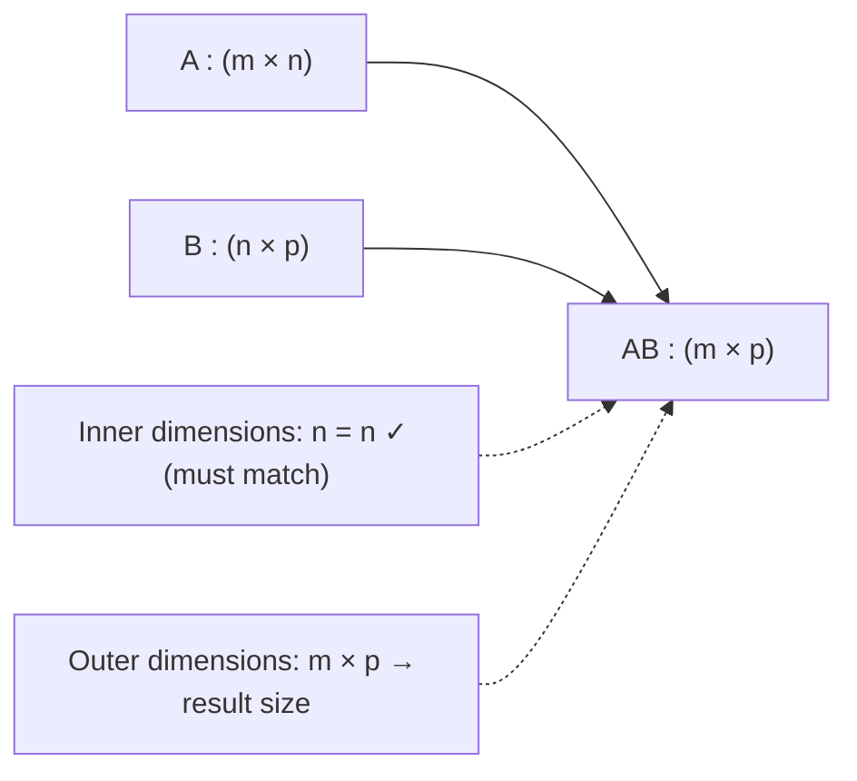
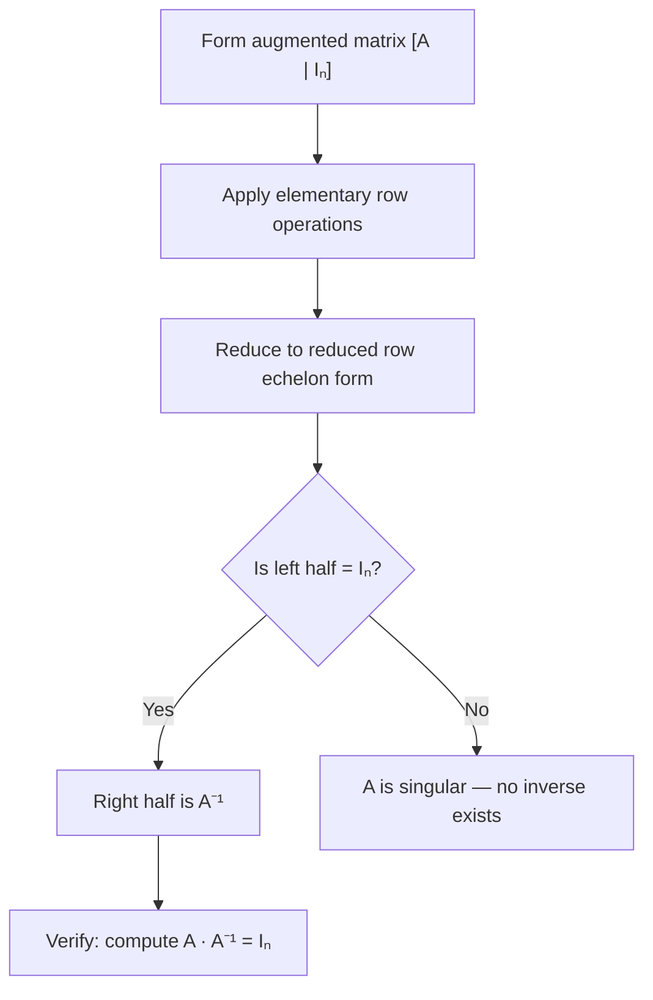

---
tags:
  - CCT3
  - Lin_Algebra
Topic: Marix-operationer, Matrix-multiplikation, Inverse matricer
Semester: CCT3
Course: Linær Algebra
Litterature:
  - Linear Algebra and Its Applications, Global Edition, 6ed
Created: 06-09-2026
---
- - -
## Table of Contents

1. [[#1.1 Introductory Example: Computer Models in Aircraft Design|1.1 Introductory Example: Computer Models in Aircraft Design]]
2. [[#1.2 Matrix Notation and Special Types|1.2 Matrix Notation and Special Types]]
3. [[#1.3 Sums and Scalar Multiples|1.3 Sums and Scalar Multiples]]
4. [[#1.4 Matrix Multiplication|1.4 Matrix Multiplication]]
	1. [[#1.4 Matrix Multiplication#1.4.1 Definition: The Column View|1.4.1 Definition: The Column View]]
	2. [[#1.4 Matrix Multiplication#1.4.2 Size Requirements|1.4.2 Size Requirements]]
	3. [[#1.4 Matrix Multiplication#1.4.3 The Row–Column Rule|1.4.3 The Row–Column Rule]]
	4. [[#1.4 Matrix Multiplication#1.4.4 Computing Individual Rows|1.4.4 Computing Individual Rows]]
5. [[#1.5 Properties of Matrix Multiplication|1.5 Properties of Matrix Multiplication]]
	1. [[#1.5 Properties of Matrix Multiplication#1.5.1 Commutativity and Cancellation|1.5.1 Commutativity and Cancellation]]
6. [[#1.6 Powers of a Matrix|1.6 Powers of a Matrix]]
7. [[#1.7 The Transpose of a Matrix|1.7 The Transpose of a Matrix]]
	1. [[#1.7 The Transpose of a Matrix#1.7.1 Applications to Pattern Recognition and Data Processing|1.7.1 Applications to Pattern Recognition and Data Processing]]
8. [[#1.8 The Inverse of a Matrix|1.8 The Inverse of a Matrix]]
	1. [[#1.8 The Inverse of a Matrix#1.8.1 Definition and Uniqueness|1.8.1 Definition and Uniqueness]]
	2. [[#1.8 The Inverse of a Matrix#1.8.2 Inverting $2 \times 2$ Matrices|1.8.2 Inverting $2 \times 2$ Matrices]]
	3. [[#1.8 The Inverse of a Matrix#1.8.3 Solving Linear Systems via Inverses|1.8.3 Solving Linear Systems via Inverses]]
	4. [[#1.8 The Inverse of a Matrix#1.8.4 Physical Application: Flexibility and Stiffness Matrices|1.8.4 Physical Application: Flexibility and Stiffness Matrices]]
	5. [[#1.8 The Inverse of a Matrix#1.8.5 Algebraic Properties of Invertible Matrices|1.8.5 Algebraic Properties of Invertible Matrices]]
9. [[#1.9 Elementary Matrices|1.9 Elementary Matrices]]
	1. [[#1.9 Elementary Matrices#1.9.1 Invertibility of Elementary Matrices|1.9.1 Invertibility of Elementary Matrices]]
	2. [[#1.9 Elementary Matrices#1.9.2 Row Equivalence and Invertibility|1.9.2 Row Equivalence and Invertibility]]
10. [[#1.10 The Matrix Inversion Algorithm|1.10 The Matrix Inversion Algorithm]]
	1. [[#1.10 The Matrix Inversion Algorithm#1.10.1 Another View: Column-by-Column Inversion|1.10.1 Another View: Column-by-Column Inversion]]

# 1. Matrix Algebra

| Concept / Symbol | Notation | Description |
|---|---|---|
| Matrix entry | $a_{ij}$ | Scalar in row $i$, column $j$ of a matrix |
| Matrix dimensions | $m \times n$ | $m$ rows, $n$ columns |
| Identity matrix | $I_n$ | $n \times n$ diagonal matrix with $1$s on the main diagonal |
| Zero matrix | $0$ | Matrix of all zeros (dimensions from context) |
| Matrix sum | $A + B$ | Entrywise addition (same dimensions required) |
| Scalar multiple | $rA$ | Each entry of $A$ multiplied by scalar $r$ |
| Matrix product | $AB$ | Composite linear transformation; columns of $B$ transformed by $A$ |
| Row–column entry | $(AB)_{ij} = \sum_{k=1}^{n} a_{ik}b_{kj}$ | Dot product of row $i$ of $A$ with column $j$ of $B$ |
| Matrix power | $A^k$ | $k$-fold product of square matrix $A$ with itself; $A^0 = I_n$ |
| Transpose | $A^T$ | Rows and columns interchanged; $(i,j)$-entry becomes $(j,i)$-entry |
| Determinant ($2 \times 2$) | $\det A = ad - bc$ | Scalar governing invertibility of a $2 \times 2$ matrix |
| Inverse | $A^{-1}$ | Unique matrix satisfying $A^{-1}A = AA^{-1} = I_n$ |
| Elementary matrix | $E$ | Identity matrix after one elementary row operation |
| Summation operator | $\sum$ | Adds a sequence of terms (e.g., $\sum_{k=1}^{n} a_{ik}b_{kj}$) |

_Table 1.1: Quick reference of key matrix algebra concepts, notation, and symbols._

---

## 1.1 Introductory Example: Computer Models in Aircraft Design

Modern aircraft design relies on _computational fluid dynamics_ (CFD), which simulates airflow around a virtual 3D wire-frame model of the aircraft. The geometry is discretized by superimposing a grid of boxes—often exceeding 400,000—and iteratively refining those that intersect the aircraft surface.

>[!info] The Core Linear System in CFD
>Airflow is determined by repeatedly solving massive systems of linear equations:
>
>$$Ax = b$$
>
>**Breakdown:**
>- **$A$** : The coefficient matrix — typically a large, _sparse_ matrix encoding physical relationships between grid points.
>- **$x$** : The vector of unknown airflow variables to be solved for.
>- **$b$** : The vector of known values, updated iteratively from boundary data.

These systems can involve up to **2 million equations**. Two matrix concepts make them tractable:

1. **Partitioned (Block) Matrices:** Sparse matrices are grouped into blocks of zeros, simplifying storage and computation. See [[#1.2 Matrix Notation and Special Types]] for the partitioned column form of a matrix.
2. **Matrix Factorizations:** Decompositions like $LU$ factorization solve systems without computing explicit inverses. This complements the direct inversion methods discussed in [[#1.10 The Matrix Inversion Algorithm]].

Matrix multiplication also underpins the **computer graphics** transformations (scaling, zooming, rotation) used to visualize the aircraft model — a direct application of the composition principle developed in [[#1.4 Matrix Multiplication]].

---

## 1.2 Matrix Notation and Special Types

An $m \times n$ matrix $A$ contains $m$ rows and $n$ columns. The scalar in the $i\text{th}$ row and $j\text{th}$ column is the _$(i,j)$-entry_, denoted $a_{ij}$.

Each column of $A$ is a vector in $\mathbb{R}^m$. Denoting the columns as $\mathbf{a}_1, \mathbf{a}_2, \dots, \mathbf{a}_n$, the matrix can be written in **partitioned column form**:

$$A = \begin{bmatrix} \mathbf{a}_1 & \mathbf{a}_2 & \cdots & \mathbf{a}_n \end{bmatrix}$$

The entries $a_{11}, a_{22}, a_{33}, \dots$ form the **main diagonal** of $A$.

![[Pasted image 20260926125731.png]]

_Figure 1.2.1: Matrix notation showing rows, columns, and the $(i,j)$-entry._

>[!info] Special Matrix Types
>- **Diagonal Matrix:** A square $n \times n$ matrix with $a_{ij} = 0$ for all $i \neq j$.
>- **Identity Matrix ($I_n$):** An $n \times n$ diagonal matrix with $1$s on the main diagonal and $0$s elsewhere. Acts as the multiplicative identity: $I_n \mathbf{x} = \mathbf{x}$.
>- **Zero Matrix ($0$):** An $m \times n$ matrix of all zeros. Dimensions are inferred from context.

---

## 1.3 Sums and Scalar Multiples

Two matrices are **equal** if and only if they share the same dimensions and all corresponding entries are identical.

The **sum** $A + B$ of two $m \times n$ matrices is computed entrywise: each entry of $A + B$ is the sum of the corresponding entries of $A$ and $B$.

>[!warning] Dimension Requirement for Addition
>$A + B$ is defined **only** when $A$ and $B$ have identical dimensions. If dimensions differ, the sum is **undefined**.

>[!example] Matrix Addition
>$$A = \begin{bmatrix} 4 & 0 & 5 \\ 1 & 3 & 2 \end{bmatrix}, \quad B = \begin{bmatrix} 1 & 1 & 1 \\ 3 & 5 & 7 \end{bmatrix}, \quad C = \begin{bmatrix} 2 & 3 \\ 0 & 1 \end{bmatrix}$$
>
>$$A + B = \begin{bmatrix} 4+1 & 0+1 & 5+1 \\ 1+3 & 3+5 & 2+7 \end{bmatrix} = \begin{bmatrix} 5 & 1 & 6 \\ 4 & 8 & 9 \end{bmatrix}$$
>
>$A + C$ is **undefined** ($A$ is $2 \times 3$, $C$ is $2 \times 2$).

The **scalar multiple** $rA$ multiplies every entry of $A$ by the scalar $r$. Subtraction is defined as $A - B = A + (-1)B$.

>[!example] Scalar Multiplication and Subtraction
>Using $A$ and $B$ from above:
>
>$$2B = \begin{bmatrix} 2 & 2 & 2 \\ 6 & 10 & 14 \end{bmatrix}$$
>
>$$A - 2B = \begin{bmatrix} 4-2 & 0-2 & 5-2 \\ 1-6 & 3-10 & 2-14 \end{bmatrix} = \begin{bmatrix} 2 & -2 & 3 \\ -5 & -7 & -12 \end{bmatrix}$$

>[!summary] Theorem 1: Algebraic Properties of Matrix Addition and Scalar Multiplication
>Let $A$, $B$, $C$ be $m \times n$ matrices and $r$, $s$ be scalars.
>
>a. $A + B = B + A$ *(Commutativity)*
>b. $(A + B) + C = A + (B + C)$ *(Associativity)*
>c. $A + 0 = A$ *(Additive Identity)*
>d. $r(A + B) = rA + rB$ *(Distributivity over matrix addition)*
>e. $(r + s)A = rA + sA$ *(Distributivity over scalar addition)*
>f. $r(sA) = (rs)A$ *(Associativity of scaling)*
>
>**Breakdown:**
>- **$A, B, C$** : Arbitrary matrices of identical dimension $m \times n$.
>- **$0$** : The $m \times n$ zero matrix.
>- **$r, s$** : Real scalars.
>- Properties (a)–(c) mirror vector addition in $\mathbb{R}^m$.
>- Properties (d)–(f) govern how scalars interact with matrices.
>
>**Proof:**
>Each property is verified by confirming equal dimensions and identical column vectors. For instance, property (b): the $j\text{th}$ columns of $(A+B)+C$ and $A+(B+C)$ are $(\mathbf{a}_j + \mathbf{b}_j) + \mathbf{c}_j$ and $\mathbf{a}_j + (\mathbf{b}_j + \mathbf{c}_j)$, which are equal by associativity of vector addition in $\mathbb{R}^m$. The remaining properties follow analogously.

---

## 1.4 Matrix Multiplication

Matrix multiplication encodes the **composition of linear transformations**. If $B$ transforms $\mathbf{x}$ into $B\mathbf{x}$, and $A$ then transforms that result, the composite mapping is:

$$A(B\mathbf{x}) = (AB)\mathbf{x}$$

>[!abstract] Intuition: The Assembly Line Analogy
>Imagine a two-stage assembly line processing an input $\mathbf{x}$:
>- **Machine $B$** receives the raw input $\mathbf{x}$ and produces an intermediate product $B\mathbf{x}$.
>- **Machine $A$** takes that intermediate product and produces the final output $A(B\mathbf{x})$.
>
>Instead of running two machines sequentially every time, you could design **one combined machine** — the product matrix $AB$ — that performs both transformations in a single step:
>$$(AB)\mathbf{x} = A(B\mathbf{x})$$
>
>This is the essence of matrix multiplication: it precomputes the composition of two linear transformations into a single matrix that applies both operations at once. The **order matters** because "assemble then paint" produces a different result than "paint then assemble" — which is why $AB \neq BA$ in general.

![[Pasted image 20260926131100.png]]

_Figure 1.4.1: Sequential transformation — first by $B$, then by $A$._

![[Pasted image 20260926131122.png]]

_Figure 1.4.2: The single composite transformation by the product $AB$._

### 1.4.1 Definition: The Column View

>[!summary] Definition of Matrix Multiplication
>If $A$ is $m \times n$ and $B$ is $n \times p$ with columns $\mathbf{b}_1, \dots, \mathbf{b}_p$, then:
>
>$$AB = A \begin{bmatrix} \mathbf{b}_1 & \cdots & \mathbf{b}_p \end{bmatrix} = \begin{bmatrix} A\mathbf{b}_1 & \cdots & A\mathbf{b}_p \end{bmatrix}$$
>
>**Breakdown:**
>- **$A$** : Left factor, size $m \times n$.
>- **$B$** : Right factor, size $n \times p$.
>- **$\mathbf{b}_j$** : The $j\text{th}$ column of $B$.
>- **$A\mathbf{b}_j$** : The $j\text{th}$ column of the product $AB$ — a linear combination of the columns of $A$ weighted by the entries of $\mathbf{b}_j$.
>- **$AB$** : The resulting $m \times p$ product matrix.

>[!example] Computing $AB$ Column by Column
>$$A = \begin{bmatrix} 2 & 3 \\ 1 & -5 \end{bmatrix}, \quad B = \begin{bmatrix} 4 & 3 & 6 \\ 1 & -2 & 3 \end{bmatrix}$$
>
>$$A\mathbf{b}_1 = \begin{bmatrix} 2(4)+3(1) \\ 1(4)-5(1) \end{bmatrix} = \begin{bmatrix} 11 \\ -1 \end{bmatrix}, \quad A\mathbf{b}_2 = \begin{bmatrix} 0 \\ 13 \end{bmatrix}, \quad A\mathbf{b}_3 = \begin{bmatrix} 21 \\ -9 \end{bmatrix}$$
>
>$$AB = \begin{bmatrix} 11 & 0 & 21 \\ -1 & 13 & -9 \end{bmatrix}$$

![[Pasted image 20260926131202.png]]

_Figure 1.4.3: Column-by-column computation of $AB$ showing $A\mathbf{b}_1$, $A\mathbf{b}_2$, $A\mathbf{b}_3$._

### 1.4.2 Size Requirements

For $AB$ to be defined, the **inner dimensions must match**: the number of columns of $A$ must equal the number of rows of $B$.

$$(m \times \underbrace{n)}_{\text{match}} \cdot (\underbrace{n} \times p) = m \times p$$

_Figure 1.4.4: Visualization of the dimension-matching rule for matrix multiplication. Inner dimensions must cancel; outer dimensions define the size of the product._

>[!example] Dimension Compatibility
>- $A$ is $3 \times 5$, $B$ is $5 \times 2$ → $AB$ is defined ($3 \times 2$), but $BA$ is **undefined** ($2 \neq 3$).

### 1.4.3 The Row–Column Rule

>[!info] Row–Column Rule
>The $(i,j)$-entry of $AB$ is the dot product of row $i$ of $A$ with column $j$ of $B$:
>
>$$(AB)_{ij} = \sum_{k=1}^{n} a_{ik}b_{kj}$$
>
>**Breakdown:**
>- **$(AB)_{ij}$** : Scalar in row $i$, column $j$ of the product.
>- **$a_{ik}$** : $k\text{th}$ entry of row $i$ in $A$.
>- **$b_{kj}$** : $k\text{th}$ entry of column $j$ in $B$.
>- **$n$** : Shared inner dimension (columns of $A$ = rows of $B$).
>- **$\sum$** : Summation operator — adds the products from $k=1$ to $n$.

![[Pasted image 20260926131243.png]]

_Figure 1.4.5: Visual illustration of the row–column rule for computing a single entry of $AB$._

>[!example] Applying the Row–Column Rule
>Using $A$ and $B$ from the column-by-column example:
>
>$$(AB)_{13} = 2(6) + 3(3) = 21 \qquad (AB)_{22} = 1(3) + (-5)(-2) = 13$$

### 1.4.4 Computing Individual Rows

The $i\text{th}$ row of $AB$ depends **only** on the $i\text{th}$ row of $A$ and the full matrix $B$:

$$\text{row}_i(AB) = \text{row}_i(A) \cdot B$$

>[!example] Isolating Row 2 of $AB$
>$$A = \begin{bmatrix} 2 & -5 & 0 \\ -1 & 3 & -4 \\ 6 & -8 & -7 \\ -3 & 0 & 9 \end{bmatrix}, \quad B = \begin{bmatrix} 4 & -6 \\ 7 & 1 \\ 3 & 2 \end{bmatrix}$$
>
>$$\text{row}_2(AB) = \begin{bmatrix} -1 & 3 & -4 \end{bmatrix} \begin{bmatrix} 4 & -6 \\ 7 & 1 \\ 3 & 2 \end{bmatrix} = \begin{bmatrix} 5 & 1 \end{bmatrix}$$

![[Pasted image 20260926131444.png]]

_Figure 1.4.6: Textbook solution showing the row-isolation computation._

---

## 1.5 Properties of Matrix Multiplication

>[!summary] Theorem 2: Properties of Matrix Multiplication
>Let $A$ be $m \times n$, and $B$, $C$ be matrices of compatible sizes. Let $r$ be a scalar.
>
>a. $A(BC) = (AB)C$ *(Associativity)*
>b. $A(B + C) = AB + AC$ *(Left Distributivity)*
>c. $(B + C)A = BA + CA$ *(Right Distributivity)*
>d. $r(AB) = (rA)B = A(rB)$ *(Scalar Association)*
>e. $I_m A = A = A I_n$ *(Identity)*
>
>**Breakdown:**
>- **$I_m, I_n$** : Identity matrices serving as left and right multiplicative identities.
>- **Associativity (a)** : Parentheses can be regrouped freely, but the left-to-right **order** of factors must be preserved.
>- **Distributivity (b, c)** : Multiplication distributes over addition from both sides — note that left and right are distinct because $AB \neq BA$ in general.
>
>**Proof of (a):**
>Let $C = \begin{bmatrix} \mathbf{c}_1 & \cdots & \mathbf{c}_p \end{bmatrix}$. Then $BC = \begin{bmatrix} B\mathbf{c}_1 & \cdots & B\mathbf{c}_p \end{bmatrix}$, and:
>$$A(BC) = \begin{bmatrix} A(B\mathbf{c}_1) & \cdots & A(B\mathbf{c}_p) \end{bmatrix} = \begin{bmatrix} (AB)\mathbf{c}_1 & \cdots & (AB)\mathbf{c}_p \end{bmatrix} = (AB)C$$

### 1.5.1 Commutativity and Cancellation

>[!warning] Critical Differences from Real Number Algebra
>1. **No general commutativity:** $AB \neq BA$ in general. If $AB = BA$, the matrices are said to _commute_.
>2. **No cancellation law:** $AB = AC$ does **not** imply $B = C$.
>3. **No zero-product property:** $AB = 0$ does **not** imply $A = 0$ or $B = 0$.

>[!example] Non-Commutativity
>$$A = \begin{bmatrix} 5 & 1 \\ 3 & -2 \end{bmatrix}, \quad B = \begin{bmatrix} 2 & 0 \\ 4 & 3 \end{bmatrix}$$
>
>$$AB = \begin{bmatrix} 14 & 3 \\ -2 & -6 \end{bmatrix} \neq \begin{bmatrix} 10 & 2 \\ 29 & -2 \end{bmatrix} = BA$$

---

## 1.6 Powers of a Matrix

For an $n \times n$ square matrix $A$ and a non-negative integer $k$:

$$A^k = \underbrace{A \cdot A \cdots A}_{k \text{ factors}}, \qquad A^0 = I_n$$

>[!info] Key Points About Matrix Powers
>- Powers are defined **only for square matrices**.
>- $A^k \mathbf{x}$ means applying the transformation $A$ to $\mathbf{x}$ a total of $k$ times.
>- $A^0 = I_n$ because the "zero-fold" application leaves vectors unchanged.
>- Matrix powers are essential for modeling iterative processes, dynamic systems, and recurrence relations. See also [[#1.5 Properties of Matrix Multiplication]] for the associativity that makes repeated multiplication unambiguous.

---

## 1.7 The Transpose of a Matrix

The **transpose** $A^T$ of an $m \times n$ matrix $A$ is the $n \times m$ matrix obtained by interchanging rows and columns: the $(i,j)$-entry of $A^T$ is the $(j,i)$-entry of $A$.

>[!example] Transposing Matrices
>$$A = \begin{bmatrix} a & b \\ c & d \end{bmatrix} \implies A^T = \begin{bmatrix} a & c \\ b & d \end{bmatrix}$$
>
>$$B = \begin{bmatrix} -5 & 2 \\ 1 & -3 \\ 0 & 4 \end{bmatrix} \implies B^T = \begin{bmatrix} -5 & 1 & 0 \\ 2 & -3 & 4 \end{bmatrix}$$

>[!summary] Theorem 3: Properties of the Transpose
>For matrices of compatible sizes and scalar $r$:
>
>a. $(A^T)^T = A$
>b. $(A + B)^T = A^T + B^T$
>c. $(rA)^T = rA^T$
>d. $(AB)^T = B^T A^T$ *(Reverse Order Law)*
>
>**Breakdown:**
>- **(a)** : Double transposition restores the original matrix.
>- **(b, c)** : Transposition distributes over addition and scalar multiplication.
>- **(d)** : Transposing a product **reverses the order** of factors. This extends inductively: $(A_1 A_2 \cdots A_k)^T = A_k^T \cdots A_2^T A_1^T$.
>
>**Proof of (d):**
>The $(i,j)$-entry of $(AB)^T$ is $(AB)_{ji} = \sum_{k=1}^{n} a_{jk}b_{ki}$. The $(i,j)$-entry of $B^T A^T$ is $\sum_{k=1}^{n} (B^T)_{ik}(A^T)_{kj} = \sum_{k=1}^{n} b_{ki}a_{jk}$. These are identical, so $(AB)^T = B^T A^T$.

>[!warning] Common Mistake
>$(AB)^T \neq A^T B^T$ in general. The order **must** be reversed. See [[#1.8.5 Algebraic Properties of Invertible Matrices]] for the parallel Reverse Order Law governing matrix inversion.

>[!tip] Unified View: The Reverse Order Pattern
>Two fundamental matrix operations obey the **same reverse order law**:
>
>$$(AB)^T = B^T A^T \qquad \text{and} \qquad (AB)^{-1} = B^{-1} A^{-1}$$
>
>**Why does this pattern appear in both?** Both transposition and inversion can be viewed as "reflecting" or "undoing" the composition $AB$. When you undo a sequence of operations, you must reverse the order:
>- To reverse "put on socks, then shoes," you must "take off shoes, then socks."
>- Similarly, to reverse (invert or reflect) the composition $A \circ B$, you apply the reverses in reverse order: $B^{-1} \circ A^{-1}$ or $B^T \circ A^T$.
>
>Both laws extend inductively to any finite product:
>$$(A_1 A_2 \cdots A_k)^T = A_k^T \cdots A_2^T A_1^T$$
>$$(A_1 A_2 \cdots A_k)^{-1} = A_k^{-1} \cdots A_2^{-1} A_1^{-1}$$

### 1.7.1 Applications to Pattern Recognition and Data Processing

![[Pasted image 20260926131538.png]]

_Figure 1.7.1: Pixel grid representation used in pattern recognition._

>[!example] Pattern Recognition via Quadratic Forms
>A $2 \times 2$ pixel block is encoded as a $4 \times 1$ vector $\mathbf{x}$ (blue $= 1$, white $= 0$). To detect a diagonal checkerboard pattern $\mathbf{v} = \begin{bmatrix} 1 & 0 & 0 & 1 \end{bmatrix}^T$, define:
>
>$$M = \begin{bmatrix} 1 & 0 & 0 & -1 \\ 0 & 1 & 0 & 0 \\ 0 & 0 & 1 & 0 \\ -1 & 0 & 0 & 1 \end{bmatrix}$$
>
>The pattern $\mathbf{x}$ matches the target if and only if:
>$$\mathbf{x}^T M \mathbf{x} = 0 \quad \text{and} \quad \mathbf{x}^T \mathbf{x} \neq 0$$
>
>The second condition excludes the trivial all-white (zero) pattern.

![[Pasted image 20260926131604.png]]

_Figure 1.7.2: Data alignment between incompatible matrix formats._

>[!example] Data Scrubbing via Permutation Matrices
>Two datasets store airport incident dates in different row orders (Day/Month vs. Month/Day). Left-multiplying by the permutation matrix $P = \begin{bmatrix} 0 & 1 \\ 1 & 0 \end{bmatrix}$ swaps the rows of $T$ to match the format of $C$:
>
>$$PT = \begin{bmatrix} 0 & 1 \\ 1 & 0 \end{bmatrix} T = \begin{bmatrix} \text{Month row} \\ \text{Day row} \end{bmatrix}$$

---

## 1.8 The Inverse of a Matrix

### 1.8.1 Definition and Uniqueness

>[!info] Invertible and Singular Matrices
>An $n \times n$ matrix $A$ is **invertible** (nonsingular) if there exists a unique $n \times n$ matrix $A^{-1}$ such that:
>
>$$A^{-1}A = I_n \quad \text{and} \quad AA^{-1} = I_n$$
>
>A matrix that is not invertible is called **singular**.
>
>**Uniqueness:** If both $B$ and $C$ satisfy the inverse conditions, then $B = BI_n = B(AC) = (BA)C = I_n C = C$.

>[!example] Verifying an Inverse
>$$A = \begin{bmatrix} 2 & 5 \\ -3 & -7 \end{bmatrix}, \quad C = \begin{bmatrix} -7 & -5 \\ 3 & 2 \end{bmatrix}$$
>
>$$AC = \begin{bmatrix} 1 & 0 \\ 0 & 1 \end{bmatrix} = I_2, \qquad CA = \begin{bmatrix} 1 & 0 \\ 0 & 1 \end{bmatrix} = I_2 \implies C = A^{-1}$$

### 1.8.2 Inverting $2 \times 2$ Matrices

>[!summary] Theorem 4: Inverse of a $2 \times 2$ Matrix
>For $A = \begin{bmatrix} a & b \\ c & d \end{bmatrix}$:
>
>$$A^{-1} = \frac{1}{ad - bc} \begin{bmatrix} d & -b \\ -c & a \end{bmatrix} \quad \text{if } ad - bc \neq 0$$
>
>The **determinant** is $\det A = ad - bc$. If $\det A = 0$, $A$ is singular.
>
>**Breakdown:**
>- **$\det A = ad - bc$** : The determinant — a single scalar that determines invertibility.
>- **$\begin{bmatrix} d & -b \\ -c & a \end{bmatrix}$** : The adjugate — swap the diagonal entries, negate the off-diagonal entries.
>- **$\frac{1}{ad-bc}$** : The reciprocal of the determinant, scaling the adjugate.
>
>**Proof:**
>$$A \cdot \frac{1}{ad-bc}\begin{bmatrix} d & -b \\ -c & a \end{bmatrix} = \frac{1}{ad-bc}\begin{bmatrix} ad-bc & 0 \\ 0 & ad-bc \end{bmatrix} = I_2$$

>[!example] Computing a $2 \times 2$ Inverse
>$$A = \begin{bmatrix} 3 & 4 \\ 5 & 6 \end{bmatrix}, \quad \det A = 18 - 20 = -2$$
>
>$$A^{-1} = \frac{1}{-2}\begin{bmatrix} 6 & -4 \\ -5 & 3 \end{bmatrix} = \begin{bmatrix} -3 & 2 \\ \frac{5}{2} & -\frac{3}{2} \end{bmatrix}$$

### 1.8.3 Solving Linear Systems via Inverses

>[!summary] Theorem 5: Unique Solution via Inverses
>If $A$ is an invertible $n \times n$ matrix, then $A\mathbf{x} = \mathbf{b}$ has the unique solution:
>
>$$\mathbf{x} = A^{-1}\mathbf{b}$$
>
>**Breakdown:**
>- **$A$** : Invertible coefficient matrix (see [[#1.8.2 Inverting $2 \times 2$ Matrices]] for the $2 \times 2$ case).
>- **$\mathbf{b}$** : Known target vector.
>- **$\mathbf{x}$** : Unknown solution vector.
>
>**Proof:**
>- *Existence:* $A(A^{-1}\mathbf{b}) = (AA^{-1})\mathbf{b} = I_n\mathbf{b} = \mathbf{b}$. ✓
>- *Uniqueness:* If $A\mathbf{u} = \mathbf{b}$, then $A^{-1}(A\mathbf{u}) = A^{-1}\mathbf{b} \implies \mathbf{u} = A^{-1}\mathbf{b}$. ✓

>[!example] Solving a System with an Inverse
>$$\begin{bmatrix} 3 & 4 \\ 5 & 6 \end{bmatrix}\begin{bmatrix} x_1 \\ x_2 \end{bmatrix} = \begin{bmatrix} 3 \\ 7 \end{bmatrix} \implies \mathbf{x} = \begin{bmatrix} -3 & 2 \\ \frac{5}{2} & -\frac{3}{2} \end{bmatrix}\begin{bmatrix} 3 \\ 7 \end{bmatrix} = \begin{bmatrix} 5 \\ -3 \end{bmatrix}$$

>[!note] Computational Efficiency
>For large systems, Gaussian elimination on $\begin{bmatrix} A & \mathbf{b} \end{bmatrix}$ is faster and more numerically stable than computing $A^{-1}$ explicitly. The inverse formula is primarily theoretical or used for small systems.

### 1.8.4 Physical Application: Flexibility and Stiffness Matrices

>[!example] Elastic Beam Deflection
>A beam supported at both ends is subjected to forces $\mathbf{f} \in \mathbb{R}^3$ at three points, producing deflections $\mathbf{y} \in \mathbb{R}^3$.
>
>**Flexibility matrix** $D$: $\mathbf{y} = D\mathbf{f}$
>- Column $j$ of $D$: deflections at all points caused by a unit force at point $j$ alone (inches/pound).
>
>**Stiffness matrix** $D^{-1}$: $\mathbf{f} = D^{-1}\mathbf{y}$
>- Column $j$ of $D^{-1}$: forces required at all points to produce a unit deflection at point $j$ alone (pounds/inch).

![[Pasted image 20260926131710.png]]

_Figure 1.8.1: Deflection of an elastic beam under applied forces._

### 1.8.5 Algebraic Properties of Invertible Matrices

>[!summary] Theorem 6: Properties of Invertible Matrices
>For invertible $n \times n$ matrices $A$ and $B$:
>
>a. $(A^{-1})^{-1} = A$
>b. $(AB)^{-1} = B^{-1}A^{-1}$ *(Reverse Order Law — mirrors the transpose law in [[#1.7 The Transpose of a Matrix]])*
>c. $(A^T)^{-1} = (A^{-1})^T$
>
>**Breakdown:**
>- **(a)** : Inverting twice returns the original matrix.
>- **(b)** : The inverse of a product reverses the order — analogous to "undoing" operations in reverse sequence. Extends to $(A_1 \cdots A_k)^{-1} = A_k^{-1} \cdots A_1^{-1}$.
>- **(c)** : Transposition and inversion commute.
>
>**Proof of (b):**
>$$(AB)(B^{-1}A^{-1}) = A(BB^{-1})A^{-1} = AI_nA^{-1} = AA^{-1} = I_n$$
>$$(B^{-1}A^{-1})(AB) = B^{-1}(A^{-1}A)B = B^{-1}I_nB = B^{-1}B = I_n$$

---

## 1.9 Elementary Matrices

>[!info] Definition: Elementary Matrix
>An **elementary matrix** $E$ is obtained by performing a single elementary row operation on $I_n$. The three types correspond to:
>1. **Row Replacement:** Add a multiple of one row to another.
>2. **Row Interchange:** Swap two rows.
>3. **Row Scaling:** Multiply a row by a nonzero scalar.
>
>Left-multiplying any matrix $A$ by $E$ performs that same row operation on $A$: $\text{Row Op}(A) = EA$.

| Operation Type | Row Operation | Effect on $I_n$ | Inverse Operation |
|---|---|---|---|
| Row Replacement | $R_i \leftarrow R_i + kR_j$ | Places $k$ at position $(i,j)$ | $R_i \leftarrow R_i - kR_j$ |
| Row Interchange | $R_i \leftrightarrow R_j$ | Swaps rows $i$ and $j$ of $I$ | Same swap (self-inverse) |
| Row Scaling | $R_i \leftarrow kR_i$ (where $k \neq 0$) | Places $k$ at position $(i,i)$ | $R_i \leftarrow \frac{1}{k}R_i$ |

_Table 1.9.1: Comparison of the three types of elementary matrices, their effects on $I_n$, and their inverse operations._

>[!example] Three Types of Elementary Matrices
>$$E_1 = \begin{bmatrix} 1 & 0 & 0 \\ 0 & 1 & 0 \\ -4 & 0 & 1 \end{bmatrix} \text{(Replace } R_3 \leftarrow R_3 - 4R_1), \quad E_2 = \begin{bmatrix} 0 & 1 & 0 \\ 1 & 0 & 0 \\ 0 & 0 & 1 \end{bmatrix} \text{(Swap } R_1 \leftrightarrow R_2)$$
>
>$$E_3 = \begin{bmatrix} 1 & 0 & 0 \\ 0 & 1 & 0 \\ 0 & 0 & 5 \end{bmatrix} \text{(Scale } R_3 \leftarrow 5R_3)$$

### 1.9.1 Invertibility of Elementary Matrices

Every elementary matrix is **invertible** because every row operation is reversible. The inverse $E^{-1}$ is the elementary matrix of the same type that undoes the operation.

>[!example] Inverting an Elementary Matrix
>$E_1$ was created by $R_3 \leftarrow R_3 - 4R_1$. The reverse is $R_3 \leftarrow R_3 + 4R_1$:
>
>$$E_1^{-1} = \begin{bmatrix} 1 & 0 & 0 \\ 0 & 1 & 0 \\ 4 & 0 & 1 \end{bmatrix}$$

### 1.9.2 Row Equivalence and Invertibility

>[!summary] Theorem 7: Invertibility via Row Reduction
>An $n \times n$ matrix $A$ is invertible **if and only if** $A$ is row equivalent to $I_n$ ($A \sim I_n$).
>
>When $A \sim I_n$, the same row operations that reduce $A$ to $I_n$ simultaneously transform $I_n$ into $A^{-1}$.
>
>**Breakdown:**
>- **$A \sim I_n$** : $A$ can be reduced to $I_n$ via elementary row operations, meaning $A$ has $n$ pivots.
>- **$E_p \cdots E_1 A = I_n$** : The product of elementary matrices encoding the reduction.
>- **$A^{-1} = E_p \cdots E_1$** : Applying the same operations to $I_n$ yields the inverse.
>
>**Proof:**
>- *($\Rightarrow$)* If $A$ is invertible, $A\mathbf{x} = \mathbf{b}$ has a unique solution for every $\mathbf{b}$, so $A$ has $n$ pivots and reduces to $I_n$.
>- *($\Leftarrow$)* If $A \sim I_n$, then $E_p \cdots E_1 A = I_n$. Let $M = E_p \cdots E_1$. Then $A = M^{-1}$, which is invertible, and $A^{-1} = M = E_p \cdots E_1 = E_p \cdots E_1 I_n$.

---

## 1.10 The Matrix Inversion Algorithm

The following algorithm operationalizes [[#1.9.2 Row Equivalence and Invertibility|Theorem 7]] into a practical computational procedure.

>[!info] Algorithm for Finding $A^{-1}$
>1. Form the augmented matrix $\begin{bmatrix} A & I_n \end{bmatrix}$.
>2. Row reduce to reduced echelon form.
>3. If the left half becomes $I_n$, the right half is $A^{-1}$:
>   $$\begin{bmatrix} A & I_n \end{bmatrix} \sim \begin{bmatrix} I_n & A^{-1} \end{bmatrix}$$
>4. If the left half cannot become $I_n$ (fewer than $n$ pivots), $A$ is **singular**.

_Figure 1.10.1: Decision flowchart for the matrix inversion algorithm, showing the invertibility check via row reduction._

>[!example] Inverting a $3 \times 3$ Matrix
>$$A = \begin{bmatrix} 0 & 1 & 2 \\ 1 & 0 & 3 \\ 4 & -3 & 8 \end{bmatrix}$$
>
>$$\begin{bmatrix} 0 & 1 & 2 & 1 & 0 & 0 \\ 1 & 0 & 3 & 0 & 1 & 0 \\ 4 & -3 & 8 & 0 & 0 & 1 \end{bmatrix} \xrightarrow{R_1 \leftrightarrow R_2} \begin{bmatrix} 1 & 0 & 3 & 0 & 1 & 0 \\ 0 & 1 & 2 & 1 & 0 & 0 \\ 4 & -3 & 8 & 0 & 0 & 1 \end{bmatrix}$$
>
>$$\xrightarrow{R_3 - 4R_1} \begin{bmatrix} 1 & 0 & 3 & 0 & 1 & 0 \\ 0 & 1 & 2 & 1 & 0 & 0 \\ 0 & -3 & -4 & 0 & -4 & 1 \end{bmatrix} \xrightarrow{R_3 + 3R_2} \begin{bmatrix} 1 & 0 & 3 & 0 & 1 & 0 \\ 0 & 1 & 2 & 1 & 0 & 0 \\ 0 & 0 & 2 & 3 & -4 & 1 \end{bmatrix}$$
>
>$$\xrightarrow{\frac{1}{2}R_3} \begin{bmatrix} 1 & 0 & 3 & 0 & 1 & 0 \\ 0 & 1 & 2 & 1 & 0 & 0 \\ 0 & 0 & 1 & \frac{3}{2} & -2 & \frac{1}{2} \end{bmatrix} \xrightarrow{R_1-3R_3,\; R_2-2R_3} \begin{bmatrix} 1 & 0 & 0 & -\frac{9}{2} & 7 & -\frac{3}{2} \\ 0 & 1 & 0 & -2 & 4 & -1 \\ 0 & 0 & 1 & \frac{3}{2} & -2 & \frac{1}{2} \end{bmatrix}$$
>
>$$A^{-1} = \begin{bmatrix} -\frac{9}{2} & 7 & -\frac{3}{2} \\ -2 & 4 & -1 \\ \frac{3}{2} & -2 & \frac{1}{2} \end{bmatrix}$$

>[!tip] Verification
>Always verify by computing $AA^{-1} = I_n$. For square matrices, $AA^{-1} = I$ automatically guarantees $A^{-1}A = I$.

### 1.10.1 Another View: Column-by-Column Inversion

Row reducing $\begin{bmatrix} A & I_n \end{bmatrix}$ is equivalent to simultaneously solving $n$ systems:

$$A\mathbf{x}_1 = \mathbf{e}_1, \quad A\mathbf{x}_2 = \mathbf{e}_2, \quad \dots, \quad A\mathbf{x}_n = \mathbf{e}_n$$

where $\mathbf{e}_j$ is the $j\text{th}$ column of $I_n$ and $\mathbf{x}_j$ becomes the $j\text{th}$ column of $A^{-1}$.

>[!example] Extracting Only Column 2 of $A^{-1}$
>Suppose only the second column of $A^{-1}$ is needed, using the $3 \times 3$ matrix from the previous example:
>
>$$A = \begin{bmatrix} 0 & 1 & 2 \\ 1 & 0 & 3 \\ 4 & -3 & 8 \end{bmatrix}$$
>
>Instead of computing the full inverse, solve the single system $A\mathbf{x}_2 = \mathbf{e}_2$, where $\mathbf{e}_2 = \begin{bmatrix} 0 \\ 1 \\ 0 \end{bmatrix}$.
>
>**Set up the augmented matrix:**
>$$\begin{bmatrix} 0 & 1 & 2 & 0 \\ 1 & 0 & 3 & 1 \\ 4 & -3 & 8 & 0 \end{bmatrix}$$
>
>**Apply the same sequence of row operations used in the full inversion:**
>$$\xrightarrow{R_1 \leftrightarrow R_2,\; R_3 - 4R_1,\; R_3 + 3R_2,\; \frac{1}{2}R_3,\; R_1 - 3R_3,\; R_2 - 2R_3} \begin{bmatrix} 1 & 0 & 0 & 7 \\ 0 & 1 & 0 & 4 \\ 0 & 0 & 1 & -2 \end{bmatrix}$$
>
>**Read off the solution:**
>$$\mathbf{x}_2 = \begin{bmatrix} 7 \\ 4 \\ -2 \end{bmatrix}$$
>
>**Verification:** This matches the second column of $A^{-1}$ computed earlier:
>$$A^{-1} = \begin{bmatrix} -\frac{9}{2} & \boxed{7} & -\frac{3}{2} \\ -2 & \boxed{4} & -1 \\ \frac{3}{2} & \boxed{-2} & \frac{1}{2} \end{bmatrix} \checkmark$$
>
>This approach requires only one augmented column instead of three — roughly one-third the arithmetic when only a single column of $A^{-1}$ is required.

>[!tip] Partial Inversion
>If only specific columns of $A^{-1}$ are needed, solve only the corresponding systems $A\mathbf{x} = \mathbf{e}_j$ rather than inverting the full matrix. This connects directly to [[#1.8.3 Solving Linear Systems via Inverses|Theorem 5]] applied one column at a time.

>[!note] Practical Considerations
>Explicit inversion requires roughly **three times** as many arithmetic operations as direct Gaussian elimination and is more susceptible to round-off error. In practice, matrix factorizations (e.g., $LU$) are preferred for solving $A\mathbf{x} = \mathbf{b}$.

---

>[!summary] Summary: Matrix Algebra
>**Core Operations:**
>- **Addition/Scalar Multiplication:** Entrywise; requires matching dimensions. Commutative and associative.
>- **Matrix Multiplication:** Encodes composition of linear transformations. Associative and distributive, but **not commutative** ($AB \neq BA$ in general). Computed via the row–column rule: $(AB)_{ij} = \sum a_{ik}b_{kj}$.
>- **Powers:** $A^k$ for square matrices; $A^0 = I_n$.
>- **Transpose:** Swaps rows and columns; reverses product order: $(AB)^T = B^T A^T$.
>
>**Inverses:**
>- $A^{-1}$ exists if and only if $A$ is square and row equivalent to $I_n$ (i.e., $\det A \neq 0$ for $2 \times 2$).
>- Unique solution to $A\mathbf{x} = \mathbf{b}$: $\mathbf{x} = A^{-1}\mathbf{b}$.
>- **Reverse Order Law** (shared by transpose and inverse): $(AB)^{-1} = B^{-1}A^{-1}$ and $(AB)^T = B^T A^T$.
>- Found algorithmically by row reducing $\begin{bmatrix} A & I_n \end{bmatrix} \sim \begin{bmatrix} I_n & A^{-1} \end{bmatrix}$.
>
>**Elementary Matrices:**
>- Encode single row operations; always invertible.
>- Bridge the gap between row reduction and matrix algebra: $E_p \cdots E_1 A = I_n \implies A^{-1} = E_p \cdots E_1$.
>
>**Key Warnings:**
>- Matrix multiplication is **not commutative**.
>- No cancellation law ($AB = AC \nRightarrow B = C$).
>- No zero-product property ($AB = 0 \nRightarrow A = 0$ or $B = 0$).
>- Explicit inversion is computationally expensive; prefer row reduction or factorizations for large systems.