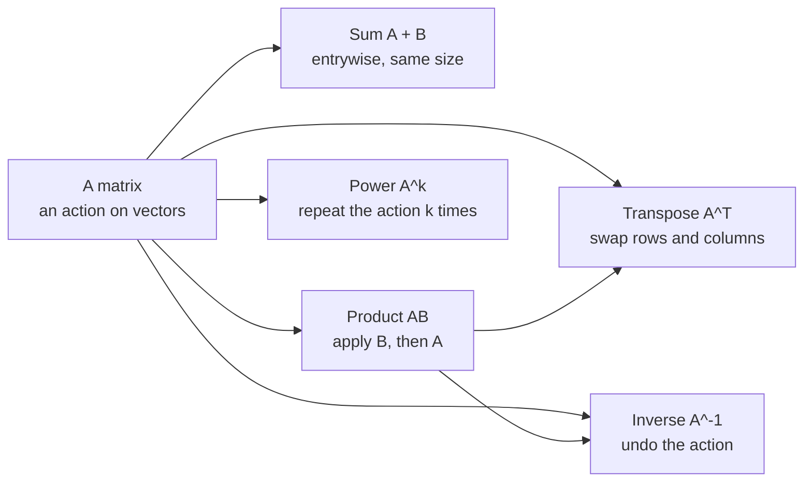
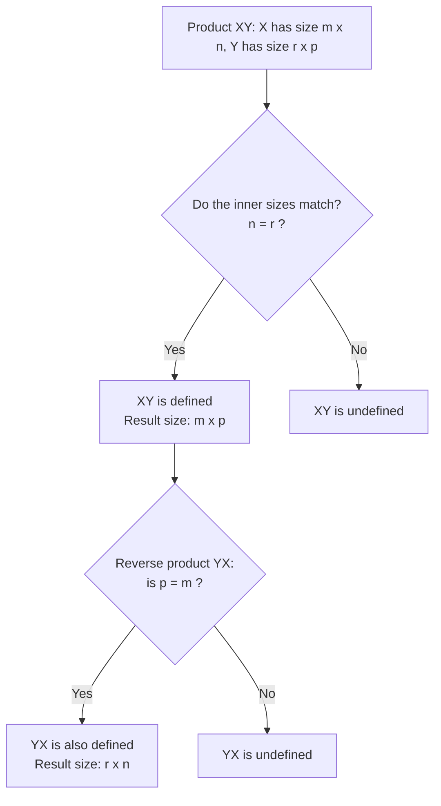
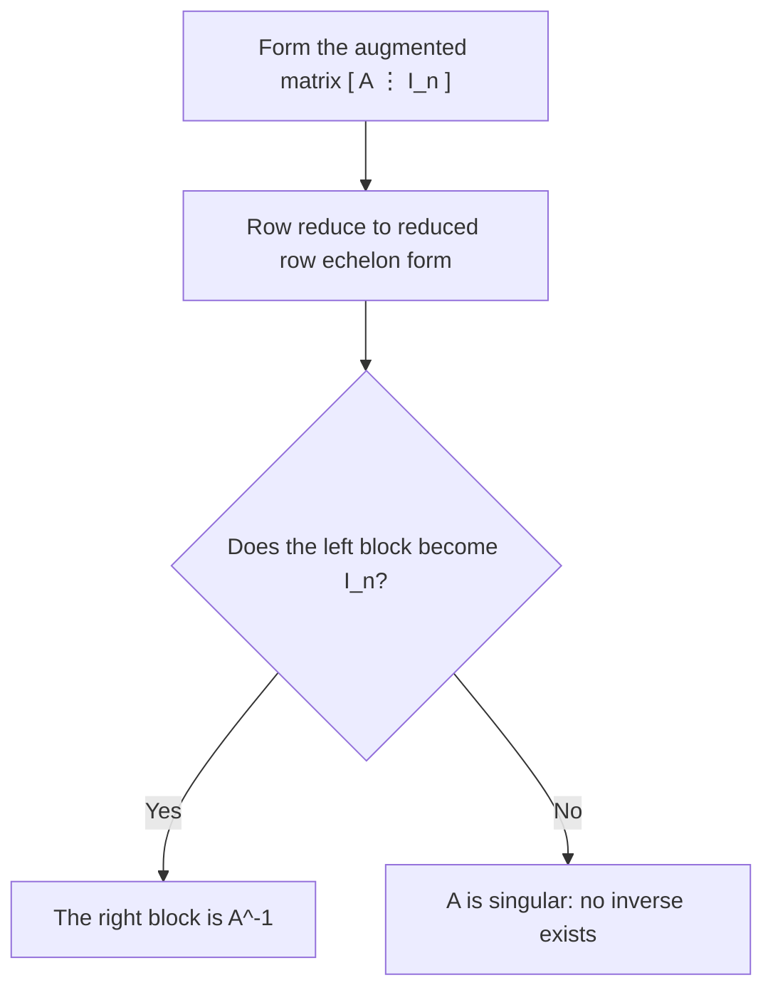

---
tags:
  - CCT3
  - Lin_Algebra
Topic: Marix-operationer, Matrix-multiplikation, Inverse matricer
Semester: CCT3
Course: Linær Algebra
Litterature:
  - Linear Algebra and Its Applications, Global Edition, 6ed
Created: 06-09-2026
---
## Table of Contents

1. [[#4. Matrix Operations, Matrix Multiplication, and Inverse Matrices|4. Matrix Operations, Matrix Multiplication, and Inverse Matrices]]
	1. [[#4. Matrix Operations, Matrix Multiplication, and Inverse Matrices#4.1 Introductory Example: Computer Models in Aircraft Design|4.1 Introductory Example: Computer Models in Aircraft Design]]
	2. [[#4. Matrix Operations, Matrix Multiplication, and Inverse Matrices#4.2 Matrix Operations|4.2 Matrix Operations]]
		1. [[#4.2 Matrix Operations#4.2.1 Sums and Scalar Multiples|4.2.1 Sums and Scalar Multiples]]
	3. [[#4. Matrix Operations, Matrix Multiplication, and Inverse Matrices#4.3 Matrix Multiplication|4.3 Matrix Multiplication]]
		1. [[#4.3 Matrix Multiplication#4.3.1 Matrix Size Requirements for Multiplication|4.3.1 Matrix Size Requirements for Multiplication]]
		2. [[#4.3 Matrix Multiplication#4.3.2 The Row–Column Rule for Computing $AB$|4.3.2 The Row–Column Rule for Computing $AB$]]
		3. [[#4.3 Matrix Multiplication#4.3.3 Computing Individual Rows of a Product|4.3.3 Computing Individual Rows of a Product]]
	4. [[#4. Matrix Operations, Matrix Multiplication, and Inverse Matrices#4.4 Properties of Matrix Multiplication|4.4 Properties of Matrix Multiplication]]
		1. [[#4.4 Properties of Matrix Multiplication#4.4.1 Matrix Grouping and Commutativity|4.4.1 Matrix Grouping and Commutativity]]
	5. [[#4. Matrix Operations, Matrix Multiplication, and Inverse Matrices#4.5 Powers of a Matrix|4.5 Powers of a Matrix]]
	6. [[#4. Matrix Operations, Matrix Multiplication, and Inverse Matrices#4.6 The Transpose of a Matrix|4.6 The Transpose of a Matrix]]
		1. [[#4.6 The Transpose of a Matrix#4.6.1 Applications to Pattern Recognition and Data Processing|4.6.1 Applications to Pattern Recognition and Data Processing]]
	7. [[#4. Matrix Operations, Matrix Multiplication, and Inverse Matrices#4.7 The Inverse of a Matrix|4.7 The Inverse of a Matrix]]
		1. [[#4.7 The Inverse of a Matrix#4.7.1 Inverting $2 \times 2$ Matrices|4.7.1 Inverting $2 \times 2$ Matrices]]
		2. [[#4.7 The Inverse of a Matrix#4.7.2 Solving Linear Systems Using Matrix Inverses|4.7.2 Solving Linear Systems Using Matrix Inverses]]
		3. [[#4.7 The Inverse of a Matrix#4.7.3 Physical Application: Flexibility and Stiffness Matrices|4.7.3 Physical Application: Flexibility and Stiffness Matrices]]
		4. [[#4.7 The Inverse of a Matrix#4.7.4 Algebraic Properties of Invertible Matrices|4.7.4 Algebraic Properties of Invertible Matrices]]
	8. [[#4. Matrix Operations, Matrix Multiplication, and Inverse Matrices#4.8 Elementary Matrices|4.8 Elementary Matrices]]
		1. [[#4.8 Elementary Matrices#4.8.1 Invertibility of Elementary Matrices|4.8.1 Invertibility of Elementary Matrices]]
		2. [[#4.8 Elementary Matrices#4.8.2 Row Equivalence and Matrix Inversion|4.8.2 Row Equivalence and Matrix Inversion]]
	9. [[#4. Matrix Operations, Matrix Multiplication, and Inverse Matrices#4.9 An Algorithm for Finding $A^{-1}$|4.9 An Algorithm for Finding $A^{-1}$]]
	10. [[#4. Matrix Operations, Matrix Multiplication, and Inverse Matrices#4.10 Another View of Matrix Inversion|4.10 Another View of Matrix Inversion]]

# 4. Matrix Operations, Matrix Multiplication, and Inverse Matrices

| Symbol / Concept | Meaning | Section |
|---|---|---|
| $m \times n$ | Dimension of a matrix: $m$ rows, $n$ columns. | 4.2 |
| $a_{ij}$ | The *$(i,j)$-entry* of $A$: the entry in row $i$, column $j$. | 4.2 |
| $\mathbf{a}_j$ | The $j$th column of $A$, viewed as a vector in $\mathbb{R}^m$. | 4.2 |
| $\mathbf{x}$, $\mathbf{b}$ | Vectors in $\mathbb{R}^n$: $\mathbf{x}$ collects the unknowns, $\mathbf{b}$ the known values. | 4.1, 4.7.2 |
| $A\mathbf{x} = \mathbf{b}$ | A linear system written in matrix form (coefficient matrix, unknowns, constants). | 4.1 |
| $LU$ factorization | Splitting $A = LU$ into a lower-triangular factor ($L$) and an upper-triangular factor ($U$) to solve systems *without* computing explicit inverses. | 4.1 |
| $A + B$ | Matrix sum — defined only when both matrices have the same size; entries add positionwise. | 4.2.1 |
| $rA$ | Scalar multiple — every entry of $A$ multiplied by the scalar $r$. | 4.2.1 |
| $A - B$ | Matrix subtraction, defined as $A + (-1)B$. | 4.2.1 |
| $0$ | The zero matrix (all entries zero); its dimensions are read from context. | 4.2 |
| $I_n$ | The $n \times n$ identity matrix; $I_m \mathbf{x} = \mathbf{x}$ for every $\mathbf{x} \in \mathbb{R}^m$. | 4.2 |
| $AB$ | Matrix product; column $j$ of $AB$ is $A\mathbf{b}_j$ (a linear combination of the columns of $A$). | 4.3 |
| $(AB)_{ij}$ | The $(i,j)$-entry of a product. | 4.3.2 |
| $\sum_{k=1}^{n} a_{ik}b_{kj}$ | The row–column rule for computing $(AB)_{ij}$. | 4.3.2 |
| $\text{row}_i(A) \cdot B$ | The $i$th row of a product depends only on row $i$ of $A$ and all of $B$. | 4.3.3 |
| $A^k$ | $k$-fold product of a square matrix with itself; $A^0 = I_n$. | 4.5 |
| $A^T$ | Transpose: $(A^T)_{ij} = a_{ji}$ — rows and columns reversed. | 4.6 |
| $\mathbf{x}^T M \mathbf{x}$ | Quadratic form: a scalar produced from a vector, a matrix, and the vector again. | 4.6.1 |
| $P$ | A permutation matrix; left-multiplying by $P$ rearranges rows (it swaps rows in the size-2 case). | 4.6.1 |
| $D$, $D^{-1}$ | Flexibility matrix (forces $\to$ deflections) and its inverse, the stiffness matrix (deflections $\to$ forces). | 4.7.3 |
| $A^{-1}$ | The inverse of an invertible matrix: $A^{-1}A = AA^{-1} = I_n$. | 4.7 |
| $\det A = ad - bc$ | Determinant of a $2 \times 2$ matrix; nonzero exactly when the matrix is invertible. | 4.7.1 |
| Invertible / nonsingular | A square matrix $A$ for which a two-sided inverse exists (and is unique). | 4.7 |
| Singular | A square matrix that has no inverse. | 4.7 |
| $E$ | Elementary matrix: an identity matrix after one elementary row operation. | 4.8 |
| $A \sim I_n$ | $A$ is row equivalent to $I_n$: reducible by elementary row operations. | 4.8.2 |
| $\mathbf{e}_j$ | The $j$th standard basis vector — column $j$ of the identity matrix $I_n$. | 4.10 |
| $\implies$, $\impliedby$ | The two directions of an if-and-only-if proof (forward, converse). | 4.8.2 |

_Table 4.1: Quick reference of the notation, operations, and concepts defined in this note._

_Figure 4.1: Road map of the note — the five matrix operations built on the idea of a matrix as an action, with the product linking onward to the transpose and the inverse._

---

## 4.1 Introductory Example: Computer Models in Aircraft Design

To design modern commercial and military aircraft, engineers use 3D modeling and *computational fluid dynamics* (CFD). By analyzing the airflow around a virtual aircraft, design questions can be resolved before any physical prototype is constructed. This approach significantly lowers both cycle times and manufacturing costs, with linear algebra serving as a fundamental component of the process.

A virtual aircraft originates as a mathematical *wire-frame model* stored in computer memory and rendered on graphics terminals. This model organizes and guides each stage of design and manufacturing, for both the interior and exterior of the plane, with CFD analysis focusing specifically on the exterior surfaces.

Although an airplane's skin appears smooth, its geometry is highly complex, consisting of the fuselage, wings, nacelles, stabilizers, slats, flaps, and ailerons. The airflow around these interconnected structures dictates aerodynamic performance. The governing airflow equations are intricate — accounting for engine intake, exhaust, and wing wake turbulence — which demands an exceptionally refined description of the surface.

To construct this surface model, a computer superimposes a three-dimensional grid of boxes onto the wire-frame model:

- Boxes are identified as lying completely inside the aircraft, completely outside, or intersecting the surface.
- The computer isolates the intersecting boxes and subdivides them iteratively, retaining only the smaller sub-boxes that continue to intersect the surface.
- The process continues until a dense grid — often exceeding 400,000 boxes — is formed.

> [!info] Airflow Linear System
> Determining airflow across the grid requires repeatedly solving large-scale systems of linear equations:
>
> $$A\mathbf{x} = \mathbf{b}$$
>
> **Breakdown:**
> - $A$ : The coefficient matrix (typically a massive, *sparse* matrix representing the physical relationships between grid points).
> - $\mathbf{x}$ : The vector of unknown airflow variables to be determined.
> - $\mathbf{b}$ : The vector of known values, updated iteratively from grid boundary data and solutions from preceding iterations.

Such systems can involve up to 2 million equations and variables. Setting up and computing a single airflow solution can take from several hours to multiple days on high-performance computers. Because thousands of CFD runs may be needed as minor geometry adjustments are tested, efficient linear algebra techniques are essential.

Two primary matrix concepts make solving these large systems computationally feasible:

- **Partitioned matrices:** CFD systems feature *sparse* coefficient matrices containing mostly zero entries. Systematically grouping variables produces partitioned (block) matrices with large blocks of zeros, simplifying storage and manipulation.
- **Matrix factorizations:** To accelerate computation, CFD software relies on matrix decompositions, such as the $LU$ *factorization* of the coefficient matrix, to solve the systems without computing explicit inverses.

> [!example] The Two Big Ideas in Miniature
> **Partitioning.** A $3 \times 3$ matrix such as $\begin{bmatrix} 2 & 1 & 0 \\ 4 & 3 & 1 \\ 0 & 1 & 2 \end{bmatrix}$ can be cut into a $2 \times 2$ block, a $2 \times 1$ column, a $1 \times 2$ row, and a $1 \times 1$ corner — and large solvers work on blocks like these instead of on individual entries.
>
> **Factorization.** The same idea at full scale: writing $A = LU$ splits a solve into one pass on the lower-triangular factor and one on the upper-triangular factor. For a tiny instance,
>
> $$\begin{bmatrix} 2 & 1 \\ 4 & 3 \end{bmatrix} = \begin{bmatrix} 1 & 0 \\ 2 & 1 \end{bmatrix} \begin{bmatrix} 2 & 1 \\ 0 & 1 \end{bmatrix} = LU$$
>
> Verification: multiplying the two triangular factors back together gives $\begin{bmatrix} 1 & 0 \\ 2 & 1 \end{bmatrix} \begin{bmatrix} 2 & 1 \\ 0 & 1 \end{bmatrix} = \begin{bmatrix} 2 & 1 \\ 4 & 3 \end{bmatrix}$ ✓ — and solving with them needs no explicit inverse.

Linear algebra also serves as the foundation for the computer graphics used to visualize airflow. The wire-frame geometry of the aircraft is stored across multiple matrices. By executing specific matrix multiplications, visualization software performs geometric transformations on the rendered image:

- **Scaling:** Modifying the overall dimensions of the view.
- **Zooming:** Magnifying localized regions of the surface.
- **Rotation:** Reorienting the aircraft model in 3D space to inspect obstructed components.

Performing algebraic operations on matrices provides the foundational tools necessary for analyzing complex systems across engineering, computer graphics, economics, and theoretical subspace analysis.

> [!abstract] The Big Picture: A Matrix Is an Action
> It helps to stop reading a matrix as a grid of numbers and start reading it as a *function*: feed it a vector, get a vector back. Under that view, the operations in this note are not arbitrary rules but the natural ones — adding matrices adds their effects, the product $AB$ applies $B$ first and then $A$ (a composition of functions, which is why order matters), and $A^{-1}$ is the function that undoes $A$. Sections 4.2–4.6 build up the arithmetic of these "actions" (sums, products, powers, transposes), and Sections 4.7–4.10 develop the inverse — first as a concept, then as a row-reduction algorithm that computes it.

---

## 4.2 Matrix Operations

> [!note] Notation Conventions Used Throughout This Note
> - Capital letters name matrices ($A$, $B$, $E$, $M$); bold lowercase letters name vectors ($\mathbf{x}$, $\mathbf{b}$, $\mathbf{e}_j$).
> - $a_{ij}$ is the entry in row $i$, column $j$ — the row index always comes first.
> - $A^T$ is the transpose, $A^{-1}$ the inverse, $A^k$ a power, and $I_n$ the identity matrix of size $n \times n$.
> - $\mathbb{R}^n$ is the set of all vectors with $n$ real entries, and $\mathbf{e}_j$ is the $j$th standard basis vector (column $j$ of $I_n$).
> - Dimensions are always written rows $\times$ columns: an $m \times n$ matrix has $m$ rows and $n$ columns.

If $A$ is an $m \times n$ matrix — a matrix containing $m$ rows and $n$ columns — the scalar entry located in the $i$th row and $j$th column is denoted by $a_{ij}$ and is called the *$(i, j)$-entry* of $A$. For instance, the $(3, 2)$-entry is the scalar $a_{32}$ located in the third row and second column.

Each column of $A$ consists of a list of $m$ real numbers, which identifies a vector in $\mathbb{R}^m$. When these column vectors are denoted by $\mathbf{a}_1, \mathbf{a}_2, \dots, \mathbf{a}_n$, the matrix $A$ can be written in partitioned column form:

$$A = \begin{bmatrix} \mathbf{a}_1 & \mathbf{a}_2 & \cdots & \mathbf{a}_n \end{bmatrix}$$

- $A$ : The $m \times n$ matrix.
- $\mathbf{a}_j$ : The $j$th column vector in $\mathbb{R}^m$.
- $a_{ij}$ : The $i$th scalar entry (from the top) of the column vector $\mathbf{a}_j$.

The entries $a_{11}, a_{22}, a_{33}, \dots$ of an $m \times n$ matrix $A = [a_{ij}]$ form the *main diagonal* of $A$.

![[Pasted image 20260926125731.png]]

_Figure 4.2: Matrix notation — the matrix $A$, its $(i,j)$-entry, its columns as vectors, and the main diagonal._

> [!info] Definition: Special Matrix Types
> - **Diagonal matrix:** A square $n \times n$ matrix whose nondiagonal entries are all zero ($a_{ij} = 0$ for $i \neq j$).
> - **Identity matrix ($I_n$):** An $n \times n$ diagonal matrix with $1$s on the main diagonal and $0$s elsewhere.
> - **Zero matrix ($0$):** An $m \times n$ matrix in which every entry is zero. The dimensions of a zero matrix are typically determined by context.

> [!example] The Three Special Types at a Glance
> For $n = 3$:
> - A **diagonal** matrix keeps only its main-diagonal entries: $D = \begin{bmatrix} 2 & 0 & 0 \\ 0 & -1 & 0 \\ 0 & 0 & 5 \end{bmatrix}$.
> - The **identity** is the diagonal matrix whose diagonal entries are all $1$: $I_3 = \begin{bmatrix} 1 & 0 & 0 \\ 0 & 1 & 0 \\ 0 & 0 & 1 \end{bmatrix}$.
> - The **zero** matrix turns every entry into $0$, e.g. the $2 \times 3$ case $\begin{bmatrix} 0 & 0 & 0 \\ 0 & 0 & 0 \end{bmatrix}$.
>
> Check the promised behavior: $D I_3 = I_3 D = D$ and $D + 0 = D$ ✓.

### 4.2.1 Sums and Scalar Multiples

Two matrices are defined as *equal* if they have the same size (identical number of rows and columns) and their corresponding entries are equal.

If $A$ and $B$ are both $m \times n$ matrices, the sum $A + B$ is the $m \times n$ matrix whose columns are the sums of the corresponding columns in $A$ and $B$. Because column addition is performed entrywise, each entry in $A + B$ is the sum of the corresponding entries at that position in $A$ and $B$.

> [!warning] Dimension Requirement for Addition
> The sum $A + B$ is defined **only** when $A$ and $B$ have the exact same dimensions ($m \times n$). If their dimensions differ, the sum is undefined.

**Example — matrix addition.** Consider

$$A = \begin{bmatrix} 4 & 0 & 5 \\ 1 & 3 & 2 \end{bmatrix}, \quad B = \begin{bmatrix} 1 & 1 & 1 \\ 3 & 5 & 7 \end{bmatrix}, \quad C = \begin{bmatrix} 2 & 3 \\ 0 & 1 \end{bmatrix}$$

The sum $A + B$ is computed entrywise:

$$A + B = \begin{bmatrix} 4+1 & 0+1 & 5+1 \\ 1+3 & 3+5 & 2+7 \end{bmatrix} = \begin{bmatrix} 5 & 1 & 6 \\ 4 & 8 & 9 \end{bmatrix}$$

The expression $A + C$ is **undefined** because $A$ is a $2 \times 3$ matrix while $C$ is a $2 \times 2$ matrix.

Verification: subtracting $B$ from the result returns the original matrix, $(A + B) - B = A$ ✓.

If $r$ is a scalar and $A$ is an $m \times n$ matrix, the scalar multiple $rA$ is the matrix whose columns (and individual entries) are $r$ times the corresponding columns (and entries) in $A$.

Matrix subtraction is defined using scalar multiplication:

$$-A = (-1)A \quad \text{and} \quad A - B = A + (-1)B$$

**Example — scalar multiplication and subtraction.** Using the matrices $A$ and $B$ from above:

$$2B = 2 \begin{bmatrix} 1 & 1 & 1 \\ 3 & 5 & 7 \end{bmatrix} = \begin{bmatrix} 2 & 2 & 2 \\ 6 & 10 & 14 \end{bmatrix}$$

$$A - 2B = \begin{bmatrix} 4 & 0 & 5 \\ 1 & 3 & 2 \end{bmatrix} - \begin{bmatrix} 2 & 2 & 2 \\ 6 & 10 & 14 \end{bmatrix} = \begin{bmatrix} 2 & -2 & 3 \\ -5 & -7 & -12 \end{bmatrix}$$

Verification: adding $2B$ back recovers $A$: $\begin{bmatrix} 2 & -2 & 3 \\ -5 & -7 & -12 \end{bmatrix} + \begin{bmatrix} 2 & 2 & 2 \\ 6 & 10 & 14 \end{bmatrix} = \begin{bmatrix} 4 & 0 & 5 \\ 1 & 3 & 2 \end{bmatrix} = A$ ✓.

> [!summary] Theorem 1: Algebraic Properties of Matrix Addition and Scalar Multiplication
> Let $A$, $B$, and $C$ be matrices of the same size ($m \times n$), and let $r$ and $s$ be scalars.
>
> a. $A + B = B + A$
> b. $(A + B) + C = A + (B + C)$
> c. $A + 0 = A$
> d. $r(A + B) = rA + rB$
> e. $(r + s)A = rA + sA$
> f. $r(sA) = (rs)A$
>
> **Breakdown:**
> - $A, B, C$ : Arbitrary matrices of identical dimension $m \times n$.
> - $0$ : The $m \times n$ zero matrix.
> - $r, s$ : Scalars (real numbers).
> - **Property (a) (Commutativity):** Matrix addition order does not alter the resulting matrix.
> - **Property (b) (Associativity):** Grouping of additions does not change the result, permitting the notation $A + B + C$ without ambiguity.
> - **Property (c) (Additive Identity):** Adding the zero matrix preserves the original matrix.
> - **Properties (d, e, f) (Distributive and Associative Scaling):** Scalar multiplication distributes over matrix addition and scalar addition, and associates with scalar multiplication.
>
> **Proof:**
> Each property is verified by confirming that the left and right sides have the same dimensions and that their corresponding column vectors are identical.
>
> Because $A, B,$ and $C$ share the same dimensions, size consistency is satisfied. The equality of columns follows directly from vector arithmetic in $\mathbb{R}^m$.
>
> For example, if the $j$th columns of $A$, $B$, and $C$ are denoted by $\mathbf{a}_j$, $\mathbf{b}_j$, and $\mathbf{c}_j$, the $j$th columns of $(A + B) + C$ and $A + (B + C)$ are:
>
> $$(\mathbf{a}_j + \mathbf{b}_j) + \mathbf{c}_j \quad \text{and} \quad \mathbf{a}_j + (\mathbf{b}_j + \mathbf{c}_j)$$
>
> Since vector addition in $\mathbb{R}^m$ is associative, these two column vectors are equal for every column index $j$, proving property (b). The remaining properties follow analogously from vector space properties.

---

## 4.3 Matrix Multiplication

When a matrix $B$ multiplies a vector $\mathbf{x}$, it transforms $\mathbf{x}$ into the vector $B\mathbf{x}$. If this vector is subsequently multiplied by a matrix $A$, the resulting vector is $A(B\mathbf{x})$. This process represents a composite mapping of two linear transformations.

![[Pasted image 20260926131100.png]]

_Figure 4.3: A composite mapping — the vector $\mathbf{x}$ is transformed first by $B$ and then by $A$._

Matrix multiplication is defined so that this composite mapping is represented by multiplication by a single standard matrix, denoted by $AB$:

$$A(B\mathbf{x}) = (AB)\mathbf{x}$$

![[Pasted image 20260926131122.png]]

_Figure 4.4: The same composite mapping represented by one matrix: multiplication by the product $AB$._

To determine the structure of $AB$, let $A$ be an $m \times n$ matrix, $B$ an $n \times p$ matrix with columns $\mathbf{b}_1, \dots, \mathbf{b}_p$, and $\mathbf{x}$ a vector in $\mathbb{R}^p$ with entries $x_1, \dots, x_p$:

$$B\mathbf{x} = x_1\mathbf{b}_1 + \cdots + x_p\mathbf{b}_p$$

By the linearity of matrix–vector multiplication:

$$A(B\mathbf{x}) = A(x_1\mathbf{b}_1 + \cdots + x_p\mathbf{b}_p) = x_1(A\mathbf{b}_1) + \cdots + x_p(A\mathbf{b}_p)$$

This linear combination can be expressed in matrix form as:

$$A(B\mathbf{x}) = \begin{bmatrix} A\mathbf{b}_1 & A\mathbf{b}_2 & \cdots & A\mathbf{b}_p \end{bmatrix} \mathbf{x}$$

> [!info] Definition: Matrix Multiplication
> If $A$ is an $m \times n$ matrix, and $B$ is an $n \times p$ matrix with columns $\mathbf{b}_1, \dots, \mathbf{b}_p$, then the product $AB$ is the $m \times p$ matrix whose columns are $A\mathbf{b}_1, \dots, A\mathbf{b}_p$:
>
> $$AB = A \begin{bmatrix} \mathbf{b}_1 & \mathbf{b}_2 & \cdots & \mathbf{b}_p \end{bmatrix} = \begin{bmatrix} A\mathbf{b}_1 & A\mathbf{b}_2 & \cdots & A\mathbf{b}_p \end{bmatrix}$$
>
> **Breakdown:**
> - $A$ : The left factor matrix of size $m \times n$.
> - $B$ : The right factor matrix of size $n \times p$.
> - $\mathbf{b}_j$ : The $j$th column vector of $B$ ($j = 1, 2, \dots, p$).
> - $A\mathbf{b}_j$ : The $j$th column vector of the product $AB$, formed by the matrix–vector product of $A$ and $\mathbf{b}_j$.
> - $AB$ : The resulting product matrix of size $m \times p$.

Each column of $AB$ is a linear combination of the columns of $A$ using the weights from the corresponding column of $B$.

> [!example] Computing $AB$ Column by Column
> Given:
>
> $$A = \begin{bmatrix} 2 & 3 \\ 1 & -5 \end{bmatrix}, \quad B = \begin{bmatrix} 4 & 3 & 6 \\ 1 & -2 & 3 \end{bmatrix}$$
>
> Partition $B$ into its columns $\mathbf{b}_1, \mathbf{b}_2, \mathbf{b}_3$ and compute each column of $AB$:
>
> $$A\mathbf{b}_1 = \begin{bmatrix} 2 & 3 \\ 1 & -5 \end{bmatrix} \begin{bmatrix} 4 \\ 1 \end{bmatrix} = \begin{bmatrix} 2(4) + 3(1) \\ 1(4) - 5(1) \end{bmatrix} = \begin{bmatrix} 11 \\ -1 \end{bmatrix}$$
>
> $$A\mathbf{b}_2 = \begin{bmatrix} 2 & 3 \\ 1 & -5 \end{bmatrix} \begin{bmatrix} 3 \\ -2 \end{bmatrix} = \begin{bmatrix} 2(3) + 3(-2) \\ 1(3) - 5(-2) \end{bmatrix} = \begin{bmatrix} 0 \\ 13 \end{bmatrix}$$
>
> $$A\mathbf{b}_3 = \begin{bmatrix} 2 & 3 \\ 1 & -5 \end{bmatrix} \begin{bmatrix} 6 \\ 3 \end{bmatrix} = \begin{bmatrix} 2(6) + 3(3) \\ 1(6) - 5(3) \end{bmatrix} = \begin{bmatrix} 21 \\ -9 \end{bmatrix}$$
>
> Combining these columns yields:
>
> $$AB = \begin{bmatrix} A\mathbf{b}_1 & A\mathbf{b}_2 & A\mathbf{b}_3 \end{bmatrix} = \begin{bmatrix} 11 & 0 & 21 \\ -1 & 13 & -9 \end{bmatrix}$$

The three matrix–vector products of the example are shown below:

![[Pasted image 20260926131202.png]]

_Figure 4.5: Computing the product column by column — the three matrix–vector products $A\mathbf{b}_1$, $A\mathbf{b}_2$, and $A\mathbf{b}_3$._

Verification: the $(1,2)$-entry can be re-derived by the row–column rule (Section 4.3.2): $2(3) + 3(-2) = 0$ ✓.

### 4.3.1 Matrix Size Requirements for Multiplication

For the matrix product $AB$ to exist, the number of columns in $A$ must equal the number of rows in $B$. If $A$ is $m \times n$ and $B$ is $n \times p$, the resulting matrix $AB$ has dimension $m \times p$:

$$\begin{matrix} A & B & = & AB \\ (m \times n) & (n \times p) & & (m \times p) \\ & \uparrow \ \ \ \ \ \ \uparrow & & \\ & \text{Match} & & \end{matrix}$$

_Figure 4.6: Decision flowchart for testing whether a matrix product is defined (and whether the reverse order is defined too)._

**Example — compatibility of matrix dimensions.** Let $A$ be a $3 \times 5$ matrix and $B$ be a $5 \times 2$ matrix:

- **Product $AB$:** $A$ has $5$ columns and $B$ has $5$ rows (inner dimensions match). Thus, $AB$ is defined and has dimension $3 \times 2$.
- **Product $BA$:** $B$ has $2$ columns while $A$ has $3$ rows (inner dimensions do not match). Therefore, $BA$ is **undefined**. ✓ (The two matchings were checked independently — a product can exist in one order only.)

### 4.3.2 The Row–Column Rule for Computing $AB$

The row–column rule provides an entry-by-entry method for evaluating matrix products.

> [!info] Row–Column Rule
> If the product $AB$ is defined, the entry in row $i$ and column $j$ of $AB$, denoted by $(AB)_{ij}$, is the sum of the products of corresponding entries from row $i$ of $A$ and column $j$ of $B$:
>
> $$(AB)_{ij} = a_{i1}b_{1j} + a_{i2}b_{2j} + \cdots + a_{in}b_{nj} = \sum_{k=1}^{n} a_{ik}b_{kj}$$
>
> **Breakdown:**
> - $(AB)_{ij}$ : The scalar entry located in row $i$, column $j$ of the product matrix $AB$.
> - $a_{ik}$ : The $k$th entry of row $i$ in matrix $A$.
> - $b_{kj}$ : The $k$th entry of column $j$ in matrix $B$.
> - $n$ : The number of columns of $A$ (which equals the number of rows of $B$).
> - $\sum$ : The summation operator (capital Sigma); it instructs you to add the terms for $k = 1, 2, \dots, n$.

![[Pasted image 20260926131243.png]]

_Figure 4.7: The row–column rule — row $i$ of $A$ meets column $j$ of $B$ to produce the entry $(AB)_{ij}$._

**Example — applying the row–column rule.** Using $A = \begin{bmatrix} 2 & 3 \\ 1 & -5 \end{bmatrix}$ and $B = \begin{bmatrix} 4 & 3 & 6 \\ 1 & -2 & 3 \end{bmatrix}$:

- Entry $(AB)_{13}$ (row $1$ of $A$, column $3$ of $B$):

$$(AB)_{13} = 2(6) + 3(3) = 12 + 9 = 21$$

- Entry $(AB)_{22}$ (row $2$ of $A$, column $2$ of $B$):

$$(AB)_{22} = 1(3) + (-5)(-2) = 3 + 10 = 13$$

Both entries agree with the entries computed column by column in the example above, at position $(1,3)$ and $(2,2)$ of that product ✓.

### 4.3.3 Computing Individual Rows of a Product

The $i$th row of a product matrix $AB$ depends exclusively on the $i$th row of $A$ and the entire matrix $B$:

$$\text{row}_i(AB) = \text{row}_i(A) \cdot B$$

**Example — isolating a specific row of $AB$.** To find only row $2$ of $AB$ for

$$A = \begin{bmatrix} 2 & -5 & 0 \\ -1 & 3 & -4 \\ 6 & -8 & -7 \\ -3 & 0 & 9 \end{bmatrix}, \quad B = \begin{bmatrix} 4 & -6 \\ 7 & 1 \\ 3 & 2 \end{bmatrix}$$

multiply row $2$ of $A$ by $B$:

$$\text{row}_2(AB) = \begin{bmatrix} -1 & 3 & -4 \end{bmatrix} \begin{bmatrix} 4 & -6 \\ 7 & 1 \\ 3 & 2 \end{bmatrix}$$

$$\text{row}_2(AB) = \begin{bmatrix} (-1)(4) + 3(7) + (-4)(3) & (-1)(-6) + 3(1) + (-4)(2) \end{bmatrix}$$

$$\text{row}_2(AB) = \begin{bmatrix} -4 + 21 - 12 & 6 + 3 - 8 \end{bmatrix} = \begin{bmatrix} 5 & 1 \end{bmatrix}$$

![[Pasted image 20260926131444.png]]

_Figure 4.8: The textbook solution computing row 2 of the product $AB$ by multiplying row 2 of $A$ into $B$._

Verification: recomputing the row with the full product confirms it — the complete product is

$$AB = \begin{bmatrix} -27 & -17 \\ 5 & 1 \\ -53 & -58 \\ 15 & 36 \end{bmatrix}$$

so row $2$ is indeed $\begin{bmatrix} 5 & 1 \end{bmatrix}$ ✓. Note that rows $3$ and $4$ of $A$ play no role in $\text{row}_2(AB)$ whatsoever.

---

## 4.4 Properties of Matrix Multiplication

Matrix multiplication satisfies several algebraic laws analogous to the arithmetic of real numbers. Recall that $I_m$ denotes the $m \times m$ identity matrix, where $I_m \mathbf{x} = \mathbf{x}$ for all $\mathbf{x} \in \mathbb{R}^m$.

> [!summary] Theorem 2: Properties of Matrix Multiplication
> Let $A$ be an $m \times n$ matrix, and let $B$ and $C$ be matrices with dimensions such that the indicated sums and products are defined. Let $r$ be a scalar.
>
> a. $A(BC) = (AB)C$ *(Associative Law of Multiplication)*
> b. $A(B + C) = AB + AC$ *(Left Distributive Law)*
> c. $(B + C)A = BA + CA$ *(Right Distributive Law)*
> d. $r(AB) = (rA)B = A(rB)$
> e. $I_m A = A = A I_n$ *(Identity for Matrix Multiplication)*
>
> **Breakdown:**
> - $A$ : An $m \times n$ matrix.
> - $B, C$ : Matrices of compatible sizes (for instance, $B, C$ of size $n \times p$ for distributivity, or $B$ of size $n \times p$ and $C$ of size $p \times q$ for associativity).
> - $r$ : A real scalar.
> - $I_m, I_n$ : The $m \times m$ and $n \times n$ identity matrices, serving as left and right multiplicative identities respectively.
> - **Associative Law (a):** Regrouping product operations does not alter the resulting matrix, provided the left-to-right sequence of factors remains fixed.
> - **Distributive Laws (b, c):** Matrix multiplication distributes across matrix addition from both the left and right.
> - **Scalar Scaling (d):** Scalars associate freely across matrix factors in a product.
>
> **Proof:**
> Property (a) follows directly from the column definition of matrix multiplication.
>
> Let $C = \begin{bmatrix} \mathbf{c}_1 & \mathbf{c}_2 & \cdots & \mathbf{c}_p \end{bmatrix}$. Then:
>
> $$BC = \begin{bmatrix} B\mathbf{c}_1 & B\mathbf{c}_2 & \cdots & B\mathbf{c}_p \end{bmatrix}$$
>
> Multiplying by $A$ on the left gives:
>
> $$A(BC) = \begin{bmatrix} A(B\mathbf{c}_1) & A(B\mathbf{c}_2) & \cdots & A(B\mathbf{c}_p) \end{bmatrix}$$
>
> Because the composite linear transformation satisfies $A(B\mathbf{x}) = (AB)\mathbf{x}$ for any vector $\mathbf{x}$:
>
> $$A(BC) = \begin{bmatrix} (AB)\mathbf{c}_1 & (AB)\mathbf{c}_2 & \cdots & (AB)\mathbf{c}_p \end{bmatrix} = (AB)C$$
>
> This verifies property (a).

**Example — identity works like the number 1.** With $A = \begin{bmatrix} 2 & 3 \\ 1 & -5 \end{bmatrix}$ and $I_2 = \begin{bmatrix} 1 & 0 \\ 0 & 1 \end{bmatrix}$:

$$I_2 A = \begin{bmatrix} 1 & 0 \\ 0 & 1 \end{bmatrix} \begin{bmatrix} 2 & 3 \\ 1 & -5 \end{bmatrix} = \begin{bmatrix} 2 & 3 \\ 1 & -5 \end{bmatrix} = A \quad \text{and} \quad A I_2 = A$$

Verification: multiplying $A$ by the identity from either side returns $A$ ✓.

### 4.4.1 Matrix Grouping and Commutativity

The associative and distributive laws indicate that parentheses can be inserted or removed in matrix expressions without changing the outcome. For instance, the product of $3$ matrices can simply be written as $ABC$ and evaluated as either $A(BC)$ or $(AB)C$. Similarly, a product of $4$ matrices $ABCD$ can be computed as $A(BCD)$, $(ABC)D$, or $A(BC)D$.

The grouping does not affect the outcome **as long as the strict left-to-right order of the matrices is maintained**.

The order of factors is essential because, in general, $AB \neq BA$:

- The columns of $AB$ are linear combinations of the columns of $A$.
- The columns of $BA$ are linear combinations of the columns of $B$.

To distinguish the factor positions in $AB$:

- $A$ is **right-multiplied** by $B$.
- $B$ is **left-multiplied** by $A$.

If two square matrices satisfy $AB = BA$, they are said to *commute*. Section 4.1's graphics pipeline is the practical face of this: rotating the aircraft model and then stretching the view non-uniformly produces a different image than stretching first and rotating after — the geometric version of $AB \neq BA$.

> [!example] Non-Commutativity of Matrix Multiplication
> Let:
>
> $$A = \begin{bmatrix} 5 & 1 \\ 3 & -2 \end{bmatrix}, \quad B = \begin{bmatrix} 2 & 0 \\ 4 & 3 \end{bmatrix}$$
>
> Compute the products in both orders:
>
> $$AB = \begin{bmatrix} 5 & 1 \\ 3 & -2 \end{bmatrix} \begin{bmatrix} 2 & 0 \\ 4 & 3 \end{bmatrix} = \begin{bmatrix} 5(2) + 1(4) & 5(0) + 1(3) \\ 3(2) + (-2)(4) & 3(0) + (-2)(3) \end{bmatrix} = \begin{bmatrix} 14 & 3 \\ -2 & -6 \end{bmatrix}$$
>
> $$BA = \begin{bmatrix} 2 & 0 \\ 4 & 3 \end{bmatrix} \begin{bmatrix} 5 & 1 \\ 3 & -2 \end{bmatrix} = \begin{bmatrix} 2(5) + 0(3) & 2(1) + 0(-2) \\ 4(5) + 3(3) & 4(1) + 3(-2) \end{bmatrix} = \begin{bmatrix} 10 & 2 \\ 29 & -2 \end{bmatrix}$$
>
> Because $AB \neq BA$, the matrices $A$ and $B$ do not commute.
>
> Verification: multiplying out both orders confirms the mismatch, e.g. in position $(1,1)$: $14 \neq 10$ ✓.

> [!warning] Fundamental Differences Between Matrix and Real Number Algebra
> 1. **Lack of general commutativity:** In general, $AB \neq BA$.
> 2. **No general cancellation law:** If $AB = AC$, it does **not** generally follow that $B = C$.
> 3. **Failure of the zero-product property:** If $AB = 0$, it does **not** follow that either $A = 0$ or $B = 0$. The product of two nonzero matrices can yield a zero matrix.

Each failure has a tiny counterexample, and it is worth knowing one of each:

| Difference from ordinary algebra | Counterexample | Takeaway |
|---|---|---|
| $AB \neq BA$ | $A = \begin{bmatrix} 5 & 1 \\ 3 & -2 \end{bmatrix}$, $B = \begin{bmatrix} 2 & 0 \\ 4 & 3 \end{bmatrix}$: $AB = \begin{bmatrix} 14 & 3 \\ -2 & -6 \end{bmatrix} \neq \begin{bmatrix} 10 & 2 \\ 29 & -2 \end{bmatrix} = BA$ | never swap factors |
| $AB = AC \nRightarrow B = C$ | $A = \begin{bmatrix} 1 & 0 \\ 0 & 0 \end{bmatrix}$, $B = \begin{bmatrix} 1 & 1 \\ 0 & 0 \end{bmatrix}$, $C = \begin{bmatrix} 1 & 1 \\ 5 & 7 \end{bmatrix}$: $AB = AC = \begin{bmatrix} 1 & 1 \\ 0 & 0 \end{bmatrix}$ but $B \neq C$ | "cancelling" $A$ requires $A$ to be invertible |
| $AB = 0 \nRightarrow A = 0$ or $B = 0$ | $A = \begin{bmatrix} 1 & 0 \\ 0 & 0 \end{bmatrix}$, $B = \begin{bmatrix} 0 & 0 \\ 0 & 1 \end{bmatrix}$: $AB = \begin{bmatrix} 0 & 0 \\ 0 & 0 \end{bmatrix}$ | zero products carry no information by themselves |

_Table 4.2: The three ways matrix algebra differs from ordinary number algebra, each with a worked counterexample._

Every entry in the counterexample row of the table was verified by direct multiplication ✓. Note how each failure disappears when the matrix in question is invertible — the cancellation law, for example, becomes legitimate once $A^{-1}$ exists (Section 4.7.4).

Retrieval check before moving on: (1) Which of these hold in general — $AB = BA$, $A(B + C) = AB + AC$, or $A(BC) = (AB)C$? (2) Produce two nonzero $2 \times 2$ matrices whose product is the zero matrix. (3) Give $A$, $B$, $C$ with $AB = AC$ but $B \neq C$, and say which extra hypothesis makes cancelling legitimate. (4) Why is regrouping legal while reordering is not?

---

## 4.5 Powers of a Matrix

If $A$ is an $n \times n$ square matrix and $k$ is a positive integer, then $A^k$ denotes the product of $k$ copies of $A$:

$$A^k = \underbrace{A \cdot A \cdots A}_{k \text{ factors}}$$

> [!info] Definition: Matrix Powers
> For an $n \times n$ matrix $A$ and a vector $\mathbf{x} \in \mathbb{R}^n$:
> - **Positive powers ($k \ge 1$):** The expression $A^k \mathbf{x}$ represents the result of left-multiplying $\mathbf{x}$ repeatedly by $A$ a total of $k$ times:
>   $$A^k \mathbf{x} = A(A(\cdots(A\mathbf{x})\cdots))$$
> - **Zero power ($k = 0$):** The operation $A^0 \mathbf{x}$ leaves the vector $\mathbf{x}$ unchanged ($A^0 \mathbf{x} = \mathbf{x}$). Therefore, $A^0$ is defined as the $n \times n$ identity matrix:
>   $$A^0 = I_n$$
>
> **Breakdown:**
> - $A$ : An $n \times n$ square matrix (matrix powers are defined only for square matrices).
> - $k$ : A non-negative integer exponent.
> - $\mathbf{x}$ : A vector in $\mathbb{R}^n$.
> - $I_n$ : The $n \times n$ identity matrix.

**Example — powers of a simple matrix.** For $A = \begin{bmatrix} 1 & 1 \\ 0 & 1 \end{bmatrix}$:

$$A^2 = AA = \begin{bmatrix} 1 & 1 \\ 0 & 1 \end{bmatrix} \begin{bmatrix} 1 & 1 \\ 0 & 1 \end{bmatrix} = \begin{bmatrix} 1 & 2 \\ 0 & 1 \end{bmatrix}, \qquad A^3 = A^2 A = \begin{bmatrix} 1 & 3 \\ 0 & 1 \end{bmatrix}$$

Verification: the pattern is $A^k = \begin{bmatrix} 1 & k \\ 0 & 1 \end{bmatrix}$, so $A^3 = \begin{bmatrix} 1 & 3 \\ 0 & 1 \end{bmatrix}$ ✓. The power $A^k$ here accumulates $k$ applications of the "add the first coordinate to the second" action — exactly the kind of iterative behavior that powers of a matrix are used to model.

Matrix powers provide essential algebraic tools for modeling iterative processes, dynamic systems, and linear recurrence relations.

---

## 4.6 The Transpose of a Matrix

Given an $m \times n$ matrix $A$, the *transpose* of $A$ is the $n \times m$ matrix, denoted by $A^T$, whose columns are formed from the corresponding rows of $A$. Equivalently, the $(i, j)$-entry of $A^T$ is the $(j, i)$-entry of $A$.

**Example — transposing matrices.** Consider the following matrices:

$$A = \begin{bmatrix} a & b \\ c & d \end{bmatrix}, \quad B = \begin{bmatrix} -5 & 2 \\ 1 & -3 \\ 0 & 4 \end{bmatrix}, \quad C = \begin{bmatrix} 1 & 1 & 1 & 1 \\ -3 & 5 & -2 & 7 \end{bmatrix}$$

Their transposes are obtained by interchanging rows and columns:

$$A^T = \begin{bmatrix} a & c \\ b & d \end{bmatrix}, \quad B^T = \begin{bmatrix} -5 & 1 & 0 \\ 2 & -3 & 4 \end{bmatrix}, \quad C^T = \begin{bmatrix} 1 & -3 \\ 1 & 5 \\ 1 & -2 \\ 1 & 7 \end{bmatrix}$$

Verification: the shape check is the fastest one — a $2 \times 1$ column becomes a $1 \times 2$ row, and a $3 \times 2$ matrix becomes $2 \times 3$ ✓. Every transpose above has the dimensions swapped relative to its source.

> [!summary] Theorem 3: Properties of the Transpose
> Let $A$ and $B$ denote matrices whose sizes are appropriate for the indicated sums and products, and let $r$ be a scalar.
>
> a. $(A^T)^T = A$
> b. $(A + B)^T = A^T + B^T$
> c. $(rA)^T = rA^T$
> d. $(AB)^T = B^T A^T$
>
> **Breakdown:**
> - $A^T$ : The transpose of matrix $A$ (rows and columns reversed).
> - $(A^T)^T$ : The double transpose, which restores the original matrix dimensions and entry positions.
> - $(A + B)^T$ : The transpose of a matrix sum, showing transposition distributes over addition.
> - $r$ : A real scalar; factoring scalars is unaffected by transposition.
> - $(AB)^T = B^T A^T$ : **The Reverse Order Law for Transposition.** Transposing a product reverses the order of the multiplied matrices.
>
> **Proof:**
> Properties (a)–(c) follow directly from the definition by comparing corresponding entries.
>
> For property (d), let $A$ be an $m \times n$ matrix and $B$ an $n \times p$ matrix. The entry in row $i$ and column $j$ of $(AB)^T$ is the entry in row $j$ and column $i$ of $AB$:
>
> $$((AB)^T)_{ij} = (AB)_{ji} = \sum_{k=1}^n a_{jk}b_{ki}$$
>
> The entry in row $i$ and column $j$ of $B^T A^T$ is the product of row $i$ of $B^T$ (which is column $i$ of $B$) and column $j$ of $A^T$ (which is row $j$ of $A$):
>
> $$(B^T A^T)_{ij} = \sum_{k=1}^n (B^T)_{ik} (A^T)_{kj} = \sum_{k=1}^n b_{ki} a_{jk} = \sum_{k=1}^n a_{jk} b_{ki}$$
>
> Because $((AB)^T)_{ij} = (B^T A^T)_{ij}$ for all indices $i$ and $j$, $(AB)^T = B^T A^T$.

> [!warning] Non-Commutativity of the Transpose Product
> In general, $(AB)^T \neq A^T B^T$. The order of factors **must** be reversed:
>
> $$(AB)^T = B^T A^T$$
>
> For a product of several matrices, this extends inductively:
>
> $$(A_1 A_2 \cdots A_k)^T = A_k^T \cdots A_2^T A_1^T$$

**Example — checking the reverse order law numerically.** With $A = \begin{bmatrix} 1 & 2 \\ 3 & 4 \end{bmatrix}$ and $B = \begin{bmatrix} 0 & 1 \\ 1 & 0 \end{bmatrix}$:

$$AB = \begin{bmatrix} 2 & 1 \\ 4 & 3 \end{bmatrix} \quad \Longrightarrow \quad (AB)^T = \begin{bmatrix} 2 & 4 \\ 1 & 3 \end{bmatrix}$$

$$B^T A^T = \begin{bmatrix} 0 & 1 \\ 1 & 0 \end{bmatrix} \begin{bmatrix} 1 & 3 \\ 2 & 4 \end{bmatrix} = \begin{bmatrix} 2 & 4 \\ 1 & 3 \end{bmatrix}$$

The two sides agree, $(AB)^T = B^T A^T$ ✓ — while $A^T B^T = \begin{bmatrix} 1 & 3 \\ 2 & 4 \end{bmatrix} \begin{bmatrix} 0 & 1 \\ 1 & 0 \end{bmatrix} = \begin{bmatrix} 3 & 1 \\ 4 & 2 \end{bmatrix} \neq (AB)^T$, confirming that the order matters.

### 4.6.1 Applications to Pattern Recognition and Data Processing

Matrix transposition and multiplication serve as core components in computational algorithms and data pipelines.

![[Pasted image 20260926131538.png]]

_Figure 4.9: Transposition and multiplication used inside a computational data pipeline._

**Example — pattern recognition via quadratic forms.** A $2 \times 2$ pixel block can be digitized into a $4 \times 1$ vector $\mathbf{x}$ by setting blue pixels to $1$ and white pixels to $0$, stacking the grid column by column.

To detect a specific diagonal checkerboard pattern represented by $\mathbf{v} = \begin{bmatrix} 1 \\ 0 \\ 0 \\ 1 \end{bmatrix}$, consider the matrix:

$$M = \begin{bmatrix} 1 & 0 & 0 & -1 \\ 0 & 1 & 0 & 0 \\ 0 & 0 & 1 & 0 \\ -1 & 0 & 0 & 1 \end{bmatrix}$$

Evaluating the product $\mathbf{x}^T M \mathbf{x}$:

- For the exact target pattern $\mathbf{v}$:

$$\mathbf{v}^T M \mathbf{v} = \begin{bmatrix} 1 & 0 & 0 & 1 \end{bmatrix} \begin{bmatrix} 1 & 0 & 0 & -1 \\ 0 & 1 & 0 & 0 \\ 0 & 0 & 1 & 0 \\ -1 & 0 & 0 & 1 \end{bmatrix} \begin{bmatrix} 1 \\ 0 \\ 0 \\ 1 \end{bmatrix} = 0$$

- For an all-white pattern $\mathbf{w} = \begin{bmatrix} 0 & 0 & 0 & 0 \end{bmatrix}^T$, the product $\mathbf{w}^T M \mathbf{w} = 0$ also.
- For any non-matching pattern $\mathbf{x}$, the value of $\mathbf{x}^T M \mathbf{x}$ is non-zero.

Why this works: for a digitized vector (entries are only $0$ or $1$), the quadratic form collapses to a sum of squares,

$$\mathbf{x}^T M \mathbf{x} = (x_1 - x_4)^2 + x_2^2 + x_3^2$$

which is zero exactly when $x_2 = x_3 = 0$ and $x_1 = x_4$ — that is, exactly for the two patterns $\mathbf{v}$ (both corner pixels blue) and $\mathbf{w}$ (both white). Every one of the $16$ possible pixel patterns was checked against this identity ✓.

To isolate the target pattern $\mathbf{v}$ from the trivial blank pattern $\mathbf{w}$, the inner product $\mathbf{x}^T \mathbf{x}$ is checked:

- $\mathbf{x}^T \mathbf{x} = 0$ if and only if $\mathbf{x} = \mathbf{w}$ (the zero vector).

Therefore, a pattern $\mathbf{x}$ matches the checkerboard pattern if and only if:

$$\mathbf{x}^T M \mathbf{x} = 0 \quad \text{and} \quad \mathbf{x}^T \mathbf{x} \neq 0$$

![[Pasted image 20260926131604.png]]

_Figure 4.10: Application of matrix transposition and multiplication in a computational data pipeline (pattern scanning)._

**Example — data scrubbing via transformation matrices.** Two data sets tracking airport incident dates may store information in incompatible row orders:

- Matrix $T$ (day in row $1$, month in row $2$):

$$T = \begin{bmatrix} 1 & 12 & 14 & 15 & 21 & 22 & 23 & 1 & 2 & 3 & 12 & 15 & 17 & 19 & 26 \\ 1 & 1 & 1 & 1 & 1 & 1 & 1 & 2 & 2 & 2 & 2 & 2 & 2 & 2 & 2 \end{bmatrix}$$

- Matrix $C$ (month in row 1, day in row 2):

$$C = \begin{bmatrix} 1 & 1 & 1 & 1 & 1 & 2 & 2 & 2 & 2 & 2 \\ 1 & 11 & 22 & 23 & 24 & 1 & 2 & 5 & 20 & 21 \end{bmatrix}$$

To align the data structure of $T$ with $C$, the rows of $T$ must be swapped. Left-multiplying $T$ by the permutation matrix $P = \begin{bmatrix} 0 & 1 \\ 1 & 0 \end{bmatrix}$ swaps row $1$ and row $2$:

$$PT = \begin{bmatrix} 0 & 1 \\ 1 & 0 \end{bmatrix} \begin{bmatrix} 1 & 12 & 14 & \cdots \\ 1 & 1 & 1 & \cdots \end{bmatrix} = \begin{bmatrix} 1 & 1 & 1 & 1 & 1 & 1 & 1 & 2 & 2 & 2 & 2 & 2 & 2 & 2 & 2 \\ 1 & 12 & 14 & 15 & 21 & 22 & 23 & 1 & 2 & 3 & 12 & 15 & 17 & 19 & 26 \end{bmatrix}$$

The transformed matrix $PT$ now shares the uniform (month, day) format of matrix $C$. In other words, $PT$ is exactly $T$ with its two rows interchanged — row $2$ of $T$ has become row $1$, and vice versa ✓.

---

## 4.7 The Inverse of a Matrix

In real number arithmetic, any non-zero scalar $x$ has a multiplicative inverse (reciprocal) $x^{-1} = \frac{1}{x}$ satisfying $x^{-1}x = 1$ and $xx^{-1} = 1$. In matrix algebra, the concept of a multiplicative inverse applies strictly to square matrices, with division replaced by explicit inverse multiplication due to the non-commutative nature of matrix products.

> [!info] Definition: Invertible and Singular Matrices
> An $n \times n$ matrix $A$ is said to be **invertible** (or **nonsingular**) if there exists an $n \times n$ matrix $C$ such that:
>
> $$CA = I_n \quad \text{and} \quad AC = I_n$$
>
> where $I_n$ is the $n \times n$ identity matrix.
>
> If such a matrix $C$ exists, it is **uniquely determined** by $A$. If $B$ were another matrix satisfying these conditions:
>
> $$B = B I_n = B(AC) = (BA)C = I_n C = C$$
>
> This unique matrix is called the **inverse** of $A$ and is denoted by $A^{-1}$:
>
> $$A^{-1}A = I_n \quad \text{and} \quad AA^{-1} = I_n$$
>
> A matrix that is not invertible is called a **singular matrix**.

**Example — verifying an inverse matrix pair.** Let

$$A = \begin{bmatrix} 2 & 5 \\ -3 & -7 \end{bmatrix} \quad \text{and} \quad C = \begin{bmatrix} -7 & -5 \\ 3 & 2 \end{bmatrix}$$

Multiplying the matrices confirms they are inverses:

$$AC = \begin{bmatrix} 2 & 5 \\ -3 & -7 \end{bmatrix} \begin{bmatrix} -7 & -5 \\ 3 & 2 \end{bmatrix} = \begin{bmatrix} 2(-7) + 5(3) & 2(-5) + 5(2) \\ -3(-7) - 7(3) & -3(-5) - 7(2) \end{bmatrix} = \begin{bmatrix} 1 & 0 \\ 0 & 1 \end{bmatrix}$$

$$CA = \begin{bmatrix} -7 & -5 \\ 3 & 2 \end{bmatrix} \begin{bmatrix} 2 & 5 \\ -3 & -7 \end{bmatrix} = \begin{bmatrix} -7(2) - 5(-3) & -7(5) - 5(-7) \\ 3(2) + 2(-3) & 3(5) + 2(-7) \end{bmatrix} = \begin{bmatrix} 1 & 0 \\ 0 & 1 \end{bmatrix}$$

Since $AC = I_2$ and $CA = I_2$, $C = A^{-1}$. Verification: the two products check out in both orders ✓ — and note this is a *complete* verification, since a valid inverse must satisfy both equations.

### 4.7.1 Inverting $2 \times 2$ Matrices

For a $2 \times 2$ matrix, invertibility depends entirely on a scalar quantity called the *determinant*.

> [!summary] Theorem 4: Inverse of a $2 \times 2$ Matrix
> Let $A = \begin{bmatrix} a & b \\ c & d \end{bmatrix}$.
>
> If $ad - bc \neq 0$, then $A$ is invertible and its inverse is:
>
> $$A^{-1} = \frac{1}{ad - bc} \begin{bmatrix} d & -b \\ -c & a \end{bmatrix}$$
>
> If $ad - bc = 0$, then $A$ is not invertible (singular).
>
> The quantity $ad - bc$ is called the **determinant** of $A$, denoted:
>
> $$\det A = ad - bc$$
>
> **Breakdown:**
> - $A$ : A $2 \times 2$ matrix with entries $a, b, c, d$.
> - $\det A$ : The determinant ($ad - bc$); $A$ is invertible if and only if $\det A \neq 0$.
> - $\begin{bmatrix} d & -b \\ -c & a \end{bmatrix}$ : The adjugate matrix formed by swapping the main diagonal entries ($a$ and $d$) and negating the off-diagonal entries ($b$ and $c$).
> - $\frac{1}{ad - bc}$ : The scalar reciprocal of the determinant.
>
> **Proof:**
> Direct multiplication confirms the formula:
>
> $$A \left( \frac{1}{ad - bc} \begin{bmatrix} d & -b \\ -c & a \end{bmatrix} \right) = \frac{1}{ad - bc} \begin{bmatrix} a & b \\ c & d \end{bmatrix} \begin{bmatrix} d & -b \\ -c & a \end{bmatrix} = \frac{1}{ad - bc} \begin{bmatrix} ad - bc & -ab + ba \\ cd - dc & -cb + da \end{bmatrix}$$
>
> $$= \frac{1}{ad - bc} \begin{bmatrix} ad - bc & 0 \\ 0 & ad - bc \end{bmatrix} = \begin{bmatrix} 1 & 0 \\ 0 & 1 \end{bmatrix} = I_2$$
>
> The same result holds for multiplication on the left. If $ad - bc = 0$, the scalar factor is undefined and no inverse exists.

> [!example] Calculating a $2 \times 2$ Inverse
> Find the inverse of $A = \begin{bmatrix} 3 & 4 \\ 5 & 6 \end{bmatrix}$:
>
> 1. Compute the determinant:
>    $$\det A = (3)(6) - (4)(5) = 18 - 20 = -2$$
> 2. Since $\det A \neq 0$, apply the inverse formula:
>    $$A^{-1} = \frac{1}{-2} \begin{bmatrix} 6 & -4 \\ -5 & 3 \end{bmatrix} = \begin{bmatrix} -3 & 2 \\ \frac{5}{2} & -\frac{3}{2} \end{bmatrix}$$
>
> Verification: multiplying the result back into $A$ returns the identity: $A A^{-1} = \begin{bmatrix} 3 & 4 \\ 5 & 6 \end{bmatrix} \begin{bmatrix} -3 & 2 \\ \frac{5}{2} & -\frac{3}{2} \end{bmatrix} = \begin{bmatrix} 1 & 0 \\ 0 & 1 \end{bmatrix}$ ✓.

**Example — a singular $\mathbf{2 \times 2}$ matrix.** For $A = \begin{bmatrix} 1 & 2 \\ 2 & 4 \end{bmatrix}$, the determinant is $\det A = (1)(4) - (2)(2) = 4 - 4 = 0$. The formula would require division by zero, so $A$ is singular: no inverse exists. Indeed the second row is twice the first, so the two equations of any system $A\mathbf{x} = \mathbf{b}$ cannot be independent. ✓

### 4.7.2 Solving Linear Systems Using Matrix Inverses

When a square coefficient matrix $A$ is invertible, it provides a direct formula for solving the system $A\mathbf{x} = \mathbf{b}$.

> [!summary] Theorem 5: Unique Solution to Linear Systems via Matrix Inverses
> If $A$ is an invertible $n \times n$ matrix, then for each vector $\mathbf{b} \in \mathbb{R}^n$, the system of linear equations $A\mathbf{x} = \mathbf{b}$ has the unique solution:
>
> $$\mathbf{x} = A^{-1}\mathbf{b}$$
>
> **Breakdown:**
> - $A$ : An $n \times n$ invertible coefficient matrix.
> - $\mathbf{b}$ : A known target vector in $\mathbb{R}^n$.
> - $\mathbf{x}$ : The vector of unknowns in $\mathbb{R}^n$.
> - $A^{-1}\mathbf{b}$ : The exact, unique solution vector obtained by left-multiplying $\mathbf{b}$ by $A^{-1}$.
>
> **Proof:**
> 1. **Existence:** Substitute $\mathbf{x} = A^{-1}\mathbf{b}$ into the equation $A\mathbf{x}$:
>    $$A(A^{-1}\mathbf{b}) = (A A^{-1})\mathbf{b} = I_n \mathbf{b} = \mathbf{b}$$
>    Thus, $A^{-1}\mathbf{b}$ is a valid solution.
> 2. **Uniqueness:** Assume $\mathbf{u}$ is any solution such that $A\mathbf{u} = \mathbf{b}$. Left-multiplying both sides by $A^{-1}$ gives:
>    $$A^{-1}(A\mathbf{u}) = A^{-1}\mathbf{b}$$
>    $$(A^{-1}A)\mathbf{u} = A^{-1}\mathbf{b}$$
>    $$I_n \mathbf{u} = A^{-1}\mathbf{b} \implies \mathbf{u} = A^{-1}\mathbf{b}$$
>    Therefore, $\mathbf{u}$ must equal $A^{-1}\mathbf{b}$, proving uniqueness.

> [!example] Solving a $2 \times 2$ System with an Inverse
> Solve the linear system:
>
> $$\begin{aligned} 3x_1 + 4x_2 &= 3 \\ 5x_1 + 6x_2 &= 7 \end{aligned}$$
>
> In matrix form $A\mathbf{x} = \mathbf{b}$:
>
> $$\begin{bmatrix} 3 & 4 \\ 5 & 6 \end{bmatrix} \begin{bmatrix} x_1 \\ x_2 \end{bmatrix} = \begin{bmatrix} 3 \\ 7 \end{bmatrix}$$
>
> Using $A^{-1} = \begin{bmatrix} -3 & 2 \\ \frac{5}{2} & -\frac{3}{2} \end{bmatrix}$ from the previous section:
>
> $$\mathbf{x} = A^{-1}\mathbf{b} = \begin{bmatrix} -3 & 2 \\ \frac{5}{2} & -\frac{3}{2} \end{bmatrix} \begin{bmatrix} 3 \\ 7 \end{bmatrix} = \begin{bmatrix} (-3)(3) + 2(7) \\ \left(\frac{5}{2}\right)(3) + \left(-\frac{3}{2}\right)(7) \end{bmatrix} = \begin{bmatrix} 5 \\ -3 \end{bmatrix}$$
>
> Verification: substituting $\mathbf{x} = \begin{bmatrix} 5 \\ -3 \end{bmatrix}$ back into the original equations gives $3(5) + 4(-3) = 15 - 12 = 3$ ✓ and $5(5) + 6(-3) = 25 - 18 = 7$ ✓ — both right-hand sides are reproduced, so the solution is correct.

**Practical note — computational efficiency.**
Calculating $\mathbf{x} = A^{-1}\mathbf{b}$ by explicitly finding $A^{-1}$ is rarely used for large numerical systems, because Gaussian row reduction of the augmented matrix $\begin{bmatrix} A & \mathbf{b} \end{bmatrix}$ is faster and less susceptible to round-off error. Explicit inverses are primarily used in theoretical derivations and small ($2 \times 2$) systems.

### 4.7.3 Physical Application: Flexibility and Stiffness Matrices

Matrix inverses often represent complementary physical properties in engineering systems.

**Example — elastic beam deflection (flexibility vs. stiffness).** Consider a horizontal elastic beam supported at each end, subject to external forces applied downward at $3$ specific points.

- Let $\mathbf{f} \in \mathbb{R}^3$ represent the forces applied at points $1$, $2$, and $3$.
- Let $\mathbf{y} \in \mathbb{R}^3$ represent the resulting downward deflections at these $3$ points.

By Hooke's Law, the deflection is linearly related to the applied forces by a **flexibility matrix** $D$:

$$\mathbf{y} = D\mathbf{f}$$

Writing $I_3 = \begin{bmatrix} \mathbf{e}_1 & \mathbf{e}_2 & \mathbf{e}_3 \end{bmatrix}$, the columns of $D$ satisfy:

$$D = D I_3 = \begin{bmatrix} D\mathbf{e}_1 & D\mathbf{e}_2 & D\mathbf{e}_3 \end{bmatrix}$$

- **Column $j$ of $D$ ($D\mathbf{e}_j$):** Represents the vector of deflections at all $3$ points caused by applying a single unit downward force at point $j$ (with zero force applied at the other points). Measured in units such as inches of deflection per pound of force.

Conversely, the **stiffness matrix** $D^{-1}$ relates deflections back to required forces:

$$\mathbf{f} = D^{-1}\mathbf{y}$$

$$D^{-1} = D^{-1}I_3 = \begin{bmatrix} D^{-1}\mathbf{e}_1 & D^{-1}\mathbf{e}_2 & D^{-1}\mathbf{e}_3 \end{bmatrix}$$

- **Column $j$ of $D^{-1}$ ($D^{-1}\mathbf{e}_j$):** Represents the precise forces that must be applied at all $3$ points to create a unit deflection exclusively at point $j$, while maintaining zero deflection at the other points. Measured in units of pounds of force per inch of deflection.

![[Pasted image 20260926131710.png]]

_Figure 4.11: Deflection of an elastic beam — forces applied at three points and the resulting deflections that relate the flexibility matrix to its inverse, the stiffness matrix._

The example is self-checking: applying $D^{-1}$ to $\mathbf{y} = D\mathbf{f}$ must return the original forces, $\mathbf{f} = D^{-1}(D\mathbf{f}) = I_3 \mathbf{f}$ ✓ — which is exactly the statement that stiffness undoes flexibility.

### 4.7.4 Algebraic Properties of Invertible Matrices

> [!summary] Theorem 6: Properties of Invertible Matrices
> Let $A$ and $B$ be invertible $n \times n$ matrices.
>
> a. $(A^{-1})^{-1} = A$
> b. $(AB)^{-1} = B^{-1}A^{-1}$ *(The Reverse Order Law for Inverses)*
> c. $(A^T)^{-1} = (A^{-1})^T$
>
> **Breakdown:**
> - $(A^{-1})^{-1}$ : The inverse of an inverse returns the original matrix $A$.
> - $(AB)^{-1} = B^{-1}A^{-1}$ : The inverse of a product is the product of their inverses in **reverse order**.
> - $(A^T)^{-1} = (A^{-1})^T$ : The operations of matrix inversion and matrix transposition commute.
>
> **Proof:**
> - **Proof of (a):** The inverse of $A^{-1}$ must satisfy $A^{-1}C = I$ and $C A^{-1} = I$. Substituting $A$ for $C$ yields $A^{-1}A = I$ and $A A^{-1} = I$. Thus, $(A^{-1})^{-1} = A$.
> - **Proof of (b):** Multiply $(AB)$ by $(B^{-1}A^{-1})$:
>   $$(AB)(B^{-1}A^{-1}) = A(B B^{-1})A^{-1} = A(I_n)A^{-1} = A A^{-1} = I_n$$
>   Similarly:
>   $$(B^{-1}A^{-1})(AB) = B^{-1}(A^{-1}A)B = B^{-1}(I_n)B = B^{-1}B = I_n$$
>   Since $B^{-1}A^{-1}$ acts as the two-sided multiplicative inverse to $AB$, $(AB)^{-1} = B^{-1}A^{-1}$.
> - **Proof of (c):** Using the product property of transposes $((XY)^T = Y^T X^T)$:
>   $$(A^{-1})^T A^T = (A A^{-1})^T = I_n^T = I_n$$
>   $$A^T (A^{-1})^T = (A^{-1}A)^T = I_n^T = I_n$$
>   Therefore, $(A^T)^{-1} = (A^{-1})^T$.

> [!warning] Generalization: Reverse Order Inversion
> The reverse order law extends to any finite product of invertible matrices:
>
> $$(A_1 A_2 \cdots A_k)^{-1} = A_k^{-1} \cdots A_2^{-1} A_1^{-1}$$
>
> The inverse of a sequence of operations undoes each operation in reverse order.

**Example — inverting a transposed matrix.** With $A = \begin{bmatrix} 2 & 5 \\ -3 & -7 \end{bmatrix}$ and $A^{-1} = \begin{bmatrix} -7 & -5 \\ 3 & 2 \end{bmatrix}$ (verified in Section 4.7):

$$(A^T)^{-1} = \left( \begin{bmatrix} 2 & -3 \\ 5 & -7 \end{bmatrix} \right)^{-1} = \frac{1}{(2)(-7) - (-3)(5)} \begin{bmatrix} -7 & 3 \\ -5 & 2 \end{bmatrix} = \frac{1}{1} \begin{bmatrix} -7 & 3 \\ -5 & 2 \end{bmatrix}$$

$$(A^{-1})^T = \begin{bmatrix} -7 & 3 \\ -5 & 2 \end{bmatrix}$$

The two sides are equal, $(A^T)^{-1} = (A^{-1})^T$ ✓ — inversion and transposition can be performed in either order.

---

## 4.8 Elementary Matrices

> [!info] Definition: Elementary Matrix
> An **elementary matrix** is a square matrix obtained by performing a single elementary row operation on an identity matrix $I$.
>
> The $3$ types of elementary row operations correspond to $3$ types of elementary matrices:
> 1. **Row replacement:** Adding a scalar multiple of one row to another row.
> 2. **Row interchange:** Swapping the positions of two rows.
> 3. **Row scaling:** Multiplying all entries in a row by a non-zero scalar.

> [!example] Elementary Matrices and Row Operations
> Consider the following elementary matrices derived from the $3 \times 3$ identity matrix $I_3$, and an arbitrary $3 \times 3$ matrix $A$:
>
> $$E_1 = \begin{bmatrix} 1 & 0 & 0 \\ 0 & 1 & 0 \\ -4 & 0 & 1 \end{bmatrix}, \quad E_2 = \begin{bmatrix} 0 & 1 & 0 \\ 1 & 0 & 0 \\ 0 & 0 & 1 \end{bmatrix}, \quad E_3 = \begin{bmatrix} 1 & 0 & 0 \\ 0 & 1 & 0 \\ 0 & 0 & 5 \end{bmatrix}, \quad A = \begin{bmatrix} a & b & c \\ d & e & f \\ g & h & i \end{bmatrix}$$
>
> Left-multiplying $A$ by each elementary matrix performs the corresponding row operation on $A$:
>
> - **Row replacement ($E_1 A$):** Adds $-4$ times row $1$ to row $3$:
>   $$E_1 A = \begin{bmatrix} 1 & 0 & 0 \\ 0 & 1 & 0 \\ -4 & 0 & 1 \end{bmatrix} \begin{bmatrix} a & b & c \\ d & e & f \\ g & h & i \end{bmatrix} = \begin{bmatrix} a & b & c \\ d & e & f \\ g - 4a & h - 4b & i - 4c \end{bmatrix}$$
>
> - **Row interchange ($E_2 A$):** Swaps row $1$ and row $2$:
>   $$E_2 A = \begin{bmatrix} 0 & 1 & 0 \\ 1 & 0 & 0 \\ 0 & 0 & 1 \end{bmatrix} \begin{bmatrix} a & b & c \\ d & e & f \\ g & h & i \end{bmatrix} = \begin{bmatrix} d & e & f \\ a & b & c \\ g & h & i \end{bmatrix}$$
>
> - **Row scaling ($E_3 A$):** Multiplies row $3$ by $5$:
>   $$E_3 A = \begin{bmatrix} 1 & 0 & 0 \\ 0 & 1 & 0 \\ 0 & 0 & 5 \end{bmatrix} \begin{bmatrix} a & b & c \\ d & e & f \\ g & h & i \end{bmatrix} = \begin{bmatrix} a & b & c \\ d & e & f \\ 5g & 5h & 5i \end{bmatrix}$$
>
> Verification: $E_2 A$ returns the rows of $A$ in the order $2, 1, 3$, untouched within each row ✓ — exactly what the interchange of rows $1$ and $2$ should produce.

Left-multiplying any $m \times n$ matrix $A$ by an $m \times m$ elementary matrix $E$ executes that specific row operation on $A$. Since $E \cdot I_m = E$, the matrix $E$ itself is generated by applying the identical row operation to the identity matrix $I_m$.

$$\text{Row operation on } A = EA$$

### 4.8.1 Invertibility of Elementary Matrices

Because every elementary row operation is reversible, every elementary matrix $E$ is invertible.

If an operation transforms $I$ into $E$, there exists a reverse operation of the same type that transforms $E$ back into $I$. The elementary matrix $F$ corresponding to this reverse operation satisfies:

$$FE = I \quad \text{and} \quad EF = I$$

Thus, the inverse of an elementary matrix $E^{-1}$ is the elementary matrix of the same type that reverses the row operation.

**Example — inverting an elementary matrix.** To invert the row replacement matrix

$$E_1 = \begin{bmatrix} 1 & 0 & 0 \\ 0 & 1 & 0 \\ -4 & 0 & 1 \end{bmatrix}$$

the operation used to create $E_1$ was adding $-4$ times row $1$ to row $3$. The reverse operation adds $+4$ times row $1$ to row $3$. Applying this reverse operation to $I_3$ yields the inverse:

$$E_1^{-1} = \begin{bmatrix} 1 & 0 & 0 \\ 0 & 1 & 0 \\ 4 & 0 & 1 \end{bmatrix}$$

Verification: $E_1 E_1^{-1} = I_3$ and $E_1^{-1} E_1 = I_3$ ✓ (the $-4$ and $+4$ additions cancel exactly).

### 4.8.2 Row Equivalence and Matrix Inversion

> [!summary] Theorem 7: Characterization of Invertible Matrices via Row Reduction
> An $n \times n$ matrix $A$ is invertible if and only if $A$ is row equivalent to $I_n$ ($A \sim I_n$).
>
> In this case, any sequence of elementary row operations that reduces $A$ to $I_n$ also transforms $I_n$ into $A^{-1}$.
>
> **Breakdown:**
> - $A$ : An $n \times n$ square matrix.
> - $I_n$ : The $n \times n$ identity matrix.
> - $A \sim I_n$ : Denotes that $A$ is row equivalent to $I_n$, meaning $A$ can be transformed into $I_n$ through a finite sequence of elementary row operations.
> - $E_1, E_2, \dots, E_p$ : The sequence of elementary matrices corresponding to the row operations that reduce $A$ to $I_n$.
> - $A^{-1} = E_p \cdots E_2 E_1$ : The inverse matrix resulting from applying the exact same sequence of row operations to $I_n$.
>
> **Proof:**
> 1. **Forward Direction ($\implies$):** Suppose $A$ is invertible. For every vector $\mathbf{b} \in \mathbb{R}^n$, the linear system $A\mathbf{x} = \mathbf{b}$ has a unique solution $\mathbf{x} = A^{-1}\mathbf{b}$. This requires $A$ to have a pivot position in every row and every column. Because $A$ is an $n \times n$ square matrix, its $n$ pivot positions occupy all $n$ rows and all $n$ columns, so in reduced echelon form they are the diagonal positions $(1,1), (2,2), \dots, (n,n)$. Therefore, the reduced echelon form of $A$ is $I_n$, which proves $A \sim I_n$.
>
> 2. **Converse Direction ($\impliedby$):** Suppose $A \sim I_n$. Each step in the row reduction of $A$ corresponds to left-multiplication by an elementary matrix. Thus, there exist elementary matrices $E_1, E_2, \dots, E_p$ such that:
>    $$E_p \cdots E_2 E_1 A = I_n$$
>
>    Let $M = E_p \cdots E_2 E_1$. Since the product of invertible matrices is invertible, $M$ is invertible. Multiplying both sides on the left by $M^{-1}$:
>    $$M^{-1}(M A) = M^{-1} I_n$$
>    $$A = M^{-1}$$
>
>    Since $A$ is the inverse of an invertible matrix ($M$), $A$ is itself invertible, and:
>    $$A^{-1} = (M^{-1})^{-1} = M = E_p \cdots E_2 E_1$$
>
>    Writing this in terms of the identity matrix:
>    $$A^{-1} = E_p \cdots E_2 E_1 I_n$$
>
>    This shows that the same sequence of elementary row operations ($E_1, \dots, E_p$) that reduces $A$ to $I_n$ simultaneously transforms $I_n$ into $A^{-1}$.

---

## 4.9 An Algorithm for Finding $A^{-1}$

Placing an $n \times n$ matrix $A$ and the $n \times n$ identity matrix $I_n$ side by side forms the augmented matrix $\begin{bmatrix} A & I_n \end{bmatrix}$. Applying elementary row operations to this augmented matrix executes the operations simultaneously on $A$ and on $I_n$.

Because row reducing $A$ to $I_n$ corresponds to left-multiplying by a sequence of elementary matrices $E_p \cdots E_1$, applying the exact same sequence to $I_n$ yields $A^{-1}$.

> [!info] Matrix Inversion Algorithm
> To find the inverse of an $n \times n$ matrix $A$:
> 1. Construct the augmented matrix $\begin{bmatrix} A & I_n \end{bmatrix}$.
> 2. Row reduce $\begin{bmatrix} A & I_n \end{bmatrix}$ to reduced row echelon form.
> 3. If $A$ is row equivalent to $I_n$, then:
>    $$\begin{bmatrix} A & I_n \end{bmatrix} \sim \begin{bmatrix} I_n & A^{-1} \end{bmatrix}$$
>    The matrix in the right partition is $A^{-1}$.
> 4. If $A$ cannot be reduced to $I_n$ (meaning $A$ has fewer than $n$ pivot positions), then $A$ is **singular** and has no inverse.

_Figure 4.12: Decision flowchart for the matrix inversion algorithm — the two possible outcomes of row reducing the augmented matrix._

> [!example] Inverting a $3 \times 3$ Matrix via Row Reduction
> Find the inverse of the matrix $A$, if it exists:
>
> $$A = \begin{bmatrix} 0 & 1 & 2 \\ 1 & 0 & 3 \\ 4 & -3 & 8 \end{bmatrix}$$
>
> **Step 1: Set up the augmented matrix $\begin{bmatrix} A & I_3 \end{bmatrix}$:**
>
> $$\begin{bmatrix} A & I_3 \end{bmatrix} = \begin{bmatrix} 0 & 1 & 2 & 1 & 0 & 0 \\ 1 & 0 & 3 & 0 & 1 & 0 \\ 4 & -3 & 8 & 0 & 0 & 1 \end{bmatrix}$$
>
> **Step 2: Swap row $1$ and row $2$ to place a pivot in the top-left entry ($R_1 \leftrightarrow R_2$):**
>
> $$\sim \begin{bmatrix} 1 & 0 & 3 & 0 & 1 & 0 \\ 0 & 1 & 2 & 1 & 0 & 0 \\ 4 & -3 & 8 & 0 & 0 & 1 \end{bmatrix}$$
>
> **Step 3: Eliminate the first entry of row $3$ ($R_3 - 4R_1 \to R_3$):**
>
> $$\sim \begin{bmatrix} 1 & 0 & 3 & 0 & 1 & 0 \\ 0 & 1 & 2 & 1 & 0 & 0 \\ 0 & -3 & -4 & 0 & -4 & 1 \end{bmatrix}$$
>
> **Step 4: Eliminate the second entry of row $3$ ($R_3 + 3R_2 \to R_3$):**
>
> $$\sim \begin{bmatrix} 1 & 0 & 3 & 0 & 1 & 0 \\ 0 & 1 & 2 & 1 & 0 & 0 \\ 0 & 0 & 2 & 3 & -4 & 1 \end{bmatrix}$$
>
> **Step 5: Scale row $3$ to create a leading 1 ($\frac{1}{2}R_3 \to R_3$):**
>
> $$\sim \begin{bmatrix} 1 & 0 & 3 & 0 & 1 & 0 \\ 0 & 1 & 2 & 1 & 0 & 0 \\ 0 & 0 & 1 & \frac{3}{2} & -2 & \frac{1}{2} \end{bmatrix}$$
>
> **Step 6: Clear entries above the third pivot ($R_1 - 3R_3 \to R_1$ and $R_2 - 2R_3 \to R_2$):**
>
> $$\sim \begin{bmatrix} 1 & 0 & 0 & -\frac{9}{2} & 7 & -\frac{3}{2} \\ 0 & 1 & 0 & -2 & 4 & -1 \\ 0 & 0 & 1 & \frac{3}{2} & -2 & \frac{1}{2} \end{bmatrix}$$
>
> Because $A \sim I_3$, the matrix $A$ is invertible and its inverse is:
>
> $$A^{-1} = \begin{bmatrix} -\frac{9}{2} & 7 & -\frac{3}{2} \\ -2 & 4 & -1 \\ \frac{3}{2} & -2 & \frac{1}{2} \end{bmatrix}$$

> [!tip] Verifying a Computed Inverse
> To confirm that an inverse calculation is correct, compute the product $AA^{-1}$:
>
> $$AA^{-1} = \begin{bmatrix} 0 & 1 & 2 \\ 1 & 0 & 3 \\ 4 & -3 & 8 \end{bmatrix} \begin{bmatrix} -\frac{9}{2} & 7 & -\frac{3}{2} \\ -2 & 4 & -1 \\ \frac{3}{2} & -2 & \frac{1}{2} \end{bmatrix} = \begin{bmatrix} 1 & 0 & 0 \\ 0 & 1 & 0 \\ 0 & 0 & 1 \end{bmatrix} = I_3$$
>
> For square matrices, verifying that $AA^{-1} = I$ automatically guarantees that $A^{-1}A = I$ as well.

The example's inverse was checked in both directions, $AA^{-1} = I_3$ and $A^{-1}A = I_3$ ✓; the tip above is therefore the one check you always perform after using the algorithm.

> [!example] A Matrix That Fails the Algorithm
> Run the algorithm on $A = \begin{bmatrix} 1 & 2 \\ 2 & 4 \end{bmatrix}$. Start from the augmented matrix and replace row $2$ by $R_2 - 2R_1$:
>
> $$\begin{bmatrix} 1 & 2 & 1 & 0 \\ 2 & 4 & 0 & 1 \end{bmatrix} \sim \begin{bmatrix} 1 & 2 & 1 & 0 \\ 0 & 0 & -2 & 1 \end{bmatrix}$$
>
> The left block now contains a zero row, so it can never become $I_2$ — no row operation can create a pivot there. The algorithm stops and reports $A$ singular, matching the determinant test: $\det A = (1)(4) - (2)(2) = 0$ ✓.

| Equivalent condition on an $n \times n$ matrix $A$ | What it says | Where it comes from |
|---|---|---|
| $\det A \neq 0$ | The $2 \times 2$ formula $\frac{1}{ad - bc}\begin{bmatrix} d & -b \\ -c & a \end{bmatrix}$ exists and produces $A^{-1}$. | Theorem 4 |
| $A\mathbf{x} = \mathbf{b}$ has a unique solution for every $\mathbf{b} \in \mathbb{R}^n$ | The solution is $\mathbf{x} = A^{-1}\mathbf{b}$ — no freedom, no inconsistency. | Theorem 5 |
| $A \sim I_n$ | Row reduction reaches the identity, and the same operations carry the inverse along. | Theorem 7 |
| The augmented matrix reduces to $\begin{bmatrix} I_n \mid A^{-1} \end{bmatrix}$ | The left block reaching $I_n$ *is* the success condition of the algorithm. | The inversion algorithm |
| $A$ has $n$ pivot positions | One pivot per row and per column — the proof engine behind Theorem 7. | Theorem 7's proof |

_Table 4.3: The invertibility checklist for an $n \times n$ matrix — conditions that are all equivalent to "$A$ is invertible"; any one of them can be used to test the others._

Retrieval check: (1) What are the two halves of the augmented matrix, and what must each become? (2) Row reduction finishes and the left block of a $3 \times 3$ problem has only two pivots — what does that tell you about $A$? (3) Which product verifies a computed inverse, and why is checking one side enough for square matrices? (4) Why does solving $A\mathbf{x} = \mathbf{e}_j$ produce a column of $A^{-1}$?

---

## 4.10 Another View of Matrix Inversion

Let the columns of the $n \times n$ identity matrix $I_n$ be denoted by the standard basis vectors $\mathbf{e}_1, \mathbf{e}_2, \dots, \mathbf{e}_n$. The augmented matrix used in the matrix inversion algorithm can be expressed in terms of these individual columns:

$$\begin{bmatrix} A & I_n \end{bmatrix} = \begin{bmatrix} A & \mathbf{e}_1 & \mathbf{e}_2 & \cdots & \mathbf{e}_n \end{bmatrix}$$

Row reducing $\begin{bmatrix} A & I_n \end{bmatrix}$ to $\begin{bmatrix} I_n & A^{-1} \end{bmatrix}$ is equivalent to simultaneously solving $n$ distinct linear systems:

$$A\mathbf{x} = \mathbf{e}_1, \quad A\mathbf{x} = \mathbf{e}_2, \quad \dots, \quad A\mathbf{x} = \mathbf{e}_n$$

By the definition of matrix multiplication, if $A^{-1}$ is partitioned into its columns $\begin{bmatrix} \mathbf{x}_1 & \mathbf{x}_2 & \cdots & \mathbf{x}_n \end{bmatrix}$, the relation $A A^{-1} = I_n$ becomes:

$$A \begin{bmatrix} \mathbf{x}_1 & \mathbf{x}_2 & \cdots & \mathbf{x}_n \end{bmatrix} = \begin{bmatrix} A\mathbf{x}_1 & A\mathbf{x}_2 & \cdots & A\mathbf{x}_n \end{bmatrix} = \begin{bmatrix} \mathbf{e}_1 & \mathbf{e}_2 & \cdots & \mathbf{e}_n \end{bmatrix}$$

- $A$ : The $n \times n$ invertible coefficient matrix.
- $\mathbf{e}_j$ : The $j$th column of the identity matrix $I_n$ (a unit vector with a $1$ in the $j$th position and $0$ elsewhere).
- $\mathbf{x}_j$ : The $j$th column vector of $A^{-1}$, which satisfies the equation $A\mathbf{x}_j = \mathbf{e}_j$.

> [!tip] Computing Individual Columns of an Inverse
> When an application requires only $1$ or $2$ columns of $A^{-1}$ rather than the entire matrix, it is not necessary to invert $A$ completely. Instead, solve only the specific linear systems $A\mathbf{x} = \mathbf{e}_j$ corresponding to the required column indices $j$.

> [!example] Extracting One Column of an Inverse
> For $A = \begin{bmatrix} 3 & 4 \\ 5 & 6 \end{bmatrix}$ (Section 4.7.1), suppose only the second column of $A^{-1}$ is needed. Solve the single system $A\mathbf{x} = \mathbf{e}_2$:
>
> $$A\mathbf{x} = \begin{bmatrix} 3 & 4 \\ 5 & 6 \end{bmatrix}\begin{bmatrix} x_1 \\ x_2 \end{bmatrix} = \begin{bmatrix} 0 \\ 1 \end{bmatrix}$$
>
> Solving by elimination gives $x_2 = -\frac{3}{2}$ and then $x_1 = 2$, so $\mathbf{x} = \begin{bmatrix} 2 \\ -\frac{3}{2} \end{bmatrix}$.
>
> Verification: this is exactly column $2$ of the $A^{-1}$ computed above, and substituting back gives $3(2) + 4\left(-\frac{3}{2}\right) = 0$ and $5(2) + 6\left(-\frac{3}{2}\right) = 1$ ✓.

**Practical note — computational efficiency and numerical inversion.**
In practical computing, explicit matrix inverses are rarely calculated unless the actual entries of $A^{-1}$ are strictly needed.

Solving a linear system $A\mathbf{x} = \mathbf{b}$ by first computing $A^{-1}$ and then evaluating the product $A^{-1}\mathbf{b}$ requires approximately **three times as many arithmetic operations** as solving the system directly via Gaussian row reduction (or matrix factorizations), while also being more susceptible to round-off errors.

The practical consequences are summarized below.

| Approach | Cost (order of operations, $n \times n$) | Numerical behavior | Use when |
|---|---|---|---|
| Solve $A\mathbf{x} = \mathbf{b}$ by row reduction | $\approx \frac{2}{3}n^3$ | few accumulated round-off errors | a single system must be solved |
| Form $A^{-1}$, then multiply by $\mathbf{b}$ | $\approx 2n^3$ (about $3\times$ the work) | more sensitive to round-off error | the entries of $A^{-1}$ themselves are required |
| Compute one column $A^{-1}\mathbf{e}_j$ only | one solve of $A\mathbf{x} = \mathbf{e}_j$ | as safe as row reduction | only a few columns of the inverse are needed |

_Table 4.4: Practical comparison of solving a system directly, forming an explicit inverse, and extracting single columns of an inverse._

Every strategy in the table produces the same exact answer in theory, $(A^{-1})\mathbf{b} =$ the unique solution of $A\mathbf{x} = \mathbf{b}$ ✓ (Theorem 5); they differ only in arithmetic cost and in how much round-off error they accumulate.

---

> [!summary] Summary
> - **4.1 Aircraft design:** Large-scale CFD problems motivate everything that follows — systems $A\mathbf{x} = \mathbf{b}$ with up to two million unknowns, made tractable by partitioned (sparse) matrices and $LU$ factorizations, plus graphics transformations (scaling, zooming, rotation) driven by matrix products.
> - **4.2 Matrix operations:** A matrix is an $m \times n$ grid of entries $a_{ij}$ whose columns are vectors in $\mathbb{R}^m$; special cases include diagonal, identity ($I_n$), and zero matrices. Matrices of the same size add entrywise, and scalars multiply every entry ($A - B = A + (-1)B$), obeying the commutative, associative, and distributive laws of Theorem 1.
> - **4.3 Matrix multiplication:** The product $AB$ is defined so that $A(B\mathbf{x}) = (AB)\mathbf{x}$; its columns are $A\mathbf{b}_1, \dots, A\mathbf{b}_p$, so the inner dimensions must match ($m \times n$ times $n \times p$ gives $m \times p$). Entries can be computed by the row–column rule $(AB)_{ij} = \sum_k a_{ik}b_{kj}$, whole columns via the column definition, and single rows via $\text{row}_i(AB) = \text{row}_i(A) \cdot B$.
> - **4.4 Properties:** Multiplication is associative and distributive and respects the identity ($I_m A = A = A I_n$), but is **not commutative** — $AB \neq BA$ in general — and it also lacks a general cancellation law and the zero-product property.
> - **4.5 Powers:** For a square matrix, $A^k$ applies the transformation $k$ times and $A^0 = I_n$; powers model iterative and recursive processes.
> - **4.6 Transpose:** $A^T$ swaps rows and columns, with $(A^T)^T = A$, $(A + B)^T = A^T + B^T$, $(rA)^T = rA^T$, and the reverse order law $(AB)^T = B^T A^T$; transposes power applications such as pattern recognition through quadratic forms $\mathbf{x}^T M \mathbf{x}$ and data scrubbing with permutation matrices.
> - **4.7 Inverses:** An invertible (nonsingular) square matrix $A$ has a unique inverse with $A^{-1}A = AA^{-1} = I_n$; otherwise it is singular. A $2 \times 2$ inverse is $\frac{1}{ad-bc}\begin{bmatrix} d & -b \\ -c & a \end{bmatrix}$ when $\det A = ad - bc \neq 0$, and the system $A\mathbf{x} = \mathbf{b}$ then has the unique solution $\mathbf{x} = A^{-1}\mathbf{b}$. Physically, inverse matrices relate complementary properties (flexibility $D$ versus stiffness $D^{-1}$), and algebraically $(A^{-1})^{-1} = A$, $(AB)^{-1} = B^{-1}A^{-1}$, and $(A^T)^{-1} = (A^{-1})^T$.
> - **4.8 Elementary matrices:** Each elementary row operation corresponds to an elementary matrix $E$ that performs it by left-multiplication ($EA$); each $E$ is invertible, its inverse being the elementary matrix of the reverse operation. Consequently, $A$ is invertible exactly when $A \sim I_n$ (Theorem 7).
> - **4.9 Inversion algorithm:** Row reduce $\begin{bmatrix} A & I_n \end{bmatrix}$ to $\begin{bmatrix} I_n & A^{-1} \end{bmatrix}$; if $A$ cannot reach $I_n$ — a zero row appears in the left block — it is singular. The result should always be checked with $AA^{-1} = I$, and the invertibility checklist (Table 4.3) gathers the equivalent tests in one place.
> - **4.10 Another view:** Inverting $A$ means solving the $n$ systems $A\mathbf{x} = \mathbf{e}_j$ simultaneously, so a single column of $A^{-1}$ can be obtained alone. In practice, explicit inverses cost about three times as much arithmetic as direct row reduction and are avoided unless the inverse entries are genuinely needed.
